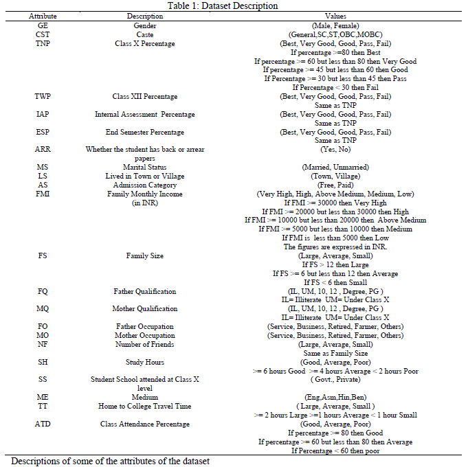
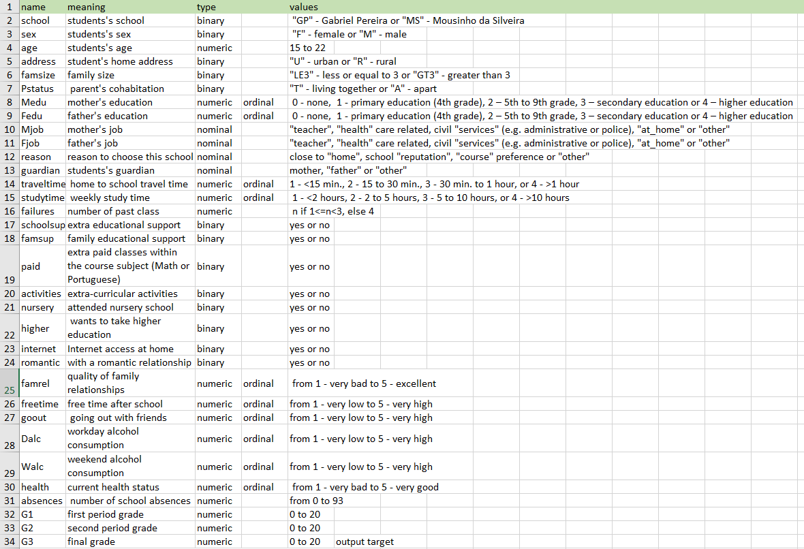
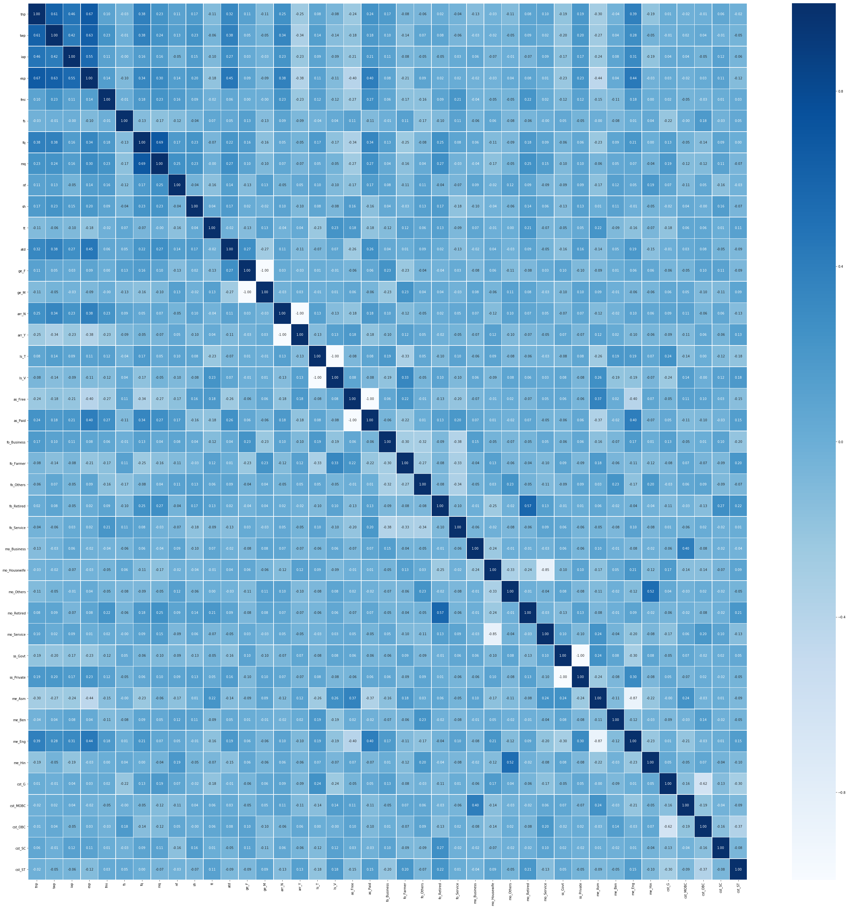
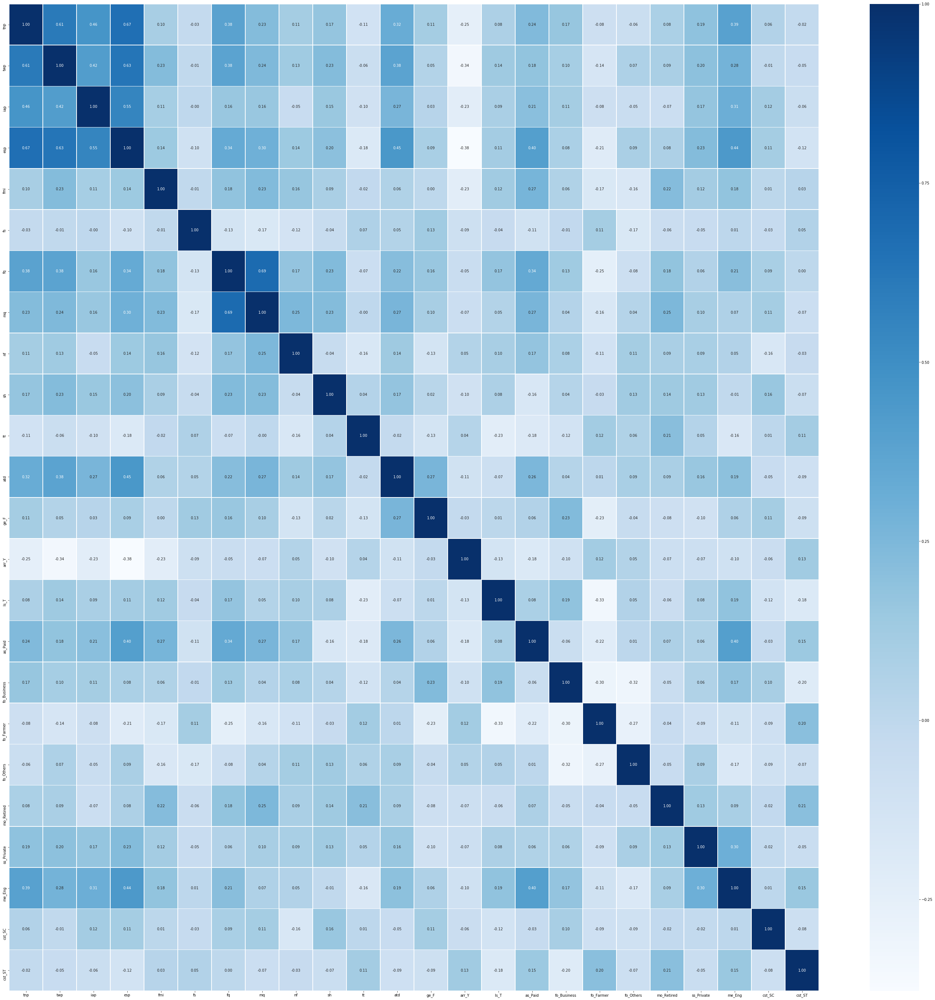
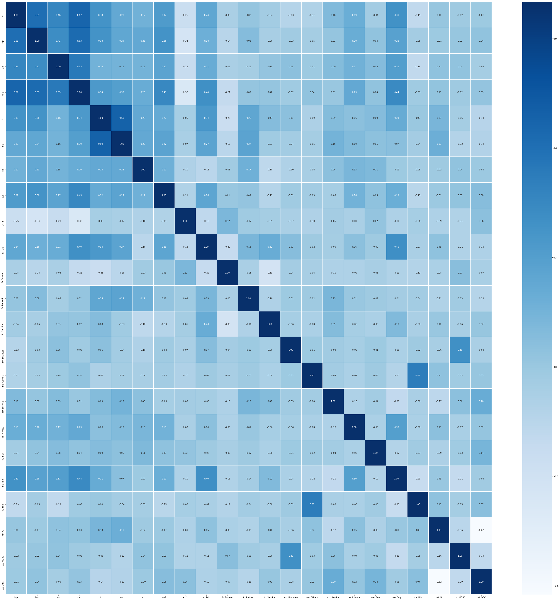
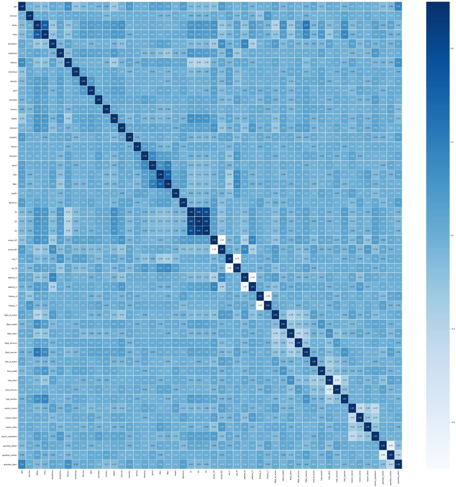

# 프로젝트 설명

* 학생들의 성적 데이터셋 두가지를 이용해 classification 모델을 만드는 것. 


```python
import pandas as pd
import numpy as np
import copy as cp

import math
```

# 데이터 셋 불러오기


```python
stdt_mat = pd.read_csv("student-mat.csv")
stdt_por = pd.read_csv("student-por.csv")
stdt_intersect = pd.read_csv("student_merge_intersect.csv")

stdt_acdm = pd.read_csv("student_academic_performance_dataset.csv", sep="\t")
```


## 데이터 셋 설명

### 1. Student Academics Performance Data Set
==> stdt_acdm에 해당하는 데이터

데이터 셋 크기 : 300

**ESP**에 대해**분류**하는 모델을 만들어야함

https://archive.ics.uci.edu/ml/datasets/Student+Academics+Performance#




### 2. Student Performance Data Set

==> stdt_mat, stdt_pot, stdt_intersect, stdt_union에 해당하는 데이터

https://archive.ics.uci.edu/ml/datasets/Student+Performance

데이터 셋 크기 : 382 / 649(union)

**G3**에 대해 분류하는 모델을 만들어야 하는데, G3의 값의 범위가 20가지이지만 이를 줄여 0~4 --> 1, 5~9 --> 2, ... 이런 식으로 새로 할 수도 있겠으나, 우선 20가지의 성적 등급에 대해 그대로 분류하는 모델을 만들었다





# 데이터 전처리
## 1. Student Academics Performance Data Set


```python
stdt_acdm.columns
```


    Index(['ge', 'cst', 'tnp', 'twp', 'iap', 'esp', 'arr', 'ms', 'ls', 'as', 'fmi',
           'fs', 'fq', 'mq', 'fo', 'mo', 'nf', 'sh', 'ss', 'me', 'tt', 'atd'],
          dtype='object')


### 의미가 전혀 없는 변수 제거- ms

전부 다 결혼하지 않았으므로 ms의 변별력이 없어 제거


```python
if "Married" in stdt_acdm["ms"]:
    print("Married!") #nothing to print
```


```python
del stdt_acdm["ms"]
stdt_acdm.columns
```


    Index(['ge', 'cst', 'tnp', 'twp', 'iap', 'esp', 'arr', 'ls', 'as', 'fmi', 'fs',
           'fq', 'mq', 'fo', 'mo', 'nf', 'sh', 'ss', 'me', 'tt', 'atd'],
          dtype='object')


### 명목형 변수에 대한 더미변수 설정 (one-hot encoding)
분석 과정에서 좀 더 편리하기 위해 전처리 과정에서 더미 변수를 할당해 주었다.


```python
dummy_list = []
nominal_list = ["ge","arr","ls","as","fo","mo","ss","me", "cst"]
for col in nominal_list:
    #mapping = {label:idx for idx, label in 
    #                  enumerate(np.unique(stdt_acdm[col]))}

    #stdt_acdm[col] = stdt_acdm[col].map(mapping)

    dummy_list.append(pd.get_dummies(stdt_acdm[[col]]))

```


```python
stdt_acdm_cate = pd.concat(dummy_list, axis=1)
```


```python
for col in nominal_list:
    del stdt_acdm[col]
stdt_acdm = pd.concat([stdt_acdm, stdt_acdm_cate], axis=1)
```

### 순서형 변수에 대한 순서적인 정수값 매핑


```python
mapping = {
    'Best' : 4,
    'Vg' : 3,
    'Good' : 2,
    'Pass' : 1,
    'Fail' : 0
}

ordi_grade_list = ["tnp", "twp", 'iap', 'esp']
for col in ordi_grade_list:
    stdt_acdm[col] = stdt_acdm[col].map(mapping)

stdt_acdm.head()

```


<div>
<style scoped>
    .dataframe tbody tr th:only-of-type {
        vertical-align: middle;
    }

    .dataframe tbody tr th {
        vertical-align: top;
    }

    .dataframe thead th {
        text-align: right;
    }
</style>
<table border="1" class="dataframe">
  <thead>
    <tr style="text-align: right;">
      <th></th>
      <th>tnp</th>
      <th>twp</th>
      <th>iap</th>
      <th>esp</th>
      <th>fmi</th>
      <th>fs</th>
      <th>fq</th>
      <th>mq</th>
      <th>nf</th>
      <th>sh</th>
      <th>...</th>
      <th>ss_Private</th>
      <th>me_Asm</th>
      <th>me_Ben</th>
      <th>me_Eng</th>
      <th>me_Hin</th>
      <th>cst_G</th>
      <th>cst_MOBC</th>
      <th>cst_OBC</th>
      <th>cst_SC</th>
      <th>cst_ST</th>
    </tr>
  </thead>
  <tbody>
    <tr>
      <th>0</th>
      <td>2</td>
      <td>2</td>
      <td>3</td>
      <td>2</td>
      <td>Medium</td>
      <td>Average</td>
      <td>Um</td>
      <td>10</td>
      <td>Large</td>
      <td>Poor</td>
      <td>...</td>
      <td>0</td>
      <td>1</td>
      <td>0</td>
      <td>0</td>
      <td>0</td>
      <td>1</td>
      <td>0</td>
      <td>0</td>
      <td>0</td>
      <td>0</td>
    </tr>
    <tr>
      <th>1</th>
      <td>3</td>
      <td>3</td>
      <td>3</td>
      <td>3</td>
      <td>Low</td>
      <td>Average</td>
      <td>Um</td>
      <td>Il</td>
      <td>Small</td>
      <td>Poor</td>
      <td>...</td>
      <td>0</td>
      <td>1</td>
      <td>0</td>
      <td>0</td>
      <td>0</td>
      <td>0</td>
      <td>0</td>
      <td>1</td>
      <td>0</td>
      <td>0</td>
    </tr>
    <tr>
      <th>2</th>
      <td>2</td>
      <td>2</td>
      <td>3</td>
      <td>2</td>
      <td>Am</td>
      <td>Average</td>
      <td>12</td>
      <td>10</td>
      <td>Average</td>
      <td>Average</td>
      <td>...</td>
      <td>0</td>
      <td>1</td>
      <td>0</td>
      <td>0</td>
      <td>0</td>
      <td>0</td>
      <td>0</td>
      <td>1</td>
      <td>0</td>
      <td>0</td>
    </tr>
    <tr>
      <th>3</th>
      <td>1</td>
      <td>2</td>
      <td>3</td>
      <td>2</td>
      <td>Medium</td>
      <td>Small</td>
      <td>12</td>
      <td>Um</td>
      <td>Large</td>
      <td>Poor</td>
      <td>...</td>
      <td>0</td>
      <td>1</td>
      <td>0</td>
      <td>0</td>
      <td>0</td>
      <td>0</td>
      <td>1</td>
      <td>0</td>
      <td>0</td>
      <td>0</td>
    </tr>
    <tr>
      <th>4</th>
      <td>2</td>
      <td>2</td>
      <td>3</td>
      <td>3</td>
      <td>Am</td>
      <td>Average</td>
      <td>10</td>
      <td>12</td>
      <td>Large</td>
      <td>Poor</td>
      <td>...</td>
      <td>1</td>
      <td>1</td>
      <td>0</td>
      <td>0</td>
      <td>0</td>
      <td>1</td>
      <td>0</td>
      <td>0</td>
      <td>0</td>
      <td>0</td>
    </tr>
  </tbody>
</table>
<p>5 rows × 41 columns</p>
</div>


```python
mapping = {
    'Good' : 2,
    'Average' : 1,
    'Poor' : 0,
}

ordi_gap_list = ["sh", "atd"]
for col in ordi_gap_list:
    stdt_acdm[col] = stdt_acdm[col].map(mapping)
stdt_acdm.head()

```


<div>
<style scoped>
    .dataframe tbody tr th:only-of-type {
        vertical-align: middle;
    }

    .dataframe tbody tr th {
        vertical-align: top;
    }

    .dataframe thead th {
        text-align: right;
    }
</style>
<table border="1" class="dataframe">
  <thead>
    <tr style="text-align: right;">
      <th></th>
      <th>tnp</th>
      <th>twp</th>
      <th>iap</th>
      <th>esp</th>
      <th>fmi</th>
      <th>fs</th>
      <th>fq</th>
      <th>mq</th>
      <th>nf</th>
      <th>sh</th>
      <th>...</th>
      <th>ss_Private</th>
      <th>me_Asm</th>
      <th>me_Ben</th>
      <th>me_Eng</th>
      <th>me_Hin</th>
      <th>cst_G</th>
      <th>cst_MOBC</th>
      <th>cst_OBC</th>
      <th>cst_SC</th>
      <th>cst_ST</th>
    </tr>
  </thead>
  <tbody>
    <tr>
      <th>0</th>
      <td>2</td>
      <td>2</td>
      <td>3</td>
      <td>2</td>
      <td>Medium</td>
      <td>Average</td>
      <td>Um</td>
      <td>10</td>
      <td>Large</td>
      <td>0</td>
      <td>...</td>
      <td>0</td>
      <td>1</td>
      <td>0</td>
      <td>0</td>
      <td>0</td>
      <td>1</td>
      <td>0</td>
      <td>0</td>
      <td>0</td>
      <td>0</td>
    </tr>
    <tr>
      <th>1</th>
      <td>3</td>
      <td>3</td>
      <td>3</td>
      <td>3</td>
      <td>Low</td>
      <td>Average</td>
      <td>Um</td>
      <td>Il</td>
      <td>Small</td>
      <td>0</td>
      <td>...</td>
      <td>0</td>
      <td>1</td>
      <td>0</td>
      <td>0</td>
      <td>0</td>
      <td>0</td>
      <td>0</td>
      <td>1</td>
      <td>0</td>
      <td>0</td>
    </tr>
    <tr>
      <th>2</th>
      <td>2</td>
      <td>2</td>
      <td>3</td>
      <td>2</td>
      <td>Am</td>
      <td>Average</td>
      <td>12</td>
      <td>10</td>
      <td>Average</td>
      <td>1</td>
      <td>...</td>
      <td>0</td>
      <td>1</td>
      <td>0</td>
      <td>0</td>
      <td>0</td>
      <td>0</td>
      <td>0</td>
      <td>1</td>
      <td>0</td>
      <td>0</td>
    </tr>
    <tr>
      <th>3</th>
      <td>1</td>
      <td>2</td>
      <td>3</td>
      <td>2</td>
      <td>Medium</td>
      <td>Small</td>
      <td>12</td>
      <td>Um</td>
      <td>Large</td>
      <td>0</td>
      <td>...</td>
      <td>0</td>
      <td>1</td>
      <td>0</td>
      <td>0</td>
      <td>0</td>
      <td>0</td>
      <td>1</td>
      <td>0</td>
      <td>0</td>
      <td>0</td>
    </tr>
    <tr>
      <th>4</th>
      <td>2</td>
      <td>2</td>
      <td>3</td>
      <td>3</td>
      <td>Am</td>
      <td>Average</td>
      <td>10</td>
      <td>12</td>
      <td>Large</td>
      <td>0</td>
      <td>...</td>
      <td>1</td>
      <td>1</td>
      <td>0</td>
      <td>0</td>
      <td>0</td>
      <td>1</td>
      <td>0</td>
      <td>0</td>
      <td>0</td>
      <td>0</td>
    </tr>
  </tbody>
</table>
<p>5 rows × 41 columns</p>
</div>


```python
mapping = {
    'Large' : 2,
    'Average' : 1,
    'Small' : 0,
}

ordi_las_list = ["nf", "tt", 'fs']
for col in ordi_las_list:
    stdt_acdm[col] = stdt_acdm[col].map(mapping)
stdt_acdm.head()

```


<div>
<style scoped>
    .dataframe tbody tr th:only-of-type {
        vertical-align: middle;
    }

    .dataframe tbody tr th {
        vertical-align: top;
    }

    .dataframe thead th {
        text-align: right;
    }
</style>
<table border="1" class="dataframe">
  <thead>
    <tr style="text-align: right;">
      <th></th>
      <th>tnp</th>
      <th>twp</th>
      <th>iap</th>
      <th>esp</th>
      <th>fmi</th>
      <th>fs</th>
      <th>fq</th>
      <th>mq</th>
      <th>nf</th>
      <th>sh</th>
      <th>...</th>
      <th>ss_Private</th>
      <th>me_Asm</th>
      <th>me_Ben</th>
      <th>me_Eng</th>
      <th>me_Hin</th>
      <th>cst_G</th>
      <th>cst_MOBC</th>
      <th>cst_OBC</th>
      <th>cst_SC</th>
      <th>cst_ST</th>
    </tr>
  </thead>
  <tbody>
    <tr>
      <th>0</th>
      <td>2</td>
      <td>2</td>
      <td>3</td>
      <td>2</td>
      <td>Medium</td>
      <td>1</td>
      <td>Um</td>
      <td>10</td>
      <td>2</td>
      <td>0</td>
      <td>...</td>
      <td>0</td>
      <td>1</td>
      <td>0</td>
      <td>0</td>
      <td>0</td>
      <td>1</td>
      <td>0</td>
      <td>0</td>
      <td>0</td>
      <td>0</td>
    </tr>
    <tr>
      <th>1</th>
      <td>3</td>
      <td>3</td>
      <td>3</td>
      <td>3</td>
      <td>Low</td>
      <td>1</td>
      <td>Um</td>
      <td>Il</td>
      <td>0</td>
      <td>0</td>
      <td>...</td>
      <td>0</td>
      <td>1</td>
      <td>0</td>
      <td>0</td>
      <td>0</td>
      <td>0</td>
      <td>0</td>
      <td>1</td>
      <td>0</td>
      <td>0</td>
    </tr>
    <tr>
      <th>2</th>
      <td>2</td>
      <td>2</td>
      <td>3</td>
      <td>2</td>
      <td>Am</td>
      <td>1</td>
      <td>12</td>
      <td>10</td>
      <td>1</td>
      <td>1</td>
      <td>...</td>
      <td>0</td>
      <td>1</td>
      <td>0</td>
      <td>0</td>
      <td>0</td>
      <td>0</td>
      <td>0</td>
      <td>1</td>
      <td>0</td>
      <td>0</td>
    </tr>
    <tr>
      <th>3</th>
      <td>1</td>
      <td>2</td>
      <td>3</td>
      <td>2</td>
      <td>Medium</td>
      <td>0</td>
      <td>12</td>
      <td>Um</td>
      <td>2</td>
      <td>0</td>
      <td>...</td>
      <td>0</td>
      <td>1</td>
      <td>0</td>
      <td>0</td>
      <td>0</td>
      <td>0</td>
      <td>1</td>
      <td>0</td>
      <td>0</td>
      <td>0</td>
    </tr>
    <tr>
      <th>4</th>
      <td>2</td>
      <td>2</td>
      <td>3</td>
      <td>3</td>
      <td>Am</td>
      <td>1</td>
      <td>10</td>
      <td>12</td>
      <td>2</td>
      <td>0</td>
      <td>...</td>
      <td>1</td>
      <td>1</td>
      <td>0</td>
      <td>0</td>
      <td>0</td>
      <td>1</td>
      <td>0</td>
      <td>0</td>
      <td>0</td>
      <td>0</td>
    </tr>
  </tbody>
</table>
<p>5 rows × 41 columns</p>
</div>


```python
mapping = {
    'Pg' : 5,
    'Degree' : 4,
    '12' : 3,
    '10' : 2,
    'Um' : 1,
    'Il' : 0
}

ordi_fmq_list = ["fq", "mq"]
for col in ordi_fmq_list:
    stdt_acdm[col] = stdt_acdm[col].map(mapping)
stdt_acdm.head()

```


<div>
<style scoped>
    .dataframe tbody tr th:only-of-type {
        vertical-align: middle;
    }

    .dataframe tbody tr th {
        vertical-align: top;
    }

    .dataframe thead th {
        text-align: right;
    }
</style>
<table border="1" class="dataframe">
  <thead>
    <tr style="text-align: right;">
      <th></th>
      <th>tnp</th>
      <th>twp</th>
      <th>iap</th>
      <th>esp</th>
      <th>fmi</th>
      <th>fs</th>
      <th>fq</th>
      <th>mq</th>
      <th>nf</th>
      <th>sh</th>
      <th>...</th>
      <th>ss_Private</th>
      <th>me_Asm</th>
      <th>me_Ben</th>
      <th>me_Eng</th>
      <th>me_Hin</th>
      <th>cst_G</th>
      <th>cst_MOBC</th>
      <th>cst_OBC</th>
      <th>cst_SC</th>
      <th>cst_ST</th>
    </tr>
  </thead>
  <tbody>
    <tr>
      <th>0</th>
      <td>2</td>
      <td>2</td>
      <td>3</td>
      <td>2</td>
      <td>Medium</td>
      <td>1</td>
      <td>1</td>
      <td>2</td>
      <td>2</td>
      <td>0</td>
      <td>...</td>
      <td>0</td>
      <td>1</td>
      <td>0</td>
      <td>0</td>
      <td>0</td>
      <td>1</td>
      <td>0</td>
      <td>0</td>
      <td>0</td>
      <td>0</td>
    </tr>
    <tr>
      <th>1</th>
      <td>3</td>
      <td>3</td>
      <td>3</td>
      <td>3</td>
      <td>Low</td>
      <td>1</td>
      <td>1</td>
      <td>0</td>
      <td>0</td>
      <td>0</td>
      <td>...</td>
      <td>0</td>
      <td>1</td>
      <td>0</td>
      <td>0</td>
      <td>0</td>
      <td>0</td>
      <td>0</td>
      <td>1</td>
      <td>0</td>
      <td>0</td>
    </tr>
    <tr>
      <th>2</th>
      <td>2</td>
      <td>2</td>
      <td>3</td>
      <td>2</td>
      <td>Am</td>
      <td>1</td>
      <td>3</td>
      <td>2</td>
      <td>1</td>
      <td>1</td>
      <td>...</td>
      <td>0</td>
      <td>1</td>
      <td>0</td>
      <td>0</td>
      <td>0</td>
      <td>0</td>
      <td>0</td>
      <td>1</td>
      <td>0</td>
      <td>0</td>
    </tr>
    <tr>
      <th>3</th>
      <td>1</td>
      <td>2</td>
      <td>3</td>
      <td>2</td>
      <td>Medium</td>
      <td>0</td>
      <td>3</td>
      <td>1</td>
      <td>2</td>
      <td>0</td>
      <td>...</td>
      <td>0</td>
      <td>1</td>
      <td>0</td>
      <td>0</td>
      <td>0</td>
      <td>0</td>
      <td>1</td>
      <td>0</td>
      <td>0</td>
      <td>0</td>
    </tr>
    <tr>
      <th>4</th>
      <td>2</td>
      <td>2</td>
      <td>3</td>
      <td>3</td>
      <td>Am</td>
      <td>1</td>
      <td>2</td>
      <td>3</td>
      <td>2</td>
      <td>0</td>
      <td>...</td>
      <td>1</td>
      <td>1</td>
      <td>0</td>
      <td>0</td>
      <td>0</td>
      <td>1</td>
      <td>0</td>
      <td>0</td>
      <td>0</td>
      <td>0</td>
    </tr>
  </tbody>
</table>
<p>5 rows × 41 columns</p>
</div>


```python
mapping = {
    'Vh' : 4,
    'High' : 3,
    'Am' : 2,
    'Medium' : 1,
    'Low' : 0
}
stdt_acdm["fmi"] = stdt_acdm["fmi"].map(mapping)
stdt_acdm.head()

```


<div>
<style scoped>
    .dataframe tbody tr th:only-of-type {
        vertical-align: middle;
    }

    .dataframe tbody tr th {
        vertical-align: top;
    }

    .dataframe thead th {
        text-align: right;
    }
</style>
<table border="1" class="dataframe">
  <thead>
    <tr style="text-align: right;">
      <th></th>
      <th>tnp</th>
      <th>twp</th>
      <th>iap</th>
      <th>esp</th>
      <th>fmi</th>
      <th>fs</th>
      <th>fq</th>
      <th>mq</th>
      <th>nf</th>
      <th>sh</th>
      <th>...</th>
      <th>ss_Private</th>
      <th>me_Asm</th>
      <th>me_Ben</th>
      <th>me_Eng</th>
      <th>me_Hin</th>
      <th>cst_G</th>
      <th>cst_MOBC</th>
      <th>cst_OBC</th>
      <th>cst_SC</th>
      <th>cst_ST</th>
    </tr>
  </thead>
  <tbody>
    <tr>
      <th>0</th>
      <td>2</td>
      <td>2</td>
      <td>3</td>
      <td>2</td>
      <td>1</td>
      <td>1</td>
      <td>1</td>
      <td>2</td>
      <td>2</td>
      <td>0</td>
      <td>...</td>
      <td>0</td>
      <td>1</td>
      <td>0</td>
      <td>0</td>
      <td>0</td>
      <td>1</td>
      <td>0</td>
      <td>0</td>
      <td>0</td>
      <td>0</td>
    </tr>
    <tr>
      <th>1</th>
      <td>3</td>
      <td>3</td>
      <td>3</td>
      <td>3</td>
      <td>0</td>
      <td>1</td>
      <td>1</td>
      <td>0</td>
      <td>0</td>
      <td>0</td>
      <td>...</td>
      <td>0</td>
      <td>1</td>
      <td>0</td>
      <td>0</td>
      <td>0</td>
      <td>0</td>
      <td>0</td>
      <td>1</td>
      <td>0</td>
      <td>0</td>
    </tr>
    <tr>
      <th>2</th>
      <td>2</td>
      <td>2</td>
      <td>3</td>
      <td>2</td>
      <td>2</td>
      <td>1</td>
      <td>3</td>
      <td>2</td>
      <td>1</td>
      <td>1</td>
      <td>...</td>
      <td>0</td>
      <td>1</td>
      <td>0</td>
      <td>0</td>
      <td>0</td>
      <td>0</td>
      <td>0</td>
      <td>1</td>
      <td>0</td>
      <td>0</td>
    </tr>
    <tr>
      <th>3</th>
      <td>1</td>
      <td>2</td>
      <td>3</td>
      <td>2</td>
      <td>1</td>
      <td>0</td>
      <td>3</td>
      <td>1</td>
      <td>2</td>
      <td>0</td>
      <td>...</td>
      <td>0</td>
      <td>1</td>
      <td>0</td>
      <td>0</td>
      <td>0</td>
      <td>0</td>
      <td>1</td>
      <td>0</td>
      <td>0</td>
      <td>0</td>
    </tr>
    <tr>
      <th>4</th>
      <td>2</td>
      <td>2</td>
      <td>3</td>
      <td>3</td>
      <td>2</td>
      <td>1</td>
      <td>2</td>
      <td>3</td>
      <td>2</td>
      <td>0</td>
      <td>...</td>
      <td>1</td>
      <td>1</td>
      <td>0</td>
      <td>0</td>
      <td>0</td>
      <td>1</td>
      <td>0</td>
      <td>0</td>
      <td>0</td>
      <td>0</td>
    </tr>
  </tbody>
</table>
<p>5 rows × 41 columns</p>
</div>


### 처리된 데이터 저장


```python
stdt_acdm.to_csv("clean_stdt_acdm.csv", header=True, sep=",", index=False)
```

## 2. Student Performance Data Set

### 데이터셋 설명 (위에서 했었음)


```python
stdt_union = pd.concat([stdt_por,stdt_mat],axis=0)
stdt_intersect = cp.copy(stdt_union)

intersect_list = ["school","sex","age","address","famsize","Pstatus","Medu","Fedu","Mjob","Fjob","reason","nursery","internet"]

for colname in stdt_union.columns:
    if colname not in intersect_list:
        del stdt_intersect[colname]
```


```python
stdt_intersect.columns == intersect_list
```


    array([ True,  True,  True,  True,  True,  True,  True,  True,  True,
            True,  True,  True,  True])


```python
print(len(stdt_intersect.columns), "vs" ,len(stdt_union.columns))
```

    13 vs 33
    


```python
for unioncol in stdt_union.columns:
    if unioncol not in stdt_intersect.columns:
        print(unioncol)
```

    guardian
    traveltime
    studytime
    failures
    schoolsup
    famsup
    paid
    activities
    higher
    romantic
    famrel
    freetime
    goout
    Dalc
    Walc
    health
    absences
    G1
    G2
    G3
    

#### dataset에서 rscript로 제공했던 merge된 파일은 의미 있는 변수도 없애버리는 듯함
#### 그냥 단순히 row append한 데이터를 그대로 사용하기로 한다.


```python
stdt_union.head()
```


<div>
<style scoped>
    .dataframe tbody tr th:only-of-type {
        vertical-align: middle;
    }

    .dataframe tbody tr th {
        vertical-align: top;
    }

    .dataframe thead th {
        text-align: right;
    }
</style>
<table border="1" class="dataframe">
  <thead>
    <tr style="text-align: right;">
      <th></th>
      <th>school</th>
      <th>sex</th>
      <th>age</th>
      <th>address</th>
      <th>famsize</th>
      <th>Pstatus</th>
      <th>Medu</th>
      <th>Fedu</th>
      <th>Mjob</th>
      <th>Fjob</th>
      <th>...</th>
      <th>famrel</th>
      <th>freetime</th>
      <th>goout</th>
      <th>Dalc</th>
      <th>Walc</th>
      <th>health</th>
      <th>absences</th>
      <th>G1</th>
      <th>G2</th>
      <th>G3</th>
    </tr>
  </thead>
  <tbody>
    <tr>
      <th>0</th>
      <td>GP</td>
      <td>F</td>
      <td>18</td>
      <td>U</td>
      <td>GT3</td>
      <td>A</td>
      <td>4</td>
      <td>4</td>
      <td>at_home</td>
      <td>teacher</td>
      <td>...</td>
      <td>4</td>
      <td>3</td>
      <td>4</td>
      <td>1</td>
      <td>1</td>
      <td>3</td>
      <td>4</td>
      <td>0</td>
      <td>11</td>
      <td>11</td>
    </tr>
    <tr>
      <th>1</th>
      <td>GP</td>
      <td>F</td>
      <td>17</td>
      <td>U</td>
      <td>GT3</td>
      <td>T</td>
      <td>1</td>
      <td>1</td>
      <td>at_home</td>
      <td>other</td>
      <td>...</td>
      <td>5</td>
      <td>3</td>
      <td>3</td>
      <td>1</td>
      <td>1</td>
      <td>3</td>
      <td>2</td>
      <td>9</td>
      <td>11</td>
      <td>11</td>
    </tr>
    <tr>
      <th>2</th>
      <td>GP</td>
      <td>F</td>
      <td>15</td>
      <td>U</td>
      <td>LE3</td>
      <td>T</td>
      <td>1</td>
      <td>1</td>
      <td>at_home</td>
      <td>other</td>
      <td>...</td>
      <td>4</td>
      <td>3</td>
      <td>2</td>
      <td>2</td>
      <td>3</td>
      <td>3</td>
      <td>6</td>
      <td>12</td>
      <td>13</td>
      <td>12</td>
    </tr>
    <tr>
      <th>3</th>
      <td>GP</td>
      <td>F</td>
      <td>15</td>
      <td>U</td>
      <td>GT3</td>
      <td>T</td>
      <td>4</td>
      <td>2</td>
      <td>health</td>
      <td>services</td>
      <td>...</td>
      <td>3</td>
      <td>2</td>
      <td>2</td>
      <td>1</td>
      <td>1</td>
      <td>5</td>
      <td>0</td>
      <td>14</td>
      <td>14</td>
      <td>14</td>
    </tr>
    <tr>
      <th>4</th>
      <td>GP</td>
      <td>F</td>
      <td>16</td>
      <td>U</td>
      <td>GT3</td>
      <td>T</td>
      <td>3</td>
      <td>3</td>
      <td>other</td>
      <td>other</td>
      <td>...</td>
      <td>4</td>
      <td>3</td>
      <td>2</td>
      <td>1</td>
      <td>2</td>
      <td>5</td>
      <td>0</td>
      <td>11</td>
      <td>13</td>
      <td>13</td>
    </tr>
  </tbody>
</table>
<p>5 rows × 33 columns</p>
</div>


```python
nominal_list = ['school', 'sex', 'address', 'Pstatus', 'Mjob', 'Fjob', 'reason', 'guardian']
dummy_list = []

for col in nominal_list:
    #mapping = {label:idx for idx, label in 
    #                  enumerate(np.unique(stdt_acdm[col]))}

    #stdt_acdm[col] = stdt_acdm[col].map(mapping)

    dummy_list.append(pd.get_dummies(stdt_union[[col]]))

stdt_union_dummy = pd.concat(dummy_list, axis=1)

for col in nominal_list:
    del stdt_union[col]

stdt_union = pd.concat([stdt_union, stdt_union_dummy], axis=1)

stdt_union.head()
```


<div>
<style scoped>
    .dataframe tbody tr th:only-of-type {
        vertical-align: middle;
    }

    .dataframe tbody tr th {
        vertical-align: top;
    }

    .dataframe thead th {
        text-align: right;
    }
</style>
<table border="1" class="dataframe">
  <thead>
    <tr style="text-align: right;">
      <th></th>
      <th>age</th>
      <th>famsize</th>
      <th>Medu</th>
      <th>Fedu</th>
      <th>traveltime</th>
      <th>studytime</th>
      <th>failures</th>
      <th>schoolsup</th>
      <th>famsup</th>
      <th>paid</th>
      <th>...</th>
      <th>Fjob_other</th>
      <th>Fjob_services</th>
      <th>Fjob_teacher</th>
      <th>reason_course</th>
      <th>reason_home</th>
      <th>reason_other</th>
      <th>reason_reputation</th>
      <th>guardian_father</th>
      <th>guardian_mother</th>
      <th>guardian_other</th>
    </tr>
  </thead>
  <tbody>
    <tr>
      <th>0</th>
      <td>18</td>
      <td>GT3</td>
      <td>4</td>
      <td>4</td>
      <td>2</td>
      <td>2</td>
      <td>0</td>
      <td>yes</td>
      <td>no</td>
      <td>no</td>
      <td>...</td>
      <td>0</td>
      <td>0</td>
      <td>1</td>
      <td>1</td>
      <td>0</td>
      <td>0</td>
      <td>0</td>
      <td>0</td>
      <td>1</td>
      <td>0</td>
    </tr>
    <tr>
      <th>1</th>
      <td>17</td>
      <td>GT3</td>
      <td>1</td>
      <td>1</td>
      <td>1</td>
      <td>2</td>
      <td>0</td>
      <td>no</td>
      <td>yes</td>
      <td>no</td>
      <td>...</td>
      <td>1</td>
      <td>0</td>
      <td>0</td>
      <td>1</td>
      <td>0</td>
      <td>0</td>
      <td>0</td>
      <td>1</td>
      <td>0</td>
      <td>0</td>
    </tr>
    <tr>
      <th>2</th>
      <td>15</td>
      <td>LE3</td>
      <td>1</td>
      <td>1</td>
      <td>1</td>
      <td>2</td>
      <td>0</td>
      <td>yes</td>
      <td>no</td>
      <td>no</td>
      <td>...</td>
      <td>1</td>
      <td>0</td>
      <td>0</td>
      <td>0</td>
      <td>0</td>
      <td>1</td>
      <td>0</td>
      <td>0</td>
      <td>1</td>
      <td>0</td>
    </tr>
    <tr>
      <th>3</th>
      <td>15</td>
      <td>GT3</td>
      <td>4</td>
      <td>2</td>
      <td>1</td>
      <td>3</td>
      <td>0</td>
      <td>no</td>
      <td>yes</td>
      <td>no</td>
      <td>...</td>
      <td>0</td>
      <td>1</td>
      <td>0</td>
      <td>0</td>
      <td>1</td>
      <td>0</td>
      <td>0</td>
      <td>0</td>
      <td>1</td>
      <td>0</td>
    </tr>
    <tr>
      <th>4</th>
      <td>16</td>
      <td>GT3</td>
      <td>3</td>
      <td>3</td>
      <td>1</td>
      <td>2</td>
      <td>0</td>
      <td>no</td>
      <td>yes</td>
      <td>no</td>
      <td>...</td>
      <td>1</td>
      <td>0</td>
      <td>0</td>
      <td>0</td>
      <td>1</td>
      <td>0</td>
      <td>0</td>
      <td>1</td>
      <td>0</td>
      <td>0</td>
    </tr>
  </tbody>
</table>
<p>5 rows × 50 columns</p>
</div>


```python
binary_list = ['schoolsup', 'famsup','paid','activities','nursery','higher','internet','romantic']

mapping = {
    'yes' : 1,
    'no' : 0
}

for col in binary_list:
    stdt_union[col] = stdt_union[col].map(mapping)

stdt_union.head()
```


<div>
<style scoped>
    .dataframe tbody tr th:only-of-type {
        vertical-align: middle;
    }

    .dataframe tbody tr th {
        vertical-align: top;
    }

    .dataframe thead th {
        text-align: right;
    }
</style>
<table border="1" class="dataframe">
  <thead>
    <tr style="text-align: right;">
      <th></th>
      <th>age</th>
      <th>famsize</th>
      <th>Medu</th>
      <th>Fedu</th>
      <th>traveltime</th>
      <th>studytime</th>
      <th>failures</th>
      <th>schoolsup</th>
      <th>famsup</th>
      <th>paid</th>
      <th>...</th>
      <th>Fjob_other</th>
      <th>Fjob_services</th>
      <th>Fjob_teacher</th>
      <th>reason_course</th>
      <th>reason_home</th>
      <th>reason_other</th>
      <th>reason_reputation</th>
      <th>guardian_father</th>
      <th>guardian_mother</th>
      <th>guardian_other</th>
    </tr>
  </thead>
  <tbody>
    <tr>
      <th>0</th>
      <td>18</td>
      <td>GT3</td>
      <td>4</td>
      <td>4</td>
      <td>2</td>
      <td>2</td>
      <td>0</td>
      <td>1</td>
      <td>0</td>
      <td>0</td>
      <td>...</td>
      <td>0</td>
      <td>0</td>
      <td>1</td>
      <td>1</td>
      <td>0</td>
      <td>0</td>
      <td>0</td>
      <td>0</td>
      <td>1</td>
      <td>0</td>
    </tr>
    <tr>
      <th>1</th>
      <td>17</td>
      <td>GT3</td>
      <td>1</td>
      <td>1</td>
      <td>1</td>
      <td>2</td>
      <td>0</td>
      <td>0</td>
      <td>1</td>
      <td>0</td>
      <td>...</td>
      <td>1</td>
      <td>0</td>
      <td>0</td>
      <td>1</td>
      <td>0</td>
      <td>0</td>
      <td>0</td>
      <td>1</td>
      <td>0</td>
      <td>0</td>
    </tr>
    <tr>
      <th>2</th>
      <td>15</td>
      <td>LE3</td>
      <td>1</td>
      <td>1</td>
      <td>1</td>
      <td>2</td>
      <td>0</td>
      <td>1</td>
      <td>0</td>
      <td>0</td>
      <td>...</td>
      <td>1</td>
      <td>0</td>
      <td>0</td>
      <td>0</td>
      <td>0</td>
      <td>1</td>
      <td>0</td>
      <td>0</td>
      <td>1</td>
      <td>0</td>
    </tr>
    <tr>
      <th>3</th>
      <td>15</td>
      <td>GT3</td>
      <td>4</td>
      <td>2</td>
      <td>1</td>
      <td>3</td>
      <td>0</td>
      <td>0</td>
      <td>1</td>
      <td>0</td>
      <td>...</td>
      <td>0</td>
      <td>1</td>
      <td>0</td>
      <td>0</td>
      <td>1</td>
      <td>0</td>
      <td>0</td>
      <td>0</td>
      <td>1</td>
      <td>0</td>
    </tr>
    <tr>
      <th>4</th>
      <td>16</td>
      <td>GT3</td>
      <td>3</td>
      <td>3</td>
      <td>1</td>
      <td>2</td>
      <td>0</td>
      <td>0</td>
      <td>1</td>
      <td>0</td>
      <td>...</td>
      <td>1</td>
      <td>0</td>
      <td>0</td>
      <td>0</td>
      <td>1</td>
      <td>0</td>
      <td>0</td>
      <td>1</td>
      <td>0</td>
      <td>0</td>
    </tr>
  </tbody>
</table>
<p>5 rows × 50 columns</p>
</div>


```python
mapping = {
    'GT3' : 1,
    'LE3' : 0
}
stdt_union['famsize'] = stdt_union['famsize'].map(mapping)
stdt_union.head()
```


<div>
<style scoped>
    .dataframe tbody tr th:only-of-type {
        vertical-align: middle;
    }

    .dataframe tbody tr th {
        vertical-align: top;
    }

    .dataframe thead th {
        text-align: right;
    }
</style>
<table border="1" class="dataframe">
  <thead>
    <tr style="text-align: right;">
      <th></th>
      <th>age</th>
      <th>famsize</th>
      <th>Medu</th>
      <th>Fedu</th>
      <th>traveltime</th>
      <th>studytime</th>
      <th>failures</th>
      <th>schoolsup</th>
      <th>famsup</th>
      <th>paid</th>
      <th>...</th>
      <th>Fjob_other</th>
      <th>Fjob_services</th>
      <th>Fjob_teacher</th>
      <th>reason_course</th>
      <th>reason_home</th>
      <th>reason_other</th>
      <th>reason_reputation</th>
      <th>guardian_father</th>
      <th>guardian_mother</th>
      <th>guardian_other</th>
    </tr>
  </thead>
  <tbody>
    <tr>
      <th>0</th>
      <td>18</td>
      <td>1</td>
      <td>4</td>
      <td>4</td>
      <td>2</td>
      <td>2</td>
      <td>0</td>
      <td>1</td>
      <td>0</td>
      <td>0</td>
      <td>...</td>
      <td>0</td>
      <td>0</td>
      <td>1</td>
      <td>1</td>
      <td>0</td>
      <td>0</td>
      <td>0</td>
      <td>0</td>
      <td>1</td>
      <td>0</td>
    </tr>
    <tr>
      <th>1</th>
      <td>17</td>
      <td>1</td>
      <td>1</td>
      <td>1</td>
      <td>1</td>
      <td>2</td>
      <td>0</td>
      <td>0</td>
      <td>1</td>
      <td>0</td>
      <td>...</td>
      <td>1</td>
      <td>0</td>
      <td>0</td>
      <td>1</td>
      <td>0</td>
      <td>0</td>
      <td>0</td>
      <td>1</td>
      <td>0</td>
      <td>0</td>
    </tr>
    <tr>
      <th>2</th>
      <td>15</td>
      <td>0</td>
      <td>1</td>
      <td>1</td>
      <td>1</td>
      <td>2</td>
      <td>0</td>
      <td>1</td>
      <td>0</td>
      <td>0</td>
      <td>...</td>
      <td>1</td>
      <td>0</td>
      <td>0</td>
      <td>0</td>
      <td>0</td>
      <td>1</td>
      <td>0</td>
      <td>0</td>
      <td>1</td>
      <td>0</td>
    </tr>
    <tr>
      <th>3</th>
      <td>15</td>
      <td>1</td>
      <td>4</td>
      <td>2</td>
      <td>1</td>
      <td>3</td>
      <td>0</td>
      <td>0</td>
      <td>1</td>
      <td>0</td>
      <td>...</td>
      <td>0</td>
      <td>1</td>
      <td>0</td>
      <td>0</td>
      <td>1</td>
      <td>0</td>
      <td>0</td>
      <td>0</td>
      <td>1</td>
      <td>0</td>
    </tr>
    <tr>
      <th>4</th>
      <td>16</td>
      <td>1</td>
      <td>3</td>
      <td>3</td>
      <td>1</td>
      <td>2</td>
      <td>0</td>
      <td>0</td>
      <td>1</td>
      <td>0</td>
      <td>...</td>
      <td>1</td>
      <td>0</td>
      <td>0</td>
      <td>0</td>
      <td>1</td>
      <td>0</td>
      <td>0</td>
      <td>1</td>
      <td>0</td>
      <td>0</td>
    </tr>
  </tbody>
</table>
<p>5 rows × 50 columns</p>
</div>


### 처리된 데이터 저장


```python
stdt_union.to_csv("clean_stdt_union.csv", header=True, sep=",", index=False)
```

# EDA

## Feature Selection

## 다중공선성 확인
다중 공선성을 기준으로 변수를 줄이고자 하였다.
### 상관계수 확인
다중공선성을 확인하기 위해 VIF를 계산하는 것은 방식이 어려워 상관계수를 확인하며 상관계수가 지나치게 서로 높은 데이터들 중에서는 둘 중 하나를 삭제하도록 했다.
### 1. Student Academic Performace Data Set


```python
import matplotlib.pyplot as plt 
import seaborn as sns  

```


```python
%matplotlib inline

plt.figure(figsize=(50,50))
sns.heatmap(data = stdt_acdm.corr(), annot=True, 
fmt = '.2f', linewidths=.5, cmap='Blues')
```


    <matplotlib.axes._subplots.AxesSubplot at 0x22d132dce10>





```python
acdm_corr= stdt_acdm.corr()

acdm_corr.where(acdm_corr!=1).where(abs(acdm_corr)>.8).dropna(how='all', axis=1)
```


<div>
<style scoped>
    .dataframe tbody tr th:only-of-type {
        vertical-align: middle;
    }

    .dataframe tbody tr th {
        vertical-align: top;
    }

    .dataframe thead th {
        text-align: right;
    }
</style>
<table border="1" class="dataframe">
  <thead>
    <tr style="text-align: right;">
      <th></th>
      <th>ge_F</th>
      <th>ge_M</th>
      <th>arr_N</th>
      <th>arr_Y</th>
      <th>ls_T</th>
      <th>ls_V</th>
      <th>as_Free</th>
      <th>as_Paid</th>
      <th>mo_Housewife</th>
      <th>mo_Service</th>
      <th>ss_Govt</th>
      <th>ss_Private</th>
      <th>me_Asm</th>
      <th>me_Eng</th>
    </tr>
  </thead>
  <tbody>
    <tr>
      <th>tnp</th>
      <td>NaN</td>
      <td>NaN</td>
      <td>NaN</td>
      <td>NaN</td>
      <td>NaN</td>
      <td>NaN</td>
      <td>NaN</td>
      <td>NaN</td>
      <td>NaN</td>
      <td>NaN</td>
      <td>NaN</td>
      <td>NaN</td>
      <td>NaN</td>
      <td>NaN</td>
    </tr>
    <tr>
      <th>twp</th>
      <td>NaN</td>
      <td>NaN</td>
      <td>NaN</td>
      <td>NaN</td>
      <td>NaN</td>
      <td>NaN</td>
      <td>NaN</td>
      <td>NaN</td>
      <td>NaN</td>
      <td>NaN</td>
      <td>NaN</td>
      <td>NaN</td>
      <td>NaN</td>
      <td>NaN</td>
    </tr>
    <tr>
      <th>iap</th>
      <td>NaN</td>
      <td>NaN</td>
      <td>NaN</td>
      <td>NaN</td>
      <td>NaN</td>
      <td>NaN</td>
      <td>NaN</td>
      <td>NaN</td>
      <td>NaN</td>
      <td>NaN</td>
      <td>NaN</td>
      <td>NaN</td>
      <td>NaN</td>
      <td>NaN</td>
    </tr>
    <tr>
      <th>esp</th>
      <td>NaN</td>
      <td>NaN</td>
      <td>NaN</td>
      <td>NaN</td>
      <td>NaN</td>
      <td>NaN</td>
      <td>NaN</td>
      <td>NaN</td>
      <td>NaN</td>
      <td>NaN</td>
      <td>NaN</td>
      <td>NaN</td>
      <td>NaN</td>
      <td>NaN</td>
    </tr>
    <tr>
      <th>fmi</th>
      <td>NaN</td>
      <td>NaN</td>
      <td>NaN</td>
      <td>NaN</td>
      <td>NaN</td>
      <td>NaN</td>
      <td>NaN</td>
      <td>NaN</td>
      <td>NaN</td>
      <td>NaN</td>
      <td>NaN</td>
      <td>NaN</td>
      <td>NaN</td>
      <td>NaN</td>
    </tr>
    <tr>
      <th>fs</th>
      <td>NaN</td>
      <td>NaN</td>
      <td>NaN</td>
      <td>NaN</td>
      <td>NaN</td>
      <td>NaN</td>
      <td>NaN</td>
      <td>NaN</td>
      <td>NaN</td>
      <td>NaN</td>
      <td>NaN</td>
      <td>NaN</td>
      <td>NaN</td>
      <td>NaN</td>
    </tr>
    <tr>
      <th>fq</th>
      <td>NaN</td>
      <td>NaN</td>
      <td>NaN</td>
      <td>NaN</td>
      <td>NaN</td>
      <td>NaN</td>
      <td>NaN</td>
      <td>NaN</td>
      <td>NaN</td>
      <td>NaN</td>
      <td>NaN</td>
      <td>NaN</td>
      <td>NaN</td>
      <td>NaN</td>
    </tr>
    <tr>
      <th>mq</th>
      <td>NaN</td>
      <td>NaN</td>
      <td>NaN</td>
      <td>NaN</td>
      <td>NaN</td>
      <td>NaN</td>
      <td>NaN</td>
      <td>NaN</td>
      <td>NaN</td>
      <td>NaN</td>
      <td>NaN</td>
      <td>NaN</td>
      <td>NaN</td>
      <td>NaN</td>
    </tr>
    <tr>
      <th>nf</th>
      <td>NaN</td>
      <td>NaN</td>
      <td>NaN</td>
      <td>NaN</td>
      <td>NaN</td>
      <td>NaN</td>
      <td>NaN</td>
      <td>NaN</td>
      <td>NaN</td>
      <td>NaN</td>
      <td>NaN</td>
      <td>NaN</td>
      <td>NaN</td>
      <td>NaN</td>
    </tr>
    <tr>
      <th>sh</th>
      <td>NaN</td>
      <td>NaN</td>
      <td>NaN</td>
      <td>NaN</td>
      <td>NaN</td>
      <td>NaN</td>
      <td>NaN</td>
      <td>NaN</td>
      <td>NaN</td>
      <td>NaN</td>
      <td>NaN</td>
      <td>NaN</td>
      <td>NaN</td>
      <td>NaN</td>
    </tr>
    <tr>
      <th>tt</th>
      <td>NaN</td>
      <td>NaN</td>
      <td>NaN</td>
      <td>NaN</td>
      <td>NaN</td>
      <td>NaN</td>
      <td>NaN</td>
      <td>NaN</td>
      <td>NaN</td>
      <td>NaN</td>
      <td>NaN</td>
      <td>NaN</td>
      <td>NaN</td>
      <td>NaN</td>
    </tr>
    <tr>
      <th>atd</th>
      <td>NaN</td>
      <td>NaN</td>
      <td>NaN</td>
      <td>NaN</td>
      <td>NaN</td>
      <td>NaN</td>
      <td>NaN</td>
      <td>NaN</td>
      <td>NaN</td>
      <td>NaN</td>
      <td>NaN</td>
      <td>NaN</td>
      <td>NaN</td>
      <td>NaN</td>
    </tr>
    <tr>
      <th>ge_F</th>
      <td>NaN</td>
      <td>-1.0</td>
      <td>NaN</td>
      <td>NaN</td>
      <td>NaN</td>
      <td>NaN</td>
      <td>NaN</td>
      <td>NaN</td>
      <td>NaN</td>
      <td>NaN</td>
      <td>NaN</td>
      <td>NaN</td>
      <td>NaN</td>
      <td>NaN</td>
    </tr>
    <tr>
      <th>ge_M</th>
      <td>-1.0</td>
      <td>NaN</td>
      <td>NaN</td>
      <td>NaN</td>
      <td>NaN</td>
      <td>NaN</td>
      <td>NaN</td>
      <td>NaN</td>
      <td>NaN</td>
      <td>NaN</td>
      <td>NaN</td>
      <td>NaN</td>
      <td>NaN</td>
      <td>NaN</td>
    </tr>
    <tr>
      <th>arr_N</th>
      <td>NaN</td>
      <td>NaN</td>
      <td>NaN</td>
      <td>-1.0</td>
      <td>NaN</td>
      <td>NaN</td>
      <td>NaN</td>
      <td>NaN</td>
      <td>NaN</td>
      <td>NaN</td>
      <td>NaN</td>
      <td>NaN</td>
      <td>NaN</td>
      <td>NaN</td>
    </tr>
    <tr>
      <th>arr_Y</th>
      <td>NaN</td>
      <td>NaN</td>
      <td>-1.0</td>
      <td>NaN</td>
      <td>NaN</td>
      <td>NaN</td>
      <td>NaN</td>
      <td>NaN</td>
      <td>NaN</td>
      <td>NaN</td>
      <td>NaN</td>
      <td>NaN</td>
      <td>NaN</td>
      <td>NaN</td>
    </tr>
    <tr>
      <th>ls_T</th>
      <td>NaN</td>
      <td>NaN</td>
      <td>NaN</td>
      <td>NaN</td>
      <td>NaN</td>
      <td>-1.0</td>
      <td>NaN</td>
      <td>NaN</td>
      <td>NaN</td>
      <td>NaN</td>
      <td>NaN</td>
      <td>NaN</td>
      <td>NaN</td>
      <td>NaN</td>
    </tr>
    <tr>
      <th>ls_V</th>
      <td>NaN</td>
      <td>NaN</td>
      <td>NaN</td>
      <td>NaN</td>
      <td>-1.0</td>
      <td>NaN</td>
      <td>NaN</td>
      <td>NaN</td>
      <td>NaN</td>
      <td>NaN</td>
      <td>NaN</td>
      <td>NaN</td>
      <td>NaN</td>
      <td>NaN</td>
    </tr>
    <tr>
      <th>as_Free</th>
      <td>NaN</td>
      <td>NaN</td>
      <td>NaN</td>
      <td>NaN</td>
      <td>NaN</td>
      <td>NaN</td>
      <td>NaN</td>
      <td>-1.0</td>
      <td>NaN</td>
      <td>NaN</td>
      <td>NaN</td>
      <td>NaN</td>
      <td>NaN</td>
      <td>NaN</td>
    </tr>
    <tr>
      <th>as_Paid</th>
      <td>NaN</td>
      <td>NaN</td>
      <td>NaN</td>
      <td>NaN</td>
      <td>NaN</td>
      <td>NaN</td>
      <td>-1.0</td>
      <td>NaN</td>
      <td>NaN</td>
      <td>NaN</td>
      <td>NaN</td>
      <td>NaN</td>
      <td>NaN</td>
      <td>NaN</td>
    </tr>
    <tr>
      <th>fo_Business</th>
      <td>NaN</td>
      <td>NaN</td>
      <td>NaN</td>
      <td>NaN</td>
      <td>NaN</td>
      <td>NaN</td>
      <td>NaN</td>
      <td>NaN</td>
      <td>NaN</td>
      <td>NaN</td>
      <td>NaN</td>
      <td>NaN</td>
      <td>NaN</td>
      <td>NaN</td>
    </tr>
    <tr>
      <th>fo_Farmer</th>
      <td>NaN</td>
      <td>NaN</td>
      <td>NaN</td>
      <td>NaN</td>
      <td>NaN</td>
      <td>NaN</td>
      <td>NaN</td>
      <td>NaN</td>
      <td>NaN</td>
      <td>NaN</td>
      <td>NaN</td>
      <td>NaN</td>
      <td>NaN</td>
      <td>NaN</td>
    </tr>
    <tr>
      <th>fo_Others</th>
      <td>NaN</td>
      <td>NaN</td>
      <td>NaN</td>
      <td>NaN</td>
      <td>NaN</td>
      <td>NaN</td>
      <td>NaN</td>
      <td>NaN</td>
      <td>NaN</td>
      <td>NaN</td>
      <td>NaN</td>
      <td>NaN</td>
      <td>NaN</td>
      <td>NaN</td>
    </tr>
    <tr>
      <th>fo_Retired</th>
      <td>NaN</td>
      <td>NaN</td>
      <td>NaN</td>
      <td>NaN</td>
      <td>NaN</td>
      <td>NaN</td>
      <td>NaN</td>
      <td>NaN</td>
      <td>NaN</td>
      <td>NaN</td>
      <td>NaN</td>
      <td>NaN</td>
      <td>NaN</td>
      <td>NaN</td>
    </tr>
    <tr>
      <th>fo_Service</th>
      <td>NaN</td>
      <td>NaN</td>
      <td>NaN</td>
      <td>NaN</td>
      <td>NaN</td>
      <td>NaN</td>
      <td>NaN</td>
      <td>NaN</td>
      <td>NaN</td>
      <td>NaN</td>
      <td>NaN</td>
      <td>NaN</td>
      <td>NaN</td>
      <td>NaN</td>
    </tr>
    <tr>
      <th>mo_Business</th>
      <td>NaN</td>
      <td>NaN</td>
      <td>NaN</td>
      <td>NaN</td>
      <td>NaN</td>
      <td>NaN</td>
      <td>NaN</td>
      <td>NaN</td>
      <td>NaN</td>
      <td>NaN</td>
      <td>NaN</td>
      <td>NaN</td>
      <td>NaN</td>
      <td>NaN</td>
    </tr>
    <tr>
      <th>mo_Housewife</th>
      <td>NaN</td>
      <td>NaN</td>
      <td>NaN</td>
      <td>NaN</td>
      <td>NaN</td>
      <td>NaN</td>
      <td>NaN</td>
      <td>NaN</td>
      <td>NaN</td>
      <td>-0.851346</td>
      <td>NaN</td>
      <td>NaN</td>
      <td>NaN</td>
      <td>NaN</td>
    </tr>
    <tr>
      <th>mo_Others</th>
      <td>NaN</td>
      <td>NaN</td>
      <td>NaN</td>
      <td>NaN</td>
      <td>NaN</td>
      <td>NaN</td>
      <td>NaN</td>
      <td>NaN</td>
      <td>NaN</td>
      <td>NaN</td>
      <td>NaN</td>
      <td>NaN</td>
      <td>NaN</td>
      <td>NaN</td>
    </tr>
    <tr>
      <th>mo_Retired</th>
      <td>NaN</td>
      <td>NaN</td>
      <td>NaN</td>
      <td>NaN</td>
      <td>NaN</td>
      <td>NaN</td>
      <td>NaN</td>
      <td>NaN</td>
      <td>NaN</td>
      <td>NaN</td>
      <td>NaN</td>
      <td>NaN</td>
      <td>NaN</td>
      <td>NaN</td>
    </tr>
    <tr>
      <th>mo_Service</th>
      <td>NaN</td>
      <td>NaN</td>
      <td>NaN</td>
      <td>NaN</td>
      <td>NaN</td>
      <td>NaN</td>
      <td>NaN</td>
      <td>NaN</td>
      <td>-0.851346</td>
      <td>NaN</td>
      <td>NaN</td>
      <td>NaN</td>
      <td>NaN</td>
      <td>NaN</td>
    </tr>
    <tr>
      <th>ss_Govt</th>
      <td>NaN</td>
      <td>NaN</td>
      <td>NaN</td>
      <td>NaN</td>
      <td>NaN</td>
      <td>NaN</td>
      <td>NaN</td>
      <td>NaN</td>
      <td>NaN</td>
      <td>NaN</td>
      <td>NaN</td>
      <td>-1.0</td>
      <td>NaN</td>
      <td>NaN</td>
    </tr>
    <tr>
      <th>ss_Private</th>
      <td>NaN</td>
      <td>NaN</td>
      <td>NaN</td>
      <td>NaN</td>
      <td>NaN</td>
      <td>NaN</td>
      <td>NaN</td>
      <td>NaN</td>
      <td>NaN</td>
      <td>NaN</td>
      <td>-1.0</td>
      <td>NaN</td>
      <td>NaN</td>
      <td>NaN</td>
    </tr>
    <tr>
      <th>me_Asm</th>
      <td>NaN</td>
      <td>NaN</td>
      <td>NaN</td>
      <td>NaN</td>
      <td>NaN</td>
      <td>NaN</td>
      <td>NaN</td>
      <td>NaN</td>
      <td>NaN</td>
      <td>NaN</td>
      <td>NaN</td>
      <td>NaN</td>
      <td>NaN</td>
      <td>-0.8714</td>
    </tr>
    <tr>
      <th>me_Ben</th>
      <td>NaN</td>
      <td>NaN</td>
      <td>NaN</td>
      <td>NaN</td>
      <td>NaN</td>
      <td>NaN</td>
      <td>NaN</td>
      <td>NaN</td>
      <td>NaN</td>
      <td>NaN</td>
      <td>NaN</td>
      <td>NaN</td>
      <td>NaN</td>
      <td>NaN</td>
    </tr>
    <tr>
      <th>me_Eng</th>
      <td>NaN</td>
      <td>NaN</td>
      <td>NaN</td>
      <td>NaN</td>
      <td>NaN</td>
      <td>NaN</td>
      <td>NaN</td>
      <td>NaN</td>
      <td>NaN</td>
      <td>NaN</td>
      <td>NaN</td>
      <td>NaN</td>
      <td>-0.8714</td>
      <td>NaN</td>
    </tr>
    <tr>
      <th>me_Hin</th>
      <td>NaN</td>
      <td>NaN</td>
      <td>NaN</td>
      <td>NaN</td>
      <td>NaN</td>
      <td>NaN</td>
      <td>NaN</td>
      <td>NaN</td>
      <td>NaN</td>
      <td>NaN</td>
      <td>NaN</td>
      <td>NaN</td>
      <td>NaN</td>
      <td>NaN</td>
    </tr>
    <tr>
      <th>cst_G</th>
      <td>NaN</td>
      <td>NaN</td>
      <td>NaN</td>
      <td>NaN</td>
      <td>NaN</td>
      <td>NaN</td>
      <td>NaN</td>
      <td>NaN</td>
      <td>NaN</td>
      <td>NaN</td>
      <td>NaN</td>
      <td>NaN</td>
      <td>NaN</td>
      <td>NaN</td>
    </tr>
    <tr>
      <th>cst_MOBC</th>
      <td>NaN</td>
      <td>NaN</td>
      <td>NaN</td>
      <td>NaN</td>
      <td>NaN</td>
      <td>NaN</td>
      <td>NaN</td>
      <td>NaN</td>
      <td>NaN</td>
      <td>NaN</td>
      <td>NaN</td>
      <td>NaN</td>
      <td>NaN</td>
      <td>NaN</td>
    </tr>
    <tr>
      <th>cst_OBC</th>
      <td>NaN</td>
      <td>NaN</td>
      <td>NaN</td>
      <td>NaN</td>
      <td>NaN</td>
      <td>NaN</td>
      <td>NaN</td>
      <td>NaN</td>
      <td>NaN</td>
      <td>NaN</td>
      <td>NaN</td>
      <td>NaN</td>
      <td>NaN</td>
      <td>NaN</td>
    </tr>
    <tr>
      <th>cst_SC</th>
      <td>NaN</td>
      <td>NaN</td>
      <td>NaN</td>
      <td>NaN</td>
      <td>NaN</td>
      <td>NaN</td>
      <td>NaN</td>
      <td>NaN</td>
      <td>NaN</td>
      <td>NaN</td>
      <td>NaN</td>
      <td>NaN</td>
      <td>NaN</td>
      <td>NaN</td>
    </tr>
    <tr>
      <th>cst_ST</th>
      <td>NaN</td>
      <td>NaN</td>
      <td>NaN</td>
      <td>NaN</td>
      <td>NaN</td>
      <td>NaN</td>
      <td>NaN</td>
      <td>NaN</td>
      <td>NaN</td>
      <td>NaN</td>
      <td>NaN</td>
      <td>NaN</td>
      <td>NaN</td>
      <td>NaN</td>
    </tr>
  </tbody>
</table>
</div>


### -1.0뜬 것들은 둘중 하나 삭제

* mother의 직업이 housewife이면 service에 종사할 확률이 극히 낮다
* me가 Eng이면 me가 Asm일 확률이 극히 낮다

### ==> 저 두가지는 정말 잘 반대되는 성향. 둘중 하나만 선택하는 것 고려 가능

### 현재까지 acdm에서 삭제대상으로 고려되는 feature
1. ge_M
2. arr_N
3. ls_V
4. as_Free
5. mo_Housewife (-.851)
6. ss_Govt
7. me_Asm (-.8714)

### 예측할 변수와 관련이 없어서 제거해도 될 것 같은 변수 추려내기


```python
corr_df = stdt_acdm.corr()
#corr_df.where(abs(corr_df)<.1)

corr_df['esp'].where(abs(corr_df['esp'])<0.05)
```


    tnp                  NaN
    twp                  NaN
    iap                  NaN
    esp                  NaN
    fmi                  NaN
    fs                   NaN
    fq                   NaN
    mq                   NaN
    nf                   NaN
    sh                   NaN
    tt                   NaN
    atd                  NaN
    ge_F                 NaN
    ge_M                 NaN
    arr_N                NaN
    arr_Y                NaN
    ls_T                 NaN
    ls_V                 NaN
    as_Free              NaN
    as_Paid              NaN
    fo_Business          NaN
    fo_Farmer            NaN
    fo_Others            NaN
    fo_Retired      0.017506
    fo_Service      0.020046
    mo_Business    -0.024545
    mo_Housewife   -0.033463
    mo_Others       0.038781
    mo_Retired           NaN
    mo_Service      0.005017
    ss_Govt              NaN
    ss_Private           NaN
    me_Asm               NaN
    me_Ben          0.038781
    me_Eng               NaN
    me_Hin         -0.026352
    cst_G           0.030350
    cst_MOBC       -0.018130
    cst_OBC         0.027523
    cst_SC               NaN
    cst_ST               NaN
    Name: esp, dtype: float64


### 현재까지 acdm에서 삭제대상으로 고려되는 feature
1. ge_M
2. arr_N
3. ls_V
4. as_Free
5. mo_Housewife (-.851)
6. ss_Govt
7. me_Asm (-.8714)
---
8. fo_Retired      0.017506
9. fo_Service      0.020046
10. mo_Business    -0.024545
11. mo_Housewife   -0.033463
12. mo_Others       0.038781
13. mo_Service      0.005017
14. me_Ben          0.038781
15. me_Hin         -0.026352
16. cst_G           0.030350
17. cst_MOBC       -0.018130
18. cst_OBC         0.027523


### binary인 경우는 전처리 실패라서 지금 바로 삭제


```python
cols = ['ge_M', 'arr_N', 'ls_V', 'as_Free', 'ss_Govt', 'mo_Housewife', 'me_Asm']
for col in cols:
    del stdt_acdm[col]
```

### 현재까지 acdm에서 삭제대상으로 고려되는 feature


* fo_Retired      0.017506
* fo_Service      0.020046
* mo_Business    -0.024545
* mo_Others       0.038781
* mo_Service      0.005017
* me_Ben          0.038781
* me_Hin         -0.026352
* cst_G           0.030350
* cst_MOBC       -0.018130
* cst_OBC         0.027523


### 위의 것까지 삭제한 데이터 생성


```python
stdt_acdm_reducted = cp.copy(stdt_acdm)
cols = [
"fo_Retired",
"fo_Service",
"mo_Business",
'mo_Others',
'mo_Service',
'me_Ben',
'me_Hin',
'cst_G',
'cst_MOBC',
'cst_OBC']
for col in cols:
    del stdt_acdm_reducted[col]
stdt_acdm_reducted.to_csv('reducted_stdt_acdm.csv', header=True, index=False)
```


```python
%matplotlib inline

plt.figure(figsize=(50,50))
sns.heatmap(data = stdt_acdm_reducted.corr(), annot=True, 
fmt = '.2f', linewidths=.5, cmap='Blues')
```


    <matplotlib.axes._subplots.AxesSubplot at 0x22d16c95668>





### 예측변수와 관련이 지나치게 적은 feature 삭제


```python
corr_df = stdt_acdm_reducted.corr()
#corr_df.where(abs(corr_df)<.1)

corr_df['esp'].where(abs(corr_df['esp'])<0.20)
#corr_df['esp']
```


    tnp                 NaN
    twp                 NaN
    iap                 NaN
    esp                 NaN
    fmi            0.140645
    fs            -0.097024
    fq                  NaN
    mq                  NaN
    nf             0.141181
    sh                  NaN
    tt            -0.183726
    atd                 NaN
    ge_F           0.091418
    arr_Y               NaN
    ls_T           0.113939
    as_Paid             NaN
    fo_Business    0.081430
    fo_Farmer           NaN
    fo_Others      0.089966
    mo_Retired     0.079178
    ss_Private          NaN
    me_Eng              NaN
    cst_SC         0.107745
    cst_ST        -0.118794
    Name: esp, dtype: float64


### 예측변수인 esp와 지나치게 관련이 적은 feature의 목록

* fmi            0.140645
* fs            -0.097024
* nf             0.141181
* tt            -0.183726
* ge_F           0.091418
* ls_T           0.113939
* fo_Business    0.081430
* fo_Others      0.089966
* mo_Retired     0.079178
* cst_SC         0.107745
* cst_ST        -0.118794

### 이에 대해서도 삭제를 수행한 데이터를 저장하도록 한다.


```python


stdt_acdm_reducted_2 = cp.copy(stdt_acdm)
cols = ['fmi',
        'fs',
        'nf',
        'tt',
        'ge_F',
        'ls_T',
        'fo_Business',
        'fo_Others',
        'mo_Retired',
        'cst_SC',
        'cst_ST'
]
for col in cols:
    del stdt_acdm_reducted_2[col]

```


```python
%matplotlib inline

plt.figure(figsize=(50,50))
sns.heatmap(data = stdt_acdm_reducted_2.corr(), annot=True, 
fmt = '.2f', linewidths=.5, cmap='Blues')
```


    <matplotlib.axes._subplots.AxesSubplot at 0x22d16c63198>





```python
stdt_acdm_reducted_2.corr()['esp']
```


    tnp            0.665497
    twp            0.630393
    iap            0.548757
    esp            1.000000
    fq             0.335856
    mq             0.297703
    sh             0.201486
    atd            0.448912
    arr_Y         -0.377838
    as_Paid        0.402703
    fo_Farmer     -0.209548
    fo_Retired     0.017506
    fo_Service     0.020046
    mo_Business   -0.024545
    mo_Others      0.038781
    mo_Service     0.005017
    ss_Private     0.226095
    me_Ben         0.038781
    me_Eng         0.439885
    me_Hin        -0.026352
    cst_G          0.030350
    cst_MOBC      -0.018130
    cst_OBC        0.027523
    Name: esp, dtype: float64


### 2. Student Performance Data Set


```python
%matplotlib inline

plt.figure(figsize=(50,50))
sns.heatmap(data = stdt_union.corr(), annot=True, 
fmt = '.2f', linewidths=.5, cmap='Blues')
```


    <matplotlib.axes._subplots.AxesSubplot at 0x22d15490748>





```python
acdm_corr= stdt_union.corr()
acdm_corr.where(acdm_corr!=1).where(abs(acdm_corr)>.8).dropna(how='all', axis=1)
```


<div>
<style scoped>
    .dataframe tbody tr th:only-of-type {
        vertical-align: middle;
    }

    .dataframe tbody tr th {
        vertical-align: top;
    }

    .dataframe thead th {
        text-align: right;
    }
</style>
<table border="1" class="dataframe">
  <thead>
    <tr style="text-align: right;">
      <th></th>
      <th>G1</th>
      <th>G2</th>
      <th>G3</th>
      <th>school_GP</th>
      <th>school_MS</th>
      <th>sex_F</th>
      <th>sex_M</th>
      <th>address_R</th>
      <th>address_U</th>
      <th>Pstatus_A</th>
      <th>Pstatus_T</th>
      <th>guardian_father</th>
      <th>guardian_mother</th>
    </tr>
  </thead>
  <tbody>
    <tr>
      <th>age</th>
      <td>NaN</td>
      <td>NaN</td>
      <td>NaN</td>
      <td>NaN</td>
      <td>NaN</td>
      <td>NaN</td>
      <td>NaN</td>
      <td>NaN</td>
      <td>NaN</td>
      <td>NaN</td>
      <td>NaN</td>
      <td>NaN</td>
      <td>NaN</td>
    </tr>
    <tr>
      <th>famsize</th>
      <td>NaN</td>
      <td>NaN</td>
      <td>NaN</td>
      <td>NaN</td>
      <td>NaN</td>
      <td>NaN</td>
      <td>NaN</td>
      <td>NaN</td>
      <td>NaN</td>
      <td>NaN</td>
      <td>NaN</td>
      <td>NaN</td>
      <td>NaN</td>
    </tr>
    <tr>
      <th>Medu</th>
      <td>NaN</td>
      <td>NaN</td>
      <td>NaN</td>
      <td>NaN</td>
      <td>NaN</td>
      <td>NaN</td>
      <td>NaN</td>
      <td>NaN</td>
      <td>NaN</td>
      <td>NaN</td>
      <td>NaN</td>
      <td>NaN</td>
      <td>NaN</td>
    </tr>
    <tr>
      <th>Fedu</th>
      <td>NaN</td>
      <td>NaN</td>
      <td>NaN</td>
      <td>NaN</td>
      <td>NaN</td>
      <td>NaN</td>
      <td>NaN</td>
      <td>NaN</td>
      <td>NaN</td>
      <td>NaN</td>
      <td>NaN</td>
      <td>NaN</td>
      <td>NaN</td>
    </tr>
    <tr>
      <th>traveltime</th>
      <td>NaN</td>
      <td>NaN</td>
      <td>NaN</td>
      <td>NaN</td>
      <td>NaN</td>
      <td>NaN</td>
      <td>NaN</td>
      <td>NaN</td>
      <td>NaN</td>
      <td>NaN</td>
      <td>NaN</td>
      <td>NaN</td>
      <td>NaN</td>
    </tr>
    <tr>
      <th>studytime</th>
      <td>NaN</td>
      <td>NaN</td>
      <td>NaN</td>
      <td>NaN</td>
      <td>NaN</td>
      <td>NaN</td>
      <td>NaN</td>
      <td>NaN</td>
      <td>NaN</td>
      <td>NaN</td>
      <td>NaN</td>
      <td>NaN</td>
      <td>NaN</td>
    </tr>
    <tr>
      <th>failures</th>
      <td>NaN</td>
      <td>NaN</td>
      <td>NaN</td>
      <td>NaN</td>
      <td>NaN</td>
      <td>NaN</td>
      <td>NaN</td>
      <td>NaN</td>
      <td>NaN</td>
      <td>NaN</td>
      <td>NaN</td>
      <td>NaN</td>
      <td>NaN</td>
    </tr>
    <tr>
      <th>schoolsup</th>
      <td>NaN</td>
      <td>NaN</td>
      <td>NaN</td>
      <td>NaN</td>
      <td>NaN</td>
      <td>NaN</td>
      <td>NaN</td>
      <td>NaN</td>
      <td>NaN</td>
      <td>NaN</td>
      <td>NaN</td>
      <td>NaN</td>
      <td>NaN</td>
    </tr>
    <tr>
      <th>famsup</th>
      <td>NaN</td>
      <td>NaN</td>
      <td>NaN</td>
      <td>NaN</td>
      <td>NaN</td>
      <td>NaN</td>
      <td>NaN</td>
      <td>NaN</td>
      <td>NaN</td>
      <td>NaN</td>
      <td>NaN</td>
      <td>NaN</td>
      <td>NaN</td>
    </tr>
    <tr>
      <th>paid</th>
      <td>NaN</td>
      <td>NaN</td>
      <td>NaN</td>
      <td>NaN</td>
      <td>NaN</td>
      <td>NaN</td>
      <td>NaN</td>
      <td>NaN</td>
      <td>NaN</td>
      <td>NaN</td>
      <td>NaN</td>
      <td>NaN</td>
      <td>NaN</td>
    </tr>
    <tr>
      <th>activities</th>
      <td>NaN</td>
      <td>NaN</td>
      <td>NaN</td>
      <td>NaN</td>
      <td>NaN</td>
      <td>NaN</td>
      <td>NaN</td>
      <td>NaN</td>
      <td>NaN</td>
      <td>NaN</td>
      <td>NaN</td>
      <td>NaN</td>
      <td>NaN</td>
    </tr>
    <tr>
      <th>nursery</th>
      <td>NaN</td>
      <td>NaN</td>
      <td>NaN</td>
      <td>NaN</td>
      <td>NaN</td>
      <td>NaN</td>
      <td>NaN</td>
      <td>NaN</td>
      <td>NaN</td>
      <td>NaN</td>
      <td>NaN</td>
      <td>NaN</td>
      <td>NaN</td>
    </tr>
    <tr>
      <th>higher</th>
      <td>NaN</td>
      <td>NaN</td>
      <td>NaN</td>
      <td>NaN</td>
      <td>NaN</td>
      <td>NaN</td>
      <td>NaN</td>
      <td>NaN</td>
      <td>NaN</td>
      <td>NaN</td>
      <td>NaN</td>
      <td>NaN</td>
      <td>NaN</td>
    </tr>
    <tr>
      <th>internet</th>
      <td>NaN</td>
      <td>NaN</td>
      <td>NaN</td>
      <td>NaN</td>
      <td>NaN</td>
      <td>NaN</td>
      <td>NaN</td>
      <td>NaN</td>
      <td>NaN</td>
      <td>NaN</td>
      <td>NaN</td>
      <td>NaN</td>
      <td>NaN</td>
    </tr>
    <tr>
      <th>romantic</th>
      <td>NaN</td>
      <td>NaN</td>
      <td>NaN</td>
      <td>NaN</td>
      <td>NaN</td>
      <td>NaN</td>
      <td>NaN</td>
      <td>NaN</td>
      <td>NaN</td>
      <td>NaN</td>
      <td>NaN</td>
      <td>NaN</td>
      <td>NaN</td>
    </tr>
    <tr>
      <th>famrel</th>
      <td>NaN</td>
      <td>NaN</td>
      <td>NaN</td>
      <td>NaN</td>
      <td>NaN</td>
      <td>NaN</td>
      <td>NaN</td>
      <td>NaN</td>
      <td>NaN</td>
      <td>NaN</td>
      <td>NaN</td>
      <td>NaN</td>
      <td>NaN</td>
    </tr>
    <tr>
      <th>freetime</th>
      <td>NaN</td>
      <td>NaN</td>
      <td>NaN</td>
      <td>NaN</td>
      <td>NaN</td>
      <td>NaN</td>
      <td>NaN</td>
      <td>NaN</td>
      <td>NaN</td>
      <td>NaN</td>
      <td>NaN</td>
      <td>NaN</td>
      <td>NaN</td>
    </tr>
    <tr>
      <th>goout</th>
      <td>NaN</td>
      <td>NaN</td>
      <td>NaN</td>
      <td>NaN</td>
      <td>NaN</td>
      <td>NaN</td>
      <td>NaN</td>
      <td>NaN</td>
      <td>NaN</td>
      <td>NaN</td>
      <td>NaN</td>
      <td>NaN</td>
      <td>NaN</td>
    </tr>
    <tr>
      <th>Dalc</th>
      <td>NaN</td>
      <td>NaN</td>
      <td>NaN</td>
      <td>NaN</td>
      <td>NaN</td>
      <td>NaN</td>
      <td>NaN</td>
      <td>NaN</td>
      <td>NaN</td>
      <td>NaN</td>
      <td>NaN</td>
      <td>NaN</td>
      <td>NaN</td>
    </tr>
    <tr>
      <th>Walc</th>
      <td>NaN</td>
      <td>NaN</td>
      <td>NaN</td>
      <td>NaN</td>
      <td>NaN</td>
      <td>NaN</td>
      <td>NaN</td>
      <td>NaN</td>
      <td>NaN</td>
      <td>NaN</td>
      <td>NaN</td>
      <td>NaN</td>
      <td>NaN</td>
    </tr>
    <tr>
      <th>health</th>
      <td>NaN</td>
      <td>NaN</td>
      <td>NaN</td>
      <td>NaN</td>
      <td>NaN</td>
      <td>NaN</td>
      <td>NaN</td>
      <td>NaN</td>
      <td>NaN</td>
      <td>NaN</td>
      <td>NaN</td>
      <td>NaN</td>
      <td>NaN</td>
    </tr>
    <tr>
      <th>absences</th>
      <td>NaN</td>
      <td>NaN</td>
      <td>NaN</td>
      <td>NaN</td>
      <td>NaN</td>
      <td>NaN</td>
      <td>NaN</td>
      <td>NaN</td>
      <td>NaN</td>
      <td>NaN</td>
      <td>NaN</td>
      <td>NaN</td>
      <td>NaN</td>
    </tr>
    <tr>
      <th>G1</th>
      <td>NaN</td>
      <td>0.858739</td>
      <td>0.809142</td>
      <td>NaN</td>
      <td>NaN</td>
      <td>NaN</td>
      <td>NaN</td>
      <td>NaN</td>
      <td>NaN</td>
      <td>NaN</td>
      <td>NaN</td>
      <td>NaN</td>
      <td>NaN</td>
    </tr>
    <tr>
      <th>G2</th>
      <td>0.858739</td>
      <td>NaN</td>
      <td>0.910743</td>
      <td>NaN</td>
      <td>NaN</td>
      <td>NaN</td>
      <td>NaN</td>
      <td>NaN</td>
      <td>NaN</td>
      <td>NaN</td>
      <td>NaN</td>
      <td>NaN</td>
      <td>NaN</td>
    </tr>
    <tr>
      <th>G3</th>
      <td>0.809142</td>
      <td>0.910743</td>
      <td>NaN</td>
      <td>NaN</td>
      <td>NaN</td>
      <td>NaN</td>
      <td>NaN</td>
      <td>NaN</td>
      <td>NaN</td>
      <td>NaN</td>
      <td>NaN</td>
      <td>NaN</td>
      <td>NaN</td>
    </tr>
    <tr>
      <th>school_GP</th>
      <td>NaN</td>
      <td>NaN</td>
      <td>NaN</td>
      <td>NaN</td>
      <td>-1.0</td>
      <td>NaN</td>
      <td>NaN</td>
      <td>NaN</td>
      <td>NaN</td>
      <td>NaN</td>
      <td>NaN</td>
      <td>NaN</td>
      <td>NaN</td>
    </tr>
    <tr>
      <th>school_MS</th>
      <td>NaN</td>
      <td>NaN</td>
      <td>NaN</td>
      <td>-1.0</td>
      <td>NaN</td>
      <td>NaN</td>
      <td>NaN</td>
      <td>NaN</td>
      <td>NaN</td>
      <td>NaN</td>
      <td>NaN</td>
      <td>NaN</td>
      <td>NaN</td>
    </tr>
    <tr>
      <th>sex_F</th>
      <td>NaN</td>
      <td>NaN</td>
      <td>NaN</td>
      <td>NaN</td>
      <td>NaN</td>
      <td>NaN</td>
      <td>-1.0</td>
      <td>NaN</td>
      <td>NaN</td>
      <td>NaN</td>
      <td>NaN</td>
      <td>NaN</td>
      <td>NaN</td>
    </tr>
    <tr>
      <th>sex_M</th>
      <td>NaN</td>
      <td>NaN</td>
      <td>NaN</td>
      <td>NaN</td>
      <td>NaN</td>
      <td>-1.0</td>
      <td>NaN</td>
      <td>NaN</td>
      <td>NaN</td>
      <td>NaN</td>
      <td>NaN</td>
      <td>NaN</td>
      <td>NaN</td>
    </tr>
    <tr>
      <th>address_R</th>
      <td>NaN</td>
      <td>NaN</td>
      <td>NaN</td>
      <td>NaN</td>
      <td>NaN</td>
      <td>NaN</td>
      <td>NaN</td>
      <td>NaN</td>
      <td>-1.0</td>
      <td>NaN</td>
      <td>NaN</td>
      <td>NaN</td>
      <td>NaN</td>
    </tr>
    <tr>
      <th>address_U</th>
      <td>NaN</td>
      <td>NaN</td>
      <td>NaN</td>
      <td>NaN</td>
      <td>NaN</td>
      <td>NaN</td>
      <td>NaN</td>
      <td>-1.0</td>
      <td>NaN</td>
      <td>NaN</td>
      <td>NaN</td>
      <td>NaN</td>
      <td>NaN</td>
    </tr>
    <tr>
      <th>Pstatus_A</th>
      <td>NaN</td>
      <td>NaN</td>
      <td>NaN</td>
      <td>NaN</td>
      <td>NaN</td>
      <td>NaN</td>
      <td>NaN</td>
      <td>NaN</td>
      <td>NaN</td>
      <td>NaN</td>
      <td>-1.0</td>
      <td>NaN</td>
      <td>NaN</td>
    </tr>
    <tr>
      <th>Pstatus_T</th>
      <td>NaN</td>
      <td>NaN</td>
      <td>NaN</td>
      <td>NaN</td>
      <td>NaN</td>
      <td>NaN</td>
      <td>NaN</td>
      <td>NaN</td>
      <td>NaN</td>
      <td>-1.0</td>
      <td>NaN</td>
      <td>NaN</td>
      <td>NaN</td>
    </tr>
    <tr>
      <th>Mjob_at_home</th>
      <td>NaN</td>
      <td>NaN</td>
      <td>NaN</td>
      <td>NaN</td>
      <td>NaN</td>
      <td>NaN</td>
      <td>NaN</td>
      <td>NaN</td>
      <td>NaN</td>
      <td>NaN</td>
      <td>NaN</td>
      <td>NaN</td>
      <td>NaN</td>
    </tr>
    <tr>
      <th>Mjob_health</th>
      <td>NaN</td>
      <td>NaN</td>
      <td>NaN</td>
      <td>NaN</td>
      <td>NaN</td>
      <td>NaN</td>
      <td>NaN</td>
      <td>NaN</td>
      <td>NaN</td>
      <td>NaN</td>
      <td>NaN</td>
      <td>NaN</td>
      <td>NaN</td>
    </tr>
    <tr>
      <th>Mjob_other</th>
      <td>NaN</td>
      <td>NaN</td>
      <td>NaN</td>
      <td>NaN</td>
      <td>NaN</td>
      <td>NaN</td>
      <td>NaN</td>
      <td>NaN</td>
      <td>NaN</td>
      <td>NaN</td>
      <td>NaN</td>
      <td>NaN</td>
      <td>NaN</td>
    </tr>
    <tr>
      <th>Mjob_services</th>
      <td>NaN</td>
      <td>NaN</td>
      <td>NaN</td>
      <td>NaN</td>
      <td>NaN</td>
      <td>NaN</td>
      <td>NaN</td>
      <td>NaN</td>
      <td>NaN</td>
      <td>NaN</td>
      <td>NaN</td>
      <td>NaN</td>
      <td>NaN</td>
    </tr>
    <tr>
      <th>Mjob_teacher</th>
      <td>NaN</td>
      <td>NaN</td>
      <td>NaN</td>
      <td>NaN</td>
      <td>NaN</td>
      <td>NaN</td>
      <td>NaN</td>
      <td>NaN</td>
      <td>NaN</td>
      <td>NaN</td>
      <td>NaN</td>
      <td>NaN</td>
      <td>NaN</td>
    </tr>
    <tr>
      <th>Fjob_at_home</th>
      <td>NaN</td>
      <td>NaN</td>
      <td>NaN</td>
      <td>NaN</td>
      <td>NaN</td>
      <td>NaN</td>
      <td>NaN</td>
      <td>NaN</td>
      <td>NaN</td>
      <td>NaN</td>
      <td>NaN</td>
      <td>NaN</td>
      <td>NaN</td>
    </tr>
    <tr>
      <th>Fjob_health</th>
      <td>NaN</td>
      <td>NaN</td>
      <td>NaN</td>
      <td>NaN</td>
      <td>NaN</td>
      <td>NaN</td>
      <td>NaN</td>
      <td>NaN</td>
      <td>NaN</td>
      <td>NaN</td>
      <td>NaN</td>
      <td>NaN</td>
      <td>NaN</td>
    </tr>
    <tr>
      <th>Fjob_other</th>
      <td>NaN</td>
      <td>NaN</td>
      <td>NaN</td>
      <td>NaN</td>
      <td>NaN</td>
      <td>NaN</td>
      <td>NaN</td>
      <td>NaN</td>
      <td>NaN</td>
      <td>NaN</td>
      <td>NaN</td>
      <td>NaN</td>
      <td>NaN</td>
    </tr>
    <tr>
      <th>Fjob_services</th>
      <td>NaN</td>
      <td>NaN</td>
      <td>NaN</td>
      <td>NaN</td>
      <td>NaN</td>
      <td>NaN</td>
      <td>NaN</td>
      <td>NaN</td>
      <td>NaN</td>
      <td>NaN</td>
      <td>NaN</td>
      <td>NaN</td>
      <td>NaN</td>
    </tr>
    <tr>
      <th>Fjob_teacher</th>
      <td>NaN</td>
      <td>NaN</td>
      <td>NaN</td>
      <td>NaN</td>
      <td>NaN</td>
      <td>NaN</td>
      <td>NaN</td>
      <td>NaN</td>
      <td>NaN</td>
      <td>NaN</td>
      <td>NaN</td>
      <td>NaN</td>
      <td>NaN</td>
    </tr>
    <tr>
      <th>reason_course</th>
      <td>NaN</td>
      <td>NaN</td>
      <td>NaN</td>
      <td>NaN</td>
      <td>NaN</td>
      <td>NaN</td>
      <td>NaN</td>
      <td>NaN</td>
      <td>NaN</td>
      <td>NaN</td>
      <td>NaN</td>
      <td>NaN</td>
      <td>NaN</td>
    </tr>
    <tr>
      <th>reason_home</th>
      <td>NaN</td>
      <td>NaN</td>
      <td>NaN</td>
      <td>NaN</td>
      <td>NaN</td>
      <td>NaN</td>
      <td>NaN</td>
      <td>NaN</td>
      <td>NaN</td>
      <td>NaN</td>
      <td>NaN</td>
      <td>NaN</td>
      <td>NaN</td>
    </tr>
    <tr>
      <th>reason_other</th>
      <td>NaN</td>
      <td>NaN</td>
      <td>NaN</td>
      <td>NaN</td>
      <td>NaN</td>
      <td>NaN</td>
      <td>NaN</td>
      <td>NaN</td>
      <td>NaN</td>
      <td>NaN</td>
      <td>NaN</td>
      <td>NaN</td>
      <td>NaN</td>
    </tr>
    <tr>
      <th>reason_reputation</th>
      <td>NaN</td>
      <td>NaN</td>
      <td>NaN</td>
      <td>NaN</td>
      <td>NaN</td>
      <td>NaN</td>
      <td>NaN</td>
      <td>NaN</td>
      <td>NaN</td>
      <td>NaN</td>
      <td>NaN</td>
      <td>NaN</td>
      <td>NaN</td>
    </tr>
    <tr>
      <th>guardian_father</th>
      <td>NaN</td>
      <td>NaN</td>
      <td>NaN</td>
      <td>NaN</td>
      <td>NaN</td>
      <td>NaN</td>
      <td>NaN</td>
      <td>NaN</td>
      <td>NaN</td>
      <td>NaN</td>
      <td>NaN</td>
      <td>NaN</td>
      <td>-0.836005</td>
    </tr>
    <tr>
      <th>guardian_mother</th>
      <td>NaN</td>
      <td>NaN</td>
      <td>NaN</td>
      <td>NaN</td>
      <td>NaN</td>
      <td>NaN</td>
      <td>NaN</td>
      <td>NaN</td>
      <td>NaN</td>
      <td>NaN</td>
      <td>NaN</td>
      <td>-0.836005</td>
      <td>NaN</td>
    </tr>
    <tr>
      <th>guardian_other</th>
      <td>NaN</td>
      <td>NaN</td>
      <td>NaN</td>
      <td>NaN</td>
      <td>NaN</td>
      <td>NaN</td>
      <td>NaN</td>
      <td>NaN</td>
      <td>NaN</td>
      <td>NaN</td>
      <td>NaN</td>
      <td>NaN</td>
      <td>NaN</td>
    </tr>
  </tbody>
</table>
</div>


### 현재까지 nonacademic 데이터에서 삭제대상으로 고려되는 feature
* school_MS
* sex_M
* address_U
* Pstatus_T
* guardian_mother(-.836)

**G1, G2는 직접적인 성적 데이터라서 그냥 건들지 않기로 한다.**

guardian_father과 guardian_mother의 상관계수가 높은데

guardian이 father이면 mother는 아닐 확률이 높으니까 당연하다

**다중공선성이 발생했을 것으로 예상되는 변수는 저 둘밖에 없다.**

### 예측할 변수와 관련이 없어서 제거해도 될 것 같은 변수 추려내기


```python
corr_df = stdt_union.corr()
#corr_df.where(abs(corr_df)<.1)

corr_df['G3'].where(abs(corr_df['G3'])<0.05)
```


    age                       NaN
    famsize                   NaN
    Medu                      NaN
    Fedu                      NaN
    traveltime                NaN
    studytime                 NaN
    failures                  NaN
    schoolsup                 NaN
    famsup               0.013313
    paid                -0.049388
    activities           0.033998
    nursery              0.039950
    higher                    NaN
    internet                  NaN
    romantic                  NaN
    famrel                    NaN
    freetime                  NaN
    goout                     NaN
    Dalc                      NaN
    Walc                      NaN
    health                    NaN
    absences            -0.045671
    G1                        NaN
    G2                        NaN
    G3                        NaN
    school_GP                 NaN
    sex_F                0.031472
    address_R                 NaN
    Pstatus_A            0.030693
    Mjob_at_home              NaN
    Mjob_health               NaN
    Mjob_other                NaN
    Mjob_services        0.045015
    Mjob_teacher              NaN
    Fjob_at_home        -0.021194
    Fjob_health          0.042101
    Fjob_other          -0.023825
    Fjob_services       -0.035273
    Fjob_teacher              NaN
    reason_course             NaN
    reason_home          0.003895
    reason_other        -0.043097
    reason_reputation         NaN
    guardian_father      0.042778
    guardian_other            NaN
    Name: G3, dtype: float64


### 현재까지 nonacademic 데이터에서 삭제대상으로 고려되는 feature
* school_MS
* sex_M
* address_U
* Pstatus_T
* guardian_mother(-.836)
---
* famsup               0.013313
* paid                -0.049388
* activities           0.033998
* nursery              0.039950
* absences            -0.045671
* sex_F                0.031472
* sex_M               -0.031472
* Pstatus_A            0.030693
* Pstatus_T           -0.030693
* Mjob_services        0.045015
* Fjob_at_home        -0.021194
* Fjob_health          0.042101
* Fjob_other          -0.023825
* Fjob_services       -0.035273
* reason_home          0.003895
* reason_other        -0.043097
* guardian_father      0.042778
* guardian_mother      0.009746

### binary 데이터는 전처리 할 때 2가지중 1개를 삭제했어야 하므로
### 바로 삭제


```python
cols = ['school_MS', 'sex_M', 'address_U', 'Pstatus_T', 'guardian_mother']
for col in cols:
    if col in stdt_union.columns:
        del stdt_union[col]
```


```python
stdt_acdm.columns
```


    Index(['tnp', 'twp', 'iap', 'esp', 'fmi', 'fs', 'fq', 'mq', 'nf', 'sh', 'tt',
           'atd', 'ge_F', 'arr_Y', 'ls_T', 'as_Paid', 'fo_Business', 'fo_Farmer',
           'fo_Others', 'fo_Retired', 'fo_Service', 'mo_Business', 'mo_Others',
           'mo_Retired', 'mo_Service', 'ss_Private', 'me_Ben', 'me_Eng', 'me_Hin',
           'cst_G', 'cst_MOBC', 'cst_OBC', 'cst_SC', 'cst_ST'],
          dtype='object')


### 나머지 의미없어 보이는 변수 제거


```python
stdt_union_reducted = cp.copy(stdt_union)
cols = [
    
    'famsup',
    'paid',
    'activities',
    'nursery',
    'absences',
    'sex_F',
    'Pstatus_A',
    'Mjob_services',
    'Fjob_at_home' ,
    'Fjob_health',
    'Fjob_other',
    'Fjob_services',
    'reason_home' ,
    'reason_other',
    'guardian_father'
]
for col in cols:
    if col in stdt_union.columns:
        del stdt_union_reducted[col]

stdt_union_reducted.columns
```


    Index(['age', 'famsize', 'Medu', 'Fedu', 'traveltime', 'studytime', 'failures',
           'schoolsup', 'higher', 'internet', 'romantic', 'famrel', 'freetime',
           'goout', 'Dalc', 'Walc', 'health', 'G1', 'G2', 'G3', 'school_GP',
           'address_R', 'Mjob_at_home', 'Mjob_health', 'Mjob_other',
           'Mjob_teacher', 'Fjob_teacher', 'reason_course', 'reason_reputation',
           'guardian_other'],
          dtype='object')


### 1 & 2 feature selection된 데이터 저장


```python
stdt_acdm_reducted.to_csv('reducted_stdt_acdm.csv', header=True, sep=',',index=False)
stdt_acdm_reducted_2.to_csv('reducted_stdt_acdm_2.csv', header=True, sep=',',index=False)

stdt_union_reducted.to_csv('reducted_stdt_union.csv', header=True, index=False)
```

#### 다시 원래 데이터를 가져온다


```python
stdt_acdm = pd.read_csv("clean_stdt_acdm.csv", sep=",")
stdt_union = pd.read_csv("clean_stdt_union.csv", sep=",")
```

## 주성분분석 (PCA)
예측변수와 설명변수들을 별도의 dataframe으로 분리한다


```python
y_acdm = cp.copy(stdt_acdm['esp'])
y_union = cp.copy(stdt_union['G3'])
X_acdm = cp.copy(stdt_acdm)
X_union = cp.copy(stdt_union)
del X_acdm['esp']
del X_union['G3']
```


```python
from sklearn.decomposition import PCA
```


```python

def apply_pca(X_df,y_df) :
    X = X_df.values
    y= y_df.values
    explained_var_ratios = []
    pca_dfs = []
    
    for n in range(1, len(X_df.columns)+1):
        pca = PCA(n_components=n) #feature가 n_components개가 되도록 압축 
        fit = pca.fit(X)
    
        # summarize components
        #print(fit.explained_variacne_ratio_)
        #print("Explained Variance: %s"% fit.explained_variance_ratio_)
        #print(fit.components_)
        #print(pca.singular_values_)  
        explained_var_ratios.append(fit.explained_variance_ratio_)

    
        X_pca = pd.DataFrame(pca.fit_transform(X))

        df_pca = pd.concat([X_pca, y_df], axis=1)
        pca_dfs.append(df_pca)
    
    return pca_dfs


def apply_pca_select(X_df,y_df, n) :
    X = X_df.values
    y= y_df.values

    pca = PCA(n_components=n) #feature가 n_components개가 되도록 압축 
    fit = pca.fit(X)
    
    # summarize components
    #print(fit.explained_variacne_ratio_)
    #print("Explained Variance: %s"% fit.explained_variance_ratio_)
    #print(fit.components_)
    #print(pca.singular_values_)  
    

    
    X_pca = pd.DataFrame(pca.fit_transform(X))

    df_pca = pd.concat([X_pca, y_df], axis=1)
    
    
    return df_pca
```

### 1. Student Academic Performace Data Set


```python
acdm_pca = apply_pca(X_acdm, y_acdm)
```


```python
acdm_pca[0]
```


<div>
<style scoped>
    .dataframe tbody tr th:only-of-type {
        vertical-align: middle;
    }

    .dataframe tbody tr th {
        vertical-align: top;
    }

    .dataframe thead th {
        text-align: right;
    }
</style>
<table border="1" class="dataframe">
  <thead>
    <tr style="text-align: right;">
      <th></th>
      <th>0</th>
      <th>esp</th>
    </tr>
  </thead>
  <tbody>
    <tr>
      <th>0</th>
      <td>-0.515832</td>
      <td>2</td>
    </tr>
    <tr>
      <th>1</th>
      <td>-1.706525</td>
      <td>3</td>
    </tr>
    <tr>
      <th>2</th>
      <td>1.059854</td>
      <td>2</td>
    </tr>
    <tr>
      <th>3</th>
      <td>0.021648</td>
      <td>2</td>
    </tr>
    <tr>
      <th>4</th>
      <td>1.040985</td>
      <td>3</td>
    </tr>
    <tr>
      <th>5</th>
      <td>-0.373557</td>
      <td>3</td>
    </tr>
    <tr>
      <th>6</th>
      <td>2.384334</td>
      <td>2</td>
    </tr>
    <tr>
      <th>7</th>
      <td>-1.963355</td>
      <td>2</td>
    </tr>
    <tr>
      <th>8</th>
      <td>0.769507</td>
      <td>3</td>
    </tr>
    <tr>
      <th>9</th>
      <td>2.804781</td>
      <td>3</td>
    </tr>
    <tr>
      <th>10</th>
      <td>5.174431</td>
      <td>3</td>
    </tr>
    <tr>
      <th>11</th>
      <td>2.703829</td>
      <td>3</td>
    </tr>
    <tr>
      <th>12</th>
      <td>1.575154</td>
      <td>2</td>
    </tr>
    <tr>
      <th>13</th>
      <td>-2.274513</td>
      <td>3</td>
    </tr>
    <tr>
      <th>14</th>
      <td>2.237744</td>
      <td>3</td>
    </tr>
    <tr>
      <th>15</th>
      <td>0.395338</td>
      <td>3</td>
    </tr>
    <tr>
      <th>16</th>
      <td>3.594789</td>
      <td>3</td>
    </tr>
    <tr>
      <th>17</th>
      <td>1.337148</td>
      <td>2</td>
    </tr>
    <tr>
      <th>18</th>
      <td>0.827349</td>
      <td>2</td>
    </tr>
    <tr>
      <th>19</th>
      <td>2.516990</td>
      <td>3</td>
    </tr>
    <tr>
      <th>20</th>
      <td>3.948116</td>
      <td>3</td>
    </tr>
    <tr>
      <th>21</th>
      <td>1.310282</td>
      <td>3</td>
    </tr>
    <tr>
      <th>22</th>
      <td>4.192983</td>
      <td>4</td>
    </tr>
    <tr>
      <th>23</th>
      <td>0.103769</td>
      <td>3</td>
    </tr>
    <tr>
      <th>24</th>
      <td>0.902050</td>
      <td>2</td>
    </tr>
    <tr>
      <th>25</th>
      <td>-1.572797</td>
      <td>2</td>
    </tr>
    <tr>
      <th>26</th>
      <td>0.303242</td>
      <td>3</td>
    </tr>
    <tr>
      <th>27</th>
      <td>-0.713937</td>
      <td>2</td>
    </tr>
    <tr>
      <th>28</th>
      <td>3.662982</td>
      <td>2</td>
    </tr>
    <tr>
      <th>29</th>
      <td>0.880259</td>
      <td>2</td>
    </tr>
    <tr>
      <th>...</th>
      <td>...</td>
      <td>...</td>
    </tr>
    <tr>
      <th>101</th>
      <td>-2.345281</td>
      <td>1</td>
    </tr>
    <tr>
      <th>102</th>
      <td>-1.584071</td>
      <td>1</td>
    </tr>
    <tr>
      <th>103</th>
      <td>-1.791162</td>
      <td>2</td>
    </tr>
    <tr>
      <th>104</th>
      <td>-1.905469</td>
      <td>1</td>
    </tr>
    <tr>
      <th>105</th>
      <td>1.346885</td>
      <td>1</td>
    </tr>
    <tr>
      <th>106</th>
      <td>-2.401736</td>
      <td>2</td>
    </tr>
    <tr>
      <th>107</th>
      <td>-3.250042</td>
      <td>1</td>
    </tr>
    <tr>
      <th>108</th>
      <td>-0.846931</td>
      <td>2</td>
    </tr>
    <tr>
      <th>109</th>
      <td>-1.962510</td>
      <td>1</td>
    </tr>
    <tr>
      <th>110</th>
      <td>-0.572101</td>
      <td>1</td>
    </tr>
    <tr>
      <th>111</th>
      <td>-1.898538</td>
      <td>1</td>
    </tr>
    <tr>
      <th>112</th>
      <td>-0.380606</td>
      <td>1</td>
    </tr>
    <tr>
      <th>113</th>
      <td>-1.319798</td>
      <td>1</td>
    </tr>
    <tr>
      <th>114</th>
      <td>-3.445197</td>
      <td>1</td>
    </tr>
    <tr>
      <th>115</th>
      <td>1.921070</td>
      <td>2</td>
    </tr>
    <tr>
      <th>116</th>
      <td>0.708565</td>
      <td>2</td>
    </tr>
    <tr>
      <th>117</th>
      <td>3.238710</td>
      <td>3</td>
    </tr>
    <tr>
      <th>118</th>
      <td>-0.907341</td>
      <td>1</td>
    </tr>
    <tr>
      <th>119</th>
      <td>2.044676</td>
      <td>3</td>
    </tr>
    <tr>
      <th>120</th>
      <td>-2.372209</td>
      <td>2</td>
    </tr>
    <tr>
      <th>121</th>
      <td>-2.316108</td>
      <td>1</td>
    </tr>
    <tr>
      <th>122</th>
      <td>-2.042407</td>
      <td>2</td>
    </tr>
    <tr>
      <th>123</th>
      <td>0.536740</td>
      <td>2</td>
    </tr>
    <tr>
      <th>124</th>
      <td>-2.915041</td>
      <td>2</td>
    </tr>
    <tr>
      <th>125</th>
      <td>-0.822794</td>
      <td>1</td>
    </tr>
    <tr>
      <th>126</th>
      <td>-2.636834</td>
      <td>1</td>
    </tr>
    <tr>
      <th>127</th>
      <td>-0.165841</td>
      <td>2</td>
    </tr>
    <tr>
      <th>128</th>
      <td>-2.494751</td>
      <td>2</td>
    </tr>
    <tr>
      <th>129</th>
      <td>-2.293209</td>
      <td>1</td>
    </tr>
    <tr>
      <th>130</th>
      <td>-1.722509</td>
      <td>1</td>
    </tr>
  </tbody>
</table>
<p>131 rows × 2 columns</p>
</div>


* 몇개를 뽑아내야 좋은 fitting을 보이는지 알기는 어려우므로 
* 위와 같이 컴포넌트를 여러개 뽑아낸 데이터들을 저장한 뒤 lasso를 통해 평가할 것이다.


```python
from sklearn.linear_model import Lasso
from sklearn.pipeline import make_pipeline
from sklearn.preprocessing import RobustScaler
from sklearn.model_selection import KFold, cross_val_score, train_test_split

import decimal
```


```python
def lasso_10fold (df) :

    accuracys = [] 

    cv =  KFold(10, shuffle=True, random_state=0)

    for i, (idx_train, idx_test) in enumerate(cv.split(df)):
        y_train = df.iloc[idx_train,-1]
        X_train = df.iloc[idx_train, 0:-1]
        X_test = df.iloc[idx_test, 0:-1]
        y_test = df.iloc[idx_test, -1]
    
        lasso = make_pipeline(RobustScaler(), Lasso(alpha =0.0005, random_state=40))
        lasso.fit(X_train, y_train)
    
        predicted = lasso.predict(X_test)
        cnt=0
        for (y, p) in zip(y_test, predicted):
            #print(p)
            p = round(p)
            #print('y: ',y, 'p: ', p, y==p)
            if y==p:
                cnt+=1
        accuracys.append(cnt/len(y_test))
    
    return (sum(accuracys)/len(accuracys))

```


```python
results = []
for data in acdm_pca:
    results.append(lasso_10fold(data))
    
print(max(results))
print(results.index(max(results)))
```

    0.695054945054945
    9
    

#### 9번째가 제일 정확도가 높으므로 컴포넌트가 10일때 가장 추출되었다고 생각할 수 있다. (69.50%)

#### 따라서 10개로 주성분을 뽑아냈을때를 기준으로 데이터를 저장한다


```python
stdt_acdm_pca = apply_pca_select(X_acdm, y_acdm, 10)
stdt_acdm_pca.head()
```


<div>
<style scoped>
    .dataframe tbody tr th:only-of-type {
        vertical-align: middle;
    }

    .dataframe tbody tr th {
        vertical-align: top;
    }

    .dataframe thead th {
        text-align: right;
    }
</style>
<table border="1" class="dataframe">
  <thead>
    <tr style="text-align: right;">
      <th></th>
      <th>0</th>
      <th>1</th>
      <th>2</th>
      <th>3</th>
      <th>4</th>
      <th>5</th>
      <th>6</th>
      <th>7</th>
      <th>8</th>
      <th>9</th>
      <th>esp</th>
    </tr>
  </thead>
  <tbody>
    <tr>
      <th>0</th>
      <td>-0.515832</td>
      <td>0.382475</td>
      <td>0.125834</td>
      <td>-0.008570</td>
      <td>-1.315416</td>
      <td>1.563627</td>
      <td>-0.102139</td>
      <td>-0.793162</td>
      <td>-0.343854</td>
      <td>-0.787082</td>
      <td>2</td>
    </tr>
    <tr>
      <th>1</th>
      <td>-1.706525</td>
      <td>-0.858436</td>
      <td>1.466589</td>
      <td>0.185803</td>
      <td>0.837067</td>
      <td>0.115493</td>
      <td>-1.479185</td>
      <td>-0.183060</td>
      <td>-1.348079</td>
      <td>0.559805</td>
      <td>3</td>
    </tr>
    <tr>
      <th>2</th>
      <td>1.059854</td>
      <td>0.236388</td>
      <td>-0.246113</td>
      <td>-0.866859</td>
      <td>0.957180</td>
      <td>1.410251</td>
      <td>-0.391031</td>
      <td>0.445234</td>
      <td>-0.283100</td>
      <td>0.908197</td>
      <td>2</td>
    </tr>
    <tr>
      <th>3</th>
      <td>0.021648</td>
      <td>0.887913</td>
      <td>-0.327311</td>
      <td>0.620344</td>
      <td>-0.159693</td>
      <td>-0.091247</td>
      <td>-0.738254</td>
      <td>0.013961</td>
      <td>-0.996299</td>
      <td>0.909664</td>
      <td>2</td>
    </tr>
    <tr>
      <th>4</th>
      <td>1.040985</td>
      <td>0.006732</td>
      <td>-1.094585</td>
      <td>-0.398474</td>
      <td>-1.205077</td>
      <td>0.520744</td>
      <td>-0.748501</td>
      <td>-1.206000</td>
      <td>-0.025875</td>
      <td>0.241300</td>
      <td>3</td>
    </tr>
  </tbody>
</table>
</div>


```python
stdt_acdm_pca.to_csv("pca_clean_stdt_acdm.csv", header=True, sep=",", index=False)
```

## 2. Student Performance Data Set


```python
stdt_union = apply_pca(X_union, y_union)
```


```python
results = []
for data in stdt_union:
    results.append(lasso_10fold(data))
    
print(max(results))
print(results.index(max(results)))
```

    0.42534798534798535
    7
    

####  8개를 뽑았을 때가 가장 높으므로 (42.63 %) 그에 대해 저장한다


```python
stdt_union_pca = apply_pca_select(X_union, y_union, 8)
stdt_union_pca.head()
```


<div>
<style scoped>
    .dataframe tbody tr th:only-of-type {
        vertical-align: middle;
    }

    .dataframe tbody tr th {
        vertical-align: top;
    }

    .dataframe thead th {
        text-align: right;
    }
</style>
<table border="1" class="dataframe">
  <thead>
    <tr style="text-align: right;">
      <th></th>
      <th>0</th>
      <th>1</th>
      <th>2</th>
      <th>3</th>
      <th>4</th>
      <th>5</th>
      <th>6</th>
      <th>7</th>
      <th>G3</th>
    </tr>
  </thead>
  <tbody>
    <tr>
      <th>0</th>
      <td>0.537947</td>
      <td>7.341181</td>
      <td>-1.081383</td>
      <td>1.071031</td>
      <td>2.506728</td>
      <td>-3.146654</td>
      <td>6.900744</td>
      <td>-3.324999</td>
      <td>11</td>
    </tr>
    <tr>
      <th>1</th>
      <td>-2.290631</td>
      <td>2.010337</td>
      <td>-1.762596</td>
      <td>-1.432100</td>
      <td>-0.575001</td>
      <td>-0.719185</td>
      <td>0.731766</td>
      <td>-1.505929</td>
      <td>11</td>
    </tr>
    <tr>
      <th>2</th>
      <td>1.269546</td>
      <td>-1.900959</td>
      <td>-0.625118</td>
      <td>-1.292337</td>
      <td>-0.630470</td>
      <td>-2.473490</td>
      <td>-1.163661</td>
      <td>0.139995</td>
      <td>12</td>
    </tr>
    <tr>
      <th>3</th>
      <td>-4.985594</td>
      <td>-3.601512</td>
      <td>-1.253049</td>
      <td>2.022855</td>
      <td>-1.134426</td>
      <td>-0.658699</td>
      <td>-0.149971</td>
      <td>0.929095</td>
      <td>14</td>
    </tr>
    <tr>
      <th>4</th>
      <td>-4.595780</td>
      <td>-0.741445</td>
      <td>-0.371146</td>
      <td>1.396432</td>
      <td>-1.071474</td>
      <td>-1.204750</td>
      <td>1.210786</td>
      <td>-0.073375</td>
      <td>13</td>
    </tr>
  </tbody>
</table>
</div>


```python
stdt_union_pca.to_csv("pca_clean_stdt_union.csv", header=True, sep=",", index=False)
```

## PCA 결과


```python
stdt_acdm_pca.corr()
```


<div>
<style scoped>
    .dataframe tbody tr th:only-of-type {
        vertical-align: middle;
    }

    .dataframe tbody tr th {
        vertical-align: top;
    }

    .dataframe thead th {
        text-align: right;
    }
</style>
<table border="1" class="dataframe">
  <thead>
    <tr style="text-align: right;">
      <th></th>
      <th>0</th>
      <th>1</th>
      <th>2</th>
      <th>3</th>
      <th>4</th>
      <th>5</th>
      <th>6</th>
      <th>7</th>
      <th>8</th>
      <th>9</th>
      <th>esp</th>
    </tr>
  </thead>
  <tbody>
    <tr>
      <th>0</th>
      <td>1.000000e+00</td>
      <td>-2.181193e-16</td>
      <td>5.687578e-17</td>
      <td>6.569220e-17</td>
      <td>4.270815e-17</td>
      <td>1.048276e-16</td>
      <td>-1.288025e-17</td>
      <td>-7.430449e-17</td>
      <td>2.331966e-16</td>
      <td>1.761048e-16</td>
      <td>0.529457</td>
    </tr>
    <tr>
      <th>1</th>
      <td>-2.181193e-16</td>
      <td>1.000000e+00</td>
      <td>-1.937422e-16</td>
      <td>1.358753e-17</td>
      <td>1.531370e-16</td>
      <td>-1.522930e-16</td>
      <td>8.022588e-18</td>
      <td>1.538757e-16</td>
      <td>3.009434e-18</td>
      <td>-9.691359e-18</td>
      <td>-0.526863</td>
    </tr>
    <tr>
      <th>2</th>
      <td>5.687578e-17</td>
      <td>-1.937422e-16</td>
      <td>1.000000e+00</td>
      <td>5.951130e-17</td>
      <td>3.660756e-17</td>
      <td>-9.030682e-17</td>
      <td>-3.336348e-16</td>
      <td>1.257376e-16</td>
      <td>-2.753681e-16</td>
      <td>-6.546998e-17</td>
      <td>0.265578</td>
    </tr>
    <tr>
      <th>3</th>
      <td>6.569220e-17</td>
      <td>1.358753e-17</td>
      <td>5.951130e-17</td>
      <td>1.000000e+00</td>
      <td>-3.928507e-16</td>
      <td>-1.515500e-16</td>
      <td>-2.389618e-16</td>
      <td>2.384750e-16</td>
      <td>-2.450300e-16</td>
      <td>3.195343e-16</td>
      <td>-0.027967</td>
    </tr>
    <tr>
      <th>4</th>
      <td>4.270815e-17</td>
      <td>1.531370e-16</td>
      <td>3.660756e-17</td>
      <td>-3.928507e-16</td>
      <td>1.000000e+00</td>
      <td>2.556292e-16</td>
      <td>3.168881e-16</td>
      <td>1.648274e-18</td>
      <td>1.569781e-18</td>
      <td>3.032208e-16</td>
      <td>-0.133948</td>
    </tr>
    <tr>
      <th>5</th>
      <td>1.048276e-16</td>
      <td>-1.522930e-16</td>
      <td>-9.030682e-17</td>
      <td>-1.515500e-16</td>
      <td>2.556292e-16</td>
      <td>1.000000e+00</td>
      <td>6.012824e-17</td>
      <td>-3.086820e-16</td>
      <td>2.619765e-16</td>
      <td>-2.510006e-16</td>
      <td>-0.005076</td>
    </tr>
    <tr>
      <th>6</th>
      <td>-1.288025e-17</td>
      <td>8.022588e-18</td>
      <td>-3.336348e-16</td>
      <td>-2.389618e-16</td>
      <td>3.168881e-16</td>
      <td>6.012824e-17</td>
      <td>1.000000e+00</td>
      <td>8.066278e-16</td>
      <td>-9.701941e-17</td>
      <td>1.980639e-16</td>
      <td>-0.064631</td>
    </tr>
    <tr>
      <th>7</th>
      <td>-7.430449e-17</td>
      <td>1.538757e-16</td>
      <td>1.257376e-16</td>
      <td>2.384750e-16</td>
      <td>1.648274e-18</td>
      <td>-3.086820e-16</td>
      <td>8.066278e-16</td>
      <td>1.000000e+00</td>
      <td>-1.341040e-17</td>
      <td>-2.003200e-17</td>
      <td>-0.127978</td>
    </tr>
    <tr>
      <th>8</th>
      <td>2.331966e-16</td>
      <td>3.009434e-18</td>
      <td>-2.753681e-16</td>
      <td>-2.450300e-16</td>
      <td>1.569781e-18</td>
      <td>2.619765e-16</td>
      <td>-9.701941e-17</td>
      <td>-1.341040e-17</td>
      <td>1.000000e+00</td>
      <td>-2.168894e-16</td>
      <td>-0.043723</td>
    </tr>
    <tr>
      <th>9</th>
      <td>1.761048e-16</td>
      <td>-9.691359e-18</td>
      <td>-6.546998e-17</td>
      <td>3.195343e-16</td>
      <td>3.032208e-16</td>
      <td>-2.510006e-16</td>
      <td>1.980639e-16</td>
      <td>-2.003200e-17</td>
      <td>-2.168894e-16</td>
      <td>1.000000e+00</td>
      <td>0.025677</td>
    </tr>
    <tr>
      <th>esp</th>
      <td>5.294565e-01</td>
      <td>-5.268629e-01</td>
      <td>2.655781e-01</td>
      <td>-2.796656e-02</td>
      <td>-1.339478e-01</td>
      <td>-5.075620e-03</td>
      <td>-6.463111e-02</td>
      <td>-1.279784e-01</td>
      <td>-4.372262e-02</td>
      <td>2.567677e-02</td>
      <td>1.000000</td>
    </tr>
  </tbody>
</table>
</div>


```python
stdt_acdm_pca.corr()['esp']
```


    0      0.529457
    1     -0.526863
    2      0.265578
    3     -0.027967
    4     -0.133948
    5     -0.005076
    6     -0.064631
    7     -0.127978
    8     -0.043723
    9      0.025677
    esp    1.000000
    Name: esp, dtype: float64


```python
stdt_union_pca.corr()
```


<div>
<style scoped>
    .dataframe tbody tr th:only-of-type {
        vertical-align: middle;
    }

    .dataframe tbody tr th {
        vertical-align: top;
    }

    .dataframe thead th {
        text-align: right;
    }
</style>
<table border="1" class="dataframe">
  <thead>
    <tr style="text-align: right;">
      <th></th>
      <th>0</th>
      <th>1</th>
      <th>2</th>
      <th>3</th>
      <th>4</th>
      <th>5</th>
      <th>6</th>
      <th>7</th>
      <th>G3</th>
    </tr>
  </thead>
  <tbody>
    <tr>
      <th>0</th>
      <td>1.000000e+00</td>
      <td>-7.682839e-17</td>
      <td>5.029314e-19</td>
      <td>-1.416968e-17</td>
      <td>-2.312043e-17</td>
      <td>1.289237e-16</td>
      <td>-1.705075e-16</td>
      <td>9.797551e-17</td>
      <td>-0.123053</td>
    </tr>
    <tr>
      <th>1</th>
      <td>-7.682839e-17</td>
      <td>1.000000e+00</td>
      <td>2.843691e-17</td>
      <td>2.706629e-17</td>
      <td>5.645944e-19</td>
      <td>4.919087e-17</td>
      <td>-1.118456e-17</td>
      <td>-8.297991e-18</td>
      <td>-0.888062</td>
    </tr>
    <tr>
      <th>2</th>
      <td>5.029314e-19</td>
      <td>2.843691e-17</td>
      <td>1.000000e+00</td>
      <td>-1.428949e-16</td>
      <td>-5.641326e-17</td>
      <td>1.477944e-16</td>
      <td>8.013569e-17</td>
      <td>-1.292499e-17</td>
      <td>0.016535</td>
    </tr>
    <tr>
      <th>3</th>
      <td>-1.416968e-17</td>
      <td>2.706629e-17</td>
      <td>-1.428949e-16</td>
      <td>1.000000e+00</td>
      <td>8.545333e-16</td>
      <td>-4.203737e-17</td>
      <td>-1.973173e-16</td>
      <td>-7.038079e-17</td>
      <td>-0.056278</td>
    </tr>
    <tr>
      <th>4</th>
      <td>-2.312043e-17</td>
      <td>5.645944e-19</td>
      <td>-5.641326e-17</td>
      <td>8.545333e-16</td>
      <td>1.000000e+00</td>
      <td>-1.404802e-16</td>
      <td>3.309001e-17</td>
      <td>-8.861008e-17</td>
      <td>-0.008028</td>
    </tr>
    <tr>
      <th>5</th>
      <td>1.289237e-16</td>
      <td>4.919087e-17</td>
      <td>1.477944e-16</td>
      <td>-4.203737e-17</td>
      <td>-1.404802e-16</td>
      <td>1.000000e+00</td>
      <td>4.241537e-16</td>
      <td>-5.371849e-16</td>
      <td>-0.118194</td>
    </tr>
    <tr>
      <th>6</th>
      <td>-1.705075e-16</td>
      <td>-1.118456e-17</td>
      <td>8.013569e-17</td>
      <td>-1.973173e-16</td>
      <td>3.309001e-17</td>
      <td>4.241537e-16</td>
      <td>1.000000e+00</td>
      <td>-7.692721e-16</td>
      <td>0.092509</td>
    </tr>
    <tr>
      <th>7</th>
      <td>9.797551e-17</td>
      <td>-8.297991e-18</td>
      <td>-1.292499e-17</td>
      <td>-7.038079e-17</td>
      <td>-8.861008e-17</td>
      <td>-5.371849e-16</td>
      <td>-7.692721e-16</td>
      <td>1.000000e+00</td>
      <td>-0.070529</td>
    </tr>
    <tr>
      <th>G3</th>
      <td>-1.230529e-01</td>
      <td>-8.880619e-01</td>
      <td>1.653472e-02</td>
      <td>-5.627758e-02</td>
      <td>-8.028094e-03</td>
      <td>-1.181936e-01</td>
      <td>9.250910e-02</td>
      <td>-7.052932e-02</td>
      <td>1.000000</td>
    </tr>
  </tbody>
</table>
</div>


```python
stdt_union_pca.corr()['G3']
```


    0    -0.123053
    1    -0.888062
    2     0.016535
    3    -0.056278
    4    -0.008028
    5    -0.118194
    6     0.092509
    7    -0.070529
    G3    1.000000
    Name: G3, dtype: float64


### PCA의 결과로
* 독립변수 간의 다중공선성이 제거되었다.
* 독립변수와 종속변수의 상관관계가 상당히 좋아졌으므로, 예측력의 향상을 기대할 수 있다.

## 정준 상관분석 (CCA)

* 군집간의 선형 상관관계를 파악하는 데에 본래 쓰인다.
* 여기서는 Feature들과 점수사이에 어떤 선형 상관관계가 있는지 파악할 수 있다.
* 분석상에 쓰기에는 맞지 않아서 한번 살펴보고 넘어간다.


```python
from sklearn.cross_decomposition import CCA
```


```python
def apply_cca(X_df, y_df):
    X = X_df.values
    y = y_df.values
    dfs = []
    
    for n in range(1,len(X_acdm.columns)-8):
        cca = CCA(n_components=n)
        cca.fit(X,y)
        
        X_cca, y_cca = cca.transform(X, y)
        cca_df = pd.concat([pd.DataFrame(X_cca), pd.DataFrame(y_cca)], axis=1)
        #print(cca_df)
        dfs.append(cca_df)
    return dfs

def apply_cca_select(X_df,y_df, n) :
    X = X_df.values
    y= y_df.values

    X_cca, y_cca = CCA(n_components=n, scale=True).fit(X, y).transform(X, y)
    cca_df = pd.concat([pd.DataFrame(X_cca), pd.DataFrame(y_cca)], axis=1)
    
    return cca_df
```

### 1. academic 데이터

#### 이 데이터는 y가 쌍이 아니라서 컴포넌트가 1일때만 가능하므로 바로 lasso를 해보았다


```python
stdt_acdm_cca= apply_cca_select(X_acdm, y_acdm, 1)
stdt_acdm_cca
```


<div>
<style scoped>
    .dataframe tbody tr th:only-of-type {
        vertical-align: middle;
    }

    .dataframe tbody tr th {
        vertical-align: top;
    }

    .dataframe thead th {
        text-align: right;
    }
</style>
<table border="1" class="dataframe">
  <thead>
    <tr style="text-align: right;">
      <th></th>
      <th>0</th>
      <th>0</th>
    </tr>
  </thead>
  <tbody>
    <tr>
      <th>0</th>
      <td>-0.514725</td>
      <td>-0.278789</td>
    </tr>
    <tr>
      <th>1</th>
      <td>0.991011</td>
      <td>0.899319</td>
    </tr>
    <tr>
      <th>2</th>
      <td>-0.054492</td>
      <td>-0.278789</td>
    </tr>
    <tr>
      <th>3</th>
      <td>-0.489437</td>
      <td>-0.278789</td>
    </tr>
    <tr>
      <th>4</th>
      <td>0.397147</td>
      <td>0.899319</td>
    </tr>
    <tr>
      <th>5</th>
      <td>0.715974</td>
      <td>0.899319</td>
    </tr>
    <tr>
      <th>6</th>
      <td>0.232651</td>
      <td>-0.278789</td>
    </tr>
    <tr>
      <th>7</th>
      <td>-0.228898</td>
      <td>-0.278789</td>
    </tr>
    <tr>
      <th>8</th>
      <td>0.595573</td>
      <td>0.899319</td>
    </tr>
    <tr>
      <th>9</th>
      <td>1.140671</td>
      <td>0.899319</td>
    </tr>
    <tr>
      <th>10</th>
      <td>1.578830</td>
      <td>0.899319</td>
    </tr>
    <tr>
      <th>11</th>
      <td>1.605912</td>
      <td>0.899319</td>
    </tr>
    <tr>
      <th>12</th>
      <td>0.079890</td>
      <td>-0.278789</td>
    </tr>
    <tr>
      <th>13</th>
      <td>-0.051488</td>
      <td>0.899319</td>
    </tr>
    <tr>
      <th>14</th>
      <td>1.157198</td>
      <td>0.899319</td>
    </tr>
    <tr>
      <th>15</th>
      <td>-0.016582</td>
      <td>0.899319</td>
    </tr>
    <tr>
      <th>16</th>
      <td>1.438392</td>
      <td>0.899319</td>
    </tr>
    <tr>
      <th>17</th>
      <td>0.912692</td>
      <td>-0.278789</td>
    </tr>
    <tr>
      <th>18</th>
      <td>0.218124</td>
      <td>-0.278789</td>
    </tr>
    <tr>
      <th>19</th>
      <td>1.031778</td>
      <td>0.899319</td>
    </tr>
    <tr>
      <th>20</th>
      <td>1.855791</td>
      <td>0.899319</td>
    </tr>
    <tr>
      <th>21</th>
      <td>0.820529</td>
      <td>0.899319</td>
    </tr>
    <tr>
      <th>22</th>
      <td>2.158709</td>
      <td>2.077427</td>
    </tr>
    <tr>
      <th>23</th>
      <td>1.037543</td>
      <td>0.899319</td>
    </tr>
    <tr>
      <th>24</th>
      <td>0.778956</td>
      <td>-0.278789</td>
    </tr>
    <tr>
      <th>25</th>
      <td>0.886847</td>
      <td>-0.278789</td>
    </tr>
    <tr>
      <th>26</th>
      <td>0.392147</td>
      <td>0.899319</td>
    </tr>
    <tr>
      <th>27</th>
      <td>0.614685</td>
      <td>-0.278789</td>
    </tr>
    <tr>
      <th>28</th>
      <td>-0.907242</td>
      <td>-0.278789</td>
    </tr>
    <tr>
      <th>29</th>
      <td>-0.501650</td>
      <td>-0.278789</td>
    </tr>
    <tr>
      <th>...</th>
      <td>...</td>
      <td>...</td>
    </tr>
    <tr>
      <th>101</th>
      <td>-1.856915</td>
      <td>-1.456897</td>
    </tr>
    <tr>
      <th>102</th>
      <td>-1.473724</td>
      <td>-1.456897</td>
    </tr>
    <tr>
      <th>103</th>
      <td>-1.916552</td>
      <td>-0.278789</td>
    </tr>
    <tr>
      <th>104</th>
      <td>-1.440291</td>
      <td>-1.456897</td>
    </tr>
    <tr>
      <th>105</th>
      <td>-1.432732</td>
      <td>-1.456897</td>
    </tr>
    <tr>
      <th>106</th>
      <td>-0.160769</td>
      <td>-0.278789</td>
    </tr>
    <tr>
      <th>107</th>
      <td>-2.090696</td>
      <td>-1.456897</td>
    </tr>
    <tr>
      <th>108</th>
      <td>-1.824109</td>
      <td>-0.278789</td>
    </tr>
    <tr>
      <th>109</th>
      <td>-2.327878</td>
      <td>-1.456897</td>
    </tr>
    <tr>
      <th>110</th>
      <td>-2.861415</td>
      <td>-1.456897</td>
    </tr>
    <tr>
      <th>111</th>
      <td>-1.028427</td>
      <td>-1.456897</td>
    </tr>
    <tr>
      <th>112</th>
      <td>-3.023292</td>
      <td>-1.456897</td>
    </tr>
    <tr>
      <th>113</th>
      <td>-1.929007</td>
      <td>-1.456897</td>
    </tr>
    <tr>
      <th>114</th>
      <td>-3.128681</td>
      <td>-1.456897</td>
    </tr>
    <tr>
      <th>115</th>
      <td>-1.481184</td>
      <td>-0.278789</td>
    </tr>
    <tr>
      <th>116</th>
      <td>-1.576891</td>
      <td>-0.278789</td>
    </tr>
    <tr>
      <th>117</th>
      <td>0.844154</td>
      <td>0.899319</td>
    </tr>
    <tr>
      <th>118</th>
      <td>-1.318771</td>
      <td>-1.456897</td>
    </tr>
    <tr>
      <th>119</th>
      <td>1.451070</td>
      <td>0.899319</td>
    </tr>
    <tr>
      <th>120</th>
      <td>-0.020715</td>
      <td>-0.278789</td>
    </tr>
    <tr>
      <th>121</th>
      <td>-3.176901</td>
      <td>-1.456897</td>
    </tr>
    <tr>
      <th>122</th>
      <td>-0.864818</td>
      <td>-0.278789</td>
    </tr>
    <tr>
      <th>123</th>
      <td>-0.644229</td>
      <td>-0.278789</td>
    </tr>
    <tr>
      <th>124</th>
      <td>-1.186019</td>
      <td>-0.278789</td>
    </tr>
    <tr>
      <th>125</th>
      <td>-0.737432</td>
      <td>-1.456897</td>
    </tr>
    <tr>
      <th>126</th>
      <td>-2.078043</td>
      <td>-1.456897</td>
    </tr>
    <tr>
      <th>127</th>
      <td>-0.245435</td>
      <td>-0.278789</td>
    </tr>
    <tr>
      <th>128</th>
      <td>-1.226572</td>
      <td>-0.278789</td>
    </tr>
    <tr>
      <th>129</th>
      <td>-2.838110</td>
      <td>-1.456897</td>
    </tr>
    <tr>
      <th>130</th>
      <td>-2.000800</td>
      <td>-1.456897</td>
    </tr>
  </tbody>
</table>
<p>131 rows × 2 columns</p>
</div>


```python
stdt_acdm_cca.corr()
```


<div>
<style scoped>
    .dataframe tbody tr th:only-of-type {
        vertical-align: middle;
    }

    .dataframe tbody tr th {
        vertical-align: top;
    }

    .dataframe thead th {
        text-align: right;
    }
</style>
<table border="1" class="dataframe">
  <thead>
    <tr style="text-align: right;">
      <th></th>
      <th>0</th>
      <th>0</th>
    </tr>
  </thead>
  <tbody>
    <tr>
      <th>0</th>
      <td>1.00000</td>
      <td>0.85348</td>
    </tr>
    <tr>
      <th>0</th>
      <td>0.85348</td>
      <td>1.00000</td>
    </tr>
  </tbody>
</table>
</div>


## 2. academic이 아닌 데이터


```python
stdt_union_cca= apply_cca_select(X_union, y_union, 1)
stdt_union_cca
```


<div>
<style scoped>
    .dataframe tbody tr th:only-of-type {
        vertical-align: middle;
    }

    .dataframe tbody tr th {
        vertical-align: top;
    }

    .dataframe thead th {
        text-align: right;
    }
</style>
<table border="1" class="dataframe">
  <thead>
    <tr style="text-align: right;">
      <th></th>
      <th>0</th>
      <th>0</th>
    </tr>
  </thead>
  <tbody>
    <tr>
      <th>0</th>
      <td>-0.485226</td>
      <td>-0.088479</td>
    </tr>
    <tr>
      <th>1</th>
      <td>-0.049566</td>
      <td>-0.088479</td>
    </tr>
    <tr>
      <th>2</th>
      <td>0.643578</td>
      <td>0.170267</td>
    </tr>
    <tr>
      <th>3</th>
      <td>0.827233</td>
      <td>0.687758</td>
    </tr>
    <tr>
      <th>4</th>
      <td>0.473912</td>
      <td>0.429013</td>
    </tr>
    <tr>
      <th>5</th>
      <td>0.357980</td>
      <td>0.429013</td>
    </tr>
    <tr>
      <th>6</th>
      <td>0.215846</td>
      <td>0.429013</td>
    </tr>
    <tr>
      <th>7</th>
      <td>0.523856</td>
      <td>0.429013</td>
    </tr>
    <tr>
      <th>8</th>
      <td>1.697687</td>
      <td>1.463996</td>
    </tr>
    <tr>
      <th>9</th>
      <td>0.218426</td>
      <td>0.429013</td>
    </tr>
    <tr>
      <th>10</th>
      <td>1.029579</td>
      <td>0.687758</td>
    </tr>
    <tr>
      <th>11</th>
      <td>0.305596</td>
      <td>0.429013</td>
    </tr>
    <tr>
      <th>12</th>
      <td>0.537662</td>
      <td>0.170267</td>
    </tr>
    <tr>
      <th>13</th>
      <td>0.432626</td>
      <td>0.429013</td>
    </tr>
    <tr>
      <th>14</th>
      <td>0.970682</td>
      <td>0.946504</td>
    </tr>
    <tr>
      <th>15</th>
      <td>2.056506</td>
      <td>1.463996</td>
    </tr>
    <tr>
      <th>16</th>
      <td>0.615420</td>
      <td>0.687758</td>
    </tr>
    <tr>
      <th>17</th>
      <td>1.026879</td>
      <td>0.687758</td>
    </tr>
    <tr>
      <th>18</th>
      <td>-1.419880</td>
      <td>-1.123463</td>
    </tr>
    <tr>
      <th>19</th>
      <td>0.217825</td>
      <td>0.170267</td>
    </tr>
    <tr>
      <th>20</th>
      <td>0.571309</td>
      <td>0.687758</td>
    </tr>
    <tr>
      <th>21</th>
      <td>0.165629</td>
      <td>0.170267</td>
    </tr>
    <tr>
      <th>22</th>
      <td>0.582503</td>
      <td>0.687758</td>
    </tr>
    <tr>
      <th>23</th>
      <td>-0.346261</td>
      <td>-0.347225</td>
    </tr>
    <tr>
      <th>24</th>
      <td>-0.037553</td>
      <td>-0.347225</td>
    </tr>
    <tr>
      <th>25</th>
      <td>-0.099336</td>
      <td>0.170267</td>
    </tr>
    <tr>
      <th>26</th>
      <td>0.314991</td>
      <td>0.170267</td>
    </tr>
    <tr>
      <th>27</th>
      <td>-0.158672</td>
      <td>-0.088479</td>
    </tr>
    <tr>
      <th>28</th>
      <td>0.243360</td>
      <td>0.429013</td>
    </tr>
    <tr>
      <th>29</th>
      <td>-0.245210</td>
      <td>0.170267</td>
    </tr>
    <tr>
      <th>...</th>
      <td>...</td>
      <td>...</td>
    </tr>
    <tr>
      <th>1014</th>
      <td>-0.423275</td>
      <td>-0.347225</td>
    </tr>
    <tr>
      <th>1015</th>
      <td>0.399851</td>
      <td>0.429013</td>
    </tr>
    <tr>
      <th>1016</th>
      <td>-1.842101</td>
      <td>-2.934684</td>
    </tr>
    <tr>
      <th>1017</th>
      <td>-0.446781</td>
      <td>-0.347225</td>
    </tr>
    <tr>
      <th>1018</th>
      <td>0.215350</td>
      <td>-0.088479</td>
    </tr>
    <tr>
      <th>1019</th>
      <td>-1.687192</td>
      <td>-0.605971</td>
    </tr>
    <tr>
      <th>1020</th>
      <td>0.198781</td>
      <td>0.170267</td>
    </tr>
    <tr>
      <th>1021</th>
      <td>-0.003388</td>
      <td>-0.088479</td>
    </tr>
    <tr>
      <th>1022</th>
      <td>-1.998597</td>
      <td>-1.640954</td>
    </tr>
    <tr>
      <th>1023</th>
      <td>2.319234</td>
      <td>1.981488</td>
    </tr>
    <tr>
      <th>1024</th>
      <td>-1.016079</td>
      <td>-0.347225</td>
    </tr>
    <tr>
      <th>1025</th>
      <td>0.913911</td>
      <td>0.946504</td>
    </tr>
    <tr>
      <th>1026</th>
      <td>-0.930877</td>
      <td>-0.347225</td>
    </tr>
    <tr>
      <th>1027</th>
      <td>1.116712</td>
      <td>0.946504</td>
    </tr>
    <tr>
      <th>1028</th>
      <td>-0.322627</td>
      <td>-0.347225</td>
    </tr>
    <tr>
      <th>1029</th>
      <td>0.815289</td>
      <td>0.687758</td>
    </tr>
    <tr>
      <th>1030</th>
      <td>-1.725835</td>
      <td>-1.123463</td>
    </tr>
    <tr>
      <th>1031</th>
      <td>-0.204500</td>
      <td>-0.347225</td>
    </tr>
    <tr>
      <th>1032</th>
      <td>-2.232734</td>
      <td>-2.934684</td>
    </tr>
    <tr>
      <th>1033</th>
      <td>-2.205122</td>
      <td>-1.640954</td>
    </tr>
    <tr>
      <th>1034</th>
      <td>-0.785839</td>
      <td>-0.347225</td>
    </tr>
    <tr>
      <th>1035</th>
      <td>-2.037054</td>
      <td>-1.382209</td>
    </tr>
    <tr>
      <th>1036</th>
      <td>-2.098025</td>
      <td>-2.934684</td>
    </tr>
    <tr>
      <th>1037</th>
      <td>-0.893468</td>
      <td>-0.864717</td>
    </tr>
    <tr>
      <th>1038</th>
      <td>-2.227395</td>
      <td>-2.934684</td>
    </tr>
    <tr>
      <th>1039</th>
      <td>-0.809905</td>
      <td>-0.605971</td>
    </tr>
    <tr>
      <th>1040</th>
      <td>1.624876</td>
      <td>1.205250</td>
    </tr>
    <tr>
      <th>1041</th>
      <td>-1.213864</td>
      <td>-1.123463</td>
    </tr>
    <tr>
      <th>1042</th>
      <td>0.386694</td>
      <td>-0.347225</td>
    </tr>
    <tr>
      <th>1043</th>
      <td>-0.747226</td>
      <td>-0.605971</td>
    </tr>
  </tbody>
</table>
<p>1044 rows × 2 columns</p>
</div>


```python
stdt_union_cca.corr()
```


<div>
<style scoped>
    .dataframe tbody tr th:only-of-type {
        vertical-align: middle;
    }

    .dataframe tbody tr th {
        vertical-align: top;
    }

    .dataframe thead th {
        text-align: right;
    }
</style>
<table border="1" class="dataframe">
  <thead>
    <tr style="text-align: right;">
      <th></th>
      <th>0</th>
      <th>0</th>
    </tr>
  </thead>
  <tbody>
    <tr>
      <th>0</th>
      <td>1.000000</td>
      <td>0.917274</td>
    </tr>
    <tr>
      <th>0</th>
      <td>0.917274</td>
      <td>1.000000</td>
    </tr>
  </tbody>
</table>
</div>


### 결과
* 일정한 상관관계가 나타나는 것이 매우 두드러지는 편은 아니나, 어느 정도 부호의 방향은 맞추어진다는 것을 알 수 있다.

* CCA결과에 다시 상관계수를 구하는 것이 맞는 분석방법인지는 모르겠으나 x군집과 y의 상관관계가 .85, .92까지 나타난다는 것을 알 수 있었다.

### 데이터 저장


```python
stdt_acdm_cca.to_csv("cca_clean_stdt_acdm.csv", header=True, sep=",", index=False)
stdt_union_cca.to_csv("cca_clean_stdt_union.csv", header=True, sep=",", index=False)
```


## 앞으로 분석에 사용해볼 데이터
1. one-hot encoding, ordinal mapping이 되어있는 데이터
2. 1에서 예측변수와의 상관성이 낮은 feature를 제거한 데이터
3. 1에서 PCA를 적용한 데이터

