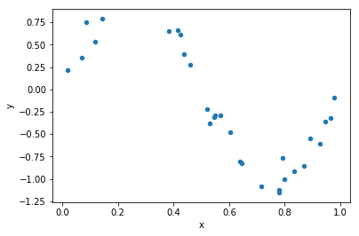
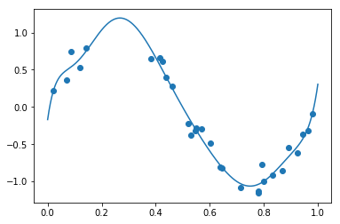
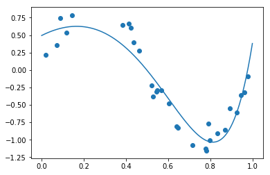
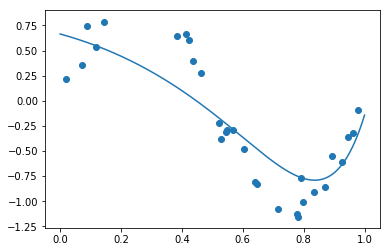
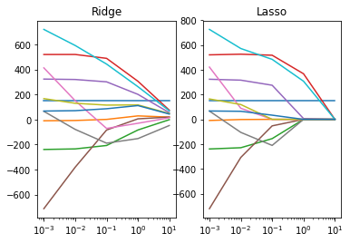
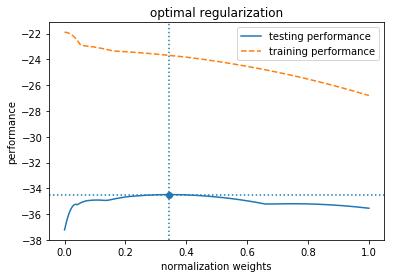
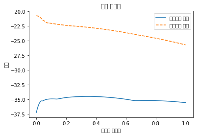
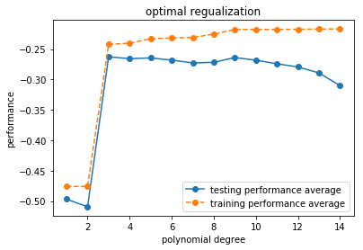

# 정규화 선형회귀

* 정규화 선형회귀 방법 : 선형회귀 계수(weight)에 대한 제약 조건을 추가 => overfitting을 막음

* Regularized Method, Penalized Method, Contranined Least Squares

* 일반적으로 정규화 방법에서 추가하는 제약조건 : 계수의 크기 제한.

### 정규화 모형의 장점
정규화 모형은 회귀 분석에 사용된 데이터가 달라져도 계수가 크게 달라지지 않도록 한다.


## Ridge Regression

#### 추가적인 제약 조건
가중치들의 제곱합 (squared sum of weights) 을 최소화 하는 것


* λ : hyper parameter.
* λ가 커지면 정규화 정도가 커지고 가중치의 값들이 작아짐.
* λ가 작아지면 정규화 정도가 작아짐
* λ가 0이 되면 일반적인 linear regression model이 되게 된다.

## Lasso Regression

#### 추가적인 제약 조건
가중치의 절대값의 합을 최소화하는 것


* λ : hyper parameter.
* λ에 대해서는 Ridge모형과 마찬가지


## Elastic Net Regression

#### 추가적인 제약 조건
가중치의 절대값의 합을 최소화하는 것


* λ1, λ2  : hyper parameter.
* λ에 대해서는 Ridge, Lasso모형과 마찬가지

## 정규화의 의미
정규화 제한 조건 == 정규화가 없는 최적화 문제에 부등식 제한 조건을 추가한 것과 마찬가지.

예를 들어 ridge 회귀모형에 대해서는


이라는 최적화 문제에 다음과 같은 부등식 제한 조건을 추가한 것.


이를 라그랑지로 풀어보면 아래와 같은 최적화 문제가 된다.


## Scikit-Learn에서의 정규화 회귀모형
http://scikit-learn.org/stable/modules/generated/sklearn.linear_model.Ridge.html


http://scikit-learn.org/stable/modules/generated/sklearn.linear_model.Lasso.html


http://scikit-learn.org/stable/modules/generated/sklearn.linear_model.ElasticNet.html


```python
import numpy as np
import pandas as pd
import statsmodels.tools.tools as sm
import matplotlib.pyplot as plt
```


```python
def make_nonlinear(seed=0):
    np.random.seed(seed)
    n_samples = 30

    X = np.sort(np.random.rand(n_samples))
    y = np.sin(2 * np.pi * X) + np.random.randn(n_samples) * 0.1
    X = X[:, np.newaxis]
    return (X, y)


X, y = make_nonlinear()
dfX = pd.DataFrame(X, columns=["x"])
dfX = sm.add_constant(dfX)
dfy = pd.DataFrame(y, columns=["y"])
df = pd.concat([dfX, dfy], axis=1)

df.plot.scatter(x = "x", y="y")
```


    <matplotlib.axes._subplots.AxesSubplot at 0x1daa082c630>





```python
def plot_sklearn(model):
    plt.scatter(X, y)
    xx = np.linspace(0, 1, 1000)
    plt.plot(xx, model.predict(xx[:, np.newaxis]))
    plt.show()
```


```python
from sklearn.preprocessing import PolynomialFeatures # 다항식 및 상호작용 기능 생성
from sklearn.pipeline import make_pipeline
from sklearn.linear_model import LinearRegression, Ridge, Lasso, ElasticNet

```

### linear regression


```python
poly = PolynomialFeatures(9) # => 계수도 절편과 9개의 항에 대해, 총 10개 나옴
model = make_pipeline(poly, LinearRegression()).fit(X, y)
print(model.steps[1][1].coef_)
plot_sklearn(model) # overfitting
```

    [ 0.00000000e+00  2.57357731e+01 -4.28141683e+02  3.86672311e+03
     -1.83409397e+04  4.93260725e+04 -7.88847431e+04  7.45386451e+04
     -3.84531322e+04  8.35025499e+03]





## Ridge Regression


```python
model = make_pipeline(poly, Ridge(alpha=0.01)).fit(X, y)
print(model.steps[1][1].coef_)
plot_sklearn(model)
```

    [ 0.          1.51430399 -3.90160797 -2.6359859  -0.41526792  1.07530175
      1.64913273  1.52026782  0.94651401  0.13299614]





### Lasso Regression


```python
model = make_pipeline(poly, Lasso(alpha=0.01)).fit(X, y)
print(model.steps[1][1].coef_)
plot_sklearn(model)
```

    [ 0.         -0.07668852 -2.44096313 -0.         -0.          0.
      0.          0.          0.          1.88188725]


### Elastic Net Regression


```python
model = make_pipeline(poly, ElasticNet(alpha=0.01, l1_ratio=0.5)).fit(X, y)
print(model.steps[1][1].coef_)
plot_sklearn(model)
```

    [ 0.         -0.83768018 -1.23944649 -0.50166684 -0.          0.
      0.          0.30382246  0.62459231  0.84262899]





## Ridge VS Lasso


```python
from sklearn.datasets import load_diabetes
diabetes = load_diabetes()
X = diabetes.data
y = diabetes.target
```


```python
alpha = np.logspace(-3, 1, 5)

data = []
for i, a in enumerate(alpha):
    ridge = Ridge(alpha=a).fit(X, y)
    data.append(pd.Series(np.hstack([ridge.intercept_, ridge.coef_])))

df_ridge = pd.DataFrame(data, index=alpha).T
df_ridge
```


<div>
<style scoped>
    .dataframe tbody tr th:only-of-type {
        vertical-align: middle;
    }

    .dataframe tbody tr th {
        vertical-align: top;
    }

    .dataframe thead th {
        text-align: right;
    }
</style>
<table border="1" class="dataframe">
  <thead>
    <tr style="text-align: right;">
      <th></th>
      <th>0.001</th>
      <th>0.01</th>
      <th>0.1</th>
      <th>1.0</th>
      <th>10.0</th>
    </tr>
  </thead>
  <tbody>
    <tr>
      <th>0</th>
      <td>152.133484</td>
      <td>152.133484</td>
      <td>152.133484</td>
      <td>152.133484</td>
      <td>152.133484</td>
    </tr>
    <tr>
      <th>1</th>
      <td>-9.551414</td>
      <td>-7.199457</td>
      <td>1.307349</td>
      <td>29.465746</td>
      <td>19.812822</td>
    </tr>
    <tr>
      <th>2</th>
      <td>-239.090354</td>
      <td>-234.552930</td>
      <td>-207.194814</td>
      <td>-83.154885</td>
      <td>-0.918458</td>
    </tr>
    <tr>
      <th>3</th>
      <td>520.363367</td>
      <td>520.583136</td>
      <td>489.691080</td>
      <td>306.351627</td>
      <td>75.416167</td>
    </tr>
    <tr>
      <th>4</th>
      <td>323.828627</td>
      <td>320.523356</td>
      <td>301.769437</td>
      <td>201.629434</td>
      <td>55.025419</td>
    </tr>
    <tr>
      <th>5</th>
      <td>-712.328205</td>
      <td>-380.607066</td>
      <td>-83.466074</td>
      <td>5.909369</td>
      <td>19.924600</td>
    </tr>
    <tr>
      <th>6</th>
      <td>413.383794</td>
      <td>150.483752</td>
      <td>-70.828096</td>
      <td>-29.515927</td>
      <td>13.948686</td>
    </tr>
    <tr>
      <th>7</th>
      <td>65.811629</td>
      <td>-78.591232</td>
      <td>-188.680164</td>
      <td>-152.040465</td>
      <td>-47.553816</td>
    </tr>
    <tr>
      <th>8</th>
      <td>167.513774</td>
      <td>130.313059</td>
      <td>115.712703</td>
      <td>117.311715</td>
      <td>48.259420</td>
    </tr>
    <tr>
      <th>9</th>
      <td>720.944468</td>
      <td>592.349587</td>
      <td>443.814054</td>
      <td>262.944995</td>
      <td>70.144068</td>
    </tr>
    <tr>
      <th>10</th>
      <td>68.122100</td>
      <td>71.133768</td>
      <td>86.748539</td>
      <td>111.878718</td>
      <td>44.213876</td>
    </tr>
  </tbody>
</table>
</div>


```python
alpha
```


    array([1.e-03, 1.e-02, 1.e-01, 1.e+00, 1.e+01])


```python
alpha = np.logspace(-3, 1, 5)

data = []
for i, a in enumerate(alpha):
    lasso = Lasso(alpha=a).fit(X, y)
    data.append(pd.Series(np.hstack([lasso.intercept_, lasso.coef_])))

df_lasso = pd.DataFrame(data, index=alpha).T
df_lasso
```


<div>
<style scoped>
    .dataframe tbody tr th:only-of-type {
        vertical-align: middle;
    }

    .dataframe tbody tr th {
        vertical-align: top;
    }

    .dataframe thead th {
        text-align: right;
    }
</style>
<table border="1" class="dataframe">
  <thead>
    <tr style="text-align: right;">
      <th></th>
      <th>0.001</th>
      <th>0.01</th>
      <th>0.1</th>
      <th>1.0</th>
      <th>10.0</th>
    </tr>
  </thead>
  <tbody>
    <tr>
      <th>0</th>
      <td>152.133484</td>
      <td>152.133484</td>
      <td>152.133484</td>
      <td>152.133484</td>
      <td>152.133484</td>
    </tr>
    <tr>
      <th>1</th>
      <td>-8.998449</td>
      <td>-1.306575</td>
      <td>-0.000000</td>
      <td>0.000000</td>
      <td>0.000000</td>
    </tr>
    <tr>
      <th>2</th>
      <td>-238.899740</td>
      <td>-228.822331</td>
      <td>-155.362882</td>
      <td>-0.000000</td>
      <td>0.000000</td>
    </tr>
    <tr>
      <th>3</th>
      <td>520.261362</td>
      <td>525.560658</td>
      <td>517.182017</td>
      <td>367.701852</td>
      <td>0.000000</td>
    </tr>
    <tr>
      <th>4</th>
      <td>323.429484</td>
      <td>316.175320</td>
      <td>275.082351</td>
      <td>6.301904</td>
      <td>0.000000</td>
    </tr>
    <tr>
      <th>5</th>
      <td>-720.251734</td>
      <td>-307.013677</td>
      <td>-52.540269</td>
      <td>0.000000</td>
      <td>0.000000</td>
    </tr>
    <tr>
      <th>6</th>
      <td>421.405141</td>
      <td>89.321688</td>
      <td>-0.000000</td>
      <td>0.000000</td>
      <td>0.000000</td>
    </tr>
    <tr>
      <th>7</th>
      <td>66.734168</td>
      <td>-105.081398</td>
      <td>-210.159753</td>
      <td>-0.000000</td>
      <td>-0.000000</td>
    </tr>
    <tr>
      <th>8</th>
      <td>164.448873</td>
      <td>119.597989</td>
      <td>0.000000</td>
      <td>0.000000</td>
      <td>0.000000</td>
    </tr>
    <tr>
      <th>9</th>
      <td>725.340440</td>
      <td>571.330871</td>
      <td>483.914409</td>
      <td>307.605700</td>
      <td>0.000000</td>
    </tr>
    <tr>
      <th>10</th>
      <td>67.475538</td>
      <td>65.007316</td>
      <td>33.672821</td>
      <td>0.000000</td>
      <td>0.000000</td>
    </tr>
  </tbody>
</table>
</div>


```python
np.log10(alpha)
```


    array([-3., -2., -1.,  0.,  1.])


```python
ax1 = plt.subplot(121)
plt.semilogx(df_ridge.T)
#plt.xticks(alpha, labels=np.log10(alpha))
plt.title("Ridge")

ax2 = plt.subplot(122)
plt.semilogx(df_lasso.T)
#plt.xticks(alpha, labels=np.log10(alpha).array2string())
plt.title("Lasso")

plt.show()
```





##  최적 정규화 optimal regularization

hyper parameter 튜닝을 하면 모델의 검증 성능이 나아질 수 있다.

#### ex) 보스턴 집값 데이터에 대해 Lasso regularization을 하는 경우
정규화 가중치(alpha)가 달라지면 학습용 데이터를 사용한 성능과 검증용 데이터를 사용한 성능이 다르다.


```python
from sklearn.datasets import load_boston
from sklearn.linear_model import Lasso
from sklearn.metrics import mean_squared_error
from sklearn.model_selection import cross_val_score

boston = load_boston()
X = boston.data
y = boston.target

alphas = np.logspace(-4, 0, 200)

train_scores = []
test_scores = []
for alpha in alphas:
    model = Lasso(alpha=alpha)
    train_score = -mean_squared_error(y, model.fit(X, y).predict(X))
    test_score = np.mean(cross_val_score(model, X, y, scoring="neg_mean_squared_error", cv=5))
    train_scores.append(train_score)
    test_scores.append(test_score)

optimal_alpha = alphas[np.argmax(test_scores)]
optimal_score = np.max(test_scores)

plt.plot(alphas, test_scores, "-", label="testing performance")
plt.plot(alphas, train_scores, "--", label="training performance")
plt.axhline(optimal_score, linestyle=':')
plt.axvline(optimal_alpha, linestyle=':')
plt.scatter(optimal_alpha, optimal_score)
plt.title("optimal regularization")
plt.ylabel('performance')
plt.xlabel('normalization weights')
plt.legend()
plt.show()
```





```python
print(optimal_alpha) # 해당 알파값을 사용하는 것이 좋다.
```

    0.34489622604057596


### 검증 성능 곡선

scikit-learn 패키지의 model_selection 서브패키지 에서 제공하는 `validation_curve`함수를 사용하면 검증 성능 곡선을 더 쉽게 그릴 수 있다.


```python
from sklearn.model_selection import validation_curve

train_scores, test_scores = validation_curve(
    Lasso(), X, y, "alpha", alphas, cv=5,
    scoring="neg_mean_squared_error")

plt.plot(alphas, test_scores.mean(axis=1), "-", label="검증성능 평균")
plt.plot(alphas, train_scores.mean(axis=1), "--", label="학습성능 평균")
plt.ylabel('성능')
plt.xlabel('정규화 가중치')
plt.legend()
plt.title("최적 정규화")
plt.show()
```





### 다항회귀의 차수 결정 => 최적 정규화 문제 중 하나

* 다항회귀에서 차수가 감소하면 모형의 제약조건이 더 강화됨 => 정규화 가중치가 커지는 것과 같음
* 차수가 증가하면 모형의 제약조건이 감소 => 정규화 가중치가 작아지는 것과 같음


```python
from sklearn.preprocessing import PolynomialFeatures
from sklearn.linear_model import LinearRegression
from sklearn.pipeline import Pipeline
from sklearn.model_selection import cross_val_score

n_samples = 100
np.random.seed(0)
X = np.sort(np.random.rand(n_samples))
y = np.sin(2 * np.pi * X) + np.random.randn(n_samples) * 0.5
X = X[:, np.newaxis]


model = Pipeline([("poly", PolynomialFeatures()),
                  ("lreg", LinearRegression())])

degrees = np.arange(1, 15)
train_scores, test_scores = validation_curve(
    model, X, y, "poly__degree", degrees, cv=100,
    scoring="neg_mean_squared_error")

plt.plot(degrees, test_scores.mean(axis=1), "o-", label="testing performance average")
plt.plot(degrees, train_scores.mean(axis=1), "o--", label="training performance average")
plt.ylabel('performance')
plt.xlabel('polynomial degree')
plt.legend()
plt.title("optimal regualization")
plt.show()
```





차수는 3으로 하는 것이 효율적이겠다.


## Ridge VS Lasso
* Ridge : 가중치 계수를 한꺼번에 축소시킴
* Lasso : 일부 가중치 계수가 먼저 0으로 수렴할 수 있음


## References
* https://datascienceschool.net/view-notebook/83d5e4fff7d64cb2aecfd7e42e1ece5e/
* https://economia.tistory.com/2
