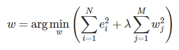
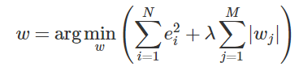
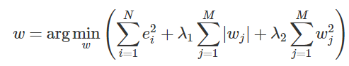
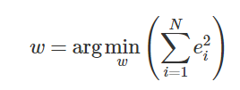
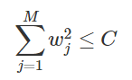
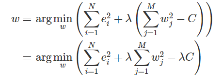
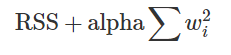
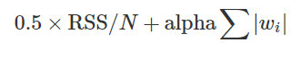
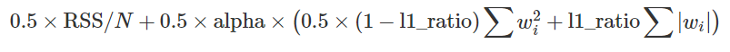
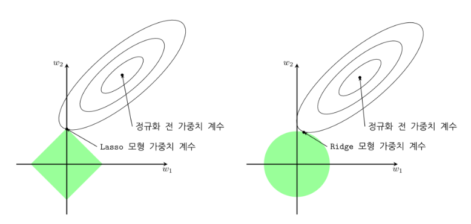

# 정규화 선형회귀

* 정규화 선형회귀 방법 : 선형회귀 계수(weight)에 대한 제약 조건을 추가 => overfitting을 막음

* Regularized Method, Penalized Method, Contranined Least Squares

* 일반적으로 정규화 방법에서 추가하는 제약조건 : 계수의 크기 제한.

### 정규화 모형의 장점
정규화 모형은 회귀 분석에 사용된 데이터가 달라져도 계수가 크게 달라지지 않도록 한다.


## Ridge Regression

#### 추가적인 제약 조건
가중치들의 제곱합 (squared sum of weights) 을 최소화 하는 것



* λ : hyper parameter.
* λ가 커지면 정규화 정도가 커지고 가중치의 값들이 작아짐.
* λ가 작아지면 정규화 정도가 작아짐
* λ가 0이 되면 일반적인 linear regression model이 되게 된다.

## Lasso Regression

#### 추가적인 제약 조건
가중치의 절대값의 합을 최소화하는 것



* λ : hyper parameter.
* λ에 대해서는 Ridge모형과 마찬가지


## Elastic Net Regression

#### 추가적인 제약 조건
가중치의 절대값의 합을 최소화하는 것



* λ1, λ2  : hyper parameter.
* λ에 대해서는 Ridge, Lasso모형과 마찬가지

## 정규화의 의미
정규화 제한 조건 == 정규화가 없는 최적화 문제에 부등식 제한 조건을 추가한 것과 마찬가지.

예를 들어 ridge 회귀모형에 대해서는

이라는 최적화 문제에 다음과 같은 부등식 제한 조건을 추가한 것.


이를 라그랑지로 풀어보면 아래와 같은 최적화 문제가 된다.



## Scikit-Learn에서의 정규화 회귀모형
http://scikit-learn.org/stable/modules/generated/sklearn.linear_model.Ridge.html


http://scikit-learn.org/stable/modules/generated/sklearn.linear_model.Lasso.html


http://scikit-learn.org/stable/modules/generated/sklearn.linear_model.ElasticNet.html


```python
def plot_sklearn(model):
    plt.scatter(X, y)
    xx = np.linspace(0, 1, 1000)
    plt.plot(xx, model.predict(xx[:, np.newaxis]))
    plt.show()
```


## Ridge VS Lasso
* Ridge : 가중치 계수를 한꺼번에 축소시킴
* Lasso : 일부 가중치 계수가 먼저 0으로 수렴할 수 있음



## References
* https://datascienceschool.net/view-notebook/83d5e4fff7d64cb2aecfd7e42e1ece5e/
* https://economia.tistory.com/2
