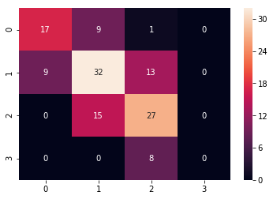
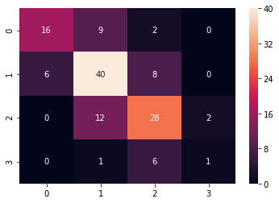

```python
import tensorflow as tf
import pandas as pd
import numpy as np
import copy as cp
import seaborn as sns

from sklearn.metrics import accuracy_score
from sklearn.model_selection import train_test_split
from sklearn.model_selection import KFold
from sklearn.cross_validation import cross_val_score

import warnings
def ignore_warn(*args, **kwargs):
    pass
warnings.warn = ignore_warn #ignore annoying warning (from sklearn and seaborn)

from scipy import stats
from scipy.stats import norm, skew #for some statistics

```

# 분류 모델 적용

## Student Academic Performance Dataset

본 데이터는 의미있는 수치형 변수가 없다.

모든 변수들이 명목형이거나 순서형으로, 범주형 자료에 속한다.

이에 따라 우선 머신러닝 기법 중에서는 regression을 하기 보다는 분류만 적용해보기로 한다.

+)tensorflow를 사용하거나 sklearn을 사용한다

### 전처리된 데이터 불러오기


```python
stdt_acdm = pd.read_csv("clean_stdt_acdm.csv", sep=",")
stdt_acdm_reduct = pd.read_csv("reducted_stdt_acdm.csv", sep=",")
stdt_acdm_reduct2 = pd.read_csv("reducted_stdt_acdm_2.csv", sep=",")
stdt_acdm_pca = pd.read_csv("pca_clean_stdt_acdm.csv", sep=",")
stdt_acdm_cca = pd.read_csv("cca_clean_stdt_acdm.csv", sep=",")
```


```python
X_df = cp.copy(stdt_acdm)
del X_df['esp']
y_df = cp.copy(stdt_acdm['esp'])
X = X_df.values
y = y_df.values
```

### 우선 전체 데이터를 사용한다.
### sklearn 패키지를 사용한 것은 아래 함수로 10fold 평가할 수 있다


```python

def cross_validation(model, X, y, cv = 0, n_jobs=1):
    scores = cross_val_score(estimator=model, 
                             X=X, 
                             y=y, 
                             cv=10,
                             n_jobs=1)
    print('CV accuracy scores: %s' % scores)
    print('CV accuracy: %.3f +/- %.3f' % (np.mean(scores), np.std(scores)))
    return np.mean(scores)
```

## classifier의 종류
1. kNN
2. Decision trees
3. naive Bayes
4. Logistic regression
5. SVM

### 앙상블 기법
* bagging -> 구현x
* boosting (adaboost)
* random forest

## 1. kNN 


```python
from sklearn.neighbors import KNeighborsClassifier
```


```python
def KNN10fold(X_df, y_df) :
    cv = KFold(10, shuffle=True, random_state=0)
    df = pd.concat([X_df,y_df],axis=1)

    total_accuracys = []
    for n in range(1,40):
        accuracys = []
        for i, (idx_train, idx_test) in enumerate(cv.split(df)):
            y_train = df.iloc[idx_train,-1]
            X_train = df.iloc[idx_train, 0:-1]
            X_test = df.iloc[idx_test, 0:-1]
            y_test = df.iloc[idx_test, -1]

            knn = KNeighborsClassifier(n_neighbors = n)
            knn.fit(X_train,y_train)

            #print("훈련 세트 정확도: {:.3f}".format(tree.score(X_train, y_train)))
            #print("테스트 세트 정확도: {:.3f}".format(tree.score(X_test, y_test)))
            #print("전체 세트 정확도: {:.3f}".format(tree.score(X, y)))

            y_pred = knn.predict(X_test)
            accuracy = accuracy_score(y_test,y_pred)

            #for y, p in zip(y_test,y_pred):
            #    print(y, "\t", p)
            #print(accuracy)
            accuracys.append(accuracy)
        total_accuracy = np.array(accuracys).mean()
        total_accuracys.append(total_accuracy)
        
    print("n : ", total_accuracys.index(max(total_accuracys))+1, "accuracy : ", max(total_accuracys))
```


```python
KNN10fold(X_df,y_df)
```

    n :  19 accuracy :  0.5807692307692307
    


* 아래는 그에 대한 시각화이다.
* confusion matrix 함수는 sklearn 패키지 전체 모델들이 범용적으로 사용 가능하다.
* 10fold 각각 수행중에 test set과 predict set을 저장하여 한번에 confusion matrix 형태로 그려낸다


```python
from sklearn.metrics import confusion_matrix
import matplotlib
import matplotlib.pyplot as plt

def ConfusionMatrix (model, X_df, y_df):
    preds = []
    ys=[]
    test_accuracys = []
    df = pd.concat([X_df,y_df],axis=1)
    cv = KFold(10, shuffle=True, random_state=0)
    
    for i, (idx_train, idx_test) in enumerate(cv.split(df)):
        y_train = df.iloc[idx_train,-1]
        X_train = df.iloc[idx_train, 0:-1]
        X_test = df.iloc[idx_test, 0:-1]
        y_test = df.iloc[idx_test, -1]

        
        model.fit(X_train, y_train)

        test_accuracy = model.score(X_test,y_test)
        test_accuracys.append(test_accuracy)


        predicted = model.predict(X_test)

        ys.append(y_test)
        preds.append(predicted)

    print(np.array(test_accuracys).mean())
    unlist_y = []
    unlist_p = []

    for yl, pl in zip(ys, preds):
        for y, p in zip(yl, pl):
            unlist_y.append(y)
            unlist_p.append(p)

    %matplotlib inline
    cm = pd.DataFrame(confusion_matrix(unlist_y, unlist_p))
    sns.heatmap(cm, annot=True)
    return cm
    
```


```python
knn = KNeighborsClassifier(n_neighbors = 19)

ConfusionMatrix(knn,X_df,y_df)
```

    0.5807692307692307
    


<div>
<style scoped>
    .dataframe tbody tr th:only-of-type {
        vertical-align: middle;
    }

    .dataframe tbody tr th {
        vertical-align: top;
    }

    .dataframe thead th {
        text-align: right;
    }
</style>
<table border="1" class="dataframe">
  <thead>
    <tr style="text-align: right;">
      <th></th>
      <th>0</th>
      <th>1</th>
      <th>2</th>
      <th>3</th>
    </tr>
  </thead>
  <tbody>
    <tr>
      <th>0</th>
      <td>17</td>
      <td>9</td>
      <td>1</td>
      <td>0</td>
    </tr>
    <tr>
      <th>1</th>
      <td>9</td>
      <td>32</td>
      <td>13</td>
      <td>0</td>
    </tr>
    <tr>
      <th>2</th>
      <td>0</td>
      <td>15</td>
      <td>27</td>
      <td>0</td>
    </tr>
    <tr>
      <th>3</th>
      <td>0</td>
      <td>0</td>
      <td>8</td>
      <td>0</td>
    </tr>
  </tbody>
</table>
</div>





### kNN결과
* ** 정확도 58.08% ** 로 그다지 정확하지 않다.
* 3 (가장 높은 성적) 에 대해서는 전혀 분류해내지 못한다.

#### kNN이 정확도가 낮은 이유
* 데이터가 충분해야 잘 동작
* 데이터가 많을 때 kNN을 적용해 이상한 데이터들을 제거하거나 입력 데이터를 특징들의 집합으로 변환하여 특징을 추출할때 오히려 사용되는 편


## 2. Decision Trees


```python
from sklearn.tree import DecisionTreeClassifier
from sklearn.model_selection import train_test_split

```


```python
def DecisionTree10fold(X_df, y_df):
    cv = KFold(10, shuffle=True, random_state=0)
    df = pd.concat([X_df,y_df],axis=1)
    depth_accuracys = []
    
    for depth in range(1,len(X_df.columns)):
        accuracys = []
        for i, (idx_train, idx_test) in enumerate(cv.split(df)):
                y_train = df.iloc[idx_train,-1]
                X_train = df.iloc[idx_train, 0:-1]
                X_test = df.iloc[idx_test, 0:-1]
                y_test = df.iloc[idx_test, -1]

                tree = DecisionTreeClassifier(random_state=0, max_depth=depth)
                tree.fit(X_train, y_train)
                #print("훈련 세트 정확도: {:.3f}".format(tree.score(X_train, y_train)))
                #print("테스트 세트 정확도: {:.3f}".format(tree.score(X_test, y_test)))
                #print("전체 세트 정확도: {:.3f}".format(tree.score(X, y)))

                accuracys.append(tree.score(X_test,y_test))
        accuracy = sum(accuracys)/10
        #print("depth : ", depth, "accuracy : ", accuracy);
        depth_accuracys.append(accuracy)
    return depth_accuracys
    
```


```python
result=DecisionTree10fold(X_df,y_df)
print("depth : ", result.index(max(result))+1,"accuracy : ",  max(result))
```

    depth :  2 accuracy :  0.6401098901098901
    

**depth 2에서 64.01%의 정확도를 보인다.**
### Using Cross validation function


```python
result = []

for n in range(1,len(X_df.columns)):
    tree = DecisionTreeClassifier(max_depth=n, random_state=0)
    result.append(cross_validation(tree, X_df, y_df))
```

    CV accuracy scores: [0.66666667 0.53333333 0.64285714 0.42857143 0.69230769 0.53846154
     0.69230769 0.5        0.81818182 0.54545455]
    CV accuracy: 0.606 +/- 0.110
    CV accuracy scores: [0.66666667 0.4        0.78571429 0.57142857 0.76923077 0.53846154
     0.76923077 0.58333333 0.72727273 0.54545455]
    CV accuracy: 0.636 +/- 0.121
    CV accuracy scores: [0.66666667 0.6        0.64285714 0.57142857 0.69230769 0.46153846
     0.53846154 0.58333333 0.63636364 0.54545455]
    CV accuracy: 0.594 +/- 0.065
    CV accuracy scores: [0.53333333 0.53333333 0.71428571 0.64285714 0.61538462 0.53846154
     0.76923077 0.66666667 0.72727273 0.54545455]
    CV accuracy: 0.629 +/- 0.085
    CV accuracy scores: [0.6        0.53333333 0.71428571 0.64285714 0.46153846 0.53846154
     0.69230769 0.66666667 0.72727273 0.63636364]
    CV accuracy: 0.621 +/- 0.083
    CV accuracy scores: [0.66666667 0.6        0.78571429 0.57142857 0.46153846 0.53846154
     0.69230769 0.58333333 0.72727273 0.63636364]
    CV accuracy: 0.626 +/- 0.091
    CV accuracy scores: [0.46666667 0.6        0.64285714 0.57142857 0.53846154 0.53846154
     0.69230769 0.5        0.54545455 0.63636364]
    CV accuracy: 0.573 +/- 0.066
    CV accuracy scores: [0.46666667 0.6        0.64285714 0.5        0.46153846 0.46153846
     0.69230769 0.33333333 0.63636364 0.63636364]
    CV accuracy: 0.543 +/- 0.109
    CV accuracy scores: [0.46666667 0.6        0.57142857 0.42857143 0.46153846 0.46153846
     0.53846154 0.41666667 0.63636364 0.63636364]
    CV accuracy: 0.522 +/- 0.081
    CV accuracy scores: [0.46666667 0.6        0.35714286 0.42857143 0.46153846 0.46153846
     0.61538462 0.33333333 0.63636364 0.63636364]
    CV accuracy: 0.500 +/- 0.109
    CV accuracy scores: [0.46666667 0.6        0.35714286 0.42857143 0.46153846 0.46153846
     0.69230769 0.33333333 0.63636364 0.63636364]
    CV accuracy: 0.507 +/- 0.119
    CV accuracy scores: [0.46666667 0.6        0.35714286 0.42857143 0.46153846 0.46153846
     0.53846154 0.33333333 0.63636364 0.63636364]
    CV accuracy: 0.492 +/- 0.103
    CV accuracy scores: [0.46666667 0.6        0.35714286 0.42857143 0.46153846 0.46153846
     0.53846154 0.33333333 0.63636364 0.63636364]
    CV accuracy: 0.492 +/- 0.103
    CV accuracy scores: [0.46666667 0.6        0.35714286 0.42857143 0.46153846 0.46153846
     0.53846154 0.33333333 0.63636364 0.63636364]
    CV accuracy: 0.492 +/- 0.103
    CV accuracy scores: [0.46666667 0.6        0.35714286 0.42857143 0.46153846 0.46153846
     0.53846154 0.33333333 0.63636364 0.63636364]
    CV accuracy: 0.492 +/- 0.103
    CV accuracy scores: [0.46666667 0.6        0.35714286 0.42857143 0.46153846 0.46153846
     0.53846154 0.33333333 0.63636364 0.63636364]
    CV accuracy: 0.492 +/- 0.103
    CV accuracy scores: [0.46666667 0.6        0.35714286 0.42857143 0.46153846 0.46153846
     0.53846154 0.33333333 0.63636364 0.63636364]
    CV accuracy: 0.492 +/- 0.103
    CV accuracy scores: [0.46666667 0.6        0.35714286 0.42857143 0.46153846 0.46153846
     0.53846154 0.33333333 0.63636364 0.63636364]
    CV accuracy: 0.492 +/- 0.103
    CV accuracy scores: [0.46666667 0.6        0.35714286 0.42857143 0.46153846 0.46153846
     0.53846154 0.33333333 0.63636364 0.63636364]
    CV accuracy: 0.492 +/- 0.103
    CV accuracy scores: [0.46666667 0.6        0.35714286 0.42857143 0.46153846 0.46153846
     0.53846154 0.33333333 0.63636364 0.63636364]
    CV accuracy: 0.492 +/- 0.103
    CV accuracy scores: [0.46666667 0.6        0.35714286 0.42857143 0.46153846 0.46153846
     0.53846154 0.33333333 0.63636364 0.63636364]
    CV accuracy: 0.492 +/- 0.103
    CV accuracy scores: [0.46666667 0.6        0.35714286 0.42857143 0.46153846 0.46153846
     0.53846154 0.33333333 0.63636364 0.63636364]
    CV accuracy: 0.492 +/- 0.103
    CV accuracy scores: [0.46666667 0.6        0.35714286 0.42857143 0.46153846 0.46153846
     0.53846154 0.33333333 0.63636364 0.63636364]
    CV accuracy: 0.492 +/- 0.103
    CV accuracy scores: [0.46666667 0.6        0.35714286 0.42857143 0.46153846 0.46153846
     0.53846154 0.33333333 0.63636364 0.63636364]
    CV accuracy: 0.492 +/- 0.103
    CV accuracy scores: [0.46666667 0.6        0.35714286 0.42857143 0.46153846 0.46153846
     0.53846154 0.33333333 0.63636364 0.63636364]
    CV accuracy: 0.492 +/- 0.103
    CV accuracy scores: [0.46666667 0.6        0.35714286 0.42857143 0.46153846 0.46153846
     0.53846154 0.33333333 0.63636364 0.63636364]
    CV accuracy: 0.492 +/- 0.103
    CV accuracy scores: [0.46666667 0.6        0.35714286 0.42857143 0.46153846 0.46153846
     0.53846154 0.33333333 0.63636364 0.63636364]
    CV accuracy: 0.492 +/- 0.103
    CV accuracy scores: [0.46666667 0.6        0.35714286 0.42857143 0.46153846 0.46153846
     0.53846154 0.33333333 0.63636364 0.63636364]
    CV accuracy: 0.492 +/- 0.103
    CV accuracy scores: [0.46666667 0.6        0.35714286 0.42857143 0.46153846 0.46153846
     0.53846154 0.33333333 0.63636364 0.63636364]
    CV accuracy: 0.492 +/- 0.103
    CV accuracy scores: [0.46666667 0.6        0.35714286 0.42857143 0.46153846 0.46153846
     0.53846154 0.33333333 0.63636364 0.63636364]
    CV accuracy: 0.492 +/- 0.103
    CV accuracy scores: [0.46666667 0.6        0.35714286 0.42857143 0.46153846 0.46153846
     0.53846154 0.33333333 0.63636364 0.63636364]
    CV accuracy: 0.492 +/- 0.103
    CV accuracy scores: [0.46666667 0.6        0.35714286 0.42857143 0.46153846 0.46153846
     0.53846154 0.33333333 0.63636364 0.63636364]
    CV accuracy: 0.492 +/- 0.103
    CV accuracy scores: [0.46666667 0.6        0.35714286 0.42857143 0.46153846 0.46153846
     0.53846154 0.33333333 0.63636364 0.63636364]
    CV accuracy: 0.492 +/- 0.103
    CV accuracy scores: [0.46666667 0.6        0.35714286 0.42857143 0.46153846 0.46153846
     0.53846154 0.33333333 0.63636364 0.63636364]
    CV accuracy: 0.492 +/- 0.103
    CV accuracy scores: [0.46666667 0.6        0.35714286 0.42857143 0.46153846 0.46153846
     0.53846154 0.33333333 0.63636364 0.63636364]
    CV accuracy: 0.492 +/- 0.103
    CV accuracy scores: [0.46666667 0.6        0.35714286 0.42857143 0.46153846 0.46153846
     0.53846154 0.33333333 0.63636364 0.63636364]
    CV accuracy: 0.492 +/- 0.103
    CV accuracy scores: [0.46666667 0.6        0.35714286 0.42857143 0.46153846 0.46153846
     0.53846154 0.33333333 0.63636364 0.63636364]
    CV accuracy: 0.492 +/- 0.103
    CV accuracy scores: [0.46666667 0.6        0.35714286 0.42857143 0.46153846 0.46153846
     0.53846154 0.33333333 0.63636364 0.63636364]
    CV accuracy: 0.492 +/- 0.103
    CV accuracy scores: [0.46666667 0.6        0.35714286 0.42857143 0.46153846 0.46153846
     0.53846154 0.33333333 0.63636364 0.63636364]
    CV accuracy: 0.492 +/- 0.103
    


```python
print("depth : ",result.index(max(result))+1,"accuracy : ",max(result)) 
```

    depth :  2 accuracy :  0.6356793206793208
    

#### cross validation에서도 depth = 2에서 가장 큰 정확도 63.57%을 보인다

### Random forest 사용


```python
from sklearn.ensemble import RandomForestClassifier
```


```python
def RandomForest10fold(X_df, y_df):
    cv = KFold(10, shuffle=True, random_state=0)
    df = pd.concat([X_df,y_df],axis=1)
    depth_accuracys = []
    
    for depth in range(1,len(X_df.columns)):
        accuracys = []
        for i, (idx_train, idx_test) in enumerate(cv.split(df)):
                y_train = df.iloc[idx_train,-1]
                X_train = df.iloc[idx_train, 0:-1]
                X_test = df.iloc[idx_test, 0:-1]
                y_test = df.iloc[idx_test, -1]

                forest = RandomForestClassifier(n_estimators=depth, random_state=0)
                forest.fit(X_train, y_train)
                #print("훈련 세트 정확도: {:.3f}".format(tree.score(X_train, y_train)))
                #print("테스트 세트 정확도: {:.3f}".format(tree.score(X_test, y_test)))
                #print("전체 세트 정확도: {:.3f}".format(tree.score(X, y)))

                accuracys.append(forest.score(X_test,y_test))
        accuracy = sum(accuracys)/10
        #print("depth : ", depth, "accuracy : ", accuracy);
        depth_accuracys.append(accuracy)
    
    print("n : ", depth_accuracys.index(max(depth_accuracys))+1,"accuracy : ",  max(depth_accuracys))
    return max(depth_accuracys)
    
```


```python
RandomForest10fold(X_df,y_df)
```

    n :  39 accuracy :  0.6478021978021978
    

#### n_estimators 39에서 64.78%의 정확도를 가지는데, decision tree보다 높아졌다


```python


cv = KFold(10, shuffle=True, random_state=0)
df = pd.concat([X_df,y_df],axis=1)
depth_accuracys = []
for depth in range(1,len(X_df.columns)):
    accuracys = []
    for i, (idx_train, idx_test) in enumerate(cv.split(df)):
        y_train = df.iloc[idx_train,-1]
        X_train = df.iloc[idx_train, 0:-1]
        X_test = df.iloc[idx_test, 0:-1]
        y_test = df.iloc[idx_test, -1]

        forest = RandomForestClassifier(n_estimators=depth, random_state=0)
        forest.fit(X_train, y_train)
        predicted = forest.predict(X_test)
        accuracy = accuracy_score(y_test, predicted)
        accuracys.append(accuracy)

    depth_accuracy= sum(accuracys)/len(accuracys)
    depth_accuracys.append(depth_accuracy)

print("n : ", depth_accuracys.index(max(depth_accuracys))+1, "accuracy : ", max(depth_accuracys))
        
```

    n :  39 accuracy :  0.6478021978021978
    

**정확도 계산에 accuracy_score를 이용해도 같은 결과**

### Using Cross validation function


```python
result = []

for n in range(1,len(X_df.columns)):
    forest = RandomForestClassifier(n_estimators=n, random_state=0)
    result.append(cross_validation(forest, X_df, y_df))
```

    CV accuracy scores: [0.53333333 0.53333333 0.71428571 0.78571429 0.61538462 0.53846154
     0.38461538 0.58333333 0.54545455 0.45454545]
    CV accuracy: 0.569 +/- 0.110
    CV accuracy scores: [0.53333333 0.66666667 0.5        0.5        0.46153846 0.38461538
     0.30769231 0.5        0.27272727 0.36363636]
    CV accuracy: 0.449 +/- 0.112
    

    C:\ProgramData\Anaconda3\lib\site-packages\sklearn\cross_validation.py:553: Warning: The least populated class in y has only 8 members, which is too few. The minimum number of labels for any class cannot be less than n_folds=10.
      % (min_labels, self.n_folds)), Warning)
    C:\ProgramData\Anaconda3\lib\site-packages\sklearn\cross_validation.py:553: Warning: The least populated class in y has only 8 members, which is too few. The minimum number of labels for any class cannot be less than n_folds=10.
      % (min_labels, self.n_folds)), Warning)
    C:\ProgramData\Anaconda3\lib\site-packages\sklearn\cross_validation.py:553: Warning: The least populated class in y has only 8 members, which is too few. The minimum number of labels for any class cannot be less than n_folds=10.
      % (min_labels, self.n_folds)), Warning)
    

    CV accuracy scores: [0.4        0.46666667 0.71428571 0.5        0.38461538 0.38461538
     0.38461538 0.58333333 0.72727273 0.54545455]
    CV accuracy: 0.509 +/- 0.125
    CV accuracy scores: [0.6        0.66666667 0.78571429 0.57142857 0.30769231 0.46153846
     0.53846154 0.25       0.45454545 0.45454545]
    CV accuracy: 0.509 +/- 0.152
    CV accuracy scores: [0.6        0.53333333 0.71428571 0.64285714 0.53846154 0.53846154
     0.46153846 0.58333333 0.81818182 0.54545455]
    CV accuracy: 0.598 +/- 0.098
    

    C:\ProgramData\Anaconda3\lib\site-packages\sklearn\cross_validation.py:553: Warning: The least populated class in y has only 8 members, which is too few. The minimum number of labels for any class cannot be less than n_folds=10.
      % (min_labels, self.n_folds)), Warning)
    C:\ProgramData\Anaconda3\lib\site-packages\sklearn\cross_validation.py:553: Warning: The least populated class in y has only 8 members, which is too few. The minimum number of labels for any class cannot be less than n_folds=10.
      % (min_labels, self.n_folds)), Warning)
    C:\ProgramData\Anaconda3\lib\site-packages\sklearn\cross_validation.py:553: Warning: The least populated class in y has only 8 members, which is too few. The minimum number of labels for any class cannot be less than n_folds=10.
      % (min_labels, self.n_folds)), Warning)
    C:\ProgramData\Anaconda3\lib\site-packages\sklearn\cross_validation.py:553: Warning: The least populated class in y has only 8 members, which is too few. The minimum number of labels for any class cannot be less than n_folds=10.
      % (min_labels, self.n_folds)), Warning)
    

    CV accuracy scores: [0.53333333 0.6        0.78571429 0.57142857 0.53846154 0.53846154
     0.53846154 0.5        0.81818182 0.54545455]
    CV accuracy: 0.597 +/- 0.106
    CV accuracy scores: [0.53333333 0.53333333 0.71428571 0.5        0.69230769 0.53846154
     0.53846154 0.5        0.90909091 0.63636364]
    CV accuracy: 0.610 +/- 0.124
    

    C:\ProgramData\Anaconda3\lib\site-packages\sklearn\cross_validation.py:553: Warning: The least populated class in y has only 8 members, which is too few. The minimum number of labels for any class cannot be less than n_folds=10.
      % (min_labels, self.n_folds)), Warning)
    C:\ProgramData\Anaconda3\lib\site-packages\sklearn\cross_validation.py:553: Warning: The least populated class in y has only 8 members, which is too few. The minimum number of labels for any class cannot be less than n_folds=10.
      % (min_labels, self.n_folds)), Warning)
    

    CV accuracy scores: [0.53333333 0.46666667 0.71428571 0.57142857 0.53846154 0.53846154
     0.69230769 0.58333333 0.72727273 0.72727273]
    CV accuracy: 0.609 +/- 0.092
    CV accuracy scores: [0.46666667 0.46666667 0.71428571 0.57142857 0.46153846 0.53846154
     0.61538462 0.58333333 0.81818182 0.72727273]
    CV accuracy: 0.596 +/- 0.117
    

    C:\ProgramData\Anaconda3\lib\site-packages\sklearn\cross_validation.py:553: Warning: The least populated class in y has only 8 members, which is too few. The minimum number of labels for any class cannot be less than n_folds=10.
      % (min_labels, self.n_folds)), Warning)
    C:\ProgramData\Anaconda3\lib\site-packages\sklearn\cross_validation.py:553: Warning: The least populated class in y has only 8 members, which is too few. The minimum number of labels for any class cannot be less than n_folds=10.
      % (min_labels, self.n_folds)), Warning)
    

    CV accuracy scores: [0.53333333 0.46666667 0.78571429 0.57142857 0.38461538 0.53846154
     0.61538462 0.66666667 0.81818182 0.81818182]
    CV accuracy: 0.620 +/- 0.143
    CV accuracy scores: [0.53333333 0.46666667 0.71428571 0.57142857 0.38461538 0.53846154
     0.46153846 0.66666667 0.81818182 0.72727273]
    CV accuracy: 0.588 +/- 0.131
    

    C:\ProgramData\Anaconda3\lib\site-packages\sklearn\cross_validation.py:553: Warning: The least populated class in y has only 8 members, which is too few. The minimum number of labels for any class cannot be less than n_folds=10.
      % (min_labels, self.n_folds)), Warning)
    

    CV accuracy scores: [0.46666667 0.33333333 0.71428571 0.5        0.46153846 0.61538462
     0.69230769 0.66666667 0.90909091 0.72727273]
    CV accuracy: 0.609 +/- 0.160
    

    C:\ProgramData\Anaconda3\lib\site-packages\sklearn\cross_validation.py:553: Warning: The least populated class in y has only 8 members, which is too few. The minimum number of labels for any class cannot be less than n_folds=10.
      % (min_labels, self.n_folds)), Warning)
    

    CV accuracy scores: [0.4        0.53333333 0.57142857 0.5        0.38461538 0.53846154
     0.69230769 0.66666667 0.90909091 0.72727273]
    CV accuracy: 0.592 +/- 0.152
    

    C:\ProgramData\Anaconda3\lib\site-packages\sklearn\cross_validation.py:553: Warning: The least populated class in y has only 8 members, which is too few. The minimum number of labels for any class cannot be less than n_folds=10.
      % (min_labels, self.n_folds)), Warning)
    

    CV accuracy scores: [0.46666667 0.46666667 0.64285714 0.5        0.53846154 0.53846154
     0.84615385 0.66666667 0.90909091 0.72727273]
    CV accuracy: 0.630 +/- 0.149
    

    C:\ProgramData\Anaconda3\lib\site-packages\sklearn\cross_validation.py:553: Warning: The least populated class in y has only 8 members, which is too few. The minimum number of labels for any class cannot be less than n_folds=10.
      % (min_labels, self.n_folds)), Warning)
    

    CV accuracy scores: [0.46666667 0.46666667 0.57142857 0.5        0.46153846 0.53846154
     0.76923077 0.58333333 0.90909091 0.63636364]
    CV accuracy: 0.590 +/- 0.139
    

    C:\ProgramData\Anaconda3\lib\site-packages\sklearn\cross_validation.py:553: Warning: The least populated class in y has only 8 members, which is too few. The minimum number of labels for any class cannot be less than n_folds=10.
      % (min_labels, self.n_folds)), Warning)
    

    CV accuracy scores: [0.46666667 0.53333333 0.64285714 0.57142857 0.46153846 0.53846154
     0.61538462 0.66666667 0.90909091 0.72727273]
    CV accuracy: 0.613 +/- 0.127
    

    C:\ProgramData\Anaconda3\lib\site-packages\sklearn\cross_validation.py:553: Warning: The least populated class in y has only 8 members, which is too few. The minimum number of labels for any class cannot be less than n_folds=10.
      % (min_labels, self.n_folds)), Warning)
    

    CV accuracy scores: [0.53333333 0.53333333 0.71428571 0.57142857 0.46153846 0.53846154
     0.76923077 0.66666667 0.81818182 0.72727273]
    CV accuracy: 0.633 +/- 0.115
    

    C:\ProgramData\Anaconda3\lib\site-packages\sklearn\cross_validation.py:553: Warning: The least populated class in y has only 8 members, which is too few. The minimum number of labels for any class cannot be less than n_folds=10.
      % (min_labels, self.n_folds)), Warning)
    

    CV accuracy scores: [0.53333333 0.53333333 0.57142857 0.57142857 0.53846154 0.53846154
     0.61538462 0.58333333 0.81818182 0.72727273]
    CV accuracy: 0.603 +/- 0.091
    

    C:\ProgramData\Anaconda3\lib\site-packages\sklearn\cross_validation.py:553: Warning: The least populated class in y has only 8 members, which is too few. The minimum number of labels for any class cannot be less than n_folds=10.
      % (min_labels, self.n_folds)), Warning)
    

    CV accuracy scores: [0.53333333 0.53333333 0.64285714 0.57142857 0.46153846 0.46153846
     0.69230769 0.58333333 0.90909091 0.72727273]
    CV accuracy: 0.612 +/- 0.130
    

    C:\ProgramData\Anaconda3\lib\site-packages\sklearn\cross_validation.py:553: Warning: The least populated class in y has only 8 members, which is too few. The minimum number of labels for any class cannot be less than n_folds=10.
      % (min_labels, self.n_folds)), Warning)
    

    CV accuracy scores: [0.53333333 0.46666667 0.64285714 0.57142857 0.46153846 0.53846154
     0.76923077 0.66666667 0.81818182 0.72727273]
    CV accuracy: 0.620 +/- 0.119
    

    C:\ProgramData\Anaconda3\lib\site-packages\sklearn\cross_validation.py:553: Warning: The least populated class in y has only 8 members, which is too few. The minimum number of labels for any class cannot be less than n_folds=10.
      % (min_labels, self.n_folds)), Warning)
    

    CV accuracy scores: [0.53333333 0.46666667 0.64285714 0.57142857 0.46153846 0.53846154
     0.76923077 0.58333333 0.81818182 0.81818182]
    CV accuracy: 0.620 +/- 0.130
    

    C:\ProgramData\Anaconda3\lib\site-packages\sklearn\cross_validation.py:553: Warning: The least populated class in y has only 8 members, which is too few. The minimum number of labels for any class cannot be less than n_folds=10.
      % (min_labels, self.n_folds)), Warning)
    

    CV accuracy scores: [0.53333333 0.46666667 0.64285714 0.57142857 0.61538462 0.53846154
     0.69230769 0.66666667 0.81818182 0.72727273]
    CV accuracy: 0.627 +/- 0.099
    

    C:\ProgramData\Anaconda3\lib\site-packages\sklearn\cross_validation.py:553: Warning: The least populated class in y has only 8 members, which is too few. The minimum number of labels for any class cannot be less than n_folds=10.
      % (min_labels, self.n_folds)), Warning)
    

    CV accuracy scores: [0.53333333 0.53333333 0.64285714 0.5        0.46153846 0.61538462
     0.76923077 0.66666667 0.81818182 0.81818182]
    CV accuracy: 0.636 +/- 0.125
    

    C:\ProgramData\Anaconda3\lib\site-packages\sklearn\cross_validation.py:553: Warning: The least populated class in y has only 8 members, which is too few. The minimum number of labels for any class cannot be less than n_folds=10.
      % (min_labels, self.n_folds)), Warning)
    

    CV accuracy scores: [0.53333333 0.46666667 0.64285714 0.42857143 0.61538462 0.61538462
     0.69230769 0.58333333 0.90909091 0.72727273]
    CV accuracy: 0.621 +/- 0.130
    

    C:\ProgramData\Anaconda3\lib\site-packages\sklearn\cross_validation.py:553: Warning: The least populated class in y has only 8 members, which is too few. The minimum number of labels for any class cannot be less than n_folds=10.
      % (min_labels, self.n_folds)), Warning)
    

    CV accuracy scores: [0.53333333 0.53333333 0.64285714 0.42857143 0.61538462 0.61538462
     0.76923077 0.58333333 0.81818182 0.72727273]
    CV accuracy: 0.627 +/- 0.112
    

    C:\ProgramData\Anaconda3\lib\site-packages\sklearn\cross_validation.py:553: Warning: The least populated class in y has only 8 members, which is too few. The minimum number of labels for any class cannot be less than n_folds=10.
      % (min_labels, self.n_folds)), Warning)
    

    CV accuracy scores: [0.53333333 0.46666667 0.64285714 0.42857143 0.53846154 0.61538462
     0.69230769 0.58333333 0.81818182 0.72727273]
    CV accuracy: 0.605 +/- 0.114
    

    C:\ProgramData\Anaconda3\lib\site-packages\sklearn\cross_validation.py:553: Warning: The least populated class in y has only 8 members, which is too few. The minimum number of labels for any class cannot be less than n_folds=10.
      % (min_labels, self.n_folds)), Warning)
    

    CV accuracy scores: [0.6        0.53333333 0.64285714 0.42857143 0.61538462 0.53846154
     0.84615385 0.58333333 0.81818182 0.72727273]
    CV accuracy: 0.633 +/- 0.124
    

    C:\ProgramData\Anaconda3\lib\site-packages\sklearn\cross_validation.py:553: Warning: The least populated class in y has only 8 members, which is too few. The minimum number of labels for any class cannot be less than n_folds=10.
      % (min_labels, self.n_folds)), Warning)
    

    CV accuracy scores: [0.6        0.53333333 0.64285714 0.5        0.61538462 0.53846154
     0.76923077 0.58333333 0.81818182 0.72727273]
    CV accuracy: 0.633 +/- 0.101
    

    C:\ProgramData\Anaconda3\lib\site-packages\sklearn\cross_validation.py:553: Warning: The least populated class in y has only 8 members, which is too few. The minimum number of labels for any class cannot be less than n_folds=10.
      % (min_labels, self.n_folds)), Warning)
    

    CV accuracy scores: [0.53333333 0.53333333 0.57142857 0.5        0.69230769 0.53846154
     0.84615385 0.5        0.81818182 0.72727273]
    CV accuracy: 0.626 +/- 0.126
    


```python
print("n : ", result.index(max(result))+1, "accuracy : ", max(result))
```

    n :  23 accuracy :  0.6358707958707959
    

** cross validation function 기준으로는 n = 23에서 63.58%로 가장 높다 **

## Decision Tree와 Random Forest 결과
### random forest에 10fold를 적용했을때 n = 39 에서 가장 성능이 좋아진다 (64.78%)

* 아래는 그에 대한 **시각화**이다.


```python
forest = RandomForestClassifier(n_estimators=depth, random_state=0)

cm = ConfusionMatrix(forest,X_df,y_df)
```

    0.6478021978021978
    





#### 3(가장 높은 성적)에 대해 잘 잡아내지 못한다.

## 3. naive Bayes

### 1) Gaussian NB
* multinomial data이지만 시험삼아 Gaussian도 적용해보았다.
* 그 대신 X 데이터를 scale로 표준화 해 준 뒤 적용하였다


```python
from sklearn.naive_bayes import GaussianNB
```


```python
X_float = cp.copy(X_df)

for i in range(len(X_df.columns)):
    X_float.iloc[:,i] = pd.to_numeric(X_df.iloc[:,i]).astype(float)

```


```python
from sklearn.preprocessing import scale
X_scale = pd.DataFrame(scale(X_float))
```


```python

def GNB10fold(X_df, y_df) :
    cv = KFold(10, shuffle=True, random_state=0)
    df = pd.concat([X_df,y_df],axis=1)
    accuracys = []
    for i, (idx_train, idx_test) in enumerate(cv.split(df)):
        y_train = df.iloc[idx_train,-1]
        X_train = df.iloc[idx_train, 0:-1]
        X_test = df.iloc[idx_test, 0:-1]
        y_test = df.iloc[idx_test, -1]

        gnb = GaussianNB()
        gnb.fit(X_train,y_train)
        
        #print("훈련 세트 정확도: {:.3f}".format(tree.score(X_train, y_train)))
        #print("테스트 세트 정확도: {:.3f}".format(tree.score(X_test, y_test)))
        #print("전체 세트 정확도: {:.3f}".format(tree.score(X, y)))

        y_pred = gnb.predict(X_test)
        accuracy = accuracy_score(y_test,y_pred)
        
        #for y, p in zip(y_test,y_pred):
        #    print(y, "\t", p)
        #print(accuracy)
        accuracys.append(accuracy)
    print(np.array(accuracys).mean())
```


```python
GNB10fold(X_scale,y_df)
```

    0.23846153846153845
    

#### 심각하게 결과가 좋지 않다.. X에 scale을 적용하지 않아도 마찬가지였다.


다음으로 MultinomialNB를 사용한다

### 2) MultinomialNB


```python
from sklearn.naive_bayes import MultinomialNB
```


```python

def MNB10fold(X_df, y_df, alpha = 1.0) :
    cv = KFold(10, shuffle=True, random_state=0)
    df = pd.concat([X_df,y_df],axis=1)
    accuracys = []
    for i, (idx_train, idx_test) in enumerate(cv.split(df)):
        y_train = df.iloc[idx_train,-1]
        X_train = df.iloc[idx_train, 0:-1]
        X_test = df.iloc[idx_test, 0:-1]
        y_test = df.iloc[idx_test, -1]

        mnb = MultinomialNB(alpha = alpha)
        mnb.fit(X_train,y_train)
        
        #print("훈련 세트 정확도: {:.3f}".format(tree.score(X_train, y_train)))
        #print("테스트 세트 정확도: {:.3f}".format(tree.score(X_test, y_test)))
        #print("전체 세트 정확도: {:.3f}".format(tree.score(X, y)))

        y_pred = mnb.predict(X_test)
        accuracy = accuracy_score(y_test,y_pred)
        
        #for y, p in zip(y_test,y_pred):
        #    print(y, "\t", p)
        #print(accuracy)
        accuracys.append(accuracy)
    print(np.array(accuracys).mean())
```


```python
MNB10fold(X_df,y_df)
```

    0.5043956043956044
    


```python
MNB10fold(X_df,y_df, 3)
```

    0.5269230769230769
    


```python
mnb = MultinomialNB(alpha = 3.0)

ConfusionMatrix(mnb, X_df, y_df)
```

    0.5269230769230769
    


<div>
<style scoped>
    .dataframe tbody tr th:only-of-type {
        vertical-align: middle;
    }

    .dataframe tbody tr th {
        vertical-align: top;
    }

    .dataframe thead th {
        text-align: right;
    }
</style>
<table border="1" class="dataframe">
  <thead>
    <tr style="text-align: right;">
      <th></th>
      <th>0</th>
      <th>1</th>
      <th>2</th>
      <th>3</th>
    </tr>
  </thead>
  <tbody>
    <tr>
      <th>0</th>
      <td>14</td>
      <td>9</td>
      <td>4</td>
      <td>0</td>
    </tr>
    <tr>
      <th>1</th>
      <td>5</td>
      <td>29</td>
      <td>20</td>
      <td>0</td>
    </tr>
    <tr>
      <th>2</th>
      <td>0</td>
      <td>16</td>
      <td>26</td>
      <td>0</td>
    </tr>
    <tr>
      <th>3</th>
      <td>0</td>
      <td>0</td>
      <td>8</td>
      <td>0</td>
    </tr>
  </tbody>
</table>
</div>


### naive bayes가 잘 맞지 않는 이유
* 베이즈의 정리를 이용하는데, 이는 독립변수들 간에 독립임을 가정함
* 이 가정이 잘 맞아야 좋은 성능이 나옴
* 현재 텍스트 쪽에 많이 쓰임 (spam분류 등..)


## 4. Logistic Regression

LogisticRegression(penalty=’l2’, dual=False, tol=0.0001, C=1.0, fit_intercept=True, intercept_scaling=1, class_weight=None, random_state=None, solver=’warn’, max_iter=100, multi_class=’warn’, verbose=0, warm_start=False, n_jobs=None)

### 정규화의 방법
#### L1
* Computational inefficient on non-sparse cases (sparse data에 적합하다)
* Sparse outputs
* Built-in feature selection

#### L2
* Computational efficient due to having analytical solutions
* Non-sparse outputs
* No feature selection

L2가 적합한 것으로 생각되어 penalty는 default로 실행한다

### 최적화 알고리즘 종류 (solver)
* small data set & bionmial => liblinear
* big  data set => sag, saga
* multinomial => newton_cg, sag, saga, lbfgs

#### sag는 계산 중 수렴하지 않는 문제로 에러 발생하여 적용하지 않는다
C:\ProgramData\Anaconda3\lib\site-packages\sklearn\linear_model\sag.py:326: ConvergenceWarning: The max_iter was reached which means the coef_ did not converge
  "the coef_ did not converge", ConvergenceWarning)
  


```python
from sklearn.linear_model import LogisticRegression
```


```python
def logreg10fold(X_df, y_df, solver = 'newton-cg'):
    cv = KFold(10, shuffle=True, random_state=0)
    df = pd.concat([X_df,y_df],axis=1)


    test_total_accuracys=[]

    clist = np.arange(0.01, len(X_df.columns)/2, 0.1)
    for c in clist:
        test_accuracys = []

        for i, (idx_train, idx_test) in enumerate(cv.split(df)):
            y_train = df.iloc[idx_trainal,-1]
            X_train = df.iloc[idx_train, 0:-1]
            X_test = df.iloc[idx_test, 0:-1]
            y_test = df.iloc[idx_test, -1]
            
            lr = LogisticRegression(C = c, random_state = 0, multi_class = "multinomial", solver= solver)
            lr.fit(X_train,y_train)
            
            test_accuracy = lr.score(X_test,y_test)


            train_accuracys.append(train_accuracy)
            test_accuracys.append(test_accuracy)
            accuracys.append(accuracy)
            #print(test_accuracy)


        test_total_accuracy = np.array(test_accuracys).mean()
        test_total_accuracys.append(test_total_accuracy)
        #print("C: ", c," test 평균 정확도: ",test_total_accuracy )
    
    print("C : ", test_total_accuracys.index(max(test_total_accuracys))*0.1+0.01, "accuracy : ", max(test_total_accuracys))
    return max(test_total_accuracys)
```


```python
lr_newtoncg = logreg10fold(X_df, y_df)

```

    C :  0.41000000000000003 accuracy :  0.6186813186813188
    


```python
#lr_sag = logreg10fold(X_df, y_df, 'sag')
lr_saga = logreg10fold(X_df,y_df, 'saga')
lr_lbfgs = logreg10fold(X_df,y_df, 'lbfgs')
```

    C :  0.21000000000000002 accuracy :  0.5807692307692307
    C :  1.2100000000000002 accuracy :  0.610989010989011
    

### 결과
* newton_cg => 61.87%
* saga => 58.08%
* lbfgs => 61.10%


```python
lr = LogisticRegression(C = 0.41, random_state = 0, multi_class = "multinomial", solver="newton-cg")
ConfusionMatrix(lr_newtoncg,X_df,y_df)
```

    0.6186813186813188
    


<div>
<style scoped>
    .dataframe tbody tr th:only-of-type {
        vertical-align: middle;
    }

    .dataframe tbody tr th {
        vertical-align: top;
    }

    .dataframe thead th {
        text-align: right;
    }
</style>
<table border="1" class="dataframe">
  <thead>
    <tr style="text-align: right;">
      <th></th>
      <th>0</th>
      <th>1</th>
      <th>2</th>
      <th>3</th>
    </tr>
  </thead>
  <tbody>
    <tr>
      <th>0</th>
      <td>15</td>
      <td>11</td>
      <td>1</td>
      <td>0</td>
    </tr>
    <tr>
      <th>1</th>
      <td>7</td>
      <td>35</td>
      <td>12</td>
      <td>0</td>
    </tr>
    <tr>
      <th>2</th>
      <td>2</td>
      <td>9</td>
      <td>29</td>
      <td>2</td>
    </tr>
    <tr>
      <th>3</th>
      <td>0</td>
      <td>0</td>
      <td>6</td>
      <td>2</td>
    </tr>
  </tbody>
</table>
</div>


### logitic regression의 결과
* parameter에 대한 조정은 C (inverse of regularization strength)에 대해서만 수행
* 알고리즘을 여러개 적용해보았지만 큰 차이는 없었다.
* 결론적으로 가장 좋은 경우의 정확도가 61.87% 정도로 좋지 않다.

## 5. SVM


```python
from sklearn.svm import SVC
```


```python
def SVM10fold(X_df, y_df, degree=3):
    cv = KFold(10, shuffle=True, random_state=0)
    df = pd.concat([X_df,y_df],axis=1)


    test_total_accuracys=[]

    clist = np.arange(0.01, len(X_df.columns)/2, 0.1)
    for c in clist:
        test_accuracys = []

        #print("-"*10, "C: ", nest,"-"*10)


        for i, (idx_train, idx_test) in enumerate(cv.split(df)):
            y_train = df.iloc[idx_train,-1]
            X_train = df.iloc[idx_train, 0:-1]
            X_test = df.iloc[idx_test, 0:-1]
            y_test = df.iloc[idx_test, -1]
            
            svc = SVC(C=c, degree=degree)
            svc.fit(X_train, y_train)
            
            test_accuracy = svc.score(X_test,y_test)


            train_accuracys.append(train_accuracy)
            test_accuracys.append(test_accuracy)
            accuracys.append(accuracy)
            #print(test_accuracy)


        test_total_accuracy = np.array(test_accuracys).mean()
        test_total_accuracys.append(test_total_accuracy)
        #print("C: ", c," test 평균 정확도: ",test_total_accuracy )
    
    print("C : ", test_total_accuracys.index(max(test_total_accuracys))*0.1+0.01, "accuracy : ", max(test_total_accuracys))
    return max(test_total_accuracys)
```


```python
for d in range(1,10):
    SVM10fold(X_df,y_df,degree=d)
```

    C :  2.11 accuracy :  0.6489010989010988
    C :  2.11 accuracy :  0.6489010989010988
    C :  2.11 accuracy :  0.6489010989010988
    C :  2.11 accuracy :  0.6489010989010988
    C :  2.11 accuracy :  0.6489010989010988
    C :  2.11 accuracy :  0.6489010989010988
    C :  2.11 accuracy :  0.6489010989010988
    C :  2.11 accuracy :  0.6489010989010988
    C :  2.11 accuracy :  0.6489010989010988
    

### SVM 결과
** degree마다 결과는 같고, C가 2.11일 때 최대 정확도 (64.89%)를 보인다. **

### 10fold중 잘못 분류된 데이터에 대해 시각화하기

** 3 (가장 높은 성적)에 대해서는 RandomForest와 마찬가지로 잘 분류되지 않는다.**


```python
svc = SVC(C = 2.11, degree = 3)

cm = ConfusionMatrix(svc,X_df,y_df)
```

    0.6489010989010988
    


## ensemble - adaboost


```python
from sklearn.ensemble import AdaBoostClassifier
```


```python
cv = KFold(10, shuffle=True, random_state=0)
df = pd.concat([X_df,y_df],axis=1)


total_accuracys=[]
train_total_accuracys=[]
test_total_accuracys=[]

mylist = np.arange(1, 50, 1)

for nest in mylist:
    accuracys = []
    train_accuracys = []
    test_accuracys = []
    
    print("-"*10, "n_est: ", nest,"-"*10)
    clf = AdaBoostClassifier(n_estimators=nest, 
                        learning_rate=0.01,
                        random_state=0)
    
    for i, (idx_train, idx_test) in enumerate(cv.split(df)):
        y_train = df.iloc[idx_train,-1]
        X_train = df.iloc[idx_train, 0:-1]
        X_test = df.iloc[idx_test, 0:-1]
        y_test = df.iloc[idx_test, -1]
    

        
        clf.fit(X_train, y_train)

        train_accuracy = clf.score(X_train,y_train)
        test_accuracy = clf.score(X_test,y_test)
        accuracy =clf.score(X_df, y_df)
        
        #predicted = forest.predict(X_test)
        #accuracy = accuracy_score(y_test, predicted)
        
        train_accuracys.append(train_accuracy)
        test_accuracys.append(test_accuracy)
        accuracys.append(accuracy)
        print(test_accuracy)
    

    
    train_total_accuracy = np.array(train_accuracys).mean()
    test_total_accuracy = np.array(test_accuracys).mean()
    train_total_accuracys.append(train_total_accuracy)
    test_total_accuracys.append(test_total_accuracy)

    total_accuracy = np.array(accuracys).mean()
    total_accuracys.append(total_accuracy)
    print("C: ", nest," train 평균 정확도: ",train_total_accuracy )
    print("C: ", nest," test 평균 정확도: ",test_total_accuracy )
    print("C: ", nest," 전체 평균 정확도: ",total_accuracy )
    #print(cross_validation(clf, X_df, y_df))

    

```

    ---------- n_est:  1 ----------
    0.7142857142857143
    0.46153846153846156
    0.5384615384615384
    0.6153846153846154
    0.5384615384615384
    0.6923076923076923
    0.6923076923076923
    0.5384615384615384
    0.5384615384615384
    0.6923076923076923
    C:  1  train 평균 정확도:  0.6030421555845284
    C:  1  test 평균 정확도:  0.6021978021978022
    C:  1  전체 평균 정확도:  0.6030534351145038
    ---------- n_est:  2 ----------
    0.7142857142857143
    0.46153846153846156
    0.5384615384615384
    0.6153846153846154
    0.5384615384615384
    0.6923076923076923
    0.6923076923076923
    0.5384615384615384
    0.5384615384615384
    0.6923076923076923
    C:  2  train 평균 정확도:  0.6030421555845284
    C:  2  test 평균 정확도:  0.6021978021978022
    C:  2  전체 평균 정확도:  0.6030534351145038
    ---------- n_est:  3 ----------
    0.7142857142857143
    0.46153846153846156
    0.5384615384615384
    0.6153846153846154
    0.5384615384615384
    0.6923076923076923
    0.6923076923076923
    0.5384615384615384
    0.5384615384615384
    0.6923076923076923
    C:  3  train 평균 정확도:  0.6030421555845284
    C:  3  test 평균 정확도:  0.6021978021978022
    C:  3  전체 평균 정확도:  0.6030534351145038
    ---------- n_est:  4 ----------
    0.7142857142857143
    0.46153846153846156
    0.5384615384615384
    0.6153846153846154
    0.5384615384615384
    0.6923076923076923
    0.6923076923076923
    0.5384615384615384
    0.5384615384615384
    0.6923076923076923
    C:  4  train 평균 정확도:  0.6030421555845284
    C:  4  test 평균 정확도:  0.6021978021978022
    C:  4  전체 평균 정확도:  0.6030534351145038
    ---------- n_est:  5 ----------
    0.7142857142857143
    0.46153846153846156
    0.5384615384615384
    0.6153846153846154
    0.5384615384615384
    0.6923076923076923
    0.6923076923076923
    0.5384615384615384
    0.5384615384615384
    0.6923076923076923
    C:  5  train 평균 정확도:  0.6030421555845284
    C:  5  test 평균 정확도:  0.6021978021978022
    C:  5  전체 평균 정확도:  0.6030534351145038
    ---------- n_est:  6 ----------
    0.7142857142857143
    0.46153846153846156
    0.5384615384615384
    0.6153846153846154
    0.5384615384615384
    0.6923076923076923
    0.6923076923076923
    0.5384615384615384
    0.5384615384615384
    0.6923076923076923
    C:  6  train 평균 정확도:  0.6030421555845284
    C:  6  test 평균 정확도:  0.6021978021978022
    C:  6  전체 평균 정확도:  0.6030534351145038
    ---------- n_est:  7 ----------
    0.7142857142857143
    0.46153846153846156
    0.5384615384615384
    0.6153846153846154
    0.5384615384615384
    0.6923076923076923
    0.6923076923076923
    0.5384615384615384
    0.5384615384615384
    0.6923076923076923
    C:  7  train 평균 정확도:  0.6030421555845284
    C:  7  test 평균 정확도:  0.6021978021978022
    C:  7  전체 평균 정확도:  0.6030534351145038
    ---------- n_est:  8 ----------
    0.7142857142857143
    0.46153846153846156
    0.5384615384615384
    0.6153846153846154
    0.5384615384615384
    0.6923076923076923
    0.6923076923076923
    0.5384615384615384
    0.5384615384615384
    0.6923076923076923
    C:  8  train 평균 정확도:  0.6030421555845284
    C:  8  test 평균 정확도:  0.6021978021978022
    C:  8  전체 평균 정확도:  0.6030534351145038
    ---------- n_est:  9 ----------
    0.7142857142857143
    0.46153846153846156
    0.5384615384615384
    0.6153846153846154
    0.5384615384615384
    0.6923076923076923
    0.6923076923076923
    0.5384615384615384
    0.5384615384615384
    0.6923076923076923
    C:  9  train 평균 정확도:  0.6030421555845284
    C:  9  test 평균 정확도:  0.6021978021978022
    C:  9  전체 평균 정확도:  0.6030534351145038
    ---------- n_est:  10 ----------
    0.7142857142857143
    0.46153846153846156
    0.5384615384615384
    0.6153846153846154
    0.5384615384615384
    0.6923076923076923
    0.6923076923076923
    0.5384615384615384
    0.5384615384615384
    0.6923076923076923
    C:  10  train 평균 정확도:  0.6030421555845284
    C:  10  test 평균 정확도:  0.6021978021978022
    C:  10  전체 평균 정확도:  0.6030534351145038
    ---------- n_est:  11 ----------
    0.7142857142857143
    0.46153846153846156
    0.5384615384615384
    0.6153846153846154
    0.5384615384615384
    0.6923076923076923
    0.6923076923076923
    0.5384615384615384
    0.5384615384615384
    0.6923076923076923
    C:  11  train 평균 정확도:  0.6030421555845284
    C:  11  test 평균 정확도:  0.6021978021978022
    C:  11  전체 평균 정확도:  0.6030534351145038
    ---------- n_est:  12 ----------
    0.7142857142857143
    0.46153846153846156
    0.5384615384615384
    0.6153846153846154
    0.5384615384615384
    0.6923076923076923
    0.6923076923076923
    0.5384615384615384
    0.5384615384615384
    0.6923076923076923
    C:  12  train 평균 정확도:  0.6030421555845284
    C:  12  test 평균 정확도:  0.6021978021978022
    C:  12  전체 평균 정확도:  0.6030534351145038
    ---------- n_est:  13 ----------
    0.7142857142857143
    0.46153846153846156
    0.5384615384615384
    0.6153846153846154
    0.5384615384615384
    0.6923076923076923
    0.6923076923076923
    0.5384615384615384
    0.5384615384615384
    0.6923076923076923
    C:  13  train 평균 정확도:  0.6030421555845284
    C:  13  test 평균 정확도:  0.6021978021978022
    C:  13  전체 평균 정확도:  0.6030534351145038
    ---------- n_est:  14 ----------
    0.7142857142857143
    0.46153846153846156
    0.5384615384615384
    0.6153846153846154
    0.5384615384615384
    0.6923076923076923
    0.6923076923076923
    0.5384615384615384
    0.5384615384615384
    0.6923076923076923
    C:  14  train 평균 정확도:  0.6030421555845284
    C:  14  test 평균 정확도:  0.6021978021978022
    C:  14  전체 평균 정확도:  0.6030534351145038
    ---------- n_est:  15 ----------
    0.7142857142857143
    0.46153846153846156
    0.5384615384615384
    0.6153846153846154
    0.5384615384615384
    0.6923076923076923
    0.6923076923076923
    0.5384615384615384
    0.5384615384615384
    0.6923076923076923
    C:  15  train 평균 정확도:  0.6030421555845284
    C:  15  test 평균 정확도:  0.6021978021978022
    C:  15  전체 평균 정확도:  0.6030534351145038
    ---------- n_est:  16 ----------
    0.7142857142857143
    0.46153846153846156
    0.5384615384615384
    0.6153846153846154
    0.5384615384615384
    0.6923076923076923
    0.6923076923076923
    0.5384615384615384
    0.5384615384615384
    0.6923076923076923
    C:  16  train 평균 정확도:  0.6030421555845284
    C:  16  test 평균 정확도:  0.6021978021978022
    C:  16  전체 평균 정확도:  0.6030534351145038
    ---------- n_est:  17 ----------
    0.7142857142857143
    0.46153846153846156
    0.5384615384615384
    0.6153846153846154
    0.5384615384615384
    0.6923076923076923
    0.6923076923076923
    0.5384615384615384
    0.5384615384615384
    0.6923076923076923
    C:  17  train 평균 정확도:  0.6030421555845284
    C:  17  test 평균 정확도:  0.6021978021978022
    C:  17  전체 평균 정확도:  0.6030534351145038
    ---------- n_est:  18 ----------
    0.7142857142857143
    0.46153846153846156
    0.5384615384615384
    0.6153846153846154
    0.5384615384615384
    0.6923076923076923
    0.6923076923076923
    0.5384615384615384
    0.5384615384615384
    0.6923076923076923
    C:  18  train 평균 정확도:  0.6030421555845284
    C:  18  test 평균 정확도:  0.6021978021978022
    C:  18  전체 평균 정확도:  0.6030534351145038
    ---------- n_est:  19 ----------
    0.7142857142857143
    0.46153846153846156
    0.5384615384615384
    0.6153846153846154
    0.5384615384615384
    0.6923076923076923
    0.6923076923076923
    0.5384615384615384
    0.5384615384615384
    0.6923076923076923
    C:  19  train 평균 정확도:  0.6030421555845284
    C:  19  test 평균 정확도:  0.6021978021978022
    C:  19  전체 평균 정확도:  0.6030534351145038
    ---------- n_est:  20 ----------
    0.7142857142857143
    0.46153846153846156
    0.5384615384615384
    0.6153846153846154
    0.5384615384615384
    0.6923076923076923
    0.6923076923076923
    0.5384615384615384
    0.5384615384615384
    0.6923076923076923
    C:  20  train 평균 정확도:  0.6030421555845284
    C:  20  test 평균 정확도:  0.6021978021978022
    C:  20  전체 평균 정확도:  0.6030534351145038
    ---------- n_est:  21 ----------
    0.7142857142857143
    0.46153846153846156
    0.5384615384615384
    0.6153846153846154
    0.5384615384615384
    0.6923076923076923
    0.6923076923076923
    0.5384615384615384
    0.5384615384615384
    0.6923076923076923
    C:  21  train 평균 정확도:  0.6030421555845284
    C:  21  test 평균 정확도:  0.6021978021978022
    C:  21  전체 평균 정확도:  0.6030534351145038
    ---------- n_est:  22 ----------
    0.7142857142857143
    0.46153846153846156
    0.5384615384615384
    0.6153846153846154
    0.5384615384615384
    0.6923076923076923
    0.6923076923076923
    0.5384615384615384
    0.5384615384615384
    0.6923076923076923
    C:  22  train 평균 정확도:  0.6030421555845284
    C:  22  test 평균 정확도:  0.6021978021978022
    C:  22  전체 평균 정확도:  0.6030534351145038
    ---------- n_est:  23 ----------
    0.7142857142857143
    0.46153846153846156
    0.5384615384615384
    0.6153846153846154
    0.5384615384615384
    0.6923076923076923
    0.6923076923076923
    0.5384615384615384
    0.5384615384615384
    0.6923076923076923
    C:  23  train 평균 정확도:  0.6030421555845284
    C:  23  test 평균 정확도:  0.6021978021978022
    C:  23  전체 평균 정확도:  0.6030534351145038
    ---------- n_est:  24 ----------
    0.7142857142857143
    0.46153846153846156
    0.5384615384615384
    0.6153846153846154
    0.5384615384615384
    0.6923076923076923
    0.6923076923076923
    0.5384615384615384
    0.5384615384615384
    0.6923076923076923
    C:  24  train 평균 정확도:  0.6030421555845284
    C:  24  test 평균 정확도:  0.6021978021978022
    C:  24  전체 평균 정확도:  0.6030534351145038
    ---------- n_est:  25 ----------
    0.7142857142857143
    0.46153846153846156
    0.5384615384615384
    0.6153846153846154
    0.5384615384615384
    0.6923076923076923
    0.6923076923076923
    0.5384615384615384
    0.5384615384615384
    0.6923076923076923
    C:  25  train 평균 정확도:  0.6030421555845284
    C:  25  test 평균 정확도:  0.6021978021978022
    C:  25  전체 평균 정확도:  0.6030534351145038
    ---------- n_est:  26 ----------
    0.7142857142857143
    0.46153846153846156
    0.5384615384615384
    0.6153846153846154
    0.5384615384615384
    0.6923076923076923
    0.6923076923076923
    0.5384615384615384
    0.5384615384615384
    0.6923076923076923
    C:  26  train 평균 정확도:  0.6030421555845284
    C:  26  test 평균 정확도:  0.6021978021978022
    C:  26  전체 평균 정확도:  0.6030534351145038
    ---------- n_est:  27 ----------
    0.7142857142857143
    0.46153846153846156
    0.5384615384615384
    0.6153846153846154
    0.5384615384615384
    0.6923076923076923
    0.6923076923076923
    0.5384615384615384
    0.5384615384615384
    0.6923076923076923
    C:  27  train 평균 정확도:  0.6030421555845284
    C:  27  test 평균 정확도:  0.6021978021978022
    C:  27  전체 평균 정확도:  0.6030534351145038
    ---------- n_est:  28 ----------
    0.7142857142857143
    0.46153846153846156
    0.5384615384615384
    0.6153846153846154
    0.5384615384615384
    0.6923076923076923
    0.6923076923076923
    0.5384615384615384
    0.5384615384615384
    0.6923076923076923
    C:  28  train 평균 정확도:  0.6030421555845284
    C:  28  test 평균 정확도:  0.6021978021978022
    C:  28  전체 평균 정확도:  0.6030534351145038
    ---------- n_est:  29 ----------
    0.7142857142857143
    0.46153846153846156
    0.5384615384615384
    0.6153846153846154
    0.5384615384615384
    0.6923076923076923
    0.6923076923076923
    0.5384615384615384
    0.5384615384615384
    0.6923076923076923
    C:  29  train 평균 정확도:  0.6030421555845284
    C:  29  test 평균 정확도:  0.6021978021978022
    C:  29  전체 평균 정확도:  0.6030534351145038
    ---------- n_est:  30 ----------
    0.7142857142857143
    0.46153846153846156
    0.5384615384615384
    0.6153846153846154
    0.5384615384615384
    0.6923076923076923
    0.6923076923076923
    0.5384615384615384
    0.5384615384615384
    0.6923076923076923
    C:  30  train 평균 정확도:  0.6030421555845284
    C:  30  test 평균 정확도:  0.6021978021978022
    C:  30  전체 평균 정확도:  0.6030534351145038
    ---------- n_est:  31 ----------
    0.7142857142857143
    0.46153846153846156
    0.5384615384615384
    0.6153846153846154
    0.5384615384615384
    0.6923076923076923
    0.6923076923076923
    0.5384615384615384
    0.5384615384615384
    0.6923076923076923
    C:  31  train 평균 정확도:  0.6030421555845284
    C:  31  test 평균 정확도:  0.6021978021978022
    C:  31  전체 평균 정확도:  0.6030534351145038
    ---------- n_est:  32 ----------
    0.7142857142857143
    0.46153846153846156
    0.5384615384615384
    0.6153846153846154
    0.5384615384615384
    0.6923076923076923
    0.6923076923076923
    0.5384615384615384
    0.5384615384615384
    0.6923076923076923
    C:  32  train 평균 정확도:  0.6030421555845284
    C:  32  test 평균 정확도:  0.6021978021978022
    C:  32  전체 평균 정확도:  0.6030534351145038
    ---------- n_est:  33 ----------
    0.7142857142857143
    0.46153846153846156
    0.5384615384615384
    0.6153846153846154
    0.5384615384615384
    0.6923076923076923
    0.6923076923076923
    0.5384615384615384
    0.5384615384615384
    0.6923076923076923
    C:  33  train 평균 정확도:  0.6030421555845284
    C:  33  test 평균 정확도:  0.6021978021978022
    C:  33  전체 평균 정확도:  0.6030534351145038
    ---------- n_est:  34 ----------
    0.7142857142857143
    0.46153846153846156
    0.5384615384615384
    0.6153846153846154
    0.5384615384615384
    0.6923076923076923
    0.6923076923076923
    0.5384615384615384
    0.5384615384615384
    0.6923076923076923
    C:  34  train 평균 정확도:  0.6030421555845284
    C:  34  test 평균 정확도:  0.6021978021978022
    C:  34  전체 평균 정확도:  0.6030534351145038
    ---------- n_est:  35 ----------
    0.7142857142857143
    0.46153846153846156
    0.5384615384615384
    0.6153846153846154
    0.5384615384615384
    0.6923076923076923
    0.6153846153846154
    0.5384615384615384
    0.5384615384615384
    0.6923076923076923
    C:  35  train 평균 정확도:  0.5996523250760539
    C:  35  test 평균 정확도:  0.5945054945054944
    C:  35  전체 평균 정확도:  0.599236641221374
    ---------- n_est:  36 ----------
    0.7142857142857143
    0.46153846153846156
    0.5384615384615384
    0.6153846153846154
    0.5384615384615384
    0.6923076923076923
    0.6153846153846154
    0.5384615384615384
    0.5384615384615384
    0.6923076923076923
    C:  36  train 평균 정확도:  0.5996523250760539
    C:  36  test 평균 정확도:  0.5945054945054944
    C:  36  전체 평균 정확도:  0.599236641221374
    ---------- n_est:  37 ----------
    0.7142857142857143
    0.46153846153846156
    0.5384615384615384
    0.6153846153846154
    0.5384615384615384
    0.6923076923076923
    0.6153846153846154
    0.5384615384615384
    0.5384615384615384
    0.6923076923076923
    C:  37  train 평균 정확도:  0.5996523250760539
    C:  37  test 평균 정확도:  0.5945054945054944
    C:  37  전체 평균 정확도:  0.599236641221374
    ---------- n_est:  38 ----------
    0.7142857142857143
    0.46153846153846156
    0.5384615384615384
    0.6153846153846154
    0.5384615384615384
    0.6923076923076923
    0.6153846153846154
    0.5384615384615384
    0.5384615384615384
    0.6923076923076923
    C:  38  train 평균 정확도:  0.5996523250760539
    C:  38  test 평균 정확도:  0.5945054945054944
    C:  38  전체 평균 정확도:  0.599236641221374
    ---------- n_est:  39 ----------
    0.7142857142857143
    0.46153846153846156
    0.5384615384615384
    0.6153846153846154
    0.5384615384615384
    0.6923076923076923
    0.6153846153846154
    0.5384615384615384
    0.5384615384615384
    0.6923076923076923
    C:  39  train 평균 정확도:  0.5996523250760539
    C:  39  test 평균 정확도:  0.5945054945054944
    C:  39  전체 평균 정확도:  0.599236641221374
    ---------- n_est:  40 ----------
    0.7142857142857143
    0.46153846153846156
    0.5384615384615384
    0.6153846153846154
    0.5384615384615384
    0.6923076923076923
    0.6153846153846154
    0.5384615384615384
    0.5384615384615384
    0.6923076923076923
    C:  40  train 평균 정확도:  0.5996523250760539
    C:  40  test 평균 정확도:  0.5945054945054944
    C:  40  전체 평균 정확도:  0.599236641221374
    ---------- n_est:  41 ----------
    0.7142857142857143
    0.46153846153846156
    0.5384615384615384
    0.6153846153846154
    0.5384615384615384
    0.6923076923076923
    0.6153846153846154
    0.5384615384615384
    0.5384615384615384
    0.6923076923076923
    C:  41  train 평균 정확도:  0.5996523250760539
    C:  41  test 평균 정확도:  0.5945054945054944
    C:  41  전체 평균 정확도:  0.599236641221374
    ---------- n_est:  42 ----------
    0.7142857142857143
    0.46153846153846156
    0.5384615384615384
    0.6153846153846154
    0.5384615384615384
    0.6923076923076923
    0.6153846153846154
    0.5384615384615384
    0.5384615384615384
    0.6923076923076923
    C:  42  train 평균 정확도:  0.5996523250760539
    C:  42  test 평균 정확도:  0.5945054945054944
    C:  42  전체 평균 정확도:  0.599236641221374
    ---------- n_est:  43 ----------
    0.7142857142857143
    0.46153846153846156
    0.5384615384615384
    0.6153846153846154
    0.5384615384615384
    0.6923076923076923
    0.6153846153846154
    0.5384615384615384
    0.5384615384615384
    0.6923076923076923
    C:  43  train 평균 정확도:  0.5996523250760539
    C:  43  test 평균 정확도:  0.5945054945054944
    C:  43  전체 평균 정확도:  0.599236641221374
    ---------- n_est:  44 ----------
    0.7142857142857143
    0.46153846153846156
    0.5384615384615384
    0.6153846153846154
    0.5384615384615384
    0.6923076923076923
    0.6153846153846154
    0.5384615384615384
    0.5384615384615384
    0.6923076923076923
    C:  44  train 평균 정확도:  0.5996523250760539
    C:  44  test 평균 정확도:  0.5945054945054944
    C:  44  전체 평균 정확도:  0.599236641221374
    ---------- n_est:  45 ----------
    0.7142857142857143
    0.46153846153846156
    0.5384615384615384
    0.6153846153846154
    0.5384615384615384
    0.6923076923076923
    0.6153846153846154
    0.5384615384615384
    0.5384615384615384
    0.6923076923076923
    C:  45  train 평균 정확도:  0.5996523250760539
    C:  45  test 평균 정확도:  0.5945054945054944
    C:  45  전체 평균 정확도:  0.599236641221374
    ---------- n_est:  46 ----------
    0.7142857142857143
    0.46153846153846156
    0.5384615384615384
    0.6153846153846154
    0.5384615384615384
    0.6923076923076923
    0.6153846153846154
    0.5384615384615384
    0.5384615384615384
    0.6923076923076923
    C:  46  train 평균 정확도:  0.5996523250760539
    C:  46  test 평균 정확도:  0.5945054945054944
    C:  46  전체 평균 정확도:  0.599236641221374
    ---------- n_est:  47 ----------
    0.7142857142857143
    0.46153846153846156
    0.5384615384615384
    0.6153846153846154
    0.5384615384615384
    0.6923076923076923
    0.6153846153846154
    0.5384615384615384
    0.5384615384615384
    0.6923076923076923
    C:  47  train 평균 정확도:  0.5996523250760539
    C:  47  test 평균 정확도:  0.5945054945054944
    C:  47  전체 평균 정확도:  0.599236641221374
    ---------- n_est:  48 ----------
    0.7142857142857143
    0.46153846153846156
    0.5384615384615384
    0.6153846153846154
    0.5384615384615384
    0.6923076923076923
    0.6153846153846154
    0.5384615384615384
    0.5384615384615384
    0.6923076923076923
    C:  48  train 평균 정확도:  0.5996523250760539
    C:  48  test 평균 정확도:  0.5945054945054944
    C:  48  전체 평균 정확도:  0.599236641221374
    ---------- n_est:  49 ----------
    0.7142857142857143
    0.46153846153846156
    0.5384615384615384
    0.6153846153846154
    0.5384615384615384
    0.6923076923076923
    0.6153846153846154
    0.5384615384615384
    0.5384615384615384
    0.6923076923076923
    C:  49  train 평균 정확도:  0.5996523250760539
    C:  49  test 평균 정확도:  0.5945054945054944
    C:  49  전체 평균 정확도:  0.599236641221374
    


```python
print(max(test_total_accuracys))
np.where(np.array(test_total_accuracys)==max(test_total_accuracys))
```

    0.6021978021978022
    


    (array([ 0,  1,  2,  3,  4,  5,  6,  7,  8,  9, 10, 11, 12, 13, 14, 15, 16,
            17, 18, 19, 20, 21, 22, 23, 24, 25, 26, 27, 28, 29, 30, 31, 32, 33],
           dtype=int64),)


* AdaBoost는 정확도가 높지 않고 n_estimator에 따라 별로 달라지지 않음
* train, test set의 정확도가 비슷하게 나와서 안정적
* 하지만 정확도가 60.21%에 불과하여 사용하지 않겠다.
* 실제로 AdaBoost는 0과 3에 대해서는 판별하지 못하는 큰 문제가 있다. (아래 시각화 참고)


```python
clf = AdaBoostClassifier(n_estimators = 4,
                         learning_rate=0.01,
                         random_state=0)
cm = ConfusionMatrix(clf,X_df,y_df)
```

    0.6021978021978022
    


# Neural Network 사용

## ANN
* Artificial Neural Network

## DNN deep neural network
### 고수준 API로 다층 퍼셉트론 훈련
* 10fold 사용
* hidden layer의 수를 임의적으로 정해가며 training 하다가 쉽지 않아서
* drop out 기준으로 0.5를 사용하였다.


```python
def DNNperceptron (X_df, y_df, n = 5, dropout = 0.5,  hidden = [300,100], stepsize = 2000):
    cv = KFold(10, shuffle=True, random_state=0)

    config=tf.contrib.learn.RunConfig(tf_random_seed=0)
    feature_cols = tf.contrib.learn.infer_real_valued_columns_from_input(X_df)

    accuracys = []
    for i, (idx_train, idx_test) in enumerate(cv.split(df)):
        y_train = df.iloc[idx_train,-1]
        X_train = df.iloc[idx_train, 0:-1]
        X_test = df.iloc[idx_test, 0:-1]
        y_test = df.iloc[idx_test, -1]

        dnn_clf = tf.contrib.learn.DNNClassifier(hidden_units=hidden, n_classes= n,
                                            feature_columns=feature_cols, config=config, dropout=dropout)

        dnn_clf = tf.contrib.learn.SKCompat(dnn_clf)

        
        dnn_clf.fit(X_train,y_train,batch_size=13,steps=stepsize)

        y_pred = dnn_clf.predict(X_test)
        accuracy=accuracy_score(y_test,y_pred['classes'])
        accuracys.append(accuracy)


    return np.mean(np.array(accuracys))
        

```


```python


def DNNperceptron_regul (X_df, y_df, n = 5, hidden = [300,100], stepsize = 2000 ) :

    cv = KFold(10, shuffle=True, random_state=0)

    config=tf.contrib.learn.RunConfig(tf_random_seed=0)
    feature_cols = tf.contrib.learn.infer_real_valued_columns_from_input(X_df)

    accuracys = []
    for i, (idx_train, idx_test) in enumerate(cv.split(df)):
        y_train = df.iloc[idx_train,-1]
        X_train = df.iloc[idx_train, 0:-1]
        X_test = df.iloc[idx_test, 0:-1]
        y_test = df.iloc[idx_test, -1]

        dnn_clf = tf.contrib.learn.DNNClassifier(hidden_units=hidden, n_classes= n,
                                            feature_columns=feature_cols, config=config,
                                                 optimizer = tf.train.ProximalAdagradOptimizer(
                                                     learning_rate=0.1,
                                                     l1_regularization_strength=0.001
                                                 ))

        dnn_clf = tf.contrib.learn.SKCompat(dnn_clf)

        
        dnn_clf.fit(X_train,y_train,batch_size=13,steps=stepsize)

        y_pred = dnn_clf.predict(X_test)
        accuracy=accuracy_score(y_test,y_pred['classes'])
        accuracys.append(accuracy)


    return np.mean(np.array(accuracys))
```


```python
DNNperceptron_regul(X_df, y_df)
```

    WARNING:tensorflow:float64 is not supported by many models, consider casting to float32.
    WARNING:tensorflow:Using temporary folder as model directory: C:\Users\jjiiy\AppData\Local\Temp\tmplezry7aq
    INFO:tensorflow:Using config: {'_task_type': None, '_task_id': 0, '_cluster_spec': <tensorflow.python.training.server_lib.ClusterSpec object at 0x00000220395F9630>, '_master': '', '_num_ps_replicas': 0, '_num_worker_replicas': 0, '_environment': 'local', '_is_chief': True, '_evaluation_master': '', '_train_distribute': None, '_eval_distribute': None, '_device_fn': None, '_tf_config': gpu_options {
      per_process_gpu_memory_fraction: 1.0
    }
    , '_tf_random_seed': 0, '_save_summary_steps': 100, '_save_checkpoints_secs': 600, '_log_step_count_steps': 100, '_protocol': None, '_session_config': None, '_save_checkpoints_steps': None, '_keep_checkpoint_max': 5, '_keep_checkpoint_every_n_hours': 10000, '_model_dir': 'C:\\Users\\jjiiy\\AppData\\Local\\Temp\\tmplezry7aq'}
    WARNING:tensorflow:float64 is not supported by many models, consider casting to float32.
    INFO:tensorflow:Create CheckpointSaverHook.
    INFO:tensorflow:Graph was finalized.
    INFO:tensorflow:Running local_init_op.
    INFO:tensorflow:Done running local_init_op.
    INFO:tensorflow:Saving checkpoints for 0 into C:\Users\jjiiy\AppData\Local\Temp\tmplezry7aq\model.ckpt.
    INFO:tensorflow:loss = 1.5790311, step = 1
    INFO:tensorflow:global_step/sec: 274.514
    INFO:tensorflow:loss = 0.9899531, step = 101 (0.366 sec)
    INFO:tensorflow:global_step/sec: 254.17
    INFO:tensorflow:loss = 0.33812714, step = 201 (0.393 sec)
    INFO:tensorflow:global_step/sec: 378.206
    INFO:tensorflow:loss = 0.3428393, step = 301 (0.263 sec)
    INFO:tensorflow:global_step/sec: 429.33
    INFO:tensorflow:loss = 0.21317361, step = 401 (0.233 sec)
    INFO:tensorflow:global_step/sec: 447.62
    INFO:tensorflow:loss = 0.12081986, step = 501 (0.223 sec)
    INFO:tensorflow:global_step/sec: 478.108
    INFO:tensorflow:loss = 0.063189246, step = 601 (0.209 sec)
    INFO:tensorflow:global_step/sec: 440.662
    INFO:tensorflow:loss = 0.08178, step = 701 (0.227 sec)
    INFO:tensorflow:global_step/sec: 423.22
    INFO:tensorflow:loss = 0.020078251, step = 801 (0.236 sec)
    INFO:tensorflow:global_step/sec: 401.035
    INFO:tensorflow:loss = 0.024133908, step = 901 (0.249 sec)
    INFO:tensorflow:global_step/sec: 456.222
    INFO:tensorflow:loss = 0.016980622, step = 1001 (0.219 sec)
    INFO:tensorflow:global_step/sec: 437.806
    INFO:tensorflow:loss = 0.03344837, step = 1101 (0.228 sec)
    INFO:tensorflow:global_step/sec: 434.058
    INFO:tensorflow:loss = 0.021528287, step = 1201 (0.230 sec)
    INFO:tensorflow:global_step/sec: 428.493
    INFO:tensorflow:loss = 0.024270328, step = 1301 (0.233 sec)
    INFO:tensorflow:global_step/sec: 464.202
    INFO:tensorflow:loss = 0.021617372, step = 1401 (0.215 sec)
    INFO:tensorflow:global_step/sec: 404.293
    INFO:tensorflow:loss = 0.016560065, step = 1501 (0.247 sec)
    INFO:tensorflow:global_step/sec: 429.517
    INFO:tensorflow:loss = 0.030936135, step = 1601 (0.233 sec)
    INFO:tensorflow:global_step/sec: 437.749
    INFO:tensorflow:loss = 0.02427989, step = 1701 (0.229 sec)
    INFO:tensorflow:global_step/sec: 433.63
    INFO:tensorflow:loss = 0.021462096, step = 1801 (0.230 sec)
    INFO:tensorflow:global_step/sec: 437.848
    INFO:tensorflow:loss = 0.015387477, step = 1901 (0.228 sec)
    INFO:tensorflow:Saving checkpoints for 2000 into C:\Users\jjiiy\AppData\Local\Temp\tmplezry7aq\model.ckpt.
    INFO:tensorflow:Loss for final step: 0.012475038.
    WARNING:tensorflow:float64 is not supported by many models, consider casting to float32.
    INFO:tensorflow:Graph was finalized.
    INFO:tensorflow:Restoring parameters from C:\Users\jjiiy\AppData\Local\Temp\tmplezry7aq\model.ckpt-2000
    INFO:tensorflow:Running local_init_op.
    INFO:tensorflow:Done running local_init_op.
    WARNING:tensorflow:Using temporary folder as model directory: C:\Users\jjiiy\AppData\Local\Temp\tmpextr1r3s
    INFO:tensorflow:Using config: {'_task_type': None, '_task_id': 0, '_cluster_spec': <tensorflow.python.training.server_lib.ClusterSpec object at 0x000002203B4E1278>, '_master': '', '_num_ps_replicas': 0, '_num_worker_replicas': 0, '_environment': 'local', '_is_chief': True, '_evaluation_master': '', '_train_distribute': None, '_eval_distribute': None, '_device_fn': None, '_tf_config': gpu_options {
      per_process_gpu_memory_fraction: 1.0
    }
    , '_tf_random_seed': 0, '_save_summary_steps': 100, '_save_checkpoints_secs': 600, '_log_step_count_steps': 100, '_protocol': None, '_session_config': None, '_save_checkpoints_steps': None, '_keep_checkpoint_max': 5, '_keep_checkpoint_every_n_hours': 10000, '_model_dir': 'C:\\Users\\jjiiy\\AppData\\Local\\Temp\\tmpextr1r3s'}
    WARNING:tensorflow:float64 is not supported by many models, consider casting to float32.
    INFO:tensorflow:Create CheckpointSaverHook.
    INFO:tensorflow:Graph was finalized.
    INFO:tensorflow:Running local_init_op.
    INFO:tensorflow:Done running local_init_op.
    INFO:tensorflow:Saving checkpoints for 0 into C:\Users\jjiiy\AppData\Local\Temp\tmpextr1r3s\model.ckpt.
    INFO:tensorflow:loss = 1.7211411, step = 1
    INFO:tensorflow:global_step/sec: 361.277
    INFO:tensorflow:loss = 0.93083984, step = 101 (0.279 sec)
    INFO:tensorflow:global_step/sec: 422.763
    INFO:tensorflow:loss = 0.3621135, step = 201 (0.237 sec)
    INFO:tensorflow:global_step/sec: 449.797
    INFO:tensorflow:loss = 0.759263, step = 301 (0.221 sec)
    INFO:tensorflow:global_step/sec: 453.996
    INFO:tensorflow:loss = 0.38156274, step = 401 (0.220 sec)
    INFO:tensorflow:global_step/sec: 444.993
    INFO:tensorflow:loss = 0.36763367, step = 501 (0.225 sec)
    INFO:tensorflow:global_step/sec: 450.37
    INFO:tensorflow:loss = 0.12563036, step = 601 (0.222 sec)
    INFO:tensorflow:global_step/sec: 465.386
    INFO:tensorflow:loss = 0.12265109, step = 701 (0.215 sec)
    INFO:tensorflow:global_step/sec: 461.962
    INFO:tensorflow:loss = 0.054532472, step = 801 (0.216 sec)
    INFO:tensorflow:global_step/sec: 462.061
    INFO:tensorflow:loss = 0.08268568, step = 901 (0.217 sec)
    INFO:tensorflow:global_step/sec: 463.361
    INFO:tensorflow:loss = 0.04680728, step = 1001 (0.215 sec)
    INFO:tensorflow:global_step/sec: 439.77
    INFO:tensorflow:loss = 0.020388931, step = 1101 (0.228 sec)
    INFO:tensorflow:global_step/sec: 462.547
    INFO:tensorflow:loss = 0.0537354, step = 1201 (0.216 sec)
    INFO:tensorflow:global_step/sec: 452.637
    INFO:tensorflow:loss = 0.04501112, step = 1301 (0.220 sec)
    INFO:tensorflow:global_step/sec: 458.136
    INFO:tensorflow:loss = 0.037270058, step = 1401 (0.218 sec)
    INFO:tensorflow:global_step/sec: 421.291
    INFO:tensorflow:loss = 0.027523367, step = 1501 (0.238 sec)
    INFO:tensorflow:global_step/sec: 466.278
    INFO:tensorflow:loss = 0.035992477, step = 1601 (0.213 sec)
    INFO:tensorflow:global_step/sec: 454.558
    INFO:tensorflow:loss = 0.023374664, step = 1701 (0.220 sec)
    INFO:tensorflow:global_step/sec: 439.12
    INFO:tensorflow:loss = 0.015743203, step = 1801 (0.227 sec)
    INFO:tensorflow:global_step/sec: 450.624
    INFO:tensorflow:loss = 0.032769836, step = 1901 (0.222 sec)
    INFO:tensorflow:Saving checkpoints for 2000 into C:\Users\jjiiy\AppData\Local\Temp\tmpextr1r3s\model.ckpt.
    INFO:tensorflow:Loss for final step: 0.010747997.
    WARNING:tensorflow:float64 is not supported by many models, consider casting to float32.
    INFO:tensorflow:Graph was finalized.
    INFO:tensorflow:Restoring parameters from C:\Users\jjiiy\AppData\Local\Temp\tmpextr1r3s\model.ckpt-2000
    INFO:tensorflow:Running local_init_op.
    INFO:tensorflow:Done running local_init_op.
    WARNING:tensorflow:Using temporary folder as model directory: C:\Users\jjiiy\AppData\Local\Temp\tmp93pvzti_
    INFO:tensorflow:Using config: {'_task_type': None, '_task_id': 0, '_cluster_spec': <tensorflow.python.training.server_lib.ClusterSpec object at 0x0000022033E186A0>, '_master': '', '_num_ps_replicas': 0, '_num_worker_replicas': 0, '_environment': 'local', '_is_chief': True, '_evaluation_master': '', '_train_distribute': None, '_eval_distribute': None, '_device_fn': None, '_tf_config': gpu_options {
      per_process_gpu_memory_fraction: 1.0
    }
    , '_tf_random_seed': 0, '_save_summary_steps': 100, '_save_checkpoints_secs': 600, '_log_step_count_steps': 100, '_protocol': None, '_session_config': None, '_save_checkpoints_steps': None, '_keep_checkpoint_max': 5, '_keep_checkpoint_every_n_hours': 10000, '_model_dir': 'C:\\Users\\jjiiy\\AppData\\Local\\Temp\\tmp93pvzti_'}
    WARNING:tensorflow:float64 is not supported by many models, consider casting to float32.
    INFO:tensorflow:Create CheckpointSaverHook.
    INFO:tensorflow:Graph was finalized.
    INFO:tensorflow:Running local_init_op.
    INFO:tensorflow:Done running local_init_op.
    INFO:tensorflow:Saving checkpoints for 0 into C:\Users\jjiiy\AppData\Local\Temp\tmp93pvzti_\model.ckpt.
    INFO:tensorflow:loss = 1.5520082, step = 1
    INFO:tensorflow:global_step/sec: 331.896
    INFO:tensorflow:loss = 2.1063845, step = 101 (0.304 sec)
    INFO:tensorflow:global_step/sec: 407.555
    INFO:tensorflow:loss = 0.49786487, step = 201 (0.245 sec)
    INFO:tensorflow:global_step/sec: 417.693
    INFO:tensorflow:loss = 0.3092804, step = 301 (0.240 sec)
    INFO:tensorflow:global_step/sec: 459.13
    INFO:tensorflow:loss = 1.688184, step = 401 (0.218 sec)
    INFO:tensorflow:global_step/sec: 434.947
    INFO:tensorflow:loss = 0.28542474, step = 501 (0.229 sec)
    INFO:tensorflow:global_step/sec: 459.892
    INFO:tensorflow:loss = 0.30303335, step = 601 (0.217 sec)
    INFO:tensorflow:global_step/sec: 441.707
    INFO:tensorflow:loss = 0.09626674, step = 701 (0.226 sec)
    INFO:tensorflow:global_step/sec: 419.527
    INFO:tensorflow:loss = 0.18269454, step = 801 (0.238 sec)
    INFO:tensorflow:global_step/sec: 461.341
    INFO:tensorflow:loss = 0.10116533, step = 901 (0.217 sec)
    INFO:tensorflow:global_step/sec: 451.583
    INFO:tensorflow:loss = 0.1366882, step = 1001 (0.221 sec)
    INFO:tensorflow:global_step/sec: 452.839
    INFO:tensorflow:loss = 0.10745454, step = 1101 (0.220 sec)
    INFO:tensorflow:global_step/sec: 395.488
    INFO:tensorflow:loss = 0.1107216, step = 1201 (0.255 sec)
    INFO:tensorflow:global_step/sec: 456.755
    INFO:tensorflow:loss = 0.039829597, step = 1301 (0.218 sec)
    INFO:tensorflow:global_step/sec: 441.244
    INFO:tensorflow:loss = 0.014239184, step = 1401 (0.227 sec)
    INFO:tensorflow:global_step/sec: 424.195
    INFO:tensorflow:loss = 0.047503132, step = 1501 (0.236 sec)
    INFO:tensorflow:global_step/sec: 459.941
    INFO:tensorflow:loss = 0.04403106, step = 1601 (0.216 sec)
    INFO:tensorflow:global_step/sec: 446.543
    INFO:tensorflow:loss = 0.0257711, step = 1701 (0.225 sec)
    INFO:tensorflow:global_step/sec: 435.944
    INFO:tensorflow:loss = 0.031150658, step = 1801 (0.229 sec)
    INFO:tensorflow:global_step/sec: 474.502
    INFO:tensorflow:loss = 0.030666044, step = 1901 (0.211 sec)
    INFO:tensorflow:Saving checkpoints for 2000 into C:\Users\jjiiy\AppData\Local\Temp\tmp93pvzti_\model.ckpt.
    INFO:tensorflow:Loss for final step: 0.0048871823.
    WARNING:tensorflow:float64 is not supported by many models, consider casting to float32.
    INFO:tensorflow:Graph was finalized.
    INFO:tensorflow:Restoring parameters from C:\Users\jjiiy\AppData\Local\Temp\tmp93pvzti_\model.ckpt-2000
    INFO:tensorflow:Running local_init_op.
    INFO:tensorflow:Done running local_init_op.
    WARNING:tensorflow:Using temporary folder as model directory: C:\Users\jjiiy\AppData\Local\Temp\tmpboq1u42e
    INFO:tensorflow:Using config: {'_task_type': None, '_task_id': 0, '_cluster_spec': <tensorflow.python.training.server_lib.ClusterSpec object at 0x000002203AA43B38>, '_master': '', '_num_ps_replicas': 0, '_num_worker_replicas': 0, '_environment': 'local', '_is_chief': True, '_evaluation_master': '', '_train_distribute': None, '_eval_distribute': None, '_device_fn': None, '_tf_config': gpu_options {
      per_process_gpu_memory_fraction: 1.0
    }
    , '_tf_random_seed': 0, '_save_summary_steps': 100, '_save_checkpoints_secs': 600, '_log_step_count_steps': 100, '_protocol': None, '_session_config': None, '_save_checkpoints_steps': None, '_keep_checkpoint_max': 5, '_keep_checkpoint_every_n_hours': 10000, '_model_dir': 'C:\\Users\\jjiiy\\AppData\\Local\\Temp\\tmpboq1u42e'}
    WARNING:tensorflow:float64 is not supported by many models, consider casting to float32.
    INFO:tensorflow:Create CheckpointSaverHook.
    INFO:tensorflow:Graph was finalized.
    INFO:tensorflow:Running local_init_op.
    INFO:tensorflow:Done running local_init_op.
    INFO:tensorflow:Saving checkpoints for 0 into C:\Users\jjiiy\AppData\Local\Temp\tmpboq1u42e\model.ckpt.
    INFO:tensorflow:loss = 1.649678, step = 1
    INFO:tensorflow:global_step/sec: 390.095
    INFO:tensorflow:loss = 1.473092, step = 101 (0.258 sec)
    INFO:tensorflow:global_step/sec: 442.749
    INFO:tensorflow:loss = 0.6535741, step = 201 (0.226 sec)
    INFO:tensorflow:global_step/sec: 467.443
    INFO:tensorflow:loss = 0.68140346, step = 301 (0.213 sec)
    INFO:tensorflow:global_step/sec: 465.969
    INFO:tensorflow:loss = 0.18869726, step = 401 (0.216 sec)
    INFO:tensorflow:global_step/sec: 470.351
    INFO:tensorflow:loss = 0.4693426, step = 501 (0.213 sec)
    INFO:tensorflow:global_step/sec: 481.71
    INFO:tensorflow:loss = 0.23249024, step = 601 (0.208 sec)
    INFO:tensorflow:global_step/sec: 462.062
    INFO:tensorflow:loss = 0.16802076, step = 701 (0.216 sec)
    INFO:tensorflow:global_step/sec: 444.803
    INFO:tensorflow:loss = 0.070722744, step = 801 (0.225 sec)
    INFO:tensorflow:global_step/sec: 476.229
    INFO:tensorflow:loss = 0.083319314, step = 901 (0.210 sec)
    INFO:tensorflow:global_step/sec: 493.928
    INFO:tensorflow:loss = 2.599748, step = 1001 (0.203 sec)
    INFO:tensorflow:global_step/sec: 475.199
    INFO:tensorflow:loss = 0.032284383, step = 1101 (0.210 sec)
    INFO:tensorflow:global_step/sec: 451.656
    INFO:tensorflow:loss = 0.19751444, step = 1201 (0.221 sec)
    INFO:tensorflow:global_step/sec: 471.791
    INFO:tensorflow:loss = 0.039099358, step = 1301 (0.212 sec)
    INFO:tensorflow:global_step/sec: 450.583
    INFO:tensorflow:loss = 0.031558298, step = 1401 (0.222 sec)
    INFO:tensorflow:global_step/sec: 462.475
    INFO:tensorflow:loss = 0.028755374, step = 1501 (0.216 sec)
    INFO:tensorflow:global_step/sec: 457.634
    INFO:tensorflow:loss = 0.040377557, step = 1601 (0.219 sec)
    INFO:tensorflow:global_step/sec: 465.233
    INFO:tensorflow:loss = 0.056639653, step = 1701 (0.215 sec)
    INFO:tensorflow:global_step/sec: 459.206
    INFO:tensorflow:loss = 0.018363, step = 1801 (0.218 sec)
    INFO:tensorflow:global_step/sec: 472.057
    INFO:tensorflow:loss = 0.024949968, step = 1901 (0.212 sec)
    INFO:tensorflow:Saving checkpoints for 2000 into C:\Users\jjiiy\AppData\Local\Temp\tmpboq1u42e\model.ckpt.
    INFO:tensorflow:Loss for final step: 0.001070165.
    WARNING:tensorflow:float64 is not supported by many models, consider casting to float32.
    INFO:tensorflow:Graph was finalized.
    INFO:tensorflow:Restoring parameters from C:\Users\jjiiy\AppData\Local\Temp\tmpboq1u42e\model.ckpt-2000
    INFO:tensorflow:Running local_init_op.
    INFO:tensorflow:Done running local_init_op.
    WARNING:tensorflow:Using temporary folder as model directory: C:\Users\jjiiy\AppData\Local\Temp\tmpqaj3_gvm
    INFO:tensorflow:Using config: {'_task_type': None, '_task_id': 0, '_cluster_spec': <tensorflow.python.training.server_lib.ClusterSpec object at 0x000002203D044AC8>, '_master': '', '_num_ps_replicas': 0, '_num_worker_replicas': 0, '_environment': 'local', '_is_chief': True, '_evaluation_master': '', '_train_distribute': None, '_eval_distribute': None, '_device_fn': None, '_tf_config': gpu_options {
      per_process_gpu_memory_fraction: 1.0
    }
    , '_tf_random_seed': 0, '_save_summary_steps': 100, '_save_checkpoints_secs': 600, '_log_step_count_steps': 100, '_protocol': None, '_session_config': None, '_save_checkpoints_steps': None, '_keep_checkpoint_max': 5, '_keep_checkpoint_every_n_hours': 10000, '_model_dir': 'C:\\Users\\jjiiy\\AppData\\Local\\Temp\\tmpqaj3_gvm'}
    WARNING:tensorflow:float64 is not supported by many models, consider casting to float32.
    INFO:tensorflow:Create CheckpointSaverHook.
    INFO:tensorflow:Graph was finalized.
    INFO:tensorflow:Running local_init_op.
    INFO:tensorflow:Done running local_init_op.
    INFO:tensorflow:Saving checkpoints for 0 into C:\Users\jjiiy\AppData\Local\Temp\tmpqaj3_gvm\model.ckpt.
    INFO:tensorflow:loss = 1.6710451, step = 1
    INFO:tensorflow:global_step/sec: 371.892
    INFO:tensorflow:loss = 2.7067103, step = 101 (0.270 sec)
    INFO:tensorflow:global_step/sec: 468.539
    INFO:tensorflow:loss = 1.429906, step = 201 (0.213 sec)
    INFO:tensorflow:global_step/sec: 476.108
    INFO:tensorflow:loss = 0.2379458, step = 301 (0.210 sec)
    INFO:tensorflow:global_step/sec: 431.161
    INFO:tensorflow:loss = 0.34253222, step = 401 (0.233 sec)
    INFO:tensorflow:global_step/sec: 470.771
    INFO:tensorflow:loss = 0.20229861, step = 501 (0.212 sec)
    INFO:tensorflow:global_step/sec: 458.727
    INFO:tensorflow:loss = 0.092365965, step = 601 (0.218 sec)
    INFO:tensorflow:global_step/sec: 466.359
    INFO:tensorflow:loss = 0.055905975, step = 701 (0.214 sec)
    INFO:tensorflow:global_step/sec: 454.743
    INFO:tensorflow:loss = 0.059851263, step = 801 (0.220 sec)
    INFO:tensorflow:global_step/sec: 429.417
    INFO:tensorflow:loss = 0.041330993, step = 901 (0.232 sec)
    INFO:tensorflow:global_step/sec: 456.945
    INFO:tensorflow:loss = 0.3036413, step = 1001 (0.219 sec)
    INFO:tensorflow:global_step/sec: 468.421
    INFO:tensorflow:loss = 0.042267103, step = 1101 (0.214 sec)
    INFO:tensorflow:global_step/sec: 477.465
    INFO:tensorflow:loss = 0.027459161, step = 1201 (0.209 sec)
    INFO:tensorflow:global_step/sec: 451.655
    INFO:tensorflow:loss = 0.048622772, step = 1301 (0.221 sec)
    INFO:tensorflow:global_step/sec: 425.602
    INFO:tensorflow:loss = 0.019252656, step = 1401 (0.235 sec)
    INFO:tensorflow:global_step/sec: 409.254
    INFO:tensorflow:loss = 0.021124933, step = 1501 (0.244 sec)
    INFO:tensorflow:global_step/sec: 365.27
    INFO:tensorflow:loss = 0.055255268, step = 1601 (0.275 sec)
    INFO:tensorflow:global_step/sec: 410.787
    INFO:tensorflow:loss = 0.01402268, step = 1701 (0.242 sec)
    INFO:tensorflow:global_step/sec: 390.944
    INFO:tensorflow:loss = 0.020163106, step = 1801 (0.256 sec)
    INFO:tensorflow:global_step/sec: 429.963
    INFO:tensorflow:loss = 0.024965633, step = 1901 (0.233 sec)
    INFO:tensorflow:Saving checkpoints for 2000 into C:\Users\jjiiy\AppData\Local\Temp\tmpqaj3_gvm\model.ckpt.
    INFO:tensorflow:Loss for final step: 0.007089814.
    WARNING:tensorflow:float64 is not supported by many models, consider casting to float32.
    INFO:tensorflow:Graph was finalized.
    INFO:tensorflow:Restoring parameters from C:\Users\jjiiy\AppData\Local\Temp\tmpqaj3_gvm\model.ckpt-2000
    INFO:tensorflow:Running local_init_op.
    INFO:tensorflow:Done running local_init_op.
    WARNING:tensorflow:Using temporary folder as model directory: C:\Users\jjiiy\AppData\Local\Temp\tmpj07z0k6p
    INFO:tensorflow:Using config: {'_task_type': None, '_task_id': 0, '_cluster_spec': <tensorflow.python.training.server_lib.ClusterSpec object at 0x000002203B7355F8>, '_master': '', '_num_ps_replicas': 0, '_num_worker_replicas': 0, '_environment': 'local', '_is_chief': True, '_evaluation_master': '', '_train_distribute': None, '_eval_distribute': None, '_device_fn': None, '_tf_config': gpu_options {
      per_process_gpu_memory_fraction: 1.0
    }
    , '_tf_random_seed': 0, '_save_summary_steps': 100, '_save_checkpoints_secs': 600, '_log_step_count_steps': 100, '_protocol': None, '_session_config': None, '_save_checkpoints_steps': None, '_keep_checkpoint_max': 5, '_keep_checkpoint_every_n_hours': 10000, '_model_dir': 'C:\\Users\\jjiiy\\AppData\\Local\\Temp\\tmpj07z0k6p'}
    WARNING:tensorflow:float64 is not supported by many models, consider casting to float32.
    INFO:tensorflow:Create CheckpointSaverHook.
    INFO:tensorflow:Graph was finalized.
    INFO:tensorflow:Running local_init_op.
    INFO:tensorflow:Done running local_init_op.
    INFO:tensorflow:Saving checkpoints for 0 into C:\Users\jjiiy\AppData\Local\Temp\tmpj07z0k6p\model.ckpt.
    INFO:tensorflow:loss = 1.6949781, step = 1
    INFO:tensorflow:global_step/sec: 377.626
    INFO:tensorflow:loss = 0.6861114, step = 101 (0.267 sec)
    INFO:tensorflow:global_step/sec: 449.57
    INFO:tensorflow:loss = 0.83265114, step = 201 (0.221 sec)
    INFO:tensorflow:global_step/sec: 431.211
    INFO:tensorflow:loss = 0.263468, step = 301 (0.231 sec)
    INFO:tensorflow:global_step/sec: 438.671
    INFO:tensorflow:loss = 0.6204105, step = 401 (0.230 sec)
    INFO:tensorflow:global_step/sec: 472.957
    INFO:tensorflow:loss = 2.3651698, step = 501 (0.210 sec)
    INFO:tensorflow:global_step/sec: 435.946
    INFO:tensorflow:loss = 0.3999129, step = 601 (0.230 sec)
    INFO:tensorflow:global_step/sec: 450.455
    INFO:tensorflow:loss = 0.5916075, step = 701 (0.221 sec)
    INFO:tensorflow:global_step/sec: 457.054
    INFO:tensorflow:loss = 0.05738248, step = 801 (0.219 sec)
    INFO:tensorflow:global_step/sec: 445.635
    INFO:tensorflow:loss = 0.0334199, step = 901 (0.224 sec)
    INFO:tensorflow:global_step/sec: 478.528
    INFO:tensorflow:loss = 0.052194867, step = 1001 (0.208 sec)
    INFO:tensorflow:global_step/sec: 466.498
    INFO:tensorflow:loss = 0.036972955, step = 1101 (0.215 sec)
    INFO:tensorflow:global_step/sec: 455.763
    INFO:tensorflow:loss = 0.024309594, step = 1201 (0.218 sec)
    INFO:tensorflow:global_step/sec: 431.476
    INFO:tensorflow:loss = 0.016766343, step = 1301 (0.233 sec)
    INFO:tensorflow:global_step/sec: 435.456
    INFO:tensorflow:loss = 0.03595976, step = 1401 (0.230 sec)
    INFO:tensorflow:global_step/sec: 466.359
    INFO:tensorflow:loss = 0.018508036, step = 1501 (0.214 sec)
    INFO:tensorflow:global_step/sec: 422.237
    INFO:tensorflow:loss = 0.028679, step = 1601 (0.237 sec)
    INFO:tensorflow:global_step/sec: 396.97
    INFO:tensorflow:loss = 0.023548152, step = 1701 (0.252 sec)
    INFO:tensorflow:global_step/sec: 453.62
    INFO:tensorflow:loss = 0.016677054, step = 1801 (0.220 sec)
    INFO:tensorflow:global_step/sec: 437.611
    INFO:tensorflow:loss = 0.020377655, step = 1901 (0.229 sec)
    INFO:tensorflow:Saving checkpoints for 2000 into C:\Users\jjiiy\AppData\Local\Temp\tmpj07z0k6p\model.ckpt.
    INFO:tensorflow:Loss for final step: 0.013923419.
    WARNING:tensorflow:float64 is not supported by many models, consider casting to float32.
    INFO:tensorflow:Graph was finalized.
    INFO:tensorflow:Restoring parameters from C:\Users\jjiiy\AppData\Local\Temp\tmpj07z0k6p\model.ckpt-2000
    INFO:tensorflow:Running local_init_op.
    INFO:tensorflow:Done running local_init_op.
    WARNING:tensorflow:Using temporary folder as model directory: C:\Users\jjiiy\AppData\Local\Temp\tmpdngj2p6p
    INFO:tensorflow:Using config: {'_task_type': None, '_task_id': 0, '_cluster_spec': <tensorflow.python.training.server_lib.ClusterSpec object at 0x000002203981C8D0>, '_master': '', '_num_ps_replicas': 0, '_num_worker_replicas': 0, '_environment': 'local', '_is_chief': True, '_evaluation_master': '', '_train_distribute': None, '_eval_distribute': None, '_device_fn': None, '_tf_config': gpu_options {
      per_process_gpu_memory_fraction: 1.0
    }
    , '_tf_random_seed': 0, '_save_summary_steps': 100, '_save_checkpoints_secs': 600, '_log_step_count_steps': 100, '_protocol': None, '_session_config': None, '_save_checkpoints_steps': None, '_keep_checkpoint_max': 5, '_keep_checkpoint_every_n_hours': 10000, '_model_dir': 'C:\\Users\\jjiiy\\AppData\\Local\\Temp\\tmpdngj2p6p'}
    WARNING:tensorflow:float64 is not supported by many models, consider casting to float32.
    INFO:tensorflow:Create CheckpointSaverHook.
    INFO:tensorflow:Graph was finalized.
    INFO:tensorflow:Running local_init_op.
    INFO:tensorflow:Done running local_init_op.
    INFO:tensorflow:Saving checkpoints for 0 into C:\Users\jjiiy\AppData\Local\Temp\tmpdngj2p6p\model.ckpt.
    INFO:tensorflow:loss = 1.5197188, step = 1
    INFO:tensorflow:global_step/sec: 374.074
    INFO:tensorflow:loss = 0.632966, step = 101 (0.269 sec)
    INFO:tensorflow:global_step/sec: 444.141
    INFO:tensorflow:loss = 0.750192, step = 201 (0.225 sec)
    INFO:tensorflow:global_step/sec: 435.204
    INFO:tensorflow:loss = 0.6872723, step = 301 (0.231 sec)
    INFO:tensorflow:global_step/sec: 406.375
    INFO:tensorflow:loss = 0.6399442, step = 401 (0.245 sec)
    INFO:tensorflow:global_step/sec: 447.623
    INFO:tensorflow:loss = 0.10255836, step = 501 (0.223 sec)
    INFO:tensorflow:global_step/sec: 464.199
    INFO:tensorflow:loss = 0.10285695, step = 601 (0.215 sec)
    INFO:tensorflow:global_step/sec: 417.781
    INFO:tensorflow:loss = 0.16044925, step = 701 (0.239 sec)
    INFO:tensorflow:global_step/sec: 445.591
    INFO:tensorflow:loss = 0.08094806, step = 801 (0.225 sec)
    INFO:tensorflow:global_step/sec: 469.53
    INFO:tensorflow:loss = 0.11652812, step = 901 (0.213 sec)
    INFO:tensorflow:global_step/sec: 410.932
    INFO:tensorflow:loss = 0.031156454, step = 1001 (0.244 sec)
    INFO:tensorflow:global_step/sec: 439.71
    INFO:tensorflow:loss = 0.021129897, step = 1101 (0.227 sec)
    INFO:tensorflow:global_step/sec: 419.031
    INFO:tensorflow:loss = 0.037009347, step = 1201 (0.239 sec)
    INFO:tensorflow:global_step/sec: 443.085
    INFO:tensorflow:loss = 0.058684133, step = 1301 (0.226 sec)
    INFO:tensorflow:global_step/sec: 432.188
    INFO:tensorflow:loss = 0.014714414, step = 1401 (0.231 sec)
    INFO:tensorflow:global_step/sec: 466.153
    INFO:tensorflow:loss = 0.031095985, step = 1501 (0.215 sec)
    INFO:tensorflow:global_step/sec: 411.137
    INFO:tensorflow:loss = 0.20458737, step = 1601 (0.243 sec)
    INFO:tensorflow:global_step/sec: 428.058
    INFO:tensorflow:loss = 0.031014182, step = 1701 (0.234 sec)
    INFO:tensorflow:global_step/sec: 479.747
    INFO:tensorflow:loss = 0.027690139, step = 1801 (0.209 sec)
    INFO:tensorflow:global_step/sec: 466.776
    INFO:tensorflow:loss = 0.023771502, step = 1901 (0.214 sec)
    INFO:tensorflow:Saving checkpoints for 2000 into C:\Users\jjiiy\AppData\Local\Temp\tmpdngj2p6p\model.ckpt.
    INFO:tensorflow:Loss for final step: 0.015163271.
    WARNING:tensorflow:float64 is not supported by many models, consider casting to float32.
    INFO:tensorflow:Graph was finalized.
    INFO:tensorflow:Restoring parameters from C:\Users\jjiiy\AppData\Local\Temp\tmpdngj2p6p\model.ckpt-2000
    INFO:tensorflow:Running local_init_op.
    INFO:tensorflow:Done running local_init_op.
    WARNING:tensorflow:Using temporary folder as model directory: C:\Users\jjiiy\AppData\Local\Temp\tmpjiryrgxn
    INFO:tensorflow:Using config: {'_task_type': None, '_task_id': 0, '_cluster_spec': <tensorflow.python.training.server_lib.ClusterSpec object at 0x000002203ADE4748>, '_master': '', '_num_ps_replicas': 0, '_num_worker_replicas': 0, '_environment': 'local', '_is_chief': True, '_evaluation_master': '', '_train_distribute': None, '_eval_distribute': None, '_device_fn': None, '_tf_config': gpu_options {
      per_process_gpu_memory_fraction: 1.0
    }
    , '_tf_random_seed': 0, '_save_summary_steps': 100, '_save_checkpoints_secs': 600, '_log_step_count_steps': 100, '_protocol': None, '_session_config': None, '_save_checkpoints_steps': None, '_keep_checkpoint_max': 5, '_keep_checkpoint_every_n_hours': 10000, '_model_dir': 'C:\\Users\\jjiiy\\AppData\\Local\\Temp\\tmpjiryrgxn'}
    WARNING:tensorflow:float64 is not supported by many models, consider casting to float32.
    INFO:tensorflow:Create CheckpointSaverHook.
    INFO:tensorflow:Graph was finalized.
    INFO:tensorflow:Running local_init_op.
    INFO:tensorflow:Done running local_init_op.
    INFO:tensorflow:Saving checkpoints for 0 into C:\Users\jjiiy\AppData\Local\Temp\tmpjiryrgxn\model.ckpt.
    INFO:tensorflow:loss = 1.6899016, step = 1
    INFO:tensorflow:global_step/sec: 360.501
    INFO:tensorflow:loss = 1.3060954, step = 101 (0.279 sec)
    INFO:tensorflow:global_step/sec: 408.314
    INFO:tensorflow:loss = 1.8911687, step = 201 (0.245 sec)
    INFO:tensorflow:global_step/sec: 417.288
    INFO:tensorflow:loss = 0.30170998, step = 301 (0.240 sec)
    INFO:tensorflow:global_step/sec: 425.447
    INFO:tensorflow:loss = 2.7940989, step = 401 (0.235 sec)
    INFO:tensorflow:global_step/sec: 443.822
    INFO:tensorflow:loss = 0.51451623, step = 501 (0.225 sec)
    INFO:tensorflow:global_step/sec: 421.194
    INFO:tensorflow:loss = 0.4560474, step = 601 (0.237 sec)
    INFO:tensorflow:global_step/sec: 430.333
    INFO:tensorflow:loss = 0.10628844, step = 701 (0.232 sec)
    INFO:tensorflow:global_step/sec: 429.508
    INFO:tensorflow:loss = 0.17449428, step = 801 (0.233 sec)
    INFO:tensorflow:global_step/sec: 461.53
    INFO:tensorflow:loss = 0.109207354, step = 901 (0.218 sec)
    INFO:tensorflow:global_step/sec: 453.202
    INFO:tensorflow:loss = 0.068182364, step = 1001 (0.220 sec)
    INFO:tensorflow:global_step/sec: 426.671
    INFO:tensorflow:loss = 0.030964803, step = 1101 (0.234 sec)
    INFO:tensorflow:global_step/sec: 447.622
    INFO:tensorflow:loss = 0.09038585, step = 1201 (0.223 sec)
    INFO:tensorflow:global_step/sec: 447.622
    INFO:tensorflow:loss = 0.009269349, step = 1301 (0.223 sec)
    INFO:tensorflow:global_step/sec: 447.397
    INFO:tensorflow:loss = 0.0160797, step = 1401 (0.224 sec)
    INFO:tensorflow:global_step/sec: 430.279
    INFO:tensorflow:loss = 0.02006014, step = 1501 (0.232 sec)
    INFO:tensorflow:global_step/sec: 433.089
    INFO:tensorflow:loss = 0.37310666, step = 1601 (0.231 sec)
    INFO:tensorflow:global_step/sec: 452.027
    INFO:tensorflow:loss = 0.020171184, step = 1701 (0.222 sec)
    INFO:tensorflow:global_step/sec: 480.95
    INFO:tensorflow:loss = 0.029212117, step = 1801 (0.208 sec)
    INFO:tensorflow:global_step/sec: 444.088
    INFO:tensorflow:loss = 0.052052803, step = 1901 (0.225 sec)
    INFO:tensorflow:Saving checkpoints for 2000 into C:\Users\jjiiy\AppData\Local\Temp\tmpjiryrgxn\model.ckpt.
    INFO:tensorflow:Loss for final step: 0.056345034.
    WARNING:tensorflow:float64 is not supported by many models, consider casting to float32.
    INFO:tensorflow:Graph was finalized.
    INFO:tensorflow:Restoring parameters from C:\Users\jjiiy\AppData\Local\Temp\tmpjiryrgxn\model.ckpt-2000
    INFO:tensorflow:Running local_init_op.
    INFO:tensorflow:Done running local_init_op.
    WARNING:tensorflow:Using temporary folder as model directory: C:\Users\jjiiy\AppData\Local\Temp\tmpyub__dvl
    INFO:tensorflow:Using config: {'_task_type': None, '_task_id': 0, '_cluster_spec': <tensorflow.python.training.server_lib.ClusterSpec object at 0x000002203ADE4E10>, '_master': '', '_num_ps_replicas': 0, '_num_worker_replicas': 0, '_environment': 'local', '_is_chief': True, '_evaluation_master': '', '_train_distribute': None, '_eval_distribute': None, '_device_fn': None, '_tf_config': gpu_options {
      per_process_gpu_memory_fraction: 1.0
    }
    , '_tf_random_seed': 0, '_save_summary_steps': 100, '_save_checkpoints_secs': 600, '_log_step_count_steps': 100, '_protocol': None, '_session_config': None, '_save_checkpoints_steps': None, '_keep_checkpoint_max': 5, '_keep_checkpoint_every_n_hours': 10000, '_model_dir': 'C:\\Users\\jjiiy\\AppData\\Local\\Temp\\tmpyub__dvl'}
    WARNING:tensorflow:float64 is not supported by many models, consider casting to float32.
    INFO:tensorflow:Create CheckpointSaverHook.
    INFO:tensorflow:Graph was finalized.
    INFO:tensorflow:Running local_init_op.
    INFO:tensorflow:Done running local_init_op.
    INFO:tensorflow:Saving checkpoints for 0 into C:\Users\jjiiy\AppData\Local\Temp\tmpyub__dvl\model.ckpt.
    INFO:tensorflow:loss = 1.5849459, step = 1
    INFO:tensorflow:global_step/sec: 271.063
    INFO:tensorflow:loss = 0.88464105, step = 101 (0.371 sec)
    INFO:tensorflow:global_step/sec: 319.295
    INFO:tensorflow:loss = 0.38606012, step = 201 (0.312 sec)
    INFO:tensorflow:global_step/sec: 324.001
    INFO:tensorflow:loss = 0.38336217, step = 301 (0.316 sec)
    INFO:tensorflow:global_step/sec: 340.761
    INFO:tensorflow:loss = 0.8619613, step = 401 (0.287 sec)
    INFO:tensorflow:global_step/sec: 309.017
    INFO:tensorflow:loss = 0.14799324, step = 501 (0.324 sec)
    INFO:tensorflow:global_step/sec: 323.963
    INFO:tensorflow:loss = 0.298766, step = 601 (0.309 sec)
    INFO:tensorflow:global_step/sec: 346.89
    INFO:tensorflow:loss = 0.26761463, step = 701 (0.288 sec)
    INFO:tensorflow:global_step/sec: 345.723
    INFO:tensorflow:loss = 0.067780964, step = 801 (0.289 sec)
    INFO:tensorflow:global_step/sec: 303.905
    INFO:tensorflow:loss = 0.22398178, step = 901 (0.328 sec)
    INFO:tensorflow:global_step/sec: 309.708
    INFO:tensorflow:loss = 1.6170319, step = 1001 (0.324 sec)
    INFO:tensorflow:global_step/sec: 286.343
    INFO:tensorflow:loss = 0.029246904, step = 1101 (0.349 sec)
    INFO:tensorflow:global_step/sec: 283.744
    INFO:tensorflow:loss = 0.045387708, step = 1201 (0.352 sec)
    INFO:tensorflow:global_step/sec: 319.756
    INFO:tensorflow:loss = 0.029006362, step = 1301 (0.313 sec)
    INFO:tensorflow:global_step/sec: 279.196
    INFO:tensorflow:loss = 0.030070148, step = 1401 (0.358 sec)
    INFO:tensorflow:global_step/sec: 319.208
    INFO:tensorflow:loss = 0.032511752, step = 1501 (0.313 sec)
    INFO:tensorflow:global_step/sec: 292.535
    INFO:tensorflow:loss = 0.046807446, step = 1601 (0.342 sec)
    INFO:tensorflow:global_step/sec: 304.075
    INFO:tensorflow:loss = 0.024344178, step = 1701 (0.329 sec)
    INFO:tensorflow:global_step/sec: 286.901
    INFO:tensorflow:loss = 0.023169633, step = 1801 (0.348 sec)
    INFO:tensorflow:global_step/sec: 300.679
    INFO:tensorflow:loss = 0.024701051, step = 1901 (0.333 sec)
    INFO:tensorflow:Saving checkpoints for 2000 into C:\Users\jjiiy\AppData\Local\Temp\tmpyub__dvl\model.ckpt.
    INFO:tensorflow:Loss for final step: 0.03205073.
    WARNING:tensorflow:float64 is not supported by many models, consider casting to float32.
    INFO:tensorflow:Graph was finalized.
    INFO:tensorflow:Restoring parameters from C:\Users\jjiiy\AppData\Local\Temp\tmpyub__dvl\model.ckpt-2000
    INFO:tensorflow:Running local_init_op.
    INFO:tensorflow:Done running local_init_op.
    WARNING:tensorflow:Using temporary folder as model directory: C:\Users\jjiiy\AppData\Local\Temp\tmp2c6bkx46
    INFO:tensorflow:Using config: {'_task_type': None, '_task_id': 0, '_cluster_spec': <tensorflow.python.training.server_lib.ClusterSpec object at 0x000002203976EF98>, '_master': '', '_num_ps_replicas': 0, '_num_worker_replicas': 0, '_environment': 'local', '_is_chief': True, '_evaluation_master': '', '_train_distribute': None, '_eval_distribute': None, '_device_fn': None, '_tf_config': gpu_options {
      per_process_gpu_memory_fraction: 1.0
    }
    , '_tf_random_seed': 0, '_save_summary_steps': 100, '_save_checkpoints_secs': 600, '_log_step_count_steps': 100, '_protocol': None, '_session_config': None, '_save_checkpoints_steps': None, '_keep_checkpoint_max': 5, '_keep_checkpoint_every_n_hours': 10000, '_model_dir': 'C:\\Users\\jjiiy\\AppData\\Local\\Temp\\tmp2c6bkx46'}
    WARNING:tensorflow:float64 is not supported by many models, consider casting to float32.
    INFO:tensorflow:Create CheckpointSaverHook.
    INFO:tensorflow:Graph was finalized.
    INFO:tensorflow:Running local_init_op.
    INFO:tensorflow:Done running local_init_op.
    INFO:tensorflow:Saving checkpoints for 0 into C:\Users\jjiiy\AppData\Local\Temp\tmp2c6bkx46\model.ckpt.
    INFO:tensorflow:loss = 1.6165181, step = 1
    INFO:tensorflow:global_step/sec: 286.056
    INFO:tensorflow:loss = 1.323974, step = 101 (0.351 sec)
    INFO:tensorflow:global_step/sec: 336.43
    INFO:tensorflow:loss = 0.34929517, step = 201 (0.298 sec)
    INFO:tensorflow:global_step/sec: 292.181
    INFO:tensorflow:loss = 0.37912032, step = 301 (0.343 sec)
    INFO:tensorflow:global_step/sec: 269.341
    INFO:tensorflow:loss = 0.4890199, step = 401 (0.371 sec)
    INFO:tensorflow:global_step/sec: 284.073
    INFO:tensorflow:loss = 0.2064845, step = 501 (0.352 sec)
    INFO:tensorflow:global_step/sec: 282.03
    INFO:tensorflow:loss = 0.14834084, step = 601 (0.355 sec)
    INFO:tensorflow:global_step/sec: 267.984
    INFO:tensorflow:loss = 0.18408257, step = 701 (0.373 sec)
    INFO:tensorflow:global_step/sec: 259.054
    INFO:tensorflow:loss = 0.061575063, step = 801 (0.387 sec)
    INFO:tensorflow:global_step/sec: 270.336
    INFO:tensorflow:loss = 0.1569708, step = 901 (0.369 sec)
    INFO:tensorflow:global_step/sec: 265.586
    INFO:tensorflow:loss = 0.06419121, step = 1001 (0.376 sec)
    INFO:tensorflow:global_step/sec: 251.005
    INFO:tensorflow:loss = 0.045088723, step = 1101 (0.399 sec)
    INFO:tensorflow:global_step/sec: 282.45
    INFO:tensorflow:loss = 0.032304503, step = 1201 (0.354 sec)
    INFO:tensorflow:global_step/sec: 251.036
    INFO:tensorflow:loss = 0.017014293, step = 1301 (0.398 sec)
    INFO:tensorflow:global_step/sec: 278.859
    INFO:tensorflow:loss = 0.047365062, step = 1401 (0.359 sec)
    INFO:tensorflow:global_step/sec: 293.748
    INFO:tensorflow:loss = 0.031591643, step = 1501 (0.340 sec)
    INFO:tensorflow:global_step/sec: 289.13
    INFO:tensorflow:loss = 0.0714509, step = 1601 (0.346 sec)
    INFO:tensorflow:global_step/sec: 298.881
    INFO:tensorflow:loss = 0.024002114, step = 1701 (0.335 sec)
    INFO:tensorflow:global_step/sec: 299.828
    INFO:tensorflow:loss = 0.033596836, step = 1801 (0.334 sec)
    INFO:tensorflow:global_step/sec: 283.217
    INFO:tensorflow:loss = 0.027059894, step = 1901 (0.353 sec)
    INFO:tensorflow:Saving checkpoints for 2000 into C:\Users\jjiiy\AppData\Local\Temp\tmp2c6bkx46\model.ckpt.
    INFO:tensorflow:Loss for final step: 0.0037354708.
    WARNING:tensorflow:float64 is not supported by many models, consider casting to float32.
    INFO:tensorflow:Graph was finalized.
    INFO:tensorflow:Restoring parameters from C:\Users\jjiiy\AppData\Local\Temp\tmp2c6bkx46\model.ckpt-2000
    INFO:tensorflow:Running local_init_op.
    INFO:tensorflow:Done running local_init_op.
    


    0.49010989010989015


```python
DNNperceptron(X_df, y_df)
```

    WARNING:tensorflow:float64 is not supported by many models, consider casting to float32.
    WARNING:tensorflow:Using temporary folder as model directory: C:\Users\jjiiy\AppData\Local\Temp\tmpukca2gek
    INFO:tensorflow:Using config: {'_task_type': None, '_task_id': 0, '_cluster_spec': <tensorflow.python.training.server_lib.ClusterSpec object at 0x000002203AE1F278>, '_master': '', '_num_ps_replicas': 0, '_num_worker_replicas': 0, '_environment': 'local', '_is_chief': True, '_evaluation_master': '', '_train_distribute': None, '_eval_distribute': None, '_device_fn': None, '_tf_config': gpu_options {
      per_process_gpu_memory_fraction: 1.0
    }
    , '_tf_random_seed': 0, '_save_summary_steps': 100, '_save_checkpoints_secs': 600, '_log_step_count_steps': 100, '_protocol': None, '_session_config': None, '_save_checkpoints_steps': None, '_keep_checkpoint_max': 5, '_keep_checkpoint_every_n_hours': 10000, '_model_dir': 'C:\\Users\\jjiiy\\AppData\\Local\\Temp\\tmpukca2gek'}
    WARNING:tensorflow:float64 is not supported by many models, consider casting to float32.
    INFO:tensorflow:Create CheckpointSaverHook.
    INFO:tensorflow:Graph was finalized.
    INFO:tensorflow:Running local_init_op.
    INFO:tensorflow:Done running local_init_op.
    INFO:tensorflow:Saving checkpoints for 0 into C:\Users\jjiiy\AppData\Local\Temp\tmpukca2gek\model.ckpt.
    INFO:tensorflow:loss = 2.5226164, step = 1
    INFO:tensorflow:global_step/sec: 310.425
    INFO:tensorflow:loss = 0.81915987, step = 101 (0.323 sec)
    INFO:tensorflow:global_step/sec: 441.707
    INFO:tensorflow:loss = 0.53604203, step = 201 (0.225 sec)
    INFO:tensorflow:global_step/sec: 384.164
    INFO:tensorflow:loss = 0.5152516, step = 301 (0.262 sec)
    INFO:tensorflow:global_step/sec: 390.146
    INFO:tensorflow:loss = 0.40043795, step = 401 (0.255 sec)
    INFO:tensorflow:global_step/sec: 468.538
    INFO:tensorflow:loss = 0.6254963, step = 501 (0.213 sec)
    INFO:tensorflow:global_step/sec: 472.961
    INFO:tensorflow:loss = 0.30188128, step = 601 (0.211 sec)
    INFO:tensorflow:global_step/sec: 455.76
    INFO:tensorflow:loss = 0.37957174, step = 701 (0.219 sec)
    INFO:tensorflow:global_step/sec: 447.621
    INFO:tensorflow:loss = 0.12397946, step = 801 (0.223 sec)
    INFO:tensorflow:global_step/sec: 439.77
    INFO:tensorflow:loss = 0.052868403, step = 901 (0.227 sec)
    INFO:tensorflow:global_step/sec: 404.305
    INFO:tensorflow:loss = 0.027010854, step = 1001 (0.247 sec)
    INFO:tensorflow:global_step/sec: 468.538
    INFO:tensorflow:loss = 0.015069822, step = 1101 (0.212 sec)
    INFO:tensorflow:global_step/sec: 479.748
    INFO:tensorflow:loss = 0.029824188, step = 1201 (0.208 sec)
    INFO:tensorflow:global_step/sec: 468.54
    INFO:tensorflow:loss = 0.09240704, step = 1301 (0.214 sec)
    INFO:tensorflow:global_step/sec: 472.958
    INFO:tensorflow:loss = 0.10221021, step = 1401 (0.210 sec)
    INFO:tensorflow:global_step/sec: 484.384
    INFO:tensorflow:loss = 0.0055361837, step = 1501 (0.207 sec)
    INFO:tensorflow:global_step/sec: 468.507
    INFO:tensorflow:loss = 0.006801139, step = 1601 (0.213 sec)
    INFO:tensorflow:global_step/sec: 462.092
    INFO:tensorflow:loss = 0.15880343, step = 1701 (0.216 sec)
    INFO:tensorflow:global_step/sec: 445.633
    INFO:tensorflow:loss = 0.011493058, step = 1801 (0.224 sec)
    INFO:tensorflow:global_step/sec: 475.2
    INFO:tensorflow:loss = 0.0021147518, step = 1901 (0.210 sec)
    INFO:tensorflow:Saving checkpoints for 2000 into C:\Users\jjiiy\AppData\Local\Temp\tmpukca2gek\model.ckpt.
    INFO:tensorflow:Loss for final step: 0.007488888.
    WARNING:tensorflow:float64 is not supported by many models, consider casting to float32.
    INFO:tensorflow:Graph was finalized.
    INFO:tensorflow:Restoring parameters from C:\Users\jjiiy\AppData\Local\Temp\tmpukca2gek\model.ckpt-2000
    INFO:tensorflow:Running local_init_op.
    INFO:tensorflow:Done running local_init_op.
    WARNING:tensorflow:Using temporary folder as model directory: C:\Users\jjiiy\AppData\Local\Temp\tmpo95zs4ah
    INFO:tensorflow:Using config: {'_task_type': None, '_task_id': 0, '_cluster_spec': <tensorflow.python.training.server_lib.ClusterSpec object at 0x000002203AD8BF28>, '_master': '', '_num_ps_replicas': 0, '_num_worker_replicas': 0, '_environment': 'local', '_is_chief': True, '_evaluation_master': '', '_train_distribute': None, '_eval_distribute': None, '_device_fn': None, '_tf_config': gpu_options {
      per_process_gpu_memory_fraction: 1.0
    }
    , '_tf_random_seed': 0, '_save_summary_steps': 100, '_save_checkpoints_secs': 600, '_log_step_count_steps': 100, '_protocol': None, '_session_config': None, '_save_checkpoints_steps': None, '_keep_checkpoint_max': 5, '_keep_checkpoint_every_n_hours': 10000, '_model_dir': 'C:\\Users\\jjiiy\\AppData\\Local\\Temp\\tmpo95zs4ah'}
    WARNING:tensorflow:float64 is not supported by many models, consider casting to float32.
    INFO:tensorflow:Create CheckpointSaverHook.
    INFO:tensorflow:Graph was finalized.
    INFO:tensorflow:Running local_init_op.
    INFO:tensorflow:Done running local_init_op.
    INFO:tensorflow:Saving checkpoints for 0 into C:\Users\jjiiy\AppData\Local\Temp\tmpo95zs4ah\model.ckpt.
    INFO:tensorflow:loss = 2.6106474, step = 1
    INFO:tensorflow:global_step/sec: 229.97
    INFO:tensorflow:loss = 1.2839502, step = 101 (0.436 sec)
    INFO:tensorflow:global_step/sec: 404.306
    INFO:tensorflow:loss = 0.6824376, step = 201 (0.248 sec)
    INFO:tensorflow:global_step/sec: 470.74
    INFO:tensorflow:loss = 0.61186004, step = 301 (0.212 sec)
    INFO:tensorflow:global_step/sec: 511.467
    INFO:tensorflow:loss = 0.6299188, step = 401 (0.195 sec)
    INFO:tensorflow:global_step/sec: 479.837
    INFO:tensorflow:loss = 0.52602935, step = 501 (0.208 sec)
    INFO:tensorflow:global_step/sec: 501.337
    INFO:tensorflow:loss = 0.48009333, step = 601 (0.199 sec)
    INFO:tensorflow:global_step/sec: 491.508
    INFO:tensorflow:loss = 0.40071055, step = 701 (0.203 sec)
    INFO:tensorflow:global_step/sec: 503.856
    INFO:tensorflow:loss = 0.10575258, step = 801 (0.198 sec)
    INFO:tensorflow:global_step/sec: 472.957
    INFO:tensorflow:loss = 0.3169575, step = 901 (0.211 sec)
    INFO:tensorflow:global_step/sec: 484.384
    INFO:tensorflow:loss = 0.4245207, step = 1001 (0.206 sec)
    INFO:tensorflow:global_step/sec: 468.54
    INFO:tensorflow:loss = 0.16454408, step = 1101 (0.213 sec)
    INFO:tensorflow:global_step/sec: 468.54
    INFO:tensorflow:loss = 0.16266179, step = 1201 (0.212 sec)
    INFO:tensorflow:global_step/sec: 482.023
    INFO:tensorflow:loss = 0.29454726, step = 1301 (0.207 sec)
    INFO:tensorflow:global_step/sec: 486.765
    INFO:tensorflow:loss = 0.55704993, step = 1401 (0.206 sec)
    INFO:tensorflow:global_step/sec: 455.761
    INFO:tensorflow:loss = 0.08610507, step = 1501 (0.219 sec)
    INFO:tensorflow:global_step/sec: 489.109
    INFO:tensorflow:loss = 0.46180263, step = 1601 (0.204 sec)
    INFO:tensorflow:global_step/sec: 445.629
    INFO:tensorflow:loss = 0.038746115, step = 1701 (0.224 sec)
    INFO:tensorflow:global_step/sec: 453.701
    INFO:tensorflow:loss = 0.036960285, step = 1801 (0.220 sec)
    INFO:tensorflow:global_step/sec: 479.745
    INFO:tensorflow:loss = 0.015295064, step = 1901 (0.208 sec)
    INFO:tensorflow:Saving checkpoints for 2000 into C:\Users\jjiiy\AppData\Local\Temp\tmpo95zs4ah\model.ckpt.
    INFO:tensorflow:Loss for final step: 0.08578951.
    WARNING:tensorflow:float64 is not supported by many models, consider casting to float32.
    INFO:tensorflow:Graph was finalized.
    INFO:tensorflow:Restoring parameters from C:\Users\jjiiy\AppData\Local\Temp\tmpo95zs4ah\model.ckpt-2000
    INFO:tensorflow:Running local_init_op.
    INFO:tensorflow:Done running local_init_op.
    WARNING:tensorflow:Using temporary folder as model directory: C:\Users\jjiiy\AppData\Local\Temp\tmp2v136aay
    INFO:tensorflow:Using config: {'_task_type': None, '_task_id': 0, '_cluster_spec': <tensorflow.python.training.server_lib.ClusterSpec object at 0x000002203B5A18D0>, '_master': '', '_num_ps_replicas': 0, '_num_worker_replicas': 0, '_environment': 'local', '_is_chief': True, '_evaluation_master': '', '_train_distribute': None, '_eval_distribute': None, '_device_fn': None, '_tf_config': gpu_options {
      per_process_gpu_memory_fraction: 1.0
    }
    , '_tf_random_seed': 0, '_save_summary_steps': 100, '_save_checkpoints_secs': 600, '_log_step_count_steps': 100, '_protocol': None, '_session_config': None, '_save_checkpoints_steps': None, '_keep_checkpoint_max': 5, '_keep_checkpoint_every_n_hours': 10000, '_model_dir': 'C:\\Users\\jjiiy\\AppData\\Local\\Temp\\tmp2v136aay'}
    WARNING:tensorflow:float64 is not supported by many models, consider casting to float32.
    INFO:tensorflow:Create CheckpointSaverHook.
    INFO:tensorflow:Graph was finalized.
    INFO:tensorflow:Running local_init_op.
    INFO:tensorflow:Done running local_init_op.
    INFO:tensorflow:Saving checkpoints for 0 into C:\Users\jjiiy\AppData\Local\Temp\tmp2v136aay\model.ckpt.
    INFO:tensorflow:loss = 2.5485241, step = 1
    INFO:tensorflow:global_step/sec: 338.742
    INFO:tensorflow:loss = 2.0521624, step = 101 (0.298 sec)
    INFO:tensorflow:global_step/sec: 351.815
    INFO:tensorflow:loss = 0.66360915, step = 201 (0.283 sec)
    INFO:tensorflow:global_step/sec: 484.383
    INFO:tensorflow:loss = 0.6990848, step = 301 (0.205 sec)
    INFO:tensorflow:global_step/sec: 498.843
    INFO:tensorflow:loss = 1.4705987, step = 401 (0.201 sec)
    INFO:tensorflow:global_step/sec: 459.94
    INFO:tensorflow:loss = 0.46307153, step = 501 (0.218 sec)
    INFO:tensorflow:global_step/sec: 447.624
    INFO:tensorflow:loss = 0.7284106, step = 601 (0.221 sec)
    INFO:tensorflow:global_step/sec: 486.735
    INFO:tensorflow:loss = 0.41726413, step = 701 (0.206 sec)
    INFO:tensorflow:global_step/sec: 424.861
    INFO:tensorflow:loss = 0.5891241, step = 801 (0.235 sec)
    INFO:tensorflow:global_step/sec: 409.251
    INFO:tensorflow:loss = 0.43351454, step = 901 (0.244 sec)
    INFO:tensorflow:global_step/sec: 451.658
    INFO:tensorflow:loss = 0.52940995, step = 1001 (0.221 sec)
    INFO:tensorflow:global_step/sec: 503.855
    INFO:tensorflow:loss = 0.2719621, step = 1101 (0.198 sec)
    INFO:tensorflow:global_step/sec: 498.843
    INFO:tensorflow:loss = 0.15388028, step = 1201 (0.200 sec)
    INFO:tensorflow:global_step/sec: 428.485
    INFO:tensorflow:loss = 0.10456811, step = 1301 (0.233 sec)
    INFO:tensorflow:global_step/sec: 359.388
    INFO:tensorflow:loss = 0.06983455, step = 1401 (0.278 sec)
    INFO:tensorflow:global_step/sec: 451.654
    INFO:tensorflow:loss = 0.15622647, step = 1501 (0.221 sec)
    INFO:tensorflow:global_step/sec: 445.635
    INFO:tensorflow:loss = 0.041667845, step = 1601 (0.223 sec)
    INFO:tensorflow:global_step/sec: 475.198
    INFO:tensorflow:loss = 0.040081374, step = 1701 (0.210 sec)
    INFO:tensorflow:global_step/sec: 470.741
    INFO:tensorflow:loss = 0.057230793, step = 1801 (0.213 sec)
    INFO:tensorflow:global_step/sec: 464.198
    INFO:tensorflow:loss = 0.09541791, step = 1901 (0.215 sec)
    INFO:tensorflow:Saving checkpoints for 2000 into C:\Users\jjiiy\AppData\Local\Temp\tmp2v136aay\model.ckpt.
    INFO:tensorflow:Loss for final step: 0.01157874.
    WARNING:tensorflow:float64 is not supported by many models, consider casting to float32.
    INFO:tensorflow:Graph was finalized.
    INFO:tensorflow:Restoring parameters from C:\Users\jjiiy\AppData\Local\Temp\tmp2v136aay\model.ckpt-2000
    INFO:tensorflow:Running local_init_op.
    INFO:tensorflow:Done running local_init_op.
    WARNING:tensorflow:Using temporary folder as model directory: C:\Users\jjiiy\AppData\Local\Temp\tmpzamppw_t
    INFO:tensorflow:Using config: {'_task_type': None, '_task_id': 0, '_cluster_spec': <tensorflow.python.training.server_lib.ClusterSpec object at 0x000002203CC79588>, '_master': '', '_num_ps_replicas': 0, '_num_worker_replicas': 0, '_environment': 'local', '_is_chief': True, '_evaluation_master': '', '_train_distribute': None, '_eval_distribute': None, '_device_fn': None, '_tf_config': gpu_options {
      per_process_gpu_memory_fraction: 1.0
    }
    , '_tf_random_seed': 0, '_save_summary_steps': 100, '_save_checkpoints_secs': 600, '_log_step_count_steps': 100, '_protocol': None, '_session_config': None, '_save_checkpoints_steps': None, '_keep_checkpoint_max': 5, '_keep_checkpoint_every_n_hours': 10000, '_model_dir': 'C:\\Users\\jjiiy\\AppData\\Local\\Temp\\tmpzamppw_t'}
    WARNING:tensorflow:float64 is not supported by many models, consider casting to float32.
    INFO:tensorflow:Create CheckpointSaverHook.
    INFO:tensorflow:Graph was finalized.
    INFO:tensorflow:Running local_init_op.
    INFO:tensorflow:Done running local_init_op.
    INFO:tensorflow:Saving checkpoints for 0 into C:\Users\jjiiy\AppData\Local\Temp\tmpzamppw_t\model.ckpt.
    INFO:tensorflow:loss = 2.65922, step = 1
    INFO:tensorflow:global_step/sec: 301.104
    INFO:tensorflow:loss = 0.99280727, step = 101 (0.334 sec)
    INFO:tensorflow:global_step/sec: 428.493
    INFO:tensorflow:loss = 1.2362993, step = 201 (0.233 sec)
    INFO:tensorflow:global_step/sec: 447.623
    INFO:tensorflow:loss = 1.0541373, step = 301 (0.223 sec)
    INFO:tensorflow:global_step/sec: 451.654
    INFO:tensorflow:loss = 0.32418808, step = 401 (0.221 sec)
    INFO:tensorflow:global_step/sec: 445.633
    INFO:tensorflow:loss = 0.44866598, step = 501 (0.224 sec)
    INFO:tensorflow:global_step/sec: 384.165
    INFO:tensorflow:loss = 0.34091356, step = 601 (0.260 sec)
    INFO:tensorflow:global_step/sec: 405.941
    INFO:tensorflow:loss = 0.32693112, step = 701 (0.247 sec)
    INFO:tensorflow:global_step/sec: 393.206
    INFO:tensorflow:loss = 0.19140092, step = 801 (0.253 sec)
    INFO:tensorflow:global_step/sec: 426.67
    INFO:tensorflow:loss = 0.081832595, step = 901 (0.234 sec)
    INFO:tensorflow:global_step/sec: 451.654
    INFO:tensorflow:loss = 0.13895574, step = 1001 (0.222 sec)
    INFO:tensorflow:global_step/sec: 432.187
    INFO:tensorflow:loss = 0.14209631, step = 1101 (0.230 sec)
    INFO:tensorflow:global_step/sec: 430.332
    INFO:tensorflow:loss = 0.14444736, step = 1201 (0.232 sec)
    INFO:tensorflow:global_step/sec: 451.655
    INFO:tensorflow:loss = 0.20196126, step = 1301 (0.221 sec)
    INFO:tensorflow:global_step/sec: 434.058
    INFO:tensorflow:loss = 0.40748373, step = 1401 (0.230 sec)
    INFO:tensorflow:global_step/sec: 426.668
    INFO:tensorflow:loss = 0.11501639, step = 1501 (0.234 sec)
    INFO:tensorflow:global_step/sec: 443.662
    INFO:tensorflow:loss = 0.1380288, step = 1601 (0.225 sec)
    INFO:tensorflow:global_step/sec: 457.845
    INFO:tensorflow:loss = 0.015192861, step = 1701 (0.218 sec)
    INFO:tensorflow:global_step/sec: 464.198
    INFO:tensorflow:loss = 0.02776619, step = 1801 (0.215 sec)
    INFO:tensorflow:global_step/sec: 459.943
    INFO:tensorflow:loss = 0.05850901, step = 1901 (0.217 sec)
    INFO:tensorflow:Saving checkpoints for 2000 into C:\Users\jjiiy\AppData\Local\Temp\tmpzamppw_t\model.ckpt.
    INFO:tensorflow:Loss for final step: 0.00040987672.
    WARNING:tensorflow:float64 is not supported by many models, consider casting to float32.
    INFO:tensorflow:Graph was finalized.
    INFO:tensorflow:Restoring parameters from C:\Users\jjiiy\AppData\Local\Temp\tmpzamppw_t\model.ckpt-2000
    INFO:tensorflow:Running local_init_op.
    INFO:tensorflow:Done running local_init_op.
    WARNING:tensorflow:Using temporary folder as model directory: C:\Users\jjiiy\AppData\Local\Temp\tmpxibi1pb4
    INFO:tensorflow:Using config: {'_task_type': None, '_task_id': 0, '_cluster_spec': <tensorflow.python.training.server_lib.ClusterSpec object at 0x000002203AF03B38>, '_master': '', '_num_ps_replicas': 0, '_num_worker_replicas': 0, '_environment': 'local', '_is_chief': True, '_evaluation_master': '', '_train_distribute': None, '_eval_distribute': None, '_device_fn': None, '_tf_config': gpu_options {
      per_process_gpu_memory_fraction: 1.0
    }
    , '_tf_random_seed': 0, '_save_summary_steps': 100, '_save_checkpoints_secs': 600, '_log_step_count_steps': 100, '_protocol': None, '_session_config': None, '_save_checkpoints_steps': None, '_keep_checkpoint_max': 5, '_keep_checkpoint_every_n_hours': 10000, '_model_dir': 'C:\\Users\\jjiiy\\AppData\\Local\\Temp\\tmpxibi1pb4'}
    WARNING:tensorflow:float64 is not supported by many models, consider casting to float32.
    INFO:tensorflow:Create CheckpointSaverHook.
    INFO:tensorflow:Graph was finalized.
    INFO:tensorflow:Running local_init_op.
    INFO:tensorflow:Done running local_init_op.
    INFO:tensorflow:Saving checkpoints for 0 into C:\Users\jjiiy\AppData\Local\Temp\tmpxibi1pb4\model.ckpt.
    INFO:tensorflow:loss = 2.7514517, step = 1
    INFO:tensorflow:global_step/sec: 348.15
    INFO:tensorflow:loss = 1.4527045, step = 101 (0.288 sec)
    INFO:tensorflow:global_step/sec: 477.465
    INFO:tensorflow:loss = 0.8617702, step = 201 (0.209 sec)
    INFO:tensorflow:global_step/sec: 503.855
    INFO:tensorflow:loss = 0.7721637, step = 301 (0.198 sec)
    INFO:tensorflow:global_step/sec: 491.507
    INFO:tensorflow:loss = 0.6784553, step = 401 (0.203 sec)
    INFO:tensorflow:global_step/sec: 489.109
    INFO:tensorflow:loss = 0.3521843, step = 501 (0.207 sec)
    INFO:tensorflow:global_step/sec: 484.383
    INFO:tensorflow:loss = 0.6981211, step = 601 (0.202 sec)
    INFO:tensorflow:global_step/sec: 477.463
    INFO:tensorflow:loss = 0.21005455, step = 701 (0.210 sec)
    INFO:tensorflow:global_step/sec: 459.942
    INFO:tensorflow:loss = 0.40276116, step = 801 (0.217 sec)
    INFO:tensorflow:global_step/sec: 462.063
    INFO:tensorflow:loss = 0.28869015, step = 901 (0.216 sec)
    INFO:tensorflow:global_step/sec: 489.11
    INFO:tensorflow:loss = 0.085879736, step = 1001 (0.204 sec)
    INFO:tensorflow:global_step/sec: 506.399
    INFO:tensorflow:loss = 0.11328181, step = 1101 (0.197 sec)
    INFO:tensorflow:global_step/sec: 486.736
    INFO:tensorflow:loss = 0.09989265, step = 1201 (0.205 sec)
    INFO:tensorflow:global_step/sec: 514.189
    INFO:tensorflow:loss = 0.09228534, step = 1301 (0.194 sec)
    INFO:tensorflow:global_step/sec: 501.338
    INFO:tensorflow:loss = 0.18867986, step = 1401 (0.199 sec)
    INFO:tensorflow:global_step/sec: 457.842
    INFO:tensorflow:loss = 0.22480607, step = 1501 (0.218 sec)
    INFO:tensorflow:global_step/sec: 475.198
    INFO:tensorflow:loss = 0.11534855, step = 1601 (0.210 sec)
    INFO:tensorflow:global_step/sec: 503.86
    INFO:tensorflow:loss = 0.037709232, step = 1701 (0.197 sec)
    INFO:tensorflow:global_step/sec: 484.383
    INFO:tensorflow:loss = 0.03572784, step = 1801 (0.207 sec)
    INFO:tensorflow:global_step/sec: 447.623
    INFO:tensorflow:loss = 0.1804091, step = 1901 (0.223 sec)
    INFO:tensorflow:Saving checkpoints for 2000 into C:\Users\jjiiy\AppData\Local\Temp\tmpxibi1pb4\model.ckpt.
    INFO:tensorflow:Loss for final step: 0.07776597.
    WARNING:tensorflow:float64 is not supported by many models, consider casting to float32.
    INFO:tensorflow:Graph was finalized.
    INFO:tensorflow:Restoring parameters from C:\Users\jjiiy\AppData\Local\Temp\tmpxibi1pb4\model.ckpt-2000
    INFO:tensorflow:Running local_init_op.
    INFO:tensorflow:Done running local_init_op.
    WARNING:tensorflow:Using temporary folder as model directory: C:\Users\jjiiy\AppData\Local\Temp\tmp85a0tw49
    INFO:tensorflow:Using config: {'_task_type': None, '_task_id': 0, '_cluster_spec': <tensorflow.python.training.server_lib.ClusterSpec object at 0x00000220391A1A58>, '_master': '', '_num_ps_replicas': 0, '_num_worker_replicas': 0, '_environment': 'local', '_is_chief': True, '_evaluation_master': '', '_train_distribute': None, '_eval_distribute': None, '_device_fn': None, '_tf_config': gpu_options {
      per_process_gpu_memory_fraction: 1.0
    }
    , '_tf_random_seed': 0, '_save_summary_steps': 100, '_save_checkpoints_secs': 600, '_log_step_count_steps': 100, '_protocol': None, '_session_config': None, '_save_checkpoints_steps': None, '_keep_checkpoint_max': 5, '_keep_checkpoint_every_n_hours': 10000, '_model_dir': 'C:\\Users\\jjiiy\\AppData\\Local\\Temp\\tmp85a0tw49'}
    WARNING:tensorflow:float64 is not supported by many models, consider casting to float32.
    INFO:tensorflow:Create CheckpointSaverHook.
    INFO:tensorflow:Graph was finalized.
    INFO:tensorflow:Running local_init_op.
    INFO:tensorflow:Done running local_init_op.
    INFO:tensorflow:Saving checkpoints for 0 into C:\Users\jjiiy\AppData\Local\Temp\tmp85a0tw49\model.ckpt.
    INFO:tensorflow:loss = 2.385295, step = 1
    INFO:tensorflow:global_step/sec: 316.301
    INFO:tensorflow:loss = 0.8523305, step = 101 (0.317 sec)
    INFO:tensorflow:global_step/sec: 470.74
    INFO:tensorflow:loss = 0.7268429, step = 201 (0.212 sec)
    INFO:tensorflow:global_step/sec: 496.372
    INFO:tensorflow:loss = 0.29578912, step = 301 (0.201 sec)
    INFO:tensorflow:global_step/sec: 511.569
    INFO:tensorflow:loss = 0.7755221, step = 401 (0.195 sec)
    INFO:tensorflow:global_step/sec: 489.109
    INFO:tensorflow:loss = 0.76472133, step = 501 (0.204 sec)
    INFO:tensorflow:global_step/sec: 496.374
    INFO:tensorflow:loss = 0.47510302, step = 601 (0.201 sec)
    INFO:tensorflow:global_step/sec: 491.501
    INFO:tensorflow:loss = 0.575376, step = 701 (0.202 sec)
    INFO:tensorflow:global_step/sec: 508.975
    INFO:tensorflow:loss = 0.1689017, step = 801 (0.197 sec)
    INFO:tensorflow:global_step/sec: 486.735
    INFO:tensorflow:loss = 0.19588648, step = 901 (0.205 sec)
    INFO:tensorflow:global_step/sec: 496.373
    INFO:tensorflow:loss = 0.32842177, step = 1001 (0.200 sec)
    INFO:tensorflow:global_step/sec: 426.67
    INFO:tensorflow:loss = 0.10175976, step = 1101 (0.234 sec)
    INFO:tensorflow:global_step/sec: 501.331
    INFO:tensorflow:loss = 0.1210391, step = 1201 (0.200 sec)
    INFO:tensorflow:global_step/sec: 477.466
    INFO:tensorflow:loss = 0.039504446, step = 1301 (0.209 sec)
    INFO:tensorflow:global_step/sec: 426.671
    INFO:tensorflow:loss = 0.17988585, step = 1401 (0.234 sec)
    INFO:tensorflow:global_step/sec: 496.373
    INFO:tensorflow:loss = 0.19016431, step = 1501 (0.200 sec)
    INFO:tensorflow:global_step/sec: 466.36
    INFO:tensorflow:loss = 0.11700172, step = 1601 (0.215 sec)
    INFO:tensorflow:global_step/sec: 477.464
    INFO:tensorflow:loss = 0.09739795, step = 1701 (0.209 sec)
    INFO:tensorflow:global_step/sec: 498.841
    INFO:tensorflow:loss = 0.1746108, step = 1801 (0.200 sec)
    INFO:tensorflow:global_step/sec: 482.055
    INFO:tensorflow:loss = 0.057303812, step = 1901 (0.207 sec)
    INFO:tensorflow:Saving checkpoints for 2000 into C:\Users\jjiiy\AppData\Local\Temp\tmp85a0tw49\model.ckpt.
    INFO:tensorflow:Loss for final step: 0.0016076748.
    WARNING:tensorflow:float64 is not supported by many models, consider casting to float32.
    INFO:tensorflow:Graph was finalized.
    INFO:tensorflow:Restoring parameters from C:\Users\jjiiy\AppData\Local\Temp\tmp85a0tw49\model.ckpt-2000
    INFO:tensorflow:Running local_init_op.
    INFO:tensorflow:Done running local_init_op.
    WARNING:tensorflow:Using temporary folder as model directory: C:\Users\jjiiy\AppData\Local\Temp\tmpt8_8srj3
    INFO:tensorflow:Using config: {'_task_type': None, '_task_id': 0, '_cluster_spec': <tensorflow.python.training.server_lib.ClusterSpec object at 0x000002203B730AC8>, '_master': '', '_num_ps_replicas': 0, '_num_worker_replicas': 0, '_environment': 'local', '_is_chief': True, '_evaluation_master': '', '_train_distribute': None, '_eval_distribute': None, '_device_fn': None, '_tf_config': gpu_options {
      per_process_gpu_memory_fraction: 1.0
    }
    , '_tf_random_seed': 0, '_save_summary_steps': 100, '_save_checkpoints_secs': 600, '_log_step_count_steps': 100, '_protocol': None, '_session_config': None, '_save_checkpoints_steps': None, '_keep_checkpoint_max': 5, '_keep_checkpoint_every_n_hours': 10000, '_model_dir': 'C:\\Users\\jjiiy\\AppData\\Local\\Temp\\tmpt8_8srj3'}
    WARNING:tensorflow:float64 is not supported by many models, consider casting to float32.
    INFO:tensorflow:Create CheckpointSaverHook.
    INFO:tensorflow:Graph was finalized.
    INFO:tensorflow:Running local_init_op.
    INFO:tensorflow:Done running local_init_op.
    INFO:tensorflow:Saving checkpoints for 0 into C:\Users\jjiiy\AppData\Local\Temp\tmpt8_8srj3\model.ckpt.
    INFO:tensorflow:loss = 2.4908197, step = 1
    INFO:tensorflow:global_step/sec: 305.694
    INFO:tensorflow:loss = 1.0984579, step = 101 (0.328 sec)
    INFO:tensorflow:global_step/sec: 459.943
    INFO:tensorflow:loss = 0.60034806, step = 201 (0.217 sec)
    INFO:tensorflow:global_step/sec: 493.928
    INFO:tensorflow:loss = 0.53118527, step = 301 (0.201 sec)
    INFO:tensorflow:global_step/sec: 462.061
    INFO:tensorflow:loss = 0.83815604, step = 401 (0.217 sec)
    INFO:tensorflow:global_step/sec: 472.958
    INFO:tensorflow:loss = 0.3985527, step = 501 (0.211 sec)
    INFO:tensorflow:global_step/sec: 482.056
    INFO:tensorflow:loss = 0.43157813, step = 601 (0.207 sec)
    INFO:tensorflow:global_step/sec: 464.199
    INFO:tensorflow:loss = 0.24950582, step = 701 (0.215 sec)
    INFO:tensorflow:global_step/sec: 466.36
    INFO:tensorflow:loss = 0.15967073, step = 801 (0.213 sec)
    INFO:tensorflow:global_step/sec: 493.927
    INFO:tensorflow:loss = 0.35401297, step = 901 (0.203 sec)
    INFO:tensorflow:global_step/sec: 498.846
    INFO:tensorflow:loss = 0.4370478, step = 1001 (0.199 sec)
    INFO:tensorflow:global_step/sec: 491.505
    INFO:tensorflow:loss = 0.03618925, step = 1101 (0.205 sec)
    INFO:tensorflow:global_step/sec: 486.736
    INFO:tensorflow:loss = 0.21029557, step = 1201 (0.204 sec)
    INFO:tensorflow:global_step/sec: 511.565
    INFO:tensorflow:loss = 0.21427676, step = 1301 (0.195 sec)
    INFO:tensorflow:global_step/sec: 482.056
    INFO:tensorflow:loss = 0.042314094, step = 1401 (0.207 sec)
    INFO:tensorflow:global_step/sec: 484.383
    INFO:tensorflow:loss = 0.1917557, step = 1501 (0.206 sec)
    INFO:tensorflow:global_step/sec: 472.958
    INFO:tensorflow:loss = 0.19655459, step = 1601 (0.210 sec)
    INFO:tensorflow:global_step/sec: 482.056
    INFO:tensorflow:loss = 0.022939801, step = 1701 (0.208 sec)
    INFO:tensorflow:global_step/sec: 493.929
    INFO:tensorflow:loss = 0.15147264, step = 1801 (0.202 sec)
    INFO:tensorflow:global_step/sec: 489.105
    INFO:tensorflow:loss = 0.04565422, step = 1901 (0.203 sec)
    INFO:tensorflow:Saving checkpoints for 2000 into C:\Users\jjiiy\AppData\Local\Temp\tmpt8_8srj3\model.ckpt.
    INFO:tensorflow:Loss for final step: 0.002845051.
    WARNING:tensorflow:float64 is not supported by many models, consider casting to float32.
    INFO:tensorflow:Graph was finalized.
    INFO:tensorflow:Restoring parameters from C:\Users\jjiiy\AppData\Local\Temp\tmpt8_8srj3\model.ckpt-2000
    INFO:tensorflow:Running local_init_op.
    INFO:tensorflow:Done running local_init_op.
    WARNING:tensorflow:Using temporary folder as model directory: C:\Users\jjiiy\AppData\Local\Temp\tmpm610npyh
    INFO:tensorflow:Using config: {'_task_type': None, '_task_id': 0, '_cluster_spec': <tensorflow.python.training.server_lib.ClusterSpec object at 0x000002203AE4D550>, '_master': '', '_num_ps_replicas': 0, '_num_worker_replicas': 0, '_environment': 'local', '_is_chief': True, '_evaluation_master': '', '_train_distribute': None, '_eval_distribute': None, '_device_fn': None, '_tf_config': gpu_options {
      per_process_gpu_memory_fraction: 1.0
    }
    , '_tf_random_seed': 0, '_save_summary_steps': 100, '_save_checkpoints_secs': 600, '_log_step_count_steps': 100, '_protocol': None, '_session_config': None, '_save_checkpoints_steps': None, '_keep_checkpoint_max': 5, '_keep_checkpoint_every_n_hours': 10000, '_model_dir': 'C:\\Users\\jjiiy\\AppData\\Local\\Temp\\tmpm610npyh'}
    WARNING:tensorflow:float64 is not supported by many models, consider casting to float32.
    INFO:tensorflow:Create CheckpointSaverHook.
    INFO:tensorflow:Graph was finalized.
    INFO:tensorflow:Running local_init_op.
    INFO:tensorflow:Done running local_init_op.
    INFO:tensorflow:Saving checkpoints for 0 into C:\Users\jjiiy\AppData\Local\Temp\tmpm610npyh\model.ckpt.
    INFO:tensorflow:loss = 2.4047828, step = 1
    INFO:tensorflow:global_step/sec: 334.225
    INFO:tensorflow:loss = 1.019564, step = 101 (0.301 sec)
    INFO:tensorflow:global_step/sec: 479.748
    INFO:tensorflow:loss = 0.8781876, step = 201 (0.209 sec)
    INFO:tensorflow:global_step/sec: 447.619
    INFO:tensorflow:loss = 0.63012636, step = 301 (0.221 sec)
    INFO:tensorflow:global_step/sec: 441.708
    INFO:tensorflow:loss = 0.917766, step = 401 (0.227 sec)
    INFO:tensorflow:global_step/sec: 449.63
    INFO:tensorflow:loss = 0.55373985, step = 501 (0.222 sec)
    INFO:tensorflow:global_step/sec: 451.656
    INFO:tensorflow:loss = 0.6121448, step = 601 (0.221 sec)
    INFO:tensorflow:global_step/sec: 447.621
    INFO:tensorflow:loss = 0.21679923, step = 701 (0.223 sec)
    INFO:tensorflow:global_step/sec: 435.945
    INFO:tensorflow:loss = 0.5701444, step = 801 (0.229 sec)
    INFO:tensorflow:global_step/sec: 421.291
    INFO:tensorflow:loss = 0.22143604, step = 901 (0.238 sec)
    INFO:tensorflow:global_step/sec: 434.056
    INFO:tensorflow:loss = 0.28739393, step = 1001 (0.229 sec)
    INFO:tensorflow:global_step/sec: 419.53
    INFO:tensorflow:loss = 0.22807445, step = 1101 (0.239 sec)
    INFO:tensorflow:global_step/sec: 401.069
    INFO:tensorflow:loss = 0.23352368, step = 1201 (0.248 sec)
    INFO:tensorflow:global_step/sec: 423.07
    INFO:tensorflow:loss = 0.038907833, step = 1301 (0.237 sec)
    INFO:tensorflow:global_step/sec: 423.069
    INFO:tensorflow:loss = 0.34846008, step = 1401 (0.234 sec)
    INFO:tensorflow:global_step/sec: 404.303
    INFO:tensorflow:loss = 0.089469895, step = 1501 (0.248 sec)
    INFO:tensorflow:global_step/sec: 416.048
    INFO:tensorflow:loss = 0.09922178, step = 1601 (0.240 sec)
    INFO:tensorflow:global_step/sec: 414.327
    INFO:tensorflow:loss = 0.19929814, step = 1701 (0.241 sec)
    INFO:tensorflow:global_step/sec: 426.667
    INFO:tensorflow:loss = 0.17152378, step = 1801 (0.234 sec)
    INFO:tensorflow:global_step/sec: 435.949
    INFO:tensorflow:loss = 0.02304591, step = 1901 (0.228 sec)
    INFO:tensorflow:Saving checkpoints for 2000 into C:\Users\jjiiy\AppData\Local\Temp\tmpm610npyh\model.ckpt.
    INFO:tensorflow:Loss for final step: 0.054887496.
    WARNING:tensorflow:float64 is not supported by many models, consider casting to float32.
    INFO:tensorflow:Graph was finalized.
    INFO:tensorflow:Restoring parameters from C:\Users\jjiiy\AppData\Local\Temp\tmpm610npyh\model.ckpt-2000
    INFO:tensorflow:Running local_init_op.
    INFO:tensorflow:Done running local_init_op.
    WARNING:tensorflow:Using temporary folder as model directory: C:\Users\jjiiy\AppData\Local\Temp\tmpnyijo30t
    INFO:tensorflow:Using config: {'_task_type': None, '_task_id': 0, '_cluster_spec': <tensorflow.python.training.server_lib.ClusterSpec object at 0x000002203B245CC0>, '_master': '', '_num_ps_replicas': 0, '_num_worker_replicas': 0, '_environment': 'local', '_is_chief': True, '_evaluation_master': '', '_train_distribute': None, '_eval_distribute': None, '_device_fn': None, '_tf_config': gpu_options {
      per_process_gpu_memory_fraction: 1.0
    }
    , '_tf_random_seed': 0, '_save_summary_steps': 100, '_save_checkpoints_secs': 600, '_log_step_count_steps': 100, '_protocol': None, '_session_config': None, '_save_checkpoints_steps': None, '_keep_checkpoint_max': 5, '_keep_checkpoint_every_n_hours': 10000, '_model_dir': 'C:\\Users\\jjiiy\\AppData\\Local\\Temp\\tmpnyijo30t'}
    WARNING:tensorflow:float64 is not supported by many models, consider casting to float32.
    INFO:tensorflow:Create CheckpointSaverHook.
    INFO:tensorflow:Graph was finalized.
    INFO:tensorflow:Running local_init_op.
    INFO:tensorflow:Done running local_init_op.
    INFO:tensorflow:Saving checkpoints for 0 into C:\Users\jjiiy\AppData\Local\Temp\tmpnyijo30t\model.ckpt.
    INFO:tensorflow:loss = 2.731875, step = 1
    INFO:tensorflow:global_step/sec: 296.649
    INFO:tensorflow:loss = 0.9807861, step = 101 (0.338 sec)
    INFO:tensorflow:global_step/sec: 449.629
    INFO:tensorflow:loss = 0.71055, step = 201 (0.223 sec)
    INFO:tensorflow:global_step/sec: 451.656
    INFO:tensorflow:loss = 0.9111979, step = 301 (0.220 sec)
    INFO:tensorflow:global_step/sec: 462.061
    INFO:tensorflow:loss = 1.1581198, step = 401 (0.216 sec)
    INFO:tensorflow:global_step/sec: 435.946
    INFO:tensorflow:loss = 0.22036842, step = 501 (0.229 sec)
    INFO:tensorflow:global_step/sec: 441.706
    INFO:tensorflow:loss = 0.5868851, step = 601 (0.226 sec)
    INFO:tensorflow:global_step/sec: 430.332
    INFO:tensorflow:loss = 0.55429244, step = 701 (0.232 sec)
    INFO:tensorflow:global_step/sec: 475.2
    INFO:tensorflow:loss = 0.054896776, step = 801 (0.210 sec)
    INFO:tensorflow:global_step/sec: 409.256
    INFO:tensorflow:loss = 0.24663213, step = 901 (0.245 sec)
    INFO:tensorflow:global_step/sec: 410.93
    INFO:tensorflow:loss = 0.24813205, step = 1001 (0.244 sec)
    INFO:tensorflow:global_step/sec: 416.045
    INFO:tensorflow:loss = 0.081104115, step = 1101 (0.239 sec)
    INFO:tensorflow:global_step/sec: 375.535
    INFO:tensorflow:loss = 0.21593466, step = 1201 (0.265 sec)
    INFO:tensorflow:global_step/sec: 407.591
    INFO:tensorflow:loss = 0.1348989, step = 1301 (0.246 sec)
    INFO:tensorflow:global_step/sec: 394.753
    INFO:tensorflow:loss = 0.1838981, step = 1401 (0.252 sec)
    INFO:tensorflow:global_step/sec: 394.754
    INFO:tensorflow:loss = 0.048027195, step = 1501 (0.253 sec)
    INFO:tensorflow:global_step/sec: 401.068
    INFO:tensorflow:loss = 0.075858146, step = 1601 (0.249 sec)
    INFO:tensorflow:global_step/sec: 409.254
    INFO:tensorflow:loss = 0.10728116, step = 1701 (0.244 sec)
    INFO:tensorflow:global_step/sec: 401.068
    INFO:tensorflow:loss = 0.1000595, step = 1801 (0.249 sec)
    INFO:tensorflow:global_step/sec: 439.772
    INFO:tensorflow:loss = 0.017264627, step = 1901 (0.227 sec)
    INFO:tensorflow:Saving checkpoints for 2000 into C:\Users\jjiiy\AppData\Local\Temp\tmpnyijo30t\model.ckpt.
    INFO:tensorflow:Loss for final step: 0.00010144196.
    WARNING:tensorflow:float64 is not supported by many models, consider casting to float32.
    INFO:tensorflow:Graph was finalized.
    INFO:tensorflow:Restoring parameters from C:\Users\jjiiy\AppData\Local\Temp\tmpnyijo30t\model.ckpt-2000
    INFO:tensorflow:Running local_init_op.
    INFO:tensorflow:Done running local_init_op.
    WARNING:tensorflow:Using temporary folder as model directory: C:\Users\jjiiy\AppData\Local\Temp\tmpgr4txjs8
    INFO:tensorflow:Using config: {'_task_type': None, '_task_id': 0, '_cluster_spec': <tensorflow.python.training.server_lib.ClusterSpec object at 0x000002203CA64A58>, '_master': '', '_num_ps_replicas': 0, '_num_worker_replicas': 0, '_environment': 'local', '_is_chief': True, '_evaluation_master': '', '_train_distribute': None, '_eval_distribute': None, '_device_fn': None, '_tf_config': gpu_options {
      per_process_gpu_memory_fraction: 1.0
    }
    , '_tf_random_seed': 0, '_save_summary_steps': 100, '_save_checkpoints_secs': 600, '_log_step_count_steps': 100, '_protocol': None, '_session_config': None, '_save_checkpoints_steps': None, '_keep_checkpoint_max': 5, '_keep_checkpoint_every_n_hours': 10000, '_model_dir': 'C:\\Users\\jjiiy\\AppData\\Local\\Temp\\tmpgr4txjs8'}
    WARNING:tensorflow:float64 is not supported by many models, consider casting to float32.
    INFO:tensorflow:Create CheckpointSaverHook.
    INFO:tensorflow:Graph was finalized.
    INFO:tensorflow:Running local_init_op.
    INFO:tensorflow:Done running local_init_op.
    INFO:tensorflow:Saving checkpoints for 0 into C:\Users\jjiiy\AppData\Local\Temp\tmpgr4txjs8\model.ckpt.
    INFO:tensorflow:loss = 2.6863534, step = 1
    INFO:tensorflow:global_step/sec: 302.009
    INFO:tensorflow:loss = 1.0192609, step = 101 (0.333 sec)
    INFO:tensorflow:global_step/sec: 493.93
    INFO:tensorflow:loss = 0.68483925, step = 201 (0.203 sec)
    INFO:tensorflow:global_step/sec: 514.191
    INFO:tensorflow:loss = 0.5962384, step = 301 (0.193 sec)
    INFO:tensorflow:global_step/sec: 468.54
    INFO:tensorflow:loss = 1.8349508, step = 401 (0.213 sec)
    INFO:tensorflow:global_step/sec: 470.738
    INFO:tensorflow:loss = 0.35650328, step = 501 (0.211 sec)
    INFO:tensorflow:global_step/sec: 501.336
    INFO:tensorflow:loss = 0.214901, step = 601 (0.200 sec)
    INFO:tensorflow:global_step/sec: 498.843
    INFO:tensorflow:loss = 0.61193526, step = 701 (0.200 sec)
    INFO:tensorflow:global_step/sec: 482.056
    INFO:tensorflow:loss = 0.37673733, step = 801 (0.207 sec)
    INFO:tensorflow:global_step/sec: 482.055
    INFO:tensorflow:loss = 0.11420184, step = 901 (0.207 sec)
    INFO:tensorflow:global_step/sec: 496.375
    INFO:tensorflow:loss = 0.26258743, step = 1001 (0.201 sec)
    INFO:tensorflow:global_step/sec: 464.197
    INFO:tensorflow:loss = 0.15978763, step = 1101 (0.214 sec)
    INFO:tensorflow:global_step/sec: 506.402
    INFO:tensorflow:loss = 0.21882194, step = 1201 (0.198 sec)
    INFO:tensorflow:global_step/sec: 477.465
    INFO:tensorflow:loss = 0.1162635, step = 1301 (0.209 sec)
    INFO:tensorflow:global_step/sec: 489.107
    INFO:tensorflow:loss = 0.2393881, step = 1401 (0.203 sec)
    INFO:tensorflow:global_step/sec: 472.961
    INFO:tensorflow:loss = 0.0922108, step = 1501 (0.211 sec)
    INFO:tensorflow:global_step/sec: 475.202
    INFO:tensorflow:loss = 0.37759903, step = 1601 (0.211 sec)
    INFO:tensorflow:global_step/sec: 496.372
    INFO:tensorflow:loss = 0.08224445, step = 1701 (0.201 sec)
    INFO:tensorflow:global_step/sec: 484.383
    INFO:tensorflow:loss = 0.04941068, step = 1801 (0.206 sec)
    INFO:tensorflow:global_step/sec: 491.507
    INFO:tensorflow:loss = 0.12131211, step = 1901 (0.202 sec)
    INFO:tensorflow:Saving checkpoints for 2000 into C:\Users\jjiiy\AppData\Local\Temp\tmpgr4txjs8\model.ckpt.
    INFO:tensorflow:Loss for final step: 0.10386664.
    WARNING:tensorflow:float64 is not supported by many models, consider casting to float32.
    INFO:tensorflow:Graph was finalized.
    INFO:tensorflow:Restoring parameters from C:\Users\jjiiy\AppData\Local\Temp\tmpgr4txjs8\model.ckpt-2000
    INFO:tensorflow:Running local_init_op.
    INFO:tensorflow:Done running local_init_op.
    


    0.5049450549450549


### 정확도비교 (같은 hidden layer에서)
* Regularization O : 49.01%
* Regularization X : 50.50%

### regularization까지 수행하는 모델 사용


```python
hidden_layer_list = [
    [300,100],
    [100,20,30],
    [300,100,200]
]
```


```python

accuracys = []

for hidden_layer in hidden_layer_list:
    accuracy = DNNperceptron_regul(X_df, y_df, n = 5, hidden = hidden_layer, stepsize = 2000)
    accuracys.append(accuracy)
    
```

    WARNING:tensorflow:float64 is not supported by many models, consider casting to float32.
    WARNING:tensorflow:Using temporary folder as model directory: C:\Users\jjiiy\AppData\Local\Temp\tmpqjcbzu_4
    INFO:tensorflow:Using config: {'_task_type': None, '_task_id': 0, '_cluster_spec': <tensorflow.python.training.server_lib.ClusterSpec object at 0x0000022033E184E0>, '_master': '', '_num_ps_replicas': 0, '_num_worker_replicas': 0, '_environment': 'local', '_is_chief': True, '_evaluation_master': '', '_train_distribute': None, '_eval_distribute': None, '_device_fn': None, '_tf_config': gpu_options {
      per_process_gpu_memory_fraction: 1.0
    }
    , '_tf_random_seed': 0, '_save_summary_steps': 100, '_save_checkpoints_secs': 600, '_log_step_count_steps': 100, '_protocol': None, '_session_config': None, '_save_checkpoints_steps': None, '_keep_checkpoint_max': 5, '_keep_checkpoint_every_n_hours': 10000, '_model_dir': 'C:\\Users\\jjiiy\\AppData\\Local\\Temp\\tmpqjcbzu_4'}
    WARNING:tensorflow:float64 is not supported by many models, consider casting to float32.
    INFO:tensorflow:Create CheckpointSaverHook.
    INFO:tensorflow:Graph was finalized.
    INFO:tensorflow:Running local_init_op.
    INFO:tensorflow:Done running local_init_op.
    INFO:tensorflow:Saving checkpoints for 0 into C:\Users\jjiiy\AppData\Local\Temp\tmpqjcbzu_4\model.ckpt.
    INFO:tensorflow:loss = 1.5790311, step = 1
    INFO:tensorflow:global_step/sec: 323.444
    INFO:tensorflow:loss = 0.9899531, step = 101 (0.311 sec)
    INFO:tensorflow:global_step/sec: 432.187
    INFO:tensorflow:loss = 0.33812714, step = 201 (0.230 sec)
    INFO:tensorflow:global_step/sec: 416.046
    INFO:tensorflow:loss = 0.3428393, step = 301 (0.240 sec)
    INFO:tensorflow:global_step/sec: 285.662
    INFO:tensorflow:loss = 0.21317361, step = 401 (0.352 sec)
    INFO:tensorflow:global_step/sec: 320.341
    INFO:tensorflow:loss = 0.12081986, step = 501 (0.310 sec)
    INFO:tensorflow:global_step/sec: 345.751
    INFO:tensorflow:loss = 0.063189246, step = 601 (0.289 sec)
    INFO:tensorflow:global_step/sec: 390.145
    INFO:tensorflow:loss = 0.08178, step = 701 (0.256 sec)
    INFO:tensorflow:global_step/sec: 401.068
    INFO:tensorflow:loss = 0.020078251, step = 801 (0.250 sec)
    INFO:tensorflow:global_step/sec: 421.292
    INFO:tensorflow:loss = 0.024133908, step = 901 (0.236 sec)
    INFO:tensorflow:global_step/sec: 430.332
    INFO:tensorflow:loss = 0.016980622, step = 1001 (0.233 sec)
    INFO:tensorflow:global_step/sec: 390.144
    INFO:tensorflow:loss = 0.03344837, step = 1101 (0.255 sec)
    INFO:tensorflow:global_step/sec: 385.645
    INFO:tensorflow:loss = 0.021528287, step = 1201 (0.259 sec)
    INFO:tensorflow:global_step/sec: 416.048
    INFO:tensorflow:loss = 0.024270328, step = 1301 (0.240 sec)
    INFO:tensorflow:global_step/sec: 432.186
    INFO:tensorflow:loss = 0.021617372, step = 1401 (0.231 sec)
    INFO:tensorflow:global_step/sec: 432.187
    INFO:tensorflow:loss = 0.016560065, step = 1501 (0.231 sec)
    INFO:tensorflow:global_step/sec: 455.763
    INFO:tensorflow:loss = 0.030936135, step = 1601 (0.219 sec)
    INFO:tensorflow:global_step/sec: 445.631
    INFO:tensorflow:loss = 0.02427989, step = 1701 (0.224 sec)
    INFO:tensorflow:global_step/sec: 451.656
    INFO:tensorflow:loss = 0.021462096, step = 1801 (0.221 sec)
    INFO:tensorflow:global_step/sec: 417.779
    INFO:tensorflow:loss = 0.015387477, step = 1901 (0.240 sec)
    INFO:tensorflow:Saving checkpoints for 2000 into C:\Users\jjiiy\AppData\Local\Temp\tmpqjcbzu_4\model.ckpt.
    INFO:tensorflow:Loss for final step: 0.012475038.
    WARNING:tensorflow:float64 is not supported by many models, consider casting to float32.
    INFO:tensorflow:Graph was finalized.
    INFO:tensorflow:Restoring parameters from C:\Users\jjiiy\AppData\Local\Temp\tmpqjcbzu_4\model.ckpt-2000
    INFO:tensorflow:Running local_init_op.
    INFO:tensorflow:Done running local_init_op.
    WARNING:tensorflow:Using temporary folder as model directory: C:\Users\jjiiy\AppData\Local\Temp\tmp51zganp8
    INFO:tensorflow:Using config: {'_task_type': None, '_task_id': 0, '_cluster_spec': <tensorflow.python.training.server_lib.ClusterSpec object at 0x000002203CB47F60>, '_master': '', '_num_ps_replicas': 0, '_num_worker_replicas': 0, '_environment': 'local', '_is_chief': True, '_evaluation_master': '', '_train_distribute': None, '_eval_distribute': None, '_device_fn': None, '_tf_config': gpu_options {
      per_process_gpu_memory_fraction: 1.0
    }
    , '_tf_random_seed': 0, '_save_summary_steps': 100, '_save_checkpoints_secs': 600, '_log_step_count_steps': 100, '_protocol': None, '_session_config': None, '_save_checkpoints_steps': None, '_keep_checkpoint_max': 5, '_keep_checkpoint_every_n_hours': 10000, '_model_dir': 'C:\\Users\\jjiiy\\AppData\\Local\\Temp\\tmp51zganp8'}
    WARNING:tensorflow:float64 is not supported by many models, consider casting to float32.
    INFO:tensorflow:Create CheckpointSaverHook.
    INFO:tensorflow:Graph was finalized.
    INFO:tensorflow:Running local_init_op.
    INFO:tensorflow:Done running local_init_op.
    INFO:tensorflow:Saving checkpoints for 0 into C:\Users\jjiiy\AppData\Local\Temp\tmp51zganp8\model.ckpt.
    INFO:tensorflow:loss = 1.7211411, step = 1
    INFO:tensorflow:global_step/sec: 291.476
    INFO:tensorflow:loss = 0.93083984, step = 101 (0.345 sec)
    INFO:tensorflow:global_step/sec: 344.561
    INFO:tensorflow:loss = 0.3621135, step = 201 (0.290 sec)
    INFO:tensorflow:global_step/sec: 280.861
    INFO:tensorflow:loss = 0.759263, step = 301 (0.357 sec)
    INFO:tensorflow:global_step/sec: 323.443
    INFO:tensorflow:loss = 0.38156274, step = 401 (0.308 sec)
    INFO:tensorflow:global_step/sec: 409.253
    INFO:tensorflow:loss = 0.36763367, step = 501 (0.243 sec)
    INFO:tensorflow:global_step/sec: 430.335
    INFO:tensorflow:loss = 0.12563036, step = 601 (0.232 sec)
    INFO:tensorflow:global_step/sec: 447.622
    INFO:tensorflow:loss = 0.12265109, step = 701 (0.223 sec)
    INFO:tensorflow:global_step/sec: 445.631
    INFO:tensorflow:loss = 0.054532472, step = 801 (0.224 sec)
    INFO:tensorflow:global_step/sec: 401.069
    INFO:tensorflow:loss = 0.08268568, step = 901 (0.249 sec)
    INFO:tensorflow:global_step/sec: 482.056
    INFO:tensorflow:loss = 0.04680728, step = 1001 (0.207 sec)
    INFO:tensorflow:global_step/sec: 519.519
    INFO:tensorflow:loss = 0.020388931, step = 1101 (0.191 sec)
    INFO:tensorflow:global_step/sec: 435.945
    INFO:tensorflow:loss = 0.0537354, step = 1201 (0.229 sec)
    INFO:tensorflow:global_step/sec: 464.2
    INFO:tensorflow:loss = 0.04501112, step = 1301 (0.215 sec)
    INFO:tensorflow:global_step/sec: 519.422
    INFO:tensorflow:loss = 0.037270058, step = 1401 (0.193 sec)
    INFO:tensorflow:global_step/sec: 455.836
    INFO:tensorflow:loss = 0.027523367, step = 1501 (0.219 sec)
    INFO:tensorflow:global_step/sec: 472.961
    INFO:tensorflow:loss = 0.035992477, step = 1601 (0.211 sec)
    INFO:tensorflow:global_step/sec: 489.108
    INFO:tensorflow:loss = 0.023374664, step = 1701 (0.204 sec)
    INFO:tensorflow:global_step/sec: 475.201
    INFO:tensorflow:loss = 0.015743203, step = 1801 (0.210 sec)
    INFO:tensorflow:global_step/sec: 486.735
    INFO:tensorflow:loss = 0.032769836, step = 1901 (0.205 sec)
    INFO:tensorflow:Saving checkpoints for 2000 into C:\Users\jjiiy\AppData\Local\Temp\tmp51zganp8\model.ckpt.
    INFO:tensorflow:Loss for final step: 0.010747997.
    WARNING:tensorflow:float64 is not supported by many models, consider casting to float32.
    INFO:tensorflow:Graph was finalized.
    INFO:tensorflow:Restoring parameters from C:\Users\jjiiy\AppData\Local\Temp\tmp51zganp8\model.ckpt-2000
    INFO:tensorflow:Running local_init_op.
    INFO:tensorflow:Done running local_init_op.
    WARNING:tensorflow:Using temporary folder as model directory: C:\Users\jjiiy\AppData\Local\Temp\tmpu10_lt6r
    INFO:tensorflow:Using config: {'_task_type': None, '_task_id': 0, '_cluster_spec': <tensorflow.python.training.server_lib.ClusterSpec object at 0x000002203B3CE7B8>, '_master': '', '_num_ps_replicas': 0, '_num_worker_replicas': 0, '_environment': 'local', '_is_chief': True, '_evaluation_master': '', '_train_distribute': None, '_eval_distribute': None, '_device_fn': None, '_tf_config': gpu_options {
      per_process_gpu_memory_fraction: 1.0
    }
    , '_tf_random_seed': 0, '_save_summary_steps': 100, '_save_checkpoints_secs': 600, '_log_step_count_steps': 100, '_protocol': None, '_session_config': None, '_save_checkpoints_steps': None, '_keep_checkpoint_max': 5, '_keep_checkpoint_every_n_hours': 10000, '_model_dir': 'C:\\Users\\jjiiy\\AppData\\Local\\Temp\\tmpu10_lt6r'}
    WARNING:tensorflow:float64 is not supported by many models, consider casting to float32.
    INFO:tensorflow:Create CheckpointSaverHook.
    INFO:tensorflow:Graph was finalized.
    INFO:tensorflow:Running local_init_op.
    INFO:tensorflow:Done running local_init_op.
    INFO:tensorflow:Saving checkpoints for 0 into C:\Users\jjiiy\AppData\Local\Temp\tmpu10_lt6r\model.ckpt.
    INFO:tensorflow:loss = 1.5520082, step = 1
    INFO:tensorflow:global_step/sec: 372.742
    INFO:tensorflow:loss = 2.1063845, step = 101 (0.270 sec)
    INFO:tensorflow:global_step/sec: 468.539
    INFO:tensorflow:loss = 0.49786487, step = 201 (0.214 sec)
    INFO:tensorflow:global_step/sec: 468.538
    INFO:tensorflow:loss = 0.3092804, step = 301 (0.213 sec)
    INFO:tensorflow:global_step/sec: 457.843
    INFO:tensorflow:loss = 1.688184, step = 401 (0.217 sec)
    INFO:tensorflow:global_step/sec: 477.463
    INFO:tensorflow:loss = 0.28542474, step = 501 (0.210 sec)
    INFO:tensorflow:global_step/sec: 419.53
    INFO:tensorflow:loss = 0.30303335, step = 601 (0.237 sec)
    INFO:tensorflow:global_step/sec: 466.358
    INFO:tensorflow:loss = 0.09626674, step = 701 (0.214 sec)
    INFO:tensorflow:global_step/sec: 462.062
    INFO:tensorflow:loss = 0.18269454, step = 801 (0.216 sec)
    INFO:tensorflow:global_step/sec: 449.631
    INFO:tensorflow:loss = 0.10116533, step = 901 (0.222 sec)
    INFO:tensorflow:global_step/sec: 447.592
    INFO:tensorflow:loss = 0.1366882, step = 1001 (0.223 sec)
    INFO:tensorflow:global_step/sec: 509.008
    INFO:tensorflow:loss = 0.10745454, step = 1101 (0.196 sec)
    INFO:tensorflow:global_step/sec: 530.517
    INFO:tensorflow:loss = 0.1107216, step = 1201 (0.188 sec)
    INFO:tensorflow:global_step/sec: 491.505
    INFO:tensorflow:loss = 0.039829597, step = 1301 (0.203 sec)
    INFO:tensorflow:global_step/sec: 547.909
    INFO:tensorflow:loss = 0.014239184, step = 1401 (0.182 sec)
    INFO:tensorflow:global_step/sec: 527.723
    INFO:tensorflow:loss = 0.047503132, step = 1501 (0.189 sec)
    INFO:tensorflow:global_step/sec: 496.374
    INFO:tensorflow:loss = 0.04403106, step = 1601 (0.201 sec)
    INFO:tensorflow:global_step/sec: 539.064
    INFO:tensorflow:loss = 0.0257711, step = 1701 (0.187 sec)
    INFO:tensorflow:global_step/sec: 522.232
    INFO:tensorflow:loss = 0.031150658, step = 1801 (0.191 sec)
    INFO:tensorflow:global_step/sec: 506.402
    INFO:tensorflow:loss = 0.030666044, step = 1901 (0.197 sec)
    INFO:tensorflow:Saving checkpoints for 2000 into C:\Users\jjiiy\AppData\Local\Temp\tmpu10_lt6r\model.ckpt.
    INFO:tensorflow:Loss for final step: 0.0048871823.
    WARNING:tensorflow:float64 is not supported by many models, consider casting to float32.
    INFO:tensorflow:Graph was finalized.
    INFO:tensorflow:Restoring parameters from C:\Users\jjiiy\AppData\Local\Temp\tmpu10_lt6r\model.ckpt-2000
    INFO:tensorflow:Running local_init_op.
    INFO:tensorflow:Done running local_init_op.
    WARNING:tensorflow:Using temporary folder as model directory: C:\Users\jjiiy\AppData\Local\Temp\tmp18lkzyku
    INFO:tensorflow:Using config: {'_task_type': None, '_task_id': 0, '_cluster_spec': <tensorflow.python.training.server_lib.ClusterSpec object at 0x000002203D223CC0>, '_master': '', '_num_ps_replicas': 0, '_num_worker_replicas': 0, '_environment': 'local', '_is_chief': True, '_evaluation_master': '', '_train_distribute': None, '_eval_distribute': None, '_device_fn': None, '_tf_config': gpu_options {
      per_process_gpu_memory_fraction: 1.0
    }
    , '_tf_random_seed': 0, '_save_summary_steps': 100, '_save_checkpoints_secs': 600, '_log_step_count_steps': 100, '_protocol': None, '_session_config': None, '_save_checkpoints_steps': None, '_keep_checkpoint_max': 5, '_keep_checkpoint_every_n_hours': 10000, '_model_dir': 'C:\\Users\\jjiiy\\AppData\\Local\\Temp\\tmp18lkzyku'}
    WARNING:tensorflow:float64 is not supported by many models, consider casting to float32.
    INFO:tensorflow:Create CheckpointSaverHook.
    INFO:tensorflow:Graph was finalized.
    INFO:tensorflow:Running local_init_op.
    INFO:tensorflow:Done running local_init_op.
    INFO:tensorflow:Saving checkpoints for 0 into C:\Users\jjiiy\AppData\Local\Temp\tmp18lkzyku\model.ckpt.
    INFO:tensorflow:loss = 1.649678, step = 1
    INFO:tensorflow:global_step/sec: 336.466
    INFO:tensorflow:loss = 1.473092, step = 101 (0.299 sec)
    INFO:tensorflow:global_step/sec: 404.305
    INFO:tensorflow:loss = 0.6535741, step = 201 (0.248 sec)
    INFO:tensorflow:global_step/sec: 379.802
    INFO:tensorflow:loss = 0.68140346, step = 301 (0.263 sec)
    INFO:tensorflow:global_step/sec: 393.205
    INFO:tensorflow:loss = 0.18869726, step = 401 (0.254 sec)
    INFO:tensorflow:global_step/sec: 349.363
    INFO:tensorflow:loss = 0.4693426, step = 501 (0.286 sec)
    INFO:tensorflow:global_step/sec: 353.054
    INFO:tensorflow:loss = 0.23249024, step = 601 (0.282 sec)
    INFO:tensorflow:global_step/sec: 394.111
    INFO:tensorflow:loss = 0.16802076, step = 701 (0.254 sec)
    INFO:tensorflow:global_step/sec: 417.781
    INFO:tensorflow:loss = 0.070722744, step = 801 (0.239 sec)
    INFO:tensorflow:global_step/sec: 371.36
    INFO:tensorflow:loss = 0.083319314, step = 901 (0.270 sec)
    INFO:tensorflow:global_step/sec: 411.964
    INFO:tensorflow:loss = 2.599748, step = 1001 (0.242 sec)
    INFO:tensorflow:global_step/sec: 369.991
    INFO:tensorflow:loss = 0.032284383, step = 1101 (0.270 sec)
    INFO:tensorflow:global_step/sec: 432.188
    INFO:tensorflow:loss = 0.19751444, step = 1201 (0.231 sec)
    INFO:tensorflow:global_step/sec: 447.013
    INFO:tensorflow:loss = 0.039099358, step = 1301 (0.224 sec)
    INFO:tensorflow:global_step/sec: 439.762
    INFO:tensorflow:loss = 0.031558298, step = 1401 (0.227 sec)
    INFO:tensorflow:global_step/sec: 457.841
    INFO:tensorflow:loss = 0.028755374, step = 1501 (0.218 sec)
    INFO:tensorflow:global_step/sec: 477.464
    INFO:tensorflow:loss = 0.040377557, step = 1601 (0.209 sec)
    INFO:tensorflow:global_step/sec: 472.959
    INFO:tensorflow:loss = 0.056639653, step = 1701 (0.210 sec)
    INFO:tensorflow:global_step/sec: 514.189
    INFO:tensorflow:loss = 0.018363, step = 1801 (0.194 sec)
    INFO:tensorflow:global_step/sec: 477.465
    INFO:tensorflow:loss = 0.024949968, step = 1901 (0.210 sec)
    INFO:tensorflow:Saving checkpoints for 2000 into C:\Users\jjiiy\AppData\Local\Temp\tmp18lkzyku\model.ckpt.
    INFO:tensorflow:Loss for final step: 0.001070165.
    WARNING:tensorflow:float64 is not supported by many models, consider casting to float32.
    INFO:tensorflow:Graph was finalized.
    INFO:tensorflow:Restoring parameters from C:\Users\jjiiy\AppData\Local\Temp\tmp18lkzyku\model.ckpt-2000
    INFO:tensorflow:Running local_init_op.
    INFO:tensorflow:Done running local_init_op.
    WARNING:tensorflow:Using temporary folder as model directory: C:\Users\jjiiy\AppData\Local\Temp\tmp2dk1kf2f
    INFO:tensorflow:Using config: {'_task_type': None, '_task_id': 0, '_cluster_spec': <tensorflow.python.training.server_lib.ClusterSpec object at 0x000002203D250EF0>, '_master': '', '_num_ps_replicas': 0, '_num_worker_replicas': 0, '_environment': 'local', '_is_chief': True, '_evaluation_master': '', '_train_distribute': None, '_eval_distribute': None, '_device_fn': None, '_tf_config': gpu_options {
      per_process_gpu_memory_fraction: 1.0
    }
    , '_tf_random_seed': 0, '_save_summary_steps': 100, '_save_checkpoints_secs': 600, '_log_step_count_steps': 100, '_protocol': None, '_session_config': None, '_save_checkpoints_steps': None, '_keep_checkpoint_max': 5, '_keep_checkpoint_every_n_hours': 10000, '_model_dir': 'C:\\Users\\jjiiy\\AppData\\Local\\Temp\\tmp2dk1kf2f'}
    WARNING:tensorflow:float64 is not supported by many models, consider casting to float32.
    INFO:tensorflow:Create CheckpointSaverHook.
    INFO:tensorflow:Graph was finalized.
    INFO:tensorflow:Running local_init_op.
    INFO:tensorflow:Done running local_init_op.
    INFO:tensorflow:Saving checkpoints for 0 into C:\Users\jjiiy\AppData\Local\Temp\tmp2dk1kf2f\model.ckpt.
    INFO:tensorflow:loss = 1.6710451, step = 1
    INFO:tensorflow:global_step/sec: 351.185
    INFO:tensorflow:loss = 2.7067103, step = 101 (0.286 sec)
    INFO:tensorflow:global_step/sec: 447.621
    INFO:tensorflow:loss = 1.429906, step = 201 (0.223 sec)
    INFO:tensorflow:global_step/sec: 459.941
    INFO:tensorflow:loss = 0.2379458, step = 301 (0.217 sec)
    INFO:tensorflow:global_step/sec: 434.059
    INFO:tensorflow:loss = 0.34253222, step = 401 (0.231 sec)
    INFO:tensorflow:global_step/sec: 479.749
    INFO:tensorflow:loss = 0.20229861, step = 501 (0.207 sec)
    INFO:tensorflow:global_step/sec: 435.944
    INFO:tensorflow:loss = 0.092365965, step = 601 (0.228 sec)
    INFO:tensorflow:global_step/sec: 393.206
    INFO:tensorflow:loss = 0.055905975, step = 701 (0.255 sec)
    INFO:tensorflow:global_step/sec: 416.127
    INFO:tensorflow:loss = 0.059851263, step = 801 (0.240 sec)
    INFO:tensorflow:global_step/sec: 400.833
    INFO:tensorflow:loss = 0.041330993, step = 901 (0.250 sec)
    INFO:tensorflow:global_step/sec: 429.706
    INFO:tensorflow:loss = 0.3036413, step = 1001 (0.232 sec)
    INFO:tensorflow:global_step/sec: 455.762
    INFO:tensorflow:loss = 0.042267103, step = 1101 (0.219 sec)
    INFO:tensorflow:global_step/sec: 367.279
    INFO:tensorflow:loss = 0.027459161, step = 1201 (0.273 sec)
    INFO:tensorflow:global_step/sec: 397.887
    INFO:tensorflow:loss = 0.048622772, step = 1301 (0.250 sec)
    INFO:tensorflow:global_step/sec: 502.306
    INFO:tensorflow:loss = 0.019252656, step = 1401 (0.199 sec)
    INFO:tensorflow:global_step/sec: 491.515
    INFO:tensorflow:loss = 0.021124933, step = 1501 (0.203 sec)
    INFO:tensorflow:global_step/sec: 468.136
    INFO:tensorflow:loss = 0.055255268, step = 1601 (0.214 sec)
    INFO:tensorflow:global_step/sec: 495.119
    INFO:tensorflow:loss = 0.01402268, step = 1701 (0.202 sec)
    INFO:tensorflow:global_step/sec: 486.732
    INFO:tensorflow:loss = 0.020163106, step = 1801 (0.205 sec)
    INFO:tensorflow:global_step/sec: 464.202
    INFO:tensorflow:loss = 0.024965633, step = 1901 (0.216 sec)
    INFO:tensorflow:Saving checkpoints for 2000 into C:\Users\jjiiy\AppData\Local\Temp\tmp2dk1kf2f\model.ckpt.
    INFO:tensorflow:Loss for final step: 0.007089814.
    WARNING:tensorflow:float64 is not supported by many models, consider casting to float32.
    INFO:tensorflow:Graph was finalized.
    INFO:tensorflow:Restoring parameters from C:\Users\jjiiy\AppData\Local\Temp\tmp2dk1kf2f\model.ckpt-2000
    INFO:tensorflow:Running local_init_op.
    INFO:tensorflow:Done running local_init_op.
    WARNING:tensorflow:Using temporary folder as model directory: C:\Users\jjiiy\AppData\Local\Temp\tmp_nwbvud3
    INFO:tensorflow:Using config: {'_task_type': None, '_task_id': 0, '_cluster_spec': <tensorflow.python.training.server_lib.ClusterSpec object at 0x000002203CB47400>, '_master': '', '_num_ps_replicas': 0, '_num_worker_replicas': 0, '_environment': 'local', '_is_chief': True, '_evaluation_master': '', '_train_distribute': None, '_eval_distribute': None, '_device_fn': None, '_tf_config': gpu_options {
      per_process_gpu_memory_fraction: 1.0
    }
    , '_tf_random_seed': 0, '_save_summary_steps': 100, '_save_checkpoints_secs': 600, '_log_step_count_steps': 100, '_protocol': None, '_session_config': None, '_save_checkpoints_steps': None, '_keep_checkpoint_max': 5, '_keep_checkpoint_every_n_hours': 10000, '_model_dir': 'C:\\Users\\jjiiy\\AppData\\Local\\Temp\\tmp_nwbvud3'}
    WARNING:tensorflow:float64 is not supported by many models, consider casting to float32.
    INFO:tensorflow:Create CheckpointSaverHook.
    INFO:tensorflow:Graph was finalized.
    INFO:tensorflow:Running local_init_op.
    INFO:tensorflow:Done running local_init_op.
    INFO:tensorflow:Saving checkpoints for 0 into C:\Users\jjiiy\AppData\Local\Temp\tmp_nwbvud3\model.ckpt.
    INFO:tensorflow:loss = 1.6949781, step = 1
    INFO:tensorflow:global_step/sec: 311.389
    INFO:tensorflow:loss = 0.6861114, step = 101 (0.323 sec)
    INFO:tensorflow:global_step/sec: 397.887
    INFO:tensorflow:loss = 0.83265114, step = 201 (0.253 sec)
    INFO:tensorflow:global_step/sec: 416.047
    INFO:tensorflow:loss = 0.263468, step = 301 (0.237 sec)
    INFO:tensorflow:global_step/sec: 381.245
    INFO:tensorflow:loss = 0.6204105, step = 401 (0.262 sec)
    INFO:tensorflow:global_step/sec: 416.045
    INFO:tensorflow:loss = 2.3651698, step = 501 (0.240 sec)
    INFO:tensorflow:global_step/sec: 426.671
    INFO:tensorflow:loss = 0.3999129, step = 601 (0.234 sec)
    INFO:tensorflow:global_step/sec: 409.254
    INFO:tensorflow:loss = 0.5916075, step = 701 (0.244 sec)
    INFO:tensorflow:global_step/sec: 391.669
    INFO:tensorflow:loss = 0.05738248, step = 801 (0.255 sec)
    INFO:tensorflow:global_step/sec: 393.204
    INFO:tensorflow:loss = 0.0334199, step = 901 (0.255 sec)
    INFO:tensorflow:global_step/sec: 297.53
    INFO:tensorflow:loss = 0.052194867, step = 1001 (0.335 sec)
    INFO:tensorflow:global_step/sec: 428.492
    INFO:tensorflow:loss = 0.036972955, step = 1101 (0.233 sec)
    INFO:tensorflow:global_step/sec: 361.976
    INFO:tensorflow:loss = 0.024309594, step = 1201 (0.277 sec)
    INFO:tensorflow:global_step/sec: 387.134
    INFO:tensorflow:loss = 0.016766343, step = 1301 (0.257 sec)
    INFO:tensorflow:global_step/sec: 451.655
    INFO:tensorflow:loss = 0.03595976, step = 1401 (0.221 sec)
    INFO:tensorflow:global_step/sec: 437.848
    INFO:tensorflow:loss = 0.018508036, step = 1501 (0.228 sec)
    INFO:tensorflow:global_step/sec: 423.069
    INFO:tensorflow:loss = 0.028679, step = 1601 (0.236 sec)
    INFO:tensorflow:global_step/sec: 424.861
    INFO:tensorflow:loss = 0.023548152, step = 1701 (0.235 sec)
    INFO:tensorflow:global_step/sec: 426.671
    INFO:tensorflow:loss = 0.016677054, step = 1801 (0.234 sec)
    INFO:tensorflow:global_step/sec: 394.753
    INFO:tensorflow:loss = 0.020377655, step = 1901 (0.254 sec)
    INFO:tensorflow:Saving checkpoints for 2000 into C:\Users\jjiiy\AppData\Local\Temp\tmp_nwbvud3\model.ckpt.
    INFO:tensorflow:Loss for final step: 0.013923419.
    WARNING:tensorflow:float64 is not supported by many models, consider casting to float32.
    INFO:tensorflow:Graph was finalized.
    INFO:tensorflow:Restoring parameters from C:\Users\jjiiy\AppData\Local\Temp\tmp_nwbvud3\model.ckpt-2000
    INFO:tensorflow:Running local_init_op.
    INFO:tensorflow:Done running local_init_op.
    WARNING:tensorflow:Using temporary folder as model directory: C:\Users\jjiiy\AppData\Local\Temp\tmpju_pw11p
    INFO:tensorflow:Using config: {'_task_type': None, '_task_id': 0, '_cluster_spec': <tensorflow.python.training.server_lib.ClusterSpec object at 0x000002203AF03630>, '_master': '', '_num_ps_replicas': 0, '_num_worker_replicas': 0, '_environment': 'local', '_is_chief': True, '_evaluation_master': '', '_train_distribute': None, '_eval_distribute': None, '_device_fn': None, '_tf_config': gpu_options {
      per_process_gpu_memory_fraction: 1.0
    }
    , '_tf_random_seed': 0, '_save_summary_steps': 100, '_save_checkpoints_secs': 600, '_log_step_count_steps': 100, '_protocol': None, '_session_config': None, '_save_checkpoints_steps': None, '_keep_checkpoint_max': 5, '_keep_checkpoint_every_n_hours': 10000, '_model_dir': 'C:\\Users\\jjiiy\\AppData\\Local\\Temp\\tmpju_pw11p'}
    WARNING:tensorflow:float64 is not supported by many models, consider casting to float32.
    INFO:tensorflow:Create CheckpointSaverHook.
    INFO:tensorflow:Graph was finalized.
    INFO:tensorflow:Running local_init_op.
    INFO:tensorflow:Done running local_init_op.
    INFO:tensorflow:Saving checkpoints for 0 into C:\Users\jjiiy\AppData\Local\Temp\tmpju_pw11p\model.ckpt.
    INFO:tensorflow:loss = 1.5197188, step = 1
    INFO:tensorflow:global_step/sec: 294.039
    INFO:tensorflow:loss = 0.632966, step = 101 (0.342 sec)
    INFO:tensorflow:global_step/sec: 434.058
    INFO:tensorflow:loss = 0.750192, step = 201 (0.230 sec)
    INFO:tensorflow:global_step/sec: 464.201
    INFO:tensorflow:loss = 0.6872723, step = 301 (0.215 sec)
    INFO:tensorflow:global_step/sec: 419.529
    INFO:tensorflow:loss = 0.6399442, step = 401 (0.238 sec)
    INFO:tensorflow:global_step/sec: 462.061
    INFO:tensorflow:loss = 0.10255836, step = 501 (0.216 sec)
    INFO:tensorflow:global_step/sec: 434.059
    INFO:tensorflow:loss = 0.10285695, step = 601 (0.230 sec)
    INFO:tensorflow:global_step/sec: 430.332
    INFO:tensorflow:loss = 0.16044925, step = 701 (0.232 sec)
    INFO:tensorflow:global_step/sec: 354.302
    INFO:tensorflow:loss = 0.08094806, step = 801 (0.283 sec)
    INFO:tensorflow:global_step/sec: 364.608
    INFO:tensorflow:loss = 0.11652812, step = 901 (0.273 sec)
    INFO:tensorflow:global_step/sec: 374.132
    INFO:tensorflow:loss = 0.031156454, step = 1001 (0.268 sec)
    INFO:tensorflow:global_step/sec: 435.944
    INFO:tensorflow:loss = 0.021129897, step = 1101 (0.229 sec)
    INFO:tensorflow:global_step/sec: 417.782
    INFO:tensorflow:loss = 0.037009347, step = 1201 (0.238 sec)
    INFO:tensorflow:global_step/sec: 443.66
    INFO:tensorflow:loss = 0.058684133, step = 1301 (0.225 sec)
    INFO:tensorflow:global_step/sec: 435.945
    INFO:tensorflow:loss = 0.014714414, step = 1401 (0.229 sec)
    INFO:tensorflow:global_step/sec: 417.781
    INFO:tensorflow:loss = 0.031095985, step = 1501 (0.239 sec)
    INFO:tensorflow:global_step/sec: 493.927
    INFO:tensorflow:loss = 0.20458737, step = 1601 (0.202 sec)
    INFO:tensorflow:global_step/sec: 416.043
    INFO:tensorflow:loss = 0.031014182, step = 1701 (0.240 sec)
    INFO:tensorflow:global_step/sec: 503.863
    INFO:tensorflow:loss = 0.027690139, step = 1801 (0.198 sec)
    INFO:tensorflow:global_step/sec: 493.927
    INFO:tensorflow:loss = 0.023771502, step = 1901 (0.202 sec)
    INFO:tensorflow:Saving checkpoints for 2000 into C:\Users\jjiiy\AppData\Local\Temp\tmpju_pw11p\model.ckpt.
    INFO:tensorflow:Loss for final step: 0.015163271.
    WARNING:tensorflow:float64 is not supported by many models, consider casting to float32.
    INFO:tensorflow:Graph was finalized.
    INFO:tensorflow:Restoring parameters from C:\Users\jjiiy\AppData\Local\Temp\tmpju_pw11p\model.ckpt-2000
    INFO:tensorflow:Running local_init_op.
    INFO:tensorflow:Done running local_init_op.
    WARNING:tensorflow:Using temporary folder as model directory: C:\Users\jjiiy\AppData\Local\Temp\tmp8js1x757
    INFO:tensorflow:Using config: {'_task_type': None, '_task_id': 0, '_cluster_spec': <tensorflow.python.training.server_lib.ClusterSpec object at 0x000002203CD2F2B0>, '_master': '', '_num_ps_replicas': 0, '_num_worker_replicas': 0, '_environment': 'local', '_is_chief': True, '_evaluation_master': '', '_train_distribute': None, '_eval_distribute': None, '_device_fn': None, '_tf_config': gpu_options {
      per_process_gpu_memory_fraction: 1.0
    }
    , '_tf_random_seed': 0, '_save_summary_steps': 100, '_save_checkpoints_secs': 600, '_log_step_count_steps': 100, '_protocol': None, '_session_config': None, '_save_checkpoints_steps': None, '_keep_checkpoint_max': 5, '_keep_checkpoint_every_n_hours': 10000, '_model_dir': 'C:\\Users\\jjiiy\\AppData\\Local\\Temp\\tmp8js1x757'}
    WARNING:tensorflow:float64 is not supported by many models, consider casting to float32.
    INFO:tensorflow:Create CheckpointSaverHook.
    INFO:tensorflow:Graph was finalized.
    INFO:tensorflow:Running local_init_op.
    INFO:tensorflow:Done running local_init_op.
    INFO:tensorflow:Saving checkpoints for 0 into C:\Users\jjiiy\AppData\Local\Temp\tmp8js1x757\model.ckpt.
    INFO:tensorflow:loss = 1.6899016, step = 1
    INFO:tensorflow:global_step/sec: 358.098
    INFO:tensorflow:loss = 1.3060954, step = 101 (0.280 sec)
    INFO:tensorflow:global_step/sec: 468.539
    INFO:tensorflow:loss = 1.8911687, step = 201 (0.213 sec)
    INFO:tensorflow:global_step/sec: 466.361
    INFO:tensorflow:loss = 0.30170998, step = 301 (0.215 sec)
    INFO:tensorflow:global_step/sec: 468.534
    INFO:tensorflow:loss = 2.7940989, step = 401 (0.213 sec)
    INFO:tensorflow:global_step/sec: 447.623
    INFO:tensorflow:loss = 0.51451623, step = 501 (0.223 sec)
    INFO:tensorflow:global_step/sec: 462.063
    INFO:tensorflow:loss = 0.4560474, step = 601 (0.216 sec)
    INFO:tensorflow:global_step/sec: 453.699
    INFO:tensorflow:loss = 0.10628844, step = 701 (0.220 sec)
    INFO:tensorflow:global_step/sec: 472.958
    INFO:tensorflow:loss = 0.17449428, step = 801 (0.211 sec)
    INFO:tensorflow:global_step/sec: 447.623
    INFO:tensorflow:loss = 0.109207354, step = 901 (0.223 sec)
    INFO:tensorflow:global_step/sec: 393.204
    INFO:tensorflow:loss = 0.068182364, step = 1001 (0.255 sec)
    INFO:tensorflow:global_step/sec: 407.591
    INFO:tensorflow:loss = 0.030964803, step = 1101 (0.245 sec)
    INFO:tensorflow:global_step/sec: 445.634
    INFO:tensorflow:loss = 0.09038585, step = 1201 (0.223 sec)
    INFO:tensorflow:global_step/sec: 408.284
    INFO:tensorflow:loss = 0.009269349, step = 1301 (0.245 sec)
    INFO:tensorflow:global_step/sec: 413.456
    INFO:tensorflow:loss = 0.0160797, step = 1401 (0.243 sec)
    INFO:tensorflow:global_step/sec: 307.568
    INFO:tensorflow:loss = 0.02006014, step = 1501 (0.324 sec)
    INFO:tensorflow:global_step/sec: 384.165
    INFO:tensorflow:loss = 0.37310666, step = 1601 (0.260 sec)
    INFO:tensorflow:global_step/sec: 468.543
    INFO:tensorflow:loss = 0.020171184, step = 1701 (0.213 sec)
    INFO:tensorflow:global_step/sec: 516.841
    INFO:tensorflow:loss = 0.029212117, step = 1801 (0.193 sec)
    INFO:tensorflow:global_step/sec: 533.337
    INFO:tensorflow:loss = 0.052052803, step = 1901 (0.187 sec)
    INFO:tensorflow:Saving checkpoints for 2000 into C:\Users\jjiiy\AppData\Local\Temp\tmp8js1x757\model.ckpt.
    INFO:tensorflow:Loss for final step: 0.056345034.
    WARNING:tensorflow:float64 is not supported by many models, consider casting to float32.
    INFO:tensorflow:Graph was finalized.
    INFO:tensorflow:Restoring parameters from C:\Users\jjiiy\AppData\Local\Temp\tmp8js1x757\model.ckpt-2000
    INFO:tensorflow:Running local_init_op.
    INFO:tensorflow:Done running local_init_op.
    WARNING:tensorflow:Using temporary folder as model directory: C:\Users\jjiiy\AppData\Local\Temp\tmpcjaydgzk
    INFO:tensorflow:Using config: {'_task_type': None, '_task_id': 0, '_cluster_spec': <tensorflow.python.training.server_lib.ClusterSpec object at 0x000002203CE78400>, '_master': '', '_num_ps_replicas': 0, '_num_worker_replicas': 0, '_environment': 'local', '_is_chief': True, '_evaluation_master': '', '_train_distribute': None, '_eval_distribute': None, '_device_fn': None, '_tf_config': gpu_options {
      per_process_gpu_memory_fraction: 1.0
    }
    , '_tf_random_seed': 0, '_save_summary_steps': 100, '_save_checkpoints_secs': 600, '_log_step_count_steps': 100, '_protocol': None, '_session_config': None, '_save_checkpoints_steps': None, '_keep_checkpoint_max': 5, '_keep_checkpoint_every_n_hours': 10000, '_model_dir': 'C:\\Users\\jjiiy\\AppData\\Local\\Temp\\tmpcjaydgzk'}
    WARNING:tensorflow:float64 is not supported by many models, consider casting to float32.
    INFO:tensorflow:Create CheckpointSaverHook.
    INFO:tensorflow:Graph was finalized.
    INFO:tensorflow:Running local_init_op.
    INFO:tensorflow:Done running local_init_op.
    INFO:tensorflow:Saving checkpoints for 0 into C:\Users\jjiiy\AppData\Local\Temp\tmpcjaydgzk\model.ckpt.
    INFO:tensorflow:loss = 1.5849459, step = 1
    INFO:tensorflow:global_step/sec: 368.629
    INFO:tensorflow:loss = 0.88464105, step = 101 (0.273 sec)
    INFO:tensorflow:global_step/sec: 414.328
    INFO:tensorflow:loss = 0.38606012, step = 201 (0.241 sec)
    INFO:tensorflow:global_step/sec: 417.781
    INFO:tensorflow:loss = 0.38336217, step = 301 (0.240 sec)
    INFO:tensorflow:global_step/sec: 414.328
    INFO:tensorflow:loss = 0.8619613, step = 401 (0.240 sec)
    INFO:tensorflow:global_step/sec: 418.596
    INFO:tensorflow:loss = 0.14799324, step = 501 (0.239 sec)
    INFO:tensorflow:global_step/sec: 374.133
    INFO:tensorflow:loss = 0.298766, step = 601 (0.267 sec)
    INFO:tensorflow:global_step/sec: 434.056
    INFO:tensorflow:loss = 0.26761463, step = 701 (0.230 sec)
    INFO:tensorflow:global_step/sec: 451.656
    INFO:tensorflow:loss = 0.067780964, step = 801 (0.221 sec)
    INFO:tensorflow:global_step/sec: 434.975
    INFO:tensorflow:loss = 0.22398178, step = 901 (0.230 sec)
    INFO:tensorflow:global_step/sec: 387.133
    INFO:tensorflow:loss = 1.6170319, step = 1001 (0.258 sec)
    INFO:tensorflow:global_step/sec: 395.42
    INFO:tensorflow:loss = 0.029246904, step = 1101 (0.253 sec)
    INFO:tensorflow:global_step/sec: 398.617
    INFO:tensorflow:loss = 0.045387708, step = 1201 (0.252 sec)
    INFO:tensorflow:global_step/sec: 373.413
    INFO:tensorflow:loss = 0.029006362, step = 1301 (0.268 sec)
    INFO:tensorflow:global_step/sec: 381.245
    INFO:tensorflow:loss = 0.030070148, step = 1401 (0.261 sec)
    INFO:tensorflow:global_step/sec: 419.528
    INFO:tensorflow:loss = 0.032511752, step = 1501 (0.238 sec)
    INFO:tensorflow:global_step/sec: 443.656
    INFO:tensorflow:loss = 0.046807446, step = 1601 (0.225 sec)
    INFO:tensorflow:global_step/sec: 459.947
    INFO:tensorflow:loss = 0.024344178, step = 1701 (0.217 sec)
    INFO:tensorflow:global_step/sec: 453.696
    INFO:tensorflow:loss = 0.023169633, step = 1801 (0.220 sec)
    INFO:tensorflow:global_step/sec: 501.337
    INFO:tensorflow:loss = 0.024701051, step = 1901 (0.198 sec)
    INFO:tensorflow:Saving checkpoints for 2000 into C:\Users\jjiiy\AppData\Local\Temp\tmpcjaydgzk\model.ckpt.
    INFO:tensorflow:Loss for final step: 0.03205073.
    WARNING:tensorflow:float64 is not supported by many models, consider casting to float32.
    INFO:tensorflow:Graph was finalized.
    INFO:tensorflow:Restoring parameters from C:\Users\jjiiy\AppData\Local\Temp\tmpcjaydgzk\model.ckpt-2000
    INFO:tensorflow:Running local_init_op.
    INFO:tensorflow:Done running local_init_op.
    WARNING:tensorflow:Using temporary folder as model directory: C:\Users\jjiiy\AppData\Local\Temp\tmpe1one00v
    INFO:tensorflow:Using config: {'_task_type': None, '_task_id': 0, '_cluster_spec': <tensorflow.python.training.server_lib.ClusterSpec object at 0x000002203902CCF8>, '_master': '', '_num_ps_replicas': 0, '_num_worker_replicas': 0, '_environment': 'local', '_is_chief': True, '_evaluation_master': '', '_train_distribute': None, '_eval_distribute': None, '_device_fn': None, '_tf_config': gpu_options {
      per_process_gpu_memory_fraction: 1.0
    }
    , '_tf_random_seed': 0, '_save_summary_steps': 100, '_save_checkpoints_secs': 600, '_log_step_count_steps': 100, '_protocol': None, '_session_config': None, '_save_checkpoints_steps': None, '_keep_checkpoint_max': 5, '_keep_checkpoint_every_n_hours': 10000, '_model_dir': 'C:\\Users\\jjiiy\\AppData\\Local\\Temp\\tmpe1one00v'}
    WARNING:tensorflow:float64 is not supported by many models, consider casting to float32.
    INFO:tensorflow:Create CheckpointSaverHook.
    INFO:tensorflow:Graph was finalized.
    INFO:tensorflow:Running local_init_op.
    INFO:tensorflow:Done running local_init_op.
    INFO:tensorflow:Saving checkpoints for 0 into C:\Users\jjiiy\AppData\Local\Temp\tmpe1one00v\model.ckpt.
    INFO:tensorflow:loss = 1.6165181, step = 1
    INFO:tensorflow:global_step/sec: 348.151
    INFO:tensorflow:loss = 1.323974, step = 101 (0.288 sec)
    INFO:tensorflow:global_step/sec: 472.959
    INFO:tensorflow:loss = 0.34929517, step = 201 (0.211 sec)
    INFO:tensorflow:global_step/sec: 479.748
    INFO:tensorflow:loss = 0.37912032, step = 301 (0.208 sec)
    INFO:tensorflow:global_step/sec: 457.842
    INFO:tensorflow:loss = 0.4890199, step = 401 (0.218 sec)
    INFO:tensorflow:global_step/sec: 417.781
    INFO:tensorflow:loss = 0.2064845, step = 501 (0.238 sec)
    INFO:tensorflow:global_step/sec: 455.762
    INFO:tensorflow:loss = 0.14834084, step = 601 (0.220 sec)
    INFO:tensorflow:global_step/sec: 466.359
    INFO:tensorflow:loss = 0.18408257, step = 701 (0.214 sec)
    INFO:tensorflow:global_step/sec: 482.055
    INFO:tensorflow:loss = 0.061575063, step = 801 (0.207 sec)
    INFO:tensorflow:global_step/sec: 453.698
    INFO:tensorflow:loss = 0.1569708, step = 901 (0.219 sec)
    INFO:tensorflow:global_step/sec: 466.358
    INFO:tensorflow:loss = 0.06419121, step = 1001 (0.214 sec)
    INFO:tensorflow:global_step/sec: 477.466
    INFO:tensorflow:loss = 0.045088723, step = 1101 (0.210 sec)
    INFO:tensorflow:global_step/sec: 414.328
    INFO:tensorflow:loss = 0.032304503, step = 1201 (0.241 sec)
    INFO:tensorflow:global_step/sec: 455.744
    INFO:tensorflow:loss = 0.017014293, step = 1301 (0.219 sec)
    INFO:tensorflow:global_step/sec: 486.756
    INFO:tensorflow:loss = 0.047365062, step = 1401 (0.205 sec)
    INFO:tensorflow:global_step/sec: 424.861
    INFO:tensorflow:loss = 0.031591643, step = 1501 (0.235 sec)
    INFO:tensorflow:global_step/sec: 416.048
    INFO:tensorflow:loss = 0.0714509, step = 1601 (0.240 sec)
    INFO:tensorflow:global_step/sec: 447.622
    INFO:tensorflow:loss = 0.024002114, step = 1701 (0.223 sec)
    INFO:tensorflow:global_step/sec: 470.736
    INFO:tensorflow:loss = 0.033596836, step = 1801 (0.213 sec)
    INFO:tensorflow:global_step/sec: 506.402
    INFO:tensorflow:loss = 0.027059894, step = 1901 (0.196 sec)
    INFO:tensorflow:Saving checkpoints for 2000 into C:\Users\jjiiy\AppData\Local\Temp\tmpe1one00v\model.ckpt.
    INFO:tensorflow:Loss for final step: 0.0037354708.
    WARNING:tensorflow:float64 is not supported by many models, consider casting to float32.
    INFO:tensorflow:Graph was finalized.
    INFO:tensorflow:Restoring parameters from C:\Users\jjiiy\AppData\Local\Temp\tmpe1one00v\model.ckpt-2000
    INFO:tensorflow:Running local_init_op.
    INFO:tensorflow:Done running local_init_op.
    WARNING:tensorflow:float64 is not supported by many models, consider casting to float32.
    WARNING:tensorflow:Using temporary folder as model directory: C:\Users\jjiiy\AppData\Local\Temp\tmpbwscsz38
    INFO:tensorflow:Using config: {'_task_type': None, '_task_id': 0, '_cluster_spec': <tensorflow.python.training.server_lib.ClusterSpec object at 0x000002203CD24A90>, '_master': '', '_num_ps_replicas': 0, '_num_worker_replicas': 0, '_environment': 'local', '_is_chief': True, '_evaluation_master': '', '_train_distribute': None, '_eval_distribute': None, '_device_fn': None, '_tf_config': gpu_options {
      per_process_gpu_memory_fraction: 1.0
    }
    , '_tf_random_seed': 0, '_save_summary_steps': 100, '_save_checkpoints_secs': 600, '_log_step_count_steps': 100, '_protocol': None, '_session_config': None, '_save_checkpoints_steps': None, '_keep_checkpoint_max': 5, '_keep_checkpoint_every_n_hours': 10000, '_model_dir': 'C:\\Users\\jjiiy\\AppData\\Local\\Temp\\tmpbwscsz38'}
    WARNING:tensorflow:float64 is not supported by many models, consider casting to float32.
    INFO:tensorflow:Create CheckpointSaverHook.
    INFO:tensorflow:Graph was finalized.
    INFO:tensorflow:Running local_init_op.
    INFO:tensorflow:Done running local_init_op.
    INFO:tensorflow:Saving checkpoints for 0 into C:\Users\jjiiy\AppData\Local\Temp\tmpbwscsz38\model.ckpt.
    INFO:tensorflow:loss = 1.5525813, step = 1
    INFO:tensorflow:global_step/sec: 414.329
    INFO:tensorflow:loss = 1.0457302, step = 101 (0.242 sec)
    INFO:tensorflow:global_step/sec: 566.482
    INFO:tensorflow:loss = 0.34717566, step = 201 (0.177 sec)
    INFO:tensorflow:global_step/sec: 582.949
    INFO:tensorflow:loss = 0.23363008, step = 301 (0.172 sec)
    INFO:tensorflow:global_step/sec: 593.296
    INFO:tensorflow:loss = 0.16750629, step = 401 (0.169 sec)
    INFO:tensorflow:global_step/sec: 589.809
    INFO:tensorflow:loss = 0.04647565, step = 501 (0.170 sec)
    INFO:tensorflow:global_step/sec: 566.48
    INFO:tensorflow:loss = 0.030543577, step = 601 (0.177 sec)
    INFO:tensorflow:global_step/sec: 544.931
    INFO:tensorflow:loss = 0.028723283, step = 701 (0.186 sec)
    INFO:tensorflow:global_step/sec: 560.155
    INFO:tensorflow:loss = 0.009735377, step = 801 (0.177 sec)
    INFO:tensorflow:global_step/sec: 593.298
    INFO:tensorflow:loss = 0.0136736585, step = 901 (0.169 sec)
    INFO:tensorflow:global_step/sec: 557.04
    INFO:tensorflow:loss = 0.006120532, step = 1001 (0.180 sec)
    INFO:tensorflow:global_step/sec: 607.682
    INFO:tensorflow:loss = 0.010682553, step = 1101 (0.165 sec)
    INFO:tensorflow:global_step/sec: 550.921
    INFO:tensorflow:loss = 0.008857366, step = 1201 (0.182 sec)
    INFO:tensorflow:global_step/sec: 560.152
    INFO:tensorflow:loss = 0.020142399, step = 1301 (0.180 sec)
    INFO:tensorflow:global_step/sec: 508.967
    INFO:tensorflow:loss = 0.012796615, step = 1401 (0.195 sec)
    INFO:tensorflow:global_step/sec: 421.293
    INFO:tensorflow:loss = 0.010550435, step = 1501 (0.237 sec)
    INFO:tensorflow:global_step/sec: 434.975
    INFO:tensorflow:loss = 0.014128084, step = 1601 (0.230 sec)
    INFO:tensorflow:global_step/sec: 447.626
    INFO:tensorflow:loss = 0.012398675, step = 1701 (0.224 sec)
    INFO:tensorflow:global_step/sec: 489.111
    INFO:tensorflow:loss = 0.012672131, step = 1801 (0.203 sec)
    INFO:tensorflow:global_step/sec: 516.84
    INFO:tensorflow:loss = 0.008810068, step = 1901 (0.194 sec)
    INFO:tensorflow:Saving checkpoints for 2000 into C:\Users\jjiiy\AppData\Local\Temp\tmpbwscsz38\model.ckpt.
    INFO:tensorflow:Loss for final step: 0.0059166434.
    WARNING:tensorflow:float64 is not supported by many models, consider casting to float32.
    INFO:tensorflow:Graph was finalized.
    INFO:tensorflow:Restoring parameters from C:\Users\jjiiy\AppData\Local\Temp\tmpbwscsz38\model.ckpt-2000
    INFO:tensorflow:Running local_init_op.
    INFO:tensorflow:Done running local_init_op.
    WARNING:tensorflow:Using temporary folder as model directory: C:\Users\jjiiy\AppData\Local\Temp\tmpwxb2ose9
    INFO:tensorflow:Using config: {'_task_type': None, '_task_id': 0, '_cluster_spec': <tensorflow.python.training.server_lib.ClusterSpec object at 0x000002203B7309E8>, '_master': '', '_num_ps_replicas': 0, '_num_worker_replicas': 0, '_environment': 'local', '_is_chief': True, '_evaluation_master': '', '_train_distribute': None, '_eval_distribute': None, '_device_fn': None, '_tf_config': gpu_options {
      per_process_gpu_memory_fraction: 1.0
    }
    , '_tf_random_seed': 0, '_save_summary_steps': 100, '_save_checkpoints_secs': 600, '_log_step_count_steps': 100, '_protocol': None, '_session_config': None, '_save_checkpoints_steps': None, '_keep_checkpoint_max': 5, '_keep_checkpoint_every_n_hours': 10000, '_model_dir': 'C:\\Users\\jjiiy\\AppData\\Local\\Temp\\tmpwxb2ose9'}
    WARNING:tensorflow:float64 is not supported by many models, consider casting to float32.
    INFO:tensorflow:Create CheckpointSaverHook.
    INFO:tensorflow:Graph was finalized.
    INFO:tensorflow:Running local_init_op.
    INFO:tensorflow:Done running local_init_op.
    INFO:tensorflow:Saving checkpoints for 0 into C:\Users\jjiiy\AppData\Local\Temp\tmpwxb2ose9\model.ckpt.
    INFO:tensorflow:loss = 1.565467, step = 1
    INFO:tensorflow:global_step/sec: 399.47
    INFO:tensorflow:loss = 0.73919356, step = 101 (0.253 sec)
    INFO:tensorflow:global_step/sec: 547.911
    INFO:tensorflow:loss = 0.41169426, step = 201 (0.182 sec)
    INFO:tensorflow:global_step/sec: 519.523
    INFO:tensorflow:loss = 0.40831968, step = 301 (0.193 sec)
    INFO:tensorflow:global_step/sec: 477.463
    INFO:tensorflow:loss = 0.23423406, step = 401 (0.209 sec)
    INFO:tensorflow:global_step/sec: 450.477
    INFO:tensorflow:loss = 0.5102017, step = 501 (0.221 sec)
    INFO:tensorflow:global_step/sec: 534.911
    INFO:tensorflow:loss = 0.029740395, step = 601 (0.187 sec)
    INFO:tensorflow:global_step/sec: 512.846
    INFO:tensorflow:loss = 0.022282597, step = 701 (0.195 sec)
    INFO:tensorflow:global_step/sec: 582.951
    INFO:tensorflow:loss = 0.02119067, step = 801 (0.172 sec)
    INFO:tensorflow:global_step/sec: 550.917
    INFO:tensorflow:loss = 0.035379793, step = 901 (0.182 sec)
    INFO:tensorflow:global_step/sec: 501.336
    INFO:tensorflow:loss = 0.023394495, step = 1001 (0.199 sec)
    INFO:tensorflow:global_step/sec: 539.073
    INFO:tensorflow:loss = 0.008851693, step = 1101 (0.186 sec)
    INFO:tensorflow:global_step/sec: 519.519
    INFO:tensorflow:loss = 0.0140068885, step = 1201 (0.192 sec)
    INFO:tensorflow:global_step/sec: 557.043
    INFO:tensorflow:loss = 0.018776603, step = 1301 (0.180 sec)
    INFO:tensorflow:global_step/sec: 541.986
    INFO:tensorflow:loss = 0.122596145, step = 1401 (0.185 sec)
    INFO:tensorflow:global_step/sec: 566.484
    INFO:tensorflow:loss = 0.035991892, step = 1501 (0.177 sec)
    INFO:tensorflow:global_step/sec: 582.948
    INFO:tensorflow:loss = 0.026371615, step = 1601 (0.172 sec)
    INFO:tensorflow:global_step/sec: 527.723
    INFO:tensorflow:loss = 0.013442018, step = 1701 (0.189 sec)
    INFO:tensorflow:global_step/sec: 522.224
    INFO:tensorflow:loss = 0.008351969, step = 1801 (0.191 sec)
    INFO:tensorflow:global_step/sec: 516.844
    INFO:tensorflow:loss = 0.009013041, step = 1901 (0.194 sec)
    INFO:tensorflow:Saving checkpoints for 2000 into C:\Users\jjiiy\AppData\Local\Temp\tmpwxb2ose9\model.ckpt.
    INFO:tensorflow:Loss for final step: 0.0065919566.
    WARNING:tensorflow:float64 is not supported by many models, consider casting to float32.
    INFO:tensorflow:Graph was finalized.
    INFO:tensorflow:Restoring parameters from C:\Users\jjiiy\AppData\Local\Temp\tmpwxb2ose9\model.ckpt-2000
    INFO:tensorflow:Running local_init_op.
    INFO:tensorflow:Done running local_init_op.
    WARNING:tensorflow:Using temporary folder as model directory: C:\Users\jjiiy\AppData\Local\Temp\tmph0iy19or
    INFO:tensorflow:Using config: {'_task_type': None, '_task_id': 0, '_cluster_spec': <tensorflow.python.training.server_lib.ClusterSpec object at 0x0000022036662780>, '_master': '', '_num_ps_replicas': 0, '_num_worker_replicas': 0, '_environment': 'local', '_is_chief': True, '_evaluation_master': '', '_train_distribute': None, '_eval_distribute': None, '_device_fn': None, '_tf_config': gpu_options {
      per_process_gpu_memory_fraction: 1.0
    }
    , '_tf_random_seed': 0, '_save_summary_steps': 100, '_save_checkpoints_secs': 600, '_log_step_count_steps': 100, '_protocol': None, '_session_config': None, '_save_checkpoints_steps': None, '_keep_checkpoint_max': 5, '_keep_checkpoint_every_n_hours': 10000, '_model_dir': 'C:\\Users\\jjiiy\\AppData\\Local\\Temp\\tmph0iy19or'}
    WARNING:tensorflow:float64 is not supported by many models, consider casting to float32.
    INFO:tensorflow:Create CheckpointSaverHook.
    INFO:tensorflow:Graph was finalized.
    INFO:tensorflow:Running local_init_op.
    INFO:tensorflow:Done running local_init_op.
    INFO:tensorflow:Saving checkpoints for 0 into C:\Users\jjiiy\AppData\Local\Temp\tmph0iy19or\model.ckpt.
    INFO:tensorflow:loss = 1.6035063, step = 1
    INFO:tensorflow:global_step/sec: 428.496
    INFO:tensorflow:loss = 2.816954, step = 101 (0.235 sec)
    INFO:tensorflow:global_step/sec: 596.83
    INFO:tensorflow:loss = 0.54499143, step = 201 (0.168 sec)
    INFO:tensorflow:global_step/sec: 593.3
    INFO:tensorflow:loss = 0.27393693, step = 301 (0.169 sec)
    INFO:tensorflow:global_step/sec: 550.919
    INFO:tensorflow:loss = 1.9710922, step = 401 (0.182 sec)
    INFO:tensorflow:global_step/sec: 589.801
    INFO:tensorflow:loss = 0.4143255, step = 501 (0.171 sec)
    INFO:tensorflow:global_step/sec: 514.196
    INFO:tensorflow:loss = 0.24317095, step = 601 (0.193 sec)
    INFO:tensorflow:global_step/sec: 576.249
    INFO:tensorflow:loss = 0.037404455, step = 701 (0.174 sec)
    INFO:tensorflow:global_step/sec: 511.567
    INFO:tensorflow:loss = 0.07874788, step = 801 (0.196 sec)
    INFO:tensorflow:global_step/sec: 550.919
    INFO:tensorflow:loss = 0.045294028, step = 901 (0.181 sec)
    INFO:tensorflow:global_step/sec: 524.96
    INFO:tensorflow:loss = 0.09867358, step = 1001 (0.190 sec)
    INFO:tensorflow:global_step/sec: 547.908
    INFO:tensorflow:loss = 0.112013325, step = 1101 (0.183 sec)
    INFO:tensorflow:global_step/sec: 516.844
    INFO:tensorflow:loss = 0.015387067, step = 1201 (0.193 sec)
    INFO:tensorflow:global_step/sec: 553.961
    INFO:tensorflow:loss = 0.011438555, step = 1301 (0.182 sec)
    INFO:tensorflow:global_step/sec: 572.958
    INFO:tensorflow:loss = 0.0072968677, step = 1401 (0.174 sec)
    INFO:tensorflow:global_step/sec: 550.919
    INFO:tensorflow:loss = 0.01679452, step = 1501 (0.183 sec)
    INFO:tensorflow:global_step/sec: 579.582
    INFO:tensorflow:loss = 0.023423523, step = 1601 (0.172 sec)
    INFO:tensorflow:global_step/sec: 516.842
    INFO:tensorflow:loss = 0.009834443, step = 1701 (0.193 sec)
    INFO:tensorflow:global_step/sec: 589.808
    INFO:tensorflow:loss = 0.031853534, step = 1801 (0.170 sec)
    INFO:tensorflow:global_step/sec: 576.248
    INFO:tensorflow:loss = 0.020198753, step = 1901 (0.174 sec)
    INFO:tensorflow:Saving checkpoints for 2000 into C:\Users\jjiiy\AppData\Local\Temp\tmph0iy19or\model.ckpt.
    INFO:tensorflow:Loss for final step: 0.012835976.
    WARNING:tensorflow:float64 is not supported by many models, consider casting to float32.
    INFO:tensorflow:Graph was finalized.
    INFO:tensorflow:Restoring parameters from C:\Users\jjiiy\AppData\Local\Temp\tmph0iy19or\model.ckpt-2000
    INFO:tensorflow:Running local_init_op.
    INFO:tensorflow:Done running local_init_op.
    WARNING:tensorflow:Using temporary folder as model directory: C:\Users\jjiiy\AppData\Local\Temp\tmpuhpdtoj2
    INFO:tensorflow:Using config: {'_task_type': None, '_task_id': 0, '_cluster_spec': <tensorflow.python.training.server_lib.ClusterSpec object at 0x000002203D14C160>, '_master': '', '_num_ps_replicas': 0, '_num_worker_replicas': 0, '_environment': 'local', '_is_chief': True, '_evaluation_master': '', '_train_distribute': None, '_eval_distribute': None, '_device_fn': None, '_tf_config': gpu_options {
      per_process_gpu_memory_fraction: 1.0
    }
    , '_tf_random_seed': 0, '_save_summary_steps': 100, '_save_checkpoints_secs': 600, '_log_step_count_steps': 100, '_protocol': None, '_session_config': None, '_save_checkpoints_steps': None, '_keep_checkpoint_max': 5, '_keep_checkpoint_every_n_hours': 10000, '_model_dir': 'C:\\Users\\jjiiy\\AppData\\Local\\Temp\\tmpuhpdtoj2'}
    WARNING:tensorflow:float64 is not supported by many models, consider casting to float32.
    INFO:tensorflow:Create CheckpointSaverHook.
    INFO:tensorflow:Graph was finalized.
    INFO:tensorflow:Running local_init_op.
    INFO:tensorflow:Done running local_init_op.
    INFO:tensorflow:Saving checkpoints for 0 into C:\Users\jjiiy\AppData\Local\Temp\tmpuhpdtoj2\model.ckpt.
    INFO:tensorflow:loss = 1.5290021, step = 1
    INFO:tensorflow:global_step/sec: 424.863
    INFO:tensorflow:loss = 1.2094119, step = 101 (0.236 sec)
    INFO:tensorflow:global_step/sec: 600.4
    INFO:tensorflow:loss = 0.44481352, step = 201 (0.167 sec)
    INFO:tensorflow:global_step/sec: 646.886
    INFO:tensorflow:loss = 0.37996143, step = 301 (0.155 sec)
    INFO:tensorflow:global_step/sec: 604.022
    INFO:tensorflow:loss = 0.12136003, step = 401 (0.166 sec)
    INFO:tensorflow:global_step/sec: 600.403
    INFO:tensorflow:loss = 0.21842344, step = 501 (0.167 sec)
    INFO:tensorflow:global_step/sec: 630.606
    INFO:tensorflow:loss = 0.050057232, step = 601 (0.159 sec)
    INFO:tensorflow:global_step/sec: 611.391
    INFO:tensorflow:loss = 0.026166247, step = 701 (0.164 sec)
    INFO:tensorflow:global_step/sec: 664.019
    INFO:tensorflow:loss = 0.032556992, step = 801 (0.151 sec)
    INFO:tensorflow:global_step/sec: 630.612
    INFO:tensorflow:loss = 0.01682909, step = 901 (0.159 sec)
    INFO:tensorflow:global_step/sec: 557.044
    INFO:tensorflow:loss = 5.126648, step = 1001 (0.180 sec)
    INFO:tensorflow:global_step/sec: 569.7
    INFO:tensorflow:loss = 0.014405568, step = 1101 (0.176 sec)
    INFO:tensorflow:global_step/sec: 607.682
    INFO:tensorflow:loss = 0.049446408, step = 1201 (0.164 sec)
    INFO:tensorflow:global_step/sec: 611.386
    INFO:tensorflow:loss = 0.011134813, step = 1301 (0.165 sec)
    INFO:tensorflow:global_step/sec: 593.297
    INFO:tensorflow:loss = 0.016778829, step = 1401 (0.170 sec)
    INFO:tensorflow:global_step/sec: 566.482
    INFO:tensorflow:loss = 0.009295005, step = 1501 (0.176 sec)
    INFO:tensorflow:global_step/sec: 544.933
    INFO:tensorflow:loss = 0.028973766, step = 1601 (0.185 sec)
    INFO:tensorflow:global_step/sec: 522.221
    INFO:tensorflow:loss = 0.013432988, step = 1701 (0.190 sec)
    INFO:tensorflow:global_step/sec: 503.861
    INFO:tensorflow:loss = 0.008790606, step = 1801 (0.198 sec)
    INFO:tensorflow:global_step/sec: 486.733
    INFO:tensorflow:loss = 0.013466469, step = 1901 (0.205 sec)
    INFO:tensorflow:Saving checkpoints for 2000 into C:\Users\jjiiy\AppData\Local\Temp\tmpuhpdtoj2\model.ckpt.
    INFO:tensorflow:Loss for final step: 0.006395942.
    WARNING:tensorflow:float64 is not supported by many models, consider casting to float32.
    INFO:tensorflow:Graph was finalized.
    INFO:tensorflow:Restoring parameters from C:\Users\jjiiy\AppData\Local\Temp\tmpuhpdtoj2\model.ckpt-2000
    INFO:tensorflow:Running local_init_op.
    INFO:tensorflow:Done running local_init_op.
    WARNING:tensorflow:Using temporary folder as model directory: C:\Users\jjiiy\AppData\Local\Temp\tmp4nnv2bfu
    INFO:tensorflow:Using config: {'_task_type': None, '_task_id': 0, '_cluster_spec': <tensorflow.python.training.server_lib.ClusterSpec object at 0x00000220336210F0>, '_master': '', '_num_ps_replicas': 0, '_num_worker_replicas': 0, '_environment': 'local', '_is_chief': True, '_evaluation_master': '', '_train_distribute': None, '_eval_distribute': None, '_device_fn': None, '_tf_config': gpu_options {
      per_process_gpu_memory_fraction: 1.0
    }
    , '_tf_random_seed': 0, '_save_summary_steps': 100, '_save_checkpoints_secs': 600, '_log_step_count_steps': 100, '_protocol': None, '_session_config': None, '_save_checkpoints_steps': None, '_keep_checkpoint_max': 5, '_keep_checkpoint_every_n_hours': 10000, '_model_dir': 'C:\\Users\\jjiiy\\AppData\\Local\\Temp\\tmp4nnv2bfu'}
    WARNING:tensorflow:float64 is not supported by many models, consider casting to float32.
    INFO:tensorflow:Create CheckpointSaverHook.
    INFO:tensorflow:Graph was finalized.
    INFO:tensorflow:Running local_init_op.
    INFO:tensorflow:Done running local_init_op.
    INFO:tensorflow:Saving checkpoints for 0 into C:\Users\jjiiy\AppData\Local\Temp\tmp4nnv2bfu\model.ckpt.
    INFO:tensorflow:loss = 1.3666513, step = 1
    INFO:tensorflow:global_step/sec: 457.84
    INFO:tensorflow:loss = 2.8705955, step = 101 (0.220 sec)
    INFO:tensorflow:global_step/sec: 586.361
    INFO:tensorflow:loss = 1.391083, step = 201 (0.171 sec)
    INFO:tensorflow:global_step/sec: 593.3
    INFO:tensorflow:loss = 0.23150611, step = 301 (0.169 sec)
    INFO:tensorflow:global_step/sec: 589.759
    INFO:tensorflow:loss = 0.4826008, step = 401 (0.170 sec)
    INFO:tensorflow:global_step/sec: 618.988
    INFO:tensorflow:loss = 0.18464597, step = 501 (0.162 sec)
    INFO:tensorflow:global_step/sec: 596.831
    INFO:tensorflow:loss = 0.037116162, step = 601 (0.168 sec)
    INFO:tensorflow:global_step/sec: 611.385
    INFO:tensorflow:loss = 0.015671365, step = 701 (0.164 sec)
    INFO:tensorflow:global_step/sec: 615.139
    INFO:tensorflow:loss = 0.022916023, step = 801 (0.163 sec)
    INFO:tensorflow:global_step/sec: 659.656
    INFO:tensorflow:loss = 0.01574213, step = 901 (0.152 sec)
    INFO:tensorflow:global_step/sec: 615.133
    INFO:tensorflow:loss = 0.13779265, step = 1001 (0.163 sec)
    INFO:tensorflow:global_step/sec: 638.647
    INFO:tensorflow:loss = 0.0155480895, step = 1101 (0.156 sec)
    INFO:tensorflow:global_step/sec: 582.95
    INFO:tensorflow:loss = 0.011794528, step = 1201 (0.173 sec)
    INFO:tensorflow:global_step/sec: 596.828
    INFO:tensorflow:loss = 0.020854698, step = 1301 (0.168 sec)
    INFO:tensorflow:global_step/sec: 586.359
    INFO:tensorflow:loss = 0.008360584, step = 1401 (0.171 sec)
    INFO:tensorflow:global_step/sec: 569.701
    INFO:tensorflow:loss = 0.009970581, step = 1501 (0.176 sec)
    INFO:tensorflow:global_step/sec: 560.153
    INFO:tensorflow:loss = 0.08905109, step = 1601 (0.179 sec)
    INFO:tensorflow:global_step/sec: 569.701
    INFO:tensorflow:loss = 0.0063280314, step = 1701 (0.176 sec)
    INFO:tensorflow:global_step/sec: 506.402
    INFO:tensorflow:loss = 0.009315336, step = 1801 (0.198 sec)
    INFO:tensorflow:global_step/sec: 536.19
    INFO:tensorflow:loss = 0.01132624, step = 1901 (0.186 sec)
    INFO:tensorflow:Saving checkpoints for 2000 into C:\Users\jjiiy\AppData\Local\Temp\tmp4nnv2bfu\model.ckpt.
    INFO:tensorflow:Loss for final step: 0.006788288.
    WARNING:tensorflow:float64 is not supported by many models, consider casting to float32.
    INFO:tensorflow:Graph was finalized.
    INFO:tensorflow:Restoring parameters from C:\Users\jjiiy\AppData\Local\Temp\tmp4nnv2bfu\model.ckpt-2000
    INFO:tensorflow:Running local_init_op.
    INFO:tensorflow:Done running local_init_op.
    WARNING:tensorflow:Using temporary folder as model directory: C:\Users\jjiiy\AppData\Local\Temp\tmpnlb183zc
    INFO:tensorflow:Using config: {'_task_type': None, '_task_id': 0, '_cluster_spec': <tensorflow.python.training.server_lib.ClusterSpec object at 0x0000022037553518>, '_master': '', '_num_ps_replicas': 0, '_num_worker_replicas': 0, '_environment': 'local', '_is_chief': True, '_evaluation_master': '', '_train_distribute': None, '_eval_distribute': None, '_device_fn': None, '_tf_config': gpu_options {
      per_process_gpu_memory_fraction: 1.0
    }
    , '_tf_random_seed': 0, '_save_summary_steps': 100, '_save_checkpoints_secs': 600, '_log_step_count_steps': 100, '_protocol': None, '_session_config': None, '_save_checkpoints_steps': None, '_keep_checkpoint_max': 5, '_keep_checkpoint_every_n_hours': 10000, '_model_dir': 'C:\\Users\\jjiiy\\AppData\\Local\\Temp\\tmpnlb183zc'}
    WARNING:tensorflow:float64 is not supported by many models, consider casting to float32.
    INFO:tensorflow:Create CheckpointSaverHook.
    INFO:tensorflow:Graph was finalized.
    INFO:tensorflow:Running local_init_op.
    INFO:tensorflow:Done running local_init_op.
    INFO:tensorflow:Saving checkpoints for 0 into C:\Users\jjiiy\AppData\Local\Temp\tmpnlb183zc\model.ckpt.
    INFO:tensorflow:loss = 1.4868742, step = 1
    INFO:tensorflow:global_step/sec: 426.67
    INFO:tensorflow:loss = 1.009269, step = 101 (0.237 sec)
    INFO:tensorflow:global_step/sec: 557.041
    INFO:tensorflow:loss = 1.1146353, step = 201 (0.180 sec)
    INFO:tensorflow:global_step/sec: 672.924
    INFO:tensorflow:loss = 0.1826002, step = 301 (0.147 sec)
    INFO:tensorflow:global_step/sec: 642.75
    INFO:tensorflow:loss = 0.18951637, step = 401 (0.157 sec)
    INFO:tensorflow:global_step/sec: 579.558
    INFO:tensorflow:loss = 1.9799912, step = 501 (0.172 sec)
    INFO:tensorflow:global_step/sec: 626.696
    INFO:tensorflow:loss = 0.07103121, step = 601 (0.161 sec)
    INFO:tensorflow:global_step/sec: 611.387
    INFO:tensorflow:loss = 0.22922705, step = 701 (0.164 sec)
    INFO:tensorflow:global_step/sec: 611.382
    INFO:tensorflow:loss = 0.017096644, step = 801 (0.164 sec)
    INFO:tensorflow:global_step/sec: 618.937
    INFO:tensorflow:loss = 0.02215724, step = 901 (0.162 sec)
    INFO:tensorflow:global_step/sec: 622.781
    INFO:tensorflow:loss = 0.020379748, step = 1001 (0.161 sec)
    INFO:tensorflow:global_step/sec: 630.612
    INFO:tensorflow:loss = 0.020886896, step = 1101 (0.159 sec)
    INFO:tensorflow:global_step/sec: 611.385
    INFO:tensorflow:loss = 0.0118252225, step = 1201 (0.164 sec)
    INFO:tensorflow:global_step/sec: 638.646
    INFO:tensorflow:loss = 0.0072569493, step = 1301 (0.157 sec)
    INFO:tensorflow:global_step/sec: 664.011
    INFO:tensorflow:loss = 0.025981318, step = 1401 (0.150 sec)
    INFO:tensorflow:global_step/sec: 596.835
    INFO:tensorflow:loss = 0.019547634, step = 1501 (0.169 sec)
    INFO:tensorflow:global_step/sec: 604.025
    INFO:tensorflow:loss = 0.014784669, step = 1601 (0.166 sec)
    INFO:tensorflow:global_step/sec: 596.83
    INFO:tensorflow:loss = 0.011543501, step = 1701 (0.169 sec)
    INFO:tensorflow:global_step/sec: 615.136
    INFO:tensorflow:loss = 0.006943538, step = 1801 (0.162 sec)
    INFO:tensorflow:global_step/sec: 604.019
    INFO:tensorflow:loss = 0.009805102, step = 1901 (0.166 sec)
    INFO:tensorflow:Saving checkpoints for 2000 into C:\Users\jjiiy\AppData\Local\Temp\tmpnlb183zc\model.ckpt.
    INFO:tensorflow:Loss for final step: 0.010474587.
    WARNING:tensorflow:float64 is not supported by many models, consider casting to float32.
    INFO:tensorflow:Graph was finalized.
    INFO:tensorflow:Restoring parameters from C:\Users\jjiiy\AppData\Local\Temp\tmpnlb183zc\model.ckpt-2000
    INFO:tensorflow:Running local_init_op.
    INFO:tensorflow:Done running local_init_op.
    WARNING:tensorflow:Using temporary folder as model directory: C:\Users\jjiiy\AppData\Local\Temp\tmpbl0ebgxr
    INFO:tensorflow:Using config: {'_task_type': None, '_task_id': 0, '_cluster_spec': <tensorflow.python.training.server_lib.ClusterSpec object at 0x000002203930BAC8>, '_master': '', '_num_ps_replicas': 0, '_num_worker_replicas': 0, '_environment': 'local', '_is_chief': True, '_evaluation_master': '', '_train_distribute': None, '_eval_distribute': None, '_device_fn': None, '_tf_config': gpu_options {
      per_process_gpu_memory_fraction: 1.0
    }
    , '_tf_random_seed': 0, '_save_summary_steps': 100, '_save_checkpoints_secs': 600, '_log_step_count_steps': 100, '_protocol': None, '_session_config': None, '_save_checkpoints_steps': None, '_keep_checkpoint_max': 5, '_keep_checkpoint_every_n_hours': 10000, '_model_dir': 'C:\\Users\\jjiiy\\AppData\\Local\\Temp\\tmpbl0ebgxr'}
    WARNING:tensorflow:float64 is not supported by many models, consider casting to float32.
    INFO:tensorflow:Create CheckpointSaverHook.
    INFO:tensorflow:Graph was finalized.
    INFO:tensorflow:Running local_init_op.
    INFO:tensorflow:Done running local_init_op.
    INFO:tensorflow:Saving checkpoints for 0 into C:\Users\jjiiy\AppData\Local\Temp\tmpbl0ebgxr\model.ckpt.
    INFO:tensorflow:loss = 1.6169702, step = 1
    INFO:tensorflow:global_step/sec: 381.245
    INFO:tensorflow:loss = 0.65885603, step = 101 (0.264 sec)
    INFO:tensorflow:global_step/sec: 618.935
    INFO:tensorflow:loss = 1.4284037, step = 201 (0.161 sec)
    INFO:tensorflow:global_step/sec: 579.583
    INFO:tensorflow:loss = 1.7413532, step = 301 (0.174 sec)
    INFO:tensorflow:global_step/sec: 563.299
    INFO:tensorflow:loss = 0.3248687, step = 401 (0.178 sec)
    INFO:tensorflow:global_step/sec: 646.884
    INFO:tensorflow:loss = 0.07007919, step = 501 (0.154 sec)
    INFO:tensorflow:global_step/sec: 642.739
    INFO:tensorflow:loss = 0.04849968, step = 601 (0.157 sec)
    INFO:tensorflow:global_step/sec: 651.087
    INFO:tensorflow:loss = 0.025624642, step = 701 (0.154 sec)
    INFO:tensorflow:global_step/sec: 622.779
    INFO:tensorflow:loss = 0.021528246, step = 801 (0.161 sec)
    INFO:tensorflow:global_step/sec: 572.954
    INFO:tensorflow:loss = 0.020094706, step = 901 (0.175 sec)
    INFO:tensorflow:global_step/sec: 539.071
    INFO:tensorflow:loss = 0.011686504, step = 1001 (0.186 sec)
    INFO:tensorflow:global_step/sec: 553.966
    INFO:tensorflow:loss = 0.007385455, step = 1101 (0.183 sec)
    INFO:tensorflow:global_step/sec: 457.837
    INFO:tensorflow:loss = 0.011467297, step = 1201 (0.216 sec)
    INFO:tensorflow:global_step/sec: 479.752
    INFO:tensorflow:loss = 0.011322925, step = 1301 (0.208 sec)
    INFO:tensorflow:global_step/sec: 466.36
    INFO:tensorflow:loss = 0.0076833423, step = 1401 (0.214 sec)
    INFO:tensorflow:global_step/sec: 434.059
    INFO:tensorflow:loss = 0.01518092, step = 1501 (0.231 sec)
    INFO:tensorflow:global_step/sec: 522.223
    INFO:tensorflow:loss = 0.07785856, step = 1601 (0.191 sec)
    INFO:tensorflow:global_step/sec: 550.922
    INFO:tensorflow:loss = 0.011241986, step = 1701 (0.181 sec)
    INFO:tensorflow:global_step/sec: 541.986
    INFO:tensorflow:loss = 0.011789366, step = 1801 (0.186 sec)
    INFO:tensorflow:global_step/sec: 477.464
    INFO:tensorflow:loss = 0.025802901, step = 1901 (0.209 sec)
    INFO:tensorflow:Saving checkpoints for 2000 into C:\Users\jjiiy\AppData\Local\Temp\tmpbl0ebgxr\model.ckpt.
    INFO:tensorflow:Loss for final step: 0.0048915716.
    WARNING:tensorflow:float64 is not supported by many models, consider casting to float32.
    INFO:tensorflow:Graph was finalized.
    INFO:tensorflow:Restoring parameters from C:\Users\jjiiy\AppData\Local\Temp\tmpbl0ebgxr\model.ckpt-2000
    INFO:tensorflow:Running local_init_op.
    INFO:tensorflow:Done running local_init_op.
    WARNING:tensorflow:Using temporary folder as model directory: C:\Users\jjiiy\AppData\Local\Temp\tmp77hjs7v9
    INFO:tensorflow:Using config: {'_task_type': None, '_task_id': 0, '_cluster_spec': <tensorflow.python.training.server_lib.ClusterSpec object at 0x000002203CC8B128>, '_master': '', '_num_ps_replicas': 0, '_num_worker_replicas': 0, '_environment': 'local', '_is_chief': True, '_evaluation_master': '', '_train_distribute': None, '_eval_distribute': None, '_device_fn': None, '_tf_config': gpu_options {
      per_process_gpu_memory_fraction: 1.0
    }
    , '_tf_random_seed': 0, '_save_summary_steps': 100, '_save_checkpoints_secs': 600, '_log_step_count_steps': 100, '_protocol': None, '_session_config': None, '_save_checkpoints_steps': None, '_keep_checkpoint_max': 5, '_keep_checkpoint_every_n_hours': 10000, '_model_dir': 'C:\\Users\\jjiiy\\AppData\\Local\\Temp\\tmp77hjs7v9'}
    WARNING:tensorflow:float64 is not supported by many models, consider casting to float32.
    INFO:tensorflow:Create CheckpointSaverHook.
    INFO:tensorflow:Graph was finalized.
    INFO:tensorflow:Running local_init_op.
    INFO:tensorflow:Done running local_init_op.
    INFO:tensorflow:Saving checkpoints for 0 into C:\Users\jjiiy\AppData\Local\Temp\tmp77hjs7v9\model.ckpt.
    INFO:tensorflow:loss = 1.466943, step = 1
    INFO:tensorflow:global_step/sec: 376.943
    INFO:tensorflow:loss = 2.0837023, step = 101 (0.266 sec)
    INFO:tensorflow:global_step/sec: 539.071
    INFO:tensorflow:loss = 1.7692676, step = 201 (0.186 sec)
    INFO:tensorflow:global_step/sec: 511.572
    INFO:tensorflow:loss = 0.2171092, step = 301 (0.195 sec)
    INFO:tensorflow:global_step/sec: 536.188
    INFO:tensorflow:loss = 2.2091398, step = 401 (0.187 sec)
    INFO:tensorflow:global_step/sec: 332.011
    INFO:tensorflow:loss = 0.24758561, step = 501 (0.301 sec)
    INFO:tensorflow:global_step/sec: 384.167
    INFO:tensorflow:loss = 0.25688604, step = 601 (0.260 sec)
    INFO:tensorflow:global_step/sec: 493.929
    INFO:tensorflow:loss = 0.049541764, step = 701 (0.201 sec)
    INFO:tensorflow:global_step/sec: 477.464
    INFO:tensorflow:loss = 0.17074445, step = 801 (0.210 sec)
    INFO:tensorflow:global_step/sec: 566.481
    INFO:tensorflow:loss = 0.018442648, step = 901 (0.176 sec)
    INFO:tensorflow:global_step/sec: 560.153
    INFO:tensorflow:loss = 0.019540766, step = 1001 (0.179 sec)
    INFO:tensorflow:global_step/sec: 618.935
    INFO:tensorflow:loss = 0.016633524, step = 1101 (0.162 sec)
    INFO:tensorflow:global_step/sec: 563.295
    INFO:tensorflow:loss = 0.051685665, step = 1201 (0.177 sec)
    INFO:tensorflow:global_step/sec: 600.403
    INFO:tensorflow:loss = 0.008425771, step = 1301 (0.169 sec)
    INFO:tensorflow:global_step/sec: 611.391
    INFO:tensorflow:loss = 0.010973493, step = 1401 (0.163 sec)
    INFO:tensorflow:global_step/sec: 646.88
    INFO:tensorflow:loss = 0.008609865, step = 1501 (0.154 sec)
    INFO:tensorflow:global_step/sec: 630.618
    INFO:tensorflow:loss = 0.1430795, step = 1601 (0.160 sec)
    INFO:tensorflow:global_step/sec: 626.669
    INFO:tensorflow:loss = 0.014879229, step = 1701 (0.160 sec)
    INFO:tensorflow:global_step/sec: 615.123
    INFO:tensorflow:loss = 0.015175695, step = 1801 (0.163 sec)
    INFO:tensorflow:global_step/sec: 600.417
    INFO:tensorflow:loss = 0.022181483, step = 1901 (0.166 sec)
    INFO:tensorflow:Saving checkpoints for 2000 into C:\Users\jjiiy\AppData\Local\Temp\tmp77hjs7v9\model.ckpt.
    INFO:tensorflow:Loss for final step: 0.026551107.
    WARNING:tensorflow:float64 is not supported by many models, consider casting to float32.
    INFO:tensorflow:Graph was finalized.
    INFO:tensorflow:Restoring parameters from C:\Users\jjiiy\AppData\Local\Temp\tmp77hjs7v9\model.ckpt-2000
    INFO:tensorflow:Running local_init_op.
    INFO:tensorflow:Done running local_init_op.
    WARNING:tensorflow:Using temporary folder as model directory: C:\Users\jjiiy\AppData\Local\Temp\tmpqilsucwd
    INFO:tensorflow:Using config: {'_task_type': None, '_task_id': 0, '_cluster_spec': <tensorflow.python.training.server_lib.ClusterSpec object at 0x000002203951BC88>, '_master': '', '_num_ps_replicas': 0, '_num_worker_replicas': 0, '_environment': 'local', '_is_chief': True, '_evaluation_master': '', '_train_distribute': None, '_eval_distribute': None, '_device_fn': None, '_tf_config': gpu_options {
      per_process_gpu_memory_fraction: 1.0
    }
    , '_tf_random_seed': 0, '_save_summary_steps': 100, '_save_checkpoints_secs': 600, '_log_step_count_steps': 100, '_protocol': None, '_session_config': None, '_save_checkpoints_steps': None, '_keep_checkpoint_max': 5, '_keep_checkpoint_every_n_hours': 10000, '_model_dir': 'C:\\Users\\jjiiy\\AppData\\Local\\Temp\\tmpqilsucwd'}
    WARNING:tensorflow:float64 is not supported by many models, consider casting to float32.
    INFO:tensorflow:Create CheckpointSaverHook.
    INFO:tensorflow:Graph was finalized.
    INFO:tensorflow:Running local_init_op.
    INFO:tensorflow:Done running local_init_op.
    INFO:tensorflow:Saving checkpoints for 0 into C:\Users\jjiiy\AppData\Local\Temp\tmpqilsucwd\model.ckpt.
    INFO:tensorflow:loss = 1.5001665, step = 1
    INFO:tensorflow:global_step/sec: 396.313
    INFO:tensorflow:loss = 1.0300056, step = 101 (0.252 sec)
    INFO:tensorflow:global_step/sec: 537.591
    INFO:tensorflow:loss = 0.42025, step = 201 (0.187 sec)
    INFO:tensorflow:global_step/sec: 514.193
    INFO:tensorflow:loss = 0.24931926, step = 301 (0.194 sec)
    INFO:tensorflow:global_step/sec: 575.312
    INFO:tensorflow:loss = 1.4768372, step = 401 (0.174 sec)
    INFO:tensorflow:global_step/sec: 581.218
    INFO:tensorflow:loss = 0.030585945, step = 501 (0.172 sec)
    INFO:tensorflow:global_step/sec: 577.859
    INFO:tensorflow:loss = 0.035319503, step = 601 (0.173 sec)
    INFO:tensorflow:global_step/sec: 539.075
    INFO:tensorflow:loss = 0.035164334, step = 701 (0.186 sec)
    INFO:tensorflow:global_step/sec: 582.95
    INFO:tensorflow:loss = 0.022300918, step = 801 (0.172 sec)
    INFO:tensorflow:global_step/sec: 522.226
    INFO:tensorflow:loss = 0.022193955, step = 901 (0.192 sec)
    INFO:tensorflow:global_step/sec: 522.226
    INFO:tensorflow:loss = 0.1121807, step = 1001 (0.190 sec)
    INFO:tensorflow:global_step/sec: 547.909
    INFO:tensorflow:loss = 0.010245091, step = 1101 (0.183 sec)
    INFO:tensorflow:global_step/sec: 618.934
    INFO:tensorflow:loss = 0.022984276, step = 1201 (0.162 sec)
    INFO:tensorflow:global_step/sec: 638.64
    INFO:tensorflow:loss = 0.013551817, step = 1301 (0.156 sec)
    INFO:tensorflow:global_step/sec: 651.094
    INFO:tensorflow:loss = 0.015023753, step = 1401 (0.154 sec)
    INFO:tensorflow:global_step/sec: 553.964
    INFO:tensorflow:loss = 0.014388337, step = 1501 (0.182 sec)
    INFO:tensorflow:global_step/sec: 646.885
    INFO:tensorflow:loss = 0.01958405, step = 1601 (0.155 sec)
    INFO:tensorflow:global_step/sec: 664.021
    INFO:tensorflow:loss = 0.011438415, step = 1701 (0.151 sec)
    INFO:tensorflow:global_step/sec: 686.767
    INFO:tensorflow:loss = 0.012077967, step = 1801 (0.146 sec)
    INFO:tensorflow:global_step/sec: 638.643
    INFO:tensorflow:loss = 0.010331076, step = 1901 (0.157 sec)
    INFO:tensorflow:Saving checkpoints for 2000 into C:\Users\jjiiy\AppData\Local\Temp\tmpqilsucwd\model.ckpt.
    INFO:tensorflow:Loss for final step: 0.027414182.
    WARNING:tensorflow:float64 is not supported by many models, consider casting to float32.
    INFO:tensorflow:Graph was finalized.
    INFO:tensorflow:Restoring parameters from C:\Users\jjiiy\AppData\Local\Temp\tmpqilsucwd\model.ckpt-2000
    INFO:tensorflow:Running local_init_op.
    INFO:tensorflow:Done running local_init_op.
    WARNING:tensorflow:Using temporary folder as model directory: C:\Users\jjiiy\AppData\Local\Temp\tmp7ndp92iu
    INFO:tensorflow:Using config: {'_task_type': None, '_task_id': 0, '_cluster_spec': <tensorflow.python.training.server_lib.ClusterSpec object at 0x000002203CDD5C50>, '_master': '', '_num_ps_replicas': 0, '_num_worker_replicas': 0, '_environment': 'local', '_is_chief': True, '_evaluation_master': '', '_train_distribute': None, '_eval_distribute': None, '_device_fn': None, '_tf_config': gpu_options {
      per_process_gpu_memory_fraction: 1.0
    }
    , '_tf_random_seed': 0, '_save_summary_steps': 100, '_save_checkpoints_secs': 600, '_log_step_count_steps': 100, '_protocol': None, '_session_config': None, '_save_checkpoints_steps': None, '_keep_checkpoint_max': 5, '_keep_checkpoint_every_n_hours': 10000, '_model_dir': 'C:\\Users\\jjiiy\\AppData\\Local\\Temp\\tmp7ndp92iu'}
    WARNING:tensorflow:float64 is not supported by many models, consider casting to float32.
    INFO:tensorflow:Create CheckpointSaverHook.
    INFO:tensorflow:Graph was finalized.
    INFO:tensorflow:Running local_init_op.
    INFO:tensorflow:Done running local_init_op.
    INFO:tensorflow:Saving checkpoints for 0 into C:\Users\jjiiy\AppData\Local\Temp\tmp7ndp92iu\model.ckpt.
    INFO:tensorflow:loss = 1.496731, step = 1
    INFO:tensorflow:global_step/sec: 319.321
    INFO:tensorflow:loss = 0.90924, step = 101 (0.314 sec)
    INFO:tensorflow:global_step/sec: 390.149
    INFO:tensorflow:loss = 0.397428, step = 201 (0.258 sec)
    INFO:tensorflow:global_step/sec: 455.76
    INFO:tensorflow:loss = 0.34366292, step = 301 (0.218 sec)
    INFO:tensorflow:global_step/sec: 514.194
    INFO:tensorflow:loss = 0.65120184, step = 401 (0.193 sec)
    INFO:tensorflow:global_step/sec: 355.557
    INFO:tensorflow:loss = 0.06471511, step = 501 (0.286 sec)
    INFO:tensorflow:global_step/sec: 412.623
    INFO:tensorflow:loss = 0.06292938, step = 601 (0.237 sec)
    INFO:tensorflow:global_step/sec: 496.373
    INFO:tensorflow:loss = 0.08284049, step = 701 (0.201 sec)
    INFO:tensorflow:global_step/sec: 541.986
    INFO:tensorflow:loss = 0.06609742, step = 801 (0.185 sec)
    INFO:tensorflow:global_step/sec: 519.521
    INFO:tensorflow:loss = 0.17049606, step = 901 (0.193 sec)
    INFO:tensorflow:global_step/sec: 455.759
    INFO:tensorflow:loss = 0.036987428, step = 1001 (0.218 sec)
    INFO:tensorflow:global_step/sec: 470.74
    INFO:tensorflow:loss = 0.032139853, step = 1101 (0.213 sec)
    INFO:tensorflow:global_step/sec: 451.655
    INFO:tensorflow:loss = 0.016140863, step = 1201 (0.221 sec)
    INFO:tensorflow:global_step/sec: 506.402
    INFO:tensorflow:loss = 0.008193661, step = 1301 (0.196 sec)
    INFO:tensorflow:global_step/sec: 544.929
    INFO:tensorflow:loss = 0.034051098, step = 1401 (0.184 sec)
    INFO:tensorflow:global_step/sec: 544.931
    INFO:tensorflow:loss = 0.012115836, step = 1501 (0.184 sec)
    INFO:tensorflow:global_step/sec: 541.987
    INFO:tensorflow:loss = 0.029798916, step = 1601 (0.185 sec)
    INFO:tensorflow:global_step/sec: 630.611
    INFO:tensorflow:loss = 0.011445064, step = 1701 (0.159 sec)
    INFO:tensorflow:global_step/sec: 651.089
    INFO:tensorflow:loss = 0.0131415585, step = 1801 (0.154 sec)
    INFO:tensorflow:global_step/sec: 651.083
    INFO:tensorflow:loss = 0.010733194, step = 1901 (0.153 sec)
    INFO:tensorflow:Saving checkpoints for 2000 into C:\Users\jjiiy\AppData\Local\Temp\tmp7ndp92iu\model.ckpt.
    INFO:tensorflow:Loss for final step: 0.0032063525.
    WARNING:tensorflow:float64 is not supported by many models, consider casting to float32.
    INFO:tensorflow:Graph was finalized.
    INFO:tensorflow:Restoring parameters from C:\Users\jjiiy\AppData\Local\Temp\tmp7ndp92iu\model.ckpt-2000
    INFO:tensorflow:Running local_init_op.
    INFO:tensorflow:Done running local_init_op.
    WARNING:tensorflow:float64 is not supported by many models, consider casting to float32.
    WARNING:tensorflow:Using temporary folder as model directory: C:\Users\jjiiy\AppData\Local\Temp\tmpbgz50w2d
    INFO:tensorflow:Using config: {'_task_type': None, '_task_id': 0, '_cluster_spec': <tensorflow.python.training.server_lib.ClusterSpec object at 0x000002203B3A1D68>, '_master': '', '_num_ps_replicas': 0, '_num_worker_replicas': 0, '_environment': 'local', '_is_chief': True, '_evaluation_master': '', '_train_distribute': None, '_eval_distribute': None, '_device_fn': None, '_tf_config': gpu_options {
      per_process_gpu_memory_fraction: 1.0
    }
    , '_tf_random_seed': 0, '_save_summary_steps': 100, '_save_checkpoints_secs': 600, '_log_step_count_steps': 100, '_protocol': None, '_session_config': None, '_save_checkpoints_steps': None, '_keep_checkpoint_max': 5, '_keep_checkpoint_every_n_hours': 10000, '_model_dir': 'C:\\Users\\jjiiy\\AppData\\Local\\Temp\\tmpbgz50w2d'}
    WARNING:tensorflow:float64 is not supported by many models, consider casting to float32.
    INFO:tensorflow:Create CheckpointSaverHook.
    INFO:tensorflow:Graph was finalized.
    INFO:tensorflow:Running local_init_op.
    INFO:tensorflow:Done running local_init_op.
    INFO:tensorflow:Saving checkpoints for 0 into C:\Users\jjiiy\AppData\Local\Temp\tmpbgz50w2d\model.ckpt.
    INFO:tensorflow:loss = 1.7168603, step = 1
    INFO:tensorflow:global_step/sec: 315.306
    INFO:tensorflow:loss = 1.1129689, step = 101 (0.318 sec)
    INFO:tensorflow:global_step/sec: 401.071
    INFO:tensorflow:loss = 0.41038817, step = 201 (0.250 sec)
    INFO:tensorflow:global_step/sec: 390.145
    INFO:tensorflow:loss = 0.44053748, step = 301 (0.255 sec)
    INFO:tensorflow:global_step/sec: 401.068
    INFO:tensorflow:loss = 0.3232834, step = 401 (0.249 sec)
    INFO:tensorflow:global_step/sec: 388.635
    INFO:tensorflow:loss = 0.18034837, step = 501 (0.257 sec)
    INFO:tensorflow:global_step/sec: 412.623
    INFO:tensorflow:loss = 0.12058525, step = 601 (0.242 sec)
    INFO:tensorflow:global_step/sec: 310.425
    INFO:tensorflow:loss = 0.048368447, step = 701 (0.323 sec)
    INFO:tensorflow:global_step/sec: 396.313
    INFO:tensorflow:loss = 0.009197107, step = 801 (0.251 sec)
    INFO:tensorflow:global_step/sec: 393.205
    INFO:tensorflow:loss = 0.012409778, step = 901 (0.254 sec)
    INFO:tensorflow:global_step/sec: 414.328
    INFO:tensorflow:loss = 0.008097538, step = 1001 (0.241 sec)
    INFO:tensorflow:global_step/sec: 363.287
    INFO:tensorflow:loss = 0.017153503, step = 1101 (0.276 sec)
    INFO:tensorflow:global_step/sec: 399.473
    INFO:tensorflow:loss = 0.016319469, step = 1201 (0.249 sec)
    INFO:tensorflow:global_step/sec: 350.58
    INFO:tensorflow:loss = 0.02035752, step = 1301 (0.285 sec)
    INFO:tensorflow:global_step/sec: 423.076
    INFO:tensorflow:loss = 0.013801184, step = 1401 (0.237 sec)
    INFO:tensorflow:global_step/sec: 421.291
    INFO:tensorflow:loss = 0.012404304, step = 1501 (0.236 sec)
    INFO:tensorflow:global_step/sec: 410.932
    INFO:tensorflow:loss = 0.018994235, step = 1601 (0.243 sec)
    INFO:tensorflow:global_step/sec: 447.621
    INFO:tensorflow:loss = 0.014315053, step = 1701 (0.223 sec)
    INFO:tensorflow:global_step/sec: 493.928
    INFO:tensorflow:loss = 0.011679345, step = 1801 (0.201 sec)
    INFO:tensorflow:global_step/sec: 468.539
    INFO:tensorflow:loss = 0.011826348, step = 1901 (0.214 sec)
    INFO:tensorflow:Saving checkpoints for 2000 into C:\Users\jjiiy\AppData\Local\Temp\tmpbgz50w2d\model.ckpt.
    INFO:tensorflow:Loss for final step: 0.007879695.
    WARNING:tensorflow:float64 is not supported by many models, consider casting to float32.
    INFO:tensorflow:Graph was finalized.
    INFO:tensorflow:Restoring parameters from C:\Users\jjiiy\AppData\Local\Temp\tmpbgz50w2d\model.ckpt-2000
    INFO:tensorflow:Running local_init_op.
    INFO:tensorflow:Done running local_init_op.
    WARNING:tensorflow:Using temporary folder as model directory: C:\Users\jjiiy\AppData\Local\Temp\tmpexnjcxqa
    INFO:tensorflow:Using config: {'_task_type': None, '_task_id': 0, '_cluster_spec': <tensorflow.python.training.server_lib.ClusterSpec object at 0x000002203CCBA278>, '_master': '', '_num_ps_replicas': 0, '_num_worker_replicas': 0, '_environment': 'local', '_is_chief': True, '_evaluation_master': '', '_train_distribute': None, '_eval_distribute': None, '_device_fn': None, '_tf_config': gpu_options {
      per_process_gpu_memory_fraction: 1.0
    }
    , '_tf_random_seed': 0, '_save_summary_steps': 100, '_save_checkpoints_secs': 600, '_log_step_count_steps': 100, '_protocol': None, '_session_config': None, '_save_checkpoints_steps': None, '_keep_checkpoint_max': 5, '_keep_checkpoint_every_n_hours': 10000, '_model_dir': 'C:\\Users\\jjiiy\\AppData\\Local\\Temp\\tmpexnjcxqa'}
    WARNING:tensorflow:float64 is not supported by many models, consider casting to float32.
    INFO:tensorflow:Create CheckpointSaverHook.
    INFO:tensorflow:Graph was finalized.
    INFO:tensorflow:Running local_init_op.
    INFO:tensorflow:Done running local_init_op.
    INFO:tensorflow:Saving checkpoints for 0 into C:\Users\jjiiy\AppData\Local\Temp\tmpexnjcxqa\model.ckpt.
    INFO:tensorflow:loss = 1.5399221, step = 1
    INFO:tensorflow:global_step/sec: 287.298
    INFO:tensorflow:loss = 0.96193576, step = 101 (0.349 sec)
    INFO:tensorflow:global_step/sec: 394.754
    INFO:tensorflow:loss = 0.48556826, step = 201 (0.253 sec)
    INFO:tensorflow:global_step/sec: 394.754
    INFO:tensorflow:loss = 0.9013741, step = 301 (0.254 sec)
    INFO:tensorflow:global_step/sec: 416.048
    INFO:tensorflow:loss = 0.5913652, step = 401 (0.239 sec)
    INFO:tensorflow:global_step/sec: 327.671
    INFO:tensorflow:loss = 0.32470167, step = 501 (0.305 sec)
    INFO:tensorflow:global_step/sec: 359.382
    INFO:tensorflow:loss = 0.16445541, step = 601 (0.278 sec)
    INFO:tensorflow:global_step/sec: 376.945
    INFO:tensorflow:loss = 0.12079993, step = 701 (0.265 sec)
    INFO:tensorflow:global_step/sec: 367.279
    INFO:tensorflow:loss = 0.08470126, step = 801 (0.273 sec)
    INFO:tensorflow:global_step/sec: 317.301
    INFO:tensorflow:loss = 0.045844495, step = 901 (0.314 sec)
    INFO:tensorflow:global_step/sec: 372.741
    INFO:tensorflow:loss = 0.027187767, step = 1001 (0.268 sec)
    INFO:tensorflow:global_step/sec: 372.742
    INFO:tensorflow:loss = 0.009950945, step = 1101 (0.269 sec)
    INFO:tensorflow:global_step/sec: 388.633
    INFO:tensorflow:loss = 0.014141541, step = 1201 (0.258 sec)
    INFO:tensorflow:global_step/sec: 344.561
    INFO:tensorflow:loss = 0.02448865, step = 1301 (0.288 sec)
    INFO:tensorflow:global_step/sec: 372.742
    INFO:tensorflow:loss = 0.02193539, step = 1401 (0.268 sec)
    INFO:tensorflow:global_step/sec: 367.28
    INFO:tensorflow:loss = 0.023622137, step = 1501 (0.273 sec)
    INFO:tensorflow:global_step/sec: 399.471
    INFO:tensorflow:loss = 0.10761595, step = 1601 (0.249 sec)
    INFO:tensorflow:global_step/sec: 396.314
    INFO:tensorflow:loss = 0.017588828, step = 1701 (0.252 sec)
    INFO:tensorflow:global_step/sec: 391.669
    INFO:tensorflow:loss = 0.012405823, step = 1801 (0.255 sec)
    INFO:tensorflow:global_step/sec: 423.069
    INFO:tensorflow:loss = 0.01638494, step = 1901 (0.236 sec)
    INFO:tensorflow:Saving checkpoints for 2000 into C:\Users\jjiiy\AppData\Local\Temp\tmpexnjcxqa\model.ckpt.
    INFO:tensorflow:Loss for final step: 0.003756492.
    WARNING:tensorflow:float64 is not supported by many models, consider casting to float32.
    INFO:tensorflow:Graph was finalized.
    INFO:tensorflow:Restoring parameters from C:\Users\jjiiy\AppData\Local\Temp\tmpexnjcxqa\model.ckpt-2000
    INFO:tensorflow:Running local_init_op.
    INFO:tensorflow:Done running local_init_op.
    WARNING:tensorflow:Using temporary folder as model directory: C:\Users\jjiiy\AppData\Local\Temp\tmpj_3ele4_
    INFO:tensorflow:Using config: {'_task_type': None, '_task_id': 0, '_cluster_spec': <tensorflow.python.training.server_lib.ClusterSpec object at 0x000002203ADCBA90>, '_master': '', '_num_ps_replicas': 0, '_num_worker_replicas': 0, '_environment': 'local', '_is_chief': True, '_evaluation_master': '', '_train_distribute': None, '_eval_distribute': None, '_device_fn': None, '_tf_config': gpu_options {
      per_process_gpu_memory_fraction: 1.0
    }
    , '_tf_random_seed': 0, '_save_summary_steps': 100, '_save_checkpoints_secs': 600, '_log_step_count_steps': 100, '_protocol': None, '_session_config': None, '_save_checkpoints_steps': None, '_keep_checkpoint_max': 5, '_keep_checkpoint_every_n_hours': 10000, '_model_dir': 'C:\\Users\\jjiiy\\AppData\\Local\\Temp\\tmpj_3ele4_'}
    WARNING:tensorflow:float64 is not supported by many models, consider casting to float32.
    INFO:tensorflow:Create CheckpointSaverHook.
    INFO:tensorflow:Graph was finalized.
    INFO:tensorflow:Running local_init_op.
    INFO:tensorflow:Done running local_init_op.
    INFO:tensorflow:Saving checkpoints for 0 into C:\Users\jjiiy\AppData\Local\Temp\tmpj_3ele4_\model.ckpt.
    INFO:tensorflow:loss = 1.5032386, step = 1
    INFO:tensorflow:global_step/sec: 329.827
    INFO:tensorflow:loss = 2.195022, step = 101 (0.304 sec)
    INFO:tensorflow:global_step/sec: 391.669
    INFO:tensorflow:loss = 0.64146125, step = 201 (0.255 sec)
    INFO:tensorflow:global_step/sec: 410.931
    INFO:tensorflow:loss = 0.50103366, step = 301 (0.243 sec)
    INFO:tensorflow:global_step/sec: 365.938
    INFO:tensorflow:loss = 2.2920349, step = 401 (0.273 sec)
    INFO:tensorflow:global_step/sec: 393.208
    INFO:tensorflow:loss = 0.4481285, step = 501 (0.254 sec)
    INFO:tensorflow:global_step/sec: 367.279
    INFO:tensorflow:loss = 0.3560731, step = 601 (0.272 sec)
    INFO:tensorflow:global_step/sec: 421.291
    INFO:tensorflow:loss = 0.14794588, step = 701 (0.238 sec)
    INFO:tensorflow:global_step/sec: 396.313
    INFO:tensorflow:loss = 0.21618026, step = 801 (0.251 sec)
    INFO:tensorflow:global_step/sec: 421.292
    INFO:tensorflow:loss = 0.044440866, step = 901 (0.237 sec)
    INFO:tensorflow:global_step/sec: 399.473
    INFO:tensorflow:loss = 0.13928571, step = 1001 (0.250 sec)
    INFO:tensorflow:global_step/sec: 410.928
    INFO:tensorflow:loss = 0.17244245, step = 1101 (0.243 sec)
    INFO:tensorflow:global_step/sec: 409.257
    INFO:tensorflow:loss = 0.03410313, step = 1201 (0.244 sec)
    INFO:tensorflow:global_step/sec: 381.245
    INFO:tensorflow:loss = 0.0263212, step = 1301 (0.262 sec)
    INFO:tensorflow:global_step/sec: 387.133
    INFO:tensorflow:loss = 0.0100137545, step = 1401 (0.259 sec)
    INFO:tensorflow:global_step/sec: 292.323
    INFO:tensorflow:loss = 0.017846184, step = 1501 (0.341 sec)
    INFO:tensorflow:global_step/sec: 439.772
    INFO:tensorflow:loss = 0.011513672, step = 1601 (0.227 sec)
    INFO:tensorflow:global_step/sec: 414.328
    INFO:tensorflow:loss = 0.01220324, step = 1701 (0.240 sec)
    INFO:tensorflow:global_step/sec: 424.862
    INFO:tensorflow:loss = 0.0107267, step = 1801 (0.236 sec)
    INFO:tensorflow:global_step/sec: 437.847
    INFO:tensorflow:loss = 0.014692792, step = 1901 (0.228 sec)
    INFO:tensorflow:Saving checkpoints for 2000 into C:\Users\jjiiy\AppData\Local\Temp\tmpj_3ele4_\model.ckpt.
    INFO:tensorflow:Loss for final step: 0.029035853.
    WARNING:tensorflow:float64 is not supported by many models, consider casting to float32.
    INFO:tensorflow:Graph was finalized.
    INFO:tensorflow:Restoring parameters from C:\Users\jjiiy\AppData\Local\Temp\tmpj_3ele4_\model.ckpt-2000
    INFO:tensorflow:Running local_init_op.
    INFO:tensorflow:Done running local_init_op.
    WARNING:tensorflow:Using temporary folder as model directory: C:\Users\jjiiy\AppData\Local\Temp\tmpy8pl3q5o
    INFO:tensorflow:Using config: {'_task_type': None, '_task_id': 0, '_cluster_spec': <tensorflow.python.training.server_lib.ClusterSpec object at 0x0000022039867550>, '_master': '', '_num_ps_replicas': 0, '_num_worker_replicas': 0, '_environment': 'local', '_is_chief': True, '_evaluation_master': '', '_train_distribute': None, '_eval_distribute': None, '_device_fn': None, '_tf_config': gpu_options {
      per_process_gpu_memory_fraction: 1.0
    }
    , '_tf_random_seed': 0, '_save_summary_steps': 100, '_save_checkpoints_secs': 600, '_log_step_count_steps': 100, '_protocol': None, '_session_config': None, '_save_checkpoints_steps': None, '_keep_checkpoint_max': 5, '_keep_checkpoint_every_n_hours': 10000, '_model_dir': 'C:\\Users\\jjiiy\\AppData\\Local\\Temp\\tmpy8pl3q5o'}
    WARNING:tensorflow:float64 is not supported by many models, consider casting to float32.
    INFO:tensorflow:Create CheckpointSaverHook.
    INFO:tensorflow:Graph was finalized.
    INFO:tensorflow:Running local_init_op.
    INFO:tensorflow:Done running local_init_op.
    INFO:tensorflow:Saving checkpoints for 0 into C:\Users\jjiiy\AppData\Local\Temp\tmpy8pl3q5o\model.ckpt.
    INFO:tensorflow:loss = 1.6360008, step = 1
    INFO:tensorflow:global_step/sec: 292.327
    INFO:tensorflow:loss = 2.1653082, step = 101 (0.345 sec)
    INFO:tensorflow:global_step/sec: 376.946
    INFO:tensorflow:loss = 0.8753131, step = 201 (0.265 sec)
    INFO:tensorflow:global_step/sec: 401.07
    INFO:tensorflow:loss = 0.9347706, step = 301 (0.248 sec)
    INFO:tensorflow:global_step/sec: 381.244
    INFO:tensorflow:loss = 0.27032483, step = 401 (0.262 sec)
    INFO:tensorflow:global_step/sec: 381.245
    INFO:tensorflow:loss = 0.57127154, step = 501 (0.262 sec)
    INFO:tensorflow:global_step/sec: 417.781
    INFO:tensorflow:loss = 0.5073456, step = 601 (0.239 sec)
    INFO:tensorflow:global_step/sec: 399.472
    INFO:tensorflow:loss = 0.2415077, step = 701 (0.250 sec)
    INFO:tensorflow:global_step/sec: 390.145
    INFO:tensorflow:loss = 0.2365641, step = 801 (0.256 sec)
    INFO:tensorflow:global_step/sec: 384.167
    INFO:tensorflow:loss = 0.09640599, step = 901 (0.261 sec)
    INFO:tensorflow:global_step/sec: 384.164
    INFO:tensorflow:loss = 0.057472833, step = 1001 (0.259 sec)
    INFO:tensorflow:global_step/sec: 367.281
    INFO:tensorflow:loss = 0.03486532, step = 1101 (0.272 sec)
    INFO:tensorflow:global_step/sec: 358.098
    INFO:tensorflow:loss = 0.06963505, step = 1201 (0.280 sec)
    INFO:tensorflow:global_step/sec: 344.562
    INFO:tensorflow:loss = 0.019143658, step = 1301 (0.290 sec)
    INFO:tensorflow:global_step/sec: 385.644
    INFO:tensorflow:loss = 0.016977428, step = 1401 (0.258 sec)
    INFO:tensorflow:global_step/sec: 423.068
    INFO:tensorflow:loss = 0.009161277, step = 1501 (0.236 sec)
    INFO:tensorflow:global_step/sec: 435.945
    INFO:tensorflow:loss = 0.02040287, step = 1601 (0.229 sec)
    INFO:tensorflow:global_step/sec: 350.585
    INFO:tensorflow:loss = 0.020552047, step = 1701 (0.284 sec)
    INFO:tensorflow:global_step/sec: 441.707
    INFO:tensorflow:loss = 0.009858249, step = 1801 (0.227 sec)
    INFO:tensorflow:global_step/sec: 390.146
    INFO:tensorflow:loss = 0.010423963, step = 1901 (0.255 sec)
    INFO:tensorflow:Saving checkpoints for 2000 into C:\Users\jjiiy\AppData\Local\Temp\tmpy8pl3q5o\model.ckpt.
    INFO:tensorflow:Loss for final step: 0.000798979.
    WARNING:tensorflow:float64 is not supported by many models, consider casting to float32.
    INFO:tensorflow:Graph was finalized.
    INFO:tensorflow:Restoring parameters from C:\Users\jjiiy\AppData\Local\Temp\tmpy8pl3q5o\model.ckpt-2000
    INFO:tensorflow:Running local_init_op.
    INFO:tensorflow:Done running local_init_op.
    WARNING:tensorflow:Using temporary folder as model directory: C:\Users\jjiiy\AppData\Local\Temp\tmpsu3ku4sd
    INFO:tensorflow:Using config: {'_task_type': None, '_task_id': 0, '_cluster_spec': <tensorflow.python.training.server_lib.ClusterSpec object at 0x00000220395371D0>, '_master': '', '_num_ps_replicas': 0, '_num_worker_replicas': 0, '_environment': 'local', '_is_chief': True, '_evaluation_master': '', '_train_distribute': None, '_eval_distribute': None, '_device_fn': None, '_tf_config': gpu_options {
      per_process_gpu_memory_fraction: 1.0
    }
    , '_tf_random_seed': 0, '_save_summary_steps': 100, '_save_checkpoints_secs': 600, '_log_step_count_steps': 100, '_protocol': None, '_session_config': None, '_save_checkpoints_steps': None, '_keep_checkpoint_max': 5, '_keep_checkpoint_every_n_hours': 10000, '_model_dir': 'C:\\Users\\jjiiy\\AppData\\Local\\Temp\\tmpsu3ku4sd'}
    WARNING:tensorflow:float64 is not supported by many models, consider casting to float32.
    INFO:tensorflow:Create CheckpointSaverHook.
    INFO:tensorflow:Graph was finalized.
    INFO:tensorflow:Running local_init_op.
    INFO:tensorflow:Done running local_init_op.
    INFO:tensorflow:Saving checkpoints for 0 into C:\Users\jjiiy\AppData\Local\Temp\tmpsu3ku4sd\model.ckpt.
    INFO:tensorflow:loss = 1.4620831, step = 1
    INFO:tensorflow:global_step/sec: 308.515
    INFO:tensorflow:loss = 1.8060476, step = 101 (0.325 sec)
    INFO:tensorflow:global_step/sec: 409.254
    INFO:tensorflow:loss = 1.8361338, step = 201 (0.245 sec)
    INFO:tensorflow:global_step/sec: 416.046
    INFO:tensorflow:loss = 0.44787833, step = 301 (0.240 sec)
    INFO:tensorflow:global_step/sec: 407.593
    INFO:tensorflow:loss = 0.5410764, step = 401 (0.244 sec)
    INFO:tensorflow:global_step/sec: 412.623
    INFO:tensorflow:loss = 0.35518506, step = 501 (0.242 sec)
    INFO:tensorflow:global_step/sec: 417.779
    INFO:tensorflow:loss = 0.21204013, step = 601 (0.239 sec)
    INFO:tensorflow:global_step/sec: 423.07
    INFO:tensorflow:loss = 0.16474238, step = 701 (0.236 sec)
    INFO:tensorflow:global_step/sec: 399.472
    INFO:tensorflow:loss = 0.18468134, step = 801 (0.250 sec)
    INFO:tensorflow:global_step/sec: 376.945
    INFO:tensorflow:loss = 0.09252091, step = 901 (0.266 sec)
    INFO:tensorflow:global_step/sec: 405.939
    INFO:tensorflow:loss = 0.60166687, step = 1001 (0.245 sec)
    INFO:tensorflow:global_step/sec: 401.07
    INFO:tensorflow:loss = 0.060243502, step = 1101 (0.249 sec)
    INFO:tensorflow:global_step/sec: 414.328
    INFO:tensorflow:loss = 0.042825803, step = 1201 (0.242 sec)
    INFO:tensorflow:global_step/sec: 419.529
    INFO:tensorflow:loss = 0.09268831, step = 1301 (0.237 sec)
    INFO:tensorflow:global_step/sec: 449.629
    INFO:tensorflow:loss = 0.0199969, step = 1401 (0.222 sec)
    INFO:tensorflow:global_step/sec: 484.377
    INFO:tensorflow:loss = 0.03089441, step = 1501 (0.205 sec)
    INFO:tensorflow:global_step/sec: 470.745
    INFO:tensorflow:loss = 0.08985892, step = 1601 (0.213 sec)
    INFO:tensorflow:global_step/sec: 472.959
    INFO:tensorflow:loss = 0.009780243, step = 1701 (0.211 sec)
    INFO:tensorflow:global_step/sec: 489.108
    INFO:tensorflow:loss = 0.017877894, step = 1801 (0.204 sec)
    INFO:tensorflow:global_step/sec: 443.66
    INFO:tensorflow:loss = 0.034232434, step = 1901 (0.224 sec)
    INFO:tensorflow:Saving checkpoints for 2000 into C:\Users\jjiiy\AppData\Local\Temp\tmpsu3ku4sd\model.ckpt.
    INFO:tensorflow:Loss for final step: 0.006062689.
    WARNING:tensorflow:float64 is not supported by many models, consider casting to float32.
    INFO:tensorflow:Graph was finalized.
    INFO:tensorflow:Restoring parameters from C:\Users\jjiiy\AppData\Local\Temp\tmpsu3ku4sd\model.ckpt-2000
    INFO:tensorflow:Running local_init_op.
    INFO:tensorflow:Done running local_init_op.
    WARNING:tensorflow:Using temporary folder as model directory: C:\Users\jjiiy\AppData\Local\Temp\tmpwu8zejap
    INFO:tensorflow:Using config: {'_task_type': None, '_task_id': 0, '_cluster_spec': <tensorflow.python.training.server_lib.ClusterSpec object at 0x0000022036662780>, '_master': '', '_num_ps_replicas': 0, '_num_worker_replicas': 0, '_environment': 'local', '_is_chief': True, '_evaluation_master': '', '_train_distribute': None, '_eval_distribute': None, '_device_fn': None, '_tf_config': gpu_options {
      per_process_gpu_memory_fraction: 1.0
    }
    , '_tf_random_seed': 0, '_save_summary_steps': 100, '_save_checkpoints_secs': 600, '_log_step_count_steps': 100, '_protocol': None, '_session_config': None, '_save_checkpoints_steps': None, '_keep_checkpoint_max': 5, '_keep_checkpoint_every_n_hours': 10000, '_model_dir': 'C:\\Users\\jjiiy\\AppData\\Local\\Temp\\tmpwu8zejap'}
    WARNING:tensorflow:float64 is not supported by many models, consider casting to float32.
    INFO:tensorflow:Create CheckpointSaverHook.
    INFO:tensorflow:Graph was finalized.
    INFO:tensorflow:Running local_init_op.
    INFO:tensorflow:Done running local_init_op.
    INFO:tensorflow:Saving checkpoints for 0 into C:\Users\jjiiy\AppData\Local\Temp\tmpwu8zejap\model.ckpt.
    INFO:tensorflow:loss = 1.6107457, step = 1
    INFO:tensorflow:global_step/sec: 324.49
    INFO:tensorflow:loss = 1.0330117, step = 101 (0.309 sec)
    INFO:tensorflow:global_step/sec: 435.946
    INFO:tensorflow:loss = 3.8535256, step = 201 (0.229 sec)
    INFO:tensorflow:global_step/sec: 428.493
    INFO:tensorflow:loss = 0.43778965, step = 301 (0.233 sec)
    INFO:tensorflow:global_step/sec: 384.165
    INFO:tensorflow:loss = 0.30296376, step = 401 (0.261 sec)
    INFO:tensorflow:global_step/sec: 394.753
    INFO:tensorflow:loss = 0.815874, step = 501 (0.253 sec)
    INFO:tensorflow:global_step/sec: 365.939
    INFO:tensorflow:loss = 0.21513462, step = 601 (0.272 sec)
    INFO:tensorflow:global_step/sec: 342.21
    INFO:tensorflow:loss = 0.36621252, step = 701 (0.292 sec)
    INFO:tensorflow:global_step/sec: 356.824
    INFO:tensorflow:loss = 0.079141386, step = 801 (0.281 sec)
    INFO:tensorflow:global_step/sec: 390.146
    INFO:tensorflow:loss = 0.036401514, step = 901 (0.256 sec)
    INFO:tensorflow:global_step/sec: 391.669
    INFO:tensorflow:loss = 0.21670222, step = 1001 (0.254 sec)
    INFO:tensorflow:global_step/sec: 381.245
    INFO:tensorflow:loss = 0.036917273, step = 1101 (0.262 sec)
    INFO:tensorflow:global_step/sec: 394.753
    INFO:tensorflow:loss = 0.021430936, step = 1201 (0.253 sec)
    INFO:tensorflow:global_step/sec: 430.333
    INFO:tensorflow:loss = 0.009271758, step = 1301 (0.232 sec)
    INFO:tensorflow:global_step/sec: 414.326
    INFO:tensorflow:loss = 0.029956616, step = 1401 (0.241 sec)
    INFO:tensorflow:global_step/sec: 385.645
    INFO:tensorflow:loss = 0.048547123, step = 1501 (0.259 sec)
    INFO:tensorflow:global_step/sec: 376.945
    INFO:tensorflow:loss = 0.020231545, step = 1601 (0.264 sec)
    INFO:tensorflow:global_step/sec: 397.886
    INFO:tensorflow:loss = 0.021477014, step = 1701 (0.252 sec)
    INFO:tensorflow:global_step/sec: 453.698
    INFO:tensorflow:loss = 0.011499172, step = 1801 (0.220 sec)
    INFO:tensorflow:global_step/sec: 435.945
    INFO:tensorflow:loss = 0.012578037, step = 1901 (0.230 sec)
    INFO:tensorflow:Saving checkpoints for 2000 into C:\Users\jjiiy\AppData\Local\Temp\tmpwu8zejap\model.ckpt.
    INFO:tensorflow:Loss for final step: 0.00013469743.
    WARNING:tensorflow:float64 is not supported by many models, consider casting to float32.
    INFO:tensorflow:Graph was finalized.
    INFO:tensorflow:Restoring parameters from C:\Users\jjiiy\AppData\Local\Temp\tmpwu8zejap\model.ckpt-2000
    INFO:tensorflow:Running local_init_op.
    INFO:tensorflow:Done running local_init_op.
    WARNING:tensorflow:Using temporary folder as model directory: C:\Users\jjiiy\AppData\Local\Temp\tmpnmww3uvy
    INFO:tensorflow:Using config: {'_task_type': None, '_task_id': 0, '_cluster_spec': <tensorflow.python.training.server_lib.ClusterSpec object at 0x00000220338EEB38>, '_master': '', '_num_ps_replicas': 0, '_num_worker_replicas': 0, '_environment': 'local', '_is_chief': True, '_evaluation_master': '', '_train_distribute': None, '_eval_distribute': None, '_device_fn': None, '_tf_config': gpu_options {
      per_process_gpu_memory_fraction: 1.0
    }
    , '_tf_random_seed': 0, '_save_summary_steps': 100, '_save_checkpoints_secs': 600, '_log_step_count_steps': 100, '_protocol': None, '_session_config': None, '_save_checkpoints_steps': None, '_keep_checkpoint_max': 5, '_keep_checkpoint_every_n_hours': 10000, '_model_dir': 'C:\\Users\\jjiiy\\AppData\\Local\\Temp\\tmpnmww3uvy'}
    WARNING:tensorflow:float64 is not supported by many models, consider casting to float32.
    INFO:tensorflow:Create CheckpointSaverHook.
    INFO:tensorflow:Graph was finalized.
    INFO:tensorflow:Running local_init_op.
    INFO:tensorflow:Done running local_init_op.
    INFO:tensorflow:Saving checkpoints for 0 into C:\Users\jjiiy\AppData\Local\Temp\tmpnmww3uvy\model.ckpt.
    INFO:tensorflow:loss = 1.569748, step = 1
    INFO:tensorflow:global_step/sec: 308.515
    INFO:tensorflow:loss = 0.809456, step = 101 (0.326 sec)
    INFO:tensorflow:global_step/sec: 356.823
    INFO:tensorflow:loss = 0.9728785, step = 201 (0.280 sec)
    INFO:tensorflow:global_step/sec: 359.382
    INFO:tensorflow:loss = 1.218994, step = 301 (0.278 sec)
    INFO:tensorflow:global_step/sec: 369.99
    INFO:tensorflow:loss = 0.8613626, step = 401 (0.271 sec)
    INFO:tensorflow:global_step/sec: 363.287
    INFO:tensorflow:loss = 0.46964586, step = 501 (0.274 sec)
    INFO:tensorflow:global_step/sec: 363.288
    INFO:tensorflow:loss = 0.17248634, step = 601 (0.275 sec)
    INFO:tensorflow:global_step/sec: 394.754
    INFO:tensorflow:loss = 0.19250426, step = 701 (0.253 sec)
    INFO:tensorflow:global_step/sec: 423.069
    INFO:tensorflow:loss = 0.23630196, step = 801 (0.237 sec)
    INFO:tensorflow:global_step/sec: 441.706
    INFO:tensorflow:loss = 0.30691645, step = 901 (0.225 sec)
    INFO:tensorflow:global_step/sec: 424.864
    INFO:tensorflow:loss = 0.045576133, step = 1001 (0.235 sec)
    INFO:tensorflow:global_step/sec: 457.84
    INFO:tensorflow:loss = 0.012739505, step = 1101 (0.218 sec)
    INFO:tensorflow:global_step/sec: 430.333
    INFO:tensorflow:loss = 0.03395476, step = 1201 (0.233 sec)
    INFO:tensorflow:global_step/sec: 432.187
    INFO:tensorflow:loss = 0.16743262, step = 1301 (0.230 sec)
    INFO:tensorflow:global_step/sec: 426.67
    INFO:tensorflow:loss = 0.014121484, step = 1401 (0.234 sec)
    INFO:tensorflow:global_step/sec: 432.185
    INFO:tensorflow:loss = 0.04130388, step = 1501 (0.231 sec)
    INFO:tensorflow:global_step/sec: 443.663
    INFO:tensorflow:loss = 0.031695, step = 1601 (0.225 sec)
    INFO:tensorflow:global_step/sec: 489.107
    INFO:tensorflow:loss = 0.020354899, step = 1701 (0.204 sec)
    INFO:tensorflow:global_step/sec: 445.632
    INFO:tensorflow:loss = 0.13817602, step = 1801 (0.224 sec)
    INFO:tensorflow:global_step/sec: 466.362
    INFO:tensorflow:loss = 0.024215076, step = 1901 (0.214 sec)
    INFO:tensorflow:Saving checkpoints for 2000 into C:\Users\jjiiy\AppData\Local\Temp\tmpnmww3uvy\model.ckpt.
    INFO:tensorflow:Loss for final step: 0.001562685.
    WARNING:tensorflow:float64 is not supported by many models, consider casting to float32.
    INFO:tensorflow:Graph was finalized.
    INFO:tensorflow:Restoring parameters from C:\Users\jjiiy\AppData\Local\Temp\tmpnmww3uvy\model.ckpt-2000
    INFO:tensorflow:Running local_init_op.
    INFO:tensorflow:Done running local_init_op.
    WARNING:tensorflow:Using temporary folder as model directory: C:\Users\jjiiy\AppData\Local\Temp\tmplmoek1_o
    INFO:tensorflow:Using config: {'_task_type': None, '_task_id': 0, '_cluster_spec': <tensorflow.python.training.server_lib.ClusterSpec object at 0x00000220394B4A58>, '_master': '', '_num_ps_replicas': 0, '_num_worker_replicas': 0, '_environment': 'local', '_is_chief': True, '_evaluation_master': '', '_train_distribute': None, '_eval_distribute': None, '_device_fn': None, '_tf_config': gpu_options {
      per_process_gpu_memory_fraction: 1.0
    }
    , '_tf_random_seed': 0, '_save_summary_steps': 100, '_save_checkpoints_secs': 600, '_log_step_count_steps': 100, '_protocol': None, '_session_config': None, '_save_checkpoints_steps': None, '_keep_checkpoint_max': 5, '_keep_checkpoint_every_n_hours': 10000, '_model_dir': 'C:\\Users\\jjiiy\\AppData\\Local\\Temp\\tmplmoek1_o'}
    WARNING:tensorflow:float64 is not supported by many models, consider casting to float32.
    INFO:tensorflow:Create CheckpointSaverHook.
    INFO:tensorflow:Graph was finalized.
    INFO:tensorflow:Running local_init_op.
    INFO:tensorflow:Done running local_init_op.
    INFO:tensorflow:Saving checkpoints for 0 into C:\Users\jjiiy\AppData\Local\Temp\tmplmoek1_o\model.ckpt.
    INFO:tensorflow:loss = 1.508073, step = 1
    INFO:tensorflow:global_step/sec: 343.38
    INFO:tensorflow:loss = 1.2399375, step = 101 (0.293 sec)
    INFO:tensorflow:global_step/sec: 410.932
    INFO:tensorflow:loss = 1.1028392, step = 201 (0.244 sec)
    INFO:tensorflow:global_step/sec: 449.629
    INFO:tensorflow:loss = 0.32026356, step = 301 (0.221 sec)
    INFO:tensorflow:global_step/sec: 435.945
    INFO:tensorflow:loss = 3.4318302, step = 401 (0.229 sec)
    INFO:tensorflow:global_step/sec: 445.633
    INFO:tensorflow:loss = 0.61411625, step = 501 (0.224 sec)
    INFO:tensorflow:global_step/sec: 426.67
    INFO:tensorflow:loss = 0.17510496, step = 601 (0.234 sec)
    INFO:tensorflow:global_step/sec: 451.655
    INFO:tensorflow:loss = 0.15338375, step = 701 (0.220 sec)
    INFO:tensorflow:global_step/sec: 437.849
    INFO:tensorflow:loss = 0.19250806, step = 801 (0.229 sec)
    INFO:tensorflow:global_step/sec: 475.2
    INFO:tensorflow:loss = 0.16465129, step = 901 (0.209 sec)
    INFO:tensorflow:global_step/sec: 489.109
    INFO:tensorflow:loss = 0.021571307, step = 1001 (0.205 sec)
    INFO:tensorflow:global_step/sec: 484.384
    INFO:tensorflow:loss = 0.024721064, step = 1101 (0.206 sec)
    INFO:tensorflow:global_step/sec: 451.653
    INFO:tensorflow:loss = 0.061064165, step = 1201 (0.221 sec)
    INFO:tensorflow:global_step/sec: 453.698
    INFO:tensorflow:loss = 0.01161983, step = 1301 (0.220 sec)
    INFO:tensorflow:global_step/sec: 464.202
    INFO:tensorflow:loss = 0.005895887, step = 1401 (0.215 sec)
    INFO:tensorflow:global_step/sec: 447.623
    INFO:tensorflow:loss = 0.014305323, step = 1501 (0.222 sec)
    INFO:tensorflow:global_step/sec: 462.06
    INFO:tensorflow:loss = 0.21857038, step = 1601 (0.217 sec)
    INFO:tensorflow:global_step/sec: 491.506
    INFO:tensorflow:loss = 0.01936964, step = 1701 (0.203 sec)
    INFO:tensorflow:global_step/sec: 479.746
    INFO:tensorflow:loss = 0.033288796, step = 1801 (0.208 sec)
    INFO:tensorflow:global_step/sec: 489.105
    INFO:tensorflow:loss = 0.013819904, step = 1901 (0.203 sec)
    INFO:tensorflow:Saving checkpoints for 2000 into C:\Users\jjiiy\AppData\Local\Temp\tmplmoek1_o\model.ckpt.
    INFO:tensorflow:Loss for final step: 0.034263633.
    WARNING:tensorflow:float64 is not supported by many models, consider casting to float32.
    INFO:tensorflow:Graph was finalized.
    INFO:tensorflow:Restoring parameters from C:\Users\jjiiy\AppData\Local\Temp\tmplmoek1_o\model.ckpt-2000
    INFO:tensorflow:Running local_init_op.
    INFO:tensorflow:Done running local_init_op.
    WARNING:tensorflow:Using temporary folder as model directory: C:\Users\jjiiy\AppData\Local\Temp\tmpqjpwuz91
    INFO:tensorflow:Using config: {'_task_type': None, '_task_id': 0, '_cluster_spec': <tensorflow.python.training.server_lib.ClusterSpec object at 0x000002203CFCCFD0>, '_master': '', '_num_ps_replicas': 0, '_num_worker_replicas': 0, '_environment': 'local', '_is_chief': True, '_evaluation_master': '', '_train_distribute': None, '_eval_distribute': None, '_device_fn': None, '_tf_config': gpu_options {
      per_process_gpu_memory_fraction: 1.0
    }
    , '_tf_random_seed': 0, '_save_summary_steps': 100, '_save_checkpoints_secs': 600, '_log_step_count_steps': 100, '_protocol': None, '_session_config': None, '_save_checkpoints_steps': None, '_keep_checkpoint_max': 5, '_keep_checkpoint_every_n_hours': 10000, '_model_dir': 'C:\\Users\\jjiiy\\AppData\\Local\\Temp\\tmpqjpwuz91'}
    WARNING:tensorflow:float64 is not supported by many models, consider casting to float32.
    INFO:tensorflow:Create CheckpointSaverHook.
    INFO:tensorflow:Graph was finalized.
    INFO:tensorflow:Running local_init_op.
    INFO:tensorflow:Done running local_init_op.
    INFO:tensorflow:Saving checkpoints for 0 into C:\Users\jjiiy\AppData\Local\Temp\tmpqjpwuz91\model.ckpt.
    INFO:tensorflow:loss = 1.6034236, step = 1
    INFO:tensorflow:global_step/sec: 324.49
    INFO:tensorflow:loss = 1.0929773, step = 101 (0.310 sec)
    INFO:tensorflow:global_step/sec: 405.941
    INFO:tensorflow:loss = 0.6250578, step = 201 (0.245 sec)
    INFO:tensorflow:global_step/sec: 424.861
    INFO:tensorflow:loss = 0.63689935, step = 301 (0.235 sec)
    INFO:tensorflow:global_step/sec: 441.707
    INFO:tensorflow:loss = 2.4850435, step = 401 (0.226 sec)
    INFO:tensorflow:global_step/sec: 404.303
    INFO:tensorflow:loss = 0.22512214, step = 501 (0.247 sec)
    INFO:tensorflow:global_step/sec: 421.291
    INFO:tensorflow:loss = 0.86372143, step = 601 (0.237 sec)
    INFO:tensorflow:global_step/sec: 393.205
    INFO:tensorflow:loss = 0.54125017, step = 701 (0.254 sec)
    INFO:tensorflow:global_step/sec: 401.069
    INFO:tensorflow:loss = 0.25649014, step = 801 (0.249 sec)
    INFO:tensorflow:global_step/sec: 391.669
    INFO:tensorflow:loss = 0.3569607, step = 901 (0.255 sec)
    INFO:tensorflow:global_step/sec: 372.741
    INFO:tensorflow:loss = 0.15915328, step = 1001 (0.268 sec)
    INFO:tensorflow:global_step/sec: 360.674
    INFO:tensorflow:loss = 0.014315159, step = 1101 (0.277 sec)
    INFO:tensorflow:global_step/sec: 328.886
    INFO:tensorflow:loss = 0.012956445, step = 1201 (0.304 sec)
    INFO:tensorflow:global_step/sec: 329.826
    INFO:tensorflow:loss = 0.05342308, step = 1301 (0.303 sec)
    INFO:tensorflow:global_step/sec: 353.055
    INFO:tensorflow:loss = 0.011537731, step = 1401 (0.284 sec)
    INFO:tensorflow:global_step/sec: 314.318
    INFO:tensorflow:loss = 0.012512086, step = 1501 (0.318 sec)
    INFO:tensorflow:global_step/sec: 332.012
    INFO:tensorflow:loss = 0.017271455, step = 1601 (0.300 sec)
    INFO:tensorflow:global_step/sec: 338.741
    INFO:tensorflow:loss = 0.011042863, step = 1701 (0.295 sec)
    INFO:tensorflow:global_step/sec: 387.133
    INFO:tensorflow:loss = 0.011229498, step = 1801 (0.257 sec)
    INFO:tensorflow:global_step/sec: 387.131
    INFO:tensorflow:loss = 0.0137757845, step = 1901 (0.259 sec)
    INFO:tensorflow:Saving checkpoints for 2000 into C:\Users\jjiiy\AppData\Local\Temp\tmpqjpwuz91\model.ckpt.
    INFO:tensorflow:Loss for final step: 0.009132872.
    WARNING:tensorflow:float64 is not supported by many models, consider casting to float32.
    INFO:tensorflow:Graph was finalized.
    INFO:tensorflow:Restoring parameters from C:\Users\jjiiy\AppData\Local\Temp\tmpqjpwuz91\model.ckpt-2000
    INFO:tensorflow:Running local_init_op.
    INFO:tensorflow:Done running local_init_op.
    WARNING:tensorflow:Using temporary folder as model directory: C:\Users\jjiiy\AppData\Local\Temp\tmpkn68d2w5
    INFO:tensorflow:Using config: {'_task_type': None, '_task_id': 0, '_cluster_spec': <tensorflow.python.training.server_lib.ClusterSpec object at 0x00000220394B4A58>, '_master': '', '_num_ps_replicas': 0, '_num_worker_replicas': 0, '_environment': 'local', '_is_chief': True, '_evaluation_master': '', '_train_distribute': None, '_eval_distribute': None, '_device_fn': None, '_tf_config': gpu_options {
      per_process_gpu_memory_fraction: 1.0
    }
    , '_tf_random_seed': 0, '_save_summary_steps': 100, '_save_checkpoints_secs': 600, '_log_step_count_steps': 100, '_protocol': None, '_session_config': None, '_save_checkpoints_steps': None, '_keep_checkpoint_max': 5, '_keep_checkpoint_every_n_hours': 10000, '_model_dir': 'C:\\Users\\jjiiy\\AppData\\Local\\Temp\\tmpkn68d2w5'}
    WARNING:tensorflow:float64 is not supported by many models, consider casting to float32.
    INFO:tensorflow:Create CheckpointSaverHook.
    INFO:tensorflow:Graph was finalized.
    INFO:tensorflow:Running local_init_op.
    INFO:tensorflow:Done running local_init_op.
    INFO:tensorflow:Saving checkpoints for 0 into C:\Users\jjiiy\AppData\Local\Temp\tmpkn68d2w5\model.ckpt.
    INFO:tensorflow:loss = 1.585347, step = 1
    INFO:tensorflow:global_step/sec: 338.74
    INFO:tensorflow:loss = 0.9820131, step = 101 (0.296 sec)
    INFO:tensorflow:global_step/sec: 414.329
    INFO:tensorflow:loss = 0.45992076, step = 201 (0.241 sec)
    INFO:tensorflow:global_step/sec: 434.058
    INFO:tensorflow:loss = 0.5499366, step = 301 (0.230 sec)
    INFO:tensorflow:global_step/sec: 430.331
    INFO:tensorflow:loss = 0.7806957, step = 401 (0.232 sec)
    INFO:tensorflow:global_step/sec: 441.707
    INFO:tensorflow:loss = 0.29707086, step = 501 (0.226 sec)
    INFO:tensorflow:global_step/sec: 432.186
    INFO:tensorflow:loss = 0.5620888, step = 601 (0.231 sec)
    INFO:tensorflow:global_step/sec: 447.623
    INFO:tensorflow:loss = 0.5178208, step = 701 (0.223 sec)
    INFO:tensorflow:global_step/sec: 428.491
    INFO:tensorflow:loss = 0.4222705, step = 801 (0.234 sec)
    INFO:tensorflow:global_step/sec: 353.054
    INFO:tensorflow:loss = 0.5028243, step = 901 (0.281 sec)
    INFO:tensorflow:global_step/sec: 457.843
    INFO:tensorflow:loss = 0.081755325, step = 1001 (0.219 sec)
    INFO:tensorflow:global_step/sec: 466.358
    INFO:tensorflow:loss = 0.08051857, step = 1101 (0.214 sec)
    INFO:tensorflow:global_step/sec: 475.201
    INFO:tensorflow:loss = 0.10021814, step = 1201 (0.210 sec)
    INFO:tensorflow:global_step/sec: 472.959
    INFO:tensorflow:loss = 0.059306517, step = 1301 (0.211 sec)
    INFO:tensorflow:global_step/sec: 466.355
    INFO:tensorflow:loss = 0.05139803, step = 1401 (0.214 sec)
    INFO:tensorflow:global_step/sec: 453.704
    INFO:tensorflow:loss = 0.053114712, step = 1501 (0.220 sec)
    INFO:tensorflow:global_step/sec: 472.959
    INFO:tensorflow:loss = 0.030876653, step = 1601 (0.211 sec)
    INFO:tensorflow:global_step/sec: 462.061
    INFO:tensorflow:loss = 0.03049346, step = 1701 (0.216 sec)
    INFO:tensorflow:global_step/sec: 464.2
    INFO:tensorflow:loss = 0.023073561, step = 1801 (0.215 sec)
    INFO:tensorflow:global_step/sec: 426.67
    INFO:tensorflow:loss = 0.023741271, step = 1901 (0.234 sec)
    INFO:tensorflow:Saving checkpoints for 2000 into C:\Users\jjiiy\AppData\Local\Temp\tmpkn68d2w5\model.ckpt.
    INFO:tensorflow:Loss for final step: 0.0016210047.
    WARNING:tensorflow:float64 is not supported by many models, consider casting to float32.
    INFO:tensorflow:Graph was finalized.
    INFO:tensorflow:Restoring parameters from C:\Users\jjiiy\AppData\Local\Temp\tmpkn68d2w5\model.ckpt-2000
    INFO:tensorflow:Running local_init_op.
    INFO:tensorflow:Done running local_init_op.
    


```python
accuracys
```


    [0.49010989010989015, 0.5357142857142858, 0.5428571428571429]


** 이 중에선 [300, 100, 200]이 가장 높은 것을 알 수 있었다.  다른 값들을 hidden_layer_list에 삽입하겠다.**


```python
hidden_layer_list = [
    [200,100,50],
    [200,50,100],
    [100,200,50],
    [100,30,50],
]
```


```python

accuracys = []

for hidden_layer in hidden_layer_list:
    accuracy = DNNperceptron_regul(X_df, y_df, n = 5, hidden = hidden_layer, stepsize = 2000)
    accuracys.append(accuracy)
    
```

    WARNING:tensorflow:float64 is not supported by many models, consider casting to float32.
    WARNING:tensorflow:Using temporary folder as model directory: C:\Users\jjiiy\AppData\Local\Temp\tmp3wo8rzr4
    INFO:tensorflow:Using config: {'_task_type': None, '_task_id': 0, '_cluster_spec': <tensorflow.python.training.server_lib.ClusterSpec object at 0x000002203ADE4828>, '_master': '', '_num_ps_replicas': 0, '_num_worker_replicas': 0, '_environment': 'local', '_is_chief': True, '_evaluation_master': '', '_train_distribute': None, '_eval_distribute': None, '_device_fn': None, '_tf_config': gpu_options {
      per_process_gpu_memory_fraction: 1.0
    }
    , '_tf_random_seed': 0, '_save_summary_steps': 100, '_save_checkpoints_secs': 600, '_log_step_count_steps': 100, '_protocol': None, '_session_config': None, '_save_checkpoints_steps': None, '_keep_checkpoint_max': 5, '_keep_checkpoint_every_n_hours': 10000, '_model_dir': 'C:\\Users\\jjiiy\\AppData\\Local\\Temp\\tmp3wo8rzr4'}
    WARNING:tensorflow:float64 is not supported by many models, consider casting to float32.
    INFO:tensorflow:Create CheckpointSaverHook.
    INFO:tensorflow:Graph was finalized.
    INFO:tensorflow:Running local_init_op.
    INFO:tensorflow:Done running local_init_op.
    INFO:tensorflow:Saving checkpoints for 0 into C:\Users\jjiiy\AppData\Local\Temp\tmp3wo8rzr4\model.ckpt.
    INFO:tensorflow:loss = 1.5919036, step = 1
    INFO:tensorflow:global_step/sec: 385.644
    INFO:tensorflow:loss = 0.94944984, step = 101 (0.260 sec)
    INFO:tensorflow:global_step/sec: 434.058
    INFO:tensorflow:loss = 0.33978373, step = 201 (0.231 sec)
    INFO:tensorflow:global_step/sec: 387.132
    INFO:tensorflow:loss = 0.23388496, step = 301 (0.257 sec)
    INFO:tensorflow:global_step/sec: 443.661
    INFO:tensorflow:loss = 0.29339284, step = 401 (0.225 sec)
    INFO:tensorflow:global_step/sec: 387.132
    INFO:tensorflow:loss = 0.045228593, step = 501 (0.258 sec)
    INFO:tensorflow:global_step/sec: 351.816
    INFO:tensorflow:loss = 0.055546816, step = 601 (0.284 sec)
    INFO:tensorflow:global_step/sec: 457.842
    INFO:tensorflow:loss = 0.05779471, step = 701 (0.217 sec)
    INFO:tensorflow:global_step/sec: 501.337
    INFO:tensorflow:loss = 0.009150554, step = 801 (0.201 sec)
    INFO:tensorflow:global_step/sec: 501.336
    INFO:tensorflow:loss = 0.016007738, step = 901 (0.198 sec)
    INFO:tensorflow:global_step/sec: 468.538
    INFO:tensorflow:loss = 0.011611106, step = 1001 (0.213 sec)
    INFO:tensorflow:global_step/sec: 496.374
    INFO:tensorflow:loss = 0.019562207, step = 1101 (0.201 sec)
    INFO:tensorflow:global_step/sec: 533.338
    INFO:tensorflow:loss = 0.012953412, step = 1201 (0.188 sec)
    INFO:tensorflow:global_step/sec: 493.929
    INFO:tensorflow:loss = 0.026677279, step = 1301 (0.201 sec)
    INFO:tensorflow:global_step/sec: 547.905
    INFO:tensorflow:loss = 0.01690942, step = 1401 (0.183 sec)
    INFO:tensorflow:global_step/sec: 544.935
    INFO:tensorflow:loss = 0.010863042, step = 1501 (0.185 sec)
    INFO:tensorflow:global_step/sec: 522.225
    INFO:tensorflow:loss = 0.018136408, step = 1601 (0.192 sec)
    INFO:tensorflow:global_step/sec: 553.964
    INFO:tensorflow:loss = 0.016178336, step = 1701 (0.181 sec)
    INFO:tensorflow:global_step/sec: 547.908
    INFO:tensorflow:loss = 0.013271733, step = 1801 (0.183 sec)
    INFO:tensorflow:global_step/sec: 547.91
    INFO:tensorflow:loss = 0.008994556, step = 1901 (0.183 sec)
    INFO:tensorflow:Saving checkpoints for 2000 into C:\Users\jjiiy\AppData\Local\Temp\tmp3wo8rzr4\model.ckpt.
    INFO:tensorflow:Loss for final step: 0.008357715.
    WARNING:tensorflow:float64 is not supported by many models, consider casting to float32.
    INFO:tensorflow:Graph was finalized.
    INFO:tensorflow:Restoring parameters from C:\Users\jjiiy\AppData\Local\Temp\tmp3wo8rzr4\model.ckpt-2000
    INFO:tensorflow:Running local_init_op.
    INFO:tensorflow:Done running local_init_op.
    WARNING:tensorflow:Using temporary folder as model directory: C:\Users\jjiiy\AppData\Local\Temp\tmptrw__0f2
    INFO:tensorflow:Using config: {'_task_type': None, '_task_id': 0, '_cluster_spec': <tensorflow.python.training.server_lib.ClusterSpec object at 0x000002203B2B0E48>, '_master': '', '_num_ps_replicas': 0, '_num_worker_replicas': 0, '_environment': 'local', '_is_chief': True, '_evaluation_master': '', '_train_distribute': None, '_eval_distribute': None, '_device_fn': None, '_tf_config': gpu_options {
      per_process_gpu_memory_fraction: 1.0
    }
    , '_tf_random_seed': 0, '_save_summary_steps': 100, '_save_checkpoints_secs': 600, '_log_step_count_steps': 100, '_protocol': None, '_session_config': None, '_save_checkpoints_steps': None, '_keep_checkpoint_max': 5, '_keep_checkpoint_every_n_hours': 10000, '_model_dir': 'C:\\Users\\jjiiy\\AppData\\Local\\Temp\\tmptrw__0f2'}
    WARNING:tensorflow:float64 is not supported by many models, consider casting to float32.
    INFO:tensorflow:Create CheckpointSaverHook.
    INFO:tensorflow:Graph was finalized.
    INFO:tensorflow:Running local_init_op.
    INFO:tensorflow:Done running local_init_op.
    INFO:tensorflow:Saving checkpoints for 0 into C:\Users\jjiiy\AppData\Local\Temp\tmptrw__0f2\model.ckpt.
    INFO:tensorflow:loss = 1.546058, step = 1
    INFO:tensorflow:global_step/sec: 343.382
    INFO:tensorflow:loss = 0.83826697, step = 101 (0.293 sec)
    INFO:tensorflow:global_step/sec: 457.841
    INFO:tensorflow:loss = 0.5331827, step = 201 (0.218 sec)
    INFO:tensorflow:global_step/sec: 416.045
    INFO:tensorflow:loss = 0.62628686, step = 301 (0.240 sec)
    INFO:tensorflow:global_step/sec: 459.946
    INFO:tensorflow:loss = 0.34816793, step = 401 (0.217 sec)
    INFO:tensorflow:global_step/sec: 479.747
    INFO:tensorflow:loss = 0.30233282, step = 501 (0.208 sec)
    INFO:tensorflow:global_step/sec: 459.942
    INFO:tensorflow:loss = 0.08569178, step = 601 (0.217 sec)
    INFO:tensorflow:global_step/sec: 475.199
    INFO:tensorflow:loss = 0.04046497, step = 701 (0.210 sec)
    INFO:tensorflow:global_step/sec: 506.401
    INFO:tensorflow:loss = 0.04622767, step = 801 (0.197 sec)
    INFO:tensorflow:global_step/sec: 479.749
    INFO:tensorflow:loss = 0.054832857, step = 901 (0.208 sec)
    INFO:tensorflow:global_step/sec: 441.707
    INFO:tensorflow:loss = 0.024906214, step = 1001 (0.225 sec)
    INFO:tensorflow:global_step/sec: 486.733
    INFO:tensorflow:loss = 0.009857893, step = 1101 (0.206 sec)
    INFO:tensorflow:global_step/sec: 475.201
    INFO:tensorflow:loss = 0.014110774, step = 1201 (0.210 sec)
    INFO:tensorflow:global_step/sec: 466.361
    INFO:tensorflow:loss = 0.025466986, step = 1301 (0.214 sec)
    INFO:tensorflow:global_step/sec: 472.958
    INFO:tensorflow:loss = 0.018956894, step = 1401 (0.211 sec)
    INFO:tensorflow:global_step/sec: 522.226
    INFO:tensorflow:loss = 0.039818622, step = 1501 (0.191 sec)
    INFO:tensorflow:global_step/sec: 491.506
    INFO:tensorflow:loss = 0.017484562, step = 1601 (0.203 sec)
    INFO:tensorflow:global_step/sec: 498.844
    INFO:tensorflow:loss = 0.016371597, step = 1701 (0.199 sec)
    INFO:tensorflow:global_step/sec: 493.927
    INFO:tensorflow:loss = 0.017107597, step = 1801 (0.202 sec)
    INFO:tensorflow:global_step/sec: 482.055
    INFO:tensorflow:loss = 0.019146621, step = 1901 (0.208 sec)
    INFO:tensorflow:Saving checkpoints for 2000 into C:\Users\jjiiy\AppData\Local\Temp\tmptrw__0f2\model.ckpt.
    INFO:tensorflow:Loss for final step: 0.0002791492.
    WARNING:tensorflow:float64 is not supported by many models, consider casting to float32.
    INFO:tensorflow:Graph was finalized.
    INFO:tensorflow:Restoring parameters from C:\Users\jjiiy\AppData\Local\Temp\tmptrw__0f2\model.ckpt-2000
    INFO:tensorflow:Running local_init_op.
    INFO:tensorflow:Done running local_init_op.
    WARNING:tensorflow:Using temporary folder as model directory: C:\Users\jjiiy\AppData\Local\Temp\tmprcvi284s
    INFO:tensorflow:Using config: {'_task_type': None, '_task_id': 0, '_cluster_spec': <tensorflow.python.training.server_lib.ClusterSpec object at 0x000002203B2866D8>, '_master': '', '_num_ps_replicas': 0, '_num_worker_replicas': 0, '_environment': 'local', '_is_chief': True, '_evaluation_master': '', '_train_distribute': None, '_eval_distribute': None, '_device_fn': None, '_tf_config': gpu_options {
      per_process_gpu_memory_fraction: 1.0
    }
    , '_tf_random_seed': 0, '_save_summary_steps': 100, '_save_checkpoints_secs': 600, '_log_step_count_steps': 100, '_protocol': None, '_session_config': None, '_save_checkpoints_steps': None, '_keep_checkpoint_max': 5, '_keep_checkpoint_every_n_hours': 10000, '_model_dir': 'C:\\Users\\jjiiy\\AppData\\Local\\Temp\\tmprcvi284s'}
    WARNING:tensorflow:float64 is not supported by many models, consider casting to float32.
    INFO:tensorflow:Create CheckpointSaverHook.
    INFO:tensorflow:Graph was finalized.
    INFO:tensorflow:Running local_init_op.
    INFO:tensorflow:Done running local_init_op.
    INFO:tensorflow:Saving checkpoints for 0 into C:\Users\jjiiy\AppData\Local\Temp\tmprcvi284s\model.ckpt.
    INFO:tensorflow:loss = 1.5317904, step = 1
    INFO:tensorflow:global_step/sec: 443.65
    INFO:tensorflow:loss = 2.5677772, step = 101 (0.225 sec)
    INFO:tensorflow:global_step/sec: 527.739
    INFO:tensorflow:loss = 0.60368353, step = 201 (0.190 sec)
    INFO:tensorflow:global_step/sec: 563.301
    INFO:tensorflow:loss = 0.3670324, step = 301 (0.177 sec)
    INFO:tensorflow:global_step/sec: 522.226
    INFO:tensorflow:loss = 2.2618794, step = 401 (0.192 sec)
    INFO:tensorflow:global_step/sec: 493.891
    INFO:tensorflow:loss = 0.3003604, step = 501 (0.202 sec)
    INFO:tensorflow:global_step/sec: 477.497
    INFO:tensorflow:loss = 0.19158898, step = 601 (0.209 sec)
    INFO:tensorflow:global_step/sec: 470.738
    INFO:tensorflow:loss = 0.048461284, step = 701 (0.212 sec)
    INFO:tensorflow:global_step/sec: 524.961
    INFO:tensorflow:loss = 2.3099494, step = 801 (0.190 sec)
    INFO:tensorflow:global_step/sec: 493.929
    INFO:tensorflow:loss = 0.02171999, step = 901 (0.201 sec)
    INFO:tensorflow:global_step/sec: 519.519
    INFO:tensorflow:loss = 0.044450738, step = 1001 (0.193 sec)
    INFO:tensorflow:global_step/sec: 530.516
    INFO:tensorflow:loss = 0.038287826, step = 1101 (0.188 sec)
    INFO:tensorflow:global_step/sec: 498.842
    INFO:tensorflow:loss = 0.020056326, step = 1201 (0.199 sec)
    INFO:tensorflow:global_step/sec: 493.927
    INFO:tensorflow:loss = 0.017002352, step = 1301 (0.203 sec)
    INFO:tensorflow:global_step/sec: 508.972
    INFO:tensorflow:loss = 0.0068956763, step = 1401 (0.196 sec)
    INFO:tensorflow:global_step/sec: 498.843
    INFO:tensorflow:loss = 0.016195985, step = 1501 (0.201 sec)
    INFO:tensorflow:global_step/sec: 516.842
    INFO:tensorflow:loss = 0.01167579, step = 1601 (0.192 sec)
    INFO:tensorflow:global_step/sec: 484.382
    INFO:tensorflow:loss = 0.008372806, step = 1701 (0.206 sec)
    INFO:tensorflow:global_step/sec: 486.731
    INFO:tensorflow:loss = 0.010933748, step = 1801 (0.204 sec)
    INFO:tensorflow:global_step/sec: 498.846
    INFO:tensorflow:loss = 0.011605883, step = 1901 (0.201 sec)
    INFO:tensorflow:Saving checkpoints for 2000 into C:\Users\jjiiy\AppData\Local\Temp\tmprcvi284s\model.ckpt.
    INFO:tensorflow:Loss for final step: 0.009974163.
    WARNING:tensorflow:float64 is not supported by many models, consider casting to float32.
    INFO:tensorflow:Graph was finalized.
    INFO:tensorflow:Restoring parameters from C:\Users\jjiiy\AppData\Local\Temp\tmprcvi284s\model.ckpt-2000
    INFO:tensorflow:Running local_init_op.
    INFO:tensorflow:Done running local_init_op.
    WARNING:tensorflow:Using temporary folder as model directory: C:\Users\jjiiy\AppData\Local\Temp\tmppur85w1q
    INFO:tensorflow:Using config: {'_task_type': None, '_task_id': 0, '_cluster_spec': <tensorflow.python.training.server_lib.ClusterSpec object at 0x000002203AC73E48>, '_master': '', '_num_ps_replicas': 0, '_num_worker_replicas': 0, '_environment': 'local', '_is_chief': True, '_evaluation_master': '', '_train_distribute': None, '_eval_distribute': None, '_device_fn': None, '_tf_config': gpu_options {
      per_process_gpu_memory_fraction: 1.0
    }
    , '_tf_random_seed': 0, '_save_summary_steps': 100, '_save_checkpoints_secs': 600, '_log_step_count_steps': 100, '_protocol': None, '_session_config': None, '_save_checkpoints_steps': None, '_keep_checkpoint_max': 5, '_keep_checkpoint_every_n_hours': 10000, '_model_dir': 'C:\\Users\\jjiiy\\AppData\\Local\\Temp\\tmppur85w1q'}
    WARNING:tensorflow:float64 is not supported by many models, consider casting to float32.
    INFO:tensorflow:Create CheckpointSaverHook.
    INFO:tensorflow:Graph was finalized.
    INFO:tensorflow:Running local_init_op.
    INFO:tensorflow:Done running local_init_op.
    INFO:tensorflow:Saving checkpoints for 0 into C:\Users\jjiiy\AppData\Local\Temp\tmppur85w1q\model.ckpt.
    INFO:tensorflow:loss = 1.5803344, step = 1
    INFO:tensorflow:global_step/sec: 374.158
    INFO:tensorflow:loss = 1.286928, step = 101 (0.269 sec)
    INFO:tensorflow:global_step/sec: 484.383
    INFO:tensorflow:loss = 0.6034142, step = 201 (0.206 sec)
    INFO:tensorflow:global_step/sec: 506.401
    INFO:tensorflow:loss = 0.6836834, step = 301 (0.197 sec)
    INFO:tensorflow:global_step/sec: 491.506
    INFO:tensorflow:loss = 0.16010071, step = 401 (0.203 sec)
    INFO:tensorflow:global_step/sec: 514.192
    INFO:tensorflow:loss = 0.4452875, step = 501 (0.194 sec)
    INFO:tensorflow:global_step/sec: 522.226
    INFO:tensorflow:loss = 0.94324213, step = 601 (0.190 sec)
    INFO:tensorflow:global_step/sec: 522.227
    INFO:tensorflow:loss = 0.060300954, step = 701 (0.191 sec)
    INFO:tensorflow:global_step/sec: 541.986
    INFO:tensorflow:loss = 0.056426074, step = 801 (0.186 sec)
    INFO:tensorflow:global_step/sec: 527.723
    INFO:tensorflow:loss = 0.036418058, step = 901 (0.189 sec)
    INFO:tensorflow:global_step/sec: 524.936
    INFO:tensorflow:loss = 0.02086863, step = 1001 (0.189 sec)
    INFO:tensorflow:global_step/sec: 424.876
    INFO:tensorflow:loss = 0.012632778, step = 1101 (0.236 sec)
    INFO:tensorflow:global_step/sec: 519.518
    INFO:tensorflow:loss = 0.096837446, step = 1201 (0.191 sec)
    INFO:tensorflow:global_step/sec: 576.252
    INFO:tensorflow:loss = 0.03137267, step = 1301 (0.176 sec)
    INFO:tensorflow:global_step/sec: 501.337
    INFO:tensorflow:loss = 0.018983949, step = 1401 (0.198 sec)
    INFO:tensorflow:global_step/sec: 516.84
    INFO:tensorflow:loss = 0.015513625, step = 1501 (0.193 sec)
    INFO:tensorflow:global_step/sec: 516.843
    INFO:tensorflow:loss = 0.021264967, step = 1601 (0.193 sec)
    INFO:tensorflow:global_step/sec: 524.961
    INFO:tensorflow:loss = 0.014078381, step = 1701 (0.190 sec)
    INFO:tensorflow:global_step/sec: 544.929
    INFO:tensorflow:loss = 0.009777148, step = 1801 (0.184 sec)
    INFO:tensorflow:global_step/sec: 553.965
    INFO:tensorflow:loss = 0.020426039, step = 1901 (0.180 sec)
    INFO:tensorflow:Saving checkpoints for 2000 into C:\Users\jjiiy\AppData\Local\Temp\tmppur85w1q\model.ckpt.
    INFO:tensorflow:Loss for final step: 0.0051442166.
    WARNING:tensorflow:float64 is not supported by many models, consider casting to float32.
    INFO:tensorflow:Graph was finalized.
    INFO:tensorflow:Restoring parameters from C:\Users\jjiiy\AppData\Local\Temp\tmppur85w1q\model.ckpt-2000
    INFO:tensorflow:Running local_init_op.
    INFO:tensorflow:Done running local_init_op.
    WARNING:tensorflow:Using temporary folder as model directory: C:\Users\jjiiy\AppData\Local\Temp\tmp32dpu0qd
    INFO:tensorflow:Using config: {'_task_type': None, '_task_id': 0, '_cluster_spec': <tensorflow.python.training.server_lib.ClusterSpec object at 0x000002203B584D68>, '_master': '', '_num_ps_replicas': 0, '_num_worker_replicas': 0, '_environment': 'local', '_is_chief': True, '_evaluation_master': '', '_train_distribute': None, '_eval_distribute': None, '_device_fn': None, '_tf_config': gpu_options {
      per_process_gpu_memory_fraction: 1.0
    }
    , '_tf_random_seed': 0, '_save_summary_steps': 100, '_save_checkpoints_secs': 600, '_log_step_count_steps': 100, '_protocol': None, '_session_config': None, '_save_checkpoints_steps': None, '_keep_checkpoint_max': 5, '_keep_checkpoint_every_n_hours': 10000, '_model_dir': 'C:\\Users\\jjiiy\\AppData\\Local\\Temp\\tmp32dpu0qd'}
    WARNING:tensorflow:float64 is not supported by many models, consider casting to float32.
    INFO:tensorflow:Create CheckpointSaverHook.
    INFO:tensorflow:Graph was finalized.
    INFO:tensorflow:Running local_init_op.
    INFO:tensorflow:Done running local_init_op.
    INFO:tensorflow:Saving checkpoints for 0 into C:\Users\jjiiy\AppData\Local\Temp\tmp32dpu0qd\model.ckpt.
    INFO:tensorflow:loss = 1.5670401, step = 1
    INFO:tensorflow:global_step/sec: 384.166
    INFO:tensorflow:loss = 1.8907702, step = 101 (0.260 sec)
    INFO:tensorflow:global_step/sec: 506.399
    INFO:tensorflow:loss = 1.4682931, step = 201 (0.198 sec)
    INFO:tensorflow:global_step/sec: 511.57
    INFO:tensorflow:loss = 0.34624952, step = 301 (0.194 sec)
    INFO:tensorflow:global_step/sec: 516.819
    INFO:tensorflow:loss = 0.37919134, step = 401 (0.194 sec)
    INFO:tensorflow:global_step/sec: 519.543
    INFO:tensorflow:loss = 1.5005883, step = 501 (0.192 sec)
    INFO:tensorflow:global_step/sec: 519.518
    INFO:tensorflow:loss = 0.20660248, step = 601 (0.192 sec)
    INFO:tensorflow:global_step/sec: 486.735
    INFO:tensorflow:loss = 0.048386417, step = 701 (0.206 sec)
    INFO:tensorflow:global_step/sec: 475.2
    INFO:tensorflow:loss = 0.16070129, step = 801 (0.209 sec)
    INFO:tensorflow:global_step/sec: 516.841
    INFO:tensorflow:loss = 0.047031164, step = 901 (0.193 sec)
    INFO:tensorflow:global_step/sec: 496.375
    INFO:tensorflow:loss = 0.046767585, step = 1001 (0.201 sec)
    INFO:tensorflow:global_step/sec: 437.85
    INFO:tensorflow:loss = 0.047024094, step = 1101 (0.228 sec)
    INFO:tensorflow:global_step/sec: 503.856
    INFO:tensorflow:loss = 0.033386745, step = 1201 (0.198 sec)
    INFO:tensorflow:global_step/sec: 516.838
    INFO:tensorflow:loss = 0.03865803, step = 1301 (0.192 sec)
    INFO:tensorflow:global_step/sec: 496.375
    INFO:tensorflow:loss = 0.00881826, step = 1401 (0.202 sec)
    INFO:tensorflow:global_step/sec: 472.928
    INFO:tensorflow:loss = 0.016141891, step = 1501 (0.211 sec)
    INFO:tensorflow:global_step/sec: 482.088
    INFO:tensorflow:loss = 0.036879025, step = 1601 (0.207 sec)
    INFO:tensorflow:global_step/sec: 506.399
    INFO:tensorflow:loss = 0.0056048087, step = 1701 (0.197 sec)
    INFO:tensorflow:global_step/sec: 514.192
    INFO:tensorflow:loss = 0.014461456, step = 1801 (0.194 sec)
    INFO:tensorflow:global_step/sec: 486.733
    INFO:tensorflow:loss = 0.015585283, step = 1901 (0.205 sec)
    INFO:tensorflow:Saving checkpoints for 2000 into C:\Users\jjiiy\AppData\Local\Temp\tmp32dpu0qd\model.ckpt.
    INFO:tensorflow:Loss for final step: 0.0054372284.
    WARNING:tensorflow:float64 is not supported by many models, consider casting to float32.
    INFO:tensorflow:Graph was finalized.
    INFO:tensorflow:Restoring parameters from C:\Users\jjiiy\AppData\Local\Temp\tmp32dpu0qd\model.ckpt-2000
    INFO:tensorflow:Running local_init_op.
    INFO:tensorflow:Done running local_init_op.
    WARNING:tensorflow:Using temporary folder as model directory: C:\Users\jjiiy\AppData\Local\Temp\tmpm4d0dqjf
    INFO:tensorflow:Using config: {'_task_type': None, '_task_id': 0, '_cluster_spec': <tensorflow.python.training.server_lib.ClusterSpec object at 0x000002203CF33320>, '_master': '', '_num_ps_replicas': 0, '_num_worker_replicas': 0, '_environment': 'local', '_is_chief': True, '_evaluation_master': '', '_train_distribute': None, '_eval_distribute': None, '_device_fn': None, '_tf_config': gpu_options {
      per_process_gpu_memory_fraction: 1.0
    }
    , '_tf_random_seed': 0, '_save_summary_steps': 100, '_save_checkpoints_secs': 600, '_log_step_count_steps': 100, '_protocol': None, '_session_config': None, '_save_checkpoints_steps': None, '_keep_checkpoint_max': 5, '_keep_checkpoint_every_n_hours': 10000, '_model_dir': 'C:\\Users\\jjiiy\\AppData\\Local\\Temp\\tmpm4d0dqjf'}
    WARNING:tensorflow:float64 is not supported by many models, consider casting to float32.
    INFO:tensorflow:Create CheckpointSaverHook.
    INFO:tensorflow:Graph was finalized.
    INFO:tensorflow:Running local_init_op.
    INFO:tensorflow:Done running local_init_op.
    INFO:tensorflow:Saving checkpoints for 0 into C:\Users\jjiiy\AppData\Local\Temp\tmpm4d0dqjf\model.ckpt.
    INFO:tensorflow:loss = 1.5838649, step = 1
    INFO:tensorflow:global_step/sec: 441.706
    INFO:tensorflow:loss = 0.8905934, step = 101 (0.227 sec)
    INFO:tensorflow:global_step/sec: 576.251
    INFO:tensorflow:loss = 1.2833346, step = 201 (0.175 sec)
    INFO:tensorflow:global_step/sec: 496.372
    INFO:tensorflow:loss = 0.39114863, step = 301 (0.201 sec)
    INFO:tensorflow:global_step/sec: 524.96
    INFO:tensorflow:loss = 0.5679603, step = 401 (0.190 sec)
    INFO:tensorflow:global_step/sec: 541.985
    INFO:tensorflow:loss = 2.358013, step = 501 (0.185 sec)
    INFO:tensorflow:global_step/sec: 484.384
    INFO:tensorflow:loss = 0.29259115, step = 601 (0.206 sec)
    INFO:tensorflow:global_step/sec: 530.515
    INFO:tensorflow:loss = 0.7750515, step = 701 (0.188 sec)
    INFO:tensorflow:global_step/sec: 501.307
    INFO:tensorflow:loss = 0.07237287, step = 801 (0.198 sec)
    INFO:tensorflow:global_step/sec: 509.001
    INFO:tensorflow:loss = 0.025193466, step = 901 (0.197 sec)
    INFO:tensorflow:global_step/sec: 489.066
    INFO:tensorflow:loss = 0.07081758, step = 1001 (0.204 sec)
    INFO:tensorflow:global_step/sec: 516.891
    INFO:tensorflow:loss = 0.052751906, step = 1101 (0.193 sec)
    INFO:tensorflow:global_step/sec: 445.633
    INFO:tensorflow:loss = 0.03494155, step = 1201 (0.224 sec)
    INFO:tensorflow:global_step/sec: 491.506
    INFO:tensorflow:loss = 0.14448519, step = 1301 (0.203 sec)
    INFO:tensorflow:global_step/sec: 501.337
    INFO:tensorflow:loss = 0.049135115, step = 1401 (0.198 sec)
    INFO:tensorflow:global_step/sec: 455.761
    INFO:tensorflow:loss = 0.04790253, step = 1501 (0.220 sec)
    INFO:tensorflow:global_step/sec: 439.768
    INFO:tensorflow:loss = 0.027609227, step = 1601 (0.227 sec)
    INFO:tensorflow:global_step/sec: 519.521
    INFO:tensorflow:loss = 0.039131127, step = 1701 (0.193 sec)
    INFO:tensorflow:global_step/sec: 486.732
    INFO:tensorflow:loss = 0.0111959465, step = 1801 (0.203 sec)
    INFO:tensorflow:global_step/sec: 489.112
    INFO:tensorflow:loss = 0.04130413, step = 1901 (0.205 sec)
    INFO:tensorflow:Saving checkpoints for 2000 into C:\Users\jjiiy\AppData\Local\Temp\tmpm4d0dqjf\model.ckpt.
    INFO:tensorflow:Loss for final step: 0.00035172474.
    WARNING:tensorflow:float64 is not supported by many models, consider casting to float32.
    INFO:tensorflow:Graph was finalized.
    INFO:tensorflow:Restoring parameters from C:\Users\jjiiy\AppData\Local\Temp\tmpm4d0dqjf\model.ckpt-2000
    INFO:tensorflow:Running local_init_op.
    INFO:tensorflow:Done running local_init_op.
    WARNING:tensorflow:Using temporary folder as model directory: C:\Users\jjiiy\AppData\Local\Temp\tmpp5t6v6nu
    INFO:tensorflow:Using config: {'_task_type': None, '_task_id': 0, '_cluster_spec': <tensorflow.python.training.server_lib.ClusterSpec object at 0x000002203B3E2CC0>, '_master': '', '_num_ps_replicas': 0, '_num_worker_replicas': 0, '_environment': 'local', '_is_chief': True, '_evaluation_master': '', '_train_distribute': None, '_eval_distribute': None, '_device_fn': None, '_tf_config': gpu_options {
      per_process_gpu_memory_fraction: 1.0
    }
    , '_tf_random_seed': 0, '_save_summary_steps': 100, '_save_checkpoints_secs': 600, '_log_step_count_steps': 100, '_protocol': None, '_session_config': None, '_save_checkpoints_steps': None, '_keep_checkpoint_max': 5, '_keep_checkpoint_every_n_hours': 10000, '_model_dir': 'C:\\Users\\jjiiy\\AppData\\Local\\Temp\\tmpp5t6v6nu'}
    WARNING:tensorflow:float64 is not supported by many models, consider casting to float32.
    INFO:tensorflow:Create CheckpointSaverHook.
    INFO:tensorflow:Graph was finalized.
    INFO:tensorflow:Running local_init_op.
    INFO:tensorflow:Done running local_init_op.
    INFO:tensorflow:Saving checkpoints for 0 into C:\Users\jjiiy\AppData\Local\Temp\tmpp5t6v6nu\model.ckpt.
    INFO:tensorflow:loss = 1.5439504, step = 1
    INFO:tensorflow:global_step/sec: 375.534
    INFO:tensorflow:loss = 0.80191606, step = 101 (0.269 sec)
    INFO:tensorflow:global_step/sec: 479.749
    INFO:tensorflow:loss = 0.91259676, step = 201 (0.207 sec)
    INFO:tensorflow:global_step/sec: 519.519
    INFO:tensorflow:loss = 1.3620207, step = 301 (0.192 sec)
    INFO:tensorflow:global_step/sec: 484.383
    INFO:tensorflow:loss = 1.4100816, step = 401 (0.206 sec)
    INFO:tensorflow:global_step/sec: 503.857
    INFO:tensorflow:loss = 0.23319887, step = 501 (0.198 sec)
    INFO:tensorflow:global_step/sec: 479.748
    INFO:tensorflow:loss = 0.0934102, step = 601 (0.207 sec)
    INFO:tensorflow:global_step/sec: 519.519
    INFO:tensorflow:loss = 0.14590494, step = 701 (0.193 sec)
    INFO:tensorflow:global_step/sec: 550.921
    INFO:tensorflow:loss = 0.094153576, step = 801 (0.182 sec)
    INFO:tensorflow:global_step/sec: 498.841
    INFO:tensorflow:loss = 0.022176702, step = 901 (0.200 sec)
    INFO:tensorflow:global_step/sec: 508.971
    INFO:tensorflow:loss = 0.021813843, step = 1001 (0.196 sec)
    INFO:tensorflow:global_step/sec: 508.969
    INFO:tensorflow:loss = 0.009277983, step = 1101 (0.196 sec)
    INFO:tensorflow:global_step/sec: 501.34
    INFO:tensorflow:loss = 0.07417011, step = 1201 (0.199 sec)
    INFO:tensorflow:global_step/sec: 447.619
    INFO:tensorflow:loss = 0.011739265, step = 1301 (0.223 sec)
    INFO:tensorflow:global_step/sec: 449.627
    INFO:tensorflow:loss = 0.009916528, step = 1401 (0.222 sec)
    INFO:tensorflow:global_step/sec: 428.498
    INFO:tensorflow:loss = 0.01617315, step = 1501 (0.233 sec)
    INFO:tensorflow:global_step/sec: 401.069
    INFO:tensorflow:loss = 0.08781035, step = 1601 (0.250 sec)
    INFO:tensorflow:global_step/sec: 376.945
    INFO:tensorflow:loss = 0.012593186, step = 1701 (0.265 sec)
    INFO:tensorflow:global_step/sec: 394.752
    INFO:tensorflow:loss = 0.011165138, step = 1801 (0.253 sec)
    INFO:tensorflow:global_step/sec: 417.783
    INFO:tensorflow:loss = 0.0113075925, step = 1901 (0.238 sec)
    INFO:tensorflow:Saving checkpoints for 2000 into C:\Users\jjiiy\AppData\Local\Temp\tmpp5t6v6nu\model.ckpt.
    INFO:tensorflow:Loss for final step: 0.006862405.
    WARNING:tensorflow:float64 is not supported by many models, consider casting to float32.
    INFO:tensorflow:Graph was finalized.
    INFO:tensorflow:Restoring parameters from C:\Users\jjiiy\AppData\Local\Temp\tmpp5t6v6nu\model.ckpt-2000
    INFO:tensorflow:Running local_init_op.
    INFO:tensorflow:Done running local_init_op.
    WARNING:tensorflow:Using temporary folder as model directory: C:\Users\jjiiy\AppData\Local\Temp\tmpis25okxn
    INFO:tensorflow:Using config: {'_task_type': None, '_task_id': 0, '_cluster_spec': <tensorflow.python.training.server_lib.ClusterSpec object at 0x00000220358C5438>, '_master': '', '_num_ps_replicas': 0, '_num_worker_replicas': 0, '_environment': 'local', '_is_chief': True, '_evaluation_master': '', '_train_distribute': None, '_eval_distribute': None, '_device_fn': None, '_tf_config': gpu_options {
      per_process_gpu_memory_fraction: 1.0
    }
    , '_tf_random_seed': 0, '_save_summary_steps': 100, '_save_checkpoints_secs': 600, '_log_step_count_steps': 100, '_protocol': None, '_session_config': None, '_save_checkpoints_steps': None, '_keep_checkpoint_max': 5, '_keep_checkpoint_every_n_hours': 10000, '_model_dir': 'C:\\Users\\jjiiy\\AppData\\Local\\Temp\\tmpis25okxn'}
    WARNING:tensorflow:float64 is not supported by many models, consider casting to float32.
    INFO:tensorflow:Create CheckpointSaverHook.
    INFO:tensorflow:Graph was finalized.
    INFO:tensorflow:Running local_init_op.
    INFO:tensorflow:Done running local_init_op.
    INFO:tensorflow:Saving checkpoints for 0 into C:\Users\jjiiy\AppData\Local\Temp\tmpis25okxn\model.ckpt.
    INFO:tensorflow:loss = 1.5210738, step = 1
    INFO:tensorflow:global_step/sec: 332.012
    INFO:tensorflow:loss = 0.92536134, step = 101 (0.304 sec)
    INFO:tensorflow:global_step/sec: 445.632
    INFO:tensorflow:loss = 2.1864197, step = 201 (0.223 sec)
    INFO:tensorflow:global_step/sec: 435.945
    INFO:tensorflow:loss = 0.30557173, step = 301 (0.229 sec)
    INFO:tensorflow:global_step/sec: 432.187
    INFO:tensorflow:loss = 2.9960284, step = 401 (0.231 sec)
    INFO:tensorflow:global_step/sec: 445.633
    INFO:tensorflow:loss = 0.3971014, step = 501 (0.223 sec)
    INFO:tensorflow:global_step/sec: 424.858
    INFO:tensorflow:loss = 0.44063208, step = 601 (0.236 sec)
    INFO:tensorflow:global_step/sec: 449.633
    INFO:tensorflow:loss = 0.08386847, step = 701 (0.222 sec)
    INFO:tensorflow:global_step/sec: 455.757
    INFO:tensorflow:loss = 0.13944972, step = 801 (0.219 sec)
    INFO:tensorflow:global_step/sec: 459.946
    INFO:tensorflow:loss = 0.0317214, step = 901 (0.218 sec)
    INFO:tensorflow:global_step/sec: 434.055
    INFO:tensorflow:loss = 0.011400313, step = 1001 (0.229 sec)
    INFO:tensorflow:global_step/sec: 437.853
    INFO:tensorflow:loss = 0.01148289, step = 1101 (0.228 sec)
    INFO:tensorflow:global_step/sec: 449.628
    INFO:tensorflow:loss = 0.06870709, step = 1201 (0.222 sec)
    INFO:tensorflow:global_step/sec: 414.328
    INFO:tensorflow:loss = 0.005617564, step = 1301 (0.241 sec)
    INFO:tensorflow:global_step/sec: 423.07
    INFO:tensorflow:loss = 0.010046377, step = 1401 (0.236 sec)
    INFO:tensorflow:global_step/sec: 397.886
    INFO:tensorflow:loss = 0.008743135, step = 1501 (0.252 sec)
    INFO:tensorflow:global_step/sec: 402.681
    INFO:tensorflow:loss = 5.2484426, step = 1601 (0.247 sec)
    INFO:tensorflow:global_step/sec: 447.622
    INFO:tensorflow:loss = 0.017903741, step = 1701 (0.222 sec)
    INFO:tensorflow:global_step/sec: 453.699
    INFO:tensorflow:loss = 0.025026225, step = 1801 (0.221 sec)
    INFO:tensorflow:global_step/sec: 468.537
    INFO:tensorflow:loss = 0.022005094, step = 1901 (0.213 sec)
    INFO:tensorflow:Saving checkpoints for 2000 into C:\Users\jjiiy\AppData\Local\Temp\tmpis25okxn\model.ckpt.
    INFO:tensorflow:Loss for final step: 0.028340708.
    WARNING:tensorflow:float64 is not supported by many models, consider casting to float32.
    INFO:tensorflow:Graph was finalized.
    INFO:tensorflow:Restoring parameters from C:\Users\jjiiy\AppData\Local\Temp\tmpis25okxn\model.ckpt-2000
    INFO:tensorflow:Running local_init_op.
    INFO:tensorflow:Done running local_init_op.
    WARNING:tensorflow:Using temporary folder as model directory: C:\Users\jjiiy\AppData\Local\Temp\tmpzze_erfu
    INFO:tensorflow:Using config: {'_task_type': None, '_task_id': 0, '_cluster_spec': <tensorflow.python.training.server_lib.ClusterSpec object at 0x000002203ADCB588>, '_master': '', '_num_ps_replicas': 0, '_num_worker_replicas': 0, '_environment': 'local', '_is_chief': True, '_evaluation_master': '', '_train_distribute': None, '_eval_distribute': None, '_device_fn': None, '_tf_config': gpu_options {
      per_process_gpu_memory_fraction: 1.0
    }
    , '_tf_random_seed': 0, '_save_summary_steps': 100, '_save_checkpoints_secs': 600, '_log_step_count_steps': 100, '_protocol': None, '_session_config': None, '_save_checkpoints_steps': None, '_keep_checkpoint_max': 5, '_keep_checkpoint_every_n_hours': 10000, '_model_dir': 'C:\\Users\\jjiiy\\AppData\\Local\\Temp\\tmpzze_erfu'}
    WARNING:tensorflow:float64 is not supported by many models, consider casting to float32.
    INFO:tensorflow:Create CheckpointSaverHook.
    INFO:tensorflow:Graph was finalized.
    INFO:tensorflow:Running local_init_op.
    INFO:tensorflow:Done running local_init_op.
    INFO:tensorflow:Saving checkpoints for 0 into C:\Users\jjiiy\AppData\Local\Temp\tmpzze_erfu\model.ckpt.
    INFO:tensorflow:loss = 1.5310966, step = 1
    INFO:tensorflow:global_step/sec: 306.629
    INFO:tensorflow:loss = 0.9802607, step = 101 (0.327 sec)
    INFO:tensorflow:global_step/sec: 432.187
    INFO:tensorflow:loss = 0.46733108, step = 201 (0.232 sec)
    INFO:tensorflow:global_step/sec: 375.529
    INFO:tensorflow:loss = 0.4025424, step = 301 (0.265 sec)
    INFO:tensorflow:global_step/sec: 430.335
    INFO:tensorflow:loss = 2.06994, step = 401 (0.232 sec)
    INFO:tensorflow:global_step/sec: 423.071
    INFO:tensorflow:loss = 0.13843358, step = 501 (0.237 sec)
    INFO:tensorflow:global_step/sec: 457.837
    INFO:tensorflow:loss = 0.24814299, step = 601 (0.217 sec)
    INFO:tensorflow:global_step/sec: 394.757
    INFO:tensorflow:loss = 0.07303746, step = 701 (0.253 sec)
    INFO:tensorflow:global_step/sec: 434.057
    INFO:tensorflow:loss = 0.04869185, step = 801 (0.230 sec)
    INFO:tensorflow:global_step/sec: 424.86
    INFO:tensorflow:loss = 0.09323692, step = 901 (0.235 sec)
    INFO:tensorflow:global_step/sec: 466.359
    INFO:tensorflow:loss = 0.08416348, step = 1001 (0.215 sec)
    INFO:tensorflow:global_step/sec: 430.334
    INFO:tensorflow:loss = 0.011737289, step = 1101 (0.231 sec)
    INFO:tensorflow:global_step/sec: 416.047
    INFO:tensorflow:loss = 0.047602773, step = 1201 (0.240 sec)
    INFO:tensorflow:global_step/sec: 468.539
    INFO:tensorflow:loss = 0.018881787, step = 1301 (0.213 sec)
    INFO:tensorflow:global_step/sec: 393.206
    INFO:tensorflow:loss = 0.017463686, step = 1401 (0.254 sec)
    INFO:tensorflow:global_step/sec: 435.945
    INFO:tensorflow:loss = 0.016856663, step = 1501 (0.229 sec)
    INFO:tensorflow:global_step/sec: 459.941
    INFO:tensorflow:loss = 0.02815033, step = 1601 (0.218 sec)
    INFO:tensorflow:global_step/sec: 455.762
    INFO:tensorflow:loss = 0.012508055, step = 1701 (0.218 sec)
    INFO:tensorflow:global_step/sec: 430.324
    INFO:tensorflow:loss = 0.011911679, step = 1801 (0.232 sec)
    INFO:tensorflow:global_step/sec: 457.85
    INFO:tensorflow:loss = 0.012117551, step = 1901 (0.218 sec)
    INFO:tensorflow:Saving checkpoints for 2000 into C:\Users\jjiiy\AppData\Local\Temp\tmpzze_erfu\model.ckpt.
    INFO:tensorflow:Loss for final step: 0.010156261.
    WARNING:tensorflow:float64 is not supported by many models, consider casting to float32.
    INFO:tensorflow:Graph was finalized.
    INFO:tensorflow:Restoring parameters from C:\Users\jjiiy\AppData\Local\Temp\tmpzze_erfu\model.ckpt-2000
    INFO:tensorflow:Running local_init_op.
    INFO:tensorflow:Done running local_init_op.
    WARNING:tensorflow:Using temporary folder as model directory: C:\Users\jjiiy\AppData\Local\Temp\tmps3ordtja
    INFO:tensorflow:Using config: {'_task_type': None, '_task_id': 0, '_cluster_spec': <tensorflow.python.training.server_lib.ClusterSpec object at 0x000002203CEC5BA8>, '_master': '', '_num_ps_replicas': 0, '_num_worker_replicas': 0, '_environment': 'local', '_is_chief': True, '_evaluation_master': '', '_train_distribute': None, '_eval_distribute': None, '_device_fn': None, '_tf_config': gpu_options {
      per_process_gpu_memory_fraction: 1.0
    }
    , '_tf_random_seed': 0, '_save_summary_steps': 100, '_save_checkpoints_secs': 600, '_log_step_count_steps': 100, '_protocol': None, '_session_config': None, '_save_checkpoints_steps': None, '_keep_checkpoint_max': 5, '_keep_checkpoint_every_n_hours': 10000, '_model_dir': 'C:\\Users\\jjiiy\\AppData\\Local\\Temp\\tmps3ordtja'}
    WARNING:tensorflow:float64 is not supported by many models, consider casting to float32.
    INFO:tensorflow:Create CheckpointSaverHook.
    INFO:tensorflow:Graph was finalized.
    INFO:tensorflow:Running local_init_op.
    INFO:tensorflow:Done running local_init_op.
    INFO:tensorflow:Saving checkpoints for 0 into C:\Users\jjiiy\AppData\Local\Temp\tmps3ordtja\model.ckpt.
    INFO:tensorflow:loss = 1.5480224, step = 1
    INFO:tensorflow:global_step/sec: 361.98
    INFO:tensorflow:loss = 0.9429967, step = 101 (0.278 sec)
    INFO:tensorflow:global_step/sec: 472.959
    INFO:tensorflow:loss = 0.31783682, step = 201 (0.211 sec)
    INFO:tensorflow:global_step/sec: 468.538
    INFO:tensorflow:loss = 0.35568994, step = 301 (0.213 sec)
    INFO:tensorflow:global_step/sec: 468.54
    INFO:tensorflow:loss = 0.6865958, step = 401 (0.213 sec)
    INFO:tensorflow:global_step/sec: 491.506
    INFO:tensorflow:loss = 0.20476833, step = 501 (0.203 sec)
    INFO:tensorflow:global_step/sec: 496.37
    INFO:tensorflow:loss = 1.387665, step = 601 (0.201 sec)
    INFO:tensorflow:global_step/sec: 524.965
    INFO:tensorflow:loss = 0.34082633, step = 701 (0.190 sec)
    INFO:tensorflow:global_step/sec: 511.568
    INFO:tensorflow:loss = 0.06400345, step = 801 (0.195 sec)
    INFO:tensorflow:global_step/sec: 541.986
    INFO:tensorflow:loss = 0.04506045, step = 901 (0.185 sec)
    INFO:tensorflow:global_step/sec: 522.226
    INFO:tensorflow:loss = 0.023810605, step = 1001 (0.191 sec)
    INFO:tensorflow:global_step/sec: 527.723
    INFO:tensorflow:loss = 0.027570793, step = 1101 (0.189 sec)
    INFO:tensorflow:global_step/sec: 459.943
    INFO:tensorflow:loss = 0.016100394, step = 1201 (0.217 sec)
    INFO:tensorflow:global_step/sec: 475.2
    INFO:tensorflow:loss = 0.019687595, step = 1301 (0.211 sec)
    INFO:tensorflow:global_step/sec: 401.069
    INFO:tensorflow:loss = 0.066858836, step = 1401 (0.248 sec)
    INFO:tensorflow:global_step/sec: 434.056
    INFO:tensorflow:loss = 0.0227761, step = 1501 (0.230 sec)
    INFO:tensorflow:global_step/sec: 437.847
    INFO:tensorflow:loss = 0.022404853, step = 1601 (0.228 sec)
    INFO:tensorflow:global_step/sec: 472.963
    INFO:tensorflow:loss = 0.027666442, step = 1701 (0.211 sec)
    INFO:tensorflow:global_step/sec: 468.538
    INFO:tensorflow:loss = 0.013215148, step = 1801 (0.212 sec)
    INFO:tensorflow:global_step/sec: 479.747
    INFO:tensorflow:loss = 0.011702789, step = 1901 (0.209 sec)
    INFO:tensorflow:Saving checkpoints for 2000 into C:\Users\jjiiy\AppData\Local\Temp\tmps3ordtja\model.ckpt.
    INFO:tensorflow:Loss for final step: 0.0024624523.
    WARNING:tensorflow:float64 is not supported by many models, consider casting to float32.
    INFO:tensorflow:Graph was finalized.
    INFO:tensorflow:Restoring parameters from C:\Users\jjiiy\AppData\Local\Temp\tmps3ordtja\model.ckpt-2000
    INFO:tensorflow:Running local_init_op.
    INFO:tensorflow:Done running local_init_op.
    WARNING:tensorflow:float64 is not supported by many models, consider casting to float32.
    WARNING:tensorflow:Using temporary folder as model directory: C:\Users\jjiiy\AppData\Local\Temp\tmpiqdgsh0t
    INFO:tensorflow:Using config: {'_task_type': None, '_task_id': 0, '_cluster_spec': <tensorflow.python.training.server_lib.ClusterSpec object at 0x000002203CE14E80>, '_master': '', '_num_ps_replicas': 0, '_num_worker_replicas': 0, '_environment': 'local', '_is_chief': True, '_evaluation_master': '', '_train_distribute': None, '_eval_distribute': None, '_device_fn': None, '_tf_config': gpu_options {
      per_process_gpu_memory_fraction: 1.0
    }
    , '_tf_random_seed': 0, '_save_summary_steps': 100, '_save_checkpoints_secs': 600, '_log_step_count_steps': 100, '_protocol': None, '_session_config': None, '_save_checkpoints_steps': None, '_keep_checkpoint_max': 5, '_keep_checkpoint_every_n_hours': 10000, '_model_dir': 'C:\\Users\\jjiiy\\AppData\\Local\\Temp\\tmpiqdgsh0t'}
    WARNING:tensorflow:float64 is not supported by many models, consider casting to float32.
    INFO:tensorflow:Create CheckpointSaverHook.
    INFO:tensorflow:Graph was finalized.
    INFO:tensorflow:Running local_init_op.
    INFO:tensorflow:Done running local_init_op.
    INFO:tensorflow:Saving checkpoints for 0 into C:\Users\jjiiy\AppData\Local\Temp\tmpiqdgsh0t\model.ckpt.
    INFO:tensorflow:loss = 1.6432469, step = 1
    INFO:tensorflow:global_step/sec: 393.205
    INFO:tensorflow:loss = 1.2738442, step = 101 (0.255 sec)
    INFO:tensorflow:global_step/sec: 511.566
    INFO:tensorflow:loss = 0.2879894, step = 201 (0.195 sec)
    INFO:tensorflow:global_step/sec: 484.386
    INFO:tensorflow:loss = 0.2241827, step = 301 (0.206 sec)
    INFO:tensorflow:global_step/sec: 524.959
    INFO:tensorflow:loss = 0.2689711, step = 401 (0.190 sec)
    INFO:tensorflow:global_step/sec: 501.336
    INFO:tensorflow:loss = 0.056364555, step = 501 (0.199 sec)
    INFO:tensorflow:global_step/sec: 493.928
    INFO:tensorflow:loss = 0.03576291, step = 601 (0.202 sec)
    INFO:tensorflow:global_step/sec: 482.053
    INFO:tensorflow:loss = 0.03596113, step = 701 (0.207 sec)
    INFO:tensorflow:global_step/sec: 501.337
    INFO:tensorflow:loss = 0.010494375, step = 801 (0.199 sec)
    INFO:tensorflow:global_step/sec: 557.041
    INFO:tensorflow:loss = 0.015102822, step = 901 (0.180 sec)
    INFO:tensorflow:global_step/sec: 547.91
    INFO:tensorflow:loss = 0.0063997684, step = 1001 (0.183 sec)
    INFO:tensorflow:global_step/sec: 539.07
    INFO:tensorflow:loss = 0.016755072, step = 1101 (0.186 sec)
    INFO:tensorflow:global_step/sec: 544.931
    INFO:tensorflow:loss = 0.011131779, step = 1201 (0.185 sec)
    INFO:tensorflow:global_step/sec: 511.57
    INFO:tensorflow:loss = 0.018429445, step = 1301 (0.194 sec)
    INFO:tensorflow:global_step/sec: 503.849
    INFO:tensorflow:loss = 0.01537445, step = 1401 (0.197 sec)
    INFO:tensorflow:global_step/sec: 501.343
    INFO:tensorflow:loss = 0.011115272, step = 1501 (0.199 sec)
    INFO:tensorflow:global_step/sec: 496.374
    INFO:tensorflow:loss = 0.016461937, step = 1601 (0.202 sec)
    INFO:tensorflow:global_step/sec: 536.18
    INFO:tensorflow:loss = 0.012481087, step = 1701 (0.186 sec)
    INFO:tensorflow:global_step/sec: 557.049
    INFO:tensorflow:loss = 0.012580289, step = 1801 (0.181 sec)
    INFO:tensorflow:global_step/sec: 544.927
    INFO:tensorflow:loss = 0.010661318, step = 1901 (0.183 sec)
    INFO:tensorflow:Saving checkpoints for 2000 into C:\Users\jjiiy\AppData\Local\Temp\tmpiqdgsh0t\model.ckpt.
    INFO:tensorflow:Loss for final step: 0.0062054778.
    WARNING:tensorflow:float64 is not supported by many models, consider casting to float32.
    INFO:tensorflow:Graph was finalized.
    INFO:tensorflow:Restoring parameters from C:\Users\jjiiy\AppData\Local\Temp\tmpiqdgsh0t\model.ckpt-2000
    INFO:tensorflow:Running local_init_op.
    INFO:tensorflow:Done running local_init_op.
    WARNING:tensorflow:Using temporary folder as model directory: C:\Users\jjiiy\AppData\Local\Temp\tmpfmkyymos
    INFO:tensorflow:Using config: {'_task_type': None, '_task_id': 0, '_cluster_spec': <tensorflow.python.training.server_lib.ClusterSpec object at 0x000002203ADA3320>, '_master': '', '_num_ps_replicas': 0, '_num_worker_replicas': 0, '_environment': 'local', '_is_chief': True, '_evaluation_master': '', '_train_distribute': None, '_eval_distribute': None, '_device_fn': None, '_tf_config': gpu_options {
      per_process_gpu_memory_fraction: 1.0
    }
    , '_tf_random_seed': 0, '_save_summary_steps': 100, '_save_checkpoints_secs': 600, '_log_step_count_steps': 100, '_protocol': None, '_session_config': None, '_save_checkpoints_steps': None, '_keep_checkpoint_max': 5, '_keep_checkpoint_every_n_hours': 10000, '_model_dir': 'C:\\Users\\jjiiy\\AppData\\Local\\Temp\\tmpfmkyymos'}
    WARNING:tensorflow:float64 is not supported by many models, consider casting to float32.
    INFO:tensorflow:Create CheckpointSaverHook.
    INFO:tensorflow:Graph was finalized.
    INFO:tensorflow:Running local_init_op.
    INFO:tensorflow:Done running local_init_op.
    INFO:tensorflow:Saving checkpoints for 0 into C:\Users\jjiiy\AppData\Local\Temp\tmpfmkyymos\model.ckpt.
    INFO:tensorflow:loss = 1.624368, step = 1
    INFO:tensorflow:global_step/sec: 384.166
    INFO:tensorflow:loss = 0.83848834, step = 101 (0.262 sec)
    INFO:tensorflow:global_step/sec: 493.928
    INFO:tensorflow:loss = 0.36466122, step = 201 (0.202 sec)
    INFO:tensorflow:global_step/sec: 527.724
    INFO:tensorflow:loss = 0.6519238, step = 301 (0.189 sec)
    INFO:tensorflow:global_step/sec: 539.071
    INFO:tensorflow:loss = 0.40491563, step = 401 (0.186 sec)
    INFO:tensorflow:global_step/sec: 501.337
    INFO:tensorflow:loss = 0.21819893, step = 501 (0.199 sec)
    INFO:tensorflow:global_step/sec: 501.334
    INFO:tensorflow:loss = 0.04591215, step = 601 (0.199 sec)
    INFO:tensorflow:global_step/sec: 539.05
    INFO:tensorflow:loss = 0.02227808, step = 701 (0.186 sec)
    INFO:tensorflow:global_step/sec: 530.538
    INFO:tensorflow:loss = 0.024668721, step = 801 (0.188 sec)
    INFO:tensorflow:global_step/sec: 498.843
    INFO:tensorflow:loss = 0.03599019, step = 901 (0.200 sec)
    INFO:tensorflow:global_step/sec: 550.921
    INFO:tensorflow:loss = 0.0215383, step = 1001 (0.182 sec)
    INFO:tensorflow:global_step/sec: 560.152
    INFO:tensorflow:loss = 0.009821986, step = 1101 (0.179 sec)
    INFO:tensorflow:global_step/sec: 533.337
    INFO:tensorflow:loss = 13.260482, step = 1201 (0.187 sec)
    INFO:tensorflow:global_step/sec: 493.925
    INFO:tensorflow:loss = 0.057541534, step = 1301 (0.202 sec)
    INFO:tensorflow:global_step/sec: 524.963
    INFO:tensorflow:loss = 0.03770038, step = 1401 (0.190 sec)
    INFO:tensorflow:global_step/sec: 498.834
    INFO:tensorflow:loss = 0.027995495, step = 1501 (0.200 sec)
    INFO:tensorflow:global_step/sec: 479.755
    INFO:tensorflow:loss = 0.01374902, step = 1601 (0.208 sec)
    INFO:tensorflow:global_step/sec: 457.843
    INFO:tensorflow:loss = 0.0135013405, step = 1701 (0.218 sec)
    INFO:tensorflow:global_step/sec: 477.463
    INFO:tensorflow:loss = 0.009725963, step = 1801 (0.210 sec)
    INFO:tensorflow:global_step/sec: 506.402
    INFO:tensorflow:loss = 0.013991601, step = 1901 (0.196 sec)
    INFO:tensorflow:Saving checkpoints for 2000 into C:\Users\jjiiy\AppData\Local\Temp\tmpfmkyymos\model.ckpt.
    INFO:tensorflow:Loss for final step: 0.00409835.
    WARNING:tensorflow:float64 is not supported by many models, consider casting to float32.
    INFO:tensorflow:Graph was finalized.
    INFO:tensorflow:Restoring parameters from C:\Users\jjiiy\AppData\Local\Temp\tmpfmkyymos\model.ckpt-2000
    INFO:tensorflow:Running local_init_op.
    INFO:tensorflow:Done running local_init_op.
    WARNING:tensorflow:Using temporary folder as model directory: C:\Users\jjiiy\AppData\Local\Temp\tmp2el2a6id
    INFO:tensorflow:Using config: {'_task_type': None, '_task_id': 0, '_cluster_spec': <tensorflow.python.training.server_lib.ClusterSpec object at 0x000002203AF67240>, '_master': '', '_num_ps_replicas': 0, '_num_worker_replicas': 0, '_environment': 'local', '_is_chief': True, '_evaluation_master': '', '_train_distribute': None, '_eval_distribute': None, '_device_fn': None, '_tf_config': gpu_options {
      per_process_gpu_memory_fraction: 1.0
    }
    , '_tf_random_seed': 0, '_save_summary_steps': 100, '_save_checkpoints_secs': 600, '_log_step_count_steps': 100, '_protocol': None, '_session_config': None, '_save_checkpoints_steps': None, '_keep_checkpoint_max': 5, '_keep_checkpoint_every_n_hours': 10000, '_model_dir': 'C:\\Users\\jjiiy\\AppData\\Local\\Temp\\tmp2el2a6id'}
    WARNING:tensorflow:float64 is not supported by many models, consider casting to float32.
    INFO:tensorflow:Create CheckpointSaverHook.
    INFO:tensorflow:Graph was finalized.
    INFO:tensorflow:Running local_init_op.
    INFO:tensorflow:Done running local_init_op.
    INFO:tensorflow:Saving checkpoints for 0 into C:\Users\jjiiy\AppData\Local\Temp\tmp2el2a6id\model.ckpt.
    INFO:tensorflow:loss = 1.6899216, step = 1
    INFO:tensorflow:global_step/sec: 435.945
    INFO:tensorflow:loss = 2.0616827, step = 101 (0.230 sec)
    INFO:tensorflow:global_step/sec: 541.984
    INFO:tensorflow:loss = 0.5470208, step = 201 (0.185 sec)
    INFO:tensorflow:global_step/sec: 557.042
    INFO:tensorflow:loss = 0.32103807, step = 301 (0.181 sec)
    INFO:tensorflow:global_step/sec: 491.505
    INFO:tensorflow:loss = 2.649649, step = 401 (0.202 sec)
    INFO:tensorflow:global_step/sec: 560.156
    INFO:tensorflow:loss = 0.27330354, step = 501 (0.179 sec)
    INFO:tensorflow:global_step/sec: 491.507
    INFO:tensorflow:loss = 0.42490605, step = 601 (0.202 sec)
    INFO:tensorflow:global_step/sec: 530.514
    INFO:tensorflow:loss = 0.04710861, step = 701 (0.189 sec)
    INFO:tensorflow:global_step/sec: 553.962
    INFO:tensorflow:loss = 0.114961706, step = 801 (0.181 sec)
    INFO:tensorflow:global_step/sec: 550.919
    INFO:tensorflow:loss = 0.035482384, step = 901 (0.182 sec)
    INFO:tensorflow:global_step/sec: 524.96
    INFO:tensorflow:loss = 0.21838325, step = 1001 (0.190 sec)
    INFO:tensorflow:global_step/sec: 530.516
    INFO:tensorflow:loss = 0.1329836, step = 1101 (0.188 sec)
    INFO:tensorflow:global_step/sec: 553.959
    INFO:tensorflow:loss = 0.03396406, step = 1201 (0.181 sec)
    INFO:tensorflow:global_step/sec: 484.384
    INFO:tensorflow:loss = 0.013875464, step = 1301 (0.206 sec)
    INFO:tensorflow:global_step/sec: 553.964
    INFO:tensorflow:loss = 0.012471025, step = 1401 (0.181 sec)
    INFO:tensorflow:global_step/sec: 544.933
    INFO:tensorflow:loss = 0.029574482, step = 1501 (0.184 sec)
    INFO:tensorflow:global_step/sec: 550.917
    INFO:tensorflow:loss = 0.012712238, step = 1601 (0.182 sec)
    INFO:tensorflow:global_step/sec: 547.908
    INFO:tensorflow:loss = 0.009521746, step = 1701 (0.183 sec)
    INFO:tensorflow:global_step/sec: 579.584
    INFO:tensorflow:loss = 0.011852864, step = 1801 (0.173 sec)
    INFO:tensorflow:global_step/sec: 569.701
    INFO:tensorflow:loss = 0.012690393, step = 1901 (0.176 sec)
    INFO:tensorflow:Saving checkpoints for 2000 into C:\Users\jjiiy\AppData\Local\Temp\tmp2el2a6id\model.ckpt.
    INFO:tensorflow:Loss for final step: 0.023404649.
    WARNING:tensorflow:float64 is not supported by many models, consider casting to float32.
    INFO:tensorflow:Graph was finalized.
    INFO:tensorflow:Restoring parameters from C:\Users\jjiiy\AppData\Local\Temp\tmp2el2a6id\model.ckpt-2000
    INFO:tensorflow:Running local_init_op.
    INFO:tensorflow:Done running local_init_op.
    WARNING:tensorflow:Using temporary folder as model directory: C:\Users\jjiiy\AppData\Local\Temp\tmpk08dqim_
    INFO:tensorflow:Using config: {'_task_type': None, '_task_id': 0, '_cluster_spec': <tensorflow.python.training.server_lib.ClusterSpec object at 0x0000022037553518>, '_master': '', '_num_ps_replicas': 0, '_num_worker_replicas': 0, '_environment': 'local', '_is_chief': True, '_evaluation_master': '', '_train_distribute': None, '_eval_distribute': None, '_device_fn': None, '_tf_config': gpu_options {
      per_process_gpu_memory_fraction: 1.0
    }
    , '_tf_random_seed': 0, '_save_summary_steps': 100, '_save_checkpoints_secs': 600, '_log_step_count_steps': 100, '_protocol': None, '_session_config': None, '_save_checkpoints_steps': None, '_keep_checkpoint_max': 5, '_keep_checkpoint_every_n_hours': 10000, '_model_dir': 'C:\\Users\\jjiiy\\AppData\\Local\\Temp\\tmpk08dqim_'}
    WARNING:tensorflow:float64 is not supported by many models, consider casting to float32.
    INFO:tensorflow:Create CheckpointSaverHook.
    INFO:tensorflow:Graph was finalized.
    INFO:tensorflow:Running local_init_op.
    INFO:tensorflow:Done running local_init_op.
    INFO:tensorflow:Saving checkpoints for 0 into C:\Users\jjiiy\AppData\Local\Temp\tmpk08dqim_\model.ckpt.
    INFO:tensorflow:loss = 1.6373373, step = 1
    INFO:tensorflow:global_step/sec: 412.627
    INFO:tensorflow:loss = 1.0644919, step = 101 (0.244 sec)
    INFO:tensorflow:global_step/sec: 569.699
    INFO:tensorflow:loss = 0.5758914, step = 201 (0.176 sec)
    INFO:tensorflow:global_step/sec: 547.908
    INFO:tensorflow:loss = 0.666497, step = 301 (0.182 sec)
    INFO:tensorflow:global_step/sec: 547.91
    INFO:tensorflow:loss = 0.18270962, step = 401 (0.184 sec)
    INFO:tensorflow:global_step/sec: 566.482
    INFO:tensorflow:loss = 0.42089957, step = 501 (0.178 sec)
    INFO:tensorflow:global_step/sec: 522.223
    INFO:tensorflow:loss = 2.0676727, step = 601 (0.189 sec)
    INFO:tensorflow:global_step/sec: 576.251
    INFO:tensorflow:loss = 0.0697304, step = 701 (0.175 sec)
    INFO:tensorflow:global_step/sec: 511.569
    INFO:tensorflow:loss = 0.059336636, step = 801 (0.195 sec)
    INFO:tensorflow:global_step/sec: 586.357
    INFO:tensorflow:loss = 0.024089217, step = 901 (0.171 sec)
    INFO:tensorflow:global_step/sec: 607.684
    INFO:tensorflow:loss = 7.014634, step = 1001 (0.165 sec)
    INFO:tensorflow:global_step/sec: 533.336
    INFO:tensorflow:loss = 0.027732542, step = 1101 (0.187 sec)
    INFO:tensorflow:global_step/sec: 527.723
    INFO:tensorflow:loss = 0.040881872, step = 1201 (0.189 sec)
    INFO:tensorflow:global_step/sec: 566.484
    INFO:tensorflow:loss = 0.021837244, step = 1301 (0.177 sec)
    INFO:tensorflow:global_step/sec: 589.806
    INFO:tensorflow:loss = 0.017174777, step = 1401 (0.170 sec)
    INFO:tensorflow:global_step/sec: 547.909
    INFO:tensorflow:loss = 0.018194692, step = 1501 (0.182 sec)
    INFO:tensorflow:global_step/sec: 560.155
    INFO:tensorflow:loss = 0.025220683, step = 1601 (0.179 sec)
    INFO:tensorflow:global_step/sec: 516.84
    INFO:tensorflow:loss = 0.011745587, step = 1701 (0.194 sec)
    INFO:tensorflow:global_step/sec: 491.505
    INFO:tensorflow:loss = 0.01044568, step = 1801 (0.203 sec)
    INFO:tensorflow:global_step/sec: 519.521
    INFO:tensorflow:loss = 0.0071152183, step = 1901 (0.192 sec)
    INFO:tensorflow:Saving checkpoints for 2000 into C:\Users\jjiiy\AppData\Local\Temp\tmpk08dqim_\model.ckpt.
    INFO:tensorflow:Loss for final step: 0.017312244.
    WARNING:tensorflow:float64 is not supported by many models, consider casting to float32.
    INFO:tensorflow:Graph was finalized.
    INFO:tensorflow:Restoring parameters from C:\Users\jjiiy\AppData\Local\Temp\tmpk08dqim_\model.ckpt-2000
    INFO:tensorflow:Running local_init_op.
    INFO:tensorflow:Done running local_init_op.
    WARNING:tensorflow:Using temporary folder as model directory: C:\Users\jjiiy\AppData\Local\Temp\tmpsdxzdfi8
    INFO:tensorflow:Using config: {'_task_type': None, '_task_id': 0, '_cluster_spec': <tensorflow.python.training.server_lib.ClusterSpec object at 0x000002203902CEF0>, '_master': '', '_num_ps_replicas': 0, '_num_worker_replicas': 0, '_environment': 'local', '_is_chief': True, '_evaluation_master': '', '_train_distribute': None, '_eval_distribute': None, '_device_fn': None, '_tf_config': gpu_options {
      per_process_gpu_memory_fraction: 1.0
    }
    , '_tf_random_seed': 0, '_save_summary_steps': 100, '_save_checkpoints_secs': 600, '_log_step_count_steps': 100, '_protocol': None, '_session_config': None, '_save_checkpoints_steps': None, '_keep_checkpoint_max': 5, '_keep_checkpoint_every_n_hours': 10000, '_model_dir': 'C:\\Users\\jjiiy\\AppData\\Local\\Temp\\tmpsdxzdfi8'}
    WARNING:tensorflow:float64 is not supported by many models, consider casting to float32.
    INFO:tensorflow:Create CheckpointSaverHook.
    INFO:tensorflow:Graph was finalized.
    INFO:tensorflow:Running local_init_op.
    INFO:tensorflow:Done running local_init_op.
    INFO:tensorflow:Saving checkpoints for 0 into C:\Users\jjiiy\AppData\Local\Temp\tmpsdxzdfi8\model.ckpt.
    INFO:tensorflow:loss = 1.6728551, step = 1
    INFO:tensorflow:global_step/sec: 384.157
    INFO:tensorflow:loss = 1.6839638, step = 101 (0.261 sec)
    INFO:tensorflow:global_step/sec: 539.089
    INFO:tensorflow:loss = 1.9462838, step = 201 (0.186 sec)
    INFO:tensorflow:global_step/sec: 539.072
    INFO:tensorflow:loss = 0.27425152, step = 301 (0.186 sec)
    INFO:tensorflow:global_step/sec: 539.071
    INFO:tensorflow:loss = 0.4782535, step = 401 (0.185 sec)
    INFO:tensorflow:global_step/sec: 464.201
    INFO:tensorflow:loss = 0.36784127, step = 501 (0.216 sec)
    INFO:tensorflow:global_step/sec: 547.91
    INFO:tensorflow:loss = 1.7492896, step = 601 (0.183 sec)
    INFO:tensorflow:global_step/sec: 536.189
    INFO:tensorflow:loss = 0.039802708, step = 701 (0.187 sec)
    INFO:tensorflow:global_step/sec: 539.071
    INFO:tensorflow:loss = 0.14311008, step = 801 (0.186 sec)
    INFO:tensorflow:global_step/sec: 441.707
    INFO:tensorflow:loss = 0.02538359, step = 901 (0.226 sec)
    INFO:tensorflow:global_step/sec: 462.061
    INFO:tensorflow:loss = 1.1904277, step = 1001 (0.216 sec)
    INFO:tensorflow:global_step/sec: 493.928
    INFO:tensorflow:loss = 0.049574893, step = 1101 (0.202 sec)
    INFO:tensorflow:global_step/sec: 466.361
    INFO:tensorflow:loss = 0.029976143, step = 1201 (0.214 sec)
    INFO:tensorflow:global_step/sec: 451.655
    INFO:tensorflow:loss = 0.02750493, step = 1301 (0.221 sec)
    INFO:tensorflow:global_step/sec: 498.839
    INFO:tensorflow:loss = 0.01098364, step = 1401 (0.200 sec)
    INFO:tensorflow:global_step/sec: 475.203
    INFO:tensorflow:loss = 0.01187179, step = 1501 (0.210 sec)
    INFO:tensorflow:global_step/sec: 479.75
    INFO:tensorflow:loss = 0.031321947, step = 1601 (0.208 sec)
    INFO:tensorflow:global_step/sec: 503.856
    INFO:tensorflow:loss = 0.007976739, step = 1701 (0.198 sec)
    INFO:tensorflow:global_step/sec: 508.972
    INFO:tensorflow:loss = 0.011679601, step = 1801 (0.196 sec)
    INFO:tensorflow:global_step/sec: 493.928
    INFO:tensorflow:loss = 0.013769363, step = 1901 (0.202 sec)
    INFO:tensorflow:Saving checkpoints for 2000 into C:\Users\jjiiy\AppData\Local\Temp\tmpsdxzdfi8\model.ckpt.
    INFO:tensorflow:Loss for final step: 0.009110428.
    WARNING:tensorflow:float64 is not supported by many models, consider casting to float32.
    INFO:tensorflow:Graph was finalized.
    INFO:tensorflow:Restoring parameters from C:\Users\jjiiy\AppData\Local\Temp\tmpsdxzdfi8\model.ckpt-2000
    INFO:tensorflow:Running local_init_op.
    INFO:tensorflow:Done running local_init_op.
    WARNING:tensorflow:Using temporary folder as model directory: C:\Users\jjiiy\AppData\Local\Temp\tmplruwg217
    INFO:tensorflow:Using config: {'_task_type': None, '_task_id': 0, '_cluster_spec': <tensorflow.python.training.server_lib.ClusterSpec object at 0x000002203AC40320>, '_master': '', '_num_ps_replicas': 0, '_num_worker_replicas': 0, '_environment': 'local', '_is_chief': True, '_evaluation_master': '', '_train_distribute': None, '_eval_distribute': None, '_device_fn': None, '_tf_config': gpu_options {
      per_process_gpu_memory_fraction: 1.0
    }
    , '_tf_random_seed': 0, '_save_summary_steps': 100, '_save_checkpoints_secs': 600, '_log_step_count_steps': 100, '_protocol': None, '_session_config': None, '_save_checkpoints_steps': None, '_keep_checkpoint_max': 5, '_keep_checkpoint_every_n_hours': 10000, '_model_dir': 'C:\\Users\\jjiiy\\AppData\\Local\\Temp\\tmplruwg217'}
    WARNING:tensorflow:float64 is not supported by many models, consider casting to float32.
    INFO:tensorflow:Create CheckpointSaverHook.
    INFO:tensorflow:Graph was finalized.
    INFO:tensorflow:Running local_init_op.
    INFO:tensorflow:Done running local_init_op.
    INFO:tensorflow:Saving checkpoints for 0 into C:\Users\jjiiy\AppData\Local\Temp\tmplruwg217\model.ckpt.
    INFO:tensorflow:loss = 1.678133, step = 1
    INFO:tensorflow:global_step/sec: 382.699
    INFO:tensorflow:loss = 1.0973204, step = 101 (0.263 sec)
    INFO:tensorflow:global_step/sec: 536.142
    INFO:tensorflow:loss = 2.8563597, step = 201 (0.187 sec)
    INFO:tensorflow:global_step/sec: 566.54
    INFO:tensorflow:loss = 0.4793255, step = 301 (0.177 sec)
    INFO:tensorflow:global_step/sec: 514.172
    INFO:tensorflow:loss = 0.44573313, step = 401 (0.194 sec)
    INFO:tensorflow:global_step/sec: 527.744
    INFO:tensorflow:loss = 2.5865953, step = 501 (0.189 sec)
    INFO:tensorflow:global_step/sec: 544.931
    INFO:tensorflow:loss = 0.13224855, step = 601 (0.184 sec)
    INFO:tensorflow:global_step/sec: 530.514
    INFO:tensorflow:loss = 0.28570688, step = 701 (0.188 sec)
    INFO:tensorflow:global_step/sec: 496.374
    INFO:tensorflow:loss = 0.04198214, step = 801 (0.202 sec)
    INFO:tensorflow:global_step/sec: 516.838
    INFO:tensorflow:loss = 0.054309957, step = 901 (0.192 sec)
    INFO:tensorflow:global_step/sec: 516.846
    INFO:tensorflow:loss = 0.12174212, step = 1001 (0.194 sec)
    INFO:tensorflow:global_step/sec: 511.568
    INFO:tensorflow:loss = 0.036748543, step = 1101 (0.195 sec)
    INFO:tensorflow:global_step/sec: 475.2
    INFO:tensorflow:loss = 0.020384716, step = 1201 (0.211 sec)
    INFO:tensorflow:global_step/sec: 457.841
    INFO:tensorflow:loss = 0.014168138, step = 1301 (0.218 sec)
    INFO:tensorflow:global_step/sec: 519.521
    INFO:tensorflow:loss = 0.05841289, step = 1401 (0.191 sec)
    INFO:tensorflow:global_step/sec: 484.384
    INFO:tensorflow:loss = 0.017253457, step = 1501 (0.206 sec)
    INFO:tensorflow:global_step/sec: 466.357
    INFO:tensorflow:loss = 0.014148582, step = 1601 (0.214 sec)
    INFO:tensorflow:global_step/sec: 491.509
    INFO:tensorflow:loss = 0.020315241, step = 1701 (0.203 sec)
    INFO:tensorflow:global_step/sec: 511.568
    INFO:tensorflow:loss = 0.0122879315, step = 1801 (0.195 sec)
    INFO:tensorflow:global_step/sec: 508.971
    INFO:tensorflow:loss = 0.014579439, step = 1901 (0.196 sec)
    INFO:tensorflow:Saving checkpoints for 2000 into C:\Users\jjiiy\AppData\Local\Temp\tmplruwg217\model.ckpt.
    INFO:tensorflow:Loss for final step: 0.0075569.
    WARNING:tensorflow:float64 is not supported by many models, consider casting to float32.
    INFO:tensorflow:Graph was finalized.
    INFO:tensorflow:Restoring parameters from C:\Users\jjiiy\AppData\Local\Temp\tmplruwg217\model.ckpt-2000
    INFO:tensorflow:Running local_init_op.
    INFO:tensorflow:Done running local_init_op.
    WARNING:tensorflow:Using temporary folder as model directory: C:\Users\jjiiy\AppData\Local\Temp\tmpltbnck1y
    INFO:tensorflow:Using config: {'_task_type': None, '_task_id': 0, '_cluster_spec': <tensorflow.python.training.server_lib.ClusterSpec object at 0x0000022037553AC8>, '_master': '', '_num_ps_replicas': 0, '_num_worker_replicas': 0, '_environment': 'local', '_is_chief': True, '_evaluation_master': '', '_train_distribute': None, '_eval_distribute': None, '_device_fn': None, '_tf_config': gpu_options {
      per_process_gpu_memory_fraction: 1.0
    }
    , '_tf_random_seed': 0, '_save_summary_steps': 100, '_save_checkpoints_secs': 600, '_log_step_count_steps': 100, '_protocol': None, '_session_config': None, '_save_checkpoints_steps': None, '_keep_checkpoint_max': 5, '_keep_checkpoint_every_n_hours': 10000, '_model_dir': 'C:\\Users\\jjiiy\\AppData\\Local\\Temp\\tmpltbnck1y'}
    WARNING:tensorflow:float64 is not supported by many models, consider casting to float32.
    INFO:tensorflow:Create CheckpointSaverHook.
    INFO:tensorflow:Graph was finalized.
    INFO:tensorflow:Running local_init_op.
    INFO:tensorflow:Done running local_init_op.
    INFO:tensorflow:Saving checkpoints for 0 into C:\Users\jjiiy\AppData\Local\Temp\tmpltbnck1y\model.ckpt.
    INFO:tensorflow:loss = 1.6503863, step = 1
    INFO:tensorflow:global_step/sec: 416.047
    INFO:tensorflow:loss = 0.74944043, step = 101 (0.241 sec)
    INFO:tensorflow:global_step/sec: 550.921
    INFO:tensorflow:loss = 0.67188394, step = 201 (0.183 sec)
    INFO:tensorflow:global_step/sec: 530.51
    INFO:tensorflow:loss = 0.9854704, step = 301 (0.188 sec)
    INFO:tensorflow:global_step/sec: 506.405
    INFO:tensorflow:loss = 0.49067, step = 401 (0.197 sec)
    INFO:tensorflow:global_step/sec: 533.337
    INFO:tensorflow:loss = 0.11994202, step = 501 (0.187 sec)
    INFO:tensorflow:global_step/sec: 547.909
    INFO:tensorflow:loss = 0.16785349, step = 601 (0.184 sec)
    INFO:tensorflow:global_step/sec: 514.186
    INFO:tensorflow:loss = 0.06955314, step = 701 (0.194 sec)
    INFO:tensorflow:global_step/sec: 547.913
    INFO:tensorflow:loss = 0.03153093, step = 801 (0.183 sec)
    INFO:tensorflow:global_step/sec: 493.928
    INFO:tensorflow:loss = 0.03742477, step = 901 (0.202 sec)
    INFO:tensorflow:global_step/sec: 508.971
    INFO:tensorflow:loss = 0.013837751, step = 1001 (0.197 sec)
    INFO:tensorflow:global_step/sec: 524.962
    INFO:tensorflow:loss = 0.009845953, step = 1101 (0.189 sec)
    INFO:tensorflow:global_step/sec: 493.924
    INFO:tensorflow:loss = 0.02417961, step = 1201 (0.202 sec)
    INFO:tensorflow:global_step/sec: 503.859
    INFO:tensorflow:loss = 0.018024778, step = 1301 (0.198 sec)
    INFO:tensorflow:global_step/sec: 527.723
    INFO:tensorflow:loss = 0.008274234, step = 1401 (0.189 sec)
    INFO:tensorflow:global_step/sec: 498.84
    INFO:tensorflow:loss = 0.015042109, step = 1501 (0.200 sec)
    INFO:tensorflow:global_step/sec: 506.402
    INFO:tensorflow:loss = 0.088972405, step = 1601 (0.196 sec)
    INFO:tensorflow:global_step/sec: 530.515
    INFO:tensorflow:loss = 0.018037051, step = 1701 (0.189 sec)
    INFO:tensorflow:global_step/sec: 530.516
    INFO:tensorflow:loss = 0.013932512, step = 1801 (0.188 sec)
    INFO:tensorflow:global_step/sec: 511.567
    INFO:tensorflow:loss = 0.009846265, step = 1901 (0.195 sec)
    INFO:tensorflow:Saving checkpoints for 2000 into C:\Users\jjiiy\AppData\Local\Temp\tmpltbnck1y\model.ckpt.
    INFO:tensorflow:Loss for final step: 0.02313724.
    WARNING:tensorflow:float64 is not supported by many models, consider casting to float32.
    INFO:tensorflow:Graph was finalized.
    INFO:tensorflow:Restoring parameters from C:\Users\jjiiy\AppData\Local\Temp\tmpltbnck1y\model.ckpt-2000
    INFO:tensorflow:Running local_init_op.
    INFO:tensorflow:Done running local_init_op.
    WARNING:tensorflow:Using temporary folder as model directory: C:\Users\jjiiy\AppData\Local\Temp\tmpn7n185oj
    INFO:tensorflow:Using config: {'_task_type': None, '_task_id': 0, '_cluster_spec': <tensorflow.python.training.server_lib.ClusterSpec object at 0x000002203D2502E8>, '_master': '', '_num_ps_replicas': 0, '_num_worker_replicas': 0, '_environment': 'local', '_is_chief': True, '_evaluation_master': '', '_train_distribute': None, '_eval_distribute': None, '_device_fn': None, '_tf_config': gpu_options {
      per_process_gpu_memory_fraction: 1.0
    }
    , '_tf_random_seed': 0, '_save_summary_steps': 100, '_save_checkpoints_secs': 600, '_log_step_count_steps': 100, '_protocol': None, '_session_config': None, '_save_checkpoints_steps': None, '_keep_checkpoint_max': 5, '_keep_checkpoint_every_n_hours': 10000, '_model_dir': 'C:\\Users\\jjiiy\\AppData\\Local\\Temp\\tmpn7n185oj'}
    WARNING:tensorflow:float64 is not supported by many models, consider casting to float32.
    INFO:tensorflow:Create CheckpointSaverHook.
    INFO:tensorflow:Graph was finalized.
    INFO:tensorflow:Running local_init_op.
    INFO:tensorflow:Done running local_init_op.
    INFO:tensorflow:Saving checkpoints for 0 into C:\Users\jjiiy\AppData\Local\Temp\tmpn7n185oj\model.ckpt.
    INFO:tensorflow:loss = 1.5835226, step = 1
    INFO:tensorflow:global_step/sec: 359.381
    INFO:tensorflow:loss = 1.1935496, step = 101 (0.280 sec)
    INFO:tensorflow:global_step/sec: 447.622
    INFO:tensorflow:loss = 1.0818675, step = 201 (0.223 sec)
    INFO:tensorflow:global_step/sec: 437.85
    INFO:tensorflow:loss = 0.29848465, step = 301 (0.228 sec)
    INFO:tensorflow:global_step/sec: 462.062
    INFO:tensorflow:loss = 3.7215743, step = 401 (0.216 sec)
    INFO:tensorflow:global_step/sec: 443.66
    INFO:tensorflow:loss = 0.6941062, step = 501 (0.226 sec)
    INFO:tensorflow:global_step/sec: 489.108
    INFO:tensorflow:loss = 0.12426778, step = 601 (0.203 sec)
    INFO:tensorflow:global_step/sec: 468.539
    INFO:tensorflow:loss = 0.22204219, step = 701 (0.213 sec)
    INFO:tensorflow:global_step/sec: 516.843
    INFO:tensorflow:loss = 0.1787103, step = 801 (0.193 sec)
    INFO:tensorflow:global_step/sec: 482.055
    INFO:tensorflow:loss = 0.04636437, step = 901 (0.206 sec)
    INFO:tensorflow:global_step/sec: 530.515
    INFO:tensorflow:loss = 0.10920632, step = 1001 (0.189 sec)
    INFO:tensorflow:global_step/sec: 503.855
    INFO:tensorflow:loss = 0.024962751, step = 1101 (0.198 sec)
    INFO:tensorflow:global_step/sec: 437.847
    INFO:tensorflow:loss = 0.06864799, step = 1201 (0.228 sec)
    INFO:tensorflow:global_step/sec: 466.362
    INFO:tensorflow:loss = 0.013743831, step = 1301 (0.214 sec)
    INFO:tensorflow:global_step/sec: 533.336
    INFO:tensorflow:loss = 0.053515438, step = 1401 (0.187 sec)
    INFO:tensorflow:global_step/sec: 547.909
    INFO:tensorflow:loss = 0.012883729, step = 1501 (0.183 sec)
    INFO:tensorflow:global_step/sec: 547.91
    INFO:tensorflow:loss = 0.028195623, step = 1601 (0.183 sec)
    INFO:tensorflow:global_step/sec: 547.909
    INFO:tensorflow:loss = 0.016476942, step = 1701 (0.183 sec)
    INFO:tensorflow:global_step/sec: 536.188
    INFO:tensorflow:loss = 0.039603177, step = 1801 (0.187 sec)
    INFO:tensorflow:global_step/sec: 544.931
    INFO:tensorflow:loss = 0.013130954, step = 1901 (0.184 sec)
    INFO:tensorflow:Saving checkpoints for 2000 into C:\Users\jjiiy\AppData\Local\Temp\tmpn7n185oj\model.ckpt.
    INFO:tensorflow:Loss for final step: 0.06332682.
    WARNING:tensorflow:float64 is not supported by many models, consider casting to float32.
    INFO:tensorflow:Graph was finalized.
    INFO:tensorflow:Restoring parameters from C:\Users\jjiiy\AppData\Local\Temp\tmpn7n185oj\model.ckpt-2000
    INFO:tensorflow:Running local_init_op.
    INFO:tensorflow:Done running local_init_op.
    WARNING:tensorflow:Using temporary folder as model directory: C:\Users\jjiiy\AppData\Local\Temp\tmpi_qr0dr6
    INFO:tensorflow:Using config: {'_task_type': None, '_task_id': 0, '_cluster_spec': <tensorflow.python.training.server_lib.ClusterSpec object at 0x000002203D02CDA0>, '_master': '', '_num_ps_replicas': 0, '_num_worker_replicas': 0, '_environment': 'local', '_is_chief': True, '_evaluation_master': '', '_train_distribute': None, '_eval_distribute': None, '_device_fn': None, '_tf_config': gpu_options {
      per_process_gpu_memory_fraction: 1.0
    }
    , '_tf_random_seed': 0, '_save_summary_steps': 100, '_save_checkpoints_secs': 600, '_log_step_count_steps': 100, '_protocol': None, '_session_config': None, '_save_checkpoints_steps': None, '_keep_checkpoint_max': 5, '_keep_checkpoint_every_n_hours': 10000, '_model_dir': 'C:\\Users\\jjiiy\\AppData\\Local\\Temp\\tmpi_qr0dr6'}
    WARNING:tensorflow:float64 is not supported by many models, consider casting to float32.
    INFO:tensorflow:Create CheckpointSaverHook.
    INFO:tensorflow:Graph was finalized.
    INFO:tensorflow:Running local_init_op.
    INFO:tensorflow:Done running local_init_op.
    INFO:tensorflow:Saving checkpoints for 0 into C:\Users\jjiiy\AppData\Local\Temp\tmpi_qr0dr6\model.ckpt.
    INFO:tensorflow:loss = 1.6744645, step = 1
    INFO:tensorflow:global_step/sec: 379.801
    INFO:tensorflow:loss = 1.1632632, step = 101 (0.264 sec)
    INFO:tensorflow:global_step/sec: 557.04
    INFO:tensorflow:loss = 0.4287443, step = 201 (0.179 sec)
    INFO:tensorflow:global_step/sec: 508.972
    INFO:tensorflow:loss = 0.48475027, step = 301 (0.197 sec)
    INFO:tensorflow:global_step/sec: 533.337
    INFO:tensorflow:loss = 1.2490945, step = 401 (0.187 sec)
    INFO:tensorflow:global_step/sec: 530.514
    INFO:tensorflow:loss = 0.19075614, step = 501 (0.188 sec)
    INFO:tensorflow:global_step/sec: 522.225
    INFO:tensorflow:loss = 0.5785783, step = 601 (0.191 sec)
    INFO:tensorflow:global_step/sec: 493.929
    INFO:tensorflow:loss = 0.574998, step = 701 (0.201 sec)
    INFO:tensorflow:global_step/sec: 514.19
    INFO:tensorflow:loss = 0.07302256, step = 801 (0.196 sec)
    INFO:tensorflow:global_step/sec: 486.736
    INFO:tensorflow:loss = 0.033411227, step = 901 (0.203 sec)
    INFO:tensorflow:global_step/sec: 553.962
    INFO:tensorflow:loss = 0.04679632, step = 1001 (0.182 sec)
    INFO:tensorflow:global_step/sec: 539.073
    INFO:tensorflow:loss = 0.010384968, step = 1101 (0.186 sec)
    INFO:tensorflow:global_step/sec: 484.383
    INFO:tensorflow:loss = 0.023600927, step = 1201 (0.206 sec)
    INFO:tensorflow:global_step/sec: 527.724
    INFO:tensorflow:loss = 0.018241372, step = 1301 (0.189 sec)
    INFO:tensorflow:global_step/sec: 519.517
    INFO:tensorflow:loss = 0.017276438, step = 1401 (0.191 sec)
    INFO:tensorflow:global_step/sec: 536.191
    INFO:tensorflow:loss = 0.91243714, step = 1501 (0.187 sec)
    INFO:tensorflow:global_step/sec: 486.734
    INFO:tensorflow:loss = 0.035676453, step = 1601 (0.205 sec)
    INFO:tensorflow:global_step/sec: 541.986
    INFO:tensorflow:loss = 0.013784532, step = 1701 (0.186 sec)
    INFO:tensorflow:global_step/sec: 533.337
    INFO:tensorflow:loss = 0.014911393, step = 1801 (0.187 sec)
    INFO:tensorflow:global_step/sec: 593.298
    INFO:tensorflow:loss = 0.016296532, step = 1901 (0.168 sec)
    INFO:tensorflow:Saving checkpoints for 2000 into C:\Users\jjiiy\AppData\Local\Temp\tmpi_qr0dr6\model.ckpt.
    INFO:tensorflow:Loss for final step: 0.018072462.
    WARNING:tensorflow:float64 is not supported by many models, consider casting to float32.
    INFO:tensorflow:Graph was finalized.
    INFO:tensorflow:Restoring parameters from C:\Users\jjiiy\AppData\Local\Temp\tmpi_qr0dr6\model.ckpt-2000
    INFO:tensorflow:Running local_init_op.
    INFO:tensorflow:Done running local_init_op.
    WARNING:tensorflow:Using temporary folder as model directory: C:\Users\jjiiy\AppData\Local\Temp\tmpx25j5lkm
    INFO:tensorflow:Using config: {'_task_type': None, '_task_id': 0, '_cluster_spec': <tensorflow.python.training.server_lib.ClusterSpec object at 0x000002203B1C4240>, '_master': '', '_num_ps_replicas': 0, '_num_worker_replicas': 0, '_environment': 'local', '_is_chief': True, '_evaluation_master': '', '_train_distribute': None, '_eval_distribute': None, '_device_fn': None, '_tf_config': gpu_options {
      per_process_gpu_memory_fraction: 1.0
    }
    , '_tf_random_seed': 0, '_save_summary_steps': 100, '_save_checkpoints_secs': 600, '_log_step_count_steps': 100, '_protocol': None, '_session_config': None, '_save_checkpoints_steps': None, '_keep_checkpoint_max': 5, '_keep_checkpoint_every_n_hours': 10000, '_model_dir': 'C:\\Users\\jjiiy\\AppData\\Local\\Temp\\tmpx25j5lkm'}
    WARNING:tensorflow:float64 is not supported by many models, consider casting to float32.
    INFO:tensorflow:Create CheckpointSaverHook.
    INFO:tensorflow:Graph was finalized.
    INFO:tensorflow:Running local_init_op.
    INFO:tensorflow:Done running local_init_op.
    INFO:tensorflow:Saving checkpoints for 0 into C:\Users\jjiiy\AppData\Local\Temp\tmpx25j5lkm\model.ckpt.
    INFO:tensorflow:loss = 1.7125337, step = 1
    INFO:tensorflow:global_step/sec: 443.662
    INFO:tensorflow:loss = 1.2690818, step = 101 (0.226 sec)
    INFO:tensorflow:global_step/sec: 491.507
    INFO:tensorflow:loss = 0.40004858, step = 201 (0.203 sec)
    INFO:tensorflow:global_step/sec: 482.055
    INFO:tensorflow:loss = 0.38747966, step = 301 (0.207 sec)
    INFO:tensorflow:global_step/sec: 511.568
    INFO:tensorflow:loss = 0.95590717, step = 401 (0.195 sec)
    INFO:tensorflow:global_step/sec: 516.842
    INFO:tensorflow:loss = 0.16777246, step = 501 (0.193 sec)
    INFO:tensorflow:global_step/sec: 544.932
    INFO:tensorflow:loss = 2.9167838, step = 601 (0.184 sec)
    INFO:tensorflow:global_step/sec: 491.506
    INFO:tensorflow:loss = 0.20704126, step = 701 (0.203 sec)
    INFO:tensorflow:global_step/sec: 536.185
    INFO:tensorflow:loss = 0.046538968, step = 801 (0.187 sec)
    INFO:tensorflow:global_step/sec: 553.969
    INFO:tensorflow:loss = 0.06369594, step = 901 (0.181 sec)
    INFO:tensorflow:global_step/sec: 550.918
    INFO:tensorflow:loss = 0.028823724, step = 1001 (0.182 sec)
    INFO:tensorflow:global_step/sec: 527.724
    INFO:tensorflow:loss = 0.026380967, step = 1101 (0.189 sec)
    INFO:tensorflow:global_step/sec: 511.565
    INFO:tensorflow:loss = 0.0141063165, step = 1201 (0.194 sec)
    INFO:tensorflow:global_step/sec: 522.229
    INFO:tensorflow:loss = 0.010181443, step = 1301 (0.192 sec)
    INFO:tensorflow:global_step/sec: 530.515
    INFO:tensorflow:loss = 0.043371674, step = 1401 (0.188 sec)
    INFO:tensorflow:global_step/sec: 536.189
    INFO:tensorflow:loss = 0.021648781, step = 1501 (0.187 sec)
    INFO:tensorflow:global_step/sec: 462.06
    INFO:tensorflow:loss = 0.026675768, step = 1601 (0.215 sec)
    INFO:tensorflow:global_step/sec: 544.934
    INFO:tensorflow:loss = 0.019815465, step = 1701 (0.185 sec)
    INFO:tensorflow:global_step/sec: 527.718
    INFO:tensorflow:loss = 0.014714776, step = 1801 (0.189 sec)
    INFO:tensorflow:global_step/sec: 533.341
    INFO:tensorflow:loss = 0.013814309, step = 1901 (0.187 sec)
    INFO:tensorflow:Saving checkpoints for 2000 into C:\Users\jjiiy\AppData\Local\Temp\tmpx25j5lkm\model.ckpt.
    INFO:tensorflow:Loss for final step: 0.005551872.
    WARNING:tensorflow:float64 is not supported by many models, consider casting to float32.
    INFO:tensorflow:Graph was finalized.
    INFO:tensorflow:Restoring parameters from C:\Users\jjiiy\AppData\Local\Temp\tmpx25j5lkm\model.ckpt-2000
    INFO:tensorflow:Running local_init_op.
    INFO:tensorflow:Done running local_init_op.
    WARNING:tensorflow:float64 is not supported by many models, consider casting to float32.
    WARNING:tensorflow:Using temporary folder as model directory: C:\Users\jjiiy\AppData\Local\Temp\tmp6j5dl7bo
    INFO:tensorflow:Using config: {'_task_type': None, '_task_id': 0, '_cluster_spec': <tensorflow.python.training.server_lib.ClusterSpec object at 0x00000220369B8358>, '_master': '', '_num_ps_replicas': 0, '_num_worker_replicas': 0, '_environment': 'local', '_is_chief': True, '_evaluation_master': '', '_train_distribute': None, '_eval_distribute': None, '_device_fn': None, '_tf_config': gpu_options {
      per_process_gpu_memory_fraction: 1.0
    }
    , '_tf_random_seed': 0, '_save_summary_steps': 100, '_save_checkpoints_secs': 600, '_log_step_count_steps': 100, '_protocol': None, '_session_config': None, '_save_checkpoints_steps': None, '_keep_checkpoint_max': 5, '_keep_checkpoint_every_n_hours': 10000, '_model_dir': 'C:\\Users\\jjiiy\\AppData\\Local\\Temp\\tmp6j5dl7bo'}
    WARNING:tensorflow:float64 is not supported by many models, consider casting to float32.
    INFO:tensorflow:Create CheckpointSaverHook.
    INFO:tensorflow:Graph was finalized.
    INFO:tensorflow:Running local_init_op.
    INFO:tensorflow:Done running local_init_op.
    INFO:tensorflow:Saving checkpoints for 0 into C:\Users\jjiiy\AppData\Local\Temp\tmp6j5dl7bo\model.ckpt.
    INFO:tensorflow:loss = 1.7623827, step = 1
    INFO:tensorflow:global_step/sec: 368.631
    INFO:tensorflow:loss = 0.8978468, step = 101 (0.273 sec)
    INFO:tensorflow:global_step/sec: 382.7
    INFO:tensorflow:loss = 0.35204512, step = 201 (0.261 sec)
    INFO:tensorflow:global_step/sec: 388.632
    INFO:tensorflow:loss = 0.34124705, step = 301 (0.257 sec)
    INFO:tensorflow:global_step/sec: 530.516
    INFO:tensorflow:loss = 0.18647283, step = 401 (0.188 sec)
    INFO:tensorflow:global_step/sec: 482.053
    INFO:tensorflow:loss = 0.044469055, step = 501 (0.207 sec)
    INFO:tensorflow:global_step/sec: 516.842
    INFO:tensorflow:loss = 0.039124206, step = 601 (0.193 sec)
    INFO:tensorflow:global_step/sec: 524.961
    INFO:tensorflow:loss = 0.048435155, step = 701 (0.190 sec)
    INFO:tensorflow:global_step/sec: 539.03
    INFO:tensorflow:loss = 0.009881394, step = 801 (0.186 sec)
    INFO:tensorflow:global_step/sec: 550.963
    INFO:tensorflow:loss = 0.016081754, step = 901 (0.181 sec)
    INFO:tensorflow:global_step/sec: 541.986
    INFO:tensorflow:loss = 0.009467854, step = 1001 (0.186 sec)
    INFO:tensorflow:global_step/sec: 560.09
    INFO:tensorflow:loss = 0.017952207, step = 1101 (0.178 sec)
    INFO:tensorflow:global_step/sec: 554.002
    INFO:tensorflow:loss = 0.0144526865, step = 1201 (0.180 sec)
    INFO:tensorflow:global_step/sec: 533.357
    INFO:tensorflow:loss = 0.015281003, step = 1301 (0.188 sec)
    INFO:tensorflow:global_step/sec: 536.187
    INFO:tensorflow:loss = 0.01377153, step = 1401 (0.187 sec)
    INFO:tensorflow:global_step/sec: 511.571
    INFO:tensorflow:loss = 0.012623822, step = 1501 (0.194 sec)
    INFO:tensorflow:global_step/sec: 544.929
    INFO:tensorflow:loss = 0.018472489, step = 1601 (0.185 sec)
    INFO:tensorflow:global_step/sec: 514.192
    INFO:tensorflow:loss = 0.014941537, step = 1701 (0.193 sec)
    INFO:tensorflow:global_step/sec: 522.225
    INFO:tensorflow:loss = 0.01225914, step = 1801 (0.191 sec)
    INFO:tensorflow:global_step/sec: 522.221
    INFO:tensorflow:loss = 0.011846265, step = 1901 (0.190 sec)
    INFO:tensorflow:Saving checkpoints for 2000 into C:\Users\jjiiy\AppData\Local\Temp\tmp6j5dl7bo\model.ckpt.
    INFO:tensorflow:Loss for final step: 0.008918116.
    WARNING:tensorflow:float64 is not supported by many models, consider casting to float32.
    INFO:tensorflow:Graph was finalized.
    INFO:tensorflow:Restoring parameters from C:\Users\jjiiy\AppData\Local\Temp\tmp6j5dl7bo\model.ckpt-2000
    INFO:tensorflow:Running local_init_op.
    INFO:tensorflow:Done running local_init_op.
    WARNING:tensorflow:Using temporary folder as model directory: C:\Users\jjiiy\AppData\Local\Temp\tmpjj4grlmq
    INFO:tensorflow:Using config: {'_task_type': None, '_task_id': 0, '_cluster_spec': <tensorflow.python.training.server_lib.ClusterSpec object at 0x000002203CDE6FD0>, '_master': '', '_num_ps_replicas': 0, '_num_worker_replicas': 0, '_environment': 'local', '_is_chief': True, '_evaluation_master': '', '_train_distribute': None, '_eval_distribute': None, '_device_fn': None, '_tf_config': gpu_options {
      per_process_gpu_memory_fraction: 1.0
    }
    , '_tf_random_seed': 0, '_save_summary_steps': 100, '_save_checkpoints_secs': 600, '_log_step_count_steps': 100, '_protocol': None, '_session_config': None, '_save_checkpoints_steps': None, '_keep_checkpoint_max': 5, '_keep_checkpoint_every_n_hours': 10000, '_model_dir': 'C:\\Users\\jjiiy\\AppData\\Local\\Temp\\tmpjj4grlmq'}
    WARNING:tensorflow:float64 is not supported by many models, consider casting to float32.
    INFO:tensorflow:Create CheckpointSaverHook.
    INFO:tensorflow:Graph was finalized.
    INFO:tensorflow:Running local_init_op.
    INFO:tensorflow:Done running local_init_op.
    INFO:tensorflow:Saving checkpoints for 0 into C:\Users\jjiiy\AppData\Local\Temp\tmpjj4grlmq\model.ckpt.
    INFO:tensorflow:loss = 1.7139062, step = 1
    INFO:tensorflow:global_step/sec: 441.719
    INFO:tensorflow:loss = 0.8319438, step = 101 (0.227 sec)
    INFO:tensorflow:global_step/sec: 541.986
    INFO:tensorflow:loss = 0.31527138, step = 201 (0.186 sec)
    INFO:tensorflow:global_step/sec: 582.95
    INFO:tensorflow:loss = 1.3685308, step = 301 (0.172 sec)
    INFO:tensorflow:global_step/sec: 557.04
    INFO:tensorflow:loss = 0.36545843, step = 401 (0.180 sec)
    INFO:tensorflow:global_step/sec: 572.955
    INFO:tensorflow:loss = 0.3243408, step = 501 (0.175 sec)
    INFO:tensorflow:global_step/sec: 550.917
    INFO:tensorflow:loss = 0.09703885, step = 601 (0.182 sec)
    INFO:tensorflow:global_step/sec: 550.923
    INFO:tensorflow:loss = 0.062101107, step = 701 (0.182 sec)
    INFO:tensorflow:global_step/sec: 514.187
    INFO:tensorflow:loss = 0.0661739, step = 801 (0.194 sec)
    INFO:tensorflow:global_step/sec: 550.925
    INFO:tensorflow:loss = 0.043638, step = 901 (0.182 sec)
    INFO:tensorflow:global_step/sec: 576.251
    INFO:tensorflow:loss = 0.018533723, step = 1001 (0.173 sec)
    INFO:tensorflow:global_step/sec: 496.372
    INFO:tensorflow:loss = 0.009324944, step = 1101 (0.202 sec)
    INFO:tensorflow:global_step/sec: 566.44
    INFO:tensorflow:loss = 0.012802283, step = 1201 (0.177 sec)
    INFO:tensorflow:global_step/sec: 566.525
    INFO:tensorflow:loss = 0.021815348, step = 1301 (0.177 sec)
    INFO:tensorflow:global_step/sec: 586.354
    INFO:tensorflow:loss = 0.01363117, step = 1401 (0.171 sec)
    INFO:tensorflow:global_step/sec: 579.583
    INFO:tensorflow:loss = 0.017668067, step = 1501 (0.173 sec)
    INFO:tensorflow:global_step/sec: 572.956
    INFO:tensorflow:loss = 0.014537184, step = 1601 (0.175 sec)
    INFO:tensorflow:global_step/sec: 547.885
    INFO:tensorflow:loss = 0.01626802, step = 1701 (0.182 sec)
    INFO:tensorflow:global_step/sec: 547.935
    INFO:tensorflow:loss = 0.05206827, step = 1801 (0.184 sec)
    INFO:tensorflow:global_step/sec: 536.188
    INFO:tensorflow:loss = 0.021636438, step = 1901 (0.186 sec)
    INFO:tensorflow:Saving checkpoints for 2000 into C:\Users\jjiiy\AppData\Local\Temp\tmpjj4grlmq\model.ckpt.
    INFO:tensorflow:Loss for final step: 0.00326018.
    WARNING:tensorflow:float64 is not supported by many models, consider casting to float32.
    INFO:tensorflow:Graph was finalized.
    INFO:tensorflow:Restoring parameters from C:\Users\jjiiy\AppData\Local\Temp\tmpjj4grlmq\model.ckpt-2000
    INFO:tensorflow:Running local_init_op.
    INFO:tensorflow:Done running local_init_op.
    WARNING:tensorflow:Using temporary folder as model directory: C:\Users\jjiiy\AppData\Local\Temp\tmpingovb24
    INFO:tensorflow:Using config: {'_task_type': None, '_task_id': 0, '_cluster_spec': <tensorflow.python.training.server_lib.ClusterSpec object at 0x0000022039577208>, '_master': '', '_num_ps_replicas': 0, '_num_worker_replicas': 0, '_environment': 'local', '_is_chief': True, '_evaluation_master': '', '_train_distribute': None, '_eval_distribute': None, '_device_fn': None, '_tf_config': gpu_options {
      per_process_gpu_memory_fraction: 1.0
    }
    , '_tf_random_seed': 0, '_save_summary_steps': 100, '_save_checkpoints_secs': 600, '_log_step_count_steps': 100, '_protocol': None, '_session_config': None, '_save_checkpoints_steps': None, '_keep_checkpoint_max': 5, '_keep_checkpoint_every_n_hours': 10000, '_model_dir': 'C:\\Users\\jjiiy\\AppData\\Local\\Temp\\tmpingovb24'}
    WARNING:tensorflow:float64 is not supported by many models, consider casting to float32.
    INFO:tensorflow:Create CheckpointSaverHook.
    INFO:tensorflow:Graph was finalized.
    INFO:tensorflow:Running local_init_op.
    INFO:tensorflow:Done running local_init_op.
    INFO:tensorflow:Saving checkpoints for 0 into C:\Users\jjiiy\AppData\Local\Temp\tmpingovb24\model.ckpt.
    INFO:tensorflow:loss = 1.7958883, step = 1
    INFO:tensorflow:global_step/sec: 443.66
    INFO:tensorflow:loss = 3.4058938, step = 101 (0.225 sec)
    INFO:tensorflow:global_step/sec: 547.897
    INFO:tensorflow:loss = 0.47343233, step = 201 (0.183 sec)
    INFO:tensorflow:global_step/sec: 550.931
    INFO:tensorflow:loss = 0.3575298, step = 301 (0.182 sec)
    INFO:tensorflow:global_step/sec: 579.58
    INFO:tensorflow:loss = 1.6174372, step = 401 (0.174 sec)
    INFO:tensorflow:global_step/sec: 544.934
    INFO:tensorflow:loss = 0.32060808, step = 501 (0.183 sec)
    INFO:tensorflow:global_step/sec: 550.916
    INFO:tensorflow:loss = 0.13082208, step = 601 (0.182 sec)
    INFO:tensorflow:global_step/sec: 508.974
    INFO:tensorflow:loss = 0.09758118, step = 701 (0.196 sec)
    INFO:tensorflow:global_step/sec: 514.191
    INFO:tensorflow:loss = 0.06470385, step = 801 (0.194 sec)
    INFO:tensorflow:global_step/sec: 541.962
    INFO:tensorflow:loss = 0.0338617, step = 901 (0.185 sec)
    INFO:tensorflow:global_step/sec: 514.212
    INFO:tensorflow:loss = 0.100175396, step = 1001 (0.194 sec)
    INFO:tensorflow:global_step/sec: 533.337
    INFO:tensorflow:loss = 0.034755215, step = 1101 (0.187 sec)
    INFO:tensorflow:global_step/sec: 533.339
    INFO:tensorflow:loss = 0.0146524925, step = 1201 (0.188 sec)
    INFO:tensorflow:global_step/sec: 544.933
    INFO:tensorflow:loss = 0.010126075, step = 1301 (0.184 sec)
    INFO:tensorflow:global_step/sec: 541.984
    INFO:tensorflow:loss = 0.008228424, step = 1401 (0.185 sec)
    INFO:tensorflow:global_step/sec: 524.959
    INFO:tensorflow:loss = 0.015541381, step = 1501 (0.191 sec)
    INFO:tensorflow:global_step/sec: 486.735
    INFO:tensorflow:loss = 0.01828366, step = 1601 (0.205 sec)
    INFO:tensorflow:global_step/sec: 443.661
    INFO:tensorflow:loss = 0.015836151, step = 1701 (0.224 sec)
    INFO:tensorflow:global_step/sec: 434.058
    INFO:tensorflow:loss = 0.015560055, step = 1801 (0.230 sec)
    INFO:tensorflow:global_step/sec: 424.861
    INFO:tensorflow:loss = 0.01372366, step = 1901 (0.235 sec)
    INFO:tensorflow:Saving checkpoints for 2000 into C:\Users\jjiiy\AppData\Local\Temp\tmpingovb24\model.ckpt.
    INFO:tensorflow:Loss for final step: 0.023320917.
    WARNING:tensorflow:float64 is not supported by many models, consider casting to float32.
    INFO:tensorflow:Graph was finalized.
    INFO:tensorflow:Restoring parameters from C:\Users\jjiiy\AppData\Local\Temp\tmpingovb24\model.ckpt-2000
    INFO:tensorflow:Running local_init_op.
    INFO:tensorflow:Done running local_init_op.
    WARNING:tensorflow:Using temporary folder as model directory: C:\Users\jjiiy\AppData\Local\Temp\tmpi9t3k7jc
    INFO:tensorflow:Using config: {'_task_type': None, '_task_id': 0, '_cluster_spec': <tensorflow.python.training.server_lib.ClusterSpec object at 0x000002203B5C0F28>, '_master': '', '_num_ps_replicas': 0, '_num_worker_replicas': 0, '_environment': 'local', '_is_chief': True, '_evaluation_master': '', '_train_distribute': None, '_eval_distribute': None, '_device_fn': None, '_tf_config': gpu_options {
      per_process_gpu_memory_fraction: 1.0
    }
    , '_tf_random_seed': 0, '_save_summary_steps': 100, '_save_checkpoints_secs': 600, '_log_step_count_steps': 100, '_protocol': None, '_session_config': None, '_save_checkpoints_steps': None, '_keep_checkpoint_max': 5, '_keep_checkpoint_every_n_hours': 10000, '_model_dir': 'C:\\Users\\jjiiy\\AppData\\Local\\Temp\\tmpi9t3k7jc'}
    WARNING:tensorflow:float64 is not supported by many models, consider casting to float32.
    INFO:tensorflow:Create CheckpointSaverHook.
    INFO:tensorflow:Graph was finalized.
    INFO:tensorflow:Running local_init_op.
    INFO:tensorflow:Done running local_init_op.
    INFO:tensorflow:Saving checkpoints for 0 into C:\Users\jjiiy\AppData\Local\Temp\tmpi9t3k7jc\model.ckpt.
    INFO:tensorflow:loss = 1.7380269, step = 1
    INFO:tensorflow:global_step/sec: 310.425
    INFO:tensorflow:loss = 1.6228226, step = 101 (0.324 sec)
    INFO:tensorflow:global_step/sec: 410.932
    INFO:tensorflow:loss = 0.46710235, step = 201 (0.243 sec)
    INFO:tensorflow:global_step/sec: 441.707
    INFO:tensorflow:loss = 0.68056166, step = 301 (0.227 sec)
    INFO:tensorflow:global_step/sec: 414.327
    INFO:tensorflow:loss = 0.13704136, step = 401 (0.241 sec)
    INFO:tensorflow:global_step/sec: 430.333
    INFO:tensorflow:loss = 0.39921775, step = 501 (0.231 sec)
    INFO:tensorflow:global_step/sec: 443.661
    INFO:tensorflow:loss = 0.08719742, step = 601 (0.225 sec)
    INFO:tensorflow:global_step/sec: 423.068
    INFO:tensorflow:loss = 0.16424337, step = 701 (0.236 sec)
    INFO:tensorflow:global_step/sec: 464.202
    INFO:tensorflow:loss = 0.12735097, step = 801 (0.215 sec)
    INFO:tensorflow:global_step/sec: 479.748
    INFO:tensorflow:loss = 0.037836388, step = 901 (0.209 sec)
    INFO:tensorflow:global_step/sec: 464.197
    INFO:tensorflow:loss = 1.341208, step = 1001 (0.214 sec)
    INFO:tensorflow:global_step/sec: 489.109
    INFO:tensorflow:loss = 0.014347086, step = 1101 (0.204 sec)
    INFO:tensorflow:global_step/sec: 459.944
    INFO:tensorflow:loss = 0.030230768, step = 1201 (0.217 sec)
    INFO:tensorflow:global_step/sec: 470.741
    INFO:tensorflow:loss = 0.03149148, step = 1301 (0.212 sec)
    INFO:tensorflow:global_step/sec: 405.94
    INFO:tensorflow:loss = 0.013740052, step = 1401 (0.246 sec)
    INFO:tensorflow:global_step/sec: 475.201
    INFO:tensorflow:loss = 0.010850723, step = 1501 (0.210 sec)
    INFO:tensorflow:global_step/sec: 466.361
    INFO:tensorflow:loss = 0.019844204, step = 1601 (0.214 sec)
    INFO:tensorflow:global_step/sec: 482.055
    INFO:tensorflow:loss = 0.008776123, step = 1701 (0.207 sec)
    INFO:tensorflow:global_step/sec: 437.848
    INFO:tensorflow:loss = 0.0101984935, step = 1801 (0.228 sec)
    INFO:tensorflow:global_step/sec: 503.856
    INFO:tensorflow:loss = 0.0119968755, step = 1901 (0.198 sec)
    INFO:tensorflow:Saving checkpoints for 2000 into C:\Users\jjiiy\AppData\Local\Temp\tmpi9t3k7jc\model.ckpt.
    INFO:tensorflow:Loss for final step: 0.010343162.
    WARNING:tensorflow:float64 is not supported by many models, consider casting to float32.
    INFO:tensorflow:Graph was finalized.
    INFO:tensorflow:Restoring parameters from C:\Users\jjiiy\AppData\Local\Temp\tmpi9t3k7jc\model.ckpt-2000
    INFO:tensorflow:Running local_init_op.
    INFO:tensorflow:Done running local_init_op.
    WARNING:tensorflow:Using temporary folder as model directory: C:\Users\jjiiy\AppData\Local\Temp\tmpt6r399h4
    INFO:tensorflow:Using config: {'_task_type': None, '_task_id': 0, '_cluster_spec': <tensorflow.python.training.server_lib.ClusterSpec object at 0x000002203CE14518>, '_master': '', '_num_ps_replicas': 0, '_num_worker_replicas': 0, '_environment': 'local', '_is_chief': True, '_evaluation_master': '', '_train_distribute': None, '_eval_distribute': None, '_device_fn': None, '_tf_config': gpu_options {
      per_process_gpu_memory_fraction: 1.0
    }
    , '_tf_random_seed': 0, '_save_summary_steps': 100, '_save_checkpoints_secs': 600, '_log_step_count_steps': 100, '_protocol': None, '_session_config': None, '_save_checkpoints_steps': None, '_keep_checkpoint_max': 5, '_keep_checkpoint_every_n_hours': 10000, '_model_dir': 'C:\\Users\\jjiiy\\AppData\\Local\\Temp\\tmpt6r399h4'}
    WARNING:tensorflow:float64 is not supported by many models, consider casting to float32.
    INFO:tensorflow:Create CheckpointSaverHook.
    INFO:tensorflow:Graph was finalized.
    INFO:tensorflow:Running local_init_op.
    INFO:tensorflow:Done running local_init_op.
    INFO:tensorflow:Saving checkpoints for 0 into C:\Users\jjiiy\AppData\Local\Temp\tmpt6r399h4\model.ckpt.
    INFO:tensorflow:loss = 1.8398263, step = 1
    INFO:tensorflow:global_step/sec: 372.742
    INFO:tensorflow:loss = 2.9124515, step = 101 (0.270 sec)
    INFO:tensorflow:global_step/sec: 501.337
    INFO:tensorflow:loss = 1.8282497, step = 201 (0.199 sec)
    INFO:tensorflow:global_step/sec: 493.928
    INFO:tensorflow:loss = 0.2899192, step = 301 (0.202 sec)
    INFO:tensorflow:global_step/sec: 462.062
    INFO:tensorflow:loss = 0.40445775, step = 401 (0.217 sec)
    INFO:tensorflow:global_step/sec: 470.738
    INFO:tensorflow:loss = 0.19312447, step = 501 (0.211 sec)
    INFO:tensorflow:global_step/sec: 501.335
    INFO:tensorflow:loss = 0.53793657, step = 601 (0.199 sec)
    INFO:tensorflow:global_step/sec: 445.632
    INFO:tensorflow:loss = 0.05761207, step = 701 (0.224 sec)
    INFO:tensorflow:global_step/sec: 511.572
    INFO:tensorflow:loss = 0.07409326, step = 801 (0.195 sec)
    INFO:tensorflow:global_step/sec: 479.747
    INFO:tensorflow:loss = 0.080256, step = 901 (0.208 sec)
    INFO:tensorflow:global_step/sec: 516.843
    INFO:tensorflow:loss = 0.10510153, step = 1001 (0.193 sec)
    INFO:tensorflow:global_step/sec: 484.383
    INFO:tensorflow:loss = 0.031089315, step = 1101 (0.206 sec)
    INFO:tensorflow:global_step/sec: 496.372
    INFO:tensorflow:loss = 0.025326965, step = 1201 (0.201 sec)
    INFO:tensorflow:global_step/sec: 486.735
    INFO:tensorflow:loss = 0.033251867, step = 1301 (0.205 sec)
    INFO:tensorflow:global_step/sec: 457.842
    INFO:tensorflow:loss = 0.008789486, step = 1401 (0.218 sec)
    INFO:tensorflow:global_step/sec: 493.927
    INFO:tensorflow:loss = 0.013631392, step = 1501 (0.202 sec)
    INFO:tensorflow:global_step/sec: 503.857
    INFO:tensorflow:loss = 0.035891566, step = 1601 (0.198 sec)
    INFO:tensorflow:global_step/sec: 459.927
    INFO:tensorflow:loss = 0.0064248005, step = 1701 (0.217 sec)
    INFO:tensorflow:global_step/sec: 470.754
    INFO:tensorflow:loss = 0.010069049, step = 1801 (0.212 sec)
    INFO:tensorflow:global_step/sec: 459.942
    INFO:tensorflow:loss = 0.012812408, step = 1901 (0.217 sec)
    INFO:tensorflow:Saving checkpoints for 2000 into C:\Users\jjiiy\AppData\Local\Temp\tmpt6r399h4\model.ckpt.
    INFO:tensorflow:Loss for final step: 0.011903445.
    WARNING:tensorflow:float64 is not supported by many models, consider casting to float32.
    INFO:tensorflow:Graph was finalized.
    INFO:tensorflow:Restoring parameters from C:\Users\jjiiy\AppData\Local\Temp\tmpt6r399h4\model.ckpt-2000
    INFO:tensorflow:Running local_init_op.
    INFO:tensorflow:Done running local_init_op.
    WARNING:tensorflow:Using temporary folder as model directory: C:\Users\jjiiy\AppData\Local\Temp\tmpt6__3y3s
    INFO:tensorflow:Using config: {'_task_type': None, '_task_id': 0, '_cluster_spec': <tensorflow.python.training.server_lib.ClusterSpec object at 0x000002203B1426D8>, '_master': '', '_num_ps_replicas': 0, '_num_worker_replicas': 0, '_environment': 'local', '_is_chief': True, '_evaluation_master': '', '_train_distribute': None, '_eval_distribute': None, '_device_fn': None, '_tf_config': gpu_options {
      per_process_gpu_memory_fraction: 1.0
    }
    , '_tf_random_seed': 0, '_save_summary_steps': 100, '_save_checkpoints_secs': 600, '_log_step_count_steps': 100, '_protocol': None, '_session_config': None, '_save_checkpoints_steps': None, '_keep_checkpoint_max': 5, '_keep_checkpoint_every_n_hours': 10000, '_model_dir': 'C:\\Users\\jjiiy\\AppData\\Local\\Temp\\tmpt6__3y3s'}
    WARNING:tensorflow:float64 is not supported by many models, consider casting to float32.
    INFO:tensorflow:Create CheckpointSaverHook.
    INFO:tensorflow:Graph was finalized.
    INFO:tensorflow:Running local_init_op.
    INFO:tensorflow:Done running local_init_op.
    INFO:tensorflow:Saving checkpoints for 0 into C:\Users\jjiiy\AppData\Local\Temp\tmpt6__3y3s\model.ckpt.
    INFO:tensorflow:loss = 1.7483811, step = 1
    INFO:tensorflow:global_step/sec: 371.386
    INFO:tensorflow:loss = 0.66779953, step = 101 (0.270 sec)
    INFO:tensorflow:global_step/sec: 503.857
    INFO:tensorflow:loss = 1.007157, step = 201 (0.198 sec)
    INFO:tensorflow:global_step/sec: 511.566
    INFO:tensorflow:loss = 0.26953924, step = 301 (0.196 sec)
    INFO:tensorflow:global_step/sec: 468.541
    INFO:tensorflow:loss = 0.3280192, step = 401 (0.212 sec)
    INFO:tensorflow:global_step/sec: 503.854
    INFO:tensorflow:loss = 3.019609, step = 501 (0.198 sec)
    INFO:tensorflow:global_step/sec: 519.521
    INFO:tensorflow:loss = 0.13802753, step = 601 (0.192 sec)
    INFO:tensorflow:global_step/sec: 533.337
    INFO:tensorflow:loss = 1.0934981, step = 701 (0.186 sec)
    INFO:tensorflow:global_step/sec: 491.5
    INFO:tensorflow:loss = 0.04164768, step = 801 (0.203 sec)
    INFO:tensorflow:global_step/sec: 519.527
    INFO:tensorflow:loss = 0.02664613, step = 901 (0.193 sec)
    INFO:tensorflow:global_step/sec: 470.739
    INFO:tensorflow:loss = 0.041623678, step = 1001 (0.212 sec)
    INFO:tensorflow:global_step/sec: 501.334
    INFO:tensorflow:loss = 0.037074037, step = 1101 (0.199 sec)
    INFO:tensorflow:global_step/sec: 498.846
    INFO:tensorflow:loss = 0.022218557, step = 1201 (0.200 sec)
    INFO:tensorflow:global_step/sec: 439.77
    INFO:tensorflow:loss = 0.12069269, step = 1301 (0.227 sec)
    INFO:tensorflow:global_step/sec: 437.847
    INFO:tensorflow:loss = 0.04075667, step = 1401 (0.228 sec)
    INFO:tensorflow:global_step/sec: 443.658
    INFO:tensorflow:loss = 0.023315545, step = 1501 (0.225 sec)
    INFO:tensorflow:global_step/sec: 477.468
    INFO:tensorflow:loss = 0.032811314, step = 1601 (0.208 sec)
    INFO:tensorflow:global_step/sec: 498.842
    INFO:tensorflow:loss = 0.031468436, step = 1701 (0.201 sec)
    INFO:tensorflow:global_step/sec: 459.942
    INFO:tensorflow:loss = 0.009282134, step = 1801 (0.217 sec)
    INFO:tensorflow:global_step/sec: 491.506
    INFO:tensorflow:loss = 0.027406592, step = 1901 (0.203 sec)
    INFO:tensorflow:Saving checkpoints for 2000 into C:\Users\jjiiy\AppData\Local\Temp\tmpt6__3y3s\model.ckpt.
    INFO:tensorflow:Loss for final step: 0.008718048.
    WARNING:tensorflow:float64 is not supported by many models, consider casting to float32.
    INFO:tensorflow:Graph was finalized.
    INFO:tensorflow:Restoring parameters from C:\Users\jjiiy\AppData\Local\Temp\tmpt6__3y3s\model.ckpt-2000
    INFO:tensorflow:Running local_init_op.
    INFO:tensorflow:Done running local_init_op.
    WARNING:tensorflow:Using temporary folder as model directory: C:\Users\jjiiy\AppData\Local\Temp\tmpp8g0lave
    INFO:tensorflow:Using config: {'_task_type': None, '_task_id': 0, '_cluster_spec': <tensorflow.python.training.server_lib.ClusterSpec object at 0x000002203B5C0E80>, '_master': '', '_num_ps_replicas': 0, '_num_worker_replicas': 0, '_environment': 'local', '_is_chief': True, '_evaluation_master': '', '_train_distribute': None, '_eval_distribute': None, '_device_fn': None, '_tf_config': gpu_options {
      per_process_gpu_memory_fraction: 1.0
    }
    , '_tf_random_seed': 0, '_save_summary_steps': 100, '_save_checkpoints_secs': 600, '_log_step_count_steps': 100, '_protocol': None, '_session_config': None, '_save_checkpoints_steps': None, '_keep_checkpoint_max': 5, '_keep_checkpoint_every_n_hours': 10000, '_model_dir': 'C:\\Users\\jjiiy\\AppData\\Local\\Temp\\tmpp8g0lave'}
    WARNING:tensorflow:float64 is not supported by many models, consider casting to float32.
    INFO:tensorflow:Create CheckpointSaverHook.
    INFO:tensorflow:Graph was finalized.
    INFO:tensorflow:Running local_init_op.
    INFO:tensorflow:Done running local_init_op.
    INFO:tensorflow:Saving checkpoints for 0 into C:\Users\jjiiy\AppData\Local\Temp\tmpp8g0lave\model.ckpt.
    INFO:tensorflow:loss = 1.7984748, step = 1
    INFO:tensorflow:global_step/sec: 381.25
    INFO:tensorflow:loss = 0.8961789, step = 101 (0.263 sec)
    INFO:tensorflow:global_step/sec: 506.402
    INFO:tensorflow:loss = 0.59284973, step = 201 (0.197 sec)
    INFO:tensorflow:global_step/sec: 514.188
    INFO:tensorflow:loss = 1.2622852, step = 301 (0.194 sec)
    INFO:tensorflow:global_step/sec: 508.975
    INFO:tensorflow:loss = 0.49891716, step = 401 (0.196 sec)
    INFO:tensorflow:global_step/sec: 484.383
    INFO:tensorflow:loss = 0.21807386, step = 501 (0.206 sec)
    INFO:tensorflow:global_step/sec: 519.518
    INFO:tensorflow:loss = 0.14995109, step = 601 (0.192 sec)
    INFO:tensorflow:global_step/sec: 522.229
    INFO:tensorflow:loss = 0.1042906, step = 701 (0.191 sec)
    INFO:tensorflow:global_step/sec: 501.334
    INFO:tensorflow:loss = 0.1145399, step = 801 (0.199 sec)
    INFO:tensorflow:global_step/sec: 455.761
    INFO:tensorflow:loss = 0.103584014, step = 901 (0.219 sec)
    INFO:tensorflow:global_step/sec: 470.738
    INFO:tensorflow:loss = 0.022433821, step = 1001 (0.211 sec)
    INFO:tensorflow:global_step/sec: 519.519
    INFO:tensorflow:loss = 0.010176498, step = 1101 (0.193 sec)
    INFO:tensorflow:global_step/sec: 514.192
    INFO:tensorflow:loss = 0.026765846, step = 1201 (0.194 sec)
    INFO:tensorflow:global_step/sec: 524.961
    INFO:tensorflow:loss = 0.15479133, step = 1301 (0.190 sec)
    INFO:tensorflow:global_step/sec: 496.342
    INFO:tensorflow:loss = 0.028645469, step = 1401 (0.201 sec)
    INFO:tensorflow:global_step/sec: 486.765
    INFO:tensorflow:loss = 0.039045993, step = 1501 (0.205 sec)
    INFO:tensorflow:global_step/sec: 511.568
    INFO:tensorflow:loss = 0.021963032, step = 1601 (0.195 sec)
    INFO:tensorflow:global_step/sec: 466.36
    INFO:tensorflow:loss = 0.020324243, step = 1701 (0.214 sec)
    INFO:tensorflow:global_step/sec: 503.856
    INFO:tensorflow:loss = 0.13183546, step = 1801 (0.198 sec)
    INFO:tensorflow:global_step/sec: 514.188
    INFO:tensorflow:loss = 0.019900033, step = 1901 (0.194 sec)
    INFO:tensorflow:Saving checkpoints for 2000 into C:\Users\jjiiy\AppData\Local\Temp\tmpp8g0lave\model.ckpt.
    INFO:tensorflow:Loss for final step: 0.004251608.
    WARNING:tensorflow:float64 is not supported by many models, consider casting to float32.
    INFO:tensorflow:Graph was finalized.
    INFO:tensorflow:Restoring parameters from C:\Users\jjiiy\AppData\Local\Temp\tmpp8g0lave\model.ckpt-2000
    INFO:tensorflow:Running local_init_op.
    INFO:tensorflow:Done running local_init_op.
    WARNING:tensorflow:Using temporary folder as model directory: C:\Users\jjiiy\AppData\Local\Temp\tmpjofutwq0
    INFO:tensorflow:Using config: {'_task_type': None, '_task_id': 0, '_cluster_spec': <tensorflow.python.training.server_lib.ClusterSpec object at 0x000002203CA2A390>, '_master': '', '_num_ps_replicas': 0, '_num_worker_replicas': 0, '_environment': 'local', '_is_chief': True, '_evaluation_master': '', '_train_distribute': None, '_eval_distribute': None, '_device_fn': None, '_tf_config': gpu_options {
      per_process_gpu_memory_fraction: 1.0
    }
    , '_tf_random_seed': 0, '_save_summary_steps': 100, '_save_checkpoints_secs': 600, '_log_step_count_steps': 100, '_protocol': None, '_session_config': None, '_save_checkpoints_steps': None, '_keep_checkpoint_max': 5, '_keep_checkpoint_every_n_hours': 10000, '_model_dir': 'C:\\Users\\jjiiy\\AppData\\Local\\Temp\\tmpjofutwq0'}
    WARNING:tensorflow:float64 is not supported by many models, consider casting to float32.
    INFO:tensorflow:Create CheckpointSaverHook.
    INFO:tensorflow:Graph was finalized.
    INFO:tensorflow:Running local_init_op.
    INFO:tensorflow:Done running local_init_op.
    INFO:tensorflow:Saving checkpoints for 0 into C:\Users\jjiiy\AppData\Local\Temp\tmpjofutwq0\model.ckpt.
    INFO:tensorflow:loss = 1.8904476, step = 1
    INFO:tensorflow:global_step/sec: 343.382
    INFO:tensorflow:loss = 1.126015, step = 101 (0.293 sec)
    INFO:tensorflow:global_step/sec: 498.843
    INFO:tensorflow:loss = 1.2311848, step = 201 (0.200 sec)
    INFO:tensorflow:global_step/sec: 516.842
    INFO:tensorflow:loss = 0.44365194, step = 301 (0.193 sec)
    INFO:tensorflow:global_step/sec: 514.192
    INFO:tensorflow:loss = 2.2634032, step = 401 (0.194 sec)
    INFO:tensorflow:global_step/sec: 402.68
    INFO:tensorflow:loss = 0.8139757, step = 501 (0.248 sec)
    INFO:tensorflow:global_step/sec: 382.7
    INFO:tensorflow:loss = 0.39809358, step = 601 (0.261 sec)
    INFO:tensorflow:global_step/sec: 468.537
    INFO:tensorflow:loss = 0.13102934, step = 701 (0.213 sec)
    INFO:tensorflow:global_step/sec: 544.935
    INFO:tensorflow:loss = 0.16302402, step = 801 (0.184 sec)
    INFO:tensorflow:global_step/sec: 557.039
    INFO:tensorflow:loss = 0.13158265, step = 901 (0.180 sec)
    INFO:tensorflow:global_step/sec: 569.702
    INFO:tensorflow:loss = 0.03241092, step = 1001 (0.176 sec)
    INFO:tensorflow:global_step/sec: 541.984
    INFO:tensorflow:loss = 0.046548642, step = 1101 (0.185 sec)
    INFO:tensorflow:global_step/sec: 544.926
    INFO:tensorflow:loss = 0.14685373, step = 1201 (0.183 sec)
    INFO:tensorflow:global_step/sec: 557.047
    INFO:tensorflow:loss = 0.015025758, step = 1301 (0.181 sec)
    INFO:tensorflow:global_step/sec: 496.374
    INFO:tensorflow:loss = 0.03431127, step = 1401 (0.201 sec)
    INFO:tensorflow:global_step/sec: 530.515
    INFO:tensorflow:loss = 0.026065167, step = 1501 (0.188 sec)
    INFO:tensorflow:global_step/sec: 553.962
    INFO:tensorflow:loss = 3.4981966, step = 1601 (0.182 sec)
    INFO:tensorflow:global_step/sec: 533.337
    INFO:tensorflow:loss = 0.01906522, step = 1701 (0.187 sec)
    INFO:tensorflow:global_step/sec: 547.907
    INFO:tensorflow:loss = 0.13042551, step = 1801 (0.182 sec)
    INFO:tensorflow:global_step/sec: 498.845
    INFO:tensorflow:loss = 0.06934195, step = 1901 (0.201 sec)
    INFO:tensorflow:Saving checkpoints for 2000 into C:\Users\jjiiy\AppData\Local\Temp\tmpjofutwq0\model.ckpt.
    INFO:tensorflow:Loss for final step: 0.06331899.
    WARNING:tensorflow:float64 is not supported by many models, consider casting to float32.
    INFO:tensorflow:Graph was finalized.
    INFO:tensorflow:Restoring parameters from C:\Users\jjiiy\AppData\Local\Temp\tmpjofutwq0\model.ckpt-2000
    INFO:tensorflow:Running local_init_op.
    INFO:tensorflow:Done running local_init_op.
    WARNING:tensorflow:Using temporary folder as model directory: C:\Users\jjiiy\AppData\Local\Temp\tmpnbqnh9ka
    INFO:tensorflow:Using config: {'_task_type': None, '_task_id': 0, '_cluster_spec': <tensorflow.python.training.server_lib.ClusterSpec object at 0x000002203CC79EB8>, '_master': '', '_num_ps_replicas': 0, '_num_worker_replicas': 0, '_environment': 'local', '_is_chief': True, '_evaluation_master': '', '_train_distribute': None, '_eval_distribute': None, '_device_fn': None, '_tf_config': gpu_options {
      per_process_gpu_memory_fraction: 1.0
    }
    , '_tf_random_seed': 0, '_save_summary_steps': 100, '_save_checkpoints_secs': 600, '_log_step_count_steps': 100, '_protocol': None, '_session_config': None, '_save_checkpoints_steps': None, '_keep_checkpoint_max': 5, '_keep_checkpoint_every_n_hours': 10000, '_model_dir': 'C:\\Users\\jjiiy\\AppData\\Local\\Temp\\tmpnbqnh9ka'}
    WARNING:tensorflow:float64 is not supported by many models, consider casting to float32.
    INFO:tensorflow:Create CheckpointSaverHook.
    INFO:tensorflow:Graph was finalized.
    INFO:tensorflow:Running local_init_op.
    INFO:tensorflow:Done running local_init_op.
    INFO:tensorflow:Saving checkpoints for 0 into C:\Users\jjiiy\AppData\Local\Temp\tmpnbqnh9ka\model.ckpt.
    INFO:tensorflow:loss = 1.7965163, step = 1
    INFO:tensorflow:global_step/sec: 308.515
    INFO:tensorflow:loss = 0.9832928, step = 101 (0.325 sec)
    INFO:tensorflow:global_step/sec: 401.069
    INFO:tensorflow:loss = 0.5713087, step = 201 (0.250 sec)
    INFO:tensorflow:global_step/sec: 387.132
    INFO:tensorflow:loss = 0.4263299, step = 301 (0.257 sec)
    INFO:tensorflow:global_step/sec: 424.862
    INFO:tensorflow:loss = 0.66149676, step = 401 (0.235 sec)
    INFO:tensorflow:global_step/sec: 434.059
    INFO:tensorflow:loss = 0.14234027, step = 501 (0.230 sec)
    INFO:tensorflow:global_step/sec: 445.631
    INFO:tensorflow:loss = 0.1336764, step = 601 (0.225 sec)
    INFO:tensorflow:global_step/sec: 402.68
    INFO:tensorflow:loss = 0.80158263, step = 701 (0.248 sec)
    INFO:tensorflow:global_step/sec: 416.048
    INFO:tensorflow:loss = 0.13945007, step = 801 (0.239 sec)
    INFO:tensorflow:global_step/sec: 466.361
    INFO:tensorflow:loss = 0.09633565, step = 901 (0.214 sec)
    INFO:tensorflow:global_step/sec: 434.058
    INFO:tensorflow:loss = 0.12900302, step = 1001 (0.231 sec)
    INFO:tensorflow:global_step/sec: 407.59
    INFO:tensorflow:loss = 0.010237139, step = 1101 (0.244 sec)
    INFO:tensorflow:global_step/sec: 439.77
    INFO:tensorflow:loss = 0.07305019, step = 1201 (0.227 sec)
    INFO:tensorflow:global_step/sec: 496.373
    INFO:tensorflow:loss = 0.021467265, step = 1301 (0.201 sec)
    INFO:tensorflow:global_step/sec: 455.759
    INFO:tensorflow:loss = 0.030166762, step = 1401 (0.219 sec)
    INFO:tensorflow:global_step/sec: 498.844
    INFO:tensorflow:loss = 0.02520756, step = 1501 (0.200 sec)
    INFO:tensorflow:global_step/sec: 477.463
    INFO:tensorflow:loss = 0.07388007, step = 1601 (0.209 sec)
    INFO:tensorflow:global_step/sec: 503.855
    INFO:tensorflow:loss = 0.019259484, step = 1701 (0.197 sec)
    INFO:tensorflow:global_step/sec: 536.191
    INFO:tensorflow:loss = 0.019813832, step = 1801 (0.187 sec)
    INFO:tensorflow:global_step/sec: 533.337
    INFO:tensorflow:loss = 0.017710712, step = 1901 (0.188 sec)
    INFO:tensorflow:Saving checkpoints for 2000 into C:\Users\jjiiy\AppData\Local\Temp\tmpnbqnh9ka\model.ckpt.
    INFO:tensorflow:Loss for final step: 0.0055914666.
    WARNING:tensorflow:float64 is not supported by many models, consider casting to float32.
    INFO:tensorflow:Graph was finalized.
    INFO:tensorflow:Restoring parameters from C:\Users\jjiiy\AppData\Local\Temp\tmpnbqnh9ka\model.ckpt-2000
    INFO:tensorflow:Running local_init_op.
    INFO:tensorflow:Done running local_init_op.
    WARNING:tensorflow:Using temporary folder as model directory: C:\Users\jjiiy\AppData\Local\Temp\tmp_5xun40e
    INFO:tensorflow:Using config: {'_task_type': None, '_task_id': 0, '_cluster_spec': <tensorflow.python.training.server_lib.ClusterSpec object at 0x000002203AD9E1D0>, '_master': '', '_num_ps_replicas': 0, '_num_worker_replicas': 0, '_environment': 'local', '_is_chief': True, '_evaluation_master': '', '_train_distribute': None, '_eval_distribute': None, '_device_fn': None, '_tf_config': gpu_options {
      per_process_gpu_memory_fraction: 1.0
    }
    , '_tf_random_seed': 0, '_save_summary_steps': 100, '_save_checkpoints_secs': 600, '_log_step_count_steps': 100, '_protocol': None, '_session_config': None, '_save_checkpoints_steps': None, '_keep_checkpoint_max': 5, '_keep_checkpoint_every_n_hours': 10000, '_model_dir': 'C:\\Users\\jjiiy\\AppData\\Local\\Temp\\tmp_5xun40e'}
    WARNING:tensorflow:float64 is not supported by many models, consider casting to float32.
    INFO:tensorflow:Create CheckpointSaverHook.
    INFO:tensorflow:Graph was finalized.
    INFO:tensorflow:Running local_init_op.
    INFO:tensorflow:Done running local_init_op.
    INFO:tensorflow:Saving checkpoints for 0 into C:\Users\jjiiy\AppData\Local\Temp\tmp_5xun40e\model.ckpt.
    INFO:tensorflow:loss = 1.7608643, step = 1
    INFO:tensorflow:global_step/sec: 381.247
    INFO:tensorflow:loss = 1.3508909, step = 101 (0.265 sec)
    INFO:tensorflow:global_step/sec: 527.721
    INFO:tensorflow:loss = 0.34620088, step = 201 (0.188 sec)
    INFO:tensorflow:global_step/sec: 464.2
    INFO:tensorflow:loss = 0.47599083, step = 301 (0.215 sec)
    INFO:tensorflow:global_step/sec: 539.073
    INFO:tensorflow:loss = 0.6506414, step = 401 (0.186 sec)
    INFO:tensorflow:global_step/sec: 533.336
    INFO:tensorflow:loss = 0.20519266, step = 501 (0.187 sec)
    INFO:tensorflow:global_step/sec: 491.506
    INFO:tensorflow:loss = 0.16060442, step = 601 (0.203 sec)
    INFO:tensorflow:global_step/sec: 498.844
    INFO:tensorflow:loss = 0.4927122, step = 701 (0.200 sec)
    INFO:tensorflow:global_step/sec: 522.225
    INFO:tensorflow:loss = 0.07966374, step = 801 (0.191 sec)
    INFO:tensorflow:global_step/sec: 522.226
    INFO:tensorflow:loss = 0.18140712, step = 901 (0.191 sec)
    INFO:tensorflow:global_step/sec: 522.225
    INFO:tensorflow:loss = 0.027112033, step = 1001 (0.191 sec)
    INFO:tensorflow:global_step/sec: 489.11
    INFO:tensorflow:loss = 0.030698396, step = 1101 (0.203 sec)
    INFO:tensorflow:global_step/sec: 527.723
    INFO:tensorflow:loss = 0.08473118, step = 1201 (0.190 sec)
    INFO:tensorflow:global_step/sec: 506.402
    INFO:tensorflow:loss = 0.026883109, step = 1301 (0.197 sec)
    INFO:tensorflow:global_step/sec: 453.698
    INFO:tensorflow:loss = 0.2301618, step = 1401 (0.220 sec)
    INFO:tensorflow:global_step/sec: 472.958
    INFO:tensorflow:loss = 0.022095589, step = 1501 (0.211 sec)
    INFO:tensorflow:global_step/sec: 496.373
    INFO:tensorflow:loss = 0.024967607, step = 1601 (0.201 sec)
    INFO:tensorflow:global_step/sec: 501.337
    INFO:tensorflow:loss = 0.018932197, step = 1701 (0.199 sec)
    INFO:tensorflow:global_step/sec: 514.191
    INFO:tensorflow:loss = 0.015634349, step = 1801 (0.194 sec)
    INFO:tensorflow:global_step/sec: 489.109
    INFO:tensorflow:loss = 0.01283613, step = 1901 (0.204 sec)
    INFO:tensorflow:Saving checkpoints for 2000 into C:\Users\jjiiy\AppData\Local\Temp\tmp_5xun40e\model.ckpt.
    INFO:tensorflow:Loss for final step: 0.0038448472.
    WARNING:tensorflow:float64 is not supported by many models, consider casting to float32.
    INFO:tensorflow:Graph was finalized.
    INFO:tensorflow:Restoring parameters from C:\Users\jjiiy\AppData\Local\Temp\tmp_5xun40e\model.ckpt-2000
    INFO:tensorflow:Running local_init_op.
    INFO:tensorflow:Done running local_init_op.
    WARNING:tensorflow:float64 is not supported by many models, consider casting to float32.
    WARNING:tensorflow:Using temporary folder as model directory: C:\Users\jjiiy\AppData\Local\Temp\tmp1mmh4sk8
    INFO:tensorflow:Using config: {'_task_type': None, '_task_id': 0, '_cluster_spec': <tensorflow.python.training.server_lib.ClusterSpec object at 0x000002203D118630>, '_master': '', '_num_ps_replicas': 0, '_num_worker_replicas': 0, '_environment': 'local', '_is_chief': True, '_evaluation_master': '', '_train_distribute': None, '_eval_distribute': None, '_device_fn': None, '_tf_config': gpu_options {
      per_process_gpu_memory_fraction: 1.0
    }
    , '_tf_random_seed': 0, '_save_summary_steps': 100, '_save_checkpoints_secs': 600, '_log_step_count_steps': 100, '_protocol': None, '_session_config': None, '_save_checkpoints_steps': None, '_keep_checkpoint_max': 5, '_keep_checkpoint_every_n_hours': 10000, '_model_dir': 'C:\\Users\\jjiiy\\AppData\\Local\\Temp\\tmp1mmh4sk8'}
    WARNING:tensorflow:float64 is not supported by many models, consider casting to float32.
    INFO:tensorflow:Create CheckpointSaverHook.
    INFO:tensorflow:Graph was finalized.
    INFO:tensorflow:Running local_init_op.
    INFO:tensorflow:Done running local_init_op.
    INFO:tensorflow:Saving checkpoints for 0 into C:\Users\jjiiy\AppData\Local\Temp\tmp1mmh4sk8\model.ckpt.
    INFO:tensorflow:loss = 1.624749, step = 1
    INFO:tensorflow:global_step/sec: 417.781
    INFO:tensorflow:loss = 0.9166075, step = 101 (0.241 sec)
    INFO:tensorflow:global_step/sec: 572.954
    INFO:tensorflow:loss = 0.32776368, step = 201 (0.174 sec)
    INFO:tensorflow:global_step/sec: 600.403
    INFO:tensorflow:loss = 0.19918522, step = 301 (0.168 sec)
    INFO:tensorflow:global_step/sec: 604.022
    INFO:tensorflow:loss = 1.2161285, step = 401 (0.166 sec)
    INFO:tensorflow:global_step/sec: 600.399
    INFO:tensorflow:loss = 0.019043127, step = 501 (0.167 sec)
    INFO:tensorflow:global_step/sec: 593.301
    INFO:tensorflow:loss = 0.023834042, step = 601 (0.169 sec)
    INFO:tensorflow:global_step/sec: 630.611
    INFO:tensorflow:loss = 0.029192172, step = 701 (0.159 sec)
    INFO:tensorflow:global_step/sec: 611.39
    INFO:tensorflow:loss = 0.00781404, step = 801 (0.165 sec)
    INFO:tensorflow:global_step/sec: 604.016
    INFO:tensorflow:loss = 0.012689845, step = 901 (0.164 sec)
    INFO:tensorflow:global_step/sec: 600.406
    INFO:tensorflow:loss = 0.0083388155, step = 1001 (0.168 sec)
    INFO:tensorflow:global_step/sec: 596.831
    INFO:tensorflow:loss = 0.015978541, step = 1101 (0.168 sec)
    INFO:tensorflow:global_step/sec: 582.948
    INFO:tensorflow:loss = 0.010607431, step = 1201 (0.172 sec)
    INFO:tensorflow:global_step/sec: 618.935
    INFO:tensorflow:loss = 0.020579558, step = 1301 (0.162 sec)
    INFO:tensorflow:global_step/sec: 593.297
    INFO:tensorflow:loss = 0.014015535, step = 1401 (0.169 sec)
    INFO:tensorflow:global_step/sec: 579.58
    INFO:tensorflow:loss = 0.011109644, step = 1501 (0.173 sec)
    INFO:tensorflow:global_step/sec: 607.681
    INFO:tensorflow:loss = 0.017397929, step = 1601 (0.165 sec)
    INFO:tensorflow:global_step/sec: 618.934
    INFO:tensorflow:loss = 0.018269004, step = 1701 (0.162 sec)
    INFO:tensorflow:global_step/sec: 600.403
    INFO:tensorflow:loss = 0.012303833, step = 1801 (0.167 sec)
    INFO:tensorflow:global_step/sec: 514.193
    INFO:tensorflow:loss = 0.018284287, step = 1901 (0.194 sec)
    INFO:tensorflow:Saving checkpoints for 2000 into C:\Users\jjiiy\AppData\Local\Temp\tmp1mmh4sk8\model.ckpt.
    INFO:tensorflow:Loss for final step: 0.008113831.
    WARNING:tensorflow:float64 is not supported by many models, consider casting to float32.
    INFO:tensorflow:Graph was finalized.
    INFO:tensorflow:Restoring parameters from C:\Users\jjiiy\AppData\Local\Temp\tmp1mmh4sk8\model.ckpt-2000
    INFO:tensorflow:Running local_init_op.
    INFO:tensorflow:Done running local_init_op.
    WARNING:tensorflow:Using temporary folder as model directory: C:\Users\jjiiy\AppData\Local\Temp\tmpam7gw3fy
    INFO:tensorflow:Using config: {'_task_type': None, '_task_id': 0, '_cluster_spec': <tensorflow.python.training.server_lib.ClusterSpec object at 0x000002203AAF5588>, '_master': '', '_num_ps_replicas': 0, '_num_worker_replicas': 0, '_environment': 'local', '_is_chief': True, '_evaluation_master': '', '_train_distribute': None, '_eval_distribute': None, '_device_fn': None, '_tf_config': gpu_options {
      per_process_gpu_memory_fraction: 1.0
    }
    , '_tf_random_seed': 0, '_save_summary_steps': 100, '_save_checkpoints_secs': 600, '_log_step_count_steps': 100, '_protocol': None, '_session_config': None, '_save_checkpoints_steps': None, '_keep_checkpoint_max': 5, '_keep_checkpoint_every_n_hours': 10000, '_model_dir': 'C:\\Users\\jjiiy\\AppData\\Local\\Temp\\tmpam7gw3fy'}
    WARNING:tensorflow:float64 is not supported by many models, consider casting to float32.
    INFO:tensorflow:Create CheckpointSaverHook.
    INFO:tensorflow:Graph was finalized.
    INFO:tensorflow:Running local_init_op.
    INFO:tensorflow:Done running local_init_op.
    INFO:tensorflow:Saving checkpoints for 0 into C:\Users\jjiiy\AppData\Local\Temp\tmpam7gw3fy\model.ckpt.
    INFO:tensorflow:loss = 1.6397392, step = 1
    INFO:tensorflow:global_step/sec: 405.939
    INFO:tensorflow:loss = 0.9084788, step = 101 (0.248 sec)
    INFO:tensorflow:global_step/sec: 560.157
    INFO:tensorflow:loss = 0.37780797, step = 201 (0.178 sec)
    INFO:tensorflow:global_step/sec: 566.483
    INFO:tensorflow:loss = 0.681092, step = 301 (0.177 sec)
    INFO:tensorflow:global_step/sec: 579.58
    INFO:tensorflow:loss = 0.3352509, step = 401 (0.173 sec)
    INFO:tensorflow:global_step/sec: 560.152
    INFO:tensorflow:loss = 0.39086163, step = 501 (0.179 sec)
    INFO:tensorflow:global_step/sec: 607.682
    INFO:tensorflow:loss = 0.1245402, step = 601 (0.165 sec)
    INFO:tensorflow:global_step/sec: 550.914
    INFO:tensorflow:loss = 0.07017178, step = 701 (0.182 sec)
    INFO:tensorflow:global_step/sec: 576.254
    INFO:tensorflow:loss = 0.11163935, step = 801 (0.174 sec)
    INFO:tensorflow:global_step/sec: 560.154
    INFO:tensorflow:loss = 0.07197272, step = 901 (0.179 sec)
    INFO:tensorflow:global_step/sec: 622.778
    INFO:tensorflow:loss = 0.029444525, step = 1001 (0.161 sec)
    INFO:tensorflow:global_step/sec: 550.918
    INFO:tensorflow:loss = 0.011425624, step = 1101 (0.182 sec)
    INFO:tensorflow:global_step/sec: 604.021
    INFO:tensorflow:loss = 0.01359653, step = 1201 (0.166 sec)
    INFO:tensorflow:global_step/sec: 604.02
    INFO:tensorflow:loss = 0.025955956, step = 1301 (0.166 sec)
    INFO:tensorflow:global_step/sec: 607.683
    INFO:tensorflow:loss = 0.015592594, step = 1401 (0.165 sec)
    INFO:tensorflow:global_step/sec: 611.383
    INFO:tensorflow:loss = 0.019305669, step = 1501 (0.164 sec)
    INFO:tensorflow:global_step/sec: 618.937
    INFO:tensorflow:loss = 0.027662976, step = 1601 (0.161 sec)
    INFO:tensorflow:global_step/sec: 622.774
    INFO:tensorflow:loss = 0.014745937, step = 1701 (0.162 sec)
    INFO:tensorflow:global_step/sec: 634.607
    INFO:tensorflow:loss = 0.010227426, step = 1801 (0.158 sec)
    INFO:tensorflow:global_step/sec: 536.19
    INFO:tensorflow:loss = 0.008044282, step = 1901 (0.187 sec)
    INFO:tensorflow:Saving checkpoints for 2000 into C:\Users\jjiiy\AppData\Local\Temp\tmpam7gw3fy\model.ckpt.
    INFO:tensorflow:Loss for final step: 0.0021532224.
    WARNING:tensorflow:float64 is not supported by many models, consider casting to float32.
    INFO:tensorflow:Graph was finalized.
    INFO:tensorflow:Restoring parameters from C:\Users\jjiiy\AppData\Local\Temp\tmpam7gw3fy\model.ckpt-2000
    INFO:tensorflow:Running local_init_op.
    INFO:tensorflow:Done running local_init_op.
    WARNING:tensorflow:Using temporary folder as model directory: C:\Users\jjiiy\AppData\Local\Temp\tmpeui9m4cv
    INFO:tensorflow:Using config: {'_task_type': None, '_task_id': 0, '_cluster_spec': <tensorflow.python.training.server_lib.ClusterSpec object at 0x000002203CE78C50>, '_master': '', '_num_ps_replicas': 0, '_num_worker_replicas': 0, '_environment': 'local', '_is_chief': True, '_evaluation_master': '', '_train_distribute': None, '_eval_distribute': None, '_device_fn': None, '_tf_config': gpu_options {
      per_process_gpu_memory_fraction: 1.0
    }
    , '_tf_random_seed': 0, '_save_summary_steps': 100, '_save_checkpoints_secs': 600, '_log_step_count_steps': 100, '_protocol': None, '_session_config': None, '_save_checkpoints_steps': None, '_keep_checkpoint_max': 5, '_keep_checkpoint_every_n_hours': 10000, '_model_dir': 'C:\\Users\\jjiiy\\AppData\\Local\\Temp\\tmpeui9m4cv'}
    WARNING:tensorflow:float64 is not supported by many models, consider casting to float32.
    INFO:tensorflow:Create CheckpointSaverHook.
    INFO:tensorflow:Graph was finalized.
    INFO:tensorflow:Running local_init_op.
    INFO:tensorflow:Done running local_init_op.
    INFO:tensorflow:Saving checkpoints for 0 into C:\Users\jjiiy\AppData\Local\Temp\tmpeui9m4cv\model.ckpt.
    INFO:tensorflow:loss = 1.7071832, step = 1
    INFO:tensorflow:global_step/sec: 441.72
    INFO:tensorflow:loss = 3.735411, step = 101 (0.228 sec)
    INFO:tensorflow:global_step/sec: 638.666
    INFO:tensorflow:loss = 0.6255546, step = 201 (0.156 sec)
    INFO:tensorflow:global_step/sec: 615.138
    INFO:tensorflow:loss = 0.23733905, step = 301 (0.164 sec)
    INFO:tensorflow:global_step/sec: 604.031
    INFO:tensorflow:loss = 2.3366842, step = 401 (0.166 sec)
    INFO:tensorflow:global_step/sec: 607.679
    INFO:tensorflow:loss = 0.17387019, step = 501 (0.165 sec)
    INFO:tensorflow:global_step/sec: 672.932
    INFO:tensorflow:loss = 0.18339954, step = 601 (0.149 sec)
    INFO:tensorflow:global_step/sec: 615.139
    INFO:tensorflow:loss = 0.051206596, step = 701 (0.163 sec)
    INFO:tensorflow:global_step/sec: 604.022
    INFO:tensorflow:loss = 0.04610105, step = 801 (0.166 sec)
    INFO:tensorflow:global_step/sec: 664.022
    INFO:tensorflow:loss = 0.026469644, step = 901 (0.151 sec)
    INFO:tensorflow:global_step/sec: 596.83
    INFO:tensorflow:loss = 0.052688166, step = 1001 (0.168 sec)
    INFO:tensorflow:global_step/sec: 626.669
    INFO:tensorflow:loss = 0.030734539, step = 1101 (0.159 sec)
    INFO:tensorflow:global_step/sec: 638.646
    INFO:tensorflow:loss = 0.011309757, step = 1201 (0.158 sec)
    INFO:tensorflow:global_step/sec: 604.022
    INFO:tensorflow:loss = 0.014569331, step = 1301 (0.165 sec)
    INFO:tensorflow:global_step/sec: 651.085
    INFO:tensorflow:loss = 0.00958734, step = 1401 (0.154 sec)
    INFO:tensorflow:global_step/sec: 638.638
    INFO:tensorflow:loss = 0.014204645, step = 1501 (0.158 sec)
    INFO:tensorflow:global_step/sec: 618.943
    INFO:tensorflow:loss = 0.011652888, step = 1601 (0.162 sec)
    INFO:tensorflow:global_step/sec: 569.699
    INFO:tensorflow:loss = 0.009456847, step = 1701 (0.176 sec)
    INFO:tensorflow:global_step/sec: 600.394
    INFO:tensorflow:loss = 0.010283197, step = 1801 (0.166 sec)
    INFO:tensorflow:global_step/sec: 615.144
    INFO:tensorflow:loss = 0.009799812, step = 1901 (0.165 sec)
    INFO:tensorflow:Saving checkpoints for 2000 into C:\Users\jjiiy\AppData\Local\Temp\tmpeui9m4cv\model.ckpt.
    INFO:tensorflow:Loss for final step: 0.030151866.
    WARNING:tensorflow:float64 is not supported by many models, consider casting to float32.
    INFO:tensorflow:Graph was finalized.
    INFO:tensorflow:Restoring parameters from C:\Users\jjiiy\AppData\Local\Temp\tmpeui9m4cv\model.ckpt-2000
    INFO:tensorflow:Running local_init_op.
    INFO:tensorflow:Done running local_init_op.
    WARNING:tensorflow:Using temporary folder as model directory: C:\Users\jjiiy\AppData\Local\Temp\tmpfvc6ek5_
    INFO:tensorflow:Using config: {'_task_type': None, '_task_id': 0, '_cluster_spec': <tensorflow.python.training.server_lib.ClusterSpec object at 0x000002203AF3BEF0>, '_master': '', '_num_ps_replicas': 0, '_num_worker_replicas': 0, '_environment': 'local', '_is_chief': True, '_evaluation_master': '', '_train_distribute': None, '_eval_distribute': None, '_device_fn': None, '_tf_config': gpu_options {
      per_process_gpu_memory_fraction: 1.0
    }
    , '_tf_random_seed': 0, '_save_summary_steps': 100, '_save_checkpoints_secs': 600, '_log_step_count_steps': 100, '_protocol': None, '_session_config': None, '_save_checkpoints_steps': None, '_keep_checkpoint_max': 5, '_keep_checkpoint_every_n_hours': 10000, '_model_dir': 'C:\\Users\\jjiiy\\AppData\\Local\\Temp\\tmpfvc6ek5_'}
    WARNING:tensorflow:float64 is not supported by many models, consider casting to float32.
    INFO:tensorflow:Create CheckpointSaverHook.
    INFO:tensorflow:Graph was finalized.
    INFO:tensorflow:Running local_init_op.
    INFO:tensorflow:Done running local_init_op.
    INFO:tensorflow:Saving checkpoints for 0 into C:\Users\jjiiy\AppData\Local\Temp\tmpfvc6ek5_\model.ckpt.
    INFO:tensorflow:loss = 1.6313763, step = 1
    INFO:tensorflow:global_step/sec: 426.69
    INFO:tensorflow:loss = 1.3549387, step = 101 (0.235 sec)
    INFO:tensorflow:global_step/sec: 615.141
    INFO:tensorflow:loss = 0.36216435, step = 201 (0.163 sec)
    INFO:tensorflow:global_step/sec: 622.777
    INFO:tensorflow:loss = 0.49025983, step = 301 (0.160 sec)
    INFO:tensorflow:global_step/sec: 630.609
    INFO:tensorflow:loss = 0.07842326, step = 401 (0.159 sec)
    INFO:tensorflow:global_step/sec: 626.674
    INFO:tensorflow:loss = 0.42530155, step = 501 (0.161 sec)
    INFO:tensorflow:global_step/sec: 607.683
    INFO:tensorflow:loss = 0.033891164, step = 601 (0.165 sec)
    INFO:tensorflow:global_step/sec: 642.738
    INFO:tensorflow:loss = 0.074599974, step = 701 (0.156 sec)
    INFO:tensorflow:global_step/sec: 630.606
    INFO:tensorflow:loss = 0.020852285, step = 801 (0.159 sec)
    INFO:tensorflow:global_step/sec: 611.393
    INFO:tensorflow:loss = 0.0149301095, step = 901 (0.163 sec)
    INFO:tensorflow:global_step/sec: 638.645
    INFO:tensorflow:loss = 0.035582725, step = 1001 (0.158 sec)
    INFO:tensorflow:global_step/sec: 618.928
    INFO:tensorflow:loss = 0.013309722, step = 1101 (0.162 sec)
    INFO:tensorflow:global_step/sec: 589.812
    INFO:tensorflow:loss = 0.06676852, step = 1201 (0.170 sec)
    INFO:tensorflow:global_step/sec: 626.67
    INFO:tensorflow:loss = 0.023194056, step = 1301 (0.160 sec)
    INFO:tensorflow:global_step/sec: 626.671
    INFO:tensorflow:loss = 0.023889434, step = 1401 (0.160 sec)
    INFO:tensorflow:global_step/sec: 589.808
    INFO:tensorflow:loss = 0.0134465555, step = 1501 (0.170 sec)
    INFO:tensorflow:global_step/sec: 596.828
    INFO:tensorflow:loss = 0.038574375, step = 1601 (0.168 sec)
    INFO:tensorflow:global_step/sec: 611.387
    INFO:tensorflow:loss = 0.011497626, step = 1701 (0.165 sec)
    INFO:tensorflow:global_step/sec: 604.022
    INFO:tensorflow:loss = 0.007950736, step = 1801 (0.165 sec)
    INFO:tensorflow:global_step/sec: 604.018
    INFO:tensorflow:loss = 0.008635025, step = 1901 (0.166 sec)
    INFO:tensorflow:Saving checkpoints for 2000 into C:\Users\jjiiy\AppData\Local\Temp\tmpfvc6ek5_\model.ckpt.
    INFO:tensorflow:Loss for final step: 0.011929125.
    WARNING:tensorflow:float64 is not supported by many models, consider casting to float32.
    INFO:tensorflow:Graph was finalized.
    INFO:tensorflow:Restoring parameters from C:\Users\jjiiy\AppData\Local\Temp\tmpfvc6ek5_\model.ckpt-2000
    INFO:tensorflow:Running local_init_op.
    INFO:tensorflow:Done running local_init_op.
    WARNING:tensorflow:Using temporary folder as model directory: C:\Users\jjiiy\AppData\Local\Temp\tmpxunmqhrq
    INFO:tensorflow:Using config: {'_task_type': None, '_task_id': 0, '_cluster_spec': <tensorflow.python.training.server_lib.ClusterSpec object at 0x000002203CA0D4E0>, '_master': '', '_num_ps_replicas': 0, '_num_worker_replicas': 0, '_environment': 'local', '_is_chief': True, '_evaluation_master': '', '_train_distribute': None, '_eval_distribute': None, '_device_fn': None, '_tf_config': gpu_options {
      per_process_gpu_memory_fraction: 1.0
    }
    , '_tf_random_seed': 0, '_save_summary_steps': 100, '_save_checkpoints_secs': 600, '_log_step_count_steps': 100, '_protocol': None, '_session_config': None, '_save_checkpoints_steps': None, '_keep_checkpoint_max': 5, '_keep_checkpoint_every_n_hours': 10000, '_model_dir': 'C:\\Users\\jjiiy\\AppData\\Local\\Temp\\tmpxunmqhrq'}
    WARNING:tensorflow:float64 is not supported by many models, consider casting to float32.
    INFO:tensorflow:Create CheckpointSaverHook.
    INFO:tensorflow:Graph was finalized.
    INFO:tensorflow:Running local_init_op.
    INFO:tensorflow:Done running local_init_op.
    INFO:tensorflow:Saving checkpoints for 0 into C:\Users\jjiiy\AppData\Local\Temp\tmpxunmqhrq\model.ckpt.
    INFO:tensorflow:loss = 1.6756431, step = 1
    INFO:tensorflow:global_step/sec: 441.706
    INFO:tensorflow:loss = 2.003972, step = 101 (0.227 sec)
    INFO:tensorflow:global_step/sec: 618.937
    INFO:tensorflow:loss = 1.8537941, step = 201 (0.162 sec)
    INFO:tensorflow:global_step/sec: 582.949
    INFO:tensorflow:loss = 0.17037465, step = 301 (0.172 sec)
    INFO:tensorflow:global_step/sec: 615.137
    INFO:tensorflow:loss = 0.8589839, step = 401 (0.163 sec)
    INFO:tensorflow:global_step/sec: 572.955
    INFO:tensorflow:loss = 0.043843888, step = 501 (0.175 sec)
    INFO:tensorflow:global_step/sec: 622.777
    INFO:tensorflow:loss = 0.020390043, step = 601 (0.161 sec)
    INFO:tensorflow:global_step/sec: 615.139
    INFO:tensorflow:loss = 0.019373324, step = 701 (0.163 sec)
    INFO:tensorflow:global_step/sec: 634.604
    INFO:tensorflow:loss = 0.011598353, step = 801 (0.158 sec)
    INFO:tensorflow:global_step/sec: 618.936
    INFO:tensorflow:loss = 0.014541949, step = 901 (0.162 sec)
    INFO:tensorflow:global_step/sec: 600.403
    INFO:tensorflow:loss = 0.018404985, step = 1001 (0.167 sec)
    INFO:tensorflow:global_step/sec: 589.807
    INFO:tensorflow:loss = 0.016652854, step = 1101 (0.170 sec)
    INFO:tensorflow:global_step/sec: 593.295
    INFO:tensorflow:loss = 0.01187201, step = 1201 (0.168 sec)
    INFO:tensorflow:global_step/sec: 579.585
    INFO:tensorflow:loss = 0.019681595, step = 1301 (0.174 sec)
    INFO:tensorflow:global_step/sec: 582.948
    INFO:tensorflow:loss = 0.008403123, step = 1401 (0.172 sec)
    INFO:tensorflow:global_step/sec: 576.25
    INFO:tensorflow:loss = 0.011422341, step = 1501 (0.174 sec)
    INFO:tensorflow:global_step/sec: 618.936
    INFO:tensorflow:loss = 0.02089071, step = 1601 (0.162 sec)
    INFO:tensorflow:global_step/sec: 560.152
    INFO:tensorflow:loss = 0.008525576, step = 1701 (0.179 sec)
    INFO:tensorflow:global_step/sec: 544.929
    INFO:tensorflow:loss = 0.012091429, step = 1801 (0.184 sec)
    INFO:tensorflow:global_step/sec: 557.044
    INFO:tensorflow:loss = 0.013448751, step = 1901 (0.180 sec)
    INFO:tensorflow:Saving checkpoints for 2000 into C:\Users\jjiiy\AppData\Local\Temp\tmpxunmqhrq\model.ckpt.
    INFO:tensorflow:Loss for final step: 0.013775045.
    WARNING:tensorflow:float64 is not supported by many models, consider casting to float32.
    INFO:tensorflow:Graph was finalized.
    INFO:tensorflow:Restoring parameters from C:\Users\jjiiy\AppData\Local\Temp\tmpxunmqhrq\model.ckpt-2000
    INFO:tensorflow:Running local_init_op.
    INFO:tensorflow:Done running local_init_op.
    WARNING:tensorflow:Using temporary folder as model directory: C:\Users\jjiiy\AppData\Local\Temp\tmprmb1iwlf
    INFO:tensorflow:Using config: {'_task_type': None, '_task_id': 0, '_cluster_spec': <tensorflow.python.training.server_lib.ClusterSpec object at 0x000002203CF90710>, '_master': '', '_num_ps_replicas': 0, '_num_worker_replicas': 0, '_environment': 'local', '_is_chief': True, '_evaluation_master': '', '_train_distribute': None, '_eval_distribute': None, '_device_fn': None, '_tf_config': gpu_options {
      per_process_gpu_memory_fraction: 1.0
    }
    , '_tf_random_seed': 0, '_save_summary_steps': 100, '_save_checkpoints_secs': 600, '_log_step_count_steps': 100, '_protocol': None, '_session_config': None, '_save_checkpoints_steps': None, '_keep_checkpoint_max': 5, '_keep_checkpoint_every_n_hours': 10000, '_model_dir': 'C:\\Users\\jjiiy\\AppData\\Local\\Temp\\tmprmb1iwlf'}
    WARNING:tensorflow:float64 is not supported by many models, consider casting to float32.
    INFO:tensorflow:Create CheckpointSaverHook.
    INFO:tensorflow:Graph was finalized.
    INFO:tensorflow:Running local_init_op.
    INFO:tensorflow:Done running local_init_op.
    INFO:tensorflow:Saving checkpoints for 0 into C:\Users\jjiiy\AppData\Local\Temp\tmprmb1iwlf\model.ckpt.
    INFO:tensorflow:loss = 1.674675, step = 1
    INFO:tensorflow:global_step/sec: 437.848
    INFO:tensorflow:loss = 0.84009594, step = 101 (0.230 sec)
    INFO:tensorflow:global_step/sec: 611.385
    INFO:tensorflow:loss = 1.3026522, step = 201 (0.164 sec)
    INFO:tensorflow:global_step/sec: 607.683
    INFO:tensorflow:loss = 0.2555368, step = 301 (0.165 sec)
    INFO:tensorflow:global_step/sec: 615.13
    INFO:tensorflow:loss = 0.33375815, step = 401 (0.163 sec)
    INFO:tensorflow:global_step/sec: 582.952
    INFO:tensorflow:loss = 1.6978831, step = 501 (0.171 sec)
    INFO:tensorflow:global_step/sec: 611.391
    INFO:tensorflow:loss = 0.084922485, step = 601 (0.165 sec)
    INFO:tensorflow:global_step/sec: 589.808
    INFO:tensorflow:loss = 0.097649224, step = 701 (0.170 sec)
    INFO:tensorflow:global_step/sec: 593.297
    INFO:tensorflow:loss = 0.055838756, step = 801 (0.169 sec)
    INFO:tensorflow:global_step/sec: 618.936
    INFO:tensorflow:loss = 0.039810564, step = 901 (0.161 sec)
    INFO:tensorflow:global_step/sec: 622.778
    INFO:tensorflow:loss = 0.102124624, step = 1001 (0.162 sec)
    INFO:tensorflow:global_step/sec: 596.83
    INFO:tensorflow:loss = 0.035829023, step = 1101 (0.168 sec)
    INFO:tensorflow:global_step/sec: 604.02
    INFO:tensorflow:loss = 0.013913769, step = 1201 (0.166 sec)
    INFO:tensorflow:global_step/sec: 642.738
    INFO:tensorflow:loss = 0.018692506, step = 1301 (0.156 sec)
    INFO:tensorflow:global_step/sec: 638.644
    INFO:tensorflow:loss = 0.035206582, step = 1401 (0.156 sec)
    INFO:tensorflow:global_step/sec: 638.647
    INFO:tensorflow:loss = 0.01936036, step = 1501 (0.158 sec)
    INFO:tensorflow:global_step/sec: 630.608
    INFO:tensorflow:loss = 0.009457056, step = 1601 (0.160 sec)
    INFO:tensorflow:global_step/sec: 642.737
    INFO:tensorflow:loss = 0.016736027, step = 1701 (0.155 sec)
    INFO:tensorflow:global_step/sec: 579.585
    INFO:tensorflow:loss = 0.011103024, step = 1801 (0.173 sec)
    INFO:tensorflow:global_step/sec: 630.613
    INFO:tensorflow:loss = 0.010925339, step = 1901 (0.159 sec)
    INFO:tensorflow:Saving checkpoints for 2000 into C:\Users\jjiiy\AppData\Local\Temp\tmprmb1iwlf\model.ckpt.
    INFO:tensorflow:Loss for final step: 0.00025638632.
    WARNING:tensorflow:float64 is not supported by many models, consider casting to float32.
    INFO:tensorflow:Graph was finalized.
    INFO:tensorflow:Restoring parameters from C:\Users\jjiiy\AppData\Local\Temp\tmprmb1iwlf\model.ckpt-2000
    INFO:tensorflow:Running local_init_op.
    INFO:tensorflow:Done running local_init_op.
    WARNING:tensorflow:Using temporary folder as model directory: C:\Users\jjiiy\AppData\Local\Temp\tmp5c4wusou
    INFO:tensorflow:Using config: {'_task_type': None, '_task_id': 0, '_cluster_spec': <tensorflow.python.training.server_lib.ClusterSpec object at 0x00000220393C54E0>, '_master': '', '_num_ps_replicas': 0, '_num_worker_replicas': 0, '_environment': 'local', '_is_chief': True, '_evaluation_master': '', '_train_distribute': None, '_eval_distribute': None, '_device_fn': None, '_tf_config': gpu_options {
      per_process_gpu_memory_fraction: 1.0
    }
    , '_tf_random_seed': 0, '_save_summary_steps': 100, '_save_checkpoints_secs': 600, '_log_step_count_steps': 100, '_protocol': None, '_session_config': None, '_save_checkpoints_steps': None, '_keep_checkpoint_max': 5, '_keep_checkpoint_every_n_hours': 10000, '_model_dir': 'C:\\Users\\jjiiy\\AppData\\Local\\Temp\\tmp5c4wusou'}
    WARNING:tensorflow:float64 is not supported by many models, consider casting to float32.
    INFO:tensorflow:Create CheckpointSaverHook.
    INFO:tensorflow:Graph was finalized.
    INFO:tensorflow:Running local_init_op.
    INFO:tensorflow:Done running local_init_op.
    INFO:tensorflow:Saving checkpoints for 0 into C:\Users\jjiiy\AppData\Local\Temp\tmp5c4wusou\model.ckpt.
    INFO:tensorflow:loss = 1.6207738, step = 1
    INFO:tensorflow:global_step/sec: 430.333
    INFO:tensorflow:loss = 0.7285967, step = 101 (0.233 sec)
    INFO:tensorflow:global_step/sec: 470.738
    INFO:tensorflow:loss = 1.0298116, step = 201 (0.213 sec)
    INFO:tensorflow:global_step/sec: 479.747
    INFO:tensorflow:loss = 1.5492203, step = 301 (0.207 sec)
    INFO:tensorflow:global_step/sec: 462.061
    INFO:tensorflow:loss = 0.5336149, step = 401 (0.216 sec)
    INFO:tensorflow:global_step/sec: 527.725
    INFO:tensorflow:loss = 0.102804296, step = 501 (0.188 sec)
    INFO:tensorflow:global_step/sec: 522.226
    INFO:tensorflow:loss = 0.26495516, step = 601 (0.192 sec)
    INFO:tensorflow:global_step/sec: 536.19
    INFO:tensorflow:loss = 0.051737096, step = 701 (0.187 sec)
    INFO:tensorflow:global_step/sec: 607.677
    INFO:tensorflow:loss = 0.054174863, step = 801 (0.165 sec)
    INFO:tensorflow:global_step/sec: 553.964
    INFO:tensorflow:loss = 0.013076133, step = 901 (0.182 sec)
    INFO:tensorflow:global_step/sec: 527.723
    INFO:tensorflow:loss = 0.017487856, step = 1001 (0.188 sec)
    INFO:tensorflow:global_step/sec: 486.735
    INFO:tensorflow:loss = 0.006694583, step = 1101 (0.205 sec)
    INFO:tensorflow:global_step/sec: 527.725
    INFO:tensorflow:loss = 0.015987398, step = 1201 (0.189 sec)
    INFO:tensorflow:global_step/sec: 569.697
    INFO:tensorflow:loss = 0.020338286, step = 1301 (0.176 sec)
    INFO:tensorflow:global_step/sec: 384.167
    INFO:tensorflow:loss = 0.008859474, step = 1401 (0.261 sec)
    INFO:tensorflow:global_step/sec: 464.199
    INFO:tensorflow:loss = 0.019621292, step = 1501 (0.214 sec)
    INFO:tensorflow:global_step/sec: 550.921
    INFO:tensorflow:loss = 0.038614586, step = 1601 (0.182 sec)
    INFO:tensorflow:global_step/sec: 550.917
    INFO:tensorflow:loss = 0.011666009, step = 1701 (0.182 sec)
    INFO:tensorflow:global_step/sec: 524.959
    INFO:tensorflow:loss = 0.020226087, step = 1801 (0.190 sec)
    INFO:tensorflow:global_step/sec: 496.376
    INFO:tensorflow:loss = 0.011217575, step = 1901 (0.201 sec)
    INFO:tensorflow:Saving checkpoints for 2000 into C:\Users\jjiiy\AppData\Local\Temp\tmp5c4wusou\model.ckpt.
    INFO:tensorflow:Loss for final step: 0.008488527.
    WARNING:tensorflow:float64 is not supported by many models, consider casting to float32.
    INFO:tensorflow:Graph was finalized.
    INFO:tensorflow:Restoring parameters from C:\Users\jjiiy\AppData\Local\Temp\tmp5c4wusou\model.ckpt-2000
    INFO:tensorflow:Running local_init_op.
    INFO:tensorflow:Done running local_init_op.
    WARNING:tensorflow:Using temporary folder as model directory: C:\Users\jjiiy\AppData\Local\Temp\tmpw9xqkh0j
    INFO:tensorflow:Using config: {'_task_type': None, '_task_id': 0, '_cluster_spec': <tensorflow.python.training.server_lib.ClusterSpec object at 0x000002203ADB8E48>, '_master': '', '_num_ps_replicas': 0, '_num_worker_replicas': 0, '_environment': 'local', '_is_chief': True, '_evaluation_master': '', '_train_distribute': None, '_eval_distribute': None, '_device_fn': None, '_tf_config': gpu_options {
      per_process_gpu_memory_fraction: 1.0
    }
    , '_tf_random_seed': 0, '_save_summary_steps': 100, '_save_checkpoints_secs': 600, '_log_step_count_steps': 100, '_protocol': None, '_session_config': None, '_save_checkpoints_steps': None, '_keep_checkpoint_max': 5, '_keep_checkpoint_every_n_hours': 10000, '_model_dir': 'C:\\Users\\jjiiy\\AppData\\Local\\Temp\\tmpw9xqkh0j'}
    WARNING:tensorflow:float64 is not supported by many models, consider casting to float32.
    INFO:tensorflow:Create CheckpointSaverHook.
    INFO:tensorflow:Graph was finalized.
    INFO:tensorflow:Running local_init_op.
    INFO:tensorflow:Done running local_init_op.
    INFO:tensorflow:Saving checkpoints for 0 into C:\Users\jjiiy\AppData\Local\Temp\tmpw9xqkh0j\model.ckpt.
    INFO:tensorflow:loss = 1.5740479, step = 1
    INFO:tensorflow:global_step/sec: 455.761
    INFO:tensorflow:loss = 0.9517555, step = 101 (0.220 sec)
    INFO:tensorflow:global_step/sec: 638.634
    INFO:tensorflow:loss = 1.216781, step = 201 (0.156 sec)
    INFO:tensorflow:global_step/sec: 664.034
    INFO:tensorflow:loss = 0.23507498, step = 301 (0.152 sec)
    INFO:tensorflow:global_step/sec: 646.89
    INFO:tensorflow:loss = 1.4147009, step = 401 (0.155 sec)
    INFO:tensorflow:global_step/sec: 611.385
    INFO:tensorflow:loss = 0.40507096, step = 501 (0.164 sec)
    INFO:tensorflow:global_step/sec: 604.019
    INFO:tensorflow:loss = 0.32113698, step = 601 (0.166 sec)
    INFO:tensorflow:global_step/sec: 630.602
    INFO:tensorflow:loss = 0.12108277, step = 701 (0.159 sec)
    INFO:tensorflow:global_step/sec: 638.657
    INFO:tensorflow:loss = 0.16999659, step = 801 (0.157 sec)
    INFO:tensorflow:global_step/sec: 630.611
    INFO:tensorflow:loss = 0.031259194, step = 901 (0.159 sec)
    INFO:tensorflow:global_step/sec: 589.808
    INFO:tensorflow:loss = 0.049831077, step = 1001 (0.170 sec)
    INFO:tensorflow:global_step/sec: 651.087
    INFO:tensorflow:loss = 0.021059185, step = 1101 (0.154 sec)
    INFO:tensorflow:global_step/sec: 563.299
    INFO:tensorflow:loss = 0.061107974, step = 1201 (0.178 sec)
    INFO:tensorflow:global_step/sec: 596.83
    INFO:tensorflow:loss = 0.0071606236, step = 1301 (0.167 sec)
    INFO:tensorflow:global_step/sec: 586.359
    INFO:tensorflow:loss = 0.012919435, step = 1401 (0.172 sec)
    INFO:tensorflow:global_step/sec: 618.937
    INFO:tensorflow:loss = 0.014688472, step = 1501 (0.162 sec)
    INFO:tensorflow:global_step/sec: 596.827
    INFO:tensorflow:loss = 0.04392104, step = 1601 (0.168 sec)
    INFO:tensorflow:global_step/sec: 618.936
    INFO:tensorflow:loss = 0.0124664055, step = 1701 (0.162 sec)
    INFO:tensorflow:global_step/sec: 604.021
    INFO:tensorflow:loss = 0.017625617, step = 1801 (0.166 sec)
    INFO:tensorflow:global_step/sec: 557.04
    INFO:tensorflow:loss = 0.028802244, step = 1901 (0.180 sec)
    INFO:tensorflow:Saving checkpoints for 2000 into C:\Users\jjiiy\AppData\Local\Temp\tmpw9xqkh0j\model.ckpt.
    INFO:tensorflow:Loss for final step: 0.04385336.
    WARNING:tensorflow:float64 is not supported by many models, consider casting to float32.
    INFO:tensorflow:Graph was finalized.
    INFO:tensorflow:Restoring parameters from C:\Users\jjiiy\AppData\Local\Temp\tmpw9xqkh0j\model.ckpt-2000
    INFO:tensorflow:Running local_init_op.
    INFO:tensorflow:Done running local_init_op.
    WARNING:tensorflow:Using temporary folder as model directory: C:\Users\jjiiy\AppData\Local\Temp\tmpi__577jm
    INFO:tensorflow:Using config: {'_task_type': None, '_task_id': 0, '_cluster_spec': <tensorflow.python.training.server_lib.ClusterSpec object at 0x0000022036662780>, '_master': '', '_num_ps_replicas': 0, '_num_worker_replicas': 0, '_environment': 'local', '_is_chief': True, '_evaluation_master': '', '_train_distribute': None, '_eval_distribute': None, '_device_fn': None, '_tf_config': gpu_options {
      per_process_gpu_memory_fraction: 1.0
    }
    , '_tf_random_seed': 0, '_save_summary_steps': 100, '_save_checkpoints_secs': 600, '_log_step_count_steps': 100, '_protocol': None, '_session_config': None, '_save_checkpoints_steps': None, '_keep_checkpoint_max': 5, '_keep_checkpoint_every_n_hours': 10000, '_model_dir': 'C:\\Users\\jjiiy\\AppData\\Local\\Temp\\tmpi__577jm'}
    WARNING:tensorflow:float64 is not supported by many models, consider casting to float32.
    INFO:tensorflow:Create CheckpointSaverHook.
    INFO:tensorflow:Graph was finalized.
    INFO:tensorflow:Running local_init_op.
    INFO:tensorflow:Done running local_init_op.
    INFO:tensorflow:Saving checkpoints for 0 into C:\Users\jjiiy\AppData\Local\Temp\tmpi__577jm\model.ckpt.
    INFO:tensorflow:loss = 1.6539474, step = 1
    INFO:tensorflow:global_step/sec: 414.329
    INFO:tensorflow:loss = 1.072357, step = 101 (0.243 sec)
    INFO:tensorflow:global_step/sec: 579.576
    INFO:tensorflow:loss = 0.37308854, step = 201 (0.172 sec)
    INFO:tensorflow:global_step/sec: 626.658
    INFO:tensorflow:loss = 0.26987174, step = 301 (0.161 sec)
    INFO:tensorflow:global_step/sec: 634.616
    INFO:tensorflow:loss = 1.2623259, step = 401 (0.158 sec)
    INFO:tensorflow:global_step/sec: 600.404
    INFO:tensorflow:loss = 0.097944245, step = 501 (0.166 sec)
    INFO:tensorflow:global_step/sec: 593.303
    INFO:tensorflow:loss = 0.067096025, step = 601 (0.170 sec)
    INFO:tensorflow:global_step/sec: 618.936
    INFO:tensorflow:loss = 0.041835275, step = 701 (0.163 sec)
    INFO:tensorflow:global_step/sec: 646.884
    INFO:tensorflow:loss = 0.032260485, step = 801 (0.154 sec)
    INFO:tensorflow:global_step/sec: 622.781
    INFO:tensorflow:loss = 0.054362673, step = 901 (0.161 sec)
    INFO:tensorflow:global_step/sec: 618.935
    INFO:tensorflow:loss = 0.012576977, step = 1001 (0.162 sec)
    INFO:tensorflow:global_step/sec: 600.4
    INFO:tensorflow:loss = 0.010182465, step = 1101 (0.166 sec)
    INFO:tensorflow:global_step/sec: 618.938
    INFO:tensorflow:loss = 0.01873285, step = 1201 (0.163 sec)
    INFO:tensorflow:global_step/sec: 607.679
    INFO:tensorflow:loss = 0.013122366, step = 1301 (0.165 sec)
    INFO:tensorflow:global_step/sec: 638.644
    INFO:tensorflow:loss = 0.012839957, step = 1401 (0.157 sec)
    INFO:tensorflow:global_step/sec: 626.67
    INFO:tensorflow:loss = 0.01314787, step = 1501 (0.160 sec)
    INFO:tensorflow:global_step/sec: 607.684
    INFO:tensorflow:loss = 0.15110944, step = 1601 (0.165 sec)
    INFO:tensorflow:global_step/sec: 566.479
    INFO:tensorflow:loss = 0.020985259, step = 1701 (0.177 sec)
    INFO:tensorflow:global_step/sec: 626.667
    INFO:tensorflow:loss = 0.018873567, step = 1801 (0.160 sec)
    INFO:tensorflow:global_step/sec: 589.812
    INFO:tensorflow:loss = 0.013156124, step = 1901 (0.170 sec)
    INFO:tensorflow:Saving checkpoints for 2000 into C:\Users\jjiiy\AppData\Local\Temp\tmpi__577jm\model.ckpt.
    INFO:tensorflow:Loss for final step: 0.020440642.
    WARNING:tensorflow:float64 is not supported by many models, consider casting to float32.
    INFO:tensorflow:Graph was finalized.
    INFO:tensorflow:Restoring parameters from C:\Users\jjiiy\AppData\Local\Temp\tmpi__577jm\model.ckpt-2000
    INFO:tensorflow:Running local_init_op.
    INFO:tensorflow:Done running local_init_op.
    WARNING:tensorflow:Using temporary folder as model directory: C:\Users\jjiiy\AppData\Local\Temp\tmp4ww5mzcy
    INFO:tensorflow:Using config: {'_task_type': None, '_task_id': 0, '_cluster_spec': <tensorflow.python.training.server_lib.ClusterSpec object at 0x000002203CF87BA8>, '_master': '', '_num_ps_replicas': 0, '_num_worker_replicas': 0, '_environment': 'local', '_is_chief': True, '_evaluation_master': '', '_train_distribute': None, '_eval_distribute': None, '_device_fn': None, '_tf_config': gpu_options {
      per_process_gpu_memory_fraction: 1.0
    }
    , '_tf_random_seed': 0, '_save_summary_steps': 100, '_save_checkpoints_secs': 600, '_log_step_count_steps': 100, '_protocol': None, '_session_config': None, '_save_checkpoints_steps': None, '_keep_checkpoint_max': 5, '_keep_checkpoint_every_n_hours': 10000, '_model_dir': 'C:\\Users\\jjiiy\\AppData\\Local\\Temp\\tmp4ww5mzcy'}
    WARNING:tensorflow:float64 is not supported by many models, consider casting to float32.
    INFO:tensorflow:Create CheckpointSaverHook.
    INFO:tensorflow:Graph was finalized.
    INFO:tensorflow:Running local_init_op.
    INFO:tensorflow:Done running local_init_op.
    INFO:tensorflow:Saving checkpoints for 0 into C:\Users\jjiiy\AppData\Local\Temp\tmp4ww5mzcy\model.ckpt.
    INFO:tensorflow:loss = 1.6951827, step = 1
    INFO:tensorflow:global_step/sec: 453.699
    INFO:tensorflow:loss = 2.0086393, step = 101 (0.221 sec)
    INFO:tensorflow:global_step/sec: 634.597
    INFO:tensorflow:loss = 0.3924476, step = 201 (0.158 sec)
    INFO:tensorflow:global_step/sec: 604.025
    INFO:tensorflow:loss = 0.32321355, step = 301 (0.166 sec)
    INFO:tensorflow:global_step/sec: 638.643
    INFO:tensorflow:loss = 0.85260713, step = 401 (0.157 sec)
    INFO:tensorflow:global_step/sec: 634.605
    INFO:tensorflow:loss = 0.13745199, step = 501 (0.158 sec)
    INFO:tensorflow:global_step/sec: 593.297
    INFO:tensorflow:loss = 0.0675521, step = 601 (0.169 sec)
    INFO:tensorflow:global_step/sec: 634.607
    INFO:tensorflow:loss = 0.084680706, step = 701 (0.158 sec)
    INFO:tensorflow:global_step/sec: 582.949
    INFO:tensorflow:loss = 0.032960597, step = 801 (0.172 sec)
    INFO:tensorflow:global_step/sec: 579.579
    INFO:tensorflow:loss = 0.11544466, step = 901 (0.173 sec)
    INFO:tensorflow:global_step/sec: 604.022
    INFO:tensorflow:loss = 0.02243628, step = 1001 (0.165 sec)
    INFO:tensorflow:global_step/sec: 630.611
    INFO:tensorflow:loss = 0.02246409, step = 1101 (0.160 sec)
    INFO:tensorflow:global_step/sec: 604.02
    INFO:tensorflow:loss = 0.020459285, step = 1201 (0.166 sec)
    INFO:tensorflow:global_step/sec: 630.609
    INFO:tensorflow:loss = 0.009372669, step = 1301 (0.159 sec)
    INFO:tensorflow:global_step/sec: 615.141
    INFO:tensorflow:loss = 0.06497019, step = 1401 (0.163 sec)
    INFO:tensorflow:global_step/sec: 642.74
    INFO:tensorflow:loss = 0.013241305, step = 1501 (0.156 sec)
    INFO:tensorflow:global_step/sec: 646.885
    INFO:tensorflow:loss = 0.029556425, step = 1601 (0.155 sec)
    INFO:tensorflow:global_step/sec: 604.021
    INFO:tensorflow:loss = 0.1037489, step = 1701 (0.166 sec)
    INFO:tensorflow:global_step/sec: 618.934
    INFO:tensorflow:loss = 0.018367581, step = 1801 (0.163 sec)
    INFO:tensorflow:global_step/sec: 579.579
    INFO:tensorflow:loss = 0.01478965, step = 1901 (0.172 sec)
    INFO:tensorflow:Saving checkpoints for 2000 into C:\Users\jjiiy\AppData\Local\Temp\tmp4ww5mzcy\model.ckpt.
    INFO:tensorflow:Loss for final step: 0.0074553834.
    WARNING:tensorflow:float64 is not supported by many models, consider casting to float32.
    INFO:tensorflow:Graph was finalized.
    INFO:tensorflow:Restoring parameters from C:\Users\jjiiy\AppData\Local\Temp\tmp4ww5mzcy\model.ckpt-2000
    INFO:tensorflow:Running local_init_op.
    INFO:tensorflow:Done running local_init_op.
    


```python
accuracys
```


    [0.5505494505494506,
     0.5516483516483517,
     0.49615384615384617,
     0.5285714285714287]


**현재 [200,50,100]가 가장 높은 성능을 보인다 **


```python
hidden_layer_list = [
    [150,100,120],
    [100,50,70],
]
```


```python

accuracys = []

for hidden_layer in hidden_layer_list:
    accuracy = DNNperceptron_regul(X_df, y_df, n = 5, hidden = hidden_layer, stepsize = 2000)
    accuracys.append(accuracy)
    
```

    WARNING:tensorflow:float64 is not supported by many models, consider casting to float32.
    WARNING:tensorflow:Using temporary folder as model directory: C:\Users\jjiiy\AppData\Local\Temp\tmp1i87yn9h
    INFO:tensorflow:Using config: {'_task_type': None, '_task_id': 0, '_cluster_spec': <tensorflow.python.training.server_lib.ClusterSpec object at 0x000002203B3EB390>, '_master': '', '_num_ps_replicas': 0, '_num_worker_replicas': 0, '_environment': 'local', '_is_chief': True, '_evaluation_master': '', '_train_distribute': None, '_eval_distribute': None, '_device_fn': None, '_tf_config': gpu_options {
      per_process_gpu_memory_fraction: 1.0
    }
    , '_tf_random_seed': 0, '_save_summary_steps': 100, '_save_checkpoints_secs': 600, '_log_step_count_steps': 100, '_protocol': None, '_session_config': None, '_save_checkpoints_steps': None, '_keep_checkpoint_max': 5, '_keep_checkpoint_every_n_hours': 10000, '_model_dir': 'C:\\Users\\jjiiy\\AppData\\Local\\Temp\\tmp1i87yn9h'}
    WARNING:tensorflow:float64 is not supported by many models, consider casting to float32.
    INFO:tensorflow:Create CheckpointSaverHook.
    INFO:tensorflow:Graph was finalized.
    INFO:tensorflow:Running local_init_op.
    INFO:tensorflow:Done running local_init_op.
    INFO:tensorflow:Saving checkpoints for 0 into C:\Users\jjiiy\AppData\Local\Temp\tmp1i87yn9h\model.ckpt.
    INFO:tensorflow:loss = 1.6713734, step = 1
    INFO:tensorflow:global_step/sec: 358.097
    INFO:tensorflow:loss = 0.9640518, step = 101 (0.280 sec)
    INFO:tensorflow:global_step/sec: 516.842
    INFO:tensorflow:loss = 0.3604757, step = 201 (0.194 sec)
    INFO:tensorflow:global_step/sec: 514.192
    INFO:tensorflow:loss = 0.29731184, step = 301 (0.194 sec)
    INFO:tensorflow:global_step/sec: 484.383
    INFO:tensorflow:loss = 0.17479275, step = 401 (0.206 sec)
    INFO:tensorflow:global_step/sec: 435.945
    INFO:tensorflow:loss = 0.063806236, step = 501 (0.233 sec)
    INFO:tensorflow:global_step/sec: 329.827
    INFO:tensorflow:loss = 0.06228528, step = 601 (0.299 sec)
    INFO:tensorflow:global_step/sec: 453.696
    INFO:tensorflow:loss = 0.053009924, step = 701 (0.220 sec)
    INFO:tensorflow:global_step/sec: 484.384
    INFO:tensorflow:loss = 0.009405067, step = 801 (0.206 sec)
    INFO:tensorflow:global_step/sec: 475.199
    INFO:tensorflow:loss = 0.0150945, step = 901 (0.210 sec)
    INFO:tensorflow:global_step/sec: 455.762
    INFO:tensorflow:loss = 0.00964866, step = 1001 (0.219 sec)
    INFO:tensorflow:global_step/sec: 441.707
    INFO:tensorflow:loss = 0.015448139, step = 1101 (0.226 sec)
    INFO:tensorflow:global_step/sec: 472.96
    INFO:tensorflow:loss = 0.01298218, step = 1201 (0.210 sec)
    INFO:tensorflow:global_step/sec: 486.735
    INFO:tensorflow:loss = 0.015798608, step = 1301 (0.206 sec)
    INFO:tensorflow:global_step/sec: 439.77
    INFO:tensorflow:loss = 0.01426349, step = 1401 (0.226 sec)
    INFO:tensorflow:global_step/sec: 449.629
    INFO:tensorflow:loss = 0.012930139, step = 1501 (0.223 sec)
    INFO:tensorflow:global_step/sec: 424.861
    INFO:tensorflow:loss = 0.01835417, step = 1601 (0.235 sec)
    INFO:tensorflow:global_step/sec: 470.739
    INFO:tensorflow:loss = 0.01463509, step = 1701 (0.212 sec)
    INFO:tensorflow:global_step/sec: 482.056
    INFO:tensorflow:loss = 0.014680228, step = 1801 (0.207 sec)
    INFO:tensorflow:global_step/sec: 437.848
    INFO:tensorflow:loss = 0.018097144, step = 1901 (0.228 sec)
    INFO:tensorflow:Saving checkpoints for 2000 into C:\Users\jjiiy\AppData\Local\Temp\tmp1i87yn9h\model.ckpt.
    INFO:tensorflow:Loss for final step: 0.013278019.
    WARNING:tensorflow:float64 is not supported by many models, consider casting to float32.
    INFO:tensorflow:Graph was finalized.
    INFO:tensorflow:Restoring parameters from C:\Users\jjiiy\AppData\Local\Temp\tmp1i87yn9h\model.ckpt-2000
    INFO:tensorflow:Running local_init_op.
    INFO:tensorflow:Done running local_init_op.
    WARNING:tensorflow:Using temporary folder as model directory: C:\Users\jjiiy\AppData\Local\Temp\tmp5dptkiej
    INFO:tensorflow:Using config: {'_task_type': None, '_task_id': 0, '_cluster_spec': <tensorflow.python.training.server_lib.ClusterSpec object at 0x000002203B3EB860>, '_master': '', '_num_ps_replicas': 0, '_num_worker_replicas': 0, '_environment': 'local', '_is_chief': True, '_evaluation_master': '', '_train_distribute': None, '_eval_distribute': None, '_device_fn': None, '_tf_config': gpu_options {
      per_process_gpu_memory_fraction: 1.0
    }
    , '_tf_random_seed': 0, '_save_summary_steps': 100, '_save_checkpoints_secs': 600, '_log_step_count_steps': 100, '_protocol': None, '_session_config': None, '_save_checkpoints_steps': None, '_keep_checkpoint_max': 5, '_keep_checkpoint_every_n_hours': 10000, '_model_dir': 'C:\\Users\\jjiiy\\AppData\\Local\\Temp\\tmp5dptkiej'}
    WARNING:tensorflow:float64 is not supported by many models, consider casting to float32.
    INFO:tensorflow:Create CheckpointSaverHook.
    INFO:tensorflow:Graph was finalized.
    INFO:tensorflow:Running local_init_op.
    INFO:tensorflow:Done running local_init_op.
    INFO:tensorflow:Saving checkpoints for 0 into C:\Users\jjiiy\AppData\Local\Temp\tmp5dptkiej\model.ckpt.
    INFO:tensorflow:loss = 1.5137986, step = 1
    INFO:tensorflow:global_step/sec: 396.314
    INFO:tensorflow:loss = 0.8148842, step = 101 (0.253 sec)
    INFO:tensorflow:global_step/sec: 511.568
    INFO:tensorflow:loss = 0.3504123, step = 201 (0.196 sec)
    INFO:tensorflow:global_step/sec: 491.506
    INFO:tensorflow:loss = 1.0257702, step = 301 (0.203 sec)
    INFO:tensorflow:global_step/sec: 439.77
    INFO:tensorflow:loss = 0.3666646, step = 401 (0.226 sec)
    INFO:tensorflow:global_step/sec: 503.856
    INFO:tensorflow:loss = 0.45306063, step = 501 (0.199 sec)
    INFO:tensorflow:global_step/sec: 503.855
    INFO:tensorflow:loss = 0.069974184, step = 601 (0.198 sec)
    INFO:tensorflow:global_step/sec: 493.929
    INFO:tensorflow:loss = 1.4167302, step = 701 (0.202 sec)
    INFO:tensorflow:global_step/sec: 493.929
    INFO:tensorflow:loss = 0.061014935, step = 801 (0.202 sec)
    INFO:tensorflow:global_step/sec: 519.518
    INFO:tensorflow:loss = 0.042955436, step = 901 (0.192 sec)
    INFO:tensorflow:global_step/sec: 508.972
    INFO:tensorflow:loss = 0.03110208, step = 1001 (0.195 sec)
    INFO:tensorflow:global_step/sec: 466.331
    INFO:tensorflow:loss = 0.010953251, step = 1101 (0.215 sec)
    INFO:tensorflow:global_step/sec: 477.493
    INFO:tensorflow:loss = 0.016368806, step = 1201 (0.208 sec)
    INFO:tensorflow:global_step/sec: 506.399
    INFO:tensorflow:loss = 0.024325527, step = 1301 (0.198 sec)
    INFO:tensorflow:global_step/sec: 475.204
    INFO:tensorflow:loss = 0.023849092, step = 1401 (0.210 sec)
    INFO:tensorflow:global_step/sec: 530.515
    INFO:tensorflow:loss = 0.021985093, step = 1501 (0.188 sec)
    INFO:tensorflow:global_step/sec: 524.959
    INFO:tensorflow:loss = 0.026538411, step = 1601 (0.190 sec)
    INFO:tensorflow:global_step/sec: 498.839
    INFO:tensorflow:loss = 0.019481452, step = 1701 (0.200 sec)
    INFO:tensorflow:global_step/sec: 437.851
    INFO:tensorflow:loss = 0.009479205, step = 1801 (0.228 sec)
    INFO:tensorflow:global_step/sec: 486.735
    INFO:tensorflow:loss = 0.010201443, step = 1901 (0.205 sec)
    INFO:tensorflow:Saving checkpoints for 2000 into C:\Users\jjiiy\AppData\Local\Temp\tmp5dptkiej\model.ckpt.
    INFO:tensorflow:Loss for final step: 0.0042900676.
    WARNING:tensorflow:float64 is not supported by many models, consider casting to float32.
    INFO:tensorflow:Graph was finalized.
    INFO:tensorflow:Restoring parameters from C:\Users\jjiiy\AppData\Local\Temp\tmp5dptkiej\model.ckpt-2000
    INFO:tensorflow:Running local_init_op.
    INFO:tensorflow:Done running local_init_op.
    WARNING:tensorflow:Using temporary folder as model directory: C:\Users\jjiiy\AppData\Local\Temp\tmp8e3qns50
    INFO:tensorflow:Using config: {'_task_type': None, '_task_id': 0, '_cluster_spec': <tensorflow.python.training.server_lib.ClusterSpec object at 0x000002203B6E28D0>, '_master': '', '_num_ps_replicas': 0, '_num_worker_replicas': 0, '_environment': 'local', '_is_chief': True, '_evaluation_master': '', '_train_distribute': None, '_eval_distribute': None, '_device_fn': None, '_tf_config': gpu_options {
      per_process_gpu_memory_fraction: 1.0
    }
    , '_tf_random_seed': 0, '_save_summary_steps': 100, '_save_checkpoints_secs': 600, '_log_step_count_steps': 100, '_protocol': None, '_session_config': None, '_save_checkpoints_steps': None, '_keep_checkpoint_max': 5, '_keep_checkpoint_every_n_hours': 10000, '_model_dir': 'C:\\Users\\jjiiy\\AppData\\Local\\Temp\\tmp8e3qns50'}
    WARNING:tensorflow:float64 is not supported by many models, consider casting to float32.
    INFO:tensorflow:Create CheckpointSaverHook.
    INFO:tensorflow:Graph was finalized.
    INFO:tensorflow:Running local_init_op.
    INFO:tensorflow:Done running local_init_op.
    INFO:tensorflow:Saving checkpoints for 0 into C:\Users\jjiiy\AppData\Local\Temp\tmp8e3qns50\model.ckpt.
    INFO:tensorflow:loss = 1.5880415, step = 1
    INFO:tensorflow:global_step/sec: 384.164
    INFO:tensorflow:loss = 1.4464787, step = 101 (0.261 sec)
    INFO:tensorflow:global_step/sec: 479.75
    INFO:tensorflow:loss = 0.4882809, step = 201 (0.208 sec)
    INFO:tensorflow:global_step/sec: 486.735
    INFO:tensorflow:loss = 0.3825019, step = 301 (0.205 sec)
    INFO:tensorflow:global_step/sec: 453.697
    INFO:tensorflow:loss = 1.9595062, step = 401 (0.219 sec)
    INFO:tensorflow:global_step/sec: 479.751
    INFO:tensorflow:loss = 0.33709064, step = 501 (0.209 sec)
    INFO:tensorflow:global_step/sec: 484.382
    INFO:tensorflow:loss = 0.20742488, step = 601 (0.205 sec)
    INFO:tensorflow:global_step/sec: 484.384
    INFO:tensorflow:loss = 0.062580936, step = 701 (0.206 sec)
    INFO:tensorflow:global_step/sec: 464.201
    INFO:tensorflow:loss = 0.1375292, step = 801 (0.216 sec)
    INFO:tensorflow:global_step/sec: 445.631
    INFO:tensorflow:loss = 0.037294395, step = 901 (0.223 sec)
    INFO:tensorflow:global_step/sec: 462.061
    INFO:tensorflow:loss = 0.16698289, step = 1001 (0.217 sec)
    INFO:tensorflow:global_step/sec: 443.663
    INFO:tensorflow:loss = 0.114614755, step = 1101 (0.224 sec)
    INFO:tensorflow:global_step/sec: 464.2
    INFO:tensorflow:loss = 0.02187017, step = 1201 (0.216 sec)
    INFO:tensorflow:global_step/sec: 451.654
    INFO:tensorflow:loss = 0.014743697, step = 1301 (0.221 sec)
    INFO:tensorflow:global_step/sec: 445.633
    INFO:tensorflow:loss = 0.009532548, step = 1401 (0.225 sec)
    INFO:tensorflow:global_step/sec: 508.972
    INFO:tensorflow:loss = 0.037103537, step = 1501 (0.195 sec)
    INFO:tensorflow:global_step/sec: 530.497
    INFO:tensorflow:loss = 0.016889406, step = 1601 (0.188 sec)
    INFO:tensorflow:global_step/sec: 527.739
    INFO:tensorflow:loss = 0.011208945, step = 1701 (0.189 sec)
    INFO:tensorflow:global_step/sec: 519.519
    INFO:tensorflow:loss = 0.024452519, step = 1801 (0.192 sec)
    INFO:tensorflow:global_step/sec: 475.201
    INFO:tensorflow:loss = 0.015328387, step = 1901 (0.211 sec)
    INFO:tensorflow:Saving checkpoints for 2000 into C:\Users\jjiiy\AppData\Local\Temp\tmp8e3qns50\model.ckpt.
    INFO:tensorflow:Loss for final step: 0.018404195.
    WARNING:tensorflow:float64 is not supported by many models, consider casting to float32.
    INFO:tensorflow:Graph was finalized.
    INFO:tensorflow:Restoring parameters from C:\Users\jjiiy\AppData\Local\Temp\tmp8e3qns50\model.ckpt-2000
    INFO:tensorflow:Running local_init_op.
    INFO:tensorflow:Done running local_init_op.
    WARNING:tensorflow:Using temporary folder as model directory: C:\Users\jjiiy\AppData\Local\Temp\tmpqtfh6490
    INFO:tensorflow:Using config: {'_task_type': None, '_task_id': 0, '_cluster_spec': <tensorflow.python.training.server_lib.ClusterSpec object at 0x000002203D179E48>, '_master': '', '_num_ps_replicas': 0, '_num_worker_replicas': 0, '_environment': 'local', '_is_chief': True, '_evaluation_master': '', '_train_distribute': None, '_eval_distribute': None, '_device_fn': None, '_tf_config': gpu_options {
      per_process_gpu_memory_fraction: 1.0
    }
    , '_tf_random_seed': 0, '_save_summary_steps': 100, '_save_checkpoints_secs': 600, '_log_step_count_steps': 100, '_protocol': None, '_session_config': None, '_save_checkpoints_steps': None, '_keep_checkpoint_max': 5, '_keep_checkpoint_every_n_hours': 10000, '_model_dir': 'C:\\Users\\jjiiy\\AppData\\Local\\Temp\\tmpqtfh6490'}
    WARNING:tensorflow:float64 is not supported by many models, consider casting to float32.
    INFO:tensorflow:Create CheckpointSaverHook.
    INFO:tensorflow:Graph was finalized.
    INFO:tensorflow:Running local_init_op.
    INFO:tensorflow:Done running local_init_op.
    INFO:tensorflow:Saving checkpoints for 0 into C:\Users\jjiiy\AppData\Local\Temp\tmpqtfh6490\model.ckpt.
    INFO:tensorflow:loss = 1.6334369, step = 1
    INFO:tensorflow:global_step/sec: 375.535
    INFO:tensorflow:loss = 1.3868368, step = 101 (0.266 sec)
    INFO:tensorflow:global_step/sec: 501.333
    INFO:tensorflow:loss = 0.5614418, step = 201 (0.199 sec)
    INFO:tensorflow:global_step/sec: 522.229
    INFO:tensorflow:loss = 0.74765575, step = 301 (0.192 sec)
    INFO:tensorflow:global_step/sec: 511.567
    INFO:tensorflow:loss = 0.13571788, step = 401 (0.195 sec)
    INFO:tensorflow:global_step/sec: 470.739
    INFO:tensorflow:loss = 0.3579098, step = 501 (0.212 sec)
    INFO:tensorflow:global_step/sec: 501.33
    INFO:tensorflow:loss = 1.6207316, step = 601 (0.198 sec)
    INFO:tensorflow:global_step/sec: 496.378
    INFO:tensorflow:loss = 0.069538705, step = 701 (0.202 sec)
    INFO:tensorflow:global_step/sec: 524.962
    INFO:tensorflow:loss = 0.025246462, step = 801 (0.191 sec)
    INFO:tensorflow:global_step/sec: 514.189
    INFO:tensorflow:loss = 0.019000564, step = 901 (0.193 sec)
    INFO:tensorflow:global_step/sec: 506.4
    INFO:tensorflow:loss = 2.5710003, step = 1001 (0.197 sec)
    INFO:tensorflow:global_step/sec: 484.383
    INFO:tensorflow:loss = 0.011078714, step = 1101 (0.206 sec)
    INFO:tensorflow:global_step/sec: 522.228
    INFO:tensorflow:loss = 0.3115013, step = 1201 (0.190 sec)
    INFO:tensorflow:global_step/sec: 503.856
    INFO:tensorflow:loss = 0.015913714, step = 1301 (0.199 sec)
    INFO:tensorflow:global_step/sec: 482.051
    INFO:tensorflow:loss = 0.020240197, step = 1401 (0.207 sec)
    INFO:tensorflow:global_step/sec: 493.932
    INFO:tensorflow:loss = 0.015110193, step = 1501 (0.202 sec)
    INFO:tensorflow:global_step/sec: 501.337
    INFO:tensorflow:loss = 0.015652329, step = 1601 (0.199 sec)
    INFO:tensorflow:global_step/sec: 536.189
    INFO:tensorflow:loss = 0.011570247, step = 1701 (0.187 sec)
    INFO:tensorflow:global_step/sec: 503.855
    INFO:tensorflow:loss = 0.0078038764, step = 1801 (0.198 sec)
    INFO:tensorflow:global_step/sec: 486.733
    INFO:tensorflow:loss = 0.018605072, step = 1901 (0.204 sec)
    INFO:tensorflow:Saving checkpoints for 2000 into C:\Users\jjiiy\AppData\Local\Temp\tmpqtfh6490\model.ckpt.
    INFO:tensorflow:Loss for final step: 0.016223438.
    WARNING:tensorflow:float64 is not supported by many models, consider casting to float32.
    INFO:tensorflow:Graph was finalized.
    INFO:tensorflow:Restoring parameters from C:\Users\jjiiy\AppData\Local\Temp\tmpqtfh6490\model.ckpt-2000
    INFO:tensorflow:Running local_init_op.
    INFO:tensorflow:Done running local_init_op.
    WARNING:tensorflow:Using temporary folder as model directory: C:\Users\jjiiy\AppData\Local\Temp\tmp9mt4ayr0
    INFO:tensorflow:Using config: {'_task_type': None, '_task_id': 0, '_cluster_spec': <tensorflow.python.training.server_lib.ClusterSpec object at 0x00000220392A5320>, '_master': '', '_num_ps_replicas': 0, '_num_worker_replicas': 0, '_environment': 'local', '_is_chief': True, '_evaluation_master': '', '_train_distribute': None, '_eval_distribute': None, '_device_fn': None, '_tf_config': gpu_options {
      per_process_gpu_memory_fraction: 1.0
    }
    , '_tf_random_seed': 0, '_save_summary_steps': 100, '_save_checkpoints_secs': 600, '_log_step_count_steps': 100, '_protocol': None, '_session_config': None, '_save_checkpoints_steps': None, '_keep_checkpoint_max': 5, '_keep_checkpoint_every_n_hours': 10000, '_model_dir': 'C:\\Users\\jjiiy\\AppData\\Local\\Temp\\tmp9mt4ayr0'}
    WARNING:tensorflow:float64 is not supported by many models, consider casting to float32.
    INFO:tensorflow:Create CheckpointSaverHook.
    INFO:tensorflow:Graph was finalized.
    INFO:tensorflow:Running local_init_op.
    INFO:tensorflow:Done running local_init_op.
    INFO:tensorflow:Saving checkpoints for 0 into C:\Users\jjiiy\AppData\Local\Temp\tmp9mt4ayr0\model.ckpt.
    INFO:tensorflow:loss = 1.5400182, step = 1
    INFO:tensorflow:global_step/sec: 365.939
    INFO:tensorflow:loss = 2.590895, step = 101 (0.274 sec)
    INFO:tensorflow:global_step/sec: 477.44
    INFO:tensorflow:loss = 1.5909227, step = 201 (0.208 sec)
    INFO:tensorflow:global_step/sec: 489.133
    INFO:tensorflow:loss = 0.26917082, step = 301 (0.205 sec)
    INFO:tensorflow:global_step/sec: 501.336
    INFO:tensorflow:loss = 0.3011374, step = 401 (0.198 sec)
    INFO:tensorflow:global_step/sec: 486.733
    INFO:tensorflow:loss = 0.22489198, step = 501 (0.206 sec)
    INFO:tensorflow:global_step/sec: 527.725
    INFO:tensorflow:loss = 0.5842814, step = 601 (0.188 sec)
    INFO:tensorflow:global_step/sec: 514.192
    INFO:tensorflow:loss = 0.03800721, step = 701 (0.195 sec)
    INFO:tensorflow:global_step/sec: 486.735
    INFO:tensorflow:loss = 0.16269693, step = 801 (0.204 sec)
    INFO:tensorflow:global_step/sec: 522.226
    INFO:tensorflow:loss = 0.038822863, step = 901 (0.192 sec)
    INFO:tensorflow:global_step/sec: 506.401
    INFO:tensorflow:loss = 0.042675808, step = 1001 (0.197 sec)
    INFO:tensorflow:global_step/sec: 496.373
    INFO:tensorflow:loss = 0.042787153, step = 1101 (0.200 sec)
    INFO:tensorflow:global_step/sec: 491.506
    INFO:tensorflow:loss = 0.031881034, step = 1201 (0.204 sec)
    INFO:tensorflow:global_step/sec: 496.374
    INFO:tensorflow:loss = 0.03413161, step = 1301 (0.201 sec)
    INFO:tensorflow:global_step/sec: 498.842
    INFO:tensorflow:loss = 0.00962027, step = 1401 (0.200 sec)
    INFO:tensorflow:global_step/sec: 498.844
    INFO:tensorflow:loss = 0.022264866, step = 1501 (0.199 sec)
    INFO:tensorflow:global_step/sec: 472.957
    INFO:tensorflow:loss = 0.032122854, step = 1601 (0.212 sec)
    INFO:tensorflow:global_step/sec: 527.72
    INFO:tensorflow:loss = 0.00846249, step = 1701 (0.188 sec)
    INFO:tensorflow:global_step/sec: 508.975
    INFO:tensorflow:loss = 0.012299986, step = 1801 (0.197 sec)
    INFO:tensorflow:global_step/sec: 491.509
    INFO:tensorflow:loss = 0.022983812, step = 1901 (0.203 sec)
    INFO:tensorflow:Saving checkpoints for 2000 into C:\Users\jjiiy\AppData\Local\Temp\tmp9mt4ayr0\model.ckpt.
    INFO:tensorflow:Loss for final step: 0.005426439.
    WARNING:tensorflow:float64 is not supported by many models, consider casting to float32.
    INFO:tensorflow:Graph was finalized.
    INFO:tensorflow:Restoring parameters from C:\Users\jjiiy\AppData\Local\Temp\tmp9mt4ayr0\model.ckpt-2000
    INFO:tensorflow:Running local_init_op.
    INFO:tensorflow:Done running local_init_op.
    WARNING:tensorflow:Using temporary folder as model directory: C:\Users\jjiiy\AppData\Local\Temp\tmp0g_646sy
    INFO:tensorflow:Using config: {'_task_type': None, '_task_id': 0, '_cluster_spec': <tensorflow.python.training.server_lib.ClusterSpec object at 0x000002203CF894A8>, '_master': '', '_num_ps_replicas': 0, '_num_worker_replicas': 0, '_environment': 'local', '_is_chief': True, '_evaluation_master': '', '_train_distribute': None, '_eval_distribute': None, '_device_fn': None, '_tf_config': gpu_options {
      per_process_gpu_memory_fraction: 1.0
    }
    , '_tf_random_seed': 0, '_save_summary_steps': 100, '_save_checkpoints_secs': 600, '_log_step_count_steps': 100, '_protocol': None, '_session_config': None, '_save_checkpoints_steps': None, '_keep_checkpoint_max': 5, '_keep_checkpoint_every_n_hours': 10000, '_model_dir': 'C:\\Users\\jjiiy\\AppData\\Local\\Temp\\tmp0g_646sy'}
    WARNING:tensorflow:float64 is not supported by many models, consider casting to float32.
    INFO:tensorflow:Create CheckpointSaverHook.
    INFO:tensorflow:Graph was finalized.
    INFO:tensorflow:Running local_init_op.
    INFO:tensorflow:Done running local_init_op.
    INFO:tensorflow:Saving checkpoints for 0 into C:\Users\jjiiy\AppData\Local\Temp\tmp0g_646sy\model.ckpt.
    INFO:tensorflow:loss = 1.5736185, step = 1
    INFO:tensorflow:global_step/sec: 367.28
    INFO:tensorflow:loss = 0.95696574, step = 101 (0.272 sec)
    INFO:tensorflow:global_step/sec: 527.723
    INFO:tensorflow:loss = 2.0685732, step = 201 (0.190 sec)
    INFO:tensorflow:global_step/sec: 563.299
    INFO:tensorflow:loss = 0.13729392, step = 301 (0.178 sec)
    INFO:tensorflow:global_step/sec: 503.857
    INFO:tensorflow:loss = 0.23394905, step = 401 (0.198 sec)
    INFO:tensorflow:global_step/sec: 553.962
    INFO:tensorflow:loss = 1.4411093, step = 501 (0.181 sec)
    INFO:tensorflow:global_step/sec: 550.921
    INFO:tensorflow:loss = 0.11902745, step = 601 (0.182 sec)
    INFO:tensorflow:global_step/sec: 519.519
    INFO:tensorflow:loss = 1.0735646, step = 701 (0.193 sec)
    INFO:tensorflow:global_step/sec: 550.921
    INFO:tensorflow:loss = 0.03474278, step = 801 (0.181 sec)
    INFO:tensorflow:global_step/sec: 560.153
    INFO:tensorflow:loss = 0.029630441, step = 901 (0.179 sec)
    INFO:tensorflow:global_step/sec: 550.918
    INFO:tensorflow:loss = 0.060791705, step = 1001 (0.182 sec)
    INFO:tensorflow:global_step/sec: 553.964
    INFO:tensorflow:loss = 0.04500759, step = 1101 (0.181 sec)
    INFO:tensorflow:global_step/sec: 539.071
    INFO:tensorflow:loss = 0.024005322, step = 1201 (0.185 sec)
    INFO:tensorflow:global_step/sec: 547.91
    INFO:tensorflow:loss = 0.13032728, step = 1301 (0.183 sec)
    INFO:tensorflow:global_step/sec: 557.041
    INFO:tensorflow:loss = 0.052840546, step = 1401 (0.180 sec)
    INFO:tensorflow:global_step/sec: 530.514
    INFO:tensorflow:loss = 0.031146292, step = 1501 (0.189 sec)
    INFO:tensorflow:global_step/sec: 491.47
    INFO:tensorflow:loss = 0.023836067, step = 1601 (0.202 sec)
    INFO:tensorflow:global_step/sec: 470.773
    INFO:tensorflow:loss = 0.025837345, step = 1701 (0.214 sec)
    INFO:tensorflow:global_step/sec: 470.74
    INFO:tensorflow:loss = 0.010637899, step = 1801 (0.211 sec)
    INFO:tensorflow:global_step/sec: 464.2
    INFO:tensorflow:loss = 0.017877309, step = 1901 (0.215 sec)
    INFO:tensorflow:Saving checkpoints for 2000 into C:\Users\jjiiy\AppData\Local\Temp\tmp0g_646sy\model.ckpt.
    INFO:tensorflow:Loss for final step: 0.0027810966.
    WARNING:tensorflow:float64 is not supported by many models, consider casting to float32.
    INFO:tensorflow:Graph was finalized.
    INFO:tensorflow:Restoring parameters from C:\Users\jjiiy\AppData\Local\Temp\tmp0g_646sy\model.ckpt-2000
    INFO:tensorflow:Running local_init_op.
    INFO:tensorflow:Done running local_init_op.
    WARNING:tensorflow:Using temporary folder as model directory: C:\Users\jjiiy\AppData\Local\Temp\tmpd7o4j4un
    INFO:tensorflow:Using config: {'_task_type': None, '_task_id': 0, '_cluster_spec': <tensorflow.python.training.server_lib.ClusterSpec object at 0x00000220362DAE48>, '_master': '', '_num_ps_replicas': 0, '_num_worker_replicas': 0, '_environment': 'local', '_is_chief': True, '_evaluation_master': '', '_train_distribute': None, '_eval_distribute': None, '_device_fn': None, '_tf_config': gpu_options {
      per_process_gpu_memory_fraction: 1.0
    }
    , '_tf_random_seed': 0, '_save_summary_steps': 100, '_save_checkpoints_secs': 600, '_log_step_count_steps': 100, '_protocol': None, '_session_config': None, '_save_checkpoints_steps': None, '_keep_checkpoint_max': 5, '_keep_checkpoint_every_n_hours': 10000, '_model_dir': 'C:\\Users\\jjiiy\\AppData\\Local\\Temp\\tmpd7o4j4un'}
    WARNING:tensorflow:float64 is not supported by many models, consider casting to float32.
    INFO:tensorflow:Create CheckpointSaverHook.
    INFO:tensorflow:Graph was finalized.
    INFO:tensorflow:Running local_init_op.
    INFO:tensorflow:Done running local_init_op.
    INFO:tensorflow:Saving checkpoints for 0 into C:\Users\jjiiy\AppData\Local\Temp\tmpd7o4j4un\model.ckpt.
    INFO:tensorflow:loss = 1.6365254, step = 1
    INFO:tensorflow:global_step/sec: 385.644
    INFO:tensorflow:loss = 0.72854143, step = 101 (0.261 sec)
    INFO:tensorflow:global_step/sec: 514.192
    INFO:tensorflow:loss = 0.6022443, step = 201 (0.194 sec)
    INFO:tensorflow:global_step/sec: 479.747
    INFO:tensorflow:loss = 1.9742681, step = 301 (0.207 sec)
    INFO:tensorflow:global_step/sec: 506.369
    INFO:tensorflow:loss = 0.85204595, step = 401 (0.198 sec)
    INFO:tensorflow:global_step/sec: 449.656
    INFO:tensorflow:loss = 0.13330165, step = 501 (0.222 sec)
    INFO:tensorflow:global_step/sec: 428.492
    INFO:tensorflow:loss = 0.0399188, step = 601 (0.234 sec)
    INFO:tensorflow:global_step/sec: 498.843
    INFO:tensorflow:loss = 0.041501027, step = 701 (0.198 sec)
    INFO:tensorflow:global_step/sec: 493.927
    INFO:tensorflow:loss = 0.049829505, step = 801 (0.203 sec)
    INFO:tensorflow:global_step/sec: 496.373
    INFO:tensorflow:loss = 0.022124685, step = 901 (0.202 sec)
    INFO:tensorflow:global_step/sec: 511.568
    INFO:tensorflow:loss = 0.020222407, step = 1001 (0.193 sec)
    INFO:tensorflow:global_step/sec: 516.843
    INFO:tensorflow:loss = 0.012415285, step = 1101 (0.194 sec)
    INFO:tensorflow:global_step/sec: 516.841
    INFO:tensorflow:loss = 0.023997413, step = 1201 (0.193 sec)
    INFO:tensorflow:global_step/sec: 496.373
    INFO:tensorflow:loss = 0.013418302, step = 1301 (0.201 sec)
    INFO:tensorflow:global_step/sec: 524.96
    INFO:tensorflow:loss = 0.034770243, step = 1401 (0.190 sec)
    INFO:tensorflow:global_step/sec: 506.401
    INFO:tensorflow:loss = 0.019731667, step = 1501 (0.197 sec)
    INFO:tensorflow:global_step/sec: 519.519
    INFO:tensorflow:loss = 0.13760036, step = 1601 (0.192 sec)
    INFO:tensorflow:global_step/sec: 496.374
    INFO:tensorflow:loss = 0.011746647, step = 1701 (0.201 sec)
    INFO:tensorflow:global_step/sec: 479.748
    INFO:tensorflow:loss = 0.013356398, step = 1801 (0.209 sec)
    INFO:tensorflow:global_step/sec: 493.925
    INFO:tensorflow:loss = 0.009249862, step = 1901 (0.200 sec)
    INFO:tensorflow:Saving checkpoints for 2000 into C:\Users\jjiiy\AppData\Local\Temp\tmpd7o4j4un\model.ckpt.
    INFO:tensorflow:Loss for final step: 0.0011837626.
    WARNING:tensorflow:float64 is not supported by many models, consider casting to float32.
    INFO:tensorflow:Graph was finalized.
    INFO:tensorflow:Restoring parameters from C:\Users\jjiiy\AppData\Local\Temp\tmpd7o4j4un\model.ckpt-2000
    INFO:tensorflow:Running local_init_op.
    INFO:tensorflow:Done running local_init_op.
    WARNING:tensorflow:Using temporary folder as model directory: C:\Users\jjiiy\AppData\Local\Temp\tmpheav2ixn
    INFO:tensorflow:Using config: {'_task_type': None, '_task_id': 0, '_cluster_spec': <tensorflow.python.training.server_lib.ClusterSpec object at 0x000002203AEFB278>, '_master': '', '_num_ps_replicas': 0, '_num_worker_replicas': 0, '_environment': 'local', '_is_chief': True, '_evaluation_master': '', '_train_distribute': None, '_eval_distribute': None, '_device_fn': None, '_tf_config': gpu_options {
      per_process_gpu_memory_fraction: 1.0
    }
    , '_tf_random_seed': 0, '_save_summary_steps': 100, '_save_checkpoints_secs': 600, '_log_step_count_steps': 100, '_protocol': None, '_session_config': None, '_save_checkpoints_steps': None, '_keep_checkpoint_max': 5, '_keep_checkpoint_every_n_hours': 10000, '_model_dir': 'C:\\Users\\jjiiy\\AppData\\Local\\Temp\\tmpheav2ixn'}
    WARNING:tensorflow:float64 is not supported by many models, consider casting to float32.
    INFO:tensorflow:Create CheckpointSaverHook.
    INFO:tensorflow:Graph was finalized.
    INFO:tensorflow:Running local_init_op.
    INFO:tensorflow:Done running local_init_op.
    INFO:tensorflow:Saving checkpoints for 0 into C:\Users\jjiiy\AppData\Local\Temp\tmpheav2ixn\model.ckpt.
    INFO:tensorflow:loss = 1.6900386, step = 1
    INFO:tensorflow:global_step/sec: 367.28
    INFO:tensorflow:loss = 1.2386858, step = 101 (0.273 sec)
    INFO:tensorflow:global_step/sec: 498.844
    INFO:tensorflow:loss = 0.9471487, step = 201 (0.201 sec)
    INFO:tensorflow:global_step/sec: 496.373
    INFO:tensorflow:loss = 0.301382, step = 301 (0.200 sec)
    INFO:tensorflow:global_step/sec: 453.698
    INFO:tensorflow:loss = 3.3448677, step = 401 (0.220 sec)
    INFO:tensorflow:global_step/sec: 486.736
    INFO:tensorflow:loss = 0.49894115, step = 501 (0.205 sec)
    INFO:tensorflow:global_step/sec: 493.927
    INFO:tensorflow:loss = 0.09299993, step = 601 (0.202 sec)
    INFO:tensorflow:global_step/sec: 482.052
    INFO:tensorflow:loss = 0.05746989, step = 701 (0.207 sec)
    INFO:tensorflow:global_step/sec: 482.057
    INFO:tensorflow:loss = 0.24624313, step = 801 (0.207 sec)
    INFO:tensorflow:global_step/sec: 486.735
    INFO:tensorflow:loss = 0.053377602, step = 901 (0.206 sec)
    INFO:tensorflow:global_step/sec: 484.384
    INFO:tensorflow:loss = 0.012614599, step = 1001 (0.205 sec)
    INFO:tensorflow:global_step/sec: 451.651
    INFO:tensorflow:loss = 0.02676822, step = 1101 (0.221 sec)
    INFO:tensorflow:global_step/sec: 459.946
    INFO:tensorflow:loss = 0.052945256, step = 1201 (0.217 sec)
    INFO:tensorflow:global_step/sec: 405.939
    INFO:tensorflow:loss = 0.009220769, step = 1301 (0.247 sec)
    INFO:tensorflow:global_step/sec: 390.145
    INFO:tensorflow:loss = 0.017137118, step = 1401 (0.255 sec)
    INFO:tensorflow:global_step/sec: 410.933
    INFO:tensorflow:loss = 0.013958117, step = 1501 (0.243 sec)
    INFO:tensorflow:global_step/sec: 423.069
    INFO:tensorflow:loss = 0.025905106, step = 1601 (0.236 sec)
    INFO:tensorflow:global_step/sec: 423.069
    INFO:tensorflow:loss = 0.012535969, step = 1701 (0.236 sec)
    INFO:tensorflow:global_step/sec: 375.533
    INFO:tensorflow:loss = 0.013797493, step = 1801 (0.266 sec)
    INFO:tensorflow:global_step/sec: 409.254
    INFO:tensorflow:loss = 0.03183186, step = 1901 (0.244 sec)
    INFO:tensorflow:Saving checkpoints for 2000 into C:\Users\jjiiy\AppData\Local\Temp\tmpheav2ixn\model.ckpt.
    INFO:tensorflow:Loss for final step: 0.041003216.
    WARNING:tensorflow:float64 is not supported by many models, consider casting to float32.
    INFO:tensorflow:Graph was finalized.
    INFO:tensorflow:Restoring parameters from C:\Users\jjiiy\AppData\Local\Temp\tmpheav2ixn\model.ckpt-2000
    INFO:tensorflow:Running local_init_op.
    INFO:tensorflow:Done running local_init_op.
    WARNING:tensorflow:Using temporary folder as model directory: C:\Users\jjiiy\AppData\Local\Temp\tmp7wvzp6pp
    INFO:tensorflow:Using config: {'_task_type': None, '_task_id': 0, '_cluster_spec': <tensorflow.python.training.server_lib.ClusterSpec object at 0x0000022039577518>, '_master': '', '_num_ps_replicas': 0, '_num_worker_replicas': 0, '_environment': 'local', '_is_chief': True, '_evaluation_master': '', '_train_distribute': None, '_eval_distribute': None, '_device_fn': None, '_tf_config': gpu_options {
      per_process_gpu_memory_fraction: 1.0
    }
    , '_tf_random_seed': 0, '_save_summary_steps': 100, '_save_checkpoints_secs': 600, '_log_step_count_steps': 100, '_protocol': None, '_session_config': None, '_save_checkpoints_steps': None, '_keep_checkpoint_max': 5, '_keep_checkpoint_every_n_hours': 10000, '_model_dir': 'C:\\Users\\jjiiy\\AppData\\Local\\Temp\\tmp7wvzp6pp'}
    WARNING:tensorflow:float64 is not supported by many models, consider casting to float32.
    INFO:tensorflow:Create CheckpointSaverHook.
    INFO:tensorflow:Graph was finalized.
    INFO:tensorflow:Running local_init_op.
    INFO:tensorflow:Done running local_init_op.
    INFO:tensorflow:Saving checkpoints for 0 into C:\Users\jjiiy\AppData\Local\Temp\tmp7wvzp6pp\model.ckpt.
    INFO:tensorflow:loss = 1.642219, step = 1
    INFO:tensorflow:global_step/sec: 354.302
    INFO:tensorflow:loss = 0.9906639, step = 101 (0.283 sec)
    INFO:tensorflow:global_step/sec: 441.707
    INFO:tensorflow:loss = 0.43518406, step = 201 (0.226 sec)
    INFO:tensorflow:global_step/sec: 449.63
    INFO:tensorflow:loss = 0.36482716, step = 301 (0.223 sec)
    INFO:tensorflow:global_step/sec: 484.38
    INFO:tensorflow:loss = 1.1652017, step = 401 (0.205 sec)
    INFO:tensorflow:global_step/sec: 479.749
    INFO:tensorflow:loss = 0.14864065, step = 501 (0.208 sec)
    INFO:tensorflow:global_step/sec: 445.634
    INFO:tensorflow:loss = 0.09454711, step = 601 (0.225 sec)
    INFO:tensorflow:global_step/sec: 391.669
    INFO:tensorflow:loss = 0.06574377, step = 701 (0.254 sec)
    INFO:tensorflow:global_step/sec: 475.201
    INFO:tensorflow:loss = 0.22642234, step = 801 (0.210 sec)
    INFO:tensorflow:global_step/sec: 484.384
    INFO:tensorflow:loss = 0.13252582, step = 901 (0.206 sec)
    INFO:tensorflow:global_step/sec: 493.929
    INFO:tensorflow:loss = 0.033307943, step = 1001 (0.201 sec)
    INFO:tensorflow:global_step/sec: 455.76
    INFO:tensorflow:loss = 0.008227243, step = 1101 (0.220 sec)
    INFO:tensorflow:global_step/sec: 457.842
    INFO:tensorflow:loss = 0.024639405, step = 1201 (0.219 sec)
    INFO:tensorflow:global_step/sec: 416.047
    INFO:tensorflow:loss = 0.028301865, step = 1301 (0.239 sec)
    INFO:tensorflow:global_step/sec: 464.199
    INFO:tensorflow:loss = 0.015989473, step = 1401 (0.215 sec)
    INFO:tensorflow:global_step/sec: 464.202
    INFO:tensorflow:loss = 0.020354258, step = 1501 (0.216 sec)
    INFO:tensorflow:global_step/sec: 391.669
    INFO:tensorflow:loss = 0.026397686, step = 1601 (0.256 sec)
    INFO:tensorflow:global_step/sec: 412.623
    INFO:tensorflow:loss = 0.01054506, step = 1701 (0.240 sec)
    INFO:tensorflow:global_step/sec: 445.633
    INFO:tensorflow:loss = 0.010085136, step = 1801 (0.225 sec)
    INFO:tensorflow:global_step/sec: 455.76
    INFO:tensorflow:loss = 0.015035919, step = 1901 (0.218 sec)
    INFO:tensorflow:Saving checkpoints for 2000 into C:\Users\jjiiy\AppData\Local\Temp\tmp7wvzp6pp\model.ckpt.
    INFO:tensorflow:Loss for final step: 0.015595852.
    WARNING:tensorflow:float64 is not supported by many models, consider casting to float32.
    INFO:tensorflow:Graph was finalized.
    INFO:tensorflow:Restoring parameters from C:\Users\jjiiy\AppData\Local\Temp\tmp7wvzp6pp\model.ckpt-2000
    INFO:tensorflow:Running local_init_op.
    INFO:tensorflow:Done running local_init_op.
    WARNING:tensorflow:Using temporary folder as model directory: C:\Users\jjiiy\AppData\Local\Temp\tmpm8ty0dhh
    INFO:tensorflow:Using config: {'_task_type': None, '_task_id': 0, '_cluster_spec': <tensorflow.python.training.server_lib.ClusterSpec object at 0x000002203AD5CB00>, '_master': '', '_num_ps_replicas': 0, '_num_worker_replicas': 0, '_environment': 'local', '_is_chief': True, '_evaluation_master': '', '_train_distribute': None, '_eval_distribute': None, '_device_fn': None, '_tf_config': gpu_options {
      per_process_gpu_memory_fraction: 1.0
    }
    , '_tf_random_seed': 0, '_save_summary_steps': 100, '_save_checkpoints_secs': 600, '_log_step_count_steps': 100, '_protocol': None, '_session_config': None, '_save_checkpoints_steps': None, '_keep_checkpoint_max': 5, '_keep_checkpoint_every_n_hours': 10000, '_model_dir': 'C:\\Users\\jjiiy\\AppData\\Local\\Temp\\tmpm8ty0dhh'}
    WARNING:tensorflow:float64 is not supported by many models, consider casting to float32.
    INFO:tensorflow:Create CheckpointSaverHook.
    INFO:tensorflow:Graph was finalized.
    INFO:tensorflow:Running local_init_op.
    INFO:tensorflow:Done running local_init_op.
    INFO:tensorflow:Saving checkpoints for 0 into C:\Users\jjiiy\AppData\Local\Temp\tmpm8ty0dhh\model.ckpt.
    INFO:tensorflow:loss = 1.5816091, step = 1
    INFO:tensorflow:global_step/sec: 346.945
    INFO:tensorflow:loss = 1.6534159, step = 101 (0.289 sec)
    INFO:tensorflow:global_step/sec: 486.738
    INFO:tensorflow:loss = 0.37392038, step = 201 (0.205 sec)
    INFO:tensorflow:global_step/sec: 470.74
    INFO:tensorflow:loss = 0.45006073, step = 301 (0.213 sec)
    INFO:tensorflow:global_step/sec: 459.94
    INFO:tensorflow:loss = 1.279495, step = 401 (0.216 sec)
    INFO:tensorflow:global_step/sec: 412.623
    INFO:tensorflow:loss = 0.17495061, step = 501 (0.243 sec)
    INFO:tensorflow:global_step/sec: 430.332
    INFO:tensorflow:loss = 1.7635305, step = 601 (0.231 sec)
    INFO:tensorflow:global_step/sec: 451.656
    INFO:tensorflow:loss = 0.07784546, step = 701 (0.221 sec)
    INFO:tensorflow:global_step/sec: 470.738
    INFO:tensorflow:loss = 0.030975323, step = 801 (0.212 sec)
    INFO:tensorflow:global_step/sec: 455.761
    INFO:tensorflow:loss = 0.036298625, step = 901 (0.220 sec)
    INFO:tensorflow:global_step/sec: 423.068
    INFO:tensorflow:loss = 0.021712614, step = 1001 (0.235 sec)
    INFO:tensorflow:global_step/sec: 477.463
    INFO:tensorflow:loss = 0.022924228, step = 1101 (0.209 sec)
    INFO:tensorflow:global_step/sec: 468.538
    INFO:tensorflow:loss = 0.02895961, step = 1201 (0.212 sec)
    INFO:tensorflow:global_step/sec: 475.201
    INFO:tensorflow:loss = 0.012278814, step = 1301 (0.211 sec)
    INFO:tensorflow:global_step/sec: 470.74
    INFO:tensorflow:loss = 0.07095693, step = 1401 (0.211 sec)
    INFO:tensorflow:global_step/sec: 468.538
    INFO:tensorflow:loss = 0.01472032, step = 1501 (0.213 sec)
    INFO:tensorflow:global_step/sec: 449.63
    INFO:tensorflow:loss = 0.01630777, step = 1601 (0.223 sec)
    INFO:tensorflow:global_step/sec: 482.055
    INFO:tensorflow:loss = 0.013977468, step = 1701 (0.207 sec)
    INFO:tensorflow:global_step/sec: 493.925
    INFO:tensorflow:loss = 0.012188831, step = 1801 (0.202 sec)
    INFO:tensorflow:global_step/sec: 457.845
    INFO:tensorflow:loss = 0.014884096, step = 1901 (0.218 sec)
    INFO:tensorflow:Saving checkpoints for 2000 into C:\Users\jjiiy\AppData\Local\Temp\tmpm8ty0dhh\model.ckpt.
    INFO:tensorflow:Loss for final step: 0.0043583172.
    WARNING:tensorflow:float64 is not supported by many models, consider casting to float32.
    INFO:tensorflow:Graph was finalized.
    INFO:tensorflow:Restoring parameters from C:\Users\jjiiy\AppData\Local\Temp\tmpm8ty0dhh\model.ckpt-2000
    INFO:tensorflow:Running local_init_op.
    INFO:tensorflow:Done running local_init_op.
    WARNING:tensorflow:float64 is not supported by many models, consider casting to float32.
    WARNING:tensorflow:Using temporary folder as model directory: C:\Users\jjiiy\AppData\Local\Temp\tmpweqwwoq6
    INFO:tensorflow:Using config: {'_task_type': None, '_task_id': 0, '_cluster_spec': <tensorflow.python.training.server_lib.ClusterSpec object at 0x000002203CF90E48>, '_master': '', '_num_ps_replicas': 0, '_num_worker_replicas': 0, '_environment': 'local', '_is_chief': True, '_evaluation_master': '', '_train_distribute': None, '_eval_distribute': None, '_device_fn': None, '_tf_config': gpu_options {
      per_process_gpu_memory_fraction: 1.0
    }
    , '_tf_random_seed': 0, '_save_summary_steps': 100, '_save_checkpoints_secs': 600, '_log_step_count_steps': 100, '_protocol': None, '_session_config': None, '_save_checkpoints_steps': None, '_keep_checkpoint_max': 5, '_keep_checkpoint_every_n_hours': 10000, '_model_dir': 'C:\\Users\\jjiiy\\AppData\\Local\\Temp\\tmpweqwwoq6'}
    WARNING:tensorflow:float64 is not supported by many models, consider casting to float32.
    INFO:tensorflow:Create CheckpointSaverHook.
    INFO:tensorflow:Graph was finalized.
    INFO:tensorflow:Running local_init_op.
    INFO:tensorflow:Done running local_init_op.
    INFO:tensorflow:Saving checkpoints for 0 into C:\Users\jjiiy\AppData\Local\Temp\tmpweqwwoq6\model.ckpt.
    INFO:tensorflow:loss = 1.5200063, step = 1
    INFO:tensorflow:global_step/sec: 321.37
    INFO:tensorflow:loss = 1.2001494, step = 101 (0.312 sec)
    INFO:tensorflow:global_step/sec: 472.958
    INFO:tensorflow:loss = 0.4254141, step = 201 (0.212 sec)
    INFO:tensorflow:global_step/sec: 432.186
    INFO:tensorflow:loss = 0.17426988, step = 301 (0.231 sec)
    INFO:tensorflow:global_step/sec: 455.761
    INFO:tensorflow:loss = 0.062673695, step = 401 (0.218 sec)
    INFO:tensorflow:global_step/sec: 482.055
    INFO:tensorflow:loss = 0.025867162, step = 501 (0.207 sec)
    INFO:tensorflow:global_step/sec: 457.843
    INFO:tensorflow:loss = 0.028559754, step = 601 (0.218 sec)
    INFO:tensorflow:global_step/sec: 443.659
    INFO:tensorflow:loss = 0.026932986, step = 701 (0.225 sec)
    INFO:tensorflow:global_step/sec: 486.736
    INFO:tensorflow:loss = 0.010370081, step = 801 (0.205 sec)
    INFO:tensorflow:global_step/sec: 506.398
    INFO:tensorflow:loss = 0.013327753, step = 901 (0.197 sec)
    INFO:tensorflow:global_step/sec: 516.842
    INFO:tensorflow:loss = 0.008834408, step = 1001 (0.193 sec)
    INFO:tensorflow:global_step/sec: 484.386
    INFO:tensorflow:loss = 0.014605325, step = 1101 (0.206 sec)
    INFO:tensorflow:global_step/sec: 503.857
    INFO:tensorflow:loss = 0.009286243, step = 1201 (0.198 sec)
    INFO:tensorflow:global_step/sec: 466.36
    INFO:tensorflow:loss = 0.016460747, step = 1301 (0.214 sec)
    INFO:tensorflow:global_step/sec: 503.854
    INFO:tensorflow:loss = 0.01710625, step = 1401 (0.197 sec)
    INFO:tensorflow:global_step/sec: 544.931
    INFO:tensorflow:loss = 0.0112771625, step = 1501 (0.185 sec)
    INFO:tensorflow:global_step/sec: 522.227
    INFO:tensorflow:loss = 0.015690092, step = 1601 (0.191 sec)
    INFO:tensorflow:global_step/sec: 501.336
    INFO:tensorflow:loss = 0.017382883, step = 1701 (0.199 sec)
    INFO:tensorflow:global_step/sec: 468.54
    INFO:tensorflow:loss = 0.0112284785, step = 1801 (0.214 sec)
    INFO:tensorflow:global_step/sec: 484.383
    INFO:tensorflow:loss = 0.010831375, step = 1901 (0.205 sec)
    INFO:tensorflow:Saving checkpoints for 2000 into C:\Users\jjiiy\AppData\Local\Temp\tmpweqwwoq6\model.ckpt.
    INFO:tensorflow:Loss for final step: 0.0060456963.
    WARNING:tensorflow:float64 is not supported by many models, consider casting to float32.
    INFO:tensorflow:Graph was finalized.
    INFO:tensorflow:Restoring parameters from C:\Users\jjiiy\AppData\Local\Temp\tmpweqwwoq6\model.ckpt-2000
    INFO:tensorflow:Running local_init_op.
    INFO:tensorflow:Done running local_init_op.
    WARNING:tensorflow:Using temporary folder as model directory: C:\Users\jjiiy\AppData\Local\Temp\tmp9txbnx0i
    INFO:tensorflow:Using config: {'_task_type': None, '_task_id': 0, '_cluster_spec': <tensorflow.python.training.server_lib.ClusterSpec object at 0x000002203ADE4710>, '_master': '', '_num_ps_replicas': 0, '_num_worker_replicas': 0, '_environment': 'local', '_is_chief': True, '_evaluation_master': '', '_train_distribute': None, '_eval_distribute': None, '_device_fn': None, '_tf_config': gpu_options {
      per_process_gpu_memory_fraction: 1.0
    }
    , '_tf_random_seed': 0, '_save_summary_steps': 100, '_save_checkpoints_secs': 600, '_log_step_count_steps': 100, '_protocol': None, '_session_config': None, '_save_checkpoints_steps': None, '_keep_checkpoint_max': 5, '_keep_checkpoint_every_n_hours': 10000, '_model_dir': 'C:\\Users\\jjiiy\\AppData\\Local\\Temp\\tmp9txbnx0i'}
    WARNING:tensorflow:float64 is not supported by many models, consider casting to float32.
    INFO:tensorflow:Create CheckpointSaverHook.
    INFO:tensorflow:Graph was finalized.
    INFO:tensorflow:Running local_init_op.
    INFO:tensorflow:Done running local_init_op.
    INFO:tensorflow:Saving checkpoints for 0 into C:\Users\jjiiy\AppData\Local\Temp\tmp9txbnx0i\model.ckpt.
    INFO:tensorflow:loss = 1.4705111, step = 1
    INFO:tensorflow:global_step/sec: 387.129
    INFO:tensorflow:loss = 0.80060863, step = 101 (0.260 sec)
    INFO:tensorflow:global_step/sec: 536.197
    INFO:tensorflow:loss = 0.38069013, step = 201 (0.187 sec)
    INFO:tensorflow:global_step/sec: 541.986
    INFO:tensorflow:loss = 0.7178327, step = 301 (0.185 sec)
    INFO:tensorflow:global_step/sec: 519.52
    INFO:tensorflow:loss = 0.209811, step = 401 (0.192 sec)
    INFO:tensorflow:global_step/sec: 560.152
    INFO:tensorflow:loss = 0.040947832, step = 501 (0.179 sec)
    INFO:tensorflow:global_step/sec: 539.072
    INFO:tensorflow:loss = 0.027928403, step = 601 (0.185 sec)
    INFO:tensorflow:global_step/sec: 484.384
    INFO:tensorflow:loss = 0.038448855, step = 701 (0.208 sec)
    INFO:tensorflow:global_step/sec: 514.191
    INFO:tensorflow:loss = 0.02053241, step = 801 (0.194 sec)
    INFO:tensorflow:global_step/sec: 544.932
    INFO:tensorflow:loss = 0.03504862, step = 901 (0.182 sec)
    INFO:tensorflow:global_step/sec: 563.3
    INFO:tensorflow:loss = 0.021346757, step = 1001 (0.179 sec)
    INFO:tensorflow:global_step/sec: 527.723
    INFO:tensorflow:loss = 0.013432924, step = 1101 (0.189 sec)
    INFO:tensorflow:global_step/sec: 553.961
    INFO:tensorflow:loss = 0.016156958, step = 1201 (0.181 sec)
    INFO:tensorflow:global_step/sec: 493.928
    INFO:tensorflow:loss = 0.015347444, step = 1301 (0.203 sec)
    INFO:tensorflow:global_step/sec: 477.463
    INFO:tensorflow:loss = 0.032666065, step = 1401 (0.208 sec)
    INFO:tensorflow:global_step/sec: 449.632
    INFO:tensorflow:loss = 0.019796742, step = 1501 (0.222 sec)
    INFO:tensorflow:global_step/sec: 533.336
    INFO:tensorflow:loss = 0.019572418, step = 1601 (0.187 sec)
    INFO:tensorflow:global_step/sec: 557.041
    INFO:tensorflow:loss = 0.010752662, step = 1701 (0.180 sec)
    INFO:tensorflow:global_step/sec: 569.698
    INFO:tensorflow:loss = 0.00756584, step = 1801 (0.176 sec)
    INFO:tensorflow:global_step/sec: 489.111
    INFO:tensorflow:loss = 0.011535604, step = 1901 (0.205 sec)
    INFO:tensorflow:Saving checkpoints for 2000 into C:\Users\jjiiy\AppData\Local\Temp\tmp9txbnx0i\model.ckpt.
    INFO:tensorflow:Loss for final step: 0.009877022.
    WARNING:tensorflow:float64 is not supported by many models, consider casting to float32.
    INFO:tensorflow:Graph was finalized.
    INFO:tensorflow:Restoring parameters from C:\Users\jjiiy\AppData\Local\Temp\tmp9txbnx0i\model.ckpt-2000
    INFO:tensorflow:Running local_init_op.
    INFO:tensorflow:Done running local_init_op.
    WARNING:tensorflow:Using temporary folder as model directory: C:\Users\jjiiy\AppData\Local\Temp\tmp1fa8r0g5
    INFO:tensorflow:Using config: {'_task_type': None, '_task_id': 0, '_cluster_spec': <tensorflow.python.training.server_lib.ClusterSpec object at 0x000002203B3BC470>, '_master': '', '_num_ps_replicas': 0, '_num_worker_replicas': 0, '_environment': 'local', '_is_chief': True, '_evaluation_master': '', '_train_distribute': None, '_eval_distribute': None, '_device_fn': None, '_tf_config': gpu_options {
      per_process_gpu_memory_fraction: 1.0
    }
    , '_tf_random_seed': 0, '_save_summary_steps': 100, '_save_checkpoints_secs': 600, '_log_step_count_steps': 100, '_protocol': None, '_session_config': None, '_save_checkpoints_steps': None, '_keep_checkpoint_max': 5, '_keep_checkpoint_every_n_hours': 10000, '_model_dir': 'C:\\Users\\jjiiy\\AppData\\Local\\Temp\\tmp1fa8r0g5'}
    WARNING:tensorflow:float64 is not supported by many models, consider casting to float32.
    INFO:tensorflow:Create CheckpointSaverHook.
    INFO:tensorflow:Graph was finalized.
    INFO:tensorflow:Running local_init_op.
    INFO:tensorflow:Done running local_init_op.
    INFO:tensorflow:Saving checkpoints for 0 into C:\Users\jjiiy\AppData\Local\Temp\tmp1fa8r0g5\model.ckpt.
    INFO:tensorflow:loss = 1.5285513, step = 1
    INFO:tensorflow:global_step/sec: 399.472
    INFO:tensorflow:loss = 2.6496756, step = 101 (0.250 sec)
    INFO:tensorflow:global_step/sec: 572.956
    INFO:tensorflow:loss = 0.42978197, step = 201 (0.175 sec)
    INFO:tensorflow:global_step/sec: 563.301
    INFO:tensorflow:loss = 0.5330085, step = 301 (0.179 sec)
    INFO:tensorflow:global_step/sec: 576.248
    INFO:tensorflow:loss = 0.79553986, step = 401 (0.173 sec)
    INFO:tensorflow:global_step/sec: 586.321
    INFO:tensorflow:loss = 0.5675244, step = 501 (0.171 sec)
    INFO:tensorflow:global_step/sec: 550.951
    INFO:tensorflow:loss = 0.107585944, step = 601 (0.183 sec)
    INFO:tensorflow:global_step/sec: 530.518
    INFO:tensorflow:loss = 0.023313992, step = 701 (0.188 sec)
    INFO:tensorflow:global_step/sec: 576.249
    INFO:tensorflow:loss = 0.0682069, step = 801 (0.174 sec)
    INFO:tensorflow:global_step/sec: 569.701
    INFO:tensorflow:loss = 0.046319894, step = 901 (0.176 sec)
    INFO:tensorflow:global_step/sec: 604.019
    INFO:tensorflow:loss = 0.11366226, step = 1001 (0.166 sec)
    INFO:tensorflow:global_step/sec: 582.95
    INFO:tensorflow:loss = 0.08123267, step = 1101 (0.172 sec)
    INFO:tensorflow:global_step/sec: 576.248
    INFO:tensorflow:loss = 0.018790409, step = 1201 (0.174 sec)
    INFO:tensorflow:global_step/sec: 576.251
    INFO:tensorflow:loss = 0.010551427, step = 1301 (0.174 sec)
    INFO:tensorflow:global_step/sec: 563.3
    INFO:tensorflow:loss = 0.009480445, step = 1401 (0.178 sec)
    INFO:tensorflow:global_step/sec: 557.041
    INFO:tensorflow:loss = 0.016323004, step = 1501 (0.180 sec)
    INFO:tensorflow:global_step/sec: 572.954
    INFO:tensorflow:loss = 0.010926331, step = 1601 (0.175 sec)
    INFO:tensorflow:global_step/sec: 560.152
    INFO:tensorflow:loss = 0.008800267, step = 1701 (0.179 sec)
    INFO:tensorflow:global_step/sec: 496.373
    INFO:tensorflow:loss = 0.0147883855, step = 1801 (0.202 sec)
    INFO:tensorflow:global_step/sec: 533.337
    INFO:tensorflow:loss = 0.0107611725, step = 1901 (0.187 sec)
    INFO:tensorflow:Saving checkpoints for 2000 into C:\Users\jjiiy\AppData\Local\Temp\tmp1fa8r0g5\model.ckpt.
    INFO:tensorflow:Loss for final step: 0.009540322.
    WARNING:tensorflow:float64 is not supported by many models, consider casting to float32.
    INFO:tensorflow:Graph was finalized.
    INFO:tensorflow:Restoring parameters from C:\Users\jjiiy\AppData\Local\Temp\tmp1fa8r0g5\model.ckpt-2000
    INFO:tensorflow:Running local_init_op.
    INFO:tensorflow:Done running local_init_op.
    WARNING:tensorflow:Using temporary folder as model directory: C:\Users\jjiiy\AppData\Local\Temp\tmp3no3atyc
    INFO:tensorflow:Using config: {'_task_type': None, '_task_id': 0, '_cluster_spec': <tensorflow.python.training.server_lib.ClusterSpec object at 0x000002203B584E48>, '_master': '', '_num_ps_replicas': 0, '_num_worker_replicas': 0, '_environment': 'local', '_is_chief': True, '_evaluation_master': '', '_train_distribute': None, '_eval_distribute': None, '_device_fn': None, '_tf_config': gpu_options {
      per_process_gpu_memory_fraction: 1.0
    }
    , '_tf_random_seed': 0, '_save_summary_steps': 100, '_save_checkpoints_secs': 600, '_log_step_count_steps': 100, '_protocol': None, '_session_config': None, '_save_checkpoints_steps': None, '_keep_checkpoint_max': 5, '_keep_checkpoint_every_n_hours': 10000, '_model_dir': 'C:\\Users\\jjiiy\\AppData\\Local\\Temp\\tmp3no3atyc'}
    WARNING:tensorflow:float64 is not supported by many models, consider casting to float32.
    INFO:tensorflow:Create CheckpointSaverHook.
    INFO:tensorflow:Graph was finalized.
    INFO:tensorflow:Running local_init_op.
    INFO:tensorflow:Done running local_init_op.
    INFO:tensorflow:Saving checkpoints for 0 into C:\Users\jjiiy\AppData\Local\Temp\tmp3no3atyc\model.ckpt.
    INFO:tensorflow:loss = 1.5006818, step = 1
    INFO:tensorflow:global_step/sec: 385.646
    INFO:tensorflow:loss = 1.256954, step = 101 (0.260 sec)
    INFO:tensorflow:global_step/sec: 557.039
    INFO:tensorflow:loss = 0.3612134, step = 201 (0.180 sec)
    INFO:tensorflow:global_step/sec: 615.138
    INFO:tensorflow:loss = 0.5468222, step = 301 (0.163 sec)
    INFO:tensorflow:global_step/sec: 550.921
    INFO:tensorflow:loss = 0.09192324, step = 401 (0.182 sec)
    INFO:tensorflow:global_step/sec: 563.299
    INFO:tensorflow:loss = 0.27908483, step = 501 (0.177 sec)
    INFO:tensorflow:global_step/sec: 582.951
    INFO:tensorflow:loss = 3.0374417, step = 601 (0.172 sec)
    INFO:tensorflow:global_step/sec: 557.035
    INFO:tensorflow:loss = 0.053564336, step = 701 (0.180 sec)
    INFO:tensorflow:global_step/sec: 566.488
    INFO:tensorflow:loss = 0.02842635, step = 801 (0.178 sec)
    INFO:tensorflow:global_step/sec: 547.909
    INFO:tensorflow:loss = 0.014078379, step = 901 (0.183 sec)
    INFO:tensorflow:global_step/sec: 563.299
    INFO:tensorflow:loss = 1.0249035, step = 1001 (0.178 sec)
    INFO:tensorflow:global_step/sec: 501.338
    INFO:tensorflow:loss = 0.015015616, step = 1101 (0.199 sec)
    INFO:tensorflow:global_step/sec: 524.96
    INFO:tensorflow:loss = 0.0718565, step = 1201 (0.190 sec)
    INFO:tensorflow:global_step/sec: 604.022
    INFO:tensorflow:loss = 0.013251191, step = 1301 (0.166 sec)
    INFO:tensorflow:global_step/sec: 547.907
    INFO:tensorflow:loss = 0.020870347, step = 1401 (0.183 sec)
    INFO:tensorflow:global_step/sec: 576.248
    INFO:tensorflow:loss = 0.011694604, step = 1501 (0.174 sec)
    INFO:tensorflow:global_step/sec: 524.961
    INFO:tensorflow:loss = 0.023858856, step = 1601 (0.190 sec)
    INFO:tensorflow:global_step/sec: 544.932
    INFO:tensorflow:loss = 0.011351934, step = 1701 (0.183 sec)
    INFO:tensorflow:global_step/sec: 563.297
    INFO:tensorflow:loss = 0.006264418, step = 1801 (0.179 sec)
    INFO:tensorflow:global_step/sec: 557.045
    INFO:tensorflow:loss = 0.0087895775, step = 1901 (0.180 sec)
    INFO:tensorflow:Saving checkpoints for 2000 into C:\Users\jjiiy\AppData\Local\Temp\tmp3no3atyc\model.ckpt.
    INFO:tensorflow:Loss for final step: 0.005212645.
    WARNING:tensorflow:float64 is not supported by many models, consider casting to float32.
    INFO:tensorflow:Graph was finalized.
    INFO:tensorflow:Restoring parameters from C:\Users\jjiiy\AppData\Local\Temp\tmp3no3atyc\model.ckpt-2000
    INFO:tensorflow:Running local_init_op.
    INFO:tensorflow:Done running local_init_op.
    WARNING:tensorflow:Using temporary folder as model directory: C:\Users\jjiiy\AppData\Local\Temp\tmp5imgm175
    INFO:tensorflow:Using config: {'_task_type': None, '_task_id': 0, '_cluster_spec': <tensorflow.python.training.server_lib.ClusterSpec object at 0x00000220427D9D68>, '_master': '', '_num_ps_replicas': 0, '_num_worker_replicas': 0, '_environment': 'local', '_is_chief': True, '_evaluation_master': '', '_train_distribute': None, '_eval_distribute': None, '_device_fn': None, '_tf_config': gpu_options {
      per_process_gpu_memory_fraction: 1.0
    }
    , '_tf_random_seed': 0, '_save_summary_steps': 100, '_save_checkpoints_secs': 600, '_log_step_count_steps': 100, '_protocol': None, '_session_config': None, '_save_checkpoints_steps': None, '_keep_checkpoint_max': 5, '_keep_checkpoint_every_n_hours': 10000, '_model_dir': 'C:\\Users\\jjiiy\\AppData\\Local\\Temp\\tmp5imgm175'}
    WARNING:tensorflow:float64 is not supported by many models, consider casting to float32.
    INFO:tensorflow:Create CheckpointSaverHook.
    INFO:tensorflow:Graph was finalized.
    INFO:tensorflow:Running local_init_op.
    INFO:tensorflow:Done running local_init_op.
    INFO:tensorflow:Saving checkpoints for 0 into C:\Users\jjiiy\AppData\Local\Temp\tmp5imgm175\model.ckpt.
    INFO:tensorflow:loss = 1.5120932, step = 1
    INFO:tensorflow:global_step/sec: 402.681
    INFO:tensorflow:loss = 3.1128786, step = 101 (0.249 sec)
    INFO:tensorflow:global_step/sec: 582.95
    INFO:tensorflow:loss = 1.6917115, step = 201 (0.172 sec)
    INFO:tensorflow:global_step/sec: 600.402
    INFO:tensorflow:loss = 0.18741615, step = 301 (0.166 sec)
    INFO:tensorflow:global_step/sec: 607.681
    INFO:tensorflow:loss = 0.53339154, step = 401 (0.166 sec)
    INFO:tensorflow:global_step/sec: 576.25
    INFO:tensorflow:loss = 0.06774991, step = 501 (0.174 sec)
    INFO:tensorflow:global_step/sec: 576.249
    INFO:tensorflow:loss = 0.021061655, step = 601 (0.173 sec)
    INFO:tensorflow:global_step/sec: 607.682
    INFO:tensorflow:loss = 0.020677315, step = 701 (0.166 sec)
    INFO:tensorflow:global_step/sec: 566.482
    INFO:tensorflow:loss = 0.014178966, step = 801 (0.178 sec)
    INFO:tensorflow:global_step/sec: 536.188
    INFO:tensorflow:loss = 0.029015724, step = 901 (0.186 sec)
    INFO:tensorflow:global_step/sec: 576.244
    INFO:tensorflow:loss = 1.3674165, step = 1001 (0.174 sec)
    INFO:tensorflow:global_step/sec: 615.107
    INFO:tensorflow:loss = 0.021091273, step = 1101 (0.163 sec)
    INFO:tensorflow:global_step/sec: 611.423
    INFO:tensorflow:loss = 0.014190699, step = 1201 (0.164 sec)
    INFO:tensorflow:global_step/sec: 566.483
    INFO:tensorflow:loss = 0.019348336, step = 1301 (0.177 sec)
    INFO:tensorflow:global_step/sec: 586.326
    INFO:tensorflow:loss = 0.007369359, step = 1401 (0.171 sec)
    INFO:tensorflow:global_step/sec: 576.281
    INFO:tensorflow:loss = 0.01192827, step = 1501 (0.174 sec)
    INFO:tensorflow:global_step/sec: 593.298
    INFO:tensorflow:loss = 0.034344885, step = 1601 (0.169 sec)
    INFO:tensorflow:global_step/sec: 600.402
    INFO:tensorflow:loss = 0.0050720405, step = 1701 (0.167 sec)
    INFO:tensorflow:global_step/sec: 579.579
    INFO:tensorflow:loss = 0.010252474, step = 1801 (0.173 sec)
    INFO:tensorflow:global_step/sec: 553.965
    INFO:tensorflow:loss = 0.0135895, step = 1901 (0.181 sec)
    INFO:tensorflow:Saving checkpoints for 2000 into C:\Users\jjiiy\AppData\Local\Temp\tmp5imgm175\model.ckpt.
    INFO:tensorflow:Loss for final step: 0.012650952.
    WARNING:tensorflow:float64 is not supported by many models, consider casting to float32.
    INFO:tensorflow:Graph was finalized.
    INFO:tensorflow:Restoring parameters from C:\Users\jjiiy\AppData\Local\Temp\tmp5imgm175\model.ckpt-2000
    INFO:tensorflow:Running local_init_op.
    INFO:tensorflow:Done running local_init_op.
    WARNING:tensorflow:Using temporary folder as model directory: C:\Users\jjiiy\AppData\Local\Temp\tmpwo44uz4_
    INFO:tensorflow:Using config: {'_task_type': None, '_task_id': 0, '_cluster_spec': <tensorflow.python.training.server_lib.ClusterSpec object at 0x000002203B933C18>, '_master': '', '_num_ps_replicas': 0, '_num_worker_replicas': 0, '_environment': 'local', '_is_chief': True, '_evaluation_master': '', '_train_distribute': None, '_eval_distribute': None, '_device_fn': None, '_tf_config': gpu_options {
      per_process_gpu_memory_fraction: 1.0
    }
    , '_tf_random_seed': 0, '_save_summary_steps': 100, '_save_checkpoints_secs': 600, '_log_step_count_steps': 100, '_protocol': None, '_session_config': None, '_save_checkpoints_steps': None, '_keep_checkpoint_max': 5, '_keep_checkpoint_every_n_hours': 10000, '_model_dir': 'C:\\Users\\jjiiy\\AppData\\Local\\Temp\\tmpwo44uz4_'}
    WARNING:tensorflow:float64 is not supported by many models, consider casting to float32.
    INFO:tensorflow:Create CheckpointSaverHook.
    INFO:tensorflow:Graph was finalized.
    INFO:tensorflow:Running local_init_op.
    INFO:tensorflow:Done running local_init_op.
    INFO:tensorflow:Saving checkpoints for 0 into C:\Users\jjiiy\AppData\Local\Temp\tmpwo44uz4_\model.ckpt.
    INFO:tensorflow:loss = 1.5116967, step = 1
    INFO:tensorflow:global_step/sec: 410.937
    INFO:tensorflow:loss = 0.89168257, step = 101 (0.243 sec)
    INFO:tensorflow:global_step/sec: 516.846
    INFO:tensorflow:loss = 1.5825043, step = 201 (0.194 sec)
    INFO:tensorflow:global_step/sec: 576.25
    INFO:tensorflow:loss = 0.17430896, step = 301 (0.175 sec)
    INFO:tensorflow:global_step/sec: 566.479
    INFO:tensorflow:loss = 0.28241622, step = 401 (0.176 sec)
    INFO:tensorflow:global_step/sec: 596.833
    INFO:tensorflow:loss = 3.8214858, step = 501 (0.168 sec)
    INFO:tensorflow:global_step/sec: 566.482
    INFO:tensorflow:loss = 0.08008294, step = 601 (0.177 sec)
    INFO:tensorflow:global_step/sec: 563.299
    INFO:tensorflow:loss = 1.1516551, step = 701 (0.178 sec)
    INFO:tensorflow:global_step/sec: 547.909
    INFO:tensorflow:loss = 0.020044334, step = 801 (0.183 sec)
    INFO:tensorflow:global_step/sec: 547.91
    INFO:tensorflow:loss = 0.020668073, step = 901 (0.183 sec)
    INFO:tensorflow:global_step/sec: 530.514
    INFO:tensorflow:loss = 0.023528576, step = 1001 (0.188 sec)
    INFO:tensorflow:global_step/sec: 547.909
    INFO:tensorflow:loss = 0.017793503, step = 1101 (0.183 sec)
    INFO:tensorflow:global_step/sec: 589.807
    INFO:tensorflow:loss = 0.010397319, step = 1201 (0.170 sec)
    INFO:tensorflow:global_step/sec: 566.481
    INFO:tensorflow:loss = 0.009114503, step = 1301 (0.176 sec)
    INFO:tensorflow:global_step/sec: 563.303
    INFO:tensorflow:loss = 0.028597232, step = 1401 (0.181 sec)
    INFO:tensorflow:global_step/sec: 489.109
    INFO:tensorflow:loss = 0.00929294, step = 1501 (0.203 sec)
    INFO:tensorflow:global_step/sec: 514.191
    INFO:tensorflow:loss = 0.013171756, step = 1601 (0.193 sec)
    INFO:tensorflow:global_step/sec: 527.724
    INFO:tensorflow:loss = 0.013393209, step = 1701 (0.190 sec)
    INFO:tensorflow:global_step/sec: 496.373
    INFO:tensorflow:loss = 0.009107894, step = 1801 (0.201 sec)
    INFO:tensorflow:global_step/sec: 524.959
    INFO:tensorflow:loss = 0.008312125, step = 1901 (0.189 sec)
    INFO:tensorflow:Saving checkpoints for 2000 into C:\Users\jjiiy\AppData\Local\Temp\tmpwo44uz4_\model.ckpt.
    INFO:tensorflow:Loss for final step: 0.007706553.
    WARNING:tensorflow:float64 is not supported by many models, consider casting to float32.
    INFO:tensorflow:Graph was finalized.
    INFO:tensorflow:Restoring parameters from C:\Users\jjiiy\AppData\Local\Temp\tmpwo44uz4_\model.ckpt-2000
    INFO:tensorflow:Running local_init_op.
    INFO:tensorflow:Done running local_init_op.
    WARNING:tensorflow:Using temporary folder as model directory: C:\Users\jjiiy\AppData\Local\Temp\tmp_pf647qx
    INFO:tensorflow:Using config: {'_task_type': None, '_task_id': 0, '_cluster_spec': <tensorflow.python.training.server_lib.ClusterSpec object at 0x000002203B3B8F60>, '_master': '', '_num_ps_replicas': 0, '_num_worker_replicas': 0, '_environment': 'local', '_is_chief': True, '_evaluation_master': '', '_train_distribute': None, '_eval_distribute': None, '_device_fn': None, '_tf_config': gpu_options {
      per_process_gpu_memory_fraction: 1.0
    }
    , '_tf_random_seed': 0, '_save_summary_steps': 100, '_save_checkpoints_secs': 600, '_log_step_count_steps': 100, '_protocol': None, '_session_config': None, '_save_checkpoints_steps': None, '_keep_checkpoint_max': 5, '_keep_checkpoint_every_n_hours': 10000, '_model_dir': 'C:\\Users\\jjiiy\\AppData\\Local\\Temp\\tmp_pf647qx'}
    WARNING:tensorflow:float64 is not supported by many models, consider casting to float32.
    INFO:tensorflow:Create CheckpointSaverHook.
    INFO:tensorflow:Graph was finalized.
    INFO:tensorflow:Running local_init_op.
    INFO:tensorflow:Done running local_init_op.
    INFO:tensorflow:Saving checkpoints for 0 into C:\Users\jjiiy\AppData\Local\Temp\tmp_pf647qx\model.ckpt.
    INFO:tensorflow:loss = 1.5051872, step = 1
    INFO:tensorflow:global_step/sec: 409.253
    INFO:tensorflow:loss = 0.68330353, step = 101 (0.245 sec)
    INFO:tensorflow:global_step/sec: 539.073
    INFO:tensorflow:loss = 1.4945005, step = 201 (0.186 sec)
    INFO:tensorflow:global_step/sec: 527.722
    INFO:tensorflow:loss = 1.3269781, step = 301 (0.189 sec)
    INFO:tensorflow:global_step/sec: 522.226
    INFO:tensorflow:loss = 0.3588846, step = 401 (0.191 sec)
    INFO:tensorflow:global_step/sec: 482.053
    INFO:tensorflow:loss = 0.10378471, step = 501 (0.207 sec)
    INFO:tensorflow:global_step/sec: 536.187
    INFO:tensorflow:loss = 0.20964707, step = 601 (0.187 sec)
    INFO:tensorflow:global_step/sec: 576.248
    INFO:tensorflow:loss = 0.06563333, step = 701 (0.175 sec)
    INFO:tensorflow:global_step/sec: 557.045
    INFO:tensorflow:loss = 0.030903555, step = 801 (0.179 sec)
    INFO:tensorflow:global_step/sec: 576.248
    INFO:tensorflow:loss = 0.014152859, step = 901 (0.174 sec)
    INFO:tensorflow:global_step/sec: 576.251
    INFO:tensorflow:loss = 0.014983242, step = 1001 (0.174 sec)
    INFO:tensorflow:global_step/sec: 524.958
    INFO:tensorflow:loss = 0.017098188, step = 1101 (0.190 sec)
    INFO:tensorflow:global_step/sec: 539.076
    INFO:tensorflow:loss = 0.07614665, step = 1201 (0.186 sec)
    INFO:tensorflow:global_step/sec: 536.186
    INFO:tensorflow:loss = 0.009370711, step = 1301 (0.187 sec)
    INFO:tensorflow:global_step/sec: 519.518
    INFO:tensorflow:loss = 0.009599099, step = 1401 (0.192 sec)
    INFO:tensorflow:global_step/sec: 563.303
    INFO:tensorflow:loss = 0.014984055, step = 1501 (0.178 sec)
    INFO:tensorflow:global_step/sec: 557.041
    INFO:tensorflow:loss = 0.050651714, step = 1601 (0.180 sec)
    INFO:tensorflow:global_step/sec: 569.701
    INFO:tensorflow:loss = 0.011088589, step = 1701 (0.176 sec)
    INFO:tensorflow:global_step/sec: 576.251
    INFO:tensorflow:loss = 0.010912089, step = 1801 (0.174 sec)
    INFO:tensorflow:global_step/sec: 563.299
    INFO:tensorflow:loss = 0.007525251, step = 1901 (0.179 sec)
    INFO:tensorflow:Saving checkpoints for 2000 into C:\Users\jjiiy\AppData\Local\Temp\tmp_pf647qx\model.ckpt.
    INFO:tensorflow:Loss for final step: 0.011100442.
    WARNING:tensorflow:float64 is not supported by many models, consider casting to float32.
    INFO:tensorflow:Graph was finalized.
    INFO:tensorflow:Restoring parameters from C:\Users\jjiiy\AppData\Local\Temp\tmp_pf647qx\model.ckpt-2000
    INFO:tensorflow:Running local_init_op.
    INFO:tensorflow:Done running local_init_op.
    WARNING:tensorflow:Using temporary folder as model directory: C:\Users\jjiiy\AppData\Local\Temp\tmp0g6841mw
    INFO:tensorflow:Using config: {'_task_type': None, '_task_id': 0, '_cluster_spec': <tensorflow.python.training.server_lib.ClusterSpec object at 0x00000220393C55F8>, '_master': '', '_num_ps_replicas': 0, '_num_worker_replicas': 0, '_environment': 'local', '_is_chief': True, '_evaluation_master': '', '_train_distribute': None, '_eval_distribute': None, '_device_fn': None, '_tf_config': gpu_options {
      per_process_gpu_memory_fraction: 1.0
    }
    , '_tf_random_seed': 0, '_save_summary_steps': 100, '_save_checkpoints_secs': 600, '_log_step_count_steps': 100, '_protocol': None, '_session_config': None, '_save_checkpoints_steps': None, '_keep_checkpoint_max': 5, '_keep_checkpoint_every_n_hours': 10000, '_model_dir': 'C:\\Users\\jjiiy\\AppData\\Local\\Temp\\tmp0g6841mw'}
    WARNING:tensorflow:float64 is not supported by many models, consider casting to float32.
    INFO:tensorflow:Create CheckpointSaverHook.
    INFO:tensorflow:Graph was finalized.
    INFO:tensorflow:Running local_init_op.
    INFO:tensorflow:Done running local_init_op.
    INFO:tensorflow:Saving checkpoints for 0 into C:\Users\jjiiy\AppData\Local\Temp\tmp0g6841mw\model.ckpt.
    INFO:tensorflow:loss = 1.5267189, step = 1
    INFO:tensorflow:global_step/sec: 329.827
    INFO:tensorflow:loss = 1.0941077, step = 101 (0.304 sec)
    INFO:tensorflow:global_step/sec: 501.337
    INFO:tensorflow:loss = 1.8390044, step = 201 (0.199 sec)
    INFO:tensorflow:global_step/sec: 524.959
    INFO:tensorflow:loss = 0.27003196, step = 301 (0.190 sec)
    INFO:tensorflow:global_step/sec: 576.251
    INFO:tensorflow:loss = 3.4449275, step = 401 (0.174 sec)
    INFO:tensorflow:global_step/sec: 541.984
    INFO:tensorflow:loss = 0.4336627, step = 501 (0.186 sec)
    INFO:tensorflow:global_step/sec: 489.108
    INFO:tensorflow:loss = 0.09350939, step = 601 (0.203 sec)
    INFO:tensorflow:global_step/sec: 563.298
    INFO:tensorflow:loss = 0.07036437, step = 701 (0.177 sec)
    INFO:tensorflow:global_step/sec: 536.192
    INFO:tensorflow:loss = 0.058988113, step = 801 (0.187 sec)
    INFO:tensorflow:global_step/sec: 522.226
    INFO:tensorflow:loss = 0.020889862, step = 901 (0.191 sec)
    INFO:tensorflow:global_step/sec: 522.226
    INFO:tensorflow:loss = 0.35180676, step = 1001 (0.191 sec)
    INFO:tensorflow:global_step/sec: 541.986
    INFO:tensorflow:loss = 0.016277064, step = 1101 (0.185 sec)
    INFO:tensorflow:global_step/sec: 506.399
    INFO:tensorflow:loss = 0.036603563, step = 1201 (0.197 sec)
    INFO:tensorflow:global_step/sec: 498.846
    INFO:tensorflow:loss = 0.008669589, step = 1301 (0.200 sec)
    INFO:tensorflow:global_step/sec: 489.107
    INFO:tensorflow:loss = 0.009627774, step = 1401 (0.203 sec)
    INFO:tensorflow:global_step/sec: 536.19
    INFO:tensorflow:loss = 0.007976095, step = 1501 (0.188 sec)
    INFO:tensorflow:global_step/sec: 470.738
    INFO:tensorflow:loss = 0.2140556, step = 1601 (0.212 sec)
    INFO:tensorflow:global_step/sec: 527.721
    INFO:tensorflow:loss = 0.013187487, step = 1701 (0.189 sec)
    INFO:tensorflow:global_step/sec: 536.187
    INFO:tensorflow:loss = 0.013809369, step = 1801 (0.187 sec)
    INFO:tensorflow:global_step/sec: 514.196
    INFO:tensorflow:loss = 0.028823255, step = 1901 (0.194 sec)
    INFO:tensorflow:Saving checkpoints for 2000 into C:\Users\jjiiy\AppData\Local\Temp\tmp0g6841mw\model.ckpt.
    INFO:tensorflow:Loss for final step: 0.011684551.
    WARNING:tensorflow:float64 is not supported by many models, consider casting to float32.
    INFO:tensorflow:Graph was finalized.
    INFO:tensorflow:Restoring parameters from C:\Users\jjiiy\AppData\Local\Temp\tmp0g6841mw\model.ckpt-2000
    INFO:tensorflow:Running local_init_op.
    INFO:tensorflow:Done running local_init_op.
    WARNING:tensorflow:Using temporary folder as model directory: C:\Users\jjiiy\AppData\Local\Temp\tmphxrkq3jj
    INFO:tensorflow:Using config: {'_task_type': None, '_task_id': 0, '_cluster_spec': <tensorflow.python.training.server_lib.ClusterSpec object at 0x000002203757B240>, '_master': '', '_num_ps_replicas': 0, '_num_worker_replicas': 0, '_environment': 'local', '_is_chief': True, '_evaluation_master': '', '_train_distribute': None, '_eval_distribute': None, '_device_fn': None, '_tf_config': gpu_options {
      per_process_gpu_memory_fraction: 1.0
    }
    , '_tf_random_seed': 0, '_save_summary_steps': 100, '_save_checkpoints_secs': 600, '_log_step_count_steps': 100, '_protocol': None, '_session_config': None, '_save_checkpoints_steps': None, '_keep_checkpoint_max': 5, '_keep_checkpoint_every_n_hours': 10000, '_model_dir': 'C:\\Users\\jjiiy\\AppData\\Local\\Temp\\tmphxrkq3jj'}
    WARNING:tensorflow:float64 is not supported by many models, consider casting to float32.
    INFO:tensorflow:Create CheckpointSaverHook.
    INFO:tensorflow:Graph was finalized.
    INFO:tensorflow:Running local_init_op.
    INFO:tensorflow:Done running local_init_op.
    INFO:tensorflow:Saving checkpoints for 0 into C:\Users\jjiiy\AppData\Local\Temp\tmphxrkq3jj\model.ckpt.
    INFO:tensorflow:loss = 1.5374335, step = 1
    INFO:tensorflow:global_step/sec: 396.315
    INFO:tensorflow:loss = 0.8738104, step = 101 (0.254 sec)
    INFO:tensorflow:global_step/sec: 541.987
    INFO:tensorflow:loss = 0.38697273, step = 201 (0.185 sec)
    INFO:tensorflow:global_step/sec: 530.516
    INFO:tensorflow:loss = 0.37132195, step = 301 (0.188 sec)
    INFO:tensorflow:global_step/sec: 563.3
    INFO:tensorflow:loss = 0.41347563, step = 401 (0.178 sec)
    INFO:tensorflow:global_step/sec: 533.336
    INFO:tensorflow:loss = 0.0966042, step = 501 (0.188 sec)
    INFO:tensorflow:global_step/sec: 536.189
    INFO:tensorflow:loss = 0.05953502, step = 601 (0.186 sec)
    INFO:tensorflow:global_step/sec: 539.071
    INFO:tensorflow:loss = 0.6588694, step = 701 (0.186 sec)
    INFO:tensorflow:global_step/sec: 524.961
    INFO:tensorflow:loss = 0.07042224, step = 801 (0.190 sec)
    INFO:tensorflow:global_step/sec: 514.192
    INFO:tensorflow:loss = 0.045916498, step = 901 (0.195 sec)
    INFO:tensorflow:global_step/sec: 477.462
    INFO:tensorflow:loss = 0.5107172, step = 1001 (0.208 sec)
    INFO:tensorflow:global_step/sec: 491.505
    INFO:tensorflow:loss = 0.01747493, step = 1101 (0.203 sec)
    INFO:tensorflow:global_step/sec: 527.727
    INFO:tensorflow:loss = 0.22116613, step = 1201 (0.188 sec)
    INFO:tensorflow:global_step/sec: 459.94
    INFO:tensorflow:loss = 0.022585617, step = 1301 (0.218 sec)
    INFO:tensorflow:global_step/sec: 449.631
    INFO:tensorflow:loss = 0.018869488, step = 1401 (0.222 sec)
    INFO:tensorflow:global_step/sec: 439.768
    INFO:tensorflow:loss = 0.015241126, step = 1501 (0.228 sec)
    INFO:tensorflow:global_step/sec: 496.374
    INFO:tensorflow:loss = 0.030488553, step = 1601 (0.200 sec)
    INFO:tensorflow:global_step/sec: 441.706
    INFO:tensorflow:loss = 0.010841166, step = 1701 (0.226 sec)
    INFO:tensorflow:global_step/sec: 462.06
    INFO:tensorflow:loss = 0.010557862, step = 1801 (0.216 sec)
    INFO:tensorflow:global_step/sec: 457.843
    INFO:tensorflow:loss = 0.012661419, step = 1901 (0.218 sec)
    INFO:tensorflow:Saving checkpoints for 2000 into C:\Users\jjiiy\AppData\Local\Temp\tmphxrkq3jj\model.ckpt.
    INFO:tensorflow:Loss for final step: 0.011654388.
    WARNING:tensorflow:float64 is not supported by many models, consider casting to float32.
    INFO:tensorflow:Graph was finalized.
    INFO:tensorflow:Restoring parameters from C:\Users\jjiiy\AppData\Local\Temp\tmphxrkq3jj\model.ckpt-2000
    INFO:tensorflow:Running local_init_op.
    INFO:tensorflow:Done running local_init_op.
    WARNING:tensorflow:Using temporary folder as model directory: C:\Users\jjiiy\AppData\Local\Temp\tmpol2eco33
    INFO:tensorflow:Using config: {'_task_type': None, '_task_id': 0, '_cluster_spec': <tensorflow.python.training.server_lib.ClusterSpec object at 0x000002203CE05E10>, '_master': '', '_num_ps_replicas': 0, '_num_worker_replicas': 0, '_environment': 'local', '_is_chief': True, '_evaluation_master': '', '_train_distribute': None, '_eval_distribute': None, '_device_fn': None, '_tf_config': gpu_options {
      per_process_gpu_memory_fraction: 1.0
    }
    , '_tf_random_seed': 0, '_save_summary_steps': 100, '_save_checkpoints_secs': 600, '_log_step_count_steps': 100, '_protocol': None, '_session_config': None, '_save_checkpoints_steps': None, '_keep_checkpoint_max': 5, '_keep_checkpoint_every_n_hours': 10000, '_model_dir': 'C:\\Users\\jjiiy\\AppData\\Local\\Temp\\tmpol2eco33'}
    WARNING:tensorflow:float64 is not supported by many models, consider casting to float32.
    INFO:tensorflow:Create CheckpointSaverHook.
    INFO:tensorflow:Graph was finalized.
    INFO:tensorflow:Running local_init_op.
    INFO:tensorflow:Done running local_init_op.
    INFO:tensorflow:Saving checkpoints for 0 into C:\Users\jjiiy\AppData\Local\Temp\tmpol2eco33\model.ckpt.
    INFO:tensorflow:loss = 1.5425498, step = 1
    INFO:tensorflow:global_step/sec: 421.291
    INFO:tensorflow:loss = 1.027308, step = 101 (0.238 sec)
    INFO:tensorflow:global_step/sec: 596.833
    INFO:tensorflow:loss = 0.39439818, step = 201 (0.167 sec)
    INFO:tensorflow:global_step/sec: 622.775
    INFO:tensorflow:loss = 0.3907393, step = 301 (0.162 sec)
    INFO:tensorflow:global_step/sec: 569.702
    INFO:tensorflow:loss = 0.5635443, step = 401 (0.176 sec)
    INFO:tensorflow:global_step/sec: 600.403
    INFO:tensorflow:loss = 0.12372564, step = 501 (0.167 sec)
    INFO:tensorflow:global_step/sec: 604.014
    INFO:tensorflow:loss = 0.11492259, step = 601 (0.166 sec)
    INFO:tensorflow:global_step/sec: 582.956
    INFO:tensorflow:loss = 0.33448392, step = 701 (0.172 sec)
    INFO:tensorflow:global_step/sec: 586.356
    INFO:tensorflow:loss = 0.05271876, step = 801 (0.170 sec)
    INFO:tensorflow:global_step/sec: 589.811
    INFO:tensorflow:loss = 0.12439843, step = 901 (0.170 sec)
    INFO:tensorflow:global_step/sec: 560.151
    INFO:tensorflow:loss = 0.14762892, step = 1001 (0.180 sec)
    INFO:tensorflow:global_step/sec: 579.583
    INFO:tensorflow:loss = 0.11364913, step = 1101 (0.174 sec)
    INFO:tensorflow:global_step/sec: 569.699
    INFO:tensorflow:loss = 0.03443242, step = 1201 (0.175 sec)
    INFO:tensorflow:global_step/sec: 593.298
    INFO:tensorflow:loss = 0.017805053, step = 1301 (0.168 sec)
    INFO:tensorflow:global_step/sec: 569.701
    INFO:tensorflow:loss = 0.016324123, step = 1401 (0.177 sec)
    INFO:tensorflow:global_step/sec: 586.358
    INFO:tensorflow:loss = 0.019313775, step = 1501 (0.171 sec)
    INFO:tensorflow:global_step/sec: 586.359
    INFO:tensorflow:loss = 0.030937066, step = 1601 (0.171 sec)
    INFO:tensorflow:global_step/sec: 615.137
    INFO:tensorflow:loss = 0.009813523, step = 1701 (0.163 sec)
    INFO:tensorflow:global_step/sec: 596.832
    INFO:tensorflow:loss = 0.013618127, step = 1801 (0.168 sec)
    INFO:tensorflow:global_step/sec: 536.187
    INFO:tensorflow:loss = 0.022901574, step = 1901 (0.187 sec)
    INFO:tensorflow:Saving checkpoints for 2000 into C:\Users\jjiiy\AppData\Local\Temp\tmpol2eco33\model.ckpt.
    INFO:tensorflow:Loss for final step: 0.0027016827.
    WARNING:tensorflow:float64 is not supported by many models, consider casting to float32.
    INFO:tensorflow:Graph was finalized.
    INFO:tensorflow:Restoring parameters from C:\Users\jjiiy\AppData\Local\Temp\tmpol2eco33\model.ckpt-2000
    INFO:tensorflow:Running local_init_op.
    INFO:tensorflow:Done running local_init_op.
    


```python
accuracys
```


    [0.5659340659340659, 0.5203296703296703]


```python
accuracy = DNNperceptron(X_df, y_df, n = 5, hidden = [30,10,20], stepsize = 10000)
accuracy
    
```

    WARNING:tensorflow:float64 is not supported by many models, consider casting to float32.
    WARNING:tensorflow:Using temporary folder as model directory: C:\Users\jjiiy\AppData\Local\Temp\tmpghexg8hp
    INFO:tensorflow:Using config: {'_task_type': None, '_task_id': 0, '_cluster_spec': <tensorflow.python.training.server_lib.ClusterSpec object at 0x000002203981CAC8>, '_master': '', '_num_ps_replicas': 0, '_num_worker_replicas': 0, '_environment': 'local', '_is_chief': True, '_evaluation_master': '', '_train_distribute': None, '_eval_distribute': None, '_device_fn': None, '_tf_config': gpu_options {
      per_process_gpu_memory_fraction: 1.0
    }
    , '_tf_random_seed': 42, '_save_summary_steps': 100, '_save_checkpoints_secs': 600, '_log_step_count_steps': 100, '_protocol': None, '_session_config': None, '_save_checkpoints_steps': None, '_keep_checkpoint_max': 5, '_keep_checkpoint_every_n_hours': 10000, '_model_dir': 'C:\\Users\\jjiiy\\AppData\\Local\\Temp\\tmpghexg8hp'}
    WARNING:tensorflow:float64 is not supported by many models, consider casting to float32.
    INFO:tensorflow:Create CheckpointSaverHook.
    INFO:tensorflow:Graph was finalized.
    INFO:tensorflow:Running local_init_op.
    INFO:tensorflow:Done running local_init_op.
    INFO:tensorflow:Saving checkpoints for 0 into C:\Users\jjiiy\AppData\Local\Temp\tmpghexg8hp\model.ckpt.
    INFO:tensorflow:loss = 1.7864093, step = 1
    INFO:tensorflow:global_step/sec: 399.146
    INFO:tensorflow:loss = 0.86265254, step = 101 (0.253 sec)
    INFO:tensorflow:global_step/sec: 533.494
    INFO:tensorflow:loss = 0.39488295, step = 201 (0.187 sec)
    INFO:tensorflow:global_step/sec: 593.3
    INFO:tensorflow:loss = 0.5187163, step = 301 (0.169 sec)
    INFO:tensorflow:global_step/sec: 579.58
    INFO:tensorflow:loss = 0.20470697, step = 401 (0.173 sec)
    INFO:tensorflow:global_step/sec: 508.932
    INFO:tensorflow:loss = 0.12109191, step = 501 (0.196 sec)
    INFO:tensorflow:global_step/sec: 547.901
    INFO:tensorflow:loss = 0.0469103, step = 601 (0.184 sec)
    INFO:tensorflow:global_step/sec: 534.534
    INFO:tensorflow:loss = 0.09295009, step = 701 (0.187 sec)
    INFO:tensorflow:global_step/sec: 475.2
    INFO:tensorflow:loss = 0.0374498, step = 801 (0.210 sec)
    INFO:tensorflow:global_step/sec: 513.134
    INFO:tensorflow:loss = 0.01768142, step = 901 (0.194 sec)
    INFO:tensorflow:global_step/sec: 601.172
    INFO:tensorflow:loss = 0.0138304075, step = 1001 (0.167 sec)
    INFO:tensorflow:global_step/sec: 546.338
    INFO:tensorflow:loss = 0.02154196, step = 1101 (0.183 sec)
    INFO:tensorflow:global_step/sec: 569.7
    INFO:tensorflow:loss = 0.011611788, step = 1201 (0.176 sec)
    INFO:tensorflow:global_step/sec: 470.74
    INFO:tensorflow:loss = 0.027126878, step = 1301 (0.212 sec)
    INFO:tensorflow:global_step/sec: 611.383
    INFO:tensorflow:loss = 0.019470852, step = 1401 (0.164 sec)
    INFO:tensorflow:global_step/sec: 593.1
    INFO:tensorflow:loss = 0.010701146, step = 1501 (0.170 sec)
    INFO:tensorflow:global_step/sec: 586.356
    INFO:tensorflow:loss = 0.009601969, step = 1601 (0.170 sec)
    INFO:tensorflow:global_step/sec: 545.745
    INFO:tensorflow:loss = 0.010735709, step = 1701 (0.184 sec)
    INFO:tensorflow:global_step/sec: 536.189
    INFO:tensorflow:loss = 0.012180363, step = 1801 (0.187 sec)
    INFO:tensorflow:global_step/sec: 511.571
    INFO:tensorflow:loss = 0.004522951, step = 1901 (0.195 sec)
    INFO:tensorflow:global_step/sec: 585.784
    INFO:tensorflow:loss = 0.004108896, step = 2001 (0.171 sec)
    INFO:tensorflow:global_step/sec: 524.437
    INFO:tensorflow:loss = 0.0025815142, step = 2101 (0.191 sec)
    INFO:tensorflow:global_step/sec: 577.151
    INFO:tensorflow:loss = 0.0028850122, step = 2201 (0.174 sec)
    INFO:tensorflow:global_step/sec: 602.142
    INFO:tensorflow:loss = 0.0066588325, step = 2301 (0.166 sec)
    INFO:tensorflow:global_step/sec: 547.909
    INFO:tensorflow:loss = 0.0030795475, step = 2401 (0.184 sec)
    INFO:tensorflow:global_step/sec: 572.958
    INFO:tensorflow:loss = 0.003119424, step = 2501 (0.174 sec)
    INFO:tensorflow:global_step/sec: 605.579
    INFO:tensorflow:loss = 0.001239565, step = 2601 (0.165 sec)
    INFO:tensorflow:global_step/sec: 604.02
    INFO:tensorflow:loss = 0.0015057586, step = 2701 (0.166 sec)
    INFO:tensorflow:global_step/sec: 598.963
    INFO:tensorflow:loss = 0.0012400405, step = 2801 (0.167 sec)
    INFO:tensorflow:global_step/sec: 599.49
    INFO:tensorflow:loss = 0.0017596593, step = 2901 (0.167 sec)
    INFO:tensorflow:global_step/sec: 600.904
    INFO:tensorflow:loss = 0.0013269625, step = 3001 (0.167 sec)
    INFO:tensorflow:global_step/sec: 572.94
    INFO:tensorflow:loss = 0.0012602789, step = 3101 (0.175 sec)
    INFO:tensorflow:global_step/sec: 432.003
    INFO:tensorflow:loss = 0.0012013977, step = 3201 (0.231 sec)
    INFO:tensorflow:global_step/sec: 522.845
    INFO:tensorflow:loss = 0.0013291144, step = 3301 (0.191 sec)
    INFO:tensorflow:global_step/sec: 437.618
    INFO:tensorflow:loss = 0.00085339876, step = 3401 (0.230 sec)
    INFO:tensorflow:global_step/sec: 415.069
    INFO:tensorflow:loss = 0.0016530738, step = 3501 (0.241 sec)
    INFO:tensorflow:global_step/sec: 450.457
    INFO:tensorflow:loss = 0.000593301, step = 3601 (0.221 sec)
    INFO:tensorflow:global_step/sec: 468.313
    INFO:tensorflow:loss = 0.0030100988, step = 3701 (0.215 sec)
    INFO:tensorflow:global_step/sec: 422.66
    INFO:tensorflow:loss = 0.0011322702, step = 3801 (0.236 sec)
    INFO:tensorflow:global_step/sec: 408.575
    INFO:tensorflow:loss = 0.0013319252, step = 3901 (0.245 sec)
    INFO:tensorflow:global_step/sec: 411.464
    INFO:tensorflow:loss = 0.0011523273, step = 4001 (0.244 sec)
    INFO:tensorflow:global_step/sec: 489.892
    INFO:tensorflow:loss = 0.0012203082, step = 4101 (0.202 sec)
    INFO:tensorflow:global_step/sec: 542.013
    INFO:tensorflow:loss = 0.0007499409, step = 4201 (0.185 sec)
    INFO:tensorflow:global_step/sec: 473.52
    INFO:tensorflow:loss = 0.0012300774, step = 4301 (0.212 sec)
    INFO:tensorflow:global_step/sec: 457.722
    INFO:tensorflow:loss = 0.001096336, step = 4401 (0.218 sec)
    INFO:tensorflow:global_step/sec: 422.028
    INFO:tensorflow:loss = 0.0007712499, step = 4501 (0.237 sec)
    INFO:tensorflow:global_step/sec: 426.595
    INFO:tensorflow:loss = 0.00072015024, step = 4601 (0.234 sec)
    INFO:tensorflow:global_step/sec: 438.142
    INFO:tensorflow:loss = 0.0012114985, step = 4701 (0.228 sec)
    INFO:tensorflow:global_step/sec: 421.742
    INFO:tensorflow:loss = 0.00062188937, step = 4801 (0.236 sec)
    INFO:tensorflow:global_step/sec: 438.68
    INFO:tensorflow:loss = 0.0008603647, step = 4901 (0.229 sec)
    INFO:tensorflow:global_step/sec: 411.67
    INFO:tensorflow:loss = 0.0012091392, step = 5001 (0.243 sec)
    INFO:tensorflow:global_step/sec: 430.168
    INFO:tensorflow:loss = 0.0005994726, step = 5101 (0.232 sec)
    INFO:tensorflow:global_step/sec: 415.634
    INFO:tensorflow:loss = 0.0016127521, step = 5201 (0.241 sec)
    INFO:tensorflow:global_step/sec: 398.161
    INFO:tensorflow:loss = 0.00040042587, step = 5301 (0.249 sec)
    INFO:tensorflow:global_step/sec: 393.898
    INFO:tensorflow:loss = 0.0009299755, step = 5401 (0.254 sec)
    INFO:tensorflow:global_step/sec: 464.879
    INFO:tensorflow:loss = 0.0008395138, step = 5501 (0.215 sec)
    INFO:tensorflow:global_step/sec: 432.21
    INFO:tensorflow:loss = 0.00031123974, step = 5601 (0.232 sec)
    INFO:tensorflow:global_step/sec: 424.352
    INFO:tensorflow:loss = 0.0004264281, step = 5701 (0.235 sec)
    INFO:tensorflow:global_step/sec: 427.095
    INFO:tensorflow:loss = 0.00068300765, step = 5801 (0.235 sec)
    INFO:tensorflow:global_step/sec: 405.661
    INFO:tensorflow:loss = 0.00037486732, step = 5901 (0.245 sec)
    INFO:tensorflow:global_step/sec: 481.873
    INFO:tensorflow:loss = 0.0009393152, step = 6001 (0.207 sec)
    INFO:tensorflow:global_step/sec: 469.51
    INFO:tensorflow:loss = 0.00053969095, step = 6101 (0.214 sec)
    INFO:tensorflow:global_step/sec: 422.653
    INFO:tensorflow:loss = 0.00050528033, step = 6201 (0.237 sec)
    INFO:tensorflow:global_step/sec: 417.279
    INFO:tensorflow:loss = 0.00048021728, step = 6301 (0.240 sec)
    INFO:tensorflow:global_step/sec: 496.444
    INFO:tensorflow:loss = 0.0005253261, step = 6401 (0.200 sec)
    INFO:tensorflow:global_step/sec: 552.335
    INFO:tensorflow:loss = 0.0009908426, step = 6501 (0.182 sec)
    INFO:tensorflow:global_step/sec: 470.946
    INFO:tensorflow:loss = 0.0003366, step = 6601 (0.212 sec)
    INFO:tensorflow:global_step/sec: 493.743
    INFO:tensorflow:loss = 0.0012522463, step = 6701 (0.201 sec)
    INFO:tensorflow:global_step/sec: 496.337
    INFO:tensorflow:loss = 0.00048978295, step = 6801 (0.203 sec)
    INFO:tensorflow:global_step/sec: 521.318
    INFO:tensorflow:loss = 0.00037832014, step = 6901 (0.193 sec)
    INFO:tensorflow:global_step/sec: 409.33
    INFO:tensorflow:loss = 0.00078231696, step = 7001 (0.244 sec)
    INFO:tensorflow:global_step/sec: 542.211
    INFO:tensorflow:loss = 0.00022771771, step = 7101 (0.183 sec)
    INFO:tensorflow:global_step/sec: 452.46
    INFO:tensorflow:loss = 0.0006022674, step = 7201 (0.222 sec)
    INFO:tensorflow:global_step/sec: 392.161
    INFO:tensorflow:loss = 0.00093883305, step = 7301 (0.254 sec)
    INFO:tensorflow:global_step/sec: 565.16
    INFO:tensorflow:loss = 0.0005831519, step = 7401 (0.177 sec)
    INFO:tensorflow:global_step/sec: 600.405
    INFO:tensorflow:loss = 0.00040403413, step = 7501 (0.166 sec)
    INFO:tensorflow:global_step/sec: 591.384
    INFO:tensorflow:loss = 0.00028674683, step = 7601 (0.170 sec)
    INFO:tensorflow:global_step/sec: 479.747
    INFO:tensorflow:loss = 0.00064550125, step = 7701 (0.209 sec)
    INFO:tensorflow:global_step/sec: 564.738
    INFO:tensorflow:loss = 0.0005662171, step = 7801 (0.176 sec)
    INFO:tensorflow:global_step/sec: 507.498
    INFO:tensorflow:loss = 0.0005314636, step = 7901 (0.198 sec)
    INFO:tensorflow:global_step/sec: 496.38
    INFO:tensorflow:loss = 0.00046277992, step = 8001 (0.200 sec)
    INFO:tensorflow:global_step/sec: 553.565
    INFO:tensorflow:loss = 0.00032080963, step = 8101 (0.181 sec)
    INFO:tensorflow:global_step/sec: 539.451
    INFO:tensorflow:loss = 0.00031862082, step = 8201 (0.186 sec)
    INFO:tensorflow:global_step/sec: 518.265
    INFO:tensorflow:loss = 0.0005323945, step = 8301 (0.194 sec)
    INFO:tensorflow:global_step/sec: 547.825
    INFO:tensorflow:loss = 0.00082065247, step = 8401 (0.181 sec)
    INFO:tensorflow:global_step/sec: 526.102
    INFO:tensorflow:loss = 0.00042741327, step = 8501 (0.190 sec)
    INFO:tensorflow:global_step/sec: 573.049
    INFO:tensorflow:loss = 0.00047097058, step = 8601 (0.175 sec)
    INFO:tensorflow:global_step/sec: 458.452
    INFO:tensorflow:loss = 0.00031536285, step = 8701 (0.219 sec)
    INFO:tensorflow:global_step/sec: 420.088
    INFO:tensorflow:loss = 0.0005719165, step = 8801 (0.238 sec)
    INFO:tensorflow:global_step/sec: 409.638
    INFO:tensorflow:loss = 0.00044354828, step = 8901 (0.245 sec)
    INFO:tensorflow:global_step/sec: 447.334
    INFO:tensorflow:loss = 0.00023557582, step = 9001 (0.223 sec)
    INFO:tensorflow:global_step/sec: 493.009
    INFO:tensorflow:loss = 0.00012730001, step = 9101 (0.203 sec)
    INFO:tensorflow:global_step/sec: 550.321
    INFO:tensorflow:loss = 0.00035238668, step = 9201 (0.182 sec)
    INFO:tensorflow:global_step/sec: 566.39
    INFO:tensorflow:loss = 0.00020905261, step = 9301 (0.177 sec)
    INFO:tensorflow:global_step/sec: 522.226
    INFO:tensorflow:loss = 0.00030714643, step = 9401 (0.192 sec)
    INFO:tensorflow:global_step/sec: 528.771
    INFO:tensorflow:loss = 0.0003228136, step = 9501 (0.190 sec)
    INFO:tensorflow:global_step/sec: 577.399
    INFO:tensorflow:loss = 0.00038954543, step = 9601 (0.172 sec)
    INFO:tensorflow:global_step/sec: 594.896
    INFO:tensorflow:loss = 0.00035720158, step = 9701 (0.168 sec)
    INFO:tensorflow:global_step/sec: 584.403
    INFO:tensorflow:loss = 0.00033817734, step = 9801 (0.171 sec)
    INFO:tensorflow:global_step/sec: 471.328
    INFO:tensorflow:loss = 0.00024782287, step = 9901 (0.213 sec)
    INFO:tensorflow:Saving checkpoints for 10000 into C:\Users\jjiiy\AppData\Local\Temp\tmpghexg8hp\model.ckpt.
    INFO:tensorflow:Loss for final step: 0.0005879086.
    WARNING:tensorflow:float64 is not supported by many models, consider casting to float32.
    INFO:tensorflow:Graph was finalized.
    INFO:tensorflow:Restoring parameters from C:\Users\jjiiy\AppData\Local\Temp\tmpghexg8hp\model.ckpt-10000
    INFO:tensorflow:Running local_init_op.
    INFO:tensorflow:Done running local_init_op.
    WARNING:tensorflow:Using temporary folder as model directory: C:\Users\jjiiy\AppData\Local\Temp\tmp3vxybu40
    INFO:tensorflow:Using config: {'_task_type': None, '_task_id': 0, '_cluster_spec': <tensorflow.python.training.server_lib.ClusterSpec object at 0x000002203B1BDE80>, '_master': '', '_num_ps_replicas': 0, '_num_worker_replicas': 0, '_environment': 'local', '_is_chief': True, '_evaluation_master': '', '_train_distribute': None, '_eval_distribute': None, '_device_fn': None, '_tf_config': gpu_options {
      per_process_gpu_memory_fraction: 1.0
    }
    , '_tf_random_seed': 42, '_save_summary_steps': 100, '_save_checkpoints_secs': 600, '_log_step_count_steps': 100, '_protocol': None, '_session_config': None, '_save_checkpoints_steps': None, '_keep_checkpoint_max': 5, '_keep_checkpoint_every_n_hours': 10000, '_model_dir': 'C:\\Users\\jjiiy\\AppData\\Local\\Temp\\tmp3vxybu40'}
    WARNING:tensorflow:float64 is not supported by many models, consider casting to float32.
    INFO:tensorflow:Create CheckpointSaverHook.
    INFO:tensorflow:Graph was finalized.
    INFO:tensorflow:Running local_init_op.
    INFO:tensorflow:Done running local_init_op.
    INFO:tensorflow:Saving checkpoints for 0 into C:\Users\jjiiy\AppData\Local\Temp\tmp3vxybu40\model.ckpt.
    INFO:tensorflow:loss = 1.7983915, step = 1
    INFO:tensorflow:global_step/sec: 365.769
    INFO:tensorflow:loss = 0.93413985, step = 101 (0.274 sec)
    INFO:tensorflow:global_step/sec: 482.952
    INFO:tensorflow:loss = 0.3724001, step = 201 (0.208 sec)
    INFO:tensorflow:global_step/sec: 448.556
    INFO:tensorflow:loss = 0.6707299, step = 301 (0.222 sec)
    INFO:tensorflow:global_step/sec: 428.252
    INFO:tensorflow:loss = 0.14383854, step = 401 (0.235 sec)
    INFO:tensorflow:global_step/sec: 499.75
    INFO:tensorflow:loss = 0.2697069, step = 501 (0.199 sec)
    INFO:tensorflow:global_step/sec: 549.523
    INFO:tensorflow:loss = 0.14325847, step = 601 (0.182 sec)
    INFO:tensorflow:global_step/sec: 514.065
    INFO:tensorflow:loss = 0.4407038, step = 701 (0.195 sec)
    INFO:tensorflow:global_step/sec: 533.336
    INFO:tensorflow:loss = 0.05028624, step = 801 (0.188 sec)
    INFO:tensorflow:global_step/sec: 427.816
    INFO:tensorflow:loss = 0.05771009, step = 901 (0.234 sec)
    INFO:tensorflow:global_step/sec: 444.799
    INFO:tensorflow:loss = 0.06481364, step = 1001 (0.224 sec)
    INFO:tensorflow:global_step/sec: 436.735
    INFO:tensorflow:loss = 0.020614106, step = 1101 (0.228 sec)
    INFO:tensorflow:global_step/sec: 505.064
    INFO:tensorflow:loss = 0.0122523615, step = 1201 (0.199 sec)
    INFO:tensorflow:global_step/sec: 513.617
    INFO:tensorflow:loss = 0.013803349, step = 1301 (0.195 sec)
    INFO:tensorflow:global_step/sec: 436.694
    INFO:tensorflow:loss = 0.025455378, step = 1401 (0.228 sec)
    INFO:tensorflow:global_step/sec: 425.659
    INFO:tensorflow:loss = 0.0065508564, step = 1501 (0.237 sec)
    INFO:tensorflow:global_step/sec: 421.059
    INFO:tensorflow:loss = 0.007966851, step = 1601 (0.235 sec)
    INFO:tensorflow:global_step/sec: 515.376
    INFO:tensorflow:loss = 0.007362905, step = 1701 (0.194 sec)
    INFO:tensorflow:global_step/sec: 554.789
    INFO:tensorflow:loss = 0.005168322, step = 1801 (0.180 sec)
    INFO:tensorflow:global_step/sec: 575.203
    INFO:tensorflow:loss = 0.0067079444, step = 1901 (0.175 sec)
    INFO:tensorflow:global_step/sec: 650.613
    INFO:tensorflow:loss = 0.003593313, step = 2001 (0.152 sec)
    INFO:tensorflow:global_step/sec: 661.519
    INFO:tensorflow:loss = 0.0029401497, step = 2101 (0.152 sec)
    INFO:tensorflow:global_step/sec: 534.429
    INFO:tensorflow:loss = 0.00722627, step = 2201 (0.187 sec)
    INFO:tensorflow:global_step/sec: 501.779
    INFO:tensorflow:loss = 0.0037266517, step = 2301 (0.200 sec)
    INFO:tensorflow:global_step/sec: 445.601
    INFO:tensorflow:loss = 0.0023924385, step = 2401 (0.224 sec)
    INFO:tensorflow:global_step/sec: 441.511
    INFO:tensorflow:loss = 0.0025386082, step = 2501 (0.225 sec)
    INFO:tensorflow:global_step/sec: 454.496
    INFO:tensorflow:loss = 0.0016301989, step = 2601 (0.220 sec)
    INFO:tensorflow:global_step/sec: 423.957
    INFO:tensorflow:loss = 0.0016815508, step = 2701 (0.237 sec)
    INFO:tensorflow:global_step/sec: 441.771
    INFO:tensorflow:loss = 0.00202264, step = 2801 (0.226 sec)
    INFO:tensorflow:global_step/sec: 432.422
    INFO:tensorflow:loss = 0.005055542, step = 2901 (0.230 sec)
    INFO:tensorflow:global_step/sec: 421.06
    INFO:tensorflow:loss = 0.0019603367, step = 3001 (0.238 sec)
    INFO:tensorflow:global_step/sec: 432.603
    INFO:tensorflow:loss = 0.001113202, step = 3101 (0.231 sec)
    INFO:tensorflow:global_step/sec: 430.581
    INFO:tensorflow:loss = 0.002635012, step = 3201 (0.233 sec)
    INFO:tensorflow:global_step/sec: 426.72
    INFO:tensorflow:loss = 0.0010918861, step = 3301 (0.234 sec)
    INFO:tensorflow:global_step/sec: 386.729
    INFO:tensorflow:loss = 0.0023614455, step = 3401 (0.259 sec)
    INFO:tensorflow:global_step/sec: 583.56
    INFO:tensorflow:loss = 0.0024114405, step = 3501 (0.170 sec)
    INFO:tensorflow:global_step/sec: 577.365
    INFO:tensorflow:loss = 0.0021804944, step = 3601 (0.173 sec)
    INFO:tensorflow:global_step/sec: 534.672
    INFO:tensorflow:loss = 0.0024286571, step = 3701 (0.186 sec)
    INFO:tensorflow:global_step/sec: 595.624
    INFO:tensorflow:loss = 0.00077036297, step = 3801 (0.169 sec)
    INFO:tensorflow:global_step/sec: 560.143
    INFO:tensorflow:loss = 0.0008532829, step = 3901 (0.179 sec)
    INFO:tensorflow:global_step/sec: 548.241
    INFO:tensorflow:loss = 0.00076322095, step = 4001 (0.183 sec)
    INFO:tensorflow:global_step/sec: 550.05
    INFO:tensorflow:loss = 0.0015460863, step = 4101 (0.181 sec)
    INFO:tensorflow:global_step/sec: 487.822
    INFO:tensorflow:loss = 0.0014254437, step = 4201 (0.206 sec)
    INFO:tensorflow:global_step/sec: 491.576
    INFO:tensorflow:loss = 0.002345217, step = 4301 (0.202 sec)
    INFO:tensorflow:global_step/sec: 518.341
    INFO:tensorflow:loss = 0.0010565869, step = 4401 (0.194 sec)
    INFO:tensorflow:global_step/sec: 451.633
    INFO:tensorflow:loss = 0.0013299265, step = 4501 (0.219 sec)
    INFO:tensorflow:global_step/sec: 481.52
    INFO:tensorflow:loss = 0.0022901038, step = 4601 (0.210 sec)
    INFO:tensorflow:global_step/sec: 397.277
    INFO:tensorflow:loss = 0.0016338845, step = 4701 (0.252 sec)
    INFO:tensorflow:global_step/sec: 533.252
    INFO:tensorflow:loss = 0.0006003748, step = 4801 (0.187 sec)
    INFO:tensorflow:global_step/sec: 566.365
    INFO:tensorflow:loss = 0.00067688245, step = 4901 (0.177 sec)
    INFO:tensorflow:global_step/sec: 624.515
    INFO:tensorflow:loss = 0.0010354172, step = 5001 (0.160 sec)
    INFO:tensorflow:global_step/sec: 574.311
    INFO:tensorflow:loss = 0.0011190188, step = 5101 (0.174 sec)
    INFO:tensorflow:global_step/sec: 569.699
    INFO:tensorflow:loss = 0.0011706783, step = 5201 (0.176 sec)
    INFO:tensorflow:global_step/sec: 571.191
    INFO:tensorflow:loss = 0.0010780725, step = 5301 (0.173 sec)
    INFO:tensorflow:global_step/sec: 593.297
    INFO:tensorflow:loss = 0.0014305384, step = 5401 (0.170 sec)
    INFO:tensorflow:global_step/sec: 463.856
    INFO:tensorflow:loss = 0.00041229028, step = 5501 (0.217 sec)
    INFO:tensorflow:global_step/sec: 463.141
    INFO:tensorflow:loss = 0.00079376507, step = 5601 (0.215 sec)
    INFO:tensorflow:global_step/sec: 467.214
    INFO:tensorflow:loss = 0.0007214337, step = 5701 (0.215 sec)
    INFO:tensorflow:global_step/sec: 412.548
    INFO:tensorflow:loss = 0.0009500166, step = 5801 (0.241 sec)
    INFO:tensorflow:global_step/sec: 464.212
    INFO:tensorflow:loss = 0.00036852993, step = 5901 (0.214 sec)
    INFO:tensorflow:global_step/sec: 650.728
    INFO:tensorflow:loss = 0.0009649928, step = 6001 (0.155 sec)
    INFO:tensorflow:global_step/sec: 610.725
    INFO:tensorflow:loss = 0.0010278083, step = 6101 (0.164 sec)
    INFO:tensorflow:global_step/sec: 555.293
    INFO:tensorflow:loss = 0.000282116, step = 6201 (0.181 sec)
    INFO:tensorflow:global_step/sec: 471.758
    INFO:tensorflow:loss = 0.00070689776, step = 6301 (0.211 sec)
    INFO:tensorflow:global_step/sec: 580.824
    INFO:tensorflow:loss = 0.0009538709, step = 6401 (0.171 sec)
    INFO:tensorflow:global_step/sec: 522.32
    INFO:tensorflow:loss = 0.0013025359, step = 6501 (0.193 sec)
    INFO:tensorflow:global_step/sec: 456.614
    INFO:tensorflow:loss = 0.0006537285, step = 6601 (0.219 sec)
    INFO:tensorflow:global_step/sec: 423.041
    INFO:tensorflow:loss = 0.0005146448, step = 6701 (0.236 sec)
    INFO:tensorflow:global_step/sec: 441.643
    INFO:tensorflow:loss = 0.00049124873, step = 6801 (0.226 sec)
    INFO:tensorflow:global_step/sec: 432.318
    INFO:tensorflow:loss = 0.00045910352, step = 6901 (0.231 sec)
    INFO:tensorflow:global_step/sec: 454.803
    INFO:tensorflow:loss = 0.00067562587, step = 7001 (0.220 sec)
    INFO:tensorflow:global_step/sec: 445.312
    INFO:tensorflow:loss = 0.00036631105, step = 7101 (0.224 sec)
    INFO:tensorflow:global_step/sec: 436.677
    INFO:tensorflow:loss = 0.00066232134, step = 7201 (0.229 sec)
    INFO:tensorflow:global_step/sec: 423.134
    INFO:tensorflow:loss = 0.00017745706, step = 7301 (0.237 sec)
    INFO:tensorflow:global_step/sec: 553.96
    INFO:tensorflow:loss = 0.0006718095, step = 7401 (0.180 sec)
    INFO:tensorflow:global_step/sec: 628.549
    INFO:tensorflow:loss = 0.00081385474, step = 7501 (0.160 sec)
    INFO:tensorflow:global_step/sec: 600.407
    INFO:tensorflow:loss = 0.00054270495, step = 7601 (0.166 sec)
    INFO:tensorflow:global_step/sec: 524.54
    INFO:tensorflow:loss = 0.0010877074, step = 7701 (0.192 sec)
    INFO:tensorflow:global_step/sec: 435.145
    INFO:tensorflow:loss = 0.0006144578, step = 7801 (0.229 sec)
    INFO:tensorflow:global_step/sec: 426.28
    INFO:tensorflow:loss = 0.0004781544, step = 7901 (0.235 sec)
    INFO:tensorflow:global_step/sec: 446.809
    INFO:tensorflow:loss = 0.0005877767, step = 8001 (0.224 sec)
    INFO:tensorflow:global_step/sec: 418.892
    INFO:tensorflow:loss = 0.0007048093, step = 8101 (0.240 sec)
    INFO:tensorflow:global_step/sec: 430.185
    INFO:tensorflow:loss = 0.00045587632, step = 8201 (0.231 sec)
    INFO:tensorflow:global_step/sec: 419.3
    INFO:tensorflow:loss = 0.0005727083, step = 8301 (0.238 sec)
    INFO:tensorflow:global_step/sec: 444.269
    INFO:tensorflow:loss = 0.000500256, step = 8401 (0.225 sec)
    INFO:tensorflow:global_step/sec: 441.317
    INFO:tensorflow:loss = 0.0002567526, step = 8501 (0.227 sec)
    INFO:tensorflow:global_step/sec: 441.502
    INFO:tensorflow:loss = 0.0007721021, step = 8601 (0.227 sec)
    INFO:tensorflow:global_step/sec: 456.616
    INFO:tensorflow:loss = 0.00033354326, step = 8701 (0.219 sec)
    INFO:tensorflow:global_step/sec: 450.561
    INFO:tensorflow:loss = 0.0004175263, step = 8801 (0.222 sec)
    INFO:tensorflow:global_step/sec: 449.037
    INFO:tensorflow:loss = 0.0004391544, step = 8901 (0.223 sec)
    INFO:tensorflow:global_step/sec: 443.517
    INFO:tensorflow:loss = 0.0004532454, step = 9001 (0.226 sec)
    INFO:tensorflow:global_step/sec: 433.833
    INFO:tensorflow:loss = 0.0001981481, step = 9101 (0.230 sec)
    INFO:tensorflow:global_step/sec: 457.291
    INFO:tensorflow:loss = 0.0005016846, step = 9201 (0.219 sec)
    INFO:tensorflow:global_step/sec: 640.256
    INFO:tensorflow:loss = 0.0008537944, step = 9301 (0.155 sec)
    INFO:tensorflow:global_step/sec: 581.613
    INFO:tensorflow:loss = 0.0006986419, step = 9401 (0.173 sec)
    INFO:tensorflow:global_step/sec: 537.628
    INFO:tensorflow:loss = 0.0004873361, step = 9501 (0.187 sec)
    INFO:tensorflow:global_step/sec: 520.894
    INFO:tensorflow:loss = 0.00043735778, step = 9601 (0.191 sec)
    INFO:tensorflow:global_step/sec: 547.91
    INFO:tensorflow:loss = 0.00039738338, step = 9701 (0.183 sec)
    INFO:tensorflow:global_step/sec: 465.442
    INFO:tensorflow:loss = 0.00023284074, step = 9801 (0.215 sec)
    INFO:tensorflow:global_step/sec: 434.873
    INFO:tensorflow:loss = 0.0007207458, step = 9901 (0.230 sec)
    INFO:tensorflow:Saving checkpoints for 10000 into C:\Users\jjiiy\AppData\Local\Temp\tmp3vxybu40\model.ckpt.
    INFO:tensorflow:Loss for final step: 0.0003423105.
    WARNING:tensorflow:float64 is not supported by many models, consider casting to float32.
    INFO:tensorflow:Graph was finalized.
    INFO:tensorflow:Restoring parameters from C:\Users\jjiiy\AppData\Local\Temp\tmp3vxybu40\model.ckpt-10000
    INFO:tensorflow:Running local_init_op.
    INFO:tensorflow:Done running local_init_op.
    WARNING:tensorflow:Using temporary folder as model directory: C:\Users\jjiiy\AppData\Local\Temp\tmpkspsfotj
    INFO:tensorflow:Using config: {'_task_type': None, '_task_id': 0, '_cluster_spec': <tensorflow.python.training.server_lib.ClusterSpec object at 0x000002203B81E668>, '_master': '', '_num_ps_replicas': 0, '_num_worker_replicas': 0, '_environment': 'local', '_is_chief': True, '_evaluation_master': '', '_train_distribute': None, '_eval_distribute': None, '_device_fn': None, '_tf_config': gpu_options {
      per_process_gpu_memory_fraction: 1.0
    }
    , '_tf_random_seed': 42, '_save_summary_steps': 100, '_save_checkpoints_secs': 600, '_log_step_count_steps': 100, '_protocol': None, '_session_config': None, '_save_checkpoints_steps': None, '_keep_checkpoint_max': 5, '_keep_checkpoint_every_n_hours': 10000, '_model_dir': 'C:\\Users\\jjiiy\\AppData\\Local\\Temp\\tmpkspsfotj'}
    WARNING:tensorflow:float64 is not supported by many models, consider casting to float32.
    INFO:tensorflow:Create CheckpointSaverHook.
    INFO:tensorflow:Graph was finalized.
    INFO:tensorflow:Running local_init_op.
    INFO:tensorflow:Done running local_init_op.
    INFO:tensorflow:Saving checkpoints for 0 into C:\Users\jjiiy\AppData\Local\Temp\tmpkspsfotj\model.ckpt.
    INFO:tensorflow:loss = 1.8222038, step = 1
    INFO:tensorflow:global_step/sec: 420.838
    INFO:tensorflow:loss = 1.1059766, step = 101 (0.241 sec)
    INFO:tensorflow:global_step/sec: 393.042
    INFO:tensorflow:loss = 0.47468516, step = 201 (0.255 sec)
    INFO:tensorflow:global_step/sec: 503.285
    INFO:tensorflow:loss = 0.49351114, step = 301 (0.198 sec)
    INFO:tensorflow:global_step/sec: 557.956
    INFO:tensorflow:loss = 0.8169717, step = 401 (0.178 sec)
    INFO:tensorflow:global_step/sec: 532.419
    INFO:tensorflow:loss = 0.15263163, step = 501 (0.189 sec)
    INFO:tensorflow:global_step/sec: 425.355
    INFO:tensorflow:loss = 0.10720506, step = 601 (0.235 sec)
    INFO:tensorflow:global_step/sec: 416.785
    INFO:tensorflow:loss = 0.054625295, step = 701 (0.239 sec)
    INFO:tensorflow:global_step/sec: 607.642
    INFO:tensorflow:loss = 0.07891738, step = 801 (0.166 sec)
    INFO:tensorflow:global_step/sec: 566.689
    INFO:tensorflow:loss = 0.039586745, step = 901 (0.176 sec)
    INFO:tensorflow:global_step/sec: 629.432
    INFO:tensorflow:loss = 0.15480089, step = 1001 (0.158 sec)
    INFO:tensorflow:global_step/sec: 605.852
    INFO:tensorflow:loss = 0.07587363, step = 1101 (0.164 sec)
    INFO:tensorflow:global_step/sec: 567.8
    INFO:tensorflow:loss = 0.02384807, step = 1201 (0.177 sec)
    INFO:tensorflow:global_step/sec: 594.973
    INFO:tensorflow:loss = 0.008910784, step = 1301 (0.169 sec)
    INFO:tensorflow:global_step/sec: 563.361
    INFO:tensorflow:loss = 0.008819428, step = 1401 (0.177 sec)
    INFO:tensorflow:global_step/sec: 571.531
    INFO:tensorflow:loss = 0.014662852, step = 1501 (0.176 sec)
    INFO:tensorflow:global_step/sec: 487.857
    INFO:tensorflow:loss = 0.009632767, step = 1601 (0.205 sec)
    INFO:tensorflow:global_step/sec: 470.876
    INFO:tensorflow:loss = 0.011230856, step = 1701 (0.212 sec)
    INFO:tensorflow:global_step/sec: 497.034
    INFO:tensorflow:loss = 0.01073437, step = 1801 (0.201 sec)
    INFO:tensorflow:global_step/sec: 476.191
    INFO:tensorflow:loss = 0.011165172, step = 1901 (0.211 sec)
    INFO:tensorflow:global_step/sec: 439.122
    INFO:tensorflow:loss = 0.012396993, step = 2001 (0.227 sec)
    INFO:tensorflow:global_step/sec: 486.739
    INFO:tensorflow:loss = 0.008215126, step = 2101 (0.205 sec)
    INFO:tensorflow:global_step/sec: 475.943
    INFO:tensorflow:loss = 0.0054682177, step = 2201 (0.210 sec)
    INFO:tensorflow:global_step/sec: 446.583
    INFO:tensorflow:loss = 0.010840113, step = 2301 (0.225 sec)
    INFO:tensorflow:global_step/sec: 397.887
    INFO:tensorflow:loss = 0.0055676172, step = 2401 (0.250 sec)
    INFO:tensorflow:global_step/sec: 462.155
    INFO:tensorflow:loss = 0.0051825694, step = 2501 (0.217 sec)
    INFO:tensorflow:global_step/sec: 449.4
    INFO:tensorflow:loss = 0.0040926584, step = 2601 (0.222 sec)
    INFO:tensorflow:global_step/sec: 455.912
    INFO:tensorflow:loss = 0.004972021, step = 2701 (0.218 sec)
    INFO:tensorflow:global_step/sec: 453.195
    INFO:tensorflow:loss = 0.003413594, step = 2801 (0.221 sec)
    INFO:tensorflow:global_step/sec: 441.783
    INFO:tensorflow:loss = 0.0022323108, step = 2901 (0.227 sec)
    INFO:tensorflow:global_step/sec: 424.281
    INFO:tensorflow:loss = 0.0027684385, step = 3001 (0.235 sec)
    INFO:tensorflow:global_step/sec: 426.557
    INFO:tensorflow:loss = 0.0010556068, step = 3101 (0.234 sec)
    INFO:tensorflow:global_step/sec: 449.502
    INFO:tensorflow:loss = 0.0026497354, step = 3201 (0.224 sec)
    INFO:tensorflow:global_step/sec: 439.609
    INFO:tensorflow:loss = 0.0027632862, step = 3301 (0.226 sec)
    INFO:tensorflow:global_step/sec: 461.883
    INFO:tensorflow:loss = 0.004593403, step = 3401 (0.217 sec)
    INFO:tensorflow:global_step/sec: 440.652
    INFO:tensorflow:loss = 0.001491988, step = 3501 (0.227 sec)
    INFO:tensorflow:global_step/sec: 449.427
    INFO:tensorflow:loss = 0.0034190605, step = 3601 (0.222 sec)
    INFO:tensorflow:global_step/sec: 463.695
    INFO:tensorflow:loss = 0.0019635076, step = 3701 (0.216 sec)
    INFO:tensorflow:global_step/sec: 429.676
    INFO:tensorflow:loss = 0.0014243682, step = 3801 (0.232 sec)
    INFO:tensorflow:global_step/sec: 449.432
    INFO:tensorflow:loss = 0.00076563295, step = 3901 (0.223 sec)
    INFO:tensorflow:global_step/sec: 469.52
    INFO:tensorflow:loss = 0.0011029703, step = 4001 (0.212 sec)
    INFO:tensorflow:global_step/sec: 453.701
    INFO:tensorflow:loss = 0.0011184135, step = 4101 (0.221 sec)
    INFO:tensorflow:global_step/sec: 451.57
    INFO:tensorflow:loss = 0.0026177736, step = 4201 (0.222 sec)
    INFO:tensorflow:global_step/sec: 421.769
    INFO:tensorflow:loss = 0.0018415543, step = 4301 (0.236 sec)
    INFO:tensorflow:global_step/sec: 448.548
    INFO:tensorflow:loss = 0.0010589143, step = 4401 (0.224 sec)
    INFO:tensorflow:global_step/sec: 439.686
    INFO:tensorflow:loss = 0.0013296244, step = 4501 (0.227 sec)
    INFO:tensorflow:global_step/sec: 453.4
    INFO:tensorflow:loss = 0.0009887146, step = 4601 (0.221 sec)
    INFO:tensorflow:global_step/sec: 436.245
    INFO:tensorflow:loss = 0.0023971172, step = 4701 (0.229 sec)
    INFO:tensorflow:global_step/sec: 437.631
    INFO:tensorflow:loss = 0.0011483034, step = 4801 (0.229 sec)
    INFO:tensorflow:global_step/sec: 426.302
    INFO:tensorflow:loss = 0.00135303, step = 4901 (0.234 sec)
    INFO:tensorflow:global_step/sec: 429.296
    INFO:tensorflow:loss = 0.0009782917, step = 5001 (0.234 sec)
    INFO:tensorflow:global_step/sec: 440.377
    INFO:tensorflow:loss = 0.001084994, step = 5101 (0.227 sec)
    INFO:tensorflow:global_step/sec: 435.1
    INFO:tensorflow:loss = 0.00090590346, step = 5201 (0.229 sec)
    INFO:tensorflow:global_step/sec: 597.904
    INFO:tensorflow:loss = 0.0015285539, step = 5301 (0.167 sec)
    INFO:tensorflow:global_step/sec: 484.739
    INFO:tensorflow:loss = 0.0009860889, step = 5401 (0.207 sec)
    INFO:tensorflow:global_step/sec: 459.579
    INFO:tensorflow:loss = 0.0010048317, step = 5501 (0.218 sec)
    INFO:tensorflow:global_step/sec: 463.994
    INFO:tensorflow:loss = 0.0010953674, step = 5601 (0.216 sec)
    INFO:tensorflow:global_step/sec: 408.912
    INFO:tensorflow:loss = 0.0007156612, step = 5701 (0.244 sec)
    INFO:tensorflow:global_step/sec: 429.963
    INFO:tensorflow:loss = 0.0019480684, step = 5801 (0.233 sec)
    INFO:tensorflow:global_step/sec: 595.684
    INFO:tensorflow:loss = 0.0017658805, step = 5901 (0.167 sec)
    INFO:tensorflow:global_step/sec: 596.925
    INFO:tensorflow:loss = 0.0006849561, step = 6001 (0.168 sec)
    INFO:tensorflow:global_step/sec: 637.606
    INFO:tensorflow:loss = 0.0008914952, step = 6101 (0.157 sec)
    INFO:tensorflow:global_step/sec: 585.862
    INFO:tensorflow:loss = 0.0009450206, step = 6201 (0.171 sec)
    INFO:tensorflow:global_step/sec: 634.595
    INFO:tensorflow:loss = 0.0012693966, step = 6301 (0.158 sec)
    INFO:tensorflow:global_step/sec: 494.755
    INFO:tensorflow:loss = 0.0008918981, step = 6401 (0.202 sec)
    INFO:tensorflow:global_step/sec: 444.149
    INFO:tensorflow:loss = 0.00094798696, step = 6501 (0.226 sec)
    INFO:tensorflow:global_step/sec: 481.107
    INFO:tensorflow:loss = 0.0010831655, step = 6601 (0.207 sec)
    INFO:tensorflow:global_step/sec: 474.788
    INFO:tensorflow:loss = 0.00042244483, step = 6701 (0.211 sec)
    INFO:tensorflow:global_step/sec: 486.017
    INFO:tensorflow:loss = 0.00022988961, step = 6801 (0.206 sec)
    INFO:tensorflow:global_step/sec: 511.62
    INFO:tensorflow:loss = 0.0005018517, step = 6901 (0.195 sec)
    INFO:tensorflow:global_step/sec: 609.409
    INFO:tensorflow:loss = 0.0008412614, step = 7001 (0.164 sec)
    INFO:tensorflow:global_step/sec: 585.231
    INFO:tensorflow:loss = 0.00091610133, step = 7101 (0.171 sec)
    INFO:tensorflow:global_step/sec: 602.284
    INFO:tensorflow:loss = 0.0008467123, step = 7201 (0.166 sec)
    INFO:tensorflow:global_step/sec: 580.035
    INFO:tensorflow:loss = 0.0012700709, step = 7301 (0.173 sec)
    INFO:tensorflow:global_step/sec: 562.357
    INFO:tensorflow:loss = 0.00076329533, step = 7401 (0.178 sec)
    INFO:tensorflow:global_step/sec: 590.019
    INFO:tensorflow:loss = 0.001134559, step = 7501 (0.170 sec)
    INFO:tensorflow:global_step/sec: 543.417
    INFO:tensorflow:loss = 0.0007664778, step = 7601 (0.184 sec)
    INFO:tensorflow:global_step/sec: 557.037
    INFO:tensorflow:loss = 0.00039556378, step = 7701 (0.180 sec)
    INFO:tensorflow:global_step/sec: 555.436
    INFO:tensorflow:loss = 0.0008715245, step = 7801 (0.180 sec)
    INFO:tensorflow:global_step/sec: 572.864
    INFO:tensorflow:loss = 0.00083122373, step = 7901 (0.176 sec)
    INFO:tensorflow:global_step/sec: 565.625
    INFO:tensorflow:loss = 0.0006628915, step = 8001 (0.176 sec)
    INFO:tensorflow:global_step/sec: 479.745
    INFO:tensorflow:loss = 0.0005128454, step = 8101 (0.209 sec)
    INFO:tensorflow:global_step/sec: 524.719
    INFO:tensorflow:loss = 0.0007280578, step = 8201 (0.191 sec)
    INFO:tensorflow:global_step/sec: 567.25
    INFO:tensorflow:loss = 0.00074501795, step = 8301 (0.174 sec)
    INFO:tensorflow:global_step/sec: 601.938
    INFO:tensorflow:loss = 0.00049156335, step = 8401 (0.167 sec)
    INFO:tensorflow:global_step/sec: 501.49
    INFO:tensorflow:loss = 0.0007997175, step = 8501 (0.200 sec)
    INFO:tensorflow:global_step/sec: 560.152
    INFO:tensorflow:loss = 0.00060111465, step = 8601 (0.177 sec)
    INFO:tensorflow:global_step/sec: 653.805
    INFO:tensorflow:loss = 0.00043655466, step = 8701 (0.154 sec)
    INFO:tensorflow:global_step/sec: 606.715
    INFO:tensorflow:loss = 0.0006218477, step = 8801 (0.165 sec)
    INFO:tensorflow:global_step/sec: 644.663
    INFO:tensorflow:loss = 0.00028825324, step = 8901 (0.154 sec)
    INFO:tensorflow:global_step/sec: 620.702
    INFO:tensorflow:loss = 0.00062725844, step = 9001 (0.162 sec)
    INFO:tensorflow:global_step/sec: 588.409
    INFO:tensorflow:loss = 0.0006457773, step = 9101 (0.170 sec)
    INFO:tensorflow:global_step/sec: 472.291
    INFO:tensorflow:loss = 0.00050425326, step = 9201 (0.212 sec)
    INFO:tensorflow:global_step/sec: 558.567
    INFO:tensorflow:loss = 0.00040269626, step = 9301 (0.179 sec)
    INFO:tensorflow:global_step/sec: 650.102
    INFO:tensorflow:loss = 0.0002809038, step = 9401 (0.154 sec)
    INFO:tensorflow:global_step/sec: 627.811
    INFO:tensorflow:loss = 0.0004899664, step = 9501 (0.159 sec)
    INFO:tensorflow:global_step/sec: 479.477
    INFO:tensorflow:loss = 0.000535403, step = 9601 (0.209 sec)
    INFO:tensorflow:global_step/sec: 442.524
    INFO:tensorflow:loss = 0.00037813236, step = 9701 (0.227 sec)
    INFO:tensorflow:global_step/sec: 428.758
    INFO:tensorflow:loss = 0.0002259334, step = 9801 (0.233 sec)
    INFO:tensorflow:global_step/sec: 447.881
    INFO:tensorflow:loss = 0.0011053502, step = 9901 (0.223 sec)
    INFO:tensorflow:Saving checkpoints for 10000 into C:\Users\jjiiy\AppData\Local\Temp\tmpkspsfotj\model.ckpt.
    INFO:tensorflow:Loss for final step: 0.0002368408.
    WARNING:tensorflow:float64 is not supported by many models, consider casting to float32.
    INFO:tensorflow:Graph was finalized.
    INFO:tensorflow:Restoring parameters from C:\Users\jjiiy\AppData\Local\Temp\tmpkspsfotj\model.ckpt-10000
    INFO:tensorflow:Running local_init_op.
    INFO:tensorflow:Done running local_init_op.
    WARNING:tensorflow:Using temporary folder as model directory: C:\Users\jjiiy\AppData\Local\Temp\tmpjruld9c6
    INFO:tensorflow:Using config: {'_task_type': None, '_task_id': 0, '_cluster_spec': <tensorflow.python.training.server_lib.ClusterSpec object at 0x000002203CB1FE10>, '_master': '', '_num_ps_replicas': 0, '_num_worker_replicas': 0, '_environment': 'local', '_is_chief': True, '_evaluation_master': '', '_train_distribute': None, '_eval_distribute': None, '_device_fn': None, '_tf_config': gpu_options {
      per_process_gpu_memory_fraction: 1.0
    }
    , '_tf_random_seed': 42, '_save_summary_steps': 100, '_save_checkpoints_secs': 600, '_log_step_count_steps': 100, '_protocol': None, '_session_config': None, '_save_checkpoints_steps': None, '_keep_checkpoint_max': 5, '_keep_checkpoint_every_n_hours': 10000, '_model_dir': 'C:\\Users\\jjiiy\\AppData\\Local\\Temp\\tmpjruld9c6'}
    WARNING:tensorflow:float64 is not supported by many models, consider casting to float32.
    INFO:tensorflow:Create CheckpointSaverHook.
    INFO:tensorflow:Graph was finalized.
    INFO:tensorflow:Running local_init_op.
    INFO:tensorflow:Done running local_init_op.
    INFO:tensorflow:Saving checkpoints for 0 into C:\Users\jjiiy\AppData\Local\Temp\tmpjruld9c6\model.ckpt.
    INFO:tensorflow:loss = 1.7930917, step = 1
    INFO:tensorflow:global_step/sec: 444.687
    INFO:tensorflow:loss = 1.039285, step = 101 (0.228 sec)
    INFO:tensorflow:global_step/sec: 452.305
    INFO:tensorflow:loss = 0.7260317, step = 201 (0.221 sec)
    INFO:tensorflow:global_step/sec: 441.467
    INFO:tensorflow:loss = 0.7003857, step = 301 (0.226 sec)
    INFO:tensorflow:global_step/sec: 433.226
    INFO:tensorflow:loss = 0.14440267, step = 401 (0.232 sec)
    INFO:tensorflow:global_step/sec: 429.159
    INFO:tensorflow:loss = 0.21650225, step = 501 (0.232 sec)
    INFO:tensorflow:global_step/sec: 423.922
    INFO:tensorflow:loss = 0.09281023, step = 601 (0.236 sec)
    INFO:tensorflow:global_step/sec: 445.017
    INFO:tensorflow:loss = 0.42992657, step = 701 (0.224 sec)
    INFO:tensorflow:global_step/sec: 426.263
    INFO:tensorflow:loss = 0.07056467, step = 801 (0.235 sec)
    INFO:tensorflow:global_step/sec: 463.968
    INFO:tensorflow:loss = 0.049086638, step = 901 (0.216 sec)
    INFO:tensorflow:global_step/sec: 422.274
    INFO:tensorflow:loss = 0.16280359, step = 1001 (0.237 sec)
    INFO:tensorflow:global_step/sec: 425.636
    INFO:tensorflow:loss = 0.07819342, step = 1101 (0.235 sec)
    INFO:tensorflow:global_step/sec: 482.564
    INFO:tensorflow:loss = 0.032083195, step = 1201 (0.205 sec)
    INFO:tensorflow:global_step/sec: 609.287
    INFO:tensorflow:loss = 0.018868778, step = 1301 (0.165 sec)
    INFO:tensorflow:global_step/sec: 558.111
    INFO:tensorflow:loss = 0.010874635, step = 1401 (0.179 sec)
    INFO:tensorflow:global_step/sec: 577.62
    INFO:tensorflow:loss = 0.010385577, step = 1501 (0.174 sec)
    INFO:tensorflow:global_step/sec: 451.067
    INFO:tensorflow:loss = 0.020658497, step = 1601 (0.222 sec)
    INFO:tensorflow:global_step/sec: 423.626
    INFO:tensorflow:loss = 0.015903097, step = 1701 (0.236 sec)
    INFO:tensorflow:global_step/sec: 572.786
    INFO:tensorflow:loss = 0.0054126186, step = 1801 (0.174 sec)
    INFO:tensorflow:global_step/sec: 515.981
    INFO:tensorflow:loss = 0.012882425, step = 1901 (0.195 sec)
    INFO:tensorflow:global_step/sec: 492.717
    INFO:tensorflow:loss = 0.0044240328, step = 2001 (0.203 sec)
    INFO:tensorflow:global_step/sec: 517.88
    INFO:tensorflow:loss = 0.0047426084, step = 2101 (0.193 sec)
    INFO:tensorflow:global_step/sec: 556.205
    INFO:tensorflow:loss = 0.0045036604, step = 2201 (0.179 sec)
    INFO:tensorflow:global_step/sec: 571.051
    INFO:tensorflow:loss = 0.009995684, step = 2301 (0.175 sec)
    INFO:tensorflow:global_step/sec: 582.95
    INFO:tensorflow:loss = 0.0032738298, step = 2401 (0.172 sec)
    INFO:tensorflow:global_step/sec: 581.969
    INFO:tensorflow:loss = 0.0077850423, step = 2501 (0.173 sec)
    INFO:tensorflow:global_step/sec: 502.886
    INFO:tensorflow:loss = 0.0033188267, step = 2601 (0.199 sec)
    INFO:tensorflow:global_step/sec: 445.148
    INFO:tensorflow:loss = 0.0011959701, step = 2701 (0.226 sec)
    INFO:tensorflow:global_step/sec: 436.738
    INFO:tensorflow:loss = 0.0027961135, step = 2801 (0.228 sec)
    INFO:tensorflow:global_step/sec: 430.912
    INFO:tensorflow:loss = 0.0036609133, step = 2901 (0.232 sec)
    INFO:tensorflow:global_step/sec: 407.295
    INFO:tensorflow:loss = 0.0045709084, step = 3001 (0.245 sec)
    INFO:tensorflow:global_step/sec: 585.896
    INFO:tensorflow:loss = 0.0025205596, step = 3101 (0.171 sec)
    INFO:tensorflow:global_step/sec: 652.352
    INFO:tensorflow:loss = 0.002432901, step = 3201 (0.152 sec)
    INFO:tensorflow:global_step/sec: 609.606
    INFO:tensorflow:loss = 0.0030296405, step = 3301 (0.165 sec)
    INFO:tensorflow:global_step/sec: 559.397
    INFO:tensorflow:loss = 0.0010040121, step = 3401 (0.179 sec)
    INFO:tensorflow:global_step/sec: 427.037
    INFO:tensorflow:loss = 0.002292239, step = 3501 (0.234 sec)
    INFO:tensorflow:global_step/sec: 465.212
    INFO:tensorflow:loss = 0.0017136633, step = 3601 (0.215 sec)
    INFO:tensorflow:global_step/sec: 610.451
    INFO:tensorflow:loss = 0.0023988942, step = 3701 (0.164 sec)
    INFO:tensorflow:global_step/sec: 631.564
    INFO:tensorflow:loss = 0.0020907314, step = 3801 (0.159 sec)
    INFO:tensorflow:global_step/sec: 473.105
    INFO:tensorflow:loss = 0.0012880509, step = 3901 (0.211 sec)
    INFO:tensorflow:global_step/sec: 541.139
    INFO:tensorflow:loss = 0.0014236618, step = 4001 (0.186 sec)
    INFO:tensorflow:global_step/sec: 626.201
    INFO:tensorflow:loss = 0.0010359291, step = 4101 (0.159 sec)
    INFO:tensorflow:global_step/sec: 564.739
    INFO:tensorflow:loss = 0.001678557, step = 4201 (0.177 sec)
    INFO:tensorflow:global_step/sec: 443.572
    INFO:tensorflow:loss = 0.0010675675, step = 4301 (0.226 sec)
    INFO:tensorflow:global_step/sec: 423.933
    INFO:tensorflow:loss = 0.0010200952, step = 4401 (0.236 sec)
    INFO:tensorflow:global_step/sec: 441.362
    INFO:tensorflow:loss = 0.0015313998, step = 4501 (0.227 sec)
    INFO:tensorflow:global_step/sec: 399.552
    INFO:tensorflow:loss = 0.0005573, step = 4601 (0.250 sec)
    INFO:tensorflow:global_step/sec: 498.238
    INFO:tensorflow:loss = 0.0017388079, step = 4701 (0.200 sec)
    INFO:tensorflow:global_step/sec: 577.485
    INFO:tensorflow:loss = 0.00081707246, step = 4801 (0.173 sec)
    INFO:tensorflow:global_step/sec: 568.823
    INFO:tensorflow:loss = 0.00075761694, step = 4901 (0.177 sec)
    INFO:tensorflow:global_step/sec: 440.684
    INFO:tensorflow:loss = 0.0008750803, step = 5001 (0.226 sec)
    INFO:tensorflow:global_step/sec: 542.83
    INFO:tensorflow:loss = 0.0015752339, step = 5101 (0.185 sec)
    INFO:tensorflow:global_step/sec: 483.095
    INFO:tensorflow:loss = 0.0019474418, step = 5201 (0.206 sec)
    INFO:tensorflow:global_step/sec: 541.043
    INFO:tensorflow:loss = 0.0022391847, step = 5301 (0.186 sec)
    INFO:tensorflow:global_step/sec: 636.838
    INFO:tensorflow:loss = 0.0009362205, step = 5401 (0.156 sec)
    INFO:tensorflow:global_step/sec: 505.531
    INFO:tensorflow:loss = 0.0007964291, step = 5501 (0.198 sec)
    INFO:tensorflow:global_step/sec: 496.025
    INFO:tensorflow:loss = 0.0011559795, step = 5601 (0.201 sec)
    INFO:tensorflow:global_step/sec: 529.643
    INFO:tensorflow:loss = 0.00084679865, step = 5701 (0.190 sec)
    INFO:tensorflow:global_step/sec: 528.824
    INFO:tensorflow:loss = 0.0005920994, step = 5801 (0.189 sec)
    INFO:tensorflow:global_step/sec: 588.327
    INFO:tensorflow:loss = 0.0007965794, step = 5901 (0.170 sec)
    INFO:tensorflow:global_step/sec: 558.364
    INFO:tensorflow:loss = 0.0010728841, step = 6001 (0.179 sec)
    INFO:tensorflow:global_step/sec: 577.81
    INFO:tensorflow:loss = 0.0009981979, step = 6101 (0.173 sec)
    INFO:tensorflow:global_step/sec: 435.8
    INFO:tensorflow:loss = 0.00039807835, step = 6201 (0.229 sec)
    INFO:tensorflow:global_step/sec: 519.221
    INFO:tensorflow:loss = 0.0007954478, step = 6301 (0.193 sec)
    INFO:tensorflow:global_step/sec: 457.56
    INFO:tensorflow:loss = 0.0005983635, step = 6401 (0.218 sec)
    INFO:tensorflow:global_step/sec: 583.804
    INFO:tensorflow:loss = 0.0009452335, step = 6501 (0.172 sec)
    INFO:tensorflow:global_step/sec: 601.906
    INFO:tensorflow:loss = 0.0007136166, step = 6601 (0.167 sec)
    INFO:tensorflow:global_step/sec: 552.534
    INFO:tensorflow:loss = 0.0013014214, step = 6701 (0.180 sec)
    INFO:tensorflow:global_step/sec: 561.635
    INFO:tensorflow:loss = 0.0004066951, step = 6801 (0.178 sec)
    INFO:tensorflow:global_step/sec: 551.945
    INFO:tensorflow:loss = 0.00065062067, step = 6901 (0.181 sec)
    INFO:tensorflow:global_step/sec: 604.89
    INFO:tensorflow:loss = 0.0003670395, step = 7001 (0.165 sec)
    INFO:tensorflow:global_step/sec: 485.342
    INFO:tensorflow:loss = 0.0006711693, step = 7101 (0.207 sec)
    INFO:tensorflow:global_step/sec: 519.385
    INFO:tensorflow:loss = 0.0012142601, step = 7201 (0.191 sec)
    INFO:tensorflow:global_step/sec: 594.132
    INFO:tensorflow:loss = 0.00035706817, step = 7301 (0.169 sec)
    INFO:tensorflow:global_step/sec: 451.573
    INFO:tensorflow:loss = 0.00093100924, step = 7401 (0.222 sec)
    INFO:tensorflow:global_step/sec: 446.491
    INFO:tensorflow:loss = 0.0005333037, step = 7501 (0.223 sec)
    INFO:tensorflow:global_step/sec: 452.44
    INFO:tensorflow:loss = 0.0004534664, step = 7601 (0.222 sec)
    INFO:tensorflow:global_step/sec: 428.199
    INFO:tensorflow:loss = 0.0005882219, step = 7701 (0.233 sec)
    INFO:tensorflow:global_step/sec: 382.074
    INFO:tensorflow:loss = 0.0006459106, step = 7801 (0.262 sec)
    INFO:tensorflow:global_step/sec: 418.518
    INFO:tensorflow:loss = 0.0010266874, step = 7901 (0.238 sec)
    INFO:tensorflow:global_step/sec: 586.431
    INFO:tensorflow:loss = 0.0002722084, step = 8001 (0.171 sec)
    INFO:tensorflow:global_step/sec: 557.648
    INFO:tensorflow:loss = 0.0005829186, step = 8101 (0.179 sec)
    INFO:tensorflow:global_step/sec: 508.357
    INFO:tensorflow:loss = 0.0004812001, step = 8201 (0.198 sec)
    INFO:tensorflow:global_step/sec: 510.971
    INFO:tensorflow:loss = 0.0007325367, step = 8301 (0.196 sec)
    INFO:tensorflow:global_step/sec: 513.927
    INFO:tensorflow:loss = 0.0006237116, step = 8401 (0.194 sec)
    INFO:tensorflow:global_step/sec: 501.064
    INFO:tensorflow:loss = 0.00036260387, step = 8501 (0.200 sec)
    INFO:tensorflow:global_step/sec: 442.708
    INFO:tensorflow:loss = 0.0008932529, step = 8601 (0.227 sec)
    INFO:tensorflow:global_step/sec: 424.002
    INFO:tensorflow:loss = 0.00066319073, step = 8701 (0.236 sec)
    INFO:tensorflow:global_step/sec: 419.088
    INFO:tensorflow:loss = 0.00065048307, step = 8801 (0.239 sec)
    INFO:tensorflow:global_step/sec: 421.375
    INFO:tensorflow:loss = 0.0008769947, step = 8901 (0.237 sec)
    INFO:tensorflow:global_step/sec: 440.819
    INFO:tensorflow:loss = 0.00034062203, step = 9001 (0.226 sec)
    INFO:tensorflow:global_step/sec: 442.436
    INFO:tensorflow:loss = 0.00042993668, step = 9101 (0.227 sec)
    INFO:tensorflow:global_step/sec: 441.469
    INFO:tensorflow:loss = 0.0005326065, step = 9201 (0.227 sec)
    INFO:tensorflow:global_step/sec: 408.773
    INFO:tensorflow:loss = 0.00092711294, step = 9301 (0.245 sec)
    INFO:tensorflow:global_step/sec: 438.36
    INFO:tensorflow:loss = 0.00047617903, step = 9401 (0.228 sec)
    INFO:tensorflow:global_step/sec: 443.811
    INFO:tensorflow:loss = 0.00061321654, step = 9501 (0.225 sec)
    INFO:tensorflow:global_step/sec: 421.475
    INFO:tensorflow:loss = 0.0004949182, step = 9601 (0.236 sec)
    INFO:tensorflow:global_step/sec: 448.242
    INFO:tensorflow:loss = 0.00045152707, step = 9701 (0.224 sec)
    INFO:tensorflow:global_step/sec: 431.955
    INFO:tensorflow:loss = 0.0005497064, step = 9801 (0.232 sec)
    INFO:tensorflow:global_step/sec: 442.466
    INFO:tensorflow:loss = 0.00044362468, step = 9901 (0.226 sec)
    INFO:tensorflow:Saving checkpoints for 10000 into C:\Users\jjiiy\AppData\Local\Temp\tmpjruld9c6\model.ckpt.
    INFO:tensorflow:Loss for final step: 5.2450712e-05.
    WARNING:tensorflow:float64 is not supported by many models, consider casting to float32.
    INFO:tensorflow:Graph was finalized.
    INFO:tensorflow:Restoring parameters from C:\Users\jjiiy\AppData\Local\Temp\tmpjruld9c6\model.ckpt-10000
    INFO:tensorflow:Running local_init_op.
    INFO:tensorflow:Done running local_init_op.
    WARNING:tensorflow:Using temporary folder as model directory: C:\Users\jjiiy\AppData\Local\Temp\tmp8efccjqx
    INFO:tensorflow:Using config: {'_task_type': None, '_task_id': 0, '_cluster_spec': <tensorflow.python.training.server_lib.ClusterSpec object at 0x000002203B418E48>, '_master': '', '_num_ps_replicas': 0, '_num_worker_replicas': 0, '_environment': 'local', '_is_chief': True, '_evaluation_master': '', '_train_distribute': None, '_eval_distribute': None, '_device_fn': None, '_tf_config': gpu_options {
      per_process_gpu_memory_fraction: 1.0
    }
    , '_tf_random_seed': 42, '_save_summary_steps': 100, '_save_checkpoints_secs': 600, '_log_step_count_steps': 100, '_protocol': None, '_session_config': None, '_save_checkpoints_steps': None, '_keep_checkpoint_max': 5, '_keep_checkpoint_every_n_hours': 10000, '_model_dir': 'C:\\Users\\jjiiy\\AppData\\Local\\Temp\\tmp8efccjqx'}
    WARNING:tensorflow:float64 is not supported by many models, consider casting to float32.
    INFO:tensorflow:Create CheckpointSaverHook.
    INFO:tensorflow:Graph was finalized.
    INFO:tensorflow:Running local_init_op.
    INFO:tensorflow:Done running local_init_op.
    INFO:tensorflow:Saving checkpoints for 0 into C:\Users\jjiiy\AppData\Local\Temp\tmp8efccjqx\model.ckpt.
    INFO:tensorflow:loss = 1.8591594, step = 1
    INFO:tensorflow:global_step/sec: 318.512
    INFO:tensorflow:loss = 1.3456095, step = 101 (0.315 sec)
    INFO:tensorflow:global_step/sec: 447.173
    INFO:tensorflow:loss = 0.6356219, step = 201 (0.224 sec)
    INFO:tensorflow:global_step/sec: 438.334
    INFO:tensorflow:loss = 0.49214256, step = 301 (0.229 sec)
    INFO:tensorflow:global_step/sec: 402.553
    INFO:tensorflow:loss = 0.3047936, step = 401 (0.249 sec)
    INFO:tensorflow:global_step/sec: 512.148
    INFO:tensorflow:loss = 0.17848706, step = 501 (0.193 sec)
    INFO:tensorflow:global_step/sec: 583.071
    INFO:tensorflow:loss = 0.1297787, step = 601 (0.172 sec)
    INFO:tensorflow:global_step/sec: 556.739
    INFO:tensorflow:loss = 0.19187696, step = 701 (0.181 sec)
    INFO:tensorflow:global_step/sec: 540.264
    INFO:tensorflow:loss = 0.13335493, step = 801 (0.184 sec)
    INFO:tensorflow:global_step/sec: 512.237
    INFO:tensorflow:loss = 0.06385593, step = 901 (0.195 sec)
    INFO:tensorflow:global_step/sec: 424.551
    INFO:tensorflow:loss = 0.21094322, step = 1001 (0.236 sec)
    INFO:tensorflow:global_step/sec: 443.663
    INFO:tensorflow:loss = 0.035123013, step = 1101 (0.225 sec)
    INFO:tensorflow:global_step/sec: 505.067
    INFO:tensorflow:loss = 0.019443026, step = 1201 (0.199 sec)
    INFO:tensorflow:global_step/sec: 508.088
    INFO:tensorflow:loss = 0.047689073, step = 1301 (0.196 sec)
    INFO:tensorflow:global_step/sec: 536.189
    INFO:tensorflow:loss = 0.020259125, step = 1401 (0.187 sec)
    INFO:tensorflow:global_step/sec: 611.387
    INFO:tensorflow:loss = 0.008595063, step = 1501 (0.164 sec)
    INFO:tensorflow:global_step/sec: 585.896
    INFO:tensorflow:loss = 0.012838556, step = 1601 (0.172 sec)
    INFO:tensorflow:global_step/sec: 425.535
    INFO:tensorflow:loss = 0.007125238, step = 1701 (0.235 sec)
    INFO:tensorflow:global_step/sec: 414.16
    INFO:tensorflow:loss = 0.010271526, step = 1801 (0.240 sec)
    INFO:tensorflow:global_step/sec: 568.927
    INFO:tensorflow:loss = 0.00892228, step = 1901 (0.176 sec)
    INFO:tensorflow:global_step/sec: 533.337
    INFO:tensorflow:loss = 0.004374686, step = 2001 (0.188 sec)
    INFO:tensorflow:global_step/sec: 435.944
    INFO:tensorflow:loss = 0.0034937784, step = 2101 (0.228 sec)
    INFO:tensorflow:global_step/sec: 581.92
    INFO:tensorflow:loss = 0.006241129, step = 2201 (0.172 sec)
    INFO:tensorflow:global_step/sec: 550.018
    INFO:tensorflow:loss = 0.007966498, step = 2301 (0.181 sec)
    INFO:tensorflow:global_step/sec: 559.968
    INFO:tensorflow:loss = 0.003288078, step = 2401 (0.179 sec)
    INFO:tensorflow:global_step/sec: 609.317
    INFO:tensorflow:loss = 0.0055715647, step = 2501 (0.164 sec)
    INFO:tensorflow:global_step/sec: 524.959
    INFO:tensorflow:loss = 0.0062278253, step = 2601 (0.192 sec)
    INFO:tensorflow:global_step/sec: 417.63
    INFO:tensorflow:loss = 0.0018402085, step = 2701 (0.239 sec)
    INFO:tensorflow:global_step/sec: 505.589
    INFO:tensorflow:loss = 0.004381363, step = 2801 (0.198 sec)
    INFO:tensorflow:global_step/sec: 579.826
    INFO:tensorflow:loss = 0.007075658, step = 2901 (0.172 sec)
    INFO:tensorflow:global_step/sec: 463.061
    INFO:tensorflow:loss = 0.003037083, step = 3001 (0.215 sec)
    INFO:tensorflow:global_step/sec: 505.742
    INFO:tensorflow:loss = 0.0022972107, step = 3101 (0.199 sec)
    INFO:tensorflow:global_step/sec: 578.065
    INFO:tensorflow:loss = 0.004673596, step = 3201 (0.173 sec)
    INFO:tensorflow:global_step/sec: 498.836
    INFO:tensorflow:loss = 0.0028106777, step = 3301 (0.200 sec)
    INFO:tensorflow:global_step/sec: 558.67
    INFO:tensorflow:loss = 0.0024714, step = 3401 (0.179 sec)
    INFO:tensorflow:global_step/sec: 441.504
    INFO:tensorflow:loss = 0.0012335127, step = 3501 (0.227 sec)
    INFO:tensorflow:global_step/sec: 430.126
    INFO:tensorflow:loss = 0.0016895847, step = 3601 (0.233 sec)
    INFO:tensorflow:global_step/sec: 423.07
    INFO:tensorflow:loss = 0.0018797523, step = 3701 (0.235 sec)
    INFO:tensorflow:global_step/sec: 445.256
    INFO:tensorflow:loss = 0.002126612, step = 3801 (0.226 sec)
    INFO:tensorflow:global_step/sec: 440.749
    INFO:tensorflow:loss = 0.001688275, step = 3901 (0.226 sec)
    INFO:tensorflow:global_step/sec: 527.725
    INFO:tensorflow:loss = 0.002706878, step = 4001 (0.189 sec)
    INFO:tensorflow:global_step/sec: 630.601
    INFO:tensorflow:loss = 0.0013092705, step = 4101 (0.159 sec)
    INFO:tensorflow:global_step/sec: 557.039
    INFO:tensorflow:loss = 0.0011177349, step = 4201 (0.180 sec)
    INFO:tensorflow:global_step/sec: 442.396
    INFO:tensorflow:loss = 0.0020729438, step = 4301 (0.227 sec)
    INFO:tensorflow:global_step/sec: 405.173
    INFO:tensorflow:loss = 0.0015471102, step = 4401 (0.246 sec)
    INFO:tensorflow:global_step/sec: 537.964
    INFO:tensorflow:loss = 0.000325494, step = 4501 (0.186 sec)
    INFO:tensorflow:global_step/sec: 605.698
    INFO:tensorflow:loss = 0.0009514109, step = 4601 (0.165 sec)
    INFO:tensorflow:global_step/sec: 572.965
    INFO:tensorflow:loss = 0.0031647338, step = 4701 (0.175 sec)
    INFO:tensorflow:global_step/sec: 536.189
    INFO:tensorflow:loss = 0.0014385593, step = 4801 (0.187 sec)
    INFO:tensorflow:global_step/sec: 506.398
    INFO:tensorflow:loss = 0.00085350394, step = 4901 (0.197 sec)
    INFO:tensorflow:global_step/sec: 569.61
    INFO:tensorflow:loss = 0.0019553131, step = 5001 (0.176 sec)
    INFO:tensorflow:global_step/sec: 531.175
    INFO:tensorflow:loss = 0.0020056036, step = 5101 (0.188 sec)
    INFO:tensorflow:global_step/sec: 542.532
    INFO:tensorflow:loss = 0.0009869578, step = 5201 (0.184 sec)
    INFO:tensorflow:global_step/sec: 558.481
    INFO:tensorflow:loss = 0.001970364, step = 5301 (0.179 sec)
    INFO:tensorflow:global_step/sec: 594.835
    INFO:tensorflow:loss = 0.0015210632, step = 5401 (0.168 sec)
    INFO:tensorflow:global_step/sec: 579.69
    INFO:tensorflow:loss = 0.00085061643, step = 5501 (0.173 sec)
    INFO:tensorflow:global_step/sec: 529.536
    INFO:tensorflow:loss = 0.0010283387, step = 5601 (0.189 sec)
    INFO:tensorflow:global_step/sec: 525.347
    INFO:tensorflow:loss = 0.0019224307, step = 5701 (0.191 sec)
    INFO:tensorflow:global_step/sec: 554.033
    INFO:tensorflow:loss = 0.000999836, step = 5801 (0.181 sec)
    INFO:tensorflow:global_step/sec: 571.198
    INFO:tensorflow:loss = 0.0011699082, step = 5901 (0.174 sec)
    INFO:tensorflow:global_step/sec: 572.619
    INFO:tensorflow:loss = 0.001360761, step = 6001 (0.175 sec)
    INFO:tensorflow:global_step/sec: 406.639
    INFO:tensorflow:loss = 0.0018758399, step = 6101 (0.246 sec)
    INFO:tensorflow:global_step/sec: 456.743
    INFO:tensorflow:loss = 0.0004512321, step = 6201 (0.219 sec)
    INFO:tensorflow:global_step/sec: 560.861
    INFO:tensorflow:loss = 0.0008262046, step = 6301 (0.178 sec)
    INFO:tensorflow:global_step/sec: 484.382
    INFO:tensorflow:loss = 0.0010834773, step = 6401 (0.205 sec)
    INFO:tensorflow:global_step/sec: 607.491
    INFO:tensorflow:loss = 0.0013649247, step = 6501 (0.165 sec)
    INFO:tensorflow:global_step/sec: 563.524
    INFO:tensorflow:loss = 0.0007937979, step = 6601 (0.178 sec)
    INFO:tensorflow:global_step/sec: 553.845
    INFO:tensorflow:loss = 0.00056447706, step = 6701 (0.181 sec)
    INFO:tensorflow:global_step/sec: 544.181
    INFO:tensorflow:loss = 0.0007951451, step = 6801 (0.185 sec)
    INFO:tensorflow:global_step/sec: 540.049
    INFO:tensorflow:loss = 0.0014323371, step = 6901 (0.184 sec)
    INFO:tensorflow:global_step/sec: 626.742
    INFO:tensorflow:loss = 0.0006489509, step = 7001 (0.161 sec)
    INFO:tensorflow:global_step/sec: 584.583
    INFO:tensorflow:loss = 0.00047453347, step = 7101 (0.171 sec)
    INFO:tensorflow:global_step/sec: 607.443
    INFO:tensorflow:loss = 0.0013309688, step = 7201 (0.164 sec)
    INFO:tensorflow:global_step/sec: 566.481
    INFO:tensorflow:loss = 0.00071326556, step = 7301 (0.179 sec)
    INFO:tensorflow:global_step/sec: 473.216
    INFO:tensorflow:loss = 0.0006717009, step = 7401 (0.210 sec)
    INFO:tensorflow:global_step/sec: 423.605
    INFO:tensorflow:loss = 0.00040475538, step = 7501 (0.236 sec)
    INFO:tensorflow:global_step/sec: 443.878
    INFO:tensorflow:loss = 0.0014580649, step = 7601 (0.226 sec)
    INFO:tensorflow:global_step/sec: 409.041
    INFO:tensorflow:loss = 0.0006554994, step = 7701 (0.245 sec)
    INFO:tensorflow:global_step/sec: 434.058
    INFO:tensorflow:loss = 0.00040031146, step = 7801 (0.229 sec)
    INFO:tensorflow:global_step/sec: 414.328
    INFO:tensorflow:loss = 0.0005984024, step = 7901 (0.242 sec)
    INFO:tensorflow:global_step/sec: 549.231
    INFO:tensorflow:loss = 0.0008115957, step = 8001 (0.179 sec)
    INFO:tensorflow:global_step/sec: 561.582
    INFO:tensorflow:loss = 0.0003045534, step = 8101 (0.179 sec)
    INFO:tensorflow:global_step/sec: 584.674
    INFO:tensorflow:loss = 0.0005239097, step = 8201 (0.171 sec)
    INFO:tensorflow:global_step/sec: 591.435
    INFO:tensorflow:loss = 0.0006355547, step = 8301 (0.170 sec)
    INFO:tensorflow:global_step/sec: 559.723
    INFO:tensorflow:loss = 0.0005890113, step = 8401 (0.177 sec)
    INFO:tensorflow:global_step/sec: 453.928
    INFO:tensorflow:loss = 0.00037427977, step = 8501 (0.220 sec)
    INFO:tensorflow:global_step/sec: 454.78
    INFO:tensorflow:loss = 0.0012011365, step = 8601 (0.221 sec)
    INFO:tensorflow:global_step/sec: 454.444
    INFO:tensorflow:loss = 0.00021451154, step = 8701 (0.221 sec)
    INFO:tensorflow:global_step/sec: 452.333
    INFO:tensorflow:loss = 0.0006390717, step = 8801 (0.221 sec)
    INFO:tensorflow:global_step/sec: 434.829
    INFO:tensorflow:loss = 0.0009680474, step = 8901 (0.230 sec)
    INFO:tensorflow:global_step/sec: 416.702
    INFO:tensorflow:loss = 0.00040715767, step = 9001 (0.240 sec)
    INFO:tensorflow:global_step/sec: 429.978
    INFO:tensorflow:loss = 0.00048278173, step = 9101 (0.232 sec)
    INFO:tensorflow:global_step/sec: 448.432
    INFO:tensorflow:loss = 0.00039941218, step = 9201 (0.224 sec)
    INFO:tensorflow:global_step/sec: 442.488
    INFO:tensorflow:loss = 0.0005431565, step = 9301 (0.226 sec)
    INFO:tensorflow:global_step/sec: 440.505
    INFO:tensorflow:loss = 0.000824192, step = 9401 (0.227 sec)
    INFO:tensorflow:global_step/sec: 433.937
    INFO:tensorflow:loss = 0.0011612806, step = 9501 (0.230 sec)
    INFO:tensorflow:global_step/sec: 430.97
    INFO:tensorflow:loss = 0.0004210739, step = 9601 (0.232 sec)
    INFO:tensorflow:global_step/sec: 456.536
    INFO:tensorflow:loss = 0.00046607715, step = 9701 (0.219 sec)
    INFO:tensorflow:global_step/sec: 433.894
    INFO:tensorflow:loss = 0.00063368946, step = 9801 (0.230 sec)
    INFO:tensorflow:global_step/sec: 418.618
    INFO:tensorflow:loss = 0.000534324, step = 9901 (0.240 sec)
    INFO:tensorflow:Saving checkpoints for 10000 into C:\Users\jjiiy\AppData\Local\Temp\tmp8efccjqx\model.ckpt.
    INFO:tensorflow:Loss for final step: 2.4199193e-05.
    WARNING:tensorflow:float64 is not supported by many models, consider casting to float32.
    INFO:tensorflow:Graph was finalized.
    INFO:tensorflow:Restoring parameters from C:\Users\jjiiy\AppData\Local\Temp\tmp8efccjqx\model.ckpt-10000
    INFO:tensorflow:Running local_init_op.
    INFO:tensorflow:Done running local_init_op.
    WARNING:tensorflow:Using temporary folder as model directory: C:\Users\jjiiy\AppData\Local\Temp\tmp3sf7nioi
    INFO:tensorflow:Using config: {'_task_type': None, '_task_id': 0, '_cluster_spec': <tensorflow.python.training.server_lib.ClusterSpec object at 0x000002203AE902B0>, '_master': '', '_num_ps_replicas': 0, '_num_worker_replicas': 0, '_environment': 'local', '_is_chief': True, '_evaluation_master': '', '_train_distribute': None, '_eval_distribute': None, '_device_fn': None, '_tf_config': gpu_options {
      per_process_gpu_memory_fraction: 1.0
    }
    , '_tf_random_seed': 42, '_save_summary_steps': 100, '_save_checkpoints_secs': 600, '_log_step_count_steps': 100, '_protocol': None, '_session_config': None, '_save_checkpoints_steps': None, '_keep_checkpoint_max': 5, '_keep_checkpoint_every_n_hours': 10000, '_model_dir': 'C:\\Users\\jjiiy\\AppData\\Local\\Temp\\tmp3sf7nioi'}
    WARNING:tensorflow:float64 is not supported by many models, consider casting to float32.
    INFO:tensorflow:Create CheckpointSaverHook.
    INFO:tensorflow:Graph was finalized.
    INFO:tensorflow:Running local_init_op.
    INFO:tensorflow:Done running local_init_op.
    INFO:tensorflow:Saving checkpoints for 0 into C:\Users\jjiiy\AppData\Local\Temp\tmp3sf7nioi\model.ckpt.
    INFO:tensorflow:loss = 1.6872482, step = 1
    INFO:tensorflow:global_step/sec: 406.982
    INFO:tensorflow:loss = 0.8917625, step = 101 (0.247 sec)
    INFO:tensorflow:global_step/sec: 550.535
    INFO:tensorflow:loss = 0.8138447, step = 201 (0.181 sec)
    INFO:tensorflow:global_step/sec: 554.302
    INFO:tensorflow:loss = 0.41468778, step = 301 (0.181 sec)
    INFO:tensorflow:global_step/sec: 497.56
    INFO:tensorflow:loss = 0.33057135, step = 401 (0.202 sec)
    INFO:tensorflow:global_step/sec: 521.663
    INFO:tensorflow:loss = 0.49501288, step = 501 (0.191 sec)
    INFO:tensorflow:global_step/sec: 615.14
    INFO:tensorflow:loss = 0.14606866, step = 601 (0.163 sec)
    INFO:tensorflow:global_step/sec: 602.056
    INFO:tensorflow:loss = 0.730272, step = 701 (0.166 sec)
    INFO:tensorflow:global_step/sec: 527.779
    INFO:tensorflow:loss = 0.106400676, step = 801 (0.190 sec)
    INFO:tensorflow:global_step/sec: 430.971
    INFO:tensorflow:loss = 0.06797513, step = 901 (0.232 sec)
    INFO:tensorflow:global_step/sec: 439.2
    INFO:tensorflow:loss = 0.12332137, step = 1001 (0.228 sec)
    INFO:tensorflow:global_step/sec: 404.312
    INFO:tensorflow:loss = 0.041107878, step = 1101 (0.247 sec)
    INFO:tensorflow:global_step/sec: 420.338
    INFO:tensorflow:loss = 0.02180901, step = 1201 (0.239 sec)
    INFO:tensorflow:global_step/sec: 501.337
    INFO:tensorflow:loss = 0.022227468, step = 1301 (0.199 sec)
    INFO:tensorflow:global_step/sec: 437.396
    INFO:tensorflow:loss = 0.04283363, step = 1401 (0.227 sec)
    INFO:tensorflow:global_step/sec: 477.553
    INFO:tensorflow:loss = 0.014135172, step = 1501 (0.210 sec)
    INFO:tensorflow:global_step/sec: 453.923
    INFO:tensorflow:loss = 0.019466592, step = 1601 (0.220 sec)
    INFO:tensorflow:global_step/sec: 451.37
    INFO:tensorflow:loss = 0.018266985, step = 1701 (0.221 sec)
    INFO:tensorflow:global_step/sec: 484.732
    INFO:tensorflow:loss = 0.013688823, step = 1801 (0.207 sec)
    INFO:tensorflow:global_step/sec: 452.754
    INFO:tensorflow:loss = 0.0063628852, step = 1901 (0.220 sec)
    INFO:tensorflow:global_step/sec: 451.958
    INFO:tensorflow:loss = 0.005405503, step = 2001 (0.221 sec)
    INFO:tensorflow:global_step/sec: 584.438
    INFO:tensorflow:loss = 0.0074540833, step = 2101 (0.171 sec)
    INFO:tensorflow:global_step/sec: 543.305
    INFO:tensorflow:loss = 0.011072223, step = 2201 (0.184 sec)
    INFO:tensorflow:global_step/sec: 530.06
    INFO:tensorflow:loss = 0.0070657628, step = 2301 (0.189 sec)
    INFO:tensorflow:global_step/sec: 526.378
    INFO:tensorflow:loss = 0.0055116448, step = 2401 (0.190 sec)
    INFO:tensorflow:global_step/sec: 622.785
    INFO:tensorflow:loss = 0.0065160124, step = 2501 (0.160 sec)
    INFO:tensorflow:global_step/sec: 620.736
    INFO:tensorflow:loss = 0.005547062, step = 2601 (0.162 sec)
    INFO:tensorflow:global_step/sec: 423.892
    INFO:tensorflow:loss = 0.008265044, step = 2701 (0.237 sec)
    INFO:tensorflow:global_step/sec: 547.911
    INFO:tensorflow:loss = 0.0032592518, step = 2801 (0.182 sec)
    INFO:tensorflow:global_step/sec: 586.127
    INFO:tensorflow:loss = 0.006386007, step = 2901 (0.171 sec)
    INFO:tensorflow:global_step/sec: 591.384
    INFO:tensorflow:loss = 0.0015566071, step = 3001 (0.169 sec)
    INFO:tensorflow:global_step/sec: 606.768
    INFO:tensorflow:loss = 0.005551468, step = 3101 (0.166 sec)
    INFO:tensorflow:global_step/sec: 569.47
    INFO:tensorflow:loss = 0.0029719546, step = 3201 (0.175 sec)
    INFO:tensorflow:global_step/sec: 421.107
    INFO:tensorflow:loss = 0.005742603, step = 3301 (0.238 sec)
    INFO:tensorflow:global_step/sec: 443.583
    INFO:tensorflow:loss = 0.003977277, step = 3401 (0.224 sec)
    INFO:tensorflow:global_step/sec: 406.446
    INFO:tensorflow:loss = 0.0025821277, step = 3501 (0.247 sec)
    INFO:tensorflow:global_step/sec: 490.903
    INFO:tensorflow:loss = 0.0045989994, step = 3601 (0.202 sec)
    INFO:tensorflow:global_step/sec: 586.354
    INFO:tensorflow:loss = 0.0036042705, step = 3701 (0.171 sec)
    INFO:tensorflow:global_step/sec: 533.005
    INFO:tensorflow:loss = 0.0038151196, step = 3801 (0.188 sec)
    INFO:tensorflow:global_step/sec: 563.924
    INFO:tensorflow:loss = 0.0010787363, step = 3901 (0.178 sec)
    INFO:tensorflow:global_step/sec: 558.712
    INFO:tensorflow:loss = 0.0027798202, step = 4001 (0.178 sec)
    INFO:tensorflow:global_step/sec: 569.499
    INFO:tensorflow:loss = 0.0019347954, step = 4101 (0.177 sec)
    INFO:tensorflow:global_step/sec: 531.781
    INFO:tensorflow:loss = 0.001815449, step = 4201 (0.187 sec)
    INFO:tensorflow:global_step/sec: 485.427
    INFO:tensorflow:loss = 0.006025846, step = 4301 (0.206 sec)
    INFO:tensorflow:global_step/sec: 528.919
    INFO:tensorflow:loss = 0.004099012, step = 4401 (0.189 sec)
    INFO:tensorflow:global_step/sec: 560.146
    INFO:tensorflow:loss = 0.0031765434, step = 4501 (0.178 sec)
    INFO:tensorflow:global_step/sec: 416.548
    INFO:tensorflow:loss = 0.0031049044, step = 4601 (0.241 sec)
    INFO:tensorflow:global_step/sec: 558.01
    INFO:tensorflow:loss = 0.001297524, step = 4701 (0.178 sec)
    INFO:tensorflow:global_step/sec: 540.615
    INFO:tensorflow:loss = 0.0007311432, step = 4801 (0.185 sec)
    INFO:tensorflow:global_step/sec: 555.358
    INFO:tensorflow:loss = 0.0016833512, step = 4901 (0.180 sec)
    INFO:tensorflow:global_step/sec: 541.388
    INFO:tensorflow:loss = 0.0024741166, step = 5001 (0.186 sec)
    INFO:tensorflow:global_step/sec: 527.731
    INFO:tensorflow:loss = 0.0020641626, step = 5101 (0.190 sec)
    INFO:tensorflow:global_step/sec: 561.378
    INFO:tensorflow:loss = 0.0027317153, step = 5201 (0.178 sec)
    INFO:tensorflow:global_step/sec: 563.054
    INFO:tensorflow:loss = 0.0033538847, step = 5301 (0.177 sec)
    INFO:tensorflow:global_step/sec: 544.999
    INFO:tensorflow:loss = 0.0012598307, step = 5401 (0.184 sec)
    INFO:tensorflow:global_step/sec: 571.013
    INFO:tensorflow:loss = 0.001224629, step = 5501 (0.175 sec)
    INFO:tensorflow:global_step/sec: 553.312
    INFO:tensorflow:loss = 0.00072643405, step = 5601 (0.182 sec)
    INFO:tensorflow:global_step/sec: 559.48
    INFO:tensorflow:loss = 0.001626505, step = 5701 (0.179 sec)
    INFO:tensorflow:global_step/sec: 450.297
    INFO:tensorflow:loss = 0.001199734, step = 5801 (0.221 sec)
    INFO:tensorflow:global_step/sec: 506.475
    INFO:tensorflow:loss = 0.0005636523, step = 5901 (0.198 sec)
    INFO:tensorflow:global_step/sec: 481.285
    INFO:tensorflow:loss = 0.0014742962, step = 6001 (0.208 sec)
    INFO:tensorflow:global_step/sec: 561.195
    INFO:tensorflow:loss = 0.0022658368, step = 6101 (0.177 sec)
    INFO:tensorflow:global_step/sec: 672.362
    INFO:tensorflow:loss = 0.0020559283, step = 6201 (0.150 sec)
    INFO:tensorflow:global_step/sec: 628.909
    INFO:tensorflow:loss = 0.00032627088, step = 6301 (0.159 sec)
    INFO:tensorflow:global_step/sec: 586.812
    INFO:tensorflow:loss = 0.0012804054, step = 6401 (0.171 sec)
    INFO:tensorflow:global_step/sec: 507.204
    INFO:tensorflow:loss = 0.0012543246, step = 6501 (0.198 sec)
    INFO:tensorflow:global_step/sec: 561.996
    INFO:tensorflow:loss = 0.0018586809, step = 6601 (0.177 sec)
    INFO:tensorflow:global_step/sec: 565.895
    INFO:tensorflow:loss = 0.0005688186, step = 6701 (0.178 sec)
    INFO:tensorflow:global_step/sec: 537.558
    INFO:tensorflow:loss = 0.0011846694, step = 6801 (0.185 sec)
    INFO:tensorflow:global_step/sec: 426.205
    INFO:tensorflow:loss = 0.0008274742, step = 6901 (0.234 sec)
    INFO:tensorflow:global_step/sec: 485.464
    INFO:tensorflow:loss = 0.00044253998, step = 7001 (0.206 sec)
    INFO:tensorflow:global_step/sec: 537.942
    INFO:tensorflow:loss = 0.00094553054, step = 7101 (0.186 sec)
    INFO:tensorflow:global_step/sec: 439.794
    INFO:tensorflow:loss = 0.0018259718, step = 7201 (0.227 sec)
    INFO:tensorflow:global_step/sec: 523.351
    INFO:tensorflow:loss = 0.00035810418, step = 7301 (0.192 sec)
    INFO:tensorflow:global_step/sec: 611.069
    INFO:tensorflow:loss = 0.0010936218, step = 7401 (0.163 sec)
    INFO:tensorflow:global_step/sec: 519.465
    INFO:tensorflow:loss = 0.0004591188, step = 7501 (0.193 sec)
    INFO:tensorflow:global_step/sec: 606.309
    INFO:tensorflow:loss = 0.0008419242, step = 7601 (0.165 sec)
    INFO:tensorflow:global_step/sec: 555.246
    INFO:tensorflow:loss = 0.0018285246, step = 7701 (0.180 sec)
    INFO:tensorflow:global_step/sec: 604.49
    INFO:tensorflow:loss = 0.0007786204, step = 7801 (0.165 sec)
    INFO:tensorflow:global_step/sec: 552.321
    INFO:tensorflow:loss = 0.0007379554, step = 7901 (0.181 sec)
    INFO:tensorflow:global_step/sec: 539.782
    INFO:tensorflow:loss = 0.0003013524, step = 8001 (0.185 sec)
    INFO:tensorflow:global_step/sec: 582.864
    INFO:tensorflow:loss = 0.00036316068, step = 8101 (0.172 sec)
    INFO:tensorflow:global_step/sec: 564.301
    INFO:tensorflow:loss = 0.0011502734, step = 8201 (0.178 sec)
    INFO:tensorflow:global_step/sec: 463.867
    INFO:tensorflow:loss = 0.0004397005, step = 8301 (0.215 sec)
    INFO:tensorflow:global_step/sec: 537.423
    INFO:tensorflow:loss = 0.0010743048, step = 8401 (0.186 sec)
    INFO:tensorflow:global_step/sec: 563.939
    INFO:tensorflow:loss = 0.0011993353, step = 8501 (0.177 sec)
    INFO:tensorflow:global_step/sec: 445.553
    INFO:tensorflow:loss = 0.0009107753, step = 8601 (0.225 sec)
    INFO:tensorflow:global_step/sec: 526.854
    INFO:tensorflow:loss = 0.00042347336, step = 8701 (0.189 sec)
    INFO:tensorflow:global_step/sec: 607.997
    INFO:tensorflow:loss = 0.0010412991, step = 8801 (0.165 sec)
    INFO:tensorflow:global_step/sec: 574.586
    INFO:tensorflow:loss = 0.000568961, step = 8901 (0.174 sec)
    INFO:tensorflow:global_step/sec: 584.351
    INFO:tensorflow:loss = 0.0010648278, step = 9001 (0.170 sec)
    INFO:tensorflow:global_step/sec: 600.174
    INFO:tensorflow:loss = 0.000286179, step = 9101 (0.167 sec)
    INFO:tensorflow:global_step/sec: 555.356
    INFO:tensorflow:loss = 0.00045181636, step = 9201 (0.181 sec)
    INFO:tensorflow:global_step/sec: 594.82
    INFO:tensorflow:loss = 0.0006570899, step = 9301 (0.168 sec)
    INFO:tensorflow:global_step/sec: 560.153
    INFO:tensorflow:loss = 0.00046465546, step = 9401 (0.180 sec)
    INFO:tensorflow:global_step/sec: 552.145
    INFO:tensorflow:loss = 0.0008697213, step = 9501 (0.180 sec)
    INFO:tensorflow:global_step/sec: 528.632
    INFO:tensorflow:loss = 0.00025107063, step = 9601 (0.189 sec)
    INFO:tensorflow:global_step/sec: 442.563
    INFO:tensorflow:loss = 0.0003388941, step = 9701 (0.225 sec)
    INFO:tensorflow:global_step/sec: 596.828
    INFO:tensorflow:loss = 0.00034762747, step = 9801 (0.169 sec)
    INFO:tensorflow:global_step/sec: 587.755
    INFO:tensorflow:loss = 0.00047164617, step = 9901 (0.171 sec)
    INFO:tensorflow:Saving checkpoints for 10000 into C:\Users\jjiiy\AppData\Local\Temp\tmp3sf7nioi\model.ckpt.
    INFO:tensorflow:Loss for final step: 1.7881378e-06.
    WARNING:tensorflow:float64 is not supported by many models, consider casting to float32.
    INFO:tensorflow:Graph was finalized.
    INFO:tensorflow:Restoring parameters from C:\Users\jjiiy\AppData\Local\Temp\tmp3sf7nioi\model.ckpt-10000
    INFO:tensorflow:Running local_init_op.
    INFO:tensorflow:Done running local_init_op.
    WARNING:tensorflow:Using temporary folder as model directory: C:\Users\jjiiy\AppData\Local\Temp\tmpo45ep12z
    INFO:tensorflow:Using config: {'_task_type': None, '_task_id': 0, '_cluster_spec': <tensorflow.python.training.server_lib.ClusterSpec object at 0x000002203AAE5828>, '_master': '', '_num_ps_replicas': 0, '_num_worker_replicas': 0, '_environment': 'local', '_is_chief': True, '_evaluation_master': '', '_train_distribute': None, '_eval_distribute': None, '_device_fn': None, '_tf_config': gpu_options {
      per_process_gpu_memory_fraction: 1.0
    }
    , '_tf_random_seed': 42, '_save_summary_steps': 100, '_save_checkpoints_secs': 600, '_log_step_count_steps': 100, '_protocol': None, '_session_config': None, '_save_checkpoints_steps': None, '_keep_checkpoint_max': 5, '_keep_checkpoint_every_n_hours': 10000, '_model_dir': 'C:\\Users\\jjiiy\\AppData\\Local\\Temp\\tmpo45ep12z'}
    WARNING:tensorflow:float64 is not supported by many models, consider casting to float32.
    INFO:tensorflow:Create CheckpointSaverHook.
    INFO:tensorflow:Graph was finalized.
    INFO:tensorflow:Running local_init_op.
    INFO:tensorflow:Done running local_init_op.
    INFO:tensorflow:Saving checkpoints for 0 into C:\Users\jjiiy\AppData\Local\Temp\tmpo45ep12z\model.ckpt.
    INFO:tensorflow:loss = 1.7401714, step = 1
    INFO:tensorflow:global_step/sec: 359.22
    INFO:tensorflow:loss = 1.0284946, step = 101 (0.281 sec)
    INFO:tensorflow:global_step/sec: 432.823
    INFO:tensorflow:loss = 0.6107683, step = 201 (0.230 sec)
    INFO:tensorflow:global_step/sec: 474.514
    INFO:tensorflow:loss = 0.6769534, step = 301 (0.211 sec)
    INFO:tensorflow:global_step/sec: 503.913
    INFO:tensorflow:loss = 0.37681845, step = 401 (0.198 sec)
    INFO:tensorflow:global_step/sec: 466.357
    INFO:tensorflow:loss = 0.21418366, step = 501 (0.214 sec)
    INFO:tensorflow:global_step/sec: 434.322
    INFO:tensorflow:loss = 0.06842906, step = 601 (0.231 sec)
    INFO:tensorflow:global_step/sec: 429.337
    INFO:tensorflow:loss = 0.05926939, step = 701 (0.233 sec)
    INFO:tensorflow:global_step/sec: 442.637
    INFO:tensorflow:loss = 0.0934192, step = 801 (0.225 sec)
    INFO:tensorflow:global_step/sec: 458.974
    INFO:tensorflow:loss = 0.035600476, step = 901 (0.219 sec)
    INFO:tensorflow:global_step/sec: 445.199
    INFO:tensorflow:loss = 0.029684456, step = 1001 (0.224 sec)
    INFO:tensorflow:global_step/sec: 417.445
    INFO:tensorflow:loss = 0.037528373, step = 1101 (0.239 sec)
    INFO:tensorflow:global_step/sec: 404.278
    INFO:tensorflow:loss = 0.040712498, step = 1201 (0.247 sec)
    INFO:tensorflow:global_step/sec: 548.767
    INFO:tensorflow:loss = 0.012937958, step = 1301 (0.181 sec)
    INFO:tensorflow:global_step/sec: 544.587
    INFO:tensorflow:loss = 0.011262391, step = 1401 (0.184 sec)
    INFO:tensorflow:global_step/sec: 454.619
    INFO:tensorflow:loss = 0.015591845, step = 1501 (0.221 sec)
    INFO:tensorflow:global_step/sec: 448.472
    INFO:tensorflow:loss = 0.03492502, step = 1601 (0.223 sec)
    INFO:tensorflow:global_step/sec: 451.466
    INFO:tensorflow:loss = 0.009443937, step = 1701 (0.222 sec)
    INFO:tensorflow:global_step/sec: 547.91
    INFO:tensorflow:loss = 0.012051742, step = 1801 (0.181 sec)
    INFO:tensorflow:global_step/sec: 475.908
    INFO:tensorflow:loss = 0.005065012, step = 1901 (0.211 sec)
    INFO:tensorflow:global_step/sec: 439.582
    INFO:tensorflow:loss = 0.0050914767, step = 2001 (0.227 sec)
    INFO:tensorflow:global_step/sec: 450.492
    INFO:tensorflow:loss = 0.0062593487, step = 2101 (0.222 sec)
    INFO:tensorflow:global_step/sec: 432.752
    INFO:tensorflow:loss = 0.0036889007, step = 2201 (0.231 sec)
    INFO:tensorflow:global_step/sec: 513.997
    INFO:tensorflow:loss = 0.0037491373, step = 2301 (0.194 sec)
    INFO:tensorflow:global_step/sec: 464.906
    INFO:tensorflow:loss = 0.0056353714, step = 2401 (0.215 sec)
    INFO:tensorflow:global_step/sec: 426.596
    INFO:tensorflow:loss = 0.0040340032, step = 2501 (0.235 sec)
    INFO:tensorflow:global_step/sec: 444.387
    INFO:tensorflow:loss = 0.0057616797, step = 2601 (0.225 sec)
    INFO:tensorflow:global_step/sec: 423.757
    INFO:tensorflow:loss = 0.0035267696, step = 2701 (0.236 sec)
    INFO:tensorflow:global_step/sec: 437.758
    INFO:tensorflow:loss = 0.0021200802, step = 2801 (0.229 sec)
    INFO:tensorflow:global_step/sec: 415.002
    INFO:tensorflow:loss = 0.001447634, step = 2901 (0.241 sec)
    INFO:tensorflow:global_step/sec: 449.386
    INFO:tensorflow:loss = 0.0033623043, step = 3001 (0.222 sec)
    INFO:tensorflow:global_step/sec: 438.575
    INFO:tensorflow:loss = 0.002491993, step = 3101 (0.228 sec)
    INFO:tensorflow:global_step/sec: 471.133
    INFO:tensorflow:loss = 0.0034675961, step = 3201 (0.211 sec)
    INFO:tensorflow:global_step/sec: 534.777
    INFO:tensorflow:loss = 0.0028587978, step = 3301 (0.187 sec)
    INFO:tensorflow:global_step/sec: 461.371
    INFO:tensorflow:loss = 0.0024792913, step = 3401 (0.218 sec)
    INFO:tensorflow:global_step/sec: 468.362
    INFO:tensorflow:loss = 0.003468209, step = 3501 (0.214 sec)
    INFO:tensorflow:global_step/sec: 409.256
    INFO:tensorflow:loss = 0.0025817754, step = 3601 (0.244 sec)
    INFO:tensorflow:global_step/sec: 576.491
    INFO:tensorflow:loss = 0.0012130259, step = 3701 (0.172 sec)
    INFO:tensorflow:global_step/sec: 591.379
    INFO:tensorflow:loss = 0.0032879824, step = 3801 (0.170 sec)
    INFO:tensorflow:global_step/sec: 572.881
    INFO:tensorflow:loss = 0.0022595073, step = 3901 (0.174 sec)
    INFO:tensorflow:global_step/sec: 536.19
    INFO:tensorflow:loss = 0.0012371553, step = 4001 (0.187 sec)
    INFO:tensorflow:global_step/sec: 402.943
    INFO:tensorflow:loss = 0.001432199, step = 4101 (0.249 sec)
    INFO:tensorflow:global_step/sec: 499.947
    INFO:tensorflow:loss = 0.0025279198, step = 4201 (0.200 sec)
    INFO:tensorflow:global_step/sec: 428.13
    INFO:tensorflow:loss = 0.0008642696, step = 4301 (0.234 sec)
    INFO:tensorflow:global_step/sec: 473.781
    INFO:tensorflow:loss = 0.00076659955, step = 4401 (0.210 sec)
    INFO:tensorflow:global_step/sec: 561.27
    INFO:tensorflow:loss = 0.0015699918, step = 4501 (0.178 sec)
    INFO:tensorflow:global_step/sec: 584.428
    INFO:tensorflow:loss = 0.0014973062, step = 4601 (0.171 sec)
    INFO:tensorflow:global_step/sec: 533.34
    INFO:tensorflow:loss = 0.0013921688, step = 4701 (0.187 sec)
    INFO:tensorflow:global_step/sec: 618.756
    INFO:tensorflow:loss = 0.00096601516, step = 4801 (0.162 sec)
    INFO:tensorflow:global_step/sec: 593.295
    INFO:tensorflow:loss = 0.0015972225, step = 4901 (0.169 sec)
    INFO:tensorflow:global_step/sec: 589.536
    INFO:tensorflow:loss = 0.0009762377, step = 5001 (0.170 sec)
    INFO:tensorflow:global_step/sec: 439.51
    INFO:tensorflow:loss = 0.0007230525, step = 5101 (0.228 sec)
    INFO:tensorflow:global_step/sec: 406.598
    INFO:tensorflow:loss = 0.00070312555, step = 5201 (0.247 sec)
    INFO:tensorflow:global_step/sec: 448.812
    INFO:tensorflow:loss = 0.0013397445, step = 5301 (0.222 sec)
    INFO:tensorflow:global_step/sec: 449.073
    INFO:tensorflow:loss = 0.00086061866, step = 5401 (0.224 sec)
    INFO:tensorflow:global_step/sec: 434.943
    INFO:tensorflow:loss = 0.0008351481, step = 5501 (0.230 sec)
    INFO:tensorflow:global_step/sec: 447.447
    INFO:tensorflow:loss = 0.0010912276, step = 5601 (0.223 sec)
    INFO:tensorflow:global_step/sec: 443.216
    INFO:tensorflow:loss = 0.0006964461, step = 5701 (0.226 sec)
    INFO:tensorflow:global_step/sec: 447.286
    INFO:tensorflow:loss = 0.0005045109, step = 5801 (0.224 sec)
    INFO:tensorflow:global_step/sec: 418.384
    INFO:tensorflow:loss = 0.0014991415, step = 5901 (0.239 sec)
    INFO:tensorflow:global_step/sec: 435.22
    INFO:tensorflow:loss = 0.0010586184, step = 6001 (0.230 sec)
    INFO:tensorflow:global_step/sec: 455.696
    INFO:tensorflow:loss = 0.0010869585, step = 6101 (0.220 sec)
    INFO:tensorflow:global_step/sec: 426.671
    INFO:tensorflow:loss = 0.00039521282, step = 6201 (0.234 sec)
    INFO:tensorflow:global_step/sec: 442.462
    INFO:tensorflow:loss = 0.0007392351, step = 6301 (0.226 sec)
    INFO:tensorflow:global_step/sec: 450.893
    INFO:tensorflow:loss = 0.00058719976, step = 6401 (0.222 sec)
    INFO:tensorflow:global_step/sec: 437.533
    INFO:tensorflow:loss = 0.00055338105, step = 6501 (0.228 sec)
    INFO:tensorflow:global_step/sec: 428.552
    INFO:tensorflow:loss = 0.0008425499, step = 6601 (0.233 sec)
    INFO:tensorflow:global_step/sec: 441.813
    INFO:tensorflow:loss = 0.00104788, step = 6701 (0.226 sec)
    INFO:tensorflow:global_step/sec: 449.493
    INFO:tensorflow:loss = 0.00062073034, step = 6801 (0.221 sec)
    INFO:tensorflow:global_step/sec: 431.427
    INFO:tensorflow:loss = 0.0004925193, step = 6901 (0.233 sec)
    INFO:tensorflow:global_step/sec: 451.562
    INFO:tensorflow:loss = 0.00091915147, step = 7001 (0.222 sec)
    INFO:tensorflow:global_step/sec: 421.561
    INFO:tensorflow:loss = 0.00060569966, step = 7101 (0.236 sec)
    INFO:tensorflow:global_step/sec: 445.431
    INFO:tensorflow:loss = 0.0003936561, step = 7201 (0.224 sec)
    INFO:tensorflow:global_step/sec: 416.714
    INFO:tensorflow:loss = 0.0004488804, step = 7301 (0.241 sec)
    INFO:tensorflow:global_step/sec: 450.37
    INFO:tensorflow:loss = 0.0005338946, step = 7401 (0.222 sec)
    INFO:tensorflow:global_step/sec: 452.392
    INFO:tensorflow:loss = 0.0003969595, step = 7501 (0.221 sec)
    INFO:tensorflow:global_step/sec: 494.478
    INFO:tensorflow:loss = 0.0012622332, step = 7601 (0.201 sec)
    INFO:tensorflow:global_step/sec: 545.229
    INFO:tensorflow:loss = 0.00049204915, step = 7701 (0.183 sec)
    INFO:tensorflow:global_step/sec: 491.255
    INFO:tensorflow:loss = 0.00086318434, step = 7801 (0.204 sec)
    INFO:tensorflow:global_step/sec: 469.471
    INFO:tensorflow:loss = 0.0006266682, step = 7901 (0.214 sec)
    INFO:tensorflow:global_step/sec: 442.302
    INFO:tensorflow:loss = 0.0008652914, step = 8001 (0.226 sec)
    INFO:tensorflow:global_step/sec: 493.643
    INFO:tensorflow:loss = 0.00045500466, step = 8101 (0.202 sec)
    INFO:tensorflow:global_step/sec: 480.844
    INFO:tensorflow:loss = 0.0005704877, step = 8201 (0.209 sec)
    INFO:tensorflow:global_step/sec: 449.394
    INFO:tensorflow:loss = 0.00042347968, step = 8301 (0.223 sec)
    INFO:tensorflow:global_step/sec: 426.338
    INFO:tensorflow:loss = 0.0009960937, step = 8401 (0.234 sec)
    INFO:tensorflow:global_step/sec: 427.658
    INFO:tensorflow:loss = 0.00072093826, step = 8501 (0.233 sec)
    INFO:tensorflow:global_step/sec: 408.98
    INFO:tensorflow:loss = 0.0006908681, step = 8601 (0.245 sec)
    INFO:tensorflow:global_step/sec: 423.826
    INFO:tensorflow:loss = 0.0010005705, step = 8701 (0.236 sec)
    INFO:tensorflow:global_step/sec: 456.089
    INFO:tensorflow:loss = 0.00031213232, step = 8801 (0.218 sec)
    INFO:tensorflow:global_step/sec: 437.775
    INFO:tensorflow:loss = 0.0006167342, step = 8901 (0.229 sec)
    INFO:tensorflow:global_step/sec: 441.282
    INFO:tensorflow:loss = 0.0002472258, step = 9001 (0.227 sec)
    INFO:tensorflow:global_step/sec: 428.215
    INFO:tensorflow:loss = 0.000693156, step = 9101 (0.234 sec)
    INFO:tensorflow:global_step/sec: 435.942
    INFO:tensorflow:loss = 0.0007288446, step = 9201 (0.229 sec)
    INFO:tensorflow:global_step/sec: 459.616
    INFO:tensorflow:loss = 0.00046365816, step = 9301 (0.218 sec)
    INFO:tensorflow:global_step/sec: 440.387
    INFO:tensorflow:loss = 0.00051303406, step = 9401 (0.226 sec)
    INFO:tensorflow:global_step/sec: 432.023
    INFO:tensorflow:loss = 0.0004081613, step = 9501 (0.232 sec)
    INFO:tensorflow:global_step/sec: 446.375
    INFO:tensorflow:loss = 0.0008419892, step = 9601 (0.224 sec)
    INFO:tensorflow:global_step/sec: 430.931
    INFO:tensorflow:loss = 0.00040767176, step = 9701 (0.232 sec)
    INFO:tensorflow:global_step/sec: 440.992
    INFO:tensorflow:loss = 0.00033014512, step = 9801 (0.226 sec)
    INFO:tensorflow:global_step/sec: 431.243
    INFO:tensorflow:loss = 0.0003096913, step = 9901 (0.232 sec)
    INFO:tensorflow:Saving checkpoints for 10000 into C:\Users\jjiiy\AppData\Local\Temp\tmpo45ep12z\model.ckpt.
    INFO:tensorflow:Loss for final step: 0.0008044583.
    WARNING:tensorflow:float64 is not supported by many models, consider casting to float32.
    INFO:tensorflow:Graph was finalized.
    INFO:tensorflow:Restoring parameters from C:\Users\jjiiy\AppData\Local\Temp\tmpo45ep12z\model.ckpt-10000
    INFO:tensorflow:Running local_init_op.
    INFO:tensorflow:Done running local_init_op.
    WARNING:tensorflow:Using temporary folder as model directory: C:\Users\jjiiy\AppData\Local\Temp\tmpuza2jvju
    INFO:tensorflow:Using config: {'_task_type': None, '_task_id': 0, '_cluster_spec': <tensorflow.python.training.server_lib.ClusterSpec object at 0x00000220358C5668>, '_master': '', '_num_ps_replicas': 0, '_num_worker_replicas': 0, '_environment': 'local', '_is_chief': True, '_evaluation_master': '', '_train_distribute': None, '_eval_distribute': None, '_device_fn': None, '_tf_config': gpu_options {
      per_process_gpu_memory_fraction: 1.0
    }
    , '_tf_random_seed': 42, '_save_summary_steps': 100, '_save_checkpoints_secs': 600, '_log_step_count_steps': 100, '_protocol': None, '_session_config': None, '_save_checkpoints_steps': None, '_keep_checkpoint_max': 5, '_keep_checkpoint_every_n_hours': 10000, '_model_dir': 'C:\\Users\\jjiiy\\AppData\\Local\\Temp\\tmpuza2jvju'}
    WARNING:tensorflow:float64 is not supported by many models, consider casting to float32.
    INFO:tensorflow:Create CheckpointSaverHook.
    INFO:tensorflow:Graph was finalized.
    INFO:tensorflow:Running local_init_op.
    INFO:tensorflow:Done running local_init_op.
    INFO:tensorflow:Saving checkpoints for 0 into C:\Users\jjiiy\AppData\Local\Temp\tmpuza2jvju\model.ckpt.
    INFO:tensorflow:loss = 1.5992279, step = 1
    INFO:tensorflow:global_step/sec: 432.575
    INFO:tensorflow:loss = 1.6453679, step = 101 (0.231 sec)
    INFO:tensorflow:global_step/sec: 643.701
    INFO:tensorflow:loss = 0.6449808, step = 201 (0.156 sec)
    INFO:tensorflow:global_step/sec: 618.973
    INFO:tensorflow:loss = 0.46484706, step = 301 (0.162 sec)
    INFO:tensorflow:global_step/sec: 611.303
    INFO:tensorflow:loss = 0.47257534, step = 401 (0.164 sec)
    INFO:tensorflow:global_step/sec: 455.423
    INFO:tensorflow:loss = 0.4011149, step = 501 (0.222 sec)
    INFO:tensorflow:global_step/sec: 451.768
    INFO:tensorflow:loss = 0.23428145, step = 601 (0.219 sec)
    INFO:tensorflow:global_step/sec: 589.808
    INFO:tensorflow:loss = 0.1371823, step = 701 (0.169 sec)
    INFO:tensorflow:global_step/sec: 622.777
    INFO:tensorflow:loss = 0.124410555, step = 801 (0.162 sec)
    INFO:tensorflow:global_step/sec: 567.915
    INFO:tensorflow:loss = 0.08349693, step = 901 (0.176 sec)
    INFO:tensorflow:global_step/sec: 588.954
    INFO:tensorflow:loss = 0.3265227, step = 1001 (0.170 sec)
    INFO:tensorflow:global_step/sec: 553.826
    INFO:tensorflow:loss = 0.05119662, step = 1101 (0.181 sec)
    INFO:tensorflow:global_step/sec: 475.716
    INFO:tensorflow:loss = 0.046460137, step = 1201 (0.208 sec)
    INFO:tensorflow:global_step/sec: 579.41
    INFO:tensorflow:loss = 0.020779572, step = 1301 (0.175 sec)
    INFO:tensorflow:global_step/sec: 600.16
    INFO:tensorflow:loss = 0.017084118, step = 1401 (0.166 sec)
    INFO:tensorflow:global_step/sec: 618.24
    INFO:tensorflow:loss = 0.018943775, step = 1501 (0.162 sec)
    INFO:tensorflow:global_step/sec: 489.37
    INFO:tensorflow:loss = 0.021199306, step = 1601 (0.204 sec)
    INFO:tensorflow:global_step/sec: 484.908
    INFO:tensorflow:loss = 0.014248421, step = 1701 (0.206 sec)
    INFO:tensorflow:global_step/sec: 575.842
    INFO:tensorflow:loss = 0.0096766995, step = 1801 (0.174 sec)
    INFO:tensorflow:global_step/sec: 615.134
    INFO:tensorflow:loss = 0.014681917, step = 1901 (0.163 sec)
    INFO:tensorflow:global_step/sec: 589.843
    INFO:tensorflow:loss = 0.014191545, step = 2001 (0.170 sec)
    INFO:tensorflow:global_step/sec: 555.065
    INFO:tensorflow:loss = 0.009251238, step = 2101 (0.180 sec)
    INFO:tensorflow:global_step/sec: 454.696
    INFO:tensorflow:loss = 0.00723661, step = 2201 (0.221 sec)
    INFO:tensorflow:global_step/sec: 424.309
    INFO:tensorflow:loss = 0.012270891, step = 2301 (0.236 sec)
    INFO:tensorflow:global_step/sec: 433.86
    INFO:tensorflow:loss = 0.0077557852, step = 2401 (0.231 sec)
    INFO:tensorflow:global_step/sec: 431.169
    INFO:tensorflow:loss = 0.005842674, step = 2501 (0.231 sec)
    INFO:tensorflow:global_step/sec: 472.83
    INFO:tensorflow:loss = 0.0074155275, step = 2601 (0.212 sec)
    INFO:tensorflow:global_step/sec: 529.424
    INFO:tensorflow:loss = 0.0025086151, step = 2701 (0.188 sec)
    INFO:tensorflow:global_step/sec: 467.273
    INFO:tensorflow:loss = 0.002554463, step = 2801 (0.214 sec)
    INFO:tensorflow:global_step/sec: 547.612
    INFO:tensorflow:loss = 0.0068712807, step = 2901 (0.183 sec)
    INFO:tensorflow:global_step/sec: 524.99
    INFO:tensorflow:loss = 0.0044729304, step = 3001 (0.190 sec)
    INFO:tensorflow:global_step/sec: 529.112
    INFO:tensorflow:loss = 0.0061877156, step = 3101 (0.189 sec)
    INFO:tensorflow:global_step/sec: 525.831
    INFO:tensorflow:loss = 0.002751518, step = 3201 (0.190 sec)
    INFO:tensorflow:global_step/sec: 419.427
    INFO:tensorflow:loss = 0.0040744194, step = 3301 (0.239 sec)
    INFO:tensorflow:global_step/sec: 579.674
    INFO:tensorflow:loss = 0.004030519, step = 3401 (0.172 sec)
    INFO:tensorflow:global_step/sec: 579.648
    INFO:tensorflow:loss = 0.0043285997, step = 3501 (0.173 sec)
    INFO:tensorflow:global_step/sec: 567.716
    INFO:tensorflow:loss = 0.0008128145, step = 3601 (0.176 sec)
    INFO:tensorflow:global_step/sec: 611.183
    INFO:tensorflow:loss = 0.002254845, step = 3701 (0.164 sec)
    INFO:tensorflow:global_step/sec: 563.181
    INFO:tensorflow:loss = 0.00254613, step = 3801 (0.177 sec)
    INFO:tensorflow:global_step/sec: 479.66
    INFO:tensorflow:loss = 0.0015340594, step = 3901 (0.211 sec)
    INFO:tensorflow:global_step/sec: 439.38
    INFO:tensorflow:loss = 0.002359323, step = 4001 (0.227 sec)
    INFO:tensorflow:global_step/sec: 405.135
    INFO:tensorflow:loss = 0.002629322, step = 4101 (0.247 sec)
    INFO:tensorflow:global_step/sec: 440.382
    INFO:tensorflow:loss = 0.0022308934, step = 4201 (0.227 sec)
    INFO:tensorflow:global_step/sec: 436.318
    INFO:tensorflow:loss = 0.0034018818, step = 4301 (0.229 sec)
    INFO:tensorflow:global_step/sec: 510.455
    INFO:tensorflow:loss = 0.0022516886, step = 4401 (0.196 sec)
    INFO:tensorflow:global_step/sec: 555.279
    INFO:tensorflow:loss = 0.0012868406, step = 4501 (0.179 sec)
    INFO:tensorflow:global_step/sec: 519.163
    INFO:tensorflow:loss = 0.0016670487, step = 4601 (0.194 sec)
    INFO:tensorflow:global_step/sec: 458.172
    INFO:tensorflow:loss = 0.0024272464, step = 4701 (0.218 sec)
    INFO:tensorflow:global_step/sec: 449.579
    INFO:tensorflow:loss = 0.0016760582, step = 4801 (0.222 sec)
    INFO:tensorflow:global_step/sec: 439.618
    INFO:tensorflow:loss = 0.0013349833, step = 4901 (0.229 sec)
    INFO:tensorflow:global_step/sec: 441.574
    INFO:tensorflow:loss = 0.0012447631, step = 5001 (0.226 sec)
    INFO:tensorflow:global_step/sec: 427.231
    INFO:tensorflow:loss = 0.0014291654, step = 5101 (0.233 sec)
    INFO:tensorflow:global_step/sec: 441.029
    INFO:tensorflow:loss = 0.0009950969, step = 5201 (0.228 sec)
    INFO:tensorflow:global_step/sec: 450.687
    INFO:tensorflow:loss = 0.0020244243, step = 5301 (0.222 sec)
    INFO:tensorflow:global_step/sec: 437.416
    INFO:tensorflow:loss = 0.0008830261, step = 5401 (0.229 sec)
    INFO:tensorflow:global_step/sec: 578.377
    INFO:tensorflow:loss = 0.00097300863, step = 5501 (0.172 sec)
    INFO:tensorflow:global_step/sec: 589.812
    INFO:tensorflow:loss = 0.0010059167, step = 5601 (0.170 sec)
    INFO:tensorflow:global_step/sec: 585.695
    INFO:tensorflow:loss = 0.00085598824, step = 5701 (0.171 sec)
    INFO:tensorflow:global_step/sec: 516.587
    INFO:tensorflow:loss = 0.0012328343, step = 5801 (0.195 sec)
    INFO:tensorflow:global_step/sec: 465.131
    INFO:tensorflow:loss = 0.0016559649, step = 5901 (0.215 sec)
    INFO:tensorflow:global_step/sec: 436.759
    INFO:tensorflow:loss = 0.0011992061, step = 6001 (0.229 sec)
    INFO:tensorflow:global_step/sec: 436.668
    INFO:tensorflow:loss = 0.0016902997, step = 6101 (0.229 sec)
    INFO:tensorflow:global_step/sec: 457.086
    INFO:tensorflow:loss = 0.0005574621, step = 6201 (0.219 sec)
    INFO:tensorflow:global_step/sec: 455.471
    INFO:tensorflow:loss = 0.000998527, step = 6301 (0.219 sec)
    INFO:tensorflow:global_step/sec: 559.31
    INFO:tensorflow:loss = 0.0010570466, step = 6401 (0.179 sec)
    INFO:tensorflow:global_step/sec: 470.404
    INFO:tensorflow:loss = 0.0012559836, step = 6501 (0.213 sec)
    INFO:tensorflow:global_step/sec: 451.393
    INFO:tensorflow:loss = 0.0006018235, step = 6601 (0.221 sec)
    INFO:tensorflow:global_step/sec: 436.757
    INFO:tensorflow:loss = 0.00083206285, step = 6701 (0.229 sec)
    INFO:tensorflow:global_step/sec: 464.013
    INFO:tensorflow:loss = 0.0010134539, step = 6801 (0.215 sec)
    INFO:tensorflow:global_step/sec: 430.722
    INFO:tensorflow:loss = 0.0006529094, step = 6901 (0.233 sec)
    INFO:tensorflow:global_step/sec: 407.654
    INFO:tensorflow:loss = 0.0008408877, step = 7001 (0.245 sec)
    INFO:tensorflow:global_step/sec: 454.656
    INFO:tensorflow:loss = 0.00044441753, step = 7101 (0.220 sec)
    INFO:tensorflow:global_step/sec: 457.497
    INFO:tensorflow:loss = 0.00053205807, step = 7201 (0.218 sec)
    INFO:tensorflow:global_step/sec: 440.525
    INFO:tensorflow:loss = 0.0011913398, step = 7301 (0.227 sec)
    INFO:tensorflow:global_step/sec: 451.44
    INFO:tensorflow:loss = 0.001008366, step = 7401 (0.221 sec)
    INFO:tensorflow:global_step/sec: 444.697
    INFO:tensorflow:loss = 0.0009303478, step = 7501 (0.226 sec)
    INFO:tensorflow:global_step/sec: 443.814
    INFO:tensorflow:loss = 0.0016884425, step = 7601 (0.226 sec)
    INFO:tensorflow:global_step/sec: 459.858
    INFO:tensorflow:loss = 0.00052862114, step = 7701 (0.217 sec)
    INFO:tensorflow:global_step/sec: 469.063
    INFO:tensorflow:loss = 0.0008205157, step = 7801 (0.214 sec)
    INFO:tensorflow:global_step/sec: 532.467
    INFO:tensorflow:loss = 0.0009917002, step = 7901 (0.188 sec)
    INFO:tensorflow:global_step/sec: 437.417
    INFO:tensorflow:loss = 0.0009402649, step = 8001 (0.229 sec)
    INFO:tensorflow:global_step/sec: 455.625
    INFO:tensorflow:loss = 0.00053404516, step = 8101 (0.219 sec)
    INFO:tensorflow:global_step/sec: 451.984
    INFO:tensorflow:loss = 0.00076120533, step = 8201 (0.221 sec)
    INFO:tensorflow:global_step/sec: 456.709
    INFO:tensorflow:loss = 0.00081610243, step = 8301 (0.221 sec)
    INFO:tensorflow:global_step/sec: 485.057
    INFO:tensorflow:loss = 0.0010530454, step = 8401 (0.204 sec)
    INFO:tensorflow:global_step/sec: 590.035
    INFO:tensorflow:loss = 0.0010748106, step = 8501 (0.170 sec)
    INFO:tensorflow:global_step/sec: 580.174
    INFO:tensorflow:loss = 0.00079520606, step = 8601 (0.171 sec)
    INFO:tensorflow:global_step/sec: 563.438
    INFO:tensorflow:loss = 0.00068415893, step = 8701 (0.177 sec)
    INFO:tensorflow:global_step/sec: 603.886
    INFO:tensorflow:loss = 0.00047665846, step = 8801 (0.166 sec)
    INFO:tensorflow:global_step/sec: 575.458
    INFO:tensorflow:loss = 0.00037525, step = 8901 (0.173 sec)
    INFO:tensorflow:global_step/sec: 568.253
    INFO:tensorflow:loss = 0.0006019684, step = 9001 (0.177 sec)
    INFO:tensorflow:global_step/sec: 561.991
    INFO:tensorflow:loss = 0.000530331, step = 9101 (0.178 sec)
    INFO:tensorflow:global_step/sec: 452.6
    INFO:tensorflow:loss = 0.00039114975, step = 9201 (0.221 sec)
    INFO:tensorflow:global_step/sec: 435.947
    INFO:tensorflow:loss = 0.0006768544, step = 9301 (0.229 sec)
    INFO:tensorflow:global_step/sec: 574.367
    INFO:tensorflow:loss = 0.00089925557, step = 9401 (0.174 sec)
    INFO:tensorflow:global_step/sec: 641.411
    INFO:tensorflow:loss = 0.0009212646, step = 9501 (0.155 sec)
    INFO:tensorflow:global_step/sec: 518.514
    INFO:tensorflow:loss = 0.0005000122, step = 9601 (0.195 sec)
    INFO:tensorflow:global_step/sec: 458.716
    INFO:tensorflow:loss = 0.0006190759, step = 9701 (0.218 sec)
    INFO:tensorflow:global_step/sec: 436.768
    INFO:tensorflow:loss = 0.00039745794, step = 9801 (0.229 sec)
    INFO:tensorflow:global_step/sec: 462.651
    INFO:tensorflow:loss = 0.0005853927, step = 9901 (0.215 sec)
    INFO:tensorflow:Saving checkpoints for 10000 into C:\Users\jjiiy\AppData\Local\Temp\tmpuza2jvju\model.ckpt.
    INFO:tensorflow:Loss for final step: 0.00060265977.
    WARNING:tensorflow:float64 is not supported by many models, consider casting to float32.
    INFO:tensorflow:Graph was finalized.
    INFO:tensorflow:Restoring parameters from C:\Users\jjiiy\AppData\Local\Temp\tmpuza2jvju\model.ckpt-10000
    INFO:tensorflow:Running local_init_op.
    INFO:tensorflow:Done running local_init_op.
    WARNING:tensorflow:Using temporary folder as model directory: C:\Users\jjiiy\AppData\Local\Temp\tmp14p06ml3
    INFO:tensorflow:Using config: {'_task_type': None, '_task_id': 0, '_cluster_spec': <tensorflow.python.training.server_lib.ClusterSpec object at 0x000002203AF641D0>, '_master': '', '_num_ps_replicas': 0, '_num_worker_replicas': 0, '_environment': 'local', '_is_chief': True, '_evaluation_master': '', '_train_distribute': None, '_eval_distribute': None, '_device_fn': None, '_tf_config': gpu_options {
      per_process_gpu_memory_fraction: 1.0
    }
    , '_tf_random_seed': 42, '_save_summary_steps': 100, '_save_checkpoints_secs': 600, '_log_step_count_steps': 100, '_protocol': None, '_session_config': None, '_save_checkpoints_steps': None, '_keep_checkpoint_max': 5, '_keep_checkpoint_every_n_hours': 10000, '_model_dir': 'C:\\Users\\jjiiy\\AppData\\Local\\Temp\\tmp14p06ml3'}
    WARNING:tensorflow:float64 is not supported by many models, consider casting to float32.
    INFO:tensorflow:Create CheckpointSaverHook.
    INFO:tensorflow:Graph was finalized.
    INFO:tensorflow:Running local_init_op.
    INFO:tensorflow:Done running local_init_op.
    INFO:tensorflow:Saving checkpoints for 0 into C:\Users\jjiiy\AppData\Local\Temp\tmp14p06ml3\model.ckpt.
    INFO:tensorflow:loss = 1.7408224, step = 1
    INFO:tensorflow:global_step/sec: 386.13
    INFO:tensorflow:loss = 0.78740245, step = 101 (0.262 sec)
    INFO:tensorflow:global_step/sec: 428.33
    INFO:tensorflow:loss = 0.6178187, step = 201 (0.233 sec)
    INFO:tensorflow:global_step/sec: 463.141
    INFO:tensorflow:loss = 0.4093878, step = 301 (0.217 sec)
    INFO:tensorflow:global_step/sec: 440.661
    INFO:tensorflow:loss = 0.5639139, step = 401 (0.226 sec)
    INFO:tensorflow:global_step/sec: 423.481
    INFO:tensorflow:loss = 0.14825204, step = 501 (0.237 sec)
    INFO:tensorflow:global_step/sec: 439.057
    INFO:tensorflow:loss = 0.16849071, step = 601 (0.227 sec)
    INFO:tensorflow:global_step/sec: 442.741
    INFO:tensorflow:loss = 0.29200637, step = 701 (0.227 sec)
    INFO:tensorflow:global_step/sec: 490.664
    INFO:tensorflow:loss = 0.08891041, step = 801 (0.204 sec)
    INFO:tensorflow:global_step/sec: 459.335
    INFO:tensorflow:loss = 0.060845055, step = 901 (0.217 sec)
    INFO:tensorflow:global_step/sec: 437.85
    INFO:tensorflow:loss = 0.20810768, step = 1001 (0.229 sec)
    INFO:tensorflow:global_step/sec: 455.582
    INFO:tensorflow:loss = 0.03134387, step = 1101 (0.219 sec)
    INFO:tensorflow:global_step/sec: 429.928
    INFO:tensorflow:loss = 0.14748451, step = 1201 (0.233 sec)
    INFO:tensorflow:global_step/sec: 408.35
    INFO:tensorflow:loss = 0.027491422, step = 1301 (0.244 sec)
    INFO:tensorflow:global_step/sec: 559.839
    INFO:tensorflow:loss = 0.025112133, step = 1401 (0.179 sec)
    INFO:tensorflow:global_step/sec: 537.966
    INFO:tensorflow:loss = 0.014293923, step = 1501 (0.185 sec)
    INFO:tensorflow:global_step/sec: 543.325
    INFO:tensorflow:loss = 0.050246432, step = 1601 (0.184 sec)
    INFO:tensorflow:global_step/sec: 563.31
    INFO:tensorflow:loss = 0.021098694, step = 1701 (0.178 sec)
    INFO:tensorflow:global_step/sec: 557.544
    INFO:tensorflow:loss = 0.022175852, step = 1801 (0.179 sec)
    INFO:tensorflow:global_step/sec: 562.853
    INFO:tensorflow:loss = 0.017045287, step = 1901 (0.178 sec)
    INFO:tensorflow:global_step/sec: 558.468
    INFO:tensorflow:loss = 0.030724946, step = 2001 (0.179 sec)
    INFO:tensorflow:global_step/sec: 558.007
    INFO:tensorflow:loss = 0.0071460474, step = 2101 (0.179 sec)
    INFO:tensorflow:global_step/sec: 536.19
    INFO:tensorflow:loss = 0.008506227, step = 2201 (0.186 sec)
    INFO:tensorflow:global_step/sec: 615.051
    INFO:tensorflow:loss = 0.019404177, step = 2301 (0.164 sec)
    INFO:tensorflow:global_step/sec: 603.51
    INFO:tensorflow:loss = 0.008624786, step = 2401 (0.165 sec)
    INFO:tensorflow:global_step/sec: 600.357
    INFO:tensorflow:loss = 0.015780978, step = 2501 (0.168 sec)
    INFO:tensorflow:global_step/sec: 585.42
    INFO:tensorflow:loss = 0.012364194, step = 2601 (0.170 sec)
    INFO:tensorflow:global_step/sec: 506.335
    INFO:tensorflow:loss = 0.006360353, step = 2701 (0.198 sec)
    INFO:tensorflow:global_step/sec: 582.33
    INFO:tensorflow:loss = 0.0030356993, step = 2801 (0.172 sec)
    INFO:tensorflow:global_step/sec: 574.27
    INFO:tensorflow:loss = 0.0028317852, step = 2901 (0.175 sec)
    INFO:tensorflow:global_step/sec: 587.282
    INFO:tensorflow:loss = 0.003978549, step = 3001 (0.170 sec)
    INFO:tensorflow:global_step/sec: 546.155
    INFO:tensorflow:loss = 0.0020206487, step = 3101 (0.182 sec)
    INFO:tensorflow:global_step/sec: 529.033
    INFO:tensorflow:loss = 0.0020292113, step = 3201 (0.189 sec)
    INFO:tensorflow:global_step/sec: 437.505
    INFO:tensorflow:loss = 0.0032987637, step = 3301 (0.229 sec)
    INFO:tensorflow:global_step/sec: 446.531
    INFO:tensorflow:loss = 0.0017234855, step = 3401 (0.224 sec)
    INFO:tensorflow:global_step/sec: 456.028
    INFO:tensorflow:loss = 0.00286138, step = 3501 (0.219 sec)
    INFO:tensorflow:global_step/sec: 428.496
    INFO:tensorflow:loss = 0.0009820434, step = 3601 (0.233 sec)
    INFO:tensorflow:global_step/sec: 421.012
    INFO:tensorflow:loss = 0.0022995314, step = 3701 (0.238 sec)
    INFO:tensorflow:global_step/sec: 433.688
    INFO:tensorflow:loss = 0.0032658784, step = 3801 (0.231 sec)
    INFO:tensorflow:global_step/sec: 448.246
    INFO:tensorflow:loss = 0.0008910997, step = 3901 (0.222 sec)
    INFO:tensorflow:global_step/sec: 436.881
    INFO:tensorflow:loss = 0.0014759053, step = 4001 (0.230 sec)
    INFO:tensorflow:global_step/sec: 437.673
    INFO:tensorflow:loss = 0.0004273932, step = 4101 (0.227 sec)
    INFO:tensorflow:global_step/sec: 452.238
    INFO:tensorflow:loss = 0.0013503351, step = 4201 (0.221 sec)
    INFO:tensorflow:global_step/sec: 441.175
    INFO:tensorflow:loss = 0.0009624607, step = 4301 (0.228 sec)
    INFO:tensorflow:global_step/sec: 429.694
    INFO:tensorflow:loss = 0.00094162364, step = 4401 (0.233 sec)
    INFO:tensorflow:global_step/sec: 482.386
    INFO:tensorflow:loss = 0.004151974, step = 4501 (0.206 sec)
    INFO:tensorflow:global_step/sec: 593.761
    INFO:tensorflow:loss = 0.0024374123, step = 4601 (0.168 sec)
    INFO:tensorflow:global_step/sec: 563.763
    INFO:tensorflow:loss = 0.0022848083, step = 4701 (0.177 sec)
    INFO:tensorflow:global_step/sec: 503.585
    INFO:tensorflow:loss = 0.0015334653, step = 4801 (0.199 sec)
    INFO:tensorflow:global_step/sec: 473.775
    INFO:tensorflow:loss = 0.0011748334, step = 4901 (0.211 sec)
    INFO:tensorflow:global_step/sec: 487.705
    INFO:tensorflow:loss = 0.0014734528, step = 5001 (0.206 sec)
    INFO:tensorflow:global_step/sec: 438.643
    INFO:tensorflow:loss = 0.0011359486, step = 5101 (0.228 sec)
    INFO:tensorflow:global_step/sec: 480.137
    INFO:tensorflow:loss = 0.0011972389, step = 5201 (0.208 sec)
    INFO:tensorflow:global_step/sec: 435.402
    INFO:tensorflow:loss = 0.0019188059, step = 5301 (0.229 sec)
    INFO:tensorflow:global_step/sec: 511.249
    INFO:tensorflow:loss = 0.0010613878, step = 5401 (0.196 sec)
    INFO:tensorflow:global_step/sec: 638.823
    INFO:tensorflow:loss = 0.0009154853, step = 5501 (0.157 sec)
    INFO:tensorflow:global_step/sec: 558.082
    INFO:tensorflow:loss = 0.0029017203, step = 5601 (0.180 sec)
    INFO:tensorflow:global_step/sec: 609.748
    INFO:tensorflow:loss = 0.0007750194, step = 5701 (0.164 sec)
    INFO:tensorflow:global_step/sec: 537.452
    INFO:tensorflow:loss = 0.0011819804, step = 5801 (0.185 sec)
    INFO:tensorflow:global_step/sec: 552.842
    INFO:tensorflow:loss = 0.0021490352, step = 5901 (0.181 sec)
    INFO:tensorflow:global_step/sec: 587.708
    INFO:tensorflow:loss = 0.0010590722, step = 6001 (0.169 sec)
    INFO:tensorflow:global_step/sec: 586.358
    INFO:tensorflow:loss = 0.0018938244, step = 6101 (0.172 sec)
    INFO:tensorflow:global_step/sec: 591.984
    INFO:tensorflow:loss = 0.00036606684, step = 6201 (0.168 sec)
    INFO:tensorflow:global_step/sec: 669.905
    INFO:tensorflow:loss = 0.001106242, step = 6301 (0.150 sec)
    INFO:tensorflow:global_step/sec: 630.609
    INFO:tensorflow:loss = 0.0005410214, step = 6401 (0.160 sec)
    INFO:tensorflow:global_step/sec: 416.713
    INFO:tensorflow:loss = 0.0012325165, step = 6501 (0.240 sec)
    INFO:tensorflow:global_step/sec: 446.758
    INFO:tensorflow:loss = 0.00064702495, step = 6601 (0.224 sec)
    INFO:tensorflow:global_step/sec: 430.199
    INFO:tensorflow:loss = 0.0010617877, step = 6701 (0.232 sec)
    INFO:tensorflow:global_step/sec: 442.383
    INFO:tensorflow:loss = 0.0003678387, step = 6801 (0.226 sec)
    INFO:tensorflow:global_step/sec: 419.277
    INFO:tensorflow:loss = 0.0005655996, step = 6901 (0.239 sec)
    INFO:tensorflow:global_step/sec: 436.712
    INFO:tensorflow:loss = 0.00082783407, step = 7001 (0.227 sec)
    INFO:tensorflow:global_step/sec: 453.439
    INFO:tensorflow:loss = 0.0010688717, step = 7101 (0.221 sec)
    INFO:tensorflow:global_step/sec: 447.194
    INFO:tensorflow:loss = 0.00024234943, step = 7201 (0.224 sec)
    INFO:tensorflow:global_step/sec: 445.41
    INFO:tensorflow:loss = 0.0011354143, step = 7301 (0.224 sec)
    INFO:tensorflow:global_step/sec: 436.871
    INFO:tensorflow:loss = 0.0012414337, step = 7401 (0.229 sec)
    INFO:tensorflow:global_step/sec: 446.818
    INFO:tensorflow:loss = 0.0006985861, step = 7501 (0.224 sec)
    INFO:tensorflow:global_step/sec: 437.572
    INFO:tensorflow:loss = 0.0013632228, step = 7601 (0.228 sec)
    INFO:tensorflow:global_step/sec: 628.349
    INFO:tensorflow:loss = 0.00061190996, step = 7701 (0.159 sec)
    INFO:tensorflow:global_step/sec: 642.753
    INFO:tensorflow:loss = 0.00083752524, step = 7801 (0.156 sec)
    INFO:tensorflow:global_step/sec: 519.584
    INFO:tensorflow:loss = 0.0010132691, step = 7901 (0.193 sec)
    INFO:tensorflow:global_step/sec: 477.544
    INFO:tensorflow:loss = 0.0016935958, step = 8001 (0.209 sec)
    INFO:tensorflow:global_step/sec: 465.048
    INFO:tensorflow:loss = 0.00040950952, step = 8101 (0.216 sec)
    INFO:tensorflow:global_step/sec: 423.987
    INFO:tensorflow:loss = 0.0007498411, step = 8201 (0.236 sec)
    INFO:tensorflow:global_step/sec: 448.513
    INFO:tensorflow:loss = 0.00057314895, step = 8301 (0.223 sec)
    INFO:tensorflow:global_step/sec: 430.158
    INFO:tensorflow:loss = 0.0008487215, step = 8401 (0.232 sec)
    INFO:tensorflow:global_step/sec: 463.945
    INFO:tensorflow:loss = 0.000590485, step = 8501 (0.216 sec)
    INFO:tensorflow:global_step/sec: 432.117
    INFO:tensorflow:loss = 0.0011150796, step = 8601 (0.231 sec)
    INFO:tensorflow:global_step/sec: 436.811
    INFO:tensorflow:loss = 0.0012894138, step = 8701 (0.230 sec)
    INFO:tensorflow:global_step/sec: 436.728
    INFO:tensorflow:loss = 0.001005985, step = 8801 (0.229 sec)
    INFO:tensorflow:global_step/sec: 428.341
    INFO:tensorflow:loss = 0.0007470852, step = 8901 (0.233 sec)
    INFO:tensorflow:global_step/sec: 453.921
    INFO:tensorflow:loss = 0.0004684065, step = 9001 (0.221 sec)
    INFO:tensorflow:global_step/sec: 464.646
    INFO:tensorflow:loss = 0.0010512655, step = 9101 (0.214 sec)
    INFO:tensorflow:global_step/sec: 507.585
    INFO:tensorflow:loss = 0.0010002372, step = 9201 (0.197 sec)
    INFO:tensorflow:global_step/sec: 436.817
    INFO:tensorflow:loss = 0.00084809813, step = 9301 (0.229 sec)
    INFO:tensorflow:global_step/sec: 444.462
    INFO:tensorflow:loss = 0.0010758025, step = 9401 (0.225 sec)
    INFO:tensorflow:global_step/sec: 499.482
    INFO:tensorflow:loss = 0.0009902722, step = 9501 (0.201 sec)
    INFO:tensorflow:global_step/sec: 551.14
    INFO:tensorflow:loss = 0.0010703484, step = 9601 (0.181 sec)
    INFO:tensorflow:global_step/sec: 540.438
    INFO:tensorflow:loss = 0.00078998506, step = 9701 (0.185 sec)
    INFO:tensorflow:global_step/sec: 541.419
    INFO:tensorflow:loss = 0.0004748351, step = 9801 (0.184 sec)
    INFO:tensorflow:global_step/sec: 549.983
    INFO:tensorflow:loss = 0.00090478803, step = 9901 (0.182 sec)
    INFO:tensorflow:Saving checkpoints for 10000 into C:\Users\jjiiy\AppData\Local\Temp\tmp14p06ml3\model.ckpt.
    INFO:tensorflow:Loss for final step: 8.117823e-05.
    WARNING:tensorflow:float64 is not supported by many models, consider casting to float32.
    INFO:tensorflow:Graph was finalized.
    INFO:tensorflow:Restoring parameters from C:\Users\jjiiy\AppData\Local\Temp\tmp14p06ml3\model.ckpt-10000
    INFO:tensorflow:Running local_init_op.
    INFO:tensorflow:Done running local_init_op.
    WARNING:tensorflow:Using temporary folder as model directory: C:\Users\jjiiy\AppData\Local\Temp\tmp_e17hah2
    INFO:tensorflow:Using config: {'_task_type': None, '_task_id': 0, '_cluster_spec': <tensorflow.python.training.server_lib.ClusterSpec object at 0x000002203B933390>, '_master': '', '_num_ps_replicas': 0, '_num_worker_replicas': 0, '_environment': 'local', '_is_chief': True, '_evaluation_master': '', '_train_distribute': None, '_eval_distribute': None, '_device_fn': None, '_tf_config': gpu_options {
      per_process_gpu_memory_fraction: 1.0
    }
    , '_tf_random_seed': 42, '_save_summary_steps': 100, '_save_checkpoints_secs': 600, '_log_step_count_steps': 100, '_protocol': None, '_session_config': None, '_save_checkpoints_steps': None, '_keep_checkpoint_max': 5, '_keep_checkpoint_every_n_hours': 10000, '_model_dir': 'C:\\Users\\jjiiy\\AppData\\Local\\Temp\\tmp_e17hah2'}
    WARNING:tensorflow:float64 is not supported by many models, consider casting to float32.
    INFO:tensorflow:Create CheckpointSaverHook.
    INFO:tensorflow:Graph was finalized.
    INFO:tensorflow:Running local_init_op.
    INFO:tensorflow:Done running local_init_op.
    INFO:tensorflow:Saving checkpoints for 0 into C:\Users\jjiiy\AppData\Local\Temp\tmp_e17hah2\model.ckpt.
    INFO:tensorflow:loss = 1.8351601, step = 1
    INFO:tensorflow:global_step/sec: 382.957
    INFO:tensorflow:loss = 0.943031, step = 101 (0.264 sec)
    INFO:tensorflow:global_step/sec: 458.642
    INFO:tensorflow:loss = 0.4271911, step = 201 (0.217 sec)
    INFO:tensorflow:global_step/sec: 416.752
    INFO:tensorflow:loss = 0.21589081, step = 301 (0.241 sec)
    INFO:tensorflow:global_step/sec: 433.784
    INFO:tensorflow:loss = 0.44430882, step = 401 (0.230 sec)
    INFO:tensorflow:global_step/sec: 445.911
    INFO:tensorflow:loss = 0.10128606, step = 501 (0.224 sec)
    INFO:tensorflow:global_step/sec: 457.611
    INFO:tensorflow:loss = 0.07284698, step = 601 (0.218 sec)
    INFO:tensorflow:global_step/sec: 558.749
    INFO:tensorflow:loss = 0.21710102, step = 701 (0.179 sec)
    INFO:tensorflow:global_step/sec: 449.565
    INFO:tensorflow:loss = 0.08454736, step = 801 (0.223 sec)
    INFO:tensorflow:global_step/sec: 453.607
    INFO:tensorflow:loss = 0.05005743, step = 901 (0.221 sec)
    INFO:tensorflow:global_step/sec: 411.663
    INFO:tensorflow:loss = 0.18003958, step = 1001 (0.241 sec)
    INFO:tensorflow:global_step/sec: 453.484
    INFO:tensorflow:loss = 0.08853622, step = 1101 (0.221 sec)
    INFO:tensorflow:global_step/sec: 447.781
    INFO:tensorflow:loss = 0.02830548, step = 1201 (0.224 sec)
    INFO:tensorflow:global_step/sec: 466.18
    INFO:tensorflow:loss = 0.008563937, step = 1301 (0.214 sec)
    INFO:tensorflow:global_step/sec: 464.339
    INFO:tensorflow:loss = 0.006782976, step = 1401 (0.216 sec)
    INFO:tensorflow:global_step/sec: 447.841
    INFO:tensorflow:loss = 0.008900667, step = 1501 (0.223 sec)
    INFO:tensorflow:global_step/sec: 580.955
    INFO:tensorflow:loss = 0.020301482, step = 1601 (0.172 sec)
    INFO:tensorflow:global_step/sec: 627.188
    INFO:tensorflow:loss = 0.008611343, step = 1701 (0.159 sec)
    INFO:tensorflow:global_step/sec: 593.297
    INFO:tensorflow:loss = 0.019609846, step = 1801 (0.169 sec)
    INFO:tensorflow:global_step/sec: 593.286
    INFO:tensorflow:loss = 0.01160255, step = 1901 (0.169 sec)
    INFO:tensorflow:global_step/sec: 441.321
    INFO:tensorflow:loss = 0.011297376, step = 2001 (0.227 sec)
    INFO:tensorflow:global_step/sec: 459.065
    INFO:tensorflow:loss = 0.0025429386, step = 2101 (0.219 sec)
    INFO:tensorflow:global_step/sec: 417.778
    INFO:tensorflow:loss = 0.009714713, step = 2201 (0.238 sec)
    INFO:tensorflow:global_step/sec: 533.342
    INFO:tensorflow:loss = 0.026185721, step = 2301 (0.187 sec)
    INFO:tensorflow:global_step/sec: 505.524
    INFO:tensorflow:loss = 0.0030673833, step = 2401 (0.198 sec)
    INFO:tensorflow:global_step/sec: 603.086
    INFO:tensorflow:loss = 0.0119059635, step = 2501 (0.166 sec)
    INFO:tensorflow:global_step/sec: 563.756
    INFO:tensorflow:loss = 0.011427928, step = 2601 (0.177 sec)
    INFO:tensorflow:global_step/sec: 553.23
    INFO:tensorflow:loss = 0.0010806567, step = 2701 (0.181 sec)
    INFO:tensorflow:global_step/sec: 582.903
    INFO:tensorflow:loss = 0.01881509, step = 2801 (0.172 sec)
    INFO:tensorflow:global_step/sec: 506.155
    INFO:tensorflow:loss = 0.0033976412, step = 2901 (0.199 sec)
    INFO:tensorflow:global_step/sec: 430.072
    INFO:tensorflow:loss = 0.011546185, step = 3001 (0.232 sec)
    INFO:tensorflow:global_step/sec: 515.768
    INFO:tensorflow:loss = 0.002580808, step = 3101 (0.194 sec)
    INFO:tensorflow:global_step/sec: 566.229
    INFO:tensorflow:loss = 0.003973717, step = 3201 (0.177 sec)
    INFO:tensorflow:global_step/sec: 422.151
    INFO:tensorflow:loss = 0.0028248935, step = 3301 (0.237 sec)
    INFO:tensorflow:global_step/sec: 587.896
    INFO:tensorflow:loss = 0.0053695855, step = 3401 (0.169 sec)
    INFO:tensorflow:global_step/sec: 628.935
    INFO:tensorflow:loss = 0.0019639027, step = 3501 (0.159 sec)
    INFO:tensorflow:global_step/sec: 618.942
    INFO:tensorflow:loss = 0.004083897, step = 3601 (0.162 sec)
    INFO:tensorflow:global_step/sec: 563.623
    INFO:tensorflow:loss = 0.0011066201, step = 3701 (0.178 sec)
    INFO:tensorflow:global_step/sec: 442.608
    INFO:tensorflow:loss = 0.001668622, step = 3801 (0.226 sec)
    INFO:tensorflow:global_step/sec: 471.562
    INFO:tensorflow:loss = 0.0026637102, step = 3901 (0.211 sec)
    INFO:tensorflow:global_step/sec: 445.776
    INFO:tensorflow:loss = 0.003176868, step = 4001 (0.224 sec)
    INFO:tensorflow:global_step/sec: 449.343
    INFO:tensorflow:loss = 0.0007133067, step = 4101 (0.224 sec)
    INFO:tensorflow:global_step/sec: 399.285
    INFO:tensorflow:loss = 0.0027405852, step = 4201 (0.249 sec)
    INFO:tensorflow:global_step/sec: 580.233
    INFO:tensorflow:loss = 0.0018531992, step = 4301 (0.172 sec)
    INFO:tensorflow:global_step/sec: 476.249
    INFO:tensorflow:loss = 0.0008339723, step = 4401 (0.210 sec)
    INFO:tensorflow:global_step/sec: 592.729
    INFO:tensorflow:loss = 0.0012128177, step = 4501 (0.169 sec)
    INFO:tensorflow:global_step/sec: 587.488
    INFO:tensorflow:loss = 0.0004758464, step = 4601 (0.171 sec)
    INFO:tensorflow:global_step/sec: 455.756
    INFO:tensorflow:loss = 0.0020417424, step = 4701 (0.219 sec)
    INFO:tensorflow:global_step/sec: 466.362
    INFO:tensorflow:loss = 0.00048203074, step = 4801 (0.214 sec)
    INFO:tensorflow:global_step/sec: 442.276
    INFO:tensorflow:loss = 0.00073847454, step = 4901 (0.226 sec)
    INFO:tensorflow:global_step/sec: 531.492
    INFO:tensorflow:loss = 0.0011790772, step = 5001 (0.187 sec)
    INFO:tensorflow:global_step/sec: 512.549
    INFO:tensorflow:loss = 0.0017837422, step = 5101 (0.195 sec)
    INFO:tensorflow:global_step/sec: 442.902
    INFO:tensorflow:loss = 0.00078565604, step = 5201 (0.227 sec)
    INFO:tensorflow:global_step/sec: 451.307
    INFO:tensorflow:loss = 0.00077417557, step = 5301 (0.221 sec)
    INFO:tensorflow:global_step/sec: 445.107
    INFO:tensorflow:loss = 0.0007151486, step = 5401 (0.225 sec)
    INFO:tensorflow:global_step/sec: 434.079
    INFO:tensorflow:loss = 0.0009137336, step = 5501 (0.232 sec)
    INFO:tensorflow:global_step/sec: 449.049
    INFO:tensorflow:loss = 0.0017543472, step = 5601 (0.222 sec)
    INFO:tensorflow:global_step/sec: 439.496
    INFO:tensorflow:loss = 0.0010858965, step = 5701 (0.229 sec)
    INFO:tensorflow:global_step/sec: 417.602
    INFO:tensorflow:loss = 0.0010005233, step = 5801 (0.238 sec)
    INFO:tensorflow:global_step/sec: 433.86
    INFO:tensorflow:loss = 0.0008576832, step = 5901 (0.231 sec)
    INFO:tensorflow:global_step/sec: 464.618
    INFO:tensorflow:loss = 0.0009511899, step = 6001 (0.215 sec)
    INFO:tensorflow:global_step/sec: 445.974
    INFO:tensorflow:loss = 0.0007888116, step = 6101 (0.224 sec)
    INFO:tensorflow:global_step/sec: 542.779
    INFO:tensorflow:loss = 0.00045910847, step = 6201 (0.182 sec)
    INFO:tensorflow:global_step/sec: 446.222
    INFO:tensorflow:loss = 0.0005317702, step = 6301 (0.225 sec)
    INFO:tensorflow:global_step/sec: 423.69
    INFO:tensorflow:loss = 0.00037451278, step = 6401 (0.237 sec)
    INFO:tensorflow:global_step/sec: 466.101
    INFO:tensorflow:loss = 0.0006362151, step = 6501 (0.215 sec)
    INFO:tensorflow:global_step/sec: 437.624
    INFO:tensorflow:loss = 0.0013353097, step = 6601 (0.229 sec)
    INFO:tensorflow:global_step/sec: 462.224
    INFO:tensorflow:loss = 0.00071973994, step = 6701 (0.216 sec)
    INFO:tensorflow:global_step/sec: 440.618
    INFO:tensorflow:loss = 8.207588e-05, step = 6801 (0.226 sec)
    INFO:tensorflow:global_step/sec: 442.642
    INFO:tensorflow:loss = 0.00049361715, step = 6901 (0.226 sec)
    INFO:tensorflow:global_step/sec: 454.474
    INFO:tensorflow:loss = 0.00055486383, step = 7001 (0.222 sec)
    INFO:tensorflow:global_step/sec: 424.904
    INFO:tensorflow:loss = 0.0005756689, step = 7101 (0.234 sec)
    INFO:tensorflow:global_step/sec: 468.192
    INFO:tensorflow:loss = 0.0007930332, step = 7201 (0.215 sec)
    INFO:tensorflow:global_step/sec: 433.372
    INFO:tensorflow:loss = 0.0005292837, step = 7301 (0.229 sec)
    INFO:tensorflow:global_step/sec: 449.33
    INFO:tensorflow:loss = 0.0004102527, step = 7401 (0.225 sec)
    INFO:tensorflow:global_step/sec: 463.419
    INFO:tensorflow:loss = 0.00054072804, step = 7501 (0.215 sec)
    INFO:tensorflow:global_step/sec: 443.961
    INFO:tensorflow:loss = 0.0009281514, step = 7601 (0.225 sec)
    INFO:tensorflow:global_step/sec: 439.688
    INFO:tensorflow:loss = 0.0005669826, step = 7701 (0.228 sec)
    INFO:tensorflow:global_step/sec: 423.511
    INFO:tensorflow:loss = 0.00048423975, step = 7801 (0.236 sec)
    INFO:tensorflow:global_step/sec: 483.104
    INFO:tensorflow:loss = 0.00063508475, step = 7901 (0.206 sec)
    INFO:tensorflow:global_step/sec: 619.108
    INFO:tensorflow:loss = 0.00032470547, step = 8001 (0.162 sec)
    INFO:tensorflow:global_step/sec: 433.407
    INFO:tensorflow:loss = 0.0006500961, step = 8101 (0.231 sec)
    INFO:tensorflow:global_step/sec: 442.91
    INFO:tensorflow:loss = 0.00021584515, step = 8201 (0.225 sec)
    INFO:tensorflow:global_step/sec: 435.501
    INFO:tensorflow:loss = 0.0006428216, step = 8301 (0.230 sec)
    INFO:tensorflow:global_step/sec: 460.88
    INFO:tensorflow:loss = 0.00033619988, step = 8401 (0.217 sec)
    INFO:tensorflow:global_step/sec: 426.67
    INFO:tensorflow:loss = 0.00036916375, step = 8501 (0.234 sec)
    INFO:tensorflow:global_step/sec: 415.487
    INFO:tensorflow:loss = 0.00022915838, step = 8601 (0.241 sec)
    INFO:tensorflow:global_step/sec: 425.03
    INFO:tensorflow:loss = 0.0007638527, step = 8701 (0.235 sec)
    INFO:tensorflow:global_step/sec: 469.725
    INFO:tensorflow:loss = 0.0003054909, step = 8801 (0.213 sec)
    INFO:tensorflow:global_step/sec: 544.909
    INFO:tensorflow:loss = 0.00063005363, step = 8901 (0.183 sec)
    INFO:tensorflow:global_step/sec: 630.967
    INFO:tensorflow:loss = 0.00040741402, step = 9001 (0.159 sec)
    INFO:tensorflow:global_step/sec: 593.871
    INFO:tensorflow:loss = 0.00044462385, step = 9101 (0.168 sec)
    INFO:tensorflow:global_step/sec: 590.382
    INFO:tensorflow:loss = 0.00018399366, step = 9201 (0.170 sec)
    INFO:tensorflow:global_step/sec: 491.369
    INFO:tensorflow:loss = 0.0004267182, step = 9301 (0.205 sec)
    INFO:tensorflow:global_step/sec: 456.666
    INFO:tensorflow:loss = 0.00056596927, step = 9401 (0.219 sec)
    INFO:tensorflow:global_step/sec: 457.386
    INFO:tensorflow:loss = 0.0002308263, step = 9501 (0.218 sec)
    INFO:tensorflow:global_step/sec: 457.601
    INFO:tensorflow:loss = 0.00027138815, step = 9601 (0.219 sec)
    INFO:tensorflow:global_step/sec: 443.379
    INFO:tensorflow:loss = 0.00020284283, step = 9701 (0.225 sec)
    INFO:tensorflow:global_step/sec: 400.169
    INFO:tensorflow:loss = 0.00031374904, step = 9801 (0.251 sec)
    INFO:tensorflow:global_step/sec: 400.205
    INFO:tensorflow:loss = 0.0006468106, step = 9901 (0.249 sec)
    INFO:tensorflow:Saving checkpoints for 10000 into C:\Users\jjiiy\AppData\Local\Temp\tmp_e17hah2\model.ckpt.
    INFO:tensorflow:Loss for final step: 2.9802277e-06.
    WARNING:tensorflow:float64 is not supported by many models, consider casting to float32.
    INFO:tensorflow:Graph was finalized.
    INFO:tensorflow:Restoring parameters from C:\Users\jjiiy\AppData\Local\Temp\tmp_e17hah2\model.ckpt-10000
    INFO:tensorflow:Running local_init_op.
    INFO:tensorflow:Done running local_init_op.
    


    0.4582417582417583


**현재 가장 좋은 hidden layer list [150,100,120]**

#### 일반적으로 hidden layer가 1, 2 정도에서도 성능이 괜찮다는 평가가 있어 적용해보았다.


```python
accuracy = DNNperceptron(X_df, y_df, n = 5, hidden = [2,1], stepsize = 1000,dropout = None)
accuracy
    
```

    WARNING:tensorflow:float64 is not supported by many models, consider casting to float32.
    WARNING:tensorflow:Using temporary folder as model directory: C:\Users\jjiiy\AppData\Local\Temp\tmpvpzzg4cv
    INFO:tensorflow:Using config: {'_task_type': None, '_task_id': 0, '_cluster_spec': <tensorflow.python.training.server_lib.ClusterSpec object at 0x00000220338EEB38>, '_master': '', '_num_ps_replicas': 0, '_num_worker_replicas': 0, '_environment': 'local', '_is_chief': True, '_evaluation_master': '', '_train_distribute': None, '_eval_distribute': None, '_device_fn': None, '_tf_config': gpu_options {
      per_process_gpu_memory_fraction: 1.0
    }
    , '_tf_random_seed': 0, '_save_summary_steps': 100, '_save_checkpoints_secs': 600, '_log_step_count_steps': 100, '_protocol': None, '_session_config': None, '_save_checkpoints_steps': None, '_keep_checkpoint_max': 5, '_keep_checkpoint_every_n_hours': 10000, '_model_dir': 'C:\\Users\\jjiiy\\AppData\\Local\\Temp\\tmpvpzzg4cv'}
    WARNING:tensorflow:float64 is not supported by many models, consider casting to float32.
    INFO:tensorflow:Create CheckpointSaverHook.
    INFO:tensorflow:Graph was finalized.
    INFO:tensorflow:Running local_init_op.
    INFO:tensorflow:Done running local_init_op.
    INFO:tensorflow:Saving checkpoints for 0 into C:\Users\jjiiy\AppData\Local\Temp\tmpvpzzg4cv\model.ckpt.
    INFO:tensorflow:loss = 1.8090026, step = 1
    INFO:tensorflow:global_step/sec: 626.706
    INFO:tensorflow:loss = 1.420255, step = 101 (0.161 sec)
    INFO:tensorflow:global_step/sec: 726.573
    INFO:tensorflow:loss = 1.1430056, step = 201 (0.138 sec)
    INFO:tensorflow:global_step/sec: 721.349
    INFO:tensorflow:loss = 1.1650221, step = 301 (0.139 sec)
    INFO:tensorflow:global_step/sec: 655.343
    INFO:tensorflow:loss = 0.95453364, step = 401 (0.153 sec)
    INFO:tensorflow:global_step/sec: 771.287
    INFO:tensorflow:loss = 1.1853306, step = 501 (0.130 sec)
    INFO:tensorflow:global_step/sec: 706.111
    INFO:tensorflow:loss = 1.547181, step = 601 (0.142 sec)
    INFO:tensorflow:global_step/sec: 821.857
    INFO:tensorflow:loss = 1.35596, step = 701 (0.122 sec)
    INFO:tensorflow:global_step/sec: 759.604
    INFO:tensorflow:loss = 1.2217348, step = 801 (0.133 sec)
    INFO:tensorflow:global_step/sec: 759.605
    INFO:tensorflow:loss = 1.136468, step = 901 (0.130 sec)
    INFO:tensorflow:Saving checkpoints for 1000 into C:\Users\jjiiy\AppData\Local\Temp\tmpvpzzg4cv\model.ckpt.
    INFO:tensorflow:Loss for final step: 1.1062903.
    WARNING:tensorflow:float64 is not supported by many models, consider casting to float32.
    INFO:tensorflow:Graph was finalized.
    INFO:tensorflow:Restoring parameters from C:\Users\jjiiy\AppData\Local\Temp\tmpvpzzg4cv\model.ckpt-1000
    INFO:tensorflow:Running local_init_op.
    INFO:tensorflow:Done running local_init_op.
    WARNING:tensorflow:Using temporary folder as model directory: C:\Users\jjiiy\AppData\Local\Temp\tmpuoyogk6a
    INFO:tensorflow:Using config: {'_task_type': None, '_task_id': 0, '_cluster_spec': <tensorflow.python.training.server_lib.ClusterSpec object at 0x000002203B418CF8>, '_master': '', '_num_ps_replicas': 0, '_num_worker_replicas': 0, '_environment': 'local', '_is_chief': True, '_evaluation_master': '', '_train_distribute': None, '_eval_distribute': None, '_device_fn': None, '_tf_config': gpu_options {
      per_process_gpu_memory_fraction: 1.0
    }
    , '_tf_random_seed': 0, '_save_summary_steps': 100, '_save_checkpoints_secs': 600, '_log_step_count_steps': 100, '_protocol': None, '_session_config': None, '_save_checkpoints_steps': None, '_keep_checkpoint_max': 5, '_keep_checkpoint_every_n_hours': 10000, '_model_dir': 'C:\\Users\\jjiiy\\AppData\\Local\\Temp\\tmpuoyogk6a'}
    WARNING:tensorflow:float64 is not supported by many models, consider casting to float32.
    INFO:tensorflow:Create CheckpointSaverHook.
    INFO:tensorflow:Graph was finalized.
    INFO:tensorflow:Running local_init_op.
    INFO:tensorflow:Done running local_init_op.
    INFO:tensorflow:Saving checkpoints for 0 into C:\Users\jjiiy\AppData\Local\Temp\tmpuoyogk6a\model.ckpt.
    INFO:tensorflow:loss = 1.664858, step = 1
    INFO:tensorflow:global_step/sec: 596.819
    INFO:tensorflow:loss = 1.2878087, step = 101 (0.170 sec)
    INFO:tensorflow:global_step/sec: 765.417
    INFO:tensorflow:loss = 1.0653478, step = 201 (0.131 sec)
    INFO:tensorflow:global_step/sec: 801.898
    INFO:tensorflow:loss = 1.2947589, step = 301 (0.125 sec)
    INFO:tensorflow:global_step/sec: 815.43
    INFO:tensorflow:loss = 1.1558602, step = 401 (0.123 sec)
    INFO:tensorflow:global_step/sec: 821.865
    INFO:tensorflow:loss = 1.1527708, step = 501 (0.121 sec)
    INFO:tensorflow:global_step/sec: 879.283
    INFO:tensorflow:loss = 1.1697464, step = 601 (0.114 sec)
    INFO:tensorflow:global_step/sec: 822.089
    INFO:tensorflow:loss = 0.83286726, step = 701 (0.123 sec)
    INFO:tensorflow:global_step/sec: 821.861
    INFO:tensorflow:loss = 1.1592361, step = 801 (0.122 sec)
    INFO:tensorflow:global_step/sec: 789.489
    INFO:tensorflow:loss = 1.0625223, step = 901 (0.127 sec)
    INFO:tensorflow:Saving checkpoints for 1000 into C:\Users\jjiiy\AppData\Local\Temp\tmpuoyogk6a\model.ckpt.
    INFO:tensorflow:Loss for final step: 1.1486583.
    WARNING:tensorflow:float64 is not supported by many models, consider casting to float32.
    INFO:tensorflow:Graph was finalized.
    INFO:tensorflow:Restoring parameters from C:\Users\jjiiy\AppData\Local\Temp\tmpuoyogk6a\model.ckpt-1000
    INFO:tensorflow:Running local_init_op.
    INFO:tensorflow:Done running local_init_op.
    WARNING:tensorflow:Using temporary folder as model directory: C:\Users\jjiiy\AppData\Local\Temp\tmph7o1f2xf
    INFO:tensorflow:Using config: {'_task_type': None, '_task_id': 0, '_cluster_spec': <tensorflow.python.training.server_lib.ClusterSpec object at 0x000002203B735710>, '_master': '', '_num_ps_replicas': 0, '_num_worker_replicas': 0, '_environment': 'local', '_is_chief': True, '_evaluation_master': '', '_train_distribute': None, '_eval_distribute': None, '_device_fn': None, '_tf_config': gpu_options {
      per_process_gpu_memory_fraction: 1.0
    }
    , '_tf_random_seed': 0, '_save_summary_steps': 100, '_save_checkpoints_secs': 600, '_log_step_count_steps': 100, '_protocol': None, '_session_config': None, '_save_checkpoints_steps': None, '_keep_checkpoint_max': 5, '_keep_checkpoint_every_n_hours': 10000, '_model_dir': 'C:\\Users\\jjiiy\\AppData\\Local\\Temp\\tmph7o1f2xf'}
    WARNING:tensorflow:float64 is not supported by many models, consider casting to float32.
    INFO:tensorflow:Create CheckpointSaverHook.
    INFO:tensorflow:Graph was finalized.
    INFO:tensorflow:Running local_init_op.
    INFO:tensorflow:Done running local_init_op.
    INFO:tensorflow:Saving checkpoints for 0 into C:\Users\jjiiy\AppData\Local\Temp\tmph7o1f2xf\model.ckpt.
    INFO:tensorflow:loss = 2.0816183, step = 1
    INFO:tensorflow:global_step/sec: 646.902
    INFO:tensorflow:loss = 1.3799049, step = 101 (0.155 sec)
    INFO:tensorflow:global_step/sec: 821.858
    INFO:tensorflow:loss = 1.2129788, step = 201 (0.123 sec)
    INFO:tensorflow:global_step/sec: 842.587
    INFO:tensorflow:loss = 0.9713377, step = 301 (0.119 sec)
    INFO:tensorflow:global_step/sec: 835.534
    INFO:tensorflow:loss = 0.9827067, step = 401 (0.120 sec)
    INFO:tensorflow:global_step/sec: 808.631
    INFO:tensorflow:loss = 1.1839204, step = 501 (0.124 sec)
    INFO:tensorflow:global_step/sec: 835.562
    INFO:tensorflow:loss = 0.8821191, step = 601 (0.120 sec)
    INFO:tensorflow:global_step/sec: 765.398
    INFO:tensorflow:loss = 0.90865487, step = 701 (0.131 sec)
    INFO:tensorflow:global_step/sec: 828.652
    INFO:tensorflow:loss = 1.4667405, step = 801 (0.121 sec)
    INFO:tensorflow:global_step/sec: 842.59
    INFO:tensorflow:loss = 0.93241405, step = 901 (0.118 sec)
    INFO:tensorflow:Saving checkpoints for 1000 into C:\Users\jjiiy\AppData\Local\Temp\tmph7o1f2xf\model.ckpt.
    INFO:tensorflow:Loss for final step: 1.176326.
    WARNING:tensorflow:float64 is not supported by many models, consider casting to float32.
    INFO:tensorflow:Graph was finalized.
    INFO:tensorflow:Restoring parameters from C:\Users\jjiiy\AppData\Local\Temp\tmph7o1f2xf\model.ckpt-1000
    INFO:tensorflow:Running local_init_op.
    INFO:tensorflow:Done running local_init_op.
    WARNING:tensorflow:Using temporary folder as model directory: C:\Users\jjiiy\AppData\Local\Temp\tmpfd7f73a9
    INFO:tensorflow:Using config: {'_task_type': None, '_task_id': 0, '_cluster_spec': <tensorflow.python.training.server_lib.ClusterSpec object at 0x000002203B2486D8>, '_master': '', '_num_ps_replicas': 0, '_num_worker_replicas': 0, '_environment': 'local', '_is_chief': True, '_evaluation_master': '', '_train_distribute': None, '_eval_distribute': None, '_device_fn': None, '_tf_config': gpu_options {
      per_process_gpu_memory_fraction: 1.0
    }
    , '_tf_random_seed': 0, '_save_summary_steps': 100, '_save_checkpoints_secs': 600, '_log_step_count_steps': 100, '_protocol': None, '_session_config': None, '_save_checkpoints_steps': None, '_keep_checkpoint_max': 5, '_keep_checkpoint_every_n_hours': 10000, '_model_dir': 'C:\\Users\\jjiiy\\AppData\\Local\\Temp\\tmpfd7f73a9'}
    WARNING:tensorflow:float64 is not supported by many models, consider casting to float32.
    INFO:tensorflow:Create CheckpointSaverHook.
    INFO:tensorflow:Graph was finalized.
    INFO:tensorflow:Running local_init_op.
    INFO:tensorflow:Done running local_init_op.
    INFO:tensorflow:Saving checkpoints for 0 into C:\Users\jjiiy\AppData\Local\Temp\tmpfd7f73a9\model.ckpt.
    INFO:tensorflow:loss = 1.6706605, step = 1
    INFO:tensorflow:global_step/sec: 600.408
    INFO:tensorflow:loss = 1.3055661, step = 101 (0.169 sec)
    INFO:tensorflow:global_step/sec: 828.658
    INFO:tensorflow:loss = 0.8891929, step = 201 (0.121 sec)
    INFO:tensorflow:global_step/sec: 842.582
    INFO:tensorflow:loss = 1.3897948, step = 301 (0.119 sec)
    INFO:tensorflow:global_step/sec: 759.594
    INFO:tensorflow:loss = 1.0286266, step = 401 (0.132 sec)
    INFO:tensorflow:global_step/sec: 634.607
    INFO:tensorflow:loss = 1.3147513, step = 501 (0.158 sec)
    INFO:tensorflow:global_step/sec: 737.26
    INFO:tensorflow:loss = 0.9833797, step = 601 (0.136 sec)
    INFO:tensorflow:global_step/sec: 801.88
    INFO:tensorflow:loss = 1.228594, step = 701 (0.125 sec)
    INFO:tensorflow:global_step/sec: 771.209
    INFO:tensorflow:loss = 1.3780695, step = 801 (0.129 sec)
    INFO:tensorflow:global_step/sec: 765.698
    INFO:tensorflow:loss = 1.1683878, step = 901 (0.132 sec)
    INFO:tensorflow:Saving checkpoints for 1000 into C:\Users\jjiiy\AppData\Local\Temp\tmpfd7f73a9\model.ckpt.
    INFO:tensorflow:Loss for final step: 1.2052917.
    WARNING:tensorflow:float64 is not supported by many models, consider casting to float32.
    INFO:tensorflow:Graph was finalized.
    INFO:tensorflow:Restoring parameters from C:\Users\jjiiy\AppData\Local\Temp\tmpfd7f73a9\model.ckpt-1000
    INFO:tensorflow:Running local_init_op.
    INFO:tensorflow:Done running local_init_op.
    WARNING:tensorflow:Using temporary folder as model directory: C:\Users\jjiiy\AppData\Local\Temp\tmpe7b9fksi
    INFO:tensorflow:Using config: {'_task_type': None, '_task_id': 0, '_cluster_spec': <tensorflow.python.training.server_lib.ClusterSpec object at 0x000002203CE9CA58>, '_master': '', '_num_ps_replicas': 0, '_num_worker_replicas': 0, '_environment': 'local', '_is_chief': True, '_evaluation_master': '', '_train_distribute': None, '_eval_distribute': None, '_device_fn': None, '_tf_config': gpu_options {
      per_process_gpu_memory_fraction: 1.0
    }
    , '_tf_random_seed': 0, '_save_summary_steps': 100, '_save_checkpoints_secs': 600, '_log_step_count_steps': 100, '_protocol': None, '_session_config': None, '_save_checkpoints_steps': None, '_keep_checkpoint_max': 5, '_keep_checkpoint_every_n_hours': 10000, '_model_dir': 'C:\\Users\\jjiiy\\AppData\\Local\\Temp\\tmpe7b9fksi'}
    WARNING:tensorflow:float64 is not supported by many models, consider casting to float32.
    INFO:tensorflow:Create CheckpointSaverHook.
    INFO:tensorflow:Graph was finalized.
    INFO:tensorflow:Running local_init_op.
    INFO:tensorflow:Done running local_init_op.
    INFO:tensorflow:Saving checkpoints for 0 into C:\Users\jjiiy\AppData\Local\Temp\tmpe7b9fksi\model.ckpt.
    INFO:tensorflow:loss = 1.8673909, step = 1
    INFO:tensorflow:global_step/sec: 600.409
    INFO:tensorflow:loss = 1.3697406, step = 101 (0.167 sec)
    INFO:tensorflow:global_step/sec: 835.554
    INFO:tensorflow:loss = 0.9390069, step = 201 (0.120 sec)
    INFO:tensorflow:global_step/sec: 737.263
    INFO:tensorflow:loss = 1.0189617, step = 301 (0.137 sec)
    INFO:tensorflow:global_step/sec: 835.465
    INFO:tensorflow:loss = 1.2813413, step = 401 (0.120 sec)
    INFO:tensorflow:global_step/sec: 771.319
    INFO:tensorflow:loss = 1.1586468, step = 501 (0.130 sec)
    INFO:tensorflow:global_step/sec: 789.559
    INFO:tensorflow:loss = 0.9810601, step = 601 (0.127 sec)
    INFO:tensorflow:global_step/sec: 737.263
    INFO:tensorflow:loss = 1.2492397, step = 701 (0.136 sec)
    INFO:tensorflow:global_step/sec: 777.26
    INFO:tensorflow:loss = 1.3397025, step = 801 (0.129 sec)
    INFO:tensorflow:global_step/sec: 737.255
    INFO:tensorflow:loss = 1.104321, step = 901 (0.136 sec)
    INFO:tensorflow:Saving checkpoints for 1000 into C:\Users\jjiiy\AppData\Local\Temp\tmpe7b9fksi\model.ckpt.
    INFO:tensorflow:Loss for final step: 0.16755745.
    WARNING:tensorflow:float64 is not supported by many models, consider casting to float32.
    INFO:tensorflow:Graph was finalized.
    INFO:tensorflow:Restoring parameters from C:\Users\jjiiy\AppData\Local\Temp\tmpe7b9fksi\model.ckpt-1000
    INFO:tensorflow:Running local_init_op.
    INFO:tensorflow:Done running local_init_op.
    WARNING:tensorflow:Using temporary folder as model directory: C:\Users\jjiiy\AppData\Local\Temp\tmpthfmv17b
    INFO:tensorflow:Using config: {'_task_type': None, '_task_id': 0, '_cluster_spec': <tensorflow.python.training.server_lib.ClusterSpec object at 0x000002203AEF1CC0>, '_master': '', '_num_ps_replicas': 0, '_num_worker_replicas': 0, '_environment': 'local', '_is_chief': True, '_evaluation_master': '', '_train_distribute': None, '_eval_distribute': None, '_device_fn': None, '_tf_config': gpu_options {
      per_process_gpu_memory_fraction: 1.0
    }
    , '_tf_random_seed': 0, '_save_summary_steps': 100, '_save_checkpoints_secs': 600, '_log_step_count_steps': 100, '_protocol': None, '_session_config': None, '_save_checkpoints_steps': None, '_keep_checkpoint_max': 5, '_keep_checkpoint_every_n_hours': 10000, '_model_dir': 'C:\\Users\\jjiiy\\AppData\\Local\\Temp\\tmpthfmv17b'}
    WARNING:tensorflow:float64 is not supported by many models, consider casting to float32.
    INFO:tensorflow:Create CheckpointSaverHook.
    INFO:tensorflow:Graph was finalized.
    INFO:tensorflow:Running local_init_op.
    INFO:tensorflow:Done running local_init_op.
    INFO:tensorflow:Saving checkpoints for 0 into C:\Users\jjiiy\AppData\Local\Temp\tmpthfmv17b\model.ckpt.
    INFO:tensorflow:loss = 1.6942483, step = 1
    INFO:tensorflow:global_step/sec: 596.776
    INFO:tensorflow:loss = 1.3390839, step = 101 (0.169 sec)
    INFO:tensorflow:global_step/sec: 795.85
    INFO:tensorflow:loss = 1.0505307, step = 201 (0.126 sec)
    INFO:tensorflow:global_step/sec: 737.257
    INFO:tensorflow:loss = 0.8068712, step = 301 (0.136 sec)
    INFO:tensorflow:global_step/sec: 777.274
    INFO:tensorflow:loss = 0.976581, step = 401 (0.129 sec)
    INFO:tensorflow:global_step/sec: 783.351
    INFO:tensorflow:loss = 1.423268, step = 501 (0.128 sec)
    INFO:tensorflow:global_step/sec: 686.761
    INFO:tensorflow:loss = 0.69886076, step = 601 (0.146 sec)
    INFO:tensorflow:global_step/sec: 706.107
    INFO:tensorflow:loss = 1.0647347, step = 701 (0.142 sec)
    INFO:tensorflow:global_step/sec: 626.671
    INFO:tensorflow:loss = 0.9592777, step = 801 (0.160 sec)
    INFO:tensorflow:global_step/sec: 753.669
    INFO:tensorflow:loss = 0.8877448, step = 901 (0.133 sec)
    INFO:tensorflow:Saving checkpoints for 1000 into C:\Users\jjiiy\AppData\Local\Temp\tmpthfmv17b\model.ckpt.
    INFO:tensorflow:Loss for final step: 0.28154248.
    WARNING:tensorflow:float64 is not supported by many models, consider casting to float32.
    INFO:tensorflow:Graph was finalized.
    INFO:tensorflow:Restoring parameters from C:\Users\jjiiy\AppData\Local\Temp\tmpthfmv17b\model.ckpt-1000
    INFO:tensorflow:Running local_init_op.
    INFO:tensorflow:Done running local_init_op.
    WARNING:tensorflow:Using temporary folder as model directory: C:\Users\jjiiy\AppData\Local\Temp\tmp_9xszb37
    INFO:tensorflow:Using config: {'_task_type': None, '_task_id': 0, '_cluster_spec': <tensorflow.python.training.server_lib.ClusterSpec object at 0x000002203CAE70F0>, '_master': '', '_num_ps_replicas': 0, '_num_worker_replicas': 0, '_environment': 'local', '_is_chief': True, '_evaluation_master': '', '_train_distribute': None, '_eval_distribute': None, '_device_fn': None, '_tf_config': gpu_options {
      per_process_gpu_memory_fraction: 1.0
    }
    , '_tf_random_seed': 0, '_save_summary_steps': 100, '_save_checkpoints_secs': 600, '_log_step_count_steps': 100, '_protocol': None, '_session_config': None, '_save_checkpoints_steps': None, '_keep_checkpoint_max': 5, '_keep_checkpoint_every_n_hours': 10000, '_model_dir': 'C:\\Users\\jjiiy\\AppData\\Local\\Temp\\tmp_9xszb37'}
    WARNING:tensorflow:float64 is not supported by many models, consider casting to float32.
    INFO:tensorflow:Create CheckpointSaverHook.
    INFO:tensorflow:Graph was finalized.
    INFO:tensorflow:Running local_init_op.
    INFO:tensorflow:Done running local_init_op.
    INFO:tensorflow:Saving checkpoints for 0 into C:\Users\jjiiy\AppData\Local\Temp\tmp_9xszb37\model.ckpt.
    INFO:tensorflow:loss = 1.7449291, step = 1
    INFO:tensorflow:global_step/sec: 614.982
    INFO:tensorflow:loss = 1.2863961, step = 101 (0.164 sec)
    INFO:tensorflow:global_step/sec: 796.027
    INFO:tensorflow:loss = 1.1626637, step = 201 (0.125 sec)
    INFO:tensorflow:global_step/sec: 789.507
    INFO:tensorflow:loss = 1.378166, step = 301 (0.127 sec)
    INFO:tensorflow:global_step/sec: 842.573
    INFO:tensorflow:loss = 1.1461241, step = 401 (0.119 sec)
    INFO:tensorflow:global_step/sec: 815.196
    INFO:tensorflow:loss = 1.4051664, step = 501 (0.124 sec)
    INFO:tensorflow:global_step/sec: 777.266
    INFO:tensorflow:loss = 1.061854, step = 601 (0.128 sec)
    INFO:tensorflow:global_step/sec: 795.773
    INFO:tensorflow:loss = 1.0577536, step = 701 (0.126 sec)
    INFO:tensorflow:global_step/sec: 783.342
    INFO:tensorflow:loss = 1.210261, step = 801 (0.128 sec)
    INFO:tensorflow:global_step/sec: 815.177
    INFO:tensorflow:loss = 1.0838001, step = 901 (0.124 sec)
    INFO:tensorflow:Saving checkpoints for 1000 into C:\Users\jjiiy\AppData\Local\Temp\tmp_9xszb37\model.ckpt.
    INFO:tensorflow:Loss for final step: 1.1665125.
    WARNING:tensorflow:float64 is not supported by many models, consider casting to float32.
    INFO:tensorflow:Graph was finalized.
    INFO:tensorflow:Restoring parameters from C:\Users\jjiiy\AppData\Local\Temp\tmp_9xszb37\model.ckpt-1000
    INFO:tensorflow:Running local_init_op.
    INFO:tensorflow:Done running local_init_op.
    WARNING:tensorflow:Using temporary folder as model directory: C:\Users\jjiiy\AppData\Local\Temp\tmp9rv1ca4a
    INFO:tensorflow:Using config: {'_task_type': None, '_task_id': 0, '_cluster_spec': <tensorflow.python.training.server_lib.ClusterSpec object at 0x000002203ADB8B00>, '_master': '', '_num_ps_replicas': 0, '_num_worker_replicas': 0, '_environment': 'local', '_is_chief': True, '_evaluation_master': '', '_train_distribute': None, '_eval_distribute': None, '_device_fn': None, '_tf_config': gpu_options {
      per_process_gpu_memory_fraction: 1.0
    }
    , '_tf_random_seed': 0, '_save_summary_steps': 100, '_save_checkpoints_secs': 600, '_log_step_count_steps': 100, '_protocol': None, '_session_config': None, '_save_checkpoints_steps': None, '_keep_checkpoint_max': 5, '_keep_checkpoint_every_n_hours': 10000, '_model_dir': 'C:\\Users\\jjiiy\\AppData\\Local\\Temp\\tmp9rv1ca4a'}
    WARNING:tensorflow:float64 is not supported by many models, consider casting to float32.
    INFO:tensorflow:Create CheckpointSaverHook.
    INFO:tensorflow:Graph was finalized.
    INFO:tensorflow:Running local_init_op.
    INFO:tensorflow:Done running local_init_op.
    INFO:tensorflow:Saving checkpoints for 0 into C:\Users\jjiiy\AppData\Local\Temp\tmp9rv1ca4a\model.ckpt.
    INFO:tensorflow:loss = 1.5952815, step = 1
    INFO:tensorflow:global_step/sec: 553.927
    INFO:tensorflow:loss = 1.3071281, step = 101 (0.183 sec)
    INFO:tensorflow:global_step/sec: 777.338
    INFO:tensorflow:loss = 1.2559438, step = 201 (0.128 sec)
    INFO:tensorflow:global_step/sec: 835.547
    INFO:tensorflow:loss = 0.95726764, step = 301 (0.121 sec)
    INFO:tensorflow:global_step/sec: 808.603
    INFO:tensorflow:loss = 1.0734159, step = 401 (0.123 sec)
    INFO:tensorflow:global_step/sec: 821.879
    INFO:tensorflow:loss = 1.1434467, step = 501 (0.123 sec)
    INFO:tensorflow:global_step/sec: 849.725
    INFO:tensorflow:loss = 0.9331861, step = 601 (0.118 sec)
    INFO:tensorflow:global_step/sec: 777.253
    INFO:tensorflow:loss = 0.9231752, step = 701 (0.128 sec)
    INFO:tensorflow:global_step/sec: 795.789
    INFO:tensorflow:loss = 1.1623229, step = 801 (0.127 sec)
    INFO:tensorflow:global_step/sec: 783.339
    INFO:tensorflow:loss = 0.9815139, step = 901 (0.128 sec)
    INFO:tensorflow:Saving checkpoints for 1000 into C:\Users\jjiiy\AppData\Local\Temp\tmp9rv1ca4a\model.ckpt.
    INFO:tensorflow:Loss for final step: 0.9678391.
    WARNING:tensorflow:float64 is not supported by many models, consider casting to float32.
    INFO:tensorflow:Graph was finalized.
    INFO:tensorflow:Restoring parameters from C:\Users\jjiiy\AppData\Local\Temp\tmp9rv1ca4a\model.ckpt-1000
    INFO:tensorflow:Running local_init_op.
    INFO:tensorflow:Done running local_init_op.
    WARNING:tensorflow:Using temporary folder as model directory: C:\Users\jjiiy\AppData\Local\Temp\tmpq8j_ax92
    INFO:tensorflow:Using config: {'_task_type': None, '_task_id': 0, '_cluster_spec': <tensorflow.python.training.server_lib.ClusterSpec object at 0x000002203ADE4C88>, '_master': '', '_num_ps_replicas': 0, '_num_worker_replicas': 0, '_environment': 'local', '_is_chief': True, '_evaluation_master': '', '_train_distribute': None, '_eval_distribute': None, '_device_fn': None, '_tf_config': gpu_options {
      per_process_gpu_memory_fraction: 1.0
    }
    , '_tf_random_seed': 0, '_save_summary_steps': 100, '_save_checkpoints_secs': 600, '_log_step_count_steps': 100, '_protocol': None, '_session_config': None, '_save_checkpoints_steps': None, '_keep_checkpoint_max': 5, '_keep_checkpoint_every_n_hours': 10000, '_model_dir': 'C:\\Users\\jjiiy\\AppData\\Local\\Temp\\tmpq8j_ax92'}
    WARNING:tensorflow:float64 is not supported by many models, consider casting to float32.
    INFO:tensorflow:Create CheckpointSaverHook.
    INFO:tensorflow:Graph was finalized.
    INFO:tensorflow:Running local_init_op.
    INFO:tensorflow:Done running local_init_op.
    INFO:tensorflow:Saving checkpoints for 0 into C:\Users\jjiiy\AppData\Local\Temp\tmpq8j_ax92\model.ckpt.
    INFO:tensorflow:loss = 1.7826582, step = 1
    INFO:tensorflow:global_step/sec: 651.078
    INFO:tensorflow:loss = 1.3666533, step = 101 (0.155 sec)
    INFO:tensorflow:global_step/sec: 842.609
    INFO:tensorflow:loss = 0.9561957, step = 201 (0.119 sec)
    INFO:tensorflow:global_step/sec: 789.504
    INFO:tensorflow:loss = 1.1566447, step = 301 (0.127 sec)
    INFO:tensorflow:global_step/sec: 815.18
    INFO:tensorflow:loss = 0.9816835, step = 401 (0.123 sec)
    INFO:tensorflow:global_step/sec: 849.715
    INFO:tensorflow:loss = 0.9592772, step = 501 (0.118 sec)
    INFO:tensorflow:global_step/sec: 821.868
    INFO:tensorflow:loss = 1.2310747, step = 601 (0.122 sec)
    INFO:tensorflow:global_step/sec: 789.489
    INFO:tensorflow:loss = 1.1862098, step = 701 (0.127 sec)
    INFO:tensorflow:global_step/sec: 783.358
    INFO:tensorflow:loss = 1.3744152, step = 801 (0.128 sec)
    INFO:tensorflow:global_step/sec: 771.284
    INFO:tensorflow:loss = 1.0539286, step = 901 (0.130 sec)
    INFO:tensorflow:Saving checkpoints for 1000 into C:\Users\jjiiy\AppData\Local\Temp\tmpq8j_ax92\model.ckpt.
    INFO:tensorflow:Loss for final step: 0.41286108.
    WARNING:tensorflow:float64 is not supported by many models, consider casting to float32.
    INFO:tensorflow:Graph was finalized.
    INFO:tensorflow:Restoring parameters from C:\Users\jjiiy\AppData\Local\Temp\tmpq8j_ax92\model.ckpt-1000
    INFO:tensorflow:Running local_init_op.
    INFO:tensorflow:Done running local_init_op.
    WARNING:tensorflow:Using temporary folder as model directory: C:\Users\jjiiy\AppData\Local\Temp\tmp1nmaqgiw
    INFO:tensorflow:Using config: {'_task_type': None, '_task_id': 0, '_cluster_spec': <tensorflow.python.training.server_lib.ClusterSpec object at 0x000002203D267CC0>, '_master': '', '_num_ps_replicas': 0, '_num_worker_replicas': 0, '_environment': 'local', '_is_chief': True, '_evaluation_master': '', '_train_distribute': None, '_eval_distribute': None, '_device_fn': None, '_tf_config': gpu_options {
      per_process_gpu_memory_fraction: 1.0
    }
    , '_tf_random_seed': 0, '_save_summary_steps': 100, '_save_checkpoints_secs': 600, '_log_step_count_steps': 100, '_protocol': None, '_session_config': None, '_save_checkpoints_steps': None, '_keep_checkpoint_max': 5, '_keep_checkpoint_every_n_hours': 10000, '_model_dir': 'C:\\Users\\jjiiy\\AppData\\Local\\Temp\\tmp1nmaqgiw'}
    WARNING:tensorflow:float64 is not supported by many models, consider casting to float32.
    INFO:tensorflow:Create CheckpointSaverHook.
    INFO:tensorflow:Graph was finalized.
    INFO:tensorflow:Running local_init_op.
    INFO:tensorflow:Done running local_init_op.
    INFO:tensorflow:Saving checkpoints for 0 into C:\Users\jjiiy\AppData\Local\Temp\tmp1nmaqgiw\model.ckpt.
    INFO:tensorflow:loss = 1.9505354, step = 1
    INFO:tensorflow:global_step/sec: 371.406
    INFO:tensorflow:loss = 1.3665366, step = 101 (0.271 sec)
    INFO:tensorflow:global_step/sec: 682.089
    INFO:tensorflow:loss = 1.2104357, step = 201 (0.146 sec)
    INFO:tensorflow:global_step/sec: 771.29
    INFO:tensorflow:loss = 0.90408474, step = 301 (0.131 sec)
    INFO:tensorflow:global_step/sec: 731.884
    INFO:tensorflow:loss = 1.4130584, step = 401 (0.137 sec)
    INFO:tensorflow:global_step/sec: 737.257
    INFO:tensorflow:loss = 1.1814103, step = 501 (0.136 sec)
    INFO:tensorflow:global_step/sec: 753.889
    INFO:tensorflow:loss = 0.9294971, step = 601 (0.133 sec)
    INFO:tensorflow:global_step/sec: 742.718
    INFO:tensorflow:loss = 1.0819764, step = 701 (0.134 sec)
    INFO:tensorflow:global_step/sec: 686.757
    INFO:tensorflow:loss = 1.3307198, step = 801 (0.147 sec)
    INFO:tensorflow:global_step/sec: 789.522
    INFO:tensorflow:loss = 1.0669906, step = 901 (0.127 sec)
    INFO:tensorflow:Saving checkpoints for 1000 into C:\Users\jjiiy\AppData\Local\Temp\tmp1nmaqgiw\model.ckpt.
    INFO:tensorflow:Loss for final step: 0.38082203.
    WARNING:tensorflow:float64 is not supported by many models, consider casting to float32.
    INFO:tensorflow:Graph was finalized.
    INFO:tensorflow:Restoring parameters from C:\Users\jjiiy\AppData\Local\Temp\tmp1nmaqgiw\model.ckpt-1000
    INFO:tensorflow:Running local_init_op.
    INFO:tensorflow:Done running local_init_op.
    


    0.41263736263736267


### DNN 결과
* 데이터셋이 부족해서인지 역시 잘 적합되지 않았다. 한계가 명확해보인다.
* HIDDEN LAYER의 수를 결정해주기가 힘들다. 
* 회귀분석 쪽을 사용하는 것이 나은 듯 하여 **회귀분석**을 적용해 보는 것으로 넘어가도록 한다.

# Advanced Regression

단순한 회귀분석의 형태가 아닌 좀 더 진보된 모델을 사용한다.

### 사용해볼 모델
1. lasso
2. KRR
3. Elasticnet
4. Gradient Boosting Regressor

### ensemble
* averaging models
* stacking 

### 적용
* 회귀분석은 본래 결과값이 연속형
* 이로 인해 multinomial에 대한 예측을 하기 위해 predict한 후에 round(반올림)를 시켜주었다.


```python
from sklearn.linear_model import ElasticNet, Lasso, LassoLarsIC
from sklearn.ensemble import RandomForestRegressor,  GradientBoostingRegressor
from sklearn.kernel_ridge import KernelRidge
from sklearn.pipeline import make_pipeline
from sklearn.preprocessing import RobustScaler
from sklearn.base import BaseEstimator, TransformerMixin, RegressorMixin, clone
from sklearn.model_selection import KFold, cross_val_score, train_test_split

import decimal
```

## 1. lasso

* lasso = make_pipeline(RobustScaler(), Lasso(alpha =0.0005, random_state=1))
* lasso = Lasso(alpha = alpha, random_state= 0)


```python
def lasso10fold(X_df, y_df, alpha = 0.0005) :
    accuracys = [] 

    cv =  KFold(10, shuffle=True, random_state=0)

    for i, (idx_train, idx_test) in enumerate(cv.split(df)):
        y_train = df.iloc[idx_train,-1]
        X_train = df.iloc[idx_train, 0:-1]
        X_test = df.iloc[idx_test, 0:-1]
        y_test = df.iloc[idx_test, -1]

        #lasso = make_pipeline(RobustScaler(), Lasso(alpha = alpha, random_state=0))
        lasso = Lasso(alpha = alpha, random_state= 0)
        lasso.fit(X_train, y_train)

        predicted = lasso.predict(X_test)
        cnt=0
        for (y, p) in zip(y_test, predicted):
            #print(p)
            p = round(p)
            #print('y: ',y, 'p: ', p, y==p)
            if y==p:
                cnt+=1
        accuracys.append(cnt/len(y_test))

    final_accuracy = sum(accuracys)/len(accuracys)
    #print(final_accuracy)
    return final_accuracy

```


```python
lasso10fold(X_df,y_df)
```


    0.6258241758241758


### lasso => 62.58%의 정확도

## 2. KRR
kernel ridge regression

KRR = KernelRidge(alpha=0.6, kernel='polynomial', degree=2.9, coef0=2.9)


```python
def KRR10fold(X_df, y_df, alpha = 2.6, coef = 2.9) :
    accuracys = [] 

    cv =  KFold(10, shuffle=True, random_state=0)

    for i, (idx_train, idx_test) in enumerate(cv.split(df)):
        y_train = df.iloc[idx_train,-1]
        X_train = df.iloc[idx_train, 0:-1]
        X_test = df.iloc[idx_test, 0:-1]
        y_test = df.iloc[idx_test, -1]

        KRR = KernelRidge(alpha=alpha, kernel='polynomial', degree=2, coef0=coef)
        KRR.fit(X_train, y_train)

        predicted = KRR.predict(X_test)
        cnt=0
        for (y, p) in zip(y_test, predicted):
            #print(p)
            p = round(p)
            #print('y: ',y, 'p: ', p, y==p)
            if y==p:
                cnt+=1
        accuracys.append(cnt/len(y_test))

    final_accuracy = sum(accuracys)/len(accuracys)
    print(final_accuracy)
    return final_accuracy

```


```python
KRR10fold(X_df, y_df)
```

    0.6483516483516484
    


    0.6483516483516484


alpha = 2.6과 coef = 2.9는 이전에 parameter tuning을 통해 얻었던 결과이지만, 이 글에서는 생략했다.

### KRR => 64.84%의 정확도

## 3. Elastic net

ENet = make_pipeline(RobustScaler(), ElasticNet(alpha=0.0005, l1_ratio=.9, random_state=3))


### 정규화의 방법 (repeat)
#### L1
* Computational inefficient on non-sparse cases (sparse data에 적합하다)
* Sparse outputs
* Built-in feature selection

#### L2
* Computational efficient due to having analytical solutions
* Non-sparse outputs
* No feature selection

#### Elastic net에서는 l1와 l2사이의 패널티 비율에 대해 매개변수를 지정하여 조절할 수 있음
#### 그 대신 하이퍼 파라미터를 추가함


```python
def ENet10fold(X_df, y_df, alpha = 0.0005, l1 = .9) :
    accuracys = [] 

    cv =  KFold(10, shuffle=True, random_state=0)

    for i, (idx_train, idx_test) in enumerate(cv.split(df)):
        y_train = df.iloc[idx_train,-1]
        X_train = df.iloc[idx_train, 0:-1]
        X_test = df.iloc[idx_test, 0:-1]
        y_test = df.iloc[idx_test, -1]

        
        #enet = make_pipeline(RobustScaler(), ElasticNet(alpha = alpha, l1_ratio=l1, random_state=0) )
        enet = ElasticNet(alpha = alpha, l1_ratio=l1, random_state=0) 
        enet.fit(X_train, y_train)

        predicted = enet.predict(X_test)
        cnt=0
        for (y, p) in zip(y_test, predicted):
            #print(p)
            p = round(p)
            #print('y: ',y, 'p: ', p, y==p)
            if y==p:
                cnt+=1
        accuracys.append(cnt/len(y_test))

    final_accuracy = sum(accuracys)/len(accuracys)
    print(final_accuracy)
    return final_accuracy

```


```python
ENet10fold(X_df,y_df,alpha=0.0005)
```

    0.6258241758241758
    


    0.6258241758241758


```python
ENet10fold(X_df,y_df,l1 = .1)
```

    0.6181318681318682
    


    0.6181318681318682


### ENet 결과
* alpha = 0.0005가 거의 최선의 결과 (과정 생략)
* l1_ratio = .9일 때 62.58%의 정확도
* l1_ratio = .1일 때 61.81%의 정확도
* 다른 회귀방법이 더 좋다

### ElasticNetCV
Elastic Net model with iterative fitting along a regularization path.
#### => 성능이 더 좋을 것으로 기대된다


```python
from sklearn.linear_model import ElasticNetCV
```


```python
def ENetCV10fold(X_df, y_df, alpha = 0.0005, l1 = .9) :
    accuracys = [] 

    cv =  KFold(10, shuffle=True, random_state=0)

    for i, (idx_train, idx_test) in enumerate(cv.split(df)):
        y_train = df.iloc[idx_train,-1]
        X_train = df.iloc[idx_train, 0:-1]
        X_test = df.iloc[idx_test, 0:-1]
        y_test = df.iloc[idx_test, -1]

        
        #enet = make_pipeline(RobustScaler(), ElasticNet(alpha = alpha, l1_ratio=l1, random_state=0) )
        encv = ElasticNetCV(cv = 10, random_state=0)
        encv.fit(X_train, y_train)

        predicted = encv.predict(X_test)
        cnt=0
        for (y, p) in zip(y_test, predicted):
            #print(p)
            p = round(p)
            #print('y: ',y, 'p: ', p, y==p)
            if y==p:
                cnt+=1
        accuracys.append(cnt/len(y_test))

    final_accuracy = sum(accuracys)/len(accuracys)
    print(final_accuracy)
    return final_accuracy

```


```python
ENetCV10fold(X_df,y_df)
```

    0.6642857142857143
    


    0.6642857142857143


### Elastic Net CV가 훨씬 나은 성능을 보인다. (66.43%)

## 4. Gradient Boosting
GBoost = GradientBoostingRegressor(n_estimators=3000, learning_rate=0.05,
                                   max_depth=4, max_features='sqrt',
                                   min_samples_leaf=15, min_samples_split=10, 
                                   loss='huber', random_state =5)


```python
def GBoost10fold (X_df, y_df):
    accuracys = [] 

    cv =  KFold(10, shuffle=True, random_state=0)

    for i, (idx_train, idx_test) in enumerate(cv.split(df)):
        y_train = df.iloc[idx_train,-1]
        X_train = df.iloc[idx_train, 0:-1]
        X_test = df.iloc[idx_test, 0:-1]
        y_test = df.iloc[idx_test, -1]

        
        #enet = make_pipeline(RobustScaler(), ElasticNet(alpha = alpha, l1_ratio=l1, random_state=0) )
            
        gb = GradientBoostingRegressor(n_estimators=3000, learning_rate=0.05,
                                       max_depth=4, max_features='sqrt',
                                       min_samples_leaf=15, min_samples_split=10, 
                                       loss='huber', random_state =0)
        gb.fit(X_train, y_train)

        predicted = gb.predict(X_test)
        cnt=0
        for (y, p) in zip(y_test, predicted):
            #print(p)
            p = round(p)
            #print('y: ',y, 'p: ', p, y==p)
            if y==p:
                cnt+=1
        accuracys.append(cnt/len(y_test))

    final_accuracy = sum(accuracys)/len(accuracys)
    print(final_accuracy)
    return final_accuracy

```


```python
GBoost10fold(X_df,y_df)
```

    0.6263736263736264
    


    0.6263736263736264


## Averaging Model

#### 지금까지의 모델들을 모아 평균적으로 결합해보자


```python
lasso = Lasso(alpha = 0.0005, random_state= 0)
KRR = KernelRidge(alpha=2.6, kernel='polynomial', degree=2, coef0=2.9)
encv = ElasticNetCV(cv = 10, random_state=0)
gb = GradientBoostingRegressor(n_estimators=3000, learning_rate=0.05,
                               max_depth=4, max_features='sqrt',
                               min_samples_leaf=15, min_samples_split=10, 
                               loss='huber', random_state =0)
```


```python
class AveragingModels(BaseEstimator, RegressorMixin, TransformerMixin):
    def __init__(self, models):
        self.models = models
        
    # we define clones of the original models to fit the data in
    def fit(self, X, y):
        self.models_ = [clone(x) for x in self.models]
        
        # Train cloned base models
        for model in self.models_:
            model.fit(X, y)

        return self
    
    #Now we do the predictions for cloned models and average them
    def predict(self, X):
        predictions = np.column_stack([
            model.predict(X) for model in self.models_
        ])
        return np.mean(predictions, axis=1)   
```


```python
accuracys = []
for i,(idx_train, idx_test) in enumerate(cv.split(df)):
    y_train = df.iloc[idx_train,-1]
    X_train = df.iloc[idx_train, 0:-1]
    X_test = df.iloc[idx_test, 0:-1]
    y_test = df.iloc[idx_test, -1]
    
    averaged_models = AveragingModels(models = (encv, gb, KRR, lasso))
    averaged_models.fit(X_train, y_train)
    
    predicted = averaged_models.predict(X_test)
    cnt=0
    for (y, p) in zip(y_test, predicted):
        #print(p)
        p = round(p)
        #print('y: ',y, 'p: ', p, y==p)
        if y==p:
            cnt+=1
    accuracys.append(cnt/len(y_test))
    
sum(accuracys)/len(accuracys)
```


    0.6642857142857144


### averaging ==>  66.43 ==> ENetCV단독 사용시와 크게 다르지 않다

## Stacked Averaged Model

#### 방법
1. base model들로 10fold를 하여 test에 대한 예측 값들을 만든다.
2. 그 예측값들로 meta model이 학습한다.

### 학습방법 중에 별로인 모델에 대해서는 걸러주므로 정확한 결과가 나온다


```python
class StackingAveragedModels(BaseEstimator, RegressorMixin, TransformerMixin):
    def __init__(self, base_models, meta_model, n_folds=10):
        self.base_models = base_models
        self.meta_model = meta_model
        self.n_folds = n_folds
   
    # We again fit the data on clones of the original models
    def fit(self, X, y):
        self.base_models_ = [list() for x in self.base_models]
        self.meta_model_ = clone(self.meta_model)
        kfold = KFold(n_splits=self.n_folds, shuffle=True, random_state=156)
        
        # Train cloned base models then create out-of-fold predictions
        # that are needed to train the cloned meta-model
        out_of_fold_predictions = np.zeros((X.shape[0], len(self.base_models)))
        for i, model in enumerate(self.base_models):
            for train_index, holdout_index in kfold.split(X, y):
                instance = clone(model)
                self.base_models_[i].append(instance)
                instance.fit(X[train_index], y[train_index])
                y_pred = instance.predict(X[holdout_index])
                out_of_fold_predictions[holdout_index, i] = y_pred
                
        # Now train the cloned  meta-model using the out-of-fold predictions as new feature
        self.meta_model_.fit(out_of_fold_predictions, y)
        return self
   
    #Do the predictions of all base models on the test data and use the averaged predictions as 
    #meta-features for the final prediction which is done by the meta-model
    def predict(self, X):
        meta_features = np.column_stack([
            np.column_stack([model.predict(X) for model in base_models]).mean(axis=1)
            for base_models in self.base_models_ ])
        return self.meta_model_.predict(meta_features)
```


```python
def Stacking10fold (X_df, y_df, base = (gb, lasso, KRR), meta = encv):
    accuracys = []
    #print(base)
    #print(meta)
    train_accuracys = []
    for i, (idx_train, idx_test) in enumerate(cv.split(df)):
        y_train = df.iloc[idx_train,-1]
        X_train = df.iloc[idx_train, 0:-1]
        X_test = df.iloc[idx_test, 0:-1]
        y_test = df.iloc[idx_test, -1]

        stacked_models = StackingAveragedModels(base_models = base,
                                                     meta_model = meta)
        stacked_models.fit(X_train.values, y_train.values)
        
        predicted = averaged_models.predict(X_test.values)
        cnt=0
        for (y, p) in zip(y_test, predicted):
            #print(p)
            p = round(p)
            #print('y: ',y, 'p: ', p, y==p)
            if y==p:
                cnt+=1
        accuracy = cnt/len(y_test)
        accuracys.append(accuracy)
        print(accuracy)
        
        predicted = averaged_models.predict(X_train.values)
        cnt=0
        for (y, p) in zip(y_train, predicted):
            #print(p)
            p = round(p)
            #print('y: ',y, 'p: ', p, y==p)
            if y==p:
                cnt+=1
        accuracy = cnt/len(y_train)
        train_accuracys.append(accuracy)
        
    final_accuracy = sum(accuracys)/len(accuracys)
    final_train_accuracy = sum(train_accuracys)/len(train_accuracys)
    print("total(test): ", final_accuracy)
    print("total(train): ", final_train_accuracy)
    return final_accuracy
```


```python
meta_encv=Stacking10fold(X_df, y_df)
```

    0.8571428571428571
    0.7692307692307693
    0.6923076923076923
    0.8461538461538461
    0.8461538461538461
    0.9230769230769231
    0.9230769230769231
    1.0
    0.8461538461538461
    0.7692307692307693
    total(test):  0.8472527472527472
    total(train):  0.8473272490221643
    

### Stacking averaged model의 결과 => 84.725%
### train data에 대해서도 비슷하게 나온다. (84.733%)

# dataset change
### 괜찮았던 모델들만 재적용


```python
def change_dataset(X_df, y_df):
    lr_newtoncg = logreg10fold(X_df, y_df, solver = 'newton-cg')
    forest = RandomForest10fold(X_df,y_df)
    svm = SVM10fold(X_df,y_df)
    stack = Stacking10fold(X_df,y_df)
    
    for output, name in zip([lr_newtoncg,forest,svm,stack], ["lr", "forest","svm","stack"]):
        print(name, output)
    
    return [lr_newtoncg, forest, svm,stack]
```

## 1. reducted 1


```python
X_df = cp.copy(stdt_acdm_reduct)
del X_df['esp']
y_df = cp.copy(stdt_acdm_reduct['esp'])
X = X_df.values
y = y_df.values
```


```python
reduct1 = change_dataset(X_df,y_df)
```

    C :  2.61 accuracy :  0.6412087912087912
    n :  15 accuracy :  0.6576923076923077
    C :  1.51 accuracy :  0.6494505494505494
    0.8571428571428571
    0.7692307692307693
    0.6923076923076923
    0.8461538461538461
    0.8461538461538461
    0.9230769230769231
    0.9230769230769231
    1.0
    0.8461538461538461
    0.7692307692307693
    total:  0.8472527472527472
    lr 0.6412087912087912
    forest 0.6576923076923077
    svm 0.6494505494505494
    stack 0.8472527472527472
    

## 2. reducted 2


```python
X_df = cp.copy(stdt_acdm_reduct2)
del X_df['esp']
y_df = cp.copy(stdt_acdm_reduct2['esp'])
X = X_df.values
y = y_df.values

```


```python
reduct2 = change_dataset(X_df,y_df)
```

    C :  0.21000000000000002 accuracy :  0.5642857142857143
    n :  20 accuracy :  0.617032967032967
    C :  1.4100000000000001 accuracy :  0.6104395604395605
    0.8571428571428571
    0.7692307692307693
    0.6923076923076923
    0.8461538461538461
    0.8461538461538461
    0.9230769230769231
    0.9230769230769231
    1.0
    0.8461538461538461
    0.7692307692307693
    total:  0.8472527472527472
    lr 0.5642857142857143
    forest 0.617032967032967
    svm 0.6104395604395605
    stack 0.8472527472527472
    

## 3. PCA


```python
X_df = cp.copy(stdt_acdm_pca)
del X_df['esp']
y_df = cp.copy(stdt_acdm_pca['esp'])

```


```python
pca = change_dataset(X_df,y_df)
```

    C :  3.91 accuracy :  0.6576923076923077
    n :  4 accuracy :  0.49725274725274726
    C :  0.81 accuracy :  0.5725274725274725
    0.8571428571428571
    0.7692307692307693
    0.6923076923076923
    0.8461538461538461
    0.8461538461538461
    0.9230769230769231
    0.9230769230769231
    1.0
    0.8461538461538461
    0.7692307692307693
    total:  0.8472527472527472
    lr 0.6576923076923077
    forest 0.49725274725274726
    svm 0.5725274725274725
    stack 0.8472527472527472
    

#### ORIGINAL


```python
X_df = cp.copy(stdt_acdm)
del X_df['esp']
y_df = cp.copy(stdt_acdm['esp'])
X = X_df.values
y = y_df.values
```


```python
original = change_dataset(X_df,y_df)
```

    C :  0.41000000000000003 accuracy :  0.6186813186813188
    n :  39 accuracy :  0.6478021978021978
    C :  2.11 accuracy :  0.6489010989010988
    0.8571428571428571
    0.7692307692307693
    0.6923076923076923
    0.8461538461538461
    0.8461538461538461
    0.9230769230769231
    0.9230769230769231
    1.0
    0.8461538461538461
    0.7692307692307693
    total(test):  0.8472527472527472
    total(train):  0.8473272490221643
    lr 0.6186813186813188
    forest 0.6478021978021978
    svm 0.6489010989010988
    stack 0.8472527472527472
    

## 비교


```python
print('data\tlogi\tforest\tsvm\tstack')
for accuracys,data in zip([original, reduct1, reduct2, pca],['org', 'reduct1', 'reduct2', 'pca']):
    print(data, end='\t')
    for each in accuracys:
        print(round(each*100,2), end='\t')
    print()

```

    data	logi	forest	svm	stack
    org	61.87	64.78	64.89	84.73	
    reduct1	64.12	65.77	64.95	84.73	
    reduct2	56.43	61.7	61.04	84.73	
    pca	65.77	49.73	57.25	84.73	
    

## 결과분석
* **좋은 모델**일수록 알아서 적당히 변수를 취합하면서 학습하므로 **변수가 많은 편**이 부작용이 거의 없이 나은 결과를 만들었다.
* **변수를 줄일수록 성능이 안 좋아지는 classifier** : forest, svm
    * 조금 줄였을 때는 나아졌지만 더 많이 줄이거나 PCA를 수행한 결과는 안 좋아졌다.
    
    * 간단한 분류기들은 변수를 줄일수록 오히려 성능이 안 좋아지는 것을 발견했다. 
* **PCA에 효과적인 방법** : regression
    * regression 방법들은 **dimension의 영향**이 커서 **변수를 줄이는 편**이 성능을 오히려 좋게하는 경우가 있었다. 
    * 특히 PCA로 의미있게 줄였을 때 더욱 강력한 효과를 보였다.
* **stacking**방법은 어떤 경우에서도 좋은 성능을 보였고, dimension의 영향조차 받지 않았다.


# 결론 : stacking!! meta learning!

* 좋다고 알려져있는 회귀분석 모델들을 stacking방법으로 취합하여 10fold, base model, meta model로 나누어 누적 학습시킨 모델의 결과가 압도적으로 좋았다.
* 하지만 학습시키는데에 시간이 조금 더 걸리는 편이다.
* meta learning의 성능을 확인할 수 있었다

