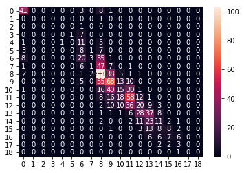
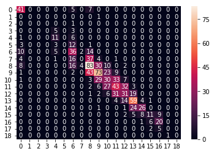
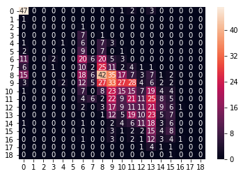
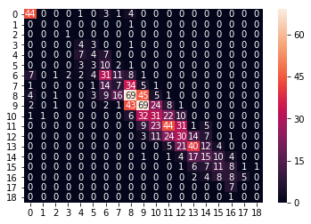
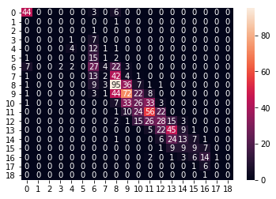
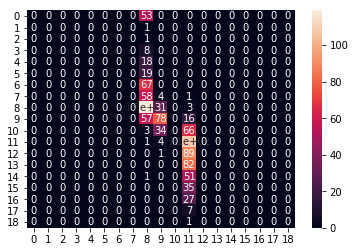

```python
import tensorflow as tf
import pandas as pd
import numpy as np
import copy as cp
import seaborn as sns

from sklearn.metrics import accuracy_score
from sklearn.model_selection import train_test_split
from sklearn.model_selection import KFold
from sklearn.cross_validation import cross_val_score

import warnings
def ignore_warn(*args, **kwargs):
    pass
warnings.warn = ignore_warn #ignore annoying warning (from sklearn and seaborn)

from scipy import stats
from scipy.stats import norm, skew #for some statistics

from sklearn.metrics import confusion_matrix
import matplotlib
import matplotlib.pyplot as plt
```

# 분류 모델 적용

## Student Performance Dataset

* 본 데이터는 의미있는 수치형 변수가 없다. 

* 모든 변수들이 명목형이거나 순서형으로, 범주형 자료에 속한다.

* 이에 따라 우선 머신러닝 기법 중에서는 regression을 하기 보다는 분류만 적용해보기로 한다.

+) tensorflow를 사용하거나 sklearn을 사용한다

### 전처리된 데이터 불러오기


```python
stdt_union = pd.read_csv("clean_stdt_union.csv", sep=",")
stdt_union_reduct = pd.read_csv("reducted_stdt_union.csv", sep=",")
stdt_union_pca = pd.read_csv("pca_clean_stdt_union.csv", sep=",")
```


```python
X_df = cp.copy(stdt_union)
del X_df['G3']
y_df = cp.copy(stdt_union['G3'])
```

### 우선 전체 데이터를 사용한다.
### sklearn 패키지를 사용한 것은 아래 함수로 10fold 평가할 수 있다


```python

def cross_validation(model, X, y, cv = 0, n_jobs=1):
    scores = cross_val_score(estimator=model, 
                             X=X, 
                             y=y, 
                             cv=10,
                             n_jobs=1)
    print('CV accuracy scores: %s' % scores)
    print('CV accuracy: %.3f +/- %.3f' % (np.mean(scores), np.std(scores)))
    return np.mean(scores)
```

## classifier의 종류
1. kNN
2. Decision trees
3. naive Bayes
4. Logistic regression
5. SVM

### 앙상블 기법
* bagging
* boosting (adaboost)
* random forest

## 1. kNN 


```python
from sklearn.neighbors import KNeighborsClassifier
```


```python
def KNN10fold(X_df, y_df) :
    cv = KFold(10, shuffle=True, random_state=0)
    df = pd.concat([X_df,y_df],axis=1)

    total_accuracys = []
    for n in range(1,40):
        accuracys = []
        for i, (idx_train, idx_test) in enumerate(cv.split(df)):
            y_train = df.iloc[idx_train,-1]
            X_train = df.iloc[idx_train, 0:-1]
            X_test = df.iloc[idx_test, 0:-1]
            y_test = df.iloc[idx_test, -1]

            knn = KNeighborsClassifier(n_neighbors = n)
            knn.fit(X_train,y_train)

            #print("훈련 세트 정확도: {:.3f}".format(tree.score(X_train, y_train)))
            #print("테스트 세트 정확도: {:.3f}".format(tree.score(X_test, y_test)))
            #print("전체 세트 정확도: {:.3f}".format(tree.score(X, y)))

            y_pred = knn.predict(X_test)
            accuracy = accuracy_score(y_test,y_pred)

            #for y, p in zip(y_test,y_pred):
            #    print(y, "\t", p)
            #print(accuracy)
            accuracys.append(accuracy)
        total_accuracy = np.array(accuracys).mean()
        total_accuracys.append(total_accuracy)
        
    print("n : ", total_accuracys.index(max(total_accuracys))+1, "accuracy : ", max(total_accuracys))
```


```python
KNN10fold(X_df,y_df)
```

    n :  26 accuracy :  0.3726190476190476
    


* 아래는 그에 대한 시각화이다.
* confusion matrix 함수는 sklearn 패키지 전체 모델들이 범용적으로 사용 가능하다.
* 10fold 각각 수행중에 test set과 predict set을 저장하여 한번에 confusion matrix 형태로 그려낸다


```python


def ConfusionMatrix (model, X_df, y_df):
    preds = []
    ys=[]
    test_accuracys = []
    cv = KFold(10, shuffle=True, random_state=0)
    df = pd.concat([X_df,y_df],axis=1)

    for i, (idx_train, idx_test) in enumerate(cv.split(df)):
        y_train = df.iloc[idx_train,-1]
        X_train = df.iloc[idx_train, 0:-1]
        X_test = df.iloc[idx_test, 0:-1]
        y_test = df.iloc[idx_test, -1]

        
        model.fit(X_train, y_train)

        test_accuracy = model.score(X_test,y_test)
        test_accuracys.append(test_accuracy)


        predicted = model.predict(X_test)

        ys.append(y_test)
        preds.append(predicted)

    print(np.array(test_accuracys).mean())
    unlist_y = []
    unlist_p = []

    for yl, pl in zip(ys, preds):
        for y, p in zip(yl, pl):
            unlist_y.append(y)
            unlist_p.append(p)

    %matplotlib inline
    cm = pd.DataFrame(confusion_matrix(unlist_y, unlist_p))
    sns.heatmap(cm, annot=True)
    return cm
    
```


```python
knn = KNeighborsClassifier(n_neighbors = 26)

ConfusionMatrix(knn,X_df,y_df)
```

    0.3726190476190476
    


<div>
<style scoped>
    .dataframe tbody tr th:only-of-type {
        vertical-align: middle;
    }

    .dataframe tbody tr th {
        vertical-align: top;
    }

    .dataframe thead th {
        text-align: right;
    }
</style>
<table border="1" class="dataframe">
  <thead>
    <tr style="text-align: right;">
      <th></th>
      <th>0</th>
      <th>1</th>
      <th>2</th>
      <th>3</th>
      <th>4</th>
      <th>5</th>
      <th>6</th>
      <th>7</th>
      <th>8</th>
      <th>9</th>
      <th>10</th>
      <th>11</th>
      <th>12</th>
      <th>13</th>
      <th>14</th>
      <th>15</th>
      <th>16</th>
      <th>17</th>
      <th>18</th>
    </tr>
  </thead>
  <tbody>
    <tr>
      <th>0</th>
      <td>41</td>
      <td>0</td>
      <td>0</td>
      <td>0</td>
      <td>0</td>
      <td>0</td>
      <td>3</td>
      <td>0</td>
      <td>8</td>
      <td>1</td>
      <td>0</td>
      <td>0</td>
      <td>0</td>
      <td>0</td>
      <td>0</td>
      <td>0</td>
      <td>0</td>
      <td>0</td>
      <td>0</td>
    </tr>
    <tr>
      <th>1</th>
      <td>0</td>
      <td>0</td>
      <td>0</td>
      <td>0</td>
      <td>0</td>
      <td>0</td>
      <td>0</td>
      <td>0</td>
      <td>1</td>
      <td>0</td>
      <td>0</td>
      <td>0</td>
      <td>0</td>
      <td>0</td>
      <td>0</td>
      <td>0</td>
      <td>0</td>
      <td>0</td>
      <td>0</td>
    </tr>
    <tr>
      <th>2</th>
      <td>0</td>
      <td>0</td>
      <td>0</td>
      <td>0</td>
      <td>0</td>
      <td>0</td>
      <td>1</td>
      <td>0</td>
      <td>0</td>
      <td>0</td>
      <td>0</td>
      <td>0</td>
      <td>0</td>
      <td>0</td>
      <td>0</td>
      <td>0</td>
      <td>0</td>
      <td>0</td>
      <td>0</td>
    </tr>
    <tr>
      <th>3</th>
      <td>0</td>
      <td>0</td>
      <td>0</td>
      <td>0</td>
      <td>0</td>
      <td>1</td>
      <td>7</td>
      <td>0</td>
      <td>0</td>
      <td>0</td>
      <td>0</td>
      <td>0</td>
      <td>0</td>
      <td>0</td>
      <td>0</td>
      <td>0</td>
      <td>0</td>
      <td>0</td>
      <td>0</td>
    </tr>
    <tr>
      <th>4</th>
      <td>1</td>
      <td>0</td>
      <td>0</td>
      <td>0</td>
      <td>1</td>
      <td>0</td>
      <td>11</td>
      <td>0</td>
      <td>5</td>
      <td>0</td>
      <td>0</td>
      <td>0</td>
      <td>0</td>
      <td>0</td>
      <td>0</td>
      <td>0</td>
      <td>0</td>
      <td>0</td>
      <td>0</td>
    </tr>
    <tr>
      <th>5</th>
      <td>3</td>
      <td>0</td>
      <td>0</td>
      <td>0</td>
      <td>0</td>
      <td>0</td>
      <td>8</td>
      <td>1</td>
      <td>7</td>
      <td>0</td>
      <td>0</td>
      <td>0</td>
      <td>0</td>
      <td>0</td>
      <td>0</td>
      <td>0</td>
      <td>0</td>
      <td>0</td>
      <td>0</td>
    </tr>
    <tr>
      <th>6</th>
      <td>8</td>
      <td>0</td>
      <td>0</td>
      <td>0</td>
      <td>0</td>
      <td>0</td>
      <td>20</td>
      <td>3</td>
      <td>35</td>
      <td>1</td>
      <td>0</td>
      <td>0</td>
      <td>0</td>
      <td>0</td>
      <td>0</td>
      <td>0</td>
      <td>0</td>
      <td>0</td>
      <td>0</td>
    </tr>
    <tr>
      <th>7</th>
      <td>1</td>
      <td>0</td>
      <td>0</td>
      <td>0</td>
      <td>0</td>
      <td>0</td>
      <td>6</td>
      <td>1</td>
      <td>47</td>
      <td>7</td>
      <td>0</td>
      <td>1</td>
      <td>0</td>
      <td>0</td>
      <td>0</td>
      <td>0</td>
      <td>0</td>
      <td>0</td>
      <td>0</td>
    </tr>
    <tr>
      <th>8</th>
      <td>2</td>
      <td>0</td>
      <td>0</td>
      <td>0</td>
      <td>0</td>
      <td>0</td>
      <td>1</td>
      <td>2</td>
      <td>103</td>
      <td>38</td>
      <td>5</td>
      <td>1</td>
      <td>1</td>
      <td>0</td>
      <td>0</td>
      <td>0</td>
      <td>0</td>
      <td>0</td>
      <td>0</td>
    </tr>
    <tr>
      <th>9</th>
      <td>0</td>
      <td>0</td>
      <td>0</td>
      <td>0</td>
      <td>0</td>
      <td>0</td>
      <td>5</td>
      <td>0</td>
      <td>55</td>
      <td>68</td>
      <td>13</td>
      <td>10</td>
      <td>0</td>
      <td>0</td>
      <td>0</td>
      <td>0</td>
      <td>0</td>
      <td>0</td>
      <td>0</td>
    </tr>
    <tr>
      <th>10</th>
      <td>1</td>
      <td>0</td>
      <td>0</td>
      <td>0</td>
      <td>0</td>
      <td>0</td>
      <td>0</td>
      <td>0</td>
      <td>16</td>
      <td>40</td>
      <td>15</td>
      <td>30</td>
      <td>1</td>
      <td>0</td>
      <td>0</td>
      <td>0</td>
      <td>0</td>
      <td>0</td>
      <td>0</td>
    </tr>
    <tr>
      <th>11</th>
      <td>0</td>
      <td>0</td>
      <td>0</td>
      <td>0</td>
      <td>0</td>
      <td>0</td>
      <td>0</td>
      <td>0</td>
      <td>8</td>
      <td>16</td>
      <td>18</td>
      <td>58</td>
      <td>12</td>
      <td>1</td>
      <td>0</td>
      <td>0</td>
      <td>0</td>
      <td>0</td>
      <td>0</td>
    </tr>
    <tr>
      <th>12</th>
      <td>0</td>
      <td>0</td>
      <td>0</td>
      <td>0</td>
      <td>0</td>
      <td>0</td>
      <td>0</td>
      <td>0</td>
      <td>2</td>
      <td>10</td>
      <td>10</td>
      <td>36</td>
      <td>20</td>
      <td>9</td>
      <td>3</td>
      <td>0</td>
      <td>0</td>
      <td>0</td>
      <td>0</td>
    </tr>
    <tr>
      <th>13</th>
      <td>0</td>
      <td>0</td>
      <td>0</td>
      <td>0</td>
      <td>0</td>
      <td>0</td>
      <td>0</td>
      <td>0</td>
      <td>1</td>
      <td>1</td>
      <td>1</td>
      <td>6</td>
      <td>28</td>
      <td>37</td>
      <td>8</td>
      <td>0</td>
      <td>0</td>
      <td>0</td>
      <td>0</td>
    </tr>
    <tr>
      <th>14</th>
      <td>0</td>
      <td>0</td>
      <td>0</td>
      <td>0</td>
      <td>0</td>
      <td>0</td>
      <td>0</td>
      <td>0</td>
      <td>2</td>
      <td>0</td>
      <td>0</td>
      <td>2</td>
      <td>11</td>
      <td>23</td>
      <td>11</td>
      <td>2</td>
      <td>1</td>
      <td>0</td>
      <td>0</td>
    </tr>
    <tr>
      <th>15</th>
      <td>0</td>
      <td>0</td>
      <td>0</td>
      <td>0</td>
      <td>0</td>
      <td>0</td>
      <td>0</td>
      <td>0</td>
      <td>0</td>
      <td>1</td>
      <td>0</td>
      <td>0</td>
      <td>3</td>
      <td>13</td>
      <td>8</td>
      <td>8</td>
      <td>2</td>
      <td>0</td>
      <td>0</td>
    </tr>
    <tr>
      <th>16</th>
      <td>0</td>
      <td>0</td>
      <td>0</td>
      <td>0</td>
      <td>0</td>
      <td>0</td>
      <td>0</td>
      <td>0</td>
      <td>0</td>
      <td>0</td>
      <td>0</td>
      <td>2</td>
      <td>0</td>
      <td>6</td>
      <td>6</td>
      <td>7</td>
      <td>6</td>
      <td>0</td>
      <td>0</td>
    </tr>
    <tr>
      <th>17</th>
      <td>0</td>
      <td>0</td>
      <td>0</td>
      <td>0</td>
      <td>0</td>
      <td>0</td>
      <td>0</td>
      <td>0</td>
      <td>0</td>
      <td>0</td>
      <td>0</td>
      <td>0</td>
      <td>0</td>
      <td>0</td>
      <td>2</td>
      <td>2</td>
      <td>3</td>
      <td>0</td>
      <td>0</td>
    </tr>
    <tr>
      <th>18</th>
      <td>0</td>
      <td>0</td>
      <td>0</td>
      <td>0</td>
      <td>0</td>
      <td>0</td>
      <td>0</td>
      <td>0</td>
      <td>0</td>
      <td>0</td>
      <td>0</td>
      <td>0</td>
      <td>0</td>
      <td>0</td>
      <td>0</td>
      <td>0</td>
      <td>1</td>
      <td>0</td>
      <td>0</td>
    </tr>
  </tbody>
</table>
</div>





### kNN결과
* ** 정확도 37.26% ** 로 그다지 정확하지 않다.
* 데이터의 부족이 여실히 드러난다..

#### kNN이 정확도가 낮은 이유
* 데이터가 충분해야 잘 동작
* 데이터가 많을 때 kNN을 적용해 이상한 데이터들을 제거하거나 입력 데이터를 특징들의 집합으로 변환하여 특징을 추출할때 오히려 사용되는 편


## 2. Decision Trees


```python
from sklearn.tree import DecisionTreeClassifier
from sklearn.model_selection import train_test_split

```


```python
def DecisionTree10fold(X_df, y_df):
    cv = KFold(10, shuffle=True, random_state=0)
    df = pd.concat([X_df,y_df],axis=1)
    depth_accuracys = []
    
    for depth in range(1,len(X_df.columns)):
        accuracys = []
        for i, (idx_train, idx_test) in enumerate(cv.split(df)):
                y_train = df.iloc[idx_train,-1]
                X_train = df.iloc[idx_train, 0:-1]
                X_test = df.iloc[idx_test, 0:-1]
                y_test = df.iloc[idx_test, -1]

                tree = DecisionTreeClassifier(random_state=0, max_depth=depth)
                tree.fit(X_train, y_train)
                #print("훈련 세트 정확도: {:.3f}".format(tree.score(X_train, y_train)))
                #print("테스트 세트 정확도: {:.3f}".format(tree.score(X_test, y_test)))
                #print("전체 세트 정확도: {:.3f}".format(tree.score(X, y)))

                accuracys.append(tree.score(X_test,y_test))
        accuracy = sum(accuracys)/10
        #print("depth : ", depth, "accuracy : ", accuracy);
        depth_accuracys.append(accuracy)
    print("depth : ", depth_accuracys.index(max(depth_accuracys))+1,"accuracy : ",  max(depth_accuracys))
    return max(depth_accuracys)
    
```


```python
DecisionTree10fold(X_df,y_df)

```

    depth :  5 accuracy :  0.44441391941391933
    


    0.44441391941391933


**depth 5에서 44.44%의 정확도를 보인다.**
### Using Cross validation function


```python
result = []

for n in range(1,len(X_df.columns)):
    tree = DecisionTreeClassifier(max_depth=n, random_state=0)
    result.append(cross_validation(tree, X_df, y_df))
```

    CV accuracy scores: [0.23478261 0.25225225 0.24770642 0.25       0.24038462 0.22330097
     0.25242718 0.26       0.25510204 0.25773196]
    CV accuracy: 0.247 +/- 0.011
    CV accuracy scores: [0.34782609 0.37837838 0.34862385 0.36538462 0.34615385 0.3592233
     0.32038835 0.32       0.33673469 0.31958763]
    CV accuracy: 0.344 +/- 0.019
    CV accuracy scores: [0.49565217 0.4954955  0.42201835 0.47115385 0.36538462 0.37864078
     0.36893204 0.43       0.3877551  0.51546392]
    CV accuracy: 0.433 +/- 0.055
    CV accuracy scores: [0.46956522 0.53153153 0.44036697 0.44230769 0.375      0.36893204
     0.44660194 0.44       0.3877551  0.49484536]
    CV accuracy: 0.440 +/- 0.049
    CV accuracy scores: [0.47826087 0.45945946 0.4587156  0.44230769 0.48076923 0.40776699
     0.39805825 0.46       0.41836735 0.44329897]
    CV accuracy: 0.445 +/- 0.027
    CV accuracy scores: [0.47826087 0.48648649 0.3853211  0.36538462 0.40384615 0.38834951
     0.42718447 0.42       0.44897959 0.43298969]
    CV accuracy: 0.424 +/- 0.038
    CV accuracy scores: [0.40869565 0.51351351 0.35779817 0.43269231 0.45192308 0.37864078
     0.33009709 0.4        0.43877551 0.42268041]
    CV accuracy: 0.413 +/- 0.049
    CV accuracy scores: [0.39130435 0.51351351 0.32110092 0.40384615 0.42307692 0.33980583
     0.33009709 0.31       0.35714286 0.39175258]
    CV accuracy: 0.378 +/- 0.058
    CV accuracy scores: [0.31304348 0.45945946 0.31192661 0.41346154 0.36538462 0.34951456
     0.33009709 0.27       0.34693878 0.37113402]
    CV accuracy: 0.353 +/- 0.051
    CV accuracy scores: [0.31304348 0.40540541 0.31192661 0.42307692 0.29807692 0.34951456
     0.32038835 0.26       0.35714286 0.36082474]
    CV accuracy: 0.340 +/- 0.047
    CV accuracy scores: [0.34782609 0.42342342 0.31192661 0.35576923 0.36538462 0.30097087
     0.32038835 0.23       0.3877551  0.41237113]
    CV accuracy: 0.346 +/- 0.055
    CV accuracy scores: [0.35652174 0.41441441 0.29357798 0.39423077 0.33653846 0.32038835
     0.2815534  0.24       0.31632653 0.41237113]
    CV accuracy: 0.337 +/- 0.055
    CV accuracy scores: [0.33913043 0.38738739 0.26605505 0.32692308 0.29807692 0.32038835
     0.32038835 0.25       0.35714286 0.41237113]
    CV accuracy: 0.328 +/- 0.047
    CV accuracy scores: [0.33043478 0.43243243 0.32110092 0.34615385 0.30769231 0.32038835
     0.33009709 0.26       0.39795918 0.40206186]
    CV accuracy: 0.345 +/- 0.049
    CV accuracy scores: [0.30434783 0.42342342 0.32110092 0.34615385 0.36538462 0.33980583
     0.33980583 0.26       0.34693878 0.37113402]
    CV accuracy: 0.342 +/- 0.041
    CV accuracy scores: [0.33913043 0.3963964  0.32110092 0.33653846 0.375      0.33980583
     0.33009709 0.27       0.35714286 0.3814433 ]
    CV accuracy: 0.345 +/- 0.034
    CV accuracy scores: [0.33043478 0.42342342 0.33027523 0.34615385 0.36538462 0.33980583
     0.33009709 0.24       0.40816327 0.3814433 ]
    CV accuracy: 0.350 +/- 0.048
    CV accuracy scores: [0.33913043 0.42342342 0.33027523 0.35576923 0.36538462 0.33980583
     0.33009709 0.24       0.40816327 0.40206186]
    CV accuracy: 0.353 +/- 0.050
    CV accuracy scores: [0.33913043 0.42342342 0.33027523 0.33653846 0.36538462 0.33980583
     0.33009709 0.24       0.40816327 0.40206186]
    CV accuracy: 0.351 +/- 0.050
    CV accuracy scores: [0.33913043 0.42342342 0.33027523 0.35576923 0.36538462 0.33980583
     0.33009709 0.24       0.40816327 0.40206186]
    CV accuracy: 0.353 +/- 0.050
    CV accuracy scores: [0.33913043 0.42342342 0.33027523 0.35576923 0.36538462 0.33980583
     0.33009709 0.24       0.40816327 0.40206186]
    CV accuracy: 0.353 +/- 0.050
    CV accuracy scores: [0.33913043 0.42342342 0.33027523 0.35576923 0.36538462 0.33980583
     0.33009709 0.24       0.40816327 0.40206186]
    CV accuracy: 0.353 +/- 0.050
    CV accuracy scores: [0.33913043 0.42342342 0.33027523 0.35576923 0.36538462 0.33980583
     0.33009709 0.24       0.40816327 0.40206186]
    CV accuracy: 0.353 +/- 0.050
    CV accuracy scores: [0.33913043 0.42342342 0.33027523 0.35576923 0.36538462 0.33980583
     0.33009709 0.24       0.40816327 0.40206186]
    CV accuracy: 0.353 +/- 0.050
    CV accuracy scores: [0.33913043 0.42342342 0.33027523 0.35576923 0.36538462 0.33980583
     0.33009709 0.24       0.40816327 0.40206186]
    CV accuracy: 0.353 +/- 0.050
    CV accuracy scores: [0.33913043 0.42342342 0.33027523 0.35576923 0.36538462 0.33980583
     0.33009709 0.24       0.40816327 0.40206186]
    CV accuracy: 0.353 +/- 0.050
    CV accuracy scores: [0.33913043 0.42342342 0.33027523 0.35576923 0.36538462 0.33980583
     0.33009709 0.24       0.40816327 0.40206186]
    CV accuracy: 0.353 +/- 0.050
    CV accuracy scores: [0.33913043 0.42342342 0.33027523 0.35576923 0.36538462 0.33980583
     0.33009709 0.24       0.40816327 0.40206186]
    CV accuracy: 0.353 +/- 0.050
    CV accuracy scores: [0.33913043 0.42342342 0.33027523 0.35576923 0.36538462 0.33980583
     0.33009709 0.24       0.40816327 0.40206186]
    CV accuracy: 0.353 +/- 0.050
    CV accuracy scores: [0.33913043 0.42342342 0.33027523 0.35576923 0.36538462 0.33980583
     0.33009709 0.24       0.40816327 0.40206186]
    CV accuracy: 0.353 +/- 0.050
    CV accuracy scores: [0.33913043 0.42342342 0.33027523 0.35576923 0.36538462 0.33980583
     0.33009709 0.24       0.40816327 0.40206186]
    CV accuracy: 0.353 +/- 0.050
    CV accuracy scores: [0.33913043 0.42342342 0.33027523 0.35576923 0.36538462 0.33980583
     0.33009709 0.24       0.40816327 0.40206186]
    CV accuracy: 0.353 +/- 0.050
    CV accuracy scores: [0.33913043 0.42342342 0.33027523 0.35576923 0.36538462 0.33980583
     0.33009709 0.24       0.40816327 0.40206186]
    CV accuracy: 0.353 +/- 0.050
    CV accuracy scores: [0.33913043 0.42342342 0.33027523 0.35576923 0.36538462 0.33980583
     0.33009709 0.24       0.40816327 0.40206186]
    CV accuracy: 0.353 +/- 0.050
    CV accuracy scores: [0.33913043 0.42342342 0.33027523 0.35576923 0.36538462 0.33980583
     0.33009709 0.24       0.40816327 0.40206186]
    CV accuracy: 0.353 +/- 0.050
    CV accuracy scores: [0.33913043 0.42342342 0.33027523 0.35576923 0.36538462 0.33980583
     0.33009709 0.24       0.40816327 0.40206186]
    CV accuracy: 0.353 +/- 0.050
    CV accuracy scores: [0.33913043 0.42342342 0.33027523 0.35576923 0.36538462 0.33980583
     0.33009709 0.24       0.40816327 0.40206186]
    CV accuracy: 0.353 +/- 0.050
    CV accuracy scores: [0.33913043 0.42342342 0.33027523 0.35576923 0.36538462 0.33980583
     0.33009709 0.24       0.40816327 0.40206186]
    CV accuracy: 0.353 +/- 0.050
    CV accuracy scores: [0.33913043 0.42342342 0.33027523 0.35576923 0.36538462 0.33980583
     0.33009709 0.24       0.40816327 0.40206186]
    CV accuracy: 0.353 +/- 0.050
    CV accuracy scores: [0.33913043 0.42342342 0.33027523 0.35576923 0.36538462 0.33980583
     0.33009709 0.24       0.40816327 0.40206186]
    CV accuracy: 0.353 +/- 0.050
    CV accuracy scores: [0.33913043 0.42342342 0.33027523 0.35576923 0.36538462 0.33980583
     0.33009709 0.24       0.40816327 0.40206186]
    CV accuracy: 0.353 +/- 0.050
    CV accuracy scores: [0.33913043 0.42342342 0.33027523 0.35576923 0.36538462 0.33980583
     0.33009709 0.24       0.40816327 0.40206186]
    CV accuracy: 0.353 +/- 0.050
    CV accuracy scores: [0.33913043 0.42342342 0.33027523 0.35576923 0.36538462 0.33980583
     0.33009709 0.24       0.40816327 0.40206186]
    CV accuracy: 0.353 +/- 0.050
    CV accuracy scores: [0.33913043 0.42342342 0.33027523 0.35576923 0.36538462 0.33980583
     0.33009709 0.24       0.40816327 0.40206186]
    CV accuracy: 0.353 +/- 0.050
    CV accuracy scores: [0.33913043 0.42342342 0.33027523 0.35576923 0.36538462 0.33980583
     0.33009709 0.24       0.40816327 0.40206186]
    CV accuracy: 0.353 +/- 0.050
    CV accuracy scores: [0.33913043 0.42342342 0.33027523 0.35576923 0.36538462 0.33980583
     0.33009709 0.24       0.40816327 0.40206186]
    CV accuracy: 0.353 +/- 0.050
    CV accuracy scores: [0.33913043 0.42342342 0.33027523 0.35576923 0.36538462 0.33980583
     0.33009709 0.24       0.40816327 0.40206186]
    CV accuracy: 0.353 +/- 0.050
    CV accuracy scores: [0.33913043 0.42342342 0.33027523 0.35576923 0.36538462 0.33980583
     0.33009709 0.24       0.40816327 0.40206186]
    CV accuracy: 0.353 +/- 0.050
    


```python
print("depth : ",result.index(max(result))+1,"accuracy : ",max(result)) 
```

    depth :  5 accuracy :  0.44470044071612624
    

#### cross validation에서도 마찬가지로 depth = 5에서 가장 큰 정확도 44.47%을 보인다

### Random forest 사용


```python
from sklearn.ensemble import RandomForestClassifier
```


```python
def RandomForest10fold(X_df, y_df):
    cv = KFold(10, shuffle=True, random_state=0)
    df = pd.concat([X_df,y_df],axis=1)
    depth_accuracys = []
    
    for depth in range(1,len(X_df.columns)):
        accuracys = []
        for i, (idx_train, idx_test) in enumerate(cv.split(df)):
                y_train = df.iloc[idx_train,-1]
                X_train = df.iloc[idx_train, 0:-1]
                X_test = df.iloc[idx_test, 0:-1]
                y_test = df.iloc[idx_test, -1]

                forest = RandomForestClassifier(n_estimators=depth, random_state=0)
                forest.fit(X_train, y_train)
                #print("훈련 세트 정확도: {:.3f}".format(tree.score(X_train, y_train)))
                #print("테스트 세트 정확도: {:.3f}".format(tree.score(X_test, y_test)))
                #print("전체 세트 정확도: {:.3f}".format(tree.score(X, y)))

                accuracys.append(forest.score(X_test,y_test))
        accuracy = sum(accuracys)/10
        #print("depth : ", depth, "accuracy : ", accuracy);
        depth_accuracys.append(accuracy)
    return depth_accuracys
    
```


```python
result=RandomForest10fold(X_df,y_df)
print("n : ", result.index(max(result))+1,"accuracy : ",  max(result))
```

    n :  37 accuracy :  0.386978021978022
    

#### n_estimator 37에서 38.70%의 정확도를 가지는데, decision tree보다 오히려 낮아졌다.


```python
from sklearn.metrics import accuracy_score

cv = KFold(10, shuffle=True, random_state=0)
df = pd.concat([X_df,y_df],axis=1)
depth_accuracys = []
for depth in range(1,len(X_df.columns)):
    accuracys = []
    for i, (idx_train, idx_test) in enumerate(cv.split(df)):
        y_train = df.iloc[idx_train,-1]
        X_train = df.iloc[idx_train, 0:-1]
        X_test = df.iloc[idx_test, 0:-1]
        y_test = df.iloc[idx_test, -1]

        forest = RandomForestClassifier(n_estimators=depth, random_state=0)
        forest.fit(X_train, y_train)
        predicted = forest.predict(X_test)
        accuracy = accuracy_score(y_test, predicted)
        accuracys.append(accuracy)

    depth_accuracy= sum(accuracys)/len(accuracys)
    depth_accuracys.append(depth_accuracy)

print("n : ", depth_accuracys.index(max(depth_accuracys))+1, "accuracy : ", max(depth_accuracys))
        
```

    n :  37 accuracy :  0.386978021978022
    

**정확도 계산에 accuracy_score를 이용해도 같은 결과**

### Using Cross validation function


```python
result = []

for n in range(1,len(X_df.columns)):
    forest = RandomForestClassifier(n_estimators=n, random_state=0)
    result.append(cross_validation(forest, X_df, y_df))
```

    CV accuracy scores: [0.17391304 0.25225225 0.25688073 0.26923077 0.28846154 0.21359223
     0.25242718 0.22       0.25510204 0.20618557]
    CV accuracy: 0.239 +/- 0.033
    CV accuracy scores: [0.2173913  0.27927928 0.19266055 0.24038462 0.16346154 0.15533981
     0.25242718 0.23       0.2244898  0.22680412]
    CV accuracy: 0.218 +/- 0.036
    CV accuracy scores: [0.22608696 0.27927928 0.25688073 0.15384615 0.22115385 0.14563107
     0.21359223 0.15       0.23469388 0.21649485]
    CV accuracy: 0.210 +/- 0.044
    CV accuracy scores: [0.2173913  0.2972973  0.26605505 0.17307692 0.25961538 0.21359223
     0.33980583 0.21       0.21428571 0.22680412]
    CV accuracy: 0.242 +/- 0.047
    CV accuracy scores: [0.20869565 0.2972973  0.29357798 0.18269231 0.30769231 0.18446602
     0.29126214 0.21       0.23469388 0.26804124]
    CV accuracy: 0.248 +/- 0.047
    CV accuracy scores: [0.22608696 0.33333333 0.31192661 0.20192308 0.28846154 0.21359223
     0.32038835 0.2        0.23469388 0.29896907]
    CV accuracy: 0.263 +/- 0.050
    CV accuracy scores: [0.22608696 0.36036036 0.33944954 0.23076923 0.32692308 0.21359223
     0.29126214 0.18       0.20408163 0.31958763]
    CV accuracy: 0.269 +/- 0.062
    CV accuracy scores: [0.26956522 0.36936937 0.33027523 0.24038462 0.29807692 0.24271845
     0.33980583 0.19       0.26530612 0.34020619]
    CV accuracy: 0.289 +/- 0.054
    CV accuracy scores: [0.27826087 0.32432432 0.36697248 0.25961538 0.32692308 0.26213592
     0.32038835 0.22       0.29591837 0.30927835]
    CV accuracy: 0.296 +/- 0.040
    CV accuracy scores: [0.29565217 0.36036036 0.35779817 0.26923077 0.31730769 0.27184466
     0.32038835 0.25       0.29591837 0.31958763]
    CV accuracy: 0.306 +/- 0.035
    CV accuracy scores: [0.27826087 0.36936937 0.3853211  0.28846154 0.26923077 0.2815534
     0.32038835 0.26       0.26530612 0.32989691]
    CV accuracy: 0.305 +/- 0.042
    CV accuracy scores: [0.31304348 0.3963964  0.36697248 0.28846154 0.34615385 0.24271845
     0.33980583 0.25       0.29591837 0.32989691]
    CV accuracy: 0.317 +/- 0.046
    CV accuracy scores: [0.31304348 0.34234234 0.40366972 0.30769231 0.31730769 0.23300971
     0.37864078 0.26       0.33673469 0.32989691]
    CV accuracy: 0.322 +/- 0.048
    CV accuracy scores: [0.32173913 0.36036036 0.37614679 0.28846154 0.31730769 0.2815534
     0.37864078 0.25       0.32653061 0.30927835]
    CV accuracy: 0.321 +/- 0.040
    CV accuracy scores: [0.33043478 0.37837838 0.34862385 0.28846154 0.31730769 0.2815534
     0.40776699 0.27       0.31632653 0.31958763]
    CV accuracy: 0.326 +/- 0.041
    CV accuracy scores: [0.35652174 0.36036036 0.37614679 0.29807692 0.31730769 0.2815534
     0.34951456 0.27       0.30612245 0.35051546]
    CV accuracy: 0.327 +/- 0.035
    CV accuracy scores: [0.33913043 0.36936937 0.36697248 0.28846154 0.33653846 0.30097087
     0.34951456 0.26       0.30612245 0.35051546]
    CV accuracy: 0.327 +/- 0.034
    CV accuracy scores: [0.33913043 0.3963964  0.37614679 0.33653846 0.32692308 0.29126214
     0.36893204 0.25       0.32653061 0.3814433 ]
    CV accuracy: 0.339 +/- 0.042
    CV accuracy scores: [0.33913043 0.41441441 0.33027523 0.34615385 0.33653846 0.30097087
     0.37864078 0.29       0.33673469 0.36082474]
    CV accuracy: 0.343 +/- 0.034
    CV accuracy scores: [0.33913043 0.41441441 0.35779817 0.33653846 0.36538462 0.32038835
     0.36893204 0.3        0.32653061 0.34020619]
    CV accuracy: 0.347 +/- 0.030
    CV accuracy scores: [0.31304348 0.43243243 0.34862385 0.32692308 0.35576923 0.30097087
     0.37864078 0.29       0.30612245 0.29896907]
    CV accuracy: 0.335 +/- 0.042
    CV accuracy scores: [0.32173913 0.3963964  0.33027523 0.32692308 0.35576923 0.31067961
     0.37864078 0.3        0.29591837 0.30927835]
    CV accuracy: 0.333 +/- 0.032
    CV accuracy scores: [0.29565217 0.3963964  0.33027523 0.32692308 0.34615385 0.29126214
     0.37864078 0.31       0.32653061 0.30927835]
    CV accuracy: 0.331 +/- 0.032
    CV accuracy scores: [0.29565217 0.40540541 0.33027523 0.32692308 0.34615385 0.2815534
     0.38834951 0.32       0.32653061 0.32989691]
    CV accuracy: 0.335 +/- 0.036
    CV accuracy scores: [0.31304348 0.3963964  0.32110092 0.36538462 0.32692308 0.31067961
     0.36893204 0.31       0.32653061 0.35051546]
    CV accuracy: 0.339 +/- 0.028
    CV accuracy scores: [0.31304348 0.38738739 0.33027523 0.33653846 0.34615385 0.31067961
     0.36893204 0.3        0.31632653 0.32989691]
    CV accuracy: 0.334 +/- 0.026
    CV accuracy scores: [0.33043478 0.37837838 0.33944954 0.35576923 0.32692308 0.2815534
     0.37864078 0.31       0.33673469 0.31958763]
    CV accuracy: 0.336 +/- 0.028
    CV accuracy scores: [0.32173913 0.37837838 0.34862385 0.33653846 0.32692308 0.33009709
     0.3592233  0.3        0.35714286 0.32989691]
    CV accuracy: 0.339 +/- 0.021
    CV accuracy scores: [0.30434783 0.3963964  0.35779817 0.31730769 0.36538462 0.30097087
     0.36893204 0.25       0.34693878 0.31958763]
    CV accuracy: 0.333 +/- 0.040
    CV accuracy scores: [0.29565217 0.38738739 0.36697248 0.32692308 0.34615385 0.29126214
     0.36893204 0.28       0.34693878 0.30927835]
    CV accuracy: 0.332 +/- 0.035
    CV accuracy scores: [0.29565217 0.38738739 0.3853211  0.32692308 0.34615385 0.31067961
     0.33980583 0.28       0.33673469 0.29896907]
    CV accuracy: 0.331 +/- 0.034
    CV accuracy scores: [0.29565217 0.3963964  0.39449541 0.30769231 0.33653846 0.29126214
     0.33009709 0.28       0.33673469 0.32989691]
    CV accuracy: 0.330 +/- 0.038
    CV accuracy scores: [0.29565217 0.38738739 0.3853211  0.32692308 0.33653846 0.31067961
     0.31067961 0.28       0.35714286 0.31958763]
    CV accuracy: 0.331 +/- 0.034
    CV accuracy scores: [0.29565217 0.37837838 0.3853211  0.32692308 0.36538462 0.32038835
     0.33009709 0.3        0.35714286 0.31958763]
    CV accuracy: 0.338 +/- 0.030
    CV accuracy scores: [0.31304348 0.38738739 0.3853211  0.34615385 0.36538462 0.32038835
     0.33009709 0.3        0.35714286 0.29896907]
    CV accuracy: 0.340 +/- 0.031
    CV accuracy scores: [0.32173913 0.38738739 0.3853211  0.33653846 0.36538462 0.2815534
     0.3592233  0.3        0.34693878 0.31958763]
    CV accuracy: 0.340 +/- 0.033
    CV accuracy scores: [0.29565217 0.3963964  0.3853211  0.35576923 0.34615385 0.27184466
     0.3592233  0.29       0.33673469 0.32989691]
    CV accuracy: 0.337 +/- 0.039
    CV accuracy scores: [0.29565217 0.41441441 0.39449541 0.375      0.36538462 0.2815534
     0.34951456 0.29       0.34693878 0.28865979]
    CV accuracy: 0.340 +/- 0.046
    CV accuracy scores: [0.30434783 0.3963964  0.37614679 0.375      0.34615385 0.32038835
     0.34951456 0.3        0.36734694 0.29896907]
    CV accuracy: 0.343 +/- 0.034
    CV accuracy scores: [0.30434783 0.3963964  0.36697248 0.32692308 0.375      0.30097087
     0.3592233  0.32       0.33673469 0.28865979]
    CV accuracy: 0.338 +/- 0.034
    CV accuracy scores: [0.30434783 0.42342342 0.37614679 0.34615385 0.36538462 0.32038835
     0.36893204 0.3        0.33673469 0.28865979]
    CV accuracy: 0.343 +/- 0.039
    CV accuracy scores: [0.29565217 0.42342342 0.36697248 0.33653846 0.38461538 0.32038835
     0.34951456 0.29       0.33673469 0.30927835]
    CV accuracy: 0.341 +/- 0.039
    CV accuracy scores: [0.29565217 0.41441441 0.39449541 0.35576923 0.38461538 0.30097087
     0.34951456 0.29       0.34693878 0.29896907]
    CV accuracy: 0.343 +/- 0.043
    CV accuracy scores: [0.29565217 0.40540541 0.3853211  0.40384615 0.39423077 0.29126214
     0.37864078 0.31       0.33673469 0.28865979]
    CV accuracy: 0.349 +/- 0.047
    CV accuracy scores: [0.31304348 0.42342342 0.3853211  0.38461538 0.375      0.30097087
     0.37864078 0.29       0.34693878 0.30927835]
    CV accuracy: 0.351 +/- 0.043
    CV accuracy scores: [0.30434783 0.42342342 0.39449541 0.35576923 0.375      0.30097087
     0.33009709 0.31       0.35714286 0.27835052]
    CV accuracy: 0.343 +/- 0.044
    CV accuracy scores: [0.30434783 0.42342342 0.37614679 0.375      0.36538462 0.31067961
     0.34951456 0.29       0.36734694 0.28865979]
    CV accuracy: 0.345 +/- 0.042
    CV accuracy scores: [0.28695652 0.42342342 0.37614679 0.33653846 0.35576923 0.32038835
     0.36893204 0.3        0.37755102 0.28865979]
    CV accuracy: 0.343 +/- 0.043
    


```python
print("n : ", result.index(max(result))+1, "accuracy : ", max(result))
```

    n :  45 accuracy :  0.35072321637282144
    

** cross validation function 기준으로는 n = 45에서 35.07%로 가장 높다 **

## Decision Tree와 Random Forest 결과
### decision tree에 10fold를 적용했을때 max_depth = 5 에서 가장 성능이 좋아진다 (44.44%)

* 아래는 그에 대한 **시각화**이다.


```python
forest = DecisionTreeClassifier(max_depth=5, random_state=0)

cm = ConfusionMatrix(forest,X_df,y_df)
```

    0.44441391941391933
    





#### 사실 근접한 것까지 합치면 매우 잘 잡아내고 있는 편이다
예측변수인 G3을 10개의 class로만 줄여도 좋은 결과를 낼 것이라고 생각한다

## 3. naive Bayes

### 1) Gaussian NB
* multinomial data이지만 시험삼아 Gaussian도 적용해보았다.
* 그 대신 X 데이터를 scale로 표준화 해 준 뒤 적용하였다


```python
from sklearn.naive_bayes import GaussianNB
```


```python
X_float = cp.copy(X_df)

for i in range(len(X_df.columns)):
    X_float.iloc[:,i] = pd.to_numeric(X_df.iloc[:,i]).astype(float)

```


```python
from sklearn.preprocessing import scale
X_scale = pd.DataFrame(scale(X_float))
```


```python

def GNB10fold(X_df, y_df) :
    cv = KFold(10, shuffle=True, random_state=0)
    df = pd.concat([X_df,y_df],axis=1)
    accuracys = []
    for i, (idx_train, idx_test) in enumerate(cv.split(df)):
        y_train = df.iloc[idx_train,-1]
        X_train = df.iloc[idx_train, 0:-1]
        X_test = df.iloc[idx_test, 0:-1]
        y_test = df.iloc[idx_test, -1]

        gnb = GaussianNB()
        gnb.fit(X_train,y_train)
        
        #print("훈련 세트 정확도: {:.3f}".format(tree.score(X_train, y_train)))
        #print("테스트 세트 정확도: {:.3f}".format(tree.score(X_test, y_test)))
        #print("전체 세트 정확도: {:.3f}".format(tree.score(X, y)))

        y_pred = gnb.predict(X_test)
        accuracy = accuracy_score(y_test,y_pred)
        
        #for y, p in zip(y_test,y_pred):
        #    print(y, "\t", p)
        #print(accuracy)
        accuracys.append(accuracy)
    print(np.array(accuracys).mean())
```


```python
GNB10fold(X_scale,y_df)
```

    0.07478937728937729
    

#### 심각하게 결과가 좋지 않다.. X에 scale을 적용하지 않아도 마찬가지였다.


다음으로 MultinomialNB를 사용한다

### 2) MultinomialNB


```python
from sklearn.naive_bayes import MultinomialNB
```


```python

def MNB10fold(X_df, y_df, alpha = 1.0) :
    cv = KFold(10, shuffle=True, random_state=0)
    df = pd.concat([X_df,y_df],axis=1)
    accuracys = []
    for i, (idx_train, idx_test) in enumerate(cv.split(df)):
        y_train = df.iloc[idx_train,-1]
        X_train = df.iloc[idx_train, 0:-1]
        X_test = df.iloc[idx_test, 0:-1]
        y_test = df.iloc[idx_test, -1]

        mnb = MultinomialNB(alpha = alpha)
        mnb.fit(X_train,y_train)
        
        #print("훈련 세트 정확도: {:.3f}".format(tree.score(X_train, y_train)))
        #print("테스트 세트 정확도: {:.3f}".format(tree.score(X_test, y_test)))
        #print("전체 세트 정확도: {:.3f}".format(tree.score(X, y)))

        y_pred = mnb.predict(X_test)
        accuracy = accuracy_score(y_test,y_pred)
        
        #for y, p in zip(y_test,y_pred):
        #    print(y, "\t", p)
        #print(accuracy)
        accuracys.append(accuracy)
    print(np.array(accuracys).mean())
```


```python
MNB10fold(X_df,y_df)
```

    0.21649267399267397
    


```python
MNB10fold(X_df,y_df, 3)
```

    0.21746336996336996
    


```python
mnb = MultinomialNB(alpha = 3.0)

ConfusionMatrix(mnb, X_df, y_df)
```

    0.21746336996336996
    


<div>
<style scoped>
    .dataframe tbody tr th:only-of-type {
        vertical-align: middle;
    }

    .dataframe tbody tr th {
        vertical-align: top;
    }

    .dataframe thead th {
        text-align: right;
    }
</style>
<table border="1" class="dataframe">
  <thead>
    <tr style="text-align: right;">
      <th></th>
      <th>0</th>
      <th>1</th>
      <th>2</th>
      <th>3</th>
      <th>4</th>
      <th>5</th>
      <th>6</th>
      <th>7</th>
      <th>8</th>
      <th>9</th>
      <th>10</th>
      <th>11</th>
      <th>12</th>
      <th>13</th>
      <th>14</th>
      <th>15</th>
      <th>16</th>
      <th>17</th>
      <th>18</th>
    </tr>
  </thead>
  <tbody>
    <tr>
      <th>0</th>
      <td>47</td>
      <td>0</td>
      <td>0</td>
      <td>0</td>
      <td>0</td>
      <td>0</td>
      <td>0</td>
      <td>0</td>
      <td>0</td>
      <td>0</td>
      <td>1</td>
      <td>2</td>
      <td>0</td>
      <td>3</td>
      <td>0</td>
      <td>0</td>
      <td>0</td>
      <td>0</td>
      <td>0</td>
    </tr>
    <tr>
      <th>1</th>
      <td>1</td>
      <td>0</td>
      <td>0</td>
      <td>0</td>
      <td>0</td>
      <td>0</td>
      <td>0</td>
      <td>0</td>
      <td>0</td>
      <td>0</td>
      <td>0</td>
      <td>0</td>
      <td>0</td>
      <td>0</td>
      <td>0</td>
      <td>0</td>
      <td>0</td>
      <td>0</td>
      <td>0</td>
    </tr>
    <tr>
      <th>2</th>
      <td>0</td>
      <td>0</td>
      <td>0</td>
      <td>0</td>
      <td>0</td>
      <td>0</td>
      <td>1</td>
      <td>0</td>
      <td>0</td>
      <td>0</td>
      <td>0</td>
      <td>0</td>
      <td>0</td>
      <td>0</td>
      <td>0</td>
      <td>0</td>
      <td>0</td>
      <td>0</td>
      <td>0</td>
    </tr>
    <tr>
      <th>3</th>
      <td>0</td>
      <td>0</td>
      <td>0</td>
      <td>0</td>
      <td>0</td>
      <td>0</td>
      <td>7</td>
      <td>0</td>
      <td>1</td>
      <td>0</td>
      <td>0</td>
      <td>0</td>
      <td>0</td>
      <td>0</td>
      <td>0</td>
      <td>0</td>
      <td>0</td>
      <td>0</td>
      <td>0</td>
    </tr>
    <tr>
      <th>4</th>
      <td>1</td>
      <td>0</td>
      <td>0</td>
      <td>0</td>
      <td>1</td>
      <td>0</td>
      <td>6</td>
      <td>0</td>
      <td>7</td>
      <td>3</td>
      <td>0</td>
      <td>0</td>
      <td>0</td>
      <td>0</td>
      <td>0</td>
      <td>0</td>
      <td>0</td>
      <td>0</td>
      <td>0</td>
    </tr>
    <tr>
      <th>5</th>
      <td>2</td>
      <td>0</td>
      <td>0</td>
      <td>0</td>
      <td>0</td>
      <td>0</td>
      <td>9</td>
      <td>0</td>
      <td>7</td>
      <td>0</td>
      <td>1</td>
      <td>0</td>
      <td>0</td>
      <td>0</td>
      <td>0</td>
      <td>0</td>
      <td>0</td>
      <td>0</td>
      <td>0</td>
    </tr>
    <tr>
      <th>6</th>
      <td>11</td>
      <td>0</td>
      <td>0</td>
      <td>2</td>
      <td>0</td>
      <td>0</td>
      <td>20</td>
      <td>6</td>
      <td>20</td>
      <td>5</td>
      <td>3</td>
      <td>0</td>
      <td>0</td>
      <td>0</td>
      <td>0</td>
      <td>0</td>
      <td>0</td>
      <td>0</td>
      <td>0</td>
    </tr>
    <tr>
      <th>7</th>
      <td>6</td>
      <td>0</td>
      <td>0</td>
      <td>1</td>
      <td>0</td>
      <td>0</td>
      <td>10</td>
      <td>2</td>
      <td>25</td>
      <td>11</td>
      <td>2</td>
      <td>4</td>
      <td>1</td>
      <td>1</td>
      <td>0</td>
      <td>0</td>
      <td>0</td>
      <td>0</td>
      <td>0</td>
    </tr>
    <tr>
      <th>8</th>
      <td>15</td>
      <td>0</td>
      <td>0</td>
      <td>0</td>
      <td>0</td>
      <td>0</td>
      <td>18</td>
      <td>6</td>
      <td>42</td>
      <td>35</td>
      <td>17</td>
      <td>7</td>
      <td>3</td>
      <td>7</td>
      <td>1</td>
      <td>2</td>
      <td>0</td>
      <td>0</td>
      <td>0</td>
    </tr>
    <tr>
      <th>9</th>
      <td>3</td>
      <td>0</td>
      <td>0</td>
      <td>0</td>
      <td>2</td>
      <td>0</td>
      <td>12</td>
      <td>5</td>
      <td>27</td>
      <td>33</td>
      <td>27</td>
      <td>28</td>
      <td>4</td>
      <td>6</td>
      <td>2</td>
      <td>2</td>
      <td>0</td>
      <td>0</td>
      <td>0</td>
    </tr>
    <tr>
      <th>10</th>
      <td>1</td>
      <td>0</td>
      <td>0</td>
      <td>0</td>
      <td>0</td>
      <td>0</td>
      <td>7</td>
      <td>0</td>
      <td>8</td>
      <td>23</td>
      <td>15</td>
      <td>15</td>
      <td>7</td>
      <td>19</td>
      <td>4</td>
      <td>4</td>
      <td>0</td>
      <td>0</td>
      <td>0</td>
    </tr>
    <tr>
      <th>11</th>
      <td>0</td>
      <td>0</td>
      <td>0</td>
      <td>0</td>
      <td>0</td>
      <td>0</td>
      <td>4</td>
      <td>6</td>
      <td>2</td>
      <td>22</td>
      <td>9</td>
      <td>21</td>
      <td>11</td>
      <td>25</td>
      <td>8</td>
      <td>5</td>
      <td>0</td>
      <td>0</td>
      <td>0</td>
    </tr>
    <tr>
      <th>12</th>
      <td>0</td>
      <td>0</td>
      <td>0</td>
      <td>0</td>
      <td>0</td>
      <td>0</td>
      <td>2</td>
      <td>0</td>
      <td>3</td>
      <td>17</td>
      <td>9</td>
      <td>11</td>
      <td>11</td>
      <td>21</td>
      <td>9</td>
      <td>6</td>
      <td>1</td>
      <td>0</td>
      <td>0</td>
    </tr>
    <tr>
      <th>13</th>
      <td>0</td>
      <td>0</td>
      <td>0</td>
      <td>0</td>
      <td>0</td>
      <td>0</td>
      <td>0</td>
      <td>0</td>
      <td>1</td>
      <td>12</td>
      <td>5</td>
      <td>19</td>
      <td>10</td>
      <td>23</td>
      <td>5</td>
      <td>7</td>
      <td>0</td>
      <td>0</td>
      <td>0</td>
    </tr>
    <tr>
      <th>14</th>
      <td>1</td>
      <td>0</td>
      <td>0</td>
      <td>0</td>
      <td>0</td>
      <td>0</td>
      <td>1</td>
      <td>0</td>
      <td>0</td>
      <td>2</td>
      <td>4</td>
      <td>6</td>
      <td>11</td>
      <td>18</td>
      <td>3</td>
      <td>6</td>
      <td>0</td>
      <td>0</td>
      <td>0</td>
    </tr>
    <tr>
      <th>15</th>
      <td>0</td>
      <td>0</td>
      <td>0</td>
      <td>0</td>
      <td>0</td>
      <td>0</td>
      <td>0</td>
      <td>0</td>
      <td>0</td>
      <td>3</td>
      <td>1</td>
      <td>2</td>
      <td>2</td>
      <td>15</td>
      <td>4</td>
      <td>8</td>
      <td>0</td>
      <td>0</td>
      <td>0</td>
    </tr>
    <tr>
      <th>16</th>
      <td>0</td>
      <td>0</td>
      <td>0</td>
      <td>0</td>
      <td>0</td>
      <td>0</td>
      <td>1</td>
      <td>0</td>
      <td>0</td>
      <td>3</td>
      <td>0</td>
      <td>2</td>
      <td>1</td>
      <td>12</td>
      <td>3</td>
      <td>4</td>
      <td>1</td>
      <td>0</td>
      <td>0</td>
    </tr>
    <tr>
      <th>17</th>
      <td>0</td>
      <td>0</td>
      <td>0</td>
      <td>0</td>
      <td>0</td>
      <td>0</td>
      <td>0</td>
      <td>0</td>
      <td>0</td>
      <td>0</td>
      <td>0</td>
      <td>0</td>
      <td>1</td>
      <td>4</td>
      <td>1</td>
      <td>1</td>
      <td>0</td>
      <td>0</td>
      <td>0</td>
    </tr>
    <tr>
      <th>18</th>
      <td>0</td>
      <td>0</td>
      <td>0</td>
      <td>0</td>
      <td>0</td>
      <td>0</td>
      <td>0</td>
      <td>0</td>
      <td>0</td>
      <td>0</td>
      <td>0</td>
      <td>0</td>
      <td>0</td>
      <td>0</td>
      <td>0</td>
      <td>1</td>
      <td>0</td>
      <td>0</td>
      <td>0</td>
    </tr>
  </tbody>
</table>
</div>





### naive bayes가 잘 맞지 않는 이유
* 베이즈의 정리를 이용하는데, 이는 독립변수들 간에 독립임을 가정함
* 이 가정이 잘 맞아야 좋은 성능이 나옴
* 현재 텍스트 쪽에 많이 쓰임 (spam분류 등..)


## 4. Logistic Regression

LogisticRegression(penalty=’l2’, dual=False, tol=0.0001, C=1.0, fit_intercept=True, intercept_scaling=1, class_weight=None, random_state=None, solver=’warn’, max_iter=100, multi_class=’warn’, verbose=0, warm_start=False, n_jobs=None)


```python
from sklearn.linear_model import LogisticRegression
```

### 최적화 알고리즘 종류
* small data set & bionmial => liblinear
* big  data set => sag, saga
* multinomial => newton_cg, sag, saga, lbfgs

#### sag는 계산 중 수렴하지 않는 문제로 에러 발생하여 적용하지 않는다
C:\ProgramData\Anaconda3\lib\site-packages\sklearn\linear_model\sag.py:326: ConvergenceWarning: The max_iter was reached which means the coef_ did not converge
  "the coef_ did not converge", ConvergenceWarning)
  


```python
def logreg10fold(X_df, y_df, solver = 'newton-cg'):
    cv = KFold(10, shuffle=True, random_state=0)
    df = pd.concat([X_df,y_df],axis=1)


    test_total_accuracys=[]
    interval = 0.5
    clist = np.arange(0.01, len(X_df.columns)/2, interval)
    for c in clist:
        test_accuracys = []

        for i, (idx_train, idx_test) in enumerate(cv.split(df)):
            y_train = df.iloc[idx_train,-1]
            X_train = df.iloc[idx_train, 0:-1]
            X_test = df.iloc[idx_test, 0:-1]
            y_test = df.iloc[idx_test, -1]
            
            lr = LogisticRegression(C = c, random_state = 0, multi_class = "multinomial", solver= solver)
            lr.fit(X_train,y_train)
            
            test_accuracy = lr.score(X_test,y_test)


            
            test_accuracys.append(test_accuracy)
            
            #print(test_accuracy)


        test_total_accuracy = np.array(test_accuracys).mean()
        test_total_accuracys.append(test_total_accuracy)
        print("C: ", c," test 평균 정확도: ",test_total_accuracy )
    
    print("C : ", test_total_accuracys.index(max(test_total_accuracys))*interval+0.01,"accuracy : ", max(test_total_accuracys))
    return max(test_total_accuracys)
```


```python
lr_newtoncg = logreg10fold(X_df, y_df)

```

    C:  0.01  test 평균 정확도:  0.32182234432234436
    C:  0.51  test 평균 정확도:  0.3792673992673993
    C:  1.01  test 평균 정확도:  0.3773260073260073
    C:  1.51  test 평균 정확도:  0.37543956043956045
    C:  2.01  test 평균 정확도:  0.37929487179487176
    C:  2.51  test 평균 정확도:  0.38502747252747255
    C:  3.01  test 평균 정확도:  0.3879029304029304
    C:  3.51  test 평균 정확도:  0.3907783882783883
    C:  4.01  test 평균 정확도:  0.39173992673992675
    C:  4.51  test 평균 정확도:  0.3888553113553114
    C:  5.01  test 평균 정확도:  0.3878937728937729
    C:  5.51  test 평균 정확도:  0.38884615384615384
    C:  6.01  test 평균 정확도:  0.3878937728937729
    C:  6.51  test 평균 정확도:  0.3898076923076923
    C:  7.01  test 평균 정확도:  0.38882783882783883
    C:  7.51  test 평균 정확도:  0.3907234432234432
    C:  8.01  test 평균 정확도:  0.3888095238095238
    C:  8.51  test 평균 정확도:  0.3897710622710623
    C:  9.01  test 평균 정확도:  0.38978021978021976
    C:  9.51  test 평균 정확도:  0.3869047619047619
    C:  10.01  test 평균 정확도:  0.38593406593406593
    C:  10.51  test 평균 정확도:  0.3888095238095238
    C:  11.01  test 평균 정확도:  0.3868956043956044
    C:  11.51  test 평균 정확도:  0.38306776556776556
    C:  12.01  test 평균 정확도:  0.3868864468864469
    C :  4.01 accuracy :  0.39173992673992675
    

### 결과(solver : newton-cg) => c = 4에서 39.17%


```python
lr = LogisticRegression(C = 4, random_state = 0, multi_class = "multinomial", solver= "newton-cg")
ConfusionMatrix(lr_newtoncg,X_df,y_df)
```

    0.39173992673992675
    


<div>
<style scoped>
    .dataframe tbody tr th:only-of-type {
        vertical-align: middle;
    }

    .dataframe tbody tr th {
        vertical-align: top;
    }

    .dataframe thead th {
        text-align: right;
    }
</style>
<table border="1" class="dataframe">
  <thead>
    <tr style="text-align: right;">
      <th></th>
      <th>0</th>
      <th>1</th>
      <th>2</th>
      <th>3</th>
      <th>4</th>
      <th>5</th>
      <th>6</th>
      <th>7</th>
      <th>8</th>
      <th>9</th>
      <th>10</th>
      <th>11</th>
      <th>12</th>
      <th>13</th>
      <th>14</th>
      <th>15</th>
      <th>16</th>
      <th>17</th>
      <th>18</th>
    </tr>
  </thead>
  <tbody>
    <tr>
      <th>0</th>
      <td>44</td>
      <td>0</td>
      <td>0</td>
      <td>0</td>
      <td>1</td>
      <td>0</td>
      <td>3</td>
      <td>1</td>
      <td>4</td>
      <td>0</td>
      <td>0</td>
      <td>0</td>
      <td>0</td>
      <td>0</td>
      <td>0</td>
      <td>0</td>
      <td>0</td>
      <td>0</td>
      <td>0</td>
    </tr>
    <tr>
      <th>1</th>
      <td>0</td>
      <td>0</td>
      <td>0</td>
      <td>0</td>
      <td>0</td>
      <td>0</td>
      <td>0</td>
      <td>0</td>
      <td>1</td>
      <td>0</td>
      <td>0</td>
      <td>0</td>
      <td>0</td>
      <td>0</td>
      <td>0</td>
      <td>0</td>
      <td>0</td>
      <td>0</td>
      <td>0</td>
    </tr>
    <tr>
      <th>2</th>
      <td>0</td>
      <td>0</td>
      <td>0</td>
      <td>1</td>
      <td>0</td>
      <td>0</td>
      <td>0</td>
      <td>0</td>
      <td>0</td>
      <td>0</td>
      <td>0</td>
      <td>0</td>
      <td>0</td>
      <td>0</td>
      <td>0</td>
      <td>0</td>
      <td>0</td>
      <td>0</td>
      <td>0</td>
    </tr>
    <tr>
      <th>3</th>
      <td>0</td>
      <td>0</td>
      <td>0</td>
      <td>0</td>
      <td>4</td>
      <td>3</td>
      <td>0</td>
      <td>0</td>
      <td>1</td>
      <td>0</td>
      <td>0</td>
      <td>0</td>
      <td>0</td>
      <td>0</td>
      <td>0</td>
      <td>0</td>
      <td>0</td>
      <td>0</td>
      <td>0</td>
    </tr>
    <tr>
      <th>4</th>
      <td>0</td>
      <td>0</td>
      <td>0</td>
      <td>0</td>
      <td>7</td>
      <td>4</td>
      <td>7</td>
      <td>0</td>
      <td>0</td>
      <td>0</td>
      <td>0</td>
      <td>0</td>
      <td>0</td>
      <td>0</td>
      <td>0</td>
      <td>0</td>
      <td>0</td>
      <td>0</td>
      <td>0</td>
    </tr>
    <tr>
      <th>5</th>
      <td>0</td>
      <td>0</td>
      <td>0</td>
      <td>0</td>
      <td>3</td>
      <td>3</td>
      <td>10</td>
      <td>2</td>
      <td>1</td>
      <td>0</td>
      <td>0</td>
      <td>0</td>
      <td>0</td>
      <td>0</td>
      <td>0</td>
      <td>0</td>
      <td>0</td>
      <td>0</td>
      <td>0</td>
    </tr>
    <tr>
      <th>6</th>
      <td>7</td>
      <td>0</td>
      <td>1</td>
      <td>2</td>
      <td>2</td>
      <td>4</td>
      <td>31</td>
      <td>11</td>
      <td>8</td>
      <td>1</td>
      <td>0</td>
      <td>0</td>
      <td>0</td>
      <td>0</td>
      <td>0</td>
      <td>0</td>
      <td>0</td>
      <td>0</td>
      <td>0</td>
    </tr>
    <tr>
      <th>7</th>
      <td>1</td>
      <td>0</td>
      <td>0</td>
      <td>0</td>
      <td>0</td>
      <td>1</td>
      <td>14</td>
      <td>7</td>
      <td>34</td>
      <td>5</td>
      <td>1</td>
      <td>0</td>
      <td>0</td>
      <td>0</td>
      <td>0</td>
      <td>0</td>
      <td>0</td>
      <td>0</td>
      <td>0</td>
    </tr>
    <tr>
      <th>8</th>
      <td>4</td>
      <td>0</td>
      <td>1</td>
      <td>0</td>
      <td>0</td>
      <td>3</td>
      <td>9</td>
      <td>16</td>
      <td>69</td>
      <td>45</td>
      <td>5</td>
      <td>1</td>
      <td>0</td>
      <td>0</td>
      <td>0</td>
      <td>0</td>
      <td>0</td>
      <td>0</td>
      <td>0</td>
    </tr>
    <tr>
      <th>9</th>
      <td>2</td>
      <td>0</td>
      <td>1</td>
      <td>0</td>
      <td>0</td>
      <td>0</td>
      <td>2</td>
      <td>1</td>
      <td>43</td>
      <td>69</td>
      <td>24</td>
      <td>8</td>
      <td>1</td>
      <td>0</td>
      <td>0</td>
      <td>0</td>
      <td>0</td>
      <td>0</td>
      <td>0</td>
    </tr>
    <tr>
      <th>10</th>
      <td>1</td>
      <td>1</td>
      <td>0</td>
      <td>0</td>
      <td>0</td>
      <td>0</td>
      <td>0</td>
      <td>0</td>
      <td>6</td>
      <td>32</td>
      <td>31</td>
      <td>22</td>
      <td>10</td>
      <td>0</td>
      <td>0</td>
      <td>0</td>
      <td>0</td>
      <td>0</td>
      <td>0</td>
    </tr>
    <tr>
      <th>11</th>
      <td>0</td>
      <td>0</td>
      <td>0</td>
      <td>0</td>
      <td>0</td>
      <td>0</td>
      <td>0</td>
      <td>0</td>
      <td>0</td>
      <td>9</td>
      <td>23</td>
      <td>44</td>
      <td>31</td>
      <td>1</td>
      <td>5</td>
      <td>0</td>
      <td>0</td>
      <td>0</td>
      <td>0</td>
    </tr>
    <tr>
      <th>12</th>
      <td>0</td>
      <td>0</td>
      <td>0</td>
      <td>0</td>
      <td>0</td>
      <td>0</td>
      <td>0</td>
      <td>0</td>
      <td>0</td>
      <td>3</td>
      <td>11</td>
      <td>24</td>
      <td>30</td>
      <td>14</td>
      <td>7</td>
      <td>0</td>
      <td>1</td>
      <td>0</td>
      <td>0</td>
    </tr>
    <tr>
      <th>13</th>
      <td>0</td>
      <td>0</td>
      <td>0</td>
      <td>0</td>
      <td>0</td>
      <td>0</td>
      <td>0</td>
      <td>0</td>
      <td>0</td>
      <td>0</td>
      <td>0</td>
      <td>5</td>
      <td>21</td>
      <td>40</td>
      <td>12</td>
      <td>4</td>
      <td>0</td>
      <td>0</td>
      <td>0</td>
    </tr>
    <tr>
      <th>14</th>
      <td>0</td>
      <td>0</td>
      <td>0</td>
      <td>0</td>
      <td>0</td>
      <td>0</td>
      <td>0</td>
      <td>0</td>
      <td>0</td>
      <td>1</td>
      <td>0</td>
      <td>1</td>
      <td>4</td>
      <td>17</td>
      <td>15</td>
      <td>10</td>
      <td>4</td>
      <td>0</td>
      <td>0</td>
    </tr>
    <tr>
      <th>15</th>
      <td>0</td>
      <td>0</td>
      <td>0</td>
      <td>0</td>
      <td>0</td>
      <td>0</td>
      <td>0</td>
      <td>0</td>
      <td>0</td>
      <td>0</td>
      <td>0</td>
      <td>0</td>
      <td>1</td>
      <td>6</td>
      <td>7</td>
      <td>11</td>
      <td>8</td>
      <td>1</td>
      <td>1</td>
    </tr>
    <tr>
      <th>16</th>
      <td>0</td>
      <td>0</td>
      <td>0</td>
      <td>0</td>
      <td>0</td>
      <td>0</td>
      <td>0</td>
      <td>0</td>
      <td>0</td>
      <td>0</td>
      <td>0</td>
      <td>0</td>
      <td>0</td>
      <td>2</td>
      <td>4</td>
      <td>8</td>
      <td>8</td>
      <td>5</td>
      <td>0</td>
    </tr>
    <tr>
      <th>17</th>
      <td>0</td>
      <td>0</td>
      <td>0</td>
      <td>0</td>
      <td>0</td>
      <td>0</td>
      <td>0</td>
      <td>0</td>
      <td>0</td>
      <td>0</td>
      <td>0</td>
      <td>0</td>
      <td>0</td>
      <td>0</td>
      <td>0</td>
      <td>0</td>
      <td>7</td>
      <td>0</td>
      <td>0</td>
    </tr>
    <tr>
      <th>18</th>
      <td>0</td>
      <td>0</td>
      <td>0</td>
      <td>0</td>
      <td>0</td>
      <td>0</td>
      <td>0</td>
      <td>0</td>
      <td>0</td>
      <td>0</td>
      <td>0</td>
      <td>0</td>
      <td>0</td>
      <td>0</td>
      <td>0</td>
      <td>0</td>
      <td>1</td>
      <td>0</td>
      <td>0</td>
    </tr>
  </tbody>
</table>
</div>





### logitic regression의 결과
* parameter에 대한 조정은 C (inverse of regularization strength)에 대해서만 수행
* 알고리즘을 여러개 적용해보았지만 큰 차이는 없었다.
* 결론적으로 가장 좋은 경우의 정확도가 39.17% 정도로 좋지 않다.

## 5. SVM


```python
from sklearn.svm import SVC
```


```python
def SVM10fold(X_df, y_df, degree=3):
    cv = KFold(10, shuffle=True, random_state=0)
    df = pd.concat([X_df,y_df],axis=1)


    test_total_accuracys=[]

    clist = np.arange(0.01, len(X_df.columns)/5, 0.5)
    for c in clist:
        test_accuracys = []

        #print("-"*10, "C: ", nest,"-"*10)


        for i, (idx_train, idx_test) in enumerate(cv.split(df)):
            y_train = df.iloc[idx_train,-1]
            X_train = df.iloc[idx_train, 0:-1]
            X_test = df.iloc[idx_test, 0:-1]
            y_test = df.iloc[idx_test, -1]
            
            svc = SVC(C=c, degree=degree)
            svc.fit(X_train, y_train)
            
            test_accuracy = svc.score(X_test,y_test)


            
            test_accuracys.append(test_accuracy)
            
            
            #print(test_accuracy)


        test_total_accuracy = np.array(test_accuracys).mean()
        test_total_accuracys.append(test_total_accuracy)
        #print("C: ", c," test 평균 정확도: ",test_total_accuracy )
    
    print("C : ", test_total_accuracys.index(max(test_total_accuracys))*0.5+0.01, "accuracy : ", max(test_total_accuracys))
    
    return max(test_total_accuracys)
```


```python
for d in range(1,10):
    SVM10fold(X_df,y_df,degree=d)
```

    C :  1.51 accuracy :  0.41663003663003667
    C :  1.51 accuracy :  0.41663003663003667
    C :  1.51 accuracy :  0.41663003663003667
    C :  1.51 accuracy :  0.41663003663003667
    C :  1.51 accuracy :  0.41663003663003667
    C :  1.51 accuracy :  0.41663003663003667
    C :  1.51 accuracy :  0.41663003663003667
    C :  1.51 accuracy :  0.41663003663003667
    C :  1.51 accuracy :  0.41663003663003667
    

### SVM 결과
** degree마다 결과는 같고, C가 1.51일 때 최대 정확도 (41.66%)를 보인다. **

### 10fold중 잘못 분류된 데이터에 대해 시각화하기


```python
svc = SVC(C = 1.51, degree = 3)

cm = ConfusionMatrix(svc,X_df,y_df)
```

    0.41663003663003667
    





### SVM 결과
* 지금까지 적용한 여타 다른 classifier와 크게 다르지 않다.

## ensemble - adaboost


```python
from sklearn.ensemble import AdaBoostClassifier
```


```python
cv = KFold(10, shuffle=True, random_state=0)
df = pd.concat([X_df,y_df],axis=1)


test_total_accuracys=[]
train_total_accuracys=[]

mylist = np.arange(1, 50, 1)

for nest in mylist:
    accuracys = []
    test_accuracys = []
    train_accuracys = []
    
    #print("-"*10, "n_est: ", nest,"-"*10)
    clf = AdaBoostClassifier(n_estimators=nest, 
                        learning_rate=0.01,
                        random_state=0)
    
    for i, (idx_train, idx_test) in enumerate(cv.split(df)):
        y_train = df.iloc[idx_train,-1]
        X_train = df.iloc[idx_train, 0:-1]
        X_test = df.iloc[idx_test, 0:-1]
        y_test = df.iloc[idx_test, -1]
    

        
        clf.fit(X_train, y_train)

        train_accuracy = clf.score(X_train,y_train)
        test_accuracy = clf.score(X_test,y_test)
        test_accuracys.append(test_accuracy)
        train_accuracys.append(train_accuracy)
        
    

    
    
    test_total_accuracy = np.array(test_accuracys).mean()
    test_total_accuracys.append(test_total_accuracy)

    train_total_accuracy = np.array(train_accuracys).mean()
    train_total_accuracys.append(train_total_accuracy)
    print("C: ", nest," train 평균 정확도: ",train_total_accuracy )
    print("C: ", nest," test 평균 정확도: ",test_total_accuracy )
    
    

    

```

    C:  1  train 평균 정확도:  0.24712505381460584
    C:  1  test 평균 정확도:  0.24701465201465198
    C:  2  train 평균 정확도:  0.24712505381460584
    C:  2  test 평균 정확도:  0.24701465201465198
    C:  3  train 평균 정확도:  0.24712505381460584
    C:  3  test 평균 정확도:  0.24701465201465198
    C:  4  train 평균 정확도:  0.24712505381460584
    C:  4  test 평균 정확도:  0.24701465201465198
    C:  5  train 평균 정확도:  0.24712505381460584
    C:  5  test 평균 정확도:  0.24701465201465198
    C:  6  train 평균 정확도:  0.24712505381460584
    C:  6  test 평균 정확도:  0.24701465201465198
    C:  7  train 평균 정확도:  0.24712505381460584
    C:  7  test 평균 정확도:  0.24701465201465198
    C:  8  train 평균 정확도:  0.24712505381460584
    C:  8  test 평균 정확도:  0.24701465201465198
    C:  9  train 평균 정확도:  0.24712505381460584
    C:  9  test 평균 정확도:  0.24701465201465198
    C:  10  train 평균 정확도:  0.24712505381460584
    C:  10  test 평균 정확도:  0.24701465201465198
    C:  11  train 평균 정확도:  0.24712505381460584
    C:  11  test 평균 정확도:  0.24701465201465198
    C:  12  train 평균 정확도:  0.24712505381460584
    C:  12  test 평균 정확도:  0.24701465201465198
    C:  13  train 평균 정확도:  0.24712505381460584
    C:  13  test 평균 정확도:  0.24701465201465198
    C:  14  train 평균 정확도:  0.24712505381460584
    C:  14  test 평균 정확도:  0.24701465201465198
    C:  15  train 평균 정확도:  0.24712505381460584
    C:  15  test 평균 정확도:  0.24701465201465198
    C:  16  train 평균 정확도:  0.24712505381460584
    C:  16  test 평균 정확도:  0.24701465201465198
    C:  17  train 평균 정확도:  0.24712505381460584
    C:  17  test 평균 정확도:  0.24701465201465198
    C:  18  train 평균 정확도:  0.24712505381460584
    C:  18  test 평균 정확도:  0.24701465201465198
    C:  19  train 평균 정확도:  0.25286973466566964
    C:  19  test 평균 정확도:  0.2479761904761905
    C:  20  train 평균 정확도:  0.25286973466566964
    C:  20  test 평균 정확도:  0.2479761904761905
    C:  21  train 평균 정확도:  0.25286973466566964
    C:  21  test 평균 정확도:  0.2479761904761905
    C:  22  train 평균 정확도:  0.26756066888722724
    C:  22  test 평균 정확도:  0.25755494505494503
    C:  23  train 평균 정확도:  0.28309258378084423
    C:  23  test 평균 정확도:  0.27582417582417584
    C:  24  train 평균 정확도:  0.28309258378084423
    C:  24  test 평균 정확도:  0.27582417582417584
    C:  25  train 평균 정확도:  0.28309258378084423
    C:  25  test 평균 정확도:  0.27582417582417584
    C:  26  train 평균 정확도:  0.28777343484467405
    C:  26  test 평균 정확도:  0.2864010989010989
    C:  27  train 평균 정확도:  0.29363072983934924
    C:  27  test 평균 정확도:  0.2864010989010989
    C:  28  train 평균 정확도:  0.29363072983934924
    C:  28  test 평균 정확도:  0.2864010989010989
    C:  29  train 평균 정확도:  0.29363072983934924
    C:  29  test 평균 정확도:  0.2864010989010989
    C:  30  train 평균 정확도:  0.2988490471982417
    C:  30  test 평균 정확도:  0.2921153846153846
    C:  31  train 평균 정확도:  0.2988490471982417
    C:  31  test 평균 정확도:  0.2921153846153846
    C:  32  train 평균 정확도:  0.2988490471982417
    C:  32  test 평균 정확도:  0.2921153846153846
    C:  33  train 평균 정확도:  0.2988490471982417
    C:  33  test 평균 정확도:  0.2921153846153846
    C:  34  train 평균 정확도:  0.2988490471982417
    C:  34  test 평균 정확도:  0.2921153846153846
    C:  35  train 평균 정확도:  0.2988490471982417
    C:  35  test 평균 정확도:  0.2921153846153846
    C:  36  train 평균 정확도:  0.2988490471982417
    C:  36  test 평균 정확도:  0.2921153846153846
    C:  37  train 평균 정확도:  0.2988490471982417
    C:  37  test 평균 정확도:  0.2921153846153846
    C:  38  train 평균 정확도:  0.2988490471982417
    C:  38  test 평균 정확도:  0.2921153846153846
    C:  39  train 평균 정확도:  0.2988490471982417
    C:  39  test 평균 정확도:  0.2921153846153846
    C:  40  train 평균 정확도:  0.2988490471982417
    C:  40  test 평균 정확도:  0.2921153846153846
    C:  41  train 평균 정확도:  0.2988490471982417
    C:  41  test 평균 정확도:  0.2921153846153846
    C:  42  train 평균 정확도:  0.2988490471982417
    C:  42  test 평균 정확도:  0.2921153846153846
    C:  43  train 평균 정확도:  0.2988490471982417
    C:  43  test 평균 정확도:  0.2921153846153846
    C:  44  train 평균 정확도:  0.2988490471982417
    C:  44  test 평균 정확도:  0.2921153846153846
    C:  45  train 평균 정확도:  0.2988490471982417
    C:  45  test 평균 정확도:  0.2921153846153846
    C:  46  train 평균 정확도:  0.2988490471982417
    C:  46  test 평균 정확도:  0.2921153846153846
    C:  47  train 평균 정확도:  0.2988490471982417
    C:  47  test 평균 정확도:  0.2921153846153846
    C:  48  train 평균 정확도:  0.2988490471982417
    C:  48  test 평균 정확도:  0.2921153846153846
    C:  49  train 평균 정확도:  0.2988490471982417
    C:  49  test 평균 정확도:  0.2921153846153846
    


```python
print(max(test_total_accuracys))
np.where(np.array(test_total_accuracys)==max(test_total_accuracys))
```

    0.2921153846153846
    


    (array([29, 30, 31, 32, 33, 34, 35, 36, 37, 38, 39, 40, 41, 42, 43, 44, 45,
            46, 47, 48], dtype=int64),)


* AdaBoost는 정확도가 높지 않고 n_estimator에 따라 별로 달라지지 않음
* train, test set의 정확도가 비슷하게 나와서 안정적
* 하지만 정확도가 30% 정도에 불과하여 사용하지 않겠다.
* 실제로 adaboost는 모든 점수를 중간값 정도에 매칭해버리는 문제가 있다. (아래 시각화 참고)


```python
clf = AdaBoostClassifier(n_estimators = 30,
                         learning_rate=0.01,
                         random_state=0)
cm = ConfusionMatrix(clf,X_df,y_df)
```

    0.2921153846153846
    





# Neural Network 사용

## ANN
* Artificial Neural Network

## DNN deep neural network
### 고수준 API로 다층 퍼셉트론 훈련
* 10fold 사용
* hidden layer의 수를 임의적으로 정해가며 training 하다가 쉽지 않아서
* drop out 기준으로 0.5를 사용하였다.


```python
def DNNperceptron (X_df, y_df, n = 21, dropout = 0.5,  hidden = [300,100], stepsize = 2000):
    cv = KFold(10, shuffle=True, random_state=0)

    config=tf.contrib.learn.RunConfig(tf_random_seed=0)
    feature_cols = tf.contrib.learn.infer_real_valued_columns_from_input(X_df)

    accuracys = []
    for i, (idx_train, idx_test) in enumerate(cv.split(df)):
        y_train = df.iloc[idx_train,-1]
        X_train = df.iloc[idx_train, 0:-1]
        X_test = df.iloc[idx_test, 0:-1]
        y_test = df.iloc[idx_test, -1]

        dnn_clf = tf.contrib.learn.DNNClassifier(hidden_units=hidden, n_classes= n,
                                            feature_columns=feature_cols, config=config, dropout=dropout)

        dnn_clf = tf.contrib.learn.SKCompat(dnn_clf)

        
        dnn_clf.fit(X_train,y_train,batch_size=30,steps=stepsize)

        y_pred = dnn_clf.predict(X_test)
        accuracy=accuracy_score(y_test,y_pred['classes'])
        accuracys.append(accuracy)


    return np.mean(np.array(accuracys))
        

```


```python


def DNNperceptron_regul (X_df, y_df, n = 21, hidden = [300,100], stepsize = 2000, dropout=0.5 ) :

    cv = KFold(10, shuffle=True, random_state=0)

    config=tf.contrib.learn.RunConfig(tf_random_seed=0)
    feature_cols = tf.contrib.learn.infer_real_valued_columns_from_input(X_df)

    accuracys = []
    for i, (idx_train, idx_test) in enumerate(cv.split(df)):
        y_train = df.iloc[idx_train,-1]
        X_train = df.iloc[idx_train, 0:-1]
        X_test = df.iloc[idx_test, 0:-1]
        y_test = df.iloc[idx_test, -1]

        dnn_clf = tf.contrib.learn.DNNClassifier(hidden_units=hidden, n_classes= n,dropout=dropout,
                                            feature_columns=feature_cols, config=config,
                                                 optimizer = tf.train.ProximalAdagradOptimizer(
                                                     learning_rate=0.1,
                                                     l1_regularization_strength=0.001
                                                 ))

        dnn_clf = tf.contrib.learn.SKCompat(dnn_clf)

        
        dnn_clf.fit(X_train,y_train,batch_size=13,steps=stepsize)

        y_pred = dnn_clf.predict(X_test)
        accuracy=accuracy_score(y_test,y_pred['classes'])
        accuracys.append(accuracy)


    return np.mean(np.array(accuracys))
```


```python
DNNperceptron_regul(X_df, y_df)
```

    WARNING:tensorflow:float64 is not supported by many models, consider casting to float32.
    WARNING:tensorflow:Using temporary folder as model directory: C:\Users\jjiiy\AppData\Local\Temp\tmp0bkan1zj
    INFO:tensorflow:Using config: {'_task_type': None, '_task_id': 0, '_cluster_spec': <tensorflow.python.training.server_lib.ClusterSpec object at 0x0000027EB9AA5128>, '_master': '', '_num_ps_replicas': 0, '_num_worker_replicas': 0, '_environment': 'local', '_is_chief': True, '_evaluation_master': '', '_train_distribute': None, '_eval_distribute': None, '_device_fn': None, '_tf_config': gpu_options {
      per_process_gpu_memory_fraction: 1.0
    }
    , '_tf_random_seed': 0, '_save_summary_steps': 100, '_save_checkpoints_secs': 600, '_log_step_count_steps': 100, '_protocol': None, '_session_config': None, '_save_checkpoints_steps': None, '_keep_checkpoint_max': 5, '_keep_checkpoint_every_n_hours': 10000, '_model_dir': 'C:\\Users\\jjiiy\\AppData\\Local\\Temp\\tmp0bkan1zj'}
    WARNING:tensorflow:float64 is not supported by many models, consider casting to float32.
    INFO:tensorflow:Create CheckpointSaverHook.
    INFO:tensorflow:Graph was finalized.
    INFO:tensorflow:Running local_init_op.
    INFO:tensorflow:Done running local_init_op.
    INFO:tensorflow:Saving checkpoints for 0 into C:\Users\jjiiy\AppData\Local\Temp\tmp0bkan1zj\model.ckpt.
    INFO:tensorflow:loss = 3.1932912, step = 1
    INFO:tensorflow:global_step/sec: 407.591
    INFO:tensorflow:loss = 1.9012084, step = 101 (0.247 sec)
    INFO:tensorflow:global_step/sec: 434.06
    INFO:tensorflow:loss = 2.07017, step = 201 (0.230 sec)
    INFO:tensorflow:global_step/sec: 388.632
    INFO:tensorflow:loss = 1.4248939, step = 301 (0.257 sec)
    INFO:tensorflow:global_step/sec: 503.855
    INFO:tensorflow:loss = 1.423704, step = 401 (0.198 sec)
    INFO:tensorflow:global_step/sec: 491.508
    INFO:tensorflow:loss = 1.5402186, step = 501 (0.203 sec)
    INFO:tensorflow:global_step/sec: 536.19
    INFO:tensorflow:loss = 1.8112407, step = 601 (0.187 sec)
    INFO:tensorflow:global_step/sec: 484.38
    INFO:tensorflow:loss = 1.3730683, step = 701 (0.206 sec)
    INFO:tensorflow:global_step/sec: 501.337
    INFO:tensorflow:loss = 1.7281219, step = 801 (0.198 sec)
    INFO:tensorflow:global_step/sec: 524.92
    INFO:tensorflow:loss = 1.7163863, step = 901 (0.191 sec)
    INFO:tensorflow:global_step/sec: 486.771
    INFO:tensorflow:loss = 1.5544147, step = 1001 (0.204 sec)
    INFO:tensorflow:global_step/sec: 489.108
    INFO:tensorflow:loss = 1.6958114, step = 1101 (0.205 sec)
    INFO:tensorflow:global_step/sec: 482.056
    INFO:tensorflow:loss = 1.2991512, step = 1201 (0.206 sec)
    INFO:tensorflow:global_step/sec: 498.842
    INFO:tensorflow:loss = 0.877741, step = 1301 (0.201 sec)
    INFO:tensorflow:global_step/sec: 541.984
    INFO:tensorflow:loss = 1.4878314, step = 1401 (0.184 sec)
    INFO:tensorflow:global_step/sec: 533.338
    INFO:tensorflow:loss = 1.0933017, step = 1501 (0.188 sec)
    INFO:tensorflow:global_step/sec: 482.052
    INFO:tensorflow:loss = 1.1966648, step = 1601 (0.206 sec)
    INFO:tensorflow:global_step/sec: 519.48
    INFO:tensorflow:loss = 1.3172956, step = 1701 (0.193 sec)
    INFO:tensorflow:global_step/sec: 489.147
    INFO:tensorflow:loss = 1.4022946, step = 1801 (0.204 sec)
    INFO:tensorflow:global_step/sec: 522.226
    INFO:tensorflow:loss = 1.2101506, step = 1901 (0.191 sec)
    INFO:tensorflow:Saving checkpoints for 2000 into C:\Users\jjiiy\AppData\Local\Temp\tmp0bkan1zj\model.ckpt.
    INFO:tensorflow:Loss for final step: 1.0405632.
    WARNING:tensorflow:float64 is not supported by many models, consider casting to float32.
    INFO:tensorflow:Graph was finalized.
    INFO:tensorflow:Restoring parameters from C:\Users\jjiiy\AppData\Local\Temp\tmp0bkan1zj\model.ckpt-2000
    INFO:tensorflow:Running local_init_op.
    INFO:tensorflow:Done running local_init_op.
    WARNING:tensorflow:Using temporary folder as model directory: C:\Users\jjiiy\AppData\Local\Temp\tmpo0m4nmyb
    INFO:tensorflow:Using config: {'_task_type': None, '_task_id': 0, '_cluster_spec': <tensorflow.python.training.server_lib.ClusterSpec object at 0x0000027EB9D4DD30>, '_master': '', '_num_ps_replicas': 0, '_num_worker_replicas': 0, '_environment': 'local', '_is_chief': True, '_evaluation_master': '', '_train_distribute': None, '_eval_distribute': None, '_device_fn': None, '_tf_config': gpu_options {
      per_process_gpu_memory_fraction: 1.0
    }
    , '_tf_random_seed': 0, '_save_summary_steps': 100, '_save_checkpoints_secs': 600, '_log_step_count_steps': 100, '_protocol': None, '_session_config': None, '_save_checkpoints_steps': None, '_keep_checkpoint_max': 5, '_keep_checkpoint_every_n_hours': 10000, '_model_dir': 'C:\\Users\\jjiiy\\AppData\\Local\\Temp\\tmpo0m4nmyb'}
    WARNING:tensorflow:float64 is not supported by many models, consider casting to float32.
    INFO:tensorflow:Create CheckpointSaverHook.
    INFO:tensorflow:Graph was finalized.
    INFO:tensorflow:Running local_init_op.
    INFO:tensorflow:Done running local_init_op.
    INFO:tensorflow:Saving checkpoints for 0 into C:\Users\jjiiy\AppData\Local\Temp\tmpo0m4nmyb\model.ckpt.
    INFO:tensorflow:loss = 3.41006, step = 1
    INFO:tensorflow:global_step/sec: 434.06
    INFO:tensorflow:loss = 1.9873416, step = 101 (0.231 sec)
    INFO:tensorflow:global_step/sec: 539.073
    INFO:tensorflow:loss = 1.7139274, step = 201 (0.185 sec)
    INFO:tensorflow:global_step/sec: 514.189
    INFO:tensorflow:loss = 1.3440671, step = 301 (0.195 sec)
    INFO:tensorflow:global_step/sec: 527.724
    INFO:tensorflow:loss = 1.3184597, step = 401 (0.189 sec)
    INFO:tensorflow:global_step/sec: 508.97
    INFO:tensorflow:loss = 1.6470059, step = 501 (0.196 sec)
    INFO:tensorflow:global_step/sec: 514.192
    INFO:tensorflow:loss = 1.6026314, step = 601 (0.194 sec)
    INFO:tensorflow:global_step/sec: 527.723
    INFO:tensorflow:loss = 1.6129062, step = 701 (0.190 sec)
    INFO:tensorflow:global_step/sec: 477.464
    INFO:tensorflow:loss = 2.0638168, step = 801 (0.208 sec)
    INFO:tensorflow:global_step/sec: 491.505
    INFO:tensorflow:loss = 1.6151148, step = 901 (0.203 sec)
    INFO:tensorflow:global_step/sec: 462.064
    INFO:tensorflow:loss = 1.445481, step = 1001 (0.216 sec)
    INFO:tensorflow:global_step/sec: 482.051
    INFO:tensorflow:loss = 1.3195387, step = 1101 (0.207 sec)
    INFO:tensorflow:global_step/sec: 472.963
    INFO:tensorflow:loss = 1.3830348, step = 1201 (0.211 sec)
    INFO:tensorflow:global_step/sec: 484.351
    INFO:tensorflow:loss = 1.6834306, step = 1301 (0.205 sec)
    INFO:tensorflow:global_step/sec: 516.878
    INFO:tensorflow:loss = 1.4911715, step = 1401 (0.194 sec)
    INFO:tensorflow:global_step/sec: 472.955
    INFO:tensorflow:loss = 1.3004458, step = 1501 (0.211 sec)
    INFO:tensorflow:global_step/sec: 506.402
    INFO:tensorflow:loss = 1.0662637, step = 1601 (0.197 sec)
    INFO:tensorflow:global_step/sec: 501.34
    INFO:tensorflow:loss = 1.3598568, step = 1701 (0.199 sec)
    INFO:tensorflow:global_step/sec: 498.841
    INFO:tensorflow:loss = 1.4404348, step = 1801 (0.200 sec)
    INFO:tensorflow:global_step/sec: 541.978
    INFO:tensorflow:loss = 1.3456086, step = 1901 (0.185 sec)
    INFO:tensorflow:Saving checkpoints for 2000 into C:\Users\jjiiy\AppData\Local\Temp\tmpo0m4nmyb\model.ckpt.
    INFO:tensorflow:Loss for final step: 1.1602528.
    WARNING:tensorflow:float64 is not supported by many models, consider casting to float32.
    INFO:tensorflow:Graph was finalized.
    INFO:tensorflow:Restoring parameters from C:\Users\jjiiy\AppData\Local\Temp\tmpo0m4nmyb\model.ckpt-2000
    INFO:tensorflow:Running local_init_op.
    INFO:tensorflow:Done running local_init_op.
    WARNING:tensorflow:Using temporary folder as model directory: C:\Users\jjiiy\AppData\Local\Temp\tmp3o1th3h2
    INFO:tensorflow:Using config: {'_task_type': None, '_task_id': 0, '_cluster_spec': <tensorflow.python.training.server_lib.ClusterSpec object at 0x0000027EBA05E978>, '_master': '', '_num_ps_replicas': 0, '_num_worker_replicas': 0, '_environment': 'local', '_is_chief': True, '_evaluation_master': '', '_train_distribute': None, '_eval_distribute': None, '_device_fn': None, '_tf_config': gpu_options {
      per_process_gpu_memory_fraction: 1.0
    }
    , '_tf_random_seed': 0, '_save_summary_steps': 100, '_save_checkpoints_secs': 600, '_log_step_count_steps': 100, '_protocol': None, '_session_config': None, '_save_checkpoints_steps': None, '_keep_checkpoint_max': 5, '_keep_checkpoint_every_n_hours': 10000, '_model_dir': 'C:\\Users\\jjiiy\\AppData\\Local\\Temp\\tmp3o1th3h2'}
    WARNING:tensorflow:float64 is not supported by many models, consider casting to float32.
    INFO:tensorflow:Create CheckpointSaverHook.
    INFO:tensorflow:Graph was finalized.
    INFO:tensorflow:Running local_init_op.
    INFO:tensorflow:Done running local_init_op.
    INFO:tensorflow:Saving checkpoints for 0 into C:\Users\jjiiy\AppData\Local\Temp\tmp3o1th3h2\model.ckpt.
    INFO:tensorflow:loss = 3.5995586, step = 1
    INFO:tensorflow:global_step/sec: 393.196
    INFO:tensorflow:loss = 2.072814, step = 101 (0.255 sec)
    INFO:tensorflow:global_step/sec: 482.063
    INFO:tensorflow:loss = 1.8664112, step = 201 (0.209 sec)
    INFO:tensorflow:global_step/sec: 508.974
    INFO:tensorflow:loss = 1.8782117, step = 301 (0.194 sec)
    INFO:tensorflow:global_step/sec: 514.153
    INFO:tensorflow:loss = 1.6337122, step = 401 (0.194 sec)
    INFO:tensorflow:global_step/sec: 516.884
    INFO:tensorflow:loss = 1.6024984, step = 501 (0.193 sec)
    INFO:tensorflow:global_step/sec: 482.056
    INFO:tensorflow:loss = 1.4914358, step = 601 (0.207 sec)
    INFO:tensorflow:global_step/sec: 506.401
    INFO:tensorflow:loss = 1.3135026, step = 701 (0.197 sec)
    INFO:tensorflow:global_step/sec: 522.224
    INFO:tensorflow:loss = 1.4573176, step = 801 (0.191 sec)
    INFO:tensorflow:global_step/sec: 524.961
    INFO:tensorflow:loss = 2.3571024, step = 901 (0.190 sec)
    INFO:tensorflow:global_step/sec: 533.336
    INFO:tensorflow:loss = 1.4566281, step = 1001 (0.188 sec)
    INFO:tensorflow:global_step/sec: 530.516
    INFO:tensorflow:loss = 1.5692767, step = 1101 (0.189 sec)
    INFO:tensorflow:global_step/sec: 486.734
    INFO:tensorflow:loss = 1.4335848, step = 1201 (0.204 sec)
    INFO:tensorflow:global_step/sec: 506.401
    INFO:tensorflow:loss = 1.2535981, step = 1301 (0.197 sec)
    INFO:tensorflow:global_step/sec: 516.842
    INFO:tensorflow:loss = 1.6132123, step = 1401 (0.193 sec)
    INFO:tensorflow:global_step/sec: 508.849
    INFO:tensorflow:loss = 1.0880412, step = 1501 (0.196 sec)
    INFO:tensorflow:global_step/sec: 533.472
    INFO:tensorflow:loss = 1.2245425, step = 1601 (0.187 sec)
    INFO:tensorflow:global_step/sec: 475.199
    INFO:tensorflow:loss = 1.3903791, step = 1701 (0.209 sec)
    INFO:tensorflow:global_step/sec: 514.193
    INFO:tensorflow:loss = 1.7522613, step = 1801 (0.195 sec)
    INFO:tensorflow:global_step/sec: 503.847
    INFO:tensorflow:loss = 1.5370706, step = 1901 (0.198 sec)
    INFO:tensorflow:Saving checkpoints for 2000 into C:\Users\jjiiy\AppData\Local\Temp\tmp3o1th3h2\model.ckpt.
    INFO:tensorflow:Loss for final step: 1.2661426.
    WARNING:tensorflow:float64 is not supported by many models, consider casting to float32.
    INFO:tensorflow:Graph was finalized.
    INFO:tensorflow:Restoring parameters from C:\Users\jjiiy\AppData\Local\Temp\tmp3o1th3h2\model.ckpt-2000
    INFO:tensorflow:Running local_init_op.
    INFO:tensorflow:Done running local_init_op.
    WARNING:tensorflow:Using temporary folder as model directory: C:\Users\jjiiy\AppData\Local\Temp\tmp1fg29zyl
    INFO:tensorflow:Using config: {'_task_type': None, '_task_id': 0, '_cluster_spec': <tensorflow.python.training.server_lib.ClusterSpec object at 0x0000027EB90700B8>, '_master': '', '_num_ps_replicas': 0, '_num_worker_replicas': 0, '_environment': 'local', '_is_chief': True, '_evaluation_master': '', '_train_distribute': None, '_eval_distribute': None, '_device_fn': None, '_tf_config': gpu_options {
      per_process_gpu_memory_fraction: 1.0
    }
    , '_tf_random_seed': 0, '_save_summary_steps': 100, '_save_checkpoints_secs': 600, '_log_step_count_steps': 100, '_protocol': None, '_session_config': None, '_save_checkpoints_steps': None, '_keep_checkpoint_max': 5, '_keep_checkpoint_every_n_hours': 10000, '_model_dir': 'C:\\Users\\jjiiy\\AppData\\Local\\Temp\\tmp1fg29zyl'}
    WARNING:tensorflow:float64 is not supported by many models, consider casting to float32.
    INFO:tensorflow:Create CheckpointSaverHook.
    INFO:tensorflow:Graph was finalized.
    INFO:tensorflow:Running local_init_op.
    INFO:tensorflow:Done running local_init_op.
    INFO:tensorflow:Saving checkpoints for 0 into C:\Users\jjiiy\AppData\Local\Temp\tmp1fg29zyl\model.ckpt.
    INFO:tensorflow:loss = 3.1200433, step = 1
    INFO:tensorflow:global_step/sec: 417.781
    INFO:tensorflow:loss = 1.9381868, step = 101 (0.241 sec)
    INFO:tensorflow:global_step/sec: 527.725
    INFO:tensorflow:loss = 2.098328, step = 201 (0.189 sec)
    INFO:tensorflow:global_step/sec: 496.371
    INFO:tensorflow:loss = 1.9314291, step = 301 (0.201 sec)
    INFO:tensorflow:global_step/sec: 484.379
    INFO:tensorflow:loss = 1.674427, step = 401 (0.206 sec)
    INFO:tensorflow:global_step/sec: 527.727
    INFO:tensorflow:loss = 1.7779605, step = 501 (0.189 sec)
    INFO:tensorflow:global_step/sec: 522.228
    INFO:tensorflow:loss = 1.4506294, step = 601 (0.192 sec)
    INFO:tensorflow:global_step/sec: 511.567
    INFO:tensorflow:loss = 1.5274912, step = 701 (0.196 sec)
    INFO:tensorflow:global_step/sec: 493.929
    INFO:tensorflow:loss = 1.4518851, step = 801 (0.202 sec)
    INFO:tensorflow:global_step/sec: 493.927
    INFO:tensorflow:loss = 1.5846652, step = 901 (0.202 sec)
    INFO:tensorflow:global_step/sec: 514.189
    INFO:tensorflow:loss = 1.7722204, step = 1001 (0.194 sec)
    INFO:tensorflow:global_step/sec: 501.337
    INFO:tensorflow:loss = 1.4389254, step = 1101 (0.200 sec)
    INFO:tensorflow:global_step/sec: 511.57
    INFO:tensorflow:loss = 1.4532853, step = 1201 (0.194 sec)
    INFO:tensorflow:global_step/sec: 527.722
    INFO:tensorflow:loss = 1.050229, step = 1301 (0.189 sec)
    INFO:tensorflow:global_step/sec: 516.814
    INFO:tensorflow:loss = 1.496392, step = 1401 (0.193 sec)
    INFO:tensorflow:global_step/sec: 530.545
    INFO:tensorflow:loss = 1.1091737, step = 1501 (0.188 sec)
    INFO:tensorflow:global_step/sec: 533.329
    INFO:tensorflow:loss = 1.119905, step = 1601 (0.187 sec)
    INFO:tensorflow:global_step/sec: 522.23
    INFO:tensorflow:loss = 1.2239699, step = 1701 (0.191 sec)
    INFO:tensorflow:global_step/sec: 519.524
    INFO:tensorflow:loss = 1.3893079, step = 1801 (0.192 sec)
    INFO:tensorflow:global_step/sec: 508.971
    INFO:tensorflow:loss = 1.3435124, step = 1901 (0.196 sec)
    INFO:tensorflow:Saving checkpoints for 2000 into C:\Users\jjiiy\AppData\Local\Temp\tmp1fg29zyl\model.ckpt.
    INFO:tensorflow:Loss for final step: 1.0932031.
    WARNING:tensorflow:float64 is not supported by many models, consider casting to float32.
    INFO:tensorflow:Graph was finalized.
    INFO:tensorflow:Restoring parameters from C:\Users\jjiiy\AppData\Local\Temp\tmp1fg29zyl\model.ckpt-2000
    INFO:tensorflow:Running local_init_op.
    INFO:tensorflow:Done running local_init_op.
    WARNING:tensorflow:Using temporary folder as model directory: C:\Users\jjiiy\AppData\Local\Temp\tmpy5nq5e44
    INFO:tensorflow:Using config: {'_task_type': None, '_task_id': 0, '_cluster_spec': <tensorflow.python.training.server_lib.ClusterSpec object at 0x0000027EB909F5F8>, '_master': '', '_num_ps_replicas': 0, '_num_worker_replicas': 0, '_environment': 'local', '_is_chief': True, '_evaluation_master': '', '_train_distribute': None, '_eval_distribute': None, '_device_fn': None, '_tf_config': gpu_options {
      per_process_gpu_memory_fraction: 1.0
    }
    , '_tf_random_seed': 0, '_save_summary_steps': 100, '_save_checkpoints_secs': 600, '_log_step_count_steps': 100, '_protocol': None, '_session_config': None, '_save_checkpoints_steps': None, '_keep_checkpoint_max': 5, '_keep_checkpoint_every_n_hours': 10000, '_model_dir': 'C:\\Users\\jjiiy\\AppData\\Local\\Temp\\tmpy5nq5e44'}
    WARNING:tensorflow:float64 is not supported by many models, consider casting to float32.
    INFO:tensorflow:Create CheckpointSaverHook.
    INFO:tensorflow:Graph was finalized.
    INFO:tensorflow:Running local_init_op.
    INFO:tensorflow:Done running local_init_op.
    INFO:tensorflow:Saving checkpoints for 0 into C:\Users\jjiiy\AppData\Local\Temp\tmpy5nq5e44\model.ckpt.
    INFO:tensorflow:loss = 3.1042902, step = 1
    INFO:tensorflow:global_step/sec: 438.026
    INFO:tensorflow:loss = 2.0310185, step = 101 (0.229 sec)
    INFO:tensorflow:global_step/sec: 524.96
    INFO:tensorflow:loss = 1.939029, step = 201 (0.190 sec)
    INFO:tensorflow:global_step/sec: 508.971
    INFO:tensorflow:loss = 1.6079644, step = 301 (0.196 sec)
    INFO:tensorflow:global_step/sec: 516.838
    INFO:tensorflow:loss = 1.676422, step = 401 (0.193 sec)
    INFO:tensorflow:global_step/sec: 479.752
    INFO:tensorflow:loss = 1.8771547, step = 501 (0.209 sec)
    INFO:tensorflow:global_step/sec: 516.842
    INFO:tensorflow:loss = 1.8271619, step = 601 (0.194 sec)
    INFO:tensorflow:global_step/sec: 533.287
    INFO:tensorflow:loss = 1.3766156, step = 701 (0.186 sec)
    INFO:tensorflow:global_step/sec: 511.614
    INFO:tensorflow:loss = 1.2818686, step = 801 (0.196 sec)
    INFO:tensorflow:global_step/sec: 519.521
    INFO:tensorflow:loss = 1.4281883, step = 901 (0.192 sec)
    INFO:tensorflow:global_step/sec: 544.921
    INFO:tensorflow:loss = 1.7138582, step = 1001 (0.184 sec)
    INFO:tensorflow:global_step/sec: 514.188
    INFO:tensorflow:loss = 1.6397353, step = 1101 (0.194 sec)
    INFO:tensorflow:global_step/sec: 482.065
    INFO:tensorflow:loss = 1.523042, step = 1201 (0.207 sec)
    INFO:tensorflow:global_step/sec: 486.732
    INFO:tensorflow:loss = 1.4142137, step = 1301 (0.204 sec)
    INFO:tensorflow:global_step/sec: 503.86
    INFO:tensorflow:loss = 1.537953, step = 1401 (0.199 sec)
    INFO:tensorflow:global_step/sec: 482.052
    INFO:tensorflow:loss = 1.2768279, step = 1501 (0.207 sec)
    INFO:tensorflow:global_step/sec: 491.508
    INFO:tensorflow:loss = 1.3642641, step = 1601 (0.203 sec)
    INFO:tensorflow:global_step/sec: 489.107
    INFO:tensorflow:loss = 1.2908298, step = 1701 (0.204 sec)
    INFO:tensorflow:global_step/sec: 484.384
    INFO:tensorflow:loss = 1.4023902, step = 1801 (0.206 sec)
    INFO:tensorflow:global_step/sec: 363.288
    INFO:tensorflow:loss = 1.4488226, step = 1901 (0.274 sec)
    INFO:tensorflow:Saving checkpoints for 2000 into C:\Users\jjiiy\AppData\Local\Temp\tmpy5nq5e44\model.ckpt.
    INFO:tensorflow:Loss for final step: 0.9852302.
    WARNING:tensorflow:float64 is not supported by many models, consider casting to float32.
    INFO:tensorflow:Graph was finalized.
    INFO:tensorflow:Restoring parameters from C:\Users\jjiiy\AppData\Local\Temp\tmpy5nq5e44\model.ckpt-2000
    INFO:tensorflow:Running local_init_op.
    INFO:tensorflow:Done running local_init_op.
    WARNING:tensorflow:Using temporary folder as model directory: C:\Users\jjiiy\AppData\Local\Temp\tmp3s6mew2i
    INFO:tensorflow:Using config: {'_task_type': None, '_task_id': 0, '_cluster_spec': <tensorflow.python.training.server_lib.ClusterSpec object at 0x0000027EB7E688D0>, '_master': '', '_num_ps_replicas': 0, '_num_worker_replicas': 0, '_environment': 'local', '_is_chief': True, '_evaluation_master': '', '_train_distribute': None, '_eval_distribute': None, '_device_fn': None, '_tf_config': gpu_options {
      per_process_gpu_memory_fraction: 1.0
    }
    , '_tf_random_seed': 0, '_save_summary_steps': 100, '_save_checkpoints_secs': 600, '_log_step_count_steps': 100, '_protocol': None, '_session_config': None, '_save_checkpoints_steps': None, '_keep_checkpoint_max': 5, '_keep_checkpoint_every_n_hours': 10000, '_model_dir': 'C:\\Users\\jjiiy\\AppData\\Local\\Temp\\tmp3s6mew2i'}
    WARNING:tensorflow:float64 is not supported by many models, consider casting to float32.
    INFO:tensorflow:Create CheckpointSaverHook.
    INFO:tensorflow:Graph was finalized.
    INFO:tensorflow:Running local_init_op.
    INFO:tensorflow:Done running local_init_op.
    INFO:tensorflow:Saving checkpoints for 0 into C:\Users\jjiiy\AppData\Local\Temp\tmp3s6mew2i\model.ckpt.
    INFO:tensorflow:loss = 2.9820328, step = 1
    INFO:tensorflow:global_step/sec: 423.073
    INFO:tensorflow:loss = 2.100582, step = 101 (0.238 sec)
    INFO:tensorflow:global_step/sec: 472.96
    INFO:tensorflow:loss = 1.5853556, step = 201 (0.211 sec)
    INFO:tensorflow:global_step/sec: 491.388
    INFO:tensorflow:loss = 1.3760957, step = 301 (0.203 sec)
    INFO:tensorflow:global_step/sec: 530.653
    INFO:tensorflow:loss = 1.7317156, step = 401 (0.187 sec)
    INFO:tensorflow:global_step/sec: 486.73
    INFO:tensorflow:loss = 1.9181625, step = 501 (0.206 sec)
    INFO:tensorflow:global_step/sec: 493.929
    INFO:tensorflow:loss = 1.2518413, step = 601 (0.202 sec)
    INFO:tensorflow:global_step/sec: 530.518
    INFO:tensorflow:loss = 1.5324523, step = 701 (0.188 sec)
    INFO:tensorflow:global_step/sec: 508.972
    INFO:tensorflow:loss = 1.152694, step = 801 (0.196 sec)
    INFO:tensorflow:global_step/sec: 484.383
    INFO:tensorflow:loss = 1.9685324, step = 901 (0.206 sec)
    INFO:tensorflow:global_step/sec: 430.333
    INFO:tensorflow:loss = 1.4792678, step = 1001 (0.231 sec)
    INFO:tensorflow:global_step/sec: 405.939
    INFO:tensorflow:loss = 1.5429347, step = 1101 (0.247 sec)
    INFO:tensorflow:global_step/sec: 503.857
    INFO:tensorflow:loss = 2.8589952, step = 1201 (0.198 sec)
    INFO:tensorflow:global_step/sec: 477.464
    INFO:tensorflow:loss = 1.4963657, step = 1301 (0.208 sec)
    INFO:tensorflow:global_step/sec: 522.223
    INFO:tensorflow:loss = 1.2530423, step = 1401 (0.191 sec)
    INFO:tensorflow:global_step/sec: 506.402
    INFO:tensorflow:loss = 1.3731334, step = 1501 (0.197 sec)
    INFO:tensorflow:global_step/sec: 501.337
    INFO:tensorflow:loss = 1.0713489, step = 1601 (0.200 sec)
    INFO:tensorflow:global_step/sec: 503.851
    INFO:tensorflow:loss = 1.1439059, step = 1701 (0.198 sec)
    INFO:tensorflow:global_step/sec: 514.179
    INFO:tensorflow:loss = 1.2141882, step = 1801 (0.194 sec)
    INFO:tensorflow:global_step/sec: 501.356
    INFO:tensorflow:loss = 0.9397548, step = 1901 (0.199 sec)
    INFO:tensorflow:Saving checkpoints for 2000 into C:\Users\jjiiy\AppData\Local\Temp\tmp3s6mew2i\model.ckpt.
    INFO:tensorflow:Loss for final step: 1.370931.
    WARNING:tensorflow:float64 is not supported by many models, consider casting to float32.
    INFO:tensorflow:Graph was finalized.
    INFO:tensorflow:Restoring parameters from C:\Users\jjiiy\AppData\Local\Temp\tmp3s6mew2i\model.ckpt-2000
    INFO:tensorflow:Running local_init_op.
    INFO:tensorflow:Done running local_init_op.
    WARNING:tensorflow:Using temporary folder as model directory: C:\Users\jjiiy\AppData\Local\Temp\tmpfpj10l9k
    INFO:tensorflow:Using config: {'_task_type': None, '_task_id': 0, '_cluster_spec': <tensorflow.python.training.server_lib.ClusterSpec object at 0x0000027EBB27EF98>, '_master': '', '_num_ps_replicas': 0, '_num_worker_replicas': 0, '_environment': 'local', '_is_chief': True, '_evaluation_master': '', '_train_distribute': None, '_eval_distribute': None, '_device_fn': None, '_tf_config': gpu_options {
      per_process_gpu_memory_fraction: 1.0
    }
    , '_tf_random_seed': 0, '_save_summary_steps': 100, '_save_checkpoints_secs': 600, '_log_step_count_steps': 100, '_protocol': None, '_session_config': None, '_save_checkpoints_steps': None, '_keep_checkpoint_max': 5, '_keep_checkpoint_every_n_hours': 10000, '_model_dir': 'C:\\Users\\jjiiy\\AppData\\Local\\Temp\\tmpfpj10l9k'}
    WARNING:tensorflow:float64 is not supported by many models, consider casting to float32.
    INFO:tensorflow:Create CheckpointSaverHook.
    INFO:tensorflow:Graph was finalized.
    INFO:tensorflow:Running local_init_op.
    INFO:tensorflow:Done running local_init_op.
    INFO:tensorflow:Saving checkpoints for 0 into C:\Users\jjiiy\AppData\Local\Temp\tmpfpj10l9k\model.ckpt.
    INFO:tensorflow:loss = 3.2089272, step = 1
    INFO:tensorflow:global_step/sec: 417.757
    INFO:tensorflow:loss = 2.3858054, step = 101 (0.240 sec)
    INFO:tensorflow:global_step/sec: 484.416
    INFO:tensorflow:loss = 1.7266233, step = 201 (0.206 sec)
    INFO:tensorflow:global_step/sec: 506.4
    INFO:tensorflow:loss = 1.5638375, step = 301 (0.197 sec)
    INFO:tensorflow:global_step/sec: 527.724
    INFO:tensorflow:loss = 1.3291948, step = 401 (0.189 sec)
    INFO:tensorflow:global_step/sec: 536.188
    INFO:tensorflow:loss = 1.5180871, step = 501 (0.187 sec)
    INFO:tensorflow:global_step/sec: 409.255
    INFO:tensorflow:loss = 1.4824251, step = 601 (0.244 sec)
    INFO:tensorflow:global_step/sec: 539.072
    INFO:tensorflow:loss = 1.436838, step = 701 (0.186 sec)
    INFO:tensorflow:global_step/sec: 514.192
    INFO:tensorflow:loss = 1.2267557, step = 801 (0.194 sec)
    INFO:tensorflow:global_step/sec: 519.519
    INFO:tensorflow:loss = 1.1705312, step = 901 (0.192 sec)
    INFO:tensorflow:global_step/sec: 491.507
    INFO:tensorflow:loss = 1.2140527, step = 1001 (0.203 sec)
    INFO:tensorflow:global_step/sec: 522.226
    INFO:tensorflow:loss = 1.1806793, step = 1101 (0.191 sec)
    INFO:tensorflow:global_step/sec: 514.191
    INFO:tensorflow:loss = 1.6883938, step = 1201 (0.194 sec)
    INFO:tensorflow:global_step/sec: 516.842
    INFO:tensorflow:loss = 1.3749574, step = 1301 (0.194 sec)
    INFO:tensorflow:global_step/sec: 533.337
    INFO:tensorflow:loss = 1.6772575, step = 1401 (0.187 sec)
    INFO:tensorflow:global_step/sec: 519.52
    INFO:tensorflow:loss = 1.0908666, step = 1501 (0.191 sec)
    INFO:tensorflow:global_step/sec: 530.402
    INFO:tensorflow:loss = 1.0838237, step = 1601 (0.188 sec)
    INFO:tensorflow:global_step/sec: 539.191
    INFO:tensorflow:loss = 1.3503041, step = 1701 (0.187 sec)
    INFO:tensorflow:global_step/sec: 533.336
    INFO:tensorflow:loss = 1.1820804, step = 1801 (0.187 sec)
    INFO:tensorflow:global_step/sec: 530.516
    INFO:tensorflow:loss = 1.1403152, step = 1901 (0.188 sec)
    INFO:tensorflow:Saving checkpoints for 2000 into C:\Users\jjiiy\AppData\Local\Temp\tmpfpj10l9k\model.ckpt.
    INFO:tensorflow:Loss for final step: 1.3797792.
    WARNING:tensorflow:float64 is not supported by many models, consider casting to float32.
    INFO:tensorflow:Graph was finalized.
    INFO:tensorflow:Restoring parameters from C:\Users\jjiiy\AppData\Local\Temp\tmpfpj10l9k\model.ckpt-2000
    INFO:tensorflow:Running local_init_op.
    INFO:tensorflow:Done running local_init_op.
    WARNING:tensorflow:Using temporary folder as model directory: C:\Users\jjiiy\AppData\Local\Temp\tmp0h_kcrob
    INFO:tensorflow:Using config: {'_task_type': None, '_task_id': 0, '_cluster_spec': <tensorflow.python.training.server_lib.ClusterSpec object at 0x0000027EB9E06518>, '_master': '', '_num_ps_replicas': 0, '_num_worker_replicas': 0, '_environment': 'local', '_is_chief': True, '_evaluation_master': '', '_train_distribute': None, '_eval_distribute': None, '_device_fn': None, '_tf_config': gpu_options {
      per_process_gpu_memory_fraction: 1.0
    }
    , '_tf_random_seed': 0, '_save_summary_steps': 100, '_save_checkpoints_secs': 600, '_log_step_count_steps': 100, '_protocol': None, '_session_config': None, '_save_checkpoints_steps': None, '_keep_checkpoint_max': 5, '_keep_checkpoint_every_n_hours': 10000, '_model_dir': 'C:\\Users\\jjiiy\\AppData\\Local\\Temp\\tmp0h_kcrob'}
    WARNING:tensorflow:float64 is not supported by many models, consider casting to float32.
    INFO:tensorflow:Create CheckpointSaverHook.
    INFO:tensorflow:Graph was finalized.
    INFO:tensorflow:Running local_init_op.
    INFO:tensorflow:Done running local_init_op.
    INFO:tensorflow:Saving checkpoints for 0 into C:\Users\jjiiy\AppData\Local\Temp\tmp0h_kcrob\model.ckpt.
    INFO:tensorflow:loss = 3.0983, step = 1
    INFO:tensorflow:global_step/sec: 435.945
    INFO:tensorflow:loss = 2.6745782, step = 101 (0.230 sec)
    INFO:tensorflow:global_step/sec: 514.184
    INFO:tensorflow:loss = 1.3826667, step = 201 (0.193 sec)
    INFO:tensorflow:global_step/sec: 524.965
    INFO:tensorflow:loss = 1.6371676, step = 301 (0.191 sec)
    INFO:tensorflow:global_step/sec: 536.193
    INFO:tensorflow:loss = 1.3335398, step = 401 (0.187 sec)
    INFO:tensorflow:global_step/sec: 522.227
    INFO:tensorflow:loss = 1.6971285, step = 501 (0.190 sec)
    INFO:tensorflow:global_step/sec: 536.188
    INFO:tensorflow:loss = 1.8892576, step = 601 (0.187 sec)
    INFO:tensorflow:global_step/sec: 511.567
    INFO:tensorflow:loss = 1.2453387, step = 701 (0.195 sec)
    INFO:tensorflow:global_step/sec: 519.52
    INFO:tensorflow:loss = 1.2035886, step = 801 (0.192 sec)
    INFO:tensorflow:global_step/sec: 530.515
    INFO:tensorflow:loss = 1.5150851, step = 901 (0.188 sec)
    INFO:tensorflow:global_step/sec: 524.808
    INFO:tensorflow:loss = 1.5262953, step = 1001 (0.190 sec)
    INFO:tensorflow:global_step/sec: 539.233
    INFO:tensorflow:loss = 1.6641724, step = 1101 (0.186 sec)
    INFO:tensorflow:global_step/sec: 508.971
    INFO:tensorflow:loss = 1.3137647, step = 1201 (0.196 sec)
    INFO:tensorflow:global_step/sec: 533.33
    INFO:tensorflow:loss = 1.3439355, step = 1301 (0.187 sec)
    INFO:tensorflow:global_step/sec: 550.927
    INFO:tensorflow:loss = 1.677784, step = 1401 (0.182 sec)
    INFO:tensorflow:global_step/sec: 482.055
    INFO:tensorflow:loss = 1.4384134, step = 1501 (0.207 sec)
    INFO:tensorflow:global_step/sec: 477.462
    INFO:tensorflow:loss = 1.4105008, step = 1601 (0.209 sec)
    INFO:tensorflow:global_step/sec: 498.844
    INFO:tensorflow:loss = 1.1901627, step = 1701 (0.199 sec)
    INFO:tensorflow:global_step/sec: 503.856
    INFO:tensorflow:loss = 1.4918145, step = 1801 (0.199 sec)
    INFO:tensorflow:global_step/sec: 522.225
    INFO:tensorflow:loss = 1.3527629, step = 1901 (0.192 sec)
    INFO:tensorflow:Saving checkpoints for 2000 into C:\Users\jjiiy\AppData\Local\Temp\tmp0h_kcrob\model.ckpt.
    INFO:tensorflow:Loss for final step: 1.1372943.
    WARNING:tensorflow:float64 is not supported by many models, consider casting to float32.
    INFO:tensorflow:Graph was finalized.
    INFO:tensorflow:Restoring parameters from C:\Users\jjiiy\AppData\Local\Temp\tmp0h_kcrob\model.ckpt-2000
    INFO:tensorflow:Running local_init_op.
    INFO:tensorflow:Done running local_init_op.
    WARNING:tensorflow:Using temporary folder as model directory: C:\Users\jjiiy\AppData\Local\Temp\tmp46m8ebxm
    INFO:tensorflow:Using config: {'_task_type': None, '_task_id': 0, '_cluster_spec': <tensorflow.python.training.server_lib.ClusterSpec object at 0x0000027EB7DFA7B8>, '_master': '', '_num_ps_replicas': 0, '_num_worker_replicas': 0, '_environment': 'local', '_is_chief': True, '_evaluation_master': '', '_train_distribute': None, '_eval_distribute': None, '_device_fn': None, '_tf_config': gpu_options {
      per_process_gpu_memory_fraction: 1.0
    }
    , '_tf_random_seed': 0, '_save_summary_steps': 100, '_save_checkpoints_secs': 600, '_log_step_count_steps': 100, '_protocol': None, '_session_config': None, '_save_checkpoints_steps': None, '_keep_checkpoint_max': 5, '_keep_checkpoint_every_n_hours': 10000, '_model_dir': 'C:\\Users\\jjiiy\\AppData\\Local\\Temp\\tmp46m8ebxm'}
    WARNING:tensorflow:float64 is not supported by many models, consider casting to float32.
    INFO:tensorflow:Create CheckpointSaverHook.
    INFO:tensorflow:Graph was finalized.
    INFO:tensorflow:Running local_init_op.
    INFO:tensorflow:Done running local_init_op.
    INFO:tensorflow:Saving checkpoints for 0 into C:\Users\jjiiy\AppData\Local\Temp\tmp46m8ebxm\model.ckpt.
    INFO:tensorflow:loss = 3.1886656, step = 1
    INFO:tensorflow:global_step/sec: 430.367
    INFO:tensorflow:loss = 1.8934062, step = 101 (0.233 sec)
    INFO:tensorflow:global_step/sec: 533.318
    INFO:tensorflow:loss = 1.9823034, step = 201 (0.187 sec)
    INFO:tensorflow:global_step/sec: 498.856
    INFO:tensorflow:loss = 1.729747, step = 301 (0.200 sec)
    INFO:tensorflow:global_step/sec: 541.988
    INFO:tensorflow:loss = 1.6830084, step = 401 (0.185 sec)
    INFO:tensorflow:global_step/sec: 511.565
    INFO:tensorflow:loss = 1.8456336, step = 501 (0.195 sec)
    INFO:tensorflow:global_step/sec: 491.509
    INFO:tensorflow:loss = 1.5515339, step = 601 (0.203 sec)
    INFO:tensorflow:global_step/sec: 533.338
    INFO:tensorflow:loss = 1.2716956, step = 701 (0.188 sec)
    INFO:tensorflow:global_step/sec: 524.959
    INFO:tensorflow:loss = 1.5549515, step = 801 (0.190 sec)
    INFO:tensorflow:global_step/sec: 533.338
    INFO:tensorflow:loss = 1.0630645, step = 901 (0.187 sec)
    INFO:tensorflow:global_step/sec: 539.069
    INFO:tensorflow:loss = 1.3296155, step = 1001 (0.186 sec)
    INFO:tensorflow:global_step/sec: 536.193
    INFO:tensorflow:loss = 1.521506, step = 1101 (0.186 sec)
    INFO:tensorflow:global_step/sec: 511.565
    INFO:tensorflow:loss = 1.4309624, step = 1201 (0.195 sec)
    INFO:tensorflow:global_step/sec: 547.909
    INFO:tensorflow:loss = 1.4171363, step = 1301 (0.185 sec)
    INFO:tensorflow:global_step/sec: 519.514
    INFO:tensorflow:loss = 1.1614854, step = 1401 (0.191 sec)
    INFO:tensorflow:global_step/sec: 530.52
    INFO:tensorflow:loss = 1.1564364, step = 1501 (0.188 sec)
    INFO:tensorflow:global_step/sec: 522.228
    INFO:tensorflow:loss = 1.2841465, step = 1601 (0.192 sec)
    INFO:tensorflow:global_step/sec: 530.515
    INFO:tensorflow:loss = 1.3899904, step = 1701 (0.188 sec)
    INFO:tensorflow:global_step/sec: 522.225
    INFO:tensorflow:loss = 0.9948064, step = 1801 (0.191 sec)
    INFO:tensorflow:global_step/sec: 511.568
    INFO:tensorflow:loss = 1.2387795, step = 1901 (0.195 sec)
    INFO:tensorflow:Saving checkpoints for 2000 into C:\Users\jjiiy\AppData\Local\Temp\tmp46m8ebxm\model.ckpt.
    INFO:tensorflow:Loss for final step: 1.2937745.
    WARNING:tensorflow:float64 is not supported by many models, consider casting to float32.
    INFO:tensorflow:Graph was finalized.
    INFO:tensorflow:Restoring parameters from C:\Users\jjiiy\AppData\Local\Temp\tmp46m8ebxm\model.ckpt-2000
    INFO:tensorflow:Running local_init_op.
    INFO:tensorflow:Done running local_init_op.
    WARNING:tensorflow:Using temporary folder as model directory: C:\Users\jjiiy\AppData\Local\Temp\tmp8igl35fz
    INFO:tensorflow:Using config: {'_task_type': None, '_task_id': 0, '_cluster_spec': <tensorflow.python.training.server_lib.ClusterSpec object at 0x0000027EB9B85CC0>, '_master': '', '_num_ps_replicas': 0, '_num_worker_replicas': 0, '_environment': 'local', '_is_chief': True, '_evaluation_master': '', '_train_distribute': None, '_eval_distribute': None, '_device_fn': None, '_tf_config': gpu_options {
      per_process_gpu_memory_fraction: 1.0
    }
    , '_tf_random_seed': 0, '_save_summary_steps': 100, '_save_checkpoints_secs': 600, '_log_step_count_steps': 100, '_protocol': None, '_session_config': None, '_save_checkpoints_steps': None, '_keep_checkpoint_max': 5, '_keep_checkpoint_every_n_hours': 10000, '_model_dir': 'C:\\Users\\jjiiy\\AppData\\Local\\Temp\\tmp8igl35fz'}
    WARNING:tensorflow:float64 is not supported by many models, consider casting to float32.
    INFO:tensorflow:Create CheckpointSaverHook.
    INFO:tensorflow:Graph was finalized.
    INFO:tensorflow:Running local_init_op.
    INFO:tensorflow:Done running local_init_op.
    INFO:tensorflow:Saving checkpoints for 0 into C:\Users\jjiiy\AppData\Local\Temp\tmp8igl35fz\model.ckpt.
    INFO:tensorflow:loss = 2.9673665, step = 1
    INFO:tensorflow:global_step/sec: 447.644
    INFO:tensorflow:loss = 2.0875857, step = 101 (0.224 sec)
    INFO:tensorflow:global_step/sec: 527.597
    INFO:tensorflow:loss = 1.6632087, step = 201 (0.189 sec)
    INFO:tensorflow:global_step/sec: 530.646
    INFO:tensorflow:loss = 1.7213737, step = 301 (0.188 sec)
    INFO:tensorflow:global_step/sec: 508.968
    INFO:tensorflow:loss = 1.4586642, step = 401 (0.196 sec)
    INFO:tensorflow:global_step/sec: 519.483
    INFO:tensorflow:loss = 1.8493156, step = 501 (0.192 sec)
    INFO:tensorflow:global_step/sec: 530.549
    INFO:tensorflow:loss = 2.2055223, step = 601 (0.190 sec)
    INFO:tensorflow:global_step/sec: 464.204
    INFO:tensorflow:loss = 1.6145002, step = 701 (0.214 sec)
    INFO:tensorflow:global_step/sec: 435.945
    INFO:tensorflow:loss = 2.2860029, step = 801 (0.228 sec)
    INFO:tensorflow:global_step/sec: 482.054
    INFO:tensorflow:loss = 1.5219451, step = 901 (0.207 sec)
    INFO:tensorflow:global_step/sec: 539.076
    INFO:tensorflow:loss = 1.785776, step = 1001 (0.187 sec)
    INFO:tensorflow:global_step/sec: 437.848
    INFO:tensorflow:loss = 1.3650947, step = 1101 (0.228 sec)
    INFO:tensorflow:global_step/sec: 472.954
    INFO:tensorflow:loss = 1.862849, step = 1201 (0.211 sec)
    INFO:tensorflow:global_step/sec: 527.728
    INFO:tensorflow:loss = 1.2027701, step = 1301 (0.189 sec)
    INFO:tensorflow:global_step/sec: 530.516
    INFO:tensorflow:loss = 1.6331604, step = 1401 (0.188 sec)
    INFO:tensorflow:global_step/sec: 519.521
    INFO:tensorflow:loss = 1.3137078, step = 1501 (0.192 sec)
    INFO:tensorflow:global_step/sec: 527.717
    INFO:tensorflow:loss = 1.4649684, step = 1601 (0.189 sec)
    INFO:tensorflow:global_step/sec: 533.343
    INFO:tensorflow:loss = 1.1422397, step = 1701 (0.187 sec)
    INFO:tensorflow:global_step/sec: 503.855
    INFO:tensorflow:loss = 1.541012, step = 1801 (0.198 sec)
    INFO:tensorflow:global_step/sec: 516.838
    INFO:tensorflow:loss = 1.8429075, step = 1901 (0.193 sec)
    INFO:tensorflow:Saving checkpoints for 2000 into C:\Users\jjiiy\AppData\Local\Temp\tmp8igl35fz\model.ckpt.
    INFO:tensorflow:Loss for final step: 1.2355206.
    WARNING:tensorflow:float64 is not supported by many models, consider casting to float32.
    INFO:tensorflow:Graph was finalized.
    INFO:tensorflow:Restoring parameters from C:\Users\jjiiy\AppData\Local\Temp\tmp8igl35fz\model.ckpt-2000
    INFO:tensorflow:Running local_init_op.
    INFO:tensorflow:Done running local_init_op.
    


    0.3975641025641026


```python
DNNperceptron(X_df, y_df)
```

    WARNING:tensorflow:float64 is not supported by many models, consider casting to float32.
    WARNING:tensorflow:Using temporary folder as model directory: C:\Users\jjiiy\AppData\Local\Temp\tmp_lk1jul2
    INFO:tensorflow:Using config: {'_task_type': None, '_task_id': 0, '_cluster_spec': <tensorflow.python.training.server_lib.ClusterSpec object at 0x0000027EB909B9E8>, '_master': '', '_num_ps_replicas': 0, '_num_worker_replicas': 0, '_environment': 'local', '_is_chief': True, '_evaluation_master': '', '_train_distribute': None, '_eval_distribute': None, '_device_fn': None, '_tf_config': gpu_options {
      per_process_gpu_memory_fraction: 1.0
    }
    , '_tf_random_seed': 0, '_save_summary_steps': 100, '_save_checkpoints_secs': 600, '_log_step_count_steps': 100, '_protocol': None, '_session_config': None, '_save_checkpoints_steps': None, '_keep_checkpoint_max': 5, '_keep_checkpoint_every_n_hours': 10000, '_model_dir': 'C:\\Users\\jjiiy\\AppData\\Local\\Temp\\tmp_lk1jul2'}
    WARNING:tensorflow:float64 is not supported by many models, consider casting to float32.
    INFO:tensorflow:Create CheckpointSaverHook.
    INFO:tensorflow:Graph was finalized.
    INFO:tensorflow:Running local_init_op.
    INFO:tensorflow:Done running local_init_op.
    INFO:tensorflow:Saving checkpoints for 0 into C:\Users\jjiiy\AppData\Local\Temp\tmp_lk1jul2\model.ckpt.
    INFO:tensorflow:loss = 6.236959, step = 1
    INFO:tensorflow:global_step/sec: 296.648
    INFO:tensorflow:loss = 2.1871068, step = 101 (0.338 sec)
    INFO:tensorflow:global_step/sec: 361.978
    INFO:tensorflow:loss = 2.0936646, step = 201 (0.276 sec)
    INFO:tensorflow:global_step/sec: 280.861
    INFO:tensorflow:loss = 1.8819636, step = 301 (0.356 sec)
    INFO:tensorflow:global_step/sec: 372.742
    INFO:tensorflow:loss = 1.9250786, step = 401 (0.268 sec)
    INFO:tensorflow:global_step/sec: 351.811
    INFO:tensorflow:loss = 1.7127935, step = 501 (0.284 sec)
    INFO:tensorflow:global_step/sec: 353.059
    INFO:tensorflow:loss = 1.8680956, step = 601 (0.283 sec)
    INFO:tensorflow:global_step/sec: 361.975
    INFO:tensorflow:loss = 1.7610041, step = 701 (0.276 sec)
    INFO:tensorflow:global_step/sec: 353.054
    INFO:tensorflow:loss = 1.6513844, step = 801 (0.283 sec)
    INFO:tensorflow:global_step/sec: 354.299
    INFO:tensorflow:loss = 1.8067696, step = 901 (0.282 sec)
    INFO:tensorflow:global_step/sec: 356.823
    INFO:tensorflow:loss = 1.7082418, step = 1001 (0.280 sec)
    INFO:tensorflow:global_step/sec: 354.304
    INFO:tensorflow:loss = 1.4637451, step = 1101 (0.282 sec)
    INFO:tensorflow:global_step/sec: 341.046
    INFO:tensorflow:loss = 1.3021207, step = 1201 (0.293 sec)
    INFO:tensorflow:global_step/sec: 368.626
    INFO:tensorflow:loss = 1.7890178, step = 1301 (0.271 sec)
    INFO:tensorflow:global_step/sec: 350.588
    INFO:tensorflow:loss = 1.6433667, step = 1401 (0.285 sec)
    INFO:tensorflow:global_step/sec: 354.299
    INFO:tensorflow:loss = 1.3801538, step = 1501 (0.282 sec)
    INFO:tensorflow:global_step/sec: 349.366
    INFO:tensorflow:loss = 1.6418518, step = 1601 (0.286 sec)
    INFO:tensorflow:global_step/sec: 355.558
    INFO:tensorflow:loss = 1.5832098, step = 1701 (0.281 sec)
    INFO:tensorflow:global_step/sec: 338.739
    INFO:tensorflow:loss = 1.5719116, step = 1801 (0.295 sec)
    INFO:tensorflow:global_step/sec: 350.584
    INFO:tensorflow:loss = 1.534301, step = 1901 (0.285 sec)
    INFO:tensorflow:Saving checkpoints for 2000 into C:\Users\jjiiy\AppData\Local\Temp\tmp_lk1jul2\model.ckpt.
    INFO:tensorflow:Loss for final step: 1.2847008.
    WARNING:tensorflow:float64 is not supported by many models, consider casting to float32.
    INFO:tensorflow:Graph was finalized.
    INFO:tensorflow:Restoring parameters from C:\Users\jjiiy\AppData\Local\Temp\tmp_lk1jul2\model.ckpt-2000
    INFO:tensorflow:Running local_init_op.
    INFO:tensorflow:Done running local_init_op.
    WARNING:tensorflow:Using temporary folder as model directory: C:\Users\jjiiy\AppData\Local\Temp\tmp0r4f0_2z
    INFO:tensorflow:Using config: {'_task_type': None, '_task_id': 0, '_cluster_spec': <tensorflow.python.training.server_lib.ClusterSpec object at 0x0000027EB7EF8CC0>, '_master': '', '_num_ps_replicas': 0, '_num_worker_replicas': 0, '_environment': 'local', '_is_chief': True, '_evaluation_master': '', '_train_distribute': None, '_eval_distribute': None, '_device_fn': None, '_tf_config': gpu_options {
      per_process_gpu_memory_fraction: 1.0
    }
    , '_tf_random_seed': 0, '_save_summary_steps': 100, '_save_checkpoints_secs': 600, '_log_step_count_steps': 100, '_protocol': None, '_session_config': None, '_save_checkpoints_steps': None, '_keep_checkpoint_max': 5, '_keep_checkpoint_every_n_hours': 10000, '_model_dir': 'C:\\Users\\jjiiy\\AppData\\Local\\Temp\\tmp0r4f0_2z'}
    WARNING:tensorflow:float64 is not supported by many models, consider casting to float32.
    INFO:tensorflow:Create CheckpointSaverHook.
    INFO:tensorflow:Graph was finalized.
    INFO:tensorflow:Running local_init_op.
    INFO:tensorflow:Done running local_init_op.
    INFO:tensorflow:Saving checkpoints for 0 into C:\Users\jjiiy\AppData\Local\Temp\tmp0r4f0_2z\model.ckpt.
    INFO:tensorflow:loss = 5.083771, step = 1
    INFO:tensorflow:global_step/sec: 291.475
    INFO:tensorflow:loss = 2.3037522, step = 101 (0.344 sec)
    INFO:tensorflow:global_step/sec: 337.6
    INFO:tensorflow:loss = 1.987067, step = 201 (0.296 sec)
    INFO:tensorflow:global_step/sec: 351.815
    INFO:tensorflow:loss = 2.2063005, step = 301 (0.284 sec)
    INFO:tensorflow:global_step/sec: 341.044
    INFO:tensorflow:loss = 2.1026871, step = 401 (0.292 sec)
    INFO:tensorflow:global_step/sec: 326.571
    INFO:tensorflow:loss = 1.7764282, step = 501 (0.307 sec)
    INFO:tensorflow:global_step/sec: 346.985
    INFO:tensorflow:loss = 2.3748178, step = 601 (0.288 sec)
    INFO:tensorflow:global_step/sec: 336.467
    INFO:tensorflow:loss = 1.9108407, step = 701 (0.297 sec)
    INFO:tensorflow:global_step/sec: 343.382
    INFO:tensorflow:loss = 1.8426824, step = 801 (0.291 sec)
    INFO:tensorflow:global_step/sec: 345.735
    INFO:tensorflow:loss = 1.5730896, step = 901 (0.289 sec)
    INFO:tensorflow:global_step/sec: 345.763
    INFO:tensorflow:loss = 1.6914004, step = 1001 (0.289 sec)
    INFO:tensorflow:global_step/sec: 339.889
    INFO:tensorflow:loss = 1.4981265, step = 1101 (0.294 sec)
    INFO:tensorflow:global_step/sec: 349.361
    INFO:tensorflow:loss = 1.3651292, step = 1201 (0.286 sec)
    INFO:tensorflow:global_step/sec: 324.456
    INFO:tensorflow:loss = 1.4348825, step = 1301 (0.308 sec)
    INFO:tensorflow:global_step/sec: 330.94
    INFO:tensorflow:loss = 1.6565721, step = 1401 (0.302 sec)
    INFO:tensorflow:global_step/sec: 337.613
    INFO:tensorflow:loss = 1.5578399, step = 1501 (0.295 sec)
    INFO:tensorflow:global_step/sec: 337.6
    INFO:tensorflow:loss = 1.6347231, step = 1601 (0.297 sec)
    INFO:tensorflow:global_step/sec: 341.038
    INFO:tensorflow:loss = 1.7404845, step = 1701 (0.292 sec)
    INFO:tensorflow:global_step/sec: 334.232
    INFO:tensorflow:loss = 1.6882685, step = 1801 (0.300 sec)
    INFO:tensorflow:global_step/sec: 359.383
    INFO:tensorflow:loss = 1.6046798, step = 1901 (0.278 sec)
    INFO:tensorflow:Saving checkpoints for 2000 into C:\Users\jjiiy\AppData\Local\Temp\tmp0r4f0_2z\model.ckpt.
    INFO:tensorflow:Loss for final step: 1.8398725.
    WARNING:tensorflow:float64 is not supported by many models, consider casting to float32.
    INFO:tensorflow:Graph was finalized.
    INFO:tensorflow:Restoring parameters from C:\Users\jjiiy\AppData\Local\Temp\tmp0r4f0_2z\model.ckpt-2000
    INFO:tensorflow:Running local_init_op.
    INFO:tensorflow:Done running local_init_op.
    WARNING:tensorflow:Using temporary folder as model directory: C:\Users\jjiiy\AppData\Local\Temp\tmpic_gf5jk
    INFO:tensorflow:Using config: {'_task_type': None, '_task_id': 0, '_cluster_spec': <tensorflow.python.training.server_lib.ClusterSpec object at 0x0000027EBB1EBAC8>, '_master': '', '_num_ps_replicas': 0, '_num_worker_replicas': 0, '_environment': 'local', '_is_chief': True, '_evaluation_master': '', '_train_distribute': None, '_eval_distribute': None, '_device_fn': None, '_tf_config': gpu_options {
      per_process_gpu_memory_fraction: 1.0
    }
    , '_tf_random_seed': 0, '_save_summary_steps': 100, '_save_checkpoints_secs': 600, '_log_step_count_steps': 100, '_protocol': None, '_session_config': None, '_save_checkpoints_steps': None, '_keep_checkpoint_max': 5, '_keep_checkpoint_every_n_hours': 10000, '_model_dir': 'C:\\Users\\jjiiy\\AppData\\Local\\Temp\\tmpic_gf5jk'}
    WARNING:tensorflow:float64 is not supported by many models, consider casting to float32.
    INFO:tensorflow:Create CheckpointSaverHook.
    INFO:tensorflow:Graph was finalized.
    INFO:tensorflow:Running local_init_op.
    INFO:tensorflow:Done running local_init_op.
    INFO:tensorflow:Saving checkpoints for 0 into C:\Users\jjiiy\AppData\Local\Temp\tmpic_gf5jk\model.ckpt.
    INFO:tensorflow:loss = 5.7427845, step = 1
    INFO:tensorflow:global_step/sec: 301.104
    INFO:tensorflow:loss = 2.3840785, step = 101 (0.334 sec)
    INFO:tensorflow:global_step/sec: 361.976
    INFO:tensorflow:loss = 2.0168803, step = 201 (0.275 sec)
    INFO:tensorflow:global_step/sec: 350.584
    INFO:tensorflow:loss = 2.1557114, step = 301 (0.285 sec)
    INFO:tensorflow:global_step/sec: 363.284
    INFO:tensorflow:loss = 2.0321043, step = 401 (0.275 sec)
    INFO:tensorflow:global_step/sec: 348.149
    INFO:tensorflow:loss = 1.8634237, step = 501 (0.287 sec)
    INFO:tensorflow:global_step/sec: 344.564
    INFO:tensorflow:loss = 1.9703162, step = 601 (0.290 sec)
    INFO:tensorflow:global_step/sec: 345.704
    INFO:tensorflow:loss = 1.6315986, step = 701 (0.289 sec)
    INFO:tensorflow:global_step/sec: 360.721
    INFO:tensorflow:loss = 1.7282138, step = 801 (0.276 sec)
    INFO:tensorflow:global_step/sec: 341.049
    INFO:tensorflow:loss = 1.9301624, step = 901 (0.294 sec)
    INFO:tensorflow:global_step/sec: 324.487
    INFO:tensorflow:loss = 1.6168078, step = 1001 (0.308 sec)
    INFO:tensorflow:global_step/sec: 341.045
    INFO:tensorflow:loss = 1.580767, step = 1101 (0.293 sec)
    INFO:tensorflow:global_step/sec: 342.213
    INFO:tensorflow:loss = 1.5926894, step = 1201 (0.292 sec)
    INFO:tensorflow:global_step/sec: 363.285
    INFO:tensorflow:loss = 1.4782622, step = 1301 (0.275 sec)
    INFO:tensorflow:global_step/sec: 361.975
    INFO:tensorflow:loss = 1.8355458, step = 1401 (0.275 sec)
    INFO:tensorflow:global_step/sec: 358.099
    INFO:tensorflow:loss = 1.459278, step = 1501 (0.280 sec)
    INFO:tensorflow:global_step/sec: 372.74
    INFO:tensorflow:loss = 1.6314385, step = 1601 (0.268 sec)
    INFO:tensorflow:global_step/sec: 350.588
    INFO:tensorflow:loss = 1.6732256, step = 1701 (0.285 sec)
    INFO:tensorflow:global_step/sec: 349.361
    INFO:tensorflow:loss = 1.5876142, step = 1801 (0.286 sec)
    INFO:tensorflow:global_step/sec: 364.61
    INFO:tensorflow:loss = 1.4059436, step = 1901 (0.274 sec)
    INFO:tensorflow:Saving checkpoints for 2000 into C:\Users\jjiiy\AppData\Local\Temp\tmpic_gf5jk\model.ckpt.
    INFO:tensorflow:Loss for final step: 1.542463.
    WARNING:tensorflow:float64 is not supported by many models, consider casting to float32.
    INFO:tensorflow:Graph was finalized.
    INFO:tensorflow:Restoring parameters from C:\Users\jjiiy\AppData\Local\Temp\tmpic_gf5jk\model.ckpt-2000
    INFO:tensorflow:Running local_init_op.
    INFO:tensorflow:Done running local_init_op.
    WARNING:tensorflow:Using temporary folder as model directory: C:\Users\jjiiy\AppData\Local\Temp\tmp7auqp9xr
    INFO:tensorflow:Using config: {'_task_type': None, '_task_id': 0, '_cluster_spec': <tensorflow.python.training.server_lib.ClusterSpec object at 0x0000027EB9CDD4E0>, '_master': '', '_num_ps_replicas': 0, '_num_worker_replicas': 0, '_environment': 'local', '_is_chief': True, '_evaluation_master': '', '_train_distribute': None, '_eval_distribute': None, '_device_fn': None, '_tf_config': gpu_options {
      per_process_gpu_memory_fraction: 1.0
    }
    , '_tf_random_seed': 0, '_save_summary_steps': 100, '_save_checkpoints_secs': 600, '_log_step_count_steps': 100, '_protocol': None, '_session_config': None, '_save_checkpoints_steps': None, '_keep_checkpoint_max': 5, '_keep_checkpoint_every_n_hours': 10000, '_model_dir': 'C:\\Users\\jjiiy\\AppData\\Local\\Temp\\tmp7auqp9xr'}
    WARNING:tensorflow:float64 is not supported by many models, consider casting to float32.
    INFO:tensorflow:Create CheckpointSaverHook.
    INFO:tensorflow:Graph was finalized.
    INFO:tensorflow:Running local_init_op.
    INFO:tensorflow:Done running local_init_op.
    INFO:tensorflow:Saving checkpoints for 0 into C:\Users\jjiiy\AppData\Local\Temp\tmp7auqp9xr\model.ckpt.
    INFO:tensorflow:loss = 6.7389812, step = 1
    INFO:tensorflow:global_step/sec: 282.443
    INFO:tensorflow:loss = 2.2954133, step = 101 (0.355 sec)
    INFO:tensorflow:global_step/sec: 344.557
    INFO:tensorflow:loss = 1.941937, step = 201 (0.290 sec)
    INFO:tensorflow:global_step/sec: 353.055
    INFO:tensorflow:loss = 1.9706205, step = 301 (0.283 sec)
    INFO:tensorflow:global_step/sec: 355.559
    INFO:tensorflow:loss = 2.0851336, step = 401 (0.281 sec)
    INFO:tensorflow:global_step/sec: 346.947
    INFO:tensorflow:loss = 1.7005328, step = 501 (0.288 sec)
    INFO:tensorflow:global_step/sec: 348.152
    INFO:tensorflow:loss = 1.7560699, step = 601 (0.287 sec)
    INFO:tensorflow:global_step/sec: 367.278
    INFO:tensorflow:loss = 1.6834877, step = 701 (0.272 sec)
    INFO:tensorflow:global_step/sec: 334.224
    INFO:tensorflow:loss = 1.8938496, step = 801 (0.298 sec)
    INFO:tensorflow:global_step/sec: 336.468
    INFO:tensorflow:loss = 1.6898209, step = 901 (0.298 sec)
    INFO:tensorflow:global_step/sec: 353.057
    INFO:tensorflow:loss = 1.5654387, step = 1001 (0.283 sec)
    INFO:tensorflow:global_step/sec: 346.946
    INFO:tensorflow:loss = 1.7359154, step = 1101 (0.288 sec)
    INFO:tensorflow:global_step/sec: 346.946
    INFO:tensorflow:loss = 1.600998, step = 1201 (0.288 sec)
    INFO:tensorflow:global_step/sec: 367.28
    INFO:tensorflow:loss = 1.6321658, step = 1301 (0.272 sec)
    INFO:tensorflow:global_step/sec: 369.99
    INFO:tensorflow:loss = 1.5823209, step = 1401 (0.270 sec)
    INFO:tensorflow:global_step/sec: 341.045
    INFO:tensorflow:loss = 1.6043735, step = 1501 (0.293 sec)
    INFO:tensorflow:global_step/sec: 369.99
    INFO:tensorflow:loss = 1.740831, step = 1601 (0.271 sec)
    INFO:tensorflow:global_step/sec: 361.975
    INFO:tensorflow:loss = 1.401518, step = 1701 (0.274 sec)
    INFO:tensorflow:global_step/sec: 365.916
    INFO:tensorflow:loss = 1.5385973, step = 1801 (0.274 sec)
    INFO:tensorflow:global_step/sec: 367.276
    INFO:tensorflow:loss = 1.4715366, step = 1901 (0.272 sec)
    INFO:tensorflow:Saving checkpoints for 2000 into C:\Users\jjiiy\AppData\Local\Temp\tmp7auqp9xr\model.ckpt.
    INFO:tensorflow:Loss for final step: 1.7065022.
    WARNING:tensorflow:float64 is not supported by many models, consider casting to float32.
    INFO:tensorflow:Graph was finalized.
    INFO:tensorflow:Restoring parameters from C:\Users\jjiiy\AppData\Local\Temp\tmp7auqp9xr\model.ckpt-2000
    INFO:tensorflow:Running local_init_op.
    INFO:tensorflow:Done running local_init_op.
    WARNING:tensorflow:Using temporary folder as model directory: C:\Users\jjiiy\AppData\Local\Temp\tmppyzjela9
    INFO:tensorflow:Using config: {'_task_type': None, '_task_id': 0, '_cluster_spec': <tensorflow.python.training.server_lib.ClusterSpec object at 0x0000027EBB4C5B70>, '_master': '', '_num_ps_replicas': 0, '_num_worker_replicas': 0, '_environment': 'local', '_is_chief': True, '_evaluation_master': '', '_train_distribute': None, '_eval_distribute': None, '_device_fn': None, '_tf_config': gpu_options {
      per_process_gpu_memory_fraction: 1.0
    }
    , '_tf_random_seed': 0, '_save_summary_steps': 100, '_save_checkpoints_secs': 600, '_log_step_count_steps': 100, '_protocol': None, '_session_config': None, '_save_checkpoints_steps': None, '_keep_checkpoint_max': 5, '_keep_checkpoint_every_n_hours': 10000, '_model_dir': 'C:\\Users\\jjiiy\\AppData\\Local\\Temp\\tmppyzjela9'}
    WARNING:tensorflow:float64 is not supported by many models, consider casting to float32.
    INFO:tensorflow:Create CheckpointSaverHook.
    INFO:tensorflow:Graph was finalized.
    INFO:tensorflow:Running local_init_op.
    INFO:tensorflow:Done running local_init_op.
    INFO:tensorflow:Saving checkpoints for 0 into C:\Users\jjiiy\AppData\Local\Temp\tmppyzjela9\model.ckpt.
    INFO:tensorflow:loss = 5.898879, step = 1
    INFO:tensorflow:global_step/sec: 282.443
    INFO:tensorflow:loss = 2.2917933, step = 101 (0.355 sec)
    INFO:tensorflow:global_step/sec: 335.342
    INFO:tensorflow:loss = 1.9716182, step = 201 (0.299 sec)
    INFO:tensorflow:global_step/sec: 339.889
    INFO:tensorflow:loss = 2.040219, step = 301 (0.293 sec)
    INFO:tensorflow:global_step/sec: 358.098
    INFO:tensorflow:loss = 1.6699736, step = 401 (0.278 sec)
    INFO:tensorflow:global_step/sec: 353.05
    INFO:tensorflow:loss = 1.9578602, step = 501 (0.284 sec)
    INFO:tensorflow:global_step/sec: 353.058
    INFO:tensorflow:loss = 2.0478022, step = 601 (0.283 sec)
    INFO:tensorflow:global_step/sec: 363.289
    INFO:tensorflow:loss = 2.2281997, step = 701 (0.275 sec)
    INFO:tensorflow:global_step/sec: 348.147
    INFO:tensorflow:loss = 1.5980492, step = 801 (0.287 sec)
    INFO:tensorflow:global_step/sec: 321.372
    INFO:tensorflow:loss = 1.7505298, step = 901 (0.312 sec)
    INFO:tensorflow:global_step/sec: 319.321
    INFO:tensorflow:loss = 1.7083391, step = 1001 (0.313 sec)
    INFO:tensorflow:global_step/sec: 332.013
    INFO:tensorflow:loss = 1.3554114, step = 1101 (0.300 sec)
    INFO:tensorflow:global_step/sec: 337.597
    INFO:tensorflow:loss = 1.7552804, step = 1201 (0.296 sec)
    INFO:tensorflow:global_step/sec: 365.889
    INFO:tensorflow:loss = 1.6386048, step = 1301 (0.272 sec)
    INFO:tensorflow:global_step/sec: 370.043
    INFO:tensorflow:loss = 1.6592282, step = 1401 (0.271 sec)
    INFO:tensorflow:global_step/sec: 355.559
    INFO:tensorflow:loss = 1.6595436, step = 1501 (0.281 sec)
    INFO:tensorflow:global_step/sec: 348.15
    INFO:tensorflow:loss = 1.6294643, step = 1601 (0.287 sec)
    INFO:tensorflow:global_step/sec: 368.629
    INFO:tensorflow:loss = 1.5335808, step = 1701 (0.271 sec)
    INFO:tensorflow:global_step/sec: 344.562
    INFO:tensorflow:loss = 1.3170446, step = 1801 (0.291 sec)
    INFO:tensorflow:global_step/sec: 329.827
    INFO:tensorflow:loss = 1.2964301, step = 1901 (0.302 sec)
    INFO:tensorflow:Saving checkpoints for 2000 into C:\Users\jjiiy\AppData\Local\Temp\tmppyzjela9\model.ckpt.
    INFO:tensorflow:Loss for final step: 1.2594453.
    WARNING:tensorflow:float64 is not supported by many models, consider casting to float32.
    INFO:tensorflow:Graph was finalized.
    INFO:tensorflow:Restoring parameters from C:\Users\jjiiy\AppData\Local\Temp\tmppyzjela9\model.ckpt-2000
    INFO:tensorflow:Running local_init_op.
    INFO:tensorflow:Done running local_init_op.
    WARNING:tensorflow:Using temporary folder as model directory: C:\Users\jjiiy\AppData\Local\Temp\tmpg0mtu4mz
    INFO:tensorflow:Using config: {'_task_type': None, '_task_id': 0, '_cluster_spec': <tensorflow.python.training.server_lib.ClusterSpec object at 0x0000027EBB592630>, '_master': '', '_num_ps_replicas': 0, '_num_worker_replicas': 0, '_environment': 'local', '_is_chief': True, '_evaluation_master': '', '_train_distribute': None, '_eval_distribute': None, '_device_fn': None, '_tf_config': gpu_options {
      per_process_gpu_memory_fraction: 1.0
    }
    , '_tf_random_seed': 0, '_save_summary_steps': 100, '_save_checkpoints_secs': 600, '_log_step_count_steps': 100, '_protocol': None, '_session_config': None, '_save_checkpoints_steps': None, '_keep_checkpoint_max': 5, '_keep_checkpoint_every_n_hours': 10000, '_model_dir': 'C:\\Users\\jjiiy\\AppData\\Local\\Temp\\tmpg0mtu4mz'}
    WARNING:tensorflow:float64 is not supported by many models, consider casting to float32.
    INFO:tensorflow:Create CheckpointSaverHook.
    INFO:tensorflow:Graph was finalized.
    INFO:tensorflow:Running local_init_op.
    INFO:tensorflow:Done running local_init_op.
    INFO:tensorflow:Saving checkpoints for 0 into C:\Users\jjiiy\AppData\Local\Temp\tmpg0mtu4mz\model.ckpt.
    INFO:tensorflow:loss = 5.3632193, step = 1
    INFO:tensorflow:global_step/sec: 278.52
    INFO:tensorflow:loss = 2.33784, step = 101 (0.360 sec)
    INFO:tensorflow:global_step/sec: 317.303
    INFO:tensorflow:loss = 2.0802267, step = 201 (0.315 sec)
    INFO:tensorflow:global_step/sec: 335.343
    INFO:tensorflow:loss = 1.7719274, step = 301 (0.298 sec)
    INFO:tensorflow:global_step/sec: 367.278
    INFO:tensorflow:loss = 2.2770855, step = 401 (0.272 sec)
    INFO:tensorflow:global_step/sec: 335.343
    INFO:tensorflow:loss = 1.4633313, step = 501 (0.298 sec)
    INFO:tensorflow:global_step/sec: 355.557
    INFO:tensorflow:loss = 1.8324255, step = 601 (0.280 sec)
    INFO:tensorflow:global_step/sec: 365.939
    INFO:tensorflow:loss = 1.5509366, step = 701 (0.274 sec)
    INFO:tensorflow:global_step/sec: 364.607
    INFO:tensorflow:loss = 1.975428, step = 801 (0.274 sec)
    INFO:tensorflow:global_step/sec: 356.825
    INFO:tensorflow:loss = 1.8252894, step = 901 (0.280 sec)
    INFO:tensorflow:global_step/sec: 341.046
    INFO:tensorflow:loss = 1.5048335, step = 1001 (0.293 sec)
    INFO:tensorflow:global_step/sec: 358.098
    INFO:tensorflow:loss = 1.6956227, step = 1101 (0.279 sec)
    INFO:tensorflow:global_step/sec: 343.381
    INFO:tensorflow:loss = 1.6774453, step = 1201 (0.291 sec)
    INFO:tensorflow:global_step/sec: 334.223
    INFO:tensorflow:loss = 1.5959284, step = 1301 (0.299 sec)
    INFO:tensorflow:global_step/sec: 361.975
    INFO:tensorflow:loss = 1.592291, step = 1401 (0.276 sec)
    INFO:tensorflow:global_step/sec: 342.212
    INFO:tensorflow:loss = 1.5594347, step = 1501 (0.292 sec)
    INFO:tensorflow:global_step/sec: 359.377
    INFO:tensorflow:loss = 1.3748016, step = 1601 (0.278 sec)
    INFO:tensorflow:global_step/sec: 375.536
    INFO:tensorflow:loss = 1.5262523, step = 1701 (0.266 sec)
    INFO:tensorflow:global_step/sec: 369.99
    INFO:tensorflow:loss = 1.5035149, step = 1801 (0.270 sec)
    INFO:tensorflow:global_step/sec: 359.378
    INFO:tensorflow:loss = 1.4058365, step = 1901 (0.277 sec)
    INFO:tensorflow:Saving checkpoints for 2000 into C:\Users\jjiiy\AppData\Local\Temp\tmpg0mtu4mz\model.ckpt.
    INFO:tensorflow:Loss for final step: 1.5863899.
    WARNING:tensorflow:float64 is not supported by many models, consider casting to float32.
    INFO:tensorflow:Graph was finalized.
    INFO:tensorflow:Restoring parameters from C:\Users\jjiiy\AppData\Local\Temp\tmpg0mtu4mz\model.ckpt-2000
    INFO:tensorflow:Running local_init_op.
    INFO:tensorflow:Done running local_init_op.
    WARNING:tensorflow:Using temporary folder as model directory: C:\Users\jjiiy\AppData\Local\Temp\tmpv4k8j419
    INFO:tensorflow:Using config: {'_task_type': None, '_task_id': 0, '_cluster_spec': <tensorflow.python.training.server_lib.ClusterSpec object at 0x0000027EBB5AAE10>, '_master': '', '_num_ps_replicas': 0, '_num_worker_replicas': 0, '_environment': 'local', '_is_chief': True, '_evaluation_master': '', '_train_distribute': None, '_eval_distribute': None, '_device_fn': None, '_tf_config': gpu_options {
      per_process_gpu_memory_fraction: 1.0
    }
    , '_tf_random_seed': 0, '_save_summary_steps': 100, '_save_checkpoints_secs': 600, '_log_step_count_steps': 100, '_protocol': None, '_session_config': None, '_save_checkpoints_steps': None, '_keep_checkpoint_max': 5, '_keep_checkpoint_every_n_hours': 10000, '_model_dir': 'C:\\Users\\jjiiy\\AppData\\Local\\Temp\\tmpv4k8j419'}
    WARNING:tensorflow:float64 is not supported by many models, consider casting to float32.
    INFO:tensorflow:Create CheckpointSaverHook.
    INFO:tensorflow:Graph was finalized.
    INFO:tensorflow:Running local_init_op.
    INFO:tensorflow:Done running local_init_op.
    INFO:tensorflow:Saving checkpoints for 0 into C:\Users\jjiiy\AppData\Local\Temp\tmpv4k8j419\model.ckpt.
    INFO:tensorflow:loss = 6.059965, step = 1
    INFO:tensorflow:global_step/sec: 300.202
    INFO:tensorflow:loss = 2.1729846, step = 101 (0.334 sec)
    INFO:tensorflow:global_step/sec: 355.552
    INFO:tensorflow:loss = 2.0039427, step = 201 (0.282 sec)
    INFO:tensorflow:global_step/sec: 346.949
    INFO:tensorflow:loss = 1.9000789, step = 301 (0.287 sec)
    INFO:tensorflow:global_step/sec: 334.226
    INFO:tensorflow:loss = 2.1495662, step = 401 (0.299 sec)
    INFO:tensorflow:global_step/sec: 302.924
    INFO:tensorflow:loss = 2.1050582, step = 501 (0.330 sec)
    INFO:tensorflow:global_step/sec: 326.603
    INFO:tensorflow:loss = 1.8499197, step = 601 (0.305 sec)
    INFO:tensorflow:global_step/sec: 308.515
    INFO:tensorflow:loss = 1.7664597, step = 701 (0.325 sec)
    INFO:tensorflow:global_step/sec: 346.946
    INFO:tensorflow:loss = 1.4841973, step = 801 (0.288 sec)
    INFO:tensorflow:global_step/sec: 349.363
    INFO:tensorflow:loss = 1.6686511, step = 901 (0.286 sec)
    INFO:tensorflow:global_step/sec: 344.56
    INFO:tensorflow:loss = 1.6382768, step = 1001 (0.291 sec)
    INFO:tensorflow:global_step/sec: 348.151
    INFO:tensorflow:loss = 1.4017472, step = 1101 (0.286 sec)
    INFO:tensorflow:global_step/sec: 349.366
    INFO:tensorflow:loss = 1.4413756, step = 1201 (0.287 sec)
    INFO:tensorflow:global_step/sec: 341.03
    INFO:tensorflow:loss = 1.5650932, step = 1301 (0.292 sec)
    INFO:tensorflow:global_step/sec: 321.371
    INFO:tensorflow:loss = 1.3960474, step = 1401 (0.311 sec)
    INFO:tensorflow:global_step/sec: 359.395
    INFO:tensorflow:loss = 1.3212693, step = 1501 (0.278 sec)
    INFO:tensorflow:global_step/sec: 344.56
    INFO:tensorflow:loss = 1.5039154, step = 1601 (0.290 sec)
    INFO:tensorflow:global_step/sec: 354.304
    INFO:tensorflow:loss = 1.6375419, step = 1701 (0.282 sec)
    INFO:tensorflow:global_step/sec: 368.628
    INFO:tensorflow:loss = 1.4486272, step = 1801 (0.270 sec)
    INFO:tensorflow:global_step/sec: 365.942
    INFO:tensorflow:loss = 1.4931335, step = 1901 (0.274 sec)
    INFO:tensorflow:Saving checkpoints for 2000 into C:\Users\jjiiy\AppData\Local\Temp\tmpv4k8j419\model.ckpt.
    INFO:tensorflow:Loss for final step: 1.4202715.
    WARNING:tensorflow:float64 is not supported by many models, consider casting to float32.
    INFO:tensorflow:Graph was finalized.
    INFO:tensorflow:Restoring parameters from C:\Users\jjiiy\AppData\Local\Temp\tmpv4k8j419\model.ckpt-2000
    INFO:tensorflow:Running local_init_op.
    INFO:tensorflow:Done running local_init_op.
    WARNING:tensorflow:Using temporary folder as model directory: C:\Users\jjiiy\AppData\Local\Temp\tmpcm5773y5
    INFO:tensorflow:Using config: {'_task_type': None, '_task_id': 0, '_cluster_spec': <tensorflow.python.training.server_lib.ClusterSpec object at 0x0000027EBB25D4E0>, '_master': '', '_num_ps_replicas': 0, '_num_worker_replicas': 0, '_environment': 'local', '_is_chief': True, '_evaluation_master': '', '_train_distribute': None, '_eval_distribute': None, '_device_fn': None, '_tf_config': gpu_options {
      per_process_gpu_memory_fraction: 1.0
    }
    , '_tf_random_seed': 0, '_save_summary_steps': 100, '_save_checkpoints_secs': 600, '_log_step_count_steps': 100, '_protocol': None, '_session_config': None, '_save_checkpoints_steps': None, '_keep_checkpoint_max': 5, '_keep_checkpoint_every_n_hours': 10000, '_model_dir': 'C:\\Users\\jjiiy\\AppData\\Local\\Temp\\tmpcm5773y5'}
    WARNING:tensorflow:float64 is not supported by many models, consider casting to float32.
    INFO:tensorflow:Create CheckpointSaverHook.
    INFO:tensorflow:Graph was finalized.
    INFO:tensorflow:Running local_init_op.
    INFO:tensorflow:Done running local_init_op.
    INFO:tensorflow:Saving checkpoints for 0 into C:\Users\jjiiy\AppData\Local\Temp\tmpcm5773y5\model.ckpt.
    INFO:tensorflow:loss = 5.1911416, step = 1
    INFO:tensorflow:global_step/sec: 302.008
    INFO:tensorflow:loss = 2.3314192, step = 101 (0.332 sec)
    INFO:tensorflow:global_step/sec: 353.056
    INFO:tensorflow:loss = 2.1306646, step = 201 (0.282 sec)
    INFO:tensorflow:global_step/sec: 367.282
    INFO:tensorflow:loss = 2.1100173, step = 301 (0.273 sec)
    INFO:tensorflow:global_step/sec: 350.583
    INFO:tensorflow:loss = 2.0411274, step = 401 (0.285 sec)
    INFO:tensorflow:global_step/sec: 358.1
    INFO:tensorflow:loss = 1.8305391, step = 501 (0.279 sec)
    INFO:tensorflow:global_step/sec: 365.936
    INFO:tensorflow:loss = 1.6428263, step = 601 (0.272 sec)
    INFO:tensorflow:global_step/sec: 354.305
    INFO:tensorflow:loss = 1.9041781, step = 701 (0.283 sec)
    INFO:tensorflow:global_step/sec: 354.256
    INFO:tensorflow:loss = 1.5989273, step = 801 (0.282 sec)
    INFO:tensorflow:global_step/sec: 349.407
    INFO:tensorflow:loss = 1.781872, step = 901 (0.286 sec)
    INFO:tensorflow:global_step/sec: 361.975
    INFO:tensorflow:loss = 1.8782504, step = 1001 (0.276 sec)
    INFO:tensorflow:global_step/sec: 356.825
    INFO:tensorflow:loss = 1.3891132, step = 1101 (0.280 sec)
    INFO:tensorflow:global_step/sec: 364.608
    INFO:tensorflow:loss = 1.6466361, step = 1201 (0.274 sec)
    INFO:tensorflow:global_step/sec: 350.584
    INFO:tensorflow:loss = 1.4229528, step = 1301 (0.285 sec)
    INFO:tensorflow:global_step/sec: 343.38
    INFO:tensorflow:loss = 1.6851863, step = 1401 (0.290 sec)
    INFO:tensorflow:global_step/sec: 334.227
    INFO:tensorflow:loss = 1.5368563, step = 1501 (0.300 sec)
    INFO:tensorflow:global_step/sec: 355.557
    INFO:tensorflow:loss = 1.3076142, step = 1601 (0.282 sec)
    INFO:tensorflow:global_step/sec: 358.097
    INFO:tensorflow:loss = 1.5188649, step = 1701 (0.278 sec)
    INFO:tensorflow:global_step/sec: 369.993
    INFO:tensorflow:loss = 1.4433974, step = 1801 (0.270 sec)
    INFO:tensorflow:global_step/sec: 348.151
    INFO:tensorflow:loss = 1.8528856, step = 1901 (0.287 sec)
    INFO:tensorflow:Saving checkpoints for 2000 into C:\Users\jjiiy\AppData\Local\Temp\tmpcm5773y5\model.ckpt.
    INFO:tensorflow:Loss for final step: 1.361794.
    WARNING:tensorflow:float64 is not supported by many models, consider casting to float32.
    INFO:tensorflow:Graph was finalized.
    INFO:tensorflow:Restoring parameters from C:\Users\jjiiy\AppData\Local\Temp\tmpcm5773y5\model.ckpt-2000
    INFO:tensorflow:Running local_init_op.
    INFO:tensorflow:Done running local_init_op.
    WARNING:tensorflow:Using temporary folder as model directory: C:\Users\jjiiy\AppData\Local\Temp\tmpu7lbwvvf
    INFO:tensorflow:Using config: {'_task_type': None, '_task_id': 0, '_cluster_spec': <tensorflow.python.training.server_lib.ClusterSpec object at 0x0000027EB9070470>, '_master': '', '_num_ps_replicas': 0, '_num_worker_replicas': 0, '_environment': 'local', '_is_chief': True, '_evaluation_master': '', '_train_distribute': None, '_eval_distribute': None, '_device_fn': None, '_tf_config': gpu_options {
      per_process_gpu_memory_fraction: 1.0
    }
    , '_tf_random_seed': 0, '_save_summary_steps': 100, '_save_checkpoints_secs': 600, '_log_step_count_steps': 100, '_protocol': None, '_session_config': None, '_save_checkpoints_steps': None, '_keep_checkpoint_max': 5, '_keep_checkpoint_every_n_hours': 10000, '_model_dir': 'C:\\Users\\jjiiy\\AppData\\Local\\Temp\\tmpu7lbwvvf'}
    WARNING:tensorflow:float64 is not supported by many models, consider casting to float32.
    INFO:tensorflow:Create CheckpointSaverHook.
    INFO:tensorflow:Graph was finalized.
    INFO:tensorflow:Running local_init_op.
    INFO:tensorflow:Done running local_init_op.
    INFO:tensorflow:Saving checkpoints for 0 into C:\Users\jjiiy\AppData\Local\Temp\tmpu7lbwvvf\model.ckpt.
    INFO:tensorflow:loss = 6.7720237, step = 1
    INFO:tensorflow:global_step/sec: 299.318
    INFO:tensorflow:loss = 2.3360019, step = 101 (0.336 sec)
    INFO:tensorflow:global_step/sec: 346.948
    INFO:tensorflow:loss = 2.403126, step = 201 (0.288 sec)
    INFO:tensorflow:global_step/sec: 360.674
    INFO:tensorflow:loss = 1.7989686, step = 301 (0.277 sec)
    INFO:tensorflow:global_step/sec: 358.093
    INFO:tensorflow:loss = 1.9684105, step = 401 (0.279 sec)
    INFO:tensorflow:global_step/sec: 358.1
    INFO:tensorflow:loss = 1.829144, step = 501 (0.279 sec)
    INFO:tensorflow:global_step/sec: 361.978
    INFO:tensorflow:loss = 2.125381, step = 601 (0.276 sec)
    INFO:tensorflow:global_step/sec: 360.672
    INFO:tensorflow:loss = 1.5379838, step = 701 (0.276 sec)
    INFO:tensorflow:global_step/sec: 375.474
    INFO:tensorflow:loss = 1.4920837, step = 801 (0.266 sec)
    INFO:tensorflow:global_step/sec: 343.434
    INFO:tensorflow:loss = 1.5983447, step = 901 (0.292 sec)
    INFO:tensorflow:global_step/sec: 330.914
    INFO:tensorflow:loss = 1.7827146, step = 1001 (0.302 sec)
    INFO:tensorflow:global_step/sec: 342.211
    INFO:tensorflow:loss = 1.8825434, step = 1101 (0.292 sec)
    INFO:tensorflow:global_step/sec: 346.946
    INFO:tensorflow:loss = 1.8738173, step = 1201 (0.288 sec)
    INFO:tensorflow:global_step/sec: 337.601
    INFO:tensorflow:loss = 1.6938771, step = 1301 (0.296 sec)
    INFO:tensorflow:global_step/sec: 355.558
    INFO:tensorflow:loss = 1.4484226, step = 1401 (0.281 sec)
    INFO:tensorflow:global_step/sec: 355.557
    INFO:tensorflow:loss = 1.8521671, step = 1501 (0.281 sec)
    INFO:tensorflow:global_step/sec: 359.381
    INFO:tensorflow:loss = 1.3749161, step = 1601 (0.278 sec)
    INFO:tensorflow:global_step/sec: 330.915
    INFO:tensorflow:loss = 1.6032833, step = 1701 (0.302 sec)
    INFO:tensorflow:global_step/sec: 364.609
    INFO:tensorflow:loss = 1.4255887, step = 1801 (0.274 sec)
    INFO:tensorflow:global_step/sec: 365.939
    INFO:tensorflow:loss = 1.4281904, step = 1901 (0.273 sec)
    INFO:tensorflow:Saving checkpoints for 2000 into C:\Users\jjiiy\AppData\Local\Temp\tmpu7lbwvvf\model.ckpt.
    INFO:tensorflow:Loss for final step: 1.4772847.
    WARNING:tensorflow:float64 is not supported by many models, consider casting to float32.
    INFO:tensorflow:Graph was finalized.
    INFO:tensorflow:Restoring parameters from C:\Users\jjiiy\AppData\Local\Temp\tmpu7lbwvvf\model.ckpt-2000
    INFO:tensorflow:Running local_init_op.
    INFO:tensorflow:Done running local_init_op.
    WARNING:tensorflow:Using temporary folder as model directory: C:\Users\jjiiy\AppData\Local\Temp\tmplwok7wch
    INFO:tensorflow:Using config: {'_task_type': None, '_task_id': 0, '_cluster_spec': <tensorflow.python.training.server_lib.ClusterSpec object at 0x0000027EBA05E6D8>, '_master': '', '_num_ps_replicas': 0, '_num_worker_replicas': 0, '_environment': 'local', '_is_chief': True, '_evaluation_master': '', '_train_distribute': None, '_eval_distribute': None, '_device_fn': None, '_tf_config': gpu_options {
      per_process_gpu_memory_fraction: 1.0
    }
    , '_tf_random_seed': 0, '_save_summary_steps': 100, '_save_checkpoints_secs': 600, '_log_step_count_steps': 100, '_protocol': None, '_session_config': None, '_save_checkpoints_steps': None, '_keep_checkpoint_max': 5, '_keep_checkpoint_every_n_hours': 10000, '_model_dir': 'C:\\Users\\jjiiy\\AppData\\Local\\Temp\\tmplwok7wch'}
    WARNING:tensorflow:float64 is not supported by many models, consider casting to float32.
    INFO:tensorflow:Create CheckpointSaverHook.
    INFO:tensorflow:Graph was finalized.
    INFO:tensorflow:Running local_init_op.
    INFO:tensorflow:Done running local_init_op.
    INFO:tensorflow:Saving checkpoints for 0 into C:\Users\jjiiy\AppData\Local\Temp\tmplwok7wch\model.ckpt.
    INFO:tensorflow:loss = 5.5843754, step = 1
    INFO:tensorflow:global_step/sec: 278.52
    INFO:tensorflow:loss = 2.349649, step = 101 (0.361 sec)
    INFO:tensorflow:global_step/sec: 350.586
    INFO:tensorflow:loss = 1.9738846, step = 201 (0.286 sec)
    INFO:tensorflow:global_step/sec: 344.557
    INFO:tensorflow:loss = 2.1035364, step = 301 (0.288 sec)
    INFO:tensorflow:global_step/sec: 353.057
    INFO:tensorflow:loss = 2.142076, step = 401 (0.284 sec)
    INFO:tensorflow:global_step/sec: 358.099
    INFO:tensorflow:loss = 1.6984327, step = 501 (0.279 sec)
    INFO:tensorflow:global_step/sec: 351.812
    INFO:tensorflow:loss = 1.8167366, step = 601 (0.283 sec)
    INFO:tensorflow:global_step/sec: 338.742
    INFO:tensorflow:loss = 1.6888871, step = 701 (0.296 sec)
    INFO:tensorflow:global_step/sec: 358.099
    INFO:tensorflow:loss = 1.7738107, step = 801 (0.279 sec)
    INFO:tensorflow:global_step/sec: 359.381
    INFO:tensorflow:loss = 1.7484523, step = 901 (0.278 sec)
    INFO:tensorflow:global_step/sec: 361.972
    INFO:tensorflow:loss = 1.663541, step = 1001 (0.276 sec)
    INFO:tensorflow:global_step/sec: 360.674
    INFO:tensorflow:loss = 1.6470891, step = 1101 (0.277 sec)
    INFO:tensorflow:global_step/sec: 371.308
    INFO:tensorflow:loss = 1.9911003, step = 1201 (0.269 sec)
    INFO:tensorflow:global_step/sec: 374.186
    INFO:tensorflow:loss = 1.6168009, step = 1301 (0.267 sec)
    INFO:tensorflow:global_step/sec: 349.367
    INFO:tensorflow:loss = 1.7014824, step = 1401 (0.285 sec)
    INFO:tensorflow:global_step/sec: 355.556
    INFO:tensorflow:loss = 1.5340062, step = 1501 (0.282 sec)
    INFO:tensorflow:global_step/sec: 375.532
    INFO:tensorflow:loss = 1.5213565, step = 1601 (0.266 sec)
    INFO:tensorflow:global_step/sec: 371.363
    INFO:tensorflow:loss = 1.7424515, step = 1701 (0.269 sec)
    INFO:tensorflow:global_step/sec: 316.294
    INFO:tensorflow:loss = 1.4650898, step = 1801 (0.315 sec)
    INFO:tensorflow:global_step/sec: 371.368
    INFO:tensorflow:loss = 1.525551, step = 1901 (0.270 sec)
    INFO:tensorflow:Saving checkpoints for 2000 into C:\Users\jjiiy\AppData\Local\Temp\tmplwok7wch\model.ckpt.
    INFO:tensorflow:Loss for final step: 1.5648512.
    WARNING:tensorflow:float64 is not supported by many models, consider casting to float32.
    INFO:tensorflow:Graph was finalized.
    INFO:tensorflow:Restoring parameters from C:\Users\jjiiy\AppData\Local\Temp\tmplwok7wch\model.ckpt-2000
    INFO:tensorflow:Running local_init_op.
    INFO:tensorflow:Done running local_init_op.
    


    0.38695970695970694


### 정확도 비교 (같은 hidden layer에서)
* Regularization O: 39.76%
* Regularization X : 38.70%

### 우선 regularization을 하지 않는 모델을 사용하겠다
regularization 사용해보았으나 성능이 개선되지 않아 삭제함


```python
hidden_layer_list = [
    [300,100],
    [100,20,30],
    [300,100,200]
]
```


```python

accuracys = []

for hidden_layer in hidden_layer_list:
    accuracy = DNNperceptron(X_df, y_df, hidden = hidden_layer, stepsize = 2000)
    accuracys.append(accuracy)
    
```

    WARNING:tensorflow:float64 is not supported by many models, consider casting to float32.
    WARNING:tensorflow:Using temporary folder as model directory: C:\Users\jjiiy\AppData\Local\Temp\tmpknd90hgq
    INFO:tensorflow:Using config: {'_task_type': None, '_task_id': 0, '_cluster_spec': <tensorflow.python.training.server_lib.ClusterSpec object at 0x0000027EB7D6DB00>, '_master': '', '_num_ps_replicas': 0, '_num_worker_replicas': 0, '_environment': 'local', '_is_chief': True, '_evaluation_master': '', '_train_distribute': None, '_eval_distribute': None, '_device_fn': None, '_tf_config': gpu_options {
      per_process_gpu_memory_fraction: 1.0
    }
    , '_tf_random_seed': 0, '_save_summary_steps': 100, '_save_checkpoints_secs': 600, '_log_step_count_steps': 100, '_protocol': None, '_session_config': None, '_save_checkpoints_steps': None, '_keep_checkpoint_max': 5, '_keep_checkpoint_every_n_hours': 10000, '_model_dir': 'C:\\Users\\jjiiy\\AppData\\Local\\Temp\\tmpknd90hgq'}
    WARNING:tensorflow:float64 is not supported by many models, consider casting to float32.
    INFO:tensorflow:Create CheckpointSaverHook.
    INFO:tensorflow:Graph was finalized.
    INFO:tensorflow:Running local_init_op.
    INFO:tensorflow:Done running local_init_op.
    INFO:tensorflow:Saving checkpoints for 0 into C:\Users\jjiiy\AppData\Local\Temp\tmpknd90hgq\model.ckpt.
    INFO:tensorflow:loss = 6.236959, step = 1
    INFO:tensorflow:global_step/sec: 274.705
    INFO:tensorflow:loss = 2.1871068, step = 101 (0.365 sec)
    INFO:tensorflow:global_step/sec: 279.297
    INFO:tensorflow:loss = 2.0936646, step = 201 (0.359 sec)
    INFO:tensorflow:global_step/sec: 333.113
    INFO:tensorflow:loss = 1.8819636, step = 301 (0.299 sec)
    INFO:tensorflow:global_step/sec: 309.468
    INFO:tensorflow:loss = 1.9250786, step = 401 (0.323 sec)
    INFO:tensorflow:global_step/sec: 288.114
    INFO:tensorflow:loss = 1.7127935, step = 501 (0.346 sec)
    INFO:tensorflow:global_step/sec: 315.319
    INFO:tensorflow:loss = 1.8680956, step = 601 (0.318 sec)
    INFO:tensorflow:global_step/sec: 315.306
    INFO:tensorflow:loss = 1.7610041, step = 701 (0.317 sec)
    INFO:tensorflow:global_step/sec: 345.743
    INFO:tensorflow:loss = 1.6513844, step = 801 (0.289 sec)
    INFO:tensorflow:global_step/sec: 348.154
    INFO:tensorflow:loss = 1.8067696, step = 901 (0.287 sec)
    INFO:tensorflow:global_step/sec: 312.361
    INFO:tensorflow:loss = 1.7082418, step = 1001 (0.320 sec)
    INFO:tensorflow:global_step/sec: 341.046
    INFO:tensorflow:loss = 1.4637451, step = 1101 (0.292 sec)
    INFO:tensorflow:global_step/sec: 351.813
    INFO:tensorflow:loss = 1.3021207, step = 1201 (0.286 sec)
    INFO:tensorflow:global_step/sec: 365.94
    INFO:tensorflow:loss = 1.7890178, step = 1301 (0.272 sec)
    INFO:tensorflow:global_step/sec: 346.947
    INFO:tensorflow:loss = 1.6433667, step = 1401 (0.289 sec)
    INFO:tensorflow:global_step/sec: 344.558
    INFO:tensorflow:loss = 1.3801538, step = 1501 (0.288 sec)
    INFO:tensorflow:global_step/sec: 365.922
    INFO:tensorflow:loss = 1.6418518, step = 1601 (0.274 sec)
    INFO:tensorflow:global_step/sec: 360.672
    INFO:tensorflow:loss = 1.5832098, step = 1701 (0.277 sec)
    INFO:tensorflow:global_step/sec: 354.324
    INFO:tensorflow:loss = 1.5719116, step = 1801 (0.282 sec)
    INFO:tensorflow:global_step/sec: 337.6
    INFO:tensorflow:loss = 1.534301, step = 1901 (0.296 sec)
    INFO:tensorflow:Saving checkpoints for 2000 into C:\Users\jjiiy\AppData\Local\Temp\tmpknd90hgq\model.ckpt.
    INFO:tensorflow:Loss for final step: 1.2847008.
    WARNING:tensorflow:float64 is not supported by many models, consider casting to float32.
    INFO:tensorflow:Graph was finalized.
    INFO:tensorflow:Restoring parameters from C:\Users\jjiiy\AppData\Local\Temp\tmpknd90hgq\model.ckpt-2000
    INFO:tensorflow:Running local_init_op.
    INFO:tensorflow:Done running local_init_op.
    WARNING:tensorflow:Using temporary folder as model directory: C:\Users\jjiiy\AppData\Local\Temp\tmpe7m1g3mj
    INFO:tensorflow:Using config: {'_task_type': None, '_task_id': 0, '_cluster_spec': <tensorflow.python.training.server_lib.ClusterSpec object at 0x0000027EB7D2B358>, '_master': '', '_num_ps_replicas': 0, '_num_worker_replicas': 0, '_environment': 'local', '_is_chief': True, '_evaluation_master': '', '_train_distribute': None, '_eval_distribute': None, '_device_fn': None, '_tf_config': gpu_options {
      per_process_gpu_memory_fraction: 1.0
    }
    , '_tf_random_seed': 0, '_save_summary_steps': 100, '_save_checkpoints_secs': 600, '_log_step_count_steps': 100, '_protocol': None, '_session_config': None, '_save_checkpoints_steps': None, '_keep_checkpoint_max': 5, '_keep_checkpoint_every_n_hours': 10000, '_model_dir': 'C:\\Users\\jjiiy\\AppData\\Local\\Temp\\tmpe7m1g3mj'}
    WARNING:tensorflow:float64 is not supported by many models, consider casting to float32.
    INFO:tensorflow:Create CheckpointSaverHook.
    INFO:tensorflow:Graph was finalized.
    INFO:tensorflow:Running local_init_op.
    INFO:tensorflow:Done running local_init_op.
    INFO:tensorflow:Saving checkpoints for 0 into C:\Users\jjiiy\AppData\Local\Temp\tmpe7m1g3mj\model.ckpt.
    INFO:tensorflow:loss = 5.083771, step = 1
    INFO:tensorflow:global_step/sec: 308.515
    INFO:tensorflow:loss = 2.3037522, step = 101 (0.325 sec)
    INFO:tensorflow:global_step/sec: 367.283
    INFO:tensorflow:loss = 1.987067, step = 201 (0.272 sec)
    INFO:tensorflow:global_step/sec: 346.943
    INFO:tensorflow:loss = 2.2063005, step = 301 (0.287 sec)
    INFO:tensorflow:global_step/sec: 314.32
    INFO:tensorflow:loss = 2.1026871, step = 401 (0.320 sec)
    INFO:tensorflow:global_step/sec: 325.542
    INFO:tensorflow:loss = 1.7764282, step = 501 (0.306 sec)
    INFO:tensorflow:global_step/sec: 335.344
    INFO:tensorflow:loss = 2.3748178, step = 601 (0.299 sec)
    INFO:tensorflow:global_step/sec: 328.746
    INFO:tensorflow:loss = 1.9108407, step = 701 (0.304 sec)
    INFO:tensorflow:global_step/sec: 349.364
    INFO:tensorflow:loss = 1.8426824, step = 801 (0.285 sec)
    INFO:tensorflow:global_step/sec: 358.097
    INFO:tensorflow:loss = 1.5730896, step = 901 (0.279 sec)
    INFO:tensorflow:global_step/sec: 353
    INFO:tensorflow:loss = 1.6914004, step = 1001 (0.283 sec)
    INFO:tensorflow:global_step/sec: 363.345
    INFO:tensorflow:loss = 1.4981265, step = 1101 (0.275 sec)
    INFO:tensorflow:global_step/sec: 375.533
    INFO:tensorflow:loss = 1.3651292, step = 1201 (0.266 sec)
    INFO:tensorflow:global_step/sec: 361.97
    INFO:tensorflow:loss = 1.4348825, step = 1301 (0.276 sec)
    INFO:tensorflow:global_step/sec: 342.214
    INFO:tensorflow:loss = 1.6565721, step = 1401 (0.292 sec)
    INFO:tensorflow:global_step/sec: 361.976
    INFO:tensorflow:loss = 1.5578399, step = 1501 (0.276 sec)
    INFO:tensorflow:global_step/sec: 349.364
    INFO:tensorflow:loss = 1.6347231, step = 1601 (0.286 sec)
    INFO:tensorflow:global_step/sec: 341.046
    INFO:tensorflow:loss = 1.7404845, step = 1701 (0.293 sec)
    INFO:tensorflow:global_step/sec: 361.976
    INFO:tensorflow:loss = 1.6882685, step = 1801 (0.275 sec)
    INFO:tensorflow:global_step/sec: 346.943
    INFO:tensorflow:loss = 1.6046798, step = 1901 (0.289 sec)
    INFO:tensorflow:Saving checkpoints for 2000 into C:\Users\jjiiy\AppData\Local\Temp\tmpe7m1g3mj\model.ckpt.
    INFO:tensorflow:Loss for final step: 1.8398725.
    WARNING:tensorflow:float64 is not supported by many models, consider casting to float32.
    INFO:tensorflow:Graph was finalized.
    INFO:tensorflow:Restoring parameters from C:\Users\jjiiy\AppData\Local\Temp\tmpe7m1g3mj\model.ckpt-2000
    INFO:tensorflow:Running local_init_op.
    INFO:tensorflow:Done running local_init_op.
    WARNING:tensorflow:Using temporary folder as model directory: C:\Users\jjiiy\AppData\Local\Temp\tmpo_h6t0os
    INFO:tensorflow:Using config: {'_task_type': None, '_task_id': 0, '_cluster_spec': <tensorflow.python.training.server_lib.ClusterSpec object at 0x0000027EB7C1E898>, '_master': '', '_num_ps_replicas': 0, '_num_worker_replicas': 0, '_environment': 'local', '_is_chief': True, '_evaluation_master': '', '_train_distribute': None, '_eval_distribute': None, '_device_fn': None, '_tf_config': gpu_options {
      per_process_gpu_memory_fraction: 1.0
    }
    , '_tf_random_seed': 0, '_save_summary_steps': 100, '_save_checkpoints_secs': 600, '_log_step_count_steps': 100, '_protocol': None, '_session_config': None, '_save_checkpoints_steps': None, '_keep_checkpoint_max': 5, '_keep_checkpoint_every_n_hours': 10000, '_model_dir': 'C:\\Users\\jjiiy\\AppData\\Local\\Temp\\tmpo_h6t0os'}
    WARNING:tensorflow:float64 is not supported by many models, consider casting to float32.
    INFO:tensorflow:Create CheckpointSaverHook.
    INFO:tensorflow:Graph was finalized.
    INFO:tensorflow:Running local_init_op.
    INFO:tensorflow:Done running local_init_op.
    INFO:tensorflow:Saving checkpoints for 0 into C:\Users\jjiiy\AppData\Local\Temp\tmpo_h6t0os\model.ckpt.
    INFO:tensorflow:loss = 5.7427845, step = 1
    INFO:tensorflow:global_step/sec: 295.775
    INFO:tensorflow:loss = 2.3840785, step = 101 (0.339 sec)
    INFO:tensorflow:global_step/sec: 348.151
    INFO:tensorflow:loss = 2.0168803, step = 201 (0.287 sec)
    INFO:tensorflow:global_step/sec: 372.741
    INFO:tensorflow:loss = 2.1557114, step = 301 (0.268 sec)
    INFO:tensorflow:global_step/sec: 338.741
    INFO:tensorflow:loss = 2.0321043, step = 401 (0.296 sec)
    INFO:tensorflow:global_step/sec: 351.816
    INFO:tensorflow:loss = 1.8634237, step = 501 (0.283 sec)
    INFO:tensorflow:global_step/sec: 356.824
    INFO:tensorflow:loss = 1.9703162, step = 601 (0.280 sec)
    INFO:tensorflow:global_step/sec: 346.941
    INFO:tensorflow:loss = 1.6315986, step = 701 (0.288 sec)
    INFO:tensorflow:global_step/sec: 376.949
    INFO:tensorflow:loss = 1.7282138, step = 801 (0.265 sec)
    INFO:tensorflow:global_step/sec: 365.94
    INFO:tensorflow:loss = 1.9301624, step = 901 (0.273 sec)
    INFO:tensorflow:global_step/sec: 379.798
    INFO:tensorflow:loss = 1.6168078, step = 1001 (0.263 sec)
    INFO:tensorflow:global_step/sec: 372.743
    INFO:tensorflow:loss = 1.580767, step = 1101 (0.268 sec)
    INFO:tensorflow:global_step/sec: 344.559
    INFO:tensorflow:loss = 1.5926894, step = 1201 (0.290 sec)
    INFO:tensorflow:global_step/sec: 326.607
    INFO:tensorflow:loss = 1.4782622, step = 1301 (0.306 sec)
    INFO:tensorflow:global_step/sec: 323.443
    INFO:tensorflow:loss = 1.8355458, step = 1401 (0.309 sec)
    INFO:tensorflow:global_step/sec: 329.827
    INFO:tensorflow:loss = 1.459278, step = 1501 (0.303 sec)
    INFO:tensorflow:global_step/sec: 315.303
    INFO:tensorflow:loss = 1.6314385, step = 1601 (0.317 sec)
    INFO:tensorflow:global_step/sec: 327.675
    INFO:tensorflow:loss = 1.6732256, step = 1701 (0.304 sec)
    INFO:tensorflow:global_step/sec: 341.045
    INFO:tensorflow:loss = 1.5876142, step = 1801 (0.294 sec)
    INFO:tensorflow:global_step/sec: 354.302
    INFO:tensorflow:loss = 1.4059436, step = 1901 (0.283 sec)
    INFO:tensorflow:Saving checkpoints for 2000 into C:\Users\jjiiy\AppData\Local\Temp\tmpo_h6t0os\model.ckpt.
    INFO:tensorflow:Loss for final step: 1.542463.
    WARNING:tensorflow:float64 is not supported by many models, consider casting to float32.
    INFO:tensorflow:Graph was finalized.
    INFO:tensorflow:Restoring parameters from C:\Users\jjiiy\AppData\Local\Temp\tmpo_h6t0os\model.ckpt-2000
    INFO:tensorflow:Running local_init_op.
    INFO:tensorflow:Done running local_init_op.
    WARNING:tensorflow:Using temporary folder as model directory: C:\Users\jjiiy\AppData\Local\Temp\tmp5cd142xx
    INFO:tensorflow:Using config: {'_task_type': None, '_task_id': 0, '_cluster_spec': <tensorflow.python.training.server_lib.ClusterSpec object at 0x0000027EBA085320>, '_master': '', '_num_ps_replicas': 0, '_num_worker_replicas': 0, '_environment': 'local', '_is_chief': True, '_evaluation_master': '', '_train_distribute': None, '_eval_distribute': None, '_device_fn': None, '_tf_config': gpu_options {
      per_process_gpu_memory_fraction: 1.0
    }
    , '_tf_random_seed': 0, '_save_summary_steps': 100, '_save_checkpoints_secs': 600, '_log_step_count_steps': 100, '_protocol': None, '_session_config': None, '_save_checkpoints_steps': None, '_keep_checkpoint_max': 5, '_keep_checkpoint_every_n_hours': 10000, '_model_dir': 'C:\\Users\\jjiiy\\AppData\\Local\\Temp\\tmp5cd142xx'}
    WARNING:tensorflow:float64 is not supported by many models, consider casting to float32.
    INFO:tensorflow:Create CheckpointSaverHook.
    INFO:tensorflow:Graph was finalized.
    INFO:tensorflow:Running local_init_op.
    INFO:tensorflow:Done running local_init_op.
    INFO:tensorflow:Saving checkpoints for 0 into C:\Users\jjiiy\AppData\Local\Temp\tmp5cd142xx\model.ckpt.
    INFO:tensorflow:loss = 6.7389812, step = 1
    INFO:tensorflow:global_step/sec: 264.558
    INFO:tensorflow:loss = 2.2954133, step = 101 (0.379 sec)
    INFO:tensorflow:global_step/sec: 379.8
    INFO:tensorflow:loss = 1.941937, step = 201 (0.264 sec)
    INFO:tensorflow:global_step/sec: 322.401
    INFO:tensorflow:loss = 1.9706205, step = 301 (0.309 sec)
    INFO:tensorflow:global_step/sec: 313.337
    INFO:tensorflow:loss = 2.0851336, step = 401 (0.319 sec)
    INFO:tensorflow:global_step/sec: 356.82
    INFO:tensorflow:loss = 1.7005328, step = 501 (0.280 sec)
    INFO:tensorflow:global_step/sec: 363.292
    INFO:tensorflow:loss = 1.7560699, step = 601 (0.275 sec)
    INFO:tensorflow:global_step/sec: 360.67
    INFO:tensorflow:loss = 1.6834877, step = 701 (0.276 sec)
    INFO:tensorflow:global_step/sec: 333.118
    INFO:tensorflow:loss = 1.8938496, step = 801 (0.302 sec)
    INFO:tensorflow:global_step/sec: 364.605
    INFO:tensorflow:loss = 1.6898209, step = 901 (0.273 sec)
    INFO:tensorflow:global_step/sec: 350.581
    INFO:tensorflow:loss = 1.5654387, step = 1001 (0.285 sec)
    INFO:tensorflow:global_step/sec: 324.493
    INFO:tensorflow:loss = 1.7359154, step = 1101 (0.308 sec)
    INFO:tensorflow:global_step/sec: 367.283
    INFO:tensorflow:loss = 1.600998, step = 1201 (0.272 sec)
    INFO:tensorflow:global_step/sec: 367.278
    INFO:tensorflow:loss = 1.6321658, step = 1301 (0.272 sec)
    INFO:tensorflow:global_step/sec: 356.823
    INFO:tensorflow:loss = 1.5823209, step = 1401 (0.280 sec)
    INFO:tensorflow:global_step/sec: 358.095
    INFO:tensorflow:loss = 1.6043735, step = 1501 (0.279 sec)
    INFO:tensorflow:global_step/sec: 360.677
    INFO:tensorflow:loss = 1.740831, step = 1601 (0.277 sec)
    INFO:tensorflow:global_step/sec: 361.975
    INFO:tensorflow:loss = 1.401518, step = 1701 (0.276 sec)
    INFO:tensorflow:global_step/sec: 368.632
    INFO:tensorflow:loss = 1.5385973, step = 1801 (0.270 sec)
    INFO:tensorflow:global_step/sec: 355.558
    INFO:tensorflow:loss = 1.4715366, step = 1901 (0.282 sec)
    INFO:tensorflow:Saving checkpoints for 2000 into C:\Users\jjiiy\AppData\Local\Temp\tmp5cd142xx\model.ckpt.
    INFO:tensorflow:Loss for final step: 1.7065022.
    WARNING:tensorflow:float64 is not supported by many models, consider casting to float32.
    INFO:tensorflow:Graph was finalized.
    INFO:tensorflow:Restoring parameters from C:\Users\jjiiy\AppData\Local\Temp\tmp5cd142xx\model.ckpt-2000
    INFO:tensorflow:Running local_init_op.
    INFO:tensorflow:Done running local_init_op.
    WARNING:tensorflow:Using temporary folder as model directory: C:\Users\jjiiy\AppData\Local\Temp\tmpsxt0jxgu
    INFO:tensorflow:Using config: {'_task_type': None, '_task_id': 0, '_cluster_spec': <tensorflow.python.training.server_lib.ClusterSpec object at 0x0000027EB9B3AD30>, '_master': '', '_num_ps_replicas': 0, '_num_worker_replicas': 0, '_environment': 'local', '_is_chief': True, '_evaluation_master': '', '_train_distribute': None, '_eval_distribute': None, '_device_fn': None, '_tf_config': gpu_options {
      per_process_gpu_memory_fraction: 1.0
    }
    , '_tf_random_seed': 0, '_save_summary_steps': 100, '_save_checkpoints_secs': 600, '_log_step_count_steps': 100, '_protocol': None, '_session_config': None, '_save_checkpoints_steps': None, '_keep_checkpoint_max': 5, '_keep_checkpoint_every_n_hours': 10000, '_model_dir': 'C:\\Users\\jjiiy\\AppData\\Local\\Temp\\tmpsxt0jxgu'}
    WARNING:tensorflow:float64 is not supported by many models, consider casting to float32.
    INFO:tensorflow:Create CheckpointSaverHook.
    INFO:tensorflow:Graph was finalized.
    INFO:tensorflow:Running local_init_op.
    INFO:tensorflow:Done running local_init_op.
    INFO:tensorflow:Saving checkpoints for 0 into C:\Users\jjiiy\AppData\Local\Temp\tmpsxt0jxgu\model.ckpt.
    INFO:tensorflow:loss = 5.898879, step = 1
    INFO:tensorflow:global_step/sec: 260.434
    INFO:tensorflow:loss = 2.2917933, step = 101 (0.385 sec)
    INFO:tensorflow:global_step/sec: 302.924
    INFO:tensorflow:loss = 1.9716182, step = 201 (0.330 sec)
    INFO:tensorflow:global_step/sec: 250.043
    INFO:tensorflow:loss = 2.040219, step = 301 (0.400 sec)
    INFO:tensorflow:global_step/sec: 309.467
    INFO:tensorflow:loss = 1.6699736, step = 401 (0.323 sec)
    INFO:tensorflow:global_step/sec: 315.306
    INFO:tensorflow:loss = 1.9578602, step = 501 (0.317 sec)
    INFO:tensorflow:global_step/sec: 303.841
    INFO:tensorflow:loss = 2.0478022, step = 601 (0.329 sec)
    INFO:tensorflow:global_step/sec: 290.63
    INFO:tensorflow:loss = 2.2281997, step = 701 (0.344 sec)
    INFO:tensorflow:global_step/sec: 290.629
    INFO:tensorflow:loss = 1.5980492, step = 801 (0.344 sec)
    INFO:tensorflow:global_step/sec: 319.324
    INFO:tensorflow:loss = 1.7505298, step = 901 (0.314 sec)
    INFO:tensorflow:global_step/sec: 308.515
    INFO:tensorflow:loss = 1.7083391, step = 1001 (0.323 sec)
    INFO:tensorflow:global_step/sec: 324.491
    INFO:tensorflow:loss = 1.3554114, step = 1101 (0.308 sec)
    INFO:tensorflow:global_step/sec: 314.318
    INFO:tensorflow:loss = 1.7552804, step = 1201 (0.317 sec)
    INFO:tensorflow:global_step/sec: 304.764
    INFO:tensorflow:loss = 1.6386048, step = 1301 (0.330 sec)
    INFO:tensorflow:global_step/sec: 319.323
    INFO:tensorflow:loss = 1.6592282, step = 1401 (0.312 sec)
    INFO:tensorflow:global_step/sec: 346.931
    INFO:tensorflow:loss = 1.6595436, step = 1501 (0.288 sec)
    INFO:tensorflow:global_step/sec: 313.347
    INFO:tensorflow:loss = 1.6294643, step = 1601 (0.320 sec)
    INFO:tensorflow:global_step/sec: 294.904
    INFO:tensorflow:loss = 1.5335808, step = 1701 (0.338 sec)
    INFO:tensorflow:global_step/sec: 296.649
    INFO:tensorflow:loss = 1.3170446, step = 1801 (0.338 sec)
    INFO:tensorflow:global_step/sec: 325.544
    INFO:tensorflow:loss = 1.2964301, step = 1901 (0.306 sec)
    INFO:tensorflow:Saving checkpoints for 2000 into C:\Users\jjiiy\AppData\Local\Temp\tmpsxt0jxgu\model.ckpt.
    INFO:tensorflow:Loss for final step: 1.2594453.
    WARNING:tensorflow:float64 is not supported by many models, consider casting to float32.
    INFO:tensorflow:Graph was finalized.
    INFO:tensorflow:Restoring parameters from C:\Users\jjiiy\AppData\Local\Temp\tmpsxt0jxgu\model.ckpt-2000
    INFO:tensorflow:Running local_init_op.
    INFO:tensorflow:Done running local_init_op.
    WARNING:tensorflow:Using temporary folder as model directory: C:\Users\jjiiy\AppData\Local\Temp\tmp08pdp1x_
    INFO:tensorflow:Using config: {'_task_type': None, '_task_id': 0, '_cluster_spec': <tensorflow.python.training.server_lib.ClusterSpec object at 0x0000027EB7E11438>, '_master': '', '_num_ps_replicas': 0, '_num_worker_replicas': 0, '_environment': 'local', '_is_chief': True, '_evaluation_master': '', '_train_distribute': None, '_eval_distribute': None, '_device_fn': None, '_tf_config': gpu_options {
      per_process_gpu_memory_fraction: 1.0
    }
    , '_tf_random_seed': 0, '_save_summary_steps': 100, '_save_checkpoints_secs': 600, '_log_step_count_steps': 100, '_protocol': None, '_session_config': None, '_save_checkpoints_steps': None, '_keep_checkpoint_max': 5, '_keep_checkpoint_every_n_hours': 10000, '_model_dir': 'C:\\Users\\jjiiy\\AppData\\Local\\Temp\\tmp08pdp1x_'}
    WARNING:tensorflow:float64 is not supported by many models, consider casting to float32.
    INFO:tensorflow:Create CheckpointSaverHook.
    INFO:tensorflow:Graph was finalized.
    INFO:tensorflow:Running local_init_op.
    INFO:tensorflow:Done running local_init_op.
    INFO:tensorflow:Saving checkpoints for 0 into C:\Users\jjiiy\AppData\Local\Temp\tmp08pdp1x_\model.ckpt.
    INFO:tensorflow:loss = 5.3632193, step = 1
    INFO:tensorflow:global_step/sec: 232.101
    INFO:tensorflow:loss = 2.33784, step = 101 (0.432 sec)
    INFO:tensorflow:global_step/sec: 302.922
    INFO:tensorflow:loss = 2.0802267, step = 201 (0.330 sec)
    INFO:tensorflow:global_step/sec: 320.337
    INFO:tensorflow:loss = 1.7719274, step = 301 (0.312 sec)
    INFO:tensorflow:global_step/sec: 306.617
    INFO:tensorflow:loss = 2.2770855, step = 401 (0.326 sec)
    INFO:tensorflow:global_step/sec: 300.219
    INFO:tensorflow:loss = 1.4633313, step = 501 (0.333 sec)
    INFO:tensorflow:global_step/sec: 307.567
    INFO:tensorflow:loss = 1.8324255, step = 601 (0.325 sec)
    INFO:tensorflow:global_step/sec: 295.775
    INFO:tensorflow:loss = 1.5509366, step = 701 (0.339 sec)
    INFO:tensorflow:global_step/sec: 323.443
    INFO:tensorflow:loss = 1.975428, step = 801 (0.308 sec)
    INFO:tensorflow:global_step/sec: 335.343
    INFO:tensorflow:loss = 1.8252894, step = 901 (0.298 sec)
    INFO:tensorflow:global_step/sec: 268.093
    INFO:tensorflow:loss = 1.5048335, step = 1001 (0.374 sec)
    INFO:tensorflow:global_step/sec: 283.243
    INFO:tensorflow:loss = 1.6956227, step = 1101 (0.352 sec)
    INFO:tensorflow:global_step/sec: 300.202
    INFO:tensorflow:loss = 1.6774453, step = 1201 (0.333 sec)
    INFO:tensorflow:global_step/sec: 330.913
    INFO:tensorflow:loss = 1.5959284, step = 1301 (0.301 sec)
    INFO:tensorflow:global_step/sec: 342.212
    INFO:tensorflow:loss = 1.592291, step = 1401 (0.293 sec)
    INFO:tensorflow:global_step/sec: 255.133
    INFO:tensorflow:loss = 1.5594347, step = 1501 (0.393 sec)
    INFO:tensorflow:global_step/sec: 314.317
    INFO:tensorflow:loss = 1.3748016, step = 1601 (0.317 sec)
    INFO:tensorflow:global_step/sec: 294.04
    INFO:tensorflow:loss = 1.5262523, step = 1701 (0.340 sec)
    INFO:tensorflow:global_step/sec: 307.569
    INFO:tensorflow:loss = 1.5035149, step = 1801 (0.325 sec)
    INFO:tensorflow:global_step/sec: 280.076
    INFO:tensorflow:loss = 1.4058365, step = 1901 (0.357 sec)
    INFO:tensorflow:Saving checkpoints for 2000 into C:\Users\jjiiy\AppData\Local\Temp\tmp08pdp1x_\model.ckpt.
    INFO:tensorflow:Loss for final step: 1.5863899.
    WARNING:tensorflow:float64 is not supported by many models, consider casting to float32.
    INFO:tensorflow:Graph was finalized.
    INFO:tensorflow:Restoring parameters from C:\Users\jjiiy\AppData\Local\Temp\tmp08pdp1x_\model.ckpt-2000
    INFO:tensorflow:Running local_init_op.
    INFO:tensorflow:Done running local_init_op.
    WARNING:tensorflow:Using temporary folder as model directory: C:\Users\jjiiy\AppData\Local\Temp\tmprvhkue0a
    INFO:tensorflow:Using config: {'_task_type': None, '_task_id': 0, '_cluster_spec': <tensorflow.python.training.server_lib.ClusterSpec object at 0x0000027EB9EC5710>, '_master': '', '_num_ps_replicas': 0, '_num_worker_replicas': 0, '_environment': 'local', '_is_chief': True, '_evaluation_master': '', '_train_distribute': None, '_eval_distribute': None, '_device_fn': None, '_tf_config': gpu_options {
      per_process_gpu_memory_fraction: 1.0
    }
    , '_tf_random_seed': 0, '_save_summary_steps': 100, '_save_checkpoints_secs': 600, '_log_step_count_steps': 100, '_protocol': None, '_session_config': None, '_save_checkpoints_steps': None, '_keep_checkpoint_max': 5, '_keep_checkpoint_every_n_hours': 10000, '_model_dir': 'C:\\Users\\jjiiy\\AppData\\Local\\Temp\\tmprvhkue0a'}
    WARNING:tensorflow:float64 is not supported by many models, consider casting to float32.
    INFO:tensorflow:Create CheckpointSaverHook.
    INFO:tensorflow:Graph was finalized.
    INFO:tensorflow:Running local_init_op.
    INFO:tensorflow:Done running local_init_op.
    INFO:tensorflow:Saving checkpoints for 0 into C:\Users\jjiiy\AppData\Local\Temp\tmprvhkue0a\model.ckpt.
    INFO:tensorflow:loss = 6.059965, step = 1
    INFO:tensorflow:global_step/sec: 210.203
    INFO:tensorflow:loss = 2.1729846, step = 101 (0.478 sec)
    INFO:tensorflow:global_step/sec: 320.342
    INFO:tensorflow:loss = 2.0039427, step = 201 (0.312 sec)
    INFO:tensorflow:global_step/sec: 330.906
    INFO:tensorflow:loss = 1.9000789, step = 301 (0.301 sec)
    INFO:tensorflow:global_step/sec: 326.616
    INFO:tensorflow:loss = 2.1495662, step = 401 (0.307 sec)
    INFO:tensorflow:global_step/sec: 303.84
    INFO:tensorflow:loss = 2.1050582, step = 501 (0.329 sec)
    INFO:tensorflow:global_step/sec: 304.765
    INFO:tensorflow:loss = 1.8499197, step = 601 (0.329 sec)
    INFO:tensorflow:global_step/sec: 289.79
    INFO:tensorflow:loss = 1.7664597, step = 701 (0.344 sec)
    INFO:tensorflow:global_step/sec: 296.649
    INFO:tensorflow:loss = 1.4841973, step = 801 (0.338 sec)
    INFO:tensorflow:global_step/sec: 296.649
    INFO:tensorflow:loss = 1.6686511, step = 901 (0.336 sec)
    INFO:tensorflow:global_step/sec: 277.749
    INFO:tensorflow:loss = 1.6382768, step = 1001 (0.360 sec)
    INFO:tensorflow:global_step/sec: 263.168
    INFO:tensorflow:loss = 1.4017472, step = 1101 (0.380 sec)
    INFO:tensorflow:global_step/sec: 267.38
    INFO:tensorflow:loss = 1.4413756, step = 1201 (0.374 sec)
    INFO:tensorflow:global_step/sec: 294.904
    INFO:tensorflow:loss = 1.5650932, step = 1301 (0.339 sec)
    INFO:tensorflow:global_step/sec: 292.325
    INFO:tensorflow:loss = 1.3960474, step = 1401 (0.342 sec)
    INFO:tensorflow:global_step/sec: 295.774
    INFO:tensorflow:loss = 1.3212693, step = 1501 (0.338 sec)
    INFO:tensorflow:global_step/sec: 284.043
    INFO:tensorflow:loss = 1.5039154, step = 1601 (0.352 sec)
    INFO:tensorflow:global_step/sec: 288.125
    INFO:tensorflow:loss = 1.6375419, step = 1701 (0.347 sec)
    INFO:tensorflow:global_step/sec: 311.389
    INFO:tensorflow:loss = 1.4486272, step = 1801 (0.321 sec)
    INFO:tensorflow:global_step/sec: 298.415
    INFO:tensorflow:loss = 1.4931335, step = 1901 (0.335 sec)
    INFO:tensorflow:Saving checkpoints for 2000 into C:\Users\jjiiy\AppData\Local\Temp\tmprvhkue0a\model.ckpt.
    INFO:tensorflow:Loss for final step: 1.4202715.
    WARNING:tensorflow:float64 is not supported by many models, consider casting to float32.
    INFO:tensorflow:Graph was finalized.
    INFO:tensorflow:Restoring parameters from C:\Users\jjiiy\AppData\Local\Temp\tmprvhkue0a\model.ckpt-2000
    INFO:tensorflow:Running local_init_op.
    INFO:tensorflow:Done running local_init_op.
    WARNING:tensorflow:Using temporary folder as model directory: C:\Users\jjiiy\AppData\Local\Temp\tmpcfloyu2u
    INFO:tensorflow:Using config: {'_task_type': None, '_task_id': 0, '_cluster_spec': <tensorflow.python.training.server_lib.ClusterSpec object at 0x0000027EB7CEE438>, '_master': '', '_num_ps_replicas': 0, '_num_worker_replicas': 0, '_environment': 'local', '_is_chief': True, '_evaluation_master': '', '_train_distribute': None, '_eval_distribute': None, '_device_fn': None, '_tf_config': gpu_options {
      per_process_gpu_memory_fraction: 1.0
    }
    , '_tf_random_seed': 0, '_save_summary_steps': 100, '_save_checkpoints_secs': 600, '_log_step_count_steps': 100, '_protocol': None, '_session_config': None, '_save_checkpoints_steps': None, '_keep_checkpoint_max': 5, '_keep_checkpoint_every_n_hours': 10000, '_model_dir': 'C:\\Users\\jjiiy\\AppData\\Local\\Temp\\tmpcfloyu2u'}
    WARNING:tensorflow:float64 is not supported by many models, consider casting to float32.
    INFO:tensorflow:Create CheckpointSaverHook.
    INFO:tensorflow:Graph was finalized.
    INFO:tensorflow:Running local_init_op.
    INFO:tensorflow:Done running local_init_op.
    INFO:tensorflow:Saving checkpoints for 0 into C:\Users\jjiiy\AppData\Local\Temp\tmpcfloyu2u\model.ckpt.
    INFO:tensorflow:loss = 5.1911416, step = 1
    INFO:tensorflow:global_step/sec: 239.874
    INFO:tensorflow:loss = 2.3314192, step = 101 (0.418 sec)
    INFO:tensorflow:global_step/sec: 316.292
    INFO:tensorflow:loss = 2.1306646, step = 201 (0.316 sec)
    INFO:tensorflow:global_step/sec: 314.327
    INFO:tensorflow:loss = 2.1100173, step = 301 (0.318 sec)
    INFO:tensorflow:global_step/sec: 306.628
    INFO:tensorflow:loss = 2.0411274, step = 401 (0.326 sec)
    INFO:tensorflow:global_step/sec: 305.693
    INFO:tensorflow:loss = 1.8305391, step = 501 (0.327 sec)
    INFO:tensorflow:global_step/sec: 308.515
    INFO:tensorflow:loss = 1.6428263, step = 601 (0.324 sec)
    INFO:tensorflow:global_step/sec: 318.309
    INFO:tensorflow:loss = 1.9041781, step = 701 (0.314 sec)
    INFO:tensorflow:global_step/sec: 323.444
    INFO:tensorflow:loss = 1.5989273, step = 801 (0.309 sec)
    INFO:tensorflow:global_step/sec: 309.467
    INFO:tensorflow:loss = 1.781872, step = 901 (0.323 sec)
    INFO:tensorflow:global_step/sec: 302.008
    INFO:tensorflow:loss = 1.8782504, step = 1001 (0.331 sec)
    INFO:tensorflow:global_step/sec: 323.444
    INFO:tensorflow:loss = 1.3891132, step = 1101 (0.309 sec)
    INFO:tensorflow:global_step/sec: 294.039
    INFO:tensorflow:loss = 1.6466361, step = 1201 (0.340 sec)
    INFO:tensorflow:global_step/sec: 308.515
    INFO:tensorflow:loss = 1.4229528, step = 1301 (0.323 sec)
    INFO:tensorflow:global_step/sec: 344.56
    INFO:tensorflow:loss = 1.6851863, step = 1401 (0.291 sec)
    INFO:tensorflow:global_step/sec: 349.365
    INFO:tensorflow:loss = 1.5368563, step = 1501 (0.286 sec)
    INFO:tensorflow:global_step/sec: 351.799
    INFO:tensorflow:loss = 1.3076142, step = 1601 (0.284 sec)
    INFO:tensorflow:global_step/sec: 328.76
    INFO:tensorflow:loss = 1.5188649, step = 1701 (0.304 sec)
    INFO:tensorflow:global_step/sec: 325.543
    INFO:tensorflow:loss = 1.4433974, step = 1801 (0.307 sec)
    INFO:tensorflow:global_step/sec: 305.692
    INFO:tensorflow:loss = 1.8528856, step = 1901 (0.327 sec)
    INFO:tensorflow:Saving checkpoints for 2000 into C:\Users\jjiiy\AppData\Local\Temp\tmpcfloyu2u\model.ckpt.
    INFO:tensorflow:Loss for final step: 1.361794.
    WARNING:tensorflow:float64 is not supported by many models, consider casting to float32.
    INFO:tensorflow:Graph was finalized.
    INFO:tensorflow:Restoring parameters from C:\Users\jjiiy\AppData\Local\Temp\tmpcfloyu2u\model.ckpt-2000
    INFO:tensorflow:Running local_init_op.
    INFO:tensorflow:Done running local_init_op.
    WARNING:tensorflow:Using temporary folder as model directory: C:\Users\jjiiy\AppData\Local\Temp\tmpytl8d90_
    INFO:tensorflow:Using config: {'_task_type': None, '_task_id': 0, '_cluster_spec': <tensorflow.python.training.server_lib.ClusterSpec object at 0x0000027EB946C278>, '_master': '', '_num_ps_replicas': 0, '_num_worker_replicas': 0, '_environment': 'local', '_is_chief': True, '_evaluation_master': '', '_train_distribute': None, '_eval_distribute': None, '_device_fn': None, '_tf_config': gpu_options {
      per_process_gpu_memory_fraction: 1.0
    }
    , '_tf_random_seed': 0, '_save_summary_steps': 100, '_save_checkpoints_secs': 600, '_log_step_count_steps': 100, '_protocol': None, '_session_config': None, '_save_checkpoints_steps': None, '_keep_checkpoint_max': 5, '_keep_checkpoint_every_n_hours': 10000, '_model_dir': 'C:\\Users\\jjiiy\\AppData\\Local\\Temp\\tmpytl8d90_'}
    WARNING:tensorflow:float64 is not supported by many models, consider casting to float32.
    INFO:tensorflow:Create CheckpointSaverHook.
    INFO:tensorflow:Graph was finalized.
    INFO:tensorflow:Running local_init_op.
    INFO:tensorflow:Done running local_init_op.
    INFO:tensorflow:Saving checkpoints for 0 into C:\Users\jjiiy\AppData\Local\Temp\tmpytl8d90_\model.ckpt.
    INFO:tensorflow:loss = 6.7720237, step = 1
    INFO:tensorflow:global_step/sec: 234.819
    INFO:tensorflow:loss = 2.3360019, step = 101 (0.427 sec)
    INFO:tensorflow:global_step/sec: 310.424
    INFO:tensorflow:loss = 2.403126, step = 201 (0.321 sec)
    INFO:tensorflow:global_step/sec: 302.922
    INFO:tensorflow:loss = 1.7989686, step = 301 (0.331 sec)
    INFO:tensorflow:global_step/sec: 314.318
    INFO:tensorflow:loss = 1.9684105, step = 401 (0.318 sec)
    INFO:tensorflow:global_step/sec: 319.322
    INFO:tensorflow:loss = 1.829144, step = 501 (0.313 sec)
    INFO:tensorflow:global_step/sec: 328.746
    INFO:tensorflow:loss = 2.125381, step = 601 (0.305 sec)
    INFO:tensorflow:global_step/sec: 324.49
    INFO:tensorflow:loss = 1.5379838, step = 701 (0.307 sec)
    INFO:tensorflow:global_step/sec: 338.741
    INFO:tensorflow:loss = 1.4920837, step = 801 (0.295 sec)
    INFO:tensorflow:global_step/sec: 327.672
    INFO:tensorflow:loss = 1.5983447, step = 901 (0.305 sec)
    INFO:tensorflow:global_step/sec: 300.201
    INFO:tensorflow:loss = 1.7827146, step = 1001 (0.333 sec)
    INFO:tensorflow:global_step/sec: 322.392
    INFO:tensorflow:loss = 1.8825434, step = 1101 (0.310 sec)
    INFO:tensorflow:global_step/sec: 317.313
    INFO:tensorflow:loss = 1.8738173, step = 1201 (0.315 sec)
    INFO:tensorflow:global_step/sec: 288.124
    INFO:tensorflow:loss = 1.6938771, step = 1301 (0.347 sec)
    INFO:tensorflow:global_step/sec: 312.358
    INFO:tensorflow:loss = 1.4484226, step = 1401 (0.320 sec)
    INFO:tensorflow:global_step/sec: 301.104
    INFO:tensorflow:loss = 1.8521671, step = 1501 (0.332 sec)
    INFO:tensorflow:global_step/sec: 314.317
    INFO:tensorflow:loss = 1.3749161, step = 1601 (0.318 sec)
    INFO:tensorflow:global_step/sec: 298.415
    INFO:tensorflow:loss = 1.6032833, step = 1701 (0.336 sec)
    INFO:tensorflow:global_step/sec: 321.37
    INFO:tensorflow:loss = 1.4255887, step = 1801 (0.309 sec)
    INFO:tensorflow:global_step/sec: 315.306
    INFO:tensorflow:loss = 1.4281904, step = 1901 (0.318 sec)
    INFO:tensorflow:Saving checkpoints for 2000 into C:\Users\jjiiy\AppData\Local\Temp\tmpytl8d90_\model.ckpt.
    INFO:tensorflow:Loss for final step: 1.4772847.
    WARNING:tensorflow:float64 is not supported by many models, consider casting to float32.
    INFO:tensorflow:Graph was finalized.
    INFO:tensorflow:Restoring parameters from C:\Users\jjiiy\AppData\Local\Temp\tmpytl8d90_\model.ckpt-2000
    INFO:tensorflow:Running local_init_op.
    INFO:tensorflow:Done running local_init_op.
    WARNING:tensorflow:Using temporary folder as model directory: C:\Users\jjiiy\AppData\Local\Temp\tmp038pqk_y
    INFO:tensorflow:Using config: {'_task_type': None, '_task_id': 0, '_cluster_spec': <tensorflow.python.training.server_lib.ClusterSpec object at 0x0000027EBB21EE48>, '_master': '', '_num_ps_replicas': 0, '_num_worker_replicas': 0, '_environment': 'local', '_is_chief': True, '_evaluation_master': '', '_train_distribute': None, '_eval_distribute': None, '_device_fn': None, '_tf_config': gpu_options {
      per_process_gpu_memory_fraction: 1.0
    }
    , '_tf_random_seed': 0, '_save_summary_steps': 100, '_save_checkpoints_secs': 600, '_log_step_count_steps': 100, '_protocol': None, '_session_config': None, '_save_checkpoints_steps': None, '_keep_checkpoint_max': 5, '_keep_checkpoint_every_n_hours': 10000, '_model_dir': 'C:\\Users\\jjiiy\\AppData\\Local\\Temp\\tmp038pqk_y'}
    WARNING:tensorflow:float64 is not supported by many models, consider casting to float32.
    INFO:tensorflow:Create CheckpointSaverHook.
    INFO:tensorflow:Graph was finalized.
    INFO:tensorflow:Running local_init_op.
    INFO:tensorflow:Done running local_init_op.
    INFO:tensorflow:Saving checkpoints for 0 into C:\Users\jjiiy\AppData\Local\Temp\tmp038pqk_y\model.ckpt.
    INFO:tensorflow:loss = 5.5843754, step = 1
    INFO:tensorflow:global_step/sec: 261.113
    INFO:tensorflow:loss = 2.349649, step = 101 (0.383 sec)
    INFO:tensorflow:global_step/sec: 339.889
    INFO:tensorflow:loss = 1.9738846, step = 201 (0.295 sec)
    INFO:tensorflow:global_step/sec: 339.876
    INFO:tensorflow:loss = 2.1035364, step = 301 (0.295 sec)
    INFO:tensorflow:global_step/sec: 339.902
    INFO:tensorflow:loss = 2.142076, step = 401 (0.293 sec)
    INFO:tensorflow:global_step/sec: 323.443
    INFO:tensorflow:loss = 1.6984327, step = 501 (0.308 sec)
    INFO:tensorflow:global_step/sec: 307.568
    INFO:tensorflow:loss = 1.8167366, step = 601 (0.326 sec)
    INFO:tensorflow:global_step/sec: 284.043
    INFO:tensorflow:loss = 1.6888871, step = 701 (0.352 sec)
    INFO:tensorflow:global_step/sec: 284.851
    INFO:tensorflow:loss = 1.7738107, step = 801 (0.351 sec)
    INFO:tensorflow:global_step/sec: 282.443
    INFO:tensorflow:loss = 1.7484523, step = 901 (0.354 sec)
    INFO:tensorflow:global_step/sec: 279.296
    INFO:tensorflow:loss = 1.663541, step = 1001 (0.358 sec)
    INFO:tensorflow:global_step/sec: 276.219
    INFO:tensorflow:loss = 1.6470891, step = 1101 (0.362 sec)
    INFO:tensorflow:global_step/sec: 263.169
    INFO:tensorflow:loss = 1.9911003, step = 1201 (0.380 sec)
    INFO:tensorflow:global_step/sec: 268.095
    INFO:tensorflow:loss = 1.6168009, step = 1301 (0.373 sec)
    INFO:tensorflow:global_step/sec: 272.465
    INFO:tensorflow:loss = 1.7014824, step = 1401 (0.368 sec)
    INFO:tensorflow:global_step/sec: 266.669
    INFO:tensorflow:loss = 1.5340062, step = 1501 (0.374 sec)
    INFO:tensorflow:global_step/sec: 279.295
    INFO:tensorflow:loss = 1.5213565, step = 1601 (0.358 sec)
    INFO:tensorflow:global_step/sec: 284.852
    INFO:tensorflow:loss = 1.7424515, step = 1701 (0.351 sec)
    INFO:tensorflow:global_step/sec: 296.649
    INFO:tensorflow:loss = 1.4650898, step = 1801 (0.338 sec)
    INFO:tensorflow:global_step/sec: 283.241
    INFO:tensorflow:loss = 1.525551, step = 1901 (0.352 sec)
    INFO:tensorflow:Saving checkpoints for 2000 into C:\Users\jjiiy\AppData\Local\Temp\tmp038pqk_y\model.ckpt.
    INFO:tensorflow:Loss for final step: 1.5648512.
    WARNING:tensorflow:float64 is not supported by many models, consider casting to float32.
    INFO:tensorflow:Graph was finalized.
    INFO:tensorflow:Restoring parameters from C:\Users\jjiiy\AppData\Local\Temp\tmp038pqk_y\model.ckpt-2000
    INFO:tensorflow:Running local_init_op.
    INFO:tensorflow:Done running local_init_op.
    WARNING:tensorflow:float64 is not supported by many models, consider casting to float32.
    WARNING:tensorflow:Using temporary folder as model directory: C:\Users\jjiiy\AppData\Local\Temp\tmpe8og5yi0
    INFO:tensorflow:Using config: {'_task_type': None, '_task_id': 0, '_cluster_spec': <tensorflow.python.training.server_lib.ClusterSpec object at 0x0000027EBB1EA630>, '_master': '', '_num_ps_replicas': 0, '_num_worker_replicas': 0, '_environment': 'local', '_is_chief': True, '_evaluation_master': '', '_train_distribute': None, '_eval_distribute': None, '_device_fn': None, '_tf_config': gpu_options {
      per_process_gpu_memory_fraction: 1.0
    }
    , '_tf_random_seed': 0, '_save_summary_steps': 100, '_save_checkpoints_secs': 600, '_log_step_count_steps': 100, '_protocol': None, '_session_config': None, '_save_checkpoints_steps': None, '_keep_checkpoint_max': 5, '_keep_checkpoint_every_n_hours': 10000, '_model_dir': 'C:\\Users\\jjiiy\\AppData\\Local\\Temp\\tmpe8og5yi0'}
    WARNING:tensorflow:float64 is not supported by many models, consider casting to float32.
    INFO:tensorflow:Create CheckpointSaverHook.
    INFO:tensorflow:Graph was finalized.
    INFO:tensorflow:Running local_init_op.
    INFO:tensorflow:Done running local_init_op.
    INFO:tensorflow:Saving checkpoints for 0 into C:\Users\jjiiy\AppData\Local\Temp\tmpe8og5yi0\model.ckpt.
    INFO:tensorflow:loss = 7.999576, step = 1
    INFO:tensorflow:global_step/sec: 228.4
    INFO:tensorflow:loss = 2.6578681, step = 101 (0.439 sec)
    INFO:tensorflow:global_step/sec: 396.313
    INFO:tensorflow:loss = 2.7517962, step = 201 (0.252 sec)
    INFO:tensorflow:global_step/sec: 348.15
    INFO:tensorflow:loss = 2.5146623, step = 301 (0.287 sec)
    INFO:tensorflow:global_step/sec: 325.544
    INFO:tensorflow:loss = 2.5603933, step = 401 (0.307 sec)
    INFO:tensorflow:global_step/sec: 316.301
    INFO:tensorflow:loss = 2.44216, step = 501 (0.317 sec)
    INFO:tensorflow:global_step/sec: 315.306
    INFO:tensorflow:loss = 2.3641953, step = 601 (0.316 sec)
    INFO:tensorflow:global_step/sec: 324.49
    INFO:tensorflow:loss = 2.234599, step = 701 (0.308 sec)
    INFO:tensorflow:global_step/sec: 337.6
    INFO:tensorflow:loss = 2.3275483, step = 801 (0.296 sec)
    INFO:tensorflow:global_step/sec: 316.301
    INFO:tensorflow:loss = 2.2828763, step = 901 (0.316 sec)
    INFO:tensorflow:global_step/sec: 343.381
    INFO:tensorflow:loss = 2.1392403, step = 1001 (0.292 sec)
    INFO:tensorflow:global_step/sec: 333.114
    INFO:tensorflow:loss = 1.9879893, step = 1101 (0.299 sec)
    INFO:tensorflow:global_step/sec: 335.342
    INFO:tensorflow:loss = 2.076152, step = 1201 (0.298 sec)
    INFO:tensorflow:global_step/sec: 344.562
    INFO:tensorflow:loss = 1.9549034, step = 1301 (0.290 sec)
    INFO:tensorflow:global_step/sec: 382.698
    INFO:tensorflow:loss = 2.263329, step = 1401 (0.261 sec)
    INFO:tensorflow:global_step/sec: 358.1
    INFO:tensorflow:loss = 2.190865, step = 1501 (0.279 sec)
    INFO:tensorflow:global_step/sec: 385.643
    INFO:tensorflow:loss = 2.0505786, step = 1601 (0.259 sec)
    INFO:tensorflow:global_step/sec: 374.132
    INFO:tensorflow:loss = 2.013919, step = 1701 (0.267 sec)
    INFO:tensorflow:global_step/sec: 381.245
    INFO:tensorflow:loss = 2.1869497, step = 1801 (0.262 sec)
    INFO:tensorflow:global_step/sec: 375.534
    INFO:tensorflow:loss = 1.7996914, step = 1901 (0.266 sec)
    INFO:tensorflow:Saving checkpoints for 2000 into C:\Users\jjiiy\AppData\Local\Temp\tmpe8og5yi0\model.ckpt.
    INFO:tensorflow:Loss for final step: 1.781205.
    WARNING:tensorflow:float64 is not supported by many models, consider casting to float32.
    INFO:tensorflow:Graph was finalized.
    INFO:tensorflow:Restoring parameters from C:\Users\jjiiy\AppData\Local\Temp\tmpe8og5yi0\model.ckpt-2000
    INFO:tensorflow:Running local_init_op.
    INFO:tensorflow:Done running local_init_op.
    WARNING:tensorflow:Using temporary folder as model directory: C:\Users\jjiiy\AppData\Local\Temp\tmpxp2umpp1
    INFO:tensorflow:Using config: {'_task_type': None, '_task_id': 0, '_cluster_spec': <tensorflow.python.training.server_lib.ClusterSpec object at 0x0000027EB9F7E4E0>, '_master': '', '_num_ps_replicas': 0, '_num_worker_replicas': 0, '_environment': 'local', '_is_chief': True, '_evaluation_master': '', '_train_distribute': None, '_eval_distribute': None, '_device_fn': None, '_tf_config': gpu_options {
      per_process_gpu_memory_fraction: 1.0
    }
    , '_tf_random_seed': 0, '_save_summary_steps': 100, '_save_checkpoints_secs': 600, '_log_step_count_steps': 100, '_protocol': None, '_session_config': None, '_save_checkpoints_steps': None, '_keep_checkpoint_max': 5, '_keep_checkpoint_every_n_hours': 10000, '_model_dir': 'C:\\Users\\jjiiy\\AppData\\Local\\Temp\\tmpxp2umpp1'}
    WARNING:tensorflow:float64 is not supported by many models, consider casting to float32.
    INFO:tensorflow:Create CheckpointSaverHook.
    INFO:tensorflow:Graph was finalized.
    INFO:tensorflow:Running local_init_op.
    INFO:tensorflow:Done running local_init_op.
    INFO:tensorflow:Saving checkpoints for 0 into C:\Users\jjiiy\AppData\Local\Temp\tmpxp2umpp1\model.ckpt.
    INFO:tensorflow:loss = 7.7210965, step = 1
    INFO:tensorflow:global_step/sec: 256.438
    INFO:tensorflow:loss = 2.62493, step = 101 (0.391 sec)
    INFO:tensorflow:global_step/sec: 385.642
    INFO:tensorflow:loss = 2.7749536, step = 201 (0.259 sec)
    INFO:tensorflow:global_step/sec: 387.133
    INFO:tensorflow:loss = 2.7237372, step = 301 (0.257 sec)
    INFO:tensorflow:global_step/sec: 426.67
    INFO:tensorflow:loss = 2.4985838, step = 401 (0.235 sec)
    INFO:tensorflow:global_step/sec: 385.644
    INFO:tensorflow:loss = 2.573847, step = 501 (0.259 sec)
    INFO:tensorflow:global_step/sec: 404.303
    INFO:tensorflow:loss = 2.613702, step = 601 (0.247 sec)
    INFO:tensorflow:global_step/sec: 372.74
    INFO:tensorflow:loss = 2.732582, step = 701 (0.270 sec)
    INFO:tensorflow:global_step/sec: 385.644
    INFO:tensorflow:loss = 2.645732, step = 801 (0.257 sec)
    INFO:tensorflow:global_step/sec: 410.93
    INFO:tensorflow:loss = 2.3928719, step = 901 (0.243 sec)
    INFO:tensorflow:global_step/sec: 338.743
    INFO:tensorflow:loss = 2.4278216, step = 1001 (0.297 sec)
    INFO:tensorflow:global_step/sec: 404.303
    INFO:tensorflow:loss = 2.3110583, step = 1101 (0.245 sec)
    INFO:tensorflow:global_step/sec: 432.186
    INFO:tensorflow:loss = 2.18454, step = 1201 (0.231 sec)
    INFO:tensorflow:global_step/sec: 407.588
    INFO:tensorflow:loss = 2.2639878, step = 1301 (0.245 sec)
    INFO:tensorflow:global_step/sec: 462.06
    INFO:tensorflow:loss = 2.3886597, step = 1401 (0.216 sec)
    INFO:tensorflow:global_step/sec: 451.66
    INFO:tensorflow:loss = 2.0614333, step = 1501 (0.221 sec)
    INFO:tensorflow:global_step/sec: 430.333
    INFO:tensorflow:loss = 2.2859714, step = 1601 (0.232 sec)
    INFO:tensorflow:global_step/sec: 470.736
    INFO:tensorflow:loss = 2.134096, step = 1701 (0.212 sec)
    INFO:tensorflow:global_step/sec: 453.701
    INFO:tensorflow:loss = 2.0656292, step = 1801 (0.220 sec)
    INFO:tensorflow:global_step/sec: 459.937
    INFO:tensorflow:loss = 1.9797379, step = 1901 (0.217 sec)
    INFO:tensorflow:Saving checkpoints for 2000 into C:\Users\jjiiy\AppData\Local\Temp\tmpxp2umpp1\model.ckpt.
    INFO:tensorflow:Loss for final step: 2.1687295.
    WARNING:tensorflow:float64 is not supported by many models, consider casting to float32.
    INFO:tensorflow:Graph was finalized.
    INFO:tensorflow:Restoring parameters from C:\Users\jjiiy\AppData\Local\Temp\tmpxp2umpp1\model.ckpt-2000
    INFO:tensorflow:Running local_init_op.
    INFO:tensorflow:Done running local_init_op.
    WARNING:tensorflow:Using temporary folder as model directory: C:\Users\jjiiy\AppData\Local\Temp\tmp8j4sebjv
    INFO:tensorflow:Using config: {'_task_type': None, '_task_id': 0, '_cluster_spec': <tensorflow.python.training.server_lib.ClusterSpec object at 0x0000027EBB5F3550>, '_master': '', '_num_ps_replicas': 0, '_num_worker_replicas': 0, '_environment': 'local', '_is_chief': True, '_evaluation_master': '', '_train_distribute': None, '_eval_distribute': None, '_device_fn': None, '_tf_config': gpu_options {
      per_process_gpu_memory_fraction: 1.0
    }
    , '_tf_random_seed': 0, '_save_summary_steps': 100, '_save_checkpoints_secs': 600, '_log_step_count_steps': 100, '_protocol': None, '_session_config': None, '_save_checkpoints_steps': None, '_keep_checkpoint_max': 5, '_keep_checkpoint_every_n_hours': 10000, '_model_dir': 'C:\\Users\\jjiiy\\AppData\\Local\\Temp\\tmp8j4sebjv'}
    WARNING:tensorflow:float64 is not supported by many models, consider casting to float32.
    INFO:tensorflow:Create CheckpointSaverHook.
    INFO:tensorflow:Graph was finalized.
    INFO:tensorflow:Running local_init_op.
    INFO:tensorflow:Done running local_init_op.
    INFO:tensorflow:Saving checkpoints for 0 into C:\Users\jjiiy\AppData\Local\Temp\tmp8j4sebjv\model.ckpt.
    INFO:tensorflow:loss = 8.511861, step = 1
    INFO:tensorflow:global_step/sec: 333.109
    INFO:tensorflow:loss = 2.7951992, step = 101 (0.301 sec)
    INFO:tensorflow:global_step/sec: 430.341
    INFO:tensorflow:loss = 2.6907754, step = 201 (0.231 sec)
    INFO:tensorflow:global_step/sec: 453.698
    INFO:tensorflow:loss = 2.6130517, step = 301 (0.221 sec)
    INFO:tensorflow:global_step/sec: 449.631
    INFO:tensorflow:loss = 2.5047116, step = 401 (0.222 sec)
    INFO:tensorflow:global_step/sec: 447.624
    INFO:tensorflow:loss = 2.6021223, step = 501 (0.224 sec)
    INFO:tensorflow:global_step/sec: 423.043
    INFO:tensorflow:loss = 2.8174345, step = 601 (0.235 sec)
    INFO:tensorflow:global_step/sec: 470.765
    INFO:tensorflow:loss = 2.1444275, step = 701 (0.212 sec)
    INFO:tensorflow:global_step/sec: 449.606
    INFO:tensorflow:loss = 2.2132285, step = 801 (0.222 sec)
    INFO:tensorflow:global_step/sec: 443.688
    INFO:tensorflow:loss = 2.1350558, step = 901 (0.226 sec)
    INFO:tensorflow:global_step/sec: 462.061
    INFO:tensorflow:loss = 2.380615, step = 1001 (0.216 sec)
    INFO:tensorflow:global_step/sec: 445.631
    INFO:tensorflow:loss = 2.355646, step = 1101 (0.226 sec)
    INFO:tensorflow:global_step/sec: 428.495
    INFO:tensorflow:loss = 2.1955483, step = 1201 (0.230 sec)
    INFO:tensorflow:global_step/sec: 375.534
    INFO:tensorflow:loss = 1.9532367, step = 1301 (0.266 sec)
    INFO:tensorflow:global_step/sec: 430.301
    INFO:tensorflow:loss = 2.0076742, step = 1401 (0.232 sec)
    INFO:tensorflow:global_step/sec: 428.524
    INFO:tensorflow:loss = 2.0401692, step = 1501 (0.233 sec)
    INFO:tensorflow:global_step/sec: 435.945
    INFO:tensorflow:loss = 1.9041483, step = 1601 (0.229 sec)
    INFO:tensorflow:global_step/sec: 421.29
    INFO:tensorflow:loss = 1.9553037, step = 1701 (0.237 sec)
    INFO:tensorflow:global_step/sec: 435.945
    INFO:tensorflow:loss = 1.8593755, step = 1801 (0.228 sec)
    INFO:tensorflow:global_step/sec: 419.524
    INFO:tensorflow:loss = 1.682191, step = 1901 (0.239 sec)
    INFO:tensorflow:Saving checkpoints for 2000 into C:\Users\jjiiy\AppData\Local\Temp\tmp8j4sebjv\model.ckpt.
    INFO:tensorflow:Loss for final step: 2.0154195.
    WARNING:tensorflow:float64 is not supported by many models, consider casting to float32.
    INFO:tensorflow:Graph was finalized.
    INFO:tensorflow:Restoring parameters from C:\Users\jjiiy\AppData\Local\Temp\tmp8j4sebjv\model.ckpt-2000
    INFO:tensorflow:Running local_init_op.
    INFO:tensorflow:Done running local_init_op.
    WARNING:tensorflow:Using temporary folder as model directory: C:\Users\jjiiy\AppData\Local\Temp\tmpoi1g4h4q
    INFO:tensorflow:Using config: {'_task_type': None, '_task_id': 0, '_cluster_spec': <tensorflow.python.training.server_lib.ClusterSpec object at 0x0000027EBB610E80>, '_master': '', '_num_ps_replicas': 0, '_num_worker_replicas': 0, '_environment': 'local', '_is_chief': True, '_evaluation_master': '', '_train_distribute': None, '_eval_distribute': None, '_device_fn': None, '_tf_config': gpu_options {
      per_process_gpu_memory_fraction: 1.0
    }
    , '_tf_random_seed': 0, '_save_summary_steps': 100, '_save_checkpoints_secs': 600, '_log_step_count_steps': 100, '_protocol': None, '_session_config': None, '_save_checkpoints_steps': None, '_keep_checkpoint_max': 5, '_keep_checkpoint_every_n_hours': 10000, '_model_dir': 'C:\\Users\\jjiiy\\AppData\\Local\\Temp\\tmpoi1g4h4q'}
    WARNING:tensorflow:float64 is not supported by many models, consider casting to float32.
    INFO:tensorflow:Create CheckpointSaverHook.
    INFO:tensorflow:Graph was finalized.
    INFO:tensorflow:Running local_init_op.
    INFO:tensorflow:Done running local_init_op.
    INFO:tensorflow:Saving checkpoints for 0 into C:\Users\jjiiy\AppData\Local\Temp\tmpoi1g4h4q\model.ckpt.
    INFO:tensorflow:loss = 8.540029, step = 1
    INFO:tensorflow:global_step/sec: 334.224
    INFO:tensorflow:loss = 2.6821265, step = 101 (0.301 sec)
    INFO:tensorflow:global_step/sec: 443.659
    INFO:tensorflow:loss = 2.5892842, step = 201 (0.225 sec)
    INFO:tensorflow:global_step/sec: 447.622
    INFO:tensorflow:loss = 2.6321237, step = 301 (0.223 sec)
    INFO:tensorflow:global_step/sec: 432.189
    INFO:tensorflow:loss = 2.4626584, step = 401 (0.231 sec)
    INFO:tensorflow:global_step/sec: 466.354
    INFO:tensorflow:loss = 2.3220758, step = 501 (0.214 sec)
    INFO:tensorflow:global_step/sec: 424.865
    INFO:tensorflow:loss = 2.5281346, step = 601 (0.235 sec)
    INFO:tensorflow:global_step/sec: 451.656
    INFO:tensorflow:loss = 2.5382965, step = 701 (0.222 sec)
    INFO:tensorflow:global_step/sec: 459.943
    INFO:tensorflow:loss = 2.1399462, step = 801 (0.216 sec)
    INFO:tensorflow:global_step/sec: 455.759
    INFO:tensorflow:loss = 2.0641599, step = 901 (0.219 sec)
    INFO:tensorflow:global_step/sec: 459.943
    INFO:tensorflow:loss = 1.8966066, step = 1001 (0.217 sec)
    INFO:tensorflow:global_step/sec: 445.631
    INFO:tensorflow:loss = 2.2262664, step = 1101 (0.224 sec)
    INFO:tensorflow:global_step/sec: 470.742
    INFO:tensorflow:loss = 1.8184168, step = 1201 (0.213 sec)
    INFO:tensorflow:global_step/sec: 417.781
    INFO:tensorflow:loss = 2.1091588, step = 1301 (0.238 sec)
    INFO:tensorflow:global_step/sec: 437.845
    INFO:tensorflow:loss = 1.8674787, step = 1401 (0.228 sec)
    INFO:tensorflow:global_step/sec: 455.763
    INFO:tensorflow:loss = 1.9973434, step = 1501 (0.220 sec)
    INFO:tensorflow:global_step/sec: 439.77
    INFO:tensorflow:loss = 2.0051773, step = 1601 (0.226 sec)
    INFO:tensorflow:global_step/sec: 449.628
    INFO:tensorflow:loss = 1.8942963, step = 1701 (0.222 sec)
    INFO:tensorflow:global_step/sec: 475.203
    INFO:tensorflow:loss = 2.0441542, step = 1801 (0.210 sec)
    INFO:tensorflow:global_step/sec: 439.768
    INFO:tensorflow:loss = 1.6789002, step = 1901 (0.227 sec)
    INFO:tensorflow:Saving checkpoints for 2000 into C:\Users\jjiiy\AppData\Local\Temp\tmpoi1g4h4q\model.ckpt.
    INFO:tensorflow:Loss for final step: 1.9021882.
    WARNING:tensorflow:float64 is not supported by many models, consider casting to float32.
    INFO:tensorflow:Graph was finalized.
    INFO:tensorflow:Restoring parameters from C:\Users\jjiiy\AppData\Local\Temp\tmpoi1g4h4q\model.ckpt-2000
    INFO:tensorflow:Running local_init_op.
    INFO:tensorflow:Done running local_init_op.
    WARNING:tensorflow:Using temporary folder as model directory: C:\Users\jjiiy\AppData\Local\Temp\tmpqhjpvx7z
    INFO:tensorflow:Using config: {'_task_type': None, '_task_id': 0, '_cluster_spec': <tensorflow.python.training.server_lib.ClusterSpec object at 0x0000027EB40E8C18>, '_master': '', '_num_ps_replicas': 0, '_num_worker_replicas': 0, '_environment': 'local', '_is_chief': True, '_evaluation_master': '', '_train_distribute': None, '_eval_distribute': None, '_device_fn': None, '_tf_config': gpu_options {
      per_process_gpu_memory_fraction: 1.0
    }
    , '_tf_random_seed': 0, '_save_summary_steps': 100, '_save_checkpoints_secs': 600, '_log_step_count_steps': 100, '_protocol': None, '_session_config': None, '_save_checkpoints_steps': None, '_keep_checkpoint_max': 5, '_keep_checkpoint_every_n_hours': 10000, '_model_dir': 'C:\\Users\\jjiiy\\AppData\\Local\\Temp\\tmpqhjpvx7z'}
    WARNING:tensorflow:float64 is not supported by many models, consider casting to float32.
    INFO:tensorflow:Create CheckpointSaverHook.
    INFO:tensorflow:Graph was finalized.
    INFO:tensorflow:Running local_init_op.
    INFO:tensorflow:Done running local_init_op.
    INFO:tensorflow:Saving checkpoints for 0 into C:\Users\jjiiy\AppData\Local\Temp\tmpqhjpvx7z\model.ckpt.
    INFO:tensorflow:loss = 8.036249, step = 1
    INFO:tensorflow:global_step/sec: 330.931
    INFO:tensorflow:loss = 2.6872354, step = 101 (0.307 sec)
    INFO:tensorflow:global_step/sec: 423.068
    INFO:tensorflow:loss = 2.4477575, step = 201 (0.233 sec)
    INFO:tensorflow:global_step/sec: 462.028
    INFO:tensorflow:loss = 2.6650717, step = 301 (0.215 sec)
    INFO:tensorflow:global_step/sec: 434.075
    INFO:tensorflow:loss = 2.4199169, step = 401 (0.231 sec)
    INFO:tensorflow:global_step/sec: 453.702
    INFO:tensorflow:loss = 2.5399766, step = 501 (0.220 sec)
    INFO:tensorflow:global_step/sec: 470.749
    INFO:tensorflow:loss = 2.48461, step = 601 (0.212 sec)
    INFO:tensorflow:global_step/sec: 445.634
    INFO:tensorflow:loss = 2.3822646, step = 701 (0.224 sec)
    INFO:tensorflow:global_step/sec: 432.187
    INFO:tensorflow:loss = 2.0985782, step = 801 (0.231 sec)
    INFO:tensorflow:global_step/sec: 455.761
    INFO:tensorflow:loss = 2.1931655, step = 901 (0.218 sec)
    INFO:tensorflow:global_step/sec: 435.945
    INFO:tensorflow:loss = 2.0929904, step = 1001 (0.230 sec)
    INFO:tensorflow:global_step/sec: 443.653
    INFO:tensorflow:loss = 1.7936071, step = 1101 (0.225 sec)
    INFO:tensorflow:global_step/sec: 432.19
    INFO:tensorflow:loss = 2.2154639, step = 1201 (0.231 sec)
    INFO:tensorflow:global_step/sec: 421.295
    INFO:tensorflow:loss = 2.1331165, step = 1301 (0.238 sec)
    INFO:tensorflow:global_step/sec: 435.944
    INFO:tensorflow:loss = 2.0073628, step = 1401 (0.228 sec)
    INFO:tensorflow:global_step/sec: 445.632
    INFO:tensorflow:loss = 1.9932485, step = 1501 (0.225 sec)
    INFO:tensorflow:global_step/sec: 449.627
    INFO:tensorflow:loss = 2.0407345, step = 1601 (0.221 sec)
    INFO:tensorflow:global_step/sec: 455.76
    INFO:tensorflow:loss = 1.8317033, step = 1701 (0.219 sec)
    INFO:tensorflow:global_step/sec: 449.632
    INFO:tensorflow:loss = 1.794443, step = 1801 (0.222 sec)
    INFO:tensorflow:global_step/sec: 432.183
    INFO:tensorflow:loss = 1.7602084, step = 1901 (0.231 sec)
    INFO:tensorflow:Saving checkpoints for 2000 into C:\Users\jjiiy\AppData\Local\Temp\tmpqhjpvx7z\model.ckpt.
    INFO:tensorflow:Loss for final step: 1.9367542.
    WARNING:tensorflow:float64 is not supported by many models, consider casting to float32.
    INFO:tensorflow:Graph was finalized.
    INFO:tensorflow:Restoring parameters from C:\Users\jjiiy\AppData\Local\Temp\tmpqhjpvx7z\model.ckpt-2000
    INFO:tensorflow:Running local_init_op.
    INFO:tensorflow:Done running local_init_op.
    WARNING:tensorflow:Using temporary folder as model directory: C:\Users\jjiiy\AppData\Local\Temp\tmpzzrdjay9
    INFO:tensorflow:Using config: {'_task_type': None, '_task_id': 0, '_cluster_spec': <tensorflow.python.training.server_lib.ClusterSpec object at 0x0000027EB9D2CF60>, '_master': '', '_num_ps_replicas': 0, '_num_worker_replicas': 0, '_environment': 'local', '_is_chief': True, '_evaluation_master': '', '_train_distribute': None, '_eval_distribute': None, '_device_fn': None, '_tf_config': gpu_options {
      per_process_gpu_memory_fraction: 1.0
    }
    , '_tf_random_seed': 0, '_save_summary_steps': 100, '_save_checkpoints_secs': 600, '_log_step_count_steps': 100, '_protocol': None, '_session_config': None, '_save_checkpoints_steps': None, '_keep_checkpoint_max': 5, '_keep_checkpoint_every_n_hours': 10000, '_model_dir': 'C:\\Users\\jjiiy\\AppData\\Local\\Temp\\tmpzzrdjay9'}
    WARNING:tensorflow:float64 is not supported by many models, consider casting to float32.
    INFO:tensorflow:Create CheckpointSaverHook.
    INFO:tensorflow:Graph was finalized.
    INFO:tensorflow:Running local_init_op.
    INFO:tensorflow:Done running local_init_op.
    INFO:tensorflow:Saving checkpoints for 0 into C:\Users\jjiiy\AppData\Local\Temp\tmpzzrdjay9\model.ckpt.
    INFO:tensorflow:loss = 7.93248, step = 1
    INFO:tensorflow:global_step/sec: 310.426
    INFO:tensorflow:loss = 2.4578977, step = 101 (0.323 sec)
    INFO:tensorflow:global_step/sec: 447.602
    INFO:tensorflow:loss = 2.592944, step = 201 (0.223 sec)
    INFO:tensorflow:global_step/sec: 401.086
    INFO:tensorflow:loss = 2.4233806, step = 301 (0.249 sec)
    INFO:tensorflow:global_step/sec: 423.066
    INFO:tensorflow:loss = 2.741824, step = 401 (0.236 sec)
    INFO:tensorflow:global_step/sec: 432.189
    INFO:tensorflow:loss = 2.3658245, step = 501 (0.231 sec)
    INFO:tensorflow:global_step/sec: 416.048
    INFO:tensorflow:loss = 2.5264542, step = 601 (0.240 sec)
    INFO:tensorflow:global_step/sec: 434.059
    INFO:tensorflow:loss = 2.3981128, step = 701 (0.230 sec)
    INFO:tensorflow:global_step/sec: 421.29
    INFO:tensorflow:loss = 2.314741, step = 801 (0.237 sec)
    INFO:tensorflow:global_step/sec: 443.661
    INFO:tensorflow:loss = 2.2517745, step = 901 (0.225 sec)
    INFO:tensorflow:global_step/sec: 414.328
    INFO:tensorflow:loss = 2.205578, step = 1001 (0.241 sec)
    INFO:tensorflow:global_step/sec: 451.654
    INFO:tensorflow:loss = 2.4126747, step = 1101 (0.221 sec)
    INFO:tensorflow:global_step/sec: 430.334
    INFO:tensorflow:loss = 2.1181457, step = 1201 (0.231 sec)
    INFO:tensorflow:global_step/sec: 435.945
    INFO:tensorflow:loss = 2.024337, step = 1301 (0.231 sec)
    INFO:tensorflow:global_step/sec: 414.312
    INFO:tensorflow:loss = 2.0352697, step = 1401 (0.240 sec)
    INFO:tensorflow:global_step/sec: 455.781
    INFO:tensorflow:loss = 2.0738227, step = 1501 (0.219 sec)
    INFO:tensorflow:global_step/sec: 399.47
    INFO:tensorflow:loss = 2.1807263, step = 1601 (0.250 sec)
    INFO:tensorflow:global_step/sec: 470.738
    INFO:tensorflow:loss = 1.7489054, step = 1701 (0.212 sec)
    INFO:tensorflow:global_step/sec: 368.629
    INFO:tensorflow:loss = 1.9552966, step = 1801 (0.270 sec)
    INFO:tensorflow:global_step/sec: 426.667
    INFO:tensorflow:loss = 2.310398, step = 1901 (0.235 sec)
    INFO:tensorflow:Saving checkpoints for 2000 into C:\Users\jjiiy\AppData\Local\Temp\tmpzzrdjay9\model.ckpt.
    INFO:tensorflow:Loss for final step: 2.0714943.
    WARNING:tensorflow:float64 is not supported by many models, consider casting to float32.
    INFO:tensorflow:Graph was finalized.
    INFO:tensorflow:Restoring parameters from C:\Users\jjiiy\AppData\Local\Temp\tmpzzrdjay9\model.ckpt-2000
    INFO:tensorflow:Running local_init_op.
    INFO:tensorflow:Done running local_init_op.
    WARNING:tensorflow:Using temporary folder as model directory: C:\Users\jjiiy\AppData\Local\Temp\tmpjkeoagqe
    INFO:tensorflow:Using config: {'_task_type': None, '_task_id': 0, '_cluster_spec': <tensorflow.python.training.server_lib.ClusterSpec object at 0x0000027EB9951470>, '_master': '', '_num_ps_replicas': 0, '_num_worker_replicas': 0, '_environment': 'local', '_is_chief': True, '_evaluation_master': '', '_train_distribute': None, '_eval_distribute': None, '_device_fn': None, '_tf_config': gpu_options {
      per_process_gpu_memory_fraction: 1.0
    }
    , '_tf_random_seed': 0, '_save_summary_steps': 100, '_save_checkpoints_secs': 600, '_log_step_count_steps': 100, '_protocol': None, '_session_config': None, '_save_checkpoints_steps': None, '_keep_checkpoint_max': 5, '_keep_checkpoint_every_n_hours': 10000, '_model_dir': 'C:\\Users\\jjiiy\\AppData\\Local\\Temp\\tmpjkeoagqe'}
    WARNING:tensorflow:float64 is not supported by many models, consider casting to float32.
    INFO:tensorflow:Create CheckpointSaverHook.
    INFO:tensorflow:Graph was finalized.
    INFO:tensorflow:Running local_init_op.
    INFO:tensorflow:Done running local_init_op.
    INFO:tensorflow:Saving checkpoints for 0 into C:\Users\jjiiy\AppData\Local\Temp\tmpjkeoagqe\model.ckpt.
    INFO:tensorflow:loss = 8.439563, step = 1
    INFO:tensorflow:global_step/sec: 319.323
    INFO:tensorflow:loss = 2.6032252, step = 101 (0.314 sec)
    INFO:tensorflow:global_step/sec: 421.291
    INFO:tensorflow:loss = 2.4334176, step = 201 (0.236 sec)
    INFO:tensorflow:global_step/sec: 439.767
    INFO:tensorflow:loss = 2.652417, step = 301 (0.228 sec)
    INFO:tensorflow:global_step/sec: 443.664
    INFO:tensorflow:loss = 2.5491598, step = 401 (0.225 sec)
    INFO:tensorflow:global_step/sec: 414.328
    INFO:tensorflow:loss = 2.576119, step = 501 (0.241 sec)
    INFO:tensorflow:global_step/sec: 414.323
    INFO:tensorflow:loss = 2.3439806, step = 601 (0.242 sec)
    INFO:tensorflow:global_step/sec: 407.576
    INFO:tensorflow:loss = 2.2987788, step = 701 (0.245 sec)
    INFO:tensorflow:global_step/sec: 455.782
    INFO:tensorflow:loss = 2.1542754, step = 801 (0.219 sec)
    INFO:tensorflow:global_step/sec: 453.689
    INFO:tensorflow:loss = 2.1328413, step = 901 (0.220 sec)
    INFO:tensorflow:global_step/sec: 430.33
    INFO:tensorflow:loss = 2.04737, step = 1001 (0.231 sec)
    INFO:tensorflow:global_step/sec: 453.711
    INFO:tensorflow:loss = 1.8962146, step = 1101 (0.220 sec)
    INFO:tensorflow:global_step/sec: 416.047
    INFO:tensorflow:loss = 1.8110741, step = 1201 (0.240 sec)
    INFO:tensorflow:global_step/sec: 433.97
    INFO:tensorflow:loss = 1.9440725, step = 1301 (0.229 sec)
    INFO:tensorflow:global_step/sec: 451.745
    INFO:tensorflow:loss = 1.9138697, step = 1401 (0.222 sec)
    INFO:tensorflow:global_step/sec: 443.662
    INFO:tensorflow:loss = 1.8808004, step = 1501 (0.225 sec)
    INFO:tensorflow:global_step/sec: 441.71
    INFO:tensorflow:loss = 1.783348, step = 1601 (0.226 sec)
    INFO:tensorflow:global_step/sec: 453.695
    INFO:tensorflow:loss = 1.8311083, step = 1701 (0.220 sec)
    INFO:tensorflow:global_step/sec: 472.965
    INFO:tensorflow:loss = 1.7115844, step = 1801 (0.211 sec)
    INFO:tensorflow:global_step/sec: 447.615
    INFO:tensorflow:loss = 1.864973, step = 1901 (0.223 sec)
    INFO:tensorflow:Saving checkpoints for 2000 into C:\Users\jjiiy\AppData\Local\Temp\tmpjkeoagqe\model.ckpt.
    INFO:tensorflow:Loss for final step: 1.5403863.
    WARNING:tensorflow:float64 is not supported by many models, consider casting to float32.
    INFO:tensorflow:Graph was finalized.
    INFO:tensorflow:Restoring parameters from C:\Users\jjiiy\AppData\Local\Temp\tmpjkeoagqe\model.ckpt-2000
    INFO:tensorflow:Running local_init_op.
    INFO:tensorflow:Done running local_init_op.
    WARNING:tensorflow:Using temporary folder as model directory: C:\Users\jjiiy\AppData\Local\Temp\tmpbi1z63ib
    INFO:tensorflow:Using config: {'_task_type': None, '_task_id': 0, '_cluster_spec': <tensorflow.python.training.server_lib.ClusterSpec object at 0x0000027EB946C358>, '_master': '', '_num_ps_replicas': 0, '_num_worker_replicas': 0, '_environment': 'local', '_is_chief': True, '_evaluation_master': '', '_train_distribute': None, '_eval_distribute': None, '_device_fn': None, '_tf_config': gpu_options {
      per_process_gpu_memory_fraction: 1.0
    }
    , '_tf_random_seed': 0, '_save_summary_steps': 100, '_save_checkpoints_secs': 600, '_log_step_count_steps': 100, '_protocol': None, '_session_config': None, '_save_checkpoints_steps': None, '_keep_checkpoint_max': 5, '_keep_checkpoint_every_n_hours': 10000, '_model_dir': 'C:\\Users\\jjiiy\\AppData\\Local\\Temp\\tmpbi1z63ib'}
    WARNING:tensorflow:float64 is not supported by many models, consider casting to float32.
    INFO:tensorflow:Create CheckpointSaverHook.
    INFO:tensorflow:Graph was finalized.
    INFO:tensorflow:Running local_init_op.
    INFO:tensorflow:Done running local_init_op.
    INFO:tensorflow:Saving checkpoints for 0 into C:\Users\jjiiy\AppData\Local\Temp\tmpbi1z63ib\model.ckpt.
    INFO:tensorflow:loss = 8.814611, step = 1
    INFO:tensorflow:global_step/sec: 322.405
    INFO:tensorflow:loss = 2.6752174, step = 101 (0.312 sec)
    INFO:tensorflow:global_step/sec: 455.762
    INFO:tensorflow:loss = 2.634806, step = 201 (0.219 sec)
    INFO:tensorflow:global_step/sec: 419.524
    INFO:tensorflow:loss = 2.824974, step = 301 (0.238 sec)
    INFO:tensorflow:global_step/sec: 475.207
    INFO:tensorflow:loss = 2.6625662, step = 401 (0.210 sec)
    INFO:tensorflow:global_step/sec: 464.2
    INFO:tensorflow:loss = 2.5625403, step = 501 (0.215 sec)
    INFO:tensorflow:global_step/sec: 423.065
    INFO:tensorflow:loss = 2.5006702, step = 601 (0.236 sec)
    INFO:tensorflow:global_step/sec: 439.765
    INFO:tensorflow:loss = 2.2729478, step = 701 (0.227 sec)
    INFO:tensorflow:global_step/sec: 462.07
    INFO:tensorflow:loss = 2.0247805, step = 801 (0.216 sec)
    INFO:tensorflow:global_step/sec: 455.761
    INFO:tensorflow:loss = 2.020362, step = 901 (0.219 sec)
    INFO:tensorflow:global_step/sec: 462.059
    INFO:tensorflow:loss = 2.0668597, step = 1001 (0.216 sec)
    INFO:tensorflow:global_step/sec: 439.765
    INFO:tensorflow:loss = 1.8812939, step = 1101 (0.227 sec)
    INFO:tensorflow:global_step/sec: 368.633
    INFO:tensorflow:loss = 1.9951317, step = 1201 (0.271 sec)
    INFO:tensorflow:global_step/sec: 464.202
    INFO:tensorflow:loss = 1.9154072, step = 1301 (0.215 sec)
    INFO:tensorflow:global_step/sec: 437.849
    INFO:tensorflow:loss = 1.9531327, step = 1401 (0.228 sec)
    INFO:tensorflow:global_step/sec: 443.574
    INFO:tensorflow:loss = 2.0337117, step = 1501 (0.225 sec)
    INFO:tensorflow:global_step/sec: 363.345
    INFO:tensorflow:loss = 1.7318327, step = 1601 (0.274 sec)
    INFO:tensorflow:global_step/sec: 434.059
    INFO:tensorflow:loss = 1.9934405, step = 1701 (0.231 sec)
    INFO:tensorflow:global_step/sec: 423.069
    INFO:tensorflow:loss = 1.8118762, step = 1801 (0.236 sec)
    INFO:tensorflow:global_step/sec: 419.528
    INFO:tensorflow:loss = 1.8859853, step = 1901 (0.238 sec)
    INFO:tensorflow:Saving checkpoints for 2000 into C:\Users\jjiiy\AppData\Local\Temp\tmpbi1z63ib\model.ckpt.
    INFO:tensorflow:Loss for final step: 1.8361154.
    WARNING:tensorflow:float64 is not supported by many models, consider casting to float32.
    INFO:tensorflow:Graph was finalized.
    INFO:tensorflow:Restoring parameters from C:\Users\jjiiy\AppData\Local\Temp\tmpbi1z63ib\model.ckpt-2000
    INFO:tensorflow:Running local_init_op.
    INFO:tensorflow:Done running local_init_op.
    WARNING:tensorflow:Using temporary folder as model directory: C:\Users\jjiiy\AppData\Local\Temp\tmpyz3x6ye9
    INFO:tensorflow:Using config: {'_task_type': None, '_task_id': 0, '_cluster_spec': <tensorflow.python.training.server_lib.ClusterSpec object at 0x0000027EB7F6B0B8>, '_master': '', '_num_ps_replicas': 0, '_num_worker_replicas': 0, '_environment': 'local', '_is_chief': True, '_evaluation_master': '', '_train_distribute': None, '_eval_distribute': None, '_device_fn': None, '_tf_config': gpu_options {
      per_process_gpu_memory_fraction: 1.0
    }
    , '_tf_random_seed': 0, '_save_summary_steps': 100, '_save_checkpoints_secs': 600, '_log_step_count_steps': 100, '_protocol': None, '_session_config': None, '_save_checkpoints_steps': None, '_keep_checkpoint_max': 5, '_keep_checkpoint_every_n_hours': 10000, '_model_dir': 'C:\\Users\\jjiiy\\AppData\\Local\\Temp\\tmpyz3x6ye9'}
    WARNING:tensorflow:float64 is not supported by many models, consider casting to float32.
    INFO:tensorflow:Create CheckpointSaverHook.
    INFO:tensorflow:Graph was finalized.
    INFO:tensorflow:Running local_init_op.
    INFO:tensorflow:Done running local_init_op.
    INFO:tensorflow:Saving checkpoints for 0 into C:\Users\jjiiy\AppData\Local\Temp\tmpyz3x6ye9\model.ckpt.
    INFO:tensorflow:loss = 9.229297, step = 1
    INFO:tensorflow:global_step/sec: 334.223
    INFO:tensorflow:loss = 2.7830918, step = 101 (0.299 sec)
    INFO:tensorflow:global_step/sec: 449.633
    INFO:tensorflow:loss = 2.763447, step = 201 (0.223 sec)
    INFO:tensorflow:global_step/sec: 449.629
    INFO:tensorflow:loss = 2.4596746, step = 301 (0.222 sec)
    INFO:tensorflow:global_step/sec: 410.932
    INFO:tensorflow:loss = 2.6223853, step = 401 (0.242 sec)
    INFO:tensorflow:global_step/sec: 455.756
    INFO:tensorflow:loss = 2.4319816, step = 501 (0.219 sec)
    INFO:tensorflow:global_step/sec: 459.92
    INFO:tensorflow:loss = 2.7909882, step = 601 (0.218 sec)
    INFO:tensorflow:global_step/sec: 464.227
    INFO:tensorflow:loss = 2.2521672, step = 701 (0.215 sec)
    INFO:tensorflow:global_step/sec: 445.629
    INFO:tensorflow:loss = 2.2766101, step = 801 (0.224 sec)
    INFO:tensorflow:global_step/sec: 453.703
    INFO:tensorflow:loss = 1.9774816, step = 901 (0.220 sec)
    INFO:tensorflow:global_step/sec: 453.694
    INFO:tensorflow:loss = 2.2896912, step = 1001 (0.220 sec)
    INFO:tensorflow:global_step/sec: 434.045
    INFO:tensorflow:loss = 2.1323962, step = 1101 (0.230 sec)
    INFO:tensorflow:global_step/sec: 453.716
    INFO:tensorflow:loss = 2.1857045, step = 1201 (0.220 sec)
    INFO:tensorflow:global_step/sec: 455.759
    INFO:tensorflow:loss = 2.0353398, step = 1301 (0.219 sec)
    INFO:tensorflow:global_step/sec: 447.594
    INFO:tensorflow:loss = 2.0584195, step = 1401 (0.222 sec)
    INFO:tensorflow:global_step/sec: 464.226
    INFO:tensorflow:loss = 1.9491671, step = 1501 (0.215 sec)
    INFO:tensorflow:global_step/sec: 449.632
    INFO:tensorflow:loss = 1.6588483, step = 1601 (0.223 sec)
    INFO:tensorflow:global_step/sec: 445.611
    INFO:tensorflow:loss = 1.8970298, step = 1701 (0.224 sec)
    INFO:tensorflow:global_step/sec: 439.784
    INFO:tensorflow:loss = 1.6206111, step = 1801 (0.226 sec)
    INFO:tensorflow:global_step/sec: 455.77
    INFO:tensorflow:loss = 1.8926947, step = 1901 (0.220 sec)
    INFO:tensorflow:Saving checkpoints for 2000 into C:\Users\jjiiy\AppData\Local\Temp\tmpyz3x6ye9\model.ckpt.
    INFO:tensorflow:Loss for final step: 1.7964689.
    WARNING:tensorflow:float64 is not supported by many models, consider casting to float32.
    INFO:tensorflow:Graph was finalized.
    INFO:tensorflow:Restoring parameters from C:\Users\jjiiy\AppData\Local\Temp\tmpyz3x6ye9\model.ckpt-2000
    INFO:tensorflow:Running local_init_op.
    INFO:tensorflow:Done running local_init_op.
    WARNING:tensorflow:Using temporary folder as model directory: C:\Users\jjiiy\AppData\Local\Temp\tmpdim7_yb7
    INFO:tensorflow:Using config: {'_task_type': None, '_task_id': 0, '_cluster_spec': <tensorflow.python.training.server_lib.ClusterSpec object at 0x0000027EBB1B1A58>, '_master': '', '_num_ps_replicas': 0, '_num_worker_replicas': 0, '_environment': 'local', '_is_chief': True, '_evaluation_master': '', '_train_distribute': None, '_eval_distribute': None, '_device_fn': None, '_tf_config': gpu_options {
      per_process_gpu_memory_fraction: 1.0
    }
    , '_tf_random_seed': 0, '_save_summary_steps': 100, '_save_checkpoints_secs': 600, '_log_step_count_steps': 100, '_protocol': None, '_session_config': None, '_save_checkpoints_steps': None, '_keep_checkpoint_max': 5, '_keep_checkpoint_every_n_hours': 10000, '_model_dir': 'C:\\Users\\jjiiy\\AppData\\Local\\Temp\\tmpdim7_yb7'}
    WARNING:tensorflow:float64 is not supported by many models, consider casting to float32.
    INFO:tensorflow:Create CheckpointSaverHook.
    INFO:tensorflow:Graph was finalized.
    INFO:tensorflow:Running local_init_op.
    INFO:tensorflow:Done running local_init_op.
    INFO:tensorflow:Saving checkpoints for 0 into C:\Users\jjiiy\AppData\Local\Temp\tmpdim7_yb7\model.ckpt.
    INFO:tensorflow:loss = 8.572523, step = 1
    INFO:tensorflow:global_step/sec: 321.365
    INFO:tensorflow:loss = 2.7874613, step = 101 (0.312 sec)
    INFO:tensorflow:global_step/sec: 435.953
    INFO:tensorflow:loss = 2.4867532, step = 201 (0.229 sec)
    INFO:tensorflow:global_step/sec: 434.059
    INFO:tensorflow:loss = 2.4402826, step = 301 (0.230 sec)
    INFO:tensorflow:global_step/sec: 455.758
    INFO:tensorflow:loss = 2.534266, step = 401 (0.219 sec)
    INFO:tensorflow:global_step/sec: 466.363
    INFO:tensorflow:loss = 2.4830515, step = 501 (0.215 sec)
    INFO:tensorflow:global_step/sec: 459.909
    INFO:tensorflow:loss = 2.4717891, step = 601 (0.216 sec)
    INFO:tensorflow:global_step/sec: 475.233
    INFO:tensorflow:loss = 2.4423475, step = 701 (0.210 sec)
    INFO:tensorflow:global_step/sec: 470.742
    INFO:tensorflow:loss = 2.450563, step = 801 (0.212 sec)
    INFO:tensorflow:global_step/sec: 447.621
    INFO:tensorflow:loss = 2.3824248, step = 901 (0.223 sec)
    INFO:tensorflow:global_step/sec: 459.866
    INFO:tensorflow:loss = 2.1494205, step = 1001 (0.217 sec)
    INFO:tensorflow:global_step/sec: 460.019
    INFO:tensorflow:loss = 2.1674428, step = 1101 (0.217 sec)
    INFO:tensorflow:global_step/sec: 426.671
    INFO:tensorflow:loss = 2.1840487, step = 1201 (0.235 sec)
    INFO:tensorflow:global_step/sec: 437.85
    INFO:tensorflow:loss = 2.0751426, step = 1301 (0.226 sec)
    INFO:tensorflow:global_step/sec: 453.698
    INFO:tensorflow:loss = 2.1789165, step = 1401 (0.221 sec)
    INFO:tensorflow:global_step/sec: 432.185
    INFO:tensorflow:loss = 1.7870495, step = 1501 (0.231 sec)
    INFO:tensorflow:global_step/sec: 434.058
    INFO:tensorflow:loss = 1.9691799, step = 1601 (0.230 sec)
    INFO:tensorflow:global_step/sec: 447.622
    INFO:tensorflow:loss = 1.8734194, step = 1701 (0.223 sec)
    INFO:tensorflow:global_step/sec: 459.937
    INFO:tensorflow:loss = 1.8853639, step = 1801 (0.217 sec)
    INFO:tensorflow:global_step/sec: 455.761
    INFO:tensorflow:loss = 1.8394274, step = 1901 (0.219 sec)
    INFO:tensorflow:Saving checkpoints for 2000 into C:\Users\jjiiy\AppData\Local\Temp\tmpdim7_yb7\model.ckpt.
    INFO:tensorflow:Loss for final step: 1.9315215.
    WARNING:tensorflow:float64 is not supported by many models, consider casting to float32.
    INFO:tensorflow:Graph was finalized.
    INFO:tensorflow:Restoring parameters from C:\Users\jjiiy\AppData\Local\Temp\tmpdim7_yb7\model.ckpt-2000
    INFO:tensorflow:Running local_init_op.
    INFO:tensorflow:Done running local_init_op.
    WARNING:tensorflow:float64 is not supported by many models, consider casting to float32.
    WARNING:tensorflow:Using temporary folder as model directory: C:\Users\jjiiy\AppData\Local\Temp\tmpa6skmu5s
    INFO:tensorflow:Using config: {'_task_type': None, '_task_id': 0, '_cluster_spec': <tensorflow.python.training.server_lib.ClusterSpec object at 0x0000027EBB5BE320>, '_master': '', '_num_ps_replicas': 0, '_num_worker_replicas': 0, '_environment': 'local', '_is_chief': True, '_evaluation_master': '', '_train_distribute': None, '_eval_distribute': None, '_device_fn': None, '_tf_config': gpu_options {
      per_process_gpu_memory_fraction: 1.0
    }
    , '_tf_random_seed': 0, '_save_summary_steps': 100, '_save_checkpoints_secs': 600, '_log_step_count_steps': 100, '_protocol': None, '_session_config': None, '_save_checkpoints_steps': None, '_keep_checkpoint_max': 5, '_keep_checkpoint_every_n_hours': 10000, '_model_dir': 'C:\\Users\\jjiiy\\AppData\\Local\\Temp\\tmpa6skmu5s'}
    WARNING:tensorflow:float64 is not supported by many models, consider casting to float32.
    INFO:tensorflow:Create CheckpointSaverHook.
    INFO:tensorflow:Graph was finalized.
    INFO:tensorflow:Running local_init_op.
    INFO:tensorflow:Done running local_init_op.
    INFO:tensorflow:Saving checkpoints for 0 into C:\Users\jjiiy\AppData\Local\Temp\tmpa6skmu5s\model.ckpt.
    INFO:tensorflow:loss = 5.975374, step = 1
    INFO:tensorflow:global_step/sec: 232.655
    INFO:tensorflow:loss = 2.2774696, step = 101 (0.432 sec)
    INFO:tensorflow:global_step/sec: 284.856
    INFO:tensorflow:loss = 2.443071, step = 201 (0.350 sec)
    INFO:tensorflow:global_step/sec: 283.242
    INFO:tensorflow:loss = 1.8730022, step = 301 (0.355 sec)
    INFO:tensorflow:global_step/sec: 296.648
    INFO:tensorflow:loss = 1.8501631, step = 401 (0.335 sec)
    INFO:tensorflow:global_step/sec: 312.362
    INFO:tensorflow:loss = 1.7485087, step = 501 (0.321 sec)
    INFO:tensorflow:global_step/sec: 270.262
    INFO:tensorflow:loss = 1.9280547, step = 601 (0.370 sec)
    INFO:tensorflow:global_step/sec: 270.992
    INFO:tensorflow:loss = 1.7745115, step = 701 (0.369 sec)
    INFO:tensorflow:global_step/sec: 290.632
    INFO:tensorflow:loss = 1.9306198, step = 801 (0.344 sec)
    INFO:tensorflow:global_step/sec: 271.726
    INFO:tensorflow:loss = 1.83434, step = 901 (0.367 sec)
    INFO:tensorflow:global_step/sec: 284.045
    INFO:tensorflow:loss = 1.5242413, step = 1001 (0.353 sec)
    INFO:tensorflow:global_step/sec: 297.527
    INFO:tensorflow:loss = 1.3780667, step = 1101 (0.335 sec)
    INFO:tensorflow:global_step/sec: 276.22
    INFO:tensorflow:loss = 1.5301002, step = 1201 (0.363 sec)
    INFO:tensorflow:global_step/sec: 288.953
    INFO:tensorflow:loss = 1.7926236, step = 1301 (0.346 sec)
    INFO:tensorflow:global_step/sec: 297.529
    INFO:tensorflow:loss = 1.7944262, step = 1401 (0.336 sec)
    INFO:tensorflow:global_step/sec: 281.65
    INFO:tensorflow:loss = 1.4740788, step = 1501 (0.355 sec)
    INFO:tensorflow:global_step/sec: 286.472
    INFO:tensorflow:loss = 2.0323296, step = 1601 (0.350 sec)
    INFO:tensorflow:global_step/sec: 288.132
    INFO:tensorflow:loss = 1.3958768, step = 1701 (0.346 sec)
    INFO:tensorflow:global_step/sec: 284.043
    INFO:tensorflow:loss = 1.6621572, step = 1801 (0.352 sec)
    INFO:tensorflow:global_step/sec: 284.042
    INFO:tensorflow:loss = 1.6307757, step = 1901 (0.352 sec)
    INFO:tensorflow:Saving checkpoints for 2000 into C:\Users\jjiiy\AppData\Local\Temp\tmpa6skmu5s\model.ckpt.
    INFO:tensorflow:Loss for final step: 1.5204506.
    WARNING:tensorflow:float64 is not supported by many models, consider casting to float32.
    INFO:tensorflow:Graph was finalized.
    INFO:tensorflow:Restoring parameters from C:\Users\jjiiy\AppData\Local\Temp\tmpa6skmu5s\model.ckpt-2000
    INFO:tensorflow:Running local_init_op.
    INFO:tensorflow:Done running local_init_op.
    WARNING:tensorflow:Using temporary folder as model directory: C:\Users\jjiiy\AppData\Local\Temp\tmpt5i3oafw
    INFO:tensorflow:Using config: {'_task_type': None, '_task_id': 0, '_cluster_spec': <tensorflow.python.training.server_lib.ClusterSpec object at 0x0000027EB7B78978>, '_master': '', '_num_ps_replicas': 0, '_num_worker_replicas': 0, '_environment': 'local', '_is_chief': True, '_evaluation_master': '', '_train_distribute': None, '_eval_distribute': None, '_device_fn': None, '_tf_config': gpu_options {
      per_process_gpu_memory_fraction: 1.0
    }
    , '_tf_random_seed': 0, '_save_summary_steps': 100, '_save_checkpoints_secs': 600, '_log_step_count_steps': 100, '_protocol': None, '_session_config': None, '_save_checkpoints_steps': None, '_keep_checkpoint_max': 5, '_keep_checkpoint_every_n_hours': 10000, '_model_dir': 'C:\\Users\\jjiiy\\AppData\\Local\\Temp\\tmpt5i3oafw'}
    WARNING:tensorflow:float64 is not supported by many models, consider casting to float32.
    INFO:tensorflow:Create CheckpointSaverHook.
    INFO:tensorflow:Graph was finalized.
    INFO:tensorflow:Running local_init_op.
    INFO:tensorflow:Done running local_init_op.
    INFO:tensorflow:Saving checkpoints for 0 into C:\Users\jjiiy\AppData\Local\Temp\tmpt5i3oafw\model.ckpt.
    INFO:tensorflow:loss = 4.998798, step = 1
    INFO:tensorflow:global_step/sec: 222.324
    INFO:tensorflow:loss = 2.2179658, step = 101 (0.451 sec)
    INFO:tensorflow:global_step/sec: 273.954
    INFO:tensorflow:loss = 2.3641205, step = 201 (0.365 sec)
    INFO:tensorflow:global_step/sec: 295.773
    INFO:tensorflow:loss = 2.2373848, step = 301 (0.338 sec)
    INFO:tensorflow:global_step/sec: 292.322
    INFO:tensorflow:loss = 2.2727518, step = 401 (0.342 sec)
    INFO:tensorflow:global_step/sec: 306.631
    INFO:tensorflow:loss = 1.9860512, step = 501 (0.327 sec)
    INFO:tensorflow:global_step/sec: 302.921
    INFO:tensorflow:loss = 2.1068609, step = 601 (0.329 sec)
    INFO:tensorflow:global_step/sec: 307.571
    INFO:tensorflow:loss = 2.0067682, step = 701 (0.325 sec)
    INFO:tensorflow:global_step/sec: 297.528
    INFO:tensorflow:loss = 1.967627, step = 801 (0.336 sec)
    INFO:tensorflow:global_step/sec: 288.954
    INFO:tensorflow:loss = 1.6067221, step = 901 (0.346 sec)
    INFO:tensorflow:global_step/sec: 310.428
    INFO:tensorflow:loss = 1.5852847, step = 1001 (0.322 sec)
    INFO:tensorflow:global_step/sec: 295.774
    INFO:tensorflow:loss = 1.6963977, step = 1101 (0.338 sec)
    INFO:tensorflow:global_step/sec: 292.322
    INFO:tensorflow:loss = 1.5229336, step = 1201 (0.342 sec)
    INFO:tensorflow:global_step/sec: 276.983
    INFO:tensorflow:loss = 1.5095345, step = 1301 (0.361 sec)
    INFO:tensorflow:global_step/sec: 284.85
    INFO:tensorflow:loss = 1.6721679, step = 1401 (0.351 sec)
    INFO:tensorflow:global_step/sec: 290.629
    INFO:tensorflow:loss = 1.6347574, step = 1501 (0.343 sec)
    INFO:tensorflow:global_step/sec: 284.852
    INFO:tensorflow:loss = 1.6932435, step = 1601 (0.352 sec)
    INFO:tensorflow:global_step/sec: 295.773
    INFO:tensorflow:loss = 1.5467201, step = 1701 (0.338 sec)
    INFO:tensorflow:global_step/sec: 301.103
    INFO:tensorflow:loss = 1.6939157, step = 1801 (0.332 sec)
    INFO:tensorflow:global_step/sec: 302.924
    INFO:tensorflow:loss = 1.5399264, step = 1901 (0.330 sec)
    INFO:tensorflow:Saving checkpoints for 2000 into C:\Users\jjiiy\AppData\Local\Temp\tmpt5i3oafw\model.ckpt.
    INFO:tensorflow:Loss for final step: 1.9773935.
    WARNING:tensorflow:float64 is not supported by many models, consider casting to float32.
    INFO:tensorflow:Graph was finalized.
    INFO:tensorflow:Restoring parameters from C:\Users\jjiiy\AppData\Local\Temp\tmpt5i3oafw\model.ckpt-2000
    INFO:tensorflow:Running local_init_op.
    INFO:tensorflow:Done running local_init_op.
    WARNING:tensorflow:Using temporary folder as model directory: C:\Users\jjiiy\AppData\Local\Temp\tmpd9cjoy46
    INFO:tensorflow:Using config: {'_task_type': None, '_task_id': 0, '_cluster_spec': <tensorflow.python.training.server_lib.ClusterSpec object at 0x0000027EB7DB1358>, '_master': '', '_num_ps_replicas': 0, '_num_worker_replicas': 0, '_environment': 'local', '_is_chief': True, '_evaluation_master': '', '_train_distribute': None, '_eval_distribute': None, '_device_fn': None, '_tf_config': gpu_options {
      per_process_gpu_memory_fraction: 1.0
    }
    , '_tf_random_seed': 0, '_save_summary_steps': 100, '_save_checkpoints_secs': 600, '_log_step_count_steps': 100, '_protocol': None, '_session_config': None, '_save_checkpoints_steps': None, '_keep_checkpoint_max': 5, '_keep_checkpoint_every_n_hours': 10000, '_model_dir': 'C:\\Users\\jjiiy\\AppData\\Local\\Temp\\tmpd9cjoy46'}
    WARNING:tensorflow:float64 is not supported by many models, consider casting to float32.
    INFO:tensorflow:Create CheckpointSaverHook.
    INFO:tensorflow:Graph was finalized.
    INFO:tensorflow:Running local_init_op.
    INFO:tensorflow:Done running local_init_op.
    INFO:tensorflow:Saving checkpoints for 0 into C:\Users\jjiiy\AppData\Local\Temp\tmpd9cjoy46\model.ckpt.
    INFO:tensorflow:loss = 4.7414846, step = 1
    INFO:tensorflow:global_step/sec: 239.301
    INFO:tensorflow:loss = 2.4840627, step = 101 (0.419 sec)
    INFO:tensorflow:global_step/sec: 284.044
    INFO:tensorflow:loss = 2.1231463, step = 201 (0.351 sec)
    INFO:tensorflow:global_step/sec: 280.86
    INFO:tensorflow:loss = 2.0810292, step = 301 (0.358 sec)
    INFO:tensorflow:global_step/sec: 276.97
    INFO:tensorflow:loss = 2.2431972, step = 401 (0.360 sec)
    INFO:tensorflow:global_step/sec: 263.179
    INFO:tensorflow:loss = 1.8084884, step = 501 (0.379 sec)
    INFO:tensorflow:global_step/sec: 269.537
    INFO:tensorflow:loss = 1.9702221, step = 601 (0.372 sec)
    INFO:tensorflow:global_step/sec: 294.903
    INFO:tensorflow:loss = 1.6243535, step = 701 (0.339 sec)
    INFO:tensorflow:global_step/sec: 277.749
    INFO:tensorflow:loss = 1.876691, step = 801 (0.360 sec)
    INFO:tensorflow:global_step/sec: 287.298
    INFO:tensorflow:loss = 1.7177556, step = 901 (0.348 sec)
    INFO:tensorflow:global_step/sec: 296.615
    INFO:tensorflow:loss = 1.7283934, step = 1001 (0.337 sec)
    INFO:tensorflow:global_step/sec: 304.8
    INFO:tensorflow:loss = 1.9198873, step = 1101 (0.328 sec)
    INFO:tensorflow:global_step/sec: 292.325
    INFO:tensorflow:loss = 1.6750988, step = 1201 (0.342 sec)
    INFO:tensorflow:global_step/sec: 293.179
    INFO:tensorflow:loss = 1.5324935, step = 1301 (0.341 sec)
    INFO:tensorflow:global_step/sec: 285.665
    INFO:tensorflow:loss = 1.5992404, step = 1401 (0.350 sec)
    INFO:tensorflow:global_step/sec: 284.041
    INFO:tensorflow:loss = 1.3625848, step = 1501 (0.352 sec)
    INFO:tensorflow:global_step/sec: 300.202
    INFO:tensorflow:loss = 1.5783691, step = 1601 (0.333 sec)
    INFO:tensorflow:global_step/sec: 287.3
    INFO:tensorflow:loss = 1.746736, step = 1701 (0.348 sec)
    INFO:tensorflow:global_step/sec: 276.217
    INFO:tensorflow:loss = 1.6753552, step = 1801 (0.362 sec)
    INFO:tensorflow:global_step/sec: 293.181
    INFO:tensorflow:loss = 1.5318062, step = 1901 (0.341 sec)
    INFO:tensorflow:Saving checkpoints for 2000 into C:\Users\jjiiy\AppData\Local\Temp\tmpd9cjoy46\model.ckpt.
    INFO:tensorflow:Loss for final step: 1.4407711.
    WARNING:tensorflow:float64 is not supported by many models, consider casting to float32.
    INFO:tensorflow:Graph was finalized.
    INFO:tensorflow:Restoring parameters from C:\Users\jjiiy\AppData\Local\Temp\tmpd9cjoy46\model.ckpt-2000
    INFO:tensorflow:Running local_init_op.
    INFO:tensorflow:Done running local_init_op.
    WARNING:tensorflow:Using temporary folder as model directory: C:\Users\jjiiy\AppData\Local\Temp\tmpi85ipjy7
    INFO:tensorflow:Using config: {'_task_type': None, '_task_id': 0, '_cluster_spec': <tensorflow.python.training.server_lib.ClusterSpec object at 0x0000027EBB1DFF60>, '_master': '', '_num_ps_replicas': 0, '_num_worker_replicas': 0, '_environment': 'local', '_is_chief': True, '_evaluation_master': '', '_train_distribute': None, '_eval_distribute': None, '_device_fn': None, '_tf_config': gpu_options {
      per_process_gpu_memory_fraction: 1.0
    }
    , '_tf_random_seed': 0, '_save_summary_steps': 100, '_save_checkpoints_secs': 600, '_log_step_count_steps': 100, '_protocol': None, '_session_config': None, '_save_checkpoints_steps': None, '_keep_checkpoint_max': 5, '_keep_checkpoint_every_n_hours': 10000, '_model_dir': 'C:\\Users\\jjiiy\\AppData\\Local\\Temp\\tmpi85ipjy7'}
    WARNING:tensorflow:float64 is not supported by many models, consider casting to float32.
    INFO:tensorflow:Create CheckpointSaverHook.
    INFO:tensorflow:Graph was finalized.
    INFO:tensorflow:Running local_init_op.
    INFO:tensorflow:Done running local_init_op.
    INFO:tensorflow:Saving checkpoints for 0 into C:\Users\jjiiy\AppData\Local\Temp\tmpi85ipjy7\model.ckpt.
    INFO:tensorflow:loss = 4.8740225, step = 1
    INFO:tensorflow:global_step/sec: 229.97
    INFO:tensorflow:loss = 2.361373, step = 101 (0.437 sec)
    INFO:tensorflow:global_step/sec: 265.964
    INFO:tensorflow:loss = 2.2080832, step = 201 (0.376 sec)
    INFO:tensorflow:global_step/sec: 280.076
    INFO:tensorflow:loss = 1.9944243, step = 301 (0.357 sec)
    INFO:tensorflow:global_step/sec: 267.379
    INFO:tensorflow:loss = 2.0409381, step = 401 (0.375 sec)
    INFO:tensorflow:global_step/sec: 210.204
    INFO:tensorflow:loss = 1.8201834, step = 501 (0.475 sec)
    INFO:tensorflow:global_step/sec: 260.435
    INFO:tensorflow:loss = 1.801484, step = 601 (0.384 sec)
    INFO:tensorflow:global_step/sec: 253.841
    INFO:tensorflow:loss = 1.7799377, step = 701 (0.394 sec)
    INFO:tensorflow:global_step/sec: 265.258
    INFO:tensorflow:loss = 1.7669296, step = 801 (0.377 sec)
    INFO:tensorflow:global_step/sec: 259.089
    INFO:tensorflow:loss = 1.7328523, step = 901 (0.386 sec)
    INFO:tensorflow:global_step/sec: 256.438
    INFO:tensorflow:loss = 1.5055175, step = 1001 (0.391 sec)
    INFO:tensorflow:global_step/sec: 261.795
    INFO:tensorflow:loss = 1.7168624, step = 1101 (0.381 sec)
    INFO:tensorflow:global_step/sec: 254.482
    INFO:tensorflow:loss = 1.6307755, step = 1201 (0.393 sec)
    INFO:tensorflow:global_step/sec: 258.425
    INFO:tensorflow:loss = 1.5264417, step = 1301 (0.387 sec)
    INFO:tensorflow:global_step/sec: 265.961
    INFO:tensorflow:loss = 1.6188871, step = 1401 (0.376 sec)
    INFO:tensorflow:global_step/sec: 258.421
    INFO:tensorflow:loss = 1.7254413, step = 1501 (0.387 sec)
    INFO:tensorflow:global_step/sec: 277.741
    INFO:tensorflow:loss = 1.5689603, step = 1601 (0.360 sec)
    INFO:tensorflow:global_step/sec: 274.713
    INFO:tensorflow:loss = 1.3107051, step = 1701 (0.364 sec)
    INFO:tensorflow:global_step/sec: 268.813
    INFO:tensorflow:loss = 1.8160518, step = 1801 (0.372 sec)
    INFO:tensorflow:global_step/sec: 265.962
    INFO:tensorflow:loss = 1.6177471, step = 1901 (0.376 sec)
    INFO:tensorflow:Saving checkpoints for 2000 into C:\Users\jjiiy\AppData\Local\Temp\tmpi85ipjy7\model.ckpt.
    INFO:tensorflow:Loss for final step: 1.5077916.
    WARNING:tensorflow:float64 is not supported by many models, consider casting to float32.
    INFO:tensorflow:Graph was finalized.
    INFO:tensorflow:Restoring parameters from C:\Users\jjiiy\AppData\Local\Temp\tmpi85ipjy7\model.ckpt-2000
    INFO:tensorflow:Running local_init_op.
    INFO:tensorflow:Done running local_init_op.
    WARNING:tensorflow:Using temporary folder as model directory: C:\Users\jjiiy\AppData\Local\Temp\tmpsprc7w56
    INFO:tensorflow:Using config: {'_task_type': None, '_task_id': 0, '_cluster_spec': <tensorflow.python.training.server_lib.ClusterSpec object at 0x0000027EBB43E470>, '_master': '', '_num_ps_replicas': 0, '_num_worker_replicas': 0, '_environment': 'local', '_is_chief': True, '_evaluation_master': '', '_train_distribute': None, '_eval_distribute': None, '_device_fn': None, '_tf_config': gpu_options {
      per_process_gpu_memory_fraction: 1.0
    }
    , '_tf_random_seed': 0, '_save_summary_steps': 100, '_save_checkpoints_secs': 600, '_log_step_count_steps': 100, '_protocol': None, '_session_config': None, '_save_checkpoints_steps': None, '_keep_checkpoint_max': 5, '_keep_checkpoint_every_n_hours': 10000, '_model_dir': 'C:\\Users\\jjiiy\\AppData\\Local\\Temp\\tmpsprc7w56'}
    WARNING:tensorflow:float64 is not supported by many models, consider casting to float32.
    INFO:tensorflow:Create CheckpointSaverHook.
    INFO:tensorflow:Graph was finalized.
    INFO:tensorflow:Running local_init_op.
    INFO:tensorflow:Done running local_init_op.
    INFO:tensorflow:Saving checkpoints for 0 into C:\Users\jjiiy\AppData\Local\Temp\tmpsprc7w56\model.ckpt.
    INFO:tensorflow:loss = 5.179186, step = 1
    INFO:tensorflow:global_step/sec: 151.461
    INFO:tensorflow:loss = 2.3225927, step = 101 (0.661 sec)
    INFO:tensorflow:global_step/sec: 221.341
    INFO:tensorflow:loss = 2.1410723, step = 201 (0.453 sec)
    INFO:tensorflow:global_step/sec: 216.093
    INFO:tensorflow:loss = 2.2383215, step = 301 (0.462 sec)
    INFO:tensorflow:global_step/sec: 244.554
    INFO:tensorflow:loss = 1.8572484, step = 401 (0.410 sec)
    INFO:tensorflow:global_step/sec: 254.487
    INFO:tensorflow:loss = 1.9490794, step = 501 (0.392 sec)
    INFO:tensorflow:global_step/sec: 253.199
    INFO:tensorflow:loss = 1.7335126, step = 601 (0.395 sec)
    INFO:tensorflow:global_step/sec: 248.802
    INFO:tensorflow:loss = 2.2060807, step = 701 (0.402 sec)
    INFO:tensorflow:global_step/sec: 250.044
    INFO:tensorflow:loss = 1.5178263, step = 801 (0.400 sec)
    INFO:tensorflow:global_step/sec: 237.601
    INFO:tensorflow:loss = 1.9340893, step = 901 (0.421 sec)
    INFO:tensorflow:global_step/sec: 237.038
    INFO:tensorflow:loss = 1.7359256, step = 1001 (0.422 sec)
    INFO:tensorflow:global_step/sec: 220.853
    INFO:tensorflow:loss = 1.1952761, step = 1101 (0.454 sec)
    INFO:tensorflow:global_step/sec: 241.608
    INFO:tensorflow:loss = 1.6728284, step = 1201 (0.415 sec)
    INFO:tensorflow:global_step/sec: 238.164
    INFO:tensorflow:loss = 1.7675418, step = 1301 (0.418 sec)
    INFO:tensorflow:global_step/sec: 211.089
    INFO:tensorflow:loss = 1.799431, step = 1401 (0.475 sec)
    INFO:tensorflow:global_step/sec: 235.37
    INFO:tensorflow:loss = 1.7415538, step = 1501 (0.425 sec)
    INFO:tensorflow:global_step/sec: 240.45
    INFO:tensorflow:loss = 1.6350743, step = 1601 (0.415 sec)
    INFO:tensorflow:global_step/sec: 237.038
    INFO:tensorflow:loss = 1.3805047, step = 1701 (0.422 sec)
    INFO:tensorflow:global_step/sec: 228.4
    INFO:tensorflow:loss = 1.4092083, step = 1801 (0.438 sec)
    INFO:tensorflow:global_step/sec: 225.319
    INFO:tensorflow:loss = 1.3222505, step = 1901 (0.445 sec)
    INFO:tensorflow:Saving checkpoints for 2000 into C:\Users\jjiiy\AppData\Local\Temp\tmpsprc7w56\model.ckpt.
    INFO:tensorflow:Loss for final step: 1.6018251.
    WARNING:tensorflow:float64 is not supported by many models, consider casting to float32.
    INFO:tensorflow:Graph was finalized.
    INFO:tensorflow:Restoring parameters from C:\Users\jjiiy\AppData\Local\Temp\tmpsprc7w56\model.ckpt-2000
    INFO:tensorflow:Running local_init_op.
    INFO:tensorflow:Done running local_init_op.
    WARNING:tensorflow:Using temporary folder as model directory: C:\Users\jjiiy\AppData\Local\Temp\tmplpoikp3q
    INFO:tensorflow:Using config: {'_task_type': None, '_task_id': 0, '_cluster_spec': <tensorflow.python.training.server_lib.ClusterSpec object at 0x0000027EB9FD06D8>, '_master': '', '_num_ps_replicas': 0, '_num_worker_replicas': 0, '_environment': 'local', '_is_chief': True, '_evaluation_master': '', '_train_distribute': None, '_eval_distribute': None, '_device_fn': None, '_tf_config': gpu_options {
      per_process_gpu_memory_fraction: 1.0
    }
    , '_tf_random_seed': 0, '_save_summary_steps': 100, '_save_checkpoints_secs': 600, '_log_step_count_steps': 100, '_protocol': None, '_session_config': None, '_save_checkpoints_steps': None, '_keep_checkpoint_max': 5, '_keep_checkpoint_every_n_hours': 10000, '_model_dir': 'C:\\Users\\jjiiy\\AppData\\Local\\Temp\\tmplpoikp3q'}
    WARNING:tensorflow:float64 is not supported by many models, consider casting to float32.
    INFO:tensorflow:Create CheckpointSaverHook.
    INFO:tensorflow:Graph was finalized.
    INFO:tensorflow:Running local_init_op.
    INFO:tensorflow:Done running local_init_op.
    INFO:tensorflow:Saving checkpoints for 0 into C:\Users\jjiiy\AppData\Local\Temp\tmplpoikp3q\model.ckpt.
    INFO:tensorflow:loss = 4.272655, step = 1
    INFO:tensorflow:global_step/sec: 188.473
    INFO:tensorflow:loss = 2.3196945, step = 101 (0.533 sec)
    INFO:tensorflow:global_step/sec: 263.17
    INFO:tensorflow:loss = 2.2204728, step = 201 (0.381 sec)
    INFO:tensorflow:global_step/sec: 261.113
    INFO:tensorflow:loss = 1.8711182, step = 301 (0.382 sec)
    INFO:tensorflow:global_step/sec: 261.794
    INFO:tensorflow:loss = 2.273797, step = 401 (0.383 sec)
    INFO:tensorflow:global_step/sec: 266.669
    INFO:tensorflow:loss = 1.6226393, step = 501 (0.375 sec)
    INFO:tensorflow:global_step/sec: 261.112
    INFO:tensorflow:loss = 1.8916911, step = 601 (0.382 sec)
    INFO:tensorflow:global_step/sec: 231.565
    INFO:tensorflow:loss = 1.6271589, step = 701 (0.433 sec)
    INFO:tensorflow:global_step/sec: 233.18
    INFO:tensorflow:loss = 1.6882606, step = 801 (0.428 sec)
    INFO:tensorflow:global_step/sec: 234.27
    INFO:tensorflow:loss = 1.7720287, step = 901 (0.427 sec)
    INFO:tensorflow:global_step/sec: 241.608
    INFO:tensorflow:loss = 1.5974566, step = 1001 (0.414 sec)
    INFO:tensorflow:global_step/sec: 246.963
    INFO:tensorflow:loss = 2.10696, step = 1101 (0.405 sec)
    INFO:tensorflow:global_step/sec: 246.964
    INFO:tensorflow:loss = 1.6787703, step = 1201 (0.405 sec)
    INFO:tensorflow:global_step/sec: 276.22
    INFO:tensorflow:loss = 1.5435182, step = 1301 (0.361 sec)
    INFO:tensorflow:global_step/sec: 270.993
    INFO:tensorflow:loss = 1.507547, step = 1401 (0.370 sec)
    INFO:tensorflow:global_step/sec: 228.399
    INFO:tensorflow:loss = 1.9418024, step = 1501 (0.438 sec)
    INFO:tensorflow:global_step/sec: 243.96
    INFO:tensorflow:loss = 1.5176003, step = 1601 (0.410 sec)
    INFO:tensorflow:global_step/sec: 245.152
    INFO:tensorflow:loss = 1.5205961, step = 1701 (0.408 sec)
    INFO:tensorflow:global_step/sec: 261.795
    INFO:tensorflow:loss = 1.331231, step = 1801 (0.382 sec)
    INFO:tensorflow:global_step/sec: 253.841
    INFO:tensorflow:loss = 1.5625504, step = 1901 (0.394 sec)
    INFO:tensorflow:Saving checkpoints for 2000 into C:\Users\jjiiy\AppData\Local\Temp\tmplpoikp3q\model.ckpt.
    INFO:tensorflow:Loss for final step: 1.6123248.
    WARNING:tensorflow:float64 is not supported by many models, consider casting to float32.
    INFO:tensorflow:Graph was finalized.
    INFO:tensorflow:Restoring parameters from C:\Users\jjiiy\AppData\Local\Temp\tmplpoikp3q\model.ckpt-2000
    INFO:tensorflow:Running local_init_op.
    INFO:tensorflow:Done running local_init_op.
    WARNING:tensorflow:Using temporary folder as model directory: C:\Users\jjiiy\AppData\Local\Temp\tmp31m6pvv0
    INFO:tensorflow:Using config: {'_task_type': None, '_task_id': 0, '_cluster_spec': <tensorflow.python.training.server_lib.ClusterSpec object at 0x0000027EB7D19208>, '_master': '', '_num_ps_replicas': 0, '_num_worker_replicas': 0, '_environment': 'local', '_is_chief': True, '_evaluation_master': '', '_train_distribute': None, '_eval_distribute': None, '_device_fn': None, '_tf_config': gpu_options {
      per_process_gpu_memory_fraction: 1.0
    }
    , '_tf_random_seed': 0, '_save_summary_steps': 100, '_save_checkpoints_secs': 600, '_log_step_count_steps': 100, '_protocol': None, '_session_config': None, '_save_checkpoints_steps': None, '_keep_checkpoint_max': 5, '_keep_checkpoint_every_n_hours': 10000, '_model_dir': 'C:\\Users\\jjiiy\\AppData\\Local\\Temp\\tmp31m6pvv0'}
    WARNING:tensorflow:float64 is not supported by many models, consider casting to float32.
    INFO:tensorflow:Create CheckpointSaverHook.
    INFO:tensorflow:Graph was finalized.
    INFO:tensorflow:Running local_init_op.
    INFO:tensorflow:Done running local_init_op.
    INFO:tensorflow:Saving checkpoints for 0 into C:\Users\jjiiy\AppData\Local\Temp\tmp31m6pvv0\model.ckpt.
    INFO:tensorflow:loss = 4.9671636, step = 1
    INFO:tensorflow:global_step/sec: 210.203
    INFO:tensorflow:loss = 2.5040696, step = 101 (0.477 sec)
    INFO:tensorflow:global_step/sec: 281.651
    INFO:tensorflow:loss = 2.1742747, step = 201 (0.355 sec)
    INFO:tensorflow:global_step/sec: 266.669
    INFO:tensorflow:loss = 2.2109246, step = 301 (0.375 sec)
    INFO:tensorflow:global_step/sec: 247.574
    INFO:tensorflow:loss = 1.9948156, step = 401 (0.405 sec)
    INFO:tensorflow:global_step/sec: 257.757
    INFO:tensorflow:loss = 2.0761952, step = 501 (0.387 sec)
    INFO:tensorflow:global_step/sec: 263.168
    INFO:tensorflow:loss = 1.9942182, step = 601 (0.380 sec)
    INFO:tensorflow:global_step/sec: 261.114
    INFO:tensorflow:loss = 1.8689067, step = 701 (0.383 sec)
    INFO:tensorflow:global_step/sec: 270.262
    INFO:tensorflow:loss = 1.6163135, step = 801 (0.370 sec)
    INFO:tensorflow:global_step/sec: 252.563
    INFO:tensorflow:loss = 1.8779517, step = 901 (0.396 sec)
    INFO:tensorflow:global_step/sec: 257.096
    INFO:tensorflow:loss = 1.6925026, step = 1001 (0.389 sec)
    INFO:tensorflow:global_step/sec: 273.203
    INFO:tensorflow:loss = 1.6290528, step = 1101 (0.366 sec)
    INFO:tensorflow:global_step/sec: 257.761
    INFO:tensorflow:loss = 1.5881602, step = 1201 (0.389 sec)
    INFO:tensorflow:global_step/sec: 259.089
    INFO:tensorflow:loss = 1.7120175, step = 1301 (0.385 sec)
    INFO:tensorflow:global_step/sec: 268.094
    INFO:tensorflow:loss = 1.4307097, step = 1401 (0.374 sec)
    INFO:tensorflow:global_step/sec: 276.982
    INFO:tensorflow:loss = 1.4520062, step = 1501 (0.360 sec)
    INFO:tensorflow:global_step/sec: 293.179
    INFO:tensorflow:loss = 1.4393872, step = 1601 (0.341 sec)
    INFO:tensorflow:global_step/sec: 283.241
    INFO:tensorflow:loss = 1.6347136, step = 1701 (0.353 sec)
    INFO:tensorflow:global_step/sec: 281.65
    INFO:tensorflow:loss = 1.5376683, step = 1801 (0.355 sec)
    INFO:tensorflow:global_step/sec: 280.077
    INFO:tensorflow:loss = 1.6405362, step = 1901 (0.357 sec)
    INFO:tensorflow:Saving checkpoints for 2000 into C:\Users\jjiiy\AppData\Local\Temp\tmp31m6pvv0\model.ckpt.
    INFO:tensorflow:Loss for final step: 1.2856394.
    WARNING:tensorflow:float64 is not supported by many models, consider casting to float32.
    INFO:tensorflow:Graph was finalized.
    INFO:tensorflow:Restoring parameters from C:\Users\jjiiy\AppData\Local\Temp\tmp31m6pvv0\model.ckpt-2000
    INFO:tensorflow:Running local_init_op.
    INFO:tensorflow:Done running local_init_op.
    WARNING:tensorflow:Using temporary folder as model directory: C:\Users\jjiiy\AppData\Local\Temp\tmp6awi_m1s
    INFO:tensorflow:Using config: {'_task_type': None, '_task_id': 0, '_cluster_spec': <tensorflow.python.training.server_lib.ClusterSpec object at 0x0000027EB9BF2048>, '_master': '', '_num_ps_replicas': 0, '_num_worker_replicas': 0, '_environment': 'local', '_is_chief': True, '_evaluation_master': '', '_train_distribute': None, '_eval_distribute': None, '_device_fn': None, '_tf_config': gpu_options {
      per_process_gpu_memory_fraction: 1.0
    }
    , '_tf_random_seed': 0, '_save_summary_steps': 100, '_save_checkpoints_secs': 600, '_log_step_count_steps': 100, '_protocol': None, '_session_config': None, '_save_checkpoints_steps': None, '_keep_checkpoint_max': 5, '_keep_checkpoint_every_n_hours': 10000, '_model_dir': 'C:\\Users\\jjiiy\\AppData\\Local\\Temp\\tmp6awi_m1s'}
    WARNING:tensorflow:float64 is not supported by many models, consider casting to float32.
    INFO:tensorflow:Create CheckpointSaverHook.
    INFO:tensorflow:Graph was finalized.
    INFO:tensorflow:Running local_init_op.
    INFO:tensorflow:Done running local_init_op.
    INFO:tensorflow:Saving checkpoints for 0 into C:\Users\jjiiy\AppData\Local\Temp\tmp6awi_m1s\model.ckpt.
    INFO:tensorflow:loss = 4.4363256, step = 1
    INFO:tensorflow:global_step/sec: 185.339
    INFO:tensorflow:loss = 2.4844692, step = 101 (0.543 sec)
    INFO:tensorflow:global_step/sec: 280.86
    INFO:tensorflow:loss = 2.3689167, step = 201 (0.355 sec)
    INFO:tensorflow:global_step/sec: 278.52
    INFO:tensorflow:loss = 2.283393, step = 301 (0.358 sec)
    INFO:tensorflow:global_step/sec: 273.21
    INFO:tensorflow:loss = 2.126039, step = 401 (0.367 sec)
    INFO:tensorflow:global_step/sec: 274.705
    INFO:tensorflow:loss = 1.9662358, step = 501 (0.364 sec)
    INFO:tensorflow:global_step/sec: 257.757
    INFO:tensorflow:loss = 1.7946658, step = 601 (0.388 sec)
    INFO:tensorflow:global_step/sec: 242.778
    INFO:tensorflow:loss = 1.8155022, step = 701 (0.412 sec)
    INFO:tensorflow:global_step/sec: 245.753
    INFO:tensorflow:loss = 1.6970098, step = 801 (0.407 sec)
    INFO:tensorflow:global_step/sec: 255.784
    INFO:tensorflow:loss = 1.6555468, step = 901 (0.392 sec)
    INFO:tensorflow:global_step/sec: 258.42
    INFO:tensorflow:loss = 1.7178439, step = 1001 (0.386 sec)
    INFO:tensorflow:global_step/sec: 270.993
    INFO:tensorflow:loss = 1.5176028, step = 1101 (0.369 sec)
    INFO:tensorflow:global_step/sec: 264.558
    INFO:tensorflow:loss = 1.8170043, step = 1201 (0.379 sec)
    INFO:tensorflow:global_step/sec: 232.639
    INFO:tensorflow:loss = 1.4076135, step = 1301 (0.429 sec)
    INFO:tensorflow:global_step/sec: 251.296
    INFO:tensorflow:loss = 1.6969463, step = 1401 (0.399 sec)
    INFO:tensorflow:global_step/sec: 253.2
    INFO:tensorflow:loss = 1.5697011, step = 1501 (0.394 sec)
    INFO:tensorflow:global_step/sec: 271.727
    INFO:tensorflow:loss = 1.3076917, step = 1601 (0.368 sec)
    INFO:tensorflow:global_step/sec: 256.438
    INFO:tensorflow:loss = 1.5289811, step = 1701 (0.390 sec)
    INFO:tensorflow:global_step/sec: 248.803
    INFO:tensorflow:loss = 1.4016459, step = 1801 (0.402 sec)
    INFO:tensorflow:global_step/sec: 273.954
    INFO:tensorflow:loss = 1.5206711, step = 1901 (0.364 sec)
    INFO:tensorflow:Saving checkpoints for 2000 into C:\Users\jjiiy\AppData\Local\Temp\tmp6awi_m1s\model.ckpt.
    INFO:tensorflow:Loss for final step: 1.5089318.
    WARNING:tensorflow:float64 is not supported by many models, consider casting to float32.
    INFO:tensorflow:Graph was finalized.
    INFO:tensorflow:Restoring parameters from C:\Users\jjiiy\AppData\Local\Temp\tmp6awi_m1s\model.ckpt-2000
    INFO:tensorflow:Running local_init_op.
    INFO:tensorflow:Done running local_init_op.
    WARNING:tensorflow:Using temporary folder as model directory: C:\Users\jjiiy\AppData\Local\Temp\tmph_twqndt
    INFO:tensorflow:Using config: {'_task_type': None, '_task_id': 0, '_cluster_spec': <tensorflow.python.training.server_lib.ClusterSpec object at 0x0000027EB7E5B8D0>, '_master': '', '_num_ps_replicas': 0, '_num_worker_replicas': 0, '_environment': 'local', '_is_chief': True, '_evaluation_master': '', '_train_distribute': None, '_eval_distribute': None, '_device_fn': None, '_tf_config': gpu_options {
      per_process_gpu_memory_fraction: 1.0
    }
    , '_tf_random_seed': 0, '_save_summary_steps': 100, '_save_checkpoints_secs': 600, '_log_step_count_steps': 100, '_protocol': None, '_session_config': None, '_save_checkpoints_steps': None, '_keep_checkpoint_max': 5, '_keep_checkpoint_every_n_hours': 10000, '_model_dir': 'C:\\Users\\jjiiy\\AppData\\Local\\Temp\\tmph_twqndt'}
    WARNING:tensorflow:float64 is not supported by many models, consider casting to float32.
    INFO:tensorflow:Create CheckpointSaverHook.
    INFO:tensorflow:Graph was finalized.
    INFO:tensorflow:Running local_init_op.
    INFO:tensorflow:Done running local_init_op.
    INFO:tensorflow:Saving checkpoints for 0 into C:\Users\jjiiy\AppData\Local\Temp\tmph_twqndt\model.ckpt.
    INFO:tensorflow:loss = 5.2817063, step = 1
    INFO:tensorflow:global_step/sec: 173.773
    INFO:tensorflow:loss = 2.8988712, step = 101 (0.577 sec)
    INFO:tensorflow:global_step/sec: 257.096
    INFO:tensorflow:loss = 2.2343507, step = 201 (0.388 sec)
    INFO:tensorflow:global_step/sec: 274.705
    INFO:tensorflow:loss = 2.121693, step = 301 (0.364 sec)
    INFO:tensorflow:global_step/sec: 256.439
    INFO:tensorflow:loss = 2.0279772, step = 401 (0.390 sec)
    INFO:tensorflow:global_step/sec: 262.48
    INFO:tensorflow:loss = 1.6390166, step = 501 (0.381 sec)
    INFO:tensorflow:global_step/sec: 262.48
    INFO:tensorflow:loss = 2.3581996, step = 601 (0.381 sec)
    INFO:tensorflow:global_step/sec: 264.557
    INFO:tensorflow:loss = 1.6538848, step = 701 (0.378 sec)
    INFO:tensorflow:global_step/sec: 257.757
    INFO:tensorflow:loss = 1.7173718, step = 801 (0.387 sec)
    INFO:tensorflow:global_step/sec: 257.096
    INFO:tensorflow:loss = 1.5943351, step = 901 (0.390 sec)
    INFO:tensorflow:global_step/sec: 247.573
    INFO:tensorflow:loss = 1.7829669, step = 1001 (0.404 sec)
    INFO:tensorflow:global_step/sec: 251.929
    INFO:tensorflow:loss = 1.7601527, step = 1101 (0.397 sec)
    INFO:tensorflow:global_step/sec: 246.357
    INFO:tensorflow:loss = 1.9662213, step = 1201 (0.407 sec)
    INFO:tensorflow:global_step/sec: 237.6
    INFO:tensorflow:loss = 2.018025, step = 1301 (0.420 sec)
    INFO:tensorflow:global_step/sec: 248.187
    INFO:tensorflow:loss = 1.4571096, step = 1401 (0.404 sec)
    INFO:tensorflow:global_step/sec: 250.669
    INFO:tensorflow:loss = 1.718101, step = 1501 (0.398 sec)
    INFO:tensorflow:global_step/sec: 256.438
    INFO:tensorflow:loss = 1.3489066, step = 1601 (0.391 sec)
    INFO:tensorflow:global_step/sec: 258.421
    INFO:tensorflow:loss = 1.4397261, step = 1701 (0.386 sec)
    INFO:tensorflow:global_step/sec: 233.723
    INFO:tensorflow:loss = 1.3880173, step = 1801 (0.429 sec)
    INFO:tensorflow:global_step/sec: 253.841
    INFO:tensorflow:loss = 1.4234139, step = 1901 (0.393 sec)
    INFO:tensorflow:Saving checkpoints for 2000 into C:\Users\jjiiy\AppData\Local\Temp\tmph_twqndt\model.ckpt.
    INFO:tensorflow:Loss for final step: 1.4311858.
    WARNING:tensorflow:float64 is not supported by many models, consider casting to float32.
    INFO:tensorflow:Graph was finalized.
    INFO:tensorflow:Restoring parameters from C:\Users\jjiiy\AppData\Local\Temp\tmph_twqndt\model.ckpt-2000
    INFO:tensorflow:Running local_init_op.
    INFO:tensorflow:Done running local_init_op.
    WARNING:tensorflow:Using temporary folder as model directory: C:\Users\jjiiy\AppData\Local\Temp\tmp2_a1cwhw
    INFO:tensorflow:Using config: {'_task_type': None, '_task_id': 0, '_cluster_spec': <tensorflow.python.training.server_lib.ClusterSpec object at 0x0000027EBB48B470>, '_master': '', '_num_ps_replicas': 0, '_num_worker_replicas': 0, '_environment': 'local', '_is_chief': True, '_evaluation_master': '', '_train_distribute': None, '_eval_distribute': None, '_device_fn': None, '_tf_config': gpu_options {
      per_process_gpu_memory_fraction: 1.0
    }
    , '_tf_random_seed': 0, '_save_summary_steps': 100, '_save_checkpoints_secs': 600, '_log_step_count_steps': 100, '_protocol': None, '_session_config': None, '_save_checkpoints_steps': None, '_keep_checkpoint_max': 5, '_keep_checkpoint_every_n_hours': 10000, '_model_dir': 'C:\\Users\\jjiiy\\AppData\\Local\\Temp\\tmp2_a1cwhw'}
    WARNING:tensorflow:float64 is not supported by many models, consider casting to float32.
    INFO:tensorflow:Create CheckpointSaverHook.
    INFO:tensorflow:Graph was finalized.
    INFO:tensorflow:Running local_init_op.
    INFO:tensorflow:Done running local_init_op.
    INFO:tensorflow:Saving checkpoints for 0 into C:\Users\jjiiy\AppData\Local\Temp\tmp2_a1cwhw\model.ckpt.
    INFO:tensorflow:loss = 4.5671134, step = 1
    INFO:tensorflow:global_step/sec: 215.166
    INFO:tensorflow:loss = 2.5091226, step = 101 (0.466 sec)
    INFO:tensorflow:global_step/sec: 261.795
    INFO:tensorflow:loss = 1.9807731, step = 201 (0.382 sec)
    INFO:tensorflow:global_step/sec: 255.133
    INFO:tensorflow:loss = 1.9788709, step = 301 (0.392 sec)
    INFO:tensorflow:global_step/sec: 250.043
    INFO:tensorflow:loss = 2.169243, step = 401 (0.400 sec)
    INFO:tensorflow:global_step/sec: 263.169
    INFO:tensorflow:loss = 1.7422061, step = 501 (0.380 sec)
    INFO:tensorflow:global_step/sec: 262.481
    INFO:tensorflow:loss = 1.7250443, step = 601 (0.381 sec)
    INFO:tensorflow:global_step/sec: 261.794
    INFO:tensorflow:loss = 1.6669753, step = 701 (0.383 sec)
    INFO:tensorflow:global_step/sec: 258.42
    INFO:tensorflow:loss = 1.8965884, step = 801 (0.387 sec)
    INFO:tensorflow:global_step/sec: 259.09
    INFO:tensorflow:loss = 1.8938547, step = 901 (0.386 sec)
    INFO:tensorflow:global_step/sec: 248.187
    INFO:tensorflow:loss = 1.6737417, step = 1001 (0.402 sec)
    INFO:tensorflow:global_step/sec: 242.192
    INFO:tensorflow:loss = 1.5763872, step = 1101 (0.413 sec)
    INFO:tensorflow:global_step/sec: 246.356
    INFO:tensorflow:loss = 1.8460652, step = 1201 (0.406 sec)
    INFO:tensorflow:global_step/sec: 259.762
    INFO:tensorflow:loss = 1.795738, step = 1301 (0.385 sec)
    INFO:tensorflow:global_step/sec: 270.263
    INFO:tensorflow:loss = 1.7437888, step = 1401 (0.370 sec)
    INFO:tensorflow:global_step/sec: 263.861
    INFO:tensorflow:loss = 1.4013901, step = 1501 (0.379 sec)
    INFO:tensorflow:global_step/sec: 273.208
    INFO:tensorflow:loss = 1.4438995, step = 1601 (0.366 sec)
    INFO:tensorflow:global_step/sec: 265.961
    INFO:tensorflow:loss = 1.3773597, step = 1701 (0.376 sec)
    INFO:tensorflow:global_step/sec: 257.097
    INFO:tensorflow:loss = 1.6827115, step = 1801 (0.389 sec)
    INFO:tensorflow:global_step/sec: 253.199
    INFO:tensorflow:loss = 1.4329289, step = 1901 (0.394 sec)
    INFO:tensorflow:Saving checkpoints for 2000 into C:\Users\jjiiy\AppData\Local\Temp\tmp2_a1cwhw\model.ckpt.
    INFO:tensorflow:Loss for final step: 1.382758.
    WARNING:tensorflow:float64 is not supported by many models, consider casting to float32.
    INFO:tensorflow:Graph was finalized.
    INFO:tensorflow:Restoring parameters from C:\Users\jjiiy\AppData\Local\Temp\tmp2_a1cwhw\model.ckpt-2000
    INFO:tensorflow:Running local_init_op.
    INFO:tensorflow:Done running local_init_op.
    


```python
accuracys
```


    [0.38695970695970694, 0.34003663003663004, 0.38222527472527473]


** 이 중에선 [300, 100]이 가장 높은 것을 알 수 있었다.  다른 값들을 hidden_layer_list에 삽입하겠다.**


```python
hidden_layer_list = [
    [200,100,50],
    [200,50,100],
    [100,200,50],
    [100,30,50],
]
```


```python

accuracys = []

for hidden_layer in hidden_layer_list:
    accuracy = DNNperceptron_regul(X_df, y_df, n = 21, hidden = hidden_layer, stepsize = 2000)
    accuracys.append(accuracy)
    
```

    WARNING:tensorflow:float64 is not supported by many models, consider casting to float32.
    WARNING:tensorflow:Using temporary folder as model directory: C:\Users\jjiiy\AppData\Local\Temp\tmpvgnuwyhr
    INFO:tensorflow:Using config: {'_task_type': None, '_task_id': 0, '_cluster_spec': <tensorflow.python.training.server_lib.ClusterSpec object at 0x0000027EBB1D51D0>, '_master': '', '_num_ps_replicas': 0, '_num_worker_replicas': 0, '_environment': 'local', '_is_chief': True, '_evaluation_master': '', '_train_distribute': None, '_eval_distribute': None, '_device_fn': None, '_tf_config': gpu_options {
      per_process_gpu_memory_fraction: 1.0
    }
    , '_tf_random_seed': 0, '_save_summary_steps': 100, '_save_checkpoints_secs': 600, '_log_step_count_steps': 100, '_protocol': None, '_session_config': None, '_save_checkpoints_steps': None, '_keep_checkpoint_max': 5, '_keep_checkpoint_every_n_hours': 10000, '_model_dir': 'C:\\Users\\jjiiy\\AppData\\Local\\Temp\\tmpvgnuwyhr'}
    WARNING:tensorflow:float64 is not supported by many models, consider casting to float32.
    INFO:tensorflow:Create CheckpointSaverHook.
    INFO:tensorflow:Graph was finalized.
    INFO:tensorflow:Running local_init_op.
    INFO:tensorflow:Done running local_init_op.
    INFO:tensorflow:Saving checkpoints for 0 into C:\Users\jjiiy\AppData\Local\Temp\tmpvgnuwyhr\model.ckpt.
    INFO:tensorflow:loss = 3.1247911, step = 1
    INFO:tensorflow:global_step/sec: 397.887
    INFO:tensorflow:loss = 2.2125955, step = 101 (0.251 sec)
    INFO:tensorflow:global_step/sec: 563.302
    INFO:tensorflow:loss = 2.236897, step = 201 (0.179 sec)
    INFO:tensorflow:global_step/sec: 522.225
    INFO:tensorflow:loss = 1.4044122, step = 301 (0.192 sec)
    INFO:tensorflow:global_step/sec: 536.013
    INFO:tensorflow:loss = 1.440664, step = 401 (0.185 sec)
    INFO:tensorflow:global_step/sec: 525.052
    INFO:tensorflow:loss = 1.5249699, step = 501 (0.190 sec)
    INFO:tensorflow:global_step/sec: 493.996
    INFO:tensorflow:loss = 1.798101, step = 601 (0.202 sec)
    INFO:tensorflow:global_step/sec: 511.569
    INFO:tensorflow:loss = 1.3790773, step = 701 (0.195 sec)
    INFO:tensorflow:global_step/sec: 477.464
    INFO:tensorflow:loss = 1.7202301, step = 801 (0.208 sec)
    INFO:tensorflow:global_step/sec: 522.226
    INFO:tensorflow:loss = 1.7573878, step = 901 (0.192 sec)
    INFO:tensorflow:global_step/sec: 466.359
    INFO:tensorflow:loss = 1.6096371, step = 1001 (0.214 sec)
    INFO:tensorflow:global_step/sec: 524.957
    INFO:tensorflow:loss = 1.6377729, step = 1101 (0.189 sec)
    INFO:tensorflow:global_step/sec: 477.466
    INFO:tensorflow:loss = 1.3592881, step = 1201 (0.210 sec)
    INFO:tensorflow:global_step/sec: 506.399
    INFO:tensorflow:loss = 0.8543339, step = 1301 (0.196 sec)
    INFO:tensorflow:global_step/sec: 491.509
    INFO:tensorflow:loss = 1.4986341, step = 1401 (0.203 sec)
    INFO:tensorflow:global_step/sec: 560.152
    INFO:tensorflow:loss = 1.105335, step = 1501 (0.180 sec)
    INFO:tensorflow:global_step/sec: 527.724
    INFO:tensorflow:loss = 1.140953, step = 1601 (0.189 sec)
    INFO:tensorflow:global_step/sec: 541.986
    INFO:tensorflow:loss = 1.3107713, step = 1701 (0.184 sec)
    INFO:tensorflow:global_step/sec: 514.191
    INFO:tensorflow:loss = 1.4795343, step = 1801 (0.195 sec)
    INFO:tensorflow:global_step/sec: 533.337
    INFO:tensorflow:loss = 1.0889935, step = 1901 (0.187 sec)
    INFO:tensorflow:Saving checkpoints for 2000 into C:\Users\jjiiy\AppData\Local\Temp\tmpvgnuwyhr\model.ckpt.
    INFO:tensorflow:Loss for final step: 1.1367486.
    WARNING:tensorflow:float64 is not supported by many models, consider casting to float32.
    INFO:tensorflow:Graph was finalized.
    INFO:tensorflow:Restoring parameters from C:\Users\jjiiy\AppData\Local\Temp\tmpvgnuwyhr\model.ckpt-2000
    INFO:tensorflow:Running local_init_op.
    INFO:tensorflow:Done running local_init_op.
    WARNING:tensorflow:Using temporary folder as model directory: C:\Users\jjiiy\AppData\Local\Temp\tmpb50ctx_6
    INFO:tensorflow:Using config: {'_task_type': None, '_task_id': 0, '_cluster_spec': <tensorflow.python.training.server_lib.ClusterSpec object at 0x0000027EB96E14A8>, '_master': '', '_num_ps_replicas': 0, '_num_worker_replicas': 0, '_environment': 'local', '_is_chief': True, '_evaluation_master': '', '_train_distribute': None, '_eval_distribute': None, '_device_fn': None, '_tf_config': gpu_options {
      per_process_gpu_memory_fraction: 1.0
    }
    , '_tf_random_seed': 0, '_save_summary_steps': 100, '_save_checkpoints_secs': 600, '_log_step_count_steps': 100, '_protocol': None, '_session_config': None, '_save_checkpoints_steps': None, '_keep_checkpoint_max': 5, '_keep_checkpoint_every_n_hours': 10000, '_model_dir': 'C:\\Users\\jjiiy\\AppData\\Local\\Temp\\tmpb50ctx_6'}
    WARNING:tensorflow:float64 is not supported by many models, consider casting to float32.
    INFO:tensorflow:Create CheckpointSaverHook.
    INFO:tensorflow:Graph was finalized.
    INFO:tensorflow:Running local_init_op.
    INFO:tensorflow:Done running local_init_op.
    INFO:tensorflow:Saving checkpoints for 0 into C:\Users\jjiiy\AppData\Local\Temp\tmpb50ctx_6\model.ckpt.
    INFO:tensorflow:loss = 3.1640131, step = 1
    INFO:tensorflow:global_step/sec: 447.617
    INFO:tensorflow:loss = 2.3716035, step = 101 (0.225 sec)
    INFO:tensorflow:global_step/sec: 522.23
    INFO:tensorflow:loss = 1.7957734, step = 201 (0.191 sec)
    INFO:tensorflow:global_step/sec: 547.91
    INFO:tensorflow:loss = 1.3981928, step = 301 (0.184 sec)
    INFO:tensorflow:global_step/sec: 536.19
    INFO:tensorflow:loss = 1.4304029, step = 401 (0.186 sec)
    INFO:tensorflow:global_step/sec: 511.562
    INFO:tensorflow:loss = 1.5459428, step = 501 (0.195 sec)
    INFO:tensorflow:global_step/sec: 503.86
    INFO:tensorflow:loss = 1.6469123, step = 601 (0.198 sec)
    INFO:tensorflow:global_step/sec: 547.91
    INFO:tensorflow:loss = 1.6061046, step = 701 (0.183 sec)
    INFO:tensorflow:global_step/sec: 524.96
    INFO:tensorflow:loss = 1.926915, step = 801 (0.190 sec)
    INFO:tensorflow:global_step/sec: 541.984
    INFO:tensorflow:loss = 1.5665894, step = 901 (0.185 sec)
    INFO:tensorflow:global_step/sec: 516.842
    INFO:tensorflow:loss = 1.4486582, step = 1001 (0.193 sec)
    INFO:tensorflow:global_step/sec: 538.974
    INFO:tensorflow:loss = 1.334659, step = 1101 (0.186 sec)
    INFO:tensorflow:global_step/sec: 547.81
    INFO:tensorflow:loss = 1.3270868, step = 1201 (0.183 sec)
    INFO:tensorflow:global_step/sec: 511.739
    INFO:tensorflow:loss = 1.7196796, step = 1301 (0.195 sec)
    INFO:tensorflow:global_step/sec: 527.727
    INFO:tensorflow:loss = 1.4205158, step = 1401 (0.189 sec)
    INFO:tensorflow:global_step/sec: 503.859
    INFO:tensorflow:loss = 1.3184307, step = 1501 (0.198 sec)
    INFO:tensorflow:global_step/sec: 553.962
    INFO:tensorflow:loss = 1.1453869, step = 1601 (0.182 sec)
    INFO:tensorflow:global_step/sec: 544.931
    INFO:tensorflow:loss = 1.4929141, step = 1701 (0.183 sec)
    INFO:tensorflow:global_step/sec: 536.19
    INFO:tensorflow:loss = 1.465835, step = 1801 (0.187 sec)
    INFO:tensorflow:global_step/sec: 530.508
    INFO:tensorflow:loss = 1.2608161, step = 1901 (0.188 sec)
    INFO:tensorflow:Saving checkpoints for 2000 into C:\Users\jjiiy\AppData\Local\Temp\tmpb50ctx_6\model.ckpt.
    INFO:tensorflow:Loss for final step: 1.1673247.
    WARNING:tensorflow:float64 is not supported by many models, consider casting to float32.
    INFO:tensorflow:Graph was finalized.
    INFO:tensorflow:Restoring parameters from C:\Users\jjiiy\AppData\Local\Temp\tmpb50ctx_6\model.ckpt-2000
    INFO:tensorflow:Running local_init_op.
    INFO:tensorflow:Done running local_init_op.
    WARNING:tensorflow:Using temporary folder as model directory: C:\Users\jjiiy\AppData\Local\Temp\tmp_c20suzm
    INFO:tensorflow:Using config: {'_task_type': None, '_task_id': 0, '_cluster_spec': <tensorflow.python.training.server_lib.ClusterSpec object at 0x0000027EB9B3AF60>, '_master': '', '_num_ps_replicas': 0, '_num_worker_replicas': 0, '_environment': 'local', '_is_chief': True, '_evaluation_master': '', '_train_distribute': None, '_eval_distribute': None, '_device_fn': None, '_tf_config': gpu_options {
      per_process_gpu_memory_fraction: 1.0
    }
    , '_tf_random_seed': 0, '_save_summary_steps': 100, '_save_checkpoints_secs': 600, '_log_step_count_steps': 100, '_protocol': None, '_session_config': None, '_save_checkpoints_steps': None, '_keep_checkpoint_max': 5, '_keep_checkpoint_every_n_hours': 10000, '_model_dir': 'C:\\Users\\jjiiy\\AppData\\Local\\Temp\\tmp_c20suzm'}
    WARNING:tensorflow:float64 is not supported by many models, consider casting to float32.
    INFO:tensorflow:Create CheckpointSaverHook.
    INFO:tensorflow:Graph was finalized.
    INFO:tensorflow:Running local_init_op.
    INFO:tensorflow:Done running local_init_op.
    INFO:tensorflow:Saving checkpoints for 0 into C:\Users\jjiiy\AppData\Local\Temp\tmp_c20suzm\model.ckpt.
    INFO:tensorflow:loss = 3.39504, step = 1
    INFO:tensorflow:global_step/sec: 457.841
    INFO:tensorflow:loss = 2.434268, step = 101 (0.220 sec)
    INFO:tensorflow:global_step/sec: 539.071
    INFO:tensorflow:loss = 2.0139098, step = 201 (0.186 sec)
    INFO:tensorflow:global_step/sec: 544.929
    INFO:tensorflow:loss = 1.8432559, step = 301 (0.184 sec)
    INFO:tensorflow:global_step/sec: 516.842
    INFO:tensorflow:loss = 1.6751202, step = 401 (0.193 sec)
    INFO:tensorflow:global_step/sec: 514.194
    INFO:tensorflow:loss = 1.5718328, step = 501 (0.194 sec)
    INFO:tensorflow:global_step/sec: 489.11
    INFO:tensorflow:loss = 1.4943137, step = 601 (0.204 sec)
    INFO:tensorflow:global_step/sec: 539.035
    INFO:tensorflow:loss = 1.4225832, step = 701 (0.186 sec)
    INFO:tensorflow:global_step/sec: 509.003
    INFO:tensorflow:loss = 1.4595895, step = 801 (0.196 sec)
    INFO:tensorflow:global_step/sec: 539.072
    INFO:tensorflow:loss = 2.1413698, step = 901 (0.186 sec)
    INFO:tensorflow:global_step/sec: 514.192
    INFO:tensorflow:loss = 1.4367294, step = 1001 (0.194 sec)
    INFO:tensorflow:global_step/sec: 530.475
    INFO:tensorflow:loss = 1.7528775, step = 1101 (0.188 sec)
    INFO:tensorflow:global_step/sec: 533.377
    INFO:tensorflow:loss = 1.520774, step = 1201 (0.188 sec)
    INFO:tensorflow:global_step/sec: 519.519
    INFO:tensorflow:loss = 1.1939925, step = 1301 (0.192 sec)
    INFO:tensorflow:global_step/sec: 516.836
    INFO:tensorflow:loss = 1.5814643, step = 1401 (0.192 sec)
    INFO:tensorflow:global_step/sec: 533.345
    INFO:tensorflow:loss = 1.1107447, step = 1501 (0.188 sec)
    INFO:tensorflow:global_step/sec: 533.337
    INFO:tensorflow:loss = 1.2273247, step = 1601 (0.187 sec)
    INFO:tensorflow:global_step/sec: 553.962
    INFO:tensorflow:loss = 1.2908794, step = 1701 (0.181 sec)
    INFO:tensorflow:global_step/sec: 530.516
    INFO:tensorflow:loss = 1.6834601, step = 1801 (0.188 sec)
    INFO:tensorflow:global_step/sec: 533.338
    INFO:tensorflow:loss = 1.5064403, step = 1901 (0.187 sec)
    INFO:tensorflow:Saving checkpoints for 2000 into C:\Users\jjiiy\AppData\Local\Temp\tmp_c20suzm\model.ckpt.
    INFO:tensorflow:Loss for final step: 1.2199368.
    WARNING:tensorflow:float64 is not supported by many models, consider casting to float32.
    INFO:tensorflow:Graph was finalized.
    INFO:tensorflow:Restoring parameters from C:\Users\jjiiy\AppData\Local\Temp\tmp_c20suzm\model.ckpt-2000
    INFO:tensorflow:Running local_init_op.
    INFO:tensorflow:Done running local_init_op.
    WARNING:tensorflow:Using temporary folder as model directory: C:\Users\jjiiy\AppData\Local\Temp\tmp2eeom36l
    INFO:tensorflow:Using config: {'_task_type': None, '_task_id': 0, '_cluster_spec': <tensorflow.python.training.server_lib.ClusterSpec object at 0x0000027EB9950EF0>, '_master': '', '_num_ps_replicas': 0, '_num_worker_replicas': 0, '_environment': 'local', '_is_chief': True, '_evaluation_master': '', '_train_distribute': None, '_eval_distribute': None, '_device_fn': None, '_tf_config': gpu_options {
      per_process_gpu_memory_fraction: 1.0
    }
    , '_tf_random_seed': 0, '_save_summary_steps': 100, '_save_checkpoints_secs': 600, '_log_step_count_steps': 100, '_protocol': None, '_session_config': None, '_save_checkpoints_steps': None, '_keep_checkpoint_max': 5, '_keep_checkpoint_every_n_hours': 10000, '_model_dir': 'C:\\Users\\jjiiy\\AppData\\Local\\Temp\\tmp2eeom36l'}
    WARNING:tensorflow:float64 is not supported by many models, consider casting to float32.
    INFO:tensorflow:Create CheckpointSaverHook.
    INFO:tensorflow:Graph was finalized.
    INFO:tensorflow:Running local_init_op.
    INFO:tensorflow:Done running local_init_op.
    INFO:tensorflow:Saving checkpoints for 0 into C:\Users\jjiiy\AppData\Local\Temp\tmp2eeom36l\model.ckpt.
    INFO:tensorflow:loss = 3.2402377, step = 1
    INFO:tensorflow:global_step/sec: 387.145
    INFO:tensorflow:loss = 2.0673256, step = 101 (0.259 sec)
    INFO:tensorflow:global_step/sec: 547.908
    INFO:tensorflow:loss = 2.0992713, step = 201 (0.183 sec)
    INFO:tensorflow:global_step/sec: 516.84
    INFO:tensorflow:loss = 2.0163198, step = 301 (0.193 sec)
    INFO:tensorflow:global_step/sec: 533.339
    INFO:tensorflow:loss = 1.8029028, step = 401 (0.187 sec)
    INFO:tensorflow:global_step/sec: 557.042
    INFO:tensorflow:loss = 1.9561677, step = 501 (0.180 sec)
    INFO:tensorflow:global_step/sec: 557.04
    INFO:tensorflow:loss = 1.5960274, step = 601 (0.179 sec)
    INFO:tensorflow:global_step/sec: 536.19
    INFO:tensorflow:loss = 1.4682748, step = 701 (0.186 sec)
    INFO:tensorflow:global_step/sec: 527.723
    INFO:tensorflow:loss = 1.4469575, step = 801 (0.189 sec)
    INFO:tensorflow:global_step/sec: 501.337
    INFO:tensorflow:loss = 1.7011237, step = 901 (0.199 sec)
    INFO:tensorflow:global_step/sec: 503.855
    INFO:tensorflow:loss = 1.8482722, step = 1001 (0.198 sec)
    INFO:tensorflow:global_step/sec: 477.464
    INFO:tensorflow:loss = 1.4478059, step = 1101 (0.209 sec)
    INFO:tensorflow:global_step/sec: 475.203
    INFO:tensorflow:loss = 1.4650327, step = 1201 (0.209 sec)
    INFO:tensorflow:global_step/sec: 496.371
    INFO:tensorflow:loss = 1.0312617, step = 1301 (0.202 sec)
    INFO:tensorflow:global_step/sec: 479.748
    INFO:tensorflow:loss = 1.5788587, step = 1401 (0.208 sec)
    INFO:tensorflow:global_step/sec: 501.336
    INFO:tensorflow:loss = 1.0826074, step = 1501 (0.199 sec)
    INFO:tensorflow:global_step/sec: 516.844
    INFO:tensorflow:loss = 1.1629547, step = 1601 (0.192 sec)
    INFO:tensorflow:global_step/sec: 484.382
    INFO:tensorflow:loss = 1.2469707, step = 1701 (0.207 sec)
    INFO:tensorflow:global_step/sec: 482.053
    INFO:tensorflow:loss = 1.3141162, step = 1801 (0.206 sec)
    INFO:tensorflow:global_step/sec: 514.191
    INFO:tensorflow:loss = 1.3289307, step = 1901 (0.194 sec)
    INFO:tensorflow:Saving checkpoints for 2000 into C:\Users\jjiiy\AppData\Local\Temp\tmp2eeom36l\model.ckpt.
    INFO:tensorflow:Loss for final step: 1.0049115.
    WARNING:tensorflow:float64 is not supported by many models, consider casting to float32.
    INFO:tensorflow:Graph was finalized.
    INFO:tensorflow:Restoring parameters from C:\Users\jjiiy\AppData\Local\Temp\tmp2eeom36l\model.ckpt-2000
    INFO:tensorflow:Running local_init_op.
    INFO:tensorflow:Done running local_init_op.
    WARNING:tensorflow:Using temporary folder as model directory: C:\Users\jjiiy\AppData\Local\Temp\tmpk04v_81y
    INFO:tensorflow:Using config: {'_task_type': None, '_task_id': 0, '_cluster_spec': <tensorflow.python.training.server_lib.ClusterSpec object at 0x0000027EB4282DA0>, '_master': '', '_num_ps_replicas': 0, '_num_worker_replicas': 0, '_environment': 'local', '_is_chief': True, '_evaluation_master': '', '_train_distribute': None, '_eval_distribute': None, '_device_fn': None, '_tf_config': gpu_options {
      per_process_gpu_memory_fraction: 1.0
    }
    , '_tf_random_seed': 0, '_save_summary_steps': 100, '_save_checkpoints_secs': 600, '_log_step_count_steps': 100, '_protocol': None, '_session_config': None, '_save_checkpoints_steps': None, '_keep_checkpoint_max': 5, '_keep_checkpoint_every_n_hours': 10000, '_model_dir': 'C:\\Users\\jjiiy\\AppData\\Local\\Temp\\tmpk04v_81y'}
    WARNING:tensorflow:float64 is not supported by many models, consider casting to float32.
    INFO:tensorflow:Create CheckpointSaverHook.
    INFO:tensorflow:Graph was finalized.
    INFO:tensorflow:Running local_init_op.
    INFO:tensorflow:Done running local_init_op.
    INFO:tensorflow:Saving checkpoints for 0 into C:\Users\jjiiy\AppData\Local\Temp\tmpk04v_81y\model.ckpt.
    INFO:tensorflow:loss = 3.3500848, step = 1
    INFO:tensorflow:global_step/sec: 447.622
    INFO:tensorflow:loss = 2.3059297, step = 101 (0.225 sec)
    INFO:tensorflow:global_step/sec: 533.332
    INFO:tensorflow:loss = 1.9794838, step = 201 (0.187 sec)
    INFO:tensorflow:global_step/sec: 524.966
    INFO:tensorflow:loss = 1.5958894, step = 301 (0.191 sec)
    INFO:tensorflow:global_step/sec: 522.225
    INFO:tensorflow:loss = 1.7541395, step = 401 (0.191 sec)
    INFO:tensorflow:global_step/sec: 519.519
    INFO:tensorflow:loss = 1.9164876, step = 501 (0.192 sec)
    INFO:tensorflow:global_step/sec: 501.339
    INFO:tensorflow:loss = 1.8289574, step = 601 (0.200 sec)
    INFO:tensorflow:global_step/sec: 544.928
    INFO:tensorflow:loss = 1.3754308, step = 701 (0.183 sec)
    INFO:tensorflow:global_step/sec: 506.401
    INFO:tensorflow:loss = 1.305591, step = 801 (0.197 sec)
    INFO:tensorflow:global_step/sec: 544.931
    INFO:tensorflow:loss = 1.3842273, step = 901 (0.184 sec)
    INFO:tensorflow:global_step/sec: 536.188
    INFO:tensorflow:loss = 1.7093778, step = 1001 (0.187 sec)
    INFO:tensorflow:global_step/sec: 524.961
    INFO:tensorflow:loss = 1.6199203, step = 1101 (0.190 sec)
    INFO:tensorflow:global_step/sec: 544.914
    INFO:tensorflow:loss = 1.5177162, step = 1201 (0.183 sec)
    INFO:tensorflow:global_step/sec: 550.937
    INFO:tensorflow:loss = 1.3095304, step = 1301 (0.183 sec)
    INFO:tensorflow:global_step/sec: 524.96
    INFO:tensorflow:loss = 1.486039, step = 1401 (0.190 sec)
    INFO:tensorflow:global_step/sec: 482.053
    INFO:tensorflow:loss = 1.2846525, step = 1501 (0.207 sec)
    INFO:tensorflow:global_step/sec: 541.987
    INFO:tensorflow:loss = 1.4506809, step = 1601 (0.185 sec)
    INFO:tensorflow:global_step/sec: 550.921
    INFO:tensorflow:loss = 1.2968742, step = 1701 (0.182 sec)
    INFO:tensorflow:global_step/sec: 527.722
    INFO:tensorflow:loss = 1.5033575, step = 1801 (0.190 sec)
    INFO:tensorflow:global_step/sec: 506.403
    INFO:tensorflow:loss = 1.4800657, step = 1901 (0.197 sec)
    INFO:tensorflow:Saving checkpoints for 2000 into C:\Users\jjiiy\AppData\Local\Temp\tmpk04v_81y\model.ckpt.
    INFO:tensorflow:Loss for final step: 0.9580147.
    WARNING:tensorflow:float64 is not supported by many models, consider casting to float32.
    INFO:tensorflow:Graph was finalized.
    INFO:tensorflow:Restoring parameters from C:\Users\jjiiy\AppData\Local\Temp\tmpk04v_81y\model.ckpt-2000
    INFO:tensorflow:Running local_init_op.
    INFO:tensorflow:Done running local_init_op.
    WARNING:tensorflow:Using temporary folder as model directory: C:\Users\jjiiy\AppData\Local\Temp\tmpuabgmw74
    INFO:tensorflow:Using config: {'_task_type': None, '_task_id': 0, '_cluster_spec': <tensorflow.python.training.server_lib.ClusterSpec object at 0x0000027EB9C27E10>, '_master': '', '_num_ps_replicas': 0, '_num_worker_replicas': 0, '_environment': 'local', '_is_chief': True, '_evaluation_master': '', '_train_distribute': None, '_eval_distribute': None, '_device_fn': None, '_tf_config': gpu_options {
      per_process_gpu_memory_fraction: 1.0
    }
    , '_tf_random_seed': 0, '_save_summary_steps': 100, '_save_checkpoints_secs': 600, '_log_step_count_steps': 100, '_protocol': None, '_session_config': None, '_save_checkpoints_steps': None, '_keep_checkpoint_max': 5, '_keep_checkpoint_every_n_hours': 10000, '_model_dir': 'C:\\Users\\jjiiy\\AppData\\Local\\Temp\\tmpuabgmw74'}
    WARNING:tensorflow:float64 is not supported by many models, consider casting to float32.
    INFO:tensorflow:Create CheckpointSaverHook.
    INFO:tensorflow:Graph was finalized.
    INFO:tensorflow:Running local_init_op.
    INFO:tensorflow:Done running local_init_op.
    INFO:tensorflow:Saving checkpoints for 0 into C:\Users\jjiiy\AppData\Local\Temp\tmpuabgmw74\model.ckpt.
    INFO:tensorflow:loss = 3.113411, step = 1
    INFO:tensorflow:global_step/sec: 437.849
    INFO:tensorflow:loss = 2.406587, step = 101 (0.229 sec)
    INFO:tensorflow:global_step/sec: 550.922
    INFO:tensorflow:loss = 1.6283606, step = 201 (0.182 sec)
    INFO:tensorflow:global_step/sec: 514.189
    INFO:tensorflow:loss = 1.8286341, step = 301 (0.195 sec)
    INFO:tensorflow:global_step/sec: 533.337
    INFO:tensorflow:loss = 1.975734, step = 401 (0.186 sec)
    INFO:tensorflow:global_step/sec: 449.631
    INFO:tensorflow:loss = 1.9234256, step = 501 (0.223 sec)
    INFO:tensorflow:global_step/sec: 550.916
    INFO:tensorflow:loss = 1.2629708, step = 601 (0.183 sec)
    INFO:tensorflow:global_step/sec: 447.623
    INFO:tensorflow:loss = 1.5774558, step = 701 (0.222 sec)
    INFO:tensorflow:global_step/sec: 533.338
    INFO:tensorflow:loss = 1.1663965, step = 801 (0.186 sec)
    INFO:tensorflow:global_step/sec: 511.566
    INFO:tensorflow:loss = 1.9412386, step = 901 (0.195 sec)
    INFO:tensorflow:global_step/sec: 496.375
    INFO:tensorflow:loss = 1.648135, step = 1001 (0.202 sec)
    INFO:tensorflow:global_step/sec: 493.928
    INFO:tensorflow:loss = 1.6208494, step = 1101 (0.202 sec)
    INFO:tensorflow:global_step/sec: 457.842
    INFO:tensorflow:loss = 2.7746236, step = 1201 (0.218 sec)
    INFO:tensorflow:global_step/sec: 455.76
    INFO:tensorflow:loss = 1.4662919, step = 1301 (0.219 sec)
    INFO:tensorflow:global_step/sec: 410.932
    INFO:tensorflow:loss = 1.2693658, step = 1401 (0.243 sec)
    INFO:tensorflow:global_step/sec: 419.529
    INFO:tensorflow:loss = 1.3633277, step = 1501 (0.238 sec)
    INFO:tensorflow:global_step/sec: 385.643
    INFO:tensorflow:loss = 1.1155555, step = 1601 (0.260 sec)
    INFO:tensorflow:global_step/sec: 256.439
    INFO:tensorflow:loss = 1.1869992, step = 1701 (0.390 sec)
    INFO:tensorflow:global_step/sec: 356.824
    INFO:tensorflow:loss = 1.2416059, step = 1801 (0.281 sec)
    INFO:tensorflow:global_step/sec: 401.069
    INFO:tensorflow:loss = 0.96700263, step = 1901 (0.249 sec)
    INFO:tensorflow:Saving checkpoints for 2000 into C:\Users\jjiiy\AppData\Local\Temp\tmpuabgmw74\model.ckpt.
    INFO:tensorflow:Loss for final step: 1.3160828.
    WARNING:tensorflow:float64 is not supported by many models, consider casting to float32.
    INFO:tensorflow:Graph was finalized.
    INFO:tensorflow:Restoring parameters from C:\Users\jjiiy\AppData\Local\Temp\tmpuabgmw74\model.ckpt-2000
    INFO:tensorflow:Running local_init_op.
    INFO:tensorflow:Done running local_init_op.
    WARNING:tensorflow:Using temporary folder as model directory: C:\Users\jjiiy\AppData\Local\Temp\tmpqpg1ioww
    INFO:tensorflow:Using config: {'_task_type': None, '_task_id': 0, '_cluster_spec': <tensorflow.python.training.server_lib.ClusterSpec object at 0x0000027EBB55C898>, '_master': '', '_num_ps_replicas': 0, '_num_worker_replicas': 0, '_environment': 'local', '_is_chief': True, '_evaluation_master': '', '_train_distribute': None, '_eval_distribute': None, '_device_fn': None, '_tf_config': gpu_options {
      per_process_gpu_memory_fraction: 1.0
    }
    , '_tf_random_seed': 0, '_save_summary_steps': 100, '_save_checkpoints_secs': 600, '_log_step_count_steps': 100, '_protocol': None, '_session_config': None, '_save_checkpoints_steps': None, '_keep_checkpoint_max': 5, '_keep_checkpoint_every_n_hours': 10000, '_model_dir': 'C:\\Users\\jjiiy\\AppData\\Local\\Temp\\tmpqpg1ioww'}
    WARNING:tensorflow:float64 is not supported by many models, consider casting to float32.
    INFO:tensorflow:Create CheckpointSaverHook.
    INFO:tensorflow:Graph was finalized.
    INFO:tensorflow:Running local_init_op.
    INFO:tensorflow:Done running local_init_op.
    INFO:tensorflow:Saving checkpoints for 0 into C:\Users\jjiiy\AppData\Local\Temp\tmpqpg1ioww\model.ckpt.
    INFO:tensorflow:loss = 3.211273, step = 1
    INFO:tensorflow:global_step/sec: 320.343
    INFO:tensorflow:loss = 2.755472, step = 101 (0.313 sec)
    INFO:tensorflow:global_step/sec: 401.069
    INFO:tensorflow:loss = 1.7613578, step = 201 (0.249 sec)
    INFO:tensorflow:global_step/sec: 404.304
    INFO:tensorflow:loss = 1.6307406, step = 301 (0.247 sec)
    INFO:tensorflow:global_step/sec: 391.669
    INFO:tensorflow:loss = 1.4582393, step = 401 (0.254 sec)
    INFO:tensorflow:global_step/sec: 412.621
    INFO:tensorflow:loss = 1.4888402, step = 501 (0.243 sec)
    INFO:tensorflow:global_step/sec: 462.065
    INFO:tensorflow:loss = 1.5649014, step = 601 (0.216 sec)
    INFO:tensorflow:global_step/sec: 445.632
    INFO:tensorflow:loss = 1.5011315, step = 701 (0.224 sec)
    INFO:tensorflow:global_step/sec: 394.754
    INFO:tensorflow:loss = 1.3442198, step = 801 (0.253 sec)
    INFO:tensorflow:global_step/sec: 439.771
    INFO:tensorflow:loss = 1.1683486, step = 901 (0.227 sec)
    INFO:tensorflow:global_step/sec: 449.628
    INFO:tensorflow:loss = 1.2637775, step = 1001 (0.222 sec)
    INFO:tensorflow:global_step/sec: 457.841
    INFO:tensorflow:loss = 1.1774402, step = 1101 (0.218 sec)
    INFO:tensorflow:global_step/sec: 399.472
    INFO:tensorflow:loss = 1.754154, step = 1201 (0.251 sec)
    INFO:tensorflow:global_step/sec: 346.946
    INFO:tensorflow:loss = 1.4441609, step = 1301 (0.287 sec)
    INFO:tensorflow:global_step/sec: 280.076
    INFO:tensorflow:loss = 1.6572325, step = 1401 (0.359 sec)
    INFO:tensorflow:global_step/sec: 316.302
    INFO:tensorflow:loss = 1.160876, step = 1501 (0.315 sec)
    INFO:tensorflow:global_step/sec: 404.305
    INFO:tensorflow:loss = 1.1799984, step = 1601 (0.245 sec)
    INFO:tensorflow:global_step/sec: 432.185
    INFO:tensorflow:loss = 1.6549034, step = 1701 (0.231 sec)
    INFO:tensorflow:global_step/sec: 443.662
    INFO:tensorflow:loss = 1.2078178, step = 1801 (0.226 sec)
    INFO:tensorflow:global_step/sec: 423.067
    INFO:tensorflow:loss = 1.2035363, step = 1901 (0.237 sec)
    INFO:tensorflow:Saving checkpoints for 2000 into C:\Users\jjiiy\AppData\Local\Temp\tmpqpg1ioww\model.ckpt.
    INFO:tensorflow:Loss for final step: 1.3935395.
    WARNING:tensorflow:float64 is not supported by many models, consider casting to float32.
    INFO:tensorflow:Graph was finalized.
    INFO:tensorflow:Restoring parameters from C:\Users\jjiiy\AppData\Local\Temp\tmpqpg1ioww\model.ckpt-2000
    INFO:tensorflow:Running local_init_op.
    INFO:tensorflow:Done running local_init_op.
    WARNING:tensorflow:Using temporary folder as model directory: C:\Users\jjiiy\AppData\Local\Temp\tmp_dhw4kx4
    INFO:tensorflow:Using config: {'_task_type': None, '_task_id': 0, '_cluster_spec': <tensorflow.python.training.server_lib.ClusterSpec object at 0x0000027EBB4034E0>, '_master': '', '_num_ps_replicas': 0, '_num_worker_replicas': 0, '_environment': 'local', '_is_chief': True, '_evaluation_master': '', '_train_distribute': None, '_eval_distribute': None, '_device_fn': None, '_tf_config': gpu_options {
      per_process_gpu_memory_fraction: 1.0
    }
    , '_tf_random_seed': 0, '_save_summary_steps': 100, '_save_checkpoints_secs': 600, '_log_step_count_steps': 100, '_protocol': None, '_session_config': None, '_save_checkpoints_steps': None, '_keep_checkpoint_max': 5, '_keep_checkpoint_every_n_hours': 10000, '_model_dir': 'C:\\Users\\jjiiy\\AppData\\Local\\Temp\\tmp_dhw4kx4'}
    WARNING:tensorflow:float64 is not supported by many models, consider casting to float32.
    INFO:tensorflow:Create CheckpointSaverHook.
    INFO:tensorflow:Graph was finalized.
    INFO:tensorflow:Running local_init_op.
    INFO:tensorflow:Done running local_init_op.
    INFO:tensorflow:Saving checkpoints for 0 into C:\Users\jjiiy\AppData\Local\Temp\tmp_dhw4kx4\model.ckpt.
    INFO:tensorflow:loss = 2.9131262, step = 1
    INFO:tensorflow:global_step/sec: 345.752
    INFO:tensorflow:loss = 2.4254916, step = 101 (0.290 sec)
    INFO:tensorflow:global_step/sec: 449.628
    INFO:tensorflow:loss = 1.5077236, step = 201 (0.224 sec)
    INFO:tensorflow:global_step/sec: 462.062
    INFO:tensorflow:loss = 1.6771431, step = 301 (0.215 sec)
    INFO:tensorflow:global_step/sec: 475.2
    INFO:tensorflow:loss = 1.4848697, step = 401 (0.210 sec)
    INFO:tensorflow:global_step/sec: 453.699
    INFO:tensorflow:loss = 1.9411786, step = 501 (0.220 sec)
    INFO:tensorflow:global_step/sec: 519.521
    INFO:tensorflow:loss = 1.9965942, step = 601 (0.191 sec)
    INFO:tensorflow:global_step/sec: 524.959
    INFO:tensorflow:loss = 1.1965648, step = 701 (0.191 sec)
    INFO:tensorflow:global_step/sec: 496.373
    INFO:tensorflow:loss = 1.1658757, step = 801 (0.201 sec)
    INFO:tensorflow:global_step/sec: 547.909
    INFO:tensorflow:loss = 1.5668054, step = 901 (0.183 sec)
    INFO:tensorflow:global_step/sec: 498.843
    INFO:tensorflow:loss = 1.4910266, step = 1001 (0.200 sec)
    INFO:tensorflow:global_step/sec: 486.732
    INFO:tensorflow:loss = 1.7264519, step = 1101 (0.205 sec)
    INFO:tensorflow:global_step/sec: 466.362
    INFO:tensorflow:loss = 1.3977702, step = 1201 (0.214 sec)
    INFO:tensorflow:global_step/sec: 464.201
    INFO:tensorflow:loss = 1.4338367, step = 1301 (0.215 sec)
    INFO:tensorflow:global_step/sec: 464.2
    INFO:tensorflow:loss = 1.6838915, step = 1401 (0.215 sec)
    INFO:tensorflow:global_step/sec: 459.939
    INFO:tensorflow:loss = 1.3335435, step = 1501 (0.218 sec)
    INFO:tensorflow:global_step/sec: 417.782
    INFO:tensorflow:loss = 1.3966757, step = 1601 (0.239 sec)
    INFO:tensorflow:global_step/sec: 482.056
    INFO:tensorflow:loss = 1.1124759, step = 1701 (0.207 sec)
    INFO:tensorflow:global_step/sec: 459.942
    INFO:tensorflow:loss = 1.4809425, step = 1801 (0.216 sec)
    INFO:tensorflow:global_step/sec: 449.629
    INFO:tensorflow:loss = 1.4086848, step = 1901 (0.222 sec)
    INFO:tensorflow:Saving checkpoints for 2000 into C:\Users\jjiiy\AppData\Local\Temp\tmp_dhw4kx4\model.ckpt.
    INFO:tensorflow:Loss for final step: 1.1657573.
    WARNING:tensorflow:float64 is not supported by many models, consider casting to float32.
    INFO:tensorflow:Graph was finalized.
    INFO:tensorflow:Restoring parameters from C:\Users\jjiiy\AppData\Local\Temp\tmp_dhw4kx4\model.ckpt-2000
    INFO:tensorflow:Running local_init_op.
    INFO:tensorflow:Done running local_init_op.
    WARNING:tensorflow:Using temporary folder as model directory: C:\Users\jjiiy\AppData\Local\Temp\tmpk758wo1g
    INFO:tensorflow:Using config: {'_task_type': None, '_task_id': 0, '_cluster_spec': <tensorflow.python.training.server_lib.ClusterSpec object at 0x0000027EB9D762B0>, '_master': '', '_num_ps_replicas': 0, '_num_worker_replicas': 0, '_environment': 'local', '_is_chief': True, '_evaluation_master': '', '_train_distribute': None, '_eval_distribute': None, '_device_fn': None, '_tf_config': gpu_options {
      per_process_gpu_memory_fraction: 1.0
    }
    , '_tf_random_seed': 0, '_save_summary_steps': 100, '_save_checkpoints_secs': 600, '_log_step_count_steps': 100, '_protocol': None, '_session_config': None, '_save_checkpoints_steps': None, '_keep_checkpoint_max': 5, '_keep_checkpoint_every_n_hours': 10000, '_model_dir': 'C:\\Users\\jjiiy\\AppData\\Local\\Temp\\tmpk758wo1g'}
    WARNING:tensorflow:float64 is not supported by many models, consider casting to float32.
    INFO:tensorflow:Create CheckpointSaverHook.
    INFO:tensorflow:Graph was finalized.
    INFO:tensorflow:Running local_init_op.
    INFO:tensorflow:Done running local_init_op.
    INFO:tensorflow:Saving checkpoints for 0 into C:\Users\jjiiy\AppData\Local\Temp\tmpk758wo1g\model.ckpt.
    INFO:tensorflow:loss = 3.4578805, step = 1
    INFO:tensorflow:global_step/sec: 379.802
    INFO:tensorflow:loss = 1.7777863, step = 101 (0.265 sec)
    INFO:tensorflow:global_step/sec: 489.101
    INFO:tensorflow:loss = 1.8496592, step = 201 (0.204 sec)
    INFO:tensorflow:global_step/sec: 466.367
    INFO:tensorflow:loss = 1.8682982, step = 301 (0.214 sec)
    INFO:tensorflow:global_step/sec: 524.961
    INFO:tensorflow:loss = 1.7460603, step = 401 (0.190 sec)
    INFO:tensorflow:global_step/sec: 489.103
    INFO:tensorflow:loss = 2.054972, step = 501 (0.204 sec)
    INFO:tensorflow:global_step/sec: 501.343
    INFO:tensorflow:loss = 1.5501251, step = 601 (0.200 sec)
    INFO:tensorflow:global_step/sec: 524.955
    INFO:tensorflow:loss = 1.2583398, step = 701 (0.190 sec)
    INFO:tensorflow:global_step/sec: 508.976
    INFO:tensorflow:loss = 1.4938439, step = 801 (0.195 sec)
    INFO:tensorflow:global_step/sec: 482.056
    INFO:tensorflow:loss = 1.0763927, step = 901 (0.208 sec)
    INFO:tensorflow:global_step/sec: 397.883
    INFO:tensorflow:loss = 1.4376575, step = 1001 (0.251 sec)
    INFO:tensorflow:global_step/sec: 374.134
    INFO:tensorflow:loss = 1.6357402, step = 1101 (0.268 sec)
    INFO:tensorflow:global_step/sec: 393.206
    INFO:tensorflow:loss = 1.5058742, step = 1201 (0.253 sec)
    INFO:tensorflow:global_step/sec: 355.558
    INFO:tensorflow:loss = 1.364111, step = 1301 (0.282 sec)
    INFO:tensorflow:global_step/sec: 354.301
    INFO:tensorflow:loss = 1.1313623, step = 1401 (0.281 sec)
    INFO:tensorflow:global_step/sec: 372.742
    INFO:tensorflow:loss = 1.1958169, step = 1501 (0.268 sec)
    INFO:tensorflow:global_step/sec: 406.908
    INFO:tensorflow:loss = 1.2808707, step = 1601 (0.246 sec)
    INFO:tensorflow:global_step/sec: 393.204
    INFO:tensorflow:loss = 1.4879775, step = 1701 (0.254 sec)
    INFO:tensorflow:global_step/sec: 369.99
    INFO:tensorflow:loss = 0.9616826, step = 1801 (0.271 sec)
    INFO:tensorflow:global_step/sec: 361.469
    INFO:tensorflow:loss = 1.2536788, step = 1901 (0.277 sec)
    INFO:tensorflow:Saving checkpoints for 2000 into C:\Users\jjiiy\AppData\Local\Temp\tmpk758wo1g\model.ckpt.
    INFO:tensorflow:Loss for final step: 1.344417.
    WARNING:tensorflow:float64 is not supported by many models, consider casting to float32.
    INFO:tensorflow:Graph was finalized.
    INFO:tensorflow:Restoring parameters from C:\Users\jjiiy\AppData\Local\Temp\tmpk758wo1g\model.ckpt-2000
    INFO:tensorflow:Running local_init_op.
    INFO:tensorflow:Done running local_init_op.
    WARNING:tensorflow:Using temporary folder as model directory: C:\Users\jjiiy\AppData\Local\Temp\tmpi5y46l4c
    INFO:tensorflow:Using config: {'_task_type': None, '_task_id': 0, '_cluster_spec': <tensorflow.python.training.server_lib.ClusterSpec object at 0x0000027EBB2B7BE0>, '_master': '', '_num_ps_replicas': 0, '_num_worker_replicas': 0, '_environment': 'local', '_is_chief': True, '_evaluation_master': '', '_train_distribute': None, '_eval_distribute': None, '_device_fn': None, '_tf_config': gpu_options {
      per_process_gpu_memory_fraction: 1.0
    }
    , '_tf_random_seed': 0, '_save_summary_steps': 100, '_save_checkpoints_secs': 600, '_log_step_count_steps': 100, '_protocol': None, '_session_config': None, '_save_checkpoints_steps': None, '_keep_checkpoint_max': 5, '_keep_checkpoint_every_n_hours': 10000, '_model_dir': 'C:\\Users\\jjiiy\\AppData\\Local\\Temp\\tmpi5y46l4c'}
    WARNING:tensorflow:float64 is not supported by many models, consider casting to float32.
    INFO:tensorflow:Create CheckpointSaverHook.
    INFO:tensorflow:Graph was finalized.
    INFO:tensorflow:Running local_init_op.
    INFO:tensorflow:Done running local_init_op.
    INFO:tensorflow:Saving checkpoints for 0 into C:\Users\jjiiy\AppData\Local\Temp\tmpi5y46l4c\model.ckpt.
    INFO:tensorflow:loss = 3.3779309, step = 1
    INFO:tensorflow:global_step/sec: 379.766
    INFO:tensorflow:loss = 2.1227155, step = 101 (0.265 sec)
    INFO:tensorflow:global_step/sec: 491.504
    INFO:tensorflow:loss = 1.7541976, step = 201 (0.203 sec)
    INFO:tensorflow:global_step/sec: 508.848
    INFO:tensorflow:loss = 1.8617841, step = 301 (0.197 sec)
    INFO:tensorflow:global_step/sec: 503.772
    INFO:tensorflow:loss = 1.533645, step = 401 (0.198 sec)
    INFO:tensorflow:global_step/sec: 508.967
    INFO:tensorflow:loss = 1.9090664, step = 501 (0.196 sec)
    INFO:tensorflow:global_step/sec: 472.961
    INFO:tensorflow:loss = 2.449614, step = 601 (0.212 sec)
    INFO:tensorflow:global_step/sec: 496.376
    INFO:tensorflow:loss = 1.8940552, step = 701 (0.201 sec)
    INFO:tensorflow:global_step/sec: 448.6
    INFO:tensorflow:loss = 2.2925088, step = 801 (0.223 sec)
    INFO:tensorflow:global_step/sec: 449.628
    INFO:tensorflow:loss = 1.8178713, step = 901 (0.222 sec)
    INFO:tensorflow:global_step/sec: 447.623
    INFO:tensorflow:loss = 1.5989817, step = 1001 (0.223 sec)
    INFO:tensorflow:global_step/sec: 426.669
    INFO:tensorflow:loss = 1.3227509, step = 1101 (0.234 sec)
    INFO:tensorflow:global_step/sec: 468.54
    INFO:tensorflow:loss = 1.7411467, step = 1201 (0.213 sec)
    INFO:tensorflow:global_step/sec: 435.944
    INFO:tensorflow:loss = 1.2075226, step = 1301 (0.229 sec)
    INFO:tensorflow:global_step/sec: 391.669
    INFO:tensorflow:loss = 1.5711061, step = 1401 (0.255 sec)
    INFO:tensorflow:global_step/sec: 404.379
    INFO:tensorflow:loss = 1.2979017, step = 1501 (0.247 sec)
    INFO:tensorflow:global_step/sec: 394.525
    INFO:tensorflow:loss = 1.5286216, step = 1601 (0.252 sec)
    INFO:tensorflow:global_step/sec: 420.695
    INFO:tensorflow:loss = 1.1575602, step = 1701 (0.239 sec)
    INFO:tensorflow:global_step/sec: 447.621
    INFO:tensorflow:loss = 1.6315954, step = 1801 (0.223 sec)
    INFO:tensorflow:global_step/sec: 346.945
    INFO:tensorflow:loss = 1.8543211, step = 1901 (0.289 sec)
    INFO:tensorflow:Saving checkpoints for 2000 into C:\Users\jjiiy\AppData\Local\Temp\tmpi5y46l4c\model.ckpt.
    INFO:tensorflow:Loss for final step: 1.269493.
    WARNING:tensorflow:float64 is not supported by many models, consider casting to float32.
    INFO:tensorflow:Graph was finalized.
    INFO:tensorflow:Restoring parameters from C:\Users\jjiiy\AppData\Local\Temp\tmpi5y46l4c\model.ckpt-2000
    INFO:tensorflow:Running local_init_op.
    INFO:tensorflow:Done running local_init_op.
    WARNING:tensorflow:float64 is not supported by many models, consider casting to float32.
    WARNING:tensorflow:Using temporary folder as model directory: C:\Users\jjiiy\AppData\Local\Temp\tmp8uo30tf9
    INFO:tensorflow:Using config: {'_task_type': None, '_task_id': 0, '_cluster_spec': <tensorflow.python.training.server_lib.ClusterSpec object at 0x0000027EB7E114A8>, '_master': '', '_num_ps_replicas': 0, '_num_worker_replicas': 0, '_environment': 'local', '_is_chief': True, '_evaluation_master': '', '_train_distribute': None, '_eval_distribute': None, '_device_fn': None, '_tf_config': gpu_options {
      per_process_gpu_memory_fraction: 1.0
    }
    , '_tf_random_seed': 0, '_save_summary_steps': 100, '_save_checkpoints_secs': 600, '_log_step_count_steps': 100, '_protocol': None, '_session_config': None, '_save_checkpoints_steps': None, '_keep_checkpoint_max': 5, '_keep_checkpoint_every_n_hours': 10000, '_model_dir': 'C:\\Users\\jjiiy\\AppData\\Local\\Temp\\tmp8uo30tf9'}
    WARNING:tensorflow:float64 is not supported by many models, consider casting to float32.
    INFO:tensorflow:Create CheckpointSaverHook.
    INFO:tensorflow:Graph was finalized.
    INFO:tensorflow:Running local_init_op.
    INFO:tensorflow:Done running local_init_op.
    INFO:tensorflow:Saving checkpoints for 0 into C:\Users\jjiiy\AppData\Local\Temp\tmp8uo30tf9\model.ckpt.
    INFO:tensorflow:loss = 3.3957179, step = 1
    INFO:tensorflow:global_step/sec: 394.753
    INFO:tensorflow:loss = 2.2108076, step = 101 (0.254 sec)
    INFO:tensorflow:global_step/sec: 519.522
    INFO:tensorflow:loss = 2.0203764, step = 201 (0.193 sec)
    INFO:tensorflow:global_step/sec: 496.371
    INFO:tensorflow:loss = 1.4691083, step = 301 (0.200 sec)
    INFO:tensorflow:global_step/sec: 468.539
    INFO:tensorflow:loss = 1.415585, step = 401 (0.213 sec)
    INFO:tensorflow:global_step/sec: 493.928
    INFO:tensorflow:loss = 1.5152639, step = 501 (0.202 sec)
    INFO:tensorflow:global_step/sec: 401.071
    INFO:tensorflow:loss = 1.8150839, step = 601 (0.249 sec)
    INFO:tensorflow:global_step/sec: 399.471
    INFO:tensorflow:loss = 1.3842583, step = 701 (0.251 sec)
    INFO:tensorflow:global_step/sec: 428.493
    INFO:tensorflow:loss = 1.7019482, step = 801 (0.233 sec)
    INFO:tensorflow:global_step/sec: 381.241
    INFO:tensorflow:loss = 1.8026631, step = 901 (0.261 sec)
    INFO:tensorflow:global_step/sec: 421.295
    INFO:tensorflow:loss = 1.5144204, step = 1001 (0.237 sec)
    INFO:tensorflow:global_step/sec: 439.771
    INFO:tensorflow:loss = 1.5813018, step = 1101 (0.227 sec)
    INFO:tensorflow:global_step/sec: 416.046
    INFO:tensorflow:loss = 1.4077257, step = 1201 (0.240 sec)
    INFO:tensorflow:global_step/sec: 396.313
    INFO:tensorflow:loss = 0.8541768, step = 1301 (0.252 sec)
    INFO:tensorflow:global_step/sec: 434.059
    INFO:tensorflow:loss = 1.3945097, step = 1401 (0.231 sec)
    INFO:tensorflow:global_step/sec: 288.955
    INFO:tensorflow:loss = 1.1317556, step = 1501 (0.346 sec)
    INFO:tensorflow:global_step/sec: 409.254
    INFO:tensorflow:loss = 1.1506879, step = 1601 (0.243 sec)
    INFO:tensorflow:global_step/sec: 378.368
    INFO:tensorflow:loss = 1.3192675, step = 1701 (0.265 sec)
    INFO:tensorflow:global_step/sec: 379.799
    INFO:tensorflow:loss = 1.5043693, step = 1801 (0.262 sec)
    INFO:tensorflow:global_step/sec: 453.699
    INFO:tensorflow:loss = 1.0748065, step = 1901 (0.220 sec)
    INFO:tensorflow:Saving checkpoints for 2000 into C:\Users\jjiiy\AppData\Local\Temp\tmp8uo30tf9\model.ckpt.
    INFO:tensorflow:Loss for final step: 1.0458829.
    WARNING:tensorflow:float64 is not supported by many models, consider casting to float32.
    INFO:tensorflow:Graph was finalized.
    INFO:tensorflow:Restoring parameters from C:\Users\jjiiy\AppData\Local\Temp\tmp8uo30tf9\model.ckpt-2000
    INFO:tensorflow:Running local_init_op.
    INFO:tensorflow:Done running local_init_op.
    WARNING:tensorflow:Using temporary folder as model directory: C:\Users\jjiiy\AppData\Local\Temp\tmpuxmdrrgq
    INFO:tensorflow:Using config: {'_task_type': None, '_task_id': 0, '_cluster_spec': <tensorflow.python.training.server_lib.ClusterSpec object at 0x0000027EB9D00A20>, '_master': '', '_num_ps_replicas': 0, '_num_worker_replicas': 0, '_environment': 'local', '_is_chief': True, '_evaluation_master': '', '_train_distribute': None, '_eval_distribute': None, '_device_fn': None, '_tf_config': gpu_options {
      per_process_gpu_memory_fraction: 1.0
    }
    , '_tf_random_seed': 0, '_save_summary_steps': 100, '_save_checkpoints_secs': 600, '_log_step_count_steps': 100, '_protocol': None, '_session_config': None, '_save_checkpoints_steps': None, '_keep_checkpoint_max': 5, '_keep_checkpoint_every_n_hours': 10000, '_model_dir': 'C:\\Users\\jjiiy\\AppData\\Local\\Temp\\tmpuxmdrrgq'}
    WARNING:tensorflow:float64 is not supported by many models, consider casting to float32.
    INFO:tensorflow:Create CheckpointSaverHook.
    INFO:tensorflow:Graph was finalized.
    INFO:tensorflow:Running local_init_op.
    INFO:tensorflow:Done running local_init_op.
    INFO:tensorflow:Saving checkpoints for 0 into C:\Users\jjiiy\AppData\Local\Temp\tmpuxmdrrgq\model.ckpt.
    INFO:tensorflow:loss = 3.0015714, step = 1
    INFO:tensorflow:global_step/sec: 314.319
    INFO:tensorflow:loss = 2.2184868, step = 101 (0.320 sec)
    INFO:tensorflow:global_step/sec: 466.358
    INFO:tensorflow:loss = 1.7892562, step = 201 (0.214 sec)
    INFO:tensorflow:global_step/sec: 437.849
    INFO:tensorflow:loss = 1.3859456, step = 301 (0.228 sec)
    INFO:tensorflow:global_step/sec: 413.409
    INFO:tensorflow:loss = 1.3812872, step = 401 (0.243 sec)
    INFO:tensorflow:global_step/sec: 416.099
    INFO:tensorflow:loss = 1.5773386, step = 501 (0.240 sec)
    INFO:tensorflow:global_step/sec: 376.946
    INFO:tensorflow:loss = 1.6801364, step = 601 (0.265 sec)
    INFO:tensorflow:global_step/sec: 437.847
    INFO:tensorflow:loss = 1.6308293, step = 701 (0.227 sec)
    INFO:tensorflow:global_step/sec: 464.201
    INFO:tensorflow:loss = 1.920974, step = 801 (0.214 sec)
    INFO:tensorflow:global_step/sec: 421.292
    INFO:tensorflow:loss = 1.6687976, step = 901 (0.238 sec)
    INFO:tensorflow:global_step/sec: 453.698
    INFO:tensorflow:loss = 1.5780114, step = 1001 (0.220 sec)
    INFO:tensorflow:global_step/sec: 443.66
    INFO:tensorflow:loss = 1.312806, step = 1101 (0.225 sec)
    INFO:tensorflow:global_step/sec: 437.85
    INFO:tensorflow:loss = 1.4030718, step = 1201 (0.228 sec)
    INFO:tensorflow:global_step/sec: 345.749
    INFO:tensorflow:loss = 1.6936796, step = 1301 (0.289 sec)
    INFO:tensorflow:global_step/sec: 364.609
    INFO:tensorflow:loss = 1.4649541, step = 1401 (0.275 sec)
    INFO:tensorflow:global_step/sec: 375.534
    INFO:tensorflow:loss = 1.325685, step = 1501 (0.266 sec)
    INFO:tensorflow:global_step/sec: 437.847
    INFO:tensorflow:loss = 1.0776601, step = 1601 (0.227 sec)
    INFO:tensorflow:global_step/sec: 432.187
    INFO:tensorflow:loss = 1.376337, step = 1701 (0.231 sec)
    INFO:tensorflow:global_step/sec: 455.761
    INFO:tensorflow:loss = 1.4518092, step = 1801 (0.219 sec)
    INFO:tensorflow:global_step/sec: 445.632
    INFO:tensorflow:loss = 1.3253014, step = 1901 (0.225 sec)
    INFO:tensorflow:Saving checkpoints for 2000 into C:\Users\jjiiy\AppData\Local\Temp\tmpuxmdrrgq\model.ckpt.
    INFO:tensorflow:Loss for final step: 1.2555566.
    WARNING:tensorflow:float64 is not supported by many models, consider casting to float32.
    INFO:tensorflow:Graph was finalized.
    INFO:tensorflow:Restoring parameters from C:\Users\jjiiy\AppData\Local\Temp\tmpuxmdrrgq\model.ckpt-2000
    INFO:tensorflow:Running local_init_op.
    INFO:tensorflow:Done running local_init_op.
    WARNING:tensorflow:Using temporary folder as model directory: C:\Users\jjiiy\AppData\Local\Temp\tmp82pltgkd
    INFO:tensorflow:Using config: {'_task_type': None, '_task_id': 0, '_cluster_spec': <tensorflow.python.training.server_lib.ClusterSpec object at 0x0000027EB9FFE160>, '_master': '', '_num_ps_replicas': 0, '_num_worker_replicas': 0, '_environment': 'local', '_is_chief': True, '_evaluation_master': '', '_train_distribute': None, '_eval_distribute': None, '_device_fn': None, '_tf_config': gpu_options {
      per_process_gpu_memory_fraction: 1.0
    }
    , '_tf_random_seed': 0, '_save_summary_steps': 100, '_save_checkpoints_secs': 600, '_log_step_count_steps': 100, '_protocol': None, '_session_config': None, '_save_checkpoints_steps': None, '_keep_checkpoint_max': 5, '_keep_checkpoint_every_n_hours': 10000, '_model_dir': 'C:\\Users\\jjiiy\\AppData\\Local\\Temp\\tmp82pltgkd'}
    WARNING:tensorflow:float64 is not supported by many models, consider casting to float32.
    INFO:tensorflow:Create CheckpointSaverHook.
    INFO:tensorflow:Graph was finalized.
    INFO:tensorflow:Running local_init_op.
    INFO:tensorflow:Done running local_init_op.
    INFO:tensorflow:Saving checkpoints for 0 into C:\Users\jjiiy\AppData\Local\Temp\tmp82pltgkd\model.ckpt.
    INFO:tensorflow:loss = 3.0904858, step = 1
    INFO:tensorflow:global_step/sec: 430.359
    INFO:tensorflow:loss = 2.2326124, step = 101 (0.233 sec)
    INFO:tensorflow:global_step/sec: 514.185
    INFO:tensorflow:loss = 1.9876983, step = 201 (0.194 sec)
    INFO:tensorflow:global_step/sec: 533.344
    INFO:tensorflow:loss = 1.8168042, step = 301 (0.187 sec)
    INFO:tensorflow:global_step/sec: 468.538
    INFO:tensorflow:loss = 1.7188401, step = 401 (0.213 sec)
    INFO:tensorflow:global_step/sec: 475.201
    INFO:tensorflow:loss = 1.5799059, step = 501 (0.210 sec)
    INFO:tensorflow:global_step/sec: 464.2
    INFO:tensorflow:loss = 1.5087022, step = 601 (0.214 sec)
    INFO:tensorflow:global_step/sec: 477.465
    INFO:tensorflow:loss = 1.3928459, step = 701 (0.210 sec)
    INFO:tensorflow:global_step/sec: 457.843
    INFO:tensorflow:loss = 1.4654685, step = 801 (0.217 sec)
    INFO:tensorflow:global_step/sec: 477.463
    INFO:tensorflow:loss = 2.1943293, step = 901 (0.210 sec)
    INFO:tensorflow:global_step/sec: 449.602
    INFO:tensorflow:loss = 1.5246462, step = 1001 (0.221 sec)
    INFO:tensorflow:global_step/sec: 484.414
    INFO:tensorflow:loss = 1.7991723, step = 1101 (0.207 sec)
    INFO:tensorflow:global_step/sec: 466.36
    INFO:tensorflow:loss = 1.4471855, step = 1201 (0.213 sec)
    INFO:tensorflow:global_step/sec: 384.167
    INFO:tensorflow:loss = 1.2631022, step = 1301 (0.262 sec)
    INFO:tensorflow:global_step/sec: 405.941
    INFO:tensorflow:loss = 1.6543816, step = 1401 (0.246 sec)
    INFO:tensorflow:global_step/sec: 435.944
    INFO:tensorflow:loss = 1.0721785, step = 1501 (0.228 sec)
    INFO:tensorflow:global_step/sec: 408.287
    INFO:tensorflow:loss = 1.245805, step = 1601 (0.245 sec)
    INFO:tensorflow:global_step/sec: 433.1
    INFO:tensorflow:loss = 1.3727905, step = 1701 (0.232 sec)
    INFO:tensorflow:global_step/sec: 299.305
    INFO:tensorflow:loss = 1.7424437, step = 1801 (0.335 sec)
    INFO:tensorflow:global_step/sec: 376.945
    INFO:tensorflow:loss = 1.5121257, step = 1901 (0.263 sec)
    INFO:tensorflow:Saving checkpoints for 2000 into C:\Users\jjiiy\AppData\Local\Temp\tmp82pltgkd\model.ckpt.
    INFO:tensorflow:Loss for final step: 1.3443501.
    WARNING:tensorflow:float64 is not supported by many models, consider casting to float32.
    INFO:tensorflow:Graph was finalized.
    INFO:tensorflow:Restoring parameters from C:\Users\jjiiy\AppData\Local\Temp\tmp82pltgkd\model.ckpt-2000
    INFO:tensorflow:Running local_init_op.
    INFO:tensorflow:Done running local_init_op.
    WARNING:tensorflow:Using temporary folder as model directory: C:\Users\jjiiy\AppData\Local\Temp\tmpatxrjala
    INFO:tensorflow:Using config: {'_task_type': None, '_task_id': 0, '_cluster_spec': <tensorflow.python.training.server_lib.ClusterSpec object at 0x0000027EB9B9AC18>, '_master': '', '_num_ps_replicas': 0, '_num_worker_replicas': 0, '_environment': 'local', '_is_chief': True, '_evaluation_master': '', '_train_distribute': None, '_eval_distribute': None, '_device_fn': None, '_tf_config': gpu_options {
      per_process_gpu_memory_fraction: 1.0
    }
    , '_tf_random_seed': 0, '_save_summary_steps': 100, '_save_checkpoints_secs': 600, '_log_step_count_steps': 100, '_protocol': None, '_session_config': None, '_save_checkpoints_steps': None, '_keep_checkpoint_max': 5, '_keep_checkpoint_every_n_hours': 10000, '_model_dir': 'C:\\Users\\jjiiy\\AppData\\Local\\Temp\\tmpatxrjala'}
    WARNING:tensorflow:float64 is not supported by many models, consider casting to float32.
    INFO:tensorflow:Create CheckpointSaverHook.
    INFO:tensorflow:Graph was finalized.
    INFO:tensorflow:Running local_init_op.
    INFO:tensorflow:Done running local_init_op.
    INFO:tensorflow:Saving checkpoints for 0 into C:\Users\jjiiy\AppData\Local\Temp\tmpatxrjala\model.ckpt.
    INFO:tensorflow:loss = 3.2931085, step = 1
    INFO:tensorflow:global_step/sec: 409.255
    INFO:tensorflow:loss = 1.9895246, step = 101 (0.247 sec)
    INFO:tensorflow:global_step/sec: 519.52
    INFO:tensorflow:loss = 2.1102881, step = 201 (0.191 sec)
    INFO:tensorflow:global_step/sec: 451.653
    INFO:tensorflow:loss = 1.959695, step = 301 (0.221 sec)
    INFO:tensorflow:global_step/sec: 409.256
    INFO:tensorflow:loss = 1.7977842, step = 401 (0.245 sec)
    INFO:tensorflow:global_step/sec: 439.767
    INFO:tensorflow:loss = 1.921858, step = 501 (0.226 sec)
    INFO:tensorflow:global_step/sec: 415.174
    INFO:tensorflow:loss = 1.6494199, step = 601 (0.241 sec)
    INFO:tensorflow:global_step/sec: 417.738
    INFO:tensorflow:loss = 1.6724111, step = 701 (0.240 sec)
    INFO:tensorflow:global_step/sec: 388.634
    INFO:tensorflow:loss = 1.4254464, step = 801 (0.256 sec)
    INFO:tensorflow:global_step/sec: 449.628
    INFO:tensorflow:loss = 1.688078, step = 901 (0.222 sec)
    INFO:tensorflow:global_step/sec: 453.695
    INFO:tensorflow:loss = 1.8677958, step = 1001 (0.220 sec)
    INFO:tensorflow:global_step/sec: 416.892
    INFO:tensorflow:loss = 1.4467394, step = 1101 (0.241 sec)
    INFO:tensorflow:global_step/sec: 388.635
    INFO:tensorflow:loss = 1.5203598, step = 1201 (0.256 sec)
    INFO:tensorflow:global_step/sec: 410.789
    INFO:tensorflow:loss = 1.0465088, step = 1301 (0.244 sec)
    INFO:tensorflow:global_step/sec: 393.167
    INFO:tensorflow:loss = 1.5436724, step = 1401 (0.253 sec)
    INFO:tensorflow:global_step/sec: 387.857
    INFO:tensorflow:loss = 1.1278669, step = 1501 (0.258 sec)
    INFO:tensorflow:global_step/sec: 385.642
    INFO:tensorflow:loss = 1.1257384, step = 1601 (0.259 sec)
    INFO:tensorflow:global_step/sec: 435.946
    INFO:tensorflow:loss = 1.2253447, step = 1701 (0.229 sec)
    INFO:tensorflow:global_step/sec: 447.622
    INFO:tensorflow:loss = 1.2669722, step = 1801 (0.223 sec)
    INFO:tensorflow:global_step/sec: 477.464
    INFO:tensorflow:loss = 1.3197842, step = 1901 (0.209 sec)
    INFO:tensorflow:Saving checkpoints for 2000 into C:\Users\jjiiy\AppData\Local\Temp\tmpatxrjala\model.ckpt.
    INFO:tensorflow:Loss for final step: 1.1160157.
    WARNING:tensorflow:float64 is not supported by many models, consider casting to float32.
    INFO:tensorflow:Graph was finalized.
    INFO:tensorflow:Restoring parameters from C:\Users\jjiiy\AppData\Local\Temp\tmpatxrjala\model.ckpt-2000
    INFO:tensorflow:Running local_init_op.
    INFO:tensorflow:Done running local_init_op.
    WARNING:tensorflow:Using temporary folder as model directory: C:\Users\jjiiy\AppData\Local\Temp\tmpwk05t__m
    INFO:tensorflow:Using config: {'_task_type': None, '_task_id': 0, '_cluster_spec': <tensorflow.python.training.server_lib.ClusterSpec object at 0x0000027EB9FD0E10>, '_master': '', '_num_ps_replicas': 0, '_num_worker_replicas': 0, '_environment': 'local', '_is_chief': True, '_evaluation_master': '', '_train_distribute': None, '_eval_distribute': None, '_device_fn': None, '_tf_config': gpu_options {
      per_process_gpu_memory_fraction: 1.0
    }
    , '_tf_random_seed': 0, '_save_summary_steps': 100, '_save_checkpoints_secs': 600, '_log_step_count_steps': 100, '_protocol': None, '_session_config': None, '_save_checkpoints_steps': None, '_keep_checkpoint_max': 5, '_keep_checkpoint_every_n_hours': 10000, '_model_dir': 'C:\\Users\\jjiiy\\AppData\\Local\\Temp\\tmpwk05t__m'}
    WARNING:tensorflow:float64 is not supported by many models, consider casting to float32.
    INFO:tensorflow:Create CheckpointSaverHook.
    INFO:tensorflow:Graph was finalized.
    INFO:tensorflow:Running local_init_op.
    INFO:tensorflow:Done running local_init_op.
    INFO:tensorflow:Saving checkpoints for 0 into C:\Users\jjiiy\AppData\Local\Temp\tmpwk05t__m\model.ckpt.
    INFO:tensorflow:loss = 3.3406572, step = 1
    INFO:tensorflow:global_step/sec: 401.07
    INFO:tensorflow:loss = 2.5688236, step = 101 (0.250 sec)
    INFO:tensorflow:global_step/sec: 447.622
    INFO:tensorflow:loss = 1.9489694, step = 201 (0.223 sec)
    INFO:tensorflow:global_step/sec: 491.508
    INFO:tensorflow:loss = 1.7478606, step = 301 (0.203 sec)
    INFO:tensorflow:global_step/sec: 493.924
    INFO:tensorflow:loss = 1.7890924, step = 401 (0.201 sec)
    INFO:tensorflow:global_step/sec: 484.368
    INFO:tensorflow:loss = 1.9447955, step = 501 (0.207 sec)
    INFO:tensorflow:global_step/sec: 424.876
    INFO:tensorflow:loss = 1.8493186, step = 601 (0.234 sec)
    INFO:tensorflow:global_step/sec: 475.201
    INFO:tensorflow:loss = 1.3548757, step = 701 (0.210 sec)
    INFO:tensorflow:global_step/sec: 475.201
    INFO:tensorflow:loss = 1.3169358, step = 801 (0.211 sec)
    INFO:tensorflow:global_step/sec: 479.747
    INFO:tensorflow:loss = 1.3876672, step = 901 (0.208 sec)
    INFO:tensorflow:global_step/sec: 464.201
    INFO:tensorflow:loss = 1.7838076, step = 1001 (0.215 sec)
    INFO:tensorflow:global_step/sec: 477.464
    INFO:tensorflow:loss = 1.6100267, step = 1101 (0.209 sec)
    INFO:tensorflow:global_step/sec: 489.109
    INFO:tensorflow:loss = 1.4939231, step = 1201 (0.204 sec)
    INFO:tensorflow:global_step/sec: 451.655
    INFO:tensorflow:loss = 1.2999064, step = 1301 (0.221 sec)
    INFO:tensorflow:global_step/sec: 432.187
    INFO:tensorflow:loss = 1.4964174, step = 1401 (0.231 sec)
    INFO:tensorflow:global_step/sec: 486.734
    INFO:tensorflow:loss = 1.3362268, step = 1501 (0.205 sec)
    INFO:tensorflow:global_step/sec: 439.769
    INFO:tensorflow:loss = 1.4257877, step = 1601 (0.227 sec)
    INFO:tensorflow:global_step/sec: 443.662
    INFO:tensorflow:loss = 1.3065388, step = 1701 (0.226 sec)
    INFO:tensorflow:global_step/sec: 426.668
    INFO:tensorflow:loss = 1.4658967, step = 1801 (0.233 sec)
    INFO:tensorflow:global_step/sec: 472.961
    INFO:tensorflow:loss = 1.4738178, step = 1901 (0.211 sec)
    INFO:tensorflow:Saving checkpoints for 2000 into C:\Users\jjiiy\AppData\Local\Temp\tmpwk05t__m\model.ckpt.
    INFO:tensorflow:Loss for final step: 0.9968404.
    WARNING:tensorflow:float64 is not supported by many models, consider casting to float32.
    INFO:tensorflow:Graph was finalized.
    INFO:tensorflow:Restoring parameters from C:\Users\jjiiy\AppData\Local\Temp\tmpwk05t__m\model.ckpt-2000
    INFO:tensorflow:Running local_init_op.
    INFO:tensorflow:Done running local_init_op.
    WARNING:tensorflow:Using temporary folder as model directory: C:\Users\jjiiy\AppData\Local\Temp\tmpc28lgouh
    INFO:tensorflow:Using config: {'_task_type': None, '_task_id': 0, '_cluster_spec': <tensorflow.python.training.server_lib.ClusterSpec object at 0x0000027EB9D76320>, '_master': '', '_num_ps_replicas': 0, '_num_worker_replicas': 0, '_environment': 'local', '_is_chief': True, '_evaluation_master': '', '_train_distribute': None, '_eval_distribute': None, '_device_fn': None, '_tf_config': gpu_options {
      per_process_gpu_memory_fraction: 1.0
    }
    , '_tf_random_seed': 0, '_save_summary_steps': 100, '_save_checkpoints_secs': 600, '_log_step_count_steps': 100, '_protocol': None, '_session_config': None, '_save_checkpoints_steps': None, '_keep_checkpoint_max': 5, '_keep_checkpoint_every_n_hours': 10000, '_model_dir': 'C:\\Users\\jjiiy\\AppData\\Local\\Temp\\tmpc28lgouh'}
    WARNING:tensorflow:float64 is not supported by many models, consider casting to float32.
    INFO:tensorflow:Create CheckpointSaverHook.
    INFO:tensorflow:Graph was finalized.
    INFO:tensorflow:Running local_init_op.
    INFO:tensorflow:Done running local_init_op.
    INFO:tensorflow:Saving checkpoints for 0 into C:\Users\jjiiy\AppData\Local\Temp\tmpc28lgouh\model.ckpt.
    INFO:tensorflow:loss = 3.0858653, step = 1
    INFO:tensorflow:global_step/sec: 394.754
    INFO:tensorflow:loss = 2.040433, step = 101 (0.254 sec)
    INFO:tensorflow:global_step/sec: 503.851
    INFO:tensorflow:loss = 1.7571452, step = 201 (0.198 sec)
    INFO:tensorflow:global_step/sec: 501.342
    INFO:tensorflow:loss = 1.4599235, step = 301 (0.200 sec)
    INFO:tensorflow:global_step/sec: 482.051
    INFO:tensorflow:loss = 2.0264268, step = 401 (0.206 sec)
    INFO:tensorflow:global_step/sec: 514.197
    INFO:tensorflow:loss = 1.978584, step = 501 (0.194 sec)
    INFO:tensorflow:global_step/sec: 511.568
    INFO:tensorflow:loss = 1.3105551, step = 601 (0.194 sec)
    INFO:tensorflow:global_step/sec: 443.659
    INFO:tensorflow:loss = 1.5280039, step = 701 (0.226 sec)
    INFO:tensorflow:global_step/sec: 479.75
    INFO:tensorflow:loss = 1.1262912, step = 801 (0.208 sec)
    INFO:tensorflow:global_step/sec: 503.856
    INFO:tensorflow:loss = 1.861126, step = 901 (0.198 sec)
    INFO:tensorflow:global_step/sec: 477.464
    INFO:tensorflow:loss = 1.5707053, step = 1001 (0.209 sec)
    INFO:tensorflow:global_step/sec: 506.4
    INFO:tensorflow:loss = 1.5813165, step = 1101 (0.197 sec)
    INFO:tensorflow:global_step/sec: 459.943
    INFO:tensorflow:loss = 2.6449943, step = 1201 (0.217 sec)
    INFO:tensorflow:global_step/sec: 435.944
    INFO:tensorflow:loss = 1.5843933, step = 1301 (0.229 sec)
    INFO:tensorflow:global_step/sec: 379.802
    INFO:tensorflow:loss = 1.2741748, step = 1401 (0.264 sec)
    INFO:tensorflow:global_step/sec: 369.293
    INFO:tensorflow:loss = 1.3978895, step = 1501 (0.271 sec)
    INFO:tensorflow:global_step/sec: 399.471
    INFO:tensorflow:loss = 1.0823194, step = 1601 (0.250 sec)
    INFO:tensorflow:global_step/sec: 419.529
    INFO:tensorflow:loss = 1.2363414, step = 1701 (0.237 sec)
    INFO:tensorflow:global_step/sec: 455.761
    INFO:tensorflow:loss = 1.2877388, step = 1801 (0.220 sec)
    INFO:tensorflow:global_step/sec: 466.361
    INFO:tensorflow:loss = 0.94280064, step = 1901 (0.213 sec)
    INFO:tensorflow:Saving checkpoints for 2000 into C:\Users\jjiiy\AppData\Local\Temp\tmpc28lgouh\model.ckpt.
    INFO:tensorflow:Loss for final step: 1.3535813.
    WARNING:tensorflow:float64 is not supported by many models, consider casting to float32.
    INFO:tensorflow:Graph was finalized.
    INFO:tensorflow:Restoring parameters from C:\Users\jjiiy\AppData\Local\Temp\tmpc28lgouh\model.ckpt-2000
    INFO:tensorflow:Running local_init_op.
    INFO:tensorflow:Done running local_init_op.
    WARNING:tensorflow:Using temporary folder as model directory: C:\Users\jjiiy\AppData\Local\Temp\tmpmpz9x_mw
    INFO:tensorflow:Using config: {'_task_type': None, '_task_id': 0, '_cluster_spec': <tensorflow.python.training.server_lib.ClusterSpec object at 0x0000027EBB0BE080>, '_master': '', '_num_ps_replicas': 0, '_num_worker_replicas': 0, '_environment': 'local', '_is_chief': True, '_evaluation_master': '', '_train_distribute': None, '_eval_distribute': None, '_device_fn': None, '_tf_config': gpu_options {
      per_process_gpu_memory_fraction: 1.0
    }
    , '_tf_random_seed': 0, '_save_summary_steps': 100, '_save_checkpoints_secs': 600, '_log_step_count_steps': 100, '_protocol': None, '_session_config': None, '_save_checkpoints_steps': None, '_keep_checkpoint_max': 5, '_keep_checkpoint_every_n_hours': 10000, '_model_dir': 'C:\\Users\\jjiiy\\AppData\\Local\\Temp\\tmpmpz9x_mw'}
    WARNING:tensorflow:float64 is not supported by many models, consider casting to float32.
    INFO:tensorflow:Create CheckpointSaverHook.
    INFO:tensorflow:Graph was finalized.
    INFO:tensorflow:Running local_init_op.
    INFO:tensorflow:Done running local_init_op.
    INFO:tensorflow:Saving checkpoints for 0 into C:\Users\jjiiy\AppData\Local\Temp\tmpmpz9x_mw\model.ckpt.
    INFO:tensorflow:loss = 3.1731644, step = 1
    INFO:tensorflow:global_step/sec: 335.343
    INFO:tensorflow:loss = 2.8135648, step = 101 (0.300 sec)
    INFO:tensorflow:global_step/sec: 404.302
    INFO:tensorflow:loss = 1.6580813, step = 201 (0.247 sec)
    INFO:tensorflow:global_step/sec: 396.973
    INFO:tensorflow:loss = 1.5581867, step = 301 (0.252 sec)
    INFO:tensorflow:global_step/sec: 449.712
    INFO:tensorflow:loss = 1.3553017, step = 401 (0.222 sec)
    INFO:tensorflow:global_step/sec: 441.707
    INFO:tensorflow:loss = 1.478584, step = 501 (0.226 sec)
    INFO:tensorflow:global_step/sec: 482.055
    INFO:tensorflow:loss = 1.6062514, step = 601 (0.207 sec)
    INFO:tensorflow:global_step/sec: 416.047
    INFO:tensorflow:loss = 1.488593, step = 701 (0.240 sec)
    INFO:tensorflow:global_step/sec: 466.361
    INFO:tensorflow:loss = 1.3103789, step = 801 (0.214 sec)
    INFO:tensorflow:global_step/sec: 449.628
    INFO:tensorflow:loss = 1.1573695, step = 901 (0.221 sec)
    INFO:tensorflow:global_step/sec: 445.629
    INFO:tensorflow:loss = 1.2275529, step = 1001 (0.225 sec)
    INFO:tensorflow:global_step/sec: 466.363
    INFO:tensorflow:loss = 1.223141, step = 1101 (0.214 sec)
    INFO:tensorflow:global_step/sec: 482.055
    INFO:tensorflow:loss = 1.8386409, step = 1201 (0.207 sec)
    INFO:tensorflow:global_step/sec: 428.494
    INFO:tensorflow:loss = 1.2813537, step = 1301 (0.233 sec)
    INFO:tensorflow:global_step/sec: 432.185
    INFO:tensorflow:loss = 1.6253741, step = 1401 (0.232 sec)
    INFO:tensorflow:global_step/sec: 439.768
    INFO:tensorflow:loss = 1.156606, step = 1501 (0.226 sec)
    INFO:tensorflow:global_step/sec: 445.634
    INFO:tensorflow:loss = 1.1362802, step = 1601 (0.224 sec)
    INFO:tensorflow:global_step/sec: 459.943
    INFO:tensorflow:loss = 1.4886988, step = 1701 (0.217 sec)
    INFO:tensorflow:global_step/sec: 489.108
    INFO:tensorflow:loss = 1.2148653, step = 1801 (0.204 sec)
    INFO:tensorflow:global_step/sec: 470.74
    INFO:tensorflow:loss = 1.095831, step = 1901 (0.213 sec)
    INFO:tensorflow:Saving checkpoints for 2000 into C:\Users\jjiiy\AppData\Local\Temp\tmpmpz9x_mw\model.ckpt.
    INFO:tensorflow:Loss for final step: 1.3918612.
    WARNING:tensorflow:float64 is not supported by many models, consider casting to float32.
    INFO:tensorflow:Graph was finalized.
    INFO:tensorflow:Restoring parameters from C:\Users\jjiiy\AppData\Local\Temp\tmpmpz9x_mw\model.ckpt-2000
    INFO:tensorflow:Running local_init_op.
    INFO:tensorflow:Done running local_init_op.
    WARNING:tensorflow:Using temporary folder as model directory: C:\Users\jjiiy\AppData\Local\Temp\tmp2qf3cfyx
    INFO:tensorflow:Using config: {'_task_type': None, '_task_id': 0, '_cluster_spec': <tensorflow.python.training.server_lib.ClusterSpec object at 0x0000027EBB610128>, '_master': '', '_num_ps_replicas': 0, '_num_worker_replicas': 0, '_environment': 'local', '_is_chief': True, '_evaluation_master': '', '_train_distribute': None, '_eval_distribute': None, '_device_fn': None, '_tf_config': gpu_options {
      per_process_gpu_memory_fraction: 1.0
    }
    , '_tf_random_seed': 0, '_save_summary_steps': 100, '_save_checkpoints_secs': 600, '_log_step_count_steps': 100, '_protocol': None, '_session_config': None, '_save_checkpoints_steps': None, '_keep_checkpoint_max': 5, '_keep_checkpoint_every_n_hours': 10000, '_model_dir': 'C:\\Users\\jjiiy\\AppData\\Local\\Temp\\tmp2qf3cfyx'}
    WARNING:tensorflow:float64 is not supported by many models, consider casting to float32.
    INFO:tensorflow:Create CheckpointSaverHook.
    INFO:tensorflow:Graph was finalized.
    INFO:tensorflow:Running local_init_op.
    INFO:tensorflow:Done running local_init_op.
    INFO:tensorflow:Saving checkpoints for 0 into C:\Users\jjiiy\AppData\Local\Temp\tmp2qf3cfyx\model.ckpt.
    INFO:tensorflow:loss = 3.0471866, step = 1
    INFO:tensorflow:global_step/sec: 355.558
    INFO:tensorflow:loss = 2.437542, step = 101 (0.282 sec)
    INFO:tensorflow:global_step/sec: 472.958
    INFO:tensorflow:loss = 1.5043132, step = 201 (0.211 sec)
    INFO:tensorflow:global_step/sec: 449.629
    INFO:tensorflow:loss = 1.6505159, step = 301 (0.223 sec)
    INFO:tensorflow:global_step/sec: 457.838
    INFO:tensorflow:loss = 1.5270394, step = 401 (0.217 sec)
    INFO:tensorflow:global_step/sec: 445.637
    INFO:tensorflow:loss = 1.7189734, step = 501 (0.224 sec)
    INFO:tensorflow:global_step/sec: 468.538
    INFO:tensorflow:loss = 1.9610119, step = 601 (0.213 sec)
    INFO:tensorflow:global_step/sec: 430.332
    INFO:tensorflow:loss = 1.2903295, step = 701 (0.232 sec)
    INFO:tensorflow:global_step/sec: 479.748
    INFO:tensorflow:loss = 1.2408986, step = 801 (0.208 sec)
    INFO:tensorflow:global_step/sec: 449.629
    INFO:tensorflow:loss = 1.5126612, step = 901 (0.222 sec)
    INFO:tensorflow:global_step/sec: 462.062
    INFO:tensorflow:loss = 1.4371452, step = 1001 (0.215 sec)
    INFO:tensorflow:global_step/sec: 459.942
    INFO:tensorflow:loss = 1.6856366, step = 1101 (0.218 sec)
    INFO:tensorflow:global_step/sec: 479.749
    INFO:tensorflow:loss = 1.3800716, step = 1201 (0.208 sec)
    INFO:tensorflow:global_step/sec: 484.383
    INFO:tensorflow:loss = 1.3966343, step = 1301 (0.206 sec)
    INFO:tensorflow:global_step/sec: 455.759
    INFO:tensorflow:loss = 1.6754247, step = 1401 (0.220 sec)
    INFO:tensorflow:global_step/sec: 453.701
    INFO:tensorflow:loss = 1.38765, step = 1501 (0.219 sec)
    INFO:tensorflow:global_step/sec: 470.737
    INFO:tensorflow:loss = 1.3643291, step = 1601 (0.212 sec)
    INFO:tensorflow:global_step/sec: 409.254
    INFO:tensorflow:loss = 1.1646811, step = 1701 (0.244 sec)
    INFO:tensorflow:global_step/sec: 421.291
    INFO:tensorflow:loss = 1.4422861, step = 1801 (0.237 sec)
    INFO:tensorflow:global_step/sec: 511.568
    INFO:tensorflow:loss = 1.3548396, step = 1901 (0.194 sec)
    INFO:tensorflow:Saving checkpoints for 2000 into C:\Users\jjiiy\AppData\Local\Temp\tmp2qf3cfyx\model.ckpt.
    INFO:tensorflow:Loss for final step: 1.0933498.
    WARNING:tensorflow:float64 is not supported by many models, consider casting to float32.
    INFO:tensorflow:Graph was finalized.
    INFO:tensorflow:Restoring parameters from C:\Users\jjiiy\AppData\Local\Temp\tmp2qf3cfyx\model.ckpt-2000
    INFO:tensorflow:Running local_init_op.
    INFO:tensorflow:Done running local_init_op.
    WARNING:tensorflow:Using temporary folder as model directory: C:\Users\jjiiy\AppData\Local\Temp\tmptjgvm_ti
    INFO:tensorflow:Using config: {'_task_type': None, '_task_id': 0, '_cluster_spec': <tensorflow.python.training.server_lib.ClusterSpec object at 0x0000027EB7F01C88>, '_master': '', '_num_ps_replicas': 0, '_num_worker_replicas': 0, '_environment': 'local', '_is_chief': True, '_evaluation_master': '', '_train_distribute': None, '_eval_distribute': None, '_device_fn': None, '_tf_config': gpu_options {
      per_process_gpu_memory_fraction: 1.0
    }
    , '_tf_random_seed': 0, '_save_summary_steps': 100, '_save_checkpoints_secs': 600, '_log_step_count_steps': 100, '_protocol': None, '_session_config': None, '_save_checkpoints_steps': None, '_keep_checkpoint_max': 5, '_keep_checkpoint_every_n_hours': 10000, '_model_dir': 'C:\\Users\\jjiiy\\AppData\\Local\\Temp\\tmptjgvm_ti'}
    WARNING:tensorflow:float64 is not supported by many models, consider casting to float32.
    INFO:tensorflow:Create CheckpointSaverHook.
    INFO:tensorflow:Graph was finalized.
    INFO:tensorflow:Running local_init_op.
    INFO:tensorflow:Done running local_init_op.
    INFO:tensorflow:Saving checkpoints for 0 into C:\Users\jjiiy\AppData\Local\Temp\tmptjgvm_ti\model.ckpt.
    INFO:tensorflow:loss = 3.1220763, step = 1
    INFO:tensorflow:global_step/sec: 381.245
    INFO:tensorflow:loss = 2.1010022, step = 101 (0.263 sec)
    INFO:tensorflow:global_step/sec: 459.941
    INFO:tensorflow:loss = 1.9311198, step = 201 (0.217 sec)
    INFO:tensorflow:global_step/sec: 508.974
    INFO:tensorflow:loss = 1.7251302, step = 301 (0.195 sec)
    INFO:tensorflow:global_step/sec: 503.851
    INFO:tensorflow:loss = 1.5399576, step = 401 (0.198 sec)
    INFO:tensorflow:global_step/sec: 482.057
    INFO:tensorflow:loss = 1.9527438, step = 501 (0.208 sec)
    INFO:tensorflow:global_step/sec: 441.707
    INFO:tensorflow:loss = 1.6427389, step = 601 (0.226 sec)
    INFO:tensorflow:global_step/sec: 439.769
    INFO:tensorflow:loss = 1.2572122, step = 701 (0.227 sec)
    INFO:tensorflow:global_step/sec: 405.942
    INFO:tensorflow:loss = 1.5530486, step = 801 (0.246 sec)
    INFO:tensorflow:global_step/sec: 409.253
    INFO:tensorflow:loss = 1.108767, step = 901 (0.244 sec)
    INFO:tensorflow:global_step/sec: 432.186
    INFO:tensorflow:loss = 1.5000393, step = 1001 (0.231 sec)
    INFO:tensorflow:global_step/sec: 451.656
    INFO:tensorflow:loss = 1.6761687, step = 1101 (0.221 sec)
    INFO:tensorflow:global_step/sec: 466.36
    INFO:tensorflow:loss = 1.4203008, step = 1201 (0.214 sec)
    INFO:tensorflow:global_step/sec: 416.046
    INFO:tensorflow:loss = 1.4046047, step = 1301 (0.240 sec)
    INFO:tensorflow:global_step/sec: 414.329
    INFO:tensorflow:loss = 1.1475025, step = 1401 (0.241 sec)
    INFO:tensorflow:global_step/sec: 491.508
    INFO:tensorflow:loss = 1.239668, step = 1501 (0.203 sec)
    INFO:tensorflow:global_step/sec: 470.739
    INFO:tensorflow:loss = 1.3040719, step = 1601 (0.212 sec)
    INFO:tensorflow:global_step/sec: 439.768
    INFO:tensorflow:loss = 1.518369, step = 1701 (0.227 sec)
    INFO:tensorflow:global_step/sec: 445.633
    INFO:tensorflow:loss = 0.97473997, step = 1801 (0.224 sec)
    INFO:tensorflow:global_step/sec: 516.843
    INFO:tensorflow:loss = 1.2715901, step = 1901 (0.192 sec)
    INFO:tensorflow:Saving checkpoints for 2000 into C:\Users\jjiiy\AppData\Local\Temp\tmptjgvm_ti\model.ckpt.
    INFO:tensorflow:Loss for final step: 1.2950696.
    WARNING:tensorflow:float64 is not supported by many models, consider casting to float32.
    INFO:tensorflow:Graph was finalized.
    INFO:tensorflow:Restoring parameters from C:\Users\jjiiy\AppData\Local\Temp\tmptjgvm_ti\model.ckpt-2000
    INFO:tensorflow:Running local_init_op.
    INFO:tensorflow:Done running local_init_op.
    WARNING:tensorflow:Using temporary folder as model directory: C:\Users\jjiiy\AppData\Local\Temp\tmprqro9n_5
    INFO:tensorflow:Using config: {'_task_type': None, '_task_id': 0, '_cluster_spec': <tensorflow.python.training.server_lib.ClusterSpec object at 0x0000027EB946C358>, '_master': '', '_num_ps_replicas': 0, '_num_worker_replicas': 0, '_environment': 'local', '_is_chief': True, '_evaluation_master': '', '_train_distribute': None, '_eval_distribute': None, '_device_fn': None, '_tf_config': gpu_options {
      per_process_gpu_memory_fraction: 1.0
    }
    , '_tf_random_seed': 0, '_save_summary_steps': 100, '_save_checkpoints_secs': 600, '_log_step_count_steps': 100, '_protocol': None, '_session_config': None, '_save_checkpoints_steps': None, '_keep_checkpoint_max': 5, '_keep_checkpoint_every_n_hours': 10000, '_model_dir': 'C:\\Users\\jjiiy\\AppData\\Local\\Temp\\tmprqro9n_5'}
    WARNING:tensorflow:float64 is not supported by many models, consider casting to float32.
    INFO:tensorflow:Create CheckpointSaverHook.
    INFO:tensorflow:Graph was finalized.
    INFO:tensorflow:Running local_init_op.
    INFO:tensorflow:Done running local_init_op.
    INFO:tensorflow:Saving checkpoints for 0 into C:\Users\jjiiy\AppData\Local\Temp\tmprqro9n_5\model.ckpt.
    INFO:tensorflow:loss = 3.373037, step = 1
    INFO:tensorflow:global_step/sec: 371.363
    INFO:tensorflow:loss = 2.3801358, step = 101 (0.270 sec)
    INFO:tensorflow:global_step/sec: 496.373
    INFO:tensorflow:loss = 2.1535277, step = 201 (0.201 sec)
    INFO:tensorflow:global_step/sec: 486.733
    INFO:tensorflow:loss = 1.8730611, step = 301 (0.205 sec)
    INFO:tensorflow:global_step/sec: 475.201
    INFO:tensorflow:loss = 1.5311105, step = 401 (0.209 sec)
    INFO:tensorflow:global_step/sec: 459.944
    INFO:tensorflow:loss = 1.9507364, step = 501 (0.219 sec)
    INFO:tensorflow:global_step/sec: 410.93
    INFO:tensorflow:loss = 2.6381454, step = 601 (0.243 sec)
    INFO:tensorflow:global_step/sec: 447.623
    INFO:tensorflow:loss = 2.099013, step = 701 (0.222 sec)
    INFO:tensorflow:global_step/sec: 455.753
    INFO:tensorflow:loss = 2.3520384, step = 801 (0.218 sec)
    INFO:tensorflow:global_step/sec: 511.576
    INFO:tensorflow:loss = 1.6574228, step = 901 (0.196 sec)
    INFO:tensorflow:global_step/sec: 519.52
    INFO:tensorflow:loss = 1.6200541, step = 1001 (0.193 sec)
    INFO:tensorflow:global_step/sec: 491.507
    INFO:tensorflow:loss = 1.381439, step = 1101 (0.202 sec)
    INFO:tensorflow:global_step/sec: 522.228
    INFO:tensorflow:loss = 1.962427, step = 1201 (0.191 sec)
    INFO:tensorflow:global_step/sec: 489.106
    INFO:tensorflow:loss = 1.236209, step = 1301 (0.203 sec)
    INFO:tensorflow:global_step/sec: 508.971
    INFO:tensorflow:loss = 1.5169091, step = 1401 (0.196 sec)
    INFO:tensorflow:global_step/sec: 524.962
    INFO:tensorflow:loss = 1.3044868, step = 1501 (0.191 sec)
    INFO:tensorflow:global_step/sec: 533.336
    INFO:tensorflow:loss = 1.451792, step = 1601 (0.187 sec)
    INFO:tensorflow:global_step/sec: 536.191
    INFO:tensorflow:loss = 1.1745573, step = 1701 (0.187 sec)
    INFO:tensorflow:global_step/sec: 539.074
    INFO:tensorflow:loss = 1.6067481, step = 1801 (0.186 sec)
    INFO:tensorflow:global_step/sec: 522.224
    INFO:tensorflow:loss = 1.8903581, step = 1901 (0.191 sec)
    INFO:tensorflow:Saving checkpoints for 2000 into C:\Users\jjiiy\AppData\Local\Temp\tmprqro9n_5\model.ckpt.
    INFO:tensorflow:Loss for final step: 1.2911808.
    WARNING:tensorflow:float64 is not supported by many models, consider casting to float32.
    INFO:tensorflow:Graph was finalized.
    INFO:tensorflow:Restoring parameters from C:\Users\jjiiy\AppData\Local\Temp\tmprqro9n_5\model.ckpt-2000
    INFO:tensorflow:Running local_init_op.
    INFO:tensorflow:Done running local_init_op.
    WARNING:tensorflow:float64 is not supported by many models, consider casting to float32.
    WARNING:tensorflow:Using temporary folder as model directory: C:\Users\jjiiy\AppData\Local\Temp\tmpbduse727
    INFO:tensorflow:Using config: {'_task_type': None, '_task_id': 0, '_cluster_spec': <tensorflow.python.training.server_lib.ClusterSpec object at 0x0000027EB949D390>, '_master': '', '_num_ps_replicas': 0, '_num_worker_replicas': 0, '_environment': 'local', '_is_chief': True, '_evaluation_master': '', '_train_distribute': None, '_eval_distribute': None, '_device_fn': None, '_tf_config': gpu_options {
      per_process_gpu_memory_fraction: 1.0
    }
    , '_tf_random_seed': 0, '_save_summary_steps': 100, '_save_checkpoints_secs': 600, '_log_step_count_steps': 100, '_protocol': None, '_session_config': None, '_save_checkpoints_steps': None, '_keep_checkpoint_max': 5, '_keep_checkpoint_every_n_hours': 10000, '_model_dir': 'C:\\Users\\jjiiy\\AppData\\Local\\Temp\\tmpbduse727'}
    WARNING:tensorflow:float64 is not supported by many models, consider casting to float32.
    INFO:tensorflow:Create CheckpointSaverHook.
    INFO:tensorflow:Graph was finalized.
    INFO:tensorflow:Running local_init_op.
    INFO:tensorflow:Done running local_init_op.
    INFO:tensorflow:Saving checkpoints for 0 into C:\Users\jjiiy\AppData\Local\Temp\tmpbduse727\model.ckpt.
    INFO:tensorflow:loss = 2.4925046, step = 1
    INFO:tensorflow:global_step/sec: 356.824
    INFO:tensorflow:loss = 2.1357229, step = 101 (0.282 sec)
    INFO:tensorflow:global_step/sec: 472.958
    INFO:tensorflow:loss = 2.25419, step = 201 (0.212 sec)
    INFO:tensorflow:global_step/sec: 496.373
    INFO:tensorflow:loss = 1.4271842, step = 301 (0.200 sec)
    INFO:tensorflow:global_step/sec: 470.736
    INFO:tensorflow:loss = 1.4682611, step = 401 (0.212 sec)
    INFO:tensorflow:global_step/sec: 457.844
    INFO:tensorflow:loss = 1.4992902, step = 501 (0.217 sec)
    INFO:tensorflow:global_step/sec: 522.226
    INFO:tensorflow:loss = 1.9570688, step = 601 (0.192 sec)
    INFO:tensorflow:global_step/sec: 472.956
    INFO:tensorflow:loss = 1.3567702, step = 701 (0.210 sec)
    INFO:tensorflow:global_step/sec: 489.111
    INFO:tensorflow:loss = 1.6754112, step = 801 (0.205 sec)
    INFO:tensorflow:global_step/sec: 459.943
    INFO:tensorflow:loss = 1.7263911, step = 901 (0.216 sec)
    INFO:tensorflow:global_step/sec: 522.226
    INFO:tensorflow:loss = 1.6275783, step = 1001 (0.192 sec)
    INFO:tensorflow:global_step/sec: 511.568
    INFO:tensorflow:loss = 1.6448016, step = 1101 (0.195 sec)
    INFO:tensorflow:global_step/sec: 514.191
    INFO:tensorflow:loss = 1.3265058, step = 1201 (0.194 sec)
    INFO:tensorflow:global_step/sec: 508.935
    INFO:tensorflow:loss = 0.8187005, step = 1301 (0.196 sec)
    INFO:tensorflow:global_step/sec: 491.542
    INFO:tensorflow:loss = 1.5386474, step = 1401 (0.203 sec)
    INFO:tensorflow:global_step/sec: 486.734
    INFO:tensorflow:loss = 1.076785, step = 1501 (0.204 sec)
    INFO:tensorflow:global_step/sec: 508.971
    INFO:tensorflow:loss = 1.14786, step = 1601 (0.197 sec)
    INFO:tensorflow:global_step/sec: 470.74
    INFO:tensorflow:loss = 1.2466825, step = 1701 (0.212 sec)
    INFO:tensorflow:global_step/sec: 472.958
    INFO:tensorflow:loss = 1.3328383, step = 1801 (0.211 sec)
    INFO:tensorflow:global_step/sec: 472.959
    INFO:tensorflow:loss = 1.1526127, step = 1901 (0.211 sec)
    INFO:tensorflow:Saving checkpoints for 2000 into C:\Users\jjiiy\AppData\Local\Temp\tmpbduse727\model.ckpt.
    INFO:tensorflow:Loss for final step: 1.0304344.
    WARNING:tensorflow:float64 is not supported by many models, consider casting to float32.
    INFO:tensorflow:Graph was finalized.
    INFO:tensorflow:Restoring parameters from C:\Users\jjiiy\AppData\Local\Temp\tmpbduse727\model.ckpt-2000
    INFO:tensorflow:Running local_init_op.
    INFO:tensorflow:Done running local_init_op.
    WARNING:tensorflow:Using temporary folder as model directory: C:\Users\jjiiy\AppData\Local\Temp\tmp6f3xck9c
    INFO:tensorflow:Using config: {'_task_type': None, '_task_id': 0, '_cluster_spec': <tensorflow.python.training.server_lib.ClusterSpec object at 0x0000027EB96BF6A0>, '_master': '', '_num_ps_replicas': 0, '_num_worker_replicas': 0, '_environment': 'local', '_is_chief': True, '_evaluation_master': '', '_train_distribute': None, '_eval_distribute': None, '_device_fn': None, '_tf_config': gpu_options {
      per_process_gpu_memory_fraction: 1.0
    }
    , '_tf_random_seed': 0, '_save_summary_steps': 100, '_save_checkpoints_secs': 600, '_log_step_count_steps': 100, '_protocol': None, '_session_config': None, '_save_checkpoints_steps': None, '_keep_checkpoint_max': 5, '_keep_checkpoint_every_n_hours': 10000, '_model_dir': 'C:\\Users\\jjiiy\\AppData\\Local\\Temp\\tmp6f3xck9c'}
    WARNING:tensorflow:float64 is not supported by many models, consider casting to float32.
    INFO:tensorflow:Create CheckpointSaverHook.
    INFO:tensorflow:Graph was finalized.
    INFO:tensorflow:Running local_init_op.
    INFO:tensorflow:Done running local_init_op.
    INFO:tensorflow:Saving checkpoints for 0 into C:\Users\jjiiy\AppData\Local\Temp\tmp6f3xck9c\model.ckpt.
    INFO:tensorflow:loss = 2.9524515, step = 1
    INFO:tensorflow:global_step/sec: 314.317
    INFO:tensorflow:loss = 2.2234786, step = 101 (0.320 sec)
    INFO:tensorflow:global_step/sec: 388.633
    INFO:tensorflow:loss = 1.7799233, step = 201 (0.257 sec)
    INFO:tensorflow:global_step/sec: 430.333
    INFO:tensorflow:loss = 1.4091078, step = 301 (0.232 sec)
    INFO:tensorflow:global_step/sec: 508.971
    INFO:tensorflow:loss = 1.4229258, step = 401 (0.195 sec)
    INFO:tensorflow:global_step/sec: 462.061
    INFO:tensorflow:loss = 1.5713903, step = 501 (0.217 sec)
    INFO:tensorflow:global_step/sec: 472.961
    INFO:tensorflow:loss = 1.660877, step = 601 (0.210 sec)
    INFO:tensorflow:global_step/sec: 409.25
    INFO:tensorflow:loss = 1.5043002, step = 701 (0.245 sec)
    INFO:tensorflow:global_step/sec: 482.06
    INFO:tensorflow:loss = 2.0989568, step = 801 (0.207 sec)
    INFO:tensorflow:global_step/sec: 486.735
    INFO:tensorflow:loss = 1.5684916, step = 901 (0.205 sec)
    INFO:tensorflow:global_step/sec: 486.735
    INFO:tensorflow:loss = 1.3189089, step = 1001 (0.205 sec)
    INFO:tensorflow:global_step/sec: 489.107
    INFO:tensorflow:loss = 1.3231595, step = 1101 (0.205 sec)
    INFO:tensorflow:global_step/sec: 468.54
    INFO:tensorflow:loss = 1.4595184, step = 1201 (0.212 sec)
    INFO:tensorflow:global_step/sec: 457.844
    INFO:tensorflow:loss = 1.7612755, step = 1301 (0.218 sec)
    INFO:tensorflow:global_step/sec: 441.705
    INFO:tensorflow:loss = 1.4440824, step = 1401 (0.226 sec)
    INFO:tensorflow:global_step/sec: 435.942
    INFO:tensorflow:loss = 1.3832228, step = 1501 (0.229 sec)
    INFO:tensorflow:global_step/sec: 417.783
    INFO:tensorflow:loss = 1.158146, step = 1601 (0.240 sec)
    INFO:tensorflow:global_step/sec: 342.208
    INFO:tensorflow:loss = 1.4950544, step = 1701 (0.292 sec)
    INFO:tensorflow:global_step/sec: 302.009
    INFO:tensorflow:loss = 1.4756982, step = 1801 (0.330 sec)
    INFO:tensorflow:global_step/sec: 385.646
    INFO:tensorflow:loss = 1.2822235, step = 1901 (0.259 sec)
    INFO:tensorflow:Saving checkpoints for 2000 into C:\Users\jjiiy\AppData\Local\Temp\tmp6f3xck9c\model.ckpt.
    INFO:tensorflow:Loss for final step: 1.1682543.
    WARNING:tensorflow:float64 is not supported by many models, consider casting to float32.
    INFO:tensorflow:Graph was finalized.
    INFO:tensorflow:Restoring parameters from C:\Users\jjiiy\AppData\Local\Temp\tmp6f3xck9c\model.ckpt-2000
    INFO:tensorflow:Running local_init_op.
    INFO:tensorflow:Done running local_init_op.
    WARNING:tensorflow:Using temporary folder as model directory: C:\Users\jjiiy\AppData\Local\Temp\tmpp1kqyvh1
    INFO:tensorflow:Using config: {'_task_type': None, '_task_id': 0, '_cluster_spec': <tensorflow.python.training.server_lib.ClusterSpec object at 0x0000027EB90BF908>, '_master': '', '_num_ps_replicas': 0, '_num_worker_replicas': 0, '_environment': 'local', '_is_chief': True, '_evaluation_master': '', '_train_distribute': None, '_eval_distribute': None, '_device_fn': None, '_tf_config': gpu_options {
      per_process_gpu_memory_fraction: 1.0
    }
    , '_tf_random_seed': 0, '_save_summary_steps': 100, '_save_checkpoints_secs': 600, '_log_step_count_steps': 100, '_protocol': None, '_session_config': None, '_save_checkpoints_steps': None, '_keep_checkpoint_max': 5, '_keep_checkpoint_every_n_hours': 10000, '_model_dir': 'C:\\Users\\jjiiy\\AppData\\Local\\Temp\\tmpp1kqyvh1'}
    WARNING:tensorflow:float64 is not supported by many models, consider casting to float32.
    INFO:tensorflow:Create CheckpointSaverHook.
    INFO:tensorflow:Graph was finalized.
    INFO:tensorflow:Running local_init_op.
    INFO:tensorflow:Done running local_init_op.
    INFO:tensorflow:Saving checkpoints for 0 into C:\Users\jjiiy\AppData\Local\Temp\tmpp1kqyvh1\model.ckpt.
    INFO:tensorflow:loss = 3.104886, step = 1
    INFO:tensorflow:global_step/sec: 402.68
    INFO:tensorflow:loss = 2.2973151, step = 101 (0.249 sec)
    INFO:tensorflow:global_step/sec: 484.384
    INFO:tensorflow:loss = 1.9538934, step = 201 (0.205 sec)
    INFO:tensorflow:global_step/sec: 486.734
    INFO:tensorflow:loss = 1.9210255, step = 301 (0.206 sec)
    INFO:tensorflow:global_step/sec: 498.747
    INFO:tensorflow:loss = 1.7452393, step = 401 (0.200 sec)
    INFO:tensorflow:global_step/sec: 439.838
    INFO:tensorflow:loss = 1.7176478, step = 501 (0.227 sec)
    INFO:tensorflow:global_step/sec: 434.063
    INFO:tensorflow:loss = 1.5470364, step = 601 (0.230 sec)
    INFO:tensorflow:global_step/sec: 464.196
    INFO:tensorflow:loss = 1.3831689, step = 701 (0.215 sec)
    INFO:tensorflow:global_step/sec: 448.726
    INFO:tensorflow:loss = 1.5549132, step = 801 (0.223 sec)
    INFO:tensorflow:global_step/sec: 456.769
    INFO:tensorflow:loss = 2.4756334, step = 901 (0.218 sec)
    INFO:tensorflow:global_step/sec: 447.622
    INFO:tensorflow:loss = 1.4440687, step = 1001 (0.224 sec)
    INFO:tensorflow:global_step/sec: 464.201
    INFO:tensorflow:loss = 1.6820109, step = 1101 (0.215 sec)
    INFO:tensorflow:global_step/sec: 443.661
    INFO:tensorflow:loss = 1.4517376, step = 1201 (0.225 sec)
    INFO:tensorflow:global_step/sec: 398.658
    INFO:tensorflow:loss = 1.2687265, step = 1301 (0.251 sec)
    INFO:tensorflow:global_step/sec: 463.593
    INFO:tensorflow:loss = 1.6406193, step = 1401 (0.216 sec)
    INFO:tensorflow:global_step/sec: 453.644
    INFO:tensorflow:loss = 1.1095306, step = 1501 (0.220 sec)
    INFO:tensorflow:global_step/sec: 439.769
    INFO:tensorflow:loss = 1.2625765, step = 1601 (0.227 sec)
    INFO:tensorflow:global_step/sec: 464.201
    INFO:tensorflow:loss = 1.455882, step = 1701 (0.215 sec)
    INFO:tensorflow:global_step/sec: 424.861
    INFO:tensorflow:loss = 1.8342018, step = 1801 (0.236 sec)
    INFO:tensorflow:global_step/sec: 428.494
    INFO:tensorflow:loss = 1.5287801, step = 1901 (0.232 sec)
    INFO:tensorflow:Saving checkpoints for 2000 into C:\Users\jjiiy\AppData\Local\Temp\tmpp1kqyvh1\model.ckpt.
    INFO:tensorflow:Loss for final step: 1.3352647.
    WARNING:tensorflow:float64 is not supported by many models, consider casting to float32.
    INFO:tensorflow:Graph was finalized.
    INFO:tensorflow:Restoring parameters from C:\Users\jjiiy\AppData\Local\Temp\tmpp1kqyvh1\model.ckpt-2000
    INFO:tensorflow:Running local_init_op.
    INFO:tensorflow:Done running local_init_op.
    WARNING:tensorflow:Using temporary folder as model directory: C:\Users\jjiiy\AppData\Local\Temp\tmpv9_srxiv
    INFO:tensorflow:Using config: {'_task_type': None, '_task_id': 0, '_cluster_spec': <tensorflow.python.training.server_lib.ClusterSpec object at 0x0000027EB9A89F60>, '_master': '', '_num_ps_replicas': 0, '_num_worker_replicas': 0, '_environment': 'local', '_is_chief': True, '_evaluation_master': '', '_train_distribute': None, '_eval_distribute': None, '_device_fn': None, '_tf_config': gpu_options {
      per_process_gpu_memory_fraction: 1.0
    }
    , '_tf_random_seed': 0, '_save_summary_steps': 100, '_save_checkpoints_secs': 600, '_log_step_count_steps': 100, '_protocol': None, '_session_config': None, '_save_checkpoints_steps': None, '_keep_checkpoint_max': 5, '_keep_checkpoint_every_n_hours': 10000, '_model_dir': 'C:\\Users\\jjiiy\\AppData\\Local\\Temp\\tmpv9_srxiv'}
    WARNING:tensorflow:float64 is not supported by many models, consider casting to float32.
    INFO:tensorflow:Create CheckpointSaverHook.
    INFO:tensorflow:Graph was finalized.
    INFO:tensorflow:Running local_init_op.
    INFO:tensorflow:Done running local_init_op.
    INFO:tensorflow:Saving checkpoints for 0 into C:\Users\jjiiy\AppData\Local\Temp\tmpv9_srxiv\model.ckpt.
    INFO:tensorflow:loss = 2.6593814, step = 1
    INFO:tensorflow:global_step/sec: 414.325
    INFO:tensorflow:loss = 1.858452, step = 101 (0.243 sec)
    INFO:tensorflow:global_step/sec: 501.335
    INFO:tensorflow:loss = 2.1337564, step = 201 (0.199 sec)
    INFO:tensorflow:global_step/sec: 486.741
    INFO:tensorflow:loss = 1.9634151, step = 301 (0.205 sec)
    INFO:tensorflow:global_step/sec: 453.698
    INFO:tensorflow:loss = 1.9547157, step = 401 (0.220 sec)
    INFO:tensorflow:global_step/sec: 496.373
    INFO:tensorflow:loss = 1.8930849, step = 501 (0.201 sec)
    INFO:tensorflow:global_step/sec: 470.738
    INFO:tensorflow:loss = 1.6986353, step = 601 (0.212 sec)
    INFO:tensorflow:global_step/sec: 419.528
    INFO:tensorflow:loss = 1.5352919, step = 701 (0.238 sec)
    INFO:tensorflow:global_step/sec: 350.586
    INFO:tensorflow:loss = 1.4214017, step = 801 (0.287 sec)
    INFO:tensorflow:global_step/sec: 335.342
    INFO:tensorflow:loss = 1.6276562, step = 901 (0.296 sec)
    INFO:tensorflow:global_step/sec: 409.254
    INFO:tensorflow:loss = 1.7973727, step = 1001 (0.244 sec)
    INFO:tensorflow:global_step/sec: 336.468
    INFO:tensorflow:loss = 1.4083469, step = 1101 (0.298 sec)
    INFO:tensorflow:global_step/sec: 308.516
    INFO:tensorflow:loss = 1.4161932, step = 1201 (0.323 sec)
    INFO:tensorflow:global_step/sec: 397.885
    INFO:tensorflow:loss = 1.1184453, step = 1301 (0.251 sec)
    INFO:tensorflow:global_step/sec: 435.943
    INFO:tensorflow:loss = 1.6119071, step = 1401 (0.229 sec)
    INFO:tensorflow:global_step/sec: 381.246
    INFO:tensorflow:loss = 1.1196128, step = 1501 (0.262 sec)
    INFO:tensorflow:global_step/sec: 394.754
    INFO:tensorflow:loss = 1.1524371, step = 1601 (0.254 sec)
    INFO:tensorflow:global_step/sec: 374.132
    INFO:tensorflow:loss = 1.2352735, step = 1701 (0.266 sec)
    INFO:tensorflow:global_step/sec: 405.942
    INFO:tensorflow:loss = 1.2827847, step = 1801 (0.246 sec)
    INFO:tensorflow:global_step/sec: 475.201
    INFO:tensorflow:loss = 1.3405888, step = 1901 (0.210 sec)
    INFO:tensorflow:Saving checkpoints for 2000 into C:\Users\jjiiy\AppData\Local\Temp\tmpv9_srxiv\model.ckpt.
    INFO:tensorflow:Loss for final step: 1.1019319.
    WARNING:tensorflow:float64 is not supported by many models, consider casting to float32.
    INFO:tensorflow:Graph was finalized.
    INFO:tensorflow:Restoring parameters from C:\Users\jjiiy\AppData\Local\Temp\tmpv9_srxiv\model.ckpt-2000
    INFO:tensorflow:Running local_init_op.
    INFO:tensorflow:Done running local_init_op.
    WARNING:tensorflow:Using temporary folder as model directory: C:\Users\jjiiy\AppData\Local\Temp\tmpngsqui0b
    INFO:tensorflow:Using config: {'_task_type': None, '_task_id': 0, '_cluster_spec': <tensorflow.python.training.server_lib.ClusterSpec object at 0x0000027EB9BB9EB8>, '_master': '', '_num_ps_replicas': 0, '_num_worker_replicas': 0, '_environment': 'local', '_is_chief': True, '_evaluation_master': '', '_train_distribute': None, '_eval_distribute': None, '_device_fn': None, '_tf_config': gpu_options {
      per_process_gpu_memory_fraction: 1.0
    }
    , '_tf_random_seed': 0, '_save_summary_steps': 100, '_save_checkpoints_secs': 600, '_log_step_count_steps': 100, '_protocol': None, '_session_config': None, '_save_checkpoints_steps': None, '_keep_checkpoint_max': 5, '_keep_checkpoint_every_n_hours': 10000, '_model_dir': 'C:\\Users\\jjiiy\\AppData\\Local\\Temp\\tmpngsqui0b'}
    WARNING:tensorflow:float64 is not supported by many models, consider casting to float32.
    INFO:tensorflow:Create CheckpointSaverHook.
    INFO:tensorflow:Graph was finalized.
    INFO:tensorflow:Running local_init_op.
    INFO:tensorflow:Done running local_init_op.
    INFO:tensorflow:Saving checkpoints for 0 into C:\Users\jjiiy\AppData\Local\Temp\tmpngsqui0b\model.ckpt.
    INFO:tensorflow:loss = 2.803713, step = 1
    INFO:tensorflow:global_step/sec: 404.379
    INFO:tensorflow:loss = 2.0884082, step = 101 (0.248 sec)
    INFO:tensorflow:global_step/sec: 489.109
    INFO:tensorflow:loss = 1.9534531, step = 201 (0.204 sec)
    INFO:tensorflow:global_step/sec: 498.844
    INFO:tensorflow:loss = 1.6743451, step = 301 (0.200 sec)
    INFO:tensorflow:global_step/sec: 423.068
    INFO:tensorflow:loss = 1.8001844, step = 401 (0.236 sec)
    INFO:tensorflow:global_step/sec: 410.931
    INFO:tensorflow:loss = 1.9435313, step = 501 (0.243 sec)
    INFO:tensorflow:global_step/sec: 426.67
    INFO:tensorflow:loss = 1.8341326, step = 601 (0.234 sec)
    INFO:tensorflow:global_step/sec: 428.492
    INFO:tensorflow:loss = 1.4205549, step = 701 (0.233 sec)
    INFO:tensorflow:global_step/sec: 419.529
    INFO:tensorflow:loss = 1.3525729, step = 801 (0.238 sec)
    INFO:tensorflow:global_step/sec: 432.187
    INFO:tensorflow:loss = 1.3982391, step = 901 (0.231 sec)
    INFO:tensorflow:global_step/sec: 335.342
    INFO:tensorflow:loss = 1.6764617, step = 1001 (0.299 sec)
    INFO:tensorflow:global_step/sec: 410.932
    INFO:tensorflow:loss = 1.5671341, step = 1101 (0.243 sec)
    INFO:tensorflow:global_step/sec: 417.781
    INFO:tensorflow:loss = 1.5879405, step = 1201 (0.238 sec)
    INFO:tensorflow:global_step/sec: 435.947
    INFO:tensorflow:loss = 1.3082702, step = 1301 (0.229 sec)
    INFO:tensorflow:global_step/sec: 432.185
    INFO:tensorflow:loss = 1.4902408, step = 1401 (0.232 sec)
    INFO:tensorflow:global_step/sec: 399.472
    INFO:tensorflow:loss = 1.2687213, step = 1501 (0.249 sec)
    INFO:tensorflow:global_step/sec: 397.886
    INFO:tensorflow:loss = 1.4328387, step = 1601 (0.252 sec)
    INFO:tensorflow:global_step/sec: 402.68
    INFO:tensorflow:loss = 1.2996119, step = 1701 (0.248 sec)
    INFO:tensorflow:global_step/sec: 455.761
    INFO:tensorflow:loss = 1.4511572, step = 1801 (0.218 sec)
    INFO:tensorflow:global_step/sec: 430.332
    INFO:tensorflow:loss = 1.4998078, step = 1901 (0.232 sec)
    INFO:tensorflow:Saving checkpoints for 2000 into C:\Users\jjiiy\AppData\Local\Temp\tmpngsqui0b\model.ckpt.
    INFO:tensorflow:Loss for final step: 0.9669725.
    WARNING:tensorflow:float64 is not supported by many models, consider casting to float32.
    INFO:tensorflow:Graph was finalized.
    INFO:tensorflow:Restoring parameters from C:\Users\jjiiy\AppData\Local\Temp\tmpngsqui0b\model.ckpt-2000
    INFO:tensorflow:Running local_init_op.
    INFO:tensorflow:Done running local_init_op.
    WARNING:tensorflow:Using temporary folder as model directory: C:\Users\jjiiy\AppData\Local\Temp\tmpd0y53r48
    INFO:tensorflow:Using config: {'_task_type': None, '_task_id': 0, '_cluster_spec': <tensorflow.python.training.server_lib.ClusterSpec object at 0x0000027EBB5A0F28>, '_master': '', '_num_ps_replicas': 0, '_num_worker_replicas': 0, '_environment': 'local', '_is_chief': True, '_evaluation_master': '', '_train_distribute': None, '_eval_distribute': None, '_device_fn': None, '_tf_config': gpu_options {
      per_process_gpu_memory_fraction: 1.0
    }
    , '_tf_random_seed': 0, '_save_summary_steps': 100, '_save_checkpoints_secs': 600, '_log_step_count_steps': 100, '_protocol': None, '_session_config': None, '_save_checkpoints_steps': None, '_keep_checkpoint_max': 5, '_keep_checkpoint_every_n_hours': 10000, '_model_dir': 'C:\\Users\\jjiiy\\AppData\\Local\\Temp\\tmpd0y53r48'}
    WARNING:tensorflow:float64 is not supported by many models, consider casting to float32.
    INFO:tensorflow:Create CheckpointSaverHook.
    INFO:tensorflow:Graph was finalized.
    INFO:tensorflow:Running local_init_op.
    INFO:tensorflow:Done running local_init_op.
    INFO:tensorflow:Saving checkpoints for 0 into C:\Users\jjiiy\AppData\Local\Temp\tmpd0y53r48\model.ckpt.
    INFO:tensorflow:loss = 2.6093204, step = 1
    INFO:tensorflow:global_step/sec: 376.945
    INFO:tensorflow:loss = 2.2158904, step = 101 (0.266 sec)
    INFO:tensorflow:global_step/sec: 519.47
    INFO:tensorflow:loss = 1.9670169, step = 201 (0.192 sec)
    INFO:tensorflow:global_step/sec: 514.24
    INFO:tensorflow:loss = 1.617242, step = 301 (0.194 sec)
    INFO:tensorflow:global_step/sec: 486.735
    INFO:tensorflow:loss = 2.1486375, step = 401 (0.204 sec)
    INFO:tensorflow:global_step/sec: 391.669
    INFO:tensorflow:loss = 1.9752274, step = 501 (0.256 sec)
    INFO:tensorflow:global_step/sec: 409.254
    INFO:tensorflow:loss = 1.2842765, step = 601 (0.244 sec)
    INFO:tensorflow:global_step/sec: 414.33
    INFO:tensorflow:loss = 1.5917625, step = 701 (0.240 sec)
    INFO:tensorflow:global_step/sec: 424.861
    INFO:tensorflow:loss = 1.1077529, step = 801 (0.236 sec)
    INFO:tensorflow:global_step/sec: 379.8
    INFO:tensorflow:loss = 1.8029115, step = 901 (0.263 sec)
    INFO:tensorflow:global_step/sec: 348.151
    INFO:tensorflow:loss = 1.6171721, step = 1001 (0.288 sec)
    INFO:tensorflow:global_step/sec: 375.533
    INFO:tensorflow:loss = 1.673795, step = 1101 (0.265 sec)
    INFO:tensorflow:global_step/sec: 417.782
    INFO:tensorflow:loss = 2.7103932, step = 1201 (0.239 sec)
    INFO:tensorflow:global_step/sec: 302.01
    INFO:tensorflow:loss = 1.6002595, step = 1301 (0.333 sec)
    INFO:tensorflow:global_step/sec: 393.204
    INFO:tensorflow:loss = 1.2909107, step = 1401 (0.252 sec)
    INFO:tensorflow:global_step/sec: 379.8
    INFO:tensorflow:loss = 1.4503376, step = 1501 (0.263 sec)
    INFO:tensorflow:global_step/sec: 385.643
    INFO:tensorflow:loss = 1.1156417, step = 1601 (0.259 sec)
    INFO:tensorflow:global_step/sec: 381.245
    INFO:tensorflow:loss = 1.1682204, step = 1701 (0.262 sec)
    INFO:tensorflow:global_step/sec: 393.205
    INFO:tensorflow:loss = 1.2564557, step = 1801 (0.254 sec)
    INFO:tensorflow:global_step/sec: 356.824
    INFO:tensorflow:loss = 0.93545926, step = 1901 (0.280 sec)
    INFO:tensorflow:Saving checkpoints for 2000 into C:\Users\jjiiy\AppData\Local\Temp\tmpd0y53r48\model.ckpt.
    INFO:tensorflow:Loss for final step: 1.334828.
    WARNING:tensorflow:float64 is not supported by many models, consider casting to float32.
    INFO:tensorflow:Graph was finalized.
    INFO:tensorflow:Restoring parameters from C:\Users\jjiiy\AppData\Local\Temp\tmpd0y53r48\model.ckpt-2000
    INFO:tensorflow:Running local_init_op.
    INFO:tensorflow:Done running local_init_op.
    WARNING:tensorflow:Using temporary folder as model directory: C:\Users\jjiiy\AppData\Local\Temp\tmpzd9rzafl
    INFO:tensorflow:Using config: {'_task_type': None, '_task_id': 0, '_cluster_spec': <tensorflow.python.training.server_lib.ClusterSpec object at 0x0000027EB9E8A4E0>, '_master': '', '_num_ps_replicas': 0, '_num_worker_replicas': 0, '_environment': 'local', '_is_chief': True, '_evaluation_master': '', '_train_distribute': None, '_eval_distribute': None, '_device_fn': None, '_tf_config': gpu_options {
      per_process_gpu_memory_fraction: 1.0
    }
    , '_tf_random_seed': 0, '_save_summary_steps': 100, '_save_checkpoints_secs': 600, '_log_step_count_steps': 100, '_protocol': None, '_session_config': None, '_save_checkpoints_steps': None, '_keep_checkpoint_max': 5, '_keep_checkpoint_every_n_hours': 10000, '_model_dir': 'C:\\Users\\jjiiy\\AppData\\Local\\Temp\\tmpzd9rzafl'}
    WARNING:tensorflow:float64 is not supported by many models, consider casting to float32.
    INFO:tensorflow:Create CheckpointSaverHook.
    INFO:tensorflow:Graph was finalized.
    INFO:tensorflow:Running local_init_op.
    INFO:tensorflow:Done running local_init_op.
    INFO:tensorflow:Saving checkpoints for 0 into C:\Users\jjiiy\AppData\Local\Temp\tmpzd9rzafl\model.ckpt.
    INFO:tensorflow:loss = 3.0846393, step = 1
    INFO:tensorflow:global_step/sec: 412.623
    INFO:tensorflow:loss = 2.810291, step = 101 (0.243 sec)
    INFO:tensorflow:global_step/sec: 482.05
    INFO:tensorflow:loss = 1.7528123, step = 201 (0.207 sec)
    INFO:tensorflow:global_step/sec: 498.821
    INFO:tensorflow:loss = 1.50747, step = 301 (0.199 sec)
    INFO:tensorflow:global_step/sec: 511.597
    INFO:tensorflow:loss = 1.3774232, step = 401 (0.195 sec)
    INFO:tensorflow:global_step/sec: 479.747
    INFO:tensorflow:loss = 1.4625758, step = 501 (0.210 sec)
    INFO:tensorflow:global_step/sec: 445.631
    INFO:tensorflow:loss = 1.5383471, step = 601 (0.222 sec)
    INFO:tensorflow:global_step/sec: 409.256
    INFO:tensorflow:loss = 1.5611904, step = 701 (0.245 sec)
    INFO:tensorflow:global_step/sec: 410.931
    INFO:tensorflow:loss = 1.3395667, step = 801 (0.244 sec)
    INFO:tensorflow:global_step/sec: 393.205
    INFO:tensorflow:loss = 1.1889627, step = 901 (0.253 sec)
    INFO:tensorflow:global_step/sec: 397.888
    INFO:tensorflow:loss = 1.2701021, step = 1001 (0.252 sec)
    INFO:tensorflow:global_step/sec: 381.244
    INFO:tensorflow:loss = 1.2232072, step = 1101 (0.261 sec)
    INFO:tensorflow:global_step/sec: 443.661
    INFO:tensorflow:loss = 1.834768, step = 1201 (0.225 sec)
    INFO:tensorflow:global_step/sec: 407.59
    INFO:tensorflow:loss = 1.3781923, step = 1301 (0.246 sec)
    INFO:tensorflow:global_step/sec: 435.946
    INFO:tensorflow:loss = 1.6162279, step = 1401 (0.229 sec)
    INFO:tensorflow:global_step/sec: 410.932
    INFO:tensorflow:loss = 1.1631645, step = 1501 (0.243 sec)
    INFO:tensorflow:global_step/sec: 437.847
    INFO:tensorflow:loss = 1.1242307, step = 1601 (0.227 sec)
    INFO:tensorflow:global_step/sec: 424.862
    INFO:tensorflow:loss = 1.5133629, step = 1701 (0.236 sec)
    INFO:tensorflow:global_step/sec: 384.166
    INFO:tensorflow:loss = 1.3097389, step = 1801 (0.259 sec)
    INFO:tensorflow:global_step/sec: 428.492
    INFO:tensorflow:loss = 1.1241114, step = 1901 (0.233 sec)
    INFO:tensorflow:Saving checkpoints for 2000 into C:\Users\jjiiy\AppData\Local\Temp\tmpzd9rzafl\model.ckpt.
    INFO:tensorflow:Loss for final step: 1.3832111.
    WARNING:tensorflow:float64 is not supported by many models, consider casting to float32.
    INFO:tensorflow:Graph was finalized.
    INFO:tensorflow:Restoring parameters from C:\Users\jjiiy\AppData\Local\Temp\tmpzd9rzafl\model.ckpt-2000
    INFO:tensorflow:Running local_init_op.
    INFO:tensorflow:Done running local_init_op.
    WARNING:tensorflow:Using temporary folder as model directory: C:\Users\jjiiy\AppData\Local\Temp\tmp6w8_1odg
    INFO:tensorflow:Using config: {'_task_type': None, '_task_id': 0, '_cluster_spec': <tensorflow.python.training.server_lib.ClusterSpec object at 0x0000027EB962D208>, '_master': '', '_num_ps_replicas': 0, '_num_worker_replicas': 0, '_environment': 'local', '_is_chief': True, '_evaluation_master': '', '_train_distribute': None, '_eval_distribute': None, '_device_fn': None, '_tf_config': gpu_options {
      per_process_gpu_memory_fraction: 1.0
    }
    , '_tf_random_seed': 0, '_save_summary_steps': 100, '_save_checkpoints_secs': 600, '_log_step_count_steps': 100, '_protocol': None, '_session_config': None, '_save_checkpoints_steps': None, '_keep_checkpoint_max': 5, '_keep_checkpoint_every_n_hours': 10000, '_model_dir': 'C:\\Users\\jjiiy\\AppData\\Local\\Temp\\tmp6w8_1odg'}
    WARNING:tensorflow:float64 is not supported by many models, consider casting to float32.
    INFO:tensorflow:Create CheckpointSaverHook.
    INFO:tensorflow:Graph was finalized.
    INFO:tensorflow:Running local_init_op.
    INFO:tensorflow:Done running local_init_op.
    INFO:tensorflow:Saving checkpoints for 0 into C:\Users\jjiiy\AppData\Local\Temp\tmp6w8_1odg\model.ckpt.
    INFO:tensorflow:loss = 2.6036518, step = 1
    INFO:tensorflow:global_step/sec: 376.944
    INFO:tensorflow:loss = 2.579871, step = 101 (0.266 sec)
    INFO:tensorflow:global_step/sec: 462.058
    INFO:tensorflow:loss = 1.5426319, step = 201 (0.216 sec)
    INFO:tensorflow:global_step/sec: 503.863
    INFO:tensorflow:loss = 1.7202295, step = 301 (0.198 sec)
    INFO:tensorflow:global_step/sec: 498.837
    INFO:tensorflow:loss = 1.499522, step = 401 (0.200 sec)
    INFO:tensorflow:global_step/sec: 475.206
    INFO:tensorflow:loss = 1.8284566, step = 501 (0.210 sec)
    INFO:tensorflow:global_step/sec: 416.046
    INFO:tensorflow:loss = 2.0212097, step = 601 (0.240 sec)
    INFO:tensorflow:global_step/sec: 364.609
    INFO:tensorflow:loss = 1.2850609, step = 701 (0.274 sec)
    INFO:tensorflow:global_step/sec: 421.292
    INFO:tensorflow:loss = 1.1578492, step = 801 (0.237 sec)
    INFO:tensorflow:global_step/sec: 397.887
    INFO:tensorflow:loss = 1.4949832, step = 901 (0.251 sec)
    INFO:tensorflow:global_step/sec: 401.069
    INFO:tensorflow:loss = 1.5276661, step = 1001 (0.249 sec)
    INFO:tensorflow:global_step/sec: 402.681
    INFO:tensorflow:loss = 1.7393094, step = 1101 (0.248 sec)
    INFO:tensorflow:global_step/sec: 426.67
    INFO:tensorflow:loss = 1.4282746, step = 1201 (0.235 sec)
    INFO:tensorflow:global_step/sec: 419.529
    INFO:tensorflow:loss = 1.4055041, step = 1301 (0.238 sec)
    INFO:tensorflow:global_step/sec: 410.931
    INFO:tensorflow:loss = 1.7203362, step = 1401 (0.243 sec)
    INFO:tensorflow:global_step/sec: 404.303
    INFO:tensorflow:loss = 1.3085644, step = 1501 (0.246 sec)
    INFO:tensorflow:global_step/sec: 397.885
    INFO:tensorflow:loss = 1.3839805, step = 1601 (0.251 sec)
    INFO:tensorflow:global_step/sec: 381.248
    INFO:tensorflow:loss = 1.2604654, step = 1701 (0.263 sec)
    INFO:tensorflow:global_step/sec: 351.815
    INFO:tensorflow:loss = 1.5154048, step = 1801 (0.284 sec)
    INFO:tensorflow:global_step/sec: 361.975
    INFO:tensorflow:loss = 1.3992316, step = 1901 (0.275 sec)
    INFO:tensorflow:Saving checkpoints for 2000 into C:\Users\jjiiy\AppData\Local\Temp\tmp6w8_1odg\model.ckpt.
    INFO:tensorflow:Loss for final step: 1.2520328.
    WARNING:tensorflow:float64 is not supported by many models, consider casting to float32.
    INFO:tensorflow:Graph was finalized.
    INFO:tensorflow:Restoring parameters from C:\Users\jjiiy\AppData\Local\Temp\tmp6w8_1odg\model.ckpt-2000
    INFO:tensorflow:Running local_init_op.
    INFO:tensorflow:Done running local_init_op.
    WARNING:tensorflow:Using temporary folder as model directory: C:\Users\jjiiy\AppData\Local\Temp\tmpj1qh8kxe
    INFO:tensorflow:Using config: {'_task_type': None, '_task_id': 0, '_cluster_spec': <tensorflow.python.training.server_lib.ClusterSpec object at 0x0000027EBB39E358>, '_master': '', '_num_ps_replicas': 0, '_num_worker_replicas': 0, '_environment': 'local', '_is_chief': True, '_evaluation_master': '', '_train_distribute': None, '_eval_distribute': None, '_device_fn': None, '_tf_config': gpu_options {
      per_process_gpu_memory_fraction: 1.0
    }
    , '_tf_random_seed': 0, '_save_summary_steps': 100, '_save_checkpoints_secs': 600, '_log_step_count_steps': 100, '_protocol': None, '_session_config': None, '_save_checkpoints_steps': None, '_keep_checkpoint_max': 5, '_keep_checkpoint_every_n_hours': 10000, '_model_dir': 'C:\\Users\\jjiiy\\AppData\\Local\\Temp\\tmpj1qh8kxe'}
    WARNING:tensorflow:float64 is not supported by many models, consider casting to float32.
    INFO:tensorflow:Create CheckpointSaverHook.
    INFO:tensorflow:Graph was finalized.
    INFO:tensorflow:Running local_init_op.
    INFO:tensorflow:Done running local_init_op.
    INFO:tensorflow:Saving checkpoints for 0 into C:\Users\jjiiy\AppData\Local\Temp\tmpj1qh8kxe\model.ckpt.
    INFO:tensorflow:loss = 3.1806269, step = 1
    INFO:tensorflow:global_step/sec: 343.383
    INFO:tensorflow:loss = 2.2035534, step = 101 (0.292 sec)
    INFO:tensorflow:global_step/sec: 388.636
    INFO:tensorflow:loss = 1.944185, step = 201 (0.257 sec)
    INFO:tensorflow:global_step/sec: 404.302
    INFO:tensorflow:loss = 1.8494885, step = 301 (0.247 sec)
    INFO:tensorflow:global_step/sec: 489.104
    INFO:tensorflow:loss = 1.5769286, step = 401 (0.204 sec)
    INFO:tensorflow:global_step/sec: 468.546
    INFO:tensorflow:loss = 2.0457864, step = 501 (0.213 sec)
    INFO:tensorflow:global_step/sec: 493.929
    INFO:tensorflow:loss = 1.6204393, step = 601 (0.202 sec)
    INFO:tensorflow:global_step/sec: 423.068
    INFO:tensorflow:loss = 1.20164, step = 701 (0.237 sec)
    INFO:tensorflow:global_step/sec: 409.254
    INFO:tensorflow:loss = 1.525814, step = 801 (0.243 sec)
    INFO:tensorflow:global_step/sec: 435.945
    INFO:tensorflow:loss = 1.089165, step = 901 (0.230 sec)
    INFO:tensorflow:global_step/sec: 407.591
    INFO:tensorflow:loss = 1.2993424, step = 1001 (0.245 sec)
    INFO:tensorflow:global_step/sec: 434.058
    INFO:tensorflow:loss = 1.6181489, step = 1101 (0.230 sec)
    INFO:tensorflow:global_step/sec: 437.849
    INFO:tensorflow:loss = 1.3979511, step = 1201 (0.228 sec)
    INFO:tensorflow:global_step/sec: 417.781
    INFO:tensorflow:loss = 1.4146512, step = 1301 (0.238 sec)
    INFO:tensorflow:global_step/sec: 423.068
    INFO:tensorflow:loss = 1.2128772, step = 1401 (0.236 sec)
    INFO:tensorflow:global_step/sec: 397.887
    INFO:tensorflow:loss = 1.2078097, step = 1501 (0.252 sec)
    INFO:tensorflow:global_step/sec: 387.13
    INFO:tensorflow:loss = 1.2965486, step = 1601 (0.257 sec)
    INFO:tensorflow:global_step/sec: 423.071
    INFO:tensorflow:loss = 1.4583287, step = 1701 (0.236 sec)
    INFO:tensorflow:global_step/sec: 417.782
    INFO:tensorflow:loss = 1.0035409, step = 1801 (0.239 sec)
    INFO:tensorflow:global_step/sec: 437.848
    INFO:tensorflow:loss = 1.2787391, step = 1901 (0.228 sec)
    INFO:tensorflow:Saving checkpoints for 2000 into C:\Users\jjiiy\AppData\Local\Temp\tmpj1qh8kxe\model.ckpt.
    INFO:tensorflow:Loss for final step: 1.3175206.
    WARNING:tensorflow:float64 is not supported by many models, consider casting to float32.
    INFO:tensorflow:Graph was finalized.
    INFO:tensorflow:Restoring parameters from C:\Users\jjiiy\AppData\Local\Temp\tmpj1qh8kxe\model.ckpt-2000
    INFO:tensorflow:Running local_init_op.
    INFO:tensorflow:Done running local_init_op.
    WARNING:tensorflow:Using temporary folder as model directory: C:\Users\jjiiy\AppData\Local\Temp\tmpuj093w3i
    INFO:tensorflow:Using config: {'_task_type': None, '_task_id': 0, '_cluster_spec': <tensorflow.python.training.server_lib.ClusterSpec object at 0x0000027EB4109EB8>, '_master': '', '_num_ps_replicas': 0, '_num_worker_replicas': 0, '_environment': 'local', '_is_chief': True, '_evaluation_master': '', '_train_distribute': None, '_eval_distribute': None, '_device_fn': None, '_tf_config': gpu_options {
      per_process_gpu_memory_fraction: 1.0
    }
    , '_tf_random_seed': 0, '_save_summary_steps': 100, '_save_checkpoints_secs': 600, '_log_step_count_steps': 100, '_protocol': None, '_session_config': None, '_save_checkpoints_steps': None, '_keep_checkpoint_max': 5, '_keep_checkpoint_every_n_hours': 10000, '_model_dir': 'C:\\Users\\jjiiy\\AppData\\Local\\Temp\\tmpuj093w3i'}
    WARNING:tensorflow:float64 is not supported by many models, consider casting to float32.
    INFO:tensorflow:Create CheckpointSaverHook.
    INFO:tensorflow:Graph was finalized.
    INFO:tensorflow:Running local_init_op.
    INFO:tensorflow:Done running local_init_op.
    INFO:tensorflow:Saving checkpoints for 0 into C:\Users\jjiiy\AppData\Local\Temp\tmpuj093w3i\model.ckpt.
    INFO:tensorflow:loss = 2.61646, step = 1
    INFO:tensorflow:global_step/sec: 365.94
    INFO:tensorflow:loss = 2.0901308, step = 101 (0.275 sec)
    INFO:tensorflow:global_step/sec: 519.52
    INFO:tensorflow:loss = 1.6436684, step = 201 (0.192 sec)
    INFO:tensorflow:global_step/sec: 511.566
    INFO:tensorflow:loss = 1.79227, step = 301 (0.195 sec)
    INFO:tensorflow:global_step/sec: 506.403
    INFO:tensorflow:loss = 1.4690437, step = 401 (0.197 sec)
    INFO:tensorflow:global_step/sec: 498.72
    INFO:tensorflow:loss = 1.7230397, step = 501 (0.200 sec)
    INFO:tensorflow:global_step/sec: 494.046
    INFO:tensorflow:loss = 2.4629817, step = 601 (0.202 sec)
    INFO:tensorflow:global_step/sec: 506.403
    INFO:tensorflow:loss = 2.0259013, step = 701 (0.198 sec)
    INFO:tensorflow:global_step/sec: 451.655
    INFO:tensorflow:loss = 2.1529043, step = 801 (0.222 sec)
    INFO:tensorflow:global_step/sec: 453.697
    INFO:tensorflow:loss = 1.6948072, step = 901 (0.218 sec)
    INFO:tensorflow:global_step/sec: 457.84
    INFO:tensorflow:loss = 1.5736606, step = 1001 (0.219 sec)
    INFO:tensorflow:global_step/sec: 426.671
    INFO:tensorflow:loss = 1.3475232, step = 1101 (0.233 sec)
    INFO:tensorflow:global_step/sec: 401.069
    INFO:tensorflow:loss = 1.7417306, step = 1201 (0.250 sec)
    INFO:tensorflow:global_step/sec: 421.292
    INFO:tensorflow:loss = 1.1767862, step = 1301 (0.237 sec)
    INFO:tensorflow:global_step/sec: 369.99
    INFO:tensorflow:loss = 1.6098628, step = 1401 (0.270 sec)
    INFO:tensorflow:global_step/sec: 356.824
    INFO:tensorflow:loss = 1.3006594, step = 1501 (0.280 sec)
    INFO:tensorflow:global_step/sec: 376.945
    INFO:tensorflow:loss = 1.4943054, step = 1601 (0.266 sec)
    INFO:tensorflow:global_step/sec: 402.68
    INFO:tensorflow:loss = 1.2104961, step = 1701 (0.247 sec)
    INFO:tensorflow:global_step/sec: 410.931
    INFO:tensorflow:loss = 1.6783861, step = 1801 (0.244 sec)
    INFO:tensorflow:global_step/sec: 390.145
    INFO:tensorflow:loss = 1.6696115, step = 1901 (0.255 sec)
    INFO:tensorflow:Saving checkpoints for 2000 into C:\Users\jjiiy\AppData\Local\Temp\tmpuj093w3i\model.ckpt.
    INFO:tensorflow:Loss for final step: 1.2725348.
    WARNING:tensorflow:float64 is not supported by many models, consider casting to float32.
    INFO:tensorflow:Graph was finalized.
    INFO:tensorflow:Restoring parameters from C:\Users\jjiiy\AppData\Local\Temp\tmpuj093w3i\model.ckpt-2000
    INFO:tensorflow:Running local_init_op.
    INFO:tensorflow:Done running local_init_op.
    WARNING:tensorflow:float64 is not supported by many models, consider casting to float32.
    WARNING:tensorflow:Using temporary folder as model directory: C:\Users\jjiiy\AppData\Local\Temp\tmpcilzi1cu
    INFO:tensorflow:Using config: {'_task_type': None, '_task_id': 0, '_cluster_spec': <tensorflow.python.training.server_lib.ClusterSpec object at 0x0000027EB9070D68>, '_master': '', '_num_ps_replicas': 0, '_num_worker_replicas': 0, '_environment': 'local', '_is_chief': True, '_evaluation_master': '', '_train_distribute': None, '_eval_distribute': None, '_device_fn': None, '_tf_config': gpu_options {
      per_process_gpu_memory_fraction: 1.0
    }
    , '_tf_random_seed': 0, '_save_summary_steps': 100, '_save_checkpoints_secs': 600, '_log_step_count_steps': 100, '_protocol': None, '_session_config': None, '_save_checkpoints_steps': None, '_keep_checkpoint_max': 5, '_keep_checkpoint_every_n_hours': 10000, '_model_dir': 'C:\\Users\\jjiiy\\AppData\\Local\\Temp\\tmpcilzi1cu'}
    WARNING:tensorflow:float64 is not supported by many models, consider casting to float32.
    INFO:tensorflow:Create CheckpointSaverHook.
    INFO:tensorflow:Graph was finalized.
    INFO:tensorflow:Running local_init_op.
    INFO:tensorflow:Done running local_init_op.
    INFO:tensorflow:Saving checkpoints for 0 into C:\Users\jjiiy\AppData\Local\Temp\tmpcilzi1cu\model.ckpt.
    INFO:tensorflow:loss = 2.3412867, step = 1
    INFO:tensorflow:global_step/sec: 423.076
    INFO:tensorflow:loss = 2.0456703, step = 101 (0.237 sec)
    INFO:tensorflow:global_step/sec: 514.189
    INFO:tensorflow:loss = 1.8772422, step = 201 (0.194 sec)
    INFO:tensorflow:global_step/sec: 484.381
    INFO:tensorflow:loss = 1.4303575, step = 301 (0.208 sec)
    INFO:tensorflow:global_step/sec: 503.858
    INFO:tensorflow:loss = 1.4140973, step = 401 (0.197 sec)
    INFO:tensorflow:global_step/sec: 514.189
    INFO:tensorflow:loss = 1.5340225, step = 501 (0.194 sec)
    INFO:tensorflow:global_step/sec: 533.341
    INFO:tensorflow:loss = 1.7615699, step = 601 (0.187 sec)
    INFO:tensorflow:global_step/sec: 498.84
    INFO:tensorflow:loss = 1.4429383, step = 701 (0.200 sec)
    INFO:tensorflow:global_step/sec: 496.376
    INFO:tensorflow:loss = 1.6890454, step = 801 (0.202 sec)
    INFO:tensorflow:global_step/sec: 457.841
    INFO:tensorflow:loss = 1.7595118, step = 901 (0.218 sec)
    INFO:tensorflow:global_step/sec: 404.304
    INFO:tensorflow:loss = 1.5078063, step = 1001 (0.247 sec)
    INFO:tensorflow:global_step/sec: 416.047
    INFO:tensorflow:loss = 1.6077799, step = 1101 (0.240 sec)
    INFO:tensorflow:global_step/sec: 426.67
    INFO:tensorflow:loss = 1.3130567, step = 1201 (0.235 sec)
    INFO:tensorflow:global_step/sec: 381.245
    INFO:tensorflow:loss = 0.8512787, step = 1301 (0.261 sec)
    INFO:tensorflow:global_step/sec: 434.058
    INFO:tensorflow:loss = 1.461844, step = 1401 (0.230 sec)
    INFO:tensorflow:global_step/sec: 421.29
    INFO:tensorflow:loss = 1.1404055, step = 1501 (0.236 sec)
    INFO:tensorflow:global_step/sec: 482.055
    INFO:tensorflow:loss = 1.1310079, step = 1601 (0.207 sec)
    INFO:tensorflow:global_step/sec: 457.842
    INFO:tensorflow:loss = 1.3069866, step = 1701 (0.218 sec)
    INFO:tensorflow:global_step/sec: 506.403
    INFO:tensorflow:loss = 1.4150245, step = 1801 (0.198 sec)
    INFO:tensorflow:global_step/sec: 503.854
    INFO:tensorflow:loss = 1.1232498, step = 1901 (0.197 sec)
    INFO:tensorflow:Saving checkpoints for 2000 into C:\Users\jjiiy\AppData\Local\Temp\tmpcilzi1cu\model.ckpt.
    INFO:tensorflow:Loss for final step: 0.9771328.
    WARNING:tensorflow:float64 is not supported by many models, consider casting to float32.
    INFO:tensorflow:Graph was finalized.
    INFO:tensorflow:Restoring parameters from C:\Users\jjiiy\AppData\Local\Temp\tmpcilzi1cu\model.ckpt-2000
    INFO:tensorflow:Running local_init_op.
    INFO:tensorflow:Done running local_init_op.
    WARNING:tensorflow:Using temporary folder as model directory: C:\Users\jjiiy\AppData\Local\Temp\tmp8v_702iv
    INFO:tensorflow:Using config: {'_task_type': None, '_task_id': 0, '_cluster_spec': <tensorflow.python.training.server_lib.ClusterSpec object at 0x0000027EB9D6D8D0>, '_master': '', '_num_ps_replicas': 0, '_num_worker_replicas': 0, '_environment': 'local', '_is_chief': True, '_evaluation_master': '', '_train_distribute': None, '_eval_distribute': None, '_device_fn': None, '_tf_config': gpu_options {
      per_process_gpu_memory_fraction: 1.0
    }
    , '_tf_random_seed': 0, '_save_summary_steps': 100, '_save_checkpoints_secs': 600, '_log_step_count_steps': 100, '_protocol': None, '_session_config': None, '_save_checkpoints_steps': None, '_keep_checkpoint_max': 5, '_keep_checkpoint_every_n_hours': 10000, '_model_dir': 'C:\\Users\\jjiiy\\AppData\\Local\\Temp\\tmp8v_702iv'}
    WARNING:tensorflow:float64 is not supported by many models, consider casting to float32.
    INFO:tensorflow:Create CheckpointSaverHook.
    INFO:tensorflow:Graph was finalized.
    INFO:tensorflow:Running local_init_op.
    INFO:tensorflow:Done running local_init_op.
    INFO:tensorflow:Saving checkpoints for 0 into C:\Users\jjiiy\AppData\Local\Temp\tmp8v_702iv\model.ckpt.
    INFO:tensorflow:loss = 3.105347, step = 1
    INFO:tensorflow:global_step/sec: 399.472
    INFO:tensorflow:loss = 2.3353398, step = 101 (0.251 sec)
    INFO:tensorflow:global_step/sec: 550.919
    INFO:tensorflow:loss = 1.7507926, step = 201 (0.182 sec)
    INFO:tensorflow:global_step/sec: 498.844
    INFO:tensorflow:loss = 1.3969979, step = 301 (0.200 sec)
    INFO:tensorflow:global_step/sec: 550.915
    INFO:tensorflow:loss = 1.3301716, step = 401 (0.182 sec)
    INFO:tensorflow:global_step/sec: 579.582
    INFO:tensorflow:loss = 1.6701634, step = 501 (0.173 sec)
    INFO:tensorflow:global_step/sec: 553.965
    INFO:tensorflow:loss = 1.6694641, step = 601 (0.181 sec)
    INFO:tensorflow:global_step/sec: 579.57
    INFO:tensorflow:loss = 1.5881454, step = 701 (0.173 sec)
    INFO:tensorflow:global_step/sec: 557.05
    INFO:tensorflow:loss = 2.0030553, step = 801 (0.179 sec)
    INFO:tensorflow:global_step/sec: 560.153
    INFO:tensorflow:loss = 1.6605676, step = 901 (0.180 sec)
    INFO:tensorflow:global_step/sec: 566.481
    INFO:tensorflow:loss = 1.523653, step = 1001 (0.177 sec)
    INFO:tensorflow:global_step/sec: 589.657
    INFO:tensorflow:loss = 1.2637126, step = 1101 (0.170 sec)
    INFO:tensorflow:global_step/sec: 509.085
    INFO:tensorflow:loss = 1.4088529, step = 1201 (0.197 sec)
    INFO:tensorflow:global_step/sec: 503.856
    INFO:tensorflow:loss = 1.659282, step = 1301 (0.197 sec)
    INFO:tensorflow:global_step/sec: 489.109
    INFO:tensorflow:loss = 1.4810641, step = 1401 (0.204 sec)
    INFO:tensorflow:global_step/sec: 496.373
    INFO:tensorflow:loss = 1.3168921, step = 1501 (0.201 sec)
    INFO:tensorflow:global_step/sec: 511.534
    INFO:tensorflow:loss = 1.1024063, step = 1601 (0.195 sec)
    INFO:tensorflow:global_step/sec: 501.37
    INFO:tensorflow:loss = 1.4831599, step = 1701 (0.199 sec)
    INFO:tensorflow:global_step/sec: 466.359
    INFO:tensorflow:loss = 1.4633847, step = 1801 (0.214 sec)
    INFO:tensorflow:global_step/sec: 506.399
    INFO:tensorflow:loss = 1.3037893, step = 1901 (0.196 sec)
    INFO:tensorflow:Saving checkpoints for 2000 into C:\Users\jjiiy\AppData\Local\Temp\tmp8v_702iv\model.ckpt.
    INFO:tensorflow:Loss for final step: 1.1666938.
    WARNING:tensorflow:float64 is not supported by many models, consider casting to float32.
    INFO:tensorflow:Graph was finalized.
    INFO:tensorflow:Restoring parameters from C:\Users\jjiiy\AppData\Local\Temp\tmp8v_702iv\model.ckpt-2000
    INFO:tensorflow:Running local_init_op.
    INFO:tensorflow:Done running local_init_op.
    WARNING:tensorflow:Using temporary folder as model directory: C:\Users\jjiiy\AppData\Local\Temp\tmptkl9l362
    INFO:tensorflow:Using config: {'_task_type': None, '_task_id': 0, '_cluster_spec': <tensorflow.python.training.server_lib.ClusterSpec object at 0x0000027EB9D76B38>, '_master': '', '_num_ps_replicas': 0, '_num_worker_replicas': 0, '_environment': 'local', '_is_chief': True, '_evaluation_master': '', '_train_distribute': None, '_eval_distribute': None, '_device_fn': None, '_tf_config': gpu_options {
      per_process_gpu_memory_fraction: 1.0
    }
    , '_tf_random_seed': 0, '_save_summary_steps': 100, '_save_checkpoints_secs': 600, '_log_step_count_steps': 100, '_protocol': None, '_session_config': None, '_save_checkpoints_steps': None, '_keep_checkpoint_max': 5, '_keep_checkpoint_every_n_hours': 10000, '_model_dir': 'C:\\Users\\jjiiy\\AppData\\Local\\Temp\\tmptkl9l362'}
    WARNING:tensorflow:float64 is not supported by many models, consider casting to float32.
    INFO:tensorflow:Create CheckpointSaverHook.
    INFO:tensorflow:Graph was finalized.
    INFO:tensorflow:Running local_init_op.
    INFO:tensorflow:Done running local_init_op.
    INFO:tensorflow:Saving checkpoints for 0 into C:\Users\jjiiy\AppData\Local\Temp\tmptkl9l362\model.ckpt.
    INFO:tensorflow:loss = 3.7479937, step = 1
    INFO:tensorflow:global_step/sec: 360.673
    INFO:tensorflow:loss = 2.293529, step = 101 (0.278 sec)
    INFO:tensorflow:global_step/sec: 569.697
    INFO:tensorflow:loss = 2.1372004, step = 201 (0.176 sec)
    INFO:tensorflow:global_step/sec: 582.951
    INFO:tensorflow:loss = 1.9556029, step = 301 (0.171 sec)
    INFO:tensorflow:global_step/sec: 589.812
    INFO:tensorflow:loss = 1.8995359, step = 401 (0.171 sec)
    INFO:tensorflow:global_step/sec: 576.248
    INFO:tensorflow:loss = 1.6060965, step = 501 (0.174 sec)
    INFO:tensorflow:global_step/sec: 586.177
    INFO:tensorflow:loss = 1.5658189, step = 601 (0.171 sec)
    INFO:tensorflow:global_step/sec: 566.652
    INFO:tensorflow:loss = 1.3649023, step = 701 (0.176 sec)
    INFO:tensorflow:global_step/sec: 593.298
    INFO:tensorflow:loss = 1.4172896, step = 801 (0.170 sec)
    INFO:tensorflow:global_step/sec: 572.956
    INFO:tensorflow:loss = 2.4682107, step = 901 (0.175 sec)
    INFO:tensorflow:global_step/sec: 586.359
    INFO:tensorflow:loss = 1.4451376, step = 1001 (0.171 sec)
    INFO:tensorflow:global_step/sec: 611.385
    INFO:tensorflow:loss = 1.7016065, step = 1101 (0.164 sec)
    INFO:tensorflow:global_step/sec: 604.02
    INFO:tensorflow:loss = 1.4155083, step = 1201 (0.166 sec)
    INFO:tensorflow:global_step/sec: 514.192
    INFO:tensorflow:loss = 1.3009701, step = 1301 (0.196 sec)
    INFO:tensorflow:global_step/sec: 447.623
    INFO:tensorflow:loss = 1.661284, step = 1401 (0.221 sec)
    INFO:tensorflow:global_step/sec: 466.36
    INFO:tensorflow:loss = 1.0390491, step = 1501 (0.215 sec)
    INFO:tensorflow:global_step/sec: 484.365
    INFO:tensorflow:loss = 1.1971778, step = 1601 (0.205 sec)
    INFO:tensorflow:global_step/sec: 511.588
    INFO:tensorflow:loss = 1.4019173, step = 1701 (0.195 sec)
    INFO:tensorflow:global_step/sec: 462.059
    INFO:tensorflow:loss = 1.8073698, step = 1801 (0.216 sec)
    INFO:tensorflow:global_step/sec: 489.111
    INFO:tensorflow:loss = 1.5391984, step = 1901 (0.203 sec)
    INFO:tensorflow:Saving checkpoints for 2000 into C:\Users\jjiiy\AppData\Local\Temp\tmptkl9l362\model.ckpt.
    INFO:tensorflow:Loss for final step: 1.3032645.
    WARNING:tensorflow:float64 is not supported by many models, consider casting to float32.
    INFO:tensorflow:Graph was finalized.
    INFO:tensorflow:Restoring parameters from C:\Users\jjiiy\AppData\Local\Temp\tmptkl9l362\model.ckpt-2000
    INFO:tensorflow:Running local_init_op.
    INFO:tensorflow:Done running local_init_op.
    WARNING:tensorflow:Using temporary folder as model directory: C:\Users\jjiiy\AppData\Local\Temp\tmpgee0rswc
    INFO:tensorflow:Using config: {'_task_type': None, '_task_id': 0, '_cluster_spec': <tensorflow.python.training.server_lib.ClusterSpec object at 0x0000027EB4103128>, '_master': '', '_num_ps_replicas': 0, '_num_worker_replicas': 0, '_environment': 'local', '_is_chief': True, '_evaluation_master': '', '_train_distribute': None, '_eval_distribute': None, '_device_fn': None, '_tf_config': gpu_options {
      per_process_gpu_memory_fraction: 1.0
    }
    , '_tf_random_seed': 0, '_save_summary_steps': 100, '_save_checkpoints_secs': 600, '_log_step_count_steps': 100, '_protocol': None, '_session_config': None, '_save_checkpoints_steps': None, '_keep_checkpoint_max': 5, '_keep_checkpoint_every_n_hours': 10000, '_model_dir': 'C:\\Users\\jjiiy\\AppData\\Local\\Temp\\tmpgee0rswc'}
    WARNING:tensorflow:float64 is not supported by many models, consider casting to float32.
    INFO:tensorflow:Create CheckpointSaverHook.
    INFO:tensorflow:Graph was finalized.
    INFO:tensorflow:Running local_init_op.
    INFO:tensorflow:Done running local_init_op.
    INFO:tensorflow:Saving checkpoints for 0 into C:\Users\jjiiy\AppData\Local\Temp\tmpgee0rswc\model.ckpt.
    INFO:tensorflow:loss = 2.77588, step = 1
    INFO:tensorflow:global_step/sec: 321.37
    INFO:tensorflow:loss = 2.2754266, step = 101 (0.312 sec)
    INFO:tensorflow:global_step/sec: 464.2
    INFO:tensorflow:loss = 2.1764245, step = 201 (0.216 sec)
    INFO:tensorflow:global_step/sec: 514.192
    INFO:tensorflow:loss = 2.051146, step = 301 (0.193 sec)
    INFO:tensorflow:global_step/sec: 541.984
    INFO:tensorflow:loss = 1.8583356, step = 401 (0.185 sec)
    INFO:tensorflow:global_step/sec: 550.921
    INFO:tensorflow:loss = 1.8061717, step = 501 (0.182 sec)
    INFO:tensorflow:global_step/sec: 589.804
    INFO:tensorflow:loss = 1.5029025, step = 601 (0.170 sec)
    INFO:tensorflow:global_step/sec: 563.302
    INFO:tensorflow:loss = 1.5394212, step = 701 (0.178 sec)
    INFO:tensorflow:global_step/sec: 544.83
    INFO:tensorflow:loss = 1.4290198, step = 801 (0.183 sec)
    INFO:tensorflow:global_step/sec: 607.808
    INFO:tensorflow:loss = 1.650479, step = 901 (0.166 sec)
    INFO:tensorflow:global_step/sec: 519.519
    INFO:tensorflow:loss = 1.8341808, step = 1001 (0.191 sec)
    INFO:tensorflow:global_step/sec: 560.155
    INFO:tensorflow:loss = 1.4804051, step = 1101 (0.180 sec)
    INFO:tensorflow:global_step/sec: 569.699
    INFO:tensorflow:loss = 1.5060519, step = 1201 (0.176 sec)
    INFO:tensorflow:global_step/sec: 593.3
    INFO:tensorflow:loss = 1.0780264, step = 1301 (0.169 sec)
    INFO:tensorflow:global_step/sec: 572.956
    INFO:tensorflow:loss = 1.5756891, step = 1401 (0.174 sec)
    INFO:tensorflow:global_step/sec: 550.919
    INFO:tensorflow:loss = 1.1362808, step = 1501 (0.183 sec)
    INFO:tensorflow:global_step/sec: 524.959
    INFO:tensorflow:loss = 1.1831254, step = 1601 (0.190 sec)
    INFO:tensorflow:global_step/sec: 475.2
    INFO:tensorflow:loss = 1.2551986, step = 1701 (0.210 sec)
    INFO:tensorflow:global_step/sec: 486.736
    INFO:tensorflow:loss = 1.279597, step = 1801 (0.206 sec)
    INFO:tensorflow:global_step/sec: 489.106
    INFO:tensorflow:loss = 1.3383677, step = 1901 (0.203 sec)
    INFO:tensorflow:Saving checkpoints for 2000 into C:\Users\jjiiy\AppData\Local\Temp\tmpgee0rswc\model.ckpt.
    INFO:tensorflow:Loss for final step: 1.0533233.
    WARNING:tensorflow:float64 is not supported by many models, consider casting to float32.
    INFO:tensorflow:Graph was finalized.
    INFO:tensorflow:Restoring parameters from C:\Users\jjiiy\AppData\Local\Temp\tmpgee0rswc\model.ckpt-2000
    INFO:tensorflow:Running local_init_op.
    INFO:tensorflow:Done running local_init_op.
    WARNING:tensorflow:Using temporary folder as model directory: C:\Users\jjiiy\AppData\Local\Temp\tmpfye_zbop
    INFO:tensorflow:Using config: {'_task_type': None, '_task_id': 0, '_cluster_spec': <tensorflow.python.training.server_lib.ClusterSpec object at 0x0000027EB7DBD7B8>, '_master': '', '_num_ps_replicas': 0, '_num_worker_replicas': 0, '_environment': 'local', '_is_chief': True, '_evaluation_master': '', '_train_distribute': None, '_eval_distribute': None, '_device_fn': None, '_tf_config': gpu_options {
      per_process_gpu_memory_fraction: 1.0
    }
    , '_tf_random_seed': 0, '_save_summary_steps': 100, '_save_checkpoints_secs': 600, '_log_step_count_steps': 100, '_protocol': None, '_session_config': None, '_save_checkpoints_steps': None, '_keep_checkpoint_max': 5, '_keep_checkpoint_every_n_hours': 10000, '_model_dir': 'C:\\Users\\jjiiy\\AppData\\Local\\Temp\\tmpfye_zbop'}
    WARNING:tensorflow:float64 is not supported by many models, consider casting to float32.
    INFO:tensorflow:Create CheckpointSaverHook.
    INFO:tensorflow:Graph was finalized.
    INFO:tensorflow:Running local_init_op.
    INFO:tensorflow:Done running local_init_op.
    INFO:tensorflow:Saving checkpoints for 0 into C:\Users\jjiiy\AppData\Local\Temp\tmpfye_zbop\model.ckpt.
    INFO:tensorflow:loss = 2.817453, step = 1
    INFO:tensorflow:global_step/sec: 376.943
    INFO:tensorflow:loss = 2.3830292, step = 101 (0.266 sec)
    INFO:tensorflow:global_step/sec: 536.189
    INFO:tensorflow:loss = 1.8702956, step = 201 (0.186 sec)
    INFO:tensorflow:global_step/sec: 514.194
    INFO:tensorflow:loss = 1.6474978, step = 301 (0.194 sec)
    INFO:tensorflow:global_step/sec: 472.961
    INFO:tensorflow:loss = 1.7771562, step = 401 (0.211 sec)
    INFO:tensorflow:global_step/sec: 533.335
    INFO:tensorflow:loss = 2.0581439, step = 501 (0.187 sec)
    INFO:tensorflow:global_step/sec: 593.3
    INFO:tensorflow:loss = 1.8885062, step = 601 (0.169 sec)
    INFO:tensorflow:global_step/sec: 572.948
    INFO:tensorflow:loss = 1.3852899, step = 701 (0.174 sec)
    INFO:tensorflow:global_step/sec: 576.259
    INFO:tensorflow:loss = 1.3260753, step = 801 (0.175 sec)
    INFO:tensorflow:global_step/sec: 634.593
    INFO:tensorflow:loss = 1.4586533, step = 901 (0.157 sec)
    INFO:tensorflow:global_step/sec: 600.41
    INFO:tensorflow:loss = 1.7189006, step = 1001 (0.168 sec)
    INFO:tensorflow:global_step/sec: 417.781
    INFO:tensorflow:loss = 1.6452695, step = 1101 (0.239 sec)
    INFO:tensorflow:global_step/sec: 569.684
    INFO:tensorflow:loss = 1.50864, step = 1201 (0.175 sec)
    INFO:tensorflow:global_step/sec: 638.666
    INFO:tensorflow:loss = 1.3574452, step = 1301 (0.158 sec)
    INFO:tensorflow:global_step/sec: 604.018
    INFO:tensorflow:loss = 1.3597534, step = 1401 (0.166 sec)
    INFO:tensorflow:global_step/sec: 607.683
    INFO:tensorflow:loss = 1.3969547, step = 1501 (0.165 sec)
    INFO:tensorflow:global_step/sec: 618.929
    INFO:tensorflow:loss = 1.4212219, step = 1601 (0.161 sec)
    INFO:tensorflow:global_step/sec: 618.939
    INFO:tensorflow:loss = 1.3208673, step = 1701 (0.163 sec)
    INFO:tensorflow:global_step/sec: 604.014
    INFO:tensorflow:loss = 1.4424245, step = 1801 (0.166 sec)
    INFO:tensorflow:global_step/sec: 618.94
    INFO:tensorflow:loss = 1.5176847, step = 1901 (0.162 sec)
    INFO:tensorflow:Saving checkpoints for 2000 into C:\Users\jjiiy\AppData\Local\Temp\tmpfye_zbop\model.ckpt.
    INFO:tensorflow:Loss for final step: 0.9432244.
    WARNING:tensorflow:float64 is not supported by many models, consider casting to float32.
    INFO:tensorflow:Graph was finalized.
    INFO:tensorflow:Restoring parameters from C:\Users\jjiiy\AppData\Local\Temp\tmpfye_zbop\model.ckpt-2000
    INFO:tensorflow:Running local_init_op.
    INFO:tensorflow:Done running local_init_op.
    WARNING:tensorflow:Using temporary folder as model directory: C:\Users\jjiiy\AppData\Local\Temp\tmp101mn4we
    INFO:tensorflow:Using config: {'_task_type': None, '_task_id': 0, '_cluster_spec': <tensorflow.python.training.server_lib.ClusterSpec object at 0x0000027EBB1DFF98>, '_master': '', '_num_ps_replicas': 0, '_num_worker_replicas': 0, '_environment': 'local', '_is_chief': True, '_evaluation_master': '', '_train_distribute': None, '_eval_distribute': None, '_device_fn': None, '_tf_config': gpu_options {
      per_process_gpu_memory_fraction: 1.0
    }
    , '_tf_random_seed': 0, '_save_summary_steps': 100, '_save_checkpoints_secs': 600, '_log_step_count_steps': 100, '_protocol': None, '_session_config': None, '_save_checkpoints_steps': None, '_keep_checkpoint_max': 5, '_keep_checkpoint_every_n_hours': 10000, '_model_dir': 'C:\\Users\\jjiiy\\AppData\\Local\\Temp\\tmp101mn4we'}
    WARNING:tensorflow:float64 is not supported by many models, consider casting to float32.
    INFO:tensorflow:Create CheckpointSaverHook.
    INFO:tensorflow:Graph was finalized.
    INFO:tensorflow:Running local_init_op.
    INFO:tensorflow:Done running local_init_op.
    INFO:tensorflow:Saving checkpoints for 0 into C:\Users\jjiiy\AppData\Local\Temp\tmp101mn4we\model.ckpt.
    INFO:tensorflow:loss = 2.6752744, step = 1
    INFO:tensorflow:global_step/sec: 489.111
    INFO:tensorflow:loss = 2.2233713, step = 101 (0.205 sec)
    INFO:tensorflow:global_step/sec: 642.737
    INFO:tensorflow:loss = 2.0220842, step = 201 (0.156 sec)
    INFO:tensorflow:global_step/sec: 646.891
    INFO:tensorflow:loss = 1.3646113, step = 301 (0.155 sec)
    INFO:tensorflow:global_step/sec: 626.612
    INFO:tensorflow:loss = 1.9454615, step = 401 (0.160 sec)
    INFO:tensorflow:global_step/sec: 611.438
    INFO:tensorflow:loss = 2.000561, step = 501 (0.164 sec)
    INFO:tensorflow:global_step/sec: 638.638
    INFO:tensorflow:loss = 1.2809703, step = 601 (0.156 sec)
    INFO:tensorflow:global_step/sec: 634.614
    INFO:tensorflow:loss = 1.4937155, step = 701 (0.159 sec)
    INFO:tensorflow:global_step/sec: 626.672
    INFO:tensorflow:loss = 1.1674286, step = 801 (0.160 sec)
    INFO:tensorflow:global_step/sec: 604.005
    INFO:tensorflow:loss = 1.8795823, step = 901 (0.166 sec)
    INFO:tensorflow:global_step/sec: 638.664
    INFO:tensorflow:loss = 1.6454632, step = 1001 (0.157 sec)
    INFO:tensorflow:global_step/sec: 586.356
    INFO:tensorflow:loss = 1.5716629, step = 1101 (0.171 sec)
    INFO:tensorflow:global_step/sec: 604.021
    INFO:tensorflow:loss = 2.497774, step = 1201 (0.166 sec)
    INFO:tensorflow:global_step/sec: 539.071
    INFO:tensorflow:loss = 1.571767, step = 1301 (0.185 sec)
    INFO:tensorflow:global_step/sec: 582.95
    INFO:tensorflow:loss = 1.2735242, step = 1401 (0.172 sec)
    INFO:tensorflow:global_step/sec: 600.402
    INFO:tensorflow:loss = 1.5090115, step = 1501 (0.167 sec)
    INFO:tensorflow:global_step/sec: 553.964
    INFO:tensorflow:loss = 1.1649154, step = 1601 (0.180 sec)
    INFO:tensorflow:global_step/sec: 622.772
    INFO:tensorflow:loss = 1.1199982, step = 1701 (0.162 sec)
    INFO:tensorflow:global_step/sec: 611.395
    INFO:tensorflow:loss = 1.283633, step = 1801 (0.164 sec)
    INFO:tensorflow:global_step/sec: 563.3
    INFO:tensorflow:loss = 0.906077, step = 1901 (0.178 sec)
    INFO:tensorflow:Saving checkpoints for 2000 into C:\Users\jjiiy\AppData\Local\Temp\tmp101mn4we\model.ckpt.
    INFO:tensorflow:Loss for final step: 1.3243008.
    WARNING:tensorflow:float64 is not supported by many models, consider casting to float32.
    INFO:tensorflow:Graph was finalized.
    INFO:tensorflow:Restoring parameters from C:\Users\jjiiy\AppData\Local\Temp\tmp101mn4we\model.ckpt-2000
    INFO:tensorflow:Running local_init_op.
    INFO:tensorflow:Done running local_init_op.
    WARNING:tensorflow:Using temporary folder as model directory: C:\Users\jjiiy\AppData\Local\Temp\tmp6q1mnf9t
    INFO:tensorflow:Using config: {'_task_type': None, '_task_id': 0, '_cluster_spec': <tensorflow.python.training.server_lib.ClusterSpec object at 0x0000027EBB21EE48>, '_master': '', '_num_ps_replicas': 0, '_num_worker_replicas': 0, '_environment': 'local', '_is_chief': True, '_evaluation_master': '', '_train_distribute': None, '_eval_distribute': None, '_device_fn': None, '_tf_config': gpu_options {
      per_process_gpu_memory_fraction: 1.0
    }
    , '_tf_random_seed': 0, '_save_summary_steps': 100, '_save_checkpoints_secs': 600, '_log_step_count_steps': 100, '_protocol': None, '_session_config': None, '_save_checkpoints_steps': None, '_keep_checkpoint_max': 5, '_keep_checkpoint_every_n_hours': 10000, '_model_dir': 'C:\\Users\\jjiiy\\AppData\\Local\\Temp\\tmp6q1mnf9t'}
    WARNING:tensorflow:float64 is not supported by many models, consider casting to float32.
    INFO:tensorflow:Create CheckpointSaverHook.
    INFO:tensorflow:Graph was finalized.
    INFO:tensorflow:Running local_init_op.
    INFO:tensorflow:Done running local_init_op.
    INFO:tensorflow:Saving checkpoints for 0 into C:\Users\jjiiy\AppData\Local\Temp\tmp6q1mnf9t\model.ckpt.
    INFO:tensorflow:loss = 3.2965498, step = 1
    INFO:tensorflow:global_step/sec: 519.478
    INFO:tensorflow:loss = 2.8941817, step = 101 (0.194 sec)
    INFO:tensorflow:global_step/sec: 638.714
    INFO:tensorflow:loss = 1.7396501, step = 201 (0.157 sec)
    INFO:tensorflow:global_step/sec: 607.667
    INFO:tensorflow:loss = 1.598659, step = 301 (0.165 sec)
    INFO:tensorflow:global_step/sec: 634.607
    INFO:tensorflow:loss = 1.4449296, step = 401 (0.158 sec)
    INFO:tensorflow:global_step/sec: 622.791
    INFO:tensorflow:loss = 1.4695115, step = 501 (0.160 sec)
    INFO:tensorflow:global_step/sec: 630.555
    INFO:tensorflow:loss = 1.56126, step = 601 (0.161 sec)
    INFO:tensorflow:global_step/sec: 634.652
    INFO:tensorflow:loss = 1.4920774, step = 701 (0.157 sec)
    INFO:tensorflow:global_step/sec: 655.349
    INFO:tensorflow:loss = 1.3242245, step = 801 (0.153 sec)
    INFO:tensorflow:global_step/sec: 604.023
    INFO:tensorflow:loss = 1.2237424, step = 901 (0.166 sec)
    INFO:tensorflow:global_step/sec: 626.665
    INFO:tensorflow:loss = 1.22758, step = 1001 (0.160 sec)
    INFO:tensorflow:global_step/sec: 642.734
    INFO:tensorflow:loss = 1.2108389, step = 1101 (0.155 sec)
    INFO:tensorflow:global_step/sec: 634.613
    INFO:tensorflow:loss = 1.8357937, step = 1201 (0.158 sec)
    INFO:tensorflow:global_step/sec: 626.67
    INFO:tensorflow:loss = 1.4922124, step = 1301 (0.161 sec)
    INFO:tensorflow:global_step/sec: 630.612
    INFO:tensorflow:loss = 1.6326689, step = 1401 (0.159 sec)
    INFO:tensorflow:global_step/sec: 607.673
    INFO:tensorflow:loss = 1.1516769, step = 1501 (0.165 sec)
    INFO:tensorflow:global_step/sec: 655.354
    INFO:tensorflow:loss = 1.2307099, step = 1601 (0.153 sec)
    INFO:tensorflow:global_step/sec: 646.885
    INFO:tensorflow:loss = 1.4153959, step = 1701 (0.155 sec)
    INFO:tensorflow:global_step/sec: 630.611
    INFO:tensorflow:loss = 1.2347635, step = 1801 (0.159 sec)
    INFO:tensorflow:global_step/sec: 626.674
    INFO:tensorflow:loss = 1.150408, step = 1901 (0.160 sec)
    INFO:tensorflow:Saving checkpoints for 2000 into C:\Users\jjiiy\AppData\Local\Temp\tmp6q1mnf9t\model.ckpt.
    INFO:tensorflow:Loss for final step: 1.3898444.
    WARNING:tensorflow:float64 is not supported by many models, consider casting to float32.
    INFO:tensorflow:Graph was finalized.
    INFO:tensorflow:Restoring parameters from C:\Users\jjiiy\AppData\Local\Temp\tmp6q1mnf9t\model.ckpt-2000
    INFO:tensorflow:Running local_init_op.
    INFO:tensorflow:Done running local_init_op.
    WARNING:tensorflow:Using temporary folder as model directory: C:\Users\jjiiy\AppData\Local\Temp\tmp6blw2ie0
    INFO:tensorflow:Using config: {'_task_type': None, '_task_id': 0, '_cluster_spec': <tensorflow.python.training.server_lib.ClusterSpec object at 0x0000027EB9A13668>, '_master': '', '_num_ps_replicas': 0, '_num_worker_replicas': 0, '_environment': 'local', '_is_chief': True, '_evaluation_master': '', '_train_distribute': None, '_eval_distribute': None, '_device_fn': None, '_tf_config': gpu_options {
      per_process_gpu_memory_fraction: 1.0
    }
    , '_tf_random_seed': 0, '_save_summary_steps': 100, '_save_checkpoints_secs': 600, '_log_step_count_steps': 100, '_protocol': None, '_session_config': None, '_save_checkpoints_steps': None, '_keep_checkpoint_max': 5, '_keep_checkpoint_every_n_hours': 10000, '_model_dir': 'C:\\Users\\jjiiy\\AppData\\Local\\Temp\\tmp6blw2ie0'}
    WARNING:tensorflow:float64 is not supported by many models, consider casting to float32.
    INFO:tensorflow:Create CheckpointSaverHook.
    INFO:tensorflow:Graph was finalized.
    INFO:tensorflow:Running local_init_op.
    INFO:tensorflow:Done running local_init_op.
    INFO:tensorflow:Saving checkpoints for 0 into C:\Users\jjiiy\AppData\Local\Temp\tmp6blw2ie0\model.ckpt.
    INFO:tensorflow:loss = 2.766875, step = 1
    INFO:tensorflow:global_step/sec: 511.566
    INFO:tensorflow:loss = 2.5130553, step = 101 (0.197 sec)
    INFO:tensorflow:global_step/sec: 630.611
    INFO:tensorflow:loss = 1.4900191, step = 201 (0.158 sec)
    INFO:tensorflow:global_step/sec: 626.671
    INFO:tensorflow:loss = 1.5413158, step = 301 (0.161 sec)
    INFO:tensorflow:global_step/sec: 626.631
    INFO:tensorflow:loss = 1.4264089, step = 401 (0.160 sec)
    INFO:tensorflow:global_step/sec: 615.178
    INFO:tensorflow:loss = 1.8177638, step = 501 (0.163 sec)
    INFO:tensorflow:global_step/sec: 642.575
    INFO:tensorflow:loss = 1.8741555, step = 601 (0.156 sec)
    INFO:tensorflow:global_step/sec: 659.824
    INFO:tensorflow:loss = 1.3520322, step = 701 (0.152 sec)
    INFO:tensorflow:global_step/sec: 622.779
    INFO:tensorflow:loss = 1.228318, step = 801 (0.161 sec)
    INFO:tensorflow:global_step/sec: 611.383
    INFO:tensorflow:loss = 1.5592926, step = 901 (0.163 sec)
    INFO:tensorflow:global_step/sec: 659.658
    INFO:tensorflow:loss = 1.5762812, step = 1001 (0.153 sec)
    INFO:tensorflow:global_step/sec: 596.827
    INFO:tensorflow:loss = 1.7105896, step = 1101 (0.168 sec)
    INFO:tensorflow:global_step/sec: 622.782
    INFO:tensorflow:loss = 1.3756229, step = 1201 (0.161 sec)
    INFO:tensorflow:global_step/sec: 659.653
    INFO:tensorflow:loss = 1.4169319, step = 1301 (0.152 sec)
    INFO:tensorflow:global_step/sec: 579.58
    INFO:tensorflow:loss = 1.6945246, step = 1401 (0.174 sec)
    INFO:tensorflow:global_step/sec: 615.138
    INFO:tensorflow:loss = 1.4554255, step = 1501 (0.162 sec)
    INFO:tensorflow:global_step/sec: 618.933
    INFO:tensorflow:loss = 1.3906885, step = 1601 (0.162 sec)
    INFO:tensorflow:global_step/sec: 642.738
    INFO:tensorflow:loss = 1.1478846, step = 1701 (0.156 sec)
    INFO:tensorflow:global_step/sec: 630.606
    INFO:tensorflow:loss = 1.4909579, step = 1801 (0.159 sec)
    INFO:tensorflow:global_step/sec: 655.345
    INFO:tensorflow:loss = 1.3869426, step = 1901 (0.153 sec)
    INFO:tensorflow:Saving checkpoints for 2000 into C:\Users\jjiiy\AppData\Local\Temp\tmp6blw2ie0\model.ckpt.
    INFO:tensorflow:Loss for final step: 1.1520432.
    WARNING:tensorflow:float64 is not supported by many models, consider casting to float32.
    INFO:tensorflow:Graph was finalized.
    INFO:tensorflow:Restoring parameters from C:\Users\jjiiy\AppData\Local\Temp\tmp6blw2ie0\model.ckpt-2000
    INFO:tensorflow:Running local_init_op.
    INFO:tensorflow:Done running local_init_op.
    WARNING:tensorflow:Using temporary folder as model directory: C:\Users\jjiiy\AppData\Local\Temp\tmpr6o8v26a
    INFO:tensorflow:Using config: {'_task_type': None, '_task_id': 0, '_cluster_spec': <tensorflow.python.training.server_lib.ClusterSpec object at 0x0000027EBB12DFD0>, '_master': '', '_num_ps_replicas': 0, '_num_worker_replicas': 0, '_environment': 'local', '_is_chief': True, '_evaluation_master': '', '_train_distribute': None, '_eval_distribute': None, '_device_fn': None, '_tf_config': gpu_options {
      per_process_gpu_memory_fraction: 1.0
    }
    , '_tf_random_seed': 0, '_save_summary_steps': 100, '_save_checkpoints_secs': 600, '_log_step_count_steps': 100, '_protocol': None, '_session_config': None, '_save_checkpoints_steps': None, '_keep_checkpoint_max': 5, '_keep_checkpoint_every_n_hours': 10000, '_model_dir': 'C:\\Users\\jjiiy\\AppData\\Local\\Temp\\tmpr6o8v26a'}
    WARNING:tensorflow:float64 is not supported by many models, consider casting to float32.
    INFO:tensorflow:Create CheckpointSaverHook.
    INFO:tensorflow:Graph was finalized.
    INFO:tensorflow:Running local_init_op.
    INFO:tensorflow:Done running local_init_op.
    INFO:tensorflow:Saving checkpoints for 0 into C:\Users\jjiiy\AppData\Local\Temp\tmpr6o8v26a\model.ckpt.
    INFO:tensorflow:loss = 3.53791, step = 1
    INFO:tensorflow:global_step/sec: 516.764
    INFO:tensorflow:loss = 1.8744715, step = 101 (0.194 sec)
    INFO:tensorflow:global_step/sec: 659.717
    INFO:tensorflow:loss = 1.8514475, step = 201 (0.151 sec)
    INFO:tensorflow:global_step/sec: 638.706
    INFO:tensorflow:loss = 1.5760568, step = 301 (0.158 sec)
    INFO:tensorflow:global_step/sec: 607.682
    INFO:tensorflow:loss = 1.5797744, step = 401 (0.165 sec)
    INFO:tensorflow:global_step/sec: 615.136
    INFO:tensorflow:loss = 1.967758, step = 501 (0.163 sec)
    INFO:tensorflow:global_step/sec: 576.249
    INFO:tensorflow:loss = 1.5874506, step = 601 (0.174 sec)
    INFO:tensorflow:global_step/sec: 630.611
    INFO:tensorflow:loss = 1.2463666, step = 701 (0.159 sec)
    INFO:tensorflow:global_step/sec: 655.338
    INFO:tensorflow:loss = 1.5858402, step = 801 (0.153 sec)
    INFO:tensorflow:global_step/sec: 611.391
    INFO:tensorflow:loss = 1.1075052, step = 901 (0.164 sec)
    INFO:tensorflow:global_step/sec: 622.779
    INFO:tensorflow:loss = 1.3886062, step = 1001 (0.161 sec)
    INFO:tensorflow:global_step/sec: 642.738
    INFO:tensorflow:loss = 1.5611215, step = 1101 (0.156 sec)
    INFO:tensorflow:global_step/sec: 626.672
    INFO:tensorflow:loss = 1.3762641, step = 1201 (0.160 sec)
    INFO:tensorflow:global_step/sec: 655.341
    INFO:tensorflow:loss = 1.3675746, step = 1301 (0.153 sec)
    INFO:tensorflow:global_step/sec: 638.643
    INFO:tensorflow:loss = 1.1455327, step = 1401 (0.157 sec)
    INFO:tensorflow:global_step/sec: 638.644
    INFO:tensorflow:loss = 1.2373544, step = 1501 (0.157 sec)
    INFO:tensorflow:global_step/sec: 626.676
    INFO:tensorflow:loss = 1.2809081, step = 1601 (0.159 sec)
    INFO:tensorflow:global_step/sec: 607.674
    INFO:tensorflow:loss = 1.4959073, step = 1701 (0.166 sec)
    INFO:tensorflow:global_step/sec: 622.787
    INFO:tensorflow:loss = 0.98649275, step = 1801 (0.161 sec)
    INFO:tensorflow:global_step/sec: 638.645
    INFO:tensorflow:loss = 1.3842252, step = 1901 (0.157 sec)
    INFO:tensorflow:Saving checkpoints for 2000 into C:\Users\jjiiy\AppData\Local\Temp\tmpr6o8v26a\model.ckpt.
    INFO:tensorflow:Loss for final step: 1.3289552.
    WARNING:tensorflow:float64 is not supported by many models, consider casting to float32.
    INFO:tensorflow:Graph was finalized.
    INFO:tensorflow:Restoring parameters from C:\Users\jjiiy\AppData\Local\Temp\tmpr6o8v26a\model.ckpt-2000
    INFO:tensorflow:Running local_init_op.
    INFO:tensorflow:Done running local_init_op.
    WARNING:tensorflow:Using temporary folder as model directory: C:\Users\jjiiy\AppData\Local\Temp\tmpj0u_ulki
    INFO:tensorflow:Using config: {'_task_type': None, '_task_id': 0, '_cluster_spec': <tensorflow.python.training.server_lib.ClusterSpec object at 0x0000027EB955CA20>, '_master': '', '_num_ps_replicas': 0, '_num_worker_replicas': 0, '_environment': 'local', '_is_chief': True, '_evaluation_master': '', '_train_distribute': None, '_eval_distribute': None, '_device_fn': None, '_tf_config': gpu_options {
      per_process_gpu_memory_fraction: 1.0
    }
    , '_tf_random_seed': 0, '_save_summary_steps': 100, '_save_checkpoints_secs': 600, '_log_step_count_steps': 100, '_protocol': None, '_session_config': None, '_save_checkpoints_steps': None, '_keep_checkpoint_max': 5, '_keep_checkpoint_every_n_hours': 10000, '_model_dir': 'C:\\Users\\jjiiy\\AppData\\Local\\Temp\\tmpj0u_ulki'}
    WARNING:tensorflow:float64 is not supported by many models, consider casting to float32.
    INFO:tensorflow:Create CheckpointSaverHook.
    INFO:tensorflow:Graph was finalized.
    INFO:tensorflow:Running local_init_op.
    INFO:tensorflow:Done running local_init_op.
    INFO:tensorflow:Saving checkpoints for 0 into C:\Users\jjiiy\AppData\Local\Temp\tmpj0u_ulki\model.ckpt.
    INFO:tensorflow:loss = 3.0157168, step = 1
    INFO:tensorflow:global_step/sec: 453.7
    INFO:tensorflow:loss = 2.4095538, step = 101 (0.221 sec)
    INFO:tensorflow:global_step/sec: 569.701
    INFO:tensorflow:loss = 1.6938488, step = 201 (0.175 sec)
    INFO:tensorflow:global_step/sec: 642.741
    INFO:tensorflow:loss = 1.9268014, step = 301 (0.157 sec)
    INFO:tensorflow:global_step/sec: 593.287
    INFO:tensorflow:loss = 1.6562418, step = 401 (0.169 sec)
    INFO:tensorflow:global_step/sec: 563.308
    INFO:tensorflow:loss = 1.9073086, step = 501 (0.178 sec)
    INFO:tensorflow:global_step/sec: 593.296
    INFO:tensorflow:loss = 2.645608, step = 601 (0.170 sec)
    INFO:tensorflow:global_step/sec: 618.931
    INFO:tensorflow:loss = 1.8460675, step = 701 (0.160 sec)
    INFO:tensorflow:global_step/sec: 634.607
    INFO:tensorflow:loss = 2.091747, step = 801 (0.159 sec)
    INFO:tensorflow:global_step/sec: 579.581
    INFO:tensorflow:loss = 1.5578766, step = 901 (0.173 sec)
    INFO:tensorflow:global_step/sec: 589.808
    INFO:tensorflow:loss = 1.573374, step = 1001 (0.170 sec)
    INFO:tensorflow:global_step/sec: 642.712
    INFO:tensorflow:loss = 1.2972482, step = 1101 (0.156 sec)
    INFO:tensorflow:global_step/sec: 618.802
    INFO:tensorflow:loss = 1.7568707, step = 1201 (0.161 sec)
    INFO:tensorflow:global_step/sec: 626.832
    INFO:tensorflow:loss = 1.2509422, step = 1301 (0.160 sec)
    INFO:tensorflow:global_step/sec: 668.449
    INFO:tensorflow:loss = 1.4651724, step = 1401 (0.151 sec)
    INFO:tensorflow:global_step/sec: 600.403
    INFO:tensorflow:loss = 1.2809346, step = 1501 (0.167 sec)
    INFO:tensorflow:global_step/sec: 642.682
    INFO:tensorflow:loss = 1.4972795, step = 1601 (0.155 sec)
    INFO:tensorflow:global_step/sec: 593.348
    INFO:tensorflow:loss = 1.1646214, step = 1701 (0.170 sec)
    INFO:tensorflow:global_step/sec: 626.672
    INFO:tensorflow:loss = 1.6303737, step = 1801 (0.160 sec)
    INFO:tensorflow:global_step/sec: 626.672
    INFO:tensorflow:loss = 1.7262204, step = 1901 (0.160 sec)
    INFO:tensorflow:Saving checkpoints for 2000 into C:\Users\jjiiy\AppData\Local\Temp\tmpj0u_ulki\model.ckpt.
    INFO:tensorflow:Loss for final step: 1.2906709.
    WARNING:tensorflow:float64 is not supported by many models, consider casting to float32.
    INFO:tensorflow:Graph was finalized.
    INFO:tensorflow:Restoring parameters from C:\Users\jjiiy\AppData\Local\Temp\tmpj0u_ulki\model.ckpt-2000
    INFO:tensorflow:Running local_init_op.
    INFO:tensorflow:Done running local_init_op.
    


```python
accuracys
```


    [0.3995329670329671,
     0.3965750915750916,
     0.4013919413919413,
     0.4014743589743589]


**현재 [100,30,50]가 가장 높다.**


```python
hidden_layer_list = [
    [150,100,120],
    [100,50,70],
]
```


```python

accuracys = []

for hidden_layer in hidden_layer_list:
    accuracy = DNNperceptron(X_df, y_df, hidden = hidden_layer, stepsize = 2000)
    accuracys.append(accuracy)
    
```

    WARNING:tensorflow:float64 is not supported by many models, consider casting to float32.
    WARNING:tensorflow:Using temporary folder as model directory: C:\Users\jjiiy\AppData\Local\Temp\tmp_2e2hfu4
    INFO:tensorflow:Using config: {'_task_type': None, '_task_id': 0, '_cluster_spec': <tensorflow.python.training.server_lib.ClusterSpec object at 0x0000027EBB1D5550>, '_master': '', '_num_ps_replicas': 0, '_num_worker_replicas': 0, '_environment': 'local', '_is_chief': True, '_evaluation_master': '', '_train_distribute': None, '_eval_distribute': None, '_device_fn': None, '_tf_config': gpu_options {
      per_process_gpu_memory_fraction: 1.0
    }
    , '_tf_random_seed': 0, '_save_summary_steps': 100, '_save_checkpoints_secs': 600, '_log_step_count_steps': 100, '_protocol': None, '_session_config': None, '_save_checkpoints_steps': None, '_keep_checkpoint_max': 5, '_keep_checkpoint_every_n_hours': 10000, '_model_dir': 'C:\\Users\\jjiiy\\AppData\\Local\\Temp\\tmp_2e2hfu4'}
    WARNING:tensorflow:float64 is not supported by many models, consider casting to float32.
    INFO:tensorflow:Create CheckpointSaverHook.
    INFO:tensorflow:Graph was finalized.
    INFO:tensorflow:Running local_init_op.
    INFO:tensorflow:Done running local_init_op.
    INFO:tensorflow:Saving checkpoints for 0 into C:\Users\jjiiy\AppData\Local\Temp\tmp_2e2hfu4\model.ckpt.
    INFO:tensorflow:loss = 5.740062, step = 1
    INFO:tensorflow:global_step/sec: 267.384
    INFO:tensorflow:loss = 2.4250064, step = 101 (0.375 sec)
    INFO:tensorflow:global_step/sec: 332.011
    INFO:tensorflow:loss = 2.4869637, step = 201 (0.301 sec)
    INFO:tensorflow:global_step/sec: 329.812
    INFO:tensorflow:loss = 2.2062418, step = 301 (0.303 sec)
    INFO:tensorflow:global_step/sec: 354.319
    INFO:tensorflow:loss = 1.9716507, step = 401 (0.282 sec)
    INFO:tensorflow:global_step/sec: 341.043
    INFO:tensorflow:loss = 1.6656759, step = 501 (0.293 sec)
    INFO:tensorflow:global_step/sec: 350.588
    INFO:tensorflow:loss = 2.1183295, step = 601 (0.285 sec)
    INFO:tensorflow:global_step/sec: 333.109
    INFO:tensorflow:loss = 1.8143783, step = 701 (0.300 sec)
    INFO:tensorflow:global_step/sec: 328.75
    INFO:tensorflow:loss = 1.7046776, step = 801 (0.304 sec)
    INFO:tensorflow:global_step/sec: 353.054
    INFO:tensorflow:loss = 1.9663411, step = 901 (0.283 sec)
    INFO:tensorflow:global_step/sec: 341.045
    INFO:tensorflow:loss = 1.8032479, step = 1001 (0.292 sec)
    INFO:tensorflow:global_step/sec: 342.208
    INFO:tensorflow:loss = 1.7666837, step = 1101 (0.293 sec)
    INFO:tensorflow:global_step/sec: 360.676
    INFO:tensorflow:loss = 1.5140148, step = 1201 (0.277 sec)
    INFO:tensorflow:global_step/sec: 349.363
    INFO:tensorflow:loss = 1.7186241, step = 1301 (0.286 sec)
    INFO:tensorflow:global_step/sec: 339.89
    INFO:tensorflow:loss = 2.0205605, step = 1401 (0.294 sec)
    INFO:tensorflow:global_step/sec: 339.879
    INFO:tensorflow:loss = 1.6806829, step = 1501 (0.293 sec)
    INFO:tensorflow:global_step/sec: 368.642
    INFO:tensorflow:loss = 1.9365444, step = 1601 (0.272 sec)
    INFO:tensorflow:global_step/sec: 355.558
    INFO:tensorflow:loss = 1.6692156, step = 1701 (0.281 sec)
    INFO:tensorflow:global_step/sec: 365.939
    INFO:tensorflow:loss = 1.8466156, step = 1801 (0.273 sec)
    INFO:tensorflow:global_step/sec: 361.899
    INFO:tensorflow:loss = 1.6607709, step = 1901 (0.276 sec)
    INFO:tensorflow:Saving checkpoints for 2000 into C:\Users\jjiiy\AppData\Local\Temp\tmp_2e2hfu4\model.ckpt.
    INFO:tensorflow:Loss for final step: 1.7773764.
    WARNING:tensorflow:float64 is not supported by many models, consider casting to float32.
    INFO:tensorflow:Graph was finalized.
    INFO:tensorflow:Restoring parameters from C:\Users\jjiiy\AppData\Local\Temp\tmp_2e2hfu4\model.ckpt-2000
    INFO:tensorflow:Running local_init_op.
    INFO:tensorflow:Done running local_init_op.
    WARNING:tensorflow:Using temporary folder as model directory: C:\Users\jjiiy\AppData\Local\Temp\tmp61fkh891
    INFO:tensorflow:Using config: {'_task_type': None, '_task_id': 0, '_cluster_spec': <tensorflow.python.training.server_lib.ClusterSpec object at 0x0000027EBB237F98>, '_master': '', '_num_ps_replicas': 0, '_num_worker_replicas': 0, '_environment': 'local', '_is_chief': True, '_evaluation_master': '', '_train_distribute': None, '_eval_distribute': None, '_device_fn': None, '_tf_config': gpu_options {
      per_process_gpu_memory_fraction: 1.0
    }
    , '_tf_random_seed': 0, '_save_summary_steps': 100, '_save_checkpoints_secs': 600, '_log_step_count_steps': 100, '_protocol': None, '_session_config': None, '_save_checkpoints_steps': None, '_keep_checkpoint_max': 5, '_keep_checkpoint_every_n_hours': 10000, '_model_dir': 'C:\\Users\\jjiiy\\AppData\\Local\\Temp\\tmp61fkh891'}
    WARNING:tensorflow:float64 is not supported by many models, consider casting to float32.
    INFO:tensorflow:Create CheckpointSaverHook.
    INFO:tensorflow:Graph was finalized.
    INFO:tensorflow:Running local_init_op.
    INFO:tensorflow:Done running local_init_op.
    INFO:tensorflow:Saving checkpoints for 0 into C:\Users\jjiiy\AppData\Local\Temp\tmp61fkh891\model.ckpt.
    INFO:tensorflow:loss = 5.7341156, step = 1
    INFO:tensorflow:global_step/sec: 273.208
    INFO:tensorflow:loss = 2.2484548, step = 101 (0.368 sec)
    INFO:tensorflow:global_step/sec: 363.288
    INFO:tensorflow:loss = 2.21852, step = 201 (0.276 sec)
    INFO:tensorflow:global_step/sec: 339.89
    INFO:tensorflow:loss = 2.6214354, step = 301 (0.293 sec)
    INFO:tensorflow:global_step/sec: 345.749
    INFO:tensorflow:loss = 2.102681, step = 401 (0.289 sec)
    INFO:tensorflow:global_step/sec: 348.15
    INFO:tensorflow:loss = 1.7546456, step = 501 (0.288 sec)
    INFO:tensorflow:global_step/sec: 350.565
    INFO:tensorflow:loss = 2.3540165, step = 601 (0.284 sec)
    INFO:tensorflow:global_step/sec: 322.42
    INFO:tensorflow:loss = 2.232787, step = 701 (0.311 sec)
    INFO:tensorflow:global_step/sec: 338.739
    INFO:tensorflow:loss = 1.823022, step = 801 (0.294 sec)
    INFO:tensorflow:global_step/sec: 346.949
    INFO:tensorflow:loss = 1.7001729, step = 901 (0.288 sec)
    INFO:tensorflow:global_step/sec: 336.464
    INFO:tensorflow:loss = 1.6463853, step = 1001 (0.297 sec)
    INFO:tensorflow:global_step/sec: 310.427
    INFO:tensorflow:loss = 1.6623516, step = 1101 (0.322 sec)
    INFO:tensorflow:global_step/sec: 338.741
    INFO:tensorflow:loss = 1.7038785, step = 1201 (0.296 sec)
    INFO:tensorflow:global_step/sec: 336.468
    INFO:tensorflow:loss = 1.6489904, step = 1301 (0.296 sec)
    INFO:tensorflow:global_step/sec: 350.584
    INFO:tensorflow:loss = 1.8155533, step = 1401 (0.285 sec)
    INFO:tensorflow:global_step/sec: 348.148
    INFO:tensorflow:loss = 1.7000682, step = 1501 (0.287 sec)
    INFO:tensorflow:global_step/sec: 358.097
    INFO:tensorflow:loss = 1.7399943, step = 1601 (0.279 sec)
    INFO:tensorflow:global_step/sec: 332.012
    INFO:tensorflow:loss = 1.6384419, step = 1701 (0.301 sec)
    INFO:tensorflow:global_step/sec: 324.488
    INFO:tensorflow:loss = 1.7498367, step = 1801 (0.308 sec)
    INFO:tensorflow:global_step/sec: 342.214
    INFO:tensorflow:loss = 1.5161457, step = 1901 (0.292 sec)
    INFO:tensorflow:Saving checkpoints for 2000 into C:\Users\jjiiy\AppData\Local\Temp\tmp61fkh891\model.ckpt.
    INFO:tensorflow:Loss for final step: 1.7272103.
    WARNING:tensorflow:float64 is not supported by many models, consider casting to float32.
    INFO:tensorflow:Graph was finalized.
    INFO:tensorflow:Restoring parameters from C:\Users\jjiiy\AppData\Local\Temp\tmp61fkh891\model.ckpt-2000
    INFO:tensorflow:Running local_init_op.
    INFO:tensorflow:Done running local_init_op.
    WARNING:tensorflow:Using temporary folder as model directory: C:\Users\jjiiy\AppData\Local\Temp\tmppn6qrm81
    INFO:tensorflow:Using config: {'_task_type': None, '_task_id': 0, '_cluster_spec': <tensorflow.python.training.server_lib.ClusterSpec object at 0x0000027EB8FFFF60>, '_master': '', '_num_ps_replicas': 0, '_num_worker_replicas': 0, '_environment': 'local', '_is_chief': True, '_evaluation_master': '', '_train_distribute': None, '_eval_distribute': None, '_device_fn': None, '_tf_config': gpu_options {
      per_process_gpu_memory_fraction: 1.0
    }
    , '_tf_random_seed': 0, '_save_summary_steps': 100, '_save_checkpoints_secs': 600, '_log_step_count_steps': 100, '_protocol': None, '_session_config': None, '_save_checkpoints_steps': None, '_keep_checkpoint_max': 5, '_keep_checkpoint_every_n_hours': 10000, '_model_dir': 'C:\\Users\\jjiiy\\AppData\\Local\\Temp\\tmppn6qrm81'}
    WARNING:tensorflow:float64 is not supported by many models, consider casting to float32.
    INFO:tensorflow:Create CheckpointSaverHook.
    INFO:tensorflow:Graph was finalized.
    INFO:tensorflow:Running local_init_op.
    INFO:tensorflow:Done running local_init_op.
    INFO:tensorflow:Saving checkpoints for 0 into C:\Users\jjiiy\AppData\Local\Temp\tmppn6qrm81\model.ckpt.
    INFO:tensorflow:loss = 6.8443494, step = 1
    INFO:tensorflow:global_step/sec: 282.443
    INFO:tensorflow:loss = 2.4617844, step = 101 (0.355 sec)
    INFO:tensorflow:global_step/sec: 329.827
    INFO:tensorflow:loss = 2.1081157, step = 201 (0.304 sec)
    INFO:tensorflow:global_step/sec: 318.309
    INFO:tensorflow:loss = 2.018089, step = 301 (0.312 sec)
    INFO:tensorflow:global_step/sec: 336.468
    INFO:tensorflow:loss = 2.1433668, step = 401 (0.298 sec)
    INFO:tensorflow:global_step/sec: 337.6
    INFO:tensorflow:loss = 1.805957, step = 501 (0.296 sec)
    INFO:tensorflow:global_step/sec: 326.605
    INFO:tensorflow:loss = 2.296241, step = 601 (0.305 sec)
    INFO:tensorflow:global_step/sec: 344.561
    INFO:tensorflow:loss = 1.659675, step = 701 (0.291 sec)
    INFO:tensorflow:global_step/sec: 367.28
    INFO:tensorflow:loss = 1.8391876, step = 801 (0.272 sec)
    INFO:tensorflow:global_step/sec: 358.096
    INFO:tensorflow:loss = 1.8033206, step = 901 (0.279 sec)
    INFO:tensorflow:global_step/sec: 342.208
    INFO:tensorflow:loss = 1.7178521, step = 1001 (0.292 sec)
    INFO:tensorflow:global_step/sec: 358.082
    INFO:tensorflow:loss = 1.753304, step = 1101 (0.279 sec)
    INFO:tensorflow:global_step/sec: 364.628
    INFO:tensorflow:loss = 1.8906591, step = 1201 (0.274 sec)
    INFO:tensorflow:global_step/sec: 356.824
    INFO:tensorflow:loss = 1.4209226, step = 1301 (0.280 sec)
    INFO:tensorflow:global_step/sec: 344.549
    INFO:tensorflow:loss = 1.5665926, step = 1401 (0.290 sec)
    INFO:tensorflow:global_step/sec: 361.989
    INFO:tensorflow:loss = 1.7538755, step = 1501 (0.276 sec)
    INFO:tensorflow:global_step/sec: 378.368
    INFO:tensorflow:loss = 1.7593502, step = 1601 (0.264 sec)
    INFO:tensorflow:global_step/sec: 348.152
    INFO:tensorflow:loss = 1.830034, step = 1701 (0.287 sec)
    INFO:tensorflow:global_step/sec: 375.532
    INFO:tensorflow:loss = 1.6309341, step = 1801 (0.266 sec)
    INFO:tensorflow:global_step/sec: 364.587
    INFO:tensorflow:loss = 1.6160052, step = 1901 (0.274 sec)
    INFO:tensorflow:Saving checkpoints for 2000 into C:\Users\jjiiy\AppData\Local\Temp\tmppn6qrm81\model.ckpt.
    INFO:tensorflow:Loss for final step: 1.5846416.
    WARNING:tensorflow:float64 is not supported by many models, consider casting to float32.
    INFO:tensorflow:Graph was finalized.
    INFO:tensorflow:Restoring parameters from C:\Users\jjiiy\AppData\Local\Temp\tmppn6qrm81\model.ckpt-2000
    INFO:tensorflow:Running local_init_op.
    INFO:tensorflow:Done running local_init_op.
    WARNING:tensorflow:Using temporary folder as model directory: C:\Users\jjiiy\AppData\Local\Temp\tmp9gb2e2jy
    INFO:tensorflow:Using config: {'_task_type': None, '_task_id': 0, '_cluster_spec': <tensorflow.python.training.server_lib.ClusterSpec object at 0x0000027EB9D936A0>, '_master': '', '_num_ps_replicas': 0, '_num_worker_replicas': 0, '_environment': 'local', '_is_chief': True, '_evaluation_master': '', '_train_distribute': None, '_eval_distribute': None, '_device_fn': None, '_tf_config': gpu_options {
      per_process_gpu_memory_fraction: 1.0
    }
    , '_tf_random_seed': 0, '_save_summary_steps': 100, '_save_checkpoints_secs': 600, '_log_step_count_steps': 100, '_protocol': None, '_session_config': None, '_save_checkpoints_steps': None, '_keep_checkpoint_max': 5, '_keep_checkpoint_every_n_hours': 10000, '_model_dir': 'C:\\Users\\jjiiy\\AppData\\Local\\Temp\\tmp9gb2e2jy'}
    WARNING:tensorflow:float64 is not supported by many models, consider casting to float32.
    INFO:tensorflow:Create CheckpointSaverHook.
    INFO:tensorflow:Graph was finalized.
    INFO:tensorflow:Running local_init_op.
    INFO:tensorflow:Done running local_init_op.
    INFO:tensorflow:Saving checkpoints for 0 into C:\Users\jjiiy\AppData\Local\Temp\tmp9gb2e2jy\model.ckpt.
    INFO:tensorflow:loss = 7.086142, step = 1
    INFO:tensorflow:global_step/sec: 283.24
    INFO:tensorflow:loss = 2.5478373, step = 101 (0.354 sec)
    INFO:tensorflow:global_step/sec: 354.304
    INFO:tensorflow:loss = 2.1152244, step = 201 (0.282 sec)
    INFO:tensorflow:global_step/sec: 333.113
    INFO:tensorflow:loss = 2.073757, step = 301 (0.300 sec)
    INFO:tensorflow:global_step/sec: 341.046
    INFO:tensorflow:loss = 2.167435, step = 401 (0.293 sec)
    INFO:tensorflow:global_step/sec: 358.098
    INFO:tensorflow:loss = 1.9261646, step = 501 (0.279 sec)
    INFO:tensorflow:global_step/sec: 353.053
    INFO:tensorflow:loss = 1.8834411, step = 601 (0.283 sec)
    INFO:tensorflow:global_step/sec: 361.977
    INFO:tensorflow:loss = 1.9185889, step = 701 (0.276 sec)
    INFO:tensorflow:global_step/sec: 372.739
    INFO:tensorflow:loss = 1.772629, step = 801 (0.268 sec)
    INFO:tensorflow:global_step/sec: 351.818
    INFO:tensorflow:loss = 1.8574356, step = 901 (0.284 sec)
    INFO:tensorflow:global_step/sec: 358.095
    INFO:tensorflow:loss = 1.6885699, step = 1001 (0.280 sec)
    INFO:tensorflow:global_step/sec: 334.225
    INFO:tensorflow:loss = 2.12654, step = 1101 (0.298 sec)
    INFO:tensorflow:global_step/sec: 353.056
    INFO:tensorflow:loss = 1.6454239, step = 1201 (0.283 sec)
    INFO:tensorflow:global_step/sec: 341.045
    INFO:tensorflow:loss = 1.9761549, step = 1301 (0.294 sec)
    INFO:tensorflow:global_step/sec: 349.364
    INFO:tensorflow:loss = 1.7433021, step = 1401 (0.285 sec)
    INFO:tensorflow:global_step/sec: 372.74
    INFO:tensorflow:loss = 1.6879838, step = 1501 (0.268 sec)
    INFO:tensorflow:global_step/sec: 330.916
    INFO:tensorflow:loss = 1.7957959, step = 1601 (0.303 sec)
    INFO:tensorflow:global_step/sec: 339.89
    INFO:tensorflow:loss = 1.4797273, step = 1701 (0.293 sec)
    INFO:tensorflow:global_step/sec: 355.555
    INFO:tensorflow:loss = 1.9123492, step = 1801 (0.281 sec)
    INFO:tensorflow:global_step/sec: 350.586
    INFO:tensorflow:loss = 1.5551554, step = 1901 (0.285 sec)
    INFO:tensorflow:Saving checkpoints for 2000 into C:\Users\jjiiy\AppData\Local\Temp\tmp9gb2e2jy\model.ckpt.
    INFO:tensorflow:Loss for final step: 1.5871208.
    WARNING:tensorflow:float64 is not supported by many models, consider casting to float32.
    INFO:tensorflow:Graph was finalized.
    INFO:tensorflow:Restoring parameters from C:\Users\jjiiy\AppData\Local\Temp\tmp9gb2e2jy\model.ckpt-2000
    INFO:tensorflow:Running local_init_op.
    INFO:tensorflow:Done running local_init_op.
    WARNING:tensorflow:Using temporary folder as model directory: C:\Users\jjiiy\AppData\Local\Temp\tmp40gj5x7t
    INFO:tensorflow:Using config: {'_task_type': None, '_task_id': 0, '_cluster_spec': <tensorflow.python.training.server_lib.ClusterSpec object at 0x0000027EBC94CEB8>, '_master': '', '_num_ps_replicas': 0, '_num_worker_replicas': 0, '_environment': 'local', '_is_chief': True, '_evaluation_master': '', '_train_distribute': None, '_eval_distribute': None, '_device_fn': None, '_tf_config': gpu_options {
      per_process_gpu_memory_fraction: 1.0
    }
    , '_tf_random_seed': 0, '_save_summary_steps': 100, '_save_checkpoints_secs': 600, '_log_step_count_steps': 100, '_protocol': None, '_session_config': None, '_save_checkpoints_steps': None, '_keep_checkpoint_max': 5, '_keep_checkpoint_every_n_hours': 10000, '_model_dir': 'C:\\Users\\jjiiy\\AppData\\Local\\Temp\\tmp40gj5x7t'}
    WARNING:tensorflow:float64 is not supported by many models, consider casting to float32.
    INFO:tensorflow:Create CheckpointSaverHook.
    INFO:tensorflow:Graph was finalized.
    INFO:tensorflow:Running local_init_op.
    INFO:tensorflow:Done running local_init_op.
    INFO:tensorflow:Saving checkpoints for 0 into C:\Users\jjiiy\AppData\Local\Temp\tmp40gj5x7t\model.ckpt.
    INFO:tensorflow:loss = 6.7188926, step = 1
    INFO:tensorflow:global_step/sec: 245.15
    INFO:tensorflow:loss = 2.6148896, step = 101 (0.409 sec)
    INFO:tensorflow:global_step/sec: 323.447
    INFO:tensorflow:loss = 2.2723906, step = 201 (0.309 sec)
    INFO:tensorflow:global_step/sec: 356.823
    INFO:tensorflow:loss = 2.1046202, step = 301 (0.280 sec)
    INFO:tensorflow:global_step/sec: 356.824
    INFO:tensorflow:loss = 1.8918003, step = 401 (0.280 sec)
    INFO:tensorflow:global_step/sec: 363.214
    INFO:tensorflow:loss = 2.2742462, step = 501 (0.274 sec)
    INFO:tensorflow:global_step/sec: 312.414
    INFO:tensorflow:loss = 2.0678113, step = 601 (0.320 sec)
    INFO:tensorflow:global_step/sec: 337.601
    INFO:tensorflow:loss = 1.7818484, step = 701 (0.297 sec)
    INFO:tensorflow:global_step/sec: 330.916
    INFO:tensorflow:loss = 1.7173352, step = 801 (0.302 sec)
    INFO:tensorflow:global_step/sec: 328.745
    INFO:tensorflow:loss = 1.8532816, step = 901 (0.304 sec)
    INFO:tensorflow:global_step/sec: 337.597
    INFO:tensorflow:loss = 1.6413678, step = 1001 (0.296 sec)
    INFO:tensorflow:global_step/sec: 343.384
    INFO:tensorflow:loss = 1.5124296, step = 1101 (0.291 sec)
    INFO:tensorflow:global_step/sec: 355.556
    INFO:tensorflow:loss = 1.7059022, step = 1201 (0.281 sec)
    INFO:tensorflow:global_step/sec: 355.557
    INFO:tensorflow:loss = 2.0767305, step = 1301 (0.281 sec)
    INFO:tensorflow:global_step/sec: 361.978
    INFO:tensorflow:loss = 1.7264142, step = 1401 (0.277 sec)
    INFO:tensorflow:global_step/sec: 351.813
    INFO:tensorflow:loss = 1.6564571, step = 1501 (0.283 sec)
    INFO:tensorflow:global_step/sec: 356.826
    INFO:tensorflow:loss = 1.6556761, step = 1601 (0.280 sec)
    INFO:tensorflow:global_step/sec: 330.913
    INFO:tensorflow:loss = 1.5367941, step = 1701 (0.302 sec)
    INFO:tensorflow:global_step/sec: 339.882
    INFO:tensorflow:loss = 1.4366832, step = 1801 (0.294 sec)
    INFO:tensorflow:global_step/sec: 354.31
    INFO:tensorflow:loss = 1.5866679, step = 1901 (0.282 sec)
    INFO:tensorflow:Saving checkpoints for 2000 into C:\Users\jjiiy\AppData\Local\Temp\tmp40gj5x7t\model.ckpt.
    INFO:tensorflow:Loss for final step: 1.5866821.
    WARNING:tensorflow:float64 is not supported by many models, consider casting to float32.
    INFO:tensorflow:Graph was finalized.
    INFO:tensorflow:Restoring parameters from C:\Users\jjiiy\AppData\Local\Temp\tmp40gj5x7t\model.ckpt-2000
    INFO:tensorflow:Running local_init_op.
    INFO:tensorflow:Done running local_init_op.
    WARNING:tensorflow:Using temporary folder as model directory: C:\Users\jjiiy\AppData\Local\Temp\tmp3q18oiqo
    INFO:tensorflow:Using config: {'_task_type': None, '_task_id': 0, '_cluster_spec': <tensorflow.python.training.server_lib.ClusterSpec object at 0x0000027EB99E5EF0>, '_master': '', '_num_ps_replicas': 0, '_num_worker_replicas': 0, '_environment': 'local', '_is_chief': True, '_evaluation_master': '', '_train_distribute': None, '_eval_distribute': None, '_device_fn': None, '_tf_config': gpu_options {
      per_process_gpu_memory_fraction: 1.0
    }
    , '_tf_random_seed': 0, '_save_summary_steps': 100, '_save_checkpoints_secs': 600, '_log_step_count_steps': 100, '_protocol': None, '_session_config': None, '_save_checkpoints_steps': None, '_keep_checkpoint_max': 5, '_keep_checkpoint_every_n_hours': 10000, '_model_dir': 'C:\\Users\\jjiiy\\AppData\\Local\\Temp\\tmp3q18oiqo'}
    WARNING:tensorflow:float64 is not supported by many models, consider casting to float32.
    INFO:tensorflow:Create CheckpointSaverHook.
    INFO:tensorflow:Graph was finalized.
    INFO:tensorflow:Running local_init_op.
    INFO:tensorflow:Done running local_init_op.
    INFO:tensorflow:Saving checkpoints for 0 into C:\Users\jjiiy\AppData\Local\Temp\tmp3q18oiqo\model.ckpt.
    INFO:tensorflow:loss = 6.8611197, step = 1
    INFO:tensorflow:global_step/sec: 298.415
    INFO:tensorflow:loss = 2.4886231, step = 101 (0.337 sec)
    INFO:tensorflow:global_step/sec: 326.604
    INFO:tensorflow:loss = 2.266123, step = 201 (0.306 sec)
    INFO:tensorflow:global_step/sec: 328.745
    INFO:tensorflow:loss = 1.9524468, step = 301 (0.305 sec)
    INFO:tensorflow:global_step/sec: 361.972
    INFO:tensorflow:loss = 2.250315, step = 401 (0.275 sec)
    INFO:tensorflow:global_step/sec: 348.154
    INFO:tensorflow:loss = 1.7814064, step = 501 (0.287 sec)
    INFO:tensorflow:global_step/sec: 353.054
    INFO:tensorflow:loss = 1.7194064, step = 601 (0.283 sec)
    INFO:tensorflow:global_step/sec: 356.781
    INFO:tensorflow:loss = 1.7597811, step = 701 (0.280 sec)
    INFO:tensorflow:global_step/sec: 351.857
    INFO:tensorflow:loss = 1.6227027, step = 801 (0.284 sec)
    INFO:tensorflow:global_step/sec: 356.82
    INFO:tensorflow:loss = 2.0317013, step = 901 (0.280 sec)
    INFO:tensorflow:global_step/sec: 359.383
    INFO:tensorflow:loss = 1.975117, step = 1001 (0.278 sec)
    INFO:tensorflow:global_step/sec: 350.586
    INFO:tensorflow:loss = 2.2259302, step = 1101 (0.285 sec)
    INFO:tensorflow:global_step/sec: 342.21
    INFO:tensorflow:loss = 1.6326154, step = 1201 (0.292 sec)
    INFO:tensorflow:global_step/sec: 313.333
    INFO:tensorflow:loss = 1.643162, step = 1301 (0.319 sec)
    INFO:tensorflow:global_step/sec: 322.404
    INFO:tensorflow:loss = 1.6449478, step = 1401 (0.310 sec)
    INFO:tensorflow:global_step/sec: 338.742
    INFO:tensorflow:loss = 1.5631632, step = 1501 (0.294 sec)
    INFO:tensorflow:global_step/sec: 329.827
    INFO:tensorflow:loss = 1.4526123, step = 1601 (0.304 sec)
    INFO:tensorflow:global_step/sec: 299.306
    INFO:tensorflow:loss = 1.7183602, step = 1701 (0.335 sec)
    INFO:tensorflow:global_step/sec: 277.749
    INFO:tensorflow:loss = 1.4342536, step = 1801 (0.359 sec)
    INFO:tensorflow:global_step/sec: 271.727
    INFO:tensorflow:loss = 1.6242874, step = 1901 (0.369 sec)
    INFO:tensorflow:Saving checkpoints for 2000 into C:\Users\jjiiy\AppData\Local\Temp\tmp3q18oiqo\model.ckpt.
    INFO:tensorflow:Loss for final step: 1.6665612.
    WARNING:tensorflow:float64 is not supported by many models, consider casting to float32.
    INFO:tensorflow:Graph was finalized.
    INFO:tensorflow:Restoring parameters from C:\Users\jjiiy\AppData\Local\Temp\tmp3q18oiqo\model.ckpt-2000
    INFO:tensorflow:Running local_init_op.
    INFO:tensorflow:Done running local_init_op.
    WARNING:tensorflow:Using temporary folder as model directory: C:\Users\jjiiy\AppData\Local\Temp\tmp7ntl7zbv
    INFO:tensorflow:Using config: {'_task_type': None, '_task_id': 0, '_cluster_spec': <tensorflow.python.training.server_lib.ClusterSpec object at 0x0000027EB9BC4160>, '_master': '', '_num_ps_replicas': 0, '_num_worker_replicas': 0, '_environment': 'local', '_is_chief': True, '_evaluation_master': '', '_train_distribute': None, '_eval_distribute': None, '_device_fn': None, '_tf_config': gpu_options {
      per_process_gpu_memory_fraction: 1.0
    }
    , '_tf_random_seed': 0, '_save_summary_steps': 100, '_save_checkpoints_secs': 600, '_log_step_count_steps': 100, '_protocol': None, '_session_config': None, '_save_checkpoints_steps': None, '_keep_checkpoint_max': 5, '_keep_checkpoint_every_n_hours': 10000, '_model_dir': 'C:\\Users\\jjiiy\\AppData\\Local\\Temp\\tmp7ntl7zbv'}
    WARNING:tensorflow:float64 is not supported by many models, consider casting to float32.
    INFO:tensorflow:Create CheckpointSaverHook.
    INFO:tensorflow:Graph was finalized.
    INFO:tensorflow:Running local_init_op.
    INFO:tensorflow:Done running local_init_op.
    INFO:tensorflow:Saving checkpoints for 0 into C:\Users\jjiiy\AppData\Local\Temp\tmp7ntl7zbv\model.ckpt.
    INFO:tensorflow:loss = 5.611507, step = 1
    INFO:tensorflow:global_step/sec: 235.923
    INFO:tensorflow:loss = 2.3142517, step = 101 (0.425 sec)
    INFO:tensorflow:global_step/sec: 324.49
    INFO:tensorflow:loss = 2.108287, step = 201 (0.308 sec)
    INFO:tensorflow:global_step/sec: 322.4
    INFO:tensorflow:loss = 2.151889, step = 301 (0.310 sec)
    INFO:tensorflow:global_step/sec: 316.303
    INFO:tensorflow:loss = 2.1421483, step = 401 (0.316 sec)
    INFO:tensorflow:global_step/sec: 320.343
    INFO:tensorflow:loss = 2.0755959, step = 501 (0.312 sec)
    INFO:tensorflow:global_step/sec: 310.426
    INFO:tensorflow:loss = 2.0181987, step = 601 (0.322 sec)
    INFO:tensorflow:global_step/sec: 294.038
    INFO:tensorflow:loss = 1.6995603, step = 701 (0.340 sec)
    INFO:tensorflow:global_step/sec: 288.956
    INFO:tensorflow:loss = 1.6481719, step = 801 (0.346 sec)
    INFO:tensorflow:global_step/sec: 288.954
    INFO:tensorflow:loss = 1.8671843, step = 901 (0.345 sec)
    INFO:tensorflow:global_step/sec: 295.774
    INFO:tensorflow:loss = 1.6541667, step = 1001 (0.339 sec)
    INFO:tensorflow:global_step/sec: 304.764
    INFO:tensorflow:loss = 1.7858826, step = 1101 (0.328 sec)
    INFO:tensorflow:global_step/sec: 307.569
    INFO:tensorflow:loss = 1.8070239, step = 1201 (0.325 sec)
    INFO:tensorflow:global_step/sec: 294.039
    INFO:tensorflow:loss = 1.6688571, step = 1301 (0.341 sec)
    INFO:tensorflow:global_step/sec: 296.649
    INFO:tensorflow:loss = 1.4627835, step = 1401 (0.337 sec)
    INFO:tensorflow:global_step/sec: 294.039
    INFO:tensorflow:loss = 1.4133645, step = 1501 (0.339 sec)
    INFO:tensorflow:global_step/sec: 316.301
    INFO:tensorflow:loss = 1.4413719, step = 1601 (0.316 sec)
    INFO:tensorflow:global_step/sec: 316.301
    INFO:tensorflow:loss = 1.6497569, step = 1701 (0.316 sec)
    INFO:tensorflow:global_step/sec: 304.764
    INFO:tensorflow:loss = 1.5385576, step = 1801 (0.328 sec)
    INFO:tensorflow:global_step/sec: 317.302
    INFO:tensorflow:loss = 1.6112922, step = 1901 (0.315 sec)
    INFO:tensorflow:Saving checkpoints for 2000 into C:\Users\jjiiy\AppData\Local\Temp\tmp7ntl7zbv\model.ckpt.
    INFO:tensorflow:Loss for final step: 1.2896773.
    WARNING:tensorflow:float64 is not supported by many models, consider casting to float32.
    INFO:tensorflow:Graph was finalized.
    INFO:tensorflow:Restoring parameters from C:\Users\jjiiy\AppData\Local\Temp\tmp7ntl7zbv\model.ckpt-2000
    INFO:tensorflow:Running local_init_op.
    INFO:tensorflow:Done running local_init_op.
    WARNING:tensorflow:Using temporary folder as model directory: C:\Users\jjiiy\AppData\Local\Temp\tmppc5sif7_
    INFO:tensorflow:Using config: {'_task_type': None, '_task_id': 0, '_cluster_spec': <tensorflow.python.training.server_lib.ClusterSpec object at 0x0000027EB9B85160>, '_master': '', '_num_ps_replicas': 0, '_num_worker_replicas': 0, '_environment': 'local', '_is_chief': True, '_evaluation_master': '', '_train_distribute': None, '_eval_distribute': None, '_device_fn': None, '_tf_config': gpu_options {
      per_process_gpu_memory_fraction: 1.0
    }
    , '_tf_random_seed': 0, '_save_summary_steps': 100, '_save_checkpoints_secs': 600, '_log_step_count_steps': 100, '_protocol': None, '_session_config': None, '_save_checkpoints_steps': None, '_keep_checkpoint_max': 5, '_keep_checkpoint_every_n_hours': 10000, '_model_dir': 'C:\\Users\\jjiiy\\AppData\\Local\\Temp\\tmppc5sif7_'}
    WARNING:tensorflow:float64 is not supported by many models, consider casting to float32.
    INFO:tensorflow:Create CheckpointSaverHook.
    INFO:tensorflow:Graph was finalized.
    INFO:tensorflow:Running local_init_op.
    INFO:tensorflow:Done running local_init_op.
    INFO:tensorflow:Saving checkpoints for 0 into C:\Users\jjiiy\AppData\Local\Temp\tmppc5sif7_\model.ckpt.
    INFO:tensorflow:loss = 6.7495904, step = 1
    INFO:tensorflow:global_step/sec: 213.336
    INFO:tensorflow:loss = 2.3301177, step = 101 (0.470 sec)
    INFO:tensorflow:global_step/sec: 307.568
    INFO:tensorflow:loss = 2.3851025, step = 201 (0.325 sec)
    INFO:tensorflow:global_step/sec: 313.336
    INFO:tensorflow:loss = 2.0317104, step = 301 (0.319 sec)
    INFO:tensorflow:global_step/sec: 315.306
    INFO:tensorflow:loss = 2.146654, step = 401 (0.317 sec)
    INFO:tensorflow:global_step/sec: 319.322
    INFO:tensorflow:loss = 2.0586882, step = 501 (0.313 sec)
    INFO:tensorflow:global_step/sec: 310.425
    INFO:tensorflow:loss = 1.8415306, step = 601 (0.323 sec)
    INFO:tensorflow:global_step/sec: 321.371
    INFO:tensorflow:loss = 1.8794531, step = 701 (0.310 sec)
    INFO:tensorflow:global_step/sec: 308.514
    INFO:tensorflow:loss = 1.5944685, step = 801 (0.323 sec)
    INFO:tensorflow:global_step/sec: 311.39
    INFO:tensorflow:loss = 1.7836118, step = 901 (0.322 sec)
    INFO:tensorflow:global_step/sec: 303.84
    INFO:tensorflow:loss = 2.132844, step = 1001 (0.329 sec)
    INFO:tensorflow:global_step/sec: 320.343
    INFO:tensorflow:loss = 1.4481275, step = 1101 (0.312 sec)
    INFO:tensorflow:global_step/sec: 326.603
    INFO:tensorflow:loss = 1.8700701, step = 1201 (0.306 sec)
    INFO:tensorflow:global_step/sec: 322.4
    INFO:tensorflow:loss = 1.6161292, step = 1301 (0.310 sec)
    INFO:tensorflow:global_step/sec: 335.343
    INFO:tensorflow:loss = 1.8649348, step = 1401 (0.298 sec)
    INFO:tensorflow:global_step/sec: 348.154
    INFO:tensorflow:loss = 1.6170089, step = 1501 (0.287 sec)
    INFO:tensorflow:global_step/sec: 320.341
    INFO:tensorflow:loss = 1.398746, step = 1601 (0.312 sec)
    INFO:tensorflow:global_step/sec: 332.012
    INFO:tensorflow:loss = 1.7983428, step = 1701 (0.301 sec)
    INFO:tensorflow:global_step/sec: 316.3
    INFO:tensorflow:loss = 1.3109438, step = 1801 (0.316 sec)
    INFO:tensorflow:global_step/sec: 310.426
    INFO:tensorflow:loss = 1.657099, step = 1901 (0.323 sec)
    INFO:tensorflow:Saving checkpoints for 2000 into C:\Users\jjiiy\AppData\Local\Temp\tmppc5sif7_\model.ckpt.
    INFO:tensorflow:Loss for final step: 1.7550639.
    WARNING:tensorflow:float64 is not supported by many models, consider casting to float32.
    INFO:tensorflow:Graph was finalized.
    INFO:tensorflow:Restoring parameters from C:\Users\jjiiy\AppData\Local\Temp\tmppc5sif7_\model.ckpt-2000
    INFO:tensorflow:Running local_init_op.
    INFO:tensorflow:Done running local_init_op.
    WARNING:tensorflow:Using temporary folder as model directory: C:\Users\jjiiy\AppData\Local\Temp\tmpgs5uqbs2
    INFO:tensorflow:Using config: {'_task_type': None, '_task_id': 0, '_cluster_spec': <tensorflow.python.training.server_lib.ClusterSpec object at 0x0000027EB96F4860>, '_master': '', '_num_ps_replicas': 0, '_num_worker_replicas': 0, '_environment': 'local', '_is_chief': True, '_evaluation_master': '', '_train_distribute': None, '_eval_distribute': None, '_device_fn': None, '_tf_config': gpu_options {
      per_process_gpu_memory_fraction: 1.0
    }
    , '_tf_random_seed': 0, '_save_summary_steps': 100, '_save_checkpoints_secs': 600, '_log_step_count_steps': 100, '_protocol': None, '_session_config': None, '_save_checkpoints_steps': None, '_keep_checkpoint_max': 5, '_keep_checkpoint_every_n_hours': 10000, '_model_dir': 'C:\\Users\\jjiiy\\AppData\\Local\\Temp\\tmpgs5uqbs2'}
    WARNING:tensorflow:float64 is not supported by many models, consider casting to float32.
    INFO:tensorflow:Create CheckpointSaverHook.
    INFO:tensorflow:Graph was finalized.
    INFO:tensorflow:Running local_init_op.
    INFO:tensorflow:Done running local_init_op.
    INFO:tensorflow:Saving checkpoints for 0 into C:\Users\jjiiy\AppData\Local\Temp\tmpgs5uqbs2\model.ckpt.
    INFO:tensorflow:loss = 6.069677, step = 1
    INFO:tensorflow:global_step/sec: 218.453
    INFO:tensorflow:loss = 2.8614182, step = 101 (0.460 sec)
    INFO:tensorflow:global_step/sec: 307.569
    INFO:tensorflow:loss = 2.362662, step = 201 (0.324 sec)
    INFO:tensorflow:global_step/sec: 307.568
    INFO:tensorflow:loss = 1.9237001, step = 301 (0.326 sec)
    INFO:tensorflow:global_step/sec: 325.544
    INFO:tensorflow:loss = 2.2449718, step = 401 (0.307 sec)
    INFO:tensorflow:global_step/sec: 321.37
    INFO:tensorflow:loss = 1.7372419, step = 501 (0.311 sec)
    INFO:tensorflow:global_step/sec: 321.37
    INFO:tensorflow:loss = 2.0245492, step = 601 (0.310 sec)
    INFO:tensorflow:global_step/sec: 319.322
    INFO:tensorflow:loss = 1.7691451, step = 701 (0.314 sec)
    INFO:tensorflow:global_step/sec: 324.489
    INFO:tensorflow:loss = 1.8036289, step = 801 (0.308 sec)
    INFO:tensorflow:global_step/sec: 329.809
    INFO:tensorflow:loss = 1.8385625, step = 901 (0.302 sec)
    INFO:tensorflow:global_step/sec: 322.422
    INFO:tensorflow:loss = 2.068209, step = 1001 (0.311 sec)
    INFO:tensorflow:global_step/sec: 305.692
    INFO:tensorflow:loss = 1.6677691, step = 1101 (0.326 sec)
    INFO:tensorflow:global_step/sec: 320.344
    INFO:tensorflow:loss = 1.8513377, step = 1201 (0.313 sec)
    INFO:tensorflow:global_step/sec: 309.467
    INFO:tensorflow:loss = 2.1407006, step = 1301 (0.323 sec)
    INFO:tensorflow:global_step/sec: 305.694
    INFO:tensorflow:loss = 1.5101902, step = 1401 (0.327 sec)
    INFO:tensorflow:global_step/sec: 323.443
    INFO:tensorflow:loss = 1.7387444, step = 1501 (0.310 sec)
    INFO:tensorflow:global_step/sec: 294.04
    INFO:tensorflow:loss = 1.3441293, step = 1601 (0.338 sec)
    INFO:tensorflow:global_step/sec: 316.3
    INFO:tensorflow:loss = 1.7809304, step = 1701 (0.317 sec)
    INFO:tensorflow:global_step/sec: 316.302
    INFO:tensorflow:loss = 1.407604, step = 1801 (0.316 sec)
    INFO:tensorflow:global_step/sec: 316.301
    INFO:tensorflow:loss = 1.3970703, step = 1901 (0.315 sec)
    INFO:tensorflow:Saving checkpoints for 2000 into C:\Users\jjiiy\AppData\Local\Temp\tmpgs5uqbs2\model.ckpt.
    INFO:tensorflow:Loss for final step: 1.5246111.
    WARNING:tensorflow:float64 is not supported by many models, consider casting to float32.
    INFO:tensorflow:Graph was finalized.
    INFO:tensorflow:Restoring parameters from C:\Users\jjiiy\AppData\Local\Temp\tmpgs5uqbs2\model.ckpt-2000
    INFO:tensorflow:Running local_init_op.
    INFO:tensorflow:Done running local_init_op.
    WARNING:tensorflow:Using temporary folder as model directory: C:\Users\jjiiy\AppData\Local\Temp\tmp2px4zqpc
    INFO:tensorflow:Using config: {'_task_type': None, '_task_id': 0, '_cluster_spec': <tensorflow.python.training.server_lib.ClusterSpec object at 0x0000027EB7C60EB8>, '_master': '', '_num_ps_replicas': 0, '_num_worker_replicas': 0, '_environment': 'local', '_is_chief': True, '_evaluation_master': '', '_train_distribute': None, '_eval_distribute': None, '_device_fn': None, '_tf_config': gpu_options {
      per_process_gpu_memory_fraction: 1.0
    }
    , '_tf_random_seed': 0, '_save_summary_steps': 100, '_save_checkpoints_secs': 600, '_log_step_count_steps': 100, '_protocol': None, '_session_config': None, '_save_checkpoints_steps': None, '_keep_checkpoint_max': 5, '_keep_checkpoint_every_n_hours': 10000, '_model_dir': 'C:\\Users\\jjiiy\\AppData\\Local\\Temp\\tmp2px4zqpc'}
    WARNING:tensorflow:float64 is not supported by many models, consider casting to float32.
    INFO:tensorflow:Create CheckpointSaverHook.
    INFO:tensorflow:Graph was finalized.
    INFO:tensorflow:Running local_init_op.
    INFO:tensorflow:Done running local_init_op.
    INFO:tensorflow:Saving checkpoints for 0 into C:\Users\jjiiy\AppData\Local\Temp\tmp2px4zqpc\model.ckpt.
    INFO:tensorflow:loss = 6.451791, step = 1
    INFO:tensorflow:global_step/sec: 211.089
    INFO:tensorflow:loss = 2.5661197, step = 101 (0.475 sec)
    INFO:tensorflow:global_step/sec: 323.444
    INFO:tensorflow:loss = 2.1310363, step = 201 (0.309 sec)
    INFO:tensorflow:global_step/sec: 315.306
    INFO:tensorflow:loss = 2.0134573, step = 301 (0.317 sec)
    INFO:tensorflow:global_step/sec: 316.301
    INFO:tensorflow:loss = 2.1393576, step = 401 (0.317 sec)
    INFO:tensorflow:global_step/sec: 300.202
    INFO:tensorflow:loss = 1.7704905, step = 501 (0.332 sec)
    INFO:tensorflow:global_step/sec: 312.359
    INFO:tensorflow:loss = 1.981592, step = 601 (0.320 sec)
    INFO:tensorflow:global_step/sec: 284.043
    INFO:tensorflow:loss = 2.1030567, step = 701 (0.353 sec)
    INFO:tensorflow:global_step/sec: 304.765
    INFO:tensorflow:loss = 1.8408799, step = 801 (0.327 sec)
    INFO:tensorflow:global_step/sec: 316.301
    INFO:tensorflow:loss = 2.0867867, step = 901 (0.316 sec)
    INFO:tensorflow:global_step/sec: 338.74
    INFO:tensorflow:loss = 1.8527339, step = 1001 (0.294 sec)
    INFO:tensorflow:global_step/sec: 337.603
    INFO:tensorflow:loss = 2.0917268, step = 1101 (0.297 sec)
    INFO:tensorflow:global_step/sec: 332.01
    INFO:tensorflow:loss = 1.6968514, step = 1201 (0.301 sec)
    INFO:tensorflow:global_step/sec: 330.915
    INFO:tensorflow:loss = 1.8348718, step = 1301 (0.302 sec)
    INFO:tensorflow:global_step/sec: 334.225
    INFO:tensorflow:loss = 1.6911061, step = 1401 (0.299 sec)
    INFO:tensorflow:global_step/sec: 323.44
    INFO:tensorflow:loss = 1.5299693, step = 1501 (0.309 sec)
    INFO:tensorflow:global_step/sec: 330.918
    INFO:tensorflow:loss = 1.5815396, step = 1601 (0.302 sec)
    INFO:tensorflow:global_step/sec: 314.318
    INFO:tensorflow:loss = 1.5831293, step = 1701 (0.318 sec)
    INFO:tensorflow:global_step/sec: 315.306
    INFO:tensorflow:loss = 1.6033444, step = 1801 (0.317 sec)
    INFO:tensorflow:global_step/sec: 316.301
    INFO:tensorflow:loss = 1.4935323, step = 1901 (0.316 sec)
    INFO:tensorflow:Saving checkpoints for 2000 into C:\Users\jjiiy\AppData\Local\Temp\tmp2px4zqpc\model.ckpt.
    INFO:tensorflow:Loss for final step: 1.6386793.
    WARNING:tensorflow:float64 is not supported by many models, consider casting to float32.
    INFO:tensorflow:Graph was finalized.
    INFO:tensorflow:Restoring parameters from C:\Users\jjiiy\AppData\Local\Temp\tmp2px4zqpc\model.ckpt-2000
    INFO:tensorflow:Running local_init_op.
    INFO:tensorflow:Done running local_init_op.
    WARNING:tensorflow:float64 is not supported by many models, consider casting to float32.
    WARNING:tensorflow:Using temporary folder as model directory: C:\Users\jjiiy\AppData\Local\Temp\tmps42w86v5
    INFO:tensorflow:Using config: {'_task_type': None, '_task_id': 0, '_cluster_spec': <tensorflow.python.training.server_lib.ClusterSpec object at 0x0000027EBB6C9DD8>, '_master': '', '_num_ps_replicas': 0, '_num_worker_replicas': 0, '_environment': 'local', '_is_chief': True, '_evaluation_master': '', '_train_distribute': None, '_eval_distribute': None, '_device_fn': None, '_tf_config': gpu_options {
      per_process_gpu_memory_fraction: 1.0
    }
    , '_tf_random_seed': 0, '_save_summary_steps': 100, '_save_checkpoints_secs': 600, '_log_step_count_steps': 100, '_protocol': None, '_session_config': None, '_save_checkpoints_steps': None, '_keep_checkpoint_max': 5, '_keep_checkpoint_every_n_hours': 10000, '_model_dir': 'C:\\Users\\jjiiy\\AppData\\Local\\Temp\\tmps42w86v5'}
    WARNING:tensorflow:float64 is not supported by many models, consider casting to float32.
    INFO:tensorflow:Create CheckpointSaverHook.
    INFO:tensorflow:Graph was finalized.
    INFO:tensorflow:Running local_init_op.
    INFO:tensorflow:Done running local_init_op.
    INFO:tensorflow:Saving checkpoints for 0 into C:\Users\jjiiy\AppData\Local\Temp\tmps42w86v5\model.ckpt.
    INFO:tensorflow:loss = 6.389303, step = 1
    INFO:tensorflow:global_step/sec: 219.404
    INFO:tensorflow:loss = 2.5793014, step = 101 (0.457 sec)
    INFO:tensorflow:global_step/sec: 305.693
    INFO:tensorflow:loss = 2.5494263, step = 201 (0.327 sec)
    INFO:tensorflow:global_step/sec: 349.365
    INFO:tensorflow:loss = 2.2118962, step = 301 (0.286 sec)
    INFO:tensorflow:global_step/sec: 336.467
    INFO:tensorflow:loss = 2.2601926, step = 401 (0.296 sec)
    INFO:tensorflow:global_step/sec: 351.816
    INFO:tensorflow:loss = 1.8790942, step = 501 (0.286 sec)
    INFO:tensorflow:global_step/sec: 360.673
    INFO:tensorflow:loss = 2.0649726, step = 601 (0.276 sec)
    INFO:tensorflow:global_step/sec: 346.947
    INFO:tensorflow:loss = 1.8063258, step = 701 (0.288 sec)
    INFO:tensorflow:global_step/sec: 322.403
    INFO:tensorflow:loss = 1.8642337, step = 801 (0.311 sec)
    INFO:tensorflow:global_step/sec: 325.543
    INFO:tensorflow:loss = 1.8472904, step = 901 (0.306 sec)
    INFO:tensorflow:global_step/sec: 324.49
    INFO:tensorflow:loss = 1.791929, step = 1001 (0.309 sec)
    INFO:tensorflow:global_step/sec: 314.317
    INFO:tensorflow:loss = 1.7349206, step = 1101 (0.317 sec)
    INFO:tensorflow:global_step/sec: 328.746
    INFO:tensorflow:loss = 1.704041, step = 1201 (0.304 sec)
    INFO:tensorflow:global_step/sec: 330.915
    INFO:tensorflow:loss = 1.8532016, step = 1301 (0.302 sec)
    INFO:tensorflow:global_step/sec: 327.672
    INFO:tensorflow:loss = 1.9045721, step = 1401 (0.306 sec)
    INFO:tensorflow:global_step/sec: 325.543
    INFO:tensorflow:loss = 1.9402922, step = 1501 (0.306 sec)
    INFO:tensorflow:global_step/sec: 321.369
    INFO:tensorflow:loss = 1.7976784, step = 1601 (0.312 sec)
    INFO:tensorflow:global_step/sec: 309.468
    INFO:tensorflow:loss = 1.9054171, step = 1701 (0.322 sec)
    INFO:tensorflow:global_step/sec: 294.904
    INFO:tensorflow:loss = 1.6913369, step = 1801 (0.339 sec)
    INFO:tensorflow:global_step/sec: 304.765
    INFO:tensorflow:loss = 1.6748918, step = 1901 (0.328 sec)
    INFO:tensorflow:Saving checkpoints for 2000 into C:\Users\jjiiy\AppData\Local\Temp\tmps42w86v5\model.ckpt.
    INFO:tensorflow:Loss for final step: 1.4836446.
    WARNING:tensorflow:float64 is not supported by many models, consider casting to float32.
    INFO:tensorflow:Graph was finalized.
    INFO:tensorflow:Restoring parameters from C:\Users\jjiiy\AppData\Local\Temp\tmps42w86v5\model.ckpt-2000
    INFO:tensorflow:Running local_init_op.
    INFO:tensorflow:Done running local_init_op.
    WARNING:tensorflow:Using temporary folder as model directory: C:\Users\jjiiy\AppData\Local\Temp\tmpjac5xzwg
    INFO:tensorflow:Using config: {'_task_type': None, '_task_id': 0, '_cluster_spec': <tensorflow.python.training.server_lib.ClusterSpec object at 0x0000027EB96D74E0>, '_master': '', '_num_ps_replicas': 0, '_num_worker_replicas': 0, '_environment': 'local', '_is_chief': True, '_evaluation_master': '', '_train_distribute': None, '_eval_distribute': None, '_device_fn': None, '_tf_config': gpu_options {
      per_process_gpu_memory_fraction: 1.0
    }
    , '_tf_random_seed': 0, '_save_summary_steps': 100, '_save_checkpoints_secs': 600, '_log_step_count_steps': 100, '_protocol': None, '_session_config': None, '_save_checkpoints_steps': None, '_keep_checkpoint_max': 5, '_keep_checkpoint_every_n_hours': 10000, '_model_dir': 'C:\\Users\\jjiiy\\AppData\\Local\\Temp\\tmpjac5xzwg'}
    WARNING:tensorflow:float64 is not supported by many models, consider casting to float32.
    INFO:tensorflow:Create CheckpointSaverHook.
    INFO:tensorflow:Graph was finalized.
    INFO:tensorflow:Running local_init_op.
    INFO:tensorflow:Done running local_init_op.
    INFO:tensorflow:Saving checkpoints for 0 into C:\Users\jjiiy\AppData\Local\Temp\tmpjac5xzwg\model.ckpt.
    INFO:tensorflow:loss = 6.8241177, step = 1
    INFO:tensorflow:global_step/sec: 232.102
    INFO:tensorflow:loss = 2.606387, step = 101 (0.434 sec)
    INFO:tensorflow:global_step/sec: 320.341
    INFO:tensorflow:loss = 2.6169214, step = 201 (0.311 sec)
    INFO:tensorflow:global_step/sec: 287.301
    INFO:tensorflow:loss = 2.4835956, step = 301 (0.349 sec)
    INFO:tensorflow:global_step/sec: 308.515
    INFO:tensorflow:loss = 2.2570353, step = 401 (0.323 sec)
    INFO:tensorflow:global_step/sec: 323.443
    INFO:tensorflow:loss = 2.2489908, step = 501 (0.310 sec)
    INFO:tensorflow:global_step/sec: 299.306
    INFO:tensorflow:loss = 2.248707, step = 601 (0.335 sec)
    INFO:tensorflow:global_step/sec: 306.628
    INFO:tensorflow:loss = 2.418727, step = 701 (0.324 sec)
    INFO:tensorflow:global_step/sec: 325.544
    INFO:tensorflow:loss = 1.716674, step = 801 (0.307 sec)
    INFO:tensorflow:global_step/sec: 313.336
    INFO:tensorflow:loss = 1.8670506, step = 901 (0.320 sec)
    INFO:tensorflow:global_step/sec: 322.402
    INFO:tensorflow:loss = 1.7127367, step = 1001 (0.309 sec)
    INFO:tensorflow:global_step/sec: 290.63
    INFO:tensorflow:loss = 1.8446801, step = 1101 (0.344 sec)
    INFO:tensorflow:global_step/sec: 329.827
    INFO:tensorflow:loss = 1.6382207, step = 1201 (0.304 sec)
    INFO:tensorflow:global_step/sec: 328.745
    INFO:tensorflow:loss = 1.5782481, step = 1301 (0.303 sec)
    INFO:tensorflow:global_step/sec: 311.389
    INFO:tensorflow:loss = 1.7639468, step = 1401 (0.321 sec)
    INFO:tensorflow:global_step/sec: 341.046
    INFO:tensorflow:loss = 1.7695956, step = 1501 (0.293 sec)
    INFO:tensorflow:global_step/sec: 337.599
    INFO:tensorflow:loss = 1.8532058, step = 1601 (0.296 sec)
    INFO:tensorflow:global_step/sec: 349.366
    INFO:tensorflow:loss = 1.7265086, step = 1701 (0.286 sec)
    INFO:tensorflow:global_step/sec: 349.363
    INFO:tensorflow:loss = 2.147038, step = 1801 (0.287 sec)
    INFO:tensorflow:global_step/sec: 327.671
    INFO:tensorflow:loss = 1.5142878, step = 1901 (0.305 sec)
    INFO:tensorflow:Saving checkpoints for 2000 into C:\Users\jjiiy\AppData\Local\Temp\tmpjac5xzwg\model.ckpt.
    INFO:tensorflow:Loss for final step: 1.8766022.
    WARNING:tensorflow:float64 is not supported by many models, consider casting to float32.
    INFO:tensorflow:Graph was finalized.
    INFO:tensorflow:Restoring parameters from C:\Users\jjiiy\AppData\Local\Temp\tmpjac5xzwg\model.ckpt-2000
    INFO:tensorflow:Running local_init_op.
    INFO:tensorflow:Done running local_init_op.
    WARNING:tensorflow:Using temporary folder as model directory: C:\Users\jjiiy\AppData\Local\Temp\tmp8z1tr4md
    INFO:tensorflow:Using config: {'_task_type': None, '_task_id': 0, '_cluster_spec': <tensorflow.python.training.server_lib.ClusterSpec object at 0x0000027EBB28CB00>, '_master': '', '_num_ps_replicas': 0, '_num_worker_replicas': 0, '_environment': 'local', '_is_chief': True, '_evaluation_master': '', '_train_distribute': None, '_eval_distribute': None, '_device_fn': None, '_tf_config': gpu_options {
      per_process_gpu_memory_fraction: 1.0
    }
    , '_tf_random_seed': 0, '_save_summary_steps': 100, '_save_checkpoints_secs': 600, '_log_step_count_steps': 100, '_protocol': None, '_session_config': None, '_save_checkpoints_steps': None, '_keep_checkpoint_max': 5, '_keep_checkpoint_every_n_hours': 10000, '_model_dir': 'C:\\Users\\jjiiy\\AppData\\Local\\Temp\\tmp8z1tr4md'}
    WARNING:tensorflow:float64 is not supported by many models, consider casting to float32.
    INFO:tensorflow:Create CheckpointSaverHook.
    INFO:tensorflow:Graph was finalized.
    INFO:tensorflow:Running local_init_op.
    INFO:tensorflow:Done running local_init_op.
    INFO:tensorflow:Saving checkpoints for 0 into C:\Users\jjiiy\AppData\Local\Temp\tmp8z1tr4md\model.ckpt.
    INFO:tensorflow:loss = 5.768784, step = 1
    INFO:tensorflow:global_step/sec: 222.816
    INFO:tensorflow:loss = 2.7564783, step = 101 (0.452 sec)
    INFO:tensorflow:global_step/sec: 313.335
    INFO:tensorflow:loss = 2.568256, step = 201 (0.318 sec)
    INFO:tensorflow:global_step/sec: 309.468
    INFO:tensorflow:loss = 2.3936727, step = 301 (0.323 sec)
    INFO:tensorflow:global_step/sec: 321.37
    INFO:tensorflow:loss = 2.1889775, step = 401 (0.311 sec)
    INFO:tensorflow:global_step/sec: 342.21
    INFO:tensorflow:loss = 2.267338, step = 501 (0.292 sec)
    INFO:tensorflow:global_step/sec: 358.098
    INFO:tensorflow:loss = 2.274663, step = 601 (0.279 sec)
    INFO:tensorflow:global_step/sec: 350.585
    INFO:tensorflow:loss = 1.8948892, step = 701 (0.285 sec)
    INFO:tensorflow:global_step/sec: 360.673
    INFO:tensorflow:loss = 1.8708994, step = 801 (0.277 sec)
    INFO:tensorflow:global_step/sec: 387.132
    INFO:tensorflow:loss = 1.8242971, step = 901 (0.258 sec)
    INFO:tensorflow:global_step/sec: 382.7
    INFO:tensorflow:loss = 1.9834476, step = 1001 (0.260 sec)
    INFO:tensorflow:global_step/sec: 388.632
    INFO:tensorflow:loss = 2.3480697, step = 1101 (0.258 sec)
    INFO:tensorflow:global_step/sec: 379.799
    INFO:tensorflow:loss = 1.6648594, step = 1201 (0.263 sec)
    INFO:tensorflow:global_step/sec: 358.1
    INFO:tensorflow:loss = 1.5721368, step = 1301 (0.279 sec)
    INFO:tensorflow:global_step/sec: 401.071
    INFO:tensorflow:loss = 1.7772558, step = 1401 (0.249 sec)
    INFO:tensorflow:global_step/sec: 379.801
    INFO:tensorflow:loss = 1.8525959, step = 1501 (0.263 sec)
    INFO:tensorflow:global_step/sec: 369.99
    INFO:tensorflow:loss = 1.8302033, step = 1601 (0.270 sec)
    INFO:tensorflow:global_step/sec: 372.74
    INFO:tensorflow:loss = 1.9575754, step = 1701 (0.268 sec)
    INFO:tensorflow:global_step/sec: 368.632
    INFO:tensorflow:loss = 1.8011543, step = 1801 (0.271 sec)
    INFO:tensorflow:global_step/sec: 359.38
    INFO:tensorflow:loss = 1.6240214, step = 1901 (0.278 sec)
    INFO:tensorflow:Saving checkpoints for 2000 into C:\Users\jjiiy\AppData\Local\Temp\tmp8z1tr4md\model.ckpt.
    INFO:tensorflow:Loss for final step: 1.8438755.
    WARNING:tensorflow:float64 is not supported by many models, consider casting to float32.
    INFO:tensorflow:Graph was finalized.
    INFO:tensorflow:Restoring parameters from C:\Users\jjiiy\AppData\Local\Temp\tmp8z1tr4md\model.ckpt-2000
    INFO:tensorflow:Running local_init_op.
    INFO:tensorflow:Done running local_init_op.
    WARNING:tensorflow:Using temporary folder as model directory: C:\Users\jjiiy\AppData\Local\Temp\tmpxjjh0crd
    INFO:tensorflow:Using config: {'_task_type': None, '_task_id': 0, '_cluster_spec': <tensorflow.python.training.server_lib.ClusterSpec object at 0x0000027EB4103B00>, '_master': '', '_num_ps_replicas': 0, '_num_worker_replicas': 0, '_environment': 'local', '_is_chief': True, '_evaluation_master': '', '_train_distribute': None, '_eval_distribute': None, '_device_fn': None, '_tf_config': gpu_options {
      per_process_gpu_memory_fraction: 1.0
    }
    , '_tf_random_seed': 0, '_save_summary_steps': 100, '_save_checkpoints_secs': 600, '_log_step_count_steps': 100, '_protocol': None, '_session_config': None, '_save_checkpoints_steps': None, '_keep_checkpoint_max': 5, '_keep_checkpoint_every_n_hours': 10000, '_model_dir': 'C:\\Users\\jjiiy\\AppData\\Local\\Temp\\tmpxjjh0crd'}
    WARNING:tensorflow:float64 is not supported by many models, consider casting to float32.
    INFO:tensorflow:Create CheckpointSaverHook.
    INFO:tensorflow:Graph was finalized.
    INFO:tensorflow:Running local_init_op.
    INFO:tensorflow:Done running local_init_op.
    INFO:tensorflow:Saving checkpoints for 0 into C:\Users\jjiiy\AppData\Local\Temp\tmpxjjh0crd\model.ckpt.
    INFO:tensorflow:loss = 6.5310674, step = 1
    INFO:tensorflow:global_step/sec: 270.994
    INFO:tensorflow:loss = 2.547896, step = 101 (0.370 sec)
    INFO:tensorflow:global_step/sec: 385.643
    INFO:tensorflow:loss = 2.3136947, step = 201 (0.259 sec)
    INFO:tensorflow:global_step/sec: 374.133
    INFO:tensorflow:loss = 2.3549647, step = 301 (0.267 sec)
    INFO:tensorflow:global_step/sec: 405.941
    INFO:tensorflow:loss = 2.2423565, step = 401 (0.245 sec)
    INFO:tensorflow:global_step/sec: 407.59
    INFO:tensorflow:loss = 1.8056068, step = 501 (0.246 sec)
    INFO:tensorflow:global_step/sec: 376.946
    INFO:tensorflow:loss = 1.9706848, step = 601 (0.266 sec)
    INFO:tensorflow:global_step/sec: 345.748
    INFO:tensorflow:loss = 2.0580587, step = 701 (0.288 sec)
    INFO:tensorflow:global_step/sec: 390.146
    INFO:tensorflow:loss = 1.8017596, step = 801 (0.256 sec)
    INFO:tensorflow:global_step/sec: 363.288
    INFO:tensorflow:loss = 1.6887573, step = 901 (0.274 sec)
    INFO:tensorflow:global_step/sec: 374.131
    INFO:tensorflow:loss = 1.6921061, step = 1001 (0.268 sec)
    INFO:tensorflow:global_step/sec: 369.991
    INFO:tensorflow:loss = 1.8504246, step = 1101 (0.270 sec)
    INFO:tensorflow:global_step/sec: 359.381
    INFO:tensorflow:loss = 1.6472895, step = 1201 (0.278 sec)
    INFO:tensorflow:global_step/sec: 381.243
    INFO:tensorflow:loss = 1.8099511, step = 1301 (0.262 sec)
    INFO:tensorflow:global_step/sec: 359.383
    INFO:tensorflow:loss = 1.7976481, step = 1401 (0.279 sec)
    INFO:tensorflow:global_step/sec: 367.28
    INFO:tensorflow:loss = 1.9417951, step = 1501 (0.271 sec)
    INFO:tensorflow:global_step/sec: 368.63
    INFO:tensorflow:loss = 1.9057946, step = 1601 (0.272 sec)
    INFO:tensorflow:global_step/sec: 342.208
    INFO:tensorflow:loss = 1.6848338, step = 1701 (0.292 sec)
    INFO:tensorflow:global_step/sec: 324.49
    INFO:tensorflow:loss = 1.8592517, step = 1801 (0.307 sec)
    INFO:tensorflow:global_step/sec: 339.89
    INFO:tensorflow:loss = 1.6443636, step = 1901 (0.294 sec)
    INFO:tensorflow:Saving checkpoints for 2000 into C:\Users\jjiiy\AppData\Local\Temp\tmpxjjh0crd\model.ckpt.
    INFO:tensorflow:Loss for final step: 1.8319361.
    WARNING:tensorflow:float64 is not supported by many models, consider casting to float32.
    INFO:tensorflow:Graph was finalized.
    INFO:tensorflow:Restoring parameters from C:\Users\jjiiy\AppData\Local\Temp\tmpxjjh0crd\model.ckpt-2000
    INFO:tensorflow:Running local_init_op.
    INFO:tensorflow:Done running local_init_op.
    WARNING:tensorflow:Using temporary folder as model directory: C:\Users\jjiiy\AppData\Local\Temp\tmp78j7u5fm
    INFO:tensorflow:Using config: {'_task_type': None, '_task_id': 0, '_cluster_spec': <tensorflow.python.training.server_lib.ClusterSpec object at 0x0000027EB4295668>, '_master': '', '_num_ps_replicas': 0, '_num_worker_replicas': 0, '_environment': 'local', '_is_chief': True, '_evaluation_master': '', '_train_distribute': None, '_eval_distribute': None, '_device_fn': None, '_tf_config': gpu_options {
      per_process_gpu_memory_fraction: 1.0
    }
    , '_tf_random_seed': 0, '_save_summary_steps': 100, '_save_checkpoints_secs': 600, '_log_step_count_steps': 100, '_protocol': None, '_session_config': None, '_save_checkpoints_steps': None, '_keep_checkpoint_max': 5, '_keep_checkpoint_every_n_hours': 10000, '_model_dir': 'C:\\Users\\jjiiy\\AppData\\Local\\Temp\\tmp78j7u5fm'}
    WARNING:tensorflow:float64 is not supported by many models, consider casting to float32.
    INFO:tensorflow:Create CheckpointSaverHook.
    INFO:tensorflow:Graph was finalized.
    INFO:tensorflow:Running local_init_op.
    INFO:tensorflow:Done running local_init_op.
    INFO:tensorflow:Saving checkpoints for 0 into C:\Users\jjiiy\AppData\Local\Temp\tmp78j7u5fm\model.ckpt.
    INFO:tensorflow:loss = 6.612544, step = 1
    INFO:tensorflow:global_step/sec: 241.608
    INFO:tensorflow:loss = 2.5481145, step = 101 (0.415 sec)
    INFO:tensorflow:global_step/sec: 363.287
    INFO:tensorflow:loss = 2.4441848, step = 201 (0.275 sec)
    INFO:tensorflow:global_step/sec: 355.558
    INFO:tensorflow:loss = 2.2981675, step = 301 (0.281 sec)
    INFO:tensorflow:global_step/sec: 372.741
    INFO:tensorflow:loss = 2.1172116, step = 401 (0.268 sec)
    INFO:tensorflow:global_step/sec: 376.945
    INFO:tensorflow:loss = 2.451639, step = 501 (0.265 sec)
    INFO:tensorflow:global_step/sec: 379.802
    INFO:tensorflow:loss = 2.1822712, step = 601 (0.263 sec)
    INFO:tensorflow:global_step/sec: 384.165
    INFO:tensorflow:loss = 2.2313685, step = 701 (0.260 sec)
    INFO:tensorflow:global_step/sec: 358.098
    INFO:tensorflow:loss = 1.7983701, step = 801 (0.279 sec)
    INFO:tensorflow:global_step/sec: 381.245
    INFO:tensorflow:loss = 1.873699, step = 901 (0.262 sec)
    INFO:tensorflow:global_step/sec: 374.131
    INFO:tensorflow:loss = 1.6825956, step = 1001 (0.267 sec)
    INFO:tensorflow:global_step/sec: 387.134
    INFO:tensorflow:loss = 1.5107509, step = 1101 (0.258 sec)
    INFO:tensorflow:global_step/sec: 378.368
    INFO:tensorflow:loss = 2.066724, step = 1201 (0.264 sec)
    INFO:tensorflow:global_step/sec: 378.367
    INFO:tensorflow:loss = 1.7935774, step = 1301 (0.264 sec)
    INFO:tensorflow:global_step/sec: 396.312
    INFO:tensorflow:loss = 1.7805207, step = 1401 (0.252 sec)
    INFO:tensorflow:global_step/sec: 391.67
    INFO:tensorflow:loss = 1.8598157, step = 1501 (0.255 sec)
    INFO:tensorflow:global_step/sec: 375.534
    INFO:tensorflow:loss = 1.7228292, step = 1601 (0.266 sec)
    INFO:tensorflow:global_step/sec: 393.205
    INFO:tensorflow:loss = 1.5953077, step = 1701 (0.254 sec)
    INFO:tensorflow:global_step/sec: 401.069
    INFO:tensorflow:loss = 1.6567067, step = 1801 (0.249 sec)
    INFO:tensorflow:global_step/sec: 378.367
    INFO:tensorflow:loss = 1.6828336, step = 1901 (0.264 sec)
    INFO:tensorflow:Saving checkpoints for 2000 into C:\Users\jjiiy\AppData\Local\Temp\tmp78j7u5fm\model.ckpt.
    INFO:tensorflow:Loss for final step: 1.8212905.
    WARNING:tensorflow:float64 is not supported by many models, consider casting to float32.
    INFO:tensorflow:Graph was finalized.
    INFO:tensorflow:Restoring parameters from C:\Users\jjiiy\AppData\Local\Temp\tmp78j7u5fm\model.ckpt-2000
    INFO:tensorflow:Running local_init_op.
    INFO:tensorflow:Done running local_init_op.
    WARNING:tensorflow:Using temporary folder as model directory: C:\Users\jjiiy\AppData\Local\Temp\tmpgwkxup7j
    INFO:tensorflow:Using config: {'_task_type': None, '_task_id': 0, '_cluster_spec': <tensorflow.python.training.server_lib.ClusterSpec object at 0x0000027EB909B908>, '_master': '', '_num_ps_replicas': 0, '_num_worker_replicas': 0, '_environment': 'local', '_is_chief': True, '_evaluation_master': '', '_train_distribute': None, '_eval_distribute': None, '_device_fn': None, '_tf_config': gpu_options {
      per_process_gpu_memory_fraction: 1.0
    }
    , '_tf_random_seed': 0, '_save_summary_steps': 100, '_save_checkpoints_secs': 600, '_log_step_count_steps': 100, '_protocol': None, '_session_config': None, '_save_checkpoints_steps': None, '_keep_checkpoint_max': 5, '_keep_checkpoint_every_n_hours': 10000, '_model_dir': 'C:\\Users\\jjiiy\\AppData\\Local\\Temp\\tmpgwkxup7j'}
    WARNING:tensorflow:float64 is not supported by many models, consider casting to float32.
    INFO:tensorflow:Create CheckpointSaverHook.
    INFO:tensorflow:Graph was finalized.
    INFO:tensorflow:Running local_init_op.
    INFO:tensorflow:Done running local_init_op.
    INFO:tensorflow:Saving checkpoints for 0 into C:\Users\jjiiy\AppData\Local\Temp\tmpgwkxup7j\model.ckpt.
    INFO:tensorflow:loss = 6.326187, step = 1
    INFO:tensorflow:global_step/sec: 243.367
    INFO:tensorflow:loss = 2.4083781, step = 101 (0.413 sec)
    INFO:tensorflow:global_step/sec: 354.302
    INFO:tensorflow:loss = 2.3209066, step = 201 (0.282 sec)
    INFO:tensorflow:global_step/sec: 365.939
    INFO:tensorflow:loss = 2.1796134, step = 301 (0.274 sec)
    INFO:tensorflow:global_step/sec: 407.592
    INFO:tensorflow:loss = 2.3367085, step = 401 (0.244 sec)
    INFO:tensorflow:global_step/sec: 365.939
    INFO:tensorflow:loss = 1.781914, step = 501 (0.273 sec)
    INFO:tensorflow:global_step/sec: 311.389
    INFO:tensorflow:loss = 1.9325459, step = 601 (0.321 sec)
    INFO:tensorflow:global_step/sec: 312.359
    INFO:tensorflow:loss = 1.9025177, step = 701 (0.320 sec)
    INFO:tensorflow:global_step/sec: 376.943
    INFO:tensorflow:loss = 1.8983315, step = 801 (0.265 sec)
    INFO:tensorflow:global_step/sec: 295.775
    INFO:tensorflow:loss = 1.9729801, step = 901 (0.338 sec)
    INFO:tensorflow:global_step/sec: 369.991
    INFO:tensorflow:loss = 1.882314, step = 1001 (0.270 sec)
    INFO:tensorflow:global_step/sec: 385.643
    INFO:tensorflow:loss = 1.9491005, step = 1101 (0.259 sec)
    INFO:tensorflow:global_step/sec: 358.098
    INFO:tensorflow:loss = 1.8827156, step = 1201 (0.279 sec)
    INFO:tensorflow:global_step/sec: 367.279
    INFO:tensorflow:loss = 1.6322486, step = 1301 (0.272 sec)
    INFO:tensorflow:global_step/sec: 375.533
    INFO:tensorflow:loss = 1.7592938, step = 1401 (0.266 sec)
    INFO:tensorflow:global_step/sec: 353.054
    INFO:tensorflow:loss = 1.7757752, step = 1501 (0.283 sec)
    INFO:tensorflow:global_step/sec: 385.645
    INFO:tensorflow:loss = 1.8211925, step = 1601 (0.260 sec)
    INFO:tensorflow:global_step/sec: 354.301
    INFO:tensorflow:loss = 1.6307102, step = 1701 (0.281 sec)
    INFO:tensorflow:global_step/sec: 323.443
    INFO:tensorflow:loss = 1.7660657, step = 1801 (0.309 sec)
    INFO:tensorflow:global_step/sec: 334.225
    INFO:tensorflow:loss = 1.9371241, step = 1901 (0.299 sec)
    INFO:tensorflow:Saving checkpoints for 2000 into C:\Users\jjiiy\AppData\Local\Temp\tmpgwkxup7j\model.ckpt.
    INFO:tensorflow:Loss for final step: 1.7514424.
    WARNING:tensorflow:float64 is not supported by many models, consider casting to float32.
    INFO:tensorflow:Graph was finalized.
    INFO:tensorflow:Restoring parameters from C:\Users\jjiiy\AppData\Local\Temp\tmpgwkxup7j\model.ckpt-2000
    INFO:tensorflow:Running local_init_op.
    INFO:tensorflow:Done running local_init_op.
    WARNING:tensorflow:Using temporary folder as model directory: C:\Users\jjiiy\AppData\Local\Temp\tmp0kju4l02
    INFO:tensorflow:Using config: {'_task_type': None, '_task_id': 0, '_cluster_spec': <tensorflow.python.training.server_lib.ClusterSpec object at 0x0000027EBB1D55F8>, '_master': '', '_num_ps_replicas': 0, '_num_worker_replicas': 0, '_environment': 'local', '_is_chief': True, '_evaluation_master': '', '_train_distribute': None, '_eval_distribute': None, '_device_fn': None, '_tf_config': gpu_options {
      per_process_gpu_memory_fraction: 1.0
    }
    , '_tf_random_seed': 0, '_save_summary_steps': 100, '_save_checkpoints_secs': 600, '_log_step_count_steps': 100, '_protocol': None, '_session_config': None, '_save_checkpoints_steps': None, '_keep_checkpoint_max': 5, '_keep_checkpoint_every_n_hours': 10000, '_model_dir': 'C:\\Users\\jjiiy\\AppData\\Local\\Temp\\tmp0kju4l02'}
    WARNING:tensorflow:float64 is not supported by many models, consider casting to float32.
    INFO:tensorflow:Create CheckpointSaverHook.
    INFO:tensorflow:Graph was finalized.
    INFO:tensorflow:Running local_init_op.
    INFO:tensorflow:Done running local_init_op.
    INFO:tensorflow:Saving checkpoints for 0 into C:\Users\jjiiy\AppData\Local\Temp\tmp0kju4l02\model.ckpt.
    INFO:tensorflow:loss = 5.9964437, step = 1
    INFO:tensorflow:global_step/sec: 278.531
    INFO:tensorflow:loss = 2.559091, step = 101 (0.360 sec)
    INFO:tensorflow:global_step/sec: 369.989
    INFO:tensorflow:loss = 2.3971834, step = 201 (0.270 sec)
    INFO:tensorflow:global_step/sec: 382.702
    INFO:tensorflow:loss = 2.4101882, step = 301 (0.261 sec)
    INFO:tensorflow:global_step/sec: 356.822
    INFO:tensorflow:loss = 2.2302246, step = 401 (0.280 sec)
    INFO:tensorflow:global_step/sec: 379.8
    INFO:tensorflow:loss = 2.5023868, step = 501 (0.263 sec)
    INFO:tensorflow:global_step/sec: 364.609
    INFO:tensorflow:loss = 2.0816038, step = 601 (0.274 sec)
    INFO:tensorflow:global_step/sec: 387.133
    INFO:tensorflow:loss = 1.9862282, step = 701 (0.258 sec)
    INFO:tensorflow:global_step/sec: 367.28
    INFO:tensorflow:loss = 2.224797, step = 801 (0.271 sec)
    INFO:tensorflow:global_step/sec: 358.097
    INFO:tensorflow:loss = 1.8276554, step = 901 (0.280 sec)
    INFO:tensorflow:global_step/sec: 358.099
    INFO:tensorflow:loss = 1.8921174, step = 1001 (0.279 sec)
    INFO:tensorflow:global_step/sec: 355.557
    INFO:tensorflow:loss = 1.5751303, step = 1101 (0.282 sec)
    INFO:tensorflow:global_step/sec: 321.37
    INFO:tensorflow:loss = 1.7824932, step = 1201 (0.310 sec)
    INFO:tensorflow:global_step/sec: 354.302
    INFO:tensorflow:loss = 1.9025754, step = 1301 (0.282 sec)
    INFO:tensorflow:global_step/sec: 326.603
    INFO:tensorflow:loss = 1.6944827, step = 1401 (0.307 sec)
    INFO:tensorflow:global_step/sec: 339.89
    INFO:tensorflow:loss = 1.6158706, step = 1501 (0.293 sec)
    INFO:tensorflow:global_step/sec: 349.363
    INFO:tensorflow:loss = 1.6101433, step = 1601 (0.286 sec)
    INFO:tensorflow:global_step/sec: 364.608
    INFO:tensorflow:loss = 1.7122899, step = 1701 (0.274 sec)
    INFO:tensorflow:global_step/sec: 361.976
    INFO:tensorflow:loss = 1.6464703, step = 1801 (0.276 sec)
    INFO:tensorflow:global_step/sec: 345.75
    INFO:tensorflow:loss = 1.6350629, step = 1901 (0.289 sec)
    INFO:tensorflow:Saving checkpoints for 2000 into C:\Users\jjiiy\AppData\Local\Temp\tmp0kju4l02\model.ckpt.
    INFO:tensorflow:Loss for final step: 1.5578809.
    WARNING:tensorflow:float64 is not supported by many models, consider casting to float32.
    INFO:tensorflow:Graph was finalized.
    INFO:tensorflow:Restoring parameters from C:\Users\jjiiy\AppData\Local\Temp\tmp0kju4l02\model.ckpt-2000
    INFO:tensorflow:Running local_init_op.
    INFO:tensorflow:Done running local_init_op.
    WARNING:tensorflow:Using temporary folder as model directory: C:\Users\jjiiy\AppData\Local\Temp\tmpk4p8ikgo
    INFO:tensorflow:Using config: {'_task_type': None, '_task_id': 0, '_cluster_spec': <tensorflow.python.training.server_lib.ClusterSpec object at 0x0000027EB99E1198>, '_master': '', '_num_ps_replicas': 0, '_num_worker_replicas': 0, '_environment': 'local', '_is_chief': True, '_evaluation_master': '', '_train_distribute': None, '_eval_distribute': None, '_device_fn': None, '_tf_config': gpu_options {
      per_process_gpu_memory_fraction: 1.0
    }
    , '_tf_random_seed': 0, '_save_summary_steps': 100, '_save_checkpoints_secs': 600, '_log_step_count_steps': 100, '_protocol': None, '_session_config': None, '_save_checkpoints_steps': None, '_keep_checkpoint_max': 5, '_keep_checkpoint_every_n_hours': 10000, '_model_dir': 'C:\\Users\\jjiiy\\AppData\\Local\\Temp\\tmpk4p8ikgo'}
    WARNING:tensorflow:float64 is not supported by many models, consider casting to float32.
    INFO:tensorflow:Create CheckpointSaverHook.
    INFO:tensorflow:Graph was finalized.
    INFO:tensorflow:Running local_init_op.
    INFO:tensorflow:Done running local_init_op.
    INFO:tensorflow:Saving checkpoints for 0 into C:\Users\jjiiy\AppData\Local\Temp\tmpk4p8ikgo\model.ckpt.
    INFO:tensorflow:loss = 6.292043, step = 1
    INFO:tensorflow:global_step/sec: 233.18
    INFO:tensorflow:loss = 2.533786, step = 101 (0.431 sec)
    INFO:tensorflow:global_step/sec: 359.381
    INFO:tensorflow:loss = 2.4142776, step = 201 (0.279 sec)
    INFO:tensorflow:global_step/sec: 341.045
    INFO:tensorflow:loss = 2.443148, step = 301 (0.292 sec)
    INFO:tensorflow:global_step/sec: 385.644
    INFO:tensorflow:loss = 2.2554114, step = 401 (0.259 sec)
    INFO:tensorflow:global_step/sec: 348.15
    INFO:tensorflow:loss = 2.16285, step = 501 (0.287 sec)
    INFO:tensorflow:global_step/sec: 354.302
    INFO:tensorflow:loss = 2.1710336, step = 601 (0.282 sec)
    INFO:tensorflow:global_step/sec: 374.13
    INFO:tensorflow:loss = 1.8436782, step = 701 (0.267 sec)
    INFO:tensorflow:global_step/sec: 358.099
    INFO:tensorflow:loss = 1.7627007, step = 801 (0.279 sec)
    INFO:tensorflow:global_step/sec: 372.741
    INFO:tensorflow:loss = 2.0745368, step = 901 (0.268 sec)
    INFO:tensorflow:global_step/sec: 379.802
    INFO:tensorflow:loss = 1.8719635, step = 1001 (0.263 sec)
    INFO:tensorflow:global_step/sec: 396.312
    INFO:tensorflow:loss = 1.5025202, step = 1101 (0.252 sec)
    INFO:tensorflow:global_step/sec: 384.157
    INFO:tensorflow:loss = 1.8179705, step = 1201 (0.260 sec)
    INFO:tensorflow:global_step/sec: 381.254
    INFO:tensorflow:loss = 1.7211725, step = 1301 (0.262 sec)
    INFO:tensorflow:global_step/sec: 401.069
    INFO:tensorflow:loss = 1.7707896, step = 1401 (0.249 sec)
    INFO:tensorflow:global_step/sec: 363.287
    INFO:tensorflow:loss = 1.680569, step = 1501 (0.275 sec)
    INFO:tensorflow:global_step/sec: 393.206
    INFO:tensorflow:loss = 1.413713, step = 1601 (0.253 sec)
    INFO:tensorflow:global_step/sec: 329.826
    INFO:tensorflow:loss = 1.723066, step = 1701 (0.304 sec)
    INFO:tensorflow:global_step/sec: 323.443
    INFO:tensorflow:loss = 1.6574346, step = 1801 (0.309 sec)
    INFO:tensorflow:global_step/sec: 318.309
    INFO:tensorflow:loss = 1.6995778, step = 1901 (0.313 sec)
    INFO:tensorflow:Saving checkpoints for 2000 into C:\Users\jjiiy\AppData\Local\Temp\tmpk4p8ikgo\model.ckpt.
    INFO:tensorflow:Loss for final step: 1.5355524.
    WARNING:tensorflow:float64 is not supported by many models, consider casting to float32.
    INFO:tensorflow:Graph was finalized.
    INFO:tensorflow:Restoring parameters from C:\Users\jjiiy\AppData\Local\Temp\tmpk4p8ikgo\model.ckpt-2000
    INFO:tensorflow:Running local_init_op.
    INFO:tensorflow:Done running local_init_op.
    WARNING:tensorflow:Using temporary folder as model directory: C:\Users\jjiiy\AppData\Local\Temp\tmpvad178j8
    INFO:tensorflow:Using config: {'_task_type': None, '_task_id': 0, '_cluster_spec': <tensorflow.python.training.server_lib.ClusterSpec object at 0x0000027EBB59F0B8>, '_master': '', '_num_ps_replicas': 0, '_num_worker_replicas': 0, '_environment': 'local', '_is_chief': True, '_evaluation_master': '', '_train_distribute': None, '_eval_distribute': None, '_device_fn': None, '_tf_config': gpu_options {
      per_process_gpu_memory_fraction: 1.0
    }
    , '_tf_random_seed': 0, '_save_summary_steps': 100, '_save_checkpoints_secs': 600, '_log_step_count_steps': 100, '_protocol': None, '_session_config': None, '_save_checkpoints_steps': None, '_keep_checkpoint_max': 5, '_keep_checkpoint_every_n_hours': 10000, '_model_dir': 'C:\\Users\\jjiiy\\AppData\\Local\\Temp\\tmpvad178j8'}
    WARNING:tensorflow:float64 is not supported by many models, consider casting to float32.
    INFO:tensorflow:Create CheckpointSaverHook.
    INFO:tensorflow:Graph was finalized.
    INFO:tensorflow:Running local_init_op.
    INFO:tensorflow:Done running local_init_op.
    INFO:tensorflow:Saving checkpoints for 0 into C:\Users\jjiiy\AppData\Local\Temp\tmpvad178j8\model.ckpt.
    INFO:tensorflow:loss = 5.8461413, step = 1
    INFO:tensorflow:global_step/sec: 226.849
    INFO:tensorflow:loss = 2.795316, step = 101 (0.443 sec)
    INFO:tensorflow:global_step/sec: 394.754
    INFO:tensorflow:loss = 2.680851, step = 201 (0.252 sec)
    INFO:tensorflow:global_step/sec: 393.204
    INFO:tensorflow:loss = 2.1779375, step = 301 (0.254 sec)
    INFO:tensorflow:global_step/sec: 407.592
    INFO:tensorflow:loss = 2.4618134, step = 401 (0.245 sec)
    INFO:tensorflow:global_step/sec: 391.67
    INFO:tensorflow:loss = 1.9328039, step = 501 (0.255 sec)
    INFO:tensorflow:global_step/sec: 388.632
    INFO:tensorflow:loss = 2.319379, step = 601 (0.257 sec)
    INFO:tensorflow:global_step/sec: 375.53
    INFO:tensorflow:loss = 1.8250749, step = 701 (0.266 sec)
    INFO:tensorflow:global_step/sec: 368.632
    INFO:tensorflow:loss = 1.7541919, step = 801 (0.271 sec)
    INFO:tensorflow:global_step/sec: 364.61
    INFO:tensorflow:loss = 1.8244363, step = 901 (0.274 sec)
    INFO:tensorflow:global_step/sec: 378.367
    INFO:tensorflow:loss = 1.8001448, step = 1001 (0.263 sec)
    INFO:tensorflow:global_step/sec: 372.729
    INFO:tensorflow:loss = 1.6541537, step = 1101 (0.269 sec)
    INFO:tensorflow:global_step/sec: 355.569
    INFO:tensorflow:loss = 1.9932542, step = 1201 (0.281 sec)
    INFO:tensorflow:global_step/sec: 356.823
    INFO:tensorflow:loss = 1.7923372, step = 1301 (0.280 sec)
    INFO:tensorflow:global_step/sec: 365.94
    INFO:tensorflow:loss = 1.6391923, step = 1401 (0.273 sec)
    INFO:tensorflow:global_step/sec: 369.989
    INFO:tensorflow:loss = 1.8711325, step = 1501 (0.270 sec)
    INFO:tensorflow:global_step/sec: 350.574
    INFO:tensorflow:loss = 1.4631642, step = 1601 (0.285 sec)
    INFO:tensorflow:global_step/sec: 364.62
    INFO:tensorflow:loss = 1.8138517, step = 1701 (0.274 sec)
    INFO:tensorflow:global_step/sec: 363.289
    INFO:tensorflow:loss = 1.6253849, step = 1801 (0.276 sec)
    INFO:tensorflow:global_step/sec: 375.533
    INFO:tensorflow:loss = 1.7687258, step = 1901 (0.265 sec)
    INFO:tensorflow:Saving checkpoints for 2000 into C:\Users\jjiiy\AppData\Local\Temp\tmpvad178j8\model.ckpt.
    INFO:tensorflow:Loss for final step: 1.5498195.
    WARNING:tensorflow:float64 is not supported by many models, consider casting to float32.
    INFO:tensorflow:Graph was finalized.
    INFO:tensorflow:Restoring parameters from C:\Users\jjiiy\AppData\Local\Temp\tmpvad178j8\model.ckpt-2000
    INFO:tensorflow:Running local_init_op.
    INFO:tensorflow:Done running local_init_op.
    WARNING:tensorflow:Using temporary folder as model directory: C:\Users\jjiiy\AppData\Local\Temp\tmp35a6lots
    INFO:tensorflow:Using config: {'_task_type': None, '_task_id': 0, '_cluster_spec': <tensorflow.python.training.server_lib.ClusterSpec object at 0x0000027EBB3C2630>, '_master': '', '_num_ps_replicas': 0, '_num_worker_replicas': 0, '_environment': 'local', '_is_chief': True, '_evaluation_master': '', '_train_distribute': None, '_eval_distribute': None, '_device_fn': None, '_tf_config': gpu_options {
      per_process_gpu_memory_fraction: 1.0
    }
    , '_tf_random_seed': 0, '_save_summary_steps': 100, '_save_checkpoints_secs': 600, '_log_step_count_steps': 100, '_protocol': None, '_session_config': None, '_save_checkpoints_steps': None, '_keep_checkpoint_max': 5, '_keep_checkpoint_every_n_hours': 10000, '_model_dir': 'C:\\Users\\jjiiy\\AppData\\Local\\Temp\\tmp35a6lots'}
    WARNING:tensorflow:float64 is not supported by many models, consider casting to float32.
    INFO:tensorflow:Create CheckpointSaverHook.
    INFO:tensorflow:Graph was finalized.
    INFO:tensorflow:Running local_init_op.
    INFO:tensorflow:Done running local_init_op.
    INFO:tensorflow:Saving checkpoints for 0 into C:\Users\jjiiy\AppData\Local\Temp\tmp35a6lots\model.ckpt.
    INFO:tensorflow:loss = 6.411146, step = 1
    INFO:tensorflow:global_step/sec: 241.027
    INFO:tensorflow:loss = 2.7115571, step = 101 (0.416 sec)
    INFO:tensorflow:global_step/sec: 346.948
    INFO:tensorflow:loss = 2.270638, step = 201 (0.288 sec)
    INFO:tensorflow:global_step/sec: 368.63
    INFO:tensorflow:loss = 2.2628093, step = 301 (0.271 sec)
    INFO:tensorflow:global_step/sec: 376.945
    INFO:tensorflow:loss = 2.2754202, step = 401 (0.265 sec)
    INFO:tensorflow:global_step/sec: 361.976
    INFO:tensorflow:loss = 2.1598766, step = 501 (0.276 sec)
    INFO:tensorflow:global_step/sec: 382.7
    INFO:tensorflow:loss = 2.1858408, step = 601 (0.261 sec)
    INFO:tensorflow:global_step/sec: 381.245
    INFO:tensorflow:loss = 2.1669285, step = 701 (0.261 sec)
    INFO:tensorflow:global_step/sec: 356.821
    INFO:tensorflow:loss = 1.8439847, step = 801 (0.281 sec)
    INFO:tensorflow:global_step/sec: 374.134
    INFO:tensorflow:loss = 1.964371, step = 901 (0.267 sec)
    INFO:tensorflow:global_step/sec: 381.245
    INFO:tensorflow:loss = 1.9697915, step = 1001 (0.262 sec)
    INFO:tensorflow:global_step/sec: 342.207
    INFO:tensorflow:loss = 1.625539, step = 1101 (0.292 sec)
    INFO:tensorflow:global_step/sec: 385.646
    INFO:tensorflow:loss = 1.9191371, step = 1201 (0.259 sec)
    INFO:tensorflow:global_step/sec: 374.133
    INFO:tensorflow:loss = 1.8365263, step = 1301 (0.267 sec)
    INFO:tensorflow:global_step/sec: 379.8
    INFO:tensorflow:loss = 1.8216159, step = 1401 (0.263 sec)
    INFO:tensorflow:global_step/sec: 382.7
    INFO:tensorflow:loss = 1.5791916, step = 1501 (0.261 sec)
    INFO:tensorflow:global_step/sec: 391.669
    INFO:tensorflow:loss = 1.7681888, step = 1601 (0.255 sec)
    INFO:tensorflow:global_step/sec: 394.753
    INFO:tensorflow:loss = 1.5052493, step = 1701 (0.253 sec)
    INFO:tensorflow:global_step/sec: 405.941
    INFO:tensorflow:loss = 1.8264874, step = 1801 (0.246 sec)
    INFO:tensorflow:global_step/sec: 359.382
    INFO:tensorflow:loss = 1.8010422, step = 1901 (0.278 sec)
    INFO:tensorflow:Saving checkpoints for 2000 into C:\Users\jjiiy\AppData\Local\Temp\tmp35a6lots\model.ckpt.
    INFO:tensorflow:Loss for final step: 1.5102994.
    WARNING:tensorflow:float64 is not supported by many models, consider casting to float32.
    INFO:tensorflow:Graph was finalized.
    INFO:tensorflow:Restoring parameters from C:\Users\jjiiy\AppData\Local\Temp\tmp35a6lots\model.ckpt-2000
    INFO:tensorflow:Running local_init_op.
    INFO:tensorflow:Done running local_init_op.
    


```python
accuracys
```


    [0.3476923076923077, 0.3582417582417582]


```python
accuracy = DNNperceptron(X_df, y_df, hidden = [30,10,20], stepsize = 10000)
accuracy
    
```

    WARNING:tensorflow:float64 is not supported by many models, consider casting to float32.
    WARNING:tensorflow:Using temporary folder as model directory: C:\Users\jjiiy\AppData\Local\Temp\tmphb94m__o
    INFO:tensorflow:Using config: {'_task_type': None, '_task_id': 0, '_cluster_spec': <tensorflow.python.training.server_lib.ClusterSpec object at 0x0000027EB9F7E208>, '_master': '', '_num_ps_replicas': 0, '_num_worker_replicas': 0, '_environment': 'local', '_is_chief': True, '_evaluation_master': '', '_train_distribute': None, '_eval_distribute': None, '_device_fn': None, '_tf_config': gpu_options {
      per_process_gpu_memory_fraction: 1.0
    }
    , '_tf_random_seed': 0, '_save_summary_steps': 100, '_save_checkpoints_secs': 600, '_log_step_count_steps': 100, '_protocol': None, '_session_config': None, '_save_checkpoints_steps': None, '_keep_checkpoint_max': 5, '_keep_checkpoint_every_n_hours': 10000, '_model_dir': 'C:\\Users\\jjiiy\\AppData\\Local\\Temp\\tmphb94m__o'}
    WARNING:tensorflow:float64 is not supported by many models, consider casting to float32.
    INFO:tensorflow:Create CheckpointSaverHook.
    INFO:tensorflow:Graph was finalized.
    INFO:tensorflow:Running local_init_op.
    INFO:tensorflow:Done running local_init_op.
    INFO:tensorflow:Saving checkpoints for 0 into C:\Users\jjiiy\AppData\Local\Temp\tmphb94m__o\model.ckpt.
    INFO:tensorflow:loss = 7.854766, step = 1
    INFO:tensorflow:global_step/sec: 307.568
    INFO:tensorflow:loss = 2.6772833, step = 101 (0.327 sec)
    INFO:tensorflow:global_step/sec: 407.586
    INFO:tensorflow:loss = 2.6598616, step = 201 (0.245 sec)
    INFO:tensorflow:global_step/sec: 399.475
    INFO:tensorflow:loss = 2.6270175, step = 301 (0.250 sec)
    INFO:tensorflow:global_step/sec: 393.205
    INFO:tensorflow:loss = 2.5414538, step = 401 (0.254 sec)
    INFO:tensorflow:global_step/sec: 328.745
    INFO:tensorflow:loss = 2.451633, step = 501 (0.305 sec)
    INFO:tensorflow:global_step/sec: 337.601
    INFO:tensorflow:loss = 2.4829607, step = 601 (0.296 sec)
    INFO:tensorflow:global_step/sec: 337.6
    INFO:tensorflow:loss = 2.5043986, step = 701 (0.296 sec)
    INFO:tensorflow:global_step/sec: 355.559
    INFO:tensorflow:loss = 2.468089, step = 801 (0.281 sec)
    INFO:tensorflow:global_step/sec: 374.132
    INFO:tensorflow:loss = 2.447213, step = 901 (0.266 sec)
    INFO:tensorflow:global_step/sec: 345.749
    INFO:tensorflow:loss = 2.4301965, step = 1001 (0.289 sec)
    INFO:tensorflow:global_step/sec: 358.098
    INFO:tensorflow:loss = 2.2253733, step = 1101 (0.279 sec)
    INFO:tensorflow:global_step/sec: 356.824
    INFO:tensorflow:loss = 2.1500258, step = 1201 (0.280 sec)
    INFO:tensorflow:global_step/sec: 346.946
    INFO:tensorflow:loss = 2.5412724, step = 1301 (0.289 sec)
    INFO:tensorflow:global_step/sec: 349.363
    INFO:tensorflow:loss = 2.6952605, step = 1401 (0.285 sec)
    INFO:tensorflow:global_step/sec: 401.069
    INFO:tensorflow:loss = 2.2819035, step = 1501 (0.250 sec)
    INFO:tensorflow:global_step/sec: 385.643
    INFO:tensorflow:loss = 2.2286031, step = 1601 (0.258 sec)
    INFO:tensorflow:global_step/sec: 393.205
    INFO:tensorflow:loss = 2.2748048, step = 1701 (0.254 sec)
    INFO:tensorflow:global_step/sec: 419.531
    INFO:tensorflow:loss = 2.4546509, step = 1801 (0.238 sec)
    INFO:tensorflow:global_step/sec: 443.66
    INFO:tensorflow:loss = 2.3119857, step = 1901 (0.225 sec)
    INFO:tensorflow:global_step/sec: 445.633
    INFO:tensorflow:loss = 2.0519958, step = 2001 (0.225 sec)
    INFO:tensorflow:global_step/sec: 381.244
    INFO:tensorflow:loss = 2.287027, step = 2101 (0.261 sec)
    INFO:tensorflow:global_step/sec: 419.529
    INFO:tensorflow:loss = 2.3985965, step = 2201 (0.238 sec)
    INFO:tensorflow:global_step/sec: 407.59
    INFO:tensorflow:loss = 2.1430209, step = 2301 (0.245 sec)
    INFO:tensorflow:global_step/sec: 445.634
    INFO:tensorflow:loss = 2.2510667, step = 2401 (0.224 sec)
    INFO:tensorflow:global_step/sec: 426.67
    INFO:tensorflow:loss = 1.893401, step = 2501 (0.235 sec)
    INFO:tensorflow:global_step/sec: 414.327
    INFO:tensorflow:loss = 2.089792, step = 2601 (0.240 sec)
    INFO:tensorflow:global_step/sec: 424.863
    INFO:tensorflow:loss = 2.1958654, step = 2701 (0.235 sec)
    INFO:tensorflow:global_step/sec: 447.622
    INFO:tensorflow:loss = 2.0441103, step = 2801 (0.223 sec)
    INFO:tensorflow:global_step/sec: 424.862
    INFO:tensorflow:loss = 2.039385, step = 2901 (0.235 sec)
    INFO:tensorflow:global_step/sec: 424.861
    INFO:tensorflow:loss = 2.0487845, step = 3001 (0.235 sec)
    INFO:tensorflow:global_step/sec: 416.047
    INFO:tensorflow:loss = 1.8661911, step = 3101 (0.240 sec)
    INFO:tensorflow:global_step/sec: 424.862
    INFO:tensorflow:loss = 1.7152524, step = 3201 (0.235 sec)
    INFO:tensorflow:global_step/sec: 416.048
    INFO:tensorflow:loss = 2.1545465, step = 3301 (0.240 sec)
    INFO:tensorflow:global_step/sec: 409.254
    INFO:tensorflow:loss = 1.9162074, step = 3401 (0.244 sec)
    INFO:tensorflow:global_step/sec: 423.069
    INFO:tensorflow:loss = 2.0454772, step = 3501 (0.236 sec)
    INFO:tensorflow:global_step/sec: 428.494
    INFO:tensorflow:loss = 2.1443732, step = 3601 (0.233 sec)
    INFO:tensorflow:global_step/sec: 426.668
    INFO:tensorflow:loss = 1.9383935, step = 3701 (0.234 sec)
    INFO:tensorflow:global_step/sec: 430.333
    INFO:tensorflow:loss = 1.9770108, step = 3801 (0.232 sec)
    INFO:tensorflow:global_step/sec: 414.328
    INFO:tensorflow:loss = 1.9095358, step = 3901 (0.240 sec)
    INFO:tensorflow:global_step/sec: 430.332
    INFO:tensorflow:loss = 1.7634273, step = 4001 (0.233 sec)
    INFO:tensorflow:global_step/sec: 394.753
    INFO:tensorflow:loss = 2.0594783, step = 4101 (0.253 sec)
    INFO:tensorflow:global_step/sec: 388.633
    INFO:tensorflow:loss = 2.15508, step = 4201 (0.258 sec)
    INFO:tensorflow:global_step/sec: 417.78
    INFO:tensorflow:loss = 2.057, step = 4301 (0.238 sec)
    INFO:tensorflow:global_step/sec: 419.53
    INFO:tensorflow:loss = 2.1060002, step = 4401 (0.239 sec)
    INFO:tensorflow:global_step/sec: 414.327
    INFO:tensorflow:loss = 1.9227774, step = 4501 (0.240 sec)
    INFO:tensorflow:global_step/sec: 445.633
    INFO:tensorflow:loss = 2.073649, step = 4601 (0.224 sec)
    INFO:tensorflow:global_step/sec: 430.332
    INFO:tensorflow:loss = 1.8035583, step = 4701 (0.232 sec)
    INFO:tensorflow:global_step/sec: 434.058
    INFO:tensorflow:loss = 1.9836859, step = 4801 (0.230 sec)
    INFO:tensorflow:global_step/sec: 439.77
    INFO:tensorflow:loss = 1.8571454, step = 4901 (0.227 sec)
    INFO:tensorflow:global_step/sec: 428.487
    INFO:tensorflow:loss = 2.2869492, step = 5001 (0.233 sec)
    INFO:tensorflow:global_step/sec: 447.627
    INFO:tensorflow:loss = 1.8010705, step = 5101 (0.222 sec)
    INFO:tensorflow:global_step/sec: 445.634
    INFO:tensorflow:loss = 2.011985, step = 5201 (0.224 sec)
    INFO:tensorflow:global_step/sec: 449.628
    INFO:tensorflow:loss = 2.068399, step = 5301 (0.223 sec)
    INFO:tensorflow:global_step/sec: 468.539
    INFO:tensorflow:loss = 1.8694831, step = 5401 (0.213 sec)
    INFO:tensorflow:global_step/sec: 432.186
    INFO:tensorflow:loss = 2.0371885, step = 5501 (0.232 sec)
    INFO:tensorflow:global_step/sec: 434.059
    INFO:tensorflow:loss = 2.0104055, step = 5601 (0.229 sec)
    INFO:tensorflow:global_step/sec: 435.945
    INFO:tensorflow:loss = 1.9253408, step = 5701 (0.229 sec)
    INFO:tensorflow:global_step/sec: 447.622
    INFO:tensorflow:loss = 1.8892255, step = 5801 (0.223 sec)
    INFO:tensorflow:global_step/sec: 423.068
    INFO:tensorflow:loss = 2.1399872, step = 5901 (0.235 sec)
    INFO:tensorflow:global_step/sec: 453.699
    INFO:tensorflow:loss = 1.9680473, step = 6001 (0.221 sec)
    INFO:tensorflow:global_step/sec: 432.185
    INFO:tensorflow:loss = 2.009472, step = 6101 (0.231 sec)
    INFO:tensorflow:global_step/sec: 439.77
    INFO:tensorflow:loss = 1.8297684, step = 6201 (0.227 sec)
    INFO:tensorflow:global_step/sec: 428.494
    INFO:tensorflow:loss = 1.8987268, step = 6301 (0.232 sec)
    INFO:tensorflow:global_step/sec: 453.697
    INFO:tensorflow:loss = 2.1494257, step = 6401 (0.221 sec)
    INFO:tensorflow:global_step/sec: 410.932
    INFO:tensorflow:loss = 1.9523208, step = 6501 (0.243 sec)
    INFO:tensorflow:global_step/sec: 434.056
    INFO:tensorflow:loss = 1.9263428, step = 6601 (0.230 sec)
    INFO:tensorflow:global_step/sec: 434.06
    INFO:tensorflow:loss = 1.8352165, step = 6701 (0.230 sec)
    INFO:tensorflow:global_step/sec: 404.304
    INFO:tensorflow:loss = 1.8200902, step = 6801 (0.247 sec)
    INFO:tensorflow:global_step/sec: 426.67
    INFO:tensorflow:loss = 2.1612754, step = 6901 (0.234 sec)
    INFO:tensorflow:global_step/sec: 412.622
    INFO:tensorflow:loss = 1.825709, step = 7001 (0.242 sec)
    INFO:tensorflow:global_step/sec: 365.94
    INFO:tensorflow:loss = 1.7136486, step = 7101 (0.274 sec)
    INFO:tensorflow:global_step/sec: 381.244
    INFO:tensorflow:loss = 2.07145, step = 7201 (0.261 sec)
    INFO:tensorflow:global_step/sec: 391.67
    INFO:tensorflow:loss = 1.8383415, step = 7301 (0.255 sec)
    INFO:tensorflow:global_step/sec: 381.241
    INFO:tensorflow:loss = 1.9943234, step = 7401 (0.262 sec)
    INFO:tensorflow:global_step/sec: 388.636
    INFO:tensorflow:loss = 1.9298592, step = 7501 (0.257 sec)
    INFO:tensorflow:global_step/sec: 391.67
    INFO:tensorflow:loss = 1.6812209, step = 7601 (0.255 sec)
    INFO:tensorflow:global_step/sec: 384.165
    INFO:tensorflow:loss = 1.8945811, step = 7701 (0.260 sec)
    INFO:tensorflow:global_step/sec: 396.314
    INFO:tensorflow:loss = 1.9923166, step = 7801 (0.252 sec)
    INFO:tensorflow:global_step/sec: 409.255
    INFO:tensorflow:loss = 1.6200316, step = 7901 (0.244 sec)
    INFO:tensorflow:global_step/sec: 410.932
    INFO:tensorflow:loss = 1.78069, step = 8001 (0.243 sec)
    INFO:tensorflow:global_step/sec: 393.205
    INFO:tensorflow:loss = 1.9018523, step = 8101 (0.254 sec)
    INFO:tensorflow:global_step/sec: 387.133
    INFO:tensorflow:loss = 1.8093964, step = 8201 (0.259 sec)
    INFO:tensorflow:global_step/sec: 414.327
    INFO:tensorflow:loss = 1.6810622, step = 8301 (0.239 sec)
    INFO:tensorflow:global_step/sec: 409.254
    INFO:tensorflow:loss = 2.056067, step = 8401 (0.245 sec)
    INFO:tensorflow:global_step/sec: 394.752
    INFO:tensorflow:loss = 1.7922552, step = 8501 (0.252 sec)
    INFO:tensorflow:global_step/sec: 430.335
    INFO:tensorflow:loss = 1.7551417, step = 8601 (0.233 sec)
    INFO:tensorflow:global_step/sec: 432.186
    INFO:tensorflow:loss = 1.6838657, step = 8701 (0.231 sec)
    INFO:tensorflow:global_step/sec: 432.187
    INFO:tensorflow:loss = 1.7765088, step = 8801 (0.231 sec)
    INFO:tensorflow:global_step/sec: 421.293
    INFO:tensorflow:loss = 2.0102737, step = 8901 (0.237 sec)
    INFO:tensorflow:global_step/sec: 435.944
    INFO:tensorflow:loss = 2.0257504, step = 9001 (0.229 sec)
    INFO:tensorflow:global_step/sec: 391.669
    INFO:tensorflow:loss = 1.6497537, step = 9101 (0.255 sec)
    INFO:tensorflow:global_step/sec: 437.849
    INFO:tensorflow:loss = 1.8547517, step = 9201 (0.228 sec)
    INFO:tensorflow:global_step/sec: 416.048
    INFO:tensorflow:loss = 1.7089355, step = 9301 (0.241 sec)
    INFO:tensorflow:global_step/sec: 404.304
    INFO:tensorflow:loss = 1.9731213, step = 9401 (0.246 sec)
    INFO:tensorflow:global_step/sec: 428.492
    INFO:tensorflow:loss = 1.7640787, step = 9501 (0.233 sec)
    INFO:tensorflow:global_step/sec: 443.658
    INFO:tensorflow:loss = 1.8130805, step = 9601 (0.224 sec)
    INFO:tensorflow:global_step/sec: 466.363
    INFO:tensorflow:loss = 2.3766437, step = 9701 (0.215 sec)
    INFO:tensorflow:global_step/sec: 432.187
    INFO:tensorflow:loss = 1.8018322, step = 9801 (0.231 sec)
    INFO:tensorflow:global_step/sec: 482.022
    INFO:tensorflow:loss = 1.8582189, step = 9901 (0.207 sec)
    INFO:tensorflow:Saving checkpoints for 10000 into C:\Users\jjiiy\AppData\Local\Temp\tmphb94m__o\model.ckpt.
    INFO:tensorflow:Loss for final step: 2.013778.
    WARNING:tensorflow:float64 is not supported by many models, consider casting to float32.
    INFO:tensorflow:Graph was finalized.
    INFO:tensorflow:Restoring parameters from C:\Users\jjiiy\AppData\Local\Temp\tmphb94m__o\model.ckpt-10000
    INFO:tensorflow:Running local_init_op.
    INFO:tensorflow:Done running local_init_op.
    WARNING:tensorflow:Using temporary folder as model directory: C:\Users\jjiiy\AppData\Local\Temp\tmpr6zf1loh
    INFO:tensorflow:Using config: {'_task_type': None, '_task_id': 0, '_cluster_spec': <tensorflow.python.training.server_lib.ClusterSpec object at 0x0000027EB9B99908>, '_master': '', '_num_ps_replicas': 0, '_num_worker_replicas': 0, '_environment': 'local', '_is_chief': True, '_evaluation_master': '', '_train_distribute': None, '_eval_distribute': None, '_device_fn': None, '_tf_config': gpu_options {
      per_process_gpu_memory_fraction: 1.0
    }
    , '_tf_random_seed': 0, '_save_summary_steps': 100, '_save_checkpoints_secs': 600, '_log_step_count_steps': 100, '_protocol': None, '_session_config': None, '_save_checkpoints_steps': None, '_keep_checkpoint_max': 5, '_keep_checkpoint_every_n_hours': 10000, '_model_dir': 'C:\\Users\\jjiiy\\AppData\\Local\\Temp\\tmpr6zf1loh'}
    WARNING:tensorflow:float64 is not supported by many models, consider casting to float32.
    INFO:tensorflow:Create CheckpointSaverHook.
    INFO:tensorflow:Graph was finalized.
    INFO:tensorflow:Running local_init_op.
    INFO:tensorflow:Done running local_init_op.
    INFO:tensorflow:Saving checkpoints for 0 into C:\Users\jjiiy\AppData\Local\Temp\tmpr6zf1loh\model.ckpt.
    INFO:tensorflow:loss = 7.198369, step = 1
    INFO:tensorflow:global_step/sec: 270.993
    INFO:tensorflow:loss = 2.7789855, step = 101 (0.371 sec)
    INFO:tensorflow:global_step/sec: 414.327
    INFO:tensorflow:loss = 2.6624923, step = 201 (0.241 sec)
    INFO:tensorflow:global_step/sec: 426.67
    INFO:tensorflow:loss = 2.7541454, step = 301 (0.234 sec)
    INFO:tensorflow:global_step/sec: 445.628
    INFO:tensorflow:loss = 2.4707956, step = 401 (0.224 sec)
    INFO:tensorflow:global_step/sec: 443.658
    INFO:tensorflow:loss = 2.457236, step = 501 (0.224 sec)
    INFO:tensorflow:global_step/sec: 381.25
    INFO:tensorflow:loss = 2.600385, step = 601 (0.263 sec)
    INFO:tensorflow:global_step/sec: 451.649
    INFO:tensorflow:loss = 2.8762867, step = 701 (0.221 sec)
    INFO:tensorflow:global_step/sec: 439.772
    INFO:tensorflow:loss = 2.5374348, step = 801 (0.226 sec)
    INFO:tensorflow:global_step/sec: 432.189
    INFO:tensorflow:loss = 2.484517, step = 901 (0.232 sec)
    INFO:tensorflow:global_step/sec: 430.331
    INFO:tensorflow:loss = 2.5116005, step = 1001 (0.232 sec)
    INFO:tensorflow:global_step/sec: 430.334
    INFO:tensorflow:loss = 2.308023, step = 1101 (0.231 sec)
    INFO:tensorflow:global_step/sec: 441.706
    INFO:tensorflow:loss = 2.2726526, step = 1201 (0.227 sec)
    INFO:tensorflow:global_step/sec: 437.847
    INFO:tensorflow:loss = 2.40979, step = 1301 (0.227 sec)
    INFO:tensorflow:global_step/sec: 470.741
    INFO:tensorflow:loss = 2.3784492, step = 1401 (0.213 sec)
    INFO:tensorflow:global_step/sec: 434.058
    INFO:tensorflow:loss = 2.2211688, step = 1501 (0.229 sec)
    INFO:tensorflow:global_step/sec: 441.707
    INFO:tensorflow:loss = 2.4484966, step = 1601 (0.227 sec)
    INFO:tensorflow:global_step/sec: 447.621
    INFO:tensorflow:loss = 2.2790272, step = 1701 (0.222 sec)
    INFO:tensorflow:global_step/sec: 441.708
    INFO:tensorflow:loss = 2.3158414, step = 1801 (0.227 sec)
    INFO:tensorflow:global_step/sec: 439.768
    INFO:tensorflow:loss = 2.1121838, step = 1901 (0.227 sec)
    INFO:tensorflow:global_step/sec: 430.332
    INFO:tensorflow:loss = 2.035744, step = 2001 (0.232 sec)
    INFO:tensorflow:global_step/sec: 435.945
    INFO:tensorflow:loss = 2.240949, step = 2101 (0.229 sec)
    INFO:tensorflow:global_step/sec: 443.661
    INFO:tensorflow:loss = 2.5159445, step = 2201 (0.225 sec)
    INFO:tensorflow:global_step/sec: 423.069
    INFO:tensorflow:loss = 2.0614526, step = 2301 (0.236 sec)
    INFO:tensorflow:global_step/sec: 432.186
    INFO:tensorflow:loss = 2.0021594, step = 2401 (0.231 sec)
    INFO:tensorflow:global_step/sec: 430.333
    INFO:tensorflow:loss = 2.3334136, step = 2501 (0.232 sec)
    INFO:tensorflow:global_step/sec: 445.633
    INFO:tensorflow:loss = 2.1433375, step = 2601 (0.224 sec)
    INFO:tensorflow:global_step/sec: 423.069
    INFO:tensorflow:loss = 1.8210568, step = 2701 (0.236 sec)
    INFO:tensorflow:global_step/sec: 417.779
    INFO:tensorflow:loss = 2.2063818, step = 2801 (0.239 sec)
    INFO:tensorflow:global_step/sec: 409.255
    INFO:tensorflow:loss = 2.086366, step = 2901 (0.244 sec)
    INFO:tensorflow:global_step/sec: 417.78
    INFO:tensorflow:loss = 1.9585798, step = 3001 (0.239 sec)
    INFO:tensorflow:global_step/sec: 416.048
    INFO:tensorflow:loss = 2.1151335, step = 3101 (0.240 sec)
    INFO:tensorflow:global_step/sec: 419.53
    INFO:tensorflow:loss = 1.9634951, step = 3201 (0.238 sec)
    INFO:tensorflow:global_step/sec: 435.944
    INFO:tensorflow:loss = 2.096629, step = 3301 (0.229 sec)
    INFO:tensorflow:global_step/sec: 414.328
    INFO:tensorflow:loss = 2.297642, step = 3401 (0.241 sec)
    INFO:tensorflow:global_step/sec: 421.292
    INFO:tensorflow:loss = 1.9778203, step = 3501 (0.237 sec)
    INFO:tensorflow:global_step/sec: 416.046
    INFO:tensorflow:loss = 1.843837, step = 3601 (0.241 sec)
    INFO:tensorflow:global_step/sec: 412.624
    INFO:tensorflow:loss = 2.1086004, step = 3701 (0.241 sec)
    INFO:tensorflow:global_step/sec: 423.068
    INFO:tensorflow:loss = 1.977758, step = 3801 (0.236 sec)
    INFO:tensorflow:global_step/sec: 430.332
    INFO:tensorflow:loss = 2.0050507, step = 3901 (0.232 sec)
    INFO:tensorflow:global_step/sec: 437.85
    INFO:tensorflow:loss = 1.8851308, step = 4001 (0.228 sec)
    INFO:tensorflow:global_step/sec: 430.332
    INFO:tensorflow:loss = 1.8601093, step = 4101 (0.232 sec)
    INFO:tensorflow:global_step/sec: 439.769
    INFO:tensorflow:loss = 1.8601186, step = 4201 (0.227 sec)
    INFO:tensorflow:global_step/sec: 417.779
    INFO:tensorflow:loss = 1.8269124, step = 4301 (0.239 sec)
    INFO:tensorflow:global_step/sec: 421.293
    INFO:tensorflow:loss = 1.9550942, step = 4401 (0.237 sec)
    INFO:tensorflow:global_step/sec: 424.862
    INFO:tensorflow:loss = 1.9695247, step = 4501 (0.235 sec)
    INFO:tensorflow:global_step/sec: 434.057
    INFO:tensorflow:loss = 1.8969071, step = 4601 (0.230 sec)
    INFO:tensorflow:global_step/sec: 387.133
    INFO:tensorflow:loss = 1.961059, step = 4701 (0.258 sec)
    INFO:tensorflow:global_step/sec: 424.862
    INFO:tensorflow:loss = 1.9106048, step = 4801 (0.236 sec)
    INFO:tensorflow:global_step/sec: 391.669
    INFO:tensorflow:loss = 2.0736816, step = 4901 (0.255 sec)
    INFO:tensorflow:global_step/sec: 430.332
    INFO:tensorflow:loss = 1.9386122, step = 5001 (0.231 sec)
    INFO:tensorflow:global_step/sec: 430.333
    INFO:tensorflow:loss = 2.197945, step = 5101 (0.232 sec)
    INFO:tensorflow:global_step/sec: 424.856
    INFO:tensorflow:loss = 1.7442355, step = 5201 (0.234 sec)
    INFO:tensorflow:global_step/sec: 453.698
    INFO:tensorflow:loss = 1.9938662, step = 5301 (0.221 sec)
    INFO:tensorflow:global_step/sec: 435.95
    INFO:tensorflow:loss = 1.9376148, step = 5401 (0.229 sec)
    INFO:tensorflow:global_step/sec: 455.75
    INFO:tensorflow:loss = 1.812354, step = 5501 (0.219 sec)
    INFO:tensorflow:global_step/sec: 451.665
    INFO:tensorflow:loss = 1.9617953, step = 5601 (0.221 sec)
    INFO:tensorflow:global_step/sec: 435.946
    INFO:tensorflow:loss = 2.1905591, step = 5701 (0.229 sec)
    INFO:tensorflow:global_step/sec: 426.67
    INFO:tensorflow:loss = 1.8627642, step = 5801 (0.234 sec)
    INFO:tensorflow:global_step/sec: 441.706
    INFO:tensorflow:loss = 1.9529794, step = 5901 (0.227 sec)
    INFO:tensorflow:global_step/sec: 428.493
    INFO:tensorflow:loss = 1.9843197, step = 6001 (0.232 sec)
    INFO:tensorflow:global_step/sec: 423.068
    INFO:tensorflow:loss = 1.945701, step = 6101 (0.236 sec)
    INFO:tensorflow:global_step/sec: 428.494
    INFO:tensorflow:loss = 1.8800607, step = 6201 (0.233 sec)
    INFO:tensorflow:global_step/sec: 430.331
    INFO:tensorflow:loss = 1.9877188, step = 6301 (0.232 sec)
    INFO:tensorflow:global_step/sec: 453.699
    INFO:tensorflow:loss = 1.9052826, step = 6401 (0.220 sec)
    INFO:tensorflow:global_step/sec: 428.493
    INFO:tensorflow:loss = 2.0483744, step = 6501 (0.233 sec)
    INFO:tensorflow:global_step/sec: 434.057
    INFO:tensorflow:loss = 1.9162908, step = 6601 (0.230 sec)
    INFO:tensorflow:global_step/sec: 459.941
    INFO:tensorflow:loss = 1.9204649, step = 6701 (0.217 sec)
    INFO:tensorflow:global_step/sec: 435.946
    INFO:tensorflow:loss = 2.002234, step = 6801 (0.228 sec)
    INFO:tensorflow:global_step/sec: 462.062
    INFO:tensorflow:loss = 1.7492843, step = 6901 (0.217 sec)
    INFO:tensorflow:global_step/sec: 424.862
    INFO:tensorflow:loss = 1.7006553, step = 7001 (0.235 sec)
    INFO:tensorflow:global_step/sec: 441.706
    INFO:tensorflow:loss = 2.173864, step = 7101 (0.226 sec)
    INFO:tensorflow:global_step/sec: 449.629
    INFO:tensorflow:loss = 2.0451052, step = 7201 (0.222 sec)
    INFO:tensorflow:global_step/sec: 449.629
    INFO:tensorflow:loss = 1.9879624, step = 7301 (0.222 sec)
    INFO:tensorflow:global_step/sec: 455.762
    INFO:tensorflow:loss = 1.9882814, step = 7401 (0.219 sec)
    INFO:tensorflow:global_step/sec: 416.019
    INFO:tensorflow:loss = 2.056264, step = 7501 (0.239 sec)
    INFO:tensorflow:global_step/sec: 407.617
    INFO:tensorflow:loss = 2.100859, step = 7601 (0.246 sec)
    INFO:tensorflow:global_step/sec: 437.848
    INFO:tensorflow:loss = 1.8600377, step = 7701 (0.228 sec)
    INFO:tensorflow:global_step/sec: 410.931
    INFO:tensorflow:loss = 1.7997825, step = 7801 (0.243 sec)
    INFO:tensorflow:global_step/sec: 390.144
    INFO:tensorflow:loss = 2.0046093, step = 7901 (0.256 sec)
    INFO:tensorflow:global_step/sec: 404.307
    INFO:tensorflow:loss = 1.7488332, step = 8001 (0.247 sec)
    INFO:tensorflow:global_step/sec: 410.931
    INFO:tensorflow:loss = 1.791341, step = 8101 (0.243 sec)
    INFO:tensorflow:global_step/sec: 323.442
    INFO:tensorflow:loss = 2.0156796, step = 8201 (0.310 sec)
    INFO:tensorflow:global_step/sec: 332.012
    INFO:tensorflow:loss = 1.6507819, step = 8301 (0.301 sec)
    INFO:tensorflow:global_step/sec: 376.945
    INFO:tensorflow:loss = 2.0522103, step = 8401 (0.265 sec)
    INFO:tensorflow:global_step/sec: 361.975
    INFO:tensorflow:loss = 1.9394468, step = 8501 (0.275 sec)
    INFO:tensorflow:global_step/sec: 405.942
    INFO:tensorflow:loss = 1.7117269, step = 8601 (0.246 sec)
    INFO:tensorflow:global_step/sec: 369.991
    INFO:tensorflow:loss = 2.0101511, step = 8701 (0.270 sec)
    INFO:tensorflow:global_step/sec: 349.363
    INFO:tensorflow:loss = 1.9627755, step = 8801 (0.286 sec)
    INFO:tensorflow:global_step/sec: 396.313
    INFO:tensorflow:loss = 1.8414028, step = 8901 (0.253 sec)
    INFO:tensorflow:global_step/sec: 299.305
    INFO:tensorflow:loss = 2.1502125, step = 9001 (0.333 sec)
    INFO:tensorflow:global_step/sec: 351.816
    INFO:tensorflow:loss = 2.2397122, step = 9101 (0.284 sec)
    INFO:tensorflow:global_step/sec: 393.205
    INFO:tensorflow:loss = 2.1182992, step = 9201 (0.253 sec)
    INFO:tensorflow:global_step/sec: 368.629
    INFO:tensorflow:loss = 2.1662195, step = 9301 (0.272 sec)
    INFO:tensorflow:global_step/sec: 350.586
    INFO:tensorflow:loss = 1.7146757, step = 9401 (0.285 sec)
    INFO:tensorflow:global_step/sec: 326.603
    INFO:tensorflow:loss = 1.973568, step = 9501 (0.306 sec)
    INFO:tensorflow:global_step/sec: 363.289
    INFO:tensorflow:loss = 2.214191, step = 9601 (0.275 sec)
    INFO:tensorflow:global_step/sec: 353.05
    INFO:tensorflow:loss = 1.935751, step = 9701 (0.283 sec)
    INFO:tensorflow:global_step/sec: 382.704
    INFO:tensorflow:loss = 2.020961, step = 9801 (0.261 sec)
    INFO:tensorflow:global_step/sec: 271.727
    INFO:tensorflow:loss = 1.784463, step = 9901 (0.368 sec)
    INFO:tensorflow:Saving checkpoints for 10000 into C:\Users\jjiiy\AppData\Local\Temp\tmpr6zf1loh\model.ckpt.
    INFO:tensorflow:Loss for final step: 1.8272115.
    WARNING:tensorflow:float64 is not supported by many models, consider casting to float32.
    INFO:tensorflow:Graph was finalized.
    INFO:tensorflow:Restoring parameters from C:\Users\jjiiy\AppData\Local\Temp\tmpr6zf1loh\model.ckpt-10000
    INFO:tensorflow:Running local_init_op.
    INFO:tensorflow:Done running local_init_op.
    WARNING:tensorflow:Using temporary folder as model directory: C:\Users\jjiiy\AppData\Local\Temp\tmpittwmbl4
    INFO:tensorflow:Using config: {'_task_type': None, '_task_id': 0, '_cluster_spec': <tensorflow.python.training.server_lib.ClusterSpec object at 0x0000027EB99BA9E8>, '_master': '', '_num_ps_replicas': 0, '_num_worker_replicas': 0, '_environment': 'local', '_is_chief': True, '_evaluation_master': '', '_train_distribute': None, '_eval_distribute': None, '_device_fn': None, '_tf_config': gpu_options {
      per_process_gpu_memory_fraction: 1.0
    }
    , '_tf_random_seed': 0, '_save_summary_steps': 100, '_save_checkpoints_secs': 600, '_log_step_count_steps': 100, '_protocol': None, '_session_config': None, '_save_checkpoints_steps': None, '_keep_checkpoint_max': 5, '_keep_checkpoint_every_n_hours': 10000, '_model_dir': 'C:\\Users\\jjiiy\\AppData\\Local\\Temp\\tmpittwmbl4'}
    WARNING:tensorflow:float64 is not supported by many models, consider casting to float32.
    INFO:tensorflow:Create CheckpointSaverHook.
    INFO:tensorflow:Graph was finalized.
    INFO:tensorflow:Running local_init_op.
    INFO:tensorflow:Done running local_init_op.
    INFO:tensorflow:Saving checkpoints for 0 into C:\Users\jjiiy\AppData\Local\Temp\tmpittwmbl4\model.ckpt.
    INFO:tensorflow:loss = 7.056722, step = 1
    INFO:tensorflow:global_step/sec: 260.435
    INFO:tensorflow:loss = 2.7784495, step = 101 (0.385 sec)
    INFO:tensorflow:global_step/sec: 407.589
    INFO:tensorflow:loss = 2.7531939, step = 201 (0.244 sec)
    INFO:tensorflow:global_step/sec: 437.85
    INFO:tensorflow:loss = 2.510344, step = 301 (0.229 sec)
    INFO:tensorflow:global_step/sec: 434.059
    INFO:tensorflow:loss = 2.5086625, step = 401 (0.229 sec)
    INFO:tensorflow:global_step/sec: 437.848
    INFO:tensorflow:loss = 2.577743, step = 501 (0.229 sec)
    INFO:tensorflow:global_step/sec: 405.941
    INFO:tensorflow:loss = 2.788466, step = 601 (0.246 sec)
    INFO:tensorflow:global_step/sec: 455.761
    INFO:tensorflow:loss = 2.2851021, step = 701 (0.219 sec)
    INFO:tensorflow:global_step/sec: 457.839
    INFO:tensorflow:loss = 2.3700132, step = 801 (0.218 sec)
    INFO:tensorflow:global_step/sec: 434.061
    INFO:tensorflow:loss = 2.451846, step = 901 (0.230 sec)
    INFO:tensorflow:global_step/sec: 437.848
    INFO:tensorflow:loss = 2.4421425, step = 1001 (0.228 sec)
    INFO:tensorflow:global_step/sec: 462.061
    INFO:tensorflow:loss = 2.412399, step = 1101 (0.216 sec)
    INFO:tensorflow:global_step/sec: 457.843
    INFO:tensorflow:loss = 2.5217638, step = 1201 (0.218 sec)
    INFO:tensorflow:global_step/sec: 441.706
    INFO:tensorflow:loss = 2.0402794, step = 1301 (0.226 sec)
    INFO:tensorflow:global_step/sec: 468.538
    INFO:tensorflow:loss = 2.268328, step = 1401 (0.212 sec)
    INFO:tensorflow:global_step/sec: 449.631
    INFO:tensorflow:loss = 2.2503352, step = 1501 (0.223 sec)
    INFO:tensorflow:global_step/sec: 419.527
    INFO:tensorflow:loss = 2.3139508, step = 1601 (0.238 sec)
    INFO:tensorflow:global_step/sec: 428.495
    INFO:tensorflow:loss = 2.2356405, step = 1701 (0.234 sec)
    INFO:tensorflow:global_step/sec: 426.669
    INFO:tensorflow:loss = 2.0267687, step = 1801 (0.233 sec)
    INFO:tensorflow:global_step/sec: 441.705
    INFO:tensorflow:loss = 1.9466368, step = 1901 (0.226 sec)
    INFO:tensorflow:global_step/sec: 419.529
    INFO:tensorflow:loss = 2.061845, step = 2001 (0.238 sec)
    INFO:tensorflow:global_step/sec: 451.653
    INFO:tensorflow:loss = 2.0385273, step = 2101 (0.221 sec)
    INFO:tensorflow:global_step/sec: 455.762
    INFO:tensorflow:loss = 2.0889192, step = 2201 (0.219 sec)
    INFO:tensorflow:global_step/sec: 445.633
    INFO:tensorflow:loss = 2.0122252, step = 2301 (0.224 sec)
    INFO:tensorflow:global_step/sec: 430.332
    INFO:tensorflow:loss = 1.9718292, step = 2401 (0.232 sec)
    INFO:tensorflow:global_step/sec: 432.184
    INFO:tensorflow:loss = 1.9235917, step = 2501 (0.231 sec)
    INFO:tensorflow:global_step/sec: 439.771
    INFO:tensorflow:loss = 1.9969237, step = 2601 (0.228 sec)
    INFO:tensorflow:global_step/sec: 451.653
    INFO:tensorflow:loss = 1.9831694, step = 2701 (0.220 sec)
    INFO:tensorflow:global_step/sec: 417.782
    INFO:tensorflow:loss = 1.8264912, step = 2801 (0.239 sec)
    INFO:tensorflow:global_step/sec: 419.53
    INFO:tensorflow:loss = 1.7881027, step = 2901 (0.238 sec)
    INFO:tensorflow:global_step/sec: 466.36
    INFO:tensorflow:loss = 1.9847397, step = 3001 (0.214 sec)
    INFO:tensorflow:global_step/sec: 482.053
    INFO:tensorflow:loss = 1.7620038, step = 3101 (0.207 sec)
    INFO:tensorflow:global_step/sec: 445.633
    INFO:tensorflow:loss = 1.9103909, step = 3201 (0.224 sec)
    INFO:tensorflow:global_step/sec: 475.2
    INFO:tensorflow:loss = 1.8904561, step = 3301 (0.210 sec)
    INFO:tensorflow:global_step/sec: 445.634
    INFO:tensorflow:loss = 1.9994677, step = 3401 (0.224 sec)
    INFO:tensorflow:global_step/sec: 464.201
    INFO:tensorflow:loss = 2.0035162, step = 3501 (0.215 sec)
    INFO:tensorflow:global_step/sec: 475.194
    INFO:tensorflow:loss = 1.9286412, step = 3601 (0.209 sec)
    INFO:tensorflow:global_step/sec: 453.703
    INFO:tensorflow:loss = 2.0354185, step = 3701 (0.221 sec)
    INFO:tensorflow:global_step/sec: 464.201
    INFO:tensorflow:loss = 1.7184447, step = 3801 (0.216 sec)
    INFO:tensorflow:global_step/sec: 434.056
    INFO:tensorflow:loss = 1.6655194, step = 3901 (0.229 sec)
    INFO:tensorflow:global_step/sec: 435.947
    INFO:tensorflow:loss = 1.6915736, step = 4001 (0.230 sec)
    INFO:tensorflow:global_step/sec: 445.633
    INFO:tensorflow:loss = 2.0069475, step = 4101 (0.223 sec)
    INFO:tensorflow:global_step/sec: 437.848
    INFO:tensorflow:loss = 1.8685435, step = 4201 (0.228 sec)
    INFO:tensorflow:global_step/sec: 416.047
    INFO:tensorflow:loss = 2.1352925, step = 4301 (0.240 sec)
    INFO:tensorflow:global_step/sec: 407.591
    INFO:tensorflow:loss = 2.014436, step = 4401 (0.245 sec)
    INFO:tensorflow:global_step/sec: 441.706
    INFO:tensorflow:loss = 2.226509, step = 4501 (0.226 sec)
    INFO:tensorflow:global_step/sec: 428.493
    INFO:tensorflow:loss = 1.7481297, step = 4601 (0.234 sec)
    INFO:tensorflow:global_step/sec: 443.661
    INFO:tensorflow:loss = 1.9049886, step = 4701 (0.224 sec)
    INFO:tensorflow:global_step/sec: 441.707
    INFO:tensorflow:loss = 1.6903191, step = 4801 (0.226 sec)
    INFO:tensorflow:global_step/sec: 432.187
    INFO:tensorflow:loss = 2.172726, step = 4901 (0.231 sec)
    INFO:tensorflow:global_step/sec: 439.769
    INFO:tensorflow:loss = 1.8210243, step = 5001 (0.227 sec)
    INFO:tensorflow:global_step/sec: 404.301
    INFO:tensorflow:loss = 1.7004563, step = 5101 (0.247 sec)
    INFO:tensorflow:global_step/sec: 416.048
    INFO:tensorflow:loss = 1.6676291, step = 5201 (0.240 sec)
    INFO:tensorflow:global_step/sec: 419.53
    INFO:tensorflow:loss = 1.8559151, step = 5301 (0.238 sec)
    INFO:tensorflow:global_step/sec: 428.491
    INFO:tensorflow:loss = 1.8154416, step = 5401 (0.233 sec)
    INFO:tensorflow:global_step/sec: 421.291
    INFO:tensorflow:loss = 1.716035, step = 5501 (0.237 sec)
    INFO:tensorflow:global_step/sec: 332.011
    INFO:tensorflow:loss = 1.6138471, step = 5601 (0.302 sec)
    INFO:tensorflow:global_step/sec: 397.888
    INFO:tensorflow:loss = 1.7374369, step = 5701 (0.250 sec)
    INFO:tensorflow:global_step/sec: 455.757
    INFO:tensorflow:loss = 1.9073613, step = 5801 (0.219 sec)
    INFO:tensorflow:global_step/sec: 453.666
    INFO:tensorflow:loss = 1.7986563, step = 5901 (0.219 sec)
    INFO:tensorflow:global_step/sec: 539.12
    INFO:tensorflow:loss = 1.9008079, step = 6001 (0.186 sec)
    INFO:tensorflow:global_step/sec: 488.99
    INFO:tensorflow:loss = 1.7223885, step = 6101 (0.204 sec)
    INFO:tensorflow:global_step/sec: 503.864
    INFO:tensorflow:loss = 1.6372945, step = 6201 (0.198 sec)
    INFO:tensorflow:global_step/sec: 498.953
    INFO:tensorflow:loss = 1.8930092, step = 6301 (0.201 sec)
    INFO:tensorflow:global_step/sec: 496.38
    INFO:tensorflow:loss = 1.8080196, step = 6401 (0.201 sec)
    INFO:tensorflow:global_step/sec: 496.373
    INFO:tensorflow:loss = 1.744645, step = 6501 (0.201 sec)
    INFO:tensorflow:global_step/sec: 491.506
    INFO:tensorflow:loss = 1.6609327, step = 6601 (0.204 sec)
    INFO:tensorflow:global_step/sec: 493.927
    INFO:tensorflow:loss = 1.9194884, step = 6701 (0.201 sec)
    INFO:tensorflow:global_step/sec: 466.356
    INFO:tensorflow:loss = 1.5964777, step = 6801 (0.214 sec)
    INFO:tensorflow:global_step/sec: 479.753
    INFO:tensorflow:loss = 1.9810158, step = 6901 (0.208 sec)
    INFO:tensorflow:global_step/sec: 479.748
    INFO:tensorflow:loss = 2.0714226, step = 7001 (0.208 sec)
    INFO:tensorflow:global_step/sec: 457.841
    INFO:tensorflow:loss = 1.6868746, step = 7101 (0.218 sec)
    INFO:tensorflow:global_step/sec: 472.961
    INFO:tensorflow:loss = 1.8573451, step = 7201 (0.211 sec)
    INFO:tensorflow:global_step/sec: 455.759
    INFO:tensorflow:loss = 1.7250006, step = 7301 (0.220 sec)
    INFO:tensorflow:global_step/sec: 475.201
    INFO:tensorflow:loss = 1.7549026, step = 7401 (0.209 sec)
    INFO:tensorflow:global_step/sec: 430.334
    INFO:tensorflow:loss = 1.9105622, step = 7501 (0.232 sec)
    INFO:tensorflow:global_step/sec: 453.693
    INFO:tensorflow:loss = 1.6450831, step = 7601 (0.220 sec)
    INFO:tensorflow:global_step/sec: 493.933
    INFO:tensorflow:loss = 1.8677146, step = 7701 (0.203 sec)
    INFO:tensorflow:global_step/sec: 493.927
    INFO:tensorflow:loss = 1.8580977, step = 7801 (0.201 sec)
    INFO:tensorflow:global_step/sec: 524.955
    INFO:tensorflow:loss = 1.6367081, step = 7901 (0.190 sec)
    INFO:tensorflow:global_step/sec: 484.388
    INFO:tensorflow:loss = 1.629263, step = 8001 (0.206 sec)
    INFO:tensorflow:global_step/sec: 496.373
    INFO:tensorflow:loss = 1.6545906, step = 8101 (0.201 sec)
    INFO:tensorflow:global_step/sec: 453.699
    INFO:tensorflow:loss = 1.7229742, step = 8201 (0.221 sec)
    INFO:tensorflow:global_step/sec: 470.738
    INFO:tensorflow:loss = 1.6600728, step = 8301 (0.211 sec)
    INFO:tensorflow:global_step/sec: 511.57
    INFO:tensorflow:loss = 1.9596984, step = 8401 (0.195 sec)
    INFO:tensorflow:global_step/sec: 466.353
    INFO:tensorflow:loss = 1.8169123, step = 8501 (0.214 sec)
    INFO:tensorflow:global_step/sec: 489.115
    INFO:tensorflow:loss = 2.0365746, step = 8601 (0.204 sec)
    INFO:tensorflow:global_step/sec: 519.52
    INFO:tensorflow:loss = 1.6892622, step = 8701 (0.192 sec)
    INFO:tensorflow:global_step/sec: 514.187
    INFO:tensorflow:loss = 1.5974935, step = 8801 (0.194 sec)
    INFO:tensorflow:global_step/sec: 506.406
    INFO:tensorflow:loss = 1.6107719, step = 8901 (0.197 sec)
    INFO:tensorflow:global_step/sec: 489.105
    INFO:tensorflow:loss = 1.7663699, step = 9001 (0.205 sec)
    INFO:tensorflow:global_step/sec: 484.387
    INFO:tensorflow:loss = 2.0826967, step = 9101 (0.205 sec)
    INFO:tensorflow:global_step/sec: 477.464
    INFO:tensorflow:loss = 1.8079273, step = 9201 (0.209 sec)
    INFO:tensorflow:global_step/sec: 503.858
    INFO:tensorflow:loss = 1.5402687, step = 9301 (0.197 sec)
    INFO:tensorflow:global_step/sec: 486.735
    INFO:tensorflow:loss = 1.7669543, step = 9401 (0.206 sec)
    INFO:tensorflow:global_step/sec: 462.061
    INFO:tensorflow:loss = 1.8443456, step = 9501 (0.215 sec)
    INFO:tensorflow:global_step/sec: 491.501
    INFO:tensorflow:loss = 1.8984375, step = 9601 (0.204 sec)
    INFO:tensorflow:global_step/sec: 489.115
    INFO:tensorflow:loss = 1.5284551, step = 9701 (0.204 sec)
    INFO:tensorflow:global_step/sec: 484.382
    INFO:tensorflow:loss = 1.9381295, step = 9801 (0.206 sec)
    INFO:tensorflow:global_step/sec: 501.334
    INFO:tensorflow:loss = 1.6794515, step = 9901 (0.199 sec)
    INFO:tensorflow:Saving checkpoints for 10000 into C:\Users\jjiiy\AppData\Local\Temp\tmpittwmbl4\model.ckpt.
    INFO:tensorflow:Loss for final step: 1.5551149.
    WARNING:tensorflow:float64 is not supported by many models, consider casting to float32.
    INFO:tensorflow:Graph was finalized.
    INFO:tensorflow:Restoring parameters from C:\Users\jjiiy\AppData\Local\Temp\tmpittwmbl4\model.ckpt-10000
    INFO:tensorflow:Running local_init_op.
    INFO:tensorflow:Done running local_init_op.
    WARNING:tensorflow:Using temporary folder as model directory: C:\Users\jjiiy\AppData\Local\Temp\tmpwto965bi
    INFO:tensorflow:Using config: {'_task_type': None, '_task_id': 0, '_cluster_spec': <tensorflow.python.training.server_lib.ClusterSpec object at 0x0000027EBB224978>, '_master': '', '_num_ps_replicas': 0, '_num_worker_replicas': 0, '_environment': 'local', '_is_chief': True, '_evaluation_master': '', '_train_distribute': None, '_eval_distribute': None, '_device_fn': None, '_tf_config': gpu_options {
      per_process_gpu_memory_fraction: 1.0
    }
    , '_tf_random_seed': 0, '_save_summary_steps': 100, '_save_checkpoints_secs': 600, '_log_step_count_steps': 100, '_protocol': None, '_session_config': None, '_save_checkpoints_steps': None, '_keep_checkpoint_max': 5, '_keep_checkpoint_every_n_hours': 10000, '_model_dir': 'C:\\Users\\jjiiy\\AppData\\Local\\Temp\\tmpwto965bi'}
    WARNING:tensorflow:float64 is not supported by many models, consider casting to float32.
    INFO:tensorflow:Create CheckpointSaverHook.
    INFO:tensorflow:Graph was finalized.
    INFO:tensorflow:Running local_init_op.
    INFO:tensorflow:Done running local_init_op.
    INFO:tensorflow:Saving checkpoints for 0 into C:\Users\jjiiy\AppData\Local\Temp\tmpwto965bi\model.ckpt.
    INFO:tensorflow:loss = 8.109888, step = 1
    INFO:tensorflow:global_step/sec: 356.823
    INFO:tensorflow:loss = 2.7348268, step = 101 (0.281 sec)
    INFO:tensorflow:global_step/sec: 491.475
    INFO:tensorflow:loss = 2.6322982, step = 201 (0.203 sec)
    INFO:tensorflow:global_step/sec: 511.603
    INFO:tensorflow:loss = 2.590696, step = 301 (0.195 sec)
    INFO:tensorflow:global_step/sec: 514.191
    INFO:tensorflow:loss = 2.5030239, step = 401 (0.194 sec)
    INFO:tensorflow:global_step/sec: 477.465
    INFO:tensorflow:loss = 2.5038497, step = 501 (0.209 sec)
    INFO:tensorflow:global_step/sec: 508.971
    INFO:tensorflow:loss = 2.7293127, step = 601 (0.197 sec)
    INFO:tensorflow:global_step/sec: 498.841
    INFO:tensorflow:loss = 2.6414363, step = 701 (0.200 sec)
    INFO:tensorflow:global_step/sec: 462.062
    INFO:tensorflow:loss = 2.3946073, step = 801 (0.216 sec)
    INFO:tensorflow:global_step/sec: 536.19
    INFO:tensorflow:loss = 2.4548724, step = 901 (0.186 sec)
    INFO:tensorflow:global_step/sec: 493.929
    INFO:tensorflow:loss = 2.4264612, step = 1001 (0.202 sec)
    INFO:tensorflow:global_step/sec: 489.102
    INFO:tensorflow:loss = 2.743947, step = 1101 (0.204 sec)
    INFO:tensorflow:global_step/sec: 511.574
    INFO:tensorflow:loss = 2.4349344, step = 1201 (0.195 sec)
    INFO:tensorflow:global_step/sec: 514.192
    INFO:tensorflow:loss = 2.2294586, step = 1301 (0.194 sec)
    INFO:tensorflow:global_step/sec: 533.336
    INFO:tensorflow:loss = 2.3038378, step = 1401 (0.188 sec)
    INFO:tensorflow:global_step/sec: 470.738
    INFO:tensorflow:loss = 2.7256942, step = 1501 (0.212 sec)
    INFO:tensorflow:global_step/sec: 477.465
    INFO:tensorflow:loss = 2.4704864, step = 1601 (0.209 sec)
    INFO:tensorflow:global_step/sec: 498.738
    INFO:tensorflow:loss = 2.3410938, step = 1701 (0.200 sec)
    INFO:tensorflow:global_step/sec: 453.784
    INFO:tensorflow:loss = 2.4509854, step = 1801 (0.220 sec)
    INFO:tensorflow:global_step/sec: 479.745
    INFO:tensorflow:loss = 2.2062962, step = 1901 (0.208 sec)
    INFO:tensorflow:global_step/sec: 434.061
    INFO:tensorflow:loss = 1.9724522, step = 2001 (0.230 sec)
    INFO:tensorflow:global_step/sec: 421.291
    INFO:tensorflow:loss = 2.2833238, step = 2101 (0.237 sec)
    INFO:tensorflow:global_step/sec: 409.254
    INFO:tensorflow:loss = 1.9790905, step = 2201 (0.244 sec)
    INFO:tensorflow:global_step/sec: 421.291
    INFO:tensorflow:loss = 2.1688135, step = 2301 (0.237 sec)
    INFO:tensorflow:global_step/sec: 435.945
    INFO:tensorflow:loss = 2.0009894, step = 2401 (0.229 sec)
    INFO:tensorflow:global_step/sec: 407.591
    INFO:tensorflow:loss = 1.8954948, step = 2501 (0.245 sec)
    INFO:tensorflow:global_step/sec: 401.069
    INFO:tensorflow:loss = 2.049832, step = 2601 (0.249 sec)
    INFO:tensorflow:global_step/sec: 401.068
    INFO:tensorflow:loss = 2.0103343, step = 2701 (0.249 sec)
    INFO:tensorflow:global_step/sec: 447.625
    INFO:tensorflow:loss = 2.2024276, step = 2801 (0.223 sec)
    INFO:tensorflow:global_step/sec: 486.733
    INFO:tensorflow:loss = 2.099084, step = 2901 (0.205 sec)
    INFO:tensorflow:global_step/sec: 459.937
    INFO:tensorflow:loss = 1.9796944, step = 3001 (0.217 sec)
    INFO:tensorflow:global_step/sec: 475.109
    INFO:tensorflow:loss = 1.7968196, step = 3101 (0.210 sec)
    INFO:tensorflow:global_step/sec: 447.637
    INFO:tensorflow:loss = 1.9511869, step = 3201 (0.222 sec)
    INFO:tensorflow:global_step/sec: 486.814
    INFO:tensorflow:loss = 2.0677025, step = 3301 (0.206 sec)
    INFO:tensorflow:global_step/sec: 455.764
    INFO:tensorflow:loss = 2.1012495, step = 3401 (0.219 sec)
    INFO:tensorflow:global_step/sec: 470.74
    INFO:tensorflow:loss = 2.1251748, step = 3501 (0.212 sec)
    INFO:tensorflow:global_step/sec: 466.354
    INFO:tensorflow:loss = 2.0706034, step = 3601 (0.214 sec)
    INFO:tensorflow:global_step/sec: 475.206
    INFO:tensorflow:loss = 2.109128, step = 3701 (0.210 sec)
    INFO:tensorflow:global_step/sec: 475.2
    INFO:tensorflow:loss = 2.1092587, step = 3801 (0.210 sec)
    INFO:tensorflow:global_step/sec: 472.864
    INFO:tensorflow:loss = 2.1628814, step = 3901 (0.210 sec)
    INFO:tensorflow:global_step/sec: 509.083
    INFO:tensorflow:loss = 1.9699123, step = 4001 (0.197 sec)
    INFO:tensorflow:global_step/sec: 508.972
    INFO:tensorflow:loss = 1.97304, step = 4101 (0.195 sec)
    INFO:tensorflow:global_step/sec: 514.191
    INFO:tensorflow:loss = 2.0269003, step = 4201 (0.195 sec)
    INFO:tensorflow:global_step/sec: 514.189
    INFO:tensorflow:loss = 2.058483, step = 4301 (0.194 sec)
    INFO:tensorflow:global_step/sec: 470.74
    INFO:tensorflow:loss = 1.9516156, step = 4401 (0.212 sec)
    INFO:tensorflow:global_step/sec: 481.975
    INFO:tensorflow:loss = 1.9973567, step = 4501 (0.206 sec)
    INFO:tensorflow:global_step/sec: 486.816
    INFO:tensorflow:loss = 1.978717, step = 4601 (0.206 sec)
    INFO:tensorflow:global_step/sec: 506.399
    INFO:tensorflow:loss = 1.9240733, step = 4701 (0.197 sec)
    INFO:tensorflow:global_step/sec: 498.846
    INFO:tensorflow:loss = 1.9272552, step = 4801 (0.200 sec)
    INFO:tensorflow:global_step/sec: 498.843
    INFO:tensorflow:loss = 1.9307686, step = 4901 (0.200 sec)
    INFO:tensorflow:global_step/sec: 477.461
    INFO:tensorflow:loss = 2.1741464, step = 5001 (0.209 sec)
    INFO:tensorflow:global_step/sec: 503.858
    INFO:tensorflow:loss = 1.8400367, step = 5101 (0.198 sec)
    INFO:tensorflow:global_step/sec: 451.654
    INFO:tensorflow:loss = 1.8649063, step = 5201 (0.220 sec)
    INFO:tensorflow:global_step/sec: 519.521
    INFO:tensorflow:loss = 2.2236733, step = 5301 (0.193 sec)
    INFO:tensorflow:global_step/sec: 484.383
    INFO:tensorflow:loss = 2.0887454, step = 5401 (0.206 sec)
    INFO:tensorflow:global_step/sec: 445.539
    INFO:tensorflow:loss = 1.8961397, step = 5501 (0.224 sec)
    INFO:tensorflow:global_step/sec: 477.488
    INFO:tensorflow:loss = 2.2898765, step = 5601 (0.209 sec)
    INFO:tensorflow:global_step/sec: 511.663
    INFO:tensorflow:loss = 2.3344972, step = 5701 (0.195 sec)
    INFO:tensorflow:global_step/sec: 489.079
    INFO:tensorflow:loss = 2.515003, step = 5801 (0.204 sec)
    INFO:tensorflow:global_step/sec: 479.771
    INFO:tensorflow:loss = 2.2500157, step = 5901 (0.208 sec)
    INFO:tensorflow:global_step/sec: 508.979
    INFO:tensorflow:loss = 1.9902728, step = 6001 (0.196 sec)
    INFO:tensorflow:global_step/sec: 486.729
    INFO:tensorflow:loss = 2.0769203, step = 6101 (0.204 sec)
    INFO:tensorflow:global_step/sec: 491.514
    INFO:tensorflow:loss = 2.0059142, step = 6201 (0.204 sec)
    INFO:tensorflow:global_step/sec: 457.842
    INFO:tensorflow:loss = 2.1626258, step = 6301 (0.218 sec)
    INFO:tensorflow:global_step/sec: 477.462
    INFO:tensorflow:loss = 1.987806, step = 6401 (0.209 sec)
    INFO:tensorflow:global_step/sec: 470.734
    INFO:tensorflow:loss = 1.858437, step = 6501 (0.212 sec)
    INFO:tensorflow:global_step/sec: 491.513
    INFO:tensorflow:loss = 2.2839751, step = 6601 (0.202 sec)
    INFO:tensorflow:global_step/sec: 435.945
    INFO:tensorflow:loss = 1.9787627, step = 6701 (0.230 sec)
    INFO:tensorflow:global_step/sec: 475.198
    INFO:tensorflow:loss = 1.8937546, step = 6801 (0.210 sec)
    INFO:tensorflow:global_step/sec: 462.06
    INFO:tensorflow:loss = 2.330162, step = 6901 (0.216 sec)
    INFO:tensorflow:global_step/sec: 516.848
    INFO:tensorflow:loss = 1.7651402, step = 7001 (0.193 sec)
    INFO:tensorflow:global_step/sec: 482.054
    INFO:tensorflow:loss = 2.1203215, step = 7101 (0.207 sec)
    INFO:tensorflow:global_step/sec: 489.097
    INFO:tensorflow:loss = 2.2081957, step = 7201 (0.204 sec)
    INFO:tensorflow:global_step/sec: 496.385
    INFO:tensorflow:loss = 2.0130641, step = 7301 (0.201 sec)
    INFO:tensorflow:global_step/sec: 453.684
    INFO:tensorflow:loss = 2.0895097, step = 7401 (0.219 sec)
    INFO:tensorflow:global_step/sec: 470.75
    INFO:tensorflow:loss = 2.0627413, step = 7501 (0.213 sec)
    INFO:tensorflow:global_step/sec: 522.228
    INFO:tensorflow:loss = 1.904192, step = 7601 (0.191 sec)
    INFO:tensorflow:global_step/sec: 475.202
    INFO:tensorflow:loss = 1.8463534, step = 7701 (0.210 sec)
    INFO:tensorflow:global_step/sec: 511.566
    INFO:tensorflow:loss = 1.8104045, step = 7801 (0.196 sec)
    INFO:tensorflow:global_step/sec: 501.334
    INFO:tensorflow:loss = 2.0664651, step = 7901 (0.199 sec)
    INFO:tensorflow:global_step/sec: 498.849
    INFO:tensorflow:loss = 2.02333, step = 8001 (0.200 sec)
    INFO:tensorflow:global_step/sec: 489.101
    INFO:tensorflow:loss = 2.0926564, step = 8101 (0.204 sec)
    INFO:tensorflow:global_step/sec: 445.638
    INFO:tensorflow:loss = 2.114524, step = 8201 (0.224 sec)
    INFO:tensorflow:global_step/sec: 498.843
    INFO:tensorflow:loss = 1.9153954, step = 8301 (0.200 sec)
    INFO:tensorflow:global_step/sec: 477.464
    INFO:tensorflow:loss = 2.1872058, step = 8401 (0.209 sec)
    INFO:tensorflow:global_step/sec: 435.919
    INFO:tensorflow:loss = 1.69533, step = 8501 (0.229 sec)
    INFO:tensorflow:global_step/sec: 482.087
    INFO:tensorflow:loss = 2.1302958, step = 8601 (0.206 sec)
    INFO:tensorflow:global_step/sec: 470.737
    INFO:tensorflow:loss = 1.9165813, step = 8701 (0.213 sec)
    INFO:tensorflow:global_step/sec: 501.337
    INFO:tensorflow:loss = 1.9541631, step = 8801 (0.199 sec)
    INFO:tensorflow:global_step/sec: 443.661
    INFO:tensorflow:loss = 1.9759705, step = 8901 (0.225 sec)
    INFO:tensorflow:global_step/sec: 533.336
    INFO:tensorflow:loss = 1.9362862, step = 9001 (0.188 sec)
    INFO:tensorflow:global_step/sec: 496.374
    INFO:tensorflow:loss = 2.1635041, step = 9101 (0.200 sec)
    INFO:tensorflow:global_step/sec: 498.841
    INFO:tensorflow:loss = 2.0550928, step = 9201 (0.201 sec)
    INFO:tensorflow:global_step/sec: 514.191
    INFO:tensorflow:loss = 1.9820243, step = 9301 (0.193 sec)
    INFO:tensorflow:global_step/sec: 516.84
    INFO:tensorflow:loss = 2.0447855, step = 9401 (0.194 sec)
    INFO:tensorflow:global_step/sec: 511.565
    INFO:tensorflow:loss = 1.7814825, step = 9501 (0.194 sec)
    INFO:tensorflow:global_step/sec: 449.634
    INFO:tensorflow:loss = 1.8212653, step = 9601 (0.221 sec)
    INFO:tensorflow:global_step/sec: 437.849
    INFO:tensorflow:loss = 2.0793154, step = 9701 (0.230 sec)
    INFO:tensorflow:global_step/sec: 455.746
    INFO:tensorflow:loss = 1.8908185, step = 9801 (0.218 sec)
    INFO:tensorflow:global_step/sec: 432.199
    INFO:tensorflow:loss = 1.9341182, step = 9901 (0.231 sec)
    INFO:tensorflow:Saving checkpoints for 10000 into C:\Users\jjiiy\AppData\Local\Temp\tmpwto965bi\model.ckpt.
    INFO:tensorflow:Loss for final step: 2.0252628.
    WARNING:tensorflow:float64 is not supported by many models, consider casting to float32.
    INFO:tensorflow:Graph was finalized.
    INFO:tensorflow:Restoring parameters from C:\Users\jjiiy\AppData\Local\Temp\tmpwto965bi\model.ckpt-10000
    INFO:tensorflow:Running local_init_op.
    INFO:tensorflow:Done running local_init_op.
    WARNING:tensorflow:Using temporary folder as model directory: C:\Users\jjiiy\AppData\Local\Temp\tmpp_axn5g9
    INFO:tensorflow:Using config: {'_task_type': None, '_task_id': 0, '_cluster_spec': <tensorflow.python.training.server_lib.ClusterSpec object at 0x0000027EB9EAFC50>, '_master': '', '_num_ps_replicas': 0, '_num_worker_replicas': 0, '_environment': 'local', '_is_chief': True, '_evaluation_master': '', '_train_distribute': None, '_eval_distribute': None, '_device_fn': None, '_tf_config': gpu_options {
      per_process_gpu_memory_fraction: 1.0
    }
    , '_tf_random_seed': 0, '_save_summary_steps': 100, '_save_checkpoints_secs': 600, '_log_step_count_steps': 100, '_protocol': None, '_session_config': None, '_save_checkpoints_steps': None, '_keep_checkpoint_max': 5, '_keep_checkpoint_every_n_hours': 10000, '_model_dir': 'C:\\Users\\jjiiy\\AppData\\Local\\Temp\\tmpp_axn5g9'}
    WARNING:tensorflow:float64 is not supported by many models, consider casting to float32.
    INFO:tensorflow:Create CheckpointSaverHook.
    INFO:tensorflow:Graph was finalized.
    INFO:tensorflow:Running local_init_op.
    INFO:tensorflow:Done running local_init_op.
    INFO:tensorflow:Saving checkpoints for 0 into C:\Users\jjiiy\AppData\Local\Temp\tmpp_axn5g9\model.ckpt.
    INFO:tensorflow:loss = 7.3335624, step = 1
    INFO:tensorflow:global_step/sec: 346.959
    INFO:tensorflow:loss = 2.6697156, step = 101 (0.290 sec)
    INFO:tensorflow:global_step/sec: 498.839
    INFO:tensorflow:loss = 2.6120276, step = 201 (0.200 sec)
    INFO:tensorflow:global_step/sec: 426.67
    INFO:tensorflow:loss = 2.7073984, step = 301 (0.234 sec)
    INFO:tensorflow:global_step/sec: 511.573
    INFO:tensorflow:loss = 2.4525857, step = 401 (0.196 sec)
    INFO:tensorflow:global_step/sec: 462.055
    INFO:tensorflow:loss = 2.7832708, step = 501 (0.215 sec)
    INFO:tensorflow:global_step/sec: 503.864
    INFO:tensorflow:loss = 2.4107108, step = 601 (0.199 sec)
    INFO:tensorflow:global_step/sec: 464.2
    INFO:tensorflow:loss = 2.5995018, step = 701 (0.214 sec)
    INFO:tensorflow:global_step/sec: 498.824
    INFO:tensorflow:loss = 2.3707683, step = 801 (0.200 sec)
    INFO:tensorflow:global_step/sec: 516.861
    INFO:tensorflow:loss = 2.4910157, step = 901 (0.193 sec)
    INFO:tensorflow:global_step/sec: 489.111
    INFO:tensorflow:loss = 2.5476136, step = 1001 (0.204 sec)
    INFO:tensorflow:global_step/sec: 508.92
    INFO:tensorflow:loss = 2.1193755, step = 1101 (0.196 sec)
    INFO:tensorflow:global_step/sec: 486.78
    INFO:tensorflow:loss = 2.6247277, step = 1201 (0.205 sec)
    INFO:tensorflow:global_step/sec: 550.914
    INFO:tensorflow:loss = 2.5770333, step = 1301 (0.182 sec)
    INFO:tensorflow:global_step/sec: 516.849
    INFO:tensorflow:loss = 2.4334853, step = 1401 (0.194 sec)
    INFO:tensorflow:global_step/sec: 486.734
    INFO:tensorflow:loss = 2.43935, step = 1501 (0.204 sec)
    INFO:tensorflow:global_step/sec: 516.831
    INFO:tensorflow:loss = 2.0202436, step = 1601 (0.193 sec)
    INFO:tensorflow:global_step/sec: 516.854
    INFO:tensorflow:loss = 2.1068978, step = 1701 (0.193 sec)
    INFO:tensorflow:global_step/sec: 472.958
    INFO:tensorflow:loss = 2.2412832, step = 1801 (0.211 sec)
    INFO:tensorflow:global_step/sec: 435.946
    INFO:tensorflow:loss = 2.0196705, step = 1901 (0.229 sec)
    INFO:tensorflow:global_step/sec: 498.837
    INFO:tensorflow:loss = 2.2478385, step = 2001 (0.200 sec)
    INFO:tensorflow:global_step/sec: 491.506
    INFO:tensorflow:loss = 1.9695821, step = 2101 (0.203 sec)
    INFO:tensorflow:global_step/sec: 472.964
    INFO:tensorflow:loss = 2.1333091, step = 2201 (0.211 sec)
    INFO:tensorflow:global_step/sec: 511.568
    INFO:tensorflow:loss = 2.179667, step = 2301 (0.195 sec)
    INFO:tensorflow:global_step/sec: 496.198
    INFO:tensorflow:loss = 1.8297364, step = 2401 (0.200 sec)
    INFO:tensorflow:global_step/sec: 509.153
    INFO:tensorflow:loss = 2.426406, step = 2501 (0.197 sec)
    INFO:tensorflow:global_step/sec: 519.521
    INFO:tensorflow:loss = 2.1161704, step = 2601 (0.192 sec)
    INFO:tensorflow:global_step/sec: 530.515
    INFO:tensorflow:loss = 1.9392918, step = 2701 (0.188 sec)
    INFO:tensorflow:global_step/sec: 462.057
    INFO:tensorflow:loss = 1.9156297, step = 2801 (0.216 sec)
    INFO:tensorflow:global_step/sec: 479.748
    INFO:tensorflow:loss = 1.8400186, step = 2901 (0.208 sec)
    INFO:tensorflow:global_step/sec: 498.848
    INFO:tensorflow:loss = 2.0504441, step = 3001 (0.201 sec)
    INFO:tensorflow:global_step/sec: 530.426
    INFO:tensorflow:loss = 2.027809, step = 3101 (0.187 sec)
    INFO:tensorflow:global_step/sec: 486.783
    INFO:tensorflow:loss = 1.8986201, step = 3201 (0.205 sec)
    INFO:tensorflow:global_step/sec: 462.086
    INFO:tensorflow:loss = 2.1063435, step = 3301 (0.217 sec)
    INFO:tensorflow:global_step/sec: 428.494
    INFO:tensorflow:loss = 1.9999967, step = 3401 (0.232 sec)
    INFO:tensorflow:global_step/sec: 451.651
    INFO:tensorflow:loss = 2.117821, step = 3501 (0.221 sec)
    INFO:tensorflow:global_step/sec: 479.749
    INFO:tensorflow:loss = 2.0928907, step = 3601 (0.208 sec)
    INFO:tensorflow:global_step/sec: 484.386
    INFO:tensorflow:loss = 2.008005, step = 3701 (0.206 sec)
    INFO:tensorflow:global_step/sec: 472.959
    INFO:tensorflow:loss = 2.4911697, step = 3801 (0.211 sec)
    INFO:tensorflow:global_step/sec: 453.698
    INFO:tensorflow:loss = 1.8704096, step = 3901 (0.219 sec)
    INFO:tensorflow:global_step/sec: 530.516
    INFO:tensorflow:loss = 1.6794647, step = 4001 (0.189 sec)
    INFO:tensorflow:global_step/sec: 508.971
    INFO:tensorflow:loss = 1.8376831, step = 4101 (0.195 sec)
    INFO:tensorflow:global_step/sec: 493.928
    INFO:tensorflow:loss = 1.9121239, step = 4201 (0.203 sec)
    INFO:tensorflow:global_step/sec: 489.085
    INFO:tensorflow:loss = 1.879448, step = 4301 (0.205 sec)
    INFO:tensorflow:global_step/sec: 435.963
    INFO:tensorflow:loss = 1.9994224, step = 4401 (0.228 sec)
    INFO:tensorflow:global_step/sec: 477.464
    INFO:tensorflow:loss = 2.1168065, step = 4501 (0.209 sec)
    INFO:tensorflow:global_step/sec: 503.857
    INFO:tensorflow:loss = 1.8986702, step = 4601 (0.197 sec)
    INFO:tensorflow:global_step/sec: 496.371
    INFO:tensorflow:loss = 1.9645247, step = 4701 (0.202 sec)
    INFO:tensorflow:global_step/sec: 498.843
    INFO:tensorflow:loss = 2.0314837, step = 4801 (0.200 sec)
    INFO:tensorflow:global_step/sec: 464.068
    INFO:tensorflow:loss = 1.8363003, step = 4901 (0.215 sec)
    INFO:tensorflow:global_step/sec: 489.23
    INFO:tensorflow:loss = 1.7640817, step = 5001 (0.203 sec)
    INFO:tensorflow:global_step/sec: 472.983
    INFO:tensorflow:loss = 2.0512187, step = 5101 (0.212 sec)
    INFO:tensorflow:global_step/sec: 477.465
    INFO:tensorflow:loss = 1.8379841, step = 5201 (0.209 sec)
    INFO:tensorflow:global_step/sec: 484.378
    INFO:tensorflow:loss = 2.0188618, step = 5301 (0.206 sec)
    INFO:tensorflow:global_step/sec: 466.364
    INFO:tensorflow:loss = 1.9679706, step = 5401 (0.215 sec)
    INFO:tensorflow:global_step/sec: 491.5
    INFO:tensorflow:loss = 1.6837082, step = 5501 (0.202 sec)
    INFO:tensorflow:global_step/sec: 514.18
    INFO:tensorflow:loss = 2.3546972, step = 5601 (0.193 sec)
    INFO:tensorflow:global_step/sec: 498.86
    INFO:tensorflow:loss = 2.1029983, step = 5701 (0.200 sec)
    INFO:tensorflow:global_step/sec: 486.73
    INFO:tensorflow:loss = 1.9627506, step = 5801 (0.206 sec)
    INFO:tensorflow:global_step/sec: 479.753
    INFO:tensorflow:loss = 1.9349443, step = 5901 (0.208 sec)
    INFO:tensorflow:global_step/sec: 493.928
    INFO:tensorflow:loss = 1.8431647, step = 6001 (0.202 sec)
    INFO:tensorflow:global_step/sec: 459.942
    INFO:tensorflow:loss = 1.7973491, step = 6101 (0.217 sec)
    INFO:tensorflow:global_step/sec: 493.927
    INFO:tensorflow:loss = 1.7559777, step = 6201 (0.202 sec)
    INFO:tensorflow:global_step/sec: 516.843
    INFO:tensorflow:loss = 1.7312505, step = 6301 (0.193 sec)
    INFO:tensorflow:global_step/sec: 457.842
    INFO:tensorflow:loss = 1.638784, step = 6401 (0.217 sec)
    INFO:tensorflow:global_step/sec: 484.382
    INFO:tensorflow:loss = 1.964557, step = 6501 (0.208 sec)
    INFO:tensorflow:global_step/sec: 466.359
    INFO:tensorflow:loss = 2.0169, step = 6601 (0.213 sec)
    INFO:tensorflow:global_step/sec: 430.332
    INFO:tensorflow:loss = 1.9792287, step = 6701 (0.232 sec)
    INFO:tensorflow:global_step/sec: 412.624
    INFO:tensorflow:loss = 1.8953122, step = 6801 (0.242 sec)
    INFO:tensorflow:global_step/sec: 437.848
    INFO:tensorflow:loss = 1.9880989, step = 6901 (0.229 sec)
    INFO:tensorflow:global_step/sec: 449.628
    INFO:tensorflow:loss = 1.581116, step = 7001 (0.221 sec)
    INFO:tensorflow:global_step/sec: 459.91
    INFO:tensorflow:loss = 1.8254744, step = 7101 (0.218 sec)
    INFO:tensorflow:global_step/sec: 457.874
    INFO:tensorflow:loss = 1.9032844, step = 7201 (0.217 sec)
    INFO:tensorflow:global_step/sec: 475.201
    INFO:tensorflow:loss = 1.6489516, step = 7301 (0.209 sec)
    INFO:tensorflow:global_step/sec: 503.857
    INFO:tensorflow:loss = 2.2747436, step = 7401 (0.199 sec)
    INFO:tensorflow:global_step/sec: 434.058
    INFO:tensorflow:loss = 1.7496626, step = 7501 (0.230 sec)
    INFO:tensorflow:global_step/sec: 459.938
    INFO:tensorflow:loss = 1.5490644, step = 7601 (0.218 sec)
    INFO:tensorflow:global_step/sec: 434.06
    INFO:tensorflow:loss = 1.7134476, step = 7701 (0.229 sec)
    INFO:tensorflow:global_step/sec: 412.625
    INFO:tensorflow:loss = 1.7831696, step = 7801 (0.242 sec)
    INFO:tensorflow:global_step/sec: 475.201
    INFO:tensorflow:loss = 1.9726739, step = 7901 (0.211 sec)
    INFO:tensorflow:global_step/sec: 486.728
    INFO:tensorflow:loss = 2.162757, step = 8001 (0.204 sec)
    INFO:tensorflow:global_step/sec: 493.934
    INFO:tensorflow:loss = 1.9330255, step = 8101 (0.202 sec)
    INFO:tensorflow:global_step/sec: 455.761
    INFO:tensorflow:loss = 1.7757894, step = 8201 (0.219 sec)
    INFO:tensorflow:global_step/sec: 424.861
    INFO:tensorflow:loss = 1.8279667, step = 8301 (0.235 sec)
    INFO:tensorflow:global_step/sec: 447.623
    INFO:tensorflow:loss = 2.191283, step = 8401 (0.223 sec)
    INFO:tensorflow:global_step/sec: 428.49
    INFO:tensorflow:loss = 2.0092492, step = 8501 (0.233 sec)
    INFO:tensorflow:global_step/sec: 424.865
    INFO:tensorflow:loss = 2.0493197, step = 8601 (0.236 sec)
    INFO:tensorflow:global_step/sec: 275.46
    INFO:tensorflow:loss = 1.7353257, step = 8701 (0.362 sec)
    INFO:tensorflow:global_step/sec: 388.632
    INFO:tensorflow:loss = 1.9826379, step = 8801 (0.257 sec)
    INFO:tensorflow:global_step/sec: 432.188
    INFO:tensorflow:loss = 1.5300193, step = 8901 (0.231 sec)
    INFO:tensorflow:global_step/sec: 414.327
    INFO:tensorflow:loss = 1.9271632, step = 9001 (0.241 sec)
    INFO:tensorflow:global_step/sec: 390.136
    INFO:tensorflow:loss = 1.8301735, step = 9101 (0.256 sec)
    INFO:tensorflow:global_step/sec: 434.069
    INFO:tensorflow:loss = 1.8582696, step = 9201 (0.230 sec)
    INFO:tensorflow:global_step/sec: 426.667
    INFO:tensorflow:loss = 1.6211705, step = 9301 (0.233 sec)
    INFO:tensorflow:global_step/sec: 391.672
    INFO:tensorflow:loss = 1.6320937, step = 9401 (0.256 sec)
    INFO:tensorflow:global_step/sec: 396.314
    INFO:tensorflow:loss = 1.7906191, step = 9501 (0.252 sec)
    INFO:tensorflow:global_step/sec: 379.8
    INFO:tensorflow:loss = 1.613507, step = 9601 (0.263 sec)
    INFO:tensorflow:global_step/sec: 391.669
    INFO:tensorflow:loss = 2.0533605, step = 9701 (0.255 sec)
    INFO:tensorflow:global_step/sec: 417.782
    INFO:tensorflow:loss = 1.7694103, step = 9801 (0.239 sec)
    INFO:tensorflow:global_step/sec: 401.046
    INFO:tensorflow:loss = 1.7733961, step = 9901 (0.249 sec)
    INFO:tensorflow:Saving checkpoints for 10000 into C:\Users\jjiiy\AppData\Local\Temp\tmpp_axn5g9\model.ckpt.
    INFO:tensorflow:Loss for final step: 1.8097692.
    WARNING:tensorflow:float64 is not supported by many models, consider casting to float32.
    INFO:tensorflow:Graph was finalized.
    INFO:tensorflow:Restoring parameters from C:\Users\jjiiy\AppData\Local\Temp\tmpp_axn5g9\model.ckpt-10000
    INFO:tensorflow:Running local_init_op.
    INFO:tensorflow:Done running local_init_op.
    WARNING:tensorflow:Using temporary folder as model directory: C:\Users\jjiiy\AppData\Local\Temp\tmpqr2agsxu
    INFO:tensorflow:Using config: {'_task_type': None, '_task_id': 0, '_cluster_spec': <tensorflow.python.training.server_lib.ClusterSpec object at 0x0000027EBCA19278>, '_master': '', '_num_ps_replicas': 0, '_num_worker_replicas': 0, '_environment': 'local', '_is_chief': True, '_evaluation_master': '', '_train_distribute': None, '_eval_distribute': None, '_device_fn': None, '_tf_config': gpu_options {
      per_process_gpu_memory_fraction: 1.0
    }
    , '_tf_random_seed': 0, '_save_summary_steps': 100, '_save_checkpoints_secs': 600, '_log_step_count_steps': 100, '_protocol': None, '_session_config': None, '_save_checkpoints_steps': None, '_keep_checkpoint_max': 5, '_keep_checkpoint_every_n_hours': 10000, '_model_dir': 'C:\\Users\\jjiiy\\AppData\\Local\\Temp\\tmpqr2agsxu'}
    WARNING:tensorflow:float64 is not supported by many models, consider casting to float32.
    INFO:tensorflow:Create CheckpointSaverHook.
    INFO:tensorflow:Graph was finalized.
    INFO:tensorflow:Running local_init_op.
    INFO:tensorflow:Done running local_init_op.
    INFO:tensorflow:Saving checkpoints for 0 into C:\Users\jjiiy\AppData\Local\Temp\tmpqr2agsxu\model.ckpt.
    INFO:tensorflow:loss = 7.7332416, step = 1
    INFO:tensorflow:global_step/sec: 251.296
    INFO:tensorflow:loss = 2.5716417, step = 101 (0.399 sec)
    INFO:tensorflow:global_step/sec: 402.681
    INFO:tensorflow:loss = 2.635473, step = 201 (0.248 sec)
    INFO:tensorflow:global_step/sec: 426.669
    INFO:tensorflow:loss = 2.5408146, step = 301 (0.233 sec)
    INFO:tensorflow:global_step/sec: 423.07
    INFO:tensorflow:loss = 2.673585, step = 401 (0.237 sec)
    INFO:tensorflow:global_step/sec: 416.047
    INFO:tensorflow:loss = 2.5584683, step = 501 (0.240 sec)
    INFO:tensorflow:global_step/sec: 430.331
    INFO:tensorflow:loss = 2.532808, step = 601 (0.232 sec)
    INFO:tensorflow:global_step/sec: 397.887
    INFO:tensorflow:loss = 2.5304792, step = 701 (0.251 sec)
    INFO:tensorflow:global_step/sec: 414.327
    INFO:tensorflow:loss = 2.3949876, step = 801 (0.240 sec)
    INFO:tensorflow:global_step/sec: 430.332
    INFO:tensorflow:loss = 2.7050295, step = 901 (0.233 sec)
    INFO:tensorflow:global_step/sec: 416.047
    INFO:tensorflow:loss = 2.4709656, step = 1001 (0.240 sec)
    INFO:tensorflow:global_step/sec: 445.633
    INFO:tensorflow:loss = 2.5674233, step = 1101 (0.224 sec)
    INFO:tensorflow:global_step/sec: 437.848
    INFO:tensorflow:loss = 2.5685182, step = 1201 (0.228 sec)
    INFO:tensorflow:global_step/sec: 367.28
    INFO:tensorflow:loss = 2.1769013, step = 1301 (0.272 sec)
    INFO:tensorflow:global_step/sec: 409.255
    INFO:tensorflow:loss = 2.2834501, step = 1401 (0.244 sec)
    INFO:tensorflow:global_step/sec: 447.623
    INFO:tensorflow:loss = 2.4683738, step = 1501 (0.223 sec)
    INFO:tensorflow:global_step/sec: 466.356
    INFO:tensorflow:loss = 2.1144438, step = 1601 (0.214 sec)
    INFO:tensorflow:global_step/sec: 453.697
    INFO:tensorflow:loss = 2.1341023, step = 1701 (0.220 sec)
    INFO:tensorflow:global_step/sec: 430.331
    INFO:tensorflow:loss = 2.3481543, step = 1801 (0.231 sec)
    INFO:tensorflow:global_step/sec: 491.507
    INFO:tensorflow:loss = 2.3062232, step = 1901 (0.204 sec)
    INFO:tensorflow:global_step/sec: 484.344
    INFO:tensorflow:loss = 2.042668, step = 2001 (0.206 sec)
    INFO:tensorflow:global_step/sec: 437.887
    INFO:tensorflow:loss = 2.2457805, step = 2101 (0.227 sec)
    INFO:tensorflow:global_step/sec: 475.196
    INFO:tensorflow:loss = 1.9372941, step = 2201 (0.210 sec)
    INFO:tensorflow:global_step/sec: 457.845
    INFO:tensorflow:loss = 2.092572, step = 2301 (0.220 sec)
    INFO:tensorflow:global_step/sec: 428.493
    INFO:tensorflow:loss = 1.8015572, step = 2401 (0.232 sec)
    INFO:tensorflow:global_step/sec: 401.068
    INFO:tensorflow:loss = 2.4330332, step = 2501 (0.249 sec)
    INFO:tensorflow:global_step/sec: 388.635
    INFO:tensorflow:loss = 2.2577662, step = 2601 (0.257 sec)
    INFO:tensorflow:global_step/sec: 390.145
    INFO:tensorflow:loss = 2.030014, step = 2701 (0.256 sec)
    INFO:tensorflow:global_step/sec: 402.68
    INFO:tensorflow:loss = 1.7766117, step = 2801 (0.248 sec)
    INFO:tensorflow:global_step/sec: 405.941
    INFO:tensorflow:loss = 2.052462, step = 2901 (0.247 sec)
    INFO:tensorflow:global_step/sec: 376.945
    INFO:tensorflow:loss = 1.9576167, step = 3001 (0.265 sec)
    INFO:tensorflow:global_step/sec: 385.644
    INFO:tensorflow:loss = 2.0719364, step = 3101 (0.258 sec)
    INFO:tensorflow:global_step/sec: 379.801
    INFO:tensorflow:loss = 2.3541703, step = 3201 (0.263 sec)
    INFO:tensorflow:global_step/sec: 396.302
    INFO:tensorflow:loss = 1.9617993, step = 3301 (0.252 sec)
    INFO:tensorflow:global_step/sec: 381.255
    INFO:tensorflow:loss = 2.014783, step = 3401 (0.262 sec)
    INFO:tensorflow:global_step/sec: 371.36
    INFO:tensorflow:loss = 1.8293432, step = 3501 (0.269 sec)
    INFO:tensorflow:global_step/sec: 441.708
    INFO:tensorflow:loss = 1.8789287, step = 3601 (0.226 sec)
    INFO:tensorflow:global_step/sec: 435.944
    INFO:tensorflow:loss = 2.0513759, step = 3701 (0.229 sec)
    INFO:tensorflow:global_step/sec: 424.862
    INFO:tensorflow:loss = 1.9221189, step = 3801 (0.236 sec)
    INFO:tensorflow:global_step/sec: 397.886
    INFO:tensorflow:loss = 1.8591421, step = 3901 (0.250 sec)
    INFO:tensorflow:global_step/sec: 405.94
    INFO:tensorflow:loss = 1.9700338, step = 4001 (0.245 sec)
    INFO:tensorflow:global_step/sec: 447.624
    INFO:tensorflow:loss = 1.8907857, step = 4101 (0.223 sec)
    INFO:tensorflow:global_step/sec: 453.697
    INFO:tensorflow:loss = 1.9011582, step = 4201 (0.221 sec)
    INFO:tensorflow:global_step/sec: 451.652
    INFO:tensorflow:loss = 1.8965261, step = 4301 (0.221 sec)
    INFO:tensorflow:global_step/sec: 426.671
    INFO:tensorflow:loss = 1.9560924, step = 4401 (0.234 sec)
    INFO:tensorflow:global_step/sec: 470.74
    INFO:tensorflow:loss = 2.0529492, step = 4501 (0.213 sec)
    INFO:tensorflow:global_step/sec: 449.63
    INFO:tensorflow:loss = 1.9309188, step = 4601 (0.221 sec)
    INFO:tensorflow:global_step/sec: 417.78
    INFO:tensorflow:loss = 2.063335, step = 4701 (0.239 sec)
    INFO:tensorflow:global_step/sec: 443.661
    INFO:tensorflow:loss = 1.7876403, step = 4801 (0.225 sec)
    INFO:tensorflow:global_step/sec: 439.765
    INFO:tensorflow:loss = 1.8299853, step = 4901 (0.227 sec)
    INFO:tensorflow:global_step/sec: 414.332
    INFO:tensorflow:loss = 1.9626905, step = 5001 (0.241 sec)
    INFO:tensorflow:global_step/sec: 443.661
    INFO:tensorflow:loss = 1.9114357, step = 5101 (0.225 sec)
    INFO:tensorflow:global_step/sec: 426.669
    INFO:tensorflow:loss = 2.163875, step = 5201 (0.234 sec)
    INFO:tensorflow:global_step/sec: 396.313
    INFO:tensorflow:loss = 1.8163075, step = 5301 (0.252 sec)
    INFO:tensorflow:global_step/sec: 424.862
    INFO:tensorflow:loss = 2.1677454, step = 5401 (0.235 sec)
    INFO:tensorflow:global_step/sec: 432.186
    INFO:tensorflow:loss = 1.8805809, step = 5501 (0.231 sec)
    INFO:tensorflow:global_step/sec: 451.637
    INFO:tensorflow:loss = 1.9803547, step = 5601 (0.220 sec)
    INFO:tensorflow:global_step/sec: 432.204
    INFO:tensorflow:loss = 2.0866373, step = 5701 (0.233 sec)
    INFO:tensorflow:global_step/sec: 416.047
    INFO:tensorflow:loss = 1.9065015, step = 5801 (0.238 sec)
    INFO:tensorflow:global_step/sec: 424.861
    INFO:tensorflow:loss = 1.9589999, step = 5901 (0.236 sec)
    INFO:tensorflow:global_step/sec: 417.781
    INFO:tensorflow:loss = 1.9338835, step = 6001 (0.239 sec)
    INFO:tensorflow:global_step/sec: 421.293
    INFO:tensorflow:loss = 1.7723843, step = 6101 (0.237 sec)
    INFO:tensorflow:global_step/sec: 414.327
    INFO:tensorflow:loss = 1.9770998, step = 6201 (0.242 sec)
    INFO:tensorflow:global_step/sec: 437.848
    INFO:tensorflow:loss = 1.6785283, step = 6301 (0.227 sec)
    INFO:tensorflow:global_step/sec: 434.059
    INFO:tensorflow:loss = 1.7606302, step = 6401 (0.230 sec)
    INFO:tensorflow:global_step/sec: 421.291
    INFO:tensorflow:loss = 2.1155767, step = 6501 (0.237 sec)
    INFO:tensorflow:global_step/sec: 459.942
    INFO:tensorflow:loss = 1.8302457, step = 6601 (0.216 sec)
    INFO:tensorflow:global_step/sec: 445.631
    INFO:tensorflow:loss = 1.9994756, step = 6701 (0.225 sec)
    INFO:tensorflow:global_step/sec: 455.763
    INFO:tensorflow:loss = 1.9348701, step = 6801 (0.219 sec)
    INFO:tensorflow:global_step/sec: 475.197
    INFO:tensorflow:loss = 1.7038449, step = 6901 (0.210 sec)
    INFO:tensorflow:global_step/sec: 484.387
    INFO:tensorflow:loss = 1.7359102, step = 7001 (0.205 sec)
    INFO:tensorflow:global_step/sec: 482.057
    INFO:tensorflow:loss = 1.9085953, step = 7101 (0.208 sec)
    INFO:tensorflow:global_step/sec: 455.76
    INFO:tensorflow:loss = 1.9596972, step = 7201 (0.218 sec)
    INFO:tensorflow:global_step/sec: 484.378
    INFO:tensorflow:loss = 1.7433416, step = 7301 (0.207 sec)
    INFO:tensorflow:global_step/sec: 447.626
    INFO:tensorflow:loss = 1.9400003, step = 7401 (0.224 sec)
    INFO:tensorflow:global_step/sec: 416.042
    INFO:tensorflow:loss = 1.8270167, step = 7501 (0.239 sec)
    INFO:tensorflow:global_step/sec: 419.533
    INFO:tensorflow:loss = 1.9649156, step = 7601 (0.238 sec)
    INFO:tensorflow:global_step/sec: 435.94
    INFO:tensorflow:loss = 1.8657149, step = 7701 (0.229 sec)
    INFO:tensorflow:global_step/sec: 421.296
    INFO:tensorflow:loss = 1.7418231, step = 7801 (0.237 sec)
    INFO:tensorflow:global_step/sec: 443.661
    INFO:tensorflow:loss = 1.8071358, step = 7901 (0.225 sec)
    INFO:tensorflow:global_step/sec: 437.849
    INFO:tensorflow:loss = 1.7833396, step = 8001 (0.227 sec)
    INFO:tensorflow:global_step/sec: 414.327
    INFO:tensorflow:loss = 1.780398, step = 8101 (0.242 sec)
    INFO:tensorflow:global_step/sec: 434.055
    INFO:tensorflow:loss = 1.7756261, step = 8201 (0.229 sec)
    INFO:tensorflow:global_step/sec: 424.864
    INFO:tensorflow:loss = 2.036638, step = 8301 (0.236 sec)
    INFO:tensorflow:global_step/sec: 426.669
    INFO:tensorflow:loss = 1.6433513, step = 8401 (0.234 sec)
    INFO:tensorflow:global_step/sec: 410.933
    INFO:tensorflow:loss = 1.855871, step = 8501 (0.244 sec)
    INFO:tensorflow:global_step/sec: 434.058
    INFO:tensorflow:loss = 1.6450068, step = 8601 (0.229 sec)
    INFO:tensorflow:global_step/sec: 397.886
    INFO:tensorflow:loss = 1.8451865, step = 8701 (0.251 sec)
    INFO:tensorflow:global_step/sec: 435.945
    INFO:tensorflow:loss = 1.9134598, step = 8801 (0.229 sec)
    INFO:tensorflow:global_step/sec: 423.041
    INFO:tensorflow:loss = 1.6371932, step = 8901 (0.236 sec)
    INFO:tensorflow:global_step/sec: 414.355
    INFO:tensorflow:loss = 1.8581026, step = 9001 (0.241 sec)
    INFO:tensorflow:global_step/sec: 423.069
    INFO:tensorflow:loss = 1.7415196, step = 9101 (0.236 sec)
    INFO:tensorflow:global_step/sec: 441.704
    INFO:tensorflow:loss = 1.965614, step = 9201 (0.226 sec)
    INFO:tensorflow:global_step/sec: 417.783
    INFO:tensorflow:loss = 1.4583267, step = 9301 (0.239 sec)
    INFO:tensorflow:global_step/sec: 409.256
    INFO:tensorflow:loss = 1.946791, step = 9401 (0.245 sec)
    INFO:tensorflow:global_step/sec: 409.253
    INFO:tensorflow:loss = 1.6026939, step = 9501 (0.243 sec)
    INFO:tensorflow:global_step/sec: 414.326
    INFO:tensorflow:loss = 2.103921, step = 9601 (0.240 sec)
    INFO:tensorflow:global_step/sec: 407.593
    INFO:tensorflow:loss = 1.7227105, step = 9701 (0.246 sec)
    INFO:tensorflow:global_step/sec: 434.053
    INFO:tensorflow:loss = 1.578945, step = 9801 (0.229 sec)
    INFO:tensorflow:global_step/sec: 443.666
    INFO:tensorflow:loss = 1.7344968, step = 9901 (0.226 sec)
    INFO:tensorflow:Saving checkpoints for 10000 into C:\Users\jjiiy\AppData\Local\Temp\tmpqr2agsxu\model.ckpt.
    INFO:tensorflow:Loss for final step: 1.737043.
    WARNING:tensorflow:float64 is not supported by many models, consider casting to float32.
    INFO:tensorflow:Graph was finalized.
    INFO:tensorflow:Restoring parameters from C:\Users\jjiiy\AppData\Local\Temp\tmpqr2agsxu\model.ckpt-10000
    INFO:tensorflow:Running local_init_op.
    INFO:tensorflow:Done running local_init_op.
    WARNING:tensorflow:Using temporary folder as model directory: C:\Users\jjiiy\AppData\Local\Temp\tmpia6ur623
    INFO:tensorflow:Using config: {'_task_type': None, '_task_id': 0, '_cluster_spec': <tensorflow.python.training.server_lib.ClusterSpec object at 0x0000027EBB724C88>, '_master': '', '_num_ps_replicas': 0, '_num_worker_replicas': 0, '_environment': 'local', '_is_chief': True, '_evaluation_master': '', '_train_distribute': None, '_eval_distribute': None, '_device_fn': None, '_tf_config': gpu_options {
      per_process_gpu_memory_fraction: 1.0
    }
    , '_tf_random_seed': 0, '_save_summary_steps': 100, '_save_checkpoints_secs': 600, '_log_step_count_steps': 100, '_protocol': None, '_session_config': None, '_save_checkpoints_steps': None, '_keep_checkpoint_max': 5, '_keep_checkpoint_every_n_hours': 10000, '_model_dir': 'C:\\Users\\jjiiy\\AppData\\Local\\Temp\\tmpia6ur623'}
    WARNING:tensorflow:float64 is not supported by many models, consider casting to float32.
    INFO:tensorflow:Create CheckpointSaverHook.
    INFO:tensorflow:Graph was finalized.
    INFO:tensorflow:Running local_init_op.
    INFO:tensorflow:Done running local_init_op.
    INFO:tensorflow:Saving checkpoints for 0 into C:\Users\jjiiy\AppData\Local\Temp\tmpia6ur623\model.ckpt.
    INFO:tensorflow:loss = 7.7177114, step = 1
    INFO:tensorflow:global_step/sec: 253.841
    INFO:tensorflow:loss = 2.6098783, step = 101 (0.395 sec)
    INFO:tensorflow:global_step/sec: 387.132
    INFO:tensorflow:loss = 2.5163548, step = 201 (0.258 sec)
    INFO:tensorflow:global_step/sec: 402.681
    INFO:tensorflow:loss = 2.594062, step = 301 (0.248 sec)
    INFO:tensorflow:global_step/sec: 414.329
    INFO:tensorflow:loss = 2.5297005, step = 401 (0.241 sec)
    INFO:tensorflow:global_step/sec: 449.613
    INFO:tensorflow:loss = 2.6569488, step = 501 (0.222 sec)
    INFO:tensorflow:global_step/sec: 468.558
    INFO:tensorflow:loss = 2.5485976, step = 601 (0.212 sec)
    INFO:tensorflow:global_step/sec: 445.633
    INFO:tensorflow:loss = 2.5057406, step = 701 (0.224 sec)
    INFO:tensorflow:global_step/sec: 430.33
    INFO:tensorflow:loss = 2.4319904, step = 801 (0.234 sec)
    INFO:tensorflow:global_step/sec: 439.77
    INFO:tensorflow:loss = 2.6174874, step = 901 (0.226 sec)
    INFO:tensorflow:global_step/sec: 441.705
    INFO:tensorflow:loss = 2.4096036, step = 1001 (0.226 sec)
    INFO:tensorflow:global_step/sec: 439.772
    INFO:tensorflow:loss = 2.1463366, step = 1101 (0.227 sec)
    INFO:tensorflow:global_step/sec: 464.201
    INFO:tensorflow:loss = 2.2302308, step = 1201 (0.215 sec)
    INFO:tensorflow:global_step/sec: 464.201
    INFO:tensorflow:loss = 2.2713695, step = 1301 (0.214 sec)
    INFO:tensorflow:global_step/sec: 441.707
    INFO:tensorflow:loss = 1.9275821, step = 1401 (0.227 sec)
    INFO:tensorflow:global_step/sec: 412.622
    INFO:tensorflow:loss = 1.9710261, step = 1501 (0.243 sec)
    INFO:tensorflow:global_step/sec: 410.931
    INFO:tensorflow:loss = 1.9374028, step = 1601 (0.243 sec)
    INFO:tensorflow:global_step/sec: 372.742
    INFO:tensorflow:loss = 1.9824085, step = 1701 (0.267 sec)
    INFO:tensorflow:global_step/sec: 367.276
    INFO:tensorflow:loss = 2.0148513, step = 1801 (0.272 sec)
    INFO:tensorflow:global_step/sec: 416.052
    INFO:tensorflow:loss = 1.9752709, step = 1901 (0.240 sec)
    INFO:tensorflow:global_step/sec: 412.623
    INFO:tensorflow:loss = 2.0573266, step = 2001 (0.242 sec)
    INFO:tensorflow:global_step/sec: 424.861
    INFO:tensorflow:loss = 2.1742911, step = 2101 (0.235 sec)
    INFO:tensorflow:global_step/sec: 421.29
    INFO:tensorflow:loss = 2.0853288, step = 2201 (0.237 sec)
    INFO:tensorflow:global_step/sec: 426.67
    INFO:tensorflow:loss = 1.8815701, step = 2301 (0.234 sec)
    INFO:tensorflow:global_step/sec: 437.85
    INFO:tensorflow:loss = 1.992249, step = 2401 (0.229 sec)
    INFO:tensorflow:global_step/sec: 421.29
    INFO:tensorflow:loss = 1.9284095, step = 2501 (0.236 sec)
    INFO:tensorflow:global_step/sec: 428.493
    INFO:tensorflow:loss = 1.995885, step = 2601 (0.233 sec)
    INFO:tensorflow:global_step/sec: 410.932
    INFO:tensorflow:loss = 1.8402935, step = 2701 (0.243 sec)
    INFO:tensorflow:global_step/sec: 399.472
    INFO:tensorflow:loss = 1.6861999, step = 2801 (0.249 sec)
    INFO:tensorflow:global_step/sec: 428.492
    INFO:tensorflow:loss = 1.9412109, step = 2901 (0.234 sec)
    INFO:tensorflow:global_step/sec: 459.936
    INFO:tensorflow:loss = 1.9934274, step = 3001 (0.217 sec)
    INFO:tensorflow:global_step/sec: 477.47
    INFO:tensorflow:loss = 1.9773369, step = 3101 (0.209 sec)
    INFO:tensorflow:global_step/sec: 459.942
    INFO:tensorflow:loss = 1.8713053, step = 3201 (0.217 sec)
    INFO:tensorflow:global_step/sec: 449.629
    INFO:tensorflow:loss = 2.1716032, step = 3301 (0.222 sec)
    INFO:tensorflow:global_step/sec: 447.594
    INFO:tensorflow:loss = 1.8364309, step = 3401 (0.223 sec)
    INFO:tensorflow:global_step/sec: 457.871
    INFO:tensorflow:loss = 1.766412, step = 3501 (0.219 sec)
    INFO:tensorflow:global_step/sec: 419.53
    INFO:tensorflow:loss = 1.9405825, step = 3601 (0.237 sec)
    INFO:tensorflow:global_step/sec: 443.66
    INFO:tensorflow:loss = 2.0231607, step = 3701 (0.225 sec)
    INFO:tensorflow:global_step/sec: 457.843
    INFO:tensorflow:loss = 2.0159872, step = 3801 (0.218 sec)
    INFO:tensorflow:global_step/sec: 407.59
    INFO:tensorflow:loss = 2.1728446, step = 3901 (0.245 sec)
    INFO:tensorflow:global_step/sec: 430.332
    INFO:tensorflow:loss = 2.2375743, step = 4001 (0.232 sec)
    INFO:tensorflow:global_step/sec: 421.291
    INFO:tensorflow:loss = 1.9318798, step = 4101 (0.238 sec)
    INFO:tensorflow:global_step/sec: 393.203
    INFO:tensorflow:loss = 1.8762325, step = 4201 (0.253 sec)
    INFO:tensorflow:global_step/sec: 424.863
    INFO:tensorflow:loss = 1.8966597, step = 4301 (0.235 sec)
    INFO:tensorflow:global_step/sec: 410.931
    INFO:tensorflow:loss = 1.5850902, step = 4401 (0.243 sec)
    INFO:tensorflow:global_step/sec: 409.255
    INFO:tensorflow:loss = 2.0194194, step = 4501 (0.244 sec)
    INFO:tensorflow:global_step/sec: 409.254
    INFO:tensorflow:loss = 1.6231086, step = 4601 (0.244 sec)
    INFO:tensorflow:global_step/sec: 423.069
    INFO:tensorflow:loss = 1.9586442, step = 4701 (0.236 sec)
    INFO:tensorflow:global_step/sec: 387.132
    INFO:tensorflow:loss = 1.8886889, step = 4801 (0.259 sec)
    INFO:tensorflow:global_step/sec: 372.742
    INFO:tensorflow:loss = 1.745709, step = 4901 (0.269 sec)
    INFO:tensorflow:global_step/sec: 336.468
    INFO:tensorflow:loss = 2.0239878, step = 5001 (0.296 sec)
    INFO:tensorflow:global_step/sec: 353.053
    INFO:tensorflow:loss = 1.9749316, step = 5101 (0.283 sec)
    INFO:tensorflow:global_step/sec: 346.946
    INFO:tensorflow:loss = 2.020623, step = 5201 (0.287 sec)
    INFO:tensorflow:global_step/sec: 358.097
    INFO:tensorflow:loss = 1.7589029, step = 5301 (0.281 sec)
    INFO:tensorflow:global_step/sec: 327.671
    INFO:tensorflow:loss = 2.0202818, step = 5401 (0.303 sec)
    INFO:tensorflow:global_step/sec: 367.281
    INFO:tensorflow:loss = 1.9646744, step = 5501 (0.273 sec)
    INFO:tensorflow:global_step/sec: 367.278
    INFO:tensorflow:loss = 2.1387224, step = 5601 (0.271 sec)
    INFO:tensorflow:global_step/sec: 394.754
    INFO:tensorflow:loss = 1.818908, step = 5701 (0.254 sec)
    INFO:tensorflow:global_step/sec: 391.669
    INFO:tensorflow:loss = 1.8913376, step = 5801 (0.253 sec)
    INFO:tensorflow:global_step/sec: 421.292
    INFO:tensorflow:loss = 1.7125102, step = 5901 (0.238 sec)
    INFO:tensorflow:global_step/sec: 407.59
    INFO:tensorflow:loss = 1.8020073, step = 6001 (0.245 sec)
    INFO:tensorflow:global_step/sec: 372.742
    INFO:tensorflow:loss = 1.8153943, step = 6101 (0.269 sec)
    INFO:tensorflow:global_step/sec: 414.328
    INFO:tensorflow:loss = 1.5552999, step = 6201 (0.240 sec)
    INFO:tensorflow:global_step/sec: 430.332
    INFO:tensorflow:loss = 1.885254, step = 6301 (0.232 sec)
    INFO:tensorflow:global_step/sec: 404.304
    INFO:tensorflow:loss = 1.734506, step = 6401 (0.247 sec)
    INFO:tensorflow:global_step/sec: 385.643
    INFO:tensorflow:loss = 1.8604645, step = 6501 (0.259 sec)
    INFO:tensorflow:global_step/sec: 368.631
    INFO:tensorflow:loss = 1.783372, step = 6601 (0.271 sec)
    INFO:tensorflow:global_step/sec: 404.304
    INFO:tensorflow:loss = 2.0916364, step = 6701 (0.247 sec)
    INFO:tensorflow:global_step/sec: 396.312
    INFO:tensorflow:loss = 1.8395994, step = 6801 (0.253 sec)
    INFO:tensorflow:global_step/sec: 351.816
    INFO:tensorflow:loss = 1.823023, step = 6901 (0.284 sec)
    INFO:tensorflow:global_step/sec: 382.7
    INFO:tensorflow:loss = 1.7644902, step = 7001 (0.260 sec)
    INFO:tensorflow:global_step/sec: 390.145
    INFO:tensorflow:loss = 1.8099304, step = 7101 (0.256 sec)
    INFO:tensorflow:global_step/sec: 414.326
    INFO:tensorflow:loss = 1.6230556, step = 7201 (0.241 sec)
    INFO:tensorflow:global_step/sec: 384.168
    INFO:tensorflow:loss = 1.583249, step = 7301 (0.260 sec)
    INFO:tensorflow:global_step/sec: 363.288
    INFO:tensorflow:loss = 2.1082156, step = 7401 (0.276 sec)
    INFO:tensorflow:global_step/sec: 365.94
    INFO:tensorflow:loss = 1.4569218, step = 7501 (0.272 sec)
    INFO:tensorflow:global_step/sec: 397.886
    INFO:tensorflow:loss = 1.8280371, step = 7601 (0.252 sec)
    INFO:tensorflow:global_step/sec: 354.301
    INFO:tensorflow:loss = 1.639641, step = 7701 (0.282 sec)
    INFO:tensorflow:global_step/sec: 365.941
    INFO:tensorflow:loss = 1.8886691, step = 7801 (0.273 sec)
    INFO:tensorflow:global_step/sec: 374.132
    INFO:tensorflow:loss = 2.3094926, step = 7901 (0.266 sec)
    INFO:tensorflow:global_step/sec: 382.7
    INFO:tensorflow:loss = 2.0279965, step = 8001 (0.261 sec)
    INFO:tensorflow:global_step/sec: 390.145
    INFO:tensorflow:loss = 1.8436795, step = 8101 (0.256 sec)
    INFO:tensorflow:global_step/sec: 419.529
    INFO:tensorflow:loss = 1.6110108, step = 8201 (0.238 sec)
    INFO:tensorflow:global_step/sec: 423.069
    INFO:tensorflow:loss = 1.7626865, step = 8301 (0.236 sec)
    INFO:tensorflow:global_step/sec: 430.332
    INFO:tensorflow:loss = 1.9767654, step = 8401 (0.232 sec)
    INFO:tensorflow:global_step/sec: 396.313
    INFO:tensorflow:loss = 1.7848413, step = 8501 (0.253 sec)
    INFO:tensorflow:global_step/sec: 407.592
    INFO:tensorflow:loss = 1.7997296, step = 8601 (0.244 sec)
    INFO:tensorflow:global_step/sec: 423.065
    INFO:tensorflow:loss = 1.7126697, step = 8701 (0.236 sec)
    INFO:tensorflow:global_step/sec: 428.497
    INFO:tensorflow:loss = 1.604258, step = 8801 (0.233 sec)
    INFO:tensorflow:global_step/sec: 405.941
    INFO:tensorflow:loss = 1.5456197, step = 8901 (0.246 sec)
    INFO:tensorflow:global_step/sec: 388.632
    INFO:tensorflow:loss = 1.5360409, step = 9001 (0.257 sec)
    INFO:tensorflow:global_step/sec: 393.206
    INFO:tensorflow:loss = 1.8080144, step = 9101 (0.254 sec)
    INFO:tensorflow:global_step/sec: 394.753
    INFO:tensorflow:loss = 1.690742, step = 9201 (0.253 sec)
    INFO:tensorflow:global_step/sec: 364.61
    INFO:tensorflow:loss = 1.4573696, step = 9301 (0.274 sec)
    INFO:tensorflow:global_step/sec: 385.643
    INFO:tensorflow:loss = 1.4753757, step = 9401 (0.259 sec)
    INFO:tensorflow:global_step/sec: 365.939
    INFO:tensorflow:loss = 1.8455659, step = 9501 (0.273 sec)
    INFO:tensorflow:global_step/sec: 396.314
    INFO:tensorflow:loss = 1.836737, step = 9601 (0.252 sec)
    INFO:tensorflow:global_step/sec: 374.132
    INFO:tensorflow:loss = 2.0288134, step = 9701 (0.268 sec)
    INFO:tensorflow:global_step/sec: 367.28
    INFO:tensorflow:loss = 1.6772894, step = 9801 (0.272 sec)
    INFO:tensorflow:global_step/sec: 394.753
    INFO:tensorflow:loss = 1.7229213, step = 9901 (0.253 sec)
    INFO:tensorflow:Saving checkpoints for 10000 into C:\Users\jjiiy\AppData\Local\Temp\tmpia6ur623\model.ckpt.
    INFO:tensorflow:Loss for final step: 1.9272233.
    WARNING:tensorflow:float64 is not supported by many models, consider casting to float32.
    INFO:tensorflow:Graph was finalized.
    INFO:tensorflow:Restoring parameters from C:\Users\jjiiy\AppData\Local\Temp\tmpia6ur623\model.ckpt-10000
    INFO:tensorflow:Running local_init_op.
    INFO:tensorflow:Done running local_init_op.
    WARNING:tensorflow:Using temporary folder as model directory: C:\Users\jjiiy\AppData\Local\Temp\tmp8ub9_z83
    INFO:tensorflow:Using config: {'_task_type': None, '_task_id': 0, '_cluster_spec': <tensorflow.python.training.server_lib.ClusterSpec object at 0x0000027EB7DBD7F0>, '_master': '', '_num_ps_replicas': 0, '_num_worker_replicas': 0, '_environment': 'local', '_is_chief': True, '_evaluation_master': '', '_train_distribute': None, '_eval_distribute': None, '_device_fn': None, '_tf_config': gpu_options {
      per_process_gpu_memory_fraction: 1.0
    }
    , '_tf_random_seed': 0, '_save_summary_steps': 100, '_save_checkpoints_secs': 600, '_log_step_count_steps': 100, '_protocol': None, '_session_config': None, '_save_checkpoints_steps': None, '_keep_checkpoint_max': 5, '_keep_checkpoint_every_n_hours': 10000, '_model_dir': 'C:\\Users\\jjiiy\\AppData\\Local\\Temp\\tmp8ub9_z83'}
    WARNING:tensorflow:float64 is not supported by many models, consider casting to float32.
    INFO:tensorflow:Create CheckpointSaverHook.
    INFO:tensorflow:Graph was finalized.
    INFO:tensorflow:Running local_init_op.
    INFO:tensorflow:Done running local_init_op.
    INFO:tensorflow:Saving checkpoints for 0 into C:\Users\jjiiy\AppData\Local\Temp\tmp8ub9_z83\model.ckpt.
    INFO:tensorflow:loss = 6.5435247, step = 1
    INFO:tensorflow:global_step/sec: 233.179
    INFO:tensorflow:loss = 2.6332676, step = 101 (0.430 sec)
    INFO:tensorflow:global_step/sec: 360.676
    INFO:tensorflow:loss = 2.5654576, step = 201 (0.277 sec)
    INFO:tensorflow:global_step/sec: 359.381
    INFO:tensorflow:loss = 2.924111, step = 301 (0.278 sec)
    INFO:tensorflow:global_step/sec: 333.114
    INFO:tensorflow:loss = 2.7683291, step = 401 (0.300 sec)
    INFO:tensorflow:global_step/sec: 336.467
    INFO:tensorflow:loss = 2.8058174, step = 501 (0.297 sec)
    INFO:tensorflow:global_step/sec: 348.151
    INFO:tensorflow:loss = 2.5300574, step = 601 (0.287 sec)
    INFO:tensorflow:global_step/sec: 339.889
    INFO:tensorflow:loss = 2.49651, step = 701 (0.294 sec)
    INFO:tensorflow:global_step/sec: 376.945
    INFO:tensorflow:loss = 2.1743836, step = 801 (0.266 sec)
    INFO:tensorflow:global_step/sec: 342.209
    INFO:tensorflow:loss = 2.464979, step = 901 (0.292 sec)
    INFO:tensorflow:global_step/sec: 345.749
    INFO:tensorflow:loss = 2.446639, step = 1001 (0.288 sec)
    INFO:tensorflow:global_step/sec: 375.534
    INFO:tensorflow:loss = 2.2695193, step = 1101 (0.266 sec)
    INFO:tensorflow:global_step/sec: 401.069
    INFO:tensorflow:loss = 2.4230835, step = 1201 (0.249 sec)
    INFO:tensorflow:global_step/sec: 388.633
    INFO:tensorflow:loss = 2.1367044, step = 1301 (0.257 sec)
    INFO:tensorflow:global_step/sec: 384.166
    INFO:tensorflow:loss = 2.221778, step = 1401 (0.261 sec)
    INFO:tensorflow:global_step/sec: 375.534
    INFO:tensorflow:loss = 2.3162272, step = 1501 (0.265 sec)
    INFO:tensorflow:global_step/sec: 414.327
    INFO:tensorflow:loss = 1.9851222, step = 1601 (0.241 sec)
    INFO:tensorflow:global_step/sec: 385.644
    INFO:tensorflow:loss = 2.479257, step = 1701 (0.259 sec)
    INFO:tensorflow:global_step/sec: 384.163
    INFO:tensorflow:loss = 2.0340035, step = 1801 (0.260 sec)
    INFO:tensorflow:global_step/sec: 363.29
    INFO:tensorflow:loss = 2.2644327, step = 1901 (0.275 sec)
    INFO:tensorflow:global_step/sec: 410.932
    INFO:tensorflow:loss = 2.2319663, step = 2001 (0.243 sec)
    INFO:tensorflow:global_step/sec: 399.472
    INFO:tensorflow:loss = 2.1394947, step = 2101 (0.250 sec)
    INFO:tensorflow:global_step/sec: 437.849
    INFO:tensorflow:loss = 2.2334864, step = 2201 (0.227 sec)
    INFO:tensorflow:global_step/sec: 402.679
    INFO:tensorflow:loss = 2.3496206, step = 2301 (0.249 sec)
    INFO:tensorflow:global_step/sec: 401.072
    INFO:tensorflow:loss = 2.1401591, step = 2401 (0.250 sec)
    INFO:tensorflow:global_step/sec: 421.29
    INFO:tensorflow:loss = 2.2577326, step = 2501 (0.236 sec)
    INFO:tensorflow:global_step/sec: 432.183
    INFO:tensorflow:loss = 2.3465705, step = 2601 (0.231 sec)
    INFO:tensorflow:global_step/sec: 414.332
    INFO:tensorflow:loss = 2.0249803, step = 2701 (0.241 sec)
    INFO:tensorflow:global_step/sec: 397.886
    INFO:tensorflow:loss = 1.9412147, step = 2801 (0.251 sec)
    INFO:tensorflow:global_step/sec: 405.941
    INFO:tensorflow:loss = 1.7982, step = 2901 (0.246 sec)
    INFO:tensorflow:global_step/sec: 405.94
    INFO:tensorflow:loss = 2.0219858, step = 3001 (0.246 sec)
    INFO:tensorflow:global_step/sec: 385.644
    INFO:tensorflow:loss = 2.227523, step = 3101 (0.259 sec)
    INFO:tensorflow:global_step/sec: 399.472
    INFO:tensorflow:loss = 1.8753463, step = 3201 (0.250 sec)
    INFO:tensorflow:global_step/sec: 371.36
    INFO:tensorflow:loss = 2.2308939, step = 3301 (0.269 sec)
    INFO:tensorflow:global_step/sec: 388.634
    INFO:tensorflow:loss = 2.0093372, step = 3401 (0.257 sec)
    INFO:tensorflow:global_step/sec: 412.623
    INFO:tensorflow:loss = 2.1705232, step = 3501 (0.242 sec)
    INFO:tensorflow:global_step/sec: 417.781
    INFO:tensorflow:loss = 1.8965802, step = 3601 (0.239 sec)
    INFO:tensorflow:global_step/sec: 414.327
    INFO:tensorflow:loss = 1.9571347, step = 3701 (0.241 sec)
    INFO:tensorflow:global_step/sec: 369.991
    INFO:tensorflow:loss = 2.1335363, step = 3801 (0.270 sec)
    INFO:tensorflow:global_step/sec: 348.15
    INFO:tensorflow:loss = 2.0761588, step = 3901 (0.288 sec)
    INFO:tensorflow:global_step/sec: 394.753
    INFO:tensorflow:loss = 2.0735734, step = 4001 (0.252 sec)
    INFO:tensorflow:global_step/sec: 417.781
    INFO:tensorflow:loss = 1.9060371, step = 4101 (0.239 sec)
    INFO:tensorflow:global_step/sec: 396.313
    INFO:tensorflow:loss = 2.0458758, step = 4201 (0.252 sec)
    INFO:tensorflow:global_step/sec: 410.931
    INFO:tensorflow:loss = 1.8848892, step = 4301 (0.243 sec)
    INFO:tensorflow:global_step/sec: 445.628
    INFO:tensorflow:loss = 1.8587762, step = 4401 (0.224 sec)
    INFO:tensorflow:global_step/sec: 424.865
    INFO:tensorflow:loss = 1.980664, step = 4501 (0.235 sec)
    INFO:tensorflow:global_step/sec: 424.863
    INFO:tensorflow:loss = 1.9890021, step = 4601 (0.235 sec)
    INFO:tensorflow:global_step/sec: 453.694
    INFO:tensorflow:loss = 1.8971405, step = 4701 (0.220 sec)
    INFO:tensorflow:global_step/sec: 424.866
    INFO:tensorflow:loss = 2.001329, step = 4801 (0.235 sec)
    INFO:tensorflow:global_step/sec: 430.333
    INFO:tensorflow:loss = 2.0450938, step = 4901 (0.232 sec)
    INFO:tensorflow:global_step/sec: 466.358
    INFO:tensorflow:loss = 2.024806, step = 5001 (0.214 sec)
    INFO:tensorflow:global_step/sec: 457.838
    INFO:tensorflow:loss = 2.3627696, step = 5101 (0.218 sec)
    INFO:tensorflow:global_step/sec: 441.71
    INFO:tensorflow:loss = 1.8515604, step = 5201 (0.227 sec)
    INFO:tensorflow:global_step/sec: 409.254
    INFO:tensorflow:loss = 2.2344985, step = 5301 (0.243 sec)
    INFO:tensorflow:global_step/sec: 414.329
    INFO:tensorflow:loss = 1.9344153, step = 5401 (0.241 sec)
    INFO:tensorflow:global_step/sec: 437.848
    INFO:tensorflow:loss = 1.855355, step = 5501 (0.228 sec)
    INFO:tensorflow:global_step/sec: 423.07
    INFO:tensorflow:loss = 1.9259278, step = 5601 (0.236 sec)
    INFO:tensorflow:global_step/sec: 396.313
    INFO:tensorflow:loss = 1.8736117, step = 5701 (0.252 sec)
    INFO:tensorflow:global_step/sec: 441.707
    INFO:tensorflow:loss = 2.012481, step = 5801 (0.226 sec)
    INFO:tensorflow:global_step/sec: 445.633
    INFO:tensorflow:loss = 2.0738587, step = 5901 (0.223 sec)
    INFO:tensorflow:global_step/sec: 439.769
    INFO:tensorflow:loss = 2.2307703, step = 6001 (0.228 sec)
    INFO:tensorflow:global_step/sec: 426.67
    INFO:tensorflow:loss = 2.0775833, step = 6101 (0.235 sec)
    INFO:tensorflow:global_step/sec: 445.633
    INFO:tensorflow:loss = 1.7656435, step = 6201 (0.223 sec)
    INFO:tensorflow:global_step/sec: 419.529
    INFO:tensorflow:loss = 1.9106401, step = 6301 (0.238 sec)
    INFO:tensorflow:global_step/sec: 443.66
    INFO:tensorflow:loss = 1.9630606, step = 6401 (0.225 sec)
    INFO:tensorflow:global_step/sec: 399.472
    INFO:tensorflow:loss = 1.9668077, step = 6501 (0.250 sec)
    INFO:tensorflow:global_step/sec: 382.699
    INFO:tensorflow:loss = 2.190436, step = 6601 (0.260 sec)
    INFO:tensorflow:global_step/sec: 375.533
    INFO:tensorflow:loss = 1.8977358, step = 6701 (0.267 sec)
    INFO:tensorflow:global_step/sec: 410.932
    INFO:tensorflow:loss = 1.788666, step = 6801 (0.243 sec)
    INFO:tensorflow:global_step/sec: 401.07
    INFO:tensorflow:loss = 1.8925054, step = 6901 (0.249 sec)
    INFO:tensorflow:global_step/sec: 423.068
    INFO:tensorflow:loss = 1.7210897, step = 7001 (0.236 sec)
    INFO:tensorflow:global_step/sec: 407.592
    INFO:tensorflow:loss = 1.8261625, step = 7101 (0.245 sec)
    INFO:tensorflow:global_step/sec: 423.065
    INFO:tensorflow:loss = 1.8137825, step = 7201 (0.236 sec)
    INFO:tensorflow:global_step/sec: 434.061
    INFO:tensorflow:loss = 2.0372002, step = 7301 (0.230 sec)
    INFO:tensorflow:global_step/sec: 419.525
    INFO:tensorflow:loss = 2.3403065, step = 7401 (0.238 sec)
    INFO:tensorflow:global_step/sec: 447.626
    INFO:tensorflow:loss = 1.7975358, step = 7501 (0.223 sec)
    INFO:tensorflow:global_step/sec: 394.754
    INFO:tensorflow:loss = 2.038779, step = 7601 (0.253 sec)
    INFO:tensorflow:global_step/sec: 432.186
    INFO:tensorflow:loss = 1.9164162, step = 7701 (0.231 sec)
    INFO:tensorflow:global_step/sec: 407.592
    INFO:tensorflow:loss = 1.8366421, step = 7801 (0.246 sec)
    INFO:tensorflow:global_step/sec: 430.331
    INFO:tensorflow:loss = 1.84865, step = 7901 (0.231 sec)
    INFO:tensorflow:global_step/sec: 404.303
    INFO:tensorflow:loss = 2.0261595, step = 8001 (0.247 sec)
    INFO:tensorflow:global_step/sec: 419.529
    INFO:tensorflow:loss = 2.02725, step = 8101 (0.238 sec)
    INFO:tensorflow:global_step/sec: 437.85
    INFO:tensorflow:loss = 2.039509, step = 8201 (0.229 sec)
    INFO:tensorflow:global_step/sec: 379.8
    INFO:tensorflow:loss = 2.0248806, step = 8301 (0.262 sec)
    INFO:tensorflow:global_step/sec: 394.754
    INFO:tensorflow:loss = 2.037523, step = 8401 (0.253 sec)
    INFO:tensorflow:global_step/sec: 421.289
    INFO:tensorflow:loss = 1.9162376, step = 8501 (0.237 sec)
    INFO:tensorflow:global_step/sec: 417.782
    INFO:tensorflow:loss = 2.078133, step = 8601 (0.239 sec)
    INFO:tensorflow:global_step/sec: 388.634
    INFO:tensorflow:loss = 2.0818207, step = 8701 (0.257 sec)
    INFO:tensorflow:global_step/sec: 424.862
    INFO:tensorflow:loss = 1.9558492, step = 8801 (0.235 sec)
    INFO:tensorflow:global_step/sec: 409.255
    INFO:tensorflow:loss = 1.666621, step = 8901 (0.244 sec)
    INFO:tensorflow:global_step/sec: 459.941
    INFO:tensorflow:loss = 2.0198638, step = 9001 (0.217 sec)
    INFO:tensorflow:global_step/sec: 428.492
    INFO:tensorflow:loss = 1.900414, step = 9101 (0.233 sec)
    INFO:tensorflow:global_step/sec: 449.624
    INFO:tensorflow:loss = 1.8481935, step = 9201 (0.222 sec)
    INFO:tensorflow:global_step/sec: 462.068
    INFO:tensorflow:loss = 1.8261126, step = 9301 (0.216 sec)
    INFO:tensorflow:global_step/sec: 468.536
    INFO:tensorflow:loss = 1.7041193, step = 9401 (0.213 sec)
    INFO:tensorflow:global_step/sec: 441.711
    INFO:tensorflow:loss = 1.8905469, step = 9501 (0.226 sec)
    INFO:tensorflow:global_step/sec: 462.058
    INFO:tensorflow:loss = 1.9089031, step = 9601 (0.215 sec)
    INFO:tensorflow:global_step/sec: 462.064
    INFO:tensorflow:loss = 1.9942755, step = 9701 (0.217 sec)
    INFO:tensorflow:global_step/sec: 455.757
    INFO:tensorflow:loss = 2.1315265, step = 9801 (0.218 sec)
    INFO:tensorflow:global_step/sec: 424.863
    INFO:tensorflow:loss = 1.9042679, step = 9901 (0.236 sec)
    INFO:tensorflow:Saving checkpoints for 10000 into C:\Users\jjiiy\AppData\Local\Temp\tmp8ub9_z83\model.ckpt.
    INFO:tensorflow:Loss for final step: 1.8674072.
    WARNING:tensorflow:float64 is not supported by many models, consider casting to float32.
    INFO:tensorflow:Graph was finalized.
    INFO:tensorflow:Restoring parameters from C:\Users\jjiiy\AppData\Local\Temp\tmp8ub9_z83\model.ckpt-10000
    INFO:tensorflow:Running local_init_op.
    INFO:tensorflow:Done running local_init_op.
    WARNING:tensorflow:Using temporary folder as model directory: C:\Users\jjiiy\AppData\Local\Temp\tmp1xnk_zjs
    INFO:tensorflow:Using config: {'_task_type': None, '_task_id': 0, '_cluster_spec': <tensorflow.python.training.server_lib.ClusterSpec object at 0x0000027EB7D19F28>, '_master': '', '_num_ps_replicas': 0, '_num_worker_replicas': 0, '_environment': 'local', '_is_chief': True, '_evaluation_master': '', '_train_distribute': None, '_eval_distribute': None, '_device_fn': None, '_tf_config': gpu_options {
      per_process_gpu_memory_fraction: 1.0
    }
    , '_tf_random_seed': 0, '_save_summary_steps': 100, '_save_checkpoints_secs': 600, '_log_step_count_steps': 100, '_protocol': None, '_session_config': None, '_save_checkpoints_steps': None, '_keep_checkpoint_max': 5, '_keep_checkpoint_every_n_hours': 10000, '_model_dir': 'C:\\Users\\jjiiy\\AppData\\Local\\Temp\\tmp1xnk_zjs'}
    WARNING:tensorflow:float64 is not supported by many models, consider casting to float32.
    INFO:tensorflow:Create CheckpointSaverHook.
    INFO:tensorflow:Graph was finalized.
    INFO:tensorflow:Running local_init_op.
    INFO:tensorflow:Done running local_init_op.
    INFO:tensorflow:Saving checkpoints for 0 into C:\Users\jjiiy\AppData\Local\Temp\tmp1xnk_zjs\model.ckpt.
    INFO:tensorflow:loss = 7.0881543, step = 1
    INFO:tensorflow:global_step/sec: 267.379
    INFO:tensorflow:loss = 2.7802591, step = 101 (0.376 sec)
    INFO:tensorflow:global_step/sec: 435.944
    INFO:tensorflow:loss = 2.87547, step = 201 (0.229 sec)
    INFO:tensorflow:global_step/sec: 457.841
    INFO:tensorflow:loss = 2.4988713, step = 301 (0.218 sec)
    INFO:tensorflow:global_step/sec: 441.708
    INFO:tensorflow:loss = 2.5982177, step = 401 (0.226 sec)
    INFO:tensorflow:global_step/sec: 430.329
    INFO:tensorflow:loss = 2.494166, step = 501 (0.231 sec)
    INFO:tensorflow:global_step/sec: 453.702
    INFO:tensorflow:loss = 2.6970627, step = 601 (0.221 sec)
    INFO:tensorflow:global_step/sec: 435.94
    INFO:tensorflow:loss = 2.2953746, step = 701 (0.229 sec)
    INFO:tensorflow:global_step/sec: 447.628
    INFO:tensorflow:loss = 2.2944152, step = 801 (0.223 sec)
    INFO:tensorflow:global_step/sec: 432.185
    INFO:tensorflow:loss = 2.213612, step = 901 (0.231 sec)
    INFO:tensorflow:global_step/sec: 447.619
    INFO:tensorflow:loss = 2.464682, step = 1001 (0.222 sec)
    INFO:tensorflow:global_step/sec: 424.865
    INFO:tensorflow:loss = 2.1928391, step = 1101 (0.237 sec)
    INFO:tensorflow:global_step/sec: 393.204
    INFO:tensorflow:loss = 2.4394293, step = 1201 (0.253 sec)
    INFO:tensorflow:global_step/sec: 434.06
    INFO:tensorflow:loss = 2.2002985, step = 1301 (0.231 sec)
    INFO:tensorflow:global_step/sec: 441.707
    INFO:tensorflow:loss = 2.241551, step = 1401 (0.226 sec)
    INFO:tensorflow:global_step/sec: 419.528
    INFO:tensorflow:loss = 2.211065, step = 1501 (0.237 sec)
    INFO:tensorflow:global_step/sec: 430.332
    INFO:tensorflow:loss = 1.8659909, step = 1601 (0.232 sec)
    INFO:tensorflow:global_step/sec: 404.304
    INFO:tensorflow:loss = 2.1184108, step = 1701 (0.247 sec)
    INFO:tensorflow:global_step/sec: 407.591
    INFO:tensorflow:loss = 1.9157565, step = 1801 (0.245 sec)
    INFO:tensorflow:global_step/sec: 423.067
    INFO:tensorflow:loss = 2.1390357, step = 1901 (0.235 sec)
    INFO:tensorflow:global_step/sec: 423.07
    INFO:tensorflow:loss = 1.9499367, step = 2001 (0.238 sec)
    INFO:tensorflow:global_step/sec: 404.305
    INFO:tensorflow:loss = 2.0060275, step = 2101 (0.246 sec)
    INFO:tensorflow:global_step/sec: 399.471
    INFO:tensorflow:loss = 1.8983248, step = 2201 (0.251 sec)
    INFO:tensorflow:global_step/sec: 393.205
    INFO:tensorflow:loss = 1.8327365, step = 2301 (0.253 sec)
    INFO:tensorflow:global_step/sec: 368.63
    INFO:tensorflow:loss = 1.9509891, step = 2401 (0.271 sec)
    INFO:tensorflow:global_step/sec: 384.166
    INFO:tensorflow:loss = 2.1274068, step = 2501 (0.260 sec)
    INFO:tensorflow:global_step/sec: 363.287
    INFO:tensorflow:loss = 2.0757682, step = 2601 (0.275 sec)
    INFO:tensorflow:global_step/sec: 390.145
    INFO:tensorflow:loss = 1.9336182, step = 2701 (0.256 sec)
    INFO:tensorflow:global_step/sec: 385.643
    INFO:tensorflow:loss = 1.9257662, step = 2801 (0.259 sec)
    INFO:tensorflow:global_step/sec: 417.781
    INFO:tensorflow:loss = 1.9425551, step = 2901 (0.240 sec)
    INFO:tensorflow:global_step/sec: 387.13
    INFO:tensorflow:loss = 2.207698, step = 3001 (0.257 sec)
    INFO:tensorflow:global_step/sec: 434.061
    INFO:tensorflow:loss = 2.0751815, step = 3101 (0.230 sec)
    INFO:tensorflow:global_step/sec: 396.313
    INFO:tensorflow:loss = 2.0964901, step = 3201 (0.252 sec)
    INFO:tensorflow:global_step/sec: 419.53
    INFO:tensorflow:loss = 2.1128547, step = 3301 (0.238 sec)
    INFO:tensorflow:global_step/sec: 412.623
    INFO:tensorflow:loss = 1.7842714, step = 3401 (0.242 sec)
    INFO:tensorflow:global_step/sec: 423.068
    INFO:tensorflow:loss = 1.9938067, step = 3501 (0.237 sec)
    INFO:tensorflow:global_step/sec: 419.53
    INFO:tensorflow:loss = 1.9413437, step = 3601 (0.237 sec)
    INFO:tensorflow:global_step/sec: 397.886
    INFO:tensorflow:loss = 1.8046813, step = 3701 (0.251 sec)
    INFO:tensorflow:global_step/sec: 374.132
    INFO:tensorflow:loss = 2.0689614, step = 3801 (0.267 sec)
    INFO:tensorflow:global_step/sec: 402.679
    INFO:tensorflow:loss = 1.8861122, step = 3901 (0.248 sec)
    INFO:tensorflow:global_step/sec: 426.668
    INFO:tensorflow:loss = 2.3408551, step = 4001 (0.234 sec)
    INFO:tensorflow:global_step/sec: 434.06
    INFO:tensorflow:loss = 1.8586729, step = 4101 (0.230 sec)
    INFO:tensorflow:global_step/sec: 424.863
    INFO:tensorflow:loss = 1.9780803, step = 4201 (0.236 sec)
    INFO:tensorflow:global_step/sec: 393.204
    INFO:tensorflow:loss = 1.8123038, step = 4301 (0.253 sec)
    INFO:tensorflow:global_step/sec: 388.633
    INFO:tensorflow:loss = 1.9286574, step = 4401 (0.258 sec)
    INFO:tensorflow:global_step/sec: 401.07
    INFO:tensorflow:loss = 1.8556828, step = 4501 (0.249 sec)
    INFO:tensorflow:global_step/sec: 432.188
    INFO:tensorflow:loss = 1.7206991, step = 4601 (0.230 sec)
    INFO:tensorflow:global_step/sec: 412.622
    INFO:tensorflow:loss = 1.7417543, step = 4701 (0.242 sec)
    INFO:tensorflow:global_step/sec: 435.946
    INFO:tensorflow:loss = 1.8014939, step = 4801 (0.229 sec)
    INFO:tensorflow:global_step/sec: 414.327
    INFO:tensorflow:loss = 1.8054751, step = 4901 (0.241 sec)
    INFO:tensorflow:global_step/sec: 397.886
    INFO:tensorflow:loss = 2.1351619, step = 5001 (0.251 sec)
    INFO:tensorflow:global_step/sec: 409.254
    INFO:tensorflow:loss = 2.1958466, step = 5101 (0.244 sec)
    INFO:tensorflow:global_step/sec: 428.492
    INFO:tensorflow:loss = 1.9067063, step = 5201 (0.233 sec)
    INFO:tensorflow:global_step/sec: 441.708
    INFO:tensorflow:loss = 1.9370158, step = 5301 (0.226 sec)
    INFO:tensorflow:global_step/sec: 437.85
    INFO:tensorflow:loss = 1.6699456, step = 5401 (0.228 sec)
    INFO:tensorflow:global_step/sec: 417.779
    INFO:tensorflow:loss = 1.7907565, step = 5501 (0.239 sec)
    INFO:tensorflow:global_step/sec: 390.146
    INFO:tensorflow:loss = 1.7182807, step = 5601 (0.256 sec)
    INFO:tensorflow:global_step/sec: 363.288
    INFO:tensorflow:loss = 1.8186271, step = 5701 (0.276 sec)
    INFO:tensorflow:global_step/sec: 343.381
    INFO:tensorflow:loss = 1.7701753, step = 5801 (0.290 sec)
    INFO:tensorflow:global_step/sec: 365.939
    INFO:tensorflow:loss = 1.5241697, step = 5901 (0.273 sec)
    INFO:tensorflow:global_step/sec: 394.752
    INFO:tensorflow:loss = 1.9528593, step = 6001 (0.253 sec)
    INFO:tensorflow:global_step/sec: 414.33
    INFO:tensorflow:loss = 1.5442871, step = 6101 (0.241 sec)
    INFO:tensorflow:global_step/sec: 381.245
    INFO:tensorflow:loss = 1.8313829, step = 6201 (0.262 sec)
    INFO:tensorflow:global_step/sec: 405.941
    INFO:tensorflow:loss = 1.8305291, step = 6301 (0.246 sec)
    INFO:tensorflow:global_step/sec: 391.669
    INFO:tensorflow:loss = 1.7622495, step = 6401 (0.255 sec)
    INFO:tensorflow:global_step/sec: 402.68
    INFO:tensorflow:loss = 1.7418056, step = 6501 (0.248 sec)
    INFO:tensorflow:global_step/sec: 387.132
    INFO:tensorflow:loss = 1.7382779, step = 6601 (0.258 sec)
    INFO:tensorflow:global_step/sec: 387.13
    INFO:tensorflow:loss = 2.207352, step = 6701 (0.258 sec)
    INFO:tensorflow:global_step/sec: 361.978
    INFO:tensorflow:loss = 1.9411165, step = 6801 (0.276 sec)
    INFO:tensorflow:global_step/sec: 401.07
    INFO:tensorflow:loss = 1.6560725, step = 6901 (0.249 sec)
    INFO:tensorflow:global_step/sec: 363.287
    INFO:tensorflow:loss = 1.6473118, step = 7001 (0.275 sec)
    INFO:tensorflow:global_step/sec: 388.634
    INFO:tensorflow:loss = 1.6156878, step = 7101 (0.257 sec)
    INFO:tensorflow:global_step/sec: 393.204
    INFO:tensorflow:loss = 2.0256608, step = 7201 (0.255 sec)
    INFO:tensorflow:global_step/sec: 375.533
    INFO:tensorflow:loss = 1.7908568, step = 7301 (0.265 sec)
    INFO:tensorflow:global_step/sec: 435.946
    INFO:tensorflow:loss = 1.6274766, step = 7401 (0.229 sec)
    INFO:tensorflow:global_step/sec: 390.146
    INFO:tensorflow:loss = 1.808496, step = 7501 (0.256 sec)
    INFO:tensorflow:global_step/sec: 426.669
    INFO:tensorflow:loss = 1.8378925, step = 7601 (0.234 sec)
    INFO:tensorflow:global_step/sec: 430.327
    INFO:tensorflow:loss = 1.7544247, step = 7701 (0.232 sec)
    INFO:tensorflow:global_step/sec: 426.675
    INFO:tensorflow:loss = 1.9146496, step = 7801 (0.234 sec)
    INFO:tensorflow:global_step/sec: 428.494
    INFO:tensorflow:loss = 1.5680268, step = 7901 (0.233 sec)
    INFO:tensorflow:global_step/sec: 449.628
    INFO:tensorflow:loss = 1.8726635, step = 8001 (0.222 sec)
    INFO:tensorflow:global_step/sec: 426.669
    INFO:tensorflow:loss = 1.6584245, step = 8101 (0.235 sec)
    INFO:tensorflow:global_step/sec: 428.492
    INFO:tensorflow:loss = 1.6556033, step = 8201 (0.232 sec)
    INFO:tensorflow:global_step/sec: 409.256
    INFO:tensorflow:loss = 1.6804798, step = 8301 (0.244 sec)
    INFO:tensorflow:global_step/sec: 401.07
    INFO:tensorflow:loss = 1.9111784, step = 8401 (0.249 sec)
    INFO:tensorflow:global_step/sec: 404.303
    INFO:tensorflow:loss = 1.6636106, step = 8501 (0.248 sec)
    INFO:tensorflow:global_step/sec: 393.206
    INFO:tensorflow:loss = 1.8856721, step = 8601 (0.253 sec)
    INFO:tensorflow:global_step/sec: 387.132
    INFO:tensorflow:loss = 1.9039197, step = 8701 (0.259 sec)
    INFO:tensorflow:global_step/sec: 374.132
    INFO:tensorflow:loss = 1.7245725, step = 8801 (0.266 sec)
    INFO:tensorflow:global_step/sec: 344.562
    INFO:tensorflow:loss = 1.6109884, step = 8901 (0.290 sec)
    INFO:tensorflow:global_step/sec: 387.132
    INFO:tensorflow:loss = 1.6388611, step = 9001 (0.258 sec)
    INFO:tensorflow:global_step/sec: 349.361
    INFO:tensorflow:loss = 1.6015686, step = 9101 (0.286 sec)
    INFO:tensorflow:global_step/sec: 338.743
    INFO:tensorflow:loss = 1.7921833, step = 9201 (0.295 sec)
    INFO:tensorflow:global_step/sec: 350.585
    INFO:tensorflow:loss = 1.6922154, step = 9301 (0.285 sec)
    INFO:tensorflow:global_step/sec: 342.209
    INFO:tensorflow:loss = 1.6054474, step = 9401 (0.292 sec)
    INFO:tensorflow:global_step/sec: 351.816
    INFO:tensorflow:loss = 1.9108031, step = 9501 (0.285 sec)
    INFO:tensorflow:global_step/sec: 372.741
    INFO:tensorflow:loss = 1.8748777, step = 9601 (0.267 sec)
    INFO:tensorflow:global_step/sec: 404.303
    INFO:tensorflow:loss = 1.7562243, step = 9701 (0.247 sec)
    INFO:tensorflow:global_step/sec: 409.254
    INFO:tensorflow:loss = 1.7079433, step = 9801 (0.244 sec)
    INFO:tensorflow:global_step/sec: 405.942
    INFO:tensorflow:loss = 1.6435169, step = 9901 (0.246 sec)
    INFO:tensorflow:Saving checkpoints for 10000 into C:\Users\jjiiy\AppData\Local\Temp\tmp1xnk_zjs\model.ckpt.
    INFO:tensorflow:Loss for final step: 1.5520519.
    WARNING:tensorflow:float64 is not supported by many models, consider casting to float32.
    INFO:tensorflow:Graph was finalized.
    INFO:tensorflow:Restoring parameters from C:\Users\jjiiy\AppData\Local\Temp\tmp1xnk_zjs\model.ckpt-10000
    INFO:tensorflow:Running local_init_op.
    INFO:tensorflow:Done running local_init_op.
    WARNING:tensorflow:Using temporary folder as model directory: C:\Users\jjiiy\AppData\Local\Temp\tmphv7407of
    INFO:tensorflow:Using config: {'_task_type': None, '_task_id': 0, '_cluster_spec': <tensorflow.python.training.server_lib.ClusterSpec object at 0x0000027EBC752588>, '_master': '', '_num_ps_replicas': 0, '_num_worker_replicas': 0, '_environment': 'local', '_is_chief': True, '_evaluation_master': '', '_train_distribute': None, '_eval_distribute': None, '_device_fn': None, '_tf_config': gpu_options {
      per_process_gpu_memory_fraction: 1.0
    }
    , '_tf_random_seed': 0, '_save_summary_steps': 100, '_save_checkpoints_secs': 600, '_log_step_count_steps': 100, '_protocol': None, '_session_config': None, '_save_checkpoints_steps': None, '_keep_checkpoint_max': 5, '_keep_checkpoint_every_n_hours': 10000, '_model_dir': 'C:\\Users\\jjiiy\\AppData\\Local\\Temp\\tmphv7407of'}
    WARNING:tensorflow:float64 is not supported by many models, consider casting to float32.
    INFO:tensorflow:Create CheckpointSaverHook.
    INFO:tensorflow:Graph was finalized.
    INFO:tensorflow:Running local_init_op.
    INFO:tensorflow:Done running local_init_op.
    INFO:tensorflow:Saving checkpoints for 0 into C:\Users\jjiiy\AppData\Local\Temp\tmphv7407of\model.ckpt.
    INFO:tensorflow:loss = 6.6574483, step = 1
    INFO:tensorflow:global_step/sec: 262.48
    INFO:tensorflow:loss = 2.655192, step = 101 (0.382 sec)
    INFO:tensorflow:global_step/sec: 441.707
    INFO:tensorflow:loss = 2.47633, step = 201 (0.225 sec)
    INFO:tensorflow:global_step/sec: 439.769
    INFO:tensorflow:loss = 2.3482225, step = 301 (0.228 sec)
    INFO:tensorflow:global_step/sec: 434.059
    INFO:tensorflow:loss = 2.5359437, step = 401 (0.230 sec)
    INFO:tensorflow:global_step/sec: 439.769
    INFO:tensorflow:loss = 2.6335745, step = 501 (0.227 sec)
    INFO:tensorflow:global_step/sec: 453.699
    INFO:tensorflow:loss = 2.66145, step = 601 (0.220 sec)
    INFO:tensorflow:global_step/sec: 421.29
    INFO:tensorflow:loss = 2.5275645, step = 701 (0.236 sec)
    INFO:tensorflow:global_step/sec: 441.705
    INFO:tensorflow:loss = 2.5700936, step = 801 (0.227 sec)
    INFO:tensorflow:global_step/sec: 426.667
    INFO:tensorflow:loss = 2.363091, step = 901 (0.234 sec)
    INFO:tensorflow:global_step/sec: 430.338
    INFO:tensorflow:loss = 2.3087387, step = 1001 (0.233 sec)
    INFO:tensorflow:global_step/sec: 432.186
    INFO:tensorflow:loss = 2.272538, step = 1101 (0.230 sec)
    INFO:tensorflow:global_step/sec: 466.357
    INFO:tensorflow:loss = 2.3845308, step = 1201 (0.213 sec)
    INFO:tensorflow:global_step/sec: 322.404
    INFO:tensorflow:loss = 2.1890788, step = 1301 (0.311 sec)
    INFO:tensorflow:global_step/sec: 437.835
    INFO:tensorflow:loss = 2.4794228, step = 1401 (0.228 sec)
    INFO:tensorflow:global_step/sec: 443.674
    INFO:tensorflow:loss = 2.3620803, step = 1501 (0.225 sec)
    INFO:tensorflow:global_step/sec: 441.704
    INFO:tensorflow:loss = 1.9761355, step = 1601 (0.226 sec)
    INFO:tensorflow:global_step/sec: 434.061
    INFO:tensorflow:loss = 1.9700116, step = 1701 (0.230 sec)
    INFO:tensorflow:global_step/sec: 432.188
    INFO:tensorflow:loss = 2.2723515, step = 1801 (0.231 sec)
    INFO:tensorflow:global_step/sec: 472.957
    INFO:tensorflow:loss = 2.1954062, step = 1901 (0.211 sec)
    INFO:tensorflow:global_step/sec: 472.96
    INFO:tensorflow:loss = 2.2334406, step = 2001 (0.211 sec)
    INFO:tensorflow:global_step/sec: 419.529
    INFO:tensorflow:loss = 2.210385, step = 2101 (0.238 sec)
    INFO:tensorflow:global_step/sec: 451.653
    INFO:tensorflow:loss = 2.2978978, step = 2201 (0.221 sec)
    INFO:tensorflow:global_step/sec: 435.948
    INFO:tensorflow:loss = 2.1119812, step = 2301 (0.229 sec)
    INFO:tensorflow:global_step/sec: 447.623
    INFO:tensorflow:loss = 2.0101624, step = 2401 (0.223 sec)
    INFO:tensorflow:global_step/sec: 451.654
    INFO:tensorflow:loss = 2.339654, step = 2501 (0.221 sec)
    INFO:tensorflow:global_step/sec: 434.059
    INFO:tensorflow:loss = 2.1206772, step = 2601 (0.230 sec)
    INFO:tensorflow:global_step/sec: 447.606
    INFO:tensorflow:loss = 2.0943356, step = 2701 (0.222 sec)
    INFO:tensorflow:global_step/sec: 468.556
    INFO:tensorflow:loss = 2.1562731, step = 2801 (0.214 sec)
    INFO:tensorflow:global_step/sec: 439.769
    INFO:tensorflow:loss = 1.7596742, step = 2901 (0.227 sec)
    INFO:tensorflow:global_step/sec: 443.661
    INFO:tensorflow:loss = 1.8745465, step = 3001 (0.225 sec)
    INFO:tensorflow:global_step/sec: 445.631
    INFO:tensorflow:loss = 1.8927296, step = 3101 (0.223 sec)
    INFO:tensorflow:global_step/sec: 445.633
    INFO:tensorflow:loss = 1.8675911, step = 3201 (0.225 sec)
    INFO:tensorflow:global_step/sec: 462.063
    INFO:tensorflow:loss = 2.0661328, step = 3301 (0.217 sec)
    INFO:tensorflow:global_step/sec: 439.77
    INFO:tensorflow:loss = 1.8404034, step = 3401 (0.226 sec)
    INFO:tensorflow:global_step/sec: 430.331
    INFO:tensorflow:loss = 1.7858121, step = 3501 (0.232 sec)
    INFO:tensorflow:global_step/sec: 447.621
    INFO:tensorflow:loss = 2.1753871, step = 3601 (0.223 sec)
    INFO:tensorflow:global_step/sec: 412.623
    INFO:tensorflow:loss = 1.8802128, step = 3701 (0.242 sec)
    INFO:tensorflow:global_step/sec: 424.861
    INFO:tensorflow:loss = 2.0309834, step = 3801 (0.234 sec)
    INFO:tensorflow:global_step/sec: 437.85
    INFO:tensorflow:loss = 1.986807, step = 3901 (0.229 sec)
    INFO:tensorflow:global_step/sec: 462.061
    INFO:tensorflow:loss = 2.0279863, step = 4001 (0.216 sec)
    INFO:tensorflow:global_step/sec: 437.848
    INFO:tensorflow:loss = 1.9717252, step = 4101 (0.228 sec)
    INFO:tensorflow:global_step/sec: 435.946
    INFO:tensorflow:loss = 1.9811176, step = 4201 (0.229 sec)
    INFO:tensorflow:global_step/sec: 410.932
    INFO:tensorflow:loss = 1.8279089, step = 4301 (0.243 sec)
    INFO:tensorflow:global_step/sec: 405.937
    INFO:tensorflow:loss = 1.7153658, step = 4401 (0.247 sec)
    INFO:tensorflow:global_step/sec: 388.636
    INFO:tensorflow:loss = 1.8679651, step = 4501 (0.256 sec)
    INFO:tensorflow:global_step/sec: 382.7
    INFO:tensorflow:loss = 1.9378467, step = 4601 (0.261 sec)
    INFO:tensorflow:global_step/sec: 404.304
    INFO:tensorflow:loss = 2.0282762, step = 4701 (0.248 sec)
    INFO:tensorflow:global_step/sec: 396.313
    INFO:tensorflow:loss = 2.1126688, step = 4801 (0.251 sec)
    INFO:tensorflow:global_step/sec: 402.679
    INFO:tensorflow:loss = 1.8659215, step = 4901 (0.249 sec)
    INFO:tensorflow:global_step/sec: 396.312
    INFO:tensorflow:loss = 1.9063613, step = 5001 (0.250 sec)
    INFO:tensorflow:global_step/sec: 412.626
    INFO:tensorflow:loss = 1.7407669, step = 5101 (0.244 sec)
    INFO:tensorflow:global_step/sec: 417.781
    INFO:tensorflow:loss = 1.76782, step = 5201 (0.238 sec)
    INFO:tensorflow:global_step/sec: 419.528
    INFO:tensorflow:loss = 1.9917346, step = 5301 (0.238 sec)
    INFO:tensorflow:global_step/sec: 451.656
    INFO:tensorflow:loss = 1.8375034, step = 5401 (0.225 sec)
    INFO:tensorflow:global_step/sec: 419.528
    INFO:tensorflow:loss = 1.752602, step = 5501 (0.234 sec)
    INFO:tensorflow:global_step/sec: 464.2
    INFO:tensorflow:loss = 1.9343774, step = 5601 (0.215 sec)
    INFO:tensorflow:global_step/sec: 443.662
    INFO:tensorflow:loss = 2.0451806, step = 5701 (0.225 sec)
    INFO:tensorflow:global_step/sec: 468.537
    INFO:tensorflow:loss = 1.9446372, step = 5801 (0.213 sec)
    INFO:tensorflow:global_step/sec: 439.771
    INFO:tensorflow:loss = 1.9686509, step = 5901 (0.227 sec)
    INFO:tensorflow:global_step/sec: 443.658
    INFO:tensorflow:loss = 1.9454116, step = 6001 (0.225 sec)
    INFO:tensorflow:global_step/sec: 432.19
    INFO:tensorflow:loss = 2.185518, step = 6101 (0.231 sec)
    INFO:tensorflow:global_step/sec: 437.847
    INFO:tensorflow:loss = 1.8131188, step = 6201 (0.227 sec)
    INFO:tensorflow:global_step/sec: 434.059
    INFO:tensorflow:loss = 1.7299441, step = 6301 (0.231 sec)
    INFO:tensorflow:global_step/sec: 447.623
    INFO:tensorflow:loss = 1.7737116, step = 6401 (0.223 sec)
    INFO:tensorflow:global_step/sec: 445.632
    INFO:tensorflow:loss = 2.0618129, step = 6501 (0.224 sec)
    INFO:tensorflow:global_step/sec: 443.66
    INFO:tensorflow:loss = 1.9463321, step = 6601 (0.225 sec)
    INFO:tensorflow:global_step/sec: 424.835
    INFO:tensorflow:loss = 2.0685258, step = 6701 (0.236 sec)
    INFO:tensorflow:global_step/sec: 439.797
    INFO:tensorflow:loss = 1.6880854, step = 6801 (0.226 sec)
    INFO:tensorflow:global_step/sec: 451.655
    INFO:tensorflow:loss = 1.7404851, step = 6901 (0.221 sec)
    INFO:tensorflow:global_step/sec: 443.66
    INFO:tensorflow:loss = 1.6858895, step = 7001 (0.224 sec)
    INFO:tensorflow:global_step/sec: 451.657
    INFO:tensorflow:loss = 2.4198568, step = 7101 (0.222 sec)
    INFO:tensorflow:global_step/sec: 435.945
    INFO:tensorflow:loss = 1.8644109, step = 7201 (0.228 sec)
    INFO:tensorflow:global_step/sec: 466.358
    INFO:tensorflow:loss = 1.88097, step = 7301 (0.214 sec)
    INFO:tensorflow:global_step/sec: 477.465
    INFO:tensorflow:loss = 1.9542733, step = 7401 (0.210 sec)
    INFO:tensorflow:global_step/sec: 439.769
    INFO:tensorflow:loss = 1.7835212, step = 7501 (0.226 sec)
    INFO:tensorflow:global_step/sec: 457.843
    INFO:tensorflow:loss = 1.9499558, step = 7601 (0.219 sec)
    INFO:tensorflow:global_step/sec: 410.931
    INFO:tensorflow:loss = 1.739915, step = 7701 (0.243 sec)
    INFO:tensorflow:global_step/sec: 447.623
    INFO:tensorflow:loss = 1.8423617, step = 7801 (0.222 sec)
    INFO:tensorflow:global_step/sec: 447.592
    INFO:tensorflow:loss = 1.8662657, step = 7901 (0.225 sec)
    INFO:tensorflow:global_step/sec: 468.571
    INFO:tensorflow:loss = 1.9845715, step = 8001 (0.212 sec)
    INFO:tensorflow:global_step/sec: 441.706
    INFO:tensorflow:loss = 1.779511, step = 8101 (0.226 sec)
    INFO:tensorflow:global_step/sec: 447.623
    INFO:tensorflow:loss = 1.7284096, step = 8201 (0.223 sec)
    INFO:tensorflow:global_step/sec: 451.648
    INFO:tensorflow:loss = 1.9977943, step = 8301 (0.221 sec)
    INFO:tensorflow:global_step/sec: 451.657
    INFO:tensorflow:loss = 1.9973313, step = 8401 (0.221 sec)
    INFO:tensorflow:global_step/sec: 449.632
    INFO:tensorflow:loss = 1.8570408, step = 8501 (0.221 sec)
    INFO:tensorflow:global_step/sec: 455.761
    INFO:tensorflow:loss = 1.808298, step = 8601 (0.220 sec)
    INFO:tensorflow:global_step/sec: 432.189
    INFO:tensorflow:loss = 1.8374093, step = 8701 (0.231 sec)
    INFO:tensorflow:global_step/sec: 455.758
    INFO:tensorflow:loss = 1.7129534, step = 8801 (0.219 sec)
    INFO:tensorflow:global_step/sec: 455.761
    INFO:tensorflow:loss = 1.990067, step = 8901 (0.219 sec)
    INFO:tensorflow:global_step/sec: 445.633
    INFO:tensorflow:loss = 1.6063759, step = 9001 (0.224 sec)
    INFO:tensorflow:global_step/sec: 421.291
    INFO:tensorflow:loss = 1.5350255, step = 9101 (0.236 sec)
    INFO:tensorflow:global_step/sec: 417.78
    INFO:tensorflow:loss = 1.75234, step = 9201 (0.240 sec)
    INFO:tensorflow:global_step/sec: 432.187
    INFO:tensorflow:loss = 1.7066345, step = 9301 (0.232 sec)
    INFO:tensorflow:global_step/sec: 453.699
    INFO:tensorflow:loss = 1.7415022, step = 9401 (0.219 sec)
    INFO:tensorflow:global_step/sec: 449.612
    INFO:tensorflow:loss = 1.9366597, step = 9501 (0.222 sec)
    INFO:tensorflow:global_step/sec: 445.65
    INFO:tensorflow:loss = 2.0179977, step = 9601 (0.224 sec)
    INFO:tensorflow:global_step/sec: 457.841
    INFO:tensorflow:loss = 2.0959365, step = 9701 (0.218 sec)
    INFO:tensorflow:global_step/sec: 437.848
    INFO:tensorflow:loss = 1.8368326, step = 9801 (0.228 sec)
    INFO:tensorflow:global_step/sec: 437.849
    INFO:tensorflow:loss = 1.6540487, step = 9901 (0.228 sec)
    INFO:tensorflow:Saving checkpoints for 10000 into C:\Users\jjiiy\AppData\Local\Temp\tmphv7407of\model.ckpt.
    INFO:tensorflow:Loss for final step: 1.9773602.
    WARNING:tensorflow:float64 is not supported by many models, consider casting to float32.
    INFO:tensorflow:Graph was finalized.
    INFO:tensorflow:Restoring parameters from C:\Users\jjiiy\AppData\Local\Temp\tmphv7407of\model.ckpt-10000
    INFO:tensorflow:Running local_init_op.
    INFO:tensorflow:Done running local_init_op.
    


    0.3229029304029304


#### 일반적으로 hidden layer가 1, 2 정도에서도 성능이 괜찮다는 평가가 있어 적용해보았다.


```python
accuracy = DNNperceptron(X_df, y_df, hidden = [2,1], stepsize = 1000,dropout = None)
accuracy
    
```

    WARNING:tensorflow:float64 is not supported by many models, consider casting to float32.
    WARNING:tensorflow:Using temporary folder as model directory: C:\Users\jjiiy\AppData\Local\Temp\tmp0lv81mo2
    INFO:tensorflow:Using config: {'_task_type': None, '_task_id': 0, '_cluster_spec': <tensorflow.python.training.server_lib.ClusterSpec object at 0x0000027EB8FEE0B8>, '_master': '', '_num_ps_replicas': 0, '_num_worker_replicas': 0, '_environment': 'local', '_is_chief': True, '_evaluation_master': '', '_train_distribute': None, '_eval_distribute': None, '_device_fn': None, '_tf_config': gpu_options {
      per_process_gpu_memory_fraction: 1.0
    }
    , '_tf_random_seed': 0, '_save_summary_steps': 100, '_save_checkpoints_secs': 600, '_log_step_count_steps': 100, '_protocol': None, '_session_config': None, '_save_checkpoints_steps': None, '_keep_checkpoint_max': 5, '_keep_checkpoint_every_n_hours': 10000, '_model_dir': 'C:\\Users\\jjiiy\\AppData\\Local\\Temp\\tmp0lv81mo2'}
    WARNING:tensorflow:float64 is not supported by many models, consider casting to float32.
    INFO:tensorflow:Create CheckpointSaverHook.
    INFO:tensorflow:Graph was finalized.
    INFO:tensorflow:Running local_init_op.
    INFO:tensorflow:Done running local_init_op.
    INFO:tensorflow:Saving checkpoints for 0 into C:\Users\jjiiy\AppData\Local\Temp\tmp0lv81mo2\model.ckpt.
    INFO:tensorflow:loss = 4.6048713, step = 1
    INFO:tensorflow:global_step/sec: 479.78
    INFO:tensorflow:loss = 2.75465, step = 101 (0.209 sec)
    INFO:tensorflow:global_step/sec: 536.189
    INFO:tensorflow:loss = 2.7174208, step = 201 (0.187 sec)
    INFO:tensorflow:global_step/sec: 522.227
    INFO:tensorflow:loss = 2.6641905, step = 301 (0.191 sec)
    INFO:tensorflow:global_step/sec: 522.226
    INFO:tensorflow:loss = 2.604864, step = 401 (0.190 sec)
    INFO:tensorflow:global_step/sec: 530.514
    INFO:tensorflow:loss = 2.5261612, step = 501 (0.189 sec)
    INFO:tensorflow:global_step/sec: 367.281
    INFO:tensorflow:loss = 2.526361, step = 601 (0.273 sec)
    INFO:tensorflow:global_step/sec: 530.515
    INFO:tensorflow:loss = 2.5227687, step = 701 (0.187 sec)
    INFO:tensorflow:global_step/sec: 524.958
    INFO:tensorflow:loss = 2.5814216, step = 801 (0.190 sec)
    INFO:tensorflow:global_step/sec: 524.957
    INFO:tensorflow:loss = 2.5862718, step = 901 (0.190 sec)
    INFO:tensorflow:Saving checkpoints for 1000 into C:\Users\jjiiy\AppData\Local\Temp\tmp0lv81mo2\model.ckpt.
    INFO:tensorflow:Loss for final step: 2.469922.
    WARNING:tensorflow:float64 is not supported by many models, consider casting to float32.
    INFO:tensorflow:Graph was finalized.
    INFO:tensorflow:Restoring parameters from C:\Users\jjiiy\AppData\Local\Temp\tmp0lv81mo2\model.ckpt-1000
    INFO:tensorflow:Running local_init_op.
    INFO:tensorflow:Done running local_init_op.
    WARNING:tensorflow:Using temporary folder as model directory: C:\Users\jjiiy\AppData\Local\Temp\tmp6qtgx0i5
    INFO:tensorflow:Using config: {'_task_type': None, '_task_id': 0, '_cluster_spec': <tensorflow.python.training.server_lib.ClusterSpec object at 0x0000027EB9F7E748>, '_master': '', '_num_ps_replicas': 0, '_num_worker_replicas': 0, '_environment': 'local', '_is_chief': True, '_evaluation_master': '', '_train_distribute': None, '_eval_distribute': None, '_device_fn': None, '_tf_config': gpu_options {
      per_process_gpu_memory_fraction: 1.0
    }
    , '_tf_random_seed': 0, '_save_summary_steps': 100, '_save_checkpoints_secs': 600, '_log_step_count_steps': 100, '_protocol': None, '_session_config': None, '_save_checkpoints_steps': None, '_keep_checkpoint_max': 5, '_keep_checkpoint_every_n_hours': 10000, '_model_dir': 'C:\\Users\\jjiiy\\AppData\\Local\\Temp\\tmp6qtgx0i5'}
    WARNING:tensorflow:float64 is not supported by many models, consider casting to float32.
    INFO:tensorflow:Create CheckpointSaverHook.
    INFO:tensorflow:Graph was finalized.
    INFO:tensorflow:Running local_init_op.
    INFO:tensorflow:Done running local_init_op.
    INFO:tensorflow:Saving checkpoints for 0 into C:\Users\jjiiy\AppData\Local\Temp\tmp6qtgx0i5\model.ckpt.
    INFO:tensorflow:loss = 5.069988, step = 1
    INFO:tensorflow:global_step/sec: 416.05
    INFO:tensorflow:loss = 2.8129358, step = 101 (0.241 sec)
    INFO:tensorflow:global_step/sec: 604.016
    INFO:tensorflow:loss = 2.751088, step = 201 (0.166 sec)
    INFO:tensorflow:global_step/sec: 579.575
    INFO:tensorflow:loss = 2.7743673, step = 301 (0.173 sec)
    INFO:tensorflow:global_step/sec: 563.305
    INFO:tensorflow:loss = 2.556622, step = 401 (0.179 sec)
    INFO:tensorflow:global_step/sec: 536.194
    INFO:tensorflow:loss = 2.5911422, step = 501 (0.186 sec)
    INFO:tensorflow:global_step/sec: 638.639
    INFO:tensorflow:loss = 2.6019094, step = 601 (0.158 sec)
    INFO:tensorflow:global_step/sec: 638.529
    INFO:tensorflow:loss = 2.8659399, step = 701 (0.157 sec)
    INFO:tensorflow:global_step/sec: 638.727
    INFO:tensorflow:loss = 2.6234975, step = 801 (0.157 sec)
    INFO:tensorflow:global_step/sec: 560.182
    INFO:tensorflow:loss = 2.5894918, step = 901 (0.179 sec)
    INFO:tensorflow:Saving checkpoints for 1000 into C:\Users\jjiiy\AppData\Local\Temp\tmp6qtgx0i5\model.ckpt.
    INFO:tensorflow:Loss for final step: 2.6699212.
    WARNING:tensorflow:float64 is not supported by many models, consider casting to float32.
    INFO:tensorflow:Graph was finalized.
    INFO:tensorflow:Restoring parameters from C:\Users\jjiiy\AppData\Local\Temp\tmp6qtgx0i5\model.ckpt-1000
    INFO:tensorflow:Running local_init_op.
    INFO:tensorflow:Done running local_init_op.
    WARNING:tensorflow:Using temporary folder as model directory: C:\Users\jjiiy\AppData\Local\Temp\tmpcvg3ogtz
    INFO:tensorflow:Using config: {'_task_type': None, '_task_id': 0, '_cluster_spec': <tensorflow.python.training.server_lib.ClusterSpec object at 0x0000027EBCA06438>, '_master': '', '_num_ps_replicas': 0, '_num_worker_replicas': 0, '_environment': 'local', '_is_chief': True, '_evaluation_master': '', '_train_distribute': None, '_eval_distribute': None, '_device_fn': None, '_tf_config': gpu_options {
      per_process_gpu_memory_fraction: 1.0
    }
    , '_tf_random_seed': 0, '_save_summary_steps': 100, '_save_checkpoints_secs': 600, '_log_step_count_steps': 100, '_protocol': None, '_session_config': None, '_save_checkpoints_steps': None, '_keep_checkpoint_max': 5, '_keep_checkpoint_every_n_hours': 10000, '_model_dir': 'C:\\Users\\jjiiy\\AppData\\Local\\Temp\\tmpcvg3ogtz'}
    WARNING:tensorflow:float64 is not supported by many models, consider casting to float32.
    INFO:tensorflow:Create CheckpointSaverHook.
    INFO:tensorflow:Graph was finalized.
    INFO:tensorflow:Running local_init_op.
    INFO:tensorflow:Done running local_init_op.
    INFO:tensorflow:Saving checkpoints for 0 into C:\Users\jjiiy\AppData\Local\Temp\tmpcvg3ogtz\model.ckpt.
    INFO:tensorflow:loss = 5.8450956, step = 1
    INFO:tensorflow:global_step/sec: 519.522
    INFO:tensorflow:loss = 2.819958, step = 101 (0.193 sec)
    INFO:tensorflow:global_step/sec: 618.858
    INFO:tensorflow:loss = 2.7294757, step = 201 (0.162 sec)
    INFO:tensorflow:global_step/sec: 607.627
    INFO:tensorflow:loss = 2.6401937, step = 301 (0.165 sec)
    INFO:tensorflow:global_step/sec: 638.59
    INFO:tensorflow:loss = 2.5685592, step = 401 (0.157 sec)
    INFO:tensorflow:global_step/sec: 541.966
    INFO:tensorflow:loss = 2.6229243, step = 501 (0.185 sec)
    INFO:tensorflow:global_step/sec: 566.655
    INFO:tensorflow:loss = 2.7678232, step = 601 (0.177 sec)
    INFO:tensorflow:global_step/sec: 560.151
    INFO:tensorflow:loss = 2.3913336, step = 701 (0.178 sec)
    INFO:tensorflow:global_step/sec: 541.984
    INFO:tensorflow:loss = 2.4206674, step = 801 (0.185 sec)
    INFO:tensorflow:global_step/sec: 514.195
    INFO:tensorflow:loss = 2.4829738, step = 901 (0.193 sec)
    INFO:tensorflow:Saving checkpoints for 1000 into C:\Users\jjiiy\AppData\Local\Temp\tmpcvg3ogtz\model.ckpt.
    INFO:tensorflow:Loss for final step: 2.437487.
    WARNING:tensorflow:float64 is not supported by many models, consider casting to float32.
    INFO:tensorflow:Graph was finalized.
    INFO:tensorflow:Restoring parameters from C:\Users\jjiiy\AppData\Local\Temp\tmpcvg3ogtz\model.ckpt-1000
    INFO:tensorflow:Running local_init_op.
    INFO:tensorflow:Done running local_init_op.
    WARNING:tensorflow:Using temporary folder as model directory: C:\Users\jjiiy\AppData\Local\Temp\tmp3dl1gyo2
    INFO:tensorflow:Using config: {'_task_type': None, '_task_id': 0, '_cluster_spec': <tensorflow.python.training.server_lib.ClusterSpec object at 0x0000027EB963A2B0>, '_master': '', '_num_ps_replicas': 0, '_num_worker_replicas': 0, '_environment': 'local', '_is_chief': True, '_evaluation_master': '', '_train_distribute': None, '_eval_distribute': None, '_device_fn': None, '_tf_config': gpu_options {
      per_process_gpu_memory_fraction: 1.0
    }
    , '_tf_random_seed': 0, '_save_summary_steps': 100, '_save_checkpoints_secs': 600, '_log_step_count_steps': 100, '_protocol': None, '_session_config': None, '_save_checkpoints_steps': None, '_keep_checkpoint_max': 5, '_keep_checkpoint_every_n_hours': 10000, '_model_dir': 'C:\\Users\\jjiiy\\AppData\\Local\\Temp\\tmp3dl1gyo2'}
    WARNING:tensorflow:float64 is not supported by many models, consider casting to float32.
    INFO:tensorflow:Create CheckpointSaverHook.
    INFO:tensorflow:Graph was finalized.
    INFO:tensorflow:Running local_init_op.
    INFO:tensorflow:Done running local_init_op.
    INFO:tensorflow:Saving checkpoints for 0 into C:\Users\jjiiy\AppData\Local\Temp\tmp3dl1gyo2\model.ckpt.
    INFO:tensorflow:loss = 5.044244, step = 1
    INFO:tensorflow:global_step/sec: 486.74
    INFO:tensorflow:loss = 2.7764823, step = 101 (0.207 sec)
    INFO:tensorflow:global_step/sec: 600.404
    INFO:tensorflow:loss = 2.6803212, step = 201 (0.166 sec)
    INFO:tensorflow:global_step/sec: 547.903
    INFO:tensorflow:loss = 2.672939, step = 301 (0.184 sec)
    INFO:tensorflow:global_step/sec: 572.965
    INFO:tensorflow:loss = 2.5942795, step = 401 (0.175 sec)
    INFO:tensorflow:global_step/sec: 569.694
    INFO:tensorflow:loss = 2.5976546, step = 501 (0.176 sec)
    INFO:tensorflow:global_step/sec: 484.386
    INFO:tensorflow:loss = 2.7587075, step = 601 (0.206 sec)
    INFO:tensorflow:global_step/sec: 579.582
    INFO:tensorflow:loss = 2.6291528, step = 701 (0.173 sec)
    INFO:tensorflow:global_step/sec: 579.581
    INFO:tensorflow:loss = 2.5243964, step = 801 (0.173 sec)
    INFO:tensorflow:global_step/sec: 586.358
    INFO:tensorflow:loss = 2.4598365, step = 901 (0.171 sec)
    INFO:tensorflow:Saving checkpoints for 1000 into C:\Users\jjiiy\AppData\Local\Temp\tmp3dl1gyo2\model.ckpt.
    INFO:tensorflow:Loss for final step: 2.7192001.
    WARNING:tensorflow:float64 is not supported by many models, consider casting to float32.
    INFO:tensorflow:Graph was finalized.
    INFO:tensorflow:Restoring parameters from C:\Users\jjiiy\AppData\Local\Temp\tmp3dl1gyo2\model.ckpt-1000
    INFO:tensorflow:Running local_init_op.
    INFO:tensorflow:Done running local_init_op.
    WARNING:tensorflow:Using temporary folder as model directory: C:\Users\jjiiy\AppData\Local\Temp\tmpddci9k9n
    INFO:tensorflow:Using config: {'_task_type': None, '_task_id': 0, '_cluster_spec': <tensorflow.python.training.server_lib.ClusterSpec object at 0x0000027EB96E1860>, '_master': '', '_num_ps_replicas': 0, '_num_worker_replicas': 0, '_environment': 'local', '_is_chief': True, '_evaluation_master': '', '_train_distribute': None, '_eval_distribute': None, '_device_fn': None, '_tf_config': gpu_options {
      per_process_gpu_memory_fraction: 1.0
    }
    , '_tf_random_seed': 0, '_save_summary_steps': 100, '_save_checkpoints_secs': 600, '_log_step_count_steps': 100, '_protocol': None, '_session_config': None, '_save_checkpoints_steps': None, '_keep_checkpoint_max': 5, '_keep_checkpoint_every_n_hours': 10000, '_model_dir': 'C:\\Users\\jjiiy\\AppData\\Local\\Temp\\tmpddci9k9n'}
    WARNING:tensorflow:float64 is not supported by many models, consider casting to float32.
    INFO:tensorflow:Create CheckpointSaverHook.
    INFO:tensorflow:Graph was finalized.
    INFO:tensorflow:Running local_init_op.
    INFO:tensorflow:Done running local_init_op.
    INFO:tensorflow:Saving checkpoints for 0 into C:\Users\jjiiy\AppData\Local\Temp\tmpddci9k9n\model.ckpt.
    INFO:tensorflow:loss = 5.310461, step = 1
    INFO:tensorflow:global_step/sec: 496.375
    INFO:tensorflow:loss = 2.7964659, step = 101 (0.204 sec)
    INFO:tensorflow:global_step/sec: 618.935
    INFO:tensorflow:loss = 2.5957408, step = 201 (0.161 sec)
    INFO:tensorflow:global_step/sec: 582.94
    INFO:tensorflow:loss = 2.6989377, step = 301 (0.172 sec)
    INFO:tensorflow:global_step/sec: 634.604
    INFO:tensorflow:loss = 2.5182824, step = 401 (0.158 sec)
    INFO:tensorflow:global_step/sec: 579.586
    INFO:tensorflow:loss = 2.6889048, step = 501 (0.173 sec)
    INFO:tensorflow:global_step/sec: 600.406
    INFO:tensorflow:loss = 2.5306056, step = 601 (0.166 sec)
    INFO:tensorflow:global_step/sec: 569.7
    INFO:tensorflow:loss = 2.6498861, step = 701 (0.177 sec)
    INFO:tensorflow:global_step/sec: 618.776
    INFO:tensorflow:loss = 2.3360903, step = 801 (0.162 sec)
    INFO:tensorflow:global_step/sec: 596.974
    INFO:tensorflow:loss = 2.5726557, step = 901 (0.167 sec)
    INFO:tensorflow:Saving checkpoints for 1000 into C:\Users\jjiiy\AppData\Local\Temp\tmpddci9k9n\model.ckpt.
    INFO:tensorflow:Loss for final step: 2.4855373.
    WARNING:tensorflow:float64 is not supported by many models, consider casting to float32.
    INFO:tensorflow:Graph was finalized.
    INFO:tensorflow:Restoring parameters from C:\Users\jjiiy\AppData\Local\Temp\tmpddci9k9n\model.ckpt-1000
    INFO:tensorflow:Running local_init_op.
    INFO:tensorflow:Done running local_init_op.
    WARNING:tensorflow:Using temporary folder as model directory: C:\Users\jjiiy\AppData\Local\Temp\tmpf5q45gnx
    INFO:tensorflow:Using config: {'_task_type': None, '_task_id': 0, '_cluster_spec': <tensorflow.python.training.server_lib.ClusterSpec object at 0x0000027EBB176278>, '_master': '', '_num_ps_replicas': 0, '_num_worker_replicas': 0, '_environment': 'local', '_is_chief': True, '_evaluation_master': '', '_train_distribute': None, '_eval_distribute': None, '_device_fn': None, '_tf_config': gpu_options {
      per_process_gpu_memory_fraction: 1.0
    }
    , '_tf_random_seed': 0, '_save_summary_steps': 100, '_save_checkpoints_secs': 600, '_log_step_count_steps': 100, '_protocol': None, '_session_config': None, '_save_checkpoints_steps': None, '_keep_checkpoint_max': 5, '_keep_checkpoint_every_n_hours': 10000, '_model_dir': 'C:\\Users\\jjiiy\\AppData\\Local\\Temp\\tmpf5q45gnx'}
    WARNING:tensorflow:float64 is not supported by many models, consider casting to float32.
    INFO:tensorflow:Create CheckpointSaverHook.
    INFO:tensorflow:Graph was finalized.
    INFO:tensorflow:Running local_init_op.
    INFO:tensorflow:Done running local_init_op.
    INFO:tensorflow:Saving checkpoints for 0 into C:\Users\jjiiy\AppData\Local\Temp\tmpf5q45gnx\model.ckpt.
    INFO:tensorflow:loss = 5.207582, step = 1
    INFO:tensorflow:global_step/sec: 484.382
    INFO:tensorflow:loss = 2.6794472, step = 101 (0.207 sec)
    INFO:tensorflow:global_step/sec: 593.292
    INFO:tensorflow:loss = 2.6764119, step = 201 (0.168 sec)
    INFO:tensorflow:global_step/sec: 576.25
    INFO:tensorflow:loss = 2.6168067, step = 301 (0.175 sec)
    INFO:tensorflow:global_step/sec: 634.56
    INFO:tensorflow:loss = 2.7336395, step = 401 (0.158 sec)
    INFO:tensorflow:global_step/sec: 516.877
    INFO:tensorflow:loss = 2.6070316, step = 501 (0.193 sec)
    INFO:tensorflow:global_step/sec: 563.29
    INFO:tensorflow:loss = 2.590341, step = 601 (0.177 sec)
    INFO:tensorflow:global_step/sec: 572.959
    INFO:tensorflow:loss = 2.50177, step = 701 (0.175 sec)
    INFO:tensorflow:global_step/sec: 539.076
    INFO:tensorflow:loss = 2.457808, step = 801 (0.186 sec)
    INFO:tensorflow:global_step/sec: 566.482
    INFO:tensorflow:loss = 2.6047575, step = 901 (0.177 sec)
    INFO:tensorflow:Saving checkpoints for 1000 into C:\Users\jjiiy\AppData\Local\Temp\tmpf5q45gnx\model.ckpt.
    INFO:tensorflow:Loss for final step: 2.6889756.
    WARNING:tensorflow:float64 is not supported by many models, consider casting to float32.
    INFO:tensorflow:Graph was finalized.
    INFO:tensorflow:Restoring parameters from C:\Users\jjiiy\AppData\Local\Temp\tmpf5q45gnx\model.ckpt-1000
    INFO:tensorflow:Running local_init_op.
    INFO:tensorflow:Done running local_init_op.
    WARNING:tensorflow:Using temporary folder as model directory: C:\Users\jjiiy\AppData\Local\Temp\tmpejwcetq9
    INFO:tensorflow:Using config: {'_task_type': None, '_task_id': 0, '_cluster_spec': <tensorflow.python.training.server_lib.ClusterSpec object at 0x0000027EB961A5F8>, '_master': '', '_num_ps_replicas': 0, '_num_worker_replicas': 0, '_environment': 'local', '_is_chief': True, '_evaluation_master': '', '_train_distribute': None, '_eval_distribute': None, '_device_fn': None, '_tf_config': gpu_options {
      per_process_gpu_memory_fraction: 1.0
    }
    , '_tf_random_seed': 0, '_save_summary_steps': 100, '_save_checkpoints_secs': 600, '_log_step_count_steps': 100, '_protocol': None, '_session_config': None, '_save_checkpoints_steps': None, '_keep_checkpoint_max': 5, '_keep_checkpoint_every_n_hours': 10000, '_model_dir': 'C:\\Users\\jjiiy\\AppData\\Local\\Temp\\tmpejwcetq9'}
    WARNING:tensorflow:float64 is not supported by many models, consider casting to float32.
    INFO:tensorflow:Create CheckpointSaverHook.
    INFO:tensorflow:Graph was finalized.
    INFO:tensorflow:Running local_init_op.
    INFO:tensorflow:Done running local_init_op.
    INFO:tensorflow:Saving checkpoints for 0 into C:\Users\jjiiy\AppData\Local\Temp\tmpejwcetq9\model.ckpt.
    INFO:tensorflow:loss = 6.1075225, step = 1
    INFO:tensorflow:global_step/sec: 439.705
    INFO:tensorflow:loss = 2.7358499, step = 101 (0.228 sec)
    INFO:tensorflow:global_step/sec: 530.612
    INFO:tensorflow:loss = 2.6139972, step = 201 (0.188 sec)
    INFO:tensorflow:global_step/sec: 524.959
    INFO:tensorflow:loss = 2.677483, step = 301 (0.190 sec)
    INFO:tensorflow:global_step/sec: 589.811
    INFO:tensorflow:loss = 2.6033716, step = 401 (0.170 sec)
    INFO:tensorflow:global_step/sec: 593.291
    INFO:tensorflow:loss = 2.7299578, step = 501 (0.169 sec)
    INFO:tensorflow:global_step/sec: 634.602
    INFO:tensorflow:loss = 2.627185, step = 601 (0.158 sec)
    INFO:tensorflow:global_step/sec: 596.831
    INFO:tensorflow:loss = 2.561763, step = 701 (0.168 sec)
    INFO:tensorflow:global_step/sec: 638.653
    INFO:tensorflow:loss = 2.5172045, step = 801 (0.157 sec)
    INFO:tensorflow:global_step/sec: 582.836
    INFO:tensorflow:loss = 2.6837225, step = 901 (0.172 sec)
    INFO:tensorflow:Saving checkpoints for 1000 into C:\Users\jjiiy\AppData\Local\Temp\tmpejwcetq9\model.ckpt.
    INFO:tensorflow:Loss for final step: 2.5448823.
    WARNING:tensorflow:float64 is not supported by many models, consider casting to float32.
    INFO:tensorflow:Graph was finalized.
    INFO:tensorflow:Restoring parameters from C:\Users\jjiiy\AppData\Local\Temp\tmpejwcetq9\model.ckpt-1000
    INFO:tensorflow:Running local_init_op.
    INFO:tensorflow:Done running local_init_op.
    WARNING:tensorflow:Using temporary folder as model directory: C:\Users\jjiiy\AppData\Local\Temp\tmpxik_ae3b
    INFO:tensorflow:Using config: {'_task_type': None, '_task_id': 0, '_cluster_spec': <tensorflow.python.training.server_lib.ClusterSpec object at 0x0000027EB9B3AC50>, '_master': '', '_num_ps_replicas': 0, '_num_worker_replicas': 0, '_environment': 'local', '_is_chief': True, '_evaluation_master': '', '_train_distribute': None, '_eval_distribute': None, '_device_fn': None, '_tf_config': gpu_options {
      per_process_gpu_memory_fraction: 1.0
    }
    , '_tf_random_seed': 0, '_save_summary_steps': 100, '_save_checkpoints_secs': 600, '_log_step_count_steps': 100, '_protocol': None, '_session_config': None, '_save_checkpoints_steps': None, '_keep_checkpoint_max': 5, '_keep_checkpoint_every_n_hours': 10000, '_model_dir': 'C:\\Users\\jjiiy\\AppData\\Local\\Temp\\tmpxik_ae3b'}
    WARNING:tensorflow:float64 is not supported by many models, consider casting to float32.
    INFO:tensorflow:Create CheckpointSaverHook.
    INFO:tensorflow:Graph was finalized.
    INFO:tensorflow:Running local_init_op.
    INFO:tensorflow:Done running local_init_op.
    INFO:tensorflow:Saving checkpoints for 0 into C:\Users\jjiiy\AppData\Local\Temp\tmpxik_ae3b\model.ckpt.
    INFO:tensorflow:loss = 4.2121506, step = 1
    INFO:tensorflow:global_step/sec: 472.959
    INFO:tensorflow:loss = 2.755198, step = 101 (0.212 sec)
    INFO:tensorflow:global_step/sec: 586.358
    INFO:tensorflow:loss = 2.6762147, step = 201 (0.171 sec)
    INFO:tensorflow:global_step/sec: 626.663
    INFO:tensorflow:loss = 2.865779, step = 301 (0.160 sec)
    INFO:tensorflow:global_step/sec: 642.751
    INFO:tensorflow:loss = 2.7424433, step = 401 (0.156 sec)
    INFO:tensorflow:global_step/sec: 634.571
    INFO:tensorflow:loss = 2.7214243, step = 501 (0.158 sec)
    INFO:tensorflow:global_step/sec: 611.415
    INFO:tensorflow:loss = 2.6520195, step = 601 (0.164 sec)
    INFO:tensorflow:global_step/sec: 596.828
    INFO:tensorflow:loss = 2.5433114, step = 701 (0.168 sec)
    INFO:tensorflow:global_step/sec: 544.932
    INFO:tensorflow:loss = 2.3668647, step = 801 (0.184 sec)
    INFO:tensorflow:global_step/sec: 596.828
    INFO:tensorflow:loss = 2.520741, step = 901 (0.168 sec)
    INFO:tensorflow:Saving checkpoints for 1000 into C:\Users\jjiiy\AppData\Local\Temp\tmpxik_ae3b\model.ckpt.
    INFO:tensorflow:Loss for final step: 2.4194741.
    WARNING:tensorflow:float64 is not supported by many models, consider casting to float32.
    INFO:tensorflow:Graph was finalized.
    INFO:tensorflow:Restoring parameters from C:\Users\jjiiy\AppData\Local\Temp\tmpxik_ae3b\model.ckpt-1000
    INFO:tensorflow:Running local_init_op.
    INFO:tensorflow:Done running local_init_op.
    WARNING:tensorflow:Using temporary folder as model directory: C:\Users\jjiiy\AppData\Local\Temp\tmpg8_8_8d_
    INFO:tensorflow:Using config: {'_task_type': None, '_task_id': 0, '_cluster_spec': <tensorflow.python.training.server_lib.ClusterSpec object at 0x0000027EB7DBD518>, '_master': '', '_num_ps_replicas': 0, '_num_worker_replicas': 0, '_environment': 'local', '_is_chief': True, '_evaluation_master': '', '_train_distribute': None, '_eval_distribute': None, '_device_fn': None, '_tf_config': gpu_options {
      per_process_gpu_memory_fraction: 1.0
    }
    , '_tf_random_seed': 0, '_save_summary_steps': 100, '_save_checkpoints_secs': 600, '_log_step_count_steps': 100, '_protocol': None, '_session_config': None, '_save_checkpoints_steps': None, '_keep_checkpoint_max': 5, '_keep_checkpoint_every_n_hours': 10000, '_model_dir': 'C:\\Users\\jjiiy\\AppData\\Local\\Temp\\tmpg8_8_8d_'}
    WARNING:tensorflow:float64 is not supported by many models, consider casting to float32.
    INFO:tensorflow:Create CheckpointSaverHook.
    INFO:tensorflow:Graph was finalized.
    INFO:tensorflow:Running local_init_op.
    INFO:tensorflow:Done running local_init_op.
    INFO:tensorflow:Saving checkpoints for 0 into C:\Users\jjiiy\AppData\Local\Temp\tmpg8_8_8d_\model.ckpt.
    INFO:tensorflow:loss = 5.146699, step = 1
    INFO:tensorflow:global_step/sec: 430.332
    INFO:tensorflow:loss = 2.83272, step = 101 (0.233 sec)
    INFO:tensorflow:global_step/sec: 544.934
    INFO:tensorflow:loss = 2.7670221, step = 201 (0.185 sec)
    INFO:tensorflow:global_step/sec: 541.983
    INFO:tensorflow:loss = 2.5621247, step = 301 (0.185 sec)
    INFO:tensorflow:global_step/sec: 522.223
    INFO:tensorflow:loss = 2.6820807, step = 401 (0.190 sec)
    INFO:tensorflow:global_step/sec: 493.93
    INFO:tensorflow:loss = 2.6185176, step = 501 (0.203 sec)
    INFO:tensorflow:global_step/sec: 550.919
    INFO:tensorflow:loss = 2.7945688, step = 601 (0.181 sec)
    INFO:tensorflow:global_step/sec: 638.638
    INFO:tensorflow:loss = 2.5463383, step = 701 (0.158 sec)
    INFO:tensorflow:global_step/sec: 550.929
    INFO:tensorflow:loss = 2.4637554, step = 801 (0.182 sec)
    INFO:tensorflow:global_step/sec: 593.291
    INFO:tensorflow:loss = 2.480867, step = 901 (0.169 sec)
    INFO:tensorflow:Saving checkpoints for 1000 into C:\Users\jjiiy\AppData\Local\Temp\tmpg8_8_8d_\model.ckpt.
    INFO:tensorflow:Loss for final step: 2.6044679.
    WARNING:tensorflow:float64 is not supported by many models, consider casting to float32.
    INFO:tensorflow:Graph was finalized.
    INFO:tensorflow:Restoring parameters from C:\Users\jjiiy\AppData\Local\Temp\tmpg8_8_8d_\model.ckpt-1000
    INFO:tensorflow:Running local_init_op.
    INFO:tensorflow:Done running local_init_op.
    WARNING:tensorflow:Using temporary folder as model directory: C:\Users\jjiiy\AppData\Local\Temp\tmpfwj3ekah
    INFO:tensorflow:Using config: {'_task_type': None, '_task_id': 0, '_cluster_spec': <tensorflow.python.training.server_lib.ClusterSpec object at 0x0000027EBB1683C8>, '_master': '', '_num_ps_replicas': 0, '_num_worker_replicas': 0, '_environment': 'local', '_is_chief': True, '_evaluation_master': '', '_train_distribute': None, '_eval_distribute': None, '_device_fn': None, '_tf_config': gpu_options {
      per_process_gpu_memory_fraction: 1.0
    }
    , '_tf_random_seed': 0, '_save_summary_steps': 100, '_save_checkpoints_secs': 600, '_log_step_count_steps': 100, '_protocol': None, '_session_config': None, '_save_checkpoints_steps': None, '_keep_checkpoint_max': 5, '_keep_checkpoint_every_n_hours': 10000, '_model_dir': 'C:\\Users\\jjiiy\\AppData\\Local\\Temp\\tmpfwj3ekah'}
    WARNING:tensorflow:float64 is not supported by many models, consider casting to float32.
    INFO:tensorflow:Create CheckpointSaverHook.
    INFO:tensorflow:Graph was finalized.
    INFO:tensorflow:Running local_init_op.
    INFO:tensorflow:Done running local_init_op.
    INFO:tensorflow:Saving checkpoints for 0 into C:\Users\jjiiy\AppData\Local\Temp\tmpfwj3ekah\model.ckpt.
    INFO:tensorflow:loss = 5.322647, step = 1
    INFO:tensorflow:global_step/sec: 481.967
    INFO:tensorflow:loss = 2.8244536, step = 101 (0.210 sec)
    INFO:tensorflow:global_step/sec: 589.864
    INFO:tensorflow:loss = 2.583668, step = 201 (0.168 sec)
    INFO:tensorflow:global_step/sec: 600.36
    INFO:tensorflow:loss = 2.4966958, step = 301 (0.168 sec)
    INFO:tensorflow:global_step/sec: 569.814
    INFO:tensorflow:loss = 2.6206212, step = 401 (0.176 sec)
    INFO:tensorflow:global_step/sec: 593.297
    INFO:tensorflow:loss = 2.6874695, step = 501 (0.169 sec)
    INFO:tensorflow:global_step/sec: 589.802
    INFO:tensorflow:loss = 2.6643364, step = 601 (0.170 sec)
    INFO:tensorflow:global_step/sec: 566.49
    INFO:tensorflow:loss = 2.6196554, step = 701 (0.177 sec)
    INFO:tensorflow:global_step/sec: 611.385
    INFO:tensorflow:loss = 2.5723436, step = 801 (0.164 sec)
    INFO:tensorflow:global_step/sec: 550.921
    INFO:tensorflow:loss = 2.5199513, step = 901 (0.182 sec)
    INFO:tensorflow:Saving checkpoints for 1000 into C:\Users\jjiiy\AppData\Local\Temp\tmpfwj3ekah\model.ckpt.
    INFO:tensorflow:Loss for final step: 2.7310092.
    WARNING:tensorflow:float64 is not supported by many models, consider casting to float32.
    INFO:tensorflow:Graph was finalized.
    INFO:tensorflow:Restoring parameters from C:\Users\jjiiy\AppData\Local\Temp\tmpfwj3ekah\model.ckpt-1000
    INFO:tensorflow:Running local_init_op.
    INFO:tensorflow:Done running local_init_op.
    


    0.11400183150183149


#### hidden layer : [100,30,50]에서 정확도 40.15%

#### LAYER가 1,2개 인 것은 좋지 않아 보이는데, 이는 academic데이터와 다르다.
#### 데이터가 많은 경우는 hidden layer가 더 많은 것이 좋은 것으로 추정된다.
### DNN 결과
* 데이터셋이 부족해서인지 역시 잘 적합되지 않았다. 한계가 명확해보인다.
* HIDDEN LAYER의 수를 결정해주기가 힘들다. 
* 회귀분석 쪽을 사용하는 것이 나은 듯 하여 회귀분석을 적용해 보는 것으로 넘어가도록 한다.

# Advanced Regression

### 사용해볼 모델
1. lasso
2. KRR
3. Elasticnet
4. Gradient Boosting Regressor

### ensemble
* averaging models
* stacking 

### 적용
* 회귀분석은 본래 결과값이 연속형
* 이로 인해 multinomial에 대한 예측을 하기 위해 predict한 후에 round(반올림)를 시켜주었다.


```python
from sklearn.linear_model import ElasticNet, Lasso, LassoLarsIC
from sklearn.ensemble import RandomForestRegressor,  GradientBoostingRegressor
from sklearn.kernel_ridge import KernelRidge
from sklearn.pipeline import make_pipeline
from sklearn.preprocessing import RobustScaler
from sklearn.base import BaseEstimator, TransformerMixin, RegressorMixin, clone
from sklearn.model_selection import KFold, cross_val_score, train_test_split


import decimal
```

## 1. lasso

lasso = make_pipeline(RobustScaler(), Lasso(alpha =0.0005, random_state=1))


```python
def lasso10fold(X_df, y_df, alpha = 0.5) :
    accuracys = [] 

    cv =  KFold(10, shuffle=True, random_state=0)

    for i, (idx_train, idx_test) in enumerate(cv.split(df)):
        y_train = df.iloc[idx_train,-1]
        X_train = df.iloc[idx_train, 0:-1]
        X_test = df.iloc[idx_test, 0:-1]
        y_test = df.iloc[idx_test, -1]

        #lasso = make_pipeline(RobustScaler(), Lasso(alpha = alpha, random_state=0))
        lasso = Lasso(alpha = alpha, random_state= 0)
        lasso.fit(X_train, y_train)

        predicted = lasso.predict(X_test)
        cnt=0
        for (y, p) in zip(y_test, predicted):
            #print(p)
            p = round(p)
            #print('y: ',y, 'p: ', p, y==p)
            if y==p:
                cnt+=1
        accuracys.append(cnt/len(y_test))

    final_accuracy = sum(accuracys)/len(accuracys)
    print(final_accuracy)
    return final_accuracy

```


```python
lasso10fold(X_df,y_df)
```

    0.45785714285714285
    


    0.45785714285714285


### lasso => 45.79%의 정확도

## 2. KRR
kernel ridge regression

KRR = KernelRidge(alpha=0.6, kernel='polynomial', degree=2.9, coef0=2.9)


```python
def KRR10fold(X_df, y_df, alpha = 3.7, coef = 4.3, degree = 2) :
    accuracys = [] 

    cv =  KFold(10, shuffle=True, random_state=0)

    for i, (idx_train, idx_test) in enumerate(cv.split(df)):
        y_train = df.iloc[idx_train,-1]
        X_train = df.iloc[idx_train, 0:-1]
        X_test = df.iloc[idx_test, 0:-1]
        y_test = df.iloc[idx_test, -1]

        KRR = KernelRidge(alpha=alpha, kernel='polynomial', degree=degree, coef0=coef)
        KRR.fit(X_train, y_train)

        predicted = KRR.predict(X_test)
        cnt=0
        for (y, p) in zip(y_test, predicted):
            #print(p)
            p = round(p)
            #print('y: ',y, 'p: ', p, y==p)
            if y==p:
                cnt+=1
        accuracys.append(cnt/len(y_test))

    final_accuracy = sum(accuracys)/len(accuracys)
    #print(final_accuracy)
    return final_accuracy

```


```python
KRR10fold(X_df,y_df)
```


    0.3831959706959708


alpha = 3.7과 coef = 4.3은 이전에 parameter tuning을 통해 얻었던 결과이지만, 이 글에서는 생략했다.

### KRR => 38.32%의 정확도, 다른 방법이 낫다

## 3. Elastic net

ENet = make_pipeline(RobustScaler(), ElasticNet(alpha=0.0005, l1_ratio=.9, random_state=3))


### 정규화의 방법
#### L1
* Computational inefficient on non-sparse cases (sparse data에 적합하다)
* Sparse outputs
* Built-in feature selection

#### L2
* Computational efficient due to having analytical solutions
* Non-sparse outputs
* No feature selection

#### sklearn의 Elastic net에서는 l1와 l2사이의 패널티 비율에 대해 매개변수를 지정하여 조절할 수 있음


```python
def ENet10fold(X_df, y_df, alpha = 0.0005, l1 = .9) :
    accuracys = [] 

    cv =  KFold(10, shuffle=True, random_state=0)

    for i, (idx_train, idx_test) in enumerate(cv.split(df)):
        y_train = df.iloc[idx_train,-1]
        X_train = df.iloc[idx_train, 0:-1]
        X_test = df.iloc[idx_test, 0:-1]
        y_test = df.iloc[idx_test, -1]

        
        #enet = make_pipeline(RobustScaler(), ElasticNet(alpha = alpha, l1_ratio=l1, random_state=0) )
        enet = ElasticNet(alpha = alpha, l1_ratio=l1, random_state=0) 
        enet.fit(X_train, y_train)

        predicted = enet.predict(X_test)
        cnt=0
        for (y, p) in zip(y_test, predicted):
            #print(p)
            p = round(p)
            #print('y: ',y, 'p: ', p, y==p)
            if y==p:
                cnt+=1
        accuracys.append(cnt/len(y_test))

    final_accuracy = sum(accuracys)/len(accuracys)
    print(final_accuracy)
    return final_accuracy

```


```python
ENet10fold(X_df,y_df,alpha=0.5)
```

    0.4549999999999999
    


    0.4549999999999999


```python
ENet10fold(X_df,y_df,l1 = .1, alpha=0.5)
```

    0.4176556776556777
    


    0.4176556776556777


### ENet 결과
* alpha = 0.5가 거의 최선의 결과 (찾는 과정 생략)
* l1_ratio = .9일 때 45.50%의 정확도
* l1_ratio = .1일 때 41.77%의 정확도

### ElasticNetCV
Elastic Net model with iterative fitting along a regularization path.
#### => 성능이 더 좋을 것으로 기대된다


```python
from sklearn.linear_model import ElasticNetCV
```


```python
def ENetCV10fold(X_df, y_df, alpha = 0.5, l1 = .9) :
    accuracys = [] 

    cv =  KFold(10, shuffle=True, random_state=0)

    for i, (idx_train, idx_test) in enumerate(cv.split(df)):
        y_train = df.iloc[idx_train,-1]
        X_train = df.iloc[idx_train, 0:-1]
        X_test = df.iloc[idx_test, 0:-1]
        y_test = df.iloc[idx_test, -1]

        
        #enet = make_pipeline(RobustScaler(), ElasticNet(alpha = alpha, l1_ratio=l1, random_state=0) )
        encv = ElasticNetCV(cv = 10, random_state=0)
        encv.fit(X_train, y_train)

        predicted = encv.predict(X_test)
        cnt=0
        for (y, p) in zip(y_test, predicted):
            #print(p)
            p = round(p)
            #print('y: ',y, 'p: ', p, y==p)
            if y==p:
                cnt+=1
        accuracys.append(cnt/len(y_test))

    final_accuracy = sum(accuracys)/len(accuracys)
    print(final_accuracy)
    return final_accuracy

```


```python
ENetCV10fold(X_df,y_df) #ALPHA값 영향없음
```

    0.42531135531135533
    


    0.42531135531135533


### Elastic Net CV가 더 나은 성능을 보이지는 않는다. (42.53%)

## 4. Gradient Boosting
GBoost = GradientBoostingRegressor(n_estimators=3000, learning_rate=0.05,
                                   max_depth=4, max_features='sqrt',
                                   min_samples_leaf=15, min_samples_split=10, 
                                   loss='huber', random_state =5)


```python
def GBoost10fold (X_df, y_df):
    accuracys = [] 

    cv =  KFold(10, shuffle=True, random_state=0)

    for i, (idx_train, idx_test) in enumerate(cv.split(df)):
        y_train = df.iloc[idx_train,-1]
        X_train = df.iloc[idx_train, 0:-1]
        X_test = df.iloc[idx_test, 0:-1]
        y_test = df.iloc[idx_test, -1]

        
        #enet = make_pipeline(RobustScaler(), ElasticNet(alpha = alpha, l1_ratio=l1, random_state=0) )
            
        gb = GradientBoostingRegressor(n_estimators=3000, learning_rate=0.05,
                                       max_depth=10, max_features='sqrt',
                                       min_samples_leaf=30, min_samples_split=10, 
                                       loss='huber', random_state =0)
        gb.fit(X_train, y_train)

        predicted = gb.predict(X_test)
        cnt=0
        for (y, p) in zip(y_test, predicted):
            #print(p)
            p = round(p)
            #print('y: ',y, 'p: ', p, y==p)
            if y==p:
                cnt+=1
        accuracys.append(cnt/len(y_test))

    final_accuracy = sum(accuracys)/len(accuracys)
    print(final_accuracy)
    return final_accuracy

```


```python
GBoost10fold(X_df,y_df)
```

    0.34577838827838825
    


    0.34577838827838825


## Averaging Model

#### 지금까지의 모델들을 모아 평균적으로 결합해보자


```python
lasso = Lasso(alpha = 0.5, random_state= 0)
KRR = KernelRidge(kernel='polynomial',alpha = 3.7, coef0 = 4.3, degree = 2)
enet = ElasticNet(alpha = 0.5, l1_ratio=.9, random_state=0) 
gb = GradientBoostingRegressor(n_estimators=3000, learning_rate=0.05,
                                max_depth=10, max_features='sqrt',
                                min_samples_leaf=30, min_samples_split=10, 
                                loss='huber', random_state =0)
```


```python
class AveragingModels(BaseEstimator, RegressorMixin, TransformerMixin):
    def __init__(self, models):
        self.models = models
        
    # we define clones of the original models to fit the data in
    def fit(self, X, y):
        self.models_ = [clone(x) for x in self.models]
        
        # Train cloned base models
        for model in self.models_:
            model.fit(X, y)

        return self
    
    #Now we do the predictions for cloned models and average them
    def predict(self, X):
        predictions = np.column_stack([
            model.predict(X) for model in self.models_
        ])
        return np.mean(predictions, axis=1)   
```


```python
accuracys = []
for i,(idx_train, idx_test) in enumerate(cv.split(df)):
    y_train = df.iloc[idx_train,-1]
    X_train = df.iloc[idx_train, 0:-1]
    X_test = df.iloc[idx_test, 0:-1]
    y_test = df.iloc[idx_test, -1]
    
    averaged_models = AveragingModels(models = (enet, gb, KRR, lasso))
    averaged_models.fit(X_train, y_train)
    
    predicted = averaged_models.predict(X_test)
    cnt=0
    for (y, p) in zip(y_test, predicted):
        #print(p)
        p = round(p)
        #print('y: ',y, 'p: ', p, y==p)
        if y==p:
            cnt+=1
    accuracys.append(cnt/len(y_test))
    
sum(accuracys)/len(accuracys)
```


    0.4482783882783883


### averaging ==>  44.83 ==> lasso나 ENet단독 사용시와 크게 다르지 않다

## Stacked Averaged Model

#### 방법
1. base model들로 10fold를 하여 test에 대한 예측 값들을 만든다.
2. 그 예측값들로 meta model이 학습한다.

### 학습방법 중에 별로인 모델에 대해서는 걸러주므로 정확한 결과가 나온다


```python
class StackingAveragedModels(BaseEstimator, RegressorMixin, TransformerMixin):
    def __init__(self, base_models, meta_model, n_folds=10):
        self.base_models = base_models
        self.meta_model = meta_model
        self.n_folds = n_folds
   
    # We again fit the data on clones of the original models
    def fit(self, X, y):
        self.base_models_ = [list() for x in self.base_models]
        self.meta_model_ = clone(self.meta_model)
        kfold = KFold(n_splits=self.n_folds, shuffle=True, random_state=156)
        
        # Train cloned base models then create out-of-fold predictions
        # that are needed to train the cloned meta-model
        out_of_fold_predictions = np.zeros((X.shape[0], len(self.base_models)))
        for i, model in enumerate(self.base_models):
            for train_index, holdout_index in kfold.split(X, y):
                instance = clone(model)
                self.base_models_[i].append(instance)
                instance.fit(X[train_index], y[train_index])
                y_pred = instance.predict(X[holdout_index])
                out_of_fold_predictions[holdout_index, i] = y_pred
                
        # Now train the cloned  meta-model using the out-of-fold predictions as new feature
        self.meta_model_.fit(out_of_fold_predictions, y)
        return self
   
    #Do the predictions of all base models on the test data and use the averaged predictions as 
    #meta-features for the final prediction which is done by the meta-model
    def predict(self, X):
        meta_features = np.column_stack([
            np.column_stack([model.predict(X) for model in base_models]).mean(axis=1)
            for base_models in self.base_models_ ])
        return self.meta_model_.predict(meta_features)
```


```python
def Stacking10fold (X_df, y_df, base = (gb, lasso, KRR), meta = enet):
    accuracys = []
    #print(base)
    #print(meta)
    train_accuracys = []
    for i, (idx_train, idx_test) in enumerate(cv.split(df)):
        y_train = df.iloc[idx_train,-1]
        X_train = df.iloc[idx_train, 0:-1]
        X_test = df.iloc[idx_test, 0:-1]
        y_test = df.iloc[idx_test, -1]

        stacked_models = StackingAveragedModels(base_models = base,
                                                     meta_model = meta)
        stacked_models.fit(X_train.values, y_train.values)
        
        predicted = averaged_models.predict(X_test.values)
        cnt=0
        for (y, p) in zip(y_test, predicted):
            #print(p)
            p = round(p)
            #print('y: ',y, 'p: ', p, y==p)
            if y==p:
                cnt+=1
        accuracy = cnt/len(y_test)
        accuracys.append(accuracy)
        print(accuracy)
        
        predicted = averaged_models.predict(X_train.values)
        cnt=0
        for (y, p) in zip(y_train, predicted):
            #print(p)
            p = round(p)
            #print('y: ',y, 'p: ', p, y==p)
            if y==p:
                cnt+=1
        accuracy = cnt/len(y_train)
        train_accuracys.append(accuracy)
        
    final_accuracy = sum(accuracys)/len(accuracys)
    final_train_accuracy = sum(train_accuracys)/len(train_accuracys)
    print("total(test): ", final_accuracy)
    print("total(train): ", final_train_accuracy)
    return final_accuracy
```


```python
meta_enet=Stacking10fold(X_df, y_df)
```

    0.5238095238095238
    0.5333333333333333
    0.5047619047619047
    0.6
    0.47115384615384615
    0.5096153846153846
    0.5096153846153846
    0.6153846153846154
    0.5480769230769231
    0.49038461538461536
    total:  0.5306135531135532
    


```python
def StackedConfusionMatrix (model, X_df, y_df):
    preds = []
    ys=[]
    test_accuracys = []
    df = pd.concat([X_df,y_df],axis=1)
    cv = KFold(10, shuffle=True, random_state=0)
    
    for i, (idx_train, idx_test) in enumerate(cv.split(df)):
        y_train = df.iloc[idx_train,-1]
        X_train = df.iloc[idx_train, 0:-1]
        X_test = df.iloc[idx_test, 0:-1]
        y_test = df.iloc[idx_test, -1]

        
        model.fit(X_train.values, y_train.values)

        test_accuracy = model.score(X_test,y_test)
        test_accuracys.append(test_accuracy)


        predicted = model.predict(X_test)

        ys.append(y_test)
        preds.append(predicted)

    print(np.array(test_accuracys).mean())
    unlist_y = []
    unlist_p = []

    for yl, pl in zip(ys, preds):
        for y, p in zip(yl, pl):
            unlist_y.append(y)
            unlist_p.append(round(p))

    %matplotlib inline
    cm = pd.DataFrame(confusion_matrix(unlist_y, unlist_p))
    sns.heatmap(cm, annot=True)
    return cm
    
```

### Stacking을 하면 성능이 50%위로 올라오게 된다 (53%)

# dataset change
### 괜찮았던 모델들만 재적용


```python
def change_dataset(X_df, y_df):
    
    tree = DecisionTree10fold(X_df,y_df)
    svm = SVM10fold(X_df,y_df)
    stack = Stacking10fold(X_df,y_df)
    
    for output, name in zip([tree,svm,stack], ["tree","svm","stack"]):
        print(name, output)
    
    return [tree, svm,stack]
```


```python
original = change_dataset(X_df,y_df)
```

    depth :  5 accuracy :  0.44441391941391933
    C :  1.51 accuracy :  0.41663003663003667
    0.5238095238095238
    0.5333333333333333
    0.5047619047619047
    0.6
    0.47115384615384615
    0.5096153846153846
    0.5096153846153846
    0.6153846153846154
    0.5480769230769231
    0.49038461538461536
    total:  0.5306135531135532
    tree 0.44441391941391933
    svm 0.41663003663003667
    stack 0.5306135531135532
    

## 1. reducted 


```python
X_df = cp.copy(stdt_union_reduct)
del X_df['G3']
y_df = cp.copy(stdt_union_reduct['G3'])
X = X_df.values
y = y_df.values
```


```python
reduct = change_dataset(X_df,y_df)
```

    depth :  5 accuracy :  0.45393772893772893
    C :  1.01 accuracy :  0.42326923076923073
    0.5238095238095238
    0.5333333333333333
    0.5047619047619047
    0.6
    0.47115384615384615
    0.5096153846153846
    0.5096153846153846
    0.6153846153846154
    0.5480769230769231
    0.49038461538461536
    total(test):  0.5306135531135532
    total(train):  0.5306508734960234
    tree 0.45393772893772893
    svm 0.42326923076923073
    stack 0.5306135531135532
    

## 2. PCA


```python
X_df = cp.copy(stdt_union_pca)
del X_df['G3']
y_df = cp.copy(stdt_union_pca['G3'])
X = X_df.values
y = y_df.values

```


```python
pca = change_dataset(X_df,y_df)
```

    depth :  3 accuracy :  0.35432234432234433
    C :  0.01 accuracy :  0.11496336996336995
    0.5238095238095238
    0.5333333333333333
    0.5047619047619047
    0.6
    0.47115384615384615
    0.5096153846153846
    0.5096153846153846
    0.6153846153846154
    0.5480769230769231
    0.49038461538461536
    total(test):  0.5306135531135532
    total(train):  0.5306508734960234
    tree 0.35432234432234433
    svm 0.11496336996336995
    stack 0.5306135531135532
    


```python
lr=logreg10fold(X_df,y_df)
```

    C:  0.01  test 평균 정확도:  0.32660256410256416
    C:  0.51  test 평균 정확도:  0.41563186813186814
    C:  1.01  test 평균 정확도:  0.4223992673992674
    C:  1.51  test 평균 정확도:  0.42624542124542125
    C :  1.51 accuracy :  0.42624542124542125
    


```python
lr
```


    0.42624542124542125


### PCA 데이터는 로지스틱 회귀분석 시에는 정확도가 원래 데이터보다 상승한다 (39->42)
그 외엔 하락한다

## 비교


```python
print('data\ttree\tsvm\tstack')
for accuracys,data in zip([original, reduct,  pca],['org', 'reduct', 'pca']):
    print(data, end='\t')
    for each in accuracys:
        print(round(each*100,2), end='\t')
    print()

```

    data	tree	svm	stack
    org	44.44	41.66	53.06	
    reduct	45.39	42.33	53.06	
    pca	35.43	11.5	53.06	
    

# 결론 : stacking!! meta learning!

* 좋다고 알려져있는 회귀분석 모델들을 stacking방법으로 취합하여 10fold, base model, meta model로 나누어 누적 학습시킨 모델의 결과가 압도적으로 좋았다.
* 하지만 학습시키는데에 시간이 조금 더 걸리는 편이다.
* meta learning의 성능을 확인할 수 있었다

